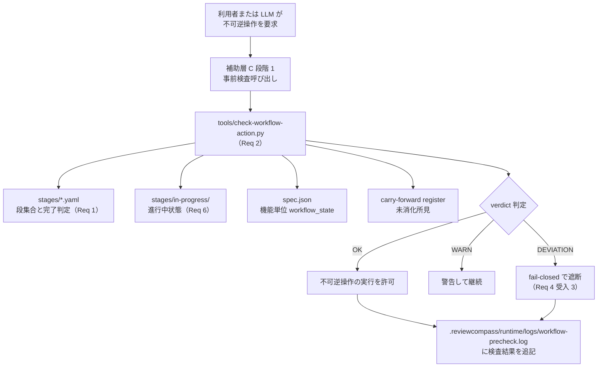

prompt_id: gemini_review
provider: gemini-api
model_id: gemini-3.1-pro-preview

# Task
Review the target document for the requested phase and criteria.

# Phase
design

# Criteria
### 背景と目的

このレビューは ReviewCompass プロジェクトの `workflow-management` 機能における design フェーズの `review-wave`（全機能横断のまとめレビュー）である。

今回の変更（MWP-0）は `next --json` コマンドの応答フィールド `kind` の値域を旧14値から7値へ整理し、コミット操作前確認用の3値を `commit-preflight` サブコマンドへ移動したことである。この変更に対応して `design.md` の §5.2・§5.3・§5.4 が追記・修正された。

`triad-review`（3役レビュー）は完了しており、所見6件の対処が済んでいる。今回の `review-wave` では、対処後の設計が上流の要件の意図・責務境界・受入条件・禁止事項を欠落・弱体化・逸脱・未根拠追加なく引き継いでいるかを独立した視点で確認する。

---

### 上流要件（requirements.md 抜粋）

**Requirement 2 受入 11（`next_action_response.schema.json` の定義）の要点**

- 最上位の必須フィールド：`verdict`・`exit_code`・`next_action`・`reasons`・`current_state` の5つ
- `verdict` は最上位にのみ置き `next_action` 内には含めない
- `next_action` の最低限の必須フィールド（10個）：`kind`・`required_action`・`active_gate`・`feature`・`phase`・`stage`・`required_feature_scope`・`blocked_by`・`future_gates`・`state_refs`
- `action_parameters` は `run_maintenance` のみを対象とする条件付き必須フィールド（6サブフィールド必須）
- `feature` の取り得る値：単一機能名・`"all_features"`・null の3種のみ
- 進行中の作業単位がない場合、`feature`・`phase`・`stage`・`active_gate` はすべて null
- `required_action` の値ごとのフィールド制約（受入 11(6)）：
  - ① `commit_stop_point` 時：`active_gate=null`・`phase=null`・`stage=null`・`blocked_by.type="commit_stop_point"`
  - ② `run_reopen_pending_gate` 時：`active_gate` 非 null・`phase`/`stage` は `active_gate` と一致・`blocked_by=null`
  - ③ `run_reopen_drafting` 時：`active_gate` は `stages/<phase>.yaml#drafting` 形式
  - ④ `repair_workflow_state` 時：`active_gate=null`・`phase=null`・`stage=null`・`repair_reasons` 非空
  - ⑤ `wait_for_human_decision` 時：`blocked_by.type` で停止理由を区別
  - ⑥ `run_maintenance` 時：`action_parameters` に6サブフィールドを含める

**Requirement 2 受入 12（`kind` 値域の限定）**

`commit_candidate`・`commit_mixing_risk`・`commit_unit_stale` の3種類の判定を `next --json` の `kind` から除外し、`commit-preflight` サブコマンドの出力にのみ含める。

これらは「作業の現在地カテゴリ」ではなく「コミット操作の前確認」であるため。

`next --json` の `kind` は作業の現在地を示す7種類に限定する：
`completed` / `in_progress` / `blocking_in_progress` / `verification_pending` / `reopen_in_progress` / `feature_definition_required` / `unknown`

---

### 審査対象（design.md §5.2〜§5.4 の本文）

**§5.2 `kind` フィールドの値域**

`kind` は `next_action_response.schema.json` 内にインライン `enum` として定義する（`kind` は `next_action_response` 内でのみ参照されるため別ファイル化しない）。

2026-06-26 MWP-0 反映：旧14値を7値へ整理した。旧値との対応は `docs/notes/2026-06-26-next-json-kind-redesign.md` の新旧対照表を正本とする。

| 優先順位 | 値 | 意味 |
|---:|---|---|
| 1 | `reopen_in_progress` | 再開手続き中（サブステップは詳細フィールドで返す） |
| 2 | `blocking_in_progress` | 本線とは別の作業中（maintenance / side track / resume を統合） |
| 3 | `verification_pending` | 書き込み後の検証（post-write verification）待ち |
| 4 | `in_progress` | 通常の作業中（stage / cross_feature_stage / upstream_recheck / commit_stop_point を統合） |
| 5 | `feature_definition_required` | プロジェクト立ち上げ時の初期設定未完了（特殊ケース・verdict: OK） |
| 6 | `completed` | 全作業完了 |
| 7 | `unknown` | 想定外のエラー状態（ファイル破損・整合違反など・verdict: DEVIATION） |

値の追加・変更はこの表と `next_action_response.schema.json` の `enum` 修正で完結する。

**§5.3 `kind` 詳細フィールド設計（MWP-0 反映）**

全 kind 共通フィールド：`kind`（現在地のカテゴリ7値）・`required_action`（次にすべき操作）・`reason`（状態の説明）

`in_progress` の追加フィールド：旧 stage / cross_feature_stage / upstream_recheck / commit_stop_point の4種類を統合する。ただし commit_stop_point を統合する場合、受入 11(6) の制約に従い `stage` の値は null になる（`stage: "commit_stop_point"` という文字列値は取らない）。

| フィールド | 説明 |
|-----------|------|
| `feature` | 対象機能名（cross_feature_stage 相当は `"all_features"` 固定、commit_stop_point 時は null） |
| `phase` | 現在のフェーズ（commit_stop_point 時は null） |
| `stage` | 現在のステージ（commit_stop_point 時は null・受入 11(6) 参照） |
| `upstream_phase` | 上流フェーズ名（upstream_recheck 相当の場合のみ） |

`blocking_in_progress` の追加フィールド：`blocking_phase` サブフィールドで段階を区別（`required` / `in_progress` / `return_pending` の3値）

廃止フィールドと理由：`resuming`（`blocking_phase: in_progress` に統合・この時 `unit_id`/`parent_unit_id` は null を許容）/ `completion_conditions`（`return_conditions` に統一）/ `action_parameters`（他フィールドの重複コピー）/ その他。

注：廃止する `action_parameters` は `blocking_in_progress` 詳細フィールドとしての `action_parameters` であり、`next_action` 直下の条件付き必須フィールド（`required_action = "run_maintenance"` のとき必須・受入 11(2)）とは配置レベルが異なる別物である。後者は廃止しない。

`verification_pending` の追加フィールド：`verification_type` サブフィールドで種類を区別（`pending` / `policy_violation` / `human_decision_required` の3値）

`reopen_in_progress` の廃止フィールド：`next_drafting_gate`（`active_gate` で代替）/ 旧 reopen 独自の意味での `feature`（`required_feature_scope` で代替。`next_action` の必須フィールドとしての `feature` は別物であり存続する）/ `direct_features` / `indirect_features` / `feature_impact_scope_basis`

**§5.4 `commit-preflight` サブコマンドの kind 設計（MWP-0 反映）**

2026-06-26 MWP-0 の受入 12 により、次の3種類の判定を `next --json` の `kind` から除外し `commit-preflight` サブコマンドの出力にのみ含める。

| `kind` | 意味 |
|--------|------|
| `commit_candidate` | コミット可能状態 |
| `commit_mixing_risk` | 異なる作業単位が混在したコミット |
| `commit_unit_stale` | コミット単位の情報が古い |

これら3値は「コミット操作の前確認」であり「作業の現在地」ではない。`commit-preflight` は既存のコミット手前の必須確認手順（手順：commit-preflight → git add → guarded commit）として確立されており、これらを `commit-preflight` に集約することで `next --json` の `kind` 値域を「作業の現在地カテゴリ」に限定できる。

`commit-preflight` サブコマンドが返す `kind` の値域はこの3値とし、`next --json` は `commit_candidate` / `commit_mixing_risk` / `commit_unit_stale` を返さない。

---

### `triad-review` で修正済みの所見（参考）

1. §5.2 フィールド型定義表の `kind` 行に「14値」という旧記述が残存 → 「7値インライン定義」に修正済み
2. `commit_stop_point` 時に `stage: "commit_stop_point"`（文字列値）としていたが受入 11(6)① と矛盾 → `stage=null` に修正済み
3. `blocking_in_progress` 廃止フィールドの `action_parameters` が受入 11(2) の必須フィールドと混同されていた → 配置レベルが別物である旨の注記を追記済み
4. operation preflight の参照一覧に廃止予定フィールドが廃止注記なく残存 → 廃止予定コメントを追記済み
5. `reopen_in_progress` の `feature` 廃止が `next_action` の必須フィールドとしての `feature` と混同されていた → 別物である旨の注記を追記済み
6. `resuming` 統合時に `unit_id`/`parent_unit_id` が null を許容することが表から読み取れなかった → 注記を追記済み

---

### レビューの問い

上記の要件（Req 2 受入 11・受入 12）と、設計（§5.2・§5.3・§5.4）を独立して比較し、以下を分析してください。

**主問：** 上流要件の目的・責務境界・受入条件・禁止事項が、`triad-review` 対処後の §5.2〜§5.4 に欠落・弱体化・逸脱・未根拠追加なく引き継がれているか。

具体的に確認してほしい観点（ただし、これ以外の問題を発見した場合も報告してください）：

1. §5.2 の7値リストが受入 12 の7値リスト（`completed` / `in_progress` / `blocking_in_progress` / `verification_pending` / `reopen_in_progress` / `feature_definition_required` / `unknown`）と完全に一致しているか
2. §5.4 の commit-preflight への3値移動が、受入 12 の「コミット操作の前確認は next --json の kind から除外する」意図を正確に実現しているか
3. §5.3 の `in_progress` における `commit_stop_point` 時の `stage=null` 設計が、受入 11(6)① の制約と整合しているか（`docs/notes` の `stage: commit_stop_point` 記述との関係を含む）
4. §5.3 の `action_parameters` 廃止注記が、受入 11(2)（`run_maintenance` 時の `action_parameters` 条件付き必須）を弱体化していないか

所見は重大度（must-fix / should-fix / consider）と対象節（§5.2 / §5.3 / §5.4）を明示してください。


# Output contract
Return YAML only.
The response must include the top-level key findings.
Additional top-level keys are allowed only when the criteria explicitly defines them.
Do not add wrapper keys such as review, result, metadata, or summary.
Do not wrap the YAML in Markdown code fences.
Do not write prose before or after the YAML.

Each finding must include these keys:
- severity
- target_location
- description
- rationale

Use only these severity values:
- CRITICAL
- ERROR
- WARN
- INFO

If there are no findings and the criteria does not define additional top-level keys, return exactly:

findings: []

Valid shape example:

findings:
  - severity: WARN
    target_location: "path or section"
    description: "Plain finding summary"
    rationale: "Why this matters"

# Prior findings
なし

# Target path
.reviewcompass/specs/workflow-management/design.md

# Target document
# Design Document：workflow-management

最終更新：2026-06-19（Req 13〜16 統合設計メモ反映、reopen R-0 design drafting）

## 概要（Overview）

`workflow-management` は ReviewCompass における所定手続きの定義と機械強制を担う機能の **設計層** である。

要件文書（requirements.md）は 16 件の Requirement で、段集合の静的列挙、軽量版検査スクリプト、起草者と判定者の分離、不可逆操作の直前ゲート、reopen 機械強制、session 跨ぎ状態管理、多層防御の第 1 層位置付け、機能依存マップの一元化、既存システムへの後追い intent 追加時の下流再展開、review-wave 横断確認の要約、重要決定の出典検査、operation registry / preflight、operation contract 語彙、承認ゲート・側道スタック・状態スナップショット、構造化有効プロンプト、段階的実装計画を求めている。本設計は計画書 §5.4〜§5.8（軽量化方針、所定手続きの階層構造、reopen 機械強制、session 跨ぎ状態管理、多層防御）を実装可能な形に落とし込み、先行プロジェクト `dual-reviewer-implementation-governance` の素材設計（466 行、節ハッシュ・独立再導出パーサ・supersedes リンク・通過マーカーの後続確認等を含む大規模機構）から **思想は継承、実装は 1／10** を目標として再設計する。

本設計の所有物は **手続きの段集合定義・検査スクリプト・直前ゲート・reopen 機械強制・session 跨ぎ状態管理・後追い intent 下流再展開・review-wave 要約・重要決定の出典検査・operation registry / preflight・operation contract・承認ゲート／側道スタック／状態スナップショット・構造化有効プロンプト・段階的実装計画** の 13 モデルである。レビューロジック（3 役・観点・所見分類）は `foundation` と `evaluation` が所有し、本機能は所定手続きの「どの段がいつ完了するか」「どの不可逆操作の前にどの検査を走らせるか」「既存システムに後から intent を入れたときにどの下流段を reopen するか」「操作開始前に何を確認して止めるか」「選択層の action を実行層の contract にどう接続するか」を担う。

## 目標（Goals）

- 所定手続きの段集合を機械可読な YAML（構造化テキスト形式）として静的に列挙し、Markdown 節からの動的解析を行わない
- 検査スクリプトの完了判定を「証跡ファイル存在＋必須節充足」のみに絞り、中身の妥当性判定を含めない（第 1 層の限界として明示）
- 起草者と判定者の分離をレビュー記録の冒頭メタデータ（front-matter、文書頭の構造化メタ情報）で機械検査可能にする
- 不可逆操作（spec.json 承認書き込み、コミット、プッシュ、フェーズ移行）の直前のみに機械ゲートを置き、それ以外には機械検査を強制しない（最小集合方針）
- 結論不能（証跡ファイルが解析不能、YAML が壊れている等）の場合に合格判定を出さず、必ず遮断する（fail-closed、検査結果が出せないときは止める方針）
- reopen 手続きの連鎖再実施を手戻り種別から機械的に決定し、`actor=human` の段（intent.yaml#approval 等）に到達した時点で必ず作業を停止する
- 機能間の処理順と依存関係を 1 ファイル（`stages/feature-dependency.yaml`）に一元化し、追加・削除を 1 箇所修正で完結させる
- 既存システムへ intent を後から追加した場合、既存 feature が受け皿になるか、新規 feature が必要かを記録し、該当 feature の requirements／design／tasks／implementation を上流から順に再展開する
- operation registry / preflight により、review-run、post-write verification、triage、reopen、commit approval、session-record、deployment / export などの操作を、記憶や前例ではなく正本 operation contract から開始できるようにする
- `next --json` の reopen 状態を一意に読み取れるようにし、reopen scope と impact review scope、flag policy、pending gate の混同を作業開始前に検出する
- `required_action` 19語彙を operation contract に対応させ、`effect_kind`、承認要否、phase boundary、sequence、preconditions / postconditions を機械可読にする
- 承認ゲートを判断記録と対象 operation の承認から分離し、side track を stack frame として管理し、`next --json` 由来の状態スナップショットを監査補助として出力できるようにする
- 有効プロンプトを言語タスク仕様として構造化し、機械タスクは operation contract / preflight / runner / guard に寄せる
- Phase 0〜6 の実装順序を固定し、選択層、registry、preflight、構造化 prompt、機械ブロック、LLM judge 監査を混在させず TDD で進める

## 範囲外（Non-Goals）

- 各機能の業務ロジック修正（`runtime`／`evaluation`／`self-improvement`／`analysis`／`conformance-evaluation` の挙動変更は本機能の責務外）
- レビュー所見の妥当性判定（中身の質的評価は本機能の検査範囲外、利用者監査の第 3 層に委ねる）
- 節ハッシュ・supersedes リンク・grandfathering・format-migration・独立再導出パーサ（§5.4 で削除確定、素材から継承しない）
- 通過マーカーの後続確認（§5.4 で削除確定、二次防御は多層防御の第 2 層以降の宿題）
- 外部 CI・GitHub Actions・PR 運用ルール
- 人間レビュアーの組織割り当て方針
- 規律ファイル自体の起案・改廃方針（`self-improvement` の責務、本機能は所定手続きの入力として規律変更提案を受け取るのみ）
- 機械ゲートを git フックとして外部強制する仕組み（第 2 層、フェーズ 4 以降の宿題）

## 設計の前提（Design Drivers）

- 100% の規律遵守は原理的に不可能であり、複数層を重ねて実効遵守率を引き上げる方針（計画書 §5.8）
- LLM は文脈圧力下で規律ファイルの優先度を下げる失敗モードを起こす（§5.8 第 1 層の限界、補助層 C で事前検査を別途設計）
- 検査を呼ばない・結果を読まない・独断で進める経路は第 1 層の上にあるため、第 1 層単独では解決しない（多層防御の前提）
- 起草と判定を同一の actor が兼ねると自己承認の空洞化が起きる（§5.4 規律）
- 機能の追加・削除を 1 箇所修正で完結させないと、整合漏れが累積する（§5.5 選択肢 X の根拠）
- session 跨ぎの最大の盲点は「複数段にまたがる手続きの途中状態」であり、状態ベース検査だけでは捉えられない（§5.7 由来）

## 全体構造（Architecture）

本機能は repo 内に **段集合 YAML 9 ファイル ＋ 検査スクリプト 1 本 ＋ 進行中状態ファイル群** を持つ。実体は次の 3 層構造を取る。

```
リポジトリ内配置（実体）
├── stages/                              # 段集合 YAML の保管先（Req 1）
│   ├── intent.yaml                      # intent 層（drafting／review／approval の 3 段）
│   ├── feature-partitioning.yaml        # 機能分離（candidate-proposal／approval の 2 段）
│   ├── feature-dependency.yaml          # 機能依存マップ（Req 8、所有者は本機能）
│   ├── requirements.yaml                # 要件フェーズ（5 段、feature-dependency 参照）
│   ├── design.yaml                      # 設計フェーズ（5 段、同上）
│   ├── tasks.yaml                       # タスクフェーズ（5 段、同上）
│   ├── implementation.yaml              # 実装フェーズ（5 段、同上）
│   ├── reopen-procedure.yaml            # reopen 手続き（4 過程構成、trigger_map 含む）
│   ├── cross-spec-alignment.yaml        # 機能横断整合（段集合は別途確定）
│   ├── in-progress.schema.json          # 進行中状態ファイルのスキーマ（T-008、命名を in-progress/ に統一、F-018 対処 2026-05-28）
│   ├── in-progress/                     # 進行中状態ファイル（Req 6、session 跨ぎ用）
│   └── completed/                       # 完了済み手続きの記録
├── tools/check-workflow-action.py       # 検査スクリプト本体（Req 2、補助層 C 段階 2）
├── .reviewcompass/schema/               # ワークフロー管理スキーマ定義（Req 2 受入 10・11）
│   ├── required_action.schema.json      # required_action 19語彙スキーマ（Req 2 受入 10）
│   ├── next_action_response.schema.json # next --json 応答スキーマ（Req 2 受入 11）
│   ├── effect_kind.schema.json          # operation contract 副作用語彙（Req 13）
│   ├── phase_boundary.schema.json       # phase boundary 語彙（Req 13）
│   ├── operation_contract.schema.json   # operation contract 共通構造（Req 13）
│   ├── workflow_state_snapshot.schema.json # 状態スナップショット（Req 14）
│   └── language_task_io.schema.json     # 構造化有効プロンプトの言語タスク入出力（Req 15）
├── stages/operation-registry.yaml        # operation registry / preflight binding（Req 12・13）
├── stages/operation-contracts.yaml       # operation contract 正本（Req 13）
├── .reviewcompass/runtime/logs/workflow-precheck.log  # 検査結果のログ書き出し先（Req 2 受入 5 補強。旧 docs/logs/ からの変更は 2026-06-12 配置規約 PLC-DEC-004〜005・009〜011 反映。凍結・読み取り互換は §実行時生成物の凍結期（P3 まで）の扱いを正本とする）
├── .reviewcompass/runtime/workflow-state-snapshot.yaml # next --json 由来の可視化補助（Req 14）
├── docs/reviews/reopen-classification-<日付>.md  # reopen 種別判定の根拠（Req 5 受入 5）
├── docs/operations/WORKFLOW_MANAGEMENT.md        # アプリ側規約（T-001 で配置、F-019 対処 2026-05-28）
├── docs/operations/WORKFLOW_PRECHECK.md          # ワークフロー事前検査の運用契約
└── docs/operations/WORKFLOW_PRECHECK_DETAILS.md  # ワークフロー事前検査の詳細仕様
```

実行時のデータの流れ：



検査スクリプトは段集合 YAML、進行中状態ファイル、spec.json、持ち越し所見レジスタの 4 つを入力として読み、verdict（判定結果）を返す。verdict には OK／WARN／DEVIATION の 3 値を使う（actor=human の段で承認待ちのときは DEVIATION で止め、警告のみで継続できる軽微な未整合は WARN とする）。`docs/operations/WORKFLOW_PRECHECK.md`、`docs/operations/WORKFLOW_PRECHECK_DETAILS.md`、`tools/check-workflow-action.py` は軽量版 precheck の実行入口・表示形式・実装上の引数契約を担う。`required_action` 語彙、operation contract field、effect / approval / phase / output contract semantics の正本ではない。これらの正本は `.reviewcompass/schema/required_action.schema.json`、`.reviewcompass/schema/operation_contract.schema.json`、`stages/operation-contracts.yaml`、および Requirement 13 の contract 境界に従う。

### 実行時生成物の凍結期（P3 まで）の扱い（2026-06-12 配置規約 P1）

本機能の実行時生成物 3 パス（検査ログ `.reviewcompass/runtime/logs/workflow-precheck.log`〔旧 `docs/logs/workflow-precheck.log`〕、effective prompt `.reviewcompass/runtime/effective-prompts/`〔旧 `.reviewcompass/effective-prompts/`〕、commit 承認記録 `.reviewcompass/runtime/approvals/commit-approval.json`〔旧 `.reviewcompass/approvals/commit-approval.json`〕）の凍結期共通契約を本節の正本とする：

- **書き込みは常に新配置**。旧配置への新規書き込みは行わない（凍結契約）
- **既存分は旧置き場で凍結**する（移動・上書き・追記をしない）。凍結の効力発生は P1 実装反映コミット（書き込み先切替）と同時であり、それ以前の旧配置への書き込みは現行実装の正規動作として凍結対象に含まれる
- **旧パス読み取り互換は 3 パスとも P3 まで維持**する（新 → 旧の順）。既存証跡（rounds.yaml 等）が記録する旧 `effective_prompt_path` の参照は凍結された旧配置で解決できる
- **互換の終了は P3 の専用 reopen における本設計の改訂として扱う**（暗黙の終了はない）

### 責務境界の明確化（Boundary Clarification）

本機能が所有するのは **手続きの完了規則と検査スクリプト** であり、各機能の業務 artifact の所有権は持たない。

| 所有関係 | 所有者 | 本機能との関係 |
|---|---|---|
| 段集合 YAML（`stages/*.yaml`） | **workflow-management** | 本機能が単独所有・改廃 |
| 検査スクリプト（`tools/check-workflow-action.py`） | **workflow-management** | 本機能が単独所有・改廃 |
| 機能依存マップ（`stages/feature-dependency.yaml`） | **workflow-management**（Req 8 受入 5） | 他機能は再定義せず参照のみ |
| reopen 種別判定の根拠ファイル | **workflow-management**（Req 5 受入 5） | 他機能は参照のみ |
| 各機能の spec.json（`.reviewcompass/specs/<機能>/spec.json`） | 各機能 | 本機能は読むのみ、書き込みは検査通過後に各機能の起草者が行う |
| レビュー記録（`.reviewcompass/specs/<機能>/reviews/*.md`） | 各機能 | 本機能は front-matter の構造のみ検査（Req 3 受入 4） |
| レビュー所見の妥当性 | `evaluation`／利用者監査の第 3 層 | 本機能の検査範囲外（Req 2 受入 3、Req 7 受入 1） |
| 語彙正本（本機能が参照するのは `review_mode` のみ。所見系・状態軸系は責務外で不参照） | `foundation` | 本機能は再定義せず参照のみ（要件 Boundary Context 隣接期待。A-003 対処 2026-05-28） |
| 規律ファイル本体（`docs/disciplines/discipline_*.md`、12 件配置済み） | **workflow-management**（実体書き換え、A-007 案 2） | `self-improvement` から変更提案を受け取り、所定手続き経由で実体変更。本機能の検査スクリプトと段階 3 フックの対象に含まれる |
| 規律ファイルの提案権 | `self-improvement` | 本機能は提案を所定手続きの入力として受け取る |
| 規律ファイルの memory 側索引（`~/.claude/projects/.../memory/feedback_*.md`、12 件） | Claude Code auto memory 機構（製品機能） | 本機能の管理対象外。短い参照索引のみ保持し、本体は `docs/disciplines/` を Read で参照する設計（A-007 対処、2026-05-25 セッション 26 移管） |

**規律ファイルの所有先確定の経緯（A-007 対処、2026-05-25 セッション 26 利用者明示承認）**：本機能の所定手続きが規律変更を扱うには、規律ファイル本体がリポジトリ内（git 追跡対象）に存在する必要がある。素材設計時点では本体が memory（リポジトリ外、Claude Code auto memory 機構の領域）に置かれていたため、本機能の機械検査が効かない構造的問題があった。本セッション 26 で **軽量手続き** により次を実施し本問題を解消：

- active 必読 11 件（feedback_must_fix_discussion_obligation／intent_conformance_is_the_acceptance_gate／standing_directives_are_hard_constraints／workflow_precheck_invocation／approval_operation／facts_vs_interpretation／pre_action_precheck／workflow_state_truth_source／concise_complete_report／reopen_procedure_for_settled_topics／plain_japanese）と参照層 5 件（feedback_dominant_dominated_options／feedback_choice_presentation／feedback_no_redundant_workflow_questions／feedback_plain_explanation_each_step／feedback_implementation_autonomy）の合計 **16 件** の本体を `docs/disciplines/discipline_*.md` にフラット配置で移管（コミット b830785 で active 必読 12 件＋参照層 5 件＝17 件として移管後、セッション 26 で利用者明示承認に基づき `no-unilateral-action` 規律 1 件を撤去、合計 16 件に減）。さらに memory 側の `feedback_*.md` 16 件はシンボリックリンクで repo 本体を指す構成に変更（2026-05-25 セッション 26、利用者明示承認「試してみる」）。当初は auto memory 機構がセッション起動時にリンクをたどって規律本体を完全に auto load する想定だったが、**2026-05-25 セッション 27 の検証で否定された**：auto memory の起動時 load 対象は `MEMORY.md` の索引（1 文要約）までで、シンボリックリンク経由でも本体はたどられない。**fallback 案イを採用**（利用者明示承認「推奨案」、2026-05-25 セッション 27）：シンボリックリンク 16 件は単一正本（repo）維持の補助機構として残置、TODO §1 起動手順に「規律本体 11 件を Read で読む」ステップを追加、active 必読 11 件は毎セッション開始時に Read で明示的に読み込む運用に切り替え。
- memory 側は短い参照索引（移管先パスと改廃ルールへのリンクのみ）に置換、`MEMORY.md` 索引ファイルにも移管反映
- archive 14 件（`memory/archive/2026-05-25-consolidation/`）のみ memory 側に残存（過去履歴の保全）
- 移管後の整理として、front-matter の memory 機構固有メタ（`node_type: memory`／`originSessionId`）を全 17 件から削除、`plain_japanese` ／参照層 5 件の旧形式を統一形式に正規化、旧名リンク（`[[feedback-implementation-autonomy]]` 等）を新名に修正、`docs/disciplines/README.md` を新設して内部リンク `[[link-name]]` の解決規則と全 17 件のインデックスを明記
- 計画書 §5.21（規律ファイルの ReviewCompass 方針への取り入れ手順）を前倒し実施した位置付け

`self-improvement` との権限分散（A-007 案 2、2026-05-23 利用者承認）：規律ファイルの **提案権** は `self-improvement` が持ち、**実体変更権** は本機能が所定手続き（drafting → review → approval）経由で実施する。本機能は規律変更を Req 4 受入 1 の不可逆操作の対象として扱い、`self-improvement` が直接ファイル書き換えを行うことはない。

## 段集合の静的列挙モデル（Stage Set Static Enumeration Model）— Req 1

### 1. 9 ファイル体制（計画書 §5.5）

段集合は次の 9 ファイルに静的列挙する。Markdown 節からの動的解析は行わない（Req 1 受入 1）。

| ファイル | 段集合 | actor 構成 |
|---|---|---|
| `stages/intent.yaml` | drafting／review／approval の 3 段 | human／llm／human |
| `stages/feature-partitioning.yaml` | candidate-proposal／approval の 2 段 | llm／human |
| `stages/feature-dependency.yaml` | 段集合なし（機能依存マップ本体、Req 8） | — |
| `stages/requirements.yaml` | drafting／triad-review／review-wave／alignment／approval の 5 段 | llm／llm／llm／llm／human |
| `stages/design.yaml` | 同上 | 同上 |
| `stages/tasks.yaml` | 同上 | 同上 |
| `stages/implementation.yaml` | 同上 | 同上 |
| `stages/reopen-procedure.yaml` | 4 過程構成（§reopen 機械強制モデル §5）、第3過程で trigger_map 参照 | llm／human 混合 |
| `stages/cross-spec-alignment.yaml` | 段集合は別途確定（フェーズ 2 以降） | — |

各 YAML 段は最低限、段名／`actor`／期待する証跡ファイルのパスパターン／必須節名のリスト／完了判定方式を含む（Req 1 受入 3）。

### 2. 段定義の構造例

`stages/requirements.yaml` の段定義例：

```yaml
process_id: requirements
description: 要件フェーズの所定手続き（drafting → triad-review → review-wave → alignment → approval の 5 段）
feature_order: feature-dependency.yaml#feature_order   # Req 8 受入 3、Req 1 受入 4

stages:
  - name: drafting
    actor: llm                                      # 起草、主に LLM
    artifact_paths:
      - .reviewcompass/specs/{feature}/requirements.md
    required_sections:
      - Introduction
      - Boundary Context
      - Requirements
      - Change Intent
    completion_predicate: artifact_exists_and_sections_present
    description: 起草者と判定者の分離規律により、起草段は判定段と別 actor で実施する

  - name: triad-review
    actor: llm
    artifact_paths:
      - .reviewcompass/specs/{feature}/reviews/*-requirements-triad-review.md
    required_sections:
      - 主役レビュー
      - 敵対役レビュー
      - 判定役レビュー
      - 統合
    completion_predicate: artifact_exists_and_sections_present_and_author_reviewer_distinct
    front_matter_required:
      - author.identity
      - reviewer.identity
      - reviewer.separation_from_author
    description: 3 役レビュー、起草者と判定者の異名を front-matter で必須化

  - name: review-wave
    actor: llm
    feature_order_required: true                    # 全機能の drafting＋triad-review 完了後に開始
    artifact_paths:
      - docs/reviews/{phase}-review-wave-{日付}.md
    completion_predicate: all_features_drafting_and_triad_review_completed
    description: 機能横断の波及所見の集約消化

  - name: alignment
    actor: llm                                      # LLM 自動判定
    completion_predicate: cross_spec_alignment_passed
    description: フェーズ終端の機能横断整合確認（LLM 自動判定）

  - name: approval
    actor: human                                    # phase / gate completion は human-only
    actor_allowed:
      - human
    completion_predicate: explicit_human_approval_recorded
    description: 不可逆操作（フェーズ移行）の直前ゲート。proxy_model は承認主体を代行しない
```

### review-run 後の proxy_model 判断代行モデル

review-run 後の重要件判断は、approval 段の承認ではなく、triad-review 段内の修正方針決定に限って proxy_model が代行できる。対象は API 経由 review-run の `must-fix`、`should-fix`、`ERROR`、`CRITICAL`、または同根所見クラスタである。

責務分担：

- メインセッション LLM：raw response を読み、モデル別要約、同根所見集約、三段階トリアージ下書き、候補案、推薦案、proxy_model への判断材料を作る
- proxy_model：重要件ごと、または同根所見クラスタごとに、採用案、判断理由、棄却案理由、最終ラベルを決定する
- 機械ガード：proxy decision の存在、raw response の存在、候補案の存在、採用案と最終ラベルの整合、未判断件数 0 を確認する
- メインセッション LLM：機械ガード通過後、採用された修正だけを TDD で実装する
- 利用者：コミット、プッシュ、spec.json 更新、フェーズ移行、規律変更、大方針変更を承認する

証跡構造：

```text
.reviewcompass/specs/<feature>/reviews/<review-run-id>/
  raw/
  parsed/
  triage.yaml
  model-result-summary.yaml
  review_summary.md
  proxy-adjudication-prompt.md     # proxy への判断材料（既定名。実行時に指定可）
  proxy-adjudication-response.txt  # proxy の生応答（既定名。実行時に指定可）
  decisions/
    <suffix>.yaml
  proxy-approval.yaml
```

`decisions/<suffix>.yaml`（重要件ごとの裁定 file。`<suffix>` は finding に対応する `<model>-<role>-<連番>`）は最低限、`finding_id`、`approved_by: proxy_model`、`proxy_model_id`、`selected_option`、`final_label`、`rationale`、`rejected_options`、`raw_response_path` を持つ。`proxy-approval.yaml` は対象 review-run、`approved_finding_ids`、`approved_final_labels`、各 finding の裁定への参照（`proxy_decisions` で `decisions/<suffix>.yaml` を指す）、summary/triage 提示済みフラグを束ねる。proxy approval は所見トリアージ・修正方針判断（`proxy_allowed` 相当の範囲）に限った承認である。`proxy-approval.yaml` 自体は `decision_scope` フィールドを持たず、`proxy_allowed` と human-only の境界は別レコードの approval gate（Requirement 14 の `record_human_decision` が持つ `decision_scope`）が機械判定で enforce する。proxy approval は human-only approval、commit、push、`spec.json` 更新、phase / gate completion、reopen finalize を許可しない。

proxy decision の監査性を保つため、decision は `decision_prompt_path`、`source_raw_paths`、`candidate_options` も持つ。`decision_prompt_path` は proxy_model に渡した prompt 証跡、`source_raw_paths` は元 review raw、`candidate_options` は proxy_model に提示された候補案セットである。機械ガードは、これらの参照先が存在し、`candidate_options` が空でないことを確認する。現行の軽量ガードは、`proxy_model_id` の文字列一致、decision file の `finding_id` 一致、`final_label` 一致、prompt/raw/候補案証跡の存在を検査する。API 署名や暗号学的な生成元証明は将来課題とする。

parallelizable_units：

- proxy_model 判断依頼：同根所見クラスタ単位で並列化可能。同根とは、複数モデルの所見が同じ対象ファイル、同じ出力契約、同じ機械ガード、同じ証跡、または同じ原因に触れているものをいう
- 実装：互いに同じファイルを更新しない実装単位、または入出力契約が独立したタスク単位で並列化可能
- 直列必須：共通スキーマ、共通ビルダー、同一ファイル、同一 manifest、同一 traceability 出力、生成物、共有 helper、推移的契約を触る修正
- 統合時：メインセッション LLM が triage、proxy decision、テスト結果、ファイル差分を再照合する

実装サブ担当 LLM は、原則として別スレッドかつ分離 worktree で扱う。同じ repo での並列実装は原則禁止し、読み取り調査または差分を残さない確認に限定する。メインセッション LLM は、対象 finding、proxy decision、許可ファイル、期待テスト、禁止事項、停止条件を渡し、統合時に差分とテスト結果を検査する。未承認の便乗リファクタ、隣接挙動変更、対象外 cleanup は実施せず、新規判断問題として停止する。

subimplementation_outputs：

- implementation_diff：本線へ取り込み可能なソース、テスト、スキーマ、fixture、必要最小限の docs 差分
- verification_summary：サブ担当が実行したテスト、赤確認、緑確認、未実行理由
- decision_basis：実装不能、停止、新規判断問題、採否判断に影響する失敗ログ
- work_noise：一時メモ、途中ログ、失敗パッチ案、ローカル調査メモ。原則として本線 repo に取り込まない

本線へ戻す標準単位は、パッチ、テスト結果サマリ、未解決事項の 3 点である。メインセッション LLM は `work_noise` を直接取り込まず、必要な場合のみ session record または docs/notes に要約する。判断に影響した失敗試行、失敗パッチ、途中ログは `decision_basis` へ昇格し、メインセッション LLM が要約または該当箇所を保存する。

### テンプレート変数の展開規則（F-006 対処、2026-05-25 セッション 26 利用者明示承認）

段集合 YAML の `artifact_paths` フィールドに登場する 3 種のテンプレート変数（プレースホルダ）の展開元と解決規則を次のとおり確定する：

- **`{feature}`**：機能横断段（`feature_order` を持つ段）では `feature-dependency.yaml#feature_order` から機能名を順に展開する。機能単位段（`feature_order` を持たない段）では当該機能名で固定する
- **`{phase}`**：当該 YAML の `process_id` フィールドから取得する（例：`requirements.yaml` の `process_id: requirements` なら `{phase}` は `requirements` に展開）。`process_id` と YAML ファイル名は段集合 YAML 配置時に同期させる前提とし、両者がずれた場合は `process_id` を正本として優先する
- **`{日付}`**：ファイル名のワイルドカード（`*`）として許容する。検査スクリプトは `glob` で `artifact_paths` パターンに一致する全ファイルを取得し、ファイル名に含まれる日付部分（`YYYY-MM-DD` 形式と仮定）の **辞書順最大** を最新と判定する

ワイルドカード解決時の優先順位を「辞書順最大」（mtime 基準ではなく）にする理由：ファイル名の日付は人手で命名されるため意図が明示される一方、ファイルの更新時刻（mtime）は `git clone` ／ `git checkout` で書き換わるため再現性に劣る。`YYYY-MM-DD` 以外の日付形式が混入した場合、検査スクリプトは結論不能（fail-closed）として DEVIATION を返す。

複数ファイルが存在しても重複定義の禁止ではなく、reopen による複数回生成（同じ段の証跡が日付違いで複数並存）を自然に扱うための設計。

### 3. 機能横断段と機能単位段の区別

- **機能横断段**：`feature_order` を持つ段（review-wave、alignment、approval の 3 段）。`feature_order: feature-dependency.yaml#feature_order` で機能依存マップを参照し、対象機能集合を一元化する（Req 1 受入 4、Req 8 受入 3）
- **機能単位段**：`feature_order` を持たない段（drafting、triad-review の 2 段）。各機能の `spec.json` の `workflow_state.<フェーズ>.<段>` で個別に管理する

機能横断段の機能横断側状態は `stages/<フェーズ>.yaml` の進行記録または別途配置する集約ファイルで保持し、機能単位の状態は各機能の `spec.json` で保持する（計画書 §5.24.8 由来）。

**機能横断段 review-wave の作業内容（2026-05-27 セッション 34 追記、2026-05-28 セッション 35 で 2 回方式に訂正、軽量手続き、Req 1 受入 6 と整合）**：

7 モデル比較実験は **2 回方式** で実施する（2026-05-28 セッション 35 確定、初版の「機能横断段で一括実施、機能ごとに実施しない」記述を訂正）：

- **1 回目（機能ごとの triad-review 段）**：当該機能の機能内 must-fix／should-fix を 7 モデル評価し、機能内対処を triad-review 段で完了させる。前機能の機能内対処未完了に次機能の triad-review が依存しない構造を保つ
- **2 回目（本機能横断段 review-wave）**：全機能の triad-review 完了後、機能横断波及所見と同根所見を 7 モデル評価

機能横断段 review-wave は、機能横断波及所見の集約・対処に加え、次の作業を含む（計画書 §5.5 ／ §5.9.6 と整合）：

- 全機能の triad-review が完了した時点で本段を開始する
- 機能横断波及所見と同根所見を対象に 7 モデル評価（2 回目）を実施
- 7 モデル評価データを全機能横並びで分析し、**同根所見**（異なる機能で同じ性格の所見が独立に発見された組）を grep ／ 集約で識別
- 同根所見ごとに一貫した対処方針を立案、全該当機能の仕様文書（requirements.md ／ design.md ／ tasks.md）に同じ対処を反映
- 個別機能の triad-review で「機能横断段に持ち越し」と判定された所見も本段で一括対処

本作業内容は、セッション 33 利用者発言「あるフィーチャーだけをみてもダメで、全フィーチャーの triad-review を行い、それを 7 つのモデルで評価させたところで、同根の問題をまとめて考える」を受けた構造的対処、およびセッション 35 利用者指摘「機能内対処は triad-review 段で実施しないと、他のフィーチャーの処理に影響する可能性がある」を受けた 2 回方式への訂正。利用者明示承認の出典：「(ニ)」「提案通り」「計画書や仕様・設計にも反映」（2026-05-27 セッション 34）／「2 回に分けて 7 モデルの must-fix+should-fix の対応が必要」「案 イ」「案 ア」（2 回方式への訂正、2026-05-28 セッション 35）。本記述は計画書 §5.23.13 軽量手続き許容の範囲内で追加。

### 4. 段集合の変更運用

段集合の変更は YAML ファイル 1 箇所の修正で完結する（Req 1 受入 5）。Markdown 文書（運営ガイド、計画書）側との整合は人手で取る前提とし、自動同期は行わない（§5.4 受け入れリスク）。段集合の変更そのものを不可逆操作の対象とするかは本フェーズで決めず、第 5 層（処理表面積の抑制）導入時に検討する（先送り論点参照）。

## 軽量版検査スクリプトモデル（Lightweight Check Script Model）— Req 2

### 1. 検査の対象と原則

検査スクリプト `tools/check-workflow-action.py` は Python 実装で（Req 2 受入 1）、次の 4 入力のみを読む：

- 段集合 YAML（`stages/*.yaml`）
- 進行中状態ファイル（`stages/in-progress/*.yaml`）
- 機能単位 spec.json（`.reviewcompass/specs/<機能>/spec.json`）
- 未消化所見（`learning/workflow/carry-forward-register/reviewcompass-import.yaml`）

判定原則：

- **段ごとの完了判定**：YAML に列挙された証跡ファイルがすべて存在し、必須節名がすべて含まれること、それ以外は判定対象としない（Req 2 受入 2）
- **中身の妥当性判定は行わない**：所見の質、表現の適切性、論理的整合性は判定範囲外（Req 2 受入 3、第 1 層の限界として明示）
- **fail-closed の既定**：結論不能（YAML が壊れている、証跡ファイルが解析不能、必須フィールド欠落）の場合は合格判定を出さず、必ず fail を返す（Req 2 受入 4）
- **進行中手続きの警告**：`stages/in-progress/` に何かファイルがあれば「未完了の手続きあり」の警告を出す（Req 2 受入 5）

### 2. サブコマンド構成（`docs/operations/WORKFLOW_PRECHECK.md` と `docs/operations/WORKFLOW_PRECHECK_DETAILS.md` 参照）

| サブコマンド | 入力（必須引数） | 用途 |
|---|---|---|
| `spec-set <feature> <phase> <stage> <new_value>` | 機能名・フェーズ・段・新しい真偽値、`--rationale "<理由>"`（任意、ログ記録用） | `spec.json` の `workflow_state` 変更前の依存検査 |
| `commit` | `--rationale "<理由>"`（**必須**） | `git commit` 直前の検査（spec.json 整合、規律遵守、未消化所見の有無） |
| `push` | `--rationale "<理由>"`（**必須**） | `git push` 直前の検査（コミット履歴整合、リモート状態） |
| `next` | なし、`--json`（任意） | 標準のワークフロー遷移入口。`workflow_state`、`stages/in-progress/`、reopen pending、post-write-verification pending を読み、次作業を返す |

引数仕様の正本は `docs/operations/WORKFLOW_PRECHECK_DETAILS.md` と検査スクリプト本体 `tools/check-workflow-action.py` の argparse 定義。ただし、ここでいう引数仕様は軽量 precheck CLI の呼び出し形式に限る。`required_action` 語彙、operation contract field、preconditions / postconditions、出力・副作用 contract は `.reviewcompass/schema/`、`stages/operation-contracts.yaml`、および Requirement 12〜13 の registry / contract 境界を正本とする。`commit` と `push` の `--rationale` 必須化の理由：両者は不可逆操作で、人による承認の出典をログに残す必要があるため。next サブコマンドは、LLM が次作業を独断で選ばず、同じワークフロー遷移入口から状態を再確認するための読み取り専用入口である。

next サブコマンドは、`workflow_state` が全完了を示す場合でも、上流成果物が下流成果物より新しければ `kind: in_progress`（`upstream_phase` フィールド付き）を返す。旧称 `upstream_recheck`。代表的な伝播は、intent → feature-partitioning、feature-partitioning → requirements、requirements → design、design → tasks、tasks → implementation である。これにより、intent 更新後に requirements へ飛ぶ、requirements 更新後に tasks や implementation へ飛ぶ、tasks 更新後に implementation 再確認を省く、といった手順逸脱を機械的に避ける。

next サブコマンドは、feature 一覧が解決できない場合（`feature-dependency.yaml` 不在または `feature_order` 未定義、対象アプリの初期状態を想定）は `feature_definition_required`（verdict OK）を返して intent／feature-partitioning の実施を案内し、`feature_order` と `depends_on` の整合違反（依存先行違反・循環）は `kind: unknown`／DEVIATION で遮断する（§機能依存マップモデル 7、2026-06-12 反映）。

`docs/operations/WORKFLOW_DISCIPLINE_MAP.yaml` は、判定点ごとに読み込む規律文書と入力資料の機械可読マップである。`default`、`by_kind`、`by_stage` は `next_action.required_disciplines` の元資料を定義し、`required_inputs` は対象 feature 文書、reopen 状態、review-run bundle、carry-forward register などの入力資料を定義する。`next` はこのマップを読み、現在の判定点に対応する `required_disciplines` と `required_inputs` を JSON に含める。判定点ごとの `effective prompt` は、このマップが示す元資料を 1 本へ束ねる生成物であり、マップ自体は複数元資料の正本である。`next` は生成した prompt を `.reviewcompass/runtime/effective-prompts/` に保存し（旧 `.reviewcompass/effective-prompts/` からの変更は 2026-06-12 配置規約 PLC-DEC-004・009〜011 反映。実行時生成物の runtime 区画集約。旧パス読み取り互換は P3 まで維持し、凍結・互換の正本は §実行時生成物の凍結期（P3 まで）の扱い）、`next_action.effective_prompt` に `effective_prompt_path`、`effective_prompt_sha256`、`effective_prompt_loaded` を含める。元資料が読めない場合は `effective_prompt_loaded: false` として `DEVIATION` を返し、通常作業へ進ませない。API review-run では `run_role.py`／`run_review.py` が `rounds.yaml` に `effective_prompt_path` と `effective_prompt_sha256` を記録し、後続の raw response・triage・proxy decision と同じ review-run 証跡として追跡できるようにする。マップにない判定点は、規律読み込み規約が未定義の判定点として扱い、追加時は本マップへ登録する。

### 2. next --json unique action selector

`next --json` は状態要約ではなく、現在実行してよい唯一 action を選ぶ selector である。`required_action` は 1 つだけを返し、`pending_gates` や scope list は予定または補助情報として扱う。

共通フィールドは `kind`、`required_action`、`active_gate`、`feature`、`phase`、`stage`、`blocked_by`、`action_parameters`、`state_refs` とする。active workflow unit があるのは、通常 workflow の `<feature, phase, stage>` または reopen 第3過程の drafting / review gate だけである。この場合だけ `active_gate`、`feature`、`phase`、`stage` を非 null にする。post-write verification、human decision、maintenance、reopen 第1・第2過程、commit stop point、workflow state repair は active workflow unit を持たない action であり、`feature`、`phase`、`stage`、`active_gate` は null にする。対象 feature、対象 phase、対象ファイル、実行コマンドは `action_parameters` または `state_refs` から読む。

selector の優先順位は、workflow state / reopen plan の破損、post-write verification pending、human decision、maintenance / side track top frame、reopen commit stop point、reopen 第1・第2過程、reopen 第3過程 drafting、reopen 第3過程 gate、reopen 第4過程、通常 workflow、completed の順に固定する。maintenance は `required_action=run_maintenance` を返し、maintenance YAML 内の個別名は `maintenance_action` と `action_parameters.maintenance_action` に分離する。reopen では `current_blocker` がある場合に pending gate を active にせず `wait_for_human_decision` を返す。`commit_stop_point: true` がある場合も pending gate を active にせず、`blocked_by.type=commit_stop_point`、`active_gate=null`、`phase=null`、`stage=null` とする。第3過程の pending gate は、blocker と stop point がない場合だけ active gate にできる。

post-write target detection と manifest verification は、`next` と `commit` の双方が参照する実装契約である。post-write-verification 対象の未コミット変更がある場合、`next` は通常 workflow ではなく post-write-verification pending を返す。completed manifest は `target_files` と現在内容の `target_sha256` が一致し、`required_verifiers` の各 verifier が `verifications[]` の単一エントリで全対象ファイルと同じ sha を覆い、`unresolved_substantive_findings` が 0 である場合だけ完了とみなす。

各サブコマンドの戻り値（exit code）：

- `0`：OK（不可逆操作を許可）
- `1`：WARN（警告を出すが継続可、利用者判断で進める）
- `2`：DEVIATION（fail-closed で遮断、不可逆操作を許可しない）

出力形式は人間可読の既定形式と、`--json` 指定時の JSON 形式の 2 種類。出力構造とログ形式は `docs/operations/WORKFLOW_PRECHECK_DETAILS.md` を正本参照する。ただし、この正本性は precheck CLI の表示・ログ出力形式に限り、operation contract の output / side-effect semantics を定義しない。人間可読既定の書式は `[VERDICT] OK ／ WARN ／ DEVIATION（exit N）` のように **大括弧付きラベル形式** で、`[VERDICT]`／`[ACTION]`／`[REASON]`／`[CURRENT STATE]` の 4 ブロックを順に出力する。判定結果はログ（`.reviewcompass/runtime/logs/workflow-precheck.log`、上書き可能＝ログファイル自体の再生成可否を指す。旧配置を対象とする凍結契約〔§実行時生成物の凍結期（P3 まで）の扱い〕とはスコープが異なる）に追記する。

### 3. 完了判定の述語集合（completion_predicate 値域）

段集合 YAML の `completion_predicate` フィールドが取る値の集合：

| 述語名 | 判定内容 |
|---|---|
| `artifact_exists` | 期待する証跡ファイルが存在する |
| `artifact_exists_and_sections_present` | ファイル存在＋必須節名がすべて含まれる |
| `artifact_exists_and_sections_present_and_author_reviewer_distinct` | 上記＋front-matter の `author.identity` と `reviewer.identity` が異名 |
| `all_features_drafting_and_triad_review_completed` | `feature_order` の全機能で drafting＋triad-review が true |
| `cross_spec_alignment_passed` | 機能横断整合の判定が pass、未消化所見が 0 件 |
| `explicit_human_approval_recorded` | 利用者の明示承認が human-only approval record として記録されている。proxy_model decision はこの述語を満たさない |
| `depends_on_resolves_correctly` | `feature-dependency.yaml` の各機能の `depends_on` が単純リスト構造または連想配列構造として解析可能、連想配列構造の場合は値が `hard` または `review` のいずれかであること（A-004 対処、2026-05-25 セッション 26 利用者明示承認） |

述語集合の追加・削除は本機能の責務。新しい述語を導入する場合は、本節と検査スクリプト実装の両方を同時に更新する。

### 4. 第 1 層の限界の明示

検査スクリプトが解決しない失敗モード（計画書 §5.8 由来、Req 7 受入 1）：

- 中身の空疎（必須節は存在するが内容が「特に問題なし」のみ）
- 検査スクリプト自体が呼ばれない経路
- `stages/in-progress/` ファイルの自己申告性（嘘・古い・欠落の余地）
- 文脈圧力下での規律ファイル優先度低下

これらは hook 連携や人の確認で補完する。本機能はワークフロー事前検査の限界を運用文書（`docs/operations/WORKFLOW_PRECHECK.md`）に明示し、人の期待値を整える（Req 7 受入 4）。

### 5. スキーマ定義（Phase 1 最小スキーマ、Req 2 受入 10・11）

本節は `next --json` の語彙と応答形式を機械検証可能な JSON Schema として定義する。2 ファイルを `.reviewcompass/schema/` 配下に置く。スキーマ形式はいずれも JSON Schema Draft 2020-12 を使う。実装コードはこの 2 ファイルを語彙と応答構造の正本として参照し、コード内に語彙を直書きしない。

#### 5.1 required_action.schema.json（Req 2 受入 10）

`required_action` の取り得る値を列挙する語彙ファイル。

- **`$schema`**：`https://json-schema.org/draft/2020-12/schema`
- **`$id`**：`urn:reviewcompass:schema:required_action`
- **`type`**：`string`
- **`enum`**：D-003 §6 の優先順位順に 19 値を列挙する（この順が正本）

| 優先順位 | 値 |
|---:|---|
| 1 | `repair_workflow_state` |
| 2 | `run_post_write_verification` |
| 3 | `wait_for_human_decision` |
| 4 | `record_human_decision` |
| 5 | `run_maintenance` |
| 6 | `advance_reopen_after_commit_stop_point` |
| 7 | `commit_stop_point` |
| 8 | `draft_reopen_plan_candidates` |
| 9 | `apply_approved_reopen_plan` |
| 10 | `advance_reopen_after_approval_stop_point` |
| 11 | `repair_canonical_documents` |
| 12 | `run_reopen_drafting` |
| 13 | `run_reopen_pending_gate` |
| 14 | `collect_required_decisions` |
| 15 | `finalize_reopen` |
| 16 | `draft_reopen_classification` |
| 17 | `run_reopen_start` |
| 18 | `run_workflow_stage` |
| 19 | `completed` |

語彙の追加・変更はこのファイルの `enum` 修正で完結する。

#### 5.2 next_action_response.schema.json（Req 2 受入 11）

`next --json` の目標応答スキーマ。

**最上位構造の設計確定事項**

- **`$schema`**：`https://json-schema.org/draft/2020-12/schema`
- **`$id`**：`urn:reviewcompass:schema:next_action_response`
- **`type`**：`object`
- **必須フィールド（5つ）**：`verdict`（文字列）・`exit_code`（整数）・`next_action`（オブジェクト）・`reasons`（配列）・`current_state`（オブジェクト）
- **`additionalProperties`**：最上位は指定しない（**前向き拡張用**：将来の実装で新フィールドを追加してもスキーマ改訂なしに対応できるよう、段階的拡張を妨げない。スキーマファイルの `$comment` に意図を記録する）

**`next_action` オブジェクトの設計確定事項**

- **`type`**：`object`
- **必須フィールド（10つ）**：`kind`・`required_action`・`active_gate`・`feature`・`phase`・`stage`・`required_feature_scope`・`blocked_by`・`future_gates`・`state_refs`
- **`additionalProperties`**：指定しない（**後ろ向き互換用**：旧バージョンのツールが出力する `pending_gates`・`next_pending_gate` 等を許容するため。最上位の「前向き拡張」とは目的が異なる。スキーマファイルの `$comment` に意図を記録する）
- **`properties: { "verdict": false }`**：`verdict` フィールドを `next_action` 内で明示禁止する（受入 11：`verdict` は最上位にのみ存在し `next_action` 内には含めない。`additionalProperties` を開放したまま特定フィールドのみを禁止できる最も局所的な方法）

**`next_action` フィールド型定義**

| フィールド | 型 |
|---|---|
| `kind` | string enum（7値インライン定義、下記 §5.2 値域表参照・MWP-0 反映） |
| `required_action` | `$ref: "urn:reviewcompass:schema:required_action"`（19語彙に限定。絶対 URN 参照により基底 URI 解決不要） |
| `active_gate` | string または null（作業単位がない場合は null） |
| `feature` | string または null（単一機能名・`"all_features"`・null の 3 種） |
| `phase` | string または null |
| `stage` | string または null |
| `required_feature_scope` | array of string |
| `blocked_by` | object または null |
| `future_gates` | array |
| `state_refs` | object |

**`kind` フィールドの値域**

`kind` は `next_action_response.schema.json` 内にインライン `enum` として定義する（`required_action` とは異なり別ファイル化しない。`kind` は `next_action_response` 内でのみ参照されるため）。

2026-06-26 MWP-0 反映：旧 14 値を 7 値へ整理した。旧値との対応は `docs/notes/2026-06-26-next-json-kind-redesign.md` の新旧対照表を正本とする。

| 優先順位 | 値 | 意味 |
|---:|---|---|
| 1 | `reopen_in_progress` | 再開手続き中（サブステップは詳細フィールドで返す） |
| 2 | `blocking_in_progress` | 本線とは別の作業中（maintenance / side track / resume を統合） |
| 3 | `verification_pending` | 書き込み後の検証（post-write verification）待ち |
| 4 | `in_progress` | 通常の作業中（stage / cross_feature_stage / upstream_recheck / commit_stop_point を統合） |
| 5 | `feature_definition_required` | プロジェクト立ち上げ時の初期設定未完了（特殊ケース・verdict: OK） |
| 6 | `completed` | 全作業完了 |
| 7 | `unknown` | 想定外のエラー状態（ファイル破損・整合違反など・verdict: DEVIATION） |

値の追加・変更はこの表と `next_action_response.schema.json` の `enum` 修正で完結する。（2026-06-26 MWP-0 反映：受入 12 参照）

**条件付き必須フィールド（`if/then` 構文で `next_action` 内に定義）**

- `repair_reasons`（非空配列、`type: array, minItems: 1`）：`required_action = "repair_workflow_state"` のとき必須
- `action_parameters`（オブジェクト）：`required_action = "run_maintenance"` のとき必須。サブフィールド必須 6 つ（`maintenance_action`・`allowed_scope`・`allowed_files`・`completion_conditions`・`active_stack_frame_id`・`parent_frame_id`）

**後方互換フィールドの整合規則**

`pending_gates` が存在する場合は `future_gates` と一致させること（実装側の不変条件）。JSON Schema の標準機能では 2 フィールドの内容が等しいことを機械検証できないため、この等価性はスキーマの責務対象外とし、実装コードで保証する。スキーマは `pending_gates` の型（配列）のみ定義する。

#### 5.3 kind 詳細フィールド設計（MWP-0 反映）

各 `kind` 値が返す詳細フィールドを定義する。

**全 kind 共通フィールド**

| フィールド | 役割 |
|-----------|------|
| `kind` | 現在地のカテゴリ（7値） |
| `required_action` | 次にすべき操作の名前（機械が読む） |
| `reason` | 状態の説明（人間が読む） |

**`in_progress` の追加フィールド**

旧 `stage` / `cross_feature_stage` / `upstream_recheck` / `commit_stop_point` の 4 種類を統合する。ただし `commit_stop_point` を統合する場合、受入 11(6) の制約（`required_action = "commit_stop_point"` 時は `phase=null`・`stage=null`・`active_gate=null`・`blocked_by.type="commit_stop_point"`）に従い、`stage` フィールドの値は null になる（`stage: "commit_stop_point"` という文字列値は取らない）。

| フィールド | 説明 |
|-----------|------|
| `feature` | 対象機能名（cross_feature_stage 相当は `"all_features"` 固定、commit_stop_point 時は null） |
| `phase` | 現在のフェーズ（commit_stop_point 時は null） |
| `stage` | 現在のステージ（commit_stop_point 時は null・受入 11(6) 参照） |
| `upstream_phase` | 上流フェーズ名（upstream_recheck 相当の場合のみ） |

**`blocking_in_progress` の追加フィールド**

`blocking_phase` サブフィールドで段階を区別する（3値）：

| `blocking_phase` | 意味 | 統合された旧 kind |
|-----------------|------|----------------|
| `required` | blocking 作業の開始が必要 | `blocking_unit_required` |
| `in_progress` | blocking 作業中 | `blocking_unit_in_progress` / `maintenance_in_progress` / `resume_in_progress` |
| `return_pending` | blocking 完了・親への復帰待ち | `parent_resume_pending` |

| フィールド | `required` | `in_progress` | `return_pending` | 説明 |
|-----------|:---:|:---:|:---:|------|
| `blocking_phase` | ✓ | ✓ | ✓ | 段階の区別 |
| `title` | ✓ | ✓ | — | 作業の名前 |
| `unit_id` | ✓ | ✓ | — | blocking unit の識別子（種別不明時は null） |
| `parent_unit_id` | ✓ | ✓ | ✓ | 親への戻り先 |
| `return_conditions` | ✓ | ✓ | — | 戻る条件 |
| `allowed_scope` | — | ✓ | — | 許可された操作の種類 |
| `allowed_files` | — | ✓ | — | 許可されたファイル |
| `file` | — | ✓ | — | 進行中ファイルのパス |
| `completed_unit_id` | — | — | ✓ | 完了した unit の識別子 |

廃止するフィールドと廃止する `blocking_phase` 値：`resuming`（`blocking_phase` 値・`in_progress` に統合。このとき `unit_id`/`parent_unit_id` は null を許容する）/ `completion_conditions`（`return_conditions` に統一）/ `process_id`（`blocking_phase` で代替）/ `maintenance_action`（`required_action` で代替）/ `blocked_normal_workflow`（`blocking_phase: in_progress` で暗示）/ `mainline_blocked_by`（`completed` 開始の maintenance に戻り先はなく不要）/ `action_parameters`（他フィールドの重複コピー）/ `active_gate`（maintenance では常に null）

注：ここで廃止する `action_parameters` は `blocking_in_progress` 種別の詳細フィールドとしての `action_parameters` であり、`next_action` 直下の条件付き必須フィールド（`required_action = "run_maintenance"` のとき必須・受入 11(2) で確定）とは配置レベルが異なる別物である。後者は廃止しない。

**`verification_pending` の追加フィールド**

`verification_type` サブフィールドで種類を区別する：

| `verification_type` | 意味 | 旧 kind |
|--------------------|------|--------|
| `pending` | 検証待ち・未着手 | `post_write_verification` |
| `policy_violation` | 禁止変更が混入 | `post_write_policy_violation` |
| `human_decision_required` | 未解決の重大所見あり | `post_write_human_decision_required` |

| フィールド | `pending` | `policy_violation` | `human_decision_required` |
|-----------|:---:|:---:|:---:|
| `verification_type` | ✓ | ✓ | ✓ |
| `target_files` | ✓ | ✓ | ✓ |
| `manifest` | ✓ | — | ✓ |
| `forbidden_files` | — | ✓ | — |
| `codes` | ✓（任意） | — | — |

**`reopen_in_progress` の廃止フィールド**

`next_drafting_gate`（`active_gate` で代替・手引き改修が必要）/ `feature`（旧 reopen 独自の意味での `feature` を廃止し `required_feature_scope` で代替。`next_action` の必須フィールドとしての `feature` は別物であり存続する）/ `direct_features` / `indirect_features` / `feature_impact_scope_basis`（手引きに参照なし）。残すフィールドは現行の `reopen_in_progress` 節の定義を引き継ぐ（`file` / `next_step` / `step_number` / `pending_gates` など）。

#### 5.4 commit-preflight サブコマンドの kind 設計（MWP-0 反映）

2026-06-26 MWP-0 の受入 12 により、次の 3 種類の判定を `next --json` の `kind` から除外し `commit-preflight` サブコマンドの出力にのみ含める。

| `kind` | 意味 |
|--------|------|
| `commit_candidate` | コミット可能状態 |
| `commit_mixing_risk` | 異なる作業単位が混在したコミット |
| `commit_unit_stale` | コミット単位の情報が古い |

これら 3 値は「コミット操作の前確認」であり「作業の現在地」ではない。`commit-preflight` は既存のコミット手前の必須確認手順として確立されており（手順：commit-preflight → git add → guarded commit）、これらを `commit-preflight` に集約することで `next --json` の `kind` 値域を「作業の現在地カテゴリ」に限定できる。

`commit-preflight` サブコマンドが返す `kind` の値域はこの 3 値とし、`next --json` は `commit_candidate` / `commit_mixing_risk` / `commit_unit_stale` を返さない。

## 起草者と判定者の分離モデル（Author-Reviewer Separation Model）— Req 3

### 1. front-matter の必須フィールド（計画書 §5.4 由来）

レビュー記録（`.reviewcompass/specs/<機能>/reviews/<日付>-<種別>.md`）の冒頭メタデータに次を必須化する：

```yaml
---
type: <レビュー種別>                     # 例：design_triad_review
target: <対象文書のパス>
target_commit: <commit hash>
target_content_hash: <sha256>
date: 2026-05-25
mode: subagent_mediated                  # レビューモード。値は foundation 正本を参照（再定義しない）
author:
  identity: claude_code_main_session     # 起草者の識別子
  model: claude-opus-4-7
  role: drafter
reviewer:
  identity: claude_code_subagent         # 最終判定者の識別子（必ず異名）
  model: claude-opus-4-7
  role: final_judgment
  separation_from_author: true           # 明示的に異名であることを宣言
---
```

機械検査は次の 3 点を判定する（Req 3 受入 4）：

1. `author.identity` と `reviewer.identity` フィールドの存在
2. `author.identity` ≠ `reviewer.identity`（文字列比較で同一を許容しない、Req 3 受入 2）
3. `reviewer.separation_from_author` が `true`

別モデル・別 session の機械判定は第 1 層検査対象外。これは利用者監査の第 3 層に委ねる（Req 3 受入 4 由来）。理由：CLI／API 経路の実行環境を機械判定で確実に区別する手段がフェーズ 1 では整わないため。

### 2. サブエージェント方式（subagent_mediated）の特例（Req 3 受入 3）

メインセッション LLM が主役（primary_reviewer）を兼ねる場合、判定役（judgment_reviewer）は **必ず別エンティティ**（別モデルかつ別 session）で実施する。これは計画書 §5.23.12 サブエージェント方式の限界（§5.23.12.7）を踏まえた特例である。

サブエージェント方式採用時の front-matter 例：

```yaml
author:
  identity: claude_code_main_session     # メインセッションが主役と起草を兼ねる
  model: claude-opus-4-7
  role: drafter_and_primary_reviewer     # 暫定許容の宣言
reviewer:
  identity: claude_code_subagent_judgment   # 判定役は別サブエージェント
  model: claude-opus-4-7                    # 同モデル許容（§5.9.1 改訂後）
  role: final_judgment
  separation_from_author: true
  subagent_invocation_method: agent_tool_with_general_purpose
```

`subagent_mediated` の場合、`role` フィールドに `drafter_and_primary_reviewer` 等の複合役を許容する（暫定許容の明示）。完全分離（メイン LLM が 3 役のいずれにもならない）はフェーズ 4 の runtime_mediated 経路で実装する。

### 3. 異名判定の機械検査範囲

機械検査の対象範囲（第 1 層で判定可能）：

- フィールドの存在判定
- 文字列の同一性判定
- 値域チェック（`actor` フィールドが `human`／`llm`／`proxy_model` のいずれか等）

機械検査の対象外（第 3 層 利用者監査または定期事後監査に委ねる）：

- 別モデルであることの実体確認（環境変数や API 呼び出し履歴の照合）
- 別 session であることの実体確認（session ID の独立性検証）
- レビュー記録の中身が独立性を満たすかの質的判定

## 不可逆操作の直前ゲートモデル（Pre-Operation Gate Model）— Req 4

### 1. 不可逆操作の最小集合（Req 4 受入 1）

機械ゲートの対象は次の 4 種類に絞る：

| 不可逆操作 | 検査対象 | 検査結果が fail の場合 |
|---|---|---|
| `spec.json` の `approval` 段書き込み | 当該機能の前段（alignment）が true、未消化所見が 0 件 | spec.json 書き込みを許可しない |
| `git commit` | 検査スクリプトが pass、`stages/in-progress/` が空 | commit を許可しない |
| `git push` | 直前のコミットが上記検査を通過済み、リモート状態と整合 | push を許可しない |
| フェーズ移行（次フェーズの drafting 段 true 化） | 当該フェーズの approval 段が `feature-dependency.yaml#feature_order` の全機能で true（本設計時点 7 機能、§機能依存マップモデル §2 の A-001 注記参照） | フェーズ移行を許可しない |

それ以外（spec.json の drafting／triad-review 段の書き込み、中間段の遷移など）には機械ゲートを置かない（最小集合方針、Req 4 受入 4）。これは検査スクリプトを呼ぶ頻度を下げ、検査自体の存在感を高めるため。

### 2. ゲート発火条件と独立走行（Req 4 受入 2）

ゲートは次の 2 条件で発火する：

1. Requirement 2 の検査スクリプトが pass を返す
2. `stages/in-progress/` に未完了手続きが存在しない

直前ゲートは **毎回独立して走行する**。session 開始時の検査結果（Req 6 受入 3）をキャッシュせず、session 開始後の状態変化（途中での `stages/in-progress/` ファイル追加、所見の追加等）を直前で再検出する。これは「session 開始時には pass だったが、その後の作業で状態が変わって本来 fail になるはずの遷移を見落とす」失敗モードを防ぐため。

`git commit` の直前ゲートでは commit 承認レコードを別入力として読み、`approved_action=commit`、`approved_by=user`、未消費状態、staged ファイル被覆、staged 内容と一致する `target_sha256` を検査する。承認レコードの `target_sha256` は各 staged ファイルの現在 staged blob から計算した sha と比較し、欠落・形式不正・不一致のいずれも DEVIATION とする。これにより、承認後に対象ファイルが差し替わった commit を fail-closed で遮断する。

### 2.1 commit 承認 nonce challenge（Req 4 受入 6〜7）

commit 承認は、承認レコード単体ではなく nonce challenge と対で扱う。challenge の保存先は `.reviewcompass/runtime/approvals/commit-approval-challenge.json`、承認レコードの保存先は既存どおり `.reviewcompass/runtime/approvals/commit-approval.json` とする。challenge は `approved_action=commit` に限り、staged ファイル一覧、ファイル別 `target_sha256`、全体 target digest、nonce、有効期限、消費状態を保持する。

`tools/check-workflow-action.py commit-approval prepare --json` は、staged ファイルが存在する場合だけ challenge を作成する。staged ファイルが 0 件、staged 内容の sha 計算不能、または保存不能の場合は fail-closed とし、commit 承認手続きに進ませない。`prepare` は新しい challenge を作る前に、古い runtime の staged 内容承認 record と実行代行 delegation record を invalidated 状態へ寄せる。これは、消費済み・期限切れ・壊れた旧 record が第三者向け commit UX の邪魔をしないようにするためである。手動の `commit-approval invalidate --json` は低レベル復旧手段として残すが、通常の準備操作で古い runtime record の掃除を利用者に求めない。全体 target digest は、正規化した staged ファイルパスと各 staged blob hash から安定順で計算し、ファイル順や環境差に依存させない。challenge は `created_at` と `expires_at` を UTC ISO-8601 文字列で保持し、TTL は 10 分とする。テスト時は checker の `now_utc` を注入できる実装境界を持つ。

全体 target digest の canonical format は `commit-approval-v1` とする。digest 入力は UTF-8 bytes で、先頭行を `commit-approval-v1\n` とし、以後 staged entry を repo-relative POSIX path の UTF-8 byte 昇順で 1 行ずつ並べる。各 entry 行は、`{"mode":"<git-index-mode>","object_id":"<staged-object-id-or-DELETED>","path":"<repo-relative-posix-path>","target_sha256":"<sha256-or-DELETED>"}` を JSON object として、キー順 `mode`、`object_id`、`path`、`target_sha256`、区切り文字は `,` と `:` のみ、余分な空白なしで直列化し、末尾に `\n` を付ける。`mode` は git index の file mode、`object_id` は staged object id、削除 staged は `object_id=DELETED` かつ `target_sha256=DELETED` とする。全体 target digest はこの bytes 列の SHA-256 hex とする。canonical format のバージョンを変える場合は `commit-approval-v2` のように新しい header を使い、旧 challenge と混在させない。

challenge と承認レコードは、部分的に読める場合でも補完や推測をしない。JSON として読めない、object ではない、必須フィールドが欠落している、フィールド型が違う、ファイルパスが重複している、repo-relative POSIX path として不正、repo 外を指す、空文字を含む、`target_sha256` の形式が不正、未知の path が混入している、challenge と承認レコードの file set が一致しない、のいずれも形式不正として fail-closed にする。この検査は承認レコード作成時と commit 直前ゲートの両方で行う。

challenge と承認レコードの schema は、操縦 LLM、provider、model 名を持たない。`llm`、`provider`、`model`、`model_id`、`proxy_model_id` のように操縦主体を表すフィールドが混入した場合は、情報用フィールドとしても受け入れず形式不正として fail-closed にする。承認レコードは `attestation_type=staged_content_nonce_binding` と `guarantee_scope=staged_content_binding_not_ui_utterance_proof` を持ち、保証範囲を機械可読にする。

`tools/check-workflow-action.py commit-approval record --nonce <nonce> --source-text-stdin --json` は、challenge が存在し、未期限切れ、未消費で、nonce が一致し、現在の staged ファイル集合・staged 内容が challenge と一致する場合だけ承認レコードを作成する。承認文は CLI 引数で受け取らず、標準入力から読む。これは、redaction 前の承認文が shell history、process listing、OS audit log 等へ露出することを避けるためである。承認文を保存しない運用では `--no-source-text` を指定し、本文の代わりに `source_omission_reason=source_not_provided` を記録する。`--source-text <user text>` のように本文を argv へ載せる入力経路は提供しない。

承認文は UTF-8 text として扱い、UTF-8 として解析不能、または解析後の UTF-8 bytes が 4096 bytes を超える場合は fail-closed とする。承認レコードは `approved_action=commit`、`approved_by=user`、challenge と同じ target digest、ファイル別 `target_sha256`、作成時刻、消費状態を持つ。`source_text_redacted` を保存する場合は `tools.session_record_extractor.redact.redact_text` と `tools.session_record_extractor.redact.find_residual_secrets` の builtin rules を通し、API キー、token、secret、password、credential に相当する値を生のまま残さない。通常文まで一律に秘密扱いするのではなく、秘密性のある文字列だけを redaction 対象とする。ただし、秘匿情報除去に失敗した、または安全に保存できる形へ変換できない場合は、出典本文を保存せず、`source_omission_reason` を記録する。`source_omission_reason` は `source_not_provided`、`unsafe_source_omitted`、`redaction_failed`、`residual_secret_detected` のいずれかに限る。

commit 直前ゲートは、commit 実行パス内で、実際に commit される index に対して承認レコードと challenge の両方を読み、nonce 一致、未期限切れ、未消費、target digest 一致、staged ファイル集合一致、staged 内容一致を検査する。欠落、形式不正、期限切れ、不一致、消費済みのいずれも DEVIATION とし、commit を遮断する。この validation 失敗は security failure として扱い、challenge と承認レコードを invalidated 状態にして、同じ承認の再利用を許可しない。

validation 通過後に `git commit` 実行自体が失敗した場合は、通常の git execution failure として扱う。署名失敗や hook infrastructure 失敗など、commit が作成されず index が validation 時と同一で、challenge が期限内・未消費・未 invalidated のままなら再試行を許す。index が変わった、期限切れ、消費済み、invalidated、または validation 条件を再度満たせない場合は新しい承認を要求する。commit 成功後は challenge と承認レコードを消費済みに更新する。commit 成功後に consume 記録の永続化へ失敗した場合、その approval/challenge は次回以降の gate で拒否し、新しい承認なしに再利用させない。

時刻判定は UTC の現在時刻 `now_utc` と challenge の `created_at`／`expires_at` で行う。`now_utc < created_at` はシステム時計の巻き戻りまたは challenge 破損の可能性として fail-closed にし、`now_utc > expires_at` は期限切れとして fail-closed にする。`created_at`／`expires_at` の欠落、UTC ISO-8601 として解析不能、`expires_at <= created_at`、TTL が 10 分以外に見える値も形式不正として fail-closed にする。

本判定は、操縦する LLM、provider、model 名に依存しない。判定入力は staged ファイル集合、staged blob hash、全体 target digest、nonce、expiry、consumed 状態に限定する。LLM ごとの差異は、利用者へ nonce を提示する説明文やプロンプト表現だけに閉じる。本方式は、利用者が UI 上で nonce を発話したことを暗号的に証明するものではない。保証範囲は、古い承認、別対象の承認、承認後に staged 内容が差し替えられた commit を防ぐことに限る。UI 署名や runtime event 署名による発話証明は将来拡張とし、本 reopen では実装対象外とする。

### 2.2 commit 実行代行承認（Req 4 受入 8）

LLM が `git commit` の実行を代行する場合、staged 内容承認とは別に、LLM への commit 実行代行承認を記録する。staged 内容承認は「この staged 内容を commit してよい」という承認であり、実行代行承認は「LLM が commit 実行を代行してよい」という承認である。両者を混ぜないため、`commit-approval record` は `execution_delegation` を既定で書かない。

低レベル正式 CLI は `tools/check-workflow-action.py commit-approval delegate-execution --nonce <nonce> --source-text-stdin --json` とする。承認文は標準入力からのみ読む。`--source-text <user text>` のように argv へ載せる入力経路は提供しない。これは、redaction 前の承認文が shell history、process listing、OS audit log 等へ露出することを避けるためである。

第三者へ見せる通常 UX では、`record` と `delegate-execution` を別操作として露出させない。`tools/guarded-git-commit.py --approval-nonce <nonce> --approval-source-text-line-stdin ...` は stdin から承認文を 1 行だけ読み、EOF を待たずに staged 内容承認 record と実行代行 delegation record を順序どおり作成し、そのまま commit 直前ゲートと `git commit` へ進む。これにより利用者に見える手順は「1 回目の『コミット』で staged 対象・digest・nonce・期限を提示」「2 回目の『承認』で commit 完了」に閉じ、nonce / digest / delegation の多層防御を操作体験へ露出させない。

`delegate-execution` は、同じ nonce の challenge と staged 内容承認 record が存在し、どちらも未期限切れ・未消費・未 invalidated で、現在の staged ファイル集合・staged 内容・全体 target digest が challenge / staged 内容承認 record と一致する場合だけ成功する。challenge 不在、staged 内容承認 record 不在、staged 内容承認より前の実行、期限切れ、消費済み、invalidated、target digest 不一致、staged 内容差し替え、形式不正 JSON、JSON object 以外、unknown field、nonce 衝突、または未期限切れの delegation record が既に存在する場合は fail-closed とする。ただし、既存 delegation record が同じ nonce、同じ staged exact index、同じ staged 内容承認 record digest、同じ正規化済み承認文に対する有効 record である場合、これは重複作成ではなく active transaction の再利用として扱う。壊れた旧 delegation が残っている場合は、次の `prepare` が旧 runtime record を invalidated へ寄せ、新しい challenge からやり直せるようにする。

delegation record は `.reviewcompass/runtime/approvals/commit-approval.json` へ追記せず、`.reviewcompass/runtime/approvals/commit-execution-delegation.json` に独立して保存する。`commit-approval.json` は staged 内容承認のみを表す単一責務の record とし、commit gate は challenge、staged 内容承認 record、実行代行承認 record の 3 つを照合する。分離した record であっても別対象へ流用できないよう、delegation record は staged 内容へ明示的に束縛される。

delegation record は strict schema とし、最低限、次を持つ。未定義 field は拒否する：

```yaml
approved_action: commit_execution_delegation
delegated_action: commit
delegated_to: llm
approved_by: user
nonce: <challenge nonce>
target_digest: <commit-approval-v1 digest>
staged_file_set_digest: <sha256 of canonical staged file paths and modes>
staged_content_approval_digest: <sha256 of canonical commit-approval.json content>
challenge_path: .reviewcompass/runtime/approvals/commit-approval-challenge.json
approval_record_path: .reviewcompass/runtime/approvals/commit-approval.json
created_at: <UTC ISO-8601>
expires_at: <challenge expires_at>
explicit_instruction: <normalized explicit commit instruction>
instruction_sha256: <sha256 of normalized instruction>
attestation_type: commit_execution_delegation_nonce_binding
guarantee_scope: stdin_text_instruction_bound_to_commit_approval_not_ui_utterance_proof
consumed: false
invalidated: false
```

`created_at` は UTC ISO-8601 文字列とし、`expires_at` は challenge と同じ値にする。delegation record の有効期限は challenge を超えない。`nonce`、`target_digest`、`staged_file_set_digest`、`staged_content_approval_digest`、`expires_at` が challenge / staged 内容承認 record / 現在の index と一致しない場合は形式不正として fail-closed にする。schema には `llm`、`provider`、`model`、`model_id`、`proxy_model_id` のように操縦主体を表すフィールドを受け入れない。判定は LLM / provider / model 名に依存しない。`attestation_type` は `commit_execution_delegation_nonce_binding`、`guarantee_scope` は `stdin_text_instruction_bound_to_commit_approval_not_ui_utterance_proof` の完全一致だけを許可する。この `guarantee_scope` は、stdin で受けた明示文言が nonce と staged 内容承認へ束縛されていることだけを表し、UI 発話証明、provider 証明、model 証明ではない。

承認文の stdin payload は UTF-8 text として扱う。UTF-8 として解析不能、NUL を含む、空、空白のみ、または UTF-8 bytes が 256 bytes を超える場合は fail-closed とする。標準的な pipe 入力に合わせ、末尾の POSIX LF `\n` は 1 個だけ除去してよい。ただし、`CR`、`CRLF`、内部改行、2 個以上の末尾 LF は拒否する。入力は、前後の ASCII 空白と全角空白を除去し、ASCII 英字だけを小文字化し、末尾の日本語句点 `。` を 1 つだけ除去して正規化する。内部空白は畳み込まず、複数行は許可しない。全角 Latin 文字は ASCII へ正規化せず、許可文言に完全一致しないため拒否する。

正規化後の許可文言は次の完全一致に限定する：

- `コミット`
- `コミットして`
- `コミットを実行`
- `承認`
- `commit`
- `commitして`

正規化後の文言が上記以外の場合は fail-closed とする。特に、`次のコミットまで`、`コミット点まで`、`コミット準備`、`コミット可能なところまで`、`自律実行`、`進めて`、`続けて`、`OK` は commit 実行代行承認として扱わない。`承認` は、直前に nonce / target digest / staged 対象 / 期限が提示済みである commit approval challenge に対する 2 回目入力に限って、staged 内容承認と LLM commit 実行代行承認を兼ねる許可文言として扱う。

承認文を保存する場合は、`tools.session_record_extractor.redact.redact_text` と `find_residual_secrets` の builtin rules を通す。API キー、token、secret、password、credential に相当する値を生のまま残さない。redaction に失敗した、または redaction 後に残留 secret が検出された場合は、本文を省略した delegation record を作るのではなく、delegation record 自体を作成せず fail-closed にする。通常文まで一律に秘密扱いするのではなく、秘密性のある文字列だけを redaction 対象とする。

delegation record の書き込みは、保存直前に challenge / staged 内容承認 record / 現在 index / expiry を再検証してから行う。再検証後に temp file へ書き、fsync 可能な環境では file と parent directory を fsync し、同一 filesystem 内の atomic rename で確定する。部分書き込み、外部変更、書き込み中の race、保存直前の期限切れを検出した場合は delegation record を作らず fail-closed とする。

commit 直前ゲートで `--execution-actor llm` が指定された場合、staged 内容承認 record / challenge の検査に加え、`.reviewcompass/runtime/approvals/commit-execution-delegation.json` を必須とする。gate は commit 実行直前に challenge、staged 内容承認 record、delegation record、現在の index を再読込し、strict schema、`approved_action=commit_execution_delegation`、`delegated_action=commit`、`delegated_to=llm`、`approved_by=user`、nonce / target digest / staged file set digest / staged 内容承認 digest / expiry 一致、未期限切れ、未消費、未 invalidated、禁止 LLM/provider/model 系 field 不在、`explicit_instruction` の許可文言一致、`attestation_type`、`guarantee_scope` を検査する。欠落・形式不正・unknown field・不一致・期限切れ・消費済み・invalidated・不許可文言はいずれも DEVIATION として commit を遮断する。人間が自分で commit を実行する `--execution-actor human` では execution delegation は不要である。

commit 成功後は、staged 内容承認 record / challenge と同じ commit approval 消費処理で delegation も再利用不能にする。consume 永続化失敗後は、次回以降の gate で同じ approval / challenge / delegation を拒否し、新しい承認なしに再利用させない。

`guarded-git-commit.py --approval-nonce --approval-source-text-line-stdin` は、同じ nonce に対する有効な staged 内容承認 record と delegation record が既にある場合、approval record を再書き込みしない。これは、`git commit` 本体が sandbox、lock、hook、署名などの git execution failure で commit を作成できず終了した後、同一 staged exact index で wrapper を再実行したときに、既存 delegation の `staged_content_approval_digest` を壊さないためである。precheck が OK で `git commit` 本体だけが失敗した場合、wrapper は approval / challenge / delegation を consumed にせず、validation failure として invalidated にもしない。再実行時に staged exact index、nonce、expiry、approval、delegation がすべて同一なら同じ active transaction を使って commit を再試行できる。

`guarded-git-commit.py` は commit precheck 通過後、`git commit` を呼ぶ直前に `git rev-parse --git-path index.lock` で解決した `index.lock` の排他作成を preflight する。`index.lock` が既に存在する場合は既存 lock の調査を促して停止し、作成が permission / sandbox 系の理由で失敗した場合は `sandbox_git_write_denied` として分類し、`required_action=rerun_commit_with_escalation` を表示して停止する。この停止では `git commit` を呼ばず、approval / challenge / delegation を consumed または invalidated にしない。`git commit` 実行後に `.git/index.lock` / permission 系エラーが返った場合も同じ分類と required action を表示し、承認は保持されたこと、staged 内容が変わらなければ再承認不要であること、sandbox 外で guarded commit を再実行する必要があることだけを利用者へ示す。sandbox 外再実行の直前 gate は既存の staged exact index / nonce / expiry / approval / delegation 再照合を再度行うため、staged 内容が変化した場合は既存 approval を使わず新しい challenge / approval からやり直す。

### 3. fail-closed の既定（Req 4 受入 3）

検査が結論不能な場合：

- 検査スクリプトの実行に失敗した（exit code が 0 でも 1 でも 2 でもない、または stderr に致命的エラー）
- 段集合 YAML が壊れている（YAML パースエラー）
- 必須フィールドが欠落している
- `feature_order` が参照する `feature-dependency.yaml` が存在しない

これらの場合、ゲートを通さず必ず遮断する。判定不能を pass と解さない（fail-closed の既定）。これは「曖昧なときは止める」方針で、誤って不可逆操作を許可することによる被害を防ぐ。

### 4. ゲートと補助層 C 段階 3 の関係

本ゲートは検査スクリプト（補助層 C 段階 2）を内部で呼び出す。利用者または LLM が不可逆操作を要求した時点で、補助層 C の 3 段階が次の順に走る：

1. **段階 1**：LLM 規律として、これから何をするかを応答内で明示し、段階 2 を呼ぶ
2. **段階 2**：本ゲートの検査スクリプト（`check-workflow-action.py`）が走る
3. **段階 3**：Claude Code フック機構（フェーズ 2 以降の宿題）が段階 2 を自動で呼び、逸脱なら遮断

段階 3 が実装されるまでは段階 1 の規律で代用する。段階 1 と段階 3 は段階 2 を呼ぶ経路が異なるだけで、判定本体は段階 2 が単一の責務として持つ。

## reopen 機械強制モデル（Reopen Mechanical Enforcement Model）— Req 5

### 1. 手戻り種別の二次元表記（Req 5 受入 1、計画書 §5.6）

手戻り種別は **起点フェーズ記号 ＋ 深さ** の二次元で表す：

| 記号 | フェーズ | 深さの値域 |
|---|---|---|
| N | intent | 0 のみ（intent より上流なし） |
| R | requirements | 0〜1 |
| D | design | 0〜2 |
| A | tasks | 0〜3 |
| I | implementation | 0〜4 |

深さは「起点フェーズの何段上に戻るか」を表す。例：

- I-0 は実装段の整合ゲート再実施のみ
- I-4 は実装段で発見された問題が intent まで遡る場合の全フェーズ連鎖再実施
- D-1 は設計段で発見された問題が要件段の修正を要する場合（要件・設計の 2 フェーズ連鎖）

旧表記 A／B／C／D は I-0／I-2／I-3／I-4 に対応し、旧表記で欠落していた I-1 を含めた完全二次元表記となる。

### 2. trigger_map による連鎖再実施対象の決定（Req 5 受入 2）

`stages/reopen-procedure.yaml` に `trigger_map` を持たせ、第3過程（連鎖再実施）で参照する。種別から再実施対象を機械的に決定する：

```yaml
- name: 該当ゲートの再実施
  actor: llm                            # 第3過程の実行主体は LLM（trigger_map を解決して順次進行する）
  actor_resolution: per_target_stage    # 各 trigger_map エントリの参照先段の `actor` を段定義から動的解決
  trigger_map:
    D-1:
      - stages/requirements.yaml#alignment    # 参照先段の actor は当該段定義から取得（actor=llm 等）
      - stages/requirements.yaml#approval     # 同上（actor=human）
      - stages/design.yaml#alignment
      - stages/design.yaml#approval
    # 他種別（N-0／R-0〜1／D-0／D-2／A-0〜3／I-0〜4）の trigger_map は計画書 §5.6 行 457〜565 を正本参照
```

**第3過程の actor 解決規則（A-002 対処、2026-05-25 セッション 26 利用者明示承認）**：第3過程の進行ロジックは LLM が担うが、各 trigger_map エントリの参照先段（`<YAML ファイル>#<段名>` 形式）の実 actor は **当該段定義（`stages/<YAML>.yaml` の `stages` 配列のうち該当段の `actor` フィールド）から動的に解決** する。段定義の `actor` フィールドが単一正本で、trigger_map 側には actor を二重記述しない（Req 1 受入 5 の「YAML 1 箇所修正で完結」の趣旨と整合）。動的解決の挙動：

- 参照先段の actor が `llm`：第3過程の進行ロジックが当該段の完了判定を実施
- 参照先段の actor が `human`：作業を停止し、`stages/in-progress/` ファイルに「人間承認待ち」を記録して待機（Req 5 受入 3〜4）
これにより Req 5 受入 3〜4 の機械強制が段定義 `actor` フィールドという単一正本に基づき動作する。

連鎖再実施対象は「根本原因フェーズの整合ゲート」から「起点フェーズの整合ゲート」まで、上流から下流へ順に並べる。起点フェーズまで再実施することで、上流変更が下流に正しく伝播したかを機械判定できる（計画書 §5.6 連鎖再実施の対象範囲）。

### 3. actor=human 段での自動停止（Req 5 受入 3〜4）

LLM が trigger_map に沿って連鎖を進めるとき、`actor=human` の段（`intent.yaml#approval`、`feature-partitioning.yaml#approval`、`requirements.yaml#approval` 等）に到達した時点で **作業を停止し、`stages/in-progress/` ファイルに「人間承認待ち」を記録して待機する**。

人間承認なしに次の段への進行を許さない（fail-closed、Req 5 受入 4）。これは「LLM が intent を勝手に書き換えて承認なしで進む」リスクを構造的に止めるため。

待機中の `stages/in-progress/reopen-procedure-<日付>.yaml` の例：

```yaml
process_id: reopen-procedure
started_at: 2026-05-25T14:00:00+09:00
trigger: D-1（設計段で要件段の不整合発見）
classification_basis: docs/reviews/reopen-classification-2026-05-25.md
completed_steps: [第1過程：判定とフラグ差し戻し, 第2過程：正本修正]
next_step: 第3過程：連鎖再実施
pending_gates:
  - stages/requirements.yaml#alignment   # actor=llm、機械判定で進行
  - stages/requirements.yaml#approval    # actor=human、ここで停止
  - stages/design.yaml#alignment
  - stages/design.yaml#approval
current_blocker: stages/requirements.yaml#approval（人間承認待ち）
```

### 4. 種別判定の根拠保存（Req 5 受入 5）

reopen の第1過程で、種別判定の根拠を `docs/reviews/reopen-classification-<日付>.md` として保存する。第3過程はこの判定ファイルを読み込んで `trigger_map` から連鎖再実施対象を決定する。

種別判定根拠ファイルの最低限の構造：

```markdown
---
date: 2026-05-25
classifier: claude_code_main_session
classification: D-1
trigger_source: design/triad-review で発見した要件段の不整合
---

## 分類根拠
- 発見段：design.triad-review
- 影響範囲：要件段の Requirement X の語彙が design.md と矛盾
- 上流戻り：requirements 段への修正が必須
- 連鎖：requirements の修正後、design の再整合を要する → D-1
```

判定が後で誤りと分かった場合、reopen 自体をやり直す（`stages/in-progress/` ファイルを新しいものに置き換え、旧ファイルは削除せず証跡として保全）。

### 5. 再オープン手続きの 4 過程構成

本機能が管理する再オープン手続きの全体構成を、現在の 5 段ワークフロー（drafting → triad-review → review-wave → alignment → approval）に合わせて 4 つの過程で定義する。運用時の入口は `docs/operations/REOPEN_PROCEDURE.md` とし、本節は workflow-management 側の状態管理・機械判定契約を定める。各過程は「停止せず連続実行できる作業の単位」とし、人の承認点または commit 停止点で締める。

| 過程 | 作業 | 停止点 |
|---|---|---|
| 1：判定とフラグ差し戻し | 種別判定 → trigger_map で再実施対象決定 → 根拠記録 → 進行中ファイル発行 → spec.json のフラグ差し戻し（reopened／recheck、上流・下流の対象段を false に） | フラグ差し戻しを人が承認（コミットなし） |
| 2：正本修正 | 上流フェーズの正本を修正 | コミット（第1過程＋第2過程をまとめて） |
| 3：連鎖再実施 | 依存順に上流→下流で再実施対象 gate を処理する。正本本文を実質修正した phase は triad-review → review-wave → alignment → approval の順に再実施し、正本本文を修正していない phase は trigger_map の pending gate に従って再確認する。各 gate の完了判定は `downstream_impact_decisions` に記録する | actor=human の approval、または人間判断が必要な blocker。全完了後にコミット |
| 4：完了 | 整合性の最終確認 → recheck クリア → 進行中ファイルを completed へ | コミット |

spec.json の `reopened`／`recheck` の更新は、`docs/operations/REOPEN_PROCEDURE.md` と commit 前検査の reopen 契約に従う。`reopened` は 6 フェーズ（intent／feature-partitioning／requirements／design／tasks／implementation）を対象とする。

第3過程の進行中状態では、`pending_gates` は「これから処理する残 gate」として扱う。完了した gate は `pending_gates` から外し、`completed_gates` と `downstream_impact_decisions` に記録する。監査用に全体集合を固定したい場合は `required_gates` を併記できる。reopen 完了時の機械検査は `pending_gates`、`completed_gates`、`required_gates` の和集合を対象に、各 gate が `downstream_impact_decisions` で覆われていることを確認する。

**`reopen-procedure.yaml` への反映**：本 4 過程構成を `stages/reopen-procedure.yaml` の段集合として静的列挙する（tasks 段 T-003／T-007 の実装対象）。trigger_map（§2）は本構成の第3過程（連鎖再実施）で参照される。

本節により、tasks.md T-003／T-007 が参照する再オープン手続きの段集合を design.md に明示する。

### 6. 後追い intent の下流再展開モデル（Req 9）

既存システムに requirements／design／tasks／implementation が存在する状態で intent が後から追加または修正された場合、本機能は通常の新規開発とは別に、既存成果物へ意図を取り込むための reopen 手続きを管理する。

最初に feature の受け皿を判定する。判定では intent 文面の所属表現よりも、実装上の所有、既存 requirements／design／tasks の責務、該当コードの配置、`conformance-evaluation` が出す証拠付き候補を重視する。

| 判定 | 意味 | 次の処理 |
|---|---|---|
| `reopen_existing_feature` | 既存 feature が受け皿になる | 該当 feature を reopen し、requirements 以降の下流段を再展開する |
| `new_feature_required` | 既存 feature では受け止められない | feature-partitioning の候補提案に戻り、新規 feature 作成を判断する |
| `human_decision_required` | 機械的に決められない | `current_blocker` に人間判断待ちを記録して停止する |

既存 requirements に似た記述があることは、処理終了の根拠にしない。受け皿がある場合は、その feature の requirements／design／tasks／implementation を上流から順に確認し、各段で「既存十分」「仕様追記が必要」「設計衝突候補」「下流影響候補」「実装変更候補」を記録する。受け皿がない場合は、既存文書を無理に解釈せず、新規 feature 分割に戻す。

第3過程では、`pending_gates` は review／review-wave／alignment／approval などの正式 gate を表す。`pending_gates` の先頭が `stages/<phase>.yaml#triad-review` であっても、当該 phase の正本本文をまだ起草していない場合、`next` は triad-review ではなく `run_reopen_drafting` を返す。起草完了は `drafting_completed_gates` または `completed_gates` の `stages/<phase>.yaml#drafting` で判定する。これにより、レビューを先に実施してから本文を直す逸脱を防ぐ。

第2過程の正本修正後に `commit_stop_point: true` が立っている場合、`pending_gates` は将来予定として残っていても active gate ではない。`next` は `required_action=commit_stop_point` を返し、`next_pending_gate`、`phase`、`stage`、`active_gate` を null にする。commit stop point を処理して構造化 ledger と step transition が完了した後だけ、第3過程の drafting / gate selector が動作する。

`conformance-evaluation` から受け取る候補は、少なくとも次の項目を持つ評価記録として扱う。

| フィールド | 内容 |
|---|---|
| `feature` | 候補が関係する feature |
| `phase` | 候補が関係する phase（requirements／design／tasks／implementation） |
| `classification` | `existing_sufficient`／`spec_update_candidate`／`design_conflict_candidate`／`downstream_impact_candidate`／`implementation_change_candidate` |
| `code_refs` | 判断根拠となるコード参照 |
| `existing_spec_refs` | 既存仕様側の参照 |
| `reasoning_summary` | 候補抽出理由の短い説明 |
| `needs_human_decision` | 人間判断が必要か |

本機能はこれらの候補を生成しない。候補の生成とコード由来の証拠抽出は `conformance-evaluation` が担い、本機能は候補を reopen 手続きの入力として検証・記録・順序化する。

下流判断は `downstream_impact_decisions` に記録する。各判断は `gate`、`feature_scope`、`decision`、`rationale`、`evidence`、`decision_actor`、`decision_source` を持つ。`decision` には既存語彙である `affected_update_required`、`existing_sufficient`、`no_impact`、`approved`、`proxy_approved` を使い、未定義語彙をその場で増やさない。衝突候補や人間判断候補がある場合は `current_blocker` を設定し、利用者承認または判断材料提示で停止する。

dogfooding 中に workflow 手続き自体の欠陥が見つかった場合は、通常の reopen 候補として処理しない。`process_id: maintenance` の side track 進行中ファイルを作り、`mainline_blocked_by`、`allowed_scope`、`allowed_files`、`completion_conditions` を明示してから修復する。side track の開始と終了は利用者に明示し、終了後に本線の reopen 状態へ戻る。

## session 跨ぎ状態管理モデル（Session-Spanning State Model）— Req 6

### 1. 進行中状態ファイルの構造（Req 6 受入 1〜2）

現在進行中の手続きは `stages/in-progress/<process_id>-<日付>.yaml` で表す。ファイル名は「手続き ID」と「開始日付」で一意化する。

最低限のフィールド（Req 6 受入 2）：

| フィールド | 内容 |
|---|---|
| `process_id` | 手続きの識別子（`reopen-procedure`／`requirements-review-wave` 等） |
| `started_at` | 開始時刻（ISO 8601） |
| `trigger` | 開始の契機（人間可読の短い説明） |
| `completed_steps` | 完了済みステップの番号リスト |
| `next_step` | 次に実施すべきステップの番号 |
| `pending_gates` | 残ゲートのリスト（`stages/<ファイル>#<段名>` 形式） |
| `completed_gates` | 完了済みの正式 gate |
| `drafting_completed_gates` | 本文起草が完了した drafting 段。review gate より前の起草漏れ防止に使う |
| `active_reopen_scope` | 現在 reopen 中の正本変更対象。feature、phase 範囲、開始 gate、終了条件を持つ |
| `active_impact_review_scope` | 正本変更対象ではないが影響確認が必要な feature / phase 範囲。flag を false に戻さない確認対象 |
| `downstream_impact_decisions` | 下流影響判断の記録。gate、feature_scope、decision、rationale、evidence、decision_actor、decision_source を持つ |
| `current_blocker` | 人間判断や承認待ちで停止している位置 |

任意の追加フィールド：`classification_basis`（reopen の場合、種別判定根拠ファイルへのリンク）、`escalation_status`（通知済みか否か）など。

`active_reopen_scope` と `active_impact_review_scope` は active scope の正本である。`spec.json.reopened` は過去に reopen した履歴フラグであり、active scope の正本ではない。`next --json` は reopen 中に `stages/in-progress/reopen-procedure-*.yaml` を読み、これら 2 フィールドから `next_action.reopen_scope` と `next_action.impact_review_scope` を生成する。両フィールドが欠落している、`pending_gates` / `completed_gates` / `downstream_impact_decisions` と矛盾する、または `spec.json` の false 化対象と整合しない場合、`next --json` は通常進行を返さず `repair_workflow_state` または `DEVIATION` を返す。

reopen 開始時は、種別判定と trigger_map 解決後に `active_reopen_scope` と `active_impact_review_scope` を初期化する。連鎖再実施中は gate 完了ごとに `pending_gates`、`completed_gates`、`downstream_impact_decisions` を更新するが、scope 自体は利用者判断または repair workflow なしに拡張・縮小しない。reopen 完了時は、`pending_gates` が空で、`required_gates` がある場合は全件が `completed_gates` または `downstream_impact_decisions` で覆われ、active scope 全体の downstream impact が記録済みであることを確認してから、in-progress record を completed へ移す。この移動により active scope は閉じる。

通常の `next_action` と異なる side track、または `next` 判定自体の欠陥修復に着手する場合は、`process_id: maintenance` の進行中ファイルを先に作成する。maintenance 進行中ファイルは、少なくとも `trigger`、`mainline_blocked_by`、`allowed_scope`、`allowed_files`、`completion_conditions` を持ち、本筋が何によって一時停止しているか、どの範囲だけを修復してよいか、どの条件で本筋へ戻れるかを明示する。

### 2. session 開始時の標準フロー（Req 6 受入 3）

session 開始時、次を順に行う：

1. `TODO_NEXT_SESSION.md` を読み、全体の到達点を把握
2. 直近の `docs/sessions/session-*.md` を読み、TODO に圧縮された経緯の詳細を確認
3. `git log --oneline -10` ／ `git status` で直近の到達点と未コミット変更を確認
4. 検査スクリプトを `stages/*.yaml` 全件に走らせる（フェーズ 1 段階では人手で `check-workflow-action.py` を呼ぶ）
5. `stages/in-progress/` の有無を確認
6. 進行中手続きがあれば、それを優先的に完了させる（無視して新規作業を始めない）
7. 完了済み・未着手の状態に基づき、次の作業を決定

本フローは運営ガイド `docs/operations/SESSION_WORKFLOW_GUIDE.md` §1 必読フローと一体運用する。

### 3. セッション記録の保存（Req 6 受入 6）

原則として毎 session、特に重要な判断・承認・レビュー結果・修正経緯が発生した session は、セッション終了時または重要判断後に `docs/sessions/session-<N>-<YYYY-MM-DD>.md` へ要約記録を残す。記録は会話全文の逐語ログではなく、後で判断経緯を再構成できる運用記録とする。`<N>` は `docs/sessions/` に存在する既存の最大セッション番号に 1 を加えた番号とし、同じ番号を再利用しない。1 session につき 1 ファイルとし、同一 session 内の重要判断は同じファイルへ追記する。並行 session や未コミット作業により採番が衝突した場合、メインセッション LLM は既存記録・git 状態・未コミット差分を確認し、利用者が採番を確定するまで正式な新規セッション記録を作成しない。採番確定前に記録が必要な場合は、`docs/sessions/drafts/session-<YYYY-MM-DD>-<short-topic>.md` に一時草案を置き、正式番号確定後に `docs/sessions/session-<N>-<YYYY-MM-DD>.md` へ移動する。移動後は draft ファイルを残さず、正式ファイルに草案内容が統合済みであることを確認する。

メインセッション LLM はセッション記録の草案作成責任を持つ。利用者判断の引用・承認範囲・未確定事項に曖昧さがある場合は、記録前に利用者へ確認する。コンテキスト切れや中断により当該 LLM が記録できない場合、次 session が草案を引き継ぐ。草案がない場合は、TODO、review-run、approval record、git diff から経緯を再構成して記録する。

`TODO_NEXT_SESSION.md` は次セッション開始時の入口メモであり、詳細経緯の正本ではない。詳細経緯は `docs/sessions/`、API レビューの raw/parsed/triage は各 review-run ディレクトリ、承認記録は approval record に分けて保持する。

### 4. 完了時の移動（Req 6 受入 4）

手続きが完了したら、`stages/in-progress/<process_id>-<日付>.yaml` を `stages/completed/` に移動するか削除する。移動を採用する利点は「過去の手続きの記録が残り、事後監査に使える」こと、削除を採用する利点は「ディレクトリが肥大化しない」こと。本フェーズでは移動を既定とし、定期的に古いものを `docs/archive/in-progress/` 配下に退避する運用とする。

### 5. 進行中状態と不可逆操作の関係（Req 6 受入 5）

`stages/in-progress/` に何かファイルがある状態での不可逆操作実行を遮断する（fail-closed、Req 4 と整合）。これは「進行中の手続きを放置して別の不可逆操作を始める」失敗モードを防ぐため。

例外：進行中状態ファイル自体の更新（次ステップ進行、人間承認の記録）は遮断対象外。これらは進行中の手続きを進めるための更新であり、別の不可逆操作とは区別する。

## 多層防御の位置付けモデル（Multi-Layered Defense Positioning Model）— Req 7

### 1. 第 1 層の限界の明文化（Req 7 受入 1）

本機能（軽量版 YAML 検査機構）は多層防御の **第 1 層** に位置付ける。第 1 層が解決しない失敗モードを次のように明文化する：

| 失敗モード | 発生原因 | 補完する層 |
|---|---|---|
| 中身の空疎 | 必須節は存在するが内容が「特に問題なし」のみ | 第 3 層（フェーズ境目の利用者監査）、第 4 層（定期事後監査） |
| 検査スクリプト呼び出し依存 | LLM が検査を呼ばない、結果を読まない | 第 2 層（git フック）、補助層 C 段階 3（Claude Code フック） |
| in-progress ファイルの自己申告性 | 「進行中」「次ステップ」を書くのは LLM 自身、嘘・古い・欠落の余地 | 第 3 層、第 4 層 |
| 文脈圧力下での規律低下 | 規律ファイルを増やすほど LLM が優先度を下げる | 第 5 層（処理表面積の抑制方針）、補助層 C |

これらは多層防御の他層で補完し、第 1 層単独で 100% の遵守を達成しようとしない。

### 2. 第 2〜5 層への参照（Req 7 受入 2、計画書 §5.8）

第 2〜5 層はフェーズ 4 以降の宿題として参照する：

- **第 2 層：git フックによる外部強制**：検査スクリプトを `pre-commit`／`pre-push` フックに組み込み、LLM が「呼ばない」選択を構造的に不可能にする
- **第 3 層：フェーズ境目の利用者監査**：フェーズの境目で利用者が検査結果を必ず確認する手続きを必須化
- **第 4 層：定期事後監査**：一定 session 数または期間ごとに独立 LLM で過去証跡全件を監査
- **第 5 層：処理表面積の抑制方針**：「新規規律を追加するときは既存規律 1 つ以上を統廃合する」等の縮減義務

本機能は第 2〜5 層の具体実装を持たないが、設計時に **将来導入する余地を残す** ことを明示する。例：段集合 YAML の `completion_predicate` 述語集合は第 2 層の git フックから直接呼び出せる構造とする（CLI からもフックからも同じスクリプトを呼ぶ）。

### 3. 補助層 A／B／C の位置付け（計画書 §5.8、§5.12、§5.13）

第 1 層と第 2 層の中間に補助層を 3 つ置く：

- **補助層 A：人間代役機構（§5.12）**：軽い判断を外部モデルが代行、本人関与の頻度を下げる
- **補助層 B：人間への通知機構（§5.13）**：本人判断が必要な場面で外部チャネル（メール・LINE 等）に即時通知
- **補助層 C：処理開始時のワークフロー事前検査（§5.8 補助層 C、3 段階共存モデル）**：本機能の検査スクリプトがその実体

補助層 C は本機能の検査スクリプトを段階 2 として持ち、段階 1（LLM 規律）と段階 3（Claude Code フック）から呼ばれる。本機能は段階 2 の実装を所有し、段階 1 の規律化と段階 3 のフック実装は別経路で進める。

### 4. 第 5 層運用ルールの反映（Req 7 受入 3）

第 5 層（処理表面積の抑制方針）の運用ルール「新規規律を追加するときは既存規律 1 つ以上を統廃合する」を本機能の運用ルールに反映する。フェーズ 4 までは利用者の意識に依拠（機械強制は第 5 層導入時に検討、Req 7 受入 3）。

本機能の段集合 YAML を変更する場合：

- 段の追加：既存段の統廃合または明確な根拠を運用文書に記録
- 段の改廃：影響を受ける機能（依存先・依存元）の確認と整合
- 述語の追加：既存述語との重複確認、検査スクリプトの拡張

これらは現時点では運用上の規律としてのみ存在し、機械検査の対象ではない。

自律・並列実行を使う場合は、第 1 層の補助的な安全契約として自律 plan と履歴 ledger を持つ。自律 plan は run ID、依存順、recheck 対象、許可パス、期待テスト、停止条件を宣言し、履歴 ledger は各作業単位の実行結果、統合判断、検証コマンド、未解決 blocker を追跡する。新しい依存、未記録依存、上流 recheck の下流反映が必要になった場合は、当該作業単位を進めず統合判断へ戻す。

### 5. 第 1 層の限界の運用文書への明示（Req 7 受入 4）

ワークフロー事前検査の限界を運用文書（`docs/operations/WORKFLOW_PRECHECK.md`）に明示し、人の期待値を整える。「本検査スクリプトは中身の妥当性を判定しない」「結論不能なら必ず遮断する」「必要に応じて hook 連携や人の確認で補完する」の 3 点を最低限明示する。

## 機能依存マップモデル（Feature Dependency Map Model）— Req 8

### 1. 一元保管先（Req 8 受入 1、計画書 §5.5 選択肢 X）

機能間の処理順と依存関係を `feature-dependency.yaml` に一元化する。各フェーズの YAML はこのファイルを参照し、重複させない。開発リポジトリでは `stages/feature-dependency.yaml` に置き、対象アプリでは feature-partitioning の承認結果を `.reviewcompass/feature-dependency.yaml` として実体化する（テンプレートは `templates/specs/feature-dependency.yaml.template` として配布。設計記録 2026-06-10 §3.5 由来、2026-06-12 反映）。

### 2. ファイル構造（Req 8 受入 2）

最低限のフィールド：

```yaml
features:
  foundation:
    depends_on: []
  runtime:
    depends_on: [foundation]
  evaluation:
    depends_on: [foundation, runtime]
  analysis:
    depends_on: [foundation, evaluation]
  workflow-management:
    depends_on: [foundation, runtime, evaluation, analysis]
  self-improvement:
    depends_on: [foundation, workflow-management]
  conformance-evaluation:
    depends_on:
      foundation: hard                  # 連想配列構造、依存種別あり
      runtime: review
      evaluation: review
      workflow-management: review

feature_order:
  - foundation
  - runtime
  - evaluation
  - analysis
  - workflow-management
  - self-improvement
  - conformance-evaluation
```

機能順のキー名は `feature_order` とする（旧称 `phase_order`。語彙調停 案 A、MLE-DEC-001、2026-06-12 利用者決定。過去記録・計画書・分割提案書の `phase_order` 表記は書き換えず、requirements.md Requirement 8 受入 2 の由来注記で読み解く）。

**機能順 7 機能採用の根拠（A-001 対処、2026-05-25 セッション 26 利用者明示承認）**：計画書 §5.5 の `phase_order` 構造例（行 376〜383）には self-improvement が記載漏れで 6 機能のみ列挙されている。本設計は次の確定事項に基づき機能順に self-improvement を含めて **7 機能** を採用する：

- 計画書 §3.1（self-improvement の workflow 層改善を第 1 期に含める確定）
- 計画書 §5.16（self-improvement の全面書き直し方針）
- A-007 案 2（2026-05-23 利用者承認による本機能と self-improvement の権限分散調停、規律ファイルの提案権と実体変更権の分離）
- 全 7 機能の requirements 段 approval 完了（2026-05-24 セッション 23 末）

計画書 §5.5 の構造例の補正は計画書全体管理の責務範囲で、本機能の責務範囲外。本セッション末尾の TODO_NEXT_SESSION.md に「計画書 §5.5 phase_order の self-improvement 追記」を補正課題として記録する。

`depends_on` は次の 2 形式を許容する（Req 8 受入 2 後段）：

- **単純リスト構造**：`[foundation, runtime]` のように依存先を列挙するだけ
- **連想配列構造**：`foundation: hard, runtime: review` のように依存種別（`hard`／`review`）を併記。`conformance-evaluation` のように依存性の強度を区別する機能で使う

依存種別の語彙：

- `hard`：その機能の仕様が変わると本機能の仕様も影響を受ける（必須整合）
- `review`：その機能の出力を本機能がレビュー対象とする（参照関係）

### 3. 各フェーズ YAML からの参照（Req 8 受入 3）

各フェーズの YAML（`requirements.yaml`／`design.yaml`／`tasks.yaml`／`implementation.yaml`）の草案段とレビュー波段は `feature_order: feature-dependency.yaml#feature_order` の参照を持つ。検査スクリプトはこの参照を解決して機能名を順に展開する。

### 4. 変更の一元化（Req 8 受入 4）

機能の追加・削除や依存関係の変更は本ファイル 1 箇所の修正で完結する。各フェーズの YAML を個別に修正する必要はない。これにより、新機能追加時の整合漏れを構造的に防ぐ。

### 5. 所有者の明示（Req 8 受入 5）

機能間依存マップの所有者は本機能（`workflow-management`）であり、`runtime`／`evaluation` 等の他機能は再定義せず参照のみとする。他機能の design.md／tasks.md で「依存関係を独自に定義する」記述があれば、本機能の `feature-dependency.yaml` を正本として参照する形に統一する。

### 6. パース仕様と依存種別の機械処理上の意味（A-004 対処、2026-05-25 セッション 26 利用者明示承認）

検査スクリプトが `feature-dependency.yaml` を解析する際の規則と、依存種別（`hard` ／ `review`）の機械処理上の意味を次のとおり確定する。

**パース仕様**：

- `depends_on` の値が YAML パーサで配列（`list`）として解釈できる場合は **単純リスト構造**（例：`[foundation, runtime]`）と判定する
- `depends_on` の値が YAML パーサで辞書（`dict` ／ `mapping`）として解釈できる場合は **連想配列構造**（例：`foundation: hard, runtime: review`）と判定する
- 上記以外の型（文字列、整数、null、ネスト構造等）は結論不能とし、検査スクリプトは DEVIATION（exit 2）を返す（fail-closed、Req 2 受入 4 と整合）

**連想配列構造の値域**：

- 値は `hard` または `review` の 2 値のみ許容する
- それ以外の値（例：`weak`、`strong`、空文字、null）は結論不能とし、DEVIATION を返す
- 将来の依存種別追加（例：`weak`）は、本設計の本節と検査スクリプト実装の両方を同時に更新する

**依存種別の機械処理上の意味**：

- **`hard`（強依存）**：当該依存先の仕様が変更された場合、本機能の `spec.json` の `recheck.upstream_change_pending` を `true` に設定し、`recheck.impacted_downstream_phases` に本機能の下流フェーズ（design／tasks／implementation）を追記する。これにより本機能の下流フェーズの再検査が要求される（reopen 手続きの軽量版として動作）
- **`review`（レビュー対象）**：当該依存先は本機能のレビュー対象として参照されるのみで、依存先の変更は本機能の `recheck` を自動発火しない。レビュー記録の作成時に依存先の最新状態を読むが、依存先の変更が本機能の再検査を必須化しない

**判定述語との関係**：`depends_on_resolves_correctly` 述語は値域チェックのみを担い、依存先の変更検知と `recheck` の更新発火は別の機構（tasks 段で実装、本設計時点ではフェーズ 2 以降の宿題）が担う。本設計では「述語が値域を判定できる」「機械処理上の意味が確定している」までを設計範囲とし、変更検知ロジックの実装は先送り論点として §先送り論点に追加する。

### 7. feature 一覧の解決と立ち上げ案内（Req 8 受入 6〜8、2026-06-12 反映）

検査スクリプトの `next` サブコマンドは、feature 一覧と機能順をソース直書き定数ではなく
`feature-dependency.yaml` の `feature_order` キーから解決する（`resolve_feature_order`）。
ソース直書きの既定機能順は後方互換の既定値であり、`next` では解決結果で上書きされる。

- **探索順**：ツール実行時のカレントディレクトリを基準に、相対パス
  `.reviewcompass/feature-dependency.yaml` → `stages/feature-dependency.yaml` →
  `feature-dependency.yaml` の順で確認し、最初に存在したファイル 1 つだけを読む
  （`FEATURE_DEPENDENCY_SEARCH_PATHS`、`tools/check-workflow-action.py` 内の定数）。親ディレクトリへの遡上探索は行わない。
  第一探索先の `.reviewcompass/` 配置は「ReviewCompass の物は `.reviewcompass/` に閉じる」原則と
  整合させるための対象アプリ向け規約で、開発リポジトリは既存の `stages/` 配置のまま互換とする。
  直下の `feature-dependency.yaml` は標準 2 配置に該当しない配置への後方互換の受け皿であり、
  標準配置としては使わない（requirements Requirement 8 受入 6 と整合。2026-06-12 requirements
  triad-review クラスタ A・F1 の精密化を design へ追従）。遡上探索を行わない根拠：親ディレクトリに
  別の `feature-dependency.yaml` が存在すると、対象アプリ内の入れ子作業ディレクトリや一時ディレクトリ
  からの実行で意図しないファイルを拾う恐れがあり、解決元の予測可能性（カレントディレクトリ基準の
  3 パスだけを見れば解決元が確定する）を優先する。
- **立ち上げ案内**：ファイル不在または `feature_order` 未定義の場合、エラーではなく `next_action.kind: feature_definition_required`（verdict OK／exit 0）を返し、
  intent／feature-partitioning の実施と、承認された分割結果（依存の根拠と順序の導出を含む）の
  記録先を案内する。`current_state.feature_dependency_source` に解決元（不在時 null）を含める。
  **判断 3（fail-closed 全面採用）との両立**：判断 3 は「不可逆操作を誤って許可することによる被害」を
  防ぐ原則であり、本案内は spec.json 更新・commit・push 等のいかなる操作も許可せず、通常 workflow の
  次タスク判定も返さない。つまり「作業を進ませない」という安全側の性質は保たれており、fail-closed が
  守る対象（不可逆操作の誤許可）に抵触しない。立ち上げ案内を DEVIATION にしないのは、対象アプリの
  初期状態（feature 一覧が未定義であることが正常）で利用者を次の正規手順（intent／feature-partitioning）
  へ誘導するためである。パース不能（ファイル破損）は未定義（初期状態）と区別して遮断するため
  （次項「パース不能の遮断」）、破損が案内で覆い隠される弱点は解消済みである（MLE-DEC-005）。
- **パース不能の遮断**：探索で選ばれた（最初に存在した）1 ファイルが、YAML として読めない、
  空（内容なし）、または最上位が連想配列でない場合、未定義と区別して `next_action.kind: unknown`
  （既存の判定種別。整合検査と同じ kind）を返し、破損ファイルのパスと内容確認を促す理由
  （空の場合は `feature_order` の記録を促す理由）を `reasons` 配列に列挙して DEVIATION
  （exit code 2、fail-closed）とする。これはファイルそのものの破損・構造異常の検査であり、
  読み込み後の値の整合検査（次項）より先に判定する。破損を立ち上げ案内で覆い隠さない
  （MLE-DEC-005、2026-06-12 利用者決定。当初 FUP-2026-06-12-001 として追跡したが同日の
  利用者決定で遮断分離を実施。Req 8 受入 9 と整合）。
- **整合検査**：`feature_order` と `depends_on` の整合（依存される機能［依存先］を依存する機能
  ［依存元］より先に置くこと、循環依存なし）を `validate_feature_order_consistency` が検査し、
  違反時は `next_action.kind: unknown` を返して違反内容を出力の `reasons` 配列に列挙し、
  verdict DEVIATION（exit code 2、fail-closed）とする。失敗の種類で挙動を分ける：
  不在・未定義 → 案内（OK）、パース不能・整合違反 → 遮断（DEVIATION）。
- **判定点の登録**：`feature_definition_required` は `WORKFLOW_DISCIPLINE_MAP.yaml` の
  `next_action_kind` 判定点として登録し、effective prompt の生成対象とする
  （登録は 2026-06-12 の本変更セットで実施済み。書き込み後検証 3 系統を通過、
  manifest post-write-2026-06-12-004）。

実装：`tools/check-workflow-action.py`（コミット cde1f5c、maintenance side track
`stages/completed/maintenance-2026-06-11-feature-order-generalization.yaml`、TDD テスト
`tests/tools/test_check_workflow_action.py`）。本節は実装先行で確立した契約の設計追認である。

## review-wave 要約コマンドモデル（Review-Wave Summary Command Model）— Req 10

reopen R-0（2026-06-14、D-001）で新設。review-wave（機能横断段）の横断確認で使う指標を、手動集計ではなく機械生成する。Req 1 の「段集合 YAML の静的列挙」と Req 2 の検査スクリプトを土台にした、機能内の静的検査である（実装は仕様確定後に TDD で行う正順）。

### 1. 配置と原則（Req 10 受入 1・5）

- サブコマンド `review-wave-summary` を `tools/check-workflow-action.py` に追加する（`next`／`spec-set`／`commit` と同じ CLI 体系。Req 2 の検査スクリプトのサブコマンド）。
- 読み取りに徹し、`spec.json`・フェーズ状態・トリアージを書き換えない（Req 3 受入 5・Req 4 受入 1 と整合）。書き込みは自身の要約出力に限る。

### 2. 読み取り元と指標の算出定義（Req 10 受入 1・2）

| 指標 | 読み取り元 | 算出定義 |
| --- | --- | --- |
| feature coverage | 各 feature の spec.json `workflow_state` | feature ごとに、全 phase × 全 stage のうち true の比率、および「全 phase approval 済みか」。`FEATURE_ORDER` の全 feature を対象。 |
| phase／stage 状態 | 同上 | feature × phase × stage の真偽をそのまま展開。 |
| triage 未解決／draft／human_required 件数 | review-run の `triage.yaml` 群（`.reviewcompass/evidence/review-runs/*/triage.yaml`、互換で旧 `.reviewcompass/specs/_cross_feature/reviews/*/triage.yaml`） | unresolved／human_required は `items[]` の `decision_status` で集計、draft は run 単位（補足の判定規則を正とする）。 |
| recheck 状態 | 各 feature の spec.json `recheck` | `upstream_change_pending` と `impacted_downstream_phases` をそのまま。 |
| 依存状況 | `feature-dependency.yaml` の `feature_order` と各 feature の依存記述 | `feature_order` を提示し、上流が未 approval の依存（未充足依存）を列挙。解決は Req 8 受入 6 の探索順を再利用。 |
| carry-forward 未消化件数 | carry-forward register（`learning/workflow/carry-forward-register/*.yaml`） | `items[]` のうち `status` が `resolved` 以外の件数。 |

補足（集計規則）：

- **triage の重複排除**：重複排除は `triage.yaml` ファイル（＝`run_id`）単位で行う。同一 `run_id` の `triage.yaml` が新旧両パスに見つかった場合は、新パス（`evidence/review-runs/`）を優先して 1 ファイルだけ採用する（旧パスは互換読みのみ）。各 finding item は単一の run に属するため、item レベルでの状態競合（同一 item が複数 run で異なる状態）は生じない。
- **triage 件数の判定規則**（定義はここを正とする）：
  - `unresolved`（item 単位）＝全 run の `items[]` のうち `decision_status` が `decided` 以外の item 数（`review_triage` の既存定義に一致）。
  - `human_required`（item 単位）＝全 run の `items[]` のうち `decision_status: human_required` の item 数。
  - `draft`（**run 単位**）＝`triage.yaml` の `triage_status: draft` である run の数。item 個別の draft は数えない。
  - unresolved は human_required を内包しうる（重なりを許す内訳。合計は取らない）。draft は run 単位のため item 単位の 2 つとは集計軸が異なる点を Markdown でも明示する。
- **carry-forward 未消化**：register の各 item の `status` が `resolved` 以外（`in_progress`・`deferred`・未設定などを含む）を未消化として数える。

各指標の集計には既存関数（`load_all_feature_specs`、`feature_order` 解決、`collect_recheck_items`、`review_triage` の集計）を再利用し、二重定義を避ける。

### 3. 出力形式とスキーマ（Req 10 受入 3）

- `--json` で JSON、既定は Markdown。両者は同一情報源から生成し**情報同等**とする。
- JSON の安定スキーマ（キー名・型を固定。追加は後方互換＝既存キーを変えない）：

```
{
  "schema_version": int,                  # 本設計の初版は 1
  "generated_at": str|null,               # ISO8601。実行時刻は呼び出し側が渡す。省略時 null
  "status": "ok" | "insufficient",
  "features": [                           # FEATURE_ORDER 順
    {
      "name": str,
      "coverage": {"completed": int, "total": int, "all_approved": bool},
      "phases": {                         # phase 名をキーとするオブジェクト
        "<phase>": {"<stage>": bool, ...}  # 各 phase の stage→真偽
      },
      "recheck": {"upstream_change_pending": bool, "impacted_downstream_phases": [str]}
    }
  ],
  "triage": {"unresolved": int, "draft": int, "human_required": int},
  "dependencies": {"feature_order": [str], "unmet": [{"feature": str, "depends_on": str}]},
  "carry_forward": {"unresolved": int},
  "errors": [str]                         # insufficient 時に対象と理由を列挙
}
```

- `features[].phases` は **phase 名をキーとするオブジェクト**（配列ではない）で、各値は stage 名→真偽（bool）のオブジェクト。stage キーの集合はその phase が spec.json `workflow_state` に持つ stage 群をそのまま用いる（requirements／design／tasks／implementation は drafting・triad-review・review-wave・alignment・approval、intent は drafting・review・approval、feature-partitioning は candidate-proposal・approval）。bool は当該 stage の完了真偽。spec.json に存在しない stage はキーに含めない。
- **`status` の判定基準**（必須記録と任意記録を区別）：
  - **必須記録**＝全 feature の spec.json と feature-dependency.yaml。これらの欠落・解析不能は `insufficient`。
  - **任意記録**＝triage.yaml 群と carry-forward register。これらの**非在**（glob ゼロ件・ディレクトリ/ファイル欠落＝レビュー未実施の初期状態）は当該件数を 0 として正常に扱い `ok` を妨げない（非在を欠落と同一視しない）。ただし**存在するが解析不能**な任意記録があれば `insufficient`。
  - 必須記録がすべて読め、存在する任意記録もすべて解析できたとき `ok`。
- Markdown は同じ項目を見出し＋表で表し、JSON と情報同等とする。

### 4. fail-closed（Req 10 受入 4）

- **不能とする入力範囲（design で一意化）**：(a) **必須記録**（spec.json・feature-dependency.yaml）の欠落、(b) 読み取った記録（必須・任意いずれも）が YAML として解析不能（パース不能）、(c) 最上位が連想配列でない等の構造異常。**任意記録**（triage.yaml 群・carry-forward register）の非在は不能に含めず 0 件として扱う（§3 の status 判定と一致）。これは Req 8 受入 9（パース不能の遮断）と同型で、Req 2 受入 4（結論不能は fail）に従う。
- これらの場合、`status: insufficient` とし、`errors[]` に対象パスと理由を列挙、**非ゼロ終了コード**を返す。**終了コード規約**は既存サブコマンド（`next`／`spec-set`／`commit`）と整合させ、`0`＝ok、`2`＝insufficient（fail-closed、DEVIATION 相当）とする。`1` は本コマンドの集計判定では使わず、想定外の実行時例外（呼び出し誤り等）にのみ割り当てる。
- Markdown では見出しに不完全である旨を明示し、完了と誤読させない。
- 部分的に読めた集計値があっても `status: ok` にしない（部分集計を完了扱いしない）。第 1 層の限界（Req 7・中身の妥当性は判定しない）と整合。

### 5. 保存（Req 10 受入 5）

- 既定は標準出力（保存しない）。オプションで自身の要約出力のみ書き出す：
  - `--out <path>`：指定パスへ書き出す（パスは呼び出し側が決める）。
  - `--save`：既定の保存先 `.reviewcompass/specs/_cross_feature/reviews/` に既定命名で書き出す。命名は `<generated_at の日付>-review-wave-summary.<md|json>`（`generated_at` 省略時は連番や日付の付与方法を implementation で確定）。
- 保存先 `.reviewcompass/specs/_cross_feature/reviews/` は承認済み requirements 受入 5 で定めた現行の横断レビュー記録置き場であり、旧配置ではない（review-run 生成物の `evidence/review-runs/` とは別系統の、人が読む横断記録の置き場）。
- いずれも spec.json・triage・phase 状態を書き換えない。自身の要約出力の書き出しは状態変更に当たらない（Req 3 受入 5・Req 4 受入 1 と整合）。

### 6. implementation へ委譲する未確定事項

§3 の JSON スキーマ（キー名・型・構造）は**本 design で固定する契約**であり、implementation は変更しない（将来の追加は後方互換でのみ）。implementation 段で確定するのは契約に属さない次の細部に限る：

- `--save` 既定命名の連番・タイムスタンプ付与方法（`generated_at` 省略時の扱い）と、保存先ファイル名が衝突した場合の振る舞い（上書きするか・エラーにするか）。呼び出し側が保存先の一意性を保証する前提とする。
- 既存関数の具体的な呼び出し・統合方法（`load_all_feature_specs` 等の再利用）。
- Markdown の具体的な表レイアウト（情報同等を満たす範囲で）。

## Requirement 11 設計モデル：重要決定の出典検査（Req 11）

Requirement 11 は requirements フェーズで「design で確定」と明示した 6 つの事項（記録スキーマ・ロケータ表現・正規化規則・保留管理・内容なし語リスト・接続点）を本節で確定する。

### 1. 重要決定の記録スキーマ（Req 11 受入 1）

**配置先**：`.reviewcompass/decisions/{decision_id}.yaml`（1 決定 = 1 ファイル）。

**フィールド定義**：

```yaml
decision_id: string          # プロジェクト内一意。命名則: DEC-{機能略称}-{連番3桁}  例: DEC-WM-001
category: string             # 重要種別: irreversible_operation | discipline_change | spec_plan_change
statement: string            # 決定文言（1 文〜数文）
source:
  excerpt: string            # 出典の逐語引用（会話転写から抜粋した原文）
  session_id: string         # 転写ファイルのベース名（拡張子なし）例: 2026-06-15-claude-4e02c8a6
                             # ※ファイル特定の正本は locator のパス部分。session_id はインデックス・メタデータ用補助
  locator: string            # 形式: {転写ファイルパス}:{ターン番号}
                             # 例: .reviewcompass/evidence/sessions/2026-06-15-claude-4e02c8a6.md:42
                             # ターン番号: 転写内の ## セクションを先頭から 1 から数えた順序番号（人向け位置情報）
                             # ※逐語照合はロケータを使わず転写全文を照合対象とする（§3 参照）
  multiplicity: string       # single（当該決定専用）| bundled（他の決定と出典共有）
verification_status: string  # verified | pending | unverifiable
verified_at: string          # ISO 8601 タイムスタンプ（verified 時のみ。pending/unverifiable は省略）
bundle_exception_id: string  # optional。multiplicity: bundled かつ例外承認済みの場合のみ
                             # 命名則: BEX-{機能略称}-{連番3桁}  例: BEX-WM-001
```

**型制約**：
- `category`：3 値 enum のみ。種別判定基準（§1 末尾参照）。
- `multiplicity: bundled`：束ね検出が fail-closed する（Req 11 受入 2）。例外承認がある場合は `bundle_exception_id` フィールドを追加し、束ね例外承認手順（§2）を経て各決定の `multiplicity` を `single` に更新することを確定の必要条件とする。
- `verification_status`：
  - `verified`：逐語照合合格済み。`verified_at` が必須。
  - `pending`：確定済み重要決定として扱わない。後続の確定・承認の根拠に用いない。
  - `unverifiable`：逐語照合対象の転写ファイルが取得不能・解析不能、または必須フィールドが欠落しており機械が照合を完了できない状態。lint が内部エラー検出時に判定結果として扱う（commit を DEVIATION で遮断）。記録者が初期値として設定するのは出典が原則取得不能（口頭合意等でセッションログが存在しない）なケースに限る。

**`category` 種別判定基準**（Req 11 受入 1 からの design 委任事項）：

| 種別 | 対象例 | 除外例 |
| --- | --- | --- |
| `irreversible_operation` | コミット・プッシュ・フェーズ移行・reopen 開始 | ファイル読み取り・検査スクリプト実行 |
| `discipline_change` | docs/disciplines/ の規律ファイル変更・内容なし語リスト拡張 | 規律の参照・説明 |
| `spec_plan_change` | requirements.md / design.md / tasks.md の内容追加・変更、spec.json の確定的変更 | stages/in-progress/ への作業ログ追記、spec.json の段フラグ（true/false）更新のみ、進行中ファイルの next_step 記録 |

**going-forward 適用**：本スキーマは新規重要決定にのみ適用し、過去の散文決定台帳は遡及移行しない（Req 11 受入 1 確定済み）。

### 2. 束ね例外の扱いと記録（Req 11 受入 2）

機械は `multiplicity: bundled` を検出して fail-closed（非ゼロ終了）する。例外が承認された場合のみ進行を許可する。例外の承認手順：

1. 人の明示承認記録 `.reviewcompass/decisions/bundle-exceptions/{bundle_exception_id}.yaml` を別途保存する。
   承認レコードの最低限スキーマ：
   ```yaml
   bundle_exception_id: string   # 例: BEX-WM-001
   approved_by: string           # 承認者の識別子（人間のみ。proxy_model は束ね例外を承認できない）
   approved_at: string           # ISO 8601 タイムスタンプ
   covered_decision_ids:         # この例外が適用される decision_id のリスト
     - string
   rationale: string             # 束ねが避けられない理由の説明
   ```
2. 各決定に個別の `source.excerpt`・`source.locator`・`bundle_exception_id` フィールドを付与し、`multiplicity` を `single` に更新する（Req 11 受入 2「個別出典なしには確定させない」の機械強制）。
3. lint は（a）承認レコードが存在し、（b）当該 `decision_id` が `covered_decision_ids` に含まれ、（c）`multiplicity: single` であること、の 3 条件をすべて満たす場合のみ通過とする。

「個別出典なしには確定させない」という必要条件は design で緩めない。

### 3. 逐語照合・正規化規則・保留状態管理（Req 11 受入 3）

**正規化規則**（照合の前処理として両辺に適用）：
1. Unicode NFC 正規化。
2. 連続する空白・改行・タブを単一の半角スペースに置換。
3. 先頭・末尾の空白を除去。

**照合の対象範囲**：`source.locator` のパス部分に対応する層 1 転写ファイル（`.reviewcompass/evidence/sessions/`）の全文字列を検索する。`source.locator` のターン番号での絞り込みは行わず、全文を照合対象とする（ターン番号は人向けの位置情報であり、lint は使用しない）。

**保留状態の管理と後追い確定の順序制御**：

| ステップ | 主体 | 内容 |
| --- | --- | --- |
| 1 | 記録者 | `verification_status: pending` として記録する |
| 2 | 作業継続 | 作業（コミット等）はブロックしない。確定済みとして扱わない |
| 3 | SessionStart フック | セッション転写を `.reviewcompass/evidence/sessions/` に取り込む |
| 4 | 保守担当 | `check-workflow-action.py decision-source-lint --verify-pending` を実行 |
| 5 | lint | 逐語照合合格 → `verification_status: verified` へ更新・`verified_at` に現在日時を記録（Req 11 受入 5 の読み取り専用例外として design で明示。書き換えられるフィールドは `verification_status`・`verified_at` の 2 フィールドのみ） |
| 5b | lint | 逐語照合**不合格** → `verification_status` を変更しない（`pending` のまま）。差分表示と非ゼロ終了のみを行う |
| 6 | — | タイムアウト昇格なし。照合合格のみが確定の唯一の経路 |

### 4. 内容なし語リスト（Req 11 受入 4）

**設定ファイル配置**：`stages/decision-source-lint-config.yaml`

**初期リスト**：

```yaml
empty_content_words:
  - "OK"
  - "ok"
  - "承認"
  - "了解"
  - "はい"
  - "Yes"
  - "yes"
  - "LGTM"
  - "✓"
  - "◯"
  - "○"
```

**判定ロジック**：正規化後の `source.excerpt` に対して、以下の手順で判定する。
1. 句読点・記号（。、！？）を除去する。
2. スペース区切りでトークン化する。
3. 全トークンが `empty_content_words` リストに含まれる場合、内容なし（fail-closed、非ゼロ終了）。
（例：「承認！」→ 記号除去 →「承認」→ リスト一致 → fail-closed。「承認します」→「承認します」→ リスト不一致 → 通過）

**リスト拡張**：規律変更扱い（Req 11 受入 4 の規定どおり人の明示承認を要する）。設定ファイル自体の変更も同じ扱いとする。

### 5. サブコマンドと接続点（Req 11 受入 5・7）

**サブコマンド名**：`decision-source-lint`（Req 2 サブコマンドとして提供する必須基線）。

**呼び出し形式**：

```
check-workflow-action.py decision-source-lint [--all | <decision_file>]
check-workflow-action.py decision-source-lint --verify-pending
```

- 引数なし or `--all`：`.reviewcompass/decisions/` 直下の YAML ファイルのみを検査（`bundle-exceptions/` サブディレクトリは除外する。承認レコードは decision スキーマと異なるためパース失敗→ unverifiable → commit 遮断の誤動作を防ぐ）。
- `<decision_file>`：指定ファイルのみ検査。
- `--verify-pending`：`verification_status: pending` の決定を再照合し、合格すれば `verified` へ更新する。ファイルを書き換える唯一の合法的な経路。Req 11 受入 5 の読み取り専用例外として design で明示的に確定する（書き換えるフィールドは `verification_status`・`verified_at` の 2 フィールドに限定）。

**commit 直前ゲートへの組み込み**（Req 11 受入 7 の「設計拡張」として本 design で確定）：

- **組み込む**。`commit` サブコマンドは `decision-source-lint --all` を呼び出す。
- `verification_status: pending` の決定：WARN（commit の進行を遮断しない。AC3 のデッドロック回避）。
- `verification_status: unverifiable`（記録が解析不能・必須フィールド欠落）：DEVIATION（fail-closed、commit を遮断）。
- `multiplicity: bundled` かつ承認レコードなし：DEVIATION（fail-closed）。

### 6. implementation へ委譲する未確定事項

本節の §1〜5 のスキーマ・規則・サブコマンド構成は **本 design で固定する契約** であり、implementation は変更しない。implementation 段で確定するのは次の細部に限る：

- `--verify-pending` でファイルを更新する際の安全性保証（並行書き込みの防止・失敗時の不完全書き込み防止）。
- `bundle_exception_id` の採番規則の実装細部（予約済みの命名則 `BEX-{機能略称}-{連番3桁}` を実装で確認）。
- 逐語不一致時の差分表示形式（どこが一致しなかったかの人向け出力。情報を含む範囲で形式を選ぶ）。
- `decision-source-lint` の既存関数との統合方法（`load_all_feature_specs` 等の再利用可否）。

## Requirement 12 設計モデル：operation registry / preflight（Req 12）

Requirement 12 は、作業開始前に「正本コマンド・入力・成果物・順序・衝突・停止条件」を同じ形式で確認するための operation registry / preflight 層である。本節は registry と read-only preflight を先に確定し、operation contract の物理正本と runner による実行代行は後段へ分離する。

### 1. operation registry / preflight binding schema（Req 12 受入 1）

**配置先**：`stages/operation-registry.yaml`。workflow-management が所有し、他 feature は参照のみ行う。`stages/operation-registry.yaml` は registry 固有メタデータと preflight binding の正本であり、operation contract field または contract semantics の正本ではない。operation contract の物理正本は Requirement 13 の `stages/operation-contracts.yaml` とする。

各 operation は最低限、次のフィールドを持つ。

```yaml
operation_id: string
kind: irreversible | review_artifact | workflow_state | evidence_capture | deployment_export
operation_family: review_artifact | workflow_cli | commit_approval_chain | session_record_capture | deployment_export | nested_issue_control
canonical_invocation:
  entrypoint: string
  subcommand: string
  options: [string]
  positional_args: [string]
  execution_context: repo_root | target_app_root | external_output
workflow_binding:
  phase: intent | feature-partitioning | requirements | design | tasks | implementation | null
  stage: drafting | triad-review | review-wave | alignment | approval | null
  gate: string | null
  next_action_kind: string | null
required_inputs: [string]
target_identity: [string]
planned_outputs: [string]  # contract 由来の参照・投影・binding hint。出力 contract 正本ではない。
sequence_mode: parallel_ok | serial_only
worktree_policy: string
pending_conflict_policy: string
artifact_policy: string
family_required_checks: [string]
vocabulary_refs: [string]
```

`workflow_binding` は workflow 段に属する operation のみ必須とする。該当しない operation では `null` を許すが、`kind` と `artifact_policy` で適用範囲を説明する。

registry schema は operation contract field を構造的に受け付けない。`stages/operation-registry.yaml` の各 operation entry では、`effect_kind`、`approval_required`、`phase_boundary`、`preconditions`、`postconditions`、`side_effects`、`approval_aggregation`、`branching`、`max_effect_kind`、出力・副作用 contract field を禁止キーとする。これらの値は `operation_contract_ref`、`contract_digest`、`contract_schema_version` から `stages/operation-contracts.yaml` の contract 正本を解決して読む。禁止キーが registry entry に存在する場合は schema validation error とし、preflight の runtime integrity check 以前に `DEVIATION` として扱う。

registry schema が許す contract 接続フィールドは、最低限 `operation_contract_ref`、`contract_digest`、`contract_schema_version` に限定する。`planned_outputs`、`sequence_mode`、`required_inputs`、`target_identity` は preflight binding hint として保持してよいが、contract 正本と矛盾した場合は registry 側を優先せず、contract digest / schema_version drift または binding projection drift として fail-closed にする。

`operation_family` は operation ごとの policy 文字列だけに依存しないための型である。たとえば `review_artifact` は target / manifest / bundle / criteria / document-type / approval record の対応検査、`commit_approval_chain` は nonce / digest / expiry / consume / invalidated / target 検査、`deployment_export` は planned outputs / overwrite policy / external root 検査を `family_required_checks` として必ず持つ。`planned_outputs` は registry が operation contract から導出・参照・投影する binding hint であり、出力 contract の二重正本にしてはならない。未知の `kind`、未知の `operation_family`、未登録の `sequence_mode`、存在しない entrypoint、parser / parser adapter と一致しない option、family に必須の check 欠落は registry 定義エラーである。

### 2. preflight response schema（Req 12 受入 2〜3）

preflight は read-only であり、正本 artifact を作成・更新しない。出力は JSON を正本とし、Markdown は人向け表示に限る。

```yaml
schema_version: string
operation_id: string
verdict: OK | WARN | DEVIATION
allowed_verdicts: [OK, WARN, DEVIATION]
sequence_mode: parallel_ok | serial_only
allowed_sequence_modes: [parallel_ok, serial_only]
state_refs:
  next_action:
    kind: string
    current_mainline: string
    required_action: string
    phase: string
    stage: string
    reopen_scope: [string]
    impact_review_scope: [string]
    direct_features: [string]  # 2026-06-26 MWP-0 廃止予定（required_feature_scope で代替）
    indirect_features: [string]  # 2026-06-26 MWP-0 廃止予定（required_feature_scope で代替）
    flag_policy: object
    next_pending_gate: string | null
    next_drafting_gate: string | null  # 2026-06-26 MWP-0 廃止予定（active_gate で代替）
    pending_gates: [string]
    completed_gates: [string]
    superseded_gates: [string]
    state_files: [string]
    inconsistencies: [object]
  current_session_id: string | null
  target_session_id: string | null
  session_record_mode: formal | diagnostic | none | null
  nested_issue_state:
    parent_task_id: string | null
    discovered_issue_id: string | null
    relation: blocker | follow-up | side-track | dependent_issue | null
    allowed_files: [string]
    return_condition: string | null
    nesting_depth: integer
  workflow_state_files: [string]
  git_index: object | null
required_inputs: [string]
missing_inputs: [string]
template_available: boolean
target_identity: [string]
worktree_state: object
pending_conflicts: [object]
integrity_conflicts: [object]
checks: [object]
planned_outputs: [string]
canonical_commands: [string]
next_step: string
```

workflow state に依存する operation は、`state_refs.next_action` に `next --json` から読んだ active state dimensions を含める。少なくとも current mainline、`required_action`、phase、stage、`reopen_scope`、`impact_review_scope`、direct / indirect features、flag policy、`next_pending_gate`、`next_drafting_gate`、`pending_gates`、`completed_gates`、superseded gate の有無、参照 state files を含める。

`planned_outputs` は preflight が registry と operation contract を照合した結果として返す参照・投影・binding hint であり、preflight response が出力 contract を定義してはならない。

`allowed_verdicts` は、その operation contract が許す verdict 集合である。省略時や通常 operation では `[OK, WARN, DEVIATION]` を使う。subset を許す場合は operation contract に理由を明示し、`verdict` は必ず `allowed_verdicts` の要素でなければならない。`DEVIATION` は hard-stop であり、operation policy や人向け表示の都合で `WARN` に下げてはならない。

preflight は `review-run directory`、manifest、approval record、session record、commit、deployment / export output を作らない。作成が必要な場合は、Phase 2 runner operation として別 operation にする。

### 3. verdict と fail-closed（Req 12 受入 3、7〜9）

`DEVIATION` は対象 operation の開始を拒否する。次の場合は少なくとも `DEVIATION` とする。

- 必須入力欠落
- 正本 command / option / entrypoint が parser または parser adapter と不一致
- 上書き禁止 policy 違反
- serial_only operation の順序外・並列実行
- approval chain の nonce / target digest / staged file set digest 不一致、期限切れ、消費済み、invalidated、対象外 record
- current-session formal record の作成要求
- side-track / follow-up / blocker 記録なしの scope drift
- `next` active state dimensions と operation contract の workflow binding が矛盾
- `feature_impact_decisions`、`spec.json`、`pending_gates`、`drafting_completed_gates`、`downstream_impact_decisions`、`reopen_scope`、`impact_review_scope` の間に矛盾がある
- `allowed_verdicts` が不正、または `DEVIATION` 対象条件を `WARN` として返そうとしている
- registry の contract 参照欠落、contract digest / schema_version drift、contract authority field の複製、未接続 `required_action` mapping

`WARN` は advisory / read-only 条件で、かつ operation contract が「開始は妨げないが注意表示が必要」と明示した場合に限る。上記の hard-stop 条件は `WARN` にできない。安全性または適用可否を確認できない場合、read-only diagnostic 表示では `WARN` 以上を返してよいが、operation が安全に束縛済みまたは実行可能であるとは報告しない。runner-enabled operation では同じ状態を `DEVIATION` とする。

### 4. command validation（Req 12 受入 4）

command validation の正本は help 文字列ではなく、実 parser または parser adapter とする。adapter は、argparse 等からサブコマンド、option、required option、位置引数を取り出し、operation registry の `canonical_invocation` と照合する。

`reopen-status`、`next --file`、誤った script path、短縮名、未登録 alias のような推測実行は、成果物作成前に `DEVIATION` または確認不能 `WARN` として返す。

### 5. worktree / pending / integrity conflict（Req 12 受入 5）

preflight は worktree conflict と integrity conflict を分けて返す。

- worktree conflict：post-write pending、reopen in-progress、maintenance in-progress、staged / unstaged 混在、対象外差分同居、commit approval 後の staged 変更。
- integrity conflict：worktree が clean でも発生する承認 record、delegation record、manifest、bundle、target digest の欠落、stale、不一致、消費済み、対象外。

`pending_conflict_policy` と `artifact_policy` が明示されていない衝突は `OK` にしてはならない。

### 6. review artifact preflight（Req 12 受入 6）

初期・拡張可能な対象 operation id は次とする。

- `post_write_review`
- `review_run_create`
- `triage_decide`
- `document_type_preflight`
- `review_criteria_preflight`
- `post_write_manifest_coverage_preflight`
- `approval_record_preflight`
- `bundle_preflight`

検査対象は review target、manifest、bundle、criteria、document-type、approval record、既存 review-run artifact の対象集合一致である。phase / artifact 種別に必要な一次情報が review target に含まれること、差分 bundle が空でないこと、staged / unstaged のどちらを対象にすべきか、既存 artifact の上書き・stale・drift がないことを作成前に確認する。

### 7. commit approval chain と serial_only（Req 12 受入 7）

`prepare -> record -> delegate-execution -> guarded commit` は内部 chain として `serial_only` として扱う。配布可能 UX では `guarded-git-commit.py --approval-nonce <nonce> --approval-source-text-line-stdin` が `record -> delegate-execution -> guarded commit` を単一操作として順序実行する。preflight は各段階の成果物存在、nonce、target digest、staged file set digest、staged content approval digest、expiry、consume 状態を返す。

この設計は Requirement 4 の commit approval / execution delegation 契約を置き換えない。Requirement 12 は操作開始前にそれらを参照して、順序外実行や古い承認を早期に止める。

### 8. current-session formal record guard（Req 12 受入 8）

evidence capture 系 operation では、formal 2 層 session record 出力が現セッションを対象にしていないことを作成前に確認する。preflight response は `session_record_mode`、`current_session_id`、`target_session_id` を返す。`session_record_mode=formal` の場合、`current_session_id` と `target_session_id` がどちらも既知であり、かつ一致しないことを必須条件にする。current session id を確認できない、target session id を確認できない、または両者が一致する場合は正式出力を fail-closed にする。

commit guard による混入防止は最後の保険として維持し、preflight は生成前防止を担う。

### 9. nested issue handling（Req 12 受入 9）

preflight は、parent task、発見 issue、親作業との関係、分類（blocker / follow-up / side-track / dependent issue）、allowed files、return condition、nesting depth を確認する。

この情報は `state_refs.nested_issue_state` に返す。`relation`、`allowed_files`、`return_condition` が欠けている状態で、元作業の対象、検証範囲、allowed files、review target、manifest target、return condition が広がる場合は `DEVIATION` とする。意味的にどの分類が妥当かは人または review / proxy が判断する。

### 10. deployment / export preflight（Req 12 受入 10）

deployment smoke、deploy package build、runtime bundle export など repo 外または出力ディレクトリへ成果物を書く operation は、作成予定ファイル一覧、出力先の既存成果物、上書き禁止 policy、外部 app root への書き込み、既存 bundle / smoke-run / app file との衝突を作成前に返す。

deployment / export は read-only preflight の対象であり、実際の出力作成は Phase 2 runner operation として分離する。

### 11. reopen scope / impact review scope と next state uniqueness（Req 12 受入 11・13）

`next --json` は Requirement 2 が所有する。Requirement 12 は、その出力を operation preflight が一意に参照できるよう拡張する。

`reopen_in_progress` の `next_action` は次を含める。

- current mainline
- `required_action`
- `active_gate`
- `blocked_by`
- phase / stage
- `reopen_scope`
- `impact_review_scope`
- direct / indirect features
- flag policy
- `next_pending_gate`
- `next_drafting_gate`（2026-06-26 MWP-0 廃止予定。`active_gate` で代替。手引き改修を実装時に実施する）
- `pending_gates`
- `completed_gates`
- superseded gate の有無
- 参照した state files

`reopen_scope` は正本を再オープンして flag を false に戻す feature、`impact_review_scope` は正本変更要否だけを確認し flag を維持する feature である。active scope の正本は `stages/in-progress/reopen-procedure-*.yaml` の `active_reopen_scope` と `active_impact_review_scope` であり、`next --json` はこれらを `next_action.reopen_scope` と `next_action.impact_review_scope` へ写す。これらは `feature_impact_decisions`、`spec.json`、`pending_gates`、`drafting_completed_gates`、`downstream_impact_decisions` と整合しなければならない。整合しない場合、`next` は通常進行を許す `OK` として扱わず、`WARN` または `DEVIATION` と理由を返す。

Requirement 12 は `next --json` の別正本を持たない。operation preflight は `state_refs.next_action` に Requirement 2 の selector 結果を写し、operation 開始前の照合に使う。preflight 側が pending gate や maintenance action を独自に選んではならない。

### 12. LLM / provider / model 非依存（Req 12 受入 12）

preflight の合否判定は repository 状態、git index、workflow state、registry 定義、parser / parser adapter、既存成果物、明示入力に限定する。LLM、provider、model 名は合否条件に含めない。LLM ごとの差異は説明文や prompt 表現に限定する。

### 13. Phase 1 / Phase 2 の境界

- Phase 1：read-only registry / preflight。成果物を作らず、operation 可否と衝突を返す。
- Phase 2：runner-enabled operation。Phase 1 の preflight が `OK` または明示許可された `WARN` の場合のみ、実際の artifact 作成・更新を行う。

実装フェーズでは Phase 1 を先に TDD 対象にする。Phase 2 は runner 契約と安全確認を別タスクに分ける。

## Requirement 13 設計モデル：operation contract 語彙と required_action 対応（Req 13）

Requirement 13 は、`next --json` の選択層が返す唯一 action を、実行層の operation contract へ接続する。Requirement 12 の operation registry / preflight は「操作開始前の read-only 確認」を担い、本節の operation contract は「操作の副作用・承認要否・順序・前提・事後条件」を定義する。

### 1. 共通語彙 schema（Req 13 受入 1〜2）

Phase 1 で追加する schema は次の 5 ファイルである。いずれも JSON Schema Draft 2020-12 を使い、既存実行挙動を変更しない。

| ファイル | 責務 |
|---|---|
| `.reviewcompass/schema/effect_kind.schema.json` | `read`、`write`、`state_mutation`、`external_call` の 4 値を定義する |
| `.reviewcompass/schema/phase_boundary.schema.json` | `none`、`within_phase`、`phase_transition`、`reopen_boundary`、`commit_boundary`、`push_boundary`、`external_boundary` を定義する |
| `.reviewcompass/schema/operation_contract.schema.json` | operation contract の共通構造を定義する |
| `.reviewcompass/schema/workflow_state_snapshot.schema.json` | Requirement 14 の snapshot 構造を定義する |
| `.reviewcompass/schema/language_task_io.schema.json` | Requirement 15 の `language_task` 入出力構造を定義する |

`effect_kind` は副作用の種類だけを表す。承認要否は `approval_required` として独立させ、`read` でも承認が必要な操作、`state_mutation` でも承認不要な判断記録操作を表現できるようにする。

### 2. operation contract schema（Req 13 受入 3〜4、10）

`operation_contract.schema.json` の論理構造は次を最低限とする。

```yaml
schema_version: string
operation_id: string
required_action: string
effect_kind: read | write | state_mutation | external_call
approval_required: boolean
approval_contract_refs: [string]
phase_boundary: none | within_phase | phase_transition | reopen_boundary | commit_boundary | push_boundary | external_boundary
sequence:
  mode: parallel_ok | serial_only
  internal_steps: [object]
actor:
  kind: human | llm | proxy_model | tool | mixed
  source: string
branching:
  has_branches: boolean
  branches: [object]
max_effect_kind: read | write | state_mutation | external_call
preconditions: [object]
postconditions: [object]
state_refs: [string]
registry_refs: [string]
```

`approval_required` は boolean のみを許容する。外部送信承認、human-only gate、または対象 operation 固有の承認 contract への接続は `approval_contract_refs` または branch / internal step の `approval_contract_ref` に分離し、`approval_required` 欄に方針文を入れてはならない。`preconditions` と `postconditions` は `id`、`description`、`check_kind`、`machine_checkable`、`source_ref`、`failure_verdict` を持つ。`machine_checkable=false` の条件を `OK` の根拠にしてはならない。read-only advisory 段階では確認不能を `WARN` 以上、runner-enabled operation では `DEVIATION` として扱う。

### 3. required_action 19語彙の対応表（Req 13 受入 3〜5、7〜8）

19語彙の正本は `.reviewcompass/schema/required_action.schema.json` である。operation contract の物理正本は `stages/operation-contracts.yaml` とし、`stages/operation-registry.yaml` は operation registry / preflight binding の正本として各 `required_action` から `operation_contract` ID と contract digest / schema_version を参照する。

`stages/operation-contracts.yaml` は、最低限 `required_action`、`effect_kind`、`approval_required`、`approval_contract_refs`、`phase_boundary`、`sequence`、実行主体、分岐条件、preconditions / postconditions、side effects、承認要否の集約規則、branch / internal step semantics、max effect、出力・副作用 contract field を持つ。`stages/operation-registry.yaml` は operation id、canonical invocation、workflow binding、required inputs、target identity、sequence mode、worktree / pending / artifact policy、planned outputs の参照・投影・binding hint、contract ID、contract digest、schema_version を持ち、contract field を再定義しない。registry / preflight は contract と state evidence を読み取って確認するだけで、contract 更新、operation 実行、approval consume、workflow state 作成、review-run artifact 作成、artifact mutation、action 独自選択を行わない。

registry / contract の整合検査は次を fail-closed にする。

- registry が参照する contract ID が存在しない
- registry が保持する contract digest または schema_version が contract 正本と一致しない
- registry が `effect_kind`、`approval_required`、`approval_contract_refs`、`phase_boundary`、preconditions / postconditions、side effects、承認要否の集約規則、branch / internal step semantics、max effect、出力・副作用 contract field を複製して二重正本化している
- contract が required_action schema に存在しない語彙を参照している
- required_action schema の語彙が contract に接続されていない

19語彙の operation contract 基線は次とする。各 contract はこの表を最小境界とし、詳細 preconditions / postconditions は `stages/operation-contracts.yaml` でこの基線から弱めずに具体化する。

| required_action | effect_kind | approval_required | phase_boundary | sequence.mode | actor.kind | 分岐 |
|---|---|---:|---|---|---|---|
| `repair_workflow_state` | `state_mutation` | true | `within_phase` | `serial_only` | `tool` | なし |
| `run_post_write_verification` | `external_call` | false | `within_phase` | `serial_only` | `mixed` | なし |
| `wait_for_human_decision` | `read` | false | `none` | `serial_only` | `human` | なし |
| `record_human_decision` | `state_mutation` | false | `within_phase` | `serial_only` | `tool` | なし |
| `run_maintenance` | `state_mutation` | true | `within_phase` | `serial_only` | `mixed` | あり |
| `advance_reopen_after_commit_stop_point` | `state_mutation` | true | `reopen_boundary` | `serial_only` | `tool` | なし |
| `commit_stop_point` | `state_mutation` | true | `commit_boundary` | `serial_only` | `human` | なし |
| `draft_reopen_plan_candidates` | `write` | false | `within_phase` | `serial_only` | `llm` | なし |
| `apply_approved_reopen_plan` | `state_mutation` | true | `reopen_boundary` | `serial_only` | `tool` | なし |
| `advance_reopen_after_approval_stop_point` | `state_mutation` | true | `reopen_boundary` | `serial_only` | `tool` | なし |
| `repair_canonical_documents` | `write` | false | `within_phase` | `serial_only` | `mixed` | なし |
| `run_reopen_drafting` | `write` | false | `within_phase` | `serial_only` | `llm` | なし |
| `run_reopen_pending_gate` | `external_call` | false | `within_phase` | `serial_only` | `mixed` | あり |
| `collect_required_decisions` | `read` | false | `none` | `serial_only` | `tool` | なし |
| `finalize_reopen` | `state_mutation` | true | `reopen_boundary` | `serial_only` | `tool` | なし |
| `draft_reopen_classification` | `write` | false | `within_phase` | `serial_only` | `llm` | なし |
| `run_reopen_start` | `state_mutation` | true | `reopen_boundary` | `serial_only` | `tool` | なし |
| `run_workflow_stage` | `state_mutation` | true | `phase_transition` | `serial_only` | `mixed` | あり |
| `completed` | `read` | false | `none` | `parallel_ok` | `tool` | なし |

各 `required_action` の preconditions / postconditions 基線は次とする。`stages/operation-contracts.yaml` はこの基線を弱めず、各 `id` を machine-checkable な check と `source_ref` に展開する。

| required_action | precondition baseline IDs | postcondition baseline IDs |
|---|---|---|
| `repair_workflow_state` | `state_evidence_present`, `repair_plan_bound`, `human_only_repair_authorized` | `state_consistency_restored`, `repair_evidence_saved` |
| `run_post_write_verification` | `changed_targets_detected`, `verification_manifest_bound` | `verification_artifact_saved`, `unresolved_findings_recorded` |
| `wait_for_human_decision` | `pending_human_gate_present`, `target_operation_bound` | `no_state_mutation`, `blocked_state_reported` |
| `record_human_decision` | `pending_gate_present`, `decision_scope_derived`, `binding_digest_matches` | `decision_record_saved`, `target_operation_not_auto_approved` |
| `run_maintenance` | `side_track_frame_present`, `allowed_scope_bound`, `branch_condition_resolved` | `maintenance_evidence_saved`, `return_condition_preserved` |
| `advance_reopen_after_commit_stop_point` | `commit_stop_point_committed`, `worktree_clean`, `reopen_state_bound` | `commit_stop_point_cleared`, `reopen_gate_selector_reenabled` |
| `commit_stop_point` | `staged_content_bound`, `commit_approval_valid`, `post_write_verification_clear` | `commit_created`, `approval_consumed`, `reopen_state_preserved` |
| `draft_reopen_plan_candidates` | `classification_basis_present`, `reopen_scope_bound` | `candidate_plan_saved`, `human_decision_required` |
| `apply_approved_reopen_plan` | `approved_plan_record_present`, `plan_digest_matches`, `human_only_approval_valid` | `reopen_in_progress_record_created`, `active_scope_initialized` |
| `advance_reopen_after_approval_stop_point` | `human_approval_record_valid`, `pending_gate_bound` | `approval_stop_point_cleared`, `next_reopen_step_selected` |
| `repair_canonical_documents` | `target_documents_bound`, `allowed_scope_bound`, `repair_basis_present` | `canonical_documents_updated`, `post_write_verification_required` |
| `run_reopen_drafting` | `active_reopen_scope_present`, `drafting_gate_selected` | `draft_artifact_updated`, `drafting_completed_gate_recorded` |
| `run_reopen_pending_gate` | `active_gate_resolved`, `gate_contract_bound`, `required_evidence_present` | `gate_evidence_saved`, `downstream_impact_recorded_if_needed` |
| `collect_required_decisions` | `open_decision_sources_present`, `decision_records_discoverable` | `required_decision_list_reported`, `no_state_mutation` |
| `finalize_reopen` | `pending_gates_empty`, `active_scope_covered`, `human_only_finalize_approval_valid` | `reopen_record_completed`, `active_scope_closed` |
| `draft_reopen_classification` | `upstream_change_evidence_present`, `affected_feature_scope_known` | `classification_basis_saved`, `reopen_start_decision_required` |
| `run_reopen_start` | `classification_approved`, `target_scope_bound`, `human_only_start_approval_valid` | `reopen_in_progress_record_created`, `spec_flags_updated` |
| `run_workflow_stage` | `stage_contract_bound`, `branch_condition_resolved`, `required_artifacts_available` | `stage_evidence_saved`, `completion_predicate_rechecked` |
| `completed` | `no_pending_required_action`, `workflow_state_consistent` | `completed_report_returned`, `no_state_mutation` |

`run_maintenance`、`run_reopen_pending_gate`、`run_workflow_stage` は branchy operation であり、代表値だけで実行可否を判断してはならない。これらの contract は `effect_kind` に最大副作用、`max_effect_kind` に同じ値またはより強い値を持ち、`branching.branches[]` で各 branch の条件、内部 step、step ごとの `effect_kind`、承認要否、phase boundary を列挙する。

`branching.branches[]` の最低構造は、`branch_id`、`condition`、`internal_steps[]`、`max_effect_kind`、`approval_aggregation`、`human_only_override_applies`、`precondition_ids[]`、`postcondition_ids[]` を持つ。`internal_steps[]` の各要素は、最低限 `step_id`、`effect_kind`、`approval_required`、`approval_contract_ref`、`phase_boundary`、`source_ref` を持つ。`approval_contract_ref` は `none` または `stages/operation-contracts.yaml` 内の承認 contract ID とする。branch 表の「internal steps」は人向け略記であり、operation contract ではこの step 構造へ展開する。

`run_maintenance` の初期 branch は次とする。

| branch condition | internal steps | branch max_effect_kind | approval aggregation | approval contract refs | 補足 |
|---|---|---|---|---|---|
| `maintenance_kind=read_only_diagnostic` | 対象資料読取、diagnostic artifact 生成なし、結果表示 | `read` | `all_false` | `none` | 正本 artifact を作らない |
| `maintenance_kind=working_note_or_decision_basis` | working note / decision basis 作成、対象 digest 記録 | `write` | `any(child.approval_required)` | `none` | 正本変更ではなく判断根拠保存 |
| `maintenance_kind=canonical_document_repair` | 対象正本文書読取、利用者または proxy 判断の照合、正本文書更新、post-write verification | `write` | `any(child.approval_required)` | `none` | source-of-truth 文書修正は対象 contract を別途参照する |
| `maintenance_kind=workflow_state_repair` | state evidence 読取、repair plan 照合、workflow state 更新、整合検査 | `state_mutation` | `true` | `repair_workflow_state` | `repair_workflow_state` contract を参照する |
| `maintenance_kind=external_review_or_audit` | prompt 生成、外部 provider 実行、raw / parsed / metadata 保存 | `external_call` | `any(child.approval_required)` | `external_send_approval` | provider/model は合否条件ではなく実行証跡 |

`run_maintenance` の approval aggregation は `any(child.approval_required)` とする。ただし、子 step が `human_only` decision scope、commit / push / `spec.json` update、phase / gate completion、reopen finalize、approval_required irreversible operation execution を含む場合、proxy_model は承認主体になれない。

`run_maintenance` の branch 内 step 基線は次とする。

| branch condition | step_id | effect_kind | approval_required | approval_contract_ref | phase_boundary | source_ref |
|---|---|---|---:|---|---|---|
| `maintenance_kind=read_only_diagnostic` | `read_target_materials` | `read` | false | `none` | `none` | `design.md#req13-run-maintenance-step-read_target_materials` |
| `maintenance_kind=read_only_diagnostic` | `present_diagnostic_result` | `read` | false | `none` | `none` | `design.md#req13-run-maintenance-step-present_diagnostic_result` |
| `maintenance_kind=working_note_or_decision_basis` | `read_decision_basis_sources` | `read` | false | `none` | `none` | `design.md#req13-run-maintenance-step-read_decision_basis_sources` |
| `maintenance_kind=working_note_or_decision_basis` | `write_working_note` | `write` | false | `none` | `within_phase` | `design.md#req13-run-maintenance-step-write_working_note` |
| `maintenance_kind=canonical_document_repair` | `read_canonical_targets` | `read` | false | `none` | `none` | `design.md#req13-run-maintenance-step-read_canonical_targets` |
| `maintenance_kind=canonical_document_repair` | `apply_canonical_repair` | `write` | false | `none` | `within_phase` | `design.md#req13-run-maintenance-step-apply_canonical_repair` |
| `maintenance_kind=canonical_document_repair` | `require_post_write_verification` | `external_call` | false | `none` | `within_phase` | `design.md#req13-run-maintenance-step-require_post_write_verification` |
| `maintenance_kind=workflow_state_repair` | `read_state_evidence` | `read` | false | `none` | `none` | `design.md#req13-run-maintenance-step-read_state_evidence` |
| `maintenance_kind=workflow_state_repair` | `apply_state_repair` | `state_mutation` | true | `repair_workflow_state` | `within_phase` | `design.md#req13-run-maintenance-step-apply_state_repair` |
| `maintenance_kind=workflow_state_repair` | `validate_state_consistency` | `read` | false | `none` | `none` | `design.md#req13-run-maintenance-step-validate_state_consistency` |
| `maintenance_kind=external_review_or_audit` | `build_external_prompt` | `write` | false | `none` | `within_phase` | `design.md#req13-run-maintenance-step-build_external_prompt` |
| `maintenance_kind=external_review_or_audit` | `execute_external_review` | `external_call` | true | `external_send_approval` | `external_boundary` | `design.md#req13-run-maintenance-step-execute_external_review` |
| `maintenance_kind=external_review_or_audit` | `save_review_artifacts` | `write` | false | `none` | `within_phase` | `design.md#req13-run-maintenance-step-save_review_artifacts` |

`run_workflow_stage` の初期 branch は次とする。

| branch condition | internal steps | branch max_effect_kind | approval aggregation | approval contract refs | 補足 |
|---|---|---|---|---|---|
| `phase=drafting` | source materials 読取、draft artifact 更新、target digest 記録 | `write` | `all_false` | `none` | phase 内の草案更新 |
| `stage=triad-review` | review prompt / target / manifest 作成、API/CLI review 実行、raw / parsed / triage artifact 保存 | `external_call` | `any(child.approval_required)` | `external_send_approval` | レビュー実行であり gate 完了ではない |
| `stage=review-wave` | cross-feature source 読取、wave summary / impact decision artifact 保存 | `external_call` | `any(child.approval_required)` | `external_send_approval` | reopen scope と impact scope を混同しない |
| `stage=alignment` | alignment prompt 実行、alignment artifact 保存 | `external_call` | `any(child.approval_required)` | `external_send_approval` | approval ではない |
| `stage=approval` | approval request 表示、人間判断待機、承認記録保存、phase / gate 遷移前検査 | `state_mutation` | `true` | `human_only_phase_gate_approval` | phase / gate completion は human-only |
| `phase_transition=true` | completed gate / next phase state 更新、snapshot 更新、post-transition validation | `state_mutation` | `true` | `human_only_phase_gate_approval` | `phase_boundary=phase_transition` |

`run_workflow_stage` の approval aggregation は、branch 内に human-only decision scope または approval_required operation が含まれる場合 true とし、外部 API review の実行承認と phase / gate 完了承認を別 contract として分離する。

`run_workflow_stage` の branch 内 step 基線は次とする。

| branch condition | step_id | effect_kind | approval_required | approval_contract_ref | phase_boundary | source_ref |
|---|---|---|---:|---|---|---|
| `phase=drafting` | `read_source_materials` | `read` | false | `none` | `none` | `design.md#req13-run-workflow-stage-step-read_source_materials` |
| `phase=drafting` | `write_draft_artifact` | `write` | false | `none` | `within_phase` | `design.md#req13-run-workflow-stage-step-write_draft_artifact` |
| `phase=drafting` | `record_target_digest` | `write` | false | `none` | `within_phase` | `design.md#req13-run-workflow-stage-step-record_target_digest` |
| `stage=triad-review` | `build_review_prompt_manifest` | `write` | false | `none` | `within_phase` | `design.md#req13-run-workflow-stage-step-build_review_prompt_manifest` |
| `stage=triad-review` | `execute_review_run` | `external_call` | true | `external_send_approval` | `external_boundary` | `design.md#req13-run-workflow-stage-step-execute_review_run` |
| `stage=triad-review` | `save_raw_parsed_triage` | `write` | false | `none` | `within_phase` | `design.md#req13-run-workflow-stage-step-save_raw_parsed_triage` |
| `stage=review-wave` | `read_cross_feature_sources` | `read` | false | `none` | `none` | `design.md#req13-run-workflow-stage-step-read_cross_feature_sources` |
| `stage=review-wave` | `execute_or_collect_wave_review` | `external_call` | true | `external_send_approval` | `external_boundary` | `design.md#req13-run-workflow-stage-step-execute_or_collect_wave_review` |
| `stage=review-wave` | `save_impact_decisions` | `write` | false | `none` | `within_phase` | `design.md#req13-run-workflow-stage-step-save_impact_decisions` |
| `stage=alignment` | `execute_alignment_check` | `external_call` | true | `external_send_approval` | `external_boundary` | `design.md#req13-run-workflow-stage-step-execute_alignment_check` |
| `stage=alignment` | `save_alignment_artifact` | `write` | false | `none` | `within_phase` | `design.md#req13-run-workflow-stage-step-save_alignment_artifact` |
| `stage=approval` | `present_approval_request` | `read` | false | `none` | `none` | `design.md#req13-run-workflow-stage-step-present_approval_request` |
| `stage=approval` | `record_human_approval_decision` | `state_mutation` | true | `human_only_phase_gate_approval` | `within_phase` | `design.md#req13-run-workflow-stage-step-record_human_approval_decision` |
| `stage=approval` | `validate_phase_gate_transition` | `read` | false | `none` | `none` | `design.md#req13-run-workflow-stage-step-validate_phase_gate_transition` |
| `phase_transition=true` | `update_completed_gate_state` | `state_mutation` | true | `human_only_phase_gate_approval` | `phase_transition` | `design.md#req13-run-workflow-stage-step-update_completed_gate_state` |
| `phase_transition=true` | `save_snapshot` | `write` | false | `none` | `within_phase` | `design.md#req13-run-workflow-stage-step-save_snapshot` |
| `phase_transition=true` | `validate_post_transition_state` | `read` | false | `none` | `none` | `design.md#req13-run-workflow-stage-step-validate_post_transition_state` |

単純操作で承認を必須とする action は次を基線とする。

- `commit_stop_point`
- `apply_approved_reopen_plan`
- `run_reopen_start`
- `advance_reopen_after_commit_stop_point`
- `advance_reopen_after_approval_stop_point`
- `finalize_reopen`
- `repair_workflow_state`

`run_reopen_pending_gate` は active gate で分岐する。

| active gate | effect_kind | approval_required | 補足 |
|---|---|---|---|
| `triad-review` | `external_call` | false | review-run と proxy decision の承認境界は別 contract で扱う |
| `review-wave` | `external_call` | false | 横断 impact check の証跡生成を含む |
| `alignment` | `write` | false | LLM が整合確認 artifact を生成する |
| `approval` | `state_mutation` | true | 承認要求を構造化し、人間判断待ちへ渡す。proxy_model は human-only approval を代行しない |

`run_reopen_drafting` は drafting 正本の更新であり、`run_reopen_pending_gate` とは分離する。`run_maintenance` と `run_workflow_stage` は複合操作として扱い、内部 operation または stage 種別により `effect_kind` と `approval_required` が変わる。代表値だけで確定せず、`branching.branches[]` に分岐条件、内部 step、各 step の `effect_kind`、最大副作用、承認要否の集約規則を持たせる。

### 4. 複合操作の schema 表現（Req 13 受入 8〜9）

複合 operation は `effect_kind` を単一 enum のまま保持し、`max_effect_kind` に最大副作用を置く。複数副作用の詳細は `sequence.internal_steps[]` と `branching.branches[]` に展開する。これにより、既存の単一値 schema を保ちながら、`run_maintenance` や `run_workflow_stage` の内部差異を LLM の推測に戻さない。

`record_human_decision` は承認対象 operation ではなく、判断記録 operation とする。`effect_kind=state_mutation`、`approval_required=false`、`phase_boundary=within_phase` とし、記録対象は `target_operation_id`、`target_required_action`、`target_artifact_digest` または `staged_file_set_digest` で束縛する。`record_human_decision` の完了だけでは、対象 operation の `approval_required=true` を満たさない。承認として対象 operation を進められるかどうかは、Requirement 14 §1 の approval gate record にある `decision_scope`、`binding_kind`、digest 束縛、および対象 operation contract から導出した human-only / proxy-allowed 判定で決まる。

### 5. registry / preflight の read-only 境界（Req 13 受入 11〜12）

operation preflight は `stages/operation-registry.yaml` を入口にし、参照先 `stages/operation-contracts.yaml` の preconditions / postconditions / side effects / approval_required を読み取る。preflight の責務は「開始前に確認すること」であり、contract 正本、workflow state、approval record、side track stack、snapshot、review-run artifact を作成・更新しない。

read-only diagnostic 表示では、contract 参照欠落、digest drift、schema_version mismatch、確認不能 precondition、正本 field 重複、未接続 `required_action` mapping を `WARN` 以上にしてよい。ただし、その状態を operation が安全に束縛済みまたは実行可能である根拠にしてはならない。runner-enabled operation では同じ状態を `DEVIATION` とし、operation 実行を開始しない。

## Requirement 14 設計モデル：承認ゲート、側道スタック、状態スナップショット（Req 14）

Requirement 14 は、判断記録、側道作業、現在状態の可視化を、会話文脈ではなく機械可読状態として扱う。

### 1. 承認ゲート record（Req 14 受入 1〜3）

承認ゲートは `wait_for_human_decision` と `record_human_decision` のペアとして扱う。判断 record の最低構造は次とする。

```yaml
schema_version: string
decision_id: string
decision: approved | rejected | deferred | changes_requested
decision_scope: human_only | proxy_allowed | advisory_only
target_operation_id: string
target_required_action: string
target_artifact: string | null
target_artifact_digest: string | null  # binding_kind=artifact_digest / both では必須
staged_file_set_digest: string | null  # binding_kind=staged_file_set_digest / both では必須
binding_kind: artifact_digest | staged_file_set_digest | both | none
decided_by: user | proxy_model
decided_at: string
source_ref: string
source_digest: string
rationale: string
next_action_expectation: proceed | stay_blocked | redraft | repair
consumed: boolean
```

`approved` 以外の判断は対象不可逆操作へ進めない。`rejected` は停止維持、`deferred` は待機、`changes_requested` は再起草または repair へ分岐する。分岐を選ぶ責務は `next --json` に置き、LLM が会話上の雰囲気で選ばない。

human-only decision と proxy-allowed decision は approval gate record の `decision_scope` で区別する。`decision_scope` は最低限 `human_only`、`proxy_allowed`、`advisory_only` の 3 値とする。`decision_scope` は record 作成者が任意に選ぶ値ではなく、`target_required_action` から解決した operation contract の `approval_required`、`phase_boundary`、`effect_kind`、`actor.kind`、および human-only override set から機械的に導出する。record 内の `decision_scope` が contract から導出した値と一致しない場合は形式不正として fail-closed にする。

`binding_kind` も operation contract から導出する。正本文書・review artifact・approval artifact・proxy decision artifact を対象にする operation は `target_artifact_digest` を必須にする。commit / staged content / apply-fixes / state mutation のうち git index に束縛される operation は `staged_file_set_digest` を必須にする。両方を参照する operation は `binding_kind=both` とし、両 digest を必須にする。`binding_kind=none` は `wait_for_human_decision`、`collect_required_decisions`、`completed` のような read-only / wait-only operation に限る。`approval_required=true`、human-only override set、phase / gate completion、commit、push、`spec.json` 更新、reopen finalize の対象 record では `binding_kind=none` を禁止する。必要な digest が欠落、null、または現在の対象 digest と不一致の場合、`record_human_decision` は成功せず、`next --json` は対象 operation へ進めない。

binding 条件は次のとおりとする。record schema はこの表を条件付き必須として実装し、両 digest を独立 optional として扱ってはならない。

| binding_kind | 必須 digest | null を許す digest | 対象 operation |
|---|---|---|---|
| `artifact_digest` | `target_artifact_digest` | `staged_file_set_digest` | 正本文書、review artifact、approval artifact、proxy decision artifact を対象にする判断 |
| `staged_file_set_digest` | `staged_file_set_digest` | `target_artifact_digest` | commit / push / staged content / git index に束縛される判断 |
| `both` | `target_artifact_digest` と `staged_file_set_digest` | なし | artifact と staged 内容の両方を対象にする判断 |
| `none` | なし | `target_artifact_digest`、`staged_file_set_digest` | read-only / wait-only operation のみ。承認済み不可逆操作には使えない |

`decided_by`、`decided_at`、`source_ref`、`source_digest` は常に必須である。`source_digest` は判断根拠として提示・保存した source text または source artifact の SHA-256 hex とし、source が保存不能な場合でも omission reason を持つ source evidence artifact の digest を記録する。actor、timestamp、source、target operation、required_action、binding digest のいずれかが欠落する record は、承認 record ではなく形式不正として扱う。

`decided_by=proxy_model` かつ `decision_scope=human_only` の record は承認として扱わず、`next --json` は対象不可逆操作へ進めない。`decided_by=proxy_model` かつ `decision_scope=proxy_allowed` の record は、finding triage や修正方針判断の証跡としてのみ使える。`decision_scope=advisory_only` は補助的判断であり、対象 operation の `approval_required=true` を満たさない。

human-only decision の初期集合は次とする。

- commit
- push
- `spec.json` 更新
- phase approval
- reopen finalize
- `approval_required=true` の不可逆 operation 実行許可

human-only override set は operation contract より強い。ある operation が `approval_required=false` と書かれていても、commit、push、`spec.json` 更新、phase / gate completion、reopen finalize、または approval-required irreversible operation execution に該当する branch では `decision_scope=human_only` とする。

proxy_model は finding triage、同根 cluster の採否案、補助的な整合判断を代行できる。ただし proxy_model decision は human-only decision の承認主体を置換しない。

### 2. side track stack（Req 14 受入 4〜7）

side track は stack frame として `stages/in-progress/side-track-stack.yaml` または後継 runtime state に保持する。初期実装では既存の `process_id: maintenance` 進行中ファイルを互換入力として扱い、Phase 3 以降で stack schema へ寄せる。

frame の最低構造は次とする。

```yaml
frame_id: string
kind: maintenance | follow_up | blocker_repair | dependent_issue
parent_frame_id: string | null
pushed_by: user | llm | tool
title: string
spawned_from:
  required_action: string
  active_gate: string | null
  state_file: string | null
allowed_scope: string
allowed_files: [string]
completion_conditions: [string]
return_to:
  required_action: string
  active_gate: string | null
  state_refs: [string]
staged_file_set: [string]
staged_file_digest: string
pushed_at: string
max_depth: integer
```

push 時、pop 直前、commit / push 直前に `staged_file_set` と `staged_file_digest` を採取して照合する。top frame 以外の pop、`allowed_files` 外の staged 変更、親子 frame の未許可 overlap、push 時点からの予期しない digest 変化、pop 時の digest / set 不一致は、Phase 3 では `WARN` 以上、Phase 5 では `DEVIATION` または `repair_workflow_state` とする。`max_depth` は既定 2 で、Phase 3 は警告、Phase 5 はブロックする。

side track stack の read-only 操作は `current` / `inspect` とし、stack state を書き換えない。mutating 操作は `push` / `pop` / `repair` とし、operation contract の preconditions / postconditions を通す。`push` は新 frame を top に追加し、`pop` は top frame だけを閉じる。pop 後に `return_to` が解決できない、または staged file set が本線復帰条件を満たさない場合、`next --json` は通常作業に戻さず `repair_workflow_state` または同等の停止状態を返す。

### 3. workflow-state snapshot（Req 14 受入 8〜10）

`.reviewcompass/runtime/workflow-state-snapshot.yaml` は `next --json` の副産物であり、正本ではない。正本は常に `next --json` と state refs である。snapshot が古い、手動更新された、または直近 `next --json` と照合できない場合は信頼しない。

snapshot の最低構造は次とする。

```yaml
schema_version: string
generated_by: tools/check-workflow-action.py
generated_at: string
source_next_action_sha256: string
current_work:
  required_action: string
  title: string
  outer_node: string | null
  inner_node: string | null
  active_gate: string | null
active_side_tracks: [object]
git_tree_summary:
  clean: boolean
  staged_files: [string]
  unstaged_files: [string]
post_write_manifest_summary: object
workflow_state_summary: object
```

`current_work.outer_node` は reopen / maintenance / workflow / post-write などの外側の状態、`inner_node` は phase / stage / gate などの内側の単位を表す。UI や人向け報告は snapshot を読んでよいが、操作可否は `next --json` と operation preflight で再確認する。

### 4. read-only / mutating 操作の保存先（Req 14 受入 11〜12）

approval gate record、side track stack、workflow-state snapshot は次の保存先を基線とする。

| 対象 | 保存先 | 正本性 | read-only 操作 | mutating 操作 |
|---|---|---|---|---|
| approval gate record | `.reviewcompass/runtime/approvals/` 配下または後継 approval state | 承認判断の正本 | inspect | record / consume / invalidate |
| side track stack | `stages/in-progress/side-track-stack.yaml` または後継 runtime state | side track 状態の正本 | current / inspect | push / pop / repair |
| workflow-state snapshot | `.reviewcompass/runtime/workflow-state-snapshot.yaml` | 可視化・監査補助、正本ではない | snapshot / inspect | save snapshot のみ。操作許可は変更しない |

read-only 操作と mutating 操作を同じ operation として扱ってはならない。mutating 操作は Requirement 13 の operation contract に接続し、approval_required、preconditions、postconditions、side effects を明示する。

## Requirement 15 設計モデル：構造化有効プロンプトと監査（Req 15）

Requirement 15 は、有効プロンプトを「LLM が行う言語タスクの仕様」として構造化する。機械タスクは operation contract、preflight、runner、guard が担う。

### 1. structured effective prompt schema（Req 15 受入 1〜4）

既存の `.reviewcompass/runtime/effective-prompts/*.prompt.md` は互換出力として維持する。Phase 4 では、同じ判定点から構造化 YAML または JSON を生成し、Markdown prompt はその人向けレンダリングとして扱う。

```yaml
schema_version: string
decision_point:
  kind: string
  required_action: string
  phase: string | null
  stage: string | null
  active_gate: string | null
prompt_length:
  min_chars: integer
  max_chars: integer
  source_ref: string
  failure_verdict: WARN | DEVIATION
preconditions_checked:
  - id: string
    source: next_json | operation_preflight | schema_validation | manifest_validation
    machine_checked: true
    evidence_ref: string
language_task:
  document_kind: design | requirements | tasks | review | alignment | approval | report
  input:
    required_files: [string]
    state_refs: [string]
    source_refs: [string]
  output_format:
    kind: markdown | yaml | json
    required_sections: [string]
    schema_ref: string | null
  constraints: [string]
postconditions:
  - id: string
    check_kind: section_exists | schema_valid | target_set_matches | next_action_compatible | manual_review_required
    source_ref: string
on_completion:
  next_required_action: string | null
  allowed_followups: [string]
  forbidden_actions: [string]
```

`preconditions_checked` は機械が確認済みの条件だけを参照する。LLM がこれから確認する事項をここに置いてはならない。`language_task` は生成または判断する文章の範囲を表し、commit、push、spec.json 更新、review-run 実行などの機械操作手順を埋め込まない。

`prompt_length` は、判定点ごとの長さ上下限を構造化 prompt に写した監査用フィールドである。正本は `docs/operations/WORKFLOW_DISCIPLINE_MAP.yaml#decision_points` の各判定点に置く `prompt_length_bounds` とし、個別判定点に未設定の場合は同ファイルの `default_prompt_length_bounds` を使う。上下限は `min_chars`、`max_chars`、`failure_verdict` を持ち、`min_chars` と `max_chars` は正の整数かつ `min_chars < max_chars` でなければならない。`failure_verdict` は範囲外 prompt の第1層機械検査 verdict であり、未設定値を runner が推測してはならない。

長さ基準の設定主体は workflow-management の設計・規律マップ更新手続きであり、task 個別の review-run や prompt generator が場当たり的に決めてはならない。上下限の変更は Requirement 13〜15 の責務境界を変えるため、通常の design / tasks / implementation 連鎖で扱う。

### 2. 第1層機械検査（Req 15 受入 5）

有効プロンプト検査は次を確認する。

- 参照先ファイルとアンカーが存在する
- `decision_point`、`preconditions_checked`、`language_task`、`postconditions`、`on_completion` が存在する
- `prompt_length` が `WORKFLOW_DISCIPLINE_MAP.yaml` の `prompt_length_bounds` または `default_prompt_length_bounds` と一致し、長さがその上下限内にある。範囲外の場合は当該 bounds の `failure_verdict` を返す
- DISCIPLINE_MAP または後継 registry に未登録の action kind を使っていない
- review target manifest と review-run target が一致する
- `language_task.output_format` と `postconditions` が対応している
- `preconditions_checked` が機械確認済み条件だけを参照している
- `on_completion` が operation contract の postconditions と次 action に矛盾しない

staged file set とのコミット混線、side track depth、operation preflight の pending conflict は Requirement 12・14 の責務であり、有効プロンプト検査はその結果を参照するだけにする。

### 3. LLM judge audit（Req 15 受入 6〜7）

Phase 6 では、構造化有効プロンプト、該当する `WORKFLOW_NAVIGATION.md` 節、operation contract を入力として LLM judge audit を実行できるようにする。出力は schema 適合 JSON または同等の構造化形式とし、最低限 `gap_id`、`severity`、`prompt_ref`、`contract_ref`、`finding`、`recommended_action`、`blocks_approval` を持つ。

LLM judge audit は意味的な不足を見つける補助であり、最終承認を自動化しない。既知 gap fixture には、必須構造節欠落、機械タスクの prompt 内残留、preconditions の網羅不足、postconditions の確認不能性を含める。

## Requirement 16 設計モデル：段階的実装計画 Phase 0〜6（Req 16）

Requirement 16 は、選択層と実行層の機械化を一度に混ぜず、既存挙動を壊さない順序で実装するための計画である。

### 1. Phase anchor と順序（Req 16 受入 1〜10）

| Phase | 主対象 | 完了条件 |
|---|---|---|
| Phase 0 | D-003 選択層 | 19段階優先順位、`required_action` 唯一化、invariant 検査、mechanical workflow-state repair detection、reopen plan compiler / `reopen-recompile` 相当が TDD で通る |
| Phase 1 | 語彙・schema | `.reviewcompass/schema/` の required_action / next_action / operation contract / effect_kind / phase_boundary / snapshot / language task schema が meta-schema 検証を通る |
| Phase 2 | read-only registry | `check-workflow-action.py operation-list --json` または同等が operation contract を読み取り専用で返す |
| Phase 3 | advisory preflight | `operation-preflight <id> --json` または同等が pending conflict、side track depth、commit mixing、prompt 機械検査を `WARN` 以上で返す |
| Phase 4 | structured effective prompt | 全判定点で構造化 prompt と既存 Markdown prompt を生成し、互換 path を維持する |
| Phase 5 | mechanical blocking | Phase 3 の警告対象のうち serial_only 違反、承認欠落、side track depth 超過、commit mixing を `DEVIATION` で止める |
| Phase 6 | LLM judge audit | 構造化 prompt と運用文書を入力に gap を構造化出力する。承認自動化はしない |

Phase 0 の安定 anchor は `docs/notes/working/2026-06-16-next-json-unique-state-redesign.md` の D-003 とする。ただし Phase 0 完了条件は working note の節番号に依存させず、本設計の次の 6 失敗テストを tasks / implementation の受入単位へ写す。

1. `commit_stop_point=true` の reopen state では、`pending_gates` が残っていても `required_action=commit_stop_point`、`active_gate=null`、`phase=null`、`stage=null` を返す。
2. `current_blocker` がある reopen state では、`pending_gates` が残っていても `required_action=wait_for_human_decision`、`active_gate=null` を返す。
3. 正本変更済み phase が `canonical_update_phases` にあるのに `future_gates` / `pending_gates` が full gate を含まない場合、`verdict=DEVIATION`、`required_action=repair_workflow_state` を返す。
4. 第3過程で active gate がある場合だけ、`phase` / `stage` が非 null になる。
5. commit stop point commit 後、worktree clean で HEAD が当該 stop point を含む場合、`required_action=advance_reopen_after_commit_stop_point` を返し、同じ commit stop point を再提示しない。
6. `required_action` ごとの JSON 相互排他 schema を fixture で検証する。

mechanical workflow-state repair detection は Phase 0 の完了条件である。`next --json` は、reopen state の `active_reopen_scope` / `active_impact_review_scope`、`pending_gates`、`completed_gates`、`drafting_completed_gates`、`downstream_impact_decisions`、commit stop point、`current_blocker`、`spec.json` workflow_state の間に矛盾を検出した場合、通常 action へ進まず `required_action=repair_workflow_state` と `verdict=DEVIATION` を返す。Phase 0 は、この repair detection が少なくとも上記 6 失敗テストの 3 番と active scope 欠落・矛盾ケースで TDD 検証されるまで完了扱いにしない。

Phase 1 のうち `required_action.schema.json` と `next_action_response.schema.json` は Phase 0 開始をブロックする最小前提として先行済みである。他の operation contract 系 schema は Phase 0 と並行可能だが、Phase 2 へ進む前にはそろえる。

各 Phase の終了時は、`next --json` が通常作業へ戻れる状態、または明示された停止状態を返すことを確認する。Phase をまたいだ途中状態を単一 commit に混在させない。

### 2. reopen scope と impact review scope（Req 16 受入 11〜12）

本改訂の active reopen scope は `workflow-management` の requirements から design / tasks / implementation への連鎖再実施である。active scope の正本は `stages/in-progress/reopen-procedure-*.yaml` の `active_reopen_scope` と `active_impact_review_scope` である。`spec.json.reopened` は過去に上流を reopen した履歴フラグとして保持され得るため、現在の active reopen scope と同一視しない。

`active_reopen_scope` は正本を再オープンして workflow_state flag を false に戻した feature / phase / gate 範囲を持つ。`active_impact_review_scope` は、正本変更の有無を確認する consumer / derivative feature / phase / gate 範囲を持つが、当該 feature の workflow_state flag を自動で false に戻す根拠ではない。`next --json` は reopen 中にこの in-progress record を必ず読み、scope が欠落・不整合・stale の場合は `repair_workflow_state` を返す。

初期化は reopen 第1過程で行う。trigger_map と分類根拠から両 scope を生成し、利用者承認後に in-progress record へ固定する。更新は gate 完了記録と downstream impact decision の追加に限定し、scope の拡張・縮小は新しい利用者判断または `repair_workflow_state` を必要とする。終了は reopen 第4過程で行い、全 pending gate が解消し、active scope 全件が completed gate または downstream impact decision で覆われた場合だけ in-progress record を `stages/completed/` へ移す。

operation contract、構造化有効プロンプト、状態スナップショット、proxy_model triage decision の機械処理化は、他 feature が consumer / derivative として参照し得る。正本 reopen 対象を `workflow-management` に限定する場合でも、review-wave では foundation、runtime、evaluation、analysis、self-improvement、conformance-evaluation への正本変更要否と consumer 契約影響を確認し、reopen scope と impact review scope を混同せず記録する。

### 3. proxy_model triage decision の機械処理化

proxy_model triage decision は、review-run 後の重要件判断を一括化しても、finding ごとの traceability と承認 scope を失わないための operation family として扱う。対象 operation は次を初期集合とする。

- `proxy_triage_prepare_input`：raw response、parsed finding、同根 cluster、候補案を読み、proxy_model 入力 bundle を作る。
- `proxy_triage_record_cluster_decision`：cluster 単位の proxy raw response と decision を保存する。
- `proxy_triage_expand_findings`：cluster-level decision を finding-level decision へ展開する。
- `proxy_triage_validate_coverage`：triage 対象 finding ID が decision file で過不足なく覆われているか検査する。
- `proxy_triage_apply_batch`：coverage validation が通った finding-level decision だけを `triage.yaml` へ batch 適用する。

proxy_model triage decision の適用前には、human-required predicate を必ず評価する。predicate は provider / model 名を見ず、次の証跡だけを読む。

1. proxy 適用対象 finding / cluster coverage と raw / parsed / prompt 証跡
2. approval gate record の `decision_scope`、`decision`、`decided_by`、`target_operation_id`、`target_required_action`、`binding_kind`、digest 束縛
3. operation contract の `approval_required`、`phase_boundary`、`effect_kind`、`actor.kind`、human-only override set
4. review-wave impact evidence の未解決状態
5. downstream impact decisions と active reopen scope / impact review scope の整合

triage item の `decision_status`、`final_label`、`decision_actor_type` は適用対象の状態確認と二重適用防止には使ってよいが、human-required predicate の正本にはしない。human-required predicate の正本は approval gate record と operation contract、および review-wave / downstream impact evidence である。

human-required predicate は `proxy_triage_evaluate_human_required` という read-only internal check として扱う。入力は、対象 finding / cluster IDs、finding-to-operation mapping、関連 approval gate record、対象 operation contract、review-wave impact evidence、active reopen scope / impact review scope とする。出力は最低限、`verdict`、`blocks_proxy_apply`、`blocking_reasons[]`、`checked_records[]`、`checked_contracts[]`、`source_refs[]` を持つ。`blocks_proxy_apply=true` の場合、後続の `proxy_triage_apply_batch` は `DEVIATION` とし、`triage.yaml` を更新しない。

`未解決 approval gate` は、対象 finding / cluster または対象 operation に紐づく approval gate record のうち、`decision` が `approved` ではない、`consumed=false` のまま対象 operation に未反映、`decision_scope=human_only`、binding digest 不一致、または `next_action_expectation` が `proceed` 以外のものを指す。record が欠落していて、対象 operation contract が `approval_required=true`、human-only override set、phase / gate completion、commit、push、`spec.json` 更新、reopen finalize、または approval-required irreversible operation execution に該当する場合も、未解決 approval gate と同等に扱う。

`approval_required=true の対象 operation` は、finding-to-operation mapping から得た `target_operation_id` / `target_required_action` を `stages/operation-contracts.yaml` の operation contract に解決し、その contract の `approval_required=true`、または branch 内部 step の approval aggregation が true になるものを指す。mapping が欠落、複数候補で一意に解決不能、contract 参照欠落、contract digest / schema_version drift の場合は、proxy が安全に適用可能とは扱わず `blocks_proxy_apply=true` とする。

predicate の評価順序は次の固定順とする。

1. coverage と証跡存在を検査し、対象 finding / cluster、raw、parsed、prompt、proxy raw、decision file、mapping が過不足なくそろわない場合は `DEVIATION`。
2. finding-to-operation mapping から対象 operation contract を解決し、一意に解決できない場合は `DEVIATION`。
3. 対象 operation contract と human-only override set から `approval_required`、`phase_boundary`、`effect_kind`、`actor.kind`、approval aggregation を評価する。
4. 関連 approval gate record の `decision_scope`、`decision`、`decided_by`、`binding_kind`、digest、`consumed`、`next_action_expectation` を検査する。
5. review-wave impact evidence、downstream impact decisions、active reopen scope / impact review scope の未解決・矛盾を検査する。
6. 3〜5 のいずれかが human-required を示す場合は、triage item の `decision_status`、`final_label`、`decision_actor_type`、proxy decision の selected option に関係なく `blocks_proxy_apply=true` とする。

優先順位は次のとおりとする。

1. `decision_scope=human_only`、未解決 approval gate、`approval_required=true` の対象 operation、未解決 review-wave impact evidence は、proxy_model の判断より常に優先し、proxy apply を止める。
2. 必須証跡が欠落、競合、または対象 finding / cluster coverage を満たさない場合は `DEVIATION` とする。
3. triage 上の `leave-as-is`、`proxy_approved`、または proxy_model の selected decision は、1 の human-required 証跡を打ち消さない。
4. 1〜3 を通過し、かつ finding / cluster coverage が完全な場合だけ、proxy decision を finding-level decision へ展開できる。

`proxy_triage_apply_batch` の operation contract は、preconditions に次を持つ。

- `proxy_triage_validate_coverage` が成功している
- `proxy_triage_evaluate_human_required` が成功し、`blocks_proxy_apply=false` を返している
- すべての対象 finding に raw response、parsed finding、decision prompt、proxy raw response、cluster/finding mapping が存在する
- 対象 finding / cluster に紐づく approval gate record が存在する場合、その `decision_scope` は `proxy_allowed` または `advisory_only` であり、`human_only` ではない
- 対象 operation contract の `approval_required` が true、または human-only override set に該当する場合、proxy apply を停止する
- review-wave impact evidence、downstream impact decisions、active reopen scope / impact review scope に未解決または矛盾がない

これらの preconditions のいずれかが満たされない場合、`proxy_triage_apply_batch` は `DEVIATION` とし、triage.yaml を更新しない。

cluster-level decision は保存してよいが、実装修正や manifest 作成の承認単位は finding-level decision とする。`proxy_triage_expand_findings` は、cluster ID、含まれる finding IDs、採用案、棄却案理由、final label、source raw paths、decision prompt path、proxy raw path を finding ごとに複製し、各 finding decision に `cluster_decision_id` を保持する。

coverage validation は次を fail-closed にする。

- triage 対象 finding ID が decision file に存在しない
- decision file に triage 対象外 finding ID が混入している
- cluster decision の finding set と展開後 finding decisions が一致しない
- `final_label`、採用案、判断理由、source raw paths、decision prompt path、proxy raw path のいずれかが欠落している
- `review_triage_decide` approval と apply-fixes approval の scope が一致しない

approval scope は `approval_record.scope` で区別する。`review_triage_decide` は triage label の採否だけを許可し、仕様文書・実装・spec.json・workflow_state の変更は許可しない。apply-fixes は対象 finding IDs、対象ファイル、期待する変更種別を別 record として持つ。batch 適用は triage decision の一括反映に限り、修正実装を同時に行わない。

## 主要な設計判断（Interface Decisions）

### 判断 1：段集合は静的列挙、Markdown からの動的解析はしない

理由：素材設計（節ハッシュ・独立再導出パーサ・通過マーカー）は実装コストが高く、フェーズ 1 では維持できない。YAML 静的列挙に置き換えることで実装コストを 1／10 に抑え、Markdown 側との整合は人手で取る前提とする（§5.4 受け入れリスク）。

### 判断 2：検査スクリプトは中身を判定しない

理由：中身の妥当性判定を始めると検査スクリプトの規模が爆発し、第 1 層の本来の責務（証跡＋必須節の機械判定）が薄まる。中身判定は第 3 層（利用者監査）と第 4 層（定期事後監査）に委ね、第 1 層は「形式が揃っているか」のみに絞る。

### 判断 3：fail-closed を全面採用

理由：誤って不可逆操作を許可することによる被害は、検査が pass しないことで作業が止まる不便さを大きく上回る。曖昧なときは止める方針を全段に適用する。

### 判断 4：直前ゲートは最小集合に絞る

理由：機械ゲートをすべての段遷移に置くと、検査スクリプトを呼ぶ頻度が上がり、LLM が「検査を回避する」「結果を読み飛ばす」失敗モードを誘発する。不可逆操作の直前のみに絞ることで、検査の存在感を維持し、回避のコストを上げる。

### 判断 5：reopen 連鎖は actor=human で必ず停止

理由：「LLM が intent を勝手に書き換えて承認なしで進む」リスクは構造的に止めなければならない。trigger_map の連鎖を `actor=human` の段で必ず停止させ、人間承認なしには次に進めない設計とする。

### 判断 6：機能依存マップは 1 ファイル所有

理由：各フェーズの YAML に依存関係を分散させると、新機能追加時の整合漏れが避けられない。1 ファイル所有・他機能は参照のみ、の構造で整合漏れを構造的に防ぐ。

### 判断 7：規律変更は本機能が所定手続き経由で実体変更（A-007 案 2、A-012 対処で時系列契約・完了通知形式を詳細化）

理由：規律ファイル本体の変更権を `self-improvement`（提案権）と本機能（実体変更権）に分散させ、自己承認の空洞化を防ぐ。`self-improvement` が直接ファイル書き換えを行うことを禁じ、必ず本機能の所定手続き（drafting → review → approval）を通す。

**self-improvement との時系列契約・完了通知形式（A-012 対処、2026-05-26 セッション 28 確定、self-improvement design §13.5 の合意点を受け入れ）**：

self-improvement design §13.5 で本機能との接合面の詳細が定義されており、本機能はこの合意点を受け入れる。

- **時系列契約**：
  - `approved` ＝ self-improvement の提案レビュー承認時点
  - `materialized_at` ＝ 本機能の所定手続き完了時点（self-improvement の status は `approved` のまま、本フィールドのみ追記）
- **入力経路**：self-improvement が承認済み提案 YAML を `git mv` で `learning/workflow/approved-updates/` に配置、本機能はこのディレクトリを所定手続きの input として読む
- **完了通知形式**：本機能が所定手続き完了時に `approved-updates/<日付>-<id>.yaml` に次のフィールドを追記：
  - `materialized_at`：ISO 8601 形式の完了時点
  - `materialization_commit_hash`：規律ファイルの実体変更コミットのハッシュ
- **ロールバック責務**：`approved` だが未 `materialized` の状態でロールバックが必要になった場合、self-improvement が `superseded` に遷移させ、本機能に通知する（本機能側で能動的なロールバック実行は不要、状態は self-improvement が管理）
- **整合性検査タイミング**：本機能の `materialized_at` 記録後、self-improvement の遵守検査再実行のトリガーとなる（self-improvement §11.6 と整合）

### 判断 8：補助層 C の段階 2 を本機能が所有

理由：補助層 C 段階 2 の検査スクリプト（`check-workflow-action.py`）は本機能の Req 2 検査スクリプトと実体が同一であり、別経路で同じ機能を実装すると保守コストが二重化する。段階 2 は本機能が単独所有し、段階 1（LLM 規律）と段階 3（Claude Code フック）は段階 2 を呼ぶだけの薄い層とする。

## 要件と設計の対応（Requirements Traceability）

| 要件 | 受入基準 | 対応する設計節 |
|---|---|---|
| Requirement 1：段集合の静的列挙 | 受入 1（YAML 静的列挙、動的解析しない） | §段集合の静的列挙モデル §1〜§2 |
| | 受入 2（9 ファイル体制） | §段集合の静的列挙モデル §1 |
| | 受入 3（段名／actor／証跡パス／必須節／完了判定） | §段集合の静的列挙モデル §2 |
| | 受入 4（feature_order 参照） | §段集合の静的列挙モデル §3、§機能依存マップモデル §3 |
| | 受入 5（YAML 1 箇所修正、Markdown 整合は人手） | §段集合の静的列挙モデル §4 |
| Requirement 2：検査スクリプト | 受入 1（Python 実装） | §軽量版検査スクリプトモデル §1 |
| | 受入 2（証跡＋必須節のみ判定） | §軽量版検査スクリプトモデル §1〜§3 |
| | 受入 3（中身の妥当性判定しない） | §軽量版検査スクリプトモデル §4、§主要な設計判断 判断 2 |
| | 受入 4（結論不能は fail） | §軽量版検査スクリプトモデル §1、§不可逆操作の直前ゲートモデル §3、§主要な設計判断 判断 3 |
| | 受入 5（in-progress 警告） | §軽量版検査スクリプトモデル §2、§session 跨ぎ状態管理モデル §4 |
| | 受入 8（WORKFLOW_DISCIPLINE_MAP.yaml と required_disciplines／required_inputs） | §軽量版検査スクリプトモデル §2 |
| Requirement 3：起草者と判定者の分離 | 受入 1（author／reviewer 必須） | §起草者と判定者の分離モデル §1 |
| | 受入 2（identity 同一を許容しない） | §起草者と判定者の分離モデル §1、§3 |
| | 受入 3（subagent_mediated の判定役は別エンティティ） | §起草者と判定者の分離モデル §2 |
| | 受入 4（front-matter 検査、別モデル／別 session は第 1 層対象外） | §起草者と判定者の分離モデル §3 |
| Requirement 4：不可逆操作の直前ゲート | 受入 1（4 種類の不可逆操作） | §不可逆操作の直前ゲートモデル §1 |
| | 受入 2（pass ＋ in-progress 空、毎回独立走行） | §不可逆操作の直前ゲートモデル §2 |
| | 受入 3（fail-closed） | §不可逆操作の直前ゲートモデル §3、§主要な設計判断 判断 3 |
| | 受入 4（最小集合方針） | §不可逆操作の直前ゲートモデル §1、§主要な設計判断 判断 4 |
| | 受入 5（commit 承認レコード・target_sha256） | §不可逆操作の直前ゲートモデル §2 |
| | 受入 6（nonce challenge・target digest・consume） | §不可逆操作の直前ゲートモデル §2.1 |
| | 受入 7（LLM 非依存・保証範囲） | §不可逆操作の直前ゲートモデル §2.1 |
| | 受入 8（LLM commit 実行代行承認の正式 CLI） | §不可逆操作の直前ゲートモデル §2.2 |
| Requirement 5：reopen 機械強制 | 受入 1（二次元表記） | §reopen 機械強制モデル §1 |
| | 受入 2（trigger_map） | §reopen 機械強制モデル §2 |
| | 受入 3（actor=human で停止） | §reopen 機械強制モデル §3、§主要な設計判断 判断 5 |
| | 受入 4（人間承認なしに進まない） | §reopen 機械強制モデル §3 |
| | 受入 5（種別判定根拠の保存） | §reopen 機械強制モデル §4 |
| Requirement 6：session 跨ぎ状態管理 | 受入 1（in-progress ファイル） | §session 跨ぎ状態管理モデル §1 |
| | 受入 2（必須フィールド） | §session 跨ぎ状態管理モデル §1 |
| | 受入 3（標準フロー） | §session 跨ぎ状態管理モデル §2 |
| | 受入 4（完了時の移動） | §session 跨ぎ状態管理モデル §3 |
| | 受入 5（in-progress ある状態での遮断） | §session 跨ぎ状態管理モデル §4、§不可逆操作の直前ゲートモデル §2 |
| Requirement 7：多層防御 | 受入 1（第 1 層の限界の明文化） | §多層防御の位置付けモデル §1 |
| | 受入 2（第 2〜5 層を宿題として参照） | §多層防御の位置付けモデル §2 |
| | 受入 3（第 5 層運用ルールの反映） | §多層防御の位置付けモデル §4 |
| | 受入 4（第 1 層の限界の運用文書への明示） | §多層防御の位置付けモデル §5 |
| Requirement 8：機能依存マップの一元化 | 受入 1（feature-dependency.yaml が一元保管先） | §機能依存マップモデル §1 |
| | 受入 2（features ＋ feature_order、2 形式の depends_on） | §機能依存マップモデル §2 |
| | 受入 3（feature_order 参照） | §機能依存マップモデル §3 |
| | 受入 4（1 箇所修正で完結） | §機能依存マップモデル §4、§主要な設計判断 判断 6 |
| | 受入 5（所有者は本機能、他機能は参照のみ） | §機能依存マップモデル §5、§主要な設計判断 判断 6 |
| Requirement 9：既存システムへの後追い intent 追加時の下流再展開 | 受入 1（受け皿判定） | §reopen 機械強制モデル §6 |
| | 受入 2（既存 requirements で早期終了しない） | §reopen 機械強制モデル §6 |
| | 受入 3（既存設計・実装との衝突確認） | §reopen 機械強制モデル §6、§session 跨ぎ状態管理モデル §1 |
| | 受入 4（conformance-evaluation の候補を入力として扱う） | §reopen 機械強制モデル §6、§下流仕様への影響 |
| | 受入 5（下流 phase の判断記録） | §reopen 機械強制モデル §6、§session 跨ぎ状態管理モデル §1 |
| | 受入 6（dogfooding 中の side track 管理） | §reopen 機械強制モデル §6、§session 跨ぎ状態管理モデル §1 |
| Requirement 10：review-wave 横断確認の要約コマンド | 受入 1（要約サブコマンド・読み取り元） | §review-wave 要約コマンドモデル §1〜§2 |
| | 受入 2（出力項目） | §review-wave 要約コマンドモデル §2〜§3 |
| | 受入 3（Markdown／JSON 両方・安定スキーマ・情報同等） | §review-wave 要約コマンドモデル §3 |
| | 受入 4（結論不能は fail-closed・機械可読シグナル） | §review-wave 要約コマンドモデル §4、§軽量版検査スクリプトモデル §4 |
| | 受入 5（読み取り専用・自身の出力のみ保存） | §review-wave 要約コマンドモデル §1・§5、§不可逆操作の直前ゲートモデル §1 |
| Requirement 11：重要決定の出典検査 | 受入 1（記録スキーマ） | §Req 11 設計モデル §1 |
| | 受入 2（束ね検出 fail-closed・例外の人承認） | §Req 11 設計モデル §2 |
| | 受入 3（逐語照合・正規化・保留管理） | §Req 11 設計モデル §3 |
| | 受入 4（内容なし語リスト） | §Req 11 設計モデル §4 |
| | 受入 5（読み取り専用・fail-closed） | §Req 11 設計モデル §5、§軽量版検査スクリプトモデル §4 |
| | 受入 6（意味一致は人/判定役） | §Req 11 設計モデル §3（保留管理）、§主要な設計判断 判断 2 |
| | 受入 7（サブコマンド必須・commit ゲート組み込み） | §Req 11 設計モデル §5 |
| Requirement 12：operation registry / preflight | 受入 1（operation registry） | §Req 12 設計モデル §1 |
| | 受入 2（read-only preflight） | §Req 12 設計モデル §2、§13 |
| | 受入 3（共通 response・verdict） | §Req 12 設計モデル §2〜§3 |
| | 受入 4（command validation） | §Req 12 設計モデル §4 |
| | 受入 5（worktree / pending / integrity conflict） | §Req 12 設計モデル §5 |
| | 受入 6（review artifact preflight） | §Req 12 設計モデル §6 |
| | 受入 7（serial_only・commit approval chain） | §Req 12 設計モデル §7 |
| | 受入 8（current-session formal record guard） | §Req 12 設計モデル §8 |
| | 受入 9（nested issue handling） | §Req 12 設計モデル §9 |
| | 受入 10（deployment / export preflight） | §Req 12 設計モデル §10 |
| | 受入 11（all feature impact review scope） | §Req 12 設計モデル §11 |
| | 受入 12（LLM / provider / model 非依存） | §Req 12 設計モデル §12 |
| | 受入 13（next state uniqueness） | §Req 12 設計モデル §11、§軽量版検査スクリプトモデル §2 |
| Requirement 13：operation contract 語彙と required_action 対応 | 受入 1（共通語彙） | §Req 13 設計モデル §1 |
| | 受入 2（Phase 1 schema） | §Req 13 設計モデル §1、§全体構造 |
| | 受入 3（19 required_action 対応） | §Req 13 設計モデル §3 |
| | 受入 4（対応表の最低フィールド） | §Req 13 設計モデル §2〜§3 |
| | 受入 5（承認必須の単純操作） | §Req 13 設計モデル §3 |
| | 受入 6（record_human_decision） | §Req 13 設計モデル §4、§Req 14 設計モデル §1（`decision_scope` / `binding_kind` による承認対象束縛） |
| | 受入 7（run_reopen_pending_gate 分岐） | §Req 13 設計モデル §3 |
| | 受入 8（run_maintenance / run_workflow_stage 複合操作） | §Req 13 設計モデル §3〜§4 |
| | 受入 9（複合操作 schema 表現） | §Req 13 設計モデル §4 |
| | 受入 10（preconditions / postconditions） | §Req 13 設計モデル §2 |
| | 受入 11（registry / contract 単一正本境界） | §Req 13 設計モデル §3、§5 |
| | 受入 12（contract 参照 drift / 重複検出） | §Req 13 設計モデル §3、§5 |
| Requirement 14：承認ゲート、側道スタック、状態スナップショット | 受入 1（wait_for_human_decision / record_human_decision） | §Req 14 設計モデル §1 |
| | 受入 2（承認／拒否／保留／修正要求） | §Req 14 設計モデル §1 |
| | 受入 3（判断 record の対象束縛） | §Req 14 設計モデル §1（`decision_scope` / `binding_kind` / digest 束縛）、§Req 13 設計モデル §4 |
| | 受入 4（side track frame schema） | §Req 14 設計モデル §2 |
| | 受入 5（staged file set / digest 照合） | §Req 14 設計モデル §2 |
| | 受入 6（top frame pop と return_to） | §Req 14 設計モデル §2 |
| | 受入 7（max_depth） | §Req 14 設計モデル §2 |
| | 受入 8（workflow-state snapshot） | §Req 14 設計モデル §3 |
| | 受入 9（snapshot 最低フィールド） | §Req 14 設計モデル §3 |
| | 受入 10（snapshot は補助で正本ではない） | §Req 14 設計モデル §3 |
| | 受入 11（proxy / human decision 境界） | §Req 14 設計モデル §1 |
| | 受入 12（read-only / mutating 操作境界） | §Req 14 設計モデル §2、§4 |
| Requirement 15：構造化有効プロンプトと監査 | 受入 1（prompt 構造） | §Req 15 設計モデル §1 |
| | 受入 2（language_task） | §Req 15 設計モデル §1 |
| | 受入 3（機械タスクの分離） | §Req 15 設計モデル §1〜§2 |
| | 受入 4（Phase 4 生成と互換） | §Req 15 設計モデル §1 |
| | 受入 5（第1層機械検査） | §Req 15 設計モデル §2 |
| | 受入 6（LLM judge audit） | §Req 15 設計モデル §3 |
| | 受入 7（監査出力 schema と既知 gap） | §Req 15 設計モデル §3 |
| Requirement 16：段階的実装計画 Phase 0〜6 | 受入 1（Phase 0 D-003） | §Req 16 設計モデル §1 |
| | 受入 2（Phase 0 開始前提） | §Req 16 設計モデル §1 |
| | 受入 3（Phase 0 完了条件） | §Req 16 設計モデル §1 |
| | 受入 4（Phase 1） | §Req 16 設計モデル §1、§Req 13 設計モデル §1 |
| | 受入 5（Phase 2） | §Req 16 設計モデル §1 |
| | 受入 6（Phase 3） | §Req 16 設計モデル §1 |
| | 受入 7（Phase 4） | §Req 16 設計モデル §1、§Req 15 設計モデル §1 |
| | 受入 8（Phase 5） | §Req 16 設計モデル §1 |
| | 受入 9（Phase 6） | §Req 16 設計モデル §1、§Req 15 設計モデル §3 |
| | 受入 10（Phase 終了時の next 確認） | §Req 16 設計モデル §1 |
| | 受入 11（reopened と active reopen scope の区別） | §Req 16 設計モデル §2 |
| | 受入 12（consumer / derivative impact review） | §Req 16 設計モデル §2、§下流仕様への影響 |
| | 受入 13（proxy decision の evidence / human-required predicate） | §Req 16 設計モデル §3、§Req 14 設計モデル §1 |
| | 受入 14（human-required 優先順位と競合解決） | §Req 16 設計モデル §3 |

## 下流仕様への影響（Impact on Downstream Specs）

本設計は次の下流仕様に影響を与える：

- **`self-improvement`**：規律変更の提案権と実体変更権の分離（判断 7、A-007 案 2）。`self-improvement` の design.md／tasks.md で「規律ファイルを直接書き換える」記述があれば、本機能の所定手続き経由に変更する必要がある。**時系列契約・完了通知形式は self-improvement design §13.5 と本機能 判断 7 で相互参照（A-012 対処、2026-05-26 セッション 28 確定）**
- **`conformance-evaluation`**：機能依存マップの依存種別（`hard`／`review`）を仕様内で明示する必要（A-005 の conformance-evaluation 側対処、`feature-dependency.yaml` の連想配列構造を Req 7 で参照）
- **`conformance-evaluation`**：後追い intent 追加時のコード由来差分候補を生成し、本機能へ渡す必要（Req 9）。本機能は候補を作らず、候補の検証・記録・reopen 順序化を担う
- **全 7 機能の design 段以降**：レビュー記録の front-matter に `author.identity` ／ `reviewer.identity` ／ `separation_from_author` を必須化（Req 3 受入 1）。既存のレビュー記録 7 件（requirements の各機能）はフェーズ 2 の検査スクリプト導入時に遡及検査の対象に含めるか、grandfathering（移行期免除）として扱うかを別途決定する
- **全 7 機能の運用・実装段**：operation contract、structured effective prompt、workflow-state snapshot、side track stack は `workflow-management` が正本を持つが、foundation／runtime／evaluation／analysis／self-improvement／conformance-evaluation が consumer / derivative として参照し得る。正本変更要否は review-wave で確認し、reopen scope と impact review scope を分けて記録する
- **`evaluation`**：LLM judge audit の意味評価ロジックそのものは `evaluation` の責務と接続し得る。ただし本機能は監査対象の prompt / contract / state refs と出力 schema を所有し、評価ロジックの妥当性判定は自機能内へ取り込まない

`evaluation` の既存評価ロジック本体への正本変更要否は review-wave で確認する。本 design drafting 時点では、operation contract と prompt audit の contract consumer としての確認対象に置く。

## 先送り論点（Open Issues Deferred to Later Specs）

本設計で確定せず、後続フェーズで決定する論点：

1. **段集合の変更そのものを不可逆操作の対象とするか**：第 5 層（処理表面積の抑制）導入時に検討（フェーズ 4 以降）
2. **第 2 層 git フックの具体配線**：フェーズ 4 で `pre-commit` ／ `pre-push` のフック実装、本機能の検査スクリプトを再利用する形を想定
3. **第 3 層 利用者監査の具体手順**：フェーズ境目（要件→設計、設計→タスク等）での確認チェックリストを `docs/operations/PHASE_BOUNDARY_AUDIT.md` として別途整備
4. **既存レビュー記録の遡及検査**：Req 3 の front-matter 必須化を既存 7 件（requirements の各機能）に遡及適用するか、grandfathering で免除するか
5. **段階 3 の Claude Code フック実装**：補助層 C 段階 3 はフェーズ 2 以降の宿題、本機能の検査スクリプトとの結合方式を別途設計
6. **規律変更の所定手続きの段集合**：規律変更を `drafting → review → approval` の 3 段で扱うか、`triad-review` を含めるかを A-007 案 2 対応の細部として後続セッションで確定
7. **`stages/cross-spec-alignment.yaml` の段集合**：機能横断整合手続きの段集合は別途確定、本設計では枠のみ確保
8. **規律変更の所定手続きの実装と参照層 5 件の扱い**：A-007 対処で active 必読 12 件は `docs/disciplines/` に移管済み（2026-05-25 セッション 26）。本機能の所定手続きが `docs/disciplines/` 内の規律変更を扱う実装はフェーズ 2 以降。参照層 5 件（feedback_dominant_dominated_options 等）の memory → repo 移管要否は別途判断
9. **運営ガイド等の現行規律本体の改廃手続き**：`docs/operations/SESSION_WORKFLOW_GUIDE.md` 等の運営文書を本機能の所定手続きの対象に含めるかは別論点。フェーズ 2 で `docs/disciplines/` 配置構造との整合とともに整理

## テスト戦略（Test Strategy）

本機能の検証境界を設計段で次のとおり明示する。詳細ケース分解は tasks 段で行う。

- **単体テスト**：
  - 段集合 YAML のパース（壊れた YAML、必須フィールド欠落のケース）
  - 完了述語の判定（`artifact_exists`、`artifact_exists_and_sections_present` 等の各述語）
  - `author.identity` ≠ `reviewer.identity` の文字列比較
  - 手戻り種別の解析（`D-1` → `trigger_map[D-1]` の再実施対象リスト）
  - 進行中状態ファイルの読み書き（必須フィールド欠落の検出）
  - 依存マップの解析（`depends_on` の単純リスト構造と連想配列構造の両方）
  - operation contract schema、`effect_kind`、`phase_boundary`、snapshot、language task I/O の meta-schema 検証
  - required_action 19語彙と operation contract 対応表の網羅性検査
  - side track stack frame の depth、top frame pop、staged file set digest の検査
  - structured effective prompt の必須構造、参照 anchor、output_format / postconditions 対応検査

- **統合テスト**：
  - 不可逆操作（spec.json 書き込み、commit、push）の直前ゲートが実際に遮断すること
  - reopen 連鎖が `actor=human` 段で停止し、`stages/in-progress/` にファイルが残ること
  - `stages/in-progress/` ある状態での不可逆操作が遮断されること
  - 機能依存マップの 1 箇所修正が各フェーズ YAML の解釈に正しく反映されること
  - operation preflight が `next --json` の active state dimensions と operation contract を照合すること
  - Phase 3 advisory では WARN 以上を返し、Phase 5 では同じ条件を DEVIATION に昇格すること
  - workflow-state snapshot が `next --json` と照合できる場合だけ監査補助として使えること
  - LLM judge audit が既知 gap fixture を構造化 finding として返し、承認を自動化しないこと

- **異常系 fixture**：
  - YAML パースエラー（壊れた構文）
  - 証跡ファイル不在
  - 必須節欠落
  - `author.identity` ＝ `reviewer.identity` の同一
  - `feature-dependency.yaml` 不在または依存循環
  - 検査スクリプト実行失敗（Python 例外）
  - operation contract 対応表の 19語彙欠落
  - 複合 operation の branch 欠落または最大副作用欠落
  - side track stack の depth 超過、allowed_files 外 staged 変更、digest 不一致
  - structured prompt の機械タスク混入、preconditions の未確認条件参照、postconditions 確認不能
  - いずれも fail-closed となることを検証

- **境界条件**：
  - `depends_on: []`（依存先なし）の foundation の扱い
  - `depends_on` の連想配列構造で未知の依存種別（`hard`／`review` 以外）の扱い
  - 進行中状態ファイルが複数存在する場合（複数の `reopen-procedure-*.yaml` 並存）の扱い

- **対象外**：
  - 中身の妥当性判定（判断 2 で明示的に除外）
  - 別モデル・別 session の機械判定（Req 3 受入 4 で除外）
  - LLM judge audit による最終承認の自動化（Req 15 で除外）
  - 第 2〜5 層のうち本設計で Phase 0〜6 に含めていない外部 hook / CI 強制

## 完成判定基準（Completion Criteria）

本設計に基づく実装が完成したとみなす条件：

1. `stages/` 配下に 9 ファイル（`intent.yaml`／`feature-partitioning.yaml`／`feature-dependency.yaml`／`requirements.yaml`／`design.yaml`／`tasks.yaml`／`implementation.yaml`／`reopen-procedure.yaml`／`cross-spec-alignment.yaml`）がすべて配置されている
2. `tools/check-workflow-action.py` が通常 workflow と reopen の選択層入口（少なくとも `next`、`spec-set`、`commit`、`push`、`reopen-start`、commit / push 直前 gate）を提供し、各サブコマンドが exit code 0／1／2 を正しく返す
3. 機能単位 spec.json 7 件（全 7 機能）が `workflow_state` を計画書 §5.24 の正本スキーマで持つ
4. レビュー記録の front-matter 検査が機能横断段（review-wave／alignment）の前提として組み込まれている
5. 進行中状態ファイル（`stages/in-progress/*.yaml`）の有無検査が `git commit`／`git push` の直前ゲートに統合されている
6. 手戻り種別判定の根拠ファイル（`docs/reviews/reopen-classification-*.md`）の雛形が `templates/review/reopen_classification_template.md` として配置されている
7. 運用文書（`docs/operations/WORKFLOW_PRECHECK.md`）にワークフロー事前検査の限界が明示されている
8. `.reviewcompass/schema/` に operation contract、`effect_kind`、`phase_boundary`、workflow-state snapshot、language task I/O の schema が配置され、operation registry / structured effective prompt / side track stack と相互参照できる
9. Phase 0〜6 の各完了条件が tasks 段で TDD 可能な単位に分解され、Phase をまたいだ途中状態を単一 commit に混在させない順序が明示されている
10. decision-source-lint、review-wave summary、operation registry / preflight、structured effective prompt、workflow-state snapshot、proxy_model triage decision 機械処理化など、Requirement 11〜16 で追加された operation surface が、該当 Phase の tasks / implementation で実装・検査されている

本 design drafting 時点では、条件 1〜3 の一部と `required_action.schema.json` / `next_action_response.schema.json` の先行実装が存在するが、Requirement 13〜16 の operation contract、side track stack、structured effective prompt、workflow-state snapshot、proxy_model triage decision 機械処理化は今後の tasks / implementation 段で TDD 対象として分解・実装する。したがって本節は完成判定の目標条件であり、現時点の実装完了主張ではない。

## 先行実装・運用由来契約の設計入力（Implementation-Derived Contract Inputs）

本節は、dogfooding、先行実装、運用文書、conformance check で観測された契約を、design drafting の入力として整理する。ここでいう「取り込む」「設計境界とする」は、本 design に契約候補を明文化する意味であり、review-wave、alignment、approval、または Requirement 13〜16 の tasks / implementation 完了を主張しない。実装済みの証跡に触れる場合も、既存状態の説明に限り、本 reopen の後続 gate 完了とは区別する。

### XDI-WM-001：post-write・承認・監査・自律台帳契約

2026-06-08 の機能横断 conformance check で、workflow-management の post-write verification、commit approval、audit trail、autonomous ledger に関する契約が、運用文書・規律・ゲート実装・テストにまたがって具体化されていることを確認した。本設計はその差分を先行実装・運用由来の設計入力として取り込む。

- post-write verification は、対象ファイルと検証結果の対応を commit 前に確認し、必要な検証記録がない変更を不可逆操作へ進ませないための境界である
- commit approval は、利用者の明示指示、対象ファイル、ハッシュ、rationale を `.reviewcompass/runtime/approvals/commit-approval.json` に固定し、ガード付き commit の入力として扱う（旧 `.reviewcompass/approvals/` からの変更は 2026-06-12 配置規約 PLC-DEC-004・009〜011 反映。凍結・読み取り互換は §実行時生成物の凍結期（P3 まで）の扱いを正本とする）
- audit trail は `check-workflow-action.py` と `guarded-git-commit.py` の verdict、理由、staged files、承認レコード状態を観測可能な証跡として残す
- autonomous ledger は、進行中状態・未消化所見・承認済み不可逆操作を workflow の状態判断に反映し、自律進行と人間承認境界を混同しない

### XDI-WM-002：後追い intent 下流再展開契約

2026-06-09 の dogfooding で、既存システムに intent を後から追加した場合、既存 requirements が受け止められるかだけで処理を終えず、該当 feature の requirements／design／tasks／implementation を上流から再展開する必要が確認された。本設計はその差分を先行運用由来の設計入力として取り込む。

- 受け皿 feature がある場合は既存 feature を reopen し、ない場合は feature-partitioning に戻る
- `conformance-evaluation` はコード由来差分候補を生成し、本機能はその候補を reopen 手続きへ取り込む
- `pending_gates` が triad-review を指していても、drafting 証跡がなければ `next` は `run_reopen_drafting` を返す
- side track は `process_id: maintenance` で本線と分離し、開始と終了を明示する

### XDI-WM-003：配布側複数 LLM 入口の配布契約（2026-06-12 反映）

2026-06-10〜12 の配布側複数 LLM 入口整備（設計記録 `docs/notes/2026-06-10-deployment-multi-llm-entry-design.md`、conformance 評価 `2026-06-12-completed-followup-conformance.md` の MLE-C-005・C-006）で確立した配布契約を、本機能の設計入力として取り込み、後続 tasks / implementation で検査可能な境界へ分解する。

- **対象アプリ入口規律**：`templates/entry/AGENT_ENTRY.template.md` を配布し、対象アプリの `.reviewcompass/AGENT_ENTRY.md` として実体化する。LLM 別差分（入口ファイル・記憶の扱い・設定の置き場）は §10 に 1 ファイル同居とし、別ファイル化しない。既存入口（CLAUDE.md／AGENTS.md）への合流条件（設計記録 2026-06-10 §3.4、方式 A、利用者承認済み）：追記前に書き込み先・挿入行・挿入位置（末尾）を利用者へ提示して承認を得る。同じ行が既にあれば何もしない。ファイルが存在しなければ承認のうえその 1 行のみで新規作成する。既存記述は変更しない。追記する 1 行の正本は `AGENT_ENTRY.template.md` §11 の定型文（Claude 用は取り込み行 `@.reviewcompass/AGENT_ENTRY.md`、Codex 用は AGENT_ENTRY を最初に読む旨の指示文）とする。
- **hook 配布**：`templates/hooks/pre-bash-precheck.sh.template` を 1 本だけ配布する。プレースホルダは `{{REVIEWCOMPASS_PYTHON}}`・`{{REVIEWCOMPASS_DIR}}` の 2 つで、いずれも絶対パス必須。初期設定時に LLM が実パスへ置換し、`.claude/hooks/` と `.codex/hooks/` の両方へ同一内容で複製する。**自己診断の契約**：診断の主体は hook スクリプト自身、実行タイミングは hook 起動時（検査ツール呼び出しの前）。未置換トークンの残存、検査ツール（`tools/check-workflow-action.py`）の不在、Python 実行系の実行不能を検出した場合、「hook 設定不備」という明確な理由を出力して当該 commit／push を拒否する（fail-closed、非 0 終了）。復旧手順（プレースホルダの再置換）は初期設定ガイドに記載する。置換が正しく完了したことの検証は、hook 起動時の自己診断（最初の commit／push 時）に加え、初期設定完了時の有効化確認手順（正本＝`docs/operations/INITIAL_SETUP_LLM_GUIDE.md`）で初期設定の時点でも行う。動作仕様の実体正本はテンプレート本体（`pre-bash-precheck.sh.template` の deny 関数と診断部）とする。
- **登録雛形**：`.claude/settings.json` の hook 登録断片（`templates/hooks/claude-settings.json.template`）と `.codex/hooks.json` 雛形（`templates/hooks/codex-hooks.json.template`）を配布する。実体化先は対象アプリの `.claude/settings.json`（既存設定があれば断片を統合）と `.codex/hooks.json`。導入は強推奨であり、有効化確認（hook が commit／push 時に起動すること）の手順と検証責務は `docs/operations/INITIAL_SETUP_LLM_GUIDE.md` を正本とする。導入を見送る場合は利用者の明示判断とし、見送った事実を初期設定の完了報告に記録する。hook が未登録または見送られた間は、機械ガード第 1 層（hook による commit／push 直前の事前検査）が存在しない状態であり、この保護境界の不在は利用者明示判断による受容リスクとして扱う。その間の運用は AGENT_ENTRY の規律（検査ツールの手動実行）に委ねる。
- **配布 allowlist**：`deploy-manifest.yaml` に entry／hooks／feature-dependency の各テンプレートを含める。
- 運用手順の正本は `docs/operations/INITIAL_SETUP_LLM_GUIDE.md`・`INITIAL_DEPLOYMENT_USER_GUIDE.md`・`DEPLOYMENT.md` §4 とし、本設計は配布物の契約境界（何を配布し、何を対象アプリ側で実体化するか）を定める。

### XDI-WM-004：operation registry / preflight 契約（2026-06-16 反映）

2026-06-16 の workflow recovery smell inventory と operation registry / preflight reopen R-0 で確認した、推測コマンド、誤 entrypoint、review artifact drift、approval record gap、staged / unstaged 対象誤り、current-session formal record 作成、nested issue scope drift を、本機能の設計入力として取り込み、Requirement 12〜13 の境界へ接続する。

- operation registry は `stages/operation-registry.yaml` を正本とし、operation id、kind、canonical invocation、workflow binding、required inputs、target identity、planned outputs の参照・投影・binding hint、sequence mode、worktree / pending / artifact policy、operation contract 参照を定義する。`effect_kind`、承認要否、phase boundary、preconditions / postconditions、side effects、branch / internal step semantics、approval aggregation、出力・副作用 contract field は registry で定義しない。
- preflight は read-only を Phase 1 とし、review-run directory、manifest、approval record、session record、commit、deployment / export output を作成しない。
- `next --json` の reopen 状態は Requirement 2 の契約を拡張し、reopen scope、impact review scope、direct / indirect features、flag policy、pending / completed / superseded gate、参照 state files を一意に返す。
- approval chain、review artifacts、bundle、manifest、criteria、document-type、target digest、session record、deployment / export は operation preflight の初期対象とする。
- 判定は LLM / provider / model 名に依存しない。

### XDI-WM-005：選択層／実行層接続と構造化プロンプト契約（2026-06-19 反映）

2026-06-18〜19 の統合設計メモ反映で確認した、`next --json` の唯一 action selector と operation contract / structured effective prompt / side track stack / workflow-state snapshot の接続を、本機能の設計入力として取り込み、Requirement 13〜16 の段階的実装計画へ接続する。

- `required_action` 19語彙は operation contract に接続し、`effect_kind`、承認要否、phase boundary、sequence、preconditions / postconditions を機械可読に持つ。
- 複合 operation は単一代表値へ丸めず、branch / internal step / max effect / approval aggregation を operation contract 上で表す。registry はそれらを再定義せず、contract 参照・投影・binding に限定する。
- 承認ゲートは判断記録 operation と対象 operation の承認を分離し、`record_human_decision` の完了だけで不可逆操作を許可しない。
- side track は stack frame として管理し、`return_to`、allowed files、staged file set digest、max depth を機械検査対象にする。
- workflow-state snapshot は `next --json` の副産物であり、正本ではなく可視化・監査補助である。
- structured effective prompt は LLM の言語タスク仕様であり、機械タスクは operation contract / preflight / runner / guard の責務とする。
- Phase 0〜6 は選択層、schema、read-only registry、advisory preflight、structured prompt、mechanical blocking、LLM judge audit の順に分け、TDD 実装時に混在させない。

## 変更意図（Change Intent）

本設計は先行プロジェクトの `dual-reviewer-implementation-governance/design.md`（466 行、節ハッシュ・独立再導出パーサ・supersedes リンク・通過マーカーの後続確認等を含む大規模機構）を、ReviewCompass の方針（計画書 §5.4〜§5.8）に基づき **思想は継承、実装は 1／10** で再設計した。

### 継承した思想

- 不可逆操作の直前にしか機械ゲートを置かない（fail-closed の最小集合）
- 証跡 artifact の存在＋構造適合で完了を判定する（主張ではなく証拠）
- 起草者と判定者を分ける（自己承認の禁止）
- 検査が結論不能なら遮断（fail-closed の既定）
- 完了判定述語と独立性 marker の分離（素材の小節 2 と小節 3 を §軽量版検査スクリプトモデル §3 と §起草者と判定者の分離モデル §1 に縮約継承）

### 削減・除去した機構（素材から継承しない、§5.4 確定）

- 節ハッシュ（`section_content_hash`）と陳腐化／改竄検知（素材の小節 1.3、§5.4 で削除確定）
- supersedes リンクによる旧台帳保全（素材の小節 1.1、§5.4 で削除確定）
- grandfathering と format-migration の機構（素材の小節 10、§5.4 で削除確定。本設計でも先送り論点 4 として grandfathering の判断は別途）
- 権威マップ（authority-map）と独立再導出パーサ（素材の小節 1.2、§5.4 で削除確定）
- 通過マーカーの後続確認（素材の小節 4 後段、§5.4 で削除確定、二次防御は補助層 C 段階 3 と第 2 層に分離）
- 実行台帳（workflow-execution-ledger）の機構全体（素材の §Workflow Execution Ledger and Enforcement Model、§5.4 で削除確定）
- 上位文書同期（C-1／C-2／C-3 取り込み、素材の小節 6）：人手の整合に置き換え

### ReviewCompass 固有の追加

- 補助層 C 段階 2 として `tools/check-workflow-action.py` を本機能に組み込む（§5.8 補助層 C、計画書 §5.8 採用承認 2026-05-25 セッション 24）
- サブエージェント方式（`mode: subagent_mediated`）への対応を §起草者と判定者の分離モデル §2 に明示（計画書 §5.23.12 由来）
- 規律変更の提案権と実体変更権の分離を §責務境界の明確化と §主要な設計判断 判断 7 に明示（A-007 案 2、2026-05-23 利用者承認）
- 機能依存マップの依存種別（`hard`／`review`）の連想配列構造を §機能依存マップモデル §2 に明示（A-005 対処由来、計画書 §5.5 行 368〜373）
- 検査スクリプトの 3 サブコマンド構成（`spec-set`／`commit`／`push`）と verdict 3 値（OK／WARN／DEVIATION）を §軽量版検査スクリプトモデル §2 に明示（運用契約 `docs/operations/WORKFLOW_PRECHECK.md` と詳細仕様 `docs/operations/WORKFLOW_PRECHECK_DETAILS.md` 由来）
- proxy_model は approval 段の代行主体ではなく、triad-review 段内の review-run 後の修正方針判断だけを代行できることを §段集合の静的列挙モデル §2 に明示（計画書 §5.12.4 由来の旧構想を human-only approval 境界へ修正）
- 規律ファイル本体を `~/.claude/projects/.../memory/feedback_*.md`（Claude Code auto memory 機構の領域）から `docs/disciplines/discipline_*.md`（リポジトリ内 git 追跡対象）へ軽量手続きで移管、12 件（active 必読相当）を移管、memory 側は短い参照索引に置換（2026-05-25 セッション 26、計画書 §5.21 前倒し実施、利用者明示承認）
- 2026-06-08 の requirements 再確認への対応として、intent の「レビュー収集処理を事前設定の写像にしない」意図は §軽量版検査スクリプトモデルの `next`、§不可逆操作の直前ゲートモデル、§session 跨ぎ状態管理モデル、§機能依存マップモデルで受けられるため、設計構造の追加は不要と確認
- 2026-06-08 の reopen 判定修正として、完了済み workflow で上流正本が後続成果物より新しい場合、`next` は `upstream_recheck` ではなく `reopen_classification_required` を返す。意味変更の有無と reopen 種別は分類根拠を保存して `reopen-start` に渡す。
- 2026-06-09 の後追い intent 追加への対応として、既存システムで intent が後から追加された場合は、受け皿 feature 判定、requirements 以降の下流再展開、CE 候補受け取り、drafting 漏れ防止、side track 分離を §reopen 機械強制モデル §6 と §session 跨ぎ状態管理モデル §1 に反映した。
- 2026-06-12 の reopen R-0（conformance 評価 `2026-06-12-completed-followup-conformance.md` の gap 反映）として、feature 一覧の解決と立ち上げ案内を §機能依存マップモデル §7 に、機能順キー名の `feature_order` 統一（旧称 `phase_order`、案 A、MLE-DEC-001）を §機能依存マップモデル §1〜3 に、配布側複数 LLM 入口の配布契約を §XDI-WM-003 に反映した。コミット cde1f5c・c2903df は先行実装証跡として参照するが、本 design drafting はその契約を設計入力として再記述する段階であり、本 reopen の review-wave / alignment / approval / implementation 完了を意味しない。
- 2026-06-12 の reopen R-0（parse-error-failclosed、MLE-DEC-005）として、パース不能ファイルの扱いを立ち上げ案内（OK）から遮断（DEVIATION）へ改めた（§機能依存マップモデル §7「パース不能の遮断」）。本改訂は仕様確定後に TDD で実装する正順の手続きである。
- 2026-06-15 の reopen R-0（decision-source-lint）として、Requirement 11（重要決定の出典検査）の設計節（§Req 11 設計モデル）を追加し、記録スキーマ・ロケータ表現・正規化規則・保留管理・内容なし語リスト・サブコマンドと接続点（commit ゲート組み込み）の 6 事項を確定した。本改訂は仕様確定後に TDD で実装する正順の手続きである。
- 2026-06-15 の reopen R-0（commit-approval-nonce）として、Requirement 4 受入 6〜7 の設計を §不可逆操作の直前ゲートモデル §2.1 に追加し、commit 承認を staged 内容に束縛する nonce challenge、承認レコードとの照合、consume、LLM／provider／model 非依存、機微情報除去後の出典保存方針を確定した。本改訂は仕様確定後に TDD で実装する正順の手続きである。
- 2026-06-16 の reopen R-0（commit-execution-delegation-formal-cli）として、Requirement 4 受入 8 の設計を §不可逆操作の直前ゲートモデル §2.2 に追加し、`commit-approval delegate-execution`、`execution_delegation` record、staged 内容承認との順序制約、nonce / target digest / expiry 束縛、許可文言の正規化と完全一致、secret 検出時の fail-closed、LLM／provider／model 非依存を確定した。後続の配布可能 UX 改善として、`guarded-git-commit.py --approval-nonce <nonce> --approval-source-text-line-stdin` が承認 1 行から staged 内容承認 record、execution delegation、直前 gate、commit までを連続実行する wrapper を §2.2 に追記した。本改訂は仕様確定後に TDD で実装する正順の手続きである。
- 2026-06-16 の reopen R-0（operation-registry-preflight-unified-design）として、Requirement 12 の設計を §Req 12 設計モデルに追加し、operation registry schema、read-only preflight response、command validation、worktree / pending / integrity conflict、review artifact / bundle preflight、serial_only approval chain、current-session guard、nested issue handling、deployment / export preflight、reopen scope / impact review scope、`next` state uniqueness、LLM／provider／model 非依存、Phase 1 / Phase 2 境界を確定した。本改訂は requirements approval r2 後に design へ連鎖した正順の手続きである。
- 2026-06-17 の maintenance（next-json-unique-state）として、D-003 rollback 退避資料 `/private/tmp/reviewcompass-d003-rollback-20260617/files/docs/notes/2026-06-16-next-json-unique-state-redesign.md` を根拠に、§軽量版検査スクリプトモデルへ `next --json unique action selector` を追加した。maintenance action と `required_action` の分離、reopen blocker / commit stop point / pending gate の相互排他、`active_gate` / `blocked_by` の JSON 契約は先行 maintenance 証跡を設計入力として再記述したものであり、後続 Phase 0 tasks / implementation の完了条件とは別に扱う。
- 2026-06-18 の reopen R-0（phase1-schema-definitions）として、§軽量版検査スクリプトモデル §5 に `required_action.schema.json`・`next_action_response.schema.json` のスキーマ定義節を追加し、ファイル配置（`.reviewcompass/schema/`）・`$schema`・`$id`・`enum` 19語彙順・`next_action` 必須フィールド 10 個・条件付き必須フィールド（`repair_reasons`・`action_parameters`）・`$ref` による語彙参照・後方互換フィールド整合規則を確定した。§全体構造のリポジトリ配置図にも 2 ファイルを追記した。本改訂は仕様確定後に TDD で実装する正順の手続きである（失敗テスト `tests/tools/test_phase1_schema_definitions.py` は作成済み）。
- 2026-06-19 の reopen R-0（integrated-design-requirements-followup）として、Requirement 13〜16 の設計を §Req 13〜§Req 16 設計モデルに追加した。operation contract 語彙、required_action 19語彙対応、承認ゲート、side track stack、workflow-state snapshot、structured effective prompt、第1層 prompt 検査、LLM judge audit、Phase 0〜6 の段階的実装順序を確定した。これは 2026-06-18 セッション 77e272a2 の「統合設計メモ全体を requirements に書き込む」依頼から漏れていた設計層への連鎖反映であり、requirements approval 後の reopen 第3過程 design drafting として実施した。

### 機能横断レビューで対処された所見の反映状況

- **A-005**（feature-dependency 依存記述の連想配列構造）：§機能依存マップモデル §2 で対処済み
- **A-007**（self-improvement との権限分散調停、案 2 採用＋規律ファイルの配置先移管）：§責務境界の明確化、§主要な設計判断 判断 7、ReviewCompass 固有の追加で対処済み。本セッション 26 で軽量手続きにより `docs/disciplines/` への移管も完了（精査により memory ファイルが規律本体であることが判明、技術機構（Claude Code）と内容（ReviewCompass 規律）の二重性を移管で解消）
- **A-011**（analysis／design の 3 役差分集約ファイル、未消化）：本機能の責務範囲外、`analysis`／`evaluation` の design レビュー波段で消化予定（本設計の対処事項に含めない）

### must-fix 所見の対処状況（本セッション 26 triad-review）

主役 19 件＋敵対役独立発見 12 件＝計 31 件の所見のうち、判定役が must-fix と判定した 10 件への対処：

- **F-003**（verdict 語彙 BLOCK → DEVIATION 統一）：機能内対処済み、§全体構造／§軽量版検査スクリプトモデル §2／§変更意図 の 4 箇所
- **F-006**（テンプレート変数の展開規則明示）：機能内対処済み、§段集合の静的列挙モデル §2 末尾に新節追加
- **F-009 ＋ F-010**（commit／push の `--rationale` 必須引数と参照節番号修正）：機能内対処済み、§軽量版検査スクリプトモデル §2 の表と出力形式説明
- **F-016**（「fook」→「フック」タイポ修正）：機能内対処済み、§多層防御の位置付けモデル §3
- **A-001 ＋ A-009**（`phase_order` 7 機能採用の根拠注記、「全 N 機能」を `feature-dependency.yaml#phase_order` 参照に変更）：機能内対処済み、§機能依存マップモデル §2 と §不可逆操作の直前ゲートモデル §1
- **A-002**（trigger_map の `actor` 値域を動的解決に修正）：機能内対処済み、§reopen 機械強制モデル §2
- **A-004**（`depends_on` の連想配列構造のパース仕様と判定述語追加）：機能内対処済み、§軽量版検査スクリプトモデル §3 の述語集合と §機能依存マップモデル §6 新節
- **A-007**（規律ファイル所有先パスと実体配置の不一致）：軽量手続き経由で `docs/disciplines/` への移管実施により解消（本節と §責務境界の明確化に反映）

### triad-review 段への引き継ぎ事項

- 主要な設計判断 8 件（特に判断 1〜4 の fail-closed と最小集合方針、判断 7 の権限分散）の合理性を 3 役レビューで検証
- 先送り論点 7 件（特に論点 4 の grandfathering、論点 6 の規律変更の段集合）の妥当性と漏れの確認
- 素材設計から削減した機構（節ハッシュ・supersedes リンク等）の削減判断が ReviewCompass のリスク受容範囲内であるかの再確認

