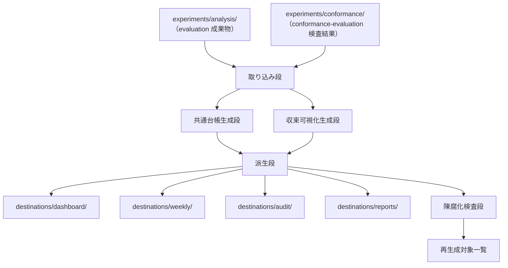

# Design Document：analysis

## 概要（Overview）

`analysis`（分析機能）は、`runtime`（実行時機能）と `evaluation`（評価機能）の成果物を受け取り、4 種の利用先（運用ダッシュボード／週次レポート／監査用報告／報告書）に向けた構造化された分析向け成果物に変換する機能である。

本 design は次を具体的に定める。

- 主張から証拠への対応付け
- 図表入力と報告断片の契約
- 注意点と成熟度の継承方法
- レビュー収束過程の可視化に必要な構造化入力
- 4 種の利用先ごとの派生成果物
- `conformance-evaluation`（規律遵守検査機能）からの判定結果の取り込み
- 報告の都合が下流仕様に逆流しない境界

本機能は読み物（運用ダッシュボード・週次・監査・報告書）の本文を執筆する機能ではなく、それらに必要な「構造化された入力」を整える層である。執筆活動そのものは利用者の責務に属する。

先行プロジェクトでは `paper-interface`（論文向け）という機能名で論文 1 系統のみを扱っていたが、ReviewCompass では 4 出力先への拡張・レビュー収束過程の可視化・規律遵守検査結果の取り込みを加え、機能名を `analysis` に改称した（計画書 §5.14／§5.15.6）。

## 目標（Goals）

- 主張を支える成果物を、来歴情報まで含めて追跡可能にする
- 成熟証拠と予備証拠を見分けられる構造化入力を作る
- 注意点と限界を、要約や叙述の過程で取り落とさない
- `evaluation` の成果物から再生成可能な分析向け成果物を作る
- 4 種の利用先（運用ダッシュボード／週次／監査／報告書）に対し、共通の追跡可能性を保持しつつ利用先ごとの加工を許容する
- レビュー収束過程（3 役およびレビューモード別の所見差分）を可視化に渡せる形で保持する
- `conformance-evaluation` の検査結果を取り込み、監査用報告と報告書向け原データに統合する

## 範囲外（Non-Goals）

- `runtime` フィールドの再定義
- `evaluation` のメトリクス規則の変更
- 読み物（運用ダッシュボード／週次／監査／報告書）の本文執筆
- 外部投稿のパッケージ化
- 上流文書との適合性評価（`conformance-evaluation` の責務）
- 規律違反の判定そのもの（`conformance-evaluation` の責務、本機能は判定結果を取り込むのみ）
- 生実行ディレクトリへの直接アクセス（`evaluation` の成果物を経由する）

## 設計の前提（Design Drivers）

- 報告の都合は再現性と有効性に従属する
- 生実行成果物を直接読まない。`evaluation` の成果物を読む。`evaluation` の成果物が存在しない場合は生のログにフォールバックせず、評価処理の実行を要求する（要件 1 受入 4）
- 主張は証拠源と来歴情報を失わない
- 予備証拠は明示的に分類ラベルを付ける
- 4 出力先は共通の証拠台帳と主張対応図を共有し、出力先ごとに派生形を作る（共通部分と派生部分の構造的分離）
- 上流から伝播してくる陳腐化標識を保持し、無声に新しい成果物として扱わない

## 全体構造（Architecture）

本機能は次の 5 段に分ける。

1. **取り込み段（intake）**：`evaluation` の成果物を読み、欠落・陳腐化を判定する
2. **共通台帳生成段（shared registry generation）**：主張対応図・証拠台帳・注意点台帳を生成する
3. **収束可視化生成段（convergence visualization）**：3 役およびレビューモード別の所見差分を構造化入力に変換する
4. **派生段（destination derivation）**：4 出力先ごとに必要な成果物を派生させる
5. **陳腐化検査段（staleness check）**：上流陳腐化に伴う再生成対象を識別する



### 構成要素（Components）

- `intake reader`：`evaluation` および `conformance-evaluation` の成果物を読み込み、必須入力の有無と陳腐化標識を確認する
- `shared registry builder`：主張対応図・証拠台帳・注意点台帳の共通成果物を組み立てる
- `convergence visualization builder`：3 役およびレビューモード別の所見差分から可視化向け構造化入力を組み立てる
- `destination deriver`：共通成果物と可視化入力から、4 出力先ごとの派生成果物を組み立てる
- `staleness checker`：上流陳腐化標識を受け、本機能の派生成果物に再生成対象標識を付ける

## 分析向け成果物配置（Analysis Output Layout）

本機能の正本出力先は `analysis/` 配下とし、共通台帳（shared）と出力先別派生（destinations）の 2 層構造を採る（利用者承認方針 Y(イ)、2026-05-25 セッション 25）。

```text
analysis/
├── shared/
│   ├── claim_map.json              # 主張から証拠への対応図（共通）
│   ├── evidence_register.json      # 証拠台帳と来歴情報（共通）
│   ├── caveat_register.json        # 注意点と限界の台帳（共通）
│   ├── conformance/
│   │   └── conformance_intake.json # conformance-evaluation 取り込み正本（Req 8 受入 5、A-010 対処）
│   ├── convergence/
│   │   ├── role_diff.json          # 3 役の所見差分（Req 7 受入 2）
│   │   └── mode_diff.json          # レビューモード別の所見差分（Req 7 受入 3）
│   └── manifests/
│       ├── analysis_manifest.yaml  # 本機能の論理版と入力被覆
│       ├── intake_failure_report.json # 取り込み失敗の構造化報告（要件 1 受入 4、F-009 対処）
│       └── staleness_register.json # 陳腐化登録
├── destinations/
│   ├── dashboard/
│   │   ├── operations_summary.json # 所見集計・進行手続き状態
│   │   └── manifest.yaml
│   ├── weekly/
│   │   ├── trend_summary.json      # 時系列推移・注目所見・規律遵守率変化
│   │   └── manifest.yaml
│   ├── audit/
│   │   ├── invalidation_index.json # 無効化マーカー一覧
│   │   ├── validator_failure_trace.json # 検証器失敗の追跡
│   │   ├── discipline_violation_index.json # 規律違反件数集計
│   │   ├── conformance_violations_detail.json # 取り込み正本の加工版（違反所見の詳細表示、A-010 対処）
│   │   └── manifest.yaml
│   └── reports/
│       ├── claim_evidence_trace.json # 主張から証拠への完全な追跡表
│       ├── treatment_comparison_report.json # 3 方式比較データ
│       ├── mode_comparison_report.json # レビューモード別比較データ
│       ├── conformance_compliance_trend.json # 取り込み正本の加工版（規律遵守率の時系列、A-010 対処）
│       └── manifest.yaml
├── figures_tables/
│   ├── table_source_bundles/
│   │   └── <table_id>.json
│   └── figure_source_bundles/
│       └── <figure_id>.json
└── fragments/                          # 報告断片（fragment_type 5 値正本、F-016 対処 2026-05-28 セッション 36）
    └── <fragment_id>.json
```

### 配置の根拠（Placement Rationale）

- **`shared/`**：4 出力先で共通に参照される台帳群を集約する。主張対応図・証拠台帳・注意点台帳・収束差分は 4 出力先のすべてが追跡可能性の根拠として参照するため、複製ではなく単一配置とする（要件 8 受入 3：追跡可能性を共通保持）
- **`destinations/<出力先>/`**：4 出力先ごとに必要な情報粒度と要約レベルを別の成果物として持つ（要件 8 受入 2）。各出力先の `manifest.yaml` はその出力先固有の加工方針と版を記録する（要件 8 受入 4）
- **`figures_tables/`**：図表の原データ束は出力先によらず再利用可能であるため、`shared/` でも `destinations/` でもなく独立した配置とする
- **`fragments/`**（F-016 対処 2026-05-28 セッション 36）：報告断片（`claim_summary` ／ `method_note` ／ `limitation_note` ／ `comparison_summary` ／ `trend_summary` の 5 値 `fragment_type` 正本）は図表束（`figures_tables/`）と兄弟関係であり、出力先によらず再利用可能（複数出力先が異なる組み合わせで参照する）であるため独立配置とする
- **共通／派生の分離理由**：要件 8 受入 3 が「すべての出力先で `evaluation` 経由の証拠への追跡可能性を保持する」と求める。共通台帳を 1 か所に置くことで、出力先ごとに台帳を複製しない（追跡情報の散逸防止）

### 本機能が所有する語彙正本と下流参照禁止（Owned Vocabularies and Downstream Reference Rule、A-010 対処 2026-05-28 セッション 36）

本機能は次の 4 語彙を正本として所有し、下流機能（`self-improvement` 等）は **再定義禁止で参照のみで使用** する。本規律は foundation の語彙正本所有規律（`evidence_class` ／ `review_mode` ／ `counter_status` 等の正本所有と下流参照禁止）と同型である。

| 語彙 | 値域 | 確定タスク | 用途 |
|---|---|---|---|
| `maturity_label` | 3 値（`mature` ／ `preliminary` ／ `exploratory`） | T-004 | 証拠の成熟度ラベル（`evidence_class` 由来の派生分類） |
| `limitation_type` | 4 値（`invalid_data_exclusion` ／ `partial_evidence` ／ `methodological_limitation` ／ `mixed_review_mode`） | T-005 | 注意点・限界の種別 |
| `fragment_type` | 5 値（`claim_summary` ／ `method_note` ／ `limitation_note` ／ `comparison_summary` ／ `trend_summary`） | T-006 | 報告断片の種別 |
| `regeneration_status` | 4 値（`pending` ／ `in_progress` ／ `completed` ／ `failed`） | T-010 | 再生成タスクの状態 |

**下流参照禁止規律**：

- `self-improvement` ／ 他下流機能は上記 4 正本を **再定義してはならない**。本機能の確定値を **参照のみで使用** する
- 値域の拡張・変更が必要になった場合は、本機能設計の改訂で対応（下流での再定義は禁止）
- 本規律は T-011 完了条件の機械検証対象に含める：下流機能の仕様文書・実装コードで本機能 4 正本の re-definition が無いことを grep または静的解析で確認

### 出力先ごとの最低限必須成果物（Required Artifacts per Destination）

要件 8 受入 1 の 4 出力先それぞれに対応する最低限の成果物：

| 出力先 | 最低限必須成果物 | 主な利用者 |
|---|---|---|
| 運用ダッシュボード | 所見集計（重大度別・フェーズ別）、進行中の所定手続きの状態一覧 | 運用者 |
| 週次レポート | 時系列推移（前週との差分）、注目所見の上位 N 件、規律遵守率の変化 | 運用者・分析者 |
| 監査用報告 | 無効化マーカー一覧、検証器失敗の追跡、規律違反件数集計、`conformance-evaluation` 検査結果 | 監査担当者 |
| 報告書向け原データ | 主張から証拠への完全な追跡表、3 方式比較データ、レビューモード別比較データ、`conformance-evaluation` 検査結果 | 研究者・分析者 |

## 主張対応モデル（Claim Mapping Model）

### 1. 主張単位（Claim Unit）

本機能は主張を 1 つの成果物単位として扱う。主張とは、分析向けの言明であり、主張から証拠への対応付けの単位となるもの。最低限、識別子と明示的な証拠源への連結を持つ（要件 1 受入 6）。

`shared/claim_map.json` の各エントリは少なくとも次の項目を持つ。

- `claim_id`：主張の安定識別子
- `claim_text`：主張の本文
- `supporting_artifact_refs`：根拠とする成果物への参照（後述 §3 参照書式に従う）
- `provenance_refs`：来歴情報（実行 ID／改訂版／対象識別子等）への参照
- `caveat_refs`：適用される注意点への参照
- `maturity_label`：成熟度ラベル（後述 §証拠台帳モデル §2 で定義）
- `stale`：陳腐化標識（真偽、後述 §陳腐化伝播の継承）
- `stale_reason`：陳腐化の理由（任意）
- `stale_source_ref`：陳腐化の起点となった上流標識への参照（任意）

**必須／任意の区分（A-006＋F-003 対処、2026-05-25 セッション 25）**：

- 必須：`claim_id`、`claim_text`、`supporting_artifact_refs`、`maturity_label`、`stale`
- 任意：`provenance_refs`（無ければ空配列）、`caveat_refs`（無ければ空配列）、`stale_reason`、`stale_source_ref`
- 条件付き必須：`stale_reason` と `stale_source_ref` は `stale=true` のとき必須

### 2. 根拠成果物の入力源（Supporting Artifact Sources）

標準的な入力源は次に限定する。入力はすべて `evaluation` の成果物配置を基準ディレクトリとして相対パスで解決する（foundation 要件 4 受入 4 と整合）。

- `experiments/analysis/comparisons/treatment_comparisons.json`（3 方式比較）
- `experiments/analysis/comparisons/phase_comparisons.json`（フェーズ別比較）
- `experiments/analysis/classifications/exclusion_report.json`（除外報告）
- `experiments/analysis/caveats/caveat_register.json`（注意点台帳、上流由来）
- `experiments/analysis/modes/mode_diff_report.json`（レビューモード別差分）
- 必要に応じて `experiments/analysis/metrics/*.json`
- `experiments/conformance/<検査結果>.json`（規律遵守検査結果、Req 8 受入 5）

`runtime` の生証拠は主張根拠の一次入力にしない（Req 4 受入 1 と整合）。

### 3. 参照書式（Reference Format、本機能内で共通）

`*_ref`／`*_refs` 系のフィールド（`supporting_artifact_refs`／`caveat_refs`／`provenance_refs`／`stale_source_ref` 等）は、裸のパス文字列でも裸の識別子でもなく、次の構造化参照を用いる。

- `ref_type`：参照先成果物の種別（例：`treatment_comparison`／`exclusion_report`／`caveat_entry` 等）
- `target_path`：基準ディレクトリ起点の相対パス
- `target_id`：成果物内の安定識別子（任意、エントリ単位で指す場合に用いる）

`*_ref`（単数）は上記オブジェクト 1 個、`*_refs`（複数）はその配列とする。これにより、ファイル名の部分一致や経路推測に依存せず、機械的に追跡が検証可能となる（要件 1 受入 5）。

## 証拠台帳モデル（Evidence Register Model）

### 1. 成熟度ラベル（Maturity Label）

成熟度ラベルの初版は次の 3 値とする。

- `mature`（成熟）
- `preliminary`（予備）
- `exploratory`（探索的）

注意点付き（caveated）は成熟度ラベルではなく、`caveat_refs` で表現する。これにより、1 つの成果物が `mature` でありつつ注意点を持つ状態を表現できる。

成熟度ラベルと foundation の証拠区分（`evidence_class` 4 値正本）は別軸だが独立ではない。foundation の `evidence_class`（`valid`／`invalid`／`exploratory`／`analysis_blocked`、所有者は foundation）を本機能は再定義せず正本フィールドとして保持し、成熟度ラベル `maturity_label` はそれに束縛される派生分類とする（要件 5 受入 6）。

束縛規則：

| foundation の `evidence_class` | 本機能の `maturity_label` |
|---|---|
| `invalid` | 報告対象外（除外報告に出すが報告書向け原データには出さない） |
| `exploratory` | `exploratory` |
| `analysis_blocked` | 報告対象外（除外報告に出すが標準母集団に入れない） |
| `valid` かつ安定比較集合に属する | `mature` |
| `valid` かつ安定比較集合に属さない | `preliminary` |

**「安定比較集合」の判定基準**：`evaluation` 設計 §分類モデル §6 の `admission_register.json` における `eligible_for_standard_comparison`（標準比較対象として許容済み）フィールドが真の証拠を指す（F-005 対処、`evaluation` 側の正本フィールドを暗黙参照ではなく明示参照とする）。

**自動付与規律（A-007 対処、2026-05-25 セッション 25）**：

- `evidence_class=exploratory` の証拠は、`caveat_refs` に「予備的証拠」を示す注意点エントリへの参照を最低 1 件含める（自動付与）。要件 3 受入 5「予備または探索的な証拠を成熟証拠と同列に扱わない」を機械検証する根拠となる
- `evidence_class=analysis_blocked` の証拠は標準母集団に入らない（除外報告に出すのみ）。`caveat_refs` 付与は任意
- `evidence_class=invalid` の証拠は報告対象外（評価段で除外報告に出され、本機能は取り込まない）
- `evidence_class=valid` の証拠は注意点を持つことも持たないことも許容（`caveat_refs` は任意）

### 2. 来歴情報フィールド（Provenance Fields）

`shared/evidence_register.json` の各エントリは少なくとも次の項目を持つ。

- `evidence_id`：本機能の証拠台帳における安定識別子
- `artifact_ref`：原成果物への参照（`evaluation` の成果物）
- `source_analysis_manifest_ref`：`experiments/analysis/manifests/analysis_run_manifest.yaml` への参照
- `input_run_set_ref`：根拠とした実行集合への参照
- `evidence_class`：foundation 由来の証拠区分（再定義しない束縛フィールド）
- `review_mode`：foundation 由来のレビューモード（値は foundation 正本を参照、再定義しない）
- `maturity_label`：`evidence_class` に束縛された派生分類
- `caveat_refs`：適用される注意点への参照
- `supersedes`：本エントリが置換した先行証拠への参照（無ければ空）
- `superseded_by`：本エントリを置換した後続証拠への参照（無ければ空）
- `stale`／`stale_reason`／`stale_source_ref`：陳腐化標識
- `generated_at`：生成時刻

**必須／任意の区分**：

- 必須：`evidence_id`、`artifact_ref`、`source_analysis_manifest_ref`、`input_run_set_ref`、`evidence_class`、`review_mode`、`maturity_label`、`stale`、`generated_at`
- 任意：`caveat_refs`（無ければ空配列、ただし `evidence_class=exploratory` のときは §1 自動付与規律により最低 1 件必須）、`supersedes`（無ければ空配列）、`superseded_by`（無ければ空配列）、`stale_reason`、`stale_source_ref`
- 条件付き必須：`stale_reason` と `stale_source_ref` は `stale=true` のとき必須

これにより、どの分析論理版とどの実行集合から報告断片が作られたかを追跡でき、`preliminary` から `mature` への遷移や、手動経路から実行時経路への置換系譜も辿れる（要件 5 受入 5、要件 6 受入 5）。

### 3. レビューモードの保持（Review-Mode in Reporting）

分析向け成果物はレビュー実施モードの由来情報を保持する（要件 6）。

- `review_mode` を `evidence_register` に保持し、報告断片が手動 dogfooding 由来か実行時経由由来かサブエージェント経由由来かを失わない（受入 1）
- 手動由来証拠と実行時由来証拠とサブエージェント由来証拠は分離して報告でき、混在を強制しない（受入 2）
- 手動レビュー記録を、明示ラベルなしに実行時由来証拠として提示しない。サブエージェント由来も同様（受入 3）
- 同一の報告集合に複数のレビューモードが混在する場合、機械的に検知して注意点を自動付与する（受入 4）。検知条件：当該報告集合が参照する `evidence_register` エントリの `review_mode` が 2 値以上
  - **検知主体**：本機能の派生段（destination deriver）が報告集合（destinations/<出力先>/ 配下の成果物）の組み立て時に検知する
  - **付与先**：`shared/caveat_register.json` に `limitation_type=mixed_review_mode` のエントリを自動追加（`narrative_note` は機械生成、例：「報告集合 X に手動由来 12 件、実行時由来 8 件、サブエージェント由来 3 件が混在」）
  - **evaluation 側との粒度分担**：`evaluation` 側は実行レベルの混在を検知して注意点を付与、本機能は報告集合レベル（destination 単位）の混在を検知して注意点を付与する（粒度が異なるため両者を保持、要件 6 受入 4 と整合）
  - **過渡的対処の位置付け**：本機構は過渡期・移行時・配置先テストケースで発生する混在状態への対処であり、恒久運用の中核仕様ではない（詳細は §注意点と限界のモデル §`mixed_review_mode` の位置付けを参照）
- 初期の手動証拠を後の実行時由来証拠で置換した系譜を保持する（受入 5）。置換リンクは §2 で定義した `supersedes`／`superseded_by` を用いる

## 注意点と限界のモデル（Caveat and Limitation Model）

本機能は `evaluation` の `caveat_register.json` を継承しつつ、分析向けの説明単位として再配置する。

`shared/caveat_register.json` は少なくとも次の項目を持つ。

- `caveat_id`：本機能の注意点台帳における安定識別子
- `source_caveat_ref`：上流の `evaluation` 注意点台帳エントリへの参照
- `applies_to_claim_refs`：適用される主張への参照（複数可）
- `applies_to_artifact_refs`：適用される成果物への参照（複数可）
- `limitation_type`：限界の種別（後述）
- `narrative_note`：注意点の構造化メモ（本文ではなく、執筆者が限界を取り落とさないための覚書）

**必須／任意の区分**：

- 必須：`caveat_id`、`limitation_type`、`narrative_note`
- 任意：`source_caveat_ref`（上流由来の場合のみ持つ、自動付与の `mixed_review_mode` は持たない）、`applies_to_claim_refs`（無ければ空配列）、`applies_to_artifact_refs`（無ければ空配列）
- 条件付き必須：`applies_to_claim_refs` と `applies_to_artifact_refs` の少なくとも一方は非空（適用先のない注意点は許容しない）

`limitation_type` の初版列挙は要件 3 受入 2 の 3 分類と、要件 6 受入 4 由来の自動検知種別 1 値を合わせた **4 値正本** とする（2026-05-25 セッション 25 で `mixed_review_mode` を追加、F-012＋A-009 対処）。

- `invalid_data_exclusion`：無効データ除外に起因する限界
- `partial_evidence`：部分的証拠に起因する限界
- `methodological_limitation`：方法論上の限界
- `mixed_review_mode`：混在レビューモード状態（過渡的対処、要件 6 受入 4 の自動検知由来）

**`mixed_review_mode` の位置付け（過渡的対処）**：本値は「同一の報告集合に複数のレビューモードが混在する状態」を機械検知して注意点として自動付与するための種別である。混在は主に次の 3 つの場面で発生する：

- 過渡期（フェーズ 1〜3）：実 LLM 経路（`runtime_mediated`）が未実装のため、手動 dogfooding とサブエージェント経由が混在
- 段階的移行時：手動由来の証拠を後追でサブエージェント経由や実行時経由に置き換える期間（要件 6 受入 5 の置換系譜と連動）
- 配置先テストケースとして手動 dogfooding を継続するとき：本番運用（`runtime_mediated`）と並べて集計する場合

恒久運用の日常業務（フェーズ 4 完了後）では、報告集合内の証拠は基本的に単一のレビューモードで揃うため、`mixed_review_mode` の出現は稀となる見通し。本値の運用必要性はフェーズ 4 完了後に再評価する（§先送り論点に登録）。

将来拡張は本節に追記する形で行う（語彙拡張時の改訂は本機能の `analysis_logic_version` の更新を伴う）。

## 図表束モデル（Figure and Table Bundle Model）

図表の原データ束は出力先によらず再利用可能であるため、`figures_tables/` 配下に独立配置する。

### 1. 表原データ束（Table Source Bundle）

`figures_tables/table_source_bundles/<table_id>.json` は少なくとも次の項目を持つ。

- `table_id`：表の安定識別子
- `source_artifact_refs`：原成果物への参照（`evaluation` の比較／メトリクス成果物）
- `field_projection`：表に出す列の定義
- `maturity_label`：成熟度ラベル
- `caveat_refs`：適用される注意点への参照
- `applicable_destinations`：本表が利用される出力先の集合（例：`[weekly, reports]`）

**必須／任意の区分**：必須：`table_id`、`source_artifact_refs`、`field_projection`、`maturity_label`、`applicable_destinations`。任意：`caveat_refs`（無ければ空配列）

### 2. 図原データ束（Figure Source Bundle）

`figures_tables/figure_source_bundles/<figure_id>.json` は少なくとも次の項目を持つ。

- `figure_id`：図の安定識別子
- `source_artifact_refs`：原成果物への参照
- `plot_contract`：描画契約（どの切片／メトリクス／集約軸を用いるかの分析側定義）
- `maturity_label`：成熟度ラベル
- `caveat_refs`：適用される注意点への参照
- `applicable_destinations`：本図が利用される出力先の集合

**必須／任意の区分**：必須：`figure_id`、`source_artifact_refs`、`plot_contract`、`maturity_label`、`applicable_destinations`。任意：`caveat_refs`（無ければ空配列）

`plot_contract` は描画そのものではなく、どの切片・メトリクス・集約軸を用いるかの分析側定義とする。実際の描画工程は本機能の責務外（執筆者または可視化ツールが担う）。

## 報告断片モデル（Reporting Fragment Model）

報告断片は本文そのものではないが、4 出力先で再利用しやすい構造化された断片を保持する。出力先別の派生段が報告断片を組み合わせて出力先別成果物を作る。

各報告断片は少なくとも次の項目を持つ。

- `fragment_id`：断片の安定識別子
- `fragment_type`：断片の種別（初版 5 値正本：`claim_summary`（主張要約）／`method_note`（方法論ノート）／`limitation_note`（限界ノート）／`comparison_summary`（比較要約）／`trend_summary`（時系列要約）、将来拡張は本機能設計の改訂で対応、F-004 対処 2026-05-25 セッション 25）
- `source_artifact_refs`：原成果物への参照
- `maturity_label`：成熟度ラベル
- `caveat_refs`：適用される注意点への参照
- `text_stub`：構造化された断片本体（短文）
- `applicable_destinations`：本断片が利用される出力先の集合

**必須／任意の区分**：必須：`fragment_id`、`fragment_type`、`source_artifact_refs`、`maturity_label`、`text_stub`、`applicable_destinations`。任意：`caveat_refs`（無ければ空配列）

複数の出典を束ねる断片（例：`comparison_summary`）の成熟度集約規則：

- 断片の `maturity_label` は出典の最も保守的な値とする。順序は `exploratory` < `preliminary` < `mature` とし、出典に 1 つでも低い値があれば断片全体をその低い値にする
- 出典ごとの成熟度区分は断片内に保持し、束ねても見えなくしない（要件 5 受入 3：区別が見える形でのみ混在許容）
- 成熟度の異なる出典を単一の未分化値に圧縮しない（要件 5 受入 4）。集約値はあくまで保守表示であり、出典別成熟度の保持を代替しない

## レビュー収束過程の可視化モデル（Convergence Visualization Model）

要件 7 はレビューが収束していく過程の可視化を求める。本機能は時系列または役横断での可視化に必要な構造化入力を定義する。

### 1. 3 役の所見差分（Role Diff）

`shared/convergence/role_diff.json` は 3 役（`primary_reviewer`／`adversarial_reviewer`／`judgment_reviewer`）の所見出力の差分を保持する。出典は `evaluation` の `experiments/analysis/roles/role_diff_report.json`（evaluation 要件 9 受入 8、A-011 対処、2026-05-26 セッション 28 確定）。本機能は当該成果物を読み込んで内部表現に変換し、`shared/convergence/role_diff.json` として可視化向けに保持する。

各エントリは要件 7 受入 2 が定める最低限の 4 要素を含む。

- `feature`：機能名（例：`foundation`／`runtime` 等）
- `role`：役名（`primary`／`adversarial`／`judgment` のいずれか）
- `findings_summary`：所見集計
  - `by_severity`：重大度別の件数（foundation 4 値）
  - `by_final_label`：対応分布（foundation 3 値、`judgment` 役のとき必須、他役は不在または空）
  - `by_counter_status`：反証状態 3 値の件数（foundation 正本、`adversarial` 役のとき必須、他役は不在または空）。A-003 対処として追加（2026-05-25 セッション 25）、敵対役の有効性測定（要件 2 受入 2、ReviewCompass の中核価値命題）の可視化根拠
- `target`：対象識別子（レビュー対象成果物の識別子）
- `evidence_refs`：根拠とした証拠台帳エントリへの参照

**A-011 対処完了（2026-05-26 セッション 28）**：`evaluation` 設計に 3 役差分集約成果物 `experiments/analysis/roles/role_diff_report.json` が新設され、要件 9 受入 8 として正式定義された。本機能の出典記述を当該ファイルへの参照に書き換え（本セッション 28 で完了）。

**必須／任意の区分**：

- 必須：`feature`、`role`、`findings_summary.by_severity`、`target`
- 条件付き必須：`findings_summary.by_final_label` は `role=judgment` のとき必須、`findings_summary.by_counter_status` は `role=adversarial` のとき必須
- 任意：`evidence_refs`（無ければ空配列）

### 2. レビューモード別の所見差分（Mode Diff）

`shared/convergence/mode_diff.json` は `foundation` の review_mode 正本が定める各レビューモード別の所見出力の差分を保持する。出典は `evaluation` の `modes/mode_diff_report.json`。

各エントリは要件 7 受入 3 が定める最低限の 4 要素を含む。

- `feature`：機能名
- `review_mode`：foundation のレビューモード正本値（再定義しない）
- `findings_summary`：所見集計（重大度別件数）
- `target`：対象識別子
- `evidence_refs`：根拠とした証拠台帳エントリへの参照

**必須／任意の区分**：必須：`feature`、`review_mode`、`findings_summary`、`target`。任意：`evidence_refs`（無ければ空配列）

### 3. 派生成果物としての位置付け

本機能のレビュー収束可視化は `evaluation` の標準集計と区別し、`evaluation` の成果物を加工した派生として位置付ける（要件 7 受入 4）。これにより、本機能の可視化結果が `evaluation` のメトリクス契約を上書きすることはない。

## 出力先別の派生モデル（Destination-Specific Derivation Model）

要件 8 は 4 出力先への変換を求める。本機能は共通台帳と報告断片から、出力先ごとに必要な情報粒度と要約レベルを別の成果物として組み立てる。

### 1. 派生方針の明示と版管理（要件 8 受入 4）

各出力先の `destinations/<出力先>/manifest.yaml` は少なくとも次の項目を持つ。

- `destination`：出力先名（`dashboard`／`weekly`／`audit`／`reports`）
- `analysis_logic_version`：本機能の論理版
- `derivation_contract_version`：当該出力先の加工方針の版
- `included_evidence_refs`：派生に用いた証拠台帳エントリへの参照
- `included_caveat_refs`：派生に用いた注意点台帳エントリへの参照
- `granularity_profile`：情報粒度の指定（例：`run_level`／`finding_level`／`aggregate_only` 等の組み合わせ）
- `summary_level`：要約レベル（例：`raw`／`weekly_rollup`／`audit_index`／`full_traceability`）
- `review_mode_mixed`：当該出力先内のレビューモード混在の真偽（混在検知時は真、§証拠台帳モデル §3 受入 4 由来）

**必須／任意の区分**：必須：上記すべて。任意項目はなし。

派生方針が変わった場合は `derivation_contract_version` を更新し、過去の派生成果物は `superseded` として保持する。

### 2. 運用ダッシュボード（dashboard）

`destinations/dashboard/operations_summary.json` は少なくとも次を持つ。

- 所見集計（重大度別／フェーズ別）：根拠は `evaluation` の `metrics/finding_metrics.json`
- 進行中の所定手続きの状態一覧：根拠は `workflow-management` の所定手続き実行履歴（隣接期待）
- 派生時刻と被覆期間

### 3. 週次レポート（weekly）

`destinations/weekly/trend_summary.json` は少なくとも次を持つ。

- 時系列推移（前週との差分）：直近 2 週の `evaluation` メトリクスを比較
- 注目所見の上位 N 件：`severity` の上位（CRITICAL／ERROR）からの抽出
- 規律遵守率の変化：`conformance-evaluation` の検査結果由来（要件 8 受入 5 経由）
- 集計期間（始端時刻／終端時刻）

### 4. 監査用報告（audit）

`destinations/audit/` 配下の成果物群は次を持つ。

- `invalidation_index.json`：無効化マーカー一覧（`evaluation` の `caveats/caveat_register.json` および foundation 由来の無効化標識を集約）
- `validator_failure_trace.json`：検証器失敗の追跡（`evaluation` の `validator_status=failed` 集計）
- `discipline_violation_index.json`：規律違反件数集計（`conformance-evaluation` の検査結果由来、要件 8 受入 5）
- `conformance_violations_detail.json`：`shared/conformance/conformance_intake.json`（正本）の加工版（違反所見の詳細表示、A-010 対処、後述 §`conformance-evaluation` メトリクス取り込みモデル §3）

### 5. 報告書向け原データ（reports）

`destinations/reports/` 配下の成果物群は次を持つ。

- `claim_evidence_trace.json`：主張から証拠への完全な追跡表（`shared/claim_map.json` を出力先向けに加工）
- `treatment_comparison_report.json`：3 方式比較データ（`evaluation` の `comparisons/treatment_comparisons.json` を加工）
- `mode_comparison_report.json`：レビューモード別比較データ（`evaluation` の `modes/mode_diff_report.json` を加工）
- `conformance_compliance_trend.json`：`shared/conformance/conformance_intake.json`（正本）の加工版（規律遵守率の時系列、A-010 対処）

## `conformance-evaluation` メトリクス取り込みモデル（Conformance Intake Model）

要件 8 受入 5 は `conformance-evaluation`（規律遵守検査機能）の 12 基準の検査結果を取り込み、適切な出力先（特に監査用報告と報告書向け原データ）に統合することを求める。

### 1. 一方向取り込みの境界

本機能は `conformance-evaluation` の検査結果を **読むだけ** とする。

- 本機能は適合性判定そのものを行わない（Boundary Context の Out of scope と整合）
- 本機能は判定基準を変更しない、判定結果に上書きを加えない
- 取り込みは `analysis ← conformance-evaluation`（読み）の一方向

### 2. 取り込み成果物の構造（正本配置と加工版、A-010 対処 2026-05-25 セッション 25）

取り込みの正本配置は `shared/conformance/conformance_intake.json` の **単一ファイル** とする。`destinations/<出力先>/` 配下には正本の加工版を別名で配置する（判断 5 共通／派生 2 層構造との整合）。

正本：`shared/conformance/conformance_intake.json` は少なくとも次の項目を持つ。

- `conformance_run_ref`：`conformance-evaluation` の検査実行への参照
- `assessment_summary`：基準別（12 基準）の合否集計
- `violation_findings`：違反所見の集合（各違反は `severity`／`target`／`description`／`evidence_refs` を持つ）
- `compliance_rate`：規律遵守率（時系列追跡に用いる）
- `included_disciplines`：取り込み対象とした規律ファイルの集合
- `intake_at`：取り込み時刻

**必須／任意の区分**：必須：上記すべて。任意項目はなし。

**注（A-008 対処 2026-05-28 セッション 36）**：本機能の正本 `conformance_intake.json` の必須 6 項目は、上流 `conformance-evaluation` 設計 §14.5 の機械可読出力スキーマ（必須 9 件 ＋ 任意 2 件）を本機能の取り込みスキーマに再編成したもの。9 件から 6 項目への対応マッピング（集約・除外・統合の規則）は別途確定（TBD）、確定後ここに対応表を追記する。本確認事項は tasks.md DVT-A003 として登録、解除トリガー：`conformance-evaluation` の正本スキーマ実体化時。

### 3. 出力先ごとの加工版（別名で配置、A-010 対処）

- **監査用報告**：`destinations/audit/conformance_violations_detail.json`。正本の `violation_findings` を中心に、無効化標識との関連付けを含めて監査担当者が個別の違反を追跡できる粒度で保持
- **報告書向け原データ**：`destinations/reports/conformance_compliance_trend.json`。正本の `compliance_rate` と `assessment_summary` を中心に、時系列推移と基準別合否を報告書執筆時に集計値として利用できる粒度で保持

両加工版は正本の `conformance_run_ref` を参照することで、同一の取り込み結果から派生したことを機械的に確認できる。これにより、両加工版の整合保証（同じ取り込み結果に基づく）が成立する。

## 分離規則（Separation Rules）

### 1. 逆流禁止（No Reverse Control、要件 4 受入 1〜3）

本機能は次を行わない。

- `runtime` のフィールド追加要求を独自に出す
- 無効実行を有効証拠に格上げする
- `evaluation` の比較規則を独自に上書きする

### 2. 無声昇格の禁止（No Silent Strengthening、要件 3 受入 5）

予備または探索的な証拠を、分析向け成果物の生成時に成熟証拠と同列に扱ってはならない。

### 3. 自己改善との独立（Self-Improvement Independence）

`self-improvement` の改善提案は、分析向け主張の根拠成果物ではない。採用済みの改善履歴を方法論ノートとして参照することは許容するが、性能主張の一次根拠にしない。

### 4. `conformance-evaluation` 判定の不干渉（Conformance Judgment Non-Interference）

本機能は `conformance-evaluation` の検査結果を取り込むが、判定基準を変更しない、判定結果を上書きしない。違反所見の表示形式は加工するが、違反の有無や重大度は `conformance-evaluation` 側の判定をそのまま用いる。

### 5. 報告の都合の従属（Reporting Subordinate to Reproducibility、要件 4 受入 4）

報告の都合（書式・図表配置・要約粒度）は、再現性と有効性に従属する。書式上の都合のみで `foundation` または `runtime` のスキーマ変更を強制しない（要件 2 受入 5 と整合）。

## 取り込み失敗のモデル（Intake Failure Model）

要件 1 受入 4 は「`evaluation` 出力が存在しない場合は生のログにフォールバックせず、`evaluation` 処理の実行を要求する」と求める。本機能は取り込み段（intake reader）で `evaluation` 成果物および `conformance-evaluation` 成果物の欠落・読み込み失敗・陳腐化を検知し、構造化報告として `shared/manifests/intake_failure_report.json` に記録する。本機構は `evaluation` 設計の `classifications/insufficient_metadata_report.json` と対称形の役割を持つ（F-009 対処、2026-05-25 セッション 25）。

### 1. 取り込み失敗報告の構造

`shared/manifests/intake_failure_report.json` の各エントリは少なくとも次の項目を持つ。

- `failure_id`：失敗事象の安定識別子
- `run_id`：失敗の対象となった `evaluation` 実行の識別子
- `missing_artifact_refs`：欠落していた成果物への参照の配列（後述 §1.3 で定義する 4 値の失敗理由種別と紐付く）
- `intake_failure_reason`：失敗理由の列挙値
  - `upstream_evaluation_missing`：上流の `evaluation` 成果物が存在しない
  - `upstream_evaluation_unreadable`：上流成果物が形式不適合で読めない
  - `upstream_evaluation_stale`：上流成果物が陳腐化している
  - `conformance_evaluation_missing`：`conformance-evaluation` 成果物が存在しない
- `affected_destinations`：影響を受ける派生出力先の集合（`dashboard`／`weekly`／`audit`／`reports` の部分集合）
- `detected_at`：検出時刻
- `recommended_action`：推奨対応（自由テキスト、例：「evaluation 処理の実行を要求」）

**必須／任意の区分**：必須：`failure_id`、`intake_failure_reason`、`affected_destinations`、`detected_at`。任意：`run_id`（取り込み対象実行が特定できる場合に持つ、`upstream_evaluation_missing` のときは不在もありうる）、`missing_artifact_refs`（無ければ空配列）、`recommended_action`

### 2. 派生段との連動

派生段は `intake_failure_report.json` を読み、`affected_destinations` に含まれる出力先について次のいずれかを判断する。

- 派生を遅らせる（再取り込みを待つ）
- 欠落マーク付きで派生する（部分的成果物として生成、利用者に明示）

具体的な判断ロジックは実装に委ねる（本設計は信号の表現契約のみを固定）。

### 3. 通知と再実行

失敗事象の利用者通知は補助層 B（人間への通知機構、計画書 §5.13）に委ねる。自動再実行は本機能の責務外。

## 陳腐化伝播の継承（Staleness Propagation Inheritance）

本機能は foundation 由来の陳腐化伝播義務（foundation 要件 6 受入 9）を `evaluation` 経由で受ける。`evaluation` 設計の §陳腐化伝播の履行が、本機能への伝播の起点となる。

### 1. 陳腐化標識の表現契約

本機能の分析向け成果物（証拠台帳エントリ・主張対応図エントリ・報告断片・図表束）は陳腐化標識を持つ。最低限：

- `stale`：陳腐化の真偽
- `stale_reason`：陳腐化の理由（例：`upstream_invalidation`／`evaluation_re_derivation`）
- `stale_source_ref`：陳腐化の起点となった上流無効化または陳腐化伝播への参照

### 2. 再生成要求の生成条件（要件 2 受入 6）

上流の `evaluation` 成果物が実行無効化に伴い陳腐化マーク（foundation 要件 6 受入 9 ＋ `evaluation` 要件 5 受入 6 由来）された場合、本機能の派生成果物は **出力が変更されなくとも** 再生成対象とする。

具体的には次の場合に再生成対象とする。

- `evaluation` の `manifests/staleness_register.json` に新規エントリが追加された
- 本機能が依存する `evaluation` 成果物の `stale` が真に変わった
- `conformance-evaluation` の検査結果が更新された（要件 8 受入 5 由来）

### 3. 再生成対象の登録

`shared/manifests/staleness_register.json` に再生成対象の派生成果物を登録する。各エントリは次を持つ。

- `derived_artifact_ref`：再生成対象の派生成果物への参照
- `stale_source_ref`：起点となった上流標識への参照
- `detected_at`：陳腐化検出時刻
- `regeneration_status`：再生成状態の 4 値（`pending`／`in_progress`／`completed`／`failed`、F-010 対処）
  - `pending`：再生成待機
  - `in_progress`：再生成処理が進行中
  - `completed`：再生成完了
  - `failed`：再生成処理を開始したがエラーで中断（永遠の `in_progress` 滞留を防ぐため 2026-05-25 セッション 25 で追加）
- `regeneration_failure_reason`：再生成失敗の理由（`regeneration_status=failed` のとき任意、自由テキスト）

**必須／任意の区分**：必須：`derived_artifact_ref`、`stale_source_ref`、`detected_at`、`regeneration_status`。任意：`regeneration_failure_reason`（`regeneration_status=failed` のとき任意、付与推奨）

再生成の自動起動の主体・時機は実装に委ねる（本設計は信号の表現契約のみを固定する）。`failed` からの遷移（再実行の選択など）も実装に委ねる。

## 上流機能との接合面（Interfaces to Upstream Features）

### `evaluation` との接合面

本機能は `evaluation` の主要な利用者である。少なくとも次を読む（`evaluation` 設計の §`analysis` への接合面と整合）。

- `experiments/analysis/comparisons/treatment_comparisons.json`
- `experiments/analysis/comparisons/phase_comparisons.json`
- `experiments/analysis/classifications/exclusion_report.json`
- `experiments/analysis/caveats/caveat_register.json`
- `experiments/analysis/modes/mode_diff_report.json`
- `experiments/analysis/roles/role_diff_report.json`（3 役別の所見差分、A-011 対処、evaluation 要件 9 受入 8）

加えて、被覆状況の確認のために `experiments/analysis/manifests/analysis_run_manifest.yaml` を読む。陳腐化検査のために `experiments/analysis/manifests/staleness_register.json` を読む。

本機能は生実行ディレクトリ（`experiments/analysis/imports/bundles/<bundle_id>/run/<run_id>/...`）を一次入力にしない。

### `conformance-evaluation` との接合面

`conformance-evaluation` の検査結果を取り込む（一方向、Req 8 受入 5）。本機能は判定そのものを行わず、検査結果のみを読む。`conformance-evaluation` 設計 §14.5（A-015 対処、機械可読出力スキーマ）で確定したスキーマに従う（2026-05-26 セッション 28 確定）。

**取り込むスキーマ（conformance-evaluation §14.5 由来、A-015 連動対処）**：

- **必須フィールド 9 件**：`feature`／`axis`（requirements ／ design ／ intent の 3 値）／`criterion_id`（criterion-1〜6）／`severity`（4 段）／`finding_id`（CF-NNN）／`correspondence_type`（3 対応関係）／`discrepancy_description`／`implementation_code_refs`／`judgment_id`（JD-NNN）
- **任意フィールド 2 件**：`target_commit`／`materialization_commit_hash`（規律改訂の影響を伴う場合、conformance-evaluation §12.3 由来）
- **活用先**：本機能の 4 出力先（特に監査用報告と報告書向け原データ、本機能 Requirement 8 受入 5 由来）
- **取り込み形式**：評価記録の YAML 構造（`conformance-evaluation` §10.4 のスキーマに準拠）

### `workflow-management` との接合面

`workflow-management` から所定手続きの実行履歴に対する可視化要求を受ける（要件 introduction 隣接期待）。本機能は所定手続きの状態を運用ダッシュボードに反映するため、`workflow-management` が公開する所定手続きの実行履歴を読む。

**上流側設計への期待**：`workflow-management` は所定手続きの実行履歴を本機能に公開する義務を持つ（運用ダッシュボード派生のため、要件 8 受入 1）。具体の公開先パスと項目は `workflow-management` 設計で確定する。

### `runtime` との接合面

`runtime` とは直接結合しない（要件 4 受入 1 と整合）。`runtime` の生証拠は `evaluation` の標準集計を経由してのみ扱う。`runtime` 由来の方法論・来歴情報は、`evaluation` または保護層が版付き成果物として固定したものに限り参照する。これらは方法論・来歴情報の文脈であり、主張根拠の一次証拠にはしない。

### `self-improvement` との接合面

本機能は `self-improvement` の採用済み改善履歴を方法論ノートとして参照できる。ただし運用品質の主張の一次根拠にしない（分離規則 3）。

## 主要な設計判断（Key Decisions）

### 判断 1：主張対応図は中心成果物

どの主張がどの証拠で支えられるかを中央成果物として置く。`shared/claim_map.json` を主張から証拠への対応の唯一の正本配置とする。

### 判断 2：成熟度ラベルは明示する

`mature`／`preliminary`／`exploratory` を成果物に埋め込み、無声に成熟証拠と扱う失敗モードを構造的に防ぐ。

### 判断 3：報告断片は本文ではない

再利用可能な断片までに留め、本文執筆そのものは本機能の範囲外。

### 判断 4：`evaluation` は上流の権威

本機能は `evaluation` の利用者であり、比較規則の所有者ではない。`evaluation` の成果物を加工した派生として位置付ける。

### 判断 5：共通台帳と出力先別派生の 2 層構造

4 出力先で共通に参照される台帳（主張対応図・証拠台帳・注意点台帳・収束差分）は `shared/` に単一配置し、出力先別の派生は `destinations/<出力先>/` に分けて持つ。これにより追跡可能性を共通保持しつつ、出力先ごとの加工方針を独立に管理できる（利用者承認方針 Y(イ)）。

### 判断 6：`conformance-evaluation` 検査結果は一方向取り込み

本機能は `conformance-evaluation` の検査結果を読むだけとし、判定そのものを行わない。判定基準や判定結果に上書きを加えない。

### 判断 7：レビュー収束過程は `evaluation` 派生

3 役およびレビューモード別の所見差分の可視化は、`evaluation` の標準集計と区別し、`evaluation` の成果物を加工した派生として位置付ける。本機能の可視化結果が `evaluation` のメトリクス契約を上書きすることはない。

### 判断 8：陳腐化伝播は最小契約のみ固定

本機能は陳腐化標識の表現契約（`stale`／`stale_reason`／`stale_source_ref`）と再生成対象の登録のみを設計で固定し、自動起動の主体・時機は実装に委ねる。

## 要件と設計の対応（Requirements Traceability）

| 要件 | 設計上の対応 |
|---|---|
| Req 1：主張から証拠への写像 | §主張対応モデル全体（`claim_map.json` と `evidence_register.json`） |
| Req 1 受入 4：`evaluation` 出力を消費、生ログ非利用 | §設計の前提・§上流機能との接合面（`runtime` 直接結合の禁止） |
| Req 1 受入 5：版付き証拠まで追跡 | §参照書式（構造化参照、機械的に追跡可能） |
| Req 1 受入 6：主張の定義 | §主張対応モデル §1 主張単位 |
| Req 2：分析向けデータ契約 | §図表束モデル・§報告断片モデル |
| Req 2 受入 6：陳腐化時の再生成要求 | §陳腐化伝播の継承 §2 |
| Req 3：注意点と限界の追跡 | §注意点と限界のモデル |
| Req 4：分離規則 | §分離規則全体 |
| Req 5：予備証拠と成熟証拠の区別 | §証拠台帳モデル §1 成熟度ラベル |
| Req 5 受入 6：foundation の証拠区分への束縛 | §証拠台帳モデル §1 束縛規則 |
| Req 6：レビューモード由来情報 | §証拠台帳モデル §3 |
| Req 7：レビュー収束過程の可視化 | §レビュー収束過程の可視化モデル |
| Req 7 受入 2：3 役の所見差分の最低限 4 要素 | §可視化モデル §1 |
| Req 7 受入 3：レビューモード別の所見差分の最低限 4 要素 | §可視化モデル §2 |
| Req 8：4 種の出力先への変換 | §出力先別の派生モデル |
| Req 8 受入 1：4 出力先の最低限必須成果物 | §分析向け成果物配置・§出力先ごとの最低限必須成果物 |
| Req 8 受入 5：`conformance-evaluation` 取り込み | §`conformance-evaluation` メトリクス取り込みモデル |

## 下流仕様への影響（Impact on Downstream Specs）

- `self-improvement`：本機能の証拠台帳エントリの `supersedes`／`superseded_by` を改善提案の追跡に利用できる。本機能の派生成果物（特に運用ダッシュボード・週次レポート）を改善提案の根拠として参照できる

なお、`workflow-management` および `conformance-evaluation` への期待事項は、本機能が読み手として上流側に求める内容であるため §上流機能との接合面に統合した（節構造整理、A-011 対処、2026-05-25 セッション 25）。

## テスト戦略（Test Strategy）

完全なテスト計画はタスク段で策定するが、設計段で次のテスト可能性の縫い目を固定する。

### 1. 証拠追跡性の機械検証（要件 1 受入 5）

`claim_map.json` の `supporting_artifact_refs`／`provenance_refs` が §参照書式（構造化参照）に従い、参照先の成果物まで機械的に解決できることを検証する。

検証の手順：

1. `shared/claim_map.json` の各エントリの `supporting_artifact_refs` を走査
2. 各参照の `target_path` が `evaluation` の成果物配置に存在することを確認
3. `target_id` が指定されている場合、当該成果物内のエントリが実在することを確認

### 2. 無声昇格の検出（分離規則 2）

予備または探索的証拠が成熟証拠と同列に分析向け成果物へ入っていないことを、証拠台帳の `maturity_label` と束縛規則（`evidence_class`）に基づき検証する。

検証の手順：

1. `shared/evidence_register.json` の各エントリの `maturity_label` と `evidence_class` を取得
2. 束縛規則表（§証拠台帳モデル §1）と照合し、整合しないエントリを検出
3. 検出されたエントリは設計違反として報告

### 3. 混在レビューモードの注意点検証（要件 6 受入 4）

報告集合が参照する `evidence_register` の `review_mode` が 2 値以上のとき、対応する注意点（`caveat_register` の `mixed_review_mode` 種別）が付与されることを検証する。

### 4. 陳腐化再生成の確認（要件 2 受入 6）

`stale=true` の派生成果物が `staleness_register.json` に登録され、再生成対象として検出されることを検証する。

### 5. `conformance-evaluation` 取り込みの整合（要件 8 受入 5）

`shared/conformance/conformance_intake.json`（正本）が `conformance_run_ref`／`assessment_summary`／`violation_findings`／`compliance_rate` を備え、本機能側で判定基準を変更していないことを検証する。出力先別加工版（`destinations/audit/conformance_violations_detail.json`、`destinations/reports/conformance_compliance_trend.json`）はそれぞれ正本の `conformance_run_ref` を参照し、両加工版が同一の取り込み結果から派生したことを機械的に確認する（A-010 対処）。

## 先送り論点（Open Issues for Design Alignment Gate）

次の論点はタスク段または整合判定段で確定する。

- 主張識別子（`claim_id`）の命名規約をどこまで形式化するか
- 図表束のフィールド命名を `evaluation` の比較成果物とどこまで揃えるか
- 採用済み改善履歴を方法論ノートに含める範囲（`self-improvement` 設計との連動）
- `conformance-evaluation` の成果物パスと項目の最終確定（`conformance-evaluation` 設計確定後）
- `workflow-management` の所定手続き実行履歴の取り込み元パスと項目の最終確定（`workflow-management` 設計確定後、A-002 対処 2026-05-25 セッション 25）
- 運用ダッシュボード派生の更新頻度と再生成方針（実装段で確定）
- 規律遵守率の集計粒度（基準別・全体・時系列）
- `limitation_type=mixed_review_mode`（過渡的対処）の運用必要性の再評価（フェーズ 4 完了後、各レビューモードの恒久運用が定着した時点で、本値が日常業務で出現しない場合は廃止または条件付き運用への変更を検討、F-012＋A-009 対処 2026-05-25 セッション 25）

## 実装由来契約の採用（Implementation-Derived Contracts）

### XDI-ANALYSIS-001：取り込み境界と出力先境界の防護

2026-06-08 の機能横断 conformance check で、analysis の実装およびテストが intake boundary guard と destination boundary guard を設計本文より具体に固定していることを確認した。本設計はその差分を実装由来契約として採用する。

- intake boundary guard は、`evaluation` 成果物および `conformance-evaluation` 成果物を唯一の入力境界とし、生実行ディレクトリを一次入力として読まない
- `evaluation` 成果物が欠落・読取不能・陳腐化している場合は、生ログや生実行ディレクトリにフォールバックせず、`intake_failure_report.json` に構造化失敗として記録する
- destination boundary guard は、`shared/` の正本台帳と `destinations/<出力先>/` の派生成果物を分離し、出力先固有の加工が共通台帳を上書きしないことを保証する
- 出力先別成果物は `manifest.yaml` に入力参照と加工方針を保持し、同一の `shared/` 正本から派生したことを追跡可能にする

## 完成判定基準（Completion Criteria）

- 主張と証拠源の対応を本機能の成果物群から説明できる
- 成熟証拠・予備証拠・探索的証拠の扱いを束縛規則とともに説明できる
- 注意点と限界がどこに残るかを台帳構造で説明できる
- 本機能が `runtime`／`evaluation` を支配しないことを分離規則で説明できる
- 4 出力先のそれぞれが要件 8 受入 1 の最低限必須成果物を持つことを示せる
- レビュー収束過程の 3 役およびレビューモード別差分が可視化向け構造化入力として保持されることを示せる
- `conformance-evaluation` 検査結果が一方向取り込みで監査用報告と報告書向け原データに統合されることを示せる
- 上流陳腐化に伴う再生成対象が登録される仕組みを示せる

## 変更意図（Change Intent）

本仕様は先行プロジェクトの `paper-interface` 設計を白紙から組み直し、ReviewCompass の要件文書（8 つの Requirement）に適合する形で起草したものである。先行設計から構造的に変えた点：

- **機能名と出力先の拡張**：論文 1 系統前提から 4 出力先（運用ダッシュボード／週次／監査／報告書）への拡張に伴い、配置を `paper/` 単一から `shared/` ＋ `destinations/<出力先>/` の 2 層構造に変更
- **レビュー収束過程の可視化（Req 7）**：先行設計に存在しない機能として新設。3 役の所見差分とレビューモード別の所見差分を構造化入力として保持
- **`conformance-evaluation` 検査結果の取り込み（Req 8 受入 5）**：先行設計に存在しない接合面として新設。一方向取り込みで監査用報告と報告書向け原データに統合
- **`workflow-management` との接合**：所定手続きの実行履歴を運用ダッシュボード派生に取り込むため、新規の隣接機能として追加
- **レビューモード 3 値体制**：先行設計の 2 値（手動／実行時）から 3 値（手動／実行時／サブエージェント経由）への拡張に伴い、関連箇所を更新。その後 2026-06-02 に `api_mediated` を追加し 4 値へ拡張、本設計の機能記述は固定値を持たず `foundation` 正本を参照する方式に変更
- **共通／派生の分離**：先行設計は論文向け 1 系統のみで共通／派生の分離が不要だったが、本機能は 4 出力先のため、共通台帳の単一配置と出力先別派生の分離を判断 5 として確立

機能横断レビューで対処された所見は carry-forward register 正本 [reviewcompass-import.yaml](../../../learning/workflow/carry-forward-register/reviewcompass-import.yaml) を参照（要件段で対処済み）。旧 Markdown 台帳は履歴 source として [reviewcompass-pending-cross-feature-findings.md](../../../learning/workflow/carry-forward-register/sources/reviewcompass-pending-cross-feature-findings.md) に残す。本設計段で新たに検出された波及所見は本設計に対応する 3 役レビュー段で扱う。
