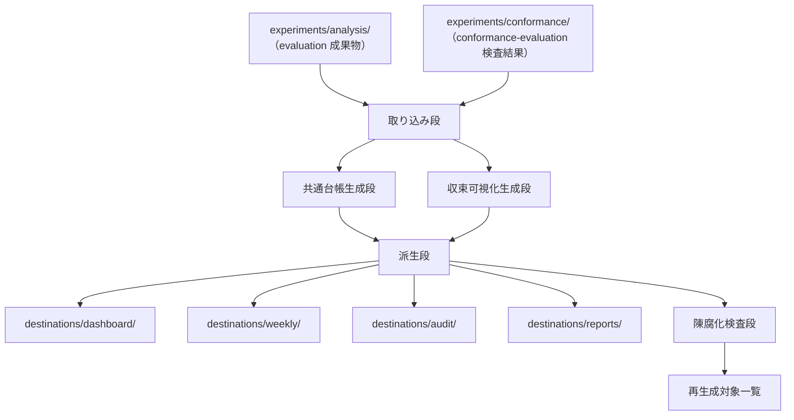

# analysis implementation recheck target

## Review purpose
Review the corrected analysis implementation after the previous implementation triad-review findings were applied.
Focus on whether implementation, schemas, tests, and workflow boundaries satisfy `.reviewcompass/specs/analysis/{requirements,design,tasks}.md`.

## Previous triage status
- previous_run: 2026-06-03-implementation-review-run
- decided_items: 21
- final_label_counts: {"leave-as-is": 3, "must-fix": 11, "should-fix": 7}
- all previous must-fix / should-fix items have non-empty applied_files in triage.yaml.

## Local verification already run
- `.venv/bin/python3 -m pytest tests/analysis -q` => `103 passed`
- `.venv/bin/python3 tools/api_providers/review_triage.py assert-apply-fixes-ready --review-run-dir .reviewcompass/specs/analysis/reviews/2026-06-03-implementation-review-run --approval-record .reviewcompass/specs/analysis/reviews/2026-06-03-implementation-review-run/approval-triage-2026-06-04.yaml` => `apply_fixes_ready: true`

## Recheck criteria
- Report only substantive issues that remain after the previous triage corrections.
- Check schema / builder / test alignment for T-001 through T-011.
- Check that analysis reads evaluation and conformance-evaluation artifacts without writing upstream evaluation outputs.
- Check that invalid / analysis_blocked evidence remains excluded from report entries but is traceable in exclusion records.
- Check that caveat_register append-only and empty-register behavior is safe.
- Check that staleness detection is timestamp-based and does not silently skip newer dependency artifacts.
- Check that convergence role/mode summaries preserve required fields and evidence_refs.
- Check that prior must-fix / should-fix responses are actually addressed, not merely recorded.

## Target files
### .reviewcompass/specs/analysis/requirements.md
```md
# Requirements Document：analysis

## Introduction

`analysis` は `runtime` と `evaluation` の出力を、分析向け成果物に変換する機能である。本仕様は読み物（運用ダッシュボード、週次レポート、監査用、論文）そのものの執筆を扱うのではなく、それらに必要な構造化入力をどのように受け取り、どう整理するかを定義する。先行プロジェクトでは `paper-interface`（論文向け）と呼ばれていたが、ReviewCompass では出力先を 4 種（運用ダッシュボード／週次／監査／論文）に拡張し、機能名を `analysis` に改称した（計画書 §5.14、§5.15.6）。

本仕様の重要な制約は、読み物の都合が `runtime` 規則を逆流的に変えてはならないことである。

## Boundary Context

- **In scope（範囲内）**
  - 主張から証拠への写像
  - 必須の読み物向け入力
  - 図表入力の契約
  - 注意点と限界の追跡
  - 読み物向け派生報告断片
  - レビュー収束過程の可視化（計画書 §5.14.5、ReviewCompass 新規追加）
  - 4 種の出力先（運用ダッシュボード／週次／監査／報告書）への変換

- **Out of scope（範囲外）**
  - `runtime` の規則定義
  - `evaluation` のメトリクス定義
  - 完全な読み物（報告書等）の執筆作業の流れ
  - 外部投稿のパッケージ化
  - 上流文書との適合性評価（`conformance-evaluation` の責務）

- **隣接仕様の期待**
  - `evaluation` から比較準備済みデータを受け取る
  - `foundation` の証拠フィールド命名に依存する
  - `self-improvement` とは改善提案と分析叙述を混同しない
  - `workflow-management` から所定手続きの実行履歴に対する可視化要求を受ける
  - `runtime` には原則として `evaluation` を経由してアクセスし、直接アクセスしない（Requirement 4 受入 1 と整合）

## Requirements

### Requirement 1：主張から証拠への写像

**目的（Objective）**：執筆者・分析者が、主張から具体的証拠源への明示的な写像を入手し、分析向け主張が `runtime` と `evaluation` の成果物まで追跡可能となるようにする。

#### 受入基準（Acceptance Criteria）

1. 本分析機能は主張がどのように具体的証拠源に写像されるかを定義する。
2. 本分析機能は各主張を支える成果物について、実行と分析の来歴を保持する。
3. 本分析機能は直接証拠と、注意点付き／予備的証拠を区別する。
4. 本分析機能は `evaluation` の出力を消費し、生の実行ログを直接再解釈しない。`evaluation` 出力が存在しない場合は、生のログへ直接アクセスせず、`evaluation` 処理の実行を要求する。
5. 本分析機能は版付き証拠まで追跡できない主張支持成果物を許容しない。
6. 本分析機能は主張を「分析向けの言明であり、主張から証拠への写像の単位となるもの」と定義する。各主張は最低限、識別子と明示的な証拠源への連結を持つことを要求する。これにより Requirement 1〜3 が検証可能であり続ける。

### Requirement 2：分析向けデータ契約

**目的**：下流の報告消費者が、分析向け図表と要約に対する安定した入力契約を入手し、`runtime` の意味を変えずに報告を再生成できるようにする。

#### 受入基準

1. 本分析機能は図表の原データ成果物に必要なフィールドを定義する。
2. 本分析機能は `evaluation` の出力への来歴連結を要求する。
3. 本分析機能は分析向け成果物を、生の証拠と中核の `evaluation` 出力から分離して保持する。
4. 本分析機能は上流の `evaluation` 出力が不変な場合、再生成を支える。
5. 本分析機能は書式上の都合のみで `runtime` または `foundation` のスキーマ変更を強制しない。
6. 本分析機能は、上流の `evaluation` 出力が実行無効化に伴い陳腐化マーク（`foundation` Requirement 6 受入 9 ＋ `evaluation` Requirement 5 受入 6 による）された場合、それらの出力が変更されなくとも、分析向け成果物の再生成を要求する。

### Requirement 3：注意点と限界の追跡

**目的**：執筆者・分析者が、注意点と限界が報告成果物に紐づき続けるようにし、叙述の簡略化が方法論上の制約を消さないようにする。

#### 受入基準

1. 本分析機能は証拠源に関連する注意点メタデータを保持する。
2. 本分析機能は無効データ除外、部分証拠、方法論上の限界を区別する。
3. 本分析機能は生の保管庫を手作業で読み直さずに、分析向け要約から注意点を参照できるようにする。
4. 本分析機能は意図的に未完成の証拠について、予備（preliminary）ラベル付与を支える。
5. 本分析機能は注意点付き証拠を、強い証拠へ黙示的に昇格させない。

### Requirement 4：`runtime` と `evaluation` ロジックからの分離

**目的**：保守担当者が、分析層が下層を消費するのみで支配しないようにし、報告の都合が `runtime` または `evaluation` の挙動を歪めないようにする。

#### 受入基準

1. 本分析機能は `evaluation` の出力を消費し、`evaluation` 規則を直接変更しない。
2. 本分析機能は `runtime` クリティカルなメタデータ要件を、`foundation` から独立に定義しない。
3. 本分析機能は無効化方針を上書きしない。
4. 本分析機能は読み物の都合を、再現性と有効性に対して従属的に扱う。
5. 本分析機能は下流の叙述変換を明示的かつ版管理可能とする。

### Requirement 5：予備証拠と成熟証拠の区別

**目的**：研究者・分析者が、分析向け成果物で成熟証拠と探索的・予備的証拠を区別し、報告の正確性を保つ。

#### 受入基準

1. 本分析機能は予備証拠の明示的ラベル付与を支える。
2. 本分析機能は証拠が安定比較セット由来か、探索的分析由来かを保持する。
3. 本分析機能は混合成熟度の報告を、区別が見える形でのみ許容する。
4. 本分析機能は成熟証拠と予備証拠を同一の未分化成果物に潰さない。
5. 本分析機能は後の精緻化または置換に必要な追跡可能性を保持する。
6. 本分析機能は Requirement 1、3、5 を横断する単一の統一証拠分類語彙を使用する。`foundation` の正本証拠区分フィールド（Requirement 6 受入 8）に紐づき、要件ごとに独立した分類用語を維持しない。

### Requirement 6：報告におけるレビューモード由来情報

**目的**：執筆者・分析者が、支援証拠が手動 dogfooding レビュー由来か、サブエージェント経由レビュー由来か、実行時経由レビュー由来かを保持し、初期検証段階の記録が他経路の証拠として過大評価されないようにする。

#### 受入基準

1. 本分析機能は分析向け成果物にレビューモード由来情報を保持する。語彙正本は `foundation` Requirement 6 受入 6 を参照する（値は `foundation` 正本が定め、本機能は再定義しない）。
2. 本機能は手動 dogfooding 証拠、サブエージェント経由証拠、実行時経由証拠を、それぞれ別々に報告することを許容する。
3. 本機能は手動レビュー記録を、明示的なラベル付与なしに実行時経由証拠として提示しない。サブエージェント経由証拠も同様。
4. 本機能は同一の報告集合に混合レビューモードが現れる場合、注意点の付与を支える。
5. 本機能は初期の手動証拠を、後の実行時経由証拠で置換するのに必要な追跡可能性を保持する。

### Requirement 7：レビュー収束過程の可視化（ReviewCompass 新規追加、§5.14.5 由来）

**目的**：分析者・運用者が、レビューが収束していく過程（同一対象に対する複数の役・複数の処理方式・複数の経路の結果が、最終結果に至るまでの過程）を可視化できるようにし、レビューの内部動態を読み手に伝える。

#### 受入基準

1. 本分析機能はレビュー収束過程を時系列または役横断で可視化するための構造化入力を定義する。
2. 本分析機能は 3 役（`primary`／`adversarial`／`judgment`）の所見出力の差分（`findings_by_method` 由来、計画書 §5.9.6）を保持し、可視化に渡す。最低限の構造化入力は、機能名（feature）、役名（role）、所見集計（重大度別件数・対応分布）、対象識別子（target）の 4 要素を含む。
3. 本分析機能は `foundation` の review_mode 正本が定める各レビューモード別の所見出力の差分を保持し、可視化に渡す。最低限の構造化入力は、機能名（feature）、レビューモード（review_mode）、所見集計（重大度別件数）、対象識別子（target）の 4 要素を含む。
4. 本分析機能はレビュー収束過程の可視化を `evaluation` の標準集計と区別し、`evaluation` の出力を加工した派生成果物として位置付ける。

### Requirement 8：4 種の出力先への変換（ReviewCompass 拡張、§5.14.4 由来）

**目的**：運用者・分析者・監査担当・研究者が、本機能の出力を 4 種の異なる出力先で利用できるようにする。

#### 受入基準

1. 本分析機能は最低限、運用ダッシュボード、週次レポート、監査用報告、報告書向け原データの 4 種の出力先を支える。各出力先の最低限必須成果物は次のとおり：
   - **運用ダッシュボード**：所見集計（重大度別／フェーズ別）、現在進行中の所定手続きの状態一覧
   - **週次レポート**：時系列推移（前週との差分）、注目所見の上位 N 件、規律遵守率の変化
   - **監査用報告**：無効化マーカーの一覧、検証器失敗の追跡、規律違反件数集計
   - **報告書向け原データ**：主張から証拠への完全な追跡表、3 方式比較データ、レビューモード別比較データ
2. 本分析機能は出力先ごとに必要な情報粒度と要約レベルの差を許容する。
3. 本分析機能はすべての出力先で `evaluation` 経由の証拠への追跡可能性を保持する。
4. 本分析機能は出力先ごとの加工方針を明示的かつ版管理可能とする。
5. 本分析機能は `conformance-evaluation` メトリクス（12 criteria の検査結果、計画書 §5.14.3 カテゴリ 5 ／§5.14.8 由来）を入力として取り込み、4 種の出力先のうち適切なもの（特に監査用報告と報告書向け原データ）に統合する。本受入は `conformance-evaluation` 機能との一方向取り込み（analysis ← conformance-evaluation の read）を成立させる。本機能は `conformance-evaluation` の判定作業を行わず（Boundary Context Out of scope と整合）、出力データのみを取り込む。

## Change Intent

本仕様は先行プロジェクトの `paper-interface` 仕様を改称・拡張したものであり、計画書 §5.14 の方針に従って次を反映：

ReviewCompass 固有の追加：

- 機能名 `paper-interface` を `analysis` に改称（計画書 §5.15.6）
- 4 種の出力先（運用ダッシュボード／週次／監査／報告書）への変換を Requirement 8 として新設（§5.14.4 由来）
- レビュー収束過程の可視化を Requirement 7 として新設（§5.14.5 由来、ReviewCompass 新規追加）
- レビューモード語彙に `subagent_mediated` を含む 3 値体制を Requirement 6 に反映（`foundation` Req 6 受入 6 と連動、計画書 §5.18.13／§5.23.12 由来）。その後 2026-06-02 に `api_mediated` を追加し 4 値体制へ拡張（`foundation` 正本を参照、本機能の受入記述は固定値を持たず参照方式に変更）
- 隣接仕様として `workflow-management` を追加（Boundary Context 隣接期待、計画書 §3.1 由来、conformance-evaluation は Out of scope）
- Requirement 2 受入 6 を陳腐化伝播の連動として `foundation` Req 6 受入 9 ＋ `evaluation` Req 5 受入 6 へ参照（A-001／A-003 の機能横断整合と関連）
- Requirement 5 受入 6 で `foundation` Req 6 受入 8 への連動を明示（`evidence_class` 語彙正本の参照）

機能横断レビューで対処された所見：

- 機能横断波及所見の対処履歴は [.reviewcompass/pending-cross-feature-findings.md](../../pending-cross-feature-findings.md) を参照（A-001 `not_run` 欠落 → 2026-05-23 対処済み、A-003 `analysis_blocked` 欠落 → 2026-05-23 対処済み）

```

### .reviewcompass/specs/analysis/design.md
```md
---
type: design
target: analysis
target_phase: design
draft_basis: requirements_conformance_priority
related_requirements: .reviewcompass/specs/analysis/requirements.md
related_designs:
  - .reviewcompass/specs/foundation/design.md
  - .reviewcompass/specs/evaluation/design.md
authors:
  - claude_code_main_session（drafter）
date: 2026-05-25
---

# Design Document：analysis

## 概要（Overview）

`analysis`（分析機能）は、`runtime`（実行時機能）と `evaluation`（評価機能）の成果物を受け取り、4 種の利用先（運用ダッシュボード／週次レポート／監査用報告／報告書）に向けた構造化された分析向け成果物に変換する機能である。

本 design は次を具体的に定める。

- 主張から証拠への対応付け
- 図表入力と報告断片の契約
- 注意点と成熟度の継承方法
- レビュー収束過程の可視化に必要な構造化入力
- 4 種の利用先ごとの派生成果物
- `conformance-evaluation`（規律遵守検査機能）からの判定結果の取り込み
- 報告の都合が下流仕様に逆流しない境界

本機能は読み物（運用ダッシュボード・週次・監査・報告書）の本文を執筆する機能ではなく、それらに必要な「構造化された入力」を整える層である。執筆活動そのものは利用者の責務に属する。

先行プロジェクトでは `paper-interface`（論文向け）という機能名で論文 1 系統のみを扱っていたが、ReviewCompass では 4 出力先への拡張・レビュー収束過程の可視化・規律遵守検査結果の取り込みを加え、機能名を `analysis` に改称した（計画書 §5.14／§5.15.6）。

## 目標（Goals）

- 主張を支える成果物を、来歴情報まで含めて追跡可能にする
- 成熟証拠と予備証拠を見分けられる構造化入力を作る
- 注意点と限界を、要約や叙述の過程で取り落とさない
- `evaluation` の成果物から再生成可能な分析向け成果物を作る
- 4 種の利用先（運用ダッシュボード／週次／監査／報告書）に対し、共通の追跡可能性を保持しつつ利用先ごとの加工を許容する
- レビュー収束過程（3 役およびレビューモード別の所見差分）を可視化に渡せる形で保持する
- `conformance-evaluation` の検査結果を取り込み、監査用報告と報告書向け原データに統合する

## 範囲外（Non-Goals）

- `runtime` フィールドの再定義
- `evaluation` のメトリクス規則の変更
- 読み物（運用ダッシュボード／週次／監査／報告書）の本文執筆
- 外部投稿のパッケージ化
- 上流文書との適合性評価（`conformance-evaluation` の責務）
- 規律違反の判定そのもの（`conformance-evaluation` の責務、本機能は判定結果を取り込むのみ）
- 生実行ディレクトリへの直接アクセス（`evaluation` の成果物を経由する）

## 設計の前提（Design Drivers）

- 報告の都合は再現性と有効性に従属する
- 生実行成果物を直接読まない。`evaluation` の成果物を読む。`evaluation` の成果物が存在しない場合は生のログにフォールバックせず、評価処理の実行を要求する（要件 1 受入 4）
- 主張は証拠源と来歴情報を失わない
- 予備証拠は明示的に分類ラベルを付ける
- 4 出力先は共通の証拠台帳と主張対応図を共有し、出力先ごとに派生形を作る（共通部分と派生部分の構造的分離）
- 上流から伝播してくる陳腐化標識を保持し、無声に新しい成果物として扱わない

## 全体構造（Architecture）

本機能は次の 5 段に分ける。

1. **取り込み段（intake）**：`evaluation` の成果物を読み、欠落・陳腐化を判定する
2. **共通台帳生成段（shared registry generation）**：主張対応図・証拠台帳・注意点台帳を生成する
3. **収束可視化生成段（convergence visualization）**：3 役およびレビューモード別の所見差分を構造化入力に変換する
4. **派生段（destination derivation）**：4 出力先ごとに必要な成果物を派生させる
5. **陳腐化検査段（staleness check）**：上流陳腐化に伴う再生成対象を識別する



### 構成要素（Components）

- `intake reader`：`evaluation` および `conformance-evaluation` の成果物を読み込み、必須入力の有無と陳腐化標識を確認する
- `shared registry builder`：主張対応図・証拠台帳・注意点台帳の共通成果物を組み立てる
- `convergence visualization builder`：3 役およびレビューモード別の所見差分から可視化向け構造化入力を組み立てる
- `destination deriver`：共通成果物と可視化入力から、4 出力先ごとの派生成果物を組み立てる
- `staleness checker`：上流陳腐化標識を受け、本機能の派生成果物に再生成対象標識を付ける

## 分析向け成果物配置（Analysis Output Layout）

本機能の正本出力先は `analysis/` 配下とし、共通台帳（shared）と出力先別派生（destinations）の 2 層構造を採る（利用者承認方針 Y(イ)、2026-05-25 セッション 25）。

```text
analysis/
├── shared/
│   ├── claim_map.json              # 主張から証拠への対応図（共通）
│   ├── evidence_register.json      # 証拠台帳と来歴情報（共通）
│   ├── caveat_register.json        # 注意点と限界の台帳（共通）
│   ├── conformance/
│   │   └── conformance_intake.json # conformance-evaluation 取り込み正本（Req 8 受入 5、A-010 対処）
│   ├── convergence/
│   │   ├── role_diff.json          # 3 役の所見差分（Req 7 受入 2）
│   │   └── mode_diff.json          # レビューモード別の所見差分（Req 7 受入 3）
│   └── manifests/
│       ├── analysis_manifest.yaml  # 本機能の論理版と入力被覆
│       ├── intake_failure_report.json # 取り込み失敗の構造化報告（要件 1 受入 4、F-009 対処）
│       └── staleness_register.json # 陳腐化登録
├── destinations/
│   ├── dashboard/
│   │   ├── operations_summary.json # 所見集計・進行手続き状態
│   │   └── manifest.yaml
│   ├── weekly/
│   │   ├── trend_summary.json      # 時系列推移・注目所見・規律遵守率変化
│   │   └── manifest.yaml
│   ├── audit/
│   │   ├── invalidation_index.json # 無効化マーカー一覧
│   │   ├── validator_failure_trace.json # 検証器失敗の追跡
│   │   ├── discipline_violation_index.json # 規律違反件数集計
│   │   ├── conformance_violations_detail.json # 取り込み正本の加工版（違反所見の詳細表示、A-010 対処）
│   │   └── manifest.yaml
│   └── reports/
│       ├── claim_evidence_trace.json # 主張から証拠への完全な追跡表
│       ├── treatment_comparison_report.json # 3 方式比較データ
│       ├── mode_comparison_report.json # レビューモード別比較データ
│       ├── conformance_compliance_trend.json # 取り込み正本の加工版（規律遵守率の時系列、A-010 対処）
│       └── manifest.yaml
├── figures_tables/
│   ├── table_source_bundles/
│   │   └── <table_id>.json
│   └── figure_source_bundles/
│       └── <figure_id>.json
└── fragments/                          # 報告断片（fragment_type 5 値正本、F-016 対処 2026-05-28 セッション 36）
    └── <fragment_id>.json
```

### 配置の根拠（Placement Rationale）

- **`shared/`**：4 出力先で共通に参照される台帳群を集約する。主張対応図・証拠台帳・注意点台帳・収束差分は 4 出力先のすべてが追跡可能性の根拠として参照するため、複製ではなく単一配置とする（要件 8 受入 3：追跡可能性を共通保持）
- **`destinations/<出力先>/`**：4 出力先ごとに必要な情報粒度と要約レベルを別の成果物として持つ（要件 8 受入 2）。各出力先の `manifest.yaml` はその出力先固有の加工方針と版を記録する（要件 8 受入 4）
- **`figures_tables/`**：図表の原データ束は出力先によらず再利用可能であるため、`shared/` でも `destinations/` でもなく独立した配置とする
- **`fragments/`**（F-016 対処 2026-05-28 セッション 36）：報告断片（`claim_summary` ／ `method_note` ／ `limitation_note` ／ `comparison_summary` ／ `trend_summary` の 5 値 `fragment_type` 正本）は図表束（`figures_tables/`）と兄弟関係であり、出力先によらず再利用可能（複数出力先が異なる組み合わせで参照する）であるため独立配置とする
- **共通／派生の分離理由**：要件 8 受入 3 が「すべての出力先で `evaluation` 経由の証拠への追跡可能性を保持する」と求める。共通台帳を 1 か所に置くことで、出力先ごとに台帳を複製しない（追跡情報の散逸防止）

### 本機能が所有する語彙正本と下流参照禁止（Owned Vocabularies and Downstream Reference Rule、A-010 対処 2026-05-28 セッション 36）

本機能は次の 4 語彙を正本として所有し、下流機能（`self-improvement` 等）は **再定義禁止で参照のみで使用** する。本規律は foundation の語彙正本所有規律（`evidence_class` ／ `review_mode` ／ `counter_status` 等の正本所有と下流参照禁止）と同型である。

| 語彙 | 値域 | 確定タスク | 用途 |
|---|---|---|---|
| `maturity_label` | 3 値（`mature` ／ `preliminary` ／ `exploratory`） | T-004 | 証拠の成熟度ラベル（`evidence_class` 由来の派生分類） |
| `limitation_type` | 4 値（`invalid_data_exclusion` ／ `partial_evidence` ／ `methodological_limitation` ／ `mixed_review_mode`） | T-005 | 注意点・限界の種別 |
| `fragment_type` | 5 値（`claim_summary` ／ `method_note` ／ `limitation_note` ／ `comparison_summary` ／ `trend_summary`） | T-006 | 報告断片の種別 |
| `regeneration_status` | 4 値（`pending` ／ `in_progress` ／ `completed` ／ `failed`） | T-010 | 再生成タスクの状態 |

**下流参照禁止規律**：

- `self-improvement` ／ 他下流機能は上記 4 正本を **再定義してはならない**。本機能の確定値を **参照のみで使用** する
- 値域の拡張・変更が必要になった場合は、本機能設計の改訂で対応（下流での再定義は禁止）
- 本規律は T-011 完了条件の機械検証対象に含める：下流機能の仕様文書・実装コードで本機能 4 正本の re-definition が無いことを grep または静的解析で確認

### 出力先ごとの最低限必須成果物（Required Artifacts per Destination）

要件 8 受入 1 の 4 出力先それぞれに対応する最低限の成果物：

| 出力先 | 最低限必須成果物 | 主な利用者 |
|---|---|---|
| 運用ダッシュボード | 所見集計（重大度別・フェーズ別）、進行中の所定手続きの状態一覧 | 運用者 |
| 週次レポート | 時系列推移（前週との差分）、注目所見の上位 N 件、規律遵守率の変化 | 運用者・分析者 |
| 監査用報告 | 無効化マーカー一覧、検証器失敗の追跡、規律違反件数集計、`conformance-evaluation` 検査結果 | 監査担当者 |
| 報告書向け原データ | 主張から証拠への完全な追跡表、3 方式比較データ、レビューモード別比較データ、`conformance-evaluation` 検査結果 | 研究者・分析者 |

## 主張対応モデル（Claim Mapping Model）

### 1. 主張単位（Claim Unit）

本機能は主張を 1 つの成果物単位として扱う。主張とは、分析向けの言明であり、主張から証拠への対応付けの単位となるもの。最低限、識別子と明示的な証拠源への連結を持つ（要件 1 受入 6）。

`shared/claim_map.json` の各エントリは少なくとも次の項目を持つ。

- `claim_id`：主張の安定識別子
- `claim_text`：主張の本文
- `supporting_artifact_refs`：根拠とする成果物への参照（後述 §3 参照書式に従う）
- `provenance_refs`：来歴情報（実行 ID／改訂版／対象識別子等）への参照
- `caveat_refs`：適用される注意点への参照
- `maturity_label`：成熟度ラベル（後述 §証拠台帳モデル §2 で定義）
- `stale`：陳腐化標識（真偽、後述 §陳腐化伝播の継承）
- `stale_reason`：陳腐化の理由（任意）
- `stale_source_ref`：陳腐化の起点となった上流標識への参照（任意）

**必須／任意の区分（A-006＋F-003 対処、2026-05-25 セッション 25）**：

- 必須：`claim_id`、`claim_text`、`supporting_artifact_refs`、`maturity_label`、`stale`
- 任意：`provenance_refs`（無ければ空配列）、`caveat_refs`（無ければ空配列）、`stale_reason`、`stale_source_ref`
- 条件付き必須：`stale_reason` と `stale_source_ref` は `stale=true` のとき必須

### 2. 根拠成果物の入力源（Supporting Artifact Sources）

標準的な入力源は次に限定する。入力はすべて `evaluation` の成果物配置を基準ディレクトリとして相対パスで解決する（foundation 要件 4 受入 4 と整合）。

- `experiments/analysis/comparisons/treatment_comparisons.json`（3 方式比較）
- `experiments/analysis/comparisons/phase_comparisons.json`（フェーズ別比較）
- `experiments/analysis/classifications/exclusion_report.json`（除外報告）
- `experiments/analysis/caveats/caveat_register.json`（注意点台帳、上流由来）
- `experiments/analysis/modes/mode_diff_report.json`（レビューモード別差分）
- 必要に応じて `experiments/analysis/metrics/*.json`
- `experiments/conformance/<検査結果>.json`（規律遵守検査結果、Req 8 受入 5）

`runtime` の生証拠は主張根拠の一次入力にしない（Req 4 受入 1 と整合）。

### 3. 参照書式（Reference Format、本機能内で共通）

`*_ref`／`*_refs` 系のフィールド（`supporting_artifact_refs`／`caveat_refs`／`provenance_refs`／`stale_source_ref` 等）は、裸のパス文字列でも裸の識別子でもなく、次の構造化参照を用いる。

- `ref_type`：参照先成果物の種別（例：`treatment_comparison`／`exclusion_report`／`caveat_entry` 等）
- `target_path`：基準ディレクトリ起点の相対パス
- `target_id`：成果物内の安定識別子（任意、エントリ単位で指す場合に用いる）

`*_ref`（単数）は上記オブジェクト 1 個、`*_refs`（複数）はその配列とする。これにより、ファイル名の部分一致や経路推測に依存せず、機械的に追跡が検証可能となる（要件 1 受入 5）。

## 証拠台帳モデル（Evidence Register Model）

### 1. 成熟度ラベル（Maturity Label）

成熟度ラベルの初版は次の 3 値とする。

- `mature`（成熟）
- `preliminary`（予備）
- `exploratory`（探索的）

注意点付き（caveated）は成熟度ラベルではなく、`caveat_refs` で表現する。これにより、1 つの成果物が `mature` でありつつ注意点を持つ状態を表現できる。

成熟度ラベルと foundation の証拠区分（`evidence_class` 4 値正本）は別軸だが独立ではない。foundation の `evidence_class`（`valid`／`invalid`／`exploratory`／`analysis_blocked`、所有者は foundation）を本機能は再定義せず正本フィールドとして保持し、成熟度ラベル `maturity_label` はそれに束縛される派生分類とする（要件 5 受入 6）。

束縛規則：

| foundation の `evidence_class` | 本機能の `maturity_label` |
|---|---|
| `invalid` | 報告対象外（除外報告に出すが報告書向け原データには出さない） |
| `exploratory` | `exploratory` |
| `analysis_blocked` | 報告対象外（除外報告に出すが標準母集団に入れない） |
| `valid` かつ安定比較集合に属する | `mature` |
| `valid` かつ安定比較集合に属さない | `preliminary` |

**「安定比較集合」の判定基準**：`evaluation` 設計 §分類モデル §6 の `admission_register.json` における `eligible_for_standard_comparison`（標準比較対象として許容済み）フィールドが真の証拠を指す（F-005 対処、`evaluation` 側の正本フィールドを暗黙参照ではなく明示参照とする）。

**自動付与規律（A-007 対処、2026-05-25 セッション 25）**：

- `evidence_class=exploratory` の証拠は、`caveat_refs` に「予備的証拠」を示す注意点エントリへの参照を最低 1 件含める（自動付与）。要件 3 受入 5「予備または探索的な証拠を成熟証拠と同列に扱わない」を機械検証する根拠となる
- `evidence_class=analysis_blocked` の証拠は標準母集団に入らない（除外報告に出すのみ）。`caveat_refs` 付与は任意
- `evidence_class=invalid` の証拠は報告対象外（評価段で除外報告に出され、本機能は取り込まない）
- `evidence_class=valid` の証拠は注意点を持つことも持たないことも許容（`caveat_refs` は任意）

### 2. 来歴情報フィールド（Provenance Fields）

`shared/evidence_register.json` の各エントリは少なくとも次の項目を持つ。

- `evidence_id`：本機能の証拠台帳における安定識別子
- `artifact_ref`：原成果物への参照（`evaluation` の成果物）
- `source_analysis_manifest_ref`：`experiments/analysis/manifests/analysis_run_manifest.yaml` への参照
- `input_run_set_ref`：根拠とした実行集合への参照
- `evidence_class`：foundation 由来の証拠区分（再定義しない束縛フィールド）
- `review_mode`：foundation 由来のレビューモード（値は foundation 正本を参照、再定義しない）
- `maturity_label`：`evidence_class` に束縛された派生分類
- `caveat_refs`：適用される注意点への参照
- `supersedes`：本エントリが置換した先行証拠への参照（無ければ空）
- `superseded_by`：本エントリを置換した後続証拠への参照（無ければ空）
- `stale`／`stale_reason`／`stale_source_ref`：陳腐化標識
- `generated_at`：生成時刻

**必須／任意の区分**：

- 必須：`evidence_id`、`artifact_ref`、`source_analysis_manifest_ref`、`input_run_set_ref`、`evidence_class`、`review_mode`、`maturity_label`、`stale`、`generated_at`
- 任意：`caveat_refs`（無ければ空配列、ただし `evidence_class=exploratory` のときは §1 自動付与規律により最低 1 件必須）、`supersedes`（無ければ空配列）、`superseded_by`（無ければ空配列）、`stale_reason`、`stale_source_ref`
- 条件付き必須：`stale_reason` と `stale_source_ref` は `stale=true` のとき必須

これにより、どの分析論理版とどの実行集合から報告断片が作られたかを追跡でき、`preliminary` から `mature` への遷移や、手動経路から実行時経路への置換系譜も辿れる（要件 5 受入 5、要件 6 受入 5）。

### 3. レビューモードの保持（Review-Mode in Reporting）

分析向け成果物はレビュー実施モードの由来情報を保持する（要件 6）。

- `review_mode` を `evidence_register` に保持し、報告断片が手動 dogfooding 由来か実行時経由由来かサブエージェント経由由来かを失わない（受入 1）
- 手動由来証拠と実行時由来証拠とサブエージェント由来証拠は分離して報告でき、混在を強制しない（受入 2）
- 手動レビュー記録を、明示ラベルなしに実行時由来証拠として提示しない。サブエージェント由来も同様（受入 3）
- 同一の報告集合に複数のレビューモードが混在する場合、機械的に検知して注意点を自動付与する（受入 4）。検知条件：当該報告集合が参照する `evidence_register` エントリの `review_mode` が 2 値以上
  - **検知主体**：本機能の派生段（destination deriver）が報告集合（destinations/<出力先>/ 配下の成果物）の組み立て時に検知する
  - **付与先**：`shared/caveat_register.json` に `limitation_type=mixed_review_mode` のエントリを自動追加（`narrative_note` は機械生成、例：「報告集合 X に手動由来 12 件、実行時由来 8 件、サブエージェント由来 3 件が混在」）
  - **evaluation 側との粒度分担**：`evaluation` 側は実行レベルの混在を検知して注意点を付与、本機能は報告集合レベル（destination 単位）の混在を検知して注意点を付与する（粒度が異なるため両者を保持、要件 6 受入 4 と整合）
  - **過渡的対処の位置付け**：本機構は過渡期・移行時・配置先テストケースで発生する混在状態への対処であり、恒久運用の中核仕様ではない（詳細は §注意点と限界のモデル §`mixed_review_mode` の位置付けを参照）
- 初期の手動証拠を後の実行時由来証拠で置換した系譜を保持する（受入 5）。置換リンクは §2 で定義した `supersedes`／`superseded_by` を用いる

## 注意点と限界のモデル（Caveat and Limitation Model）

本機能は `evaluation` の `caveat_register.json` を継承しつつ、分析向けの説明単位として再配置する。

`shared/caveat_register.json` は少なくとも次の項目を持つ。

- `caveat_id`：本機能の注意点台帳における安定識別子
- `source_caveat_ref`：上流の `evaluation` 注意点台帳エントリへの参照
- `applies_to_claim_refs`：適用される主張への参照（複数可）
- `applies_to_artifact_refs`：適用される成果物への参照（複数可）
- `limitation_type`：限界の種別（後述）
- `narrative_note`：注意点の構造化メモ（本文ではなく、執筆者が限界を取り落とさないための覚書）

**必須／任意の区分**：

- 必須：`caveat_id`、`limitation_type`、`narrative_note`
- 任意：`source_caveat_ref`（上流由来の場合のみ持つ、自動付与の `mixed_review_mode` は持たない）、`applies_to_claim_refs`（無ければ空配列）、`applies_to_artifact_refs`（無ければ空配列）
- 条件付き必須：`applies_to_claim_refs` と `applies_to_artifact_refs` の少なくとも一方は非空（適用先のない注意点は許容しない）

`limitation_type` の初版列挙は要件 3 受入 2 の 3 分類と、要件 6 受入 4 由来の自動検知種別 1 値を合わせた **4 値正本** とする（2026-05-25 セッション 25 で `mixed_review_mode` を追加、F-012＋A-009 対処）。

- `invalid_data_exclusion`：無効データ除外に起因する限界
- `partial_evidence`：部分的証拠に起因する限界
- `methodological_limitation`：方法論上の限界
- `mixed_review_mode`：混在レビューモード状態（過渡的対処、要件 6 受入 4 の自動検知由来）

**`mixed_review_mode` の位置付け（過渡的対処）**：本値は「同一の報告集合に複数のレビューモードが混在する状態」を機械検知して注意点として自動付与するための種別である。混在は主に次の 3 つの場面で発生する：

- 過渡期（フェーズ 1〜3）：実 LLM 経路（`runtime_mediated`）が未実装のため、手動 dogfooding とサブエージェント経由が混在
- 段階的移行時：手動由来の証拠を後追でサブエージェント経由や実行時経由に置き換える期間（要件 6 受入 5 の置換系譜と連動）
- 配置先テストケースとして手動 dogfooding を継続するとき：本番運用（`runtime_mediated`）と並べて集計する場合

恒久運用の日常業務（フェーズ 4 完了後）では、報告集合内の証拠は基本的に単一のレビューモードで揃うため、`mixed_review_mode` の出現は稀となる見通し。本値の運用必要性はフェーズ 4 完了後に再評価する（§先送り論点に登録）。

将来拡張は本節に追記する形で行う（語彙拡張時の改訂は本機能の `analysis_logic_version` の更新を伴う）。

## 図表束モデル（Figure and Table Bundle Model）

図表の原データ束は出力先によらず再利用可能であるため、`figures_tables/` 配下に独立配置する。

### 1. 表原データ束（Table Source Bundle）

`figures_tables/table_source_bundles/<table_id>.json` は少なくとも次の項目を持つ。

- `table_id`：表の安定識別子
- `source_artifact_refs`：原成果物への参照（`evaluation` の比較／メトリクス成果物）
- `field_projection`：表に出す列の定義
- `maturity_label`：成熟度ラベル
- `caveat_refs`：適用される注意点への参照
- `applicable_destinations`：本表が利用される出力先の集合（例：`[weekly, reports]`）

**必須／任意の区分**：必須：`table_id`、`source_artifact_refs`、`field_projection`、`maturity_label`、`applicable_destinations`。任意：`caveat_refs`（無ければ空配列）

### 2. 図原データ束（Figure Source Bundle）

`figures_tables/figure_source_bundles/<figure_id>.json` は少なくとも次の項目を持つ。

- `figure_id`：図の安定識別子
- `source_artifact_refs`：原成果物への参照
- `plot_contract`：描画契約（どの切片／メトリクス／集約軸を用いるかの分析側定義）
- `maturity_label`：成熟度ラベル
- `caveat_refs`：適用される注意点への参照
- `applicable_destinations`：本図が利用される出力先の集合

**必須／任意の区分**：必須：`figure_id`、`source_artifact_refs`、`plot_contract`、`maturity_label`、`applicable_destinations`。任意：`caveat_refs`（無ければ空配列）

`plot_contract` は描画そのものではなく、どの切片・メトリクス・集約軸を用いるかの分析側定義とする。実際の描画工程は本機能の責務外（執筆者または可視化ツールが担う）。

## 報告断片モデル（Reporting Fragment Model）

報告断片は本文そのものではないが、4 出力先で再利用しやすい構造化された断片を保持する。出力先別の派生段が報告断片を組み合わせて出力先別成果物を作る。

各報告断片は少なくとも次の項目を持つ。

- `fragment_id`：断片の安定識別子
- `fragment_type`：断片の種別（初版 5 値正本：`claim_summary`（主張要約）／`method_note`（方法論ノート）／`limitation_note`（限界ノート）／`comparison_summary`（比較要約）／`trend_summary`（時系列要約）、将来拡張は本機能設計の改訂で対応、F-004 対処 2026-05-25 セッション 25）
- `source_artifact_refs`：原成果物への参照
- `maturity_label`：成熟度ラベル
- `caveat_refs`：適用される注意点への参照
- `text_stub`：構造化された断片本体（短文）
- `applicable_destinations`：本断片が利用される出力先の集合

**必須／任意の区分**：必須：`fragment_id`、`fragment_type`、`source_artifact_refs`、`maturity_label`、`text_stub`、`applicable_destinations`。任意：`caveat_refs`（無ければ空配列）

複数の出典を束ねる断片（例：`comparison_summary`）の成熟度集約規則：

- 断片の `maturity_label` は出典の最も保守的な値とする。順序は `exploratory` < `preliminary` < `mature` とし、出典に 1 つでも低い値があれば断片全体をその低い値にする
- 出典ごとの成熟度区分は断片内に保持し、束ねても見えなくしない（要件 5 受入 3：区別が見える形でのみ混在許容）
- 成熟度の異なる出典を単一の未分化値に圧縮しない（要件 5 受入 4）。集約値はあくまで保守表示であり、出典別成熟度の保持を代替しない

## レビュー収束過程の可視化モデル（Convergence Visualization Model）

要件 7 はレビューが収束していく過程の可視化を求める。本機能は時系列または役横断での可視化に必要な構造化入力を定義する。

### 1. 3 役の所見差分（Role Diff）

`shared/convergence/role_diff.json` は 3 役（`primary_reviewer`／`adversarial_reviewer`／`judgment_reviewer`）の所見出力の差分を保持する。出典は `evaluation` の `experiments/analysis/roles/role_diff_report.json`（evaluation 要件 9 受入 8、A-011 対処、2026-05-26 セッション 28 確定）。本機能は当該成果物を読み込んで内部表現に変換し、`shared/convergence/role_diff.json` として可視化向けに保持する。

各エントリは要件 7 受入 2 が定める最低限の 4 要素を含む。

- `feature`：機能名（例：`foundation`／`runtime` 等）
- `role`：役名（`primary`／`adversarial`／`judgment` のいずれか）
- `findings_summary`：所見集計
  - `by_severity`：重大度別の件数（foundation 4 値）
  - `by_final_label`：対応分布（foundation 3 値、`judgment` 役のとき必須、他役は不在または空）
  - `by_counter_status`：反証状態 3 値の件数（foundation 正本、`adversarial` 役のとき必須、他役は不在または空）。A-003 対処として追加（2026-05-25 セッション 25）、敵対役の有効性測定（要件 2 受入 2、ReviewCompass の中核価値命題）の可視化根拠
- `target`：対象識別子（レビュー対象成果物の識別子）
- `evidence_refs`：根拠とした証拠台帳エントリへの参照

**A-011 対処完了（2026-05-26 セッション 28）**：`evaluation` 設計に 3 役差分集約成果物 `experiments/analysis/roles/role_diff_report.json` が新設され、要件 9 受入 8 として正式定義された。本機能の出典記述を当該ファイルへの参照に書き換え（本セッション 28 で完了）。

**必須／任意の区分**：

- 必須：`feature`、`role`、`findings_summary.by_severity`、`target`
- 条件付き必須：`findings_summary.by_final_label` は `role=judgment` のとき必須、`findings_summary.by_counter_status` は `role=adversarial` のとき必須
- 任意：`evidence_refs`（無ければ空配列）

### 2. レビューモード別の所見差分（Mode Diff）

`shared/convergence/mode_diff.json` は `foundation` の review_mode 正本が定める各レビューモード別の所見出力の差分を保持する。出典は `evaluation` の `modes/mode_diff_report.json`。

各エントリは要件 7 受入 3 が定める最低限の 4 要素を含む。

- `feature`：機能名
- `review_mode`：foundation のレビューモード正本値（再定義しない）
- `findings_summary`：所見集計（重大度別件数）
- `target`：対象識別子
- `evidence_refs`：根拠とした証拠台帳エントリへの参照

**必須／任意の区分**：必須：`feature`、`review_mode`、`findings_summary`、`target`。任意：`evidence_refs`（無ければ空配列）

### 3. 派生成果物としての位置付け

本機能のレビュー収束可視化は `evaluation` の標準集計と区別し、`evaluation` の成果物を加工した派生として位置付ける（要件 7 受入 4）。これにより、本機能の可視化結果が `evaluation` のメトリクス契約を上書きすることはない。

## 出力先別の派生モデル（Destination-Specific Derivation Model）

要件 8 は 4 出力先への変換を求める。本機能は共通台帳と報告断片から、出力先ごとに必要な情報粒度と要約レベルを別の成果物として組み立てる。

### 1. 派生方針の明示と版管理（要件 8 受入 4）

各出力先の `destinations/<出力先>/manifest.yaml` は少なくとも次の項目を持つ。

- `destination`：出力先名（`dashboard`／`weekly`／`audit`／`reports`）
- `analysis_logic_version`：本機能の論理版
- `derivation_contract_version`：当該出力先の加工方針の版
- `included_evidence_refs`：派生に用いた証拠台帳エントリへの参照
- `included_caveat_refs`：派生に用いた注意点台帳エントリへの参照
- `granularity_profile`：情報粒度の指定（例：`run_level`／`finding_level`／`aggregate_only` 等の組み合わせ）
- `summary_level`：要約レベル（例：`raw`／`weekly_rollup`／`audit_index`／`full_traceability`）
- `review_mode_mixed`：当該出力先内のレビューモード混在の真偽（混在検知時は真、§証拠台帳モデル §3 受入 4 由来）

**必須／任意の区分**：必須：上記すべて。任意項目はなし。

派生方針が変わった場合は `derivation_contract_version` を更新し、過去の派生成果物は `superseded` として保持する。

### 2. 運用ダッシュボード（dashboard）

`destinations/dashboard/operations_summary.json` は少なくとも次を持つ。

- 所見集計（重大度別／フェーズ別）：根拠は `evaluation` の `metrics/finding_metrics.json`
- 進行中の所定手続きの状態一覧：根拠は `workflow-management` の所定手続き実行履歴（隣接期待）
- 派生時刻と被覆期間

### 3. 週次レポート（weekly）

`destinations/weekly/trend_summary.json` は少なくとも次を持つ。

- 時系列推移（前週との差分）：直近 2 週の `evaluation` メトリクスを比較
- 注目所見の上位 N 件：`severity` の上位（CRITICAL／ERROR）からの抽出
- 規律遵守率の変化：`conformance-evaluation` の検査結果由来（要件 8 受入 5 経由）
- 集計期間（始端時刻／終端時刻）

### 4. 監査用報告（audit）

`destinations/audit/` 配下の成果物群は次を持つ。

- `invalidation_index.json`：無効化マーカー一覧（`evaluation` の `caveats/caveat_register.json` および foundation 由来の無効化標識を集約）
- `validator_failure_trace.json`：検証器失敗の追跡（`evaluation` の `validator_status=failed` 集計）
- `discipline_violation_index.json`：規律違反件数集計（`conformance-evaluation` の検査結果由来、要件 8 受入 5）
- `conformance_violations_detail.json`：`shared/conformance/conformance_intake.json`（正本）の加工版（違反所見の詳細表示、A-010 対処、後述 §`conformance-evaluation` メトリクス取り込みモデル §3）

### 5. 報告書向け原データ（reports）

`destinations/reports/` 配下の成果物群は次を持つ。

- `claim_evidence_trace.json`：主張から証拠への完全な追跡表（`shared/claim_map.json` を出力先向けに加工）
- `treatment_comparison_report.json`：3 方式比較データ（`evaluation` の `comparisons/treatment_comparisons.json` を加工）
- `mode_comparison_report.json`：レビューモード別比較データ（`evaluation` の `modes/mode_diff_report.json` を加工）
- `conformance_compliance_trend.json`：`shared/conformance/conformance_intake.json`（正本）の加工版（規律遵守率の時系列、A-010 対処）

## `conformance-evaluation` メトリクス取り込みモデル（Conformance Intake Model）

要件 8 受入 5 は `conformance-evaluation`（規律遵守検査機能）の 12 基準の検査結果を取り込み、適切な出力先（特に監査用報告と報告書向け原データ）に統合することを求める。

### 1. 一方向取り込みの境界

本機能は `conformance-evaluation` の検査結果を **読むだけ** とする。

- 本機能は適合性判定そのものを行わない（Boundary Context の Out of scope と整合）
- 本機能は判定基準を変更しない、判定結果に上書きを加えない
- 取り込みは `analysis ← conformance-evaluation`（読み）の一方向

### 2. 取り込み成果物の構造（正本配置と加工版、A-010 対処 2026-05-25 セッション 25）

取り込みの正本配置は `shared/conformance/conformance_intake.json` の **単一ファイル** とする。`destinations/<出力先>/` 配下には正本の加工版を別名で配置する（判断 5 共通／派生 2 層構造との整合）。

正本：`shared/conformance/conformance_intake.json` は少なくとも次の項目を持つ。

- `conformance_run_ref`：`conformance-evaluation` の検査実行への参照
- `assessment_summary`：基準別（12 基準）の合否集計
- `violation_findings`：違反所見の集合（各違反は `severity`／`target`／`description`／`evidence_refs` を持つ）
- `compliance_rate`：規律遵守率（時系列追跡に用いる）
- `included_disciplines`：取り込み対象とした規律ファイルの集合
- `intake_at`：取り込み時刻

**必須／任意の区分**：必須：上記すべて。任意項目はなし。

**注（A-008 対処 2026-05-28 セッション 36）**：本機能の正本 `conformance_intake.json` の必須 6 項目は、上流 `conformance-evaluation` 設計 §14.5 の機械可読出力スキーマ（必須 9 件 ＋ 任意 2 件）を本機能の取り込みスキーマに再編成したもの。9 件から 6 項目への対応マッピング（集約・除外・統合の規則）は別途確定（TBD）、確定後ここに対応表を追記する。本確認事項は tasks.md DVT-A003 として登録、解除トリガー：`conformance-evaluation` の正本スキーマ実体化時。

### 3. 出力先ごとの加工版（別名で配置、A-010 対処）

- **監査用報告**：`destinations/audit/conformance_violations_detail.json`。正本の `violation_findings` を中心に、無効化標識との関連付けを含めて監査担当者が個別の違反を追跡できる粒度で保持
- **報告書向け原データ**：`destinations/reports/conformance_compliance_trend.json`。正本の `compliance_rate` と `assessment_summary` を中心に、時系列推移と基準別合否を報告書執筆時に集計値として利用できる粒度で保持

両加工版は正本の `conformance_run_ref` を参照することで、同一の取り込み結果から派生したことを機械的に確認できる。これにより、両加工版の整合保証（同じ取り込み結果に基づく）が成立する。

## 分離規則（Separation Rules）

### 1. 逆流禁止（No Reverse Control、要件 4 受入 1〜3）

本機能は次を行わない。

- `runtime` のフィールド追加要求を独自に出す
- 無効実行を有効証拠に格上げする
- `evaluation` の比較規則を独自に上書きする

### 2. 無声昇格の禁止（No Silent Strengthening、要件 3 受入 5）

予備または探索的な証拠を、分析向け成果物の生成時に成熟証拠と同列に扱ってはならない。

### 3. 自己改善との独立（Self-Improvement Independence）

`self-improvement` の改善提案は、分析向け主張の根拠成果物ではない。採用済みの改善履歴を方法論ノートとして参照することは許容するが、性能主張の一次根拠にしない。

### 4. `conformance-evaluation` 判定の不干渉（Conformance Judgment Non-Interference）

本機能は `conformance-evaluation` の検査結果を取り込むが、判定基準を変更しない、判定結果を上書きしない。違反所見の表示形式は加工するが、違反の有無や重大度は `conformance-evaluation` 側の判定をそのまま用いる。

### 5. 報告の都合の従属（Reporting Subordinate to Reproducibility、要件 4 受入 4）

報告の都合（書式・図表配置・要約粒度）は、再現性と有効性に従属する。書式上の都合のみで `foundation` または `runtime` のスキーマ変更を強制しない（要件 2 受入 5 と整合）。

## 取り込み失敗のモデル（Intake Failure Model）

要件 1 受入 4 は「`evaluation` 出力が存在しない場合は生のログにフォールバックせず、`evaluation` 処理の実行を要求する」と求める。本機能は取り込み段（intake reader）で `evaluation` 成果物および `conformance-evaluation` 成果物の欠落・読み込み失敗・陳腐化を検知し、構造化報告として `shared/manifests/intake_failure_report.json` に記録する。本機構は `evaluation` 設計の `classifications/insufficient_metadata_report.json` と対称形の役割を持つ（F-009 対処、2026-05-25 セッション 25）。

### 1. 取り込み失敗報告の構造

`shared/manifests/intake_failure_report.json` の各エントリは少なくとも次の項目を持つ。

- `failure_id`：失敗事象の安定識別子
- `run_id`：失敗の対象となった `evaluation` 実行の識別子
- `missing_artifact_refs`：欠落していた成果物への参照の配列（後述 §1.3 で定義する 4 値の失敗理由種別と紐付く）
- `intake_failure_reason`：失敗理由の列挙値
  - `upstream_evaluation_missing`：上流の `evaluation` 成果物が存在しない
  - `upstream_evaluation_unreadable`：上流成果物が形式不適合で読めない
  - `upstream_evaluation_stale`：上流成果物が陳腐化している
  - `conformance_evaluation_missing`：`conformance-evaluation` 成果物が存在しない
- `affected_destinations`：影響を受ける派生出力先の集合（`dashboard`／`weekly`／`audit`／`reports` の部分集合）
- `detected_at`：検出時刻
- `recommended_action`：推奨対応（自由テキスト、例：「evaluation 処理の実行を要求」）

**必須／任意の区分**：必須：`failure_id`、`intake_failure_reason`、`affected_destinations`、`detected_at`。任意：`run_id`（取り込み対象実行が特定できる場合に持つ、`upstream_evaluation_missing` のときは不在もありうる）、`missing_artifact_refs`（無ければ空配列）、`recommended_action`

### 2. 派生段との連動

派生段は `intake_failure_report.json` を読み、`affected_destinations` に含まれる出力先について次のいずれかを判断する。

- 派生を遅らせる（再取り込みを待つ）
- 欠落マーク付きで派生する（部分的成果物として生成、利用者に明示）

具体的な判断ロジックは実装に委ねる（本設計は信号の表現契約のみを固定）。

### 3. 通知と再実行

失敗事象の利用者通知は補助層 B（人間への通知機構、計画書 §5.13）に委ねる。自動再実行は本機能の責務外。

## 陳腐化伝播の継承（Staleness Propagation Inheritance）

本機能は foundation 由来の陳腐化伝播義務（foundation 要件 6 受入 9）を `evaluation` 経由で受ける。`evaluation` 設計の §陳腐化伝播の履行が、本機能への伝播の起点となる。

### 1. 陳腐化標識の表現契約

本機能の分析向け成果物（証拠台帳エントリ・主張対応図エントリ・報告断片・図表束）は陳腐化標識を持つ。最低限：

- `stale`：陳腐化の真偽
- `stale_reason`：陳腐化の理由（例：`upstream_invalidation`／`evaluation_re_derivation`）
- `stale_source_ref`：陳腐化の起点となった上流無効化または陳腐化伝播への参照

### 2. 再生成要求の生成条件（要件 2 受入 6）

上流の `evaluation` 成果物が実行無効化に伴い陳腐化マーク（foundation 要件 6 受入 9 ＋ `evaluation` 要件 5 受入 6 由来）された場合、本機能の派生成果物は **出力が変更されなくとも** 再生成対象とする。

具体的には次の場合に再生成対象とする。

- `evaluation` の `manifests/staleness_register.json` に新規エントリが追加された
- 本機能が依存する `evaluation` 成果物の `stale` が真に変わった
- `conformance-evaluation` の検査結果が更新された（要件 8 受入 5 由来）

### 3. 再生成対象の登録

`shared/manifests/staleness_register.json` に再生成対象の派生成果物を登録する。各エントリは次を持つ。

- `derived_artifact_ref`：再生成対象の派生成果物への参照
- `stale_source_ref`：起点となった上流標識への参照
- `detected_at`：陳腐化検出時刻
- `regeneration_status`：再生成状態の 4 値（`pending`／`in_progress`／`completed`／`failed`、F-010 対処）
  - `pending`：再生成待機
  - `in_progress`：再生成処理が進行中
  - `completed`：再生成完了
  - `failed`：再生成処理を開始したがエラーで中断（永遠の `in_progress` 滞留を防ぐため 2026-05-25 セッション 25 で追加）
- `regeneration_failure_reason`：再生成失敗の理由（`regeneration_status=failed` のとき任意、自由テキスト）

**必須／任意の区分**：必須：`derived_artifact_ref`、`stale_source_ref`、`detected_at`、`regeneration_status`。任意：`regeneration_failure_reason`（`regeneration_status=failed` のとき任意、付与推奨）

再生成の自動起動の主体・時機は実装に委ねる（本設計は信号の表現契約のみを固定する）。`failed` からの遷移（再実行の選択など）も実装に委ねる。

## 上流機能との接合面（Interfaces to Upstream Features）

### `evaluation` との接合面

本機能は `evaluation` の主要な利用者である。少なくとも次を読む（`evaluation` 設計の §`analysis` への接合面と整合）。

- `experiments/analysis/comparisons/treatment_comparisons.json`
- `experiments/analysis/comparisons/phase_comparisons.json`
- `experiments/analysis/classifications/exclusion_report.json`
- `experiments/analysis/caveats/caveat_register.json`
- `experiments/analysis/modes/mode_diff_report.json`
- `experiments/analysis/roles/role_diff_report.json`（3 役別の所見差分、A-011 対処、evaluation 要件 9 受入 8）

加えて、被覆状況の確認のために `experiments/analysis/manifests/analysis_run_manifest.yaml` を読む。陳腐化検査のために `experiments/analysis/manifests/staleness_register.json` を読む。

本機能は生実行ディレクトリ（`experiments/analysis/imports/bundles/<bundle_id>/run/<run_id>/...`）を一次入力にしない。

### `conformance-evaluation` との接合面

`conformance-evaluation` の検査結果を取り込む（一方向、Req 8 受入 5）。本機能は判定そのものを行わず、検査結果のみを読む。`conformance-evaluation` 設計 §14.5（A-015 対処、機械可読出力スキーマ）で確定したスキーマに従う（2026-05-26 セッション 28 確定）。

**取り込むスキーマ（conformance-evaluation §14.5 由来、A-015 連動対処）**：

- **必須フィールド 9 件**：`feature`／`axis`（requirements ／ design ／ intent の 3 値）／`criterion_id`（criterion-1〜6）／`severity`（4 段）／`finding_id`（CF-NNN）／`correspondence_type`（3 対応関係）／`discrepancy_description`／`implementation_code_refs`／`judgment_id`（JD-NNN）
- **任意フィールド 2 件**：`target_commit`／`materialization_commit_hash`（規律改訂の影響を伴う場合、conformance-evaluation §12.3 由来）
- **活用先**：本機能の 4 出力先（特に監査用報告と報告書向け原データ、本機能 Requirement 8 受入 5 由来）
- **取り込み形式**：評価記録の YAML 構造（`conformance-evaluation` §10.4 のスキーマに準拠）

### `workflow-management` との接合面

`workflow-management` から所定手続きの実行履歴に対する可視化要求を受ける（要件 introduction 隣接期待）。本機能は所定手続きの状態を運用ダッシュボードに反映するため、`workflow-management` が公開する所定手続きの実行履歴を読む。

**上流側設計への期待**：`workflow-management` は所定手続きの実行履歴を本機能に公開する義務を持つ（運用ダッシュボード派生のため、要件 8 受入 1）。具体の公開先パスと項目は `workflow-management` 設計で確定する。

### `runtime` との接合面

`runtime` とは直接結合しない（要件 4 受入 1 と整合）。`runtime` の生証拠は `evaluation` の標準集計を経由してのみ扱う。`runtime` 由来の方法論・来歴情報は、`evaluation` または保護層が版付き成果物として固定したものに限り参照する。これらは方法論・来歴情報の文脈であり、主張根拠の一次証拠にはしない。

### `self-improvement` との接合面

本機能は `self-improvement` の採用済み改善履歴を方法論ノートとして参照できる。ただし運用品質の主張の一次根拠にしない（分離規則 3）。

## 主要な設計判断（Key Decisions）

### 判断 1：主張対応図は中心成果物

どの主張がどの証拠で支えられるかを中央成果物として置く。`shared/claim_map.json` を主張から証拠への対応の唯一の正本配置とする。

### 判断 2：成熟度ラベルは明示する

`mature`／`preliminary`／`exploratory` を成果物に埋め込み、無声に成熟証拠と扱う失敗モードを構造的に防ぐ。

### 判断 3：報告断片は本文ではない

再利用可能な断片までに留め、本文執筆そのものは本機能の範囲外。

### 判断 4：`evaluation` は上流の権威

本機能は `evaluation` の利用者であり、比較規則の所有者ではない。`evaluation` の成果物を加工した派生として位置付ける。

### 判断 5：共通台帳と出力先別派生の 2 層構造

4 出力先で共通に参照される台帳（主張対応図・証拠台帳・注意点台帳・収束差分）は `shared/` に単一配置し、出力先別の派生は `destinations/<出力先>/` に分けて持つ。これにより追跡可能性を共通保持しつつ、出力先ごとの加工方針を独立に管理できる（利用者承認方針 Y(イ)）。

### 判断 6：`conformance-evaluation` 検査結果は一方向取り込み

本機能は `conformance-evaluation` の検査結果を読むだけとし、判定そのものを行わない。判定基準や判定結果に上書きを加えない。

### 判断 7：レビュー収束過程は `evaluation` 派生

3 役およびレビューモード別の所見差分の可視化は、`evaluation` の標準集計と区別し、`evaluation` の成果物を加工した派生として位置付ける。本機能の可視化結果が `evaluation` のメトリクス契約を上書きすることはない。

### 判断 8：陳腐化伝播は最小契約のみ固定

本機能は陳腐化標識の表現契約（`stale`／`stale_reason`／`stale_source_ref`）と再生成対象の登録のみを設計で固定し、自動起動の主体・時機は実装に委ねる。

## 要件と設計の対応（Requirements Traceability）

| 要件 | 設計上の対応 |
|---|---|
| Req 1：主張から証拠への写像 | §主張対応モデル全体（`claim_map.json` と `evidence_register.json`） |
| Req 1 受入 4：`evaluation` 出力を消費、生ログ非利用 | §設計の前提・§上流機能との接合面（`runtime` 直接結合の禁止） |
| Req 1 受入 5：版付き証拠まで追跡 | §参照書式（構造化参照、機械的に追跡可能） |
| Req 1 受入 6：主張の定義 | §主張対応モデル §1 主張単位 |
| Req 2：分析向けデータ契約 | §図表束モデル・§報告断片モデル |
| Req 2 受入 6：陳腐化時の再生成要求 | §陳腐化伝播の継承 §2 |
| Req 3：注意点と限界の追跡 | §注意点と限界のモデル |
| Req 4：分離規則 | §分離規則全体 |
| Req 5：予備証拠と成熟証拠の区別 | §証拠台帳モデル §1 成熟度ラベル |
| Req 5 受入 6：foundation の証拠区分への束縛 | §証拠台帳モデル §1 束縛規則 |
| Req 6：レビューモード由来情報 | §証拠台帳モデル §3 |
| Req 7：レビュー収束過程の可視化 | §レビュー収束過程の可視化モデル |
| Req 7 受入 2：3 役の所見差分の最低限 4 要素 | §可視化モデル §1 |
| Req 7 受入 3：レビューモード別の所見差分の最低限 4 要素 | §可視化モデル §2 |
| Req 8：4 種の出力先への変換 | §出力先別の派生モデル |
| Req 8 受入 1：4 出力先の最低限必須成果物 | §分析向け成果物配置・§出力先ごとの最低限必須成果物 |
| Req 8 受入 5：`conformance-evaluation` 取り込み | §`conformance-evaluation` メトリクス取り込みモデル |

## 下流仕様への影響（Impact on Downstream Specs）

- `self-improvement`：本機能の証拠台帳エントリの `supersedes`／`superseded_by` を改善提案の追跡に利用できる。本機能の派生成果物（特に運用ダッシュボード・週次レポート）を改善提案の根拠として参照できる

なお、`workflow-management` および `conformance-evaluation` への期待事項は、本機能が読み手として上流側に求める内容であるため §上流機能との接合面に統合した（節構造整理、A-011 対処、2026-05-25 セッション 25）。

## テスト戦略（Test Strategy）

完全なテスト計画はタスク段で策定するが、設計段で次のテスト可能性の縫い目を固定する。

### 1. 証拠追跡性の機械検証（要件 1 受入 5）

`claim_map.json` の `supporting_artifact_refs`／`provenance_refs` が §参照書式（構造化参照）に従い、参照先の成果物まで機械的に解決できることを検証する。

検証の手順：

1. `shared/claim_map.json` の各エントリの `supporting_artifact_refs` を走査
2. 各参照の `target_path` が `evaluation` の成果物配置に存在することを確認
3. `target_id` が指定されている場合、当該成果物内のエントリが実在することを確認

### 2. 無声昇格の検出（分離規則 2）

予備または探索的証拠が成熟証拠と同列に分析向け成果物へ入っていないことを、証拠台帳の `maturity_label` と束縛規則（`evidence_class`）に基づき検証する。

検証の手順：

1. `shared/evidence_register.json` の各エントリの `maturity_label` と `evidence_class` を取得
2. 束縛規則表（§証拠台帳モデル §1）と照合し、整合しないエントリを検出
3. 検出されたエントリは設計違反として報告

### 3. 混在レビューモードの注意点検証（要件 6 受入 4）

報告集合が参照する `evidence_register` の `review_mode` が 2 値以上のとき、対応する注意点（`caveat_register` の `mixed_review_mode` 種別）が付与されることを検証する。

### 4. 陳腐化再生成の確認（要件 2 受入 6）

`stale=true` の派生成果物が `staleness_register.json` に登録され、再生成対象として検出されることを検証する。

### 5. `conformance-evaluation` 取り込みの整合（要件 8 受入 5）

`shared/conformance/conformance_intake.json`（正本）が `conformance_run_ref`／`assessment_summary`／`violation_findings`／`compliance_rate` を備え、本機能側で判定基準を変更していないことを検証する。出力先別加工版（`destinations/audit/conformance_violations_detail.json`、`destinations/reports/conformance_compliance_trend.json`）はそれぞれ正本の `conformance_run_ref` を参照し、両加工版が同一の取り込み結果から派生したことを機械的に確認する（A-010 対処）。

## 先送り論点（Open Issues for Design Alignment Gate）

次の論点はタスク段または整合判定段で確定する。

- 主張識別子（`claim_id`）の命名規約をどこまで形式化するか
- 図表束のフィールド命名を `evaluation` の比較成果物とどこまで揃えるか
- 採用済み改善履歴を方法論ノートに含める範囲（`self-improvement` 設計との連動）
- `conformance-evaluation` の成果物パスと項目の最終確定（`conformance-evaluation` 設計確定後）
- `workflow-management` の所定手続き実行履歴の取り込み元パスと項目の最終確定（`workflow-management` 設計確定後、A-002 対処 2026-05-25 セッション 25）
- 運用ダッシュボード派生の更新頻度と再生成方針（実装段で確定）
- 規律遵守率の集計粒度（基準別・全体・時系列）
- `limitation_type=mixed_review_mode`（過渡的対処）の運用必要性の再評価（フェーズ 4 完了後、各レビューモードの恒久運用が定着した時点で、本値が日常業務で出現しない場合は廃止または条件付き運用への変更を検討、F-012＋A-009 対処 2026-05-25 セッション 25）

## 完成判定基準（Completion Criteria）

- 主張と証拠源の対応を本機能の成果物群から説明できる
- 成熟証拠・予備証拠・探索的証拠の扱いを束縛規則とともに説明できる
- 注意点と限界がどこに残るかを台帳構造で説明できる
- 本機能が `runtime`／`evaluation` を支配しないことを分離規則で説明できる
- 4 出力先のそれぞれが要件 8 受入 1 の最低限必須成果物を持つことを示せる
- レビュー収束過程の 3 役およびレビューモード別差分が可視化向け構造化入力として保持されることを示せる
- `conformance-evaluation` 検査結果が一方向取り込みで監査用報告と報告書向け原データに統合されることを示せる
- 上流陳腐化に伴う再生成対象が登録される仕組みを示せる

## 変更意図（Change Intent）

本仕様は先行プロジェクトの `paper-interface` 設計を白紙から組み直し、ReviewCompass の要件文書（8 つの Requirement）に適合する形で起草したものである。先行設計から構造的に変えた点：

- **機能名と出力先の拡張**：論文 1 系統前提から 4 出力先（運用ダッシュボード／週次／監査／報告書）への拡張に伴い、配置を `paper/` 単一から `shared/` ＋ `destinations/<出力先>/` の 2 層構造に変更
- **レビュー収束過程の可視化（Req 7）**：先行設計に存在しない機能として新設。3 役の所見差分とレビューモード別の所見差分を構造化入力として保持
- **`conformance-evaluation` 検査結果の取り込み（Req 8 受入 5）**：先行設計に存在しない接合面として新設。一方向取り込みで監査用報告と報告書向け原データに統合
- **`workflow-management` との接合**：所定手続きの実行履歴を運用ダッシュボード派生に取り込むため、新規の隣接機能として追加
- **レビューモード 3 値体制**：先行設計の 2 値（手動／実行時）から 3 値（手動／実行時／サブエージェント経由）への拡張に伴い、関連箇所を更新。その後 2026-06-02 に `api_mediated` を追加し 4 値へ拡張、本設計の機能記述は固定値を持たず `foundation` 正本を参照する方式に変更
- **共通／派生の分離**：先行設計は論文向け 1 系統のみで共通／派生の分離が不要だったが、本機能は 4 出力先のため、共通台帳の単一配置と出力先別派生の分離を判断 5 として確立

機能横断レビューで対処された所見は [.reviewcompass/pending-cross-feature-findings.md](../../pending-cross-feature-findings.md) を参照（要件段で対処済み）。本設計段で新たに検出された波及所見は本設計に対応する 3 役レビュー段で扱う。

```

### .reviewcompass/specs/analysis/tasks.md
```md
---
spec: analysis
phase: tasks
stage: drafting
author:
  identity: claude-opus-4-7
  role: drafter
created_at: 2026-05-28
language: ja
---

# Tasks Document：analysis

## 概要（Overview）

本文書は `analysis`（分析機能）の実装タスクを列挙する。`analysis` は `evaluation` の成果物と `conformance-evaluation` の検査結果を入力に、4 出力先（運用ダッシュボード ／ 週次レポート ／ 監査用報告 ／ 報告書向け原データ）に向けた構造化成果物を組み立てる機能であり、読み物の本文執筆は範囲外で「構造化された入力」を整える層である。タスクは設計文書（design.md）の責務領域単位でまとめ、各タスクは「起草・実装・テスト・コミット」まで一気通貫で完結できる粒度とする。

タスクの依存順は design.md §全体構造の 5 段（取り込み → 共通台帳生成 → 収束可視化生成 → 派生 → 陳腐化検査）と §分析向け成果物配置（`shared/` ＋ `destinations/` ＋ `figures_tables/` の 3 層構造）に従う。

## タスク粒度と方針（Granularity and Policy）

- **粒度**：1 タスク ＝ 1 つの責務領域。design.md の節と必ずしも 1 対 1 でなく、密接に関連する節は同じタスクにまとめる
- **一気通貫**：1 タスクは「起草・実装・テスト・コミット」まで止めず連続で進められる単位
- **依存順**：前提タスクが完了してから後続タスクに進む
- **自律進行**：実装段で per-task 承認は取らず、コミット・プッシュ・spec.json 更新・フェーズ移行のみ明示承認（規律 [[implementation-autonomy]] 準拠）
- **テスト要件**：成果物は静的検証（スキーマ整合、構造化参照の解決可能性、束縛規則整合、語彙整合）で機械的に判定可能とする
- **contract consumer 原則**：foundation の語彙正本 7 件（`counter_status` ／ `validator_status` ／ `evidence_class` ／ `review_mode` ／ `severity` ／ `final_label` ／ `confidence_label`）および evaluation 由来の成果物配置を再定義せず参照のみで使用、本機能所有の正本（`maturity_label` 3 値 ／ `limitation_type` 4 値 ／ `fragment_type` 5 値 ／ `regeneration_status` 4 値）は本機能で確定

`analysis` 全体で 11 タスク。

## タスク一覧（Task List）

### T-001：分析向け成果物配置の準備

- **対応設計節**：design.md §分析向け成果物配置、§配置の根拠
- **対応要件**：Requirement 8 受入 1（4 出力先の最低限必須成果物）、受入 3（追跡可能性を共通保持）
- **責務**：本機能の正本出力先 `analysis/` 配下に 3 層構造（`shared/` ／ `destinations/` ／ `figures_tables/`）を新設し、各ディレクトリに配置目的を記す README を置く。`shared/` の 5 サブディレクトリ（`conformance/` ／ `convergence/` ／ `manifests/`、加えて `claim_map.json` ／ `evidence_register.json` ／ `caveat_register.json` の直下配置）、`destinations/` の 4 サブディレクトリ（`dashboard/` ／ `weekly/` ／ `audit/` ／ `reports/`）、`figures_tables/` の 2 サブディレクトリ（`table_source_bundles/` ／ `figure_source_bundles/`）を配置。テスト関連の初期フォルダ `tests/analysis/` も配置規約に従って作成（`.gitkeep` で追跡可能化、foundation T-001 ／ evaluation T-001 の方針継承）
- **前提タスク**：なし（起点）
- **成果物**：
  - `analysis/README.md`
  - `analysis/shared/README.md`
  - `analysis/shared/conformance/README.md`（F-005 対処 2026-05-28 セッション 36）
  - `analysis/shared/convergence/README.md`（F-005 対処 2026-05-28 セッション 36）
  - `analysis/shared/manifests/README.md`（F-005 対処 2026-05-28 セッション 36）
  - `analysis/shared/manifests/analysis_manifest.yaml`（空の雛形、A-001 対処 2026-05-28 セッション 36：T-002 で `analysis_logic_version` と入力被覆を書き込み）
  - `analysis/shared/manifests/analysis_manifest.schema.json`（スキーマ定義、A-001 対処 2026-05-28 セッション 36：必須項目 `analysis_logic_version` ／ 入力被覆 ／ 生成日時等）
  - `analysis/destinations/README.md`
  - `analysis/figures_tables/README.md`
  - `docs/operations/ANALYSIS.md`（アプリ側規約節を追記、計画書 §5.14.7 由来）
  - `tests/analysis/.gitkeep`
- **完了条件**：
  1. 3 層構造のディレクトリと各 README が存在し、`docs/operations/ANALYSIS.md` に「アプリ側 `.reviewcompass/analysis/`」の規約が記述されている
  2. 配置規約・命名規約の規約文書が記述された上で、README または ANALYSIS.md の人間レビューで承認されている（承認の記録方法は foundation T-001 ／ evaluation T-001 と同じ運用に従う。機械検証は規約の存在と必須節の充足までを対象とし、人間レビューでの最終承認は運用で担保、F-008 対処 2026-05-28 セッション 36）
  3. `tests/analysis/.gitkeep` が Git に追跡可能な状態である
- **テスト要件**：ディレクトリ存在検査、README 存在検査、`tests/analysis/.gitkeep` 存在検査

### T-002：取り込み段（intake reader）

- **対応設計節**：design.md §全体構造 段 1（取り込み段）、§取り込み失敗のモデル
- **対応要件**：Requirement 1 受入 4（生ログ非利用、`evaluation` 経由）、Requirement 4 受入 1〜3（逆流禁止）
- **責務**：`evaluation` の成果物（`experiments/analysis/` 配下）と `conformance-evaluation` の成果物（`experiments/conformance/` 配下）を読み込み、欠落・読み込み失敗・陳腐化を検知して `shared/manifests/intake_failure_report.json`（実体ファイルの書き出し先は `analysis/shared/manifests/` 配下、スキーマファイルは `analysis/intake/` 配下に置く責務分離、F-015 対処 2026-05-28 セッション 36）に構造化記録する。失敗理由は 4 値（`upstream_evaluation_missing` ／ `upstream_evaluation_unreadable` ／ `upstream_evaluation_stale` ／ `conformance_evaluation_missing`）。`runtime` の生証拠を一次入力にしない方針を符号化
- **前提タスク**：T-001
- **成果物**：
  - `analysis/intake/intake_reader.py`（取り込み実装）
  - `analysis/intake/intake_failure_report.schema.json`（スキーマ定義）
  - `analysis/shared/manifests/intake_failure_report.json`（実体ファイル、F-015 対処 2026-05-28 セッション 36）
- **完了条件**：`evaluation` ／ `conformance-evaluation` の正常系成果物を読み込み正常完了、欠落 ／ 読み込み失敗 ／ 陳腐化を検知して `intake_failure_report.json` に 4 値の `intake_failure_reason` で記録、`runtime` 生証拠の一次参照経路が存在しないことが機械検証される（`grep` で `experiments/runtime/` のパス文字列が成果物コードに登場しないことを検査、F-009 対処 2026-05-28 セッション 36）、`analysis_manifest.yaml` に `analysis_logic_version` と入力被覆を書き込み（A-001 対処 2026-05-28 セッション 36：T-001 で空雛形を準備、本タスクで内容確定）
- **テスト要件**：正常系の読み込みテスト、4 値の失敗理由ごとの検知テスト、`runtime` 生証拠への一次参照がないことの構造検査（具体的に `grep -r 'experiments/runtime/' analysis/` の検出結果がゼロであることを CI で検査、F-009 対処 2026-05-28 セッション 36）、`analysis_manifest.yaml` スキーマ検証テスト（A-001 対処 2026-05-28 セッション 36）

### T-003：主張対応図と参照書式

- **対応設計節**：design.md §主張対応モデル §1〜§3（主張単位、根拠成果物の入力源、参照書式）
- **対応要件**：Requirement 1 受入 5（版付き証拠まで追跡）、受入 6（主張単位の定義）
- **責務**：`shared/claim_map.json` のスキーマと書き出し機構を実装。各エントリの必須 5 項目（`claim_id` ／ `claim_text` ／ `supporting_artifact_refs` ／ `maturity_label` ／ `stale`）と任意 4 項目（`provenance_refs` ／ `caveat_refs` ／ `stale_reason` ／ `stale_source_ref`）、条件付き必須（`stale=true` のとき `stale_reason` ／ `stale_source_ref` 必須）を符号化。参照書式（`ref_type` ／ `target_path` ／ `target_id` の構造化参照）を共通モジュールとして提供
- **前提タスク**：T-002（取り込みされた成果物を参照する必要）
- **成果物**：
  - `analysis/claim_mapping/claim_map_builder.py`
  - `analysis/claim_mapping/claim_map.schema.json`（必須 ／ 任意 ／ 条件付き必須を符号化）
  - `analysis/common/reference_format.py`（`ref_type` ／ `target_path` ／ `target_id` の構造化参照の共通モジュール）
- **完了条件**：`claim_map.schema.json` が JSON Schema として meta-schema 検証を通る、`supporting_artifact_refs` の構造化参照が `evaluation` の成果物配置に対して機械的に解決できる、`stale=true` のとき条件付き必須が機械検証される
- **テスト要件**：スキーマ検証テスト、構造化参照の解決可能性テスト（`evaluation` 成果物への `target_path` 解決）、条件付き必須テスト

### T-004：証拠台帳とレビューモード保持

- **対応設計節**：design.md §証拠台帳モデル §1〜§3（成熟度ラベル、来歴情報、レビューモードの保持）
- **対応要件**：Requirement 5（予備証拠と成熟証拠の区別、受入 6 ＝ foundation 束縛）、Requirement 6（レビューモード由来情報、受入 1〜5）
- **責務**：`shared/evidence_register.json` のスキーマと書き出し機構を実装。`maturity_label` 3 値（`mature` ／ `preliminary` ／ `exploratory`）を本機能所有の正本として確定、foundation の `evidence_class` 4 値を再定義せず参照、束縛規則（`invalid` → 報告対象外 ／ `exploratory` → `exploratory` ／ `analysis_blocked` → 報告対象外 ／ `valid` かつ安定比較集合 → `mature` ／ `valid` かつ非安定 → `preliminary`）を符号化。`evidence_class=exploratory` の証拠に `caveat_refs` を自動付与する規律（A-007 対処由来）を実装。`review_mode` を foundation 正本値として保持（値は foundation 正本を参照、再定義しない）、`supersedes` ／ `superseded_by` で置換系譜を保持
- **前提タスク**：T-002（取り込み）、T-003（参照書式の共通モジュール）
- **成果物**：
  - `analysis/evidence_register/evidence_register_builder.py`
  - `analysis/evidence_register/evidence_register.schema.json`（必須 9 項目 ＋ 任意 5 項目 ＋ 条件付き必須）
  - `analysis/evidence_register/binding_rules.py`（束縛規則の符号化、自動付与規律）
- **完了条件**：`evidence_register.schema.json` が meta-schema 検証を通る、`maturity_label` 3 値の enum が確定、束縛規則表に従って `evidence_class` → `maturity_label` の自動付与が機械検証される、`evidence_class=exploratory` の `caveat_refs` 自動付与が機械検証される、foundation 3 語彙（`evidence_class` ／ `review_mode` ／ `counter_status`）を再定義せず参照のみで使用していることが機械検証される（`final_label` は本タスクのスキーマに登場しないため参照対象から除外、A-006 対処 2026-05-28 セッション 36）
- **テスト要件**：束縛規則の網羅テスト（5 ケース）、自動付与規律テスト、foundation 語彙正本の参照のみ使用検証、置換系譜（`supersedes` ／ `superseded_by`）テスト

### T-005：注意点と限界の台帳

- **対応設計節**：design.md §注意点と限界のモデル
- **対応要件**：Requirement 3（注意点と限界の追跡、受入 1〜5）、Requirement 6 受入 4（混在レビューモードの自動検知）
- **責務**：`shared/caveat_register.json` のスキーマと書き出し機構を実装。`limitation_type` 4 値（`invalid_data_exclusion` ／ `partial_evidence` ／ `methodological_limitation` ／ `mixed_review_mode`）を本機能所有の正本として確定。`mixed_review_mode_detector.py` を T-005 が提供（detector ロジックの所有、書き戻し責任は T-009 の派生段が持つ、A-003 対処 2026-05-28 セッション 36、design.md §証拠台帳モデル §3「派生段が検知主体」と整合）。`mixed_review_mode` 自動検知（報告集合の `review_mode` が 2 値以上のとき自動付与）を派生段（destination deriver）に組み込み。必須 3 項目（`caveat_id` ／ `limitation_type` ／ `narrative_note`）と任意項目、条件付き必須（`applies_to_claim_refs` と `applies_to_artifact_refs` の少なくとも一方は非空）を符号化
- **前提タスク**：T-002、T-004
- **成果物**：
  - `analysis/caveat_register/caveat_register_builder.py`
  - `analysis/caveat_register/caveat_register.schema.json`
  - `analysis/caveat_register/mixed_review_mode_detector.py`（混在検知ロジック）
- **完了条件**：`caveat_register.schema.json` が meta-schema 検証を通る、`limitation_type` 4 値の enum が確定、`mixed_review_mode` 自動検知が報告集合内の `review_mode` 2 値以上のときに発火、条件付き必須が機械検証される
- **テスト要件**：スキーマ検証、4 値 `limitation_type` の enum テスト、混在検知の発火テスト（単一モード ／ 2 値混在 ／ 3 値混在の 3 ケース）、条件付き必須テスト

### T-006：図表束と報告断片

- **対応設計節**：design.md §図表束モデル、§報告断片モデル
- **対応要件**：Requirement 2（分析向けデータ契約、受入 1〜5）
- **責務**：`figures_tables/table_source_bundles/<table_id>.json` ／ `figures_tables/figure_source_bundles/<figure_id>.json` のスキーマと書き出し機構を実装。表は必須 5 項目（`table_id` ／ `source_artifact_refs` ／ `field_projection` ／ `maturity_label` ／ `applicable_destinations`）、図は必須 5 項目（`figure_id` ／ `source_artifact_refs` ／ `plot_contract` ／ `maturity_label` ／ `applicable_destinations`）。報告断片は `fragment_type` 5 値（`claim_summary` ／ `method_note` ／ `limitation_note` ／ `comparison_summary` ／ `trend_summary`）を本機能所有の正本として確定、複数出典の成熟度集約規則（保守的な値を採る、出典別保持）を符号化。**報告断片の必須 6 項目すべて**（`fragment_id` ／ `fragment_type` ／ `source_artifact_refs` ／ `maturity_label` ／ `text_stub` ／ `applicable_destinations`）を符号化（A-007 対処 2026-05-28 セッション 36）
- **前提タスク**：T-003（参照書式）、T-004（`maturity_label`）
- **成果物**：
  - `analysis/figures_tables/table_bundle_builder.py`
  - `analysis/figures_tables/figure_bundle_builder.py`
  - `analysis/figures_tables/table_bundle.schema.json`
  - `analysis/figures_tables/figure_bundle.schema.json`
  - `analysis/fragments/fragment_builder.py`
  - `analysis/fragments/fragment.schema.json`（`fragment_type` 5 値 enum を含む）
- **完了条件**：3 スキーマすべて meta-schema 検証を通る、`fragment_type` 5 値の enum が確定、成熟度集約規則（保守的な値、出典別保持）が機械検証される
- **テスト要件**：3 スキーマ検証、`fragment_type` enum テスト、成熟度集約規則テスト（出典の成熟度が異なるときに保守的な値を採る、出典別が保持されている）

### T-007：レビュー収束過程の可視化

- **対応設計節**：design.md §レビュー収束過程の可視化モデル §1〜§3
- **対応要件**：Requirement 7（レビュー収束過程の可視化、受入 1〜4）
- **責務**：`shared/convergence/role_diff.json` と `shared/convergence/mode_diff.json` のスキーマと書き出し機構を実装。`role_diff` は出典 `evaluation` の `experiments/analysis/roles/role_diff_report.json`（evaluation Req 9 受入 8、A-011 対処）を読み込んで内部表現に変換、最低限 4 要素（`feature` ／ `role` ／ `findings_summary` ／ `target`）、`findings_summary` は条件付き必須（`by_final_label` は `role=judgment` のとき必須、`by_counter_status` は `role=adversarial` のとき必須）。`mode_diff` は出典 `evaluation` の `modes/mode_diff_report.json`、最低限 4 要素。本機能のレビュー収束可視化は `evaluation` の標準集計と区別、`evaluation` 派生として位置付け。**前提タスクに T-005 を含めない根拠**：`role_diff.json` の `evidence_refs` は T-004 の証拠台帳または入力成果物参照に解決されるもので、`caveat_register`（T-005）の生成結果には依存しないため（F-007 対処 2026-05-28 セッション 36、外部 6 モデル多数派融合判断）
- **前提タスク**：T-002、T-003、T-004
- **成果物**：
  - `analysis/convergence/role_diff_builder.py`
  - `analysis/convergence/mode_diff_builder.py`
  - `analysis/convergence/role_diff.schema.json`
  - `analysis/convergence/mode_diff.schema.json`
- **完了条件**：2 スキーマとも meta-schema 検証を通る、`role_diff` の条件付き必須が機械検証される、`mode_diff` の `review_mode` が foundation 正本を参照のみで使用していることが機械検証される、本機能の可視化結果が `evaluation` のメトリクス契約を上書きしないことが次の 3 点で構造的に保証される（A-002 対処 2026-05-28 セッション 36）：(1) **書き込み先パス制約**：本タスクが出力するすべてのファイルが `analysis/destinations/` 配下のみであることを CI で `grep` または静的解析で機械検証、`evaluation/` 配下への書き込みがゼロであることも同検査で確認。(2) **スキーマ非重複制約**：`role_diff.json` ／ `mode_diff.json` のトップレベルフィールド名・型定義が `evaluation` のメトリクス契約と重複しないことをスキーマ差分スクリプトで機械検証（`evaluation` 側スキーマが実体化次第追加）。(3) **T-011 との責務境界明記**：(1)(2) は静的・単体レベルの構造保証であり、実行時の入出力整合（`evaluation` 結果が `analysis` を経由した後も値が変化しないこと）は T-011 双方向整合テストの責務とする
- **テスト要件**：2 スキーマ検証、`role_diff` 条件付き必須テスト（3 役それぞれのケース）、`mode_diff` foundation 語彙参照テスト、出典との対応テスト（`evaluation` の `role_diff_report.json` ／ `mode_diff_report.json` を入力にしたときの正常変換）

### T-008：conformance-evaluation 取り込み

- **対応設計節**：design.md §conformance-evaluation メトリクス取り込みモデル §1〜§3
- **対応要件**：Requirement 8 受入 5（`conformance-evaluation` 取り込み）、Requirement 4 受入 4（`conformance-evaluation` 判定の不干渉）
- **責務**：`shared/conformance/conformance_intake.json`（正本）のスキーマと書き出し機構を実装。一方向取り込み（`analysis ← conformance-evaluation` の read）の境界を符号化、判定基準の変更や判定結果の上書きを構造的に禁止。`conformance-evaluation` 設計 §14.5（A-015 対処）のスキーマ（必須 9 件 ＋ 任意 2 件）に従って取り込み。出力先別の加工版（`destinations/audit/conformance_violations_detail.json` ／ `destinations/reports/conformance_compliance_trend.json`）は正本の `conformance_run_ref` を参照することで派生関係を機械的に確認できる。**前提タスクに T-004 を含めない根拠**：`conformance_intake.json` は `conformance-evaluation` の検査結果を判定せずに取り込むのみで、`maturity_label` や証拠台帳由来の解釈情報を参照しないため（F-007 対処 2026-05-28 セッション 36、外部 6 モデル多数派融合判断）
- **前提タスク**：T-002（取り込み）、T-003（参照書式）
- **成果物**：
  - `analysis/conformance_intake/conformance_intake_builder.py`
  - `analysis/conformance_intake/conformance_intake.schema.json`（必須 6 項目）
  - `analysis/conformance_intake/derived_audit_writer.py`（監査用加工版）
  - `analysis/conformance_intake/derived_reports_writer.py`（報告書向け加工版）
- **完了条件**：`conformance_intake.schema.json` が meta-schema 検証を通る、必須 6 項目（`conformance_run_ref` ／ `assessment_summary` ／ `violation_findings` ／ `compliance_rate` ／ `included_disciplines` ／ `intake_at`）が確定（**注**：必須 6 項目は上流 `conformance-evaluation` §14.5 の必須 9 件を本機能の取り込みスキーマに再編成したもの。9 件から 6 項目への対応マッピングは `design.md` §`conformance-evaluation` メトリクス取り込みモデル §2 を参照のこと（詳細は別途確定、DVT-A003 として登録、A-008 対処 2026-05-28 セッション 36））、両加工版が正本の `conformance_run_ref` を参照していることが機械検証される、判定基準の変更経路 ／ 判定結果の上書き経路が存在しないことが構造検査される
- **テスト要件**：スキーマ検証、必須 6 項目存在テスト、両加工版の派生関係テスト、判定不干渉の構造検査

### T-009：出力先別の派生

- **対応設計節**：design.md §出力先別の派生モデル §1〜§5
- **対応要件**：Requirement 8 受入 1〜4（4 出力先の最低限必須成果物、共通／派生の分離、加工方針の版管理）
- **責務**：4 出力先（`dashboard` ／ `weekly` ／ `audit` ／ `reports`）ごとの派生機構（`destination deriver`）を実装。各出力先の `manifest.yaml` に必須 8 項目（`destination` ／ `analysis_logic_version` ／ `derivation_contract_version` ／ `included_evidence_refs` ／ `included_caveat_refs` ／ `granularity_profile` ／ `summary_level` ／ `review_mode_mixed`）を記録、`mixed_review_mode` 検知時は `caveat_register` に自動付与（T-005 と連動）。4 出力先それぞれの最低限必須成果物（運用ダッシュボード ／ 週次レポート ／ 監査用報告 ／ 報告書向け原データ）を生成
- **前提タスク**：T-003〜T-008（共通台帳群と取り込み）
- **成果物**：
  - `analysis/destinations/destination_deriver.py`
  - `analysis/destinations/manifest.schema.json`（必須 8 項目）
  - `analysis/destinations/dashboard_writer.py`（`operations_summary.json`）
  - `analysis/destinations/weekly_writer.py`（`trend_summary.json`）
  - `analysis/destinations/audit_writer.py`（`invalidation_index.json` ／ `validator_failure_trace.json` ／ `discipline_violation_index.json`、`conformance_violations_detail.json` は T-008 `derived_audit_writer.py` の単独所有として削除、A-009 対処 2026-05-28 セッション 36）
  - `analysis/destinations/reports_writer.py`（`claim_evidence_trace.json` ／ `treatment_comparison_report.json` ／ `mode_comparison_report.json` ／ `conformance_compliance_trend.json`）
- **完了条件**：`manifest.schema.json` が meta-schema 検証を通る、必須 8 項目が確定、4 出力先それぞれの最低限必須成果物が design.md §出力先ごとの最低限必須成果物の表と一致、`derivation_contract_version` の更新が `manifest.yaml` の `superseded_versions` フィールドに前版 ref として記録され、版番号が単調増加することが機械検証される（F-010 対処 2026-05-28 セッション 36）、`mixed_review_mode` 検知時の `caveat_register` への書き込みは追加のみで上書き禁止（append-only モード）であることが機械検証される（A-003 対処 2026-05-28 セッション 36）
- **テスト要件**：`manifest.schema.json` 検証、4 出力先の必須成果物存在テスト、`review_mode_mixed` 検知時の `caveat_register` 自動付与テスト（T-005 連動）、版管理（`superseded` 履歴）テスト

### T-010：陳腐化伝播と再生成登録

- **対応設計節**：design.md §陳腐化伝播の継承 §1〜§3
- **対応要件**：Requirement 2 受入 6（陳腐化時の再生成要求）
- **責務**：`shared/manifests/staleness_register.json` のスキーマと書き出し機構を実装。`stale` ／ `stale_reason` ／ `stale_source_ref` の陳腐化標識を本機能の派生成果物（証拠台帳エントリ ／ 主張対応図エントリ ／ 報告断片 ／ 図表束）に伝播。再生成対象の登録条件 3 件（`evaluation` の `staleness_register.json` 新規エントリ ／ 依存成果物の `stale` が真に変わる ／ `conformance-evaluation` 検査結果の更新）を符号化。`regeneration_status` 4 値（`pending` ／ `in_progress` ／ `completed` ／ `failed`）を本機能所有の正本として確定
- **前提タスク**：T-003〜T-009（陳腐化伝播対象の派生成果物すべて）
- **成果物**：
  - `analysis/staleness/staleness_checker.py`
  - `analysis/staleness/staleness_register.schema.json`（必須 4 項目 ＋ 任意 1 項目）
- **完了条件**：`staleness_register.schema.json` が meta-schema 検証を通る、`regeneration_status` 4 値の enum が確定、再生成対象の登録条件 3 件が **timestamp 比較ベース** で機械検証される（A-012 対処 2026-05-28 セッション 36：再生成側成果物の生成時刻が入力側成果物の最終更新時刻より古い場合に登録、誤検出方向は安全側＝過剰生成で見逃しでない、単一マシンまたは同期 CI 環境を前提）、陳腐化標識の派生成果物への伝播が機械検証される
- **テスト要件**：スキーマ検証、4 値 enum テスト、3 件の登録条件発火テスト、`failed` からの遷移（任意）テスト

### T-011：テスト戦略全体の整備

- **対応設計節**：design.md §テスト戦略 §1〜§5
- **対応要件**：本機能全要件の機械的合否判定、foundation／evaluation 語彙正本の参照のみ使用の機械検証、要件追跡表の双方向整合、DVT 解除確認
- **責務**：design.md §テスト戦略で定義された 5 検証点（証拠追跡性 ／ 無声昇格の検出 ／ 混在レビューモードの注意点検証 ／ 陳腐化再生成の確認 ／ `conformance-evaluation` 取り込みの整合）をすべて Python テストとして整備。pytest で一括実行可能。foundation との接続部（語彙正本 7 件の参照のみで使用、再定義していないこと）と evaluation との接続部（成果物配置の参照のみで使用）の機械検証を含める。本機能所有の正本（`maturity_label` 3 値 ／ `limitation_type` 4 値 ／ `fragment_type` 5 値 ／ `regeneration_status` 4 値）が T-004 ／ T-005 ／ T-006 ／ T-010 の成果物で正本確定されていることの機械検証。要件追跡表と各タスク本文の対応要件欄の双方向整合チェック（foundation T-010 ／ runtime T-011 ／ evaluation T-011 の方針継承）。**遅延確認事項テーブル（DVT）内の未解除項目がない、または延期理由が明記されている**ことを完了条件にゲート化（evaluation T-011 の方針継承）。**テスト責務分担の明示**（A-004 対処 2026-05-28 セッション 36）：T-003 単体テスト＝個別 finding の参照解決可能性検証、T-011 統合テスト（`test_traceability.py`）＝全証拠の追跡経路を通すスモークテスト、両者は二層検証で重複ではなく補完関係。**テストファイルごとの担務明示**（F-011 ／ F-012 対処 2026-05-28 セッション 36）：`test_evidence_register.py` が「無声昇格検出統合版」（design.md §テスト戦略 §2 由来）を担う（T-004 単体・T-011 統合の二層意図）、`test_destinations.py` が「混在レビューモード検知の統合テスト」（T-005 detector 提供 ／ T-009 単体「付与ロジック」／ T-011 統合「出力先全体の一貫性」の責務分担）を担う
- **前提タスク**：T-001 ／ T-002 ／ T-003 ／ T-004 ／ T-005 ／ T-006 ／ T-007 ／ T-008 ／ T-009 ／ T-010
- **成果物**：`tests/analysis/` 配下のテストファイル群（`test_intake.py` ／ `test_claim_map.py` ／ `test_evidence_register.py` ／ `test_caveat_register.py` ／ `test_figures_fragments.py` ／ `test_convergence.py` ／ `test_conformance_intake.py` ／ `test_destinations.py` ／ `test_staleness.py` ／ `test_traceability.py` の 10 ファイル相当）
- **完了条件**：すべての pytest が pass、5 検証点を網羅、foundation 7 語彙正本＋evaluation 成果物配置の参照のみ使用が機械検証される、analysis 所有正本（`maturity_label` ／ `limitation_type` ／ `fragment_type` ／ `regeneration_status`）が正本確定されている、要件追跡表の双方向整合が機械チェックされる、DVT 内の未解除項目がない（または延期理由が明記されている）
- **テスト要件**：すべての pytest が pass、回帰なし、要件追跡表の双方向整合チェック、DVT ゲート化

## 要件追跡（Requirements Traceability）

| 要件 | 対応タスク |
|------|-----------|
| Requirement 1 受入 1：主張単位の定義 | T-003（claim_id 構造、主張単位） |
| Requirement 1 受入 2：実行と分析の来歴を保持 | T-004（来歴情報、F-001 対処 2026-05-28 セッション 36 で個別行分解） |
| Requirement 1 受入 3：直接証拠と注意点付き証拠を区別 | T-004（証拠区別、F-001 対処 2026-05-28 セッション 36 で個別行分解） |
| Requirement 1 受入 4：生ログ非利用、`evaluation` 経由 | T-002（受入 4） |
| Requirement 1 受入 5：版付き証拠まで追跡 | T-003（supporting_artifact_refs の構造化参照） |
| Requirement 1 受入 6：主張単位の定義 | T-003（claim_id） |
| Requirement 2 受入 1：図表束・出力構成 | T-006（図表束、F-002 対処 2026-05-28 セッション 36 で受入別 × 担当タスク単位に展開） |
| Requirement 2 受入 2：evaluation 出力への来歴連結 | T-006（source_artifact_refs、F-002 対処 2026-05-28 セッション 36） |
| Requirement 2 受入 3：生証拠と分析向け成果物の分離保持 | T-001（配置）＋ T-006（F-002 対処 2026-05-28 セッション 36） |
| Requirement 2 受入 4：再生成支援 | T-006（fragment_builder.py、F-002 対処 2026-05-28 セッション 36） |
| Requirement 2 受入 5：書式都合によるスキーマ変更強制禁止 | T-009（derivation_contract_version 版管理、F-002 対処 2026-05-28 セッション 36 で T-006 から T-009 に正しく紐付け） |
| Requirement 2 受入 6：陳腐化再生成 | T-010 |
| Requirement 3 受入 1：証拠源に関連する注意点メタデータの保持 | T-005（caveat メタデータ、F-003 対処 2026-05-28 セッション 36 で個別行分解） |
| Requirement 3 受入 2：限界の追跡 | T-005（caveat_register、4 値 limitation_type） |
| Requirement 3 受入 3：手作業で読み直さずに注意点を参照 | T-005（参照機構、F-003 対処 2026-05-28 セッション 36 で個別行分解） |
| Requirement 3 受入 4：予備ラベル付与の支援 | T-005（予備ラベル支援、F-003 対処 2026-05-28 セッション 36 で個別行分解） |
| Requirement 3 受入 5：注意点台帳の正本管理 | T-005（正本管理） |
| Requirement 4 受入 1〜3：`runtime` ／ `evaluation` ロジックからの分離（逆流禁止） | T-002（受入 1〜3 ＝逆流禁止、`runtime` 非結合） |
| Requirement 4 受入 4：`conformance-evaluation` 判定の不干渉 | T-008（受入 4 ＝判定不干渉） |
| Requirement 4 受入 5：下流の叙述変換を明示的かつ版管理可能 | T-009（`derivation_contract_version` ／ `manifest.yaml` 版管理、A-011 対処 2026-05-28 セッション 36 で個別行追加） |
| Requirement 5：予備証拠と成熟証拠の区別 | T-004（`maturity_label` 3 値、束縛規則、自動付与） |
| Requirement 6：報告におけるレビューモード由来情報 | T-004（受入 1〜3 ／ 5 ＝ `review_mode` 保持、置換系譜）、T-005（受入 4 ＝混在検知）、T-009（受入 4 連動 ＝派生段の `review_mode_mixed` フィールド） |
| Requirement 7：レビュー収束過程の可視化 | T-007（role_diff、mode_diff） |
| Requirement 8：4 種の出力先への変換 | T-001（受入 1 ＝配置）、T-008（受入 5 ＝ `conformance-evaluation` 取り込み）、T-009（受入 1〜4 ＝派生、4 出力先成果物、共通／派生分離、版管理） |

## テスト戦略の継承（Test Strategy Inheritance）

design.md §テスト戦略の 5 検証点を T-011 にまとめて継承する。各検証点の対応タスクは次のとおり：

- 証拠追跡性の機械検証 → T-003 ／ T-011
- 無声昇格の検出 → T-004 ／ T-011
- 混在レビューモードの注意点検証 → T-005 ／ T-009 ／ T-011
- 陳腐化再生成の確認 → T-010 ／ T-011
- `conformance-evaluation` 取り込みの整合 → T-008 ／ T-011

## 完成判定基準（Completion Criteria）

本タスク文書は次を満たすときに完了とみなす：

- T-001〜T-011 のすべてが起草・実装・テスト・コミット完了
- design.md §完成判定基準の 8 項目すべてが T-011 の統合テストで pass
- foundation の 7 語彙正本（`counter_status` ／ `validator_status` ／ `evidence_class` ／ `review_mode` ／ `severity` ／ `final_label` ／ `confidence_label`）を analysis が再定義せず参照のみで使用していることが、機械検証で確認できる
- evaluation の成果物配置（`experiments/analysis/` 配下、`comparisons/` ／ `classifications/` ／ `caveats/` ／ `modes/` ／ `roles/` ／ `metrics/` ／ `manifests/`）を analysis が一次入力として参照のみで使用していることが、機械検証で確認できる
- analysis 所有の正本（`maturity_label` 3 値 ／ `limitation_type` 4 値 ／ `fragment_type` 5 値 ／ `regeneration_status` 4 値）が T-004 ／ T-005 ／ T-006 ／ T-010 の成果物で正本として確定されている
- 各タスクの成果物配置が design.md §分析向け成果物配置と一致
- 各タスクの依存順が守られている（前提タスクなしで後続タスクを開始しない）
- 遅延確認事項テーブル（DVT）内の未解除項目がない（または延期理由が明記されている）

## 変更意図（Change Intent）

本タスク文書は analysis 機能を「思想は継承、実装は 1／10」（計画書 §5.4 軽量化方針）の精神で実装するため、次を採用する：

- **一気通貫粒度**：1 タスク ＝ 1 つの責務領域。foundation T-001〜T-010 ／ runtime T-001〜T-011 ／ evaluation T-001〜T-011 の粒度方針を継承
- **責務領域単位の分離**：design.md の節と必ずしも 1 対 1 でなく、密接に関連する節は同じタスクにまとめる
- **依存順の明示**：T-001（配置）→ T-002（取り込み）→ T-003〜T-008（共通台帳群）→ T-009（派生）→ T-010（陳腐化）→ T-011（統合テスト）の流れを固定
- **共通／派生 2 層構造の実装**：design.md 判断 5 を実装側で踏襲、共通台帳（`shared/`）と出力先別派生（`destinations/`）を別タスク（T-003〜T-008 と T-009）に切り分け
- **contract consumer 原則の徹底**：foundation 7 語彙正本＋evaluation 成果物配置を再定義せず参照のみで使用、本機能所有の正本（`maturity_label` ／ `limitation_type` ／ `fragment_type` ／ `regeneration_status`）は本機能で確定
- **テスト戦略の継承**：design.md §テスト戦略の 5 検証点を T-011 で網羅
- **要件追跡表の双方向整合チェックを T-011 に組み込み**：foundation T-010 ／ runtime T-011 ／ evaluation T-011 の方針を踏襲
- **遅延確認事項テーブル（DVT）の活用**：未確定上流仕様（`workflow-management` 設計 ／ 過渡的対処の `mixed_review_mode` 運用必要性）を DVT で集約管理、T-011 完了条件で未解除項目がないことをゲート化（evaluation T-011 の方針継承）
- **自律進行**：実装段で per-task 承認は取らず、コミット・プッシュ・spec.json 更新・フェーズ移行のみ明示承認（規律 [[implementation-autonomy]] 準拠）
- **計画書 §5.4 軽量化方針との整合**：節ハッシュ・supersedes リンク・通過マーカー後続確認などは導入せず、`required` 配列と `x-deferred` 注記、構造化参照、機械検証可能な束縛規則のみで mandatory ／ deferred を符号化

---

## 遅延確認事項テーブル（Deferred Verification Table、DVT）

本テーブルは tasks 段で参照される未確定上流仕様または将来確定予定の事項を集約管理する。evaluation T-011 の DVT-001 と同型運用（A-007 別案 A 採用、2026-05-27 セッション 33）。

| ID | 関連タスク | 遅延内容 | 解除トリガー | 状態 |
|---|---|---|---|---|
| DVT-A001 | T-009 | `workflow-management` の所定手続き実行履歴の取り込み元パスと項目（運用ダッシュボード派生の根拠、design.md §先送り論点 A-002 由来）。`workflow-management` 設計の design alignment 段で確定後に T-009 完了条件と整合を再確認 | `workflow-management` 仕様 tasks 段完了時に T-009 完了条件と整合を再確認 | 未解除 |
| DVT-A002 | T-005 | `limitation_type=mixed_review_mode`（過渡的対処）の運用必要性。フェーズ 4 完了後、各レビューモードの恒久運用が定着した時点で、本値が日常業務で出現しない場合は廃止または条件付き運用への変更を検討（design.md §先送り論点 F-012＋A-009 由来） | フェーズ 4 完了後の混在検知頻度の観測結果による再評価 | 未解除（フェーズ 4 完了まで延期） |
| DVT-A003 | T-008 | `conformance_intake.json` の必須 6 項目と上流 `conformance-evaluation` §14.5 の必須 9 件の対応マッピング（9 件→6 項目の集約・除外・統合の規則）が `design.md` 側でも `tasks.md` 側でも詳細未確定（A-008 対処 2026-05-28 セッション 36 で TBD 付き仮記述を入れたが、具体マッピングは未定）| `conformance-evaluation` の正本（§14.5 のスキーマ）が実体化した時点で、9 件→6 項目の対応表を `design.md` §`conformance-evaluation` メトリクス取り込みモデル §2 と `tasks.md` T-008 完了条件に反映 | 未解除 |

**運用ルール**：

- 本テーブルの「未解除」項目があるとき、関連タスクは完了判定可能だが、解除トリガー発火時に再評価が必須
- T-011 完了条件は本テーブル内の未解除項目がない（または延期理由が明記されている）ことをゲート化
- 新規の遅延項目が発生した場合は本テーブルに追記、解除時に「状態」を「解除済（日付、解除根拠）」に更新

---

## 機能横断段への持ち越し事項

本機能の triad-review 段で発見された機能横断波及所見は、`.reviewcompass/pending-cross-feature-findings.md` に追記し、tasks の機能横断段（review-wave）で消化する。7 モデル評価と同根問題集約は本機能では実施せず、機能横断段で一括実施する（(Q2) ／ (ニ) 採用、計画書 §5.5 ／ §5.9.6 反映済み）。

```

### analysis/common/reference_format.py
```py
"""構造化参照の共通書式。"""
from pathlib import Path


def artifact_ref(*, ref_type, target_path, target_id=None):
  """成果物への構造化参照を作る。"""
  return {
    "ref_type": ref_type,
    "target_path": target_path,
    "target_id": target_id,
  }


def resolve_artifact_ref(ref, *, base_dir):
  """構造化参照を base_dir 起点のファイルパスへ解決する。"""
  path = Path(base_dir) / ref["target_path"]
  if not path.is_file():
    raise FileNotFoundError(path)
  return path


```

### analysis/intake/intake_reader.py
```py
"""analysis intake reader."""
import json
from pathlib import Path

import yaml


class IntakeReader:
  """evaluation と conformance-evaluation の成果物を読み込む。"""

  def read(
    self,
    *,
    evaluation_root,
    conformance_root,
    output_root,
    analysis_logic_version,
    generated_at,
  ):
    evaluation_root = Path(evaluation_root)
    conformance_root = Path(conformance_root)
    output_root = Path(output_root)

    failures = []
    evaluation_manifest = {}

    if not evaluation_root.is_dir():
      failures.append(self._failure("upstream_evaluation_missing", evaluation_root))
    else:
      try:
        evaluation_manifest = self._read_evaluation_inputs(evaluation_root)
      except (OSError, json.JSONDecodeError, yaml.YAMLError) as exc:
        failures.append(
          self._failure("upstream_evaluation_unreadable", evaluation_root, str(exc))
        )
      else:
        if self._has_stale_entries(evaluation_root):
          failures.append(self._failure("upstream_evaluation_stale", evaluation_root))

    if not conformance_root.is_dir():
      failures.append(self._failure("conformance_evaluation_missing", conformance_root))
    elif not failures:
      try:
        self._read_conformance_inputs(conformance_root)
      except (OSError, json.JSONDecodeError) as exc:
        failures.append(
          self._failure("conformance_evaluation_missing", conformance_root, str(exc))
        )

    self._write_outputs(
      output_root=output_root,
      failures=failures,
      evaluation_manifest=evaluation_manifest,
      analysis_logic_version=analysis_logic_version,
      generated_at=generated_at,
    )
    return {
      "ok": not failures,
      "failures": failures,
    }

  @staticmethod
  def _failure(reason, path, detail=None):
    failure = {
      "intake_failure_reason": reason,
      "source_path": str(path),
    }
    if detail:
      failure["detail"] = detail
    return failure

  @staticmethod
  def _read_json(path):
    return json.loads(Path(path).read_text(encoding="utf-8"))

  @staticmethod
  def _read_yaml(path):
    return yaml.safe_load(Path(path).read_text(encoding="utf-8")) or {}

  def _read_evaluation_inputs(self, evaluation_root):
    self._read_json(evaluation_root / "comparisons" / "treatment_comparisons.json")
    self._read_json(evaluation_root / "classifications" / "exclusion_report.json")
    return self._read_yaml(evaluation_root / "manifests" / "analysis_run_manifest.yaml")

  def _read_conformance_inputs(self, conformance_root):
    candidates = sorted(conformance_root.glob("*.json"))
    if not candidates:
      raise FileNotFoundError("conformance json artifact is missing")
    for candidate in candidates:
      self._read_json(candidate)

  def _has_stale_entries(self, evaluation_root):
    path = evaluation_root / "manifests" / "staleness_register.json"
    if not path.exists():
      return False
    payload = self._read_json(path)
    return any(entry.get("stale") is True for entry in payload.get("entries", []))

  def _write_outputs(
    self,
    *,
    output_root,
    failures,
    evaluation_manifest,
    analysis_logic_version,
    generated_at,
  ):
    manifests_dir = output_root / "shared" / "manifests"
    manifests_dir.mkdir(parents=True, exist_ok=True)
    (manifests_dir / "intake_failure_report.json").write_text(
      json.dumps({"entries": failures}, ensure_ascii=False, indent=2) + "\n",
      encoding="utf-8",
    )
    manifest = {
      "analysis_logic_version": analysis_logic_version,
      "input_run_set": evaluation_manifest.get("input_run_set", []),
      "generated_at": generated_at,
      "metric_set_version": evaluation_manifest.get("metric_set_version"),
      "phase_metric_profile_version": evaluation_manifest.get(
        "phase_metric_profile_version"
      ),
      "comparison_contract_version": evaluation_manifest.get(
        "comparison_contract_version"
      ),
      "protocol_version_coverage": evaluation_manifest.get(
        "protocol_version_coverage",
        [],
      ),
      "runtime_version_coverage": evaluation_manifest.get(
        "runtime_version_coverage",
        [],
      ),
      "prompt_set_version_coverage": evaluation_manifest.get(
        "prompt_set_version_coverage",
        [],
      ),
      "analysis_run_id": evaluation_manifest.get("analysis_run_id"),
      "analysis_started_at": evaluation_manifest.get("analysis_started_at"),
      "analysis_completed_at": generated_at,
      "output_artifact_ids": ["intake_failure_report"],
    }
    (manifests_dir / "analysis_manifest.yaml").write_text(
      yaml.safe_dump(manifest, allow_unicode=True, sort_keys=False),
      encoding="utf-8",
    )

```

### analysis/intake/intake_failure_report.schema.json
```json
{
  "$schema": "https://json-schema.org/draft/2020-12/schema",
  "title": "intake_failure_report",
  "type": "object",
  "required": ["entries"],
  "properties": {
    "entries": {
      "type": "array",
      "items": {
        "type": "object",
        "required": ["intake_failure_reason", "source_path"],
        "properties": {
          "intake_failure_reason": {
            "type": "string",
            "enum": [
              "upstream_evaluation_missing",
              "upstream_evaluation_unreadable",
              "upstream_evaluation_stale",
              "conformance_evaluation_missing"
            ]
          },
          "source_path": {"type": "string"},
          "detail": {"type": "string"}
        },
        "additionalProperties": false
      }
    }
  },
  "additionalProperties": false
}


```

### analysis/shared/manifests/analysis_manifest.schema.json
```json
{
  "$schema": "https://json-schema.org/draft/2020-12/schema",
  "title": "analysis_manifest",
  "type": "object",
  "required": [
    "analysis_logic_version",
    "input_run_set",
    "generated_at",
    "metric_set_version",
    "phase_metric_profile_version",
    "comparison_contract_version",
    "protocol_version_coverage",
    "runtime_version_coverage",
    "prompt_set_version_coverage",
    "analysis_run_id",
    "analysis_started_at",
    "analysis_completed_at",
    "output_artifact_ids"
  ],
  "properties": {
    "analysis_logic_version": {"type": ["string", "null"]},
    "input_run_set": {"type": "array", "items": {"type": "string"}},
    "generated_at": {"type": ["string", "null"]},
    "metric_set_version": {"type": ["string", "null"]},
    "phase_metric_profile_version": {"type": ["string", "null"]},
    "comparison_contract_version": {"type": ["string", "null"]},
    "protocol_version_coverage": {"type": "array", "items": {"type": "string"}},
    "runtime_version_coverage": {"type": "array", "items": {"type": "string"}},
    "prompt_set_version_coverage": {"type": "array", "items": {"type": "string"}},
    "analysis_run_id": {"type": ["string", "null"]},
    "analysis_started_at": {"type": ["string", "null"]},
    "analysis_completed_at": {"type": ["string", "null"]},
    "output_artifact_ids": {"type": "array", "items": {"type": "string"}}
  },
  "additionalProperties": false
}


```

### analysis/shared/manifests/analysis_manifest.yaml
```yaml
analysis_logic_version: null
input_run_set: []
generated_at: null
metric_set_version: null
phase_metric_profile_version: null
comparison_contract_version: null
protocol_version_coverage: []
runtime_version_coverage: []
prompt_set_version_coverage: []
analysis_run_id: null
analysis_started_at: null
analysis_completed_at: null
output_artifact_ids: []


```

### analysis/claim_mapping/claim_map_builder.py
```py
"""claim_map.json writer."""
import json
from pathlib import Path

import jsonschema


_SCHEMA_PATH = Path(__file__).with_name("claim_map.schema.json")


class ClaimMapBuilder:
  """shared/claim_map.json を書き出す。"""

  def write(self, output_root, *, claims):
    payload = {
      "claims": [self._normalize_claim(claim) for claim in claims],
    }
    self._validate(payload)
    path = Path(output_root) / "shared" / "claim_map.json"
    path.parent.mkdir(parents=True, exist_ok=True)
    path.write_text(
      json.dumps(payload, ensure_ascii=False, indent=2) + "\n",
      encoding="utf-8",
    )
    return path

  @staticmethod
  def _normalize_claim(claim):
    normalized = dict(claim)
    normalized.setdefault("provenance_refs", [])
    normalized.setdefault("caveat_refs", [])
    return normalized

  @staticmethod
  def _schema():
    return json.loads(_SCHEMA_PATH.read_text(encoding="utf-8"))

  def _validate(self, payload):
    try:
      jsonschema.Draft202012Validator(self._schema()).validate(payload)
    except jsonschema.ValidationError as exc:
      missing = sorted(exc.validator_value) if exc.validator == "required" else []
      if missing:
        raise ValueError(", ".join(missing)) from exc
      raise ValueError(exc.message) from exc

```

### analysis/claim_mapping/claim_map.schema.json
```json
{
  "$schema": "https://json-schema.org/draft/2020-12/schema",
  "title": "claim_map",
  "type": "object",
  "required": ["claims"],
  "properties": {
    "claims": {
      "type": "array",
      "items": {
        "type": "object",
        "required": [
          "claim_id",
          "claim_text",
          "supporting_artifact_refs",
          "maturity_label",
          "stale"
        ],
        "properties": {
          "claim_id": {"type": "string"},
          "claim_text": {"type": "string"},
          "supporting_artifact_refs": {
            "type": "array",
            "items": {"$ref": "#/$defs/artifact_ref"}
          },
          "provenance_refs": {
            "type": "array",
            "items": {"$ref": "#/$defs/artifact_ref"}
          },
          "caveat_refs": {
            "type": "array",
            "items": {"$ref": "#/$defs/artifact_ref"}
          },
          "maturity_label": {
            "type": "string",
            "enum": ["mature", "preliminary", "exploratory"]
          },
          "stale": {"type": "boolean"},
          "stale_reason": {"type": "string"},
          "stale_source_ref": {"$ref": "#/$defs/artifact_ref"}
        },
        "allOf": [
          {
            "if": {
              "properties": {"stale": {"const": true}},
              "required": ["stale"]
            },
            "then": {"required": ["stale_reason", "stale_source_ref"]}
          }
        ],
        "additionalProperties": false
      }
    }
  },
  "$defs": {
    "artifact_ref": {
      "type": "object",
      "required": ["ref_type", "target_path"],
      "properties": {
        "ref_type": {"type": "string"},
        "target_path": {"type": "string"},
        "target_id": {"type": ["string", "null"]}
      },
      "additionalProperties": false
    }
  },
  "additionalProperties": false
}


```

### analysis/evidence_register/binding_rules.py
```py
"""evidence_class と maturity_label の束縛規則。"""
from pathlib import Path

import yaml


MATURITY_LABELS = {"mature", "preliminary", "exploratory"}

_REPO_ROOT = Path(__file__).resolve().parents[2]
_FOUNDATION_CONTRACT = _REPO_ROOT / "runtime" / "foundation" / "metadata_contract.yaml"


def foundation_vocabulary(name):
  """foundation metadata contract の語彙を参照する。"""
  payload = yaml.safe_load(_FOUNDATION_CONTRACT.read_text(encoding="utf-8"))
  return set(payload["vocabularies"][name])


def maturity_for_evidence(evidence_class, *, eligible_for_standard_comparison):
  """evidence_class から maturity_label を返す。報告対象外は None。"""
  if evidence_class == "valid":
    if eligible_for_standard_comparison:
      return "mature"
    return "preliminary"
  if evidence_class == "exploratory":
    return "exploratory"
  if evidence_class in {"invalid", "analysis_blocked"}:
    return None
  raise ValueError(f"unknown evidence_class: {evidence_class}")


def preliminary_caveat_ref():
  """exploratory evidence に自動付与する caveat 参照。"""
  return {
    "ref_type": "caveat_entry",
    "target_path": "shared/caveat_register.json",
    "target_id": "preliminary-evidence",
  }


```

### analysis/evidence_register/evidence_register_builder.py
```py
"""evidence_register.json writer."""
import json
from pathlib import Path

import jsonschema

from .binding_rules import (
  foundation_vocabulary,
  maturity_for_evidence,
  preliminary_caveat_ref,
)


_SCHEMA_PATH = Path(__file__).with_name("evidence_register.schema.json")
_EXCLUSION_REGISTER_PATH = "shared/evidence_exclusion_register.json"


class EvidenceRegisterBuilder:
  """shared/evidence_register.json を書き出す。"""

  def write(self, output_root, *, evidences):
    root = Path(output_root)
    entries = []
    exclusions = []
    for evidence in evidences:
      entry = self._normalize_evidence(evidence)
      if entry is not None:
        entries.append(entry)
      else:
        exclusions.append(self._exclusion_entry(evidence))
    payload = {"entries": entries}
    self._validate(payload)
    path = self._write_json(root / "shared" / "evidence_register.json", payload)
    if exclusions:
      self._write_json(
        root / _EXCLUSION_REGISTER_PATH,
        {"entries": exclusions},
      )
    return path

  @staticmethod
  def _normalize_evidence(evidence):
    evidence_class = evidence["evidence_class"]
    if evidence_class not in foundation_vocabulary("evidence_class"):
      raise ValueError(f"unknown evidence_class: {evidence_class}")
    review_mode = evidence["review_mode"]
    if review_mode not in foundation_vocabulary("review_mode"):
      raise ValueError(f"unknown review_mode: {review_mode}")
    maturity_label = maturity_for_evidence(
      evidence_class,
      eligible_for_standard_comparison=evidence.get(
        "eligible_for_standard_comparison",
        False,
      ),
    )
    if maturity_label is None:
      return None

    entry = {
      "evidence_id": evidence["evidence_id"],
      "artifact_ref": evidence["artifact_ref"],
      "source_analysis_manifest_ref": evidence["source_analysis_manifest_ref"],
      "input_run_set_ref": evidence["input_run_set_ref"],
      "evidence_class": evidence_class,
      "review_mode": review_mode,
      "maturity_label": maturity_label,
      "caveat_refs": list(evidence.get("caveat_refs", [])),
      "supersedes": list(evidence.get("supersedes", [])),
      "superseded_by": list(evidence.get("superseded_by", [])),
      "stale": evidence["stale"],
      "generated_at": evidence["generated_at"],
    }
    if evidence_class == "exploratory" and not entry["caveat_refs"]:
      entry["caveat_refs"].append(preliminary_caveat_ref())
    for optional in ("stale_reason", "stale_source_ref"):
      if optional in evidence:
        entry[optional] = evidence[optional]
    return entry

  @staticmethod
  def _exclusion_entry(evidence):
    return {
      "evidence_id": evidence["evidence_id"],
      "artifact_ref": evidence["artifact_ref"],
      "evidence_class": evidence["evidence_class"],
      "exclusion_reason": evidence["evidence_class"],
    }

  @staticmethod
  def _schema():
    return json.loads(_SCHEMA_PATH.read_text(encoding="utf-8"))

  def _validate(self, payload):
    try:
      jsonschema.Draft202012Validator(self._schema()).validate(payload)
    except jsonschema.ValidationError as exc:
      missing = sorted(exc.validator_value) if exc.validator == "required" else []
      if missing:
        raise ValueError(", ".join(missing)) from exc
      raise ValueError(exc.message) from exc

  @staticmethod
  def _write_json(path, payload):
    path.parent.mkdir(parents=True, exist_ok=True)
    path.write_text(
      json.dumps(payload, ensure_ascii=False, indent=2) + "\n",
      encoding="utf-8",
    )
    return path

```

### analysis/evidence_register/evidence_register.schema.json
```json
{
  "$schema": "https://json-schema.org/draft/2020-12/schema",
  "title": "evidence_register",
  "type": "object",
  "required": ["entries"],
  "properties": {
    "entries": {
      "type": "array",
      "items": {
        "type": "object",
        "required": [
          "evidence_id",
          "artifact_ref",
          "source_analysis_manifest_ref",
          "input_run_set_ref",
          "evidence_class",
          "review_mode",
          "maturity_label",
          "stale",
          "generated_at"
        ],
        "properties": {
          "evidence_id": {"type": "string"},
          "artifact_ref": {"$ref": "#/$defs/artifact_ref"},
          "source_analysis_manifest_ref": {"$ref": "#/$defs/artifact_ref"},
          "input_run_set_ref": {"$ref": "#/$defs/artifact_ref"},
          "evidence_class": {"type": "string"},
          "review_mode": {"type": "string"},
          "maturity_label": {
            "type": "string",
            "enum": ["mature", "preliminary", "exploratory"]
          },
          "caveat_refs": {
            "type": "array",
            "items": {"$ref": "#/$defs/artifact_ref"}
          },
          "supersedes": {
            "type": "array",
            "items": {"$ref": "#/$defs/artifact_ref"}
          },
          "superseded_by": {
            "type": "array",
            "items": {"$ref": "#/$defs/artifact_ref"}
          },
          "stale": {"type": "boolean"},
          "stale_reason": {"type": "string"},
          "stale_source_ref": {"$ref": "#/$defs/artifact_ref"},
          "generated_at": {"type": "string"}
        },
        "allOf": [
          {
            "if": {
              "properties": {"stale": {"const": true}},
              "required": ["stale"]
            },
            "then": {"required": ["stale_reason", "stale_source_ref"]}
          }
        ],
        "additionalProperties": false
      }
    }
  },
  "$defs": {
    "artifact_ref": {
      "type": "object",
      "required": ["ref_type", "target_path"],
      "properties": {
        "ref_type": {"type": "string"},
        "target_path": {"type": "string"},
        "target_id": {"type": ["string", "null"]}
      },
      "additionalProperties": false
    }
  },
  "additionalProperties": false
}

```

### analysis/caveat_register/caveat_register_builder.py
```py
"""caveat_register.json writer."""
import json
from pathlib import Path

import jsonschema


_SCHEMA_PATH = Path(__file__).with_name("caveat_register.schema.json")


class CaveatRegisterBuilder:
  """shared/caveat_register.json を書き出す。"""

  def write(self, output_root, *, caveats):
    payload = {
      "entries": [self._normalize_caveat(caveat) for caveat in caveats],
    }
    self._validate(payload)
    path = Path(output_root) / "shared" / "caveat_register.json"
    path.parent.mkdir(parents=True, exist_ok=True)
    path.write_text(
      json.dumps(payload, ensure_ascii=False, indent=2) + "\n",
      encoding="utf-8",
    )
    return path

  @staticmethod
  def _normalize_caveat(caveat):
    normalized = dict(caveat)
    normalized.setdefault("applies_to_claim_refs", [])
    normalized.setdefault("applies_to_artifact_refs", [])
    return normalized

  @staticmethod
  def _schema():
    return json.loads(_SCHEMA_PATH.read_text(encoding="utf-8"))

  def _validate(self, payload):
    try:
      jsonschema.Draft202012Validator(self._schema()).validate(payload)
    except jsonschema.ValidationError as exc:
      if exc.validator == "anyOf":
        raise ValueError("applies_to_claim_refs or applies_to_artifact_refs required") from exc
      missing = sorted(exc.validator_value) if exc.validator == "required" else []
      if missing:
        raise ValueError(", ".join(missing)) from exc
      raise ValueError(exc.message) from exc

```

### analysis/caveat_register/caveat_register.schema.json
```json
{
  "$schema": "https://json-schema.org/draft/2020-12/schema",
  "title": "caveat_register",
  "type": "object",
  "required": ["entries"],
  "properties": {
    "entries": {
      "type": "array",
      "items": {
        "type": "object",
        "required": ["caveat_id", "limitation_type", "narrative_note"],
        "properties": {
          "caveat_id": {"type": "string"},
          "limitation_type": {
            "type": "string",
            "enum": [
              "invalid_data_exclusion",
              "partial_evidence",
              "methodological_limitation",
              "mixed_review_mode"
            ]
          },
          "narrative_note": {"type": "string"},
          "source_caveat_ref": {"$ref": "#/$defs/artifact_ref"},
          "applies_to_claim_refs": {
            "type": "array",
            "items": {"$ref": "#/$defs/artifact_ref"}
          },
          "applies_to_artifact_refs": {
            "type": "array",
            "items": {"$ref": "#/$defs/artifact_ref"}
          },
          "review_modes": {
            "type": "array",
            "items": {"type": "string"}
          }
        },
        "anyOf": [
          {
            "properties": {"applies_to_claim_refs": {"minItems": 1}},
            "required": ["applies_to_claim_refs"]
          },
          {
            "properties": {"applies_to_artifact_refs": {"minItems": 1}},
            "required": ["applies_to_artifact_refs"]
          }
        ],
        "additionalProperties": false
      }
    }
  },
  "$defs": {
    "artifact_ref": {
      "type": "object",
      "required": ["ref_type", "target_path"],
      "properties": {
        "ref_type": {"type": "string"},
        "target_path": {"type": "string"},
        "target_id": {"type": ["string", "null"]}
      },
      "additionalProperties": false
    }
  },
  "additionalProperties": false
}


```

### analysis/caveat_register/mixed_review_mode_detector.py
```py
"""mixed review mode detector."""
from collections import Counter


LIMITATION_TYPES = {
  "invalid_data_exclusion",
  "partial_evidence",
  "methodological_limitation",
  "mixed_review_mode",
}


def detect_mixed_review_mode(evidence_entries, *, caveat_id="mixed-review-mode"):
  """review_mode が 2 値以上なら mixed_review_mode caveat を返す。"""
  counts = Counter(entry["review_mode"] for entry in evidence_entries)
  if len(counts) < 2:
    return None
  modes = sorted(counts)
  summary = ", ".join(f"{mode}: {counts[mode]}" for mode in modes)
  return {
    "caveat_id": caveat_id,
    "limitation_type": "mixed_review_mode",
    "narrative_note": f"review_mode values are mixed in this report set: {summary}",
    "review_modes": modes,
    "applies_to_artifact_refs": [
      {
        "ref_type": "evidence_entry",
        "target_path": "shared/evidence_register.json",
        "target_id": entry["evidence_id"],
      }
      for entry in evidence_entries
    ],
  }


```

### analysis/figures_tables/table_bundle_builder.py
```py
"""table source bundle writer."""
import json
from pathlib import Path

import jsonschema


_SCHEMA_PATH = Path(__file__).with_name("table_bundle.schema.json")


class TableBundleBuilder:
  """figures_tables/table_source_bundles/<table_id>.json を書き出す。"""

  def write(
    self,
    output_root,
    *,
    table_id,
    source_artifact_refs,
    field_projection,
    maturity_label,
    applicable_destinations,
    caveat_refs=None,
  ):
    payload = {
      "table_id": table_id,
      "source_artifact_refs": source_artifact_refs,
      "field_projection": field_projection,
      "maturity_label": maturity_label,
      "applicable_destinations": applicable_destinations,
    }
    if caveat_refs is not None:
      payload["caveat_refs"] = caveat_refs
    self._validate(payload)
    path = (
      Path(output_root)
      / "figures_tables"
      / "table_source_bundles"
      / f"{table_id}.json"
    )
    path.parent.mkdir(parents=True, exist_ok=True)
    path.write_text(
      json.dumps(payload, ensure_ascii=False, indent=2) + "\n",
      encoding="utf-8",
    )
    return path

  @staticmethod
  def _schema():
    return json.loads(_SCHEMA_PATH.read_text(encoding="utf-8"))

  def _validate(self, payload):
    try:
      jsonschema.Draft202012Validator(self._schema()).validate(payload)
    except jsonschema.ValidationError as exc:
      missing = sorted(exc.validator_value) if exc.validator == "required" else []
      if missing:
        raise ValueError(", ".join(missing)) from exc
      raise ValueError(exc.message) from exc

```

### analysis/figures_tables/table_bundle.schema.json
```json
{
  "$schema": "https://json-schema.org/draft/2020-12/schema",
  "type": "object",
  "additionalProperties": false,
  "required": [
    "table_id",
    "source_artifact_refs",
    "field_projection",
    "maturity_label",
    "applicable_destinations"
  ],
  "properties": {
    "table_id": {
      "type": "string",
      "minLength": 1
    },
    "source_artifact_refs": {
      "type": "array",
      "minItems": 1,
      "items": {
        "$ref": "#/$defs/artifact_ref"
      }
    },
    "field_projection": {
      "type": "object"
    },
    "maturity_label": {
      "$ref": "#/$defs/maturity_label"
    },
    "applicable_destinations": {
      "$ref": "#/$defs/destinations"
    },
    "caveat_refs": {
      "type": "array",
      "items": {
        "$ref": "#/$defs/artifact_ref"
      }
    }
  },
  "$defs": {
    "artifact_ref": {
      "type": "object",
      "additionalProperties": true,
      "required": ["ref_type", "target_path", "target_id"],
      "properties": {
        "ref_type": {
          "type": "string"
        },
        "target_path": {
          "type": "string"
        },
        "target_id": {
          "type": ["string", "null"]
        }
      }
    },
    "maturity_label": {
      "type": "string",
      "enum": ["mature", "preliminary", "exploratory"]
    },
    "destinations": {
      "type": "array",
      "minItems": 1,
      "items": {
        "type": "string",
        "enum": ["dashboard", "weekly", "audit", "reports"]
      }
    }
  }
}

```

### analysis/figures_tables/figure_bundle_builder.py
```py
"""figure source bundle writer."""
import json
from pathlib import Path

import jsonschema


_SCHEMA_PATH = Path(__file__).with_name("figure_bundle.schema.json")


class FigureBundleBuilder:
  """figures_tables/figure_source_bundles/<figure_id>.json を書き出す。"""

  def write(
    self,
    output_root,
    *,
    figure_id,
    source_artifact_refs,
    plot_contract,
    maturity_label,
    applicable_destinations,
    caveat_refs=None,
  ):
    payload = {
      "figure_id": figure_id,
      "source_artifact_refs": source_artifact_refs,
      "plot_contract": plot_contract,
      "maturity_label": maturity_label,
      "applicable_destinations": applicable_destinations,
    }
    if caveat_refs is not None:
      payload["caveat_refs"] = caveat_refs
    self._validate(payload)
    path = (
      Path(output_root)
      / "figures_tables"
      / "figure_source_bundles"
      / f"{figure_id}.json"
    )
    path.parent.mkdir(parents=True, exist_ok=True)
    path.write_text(
      json.dumps(payload, ensure_ascii=False, indent=2) + "\n",
      encoding="utf-8",
    )
    return path

  @staticmethod
  def _schema():
    return json.loads(_SCHEMA_PATH.read_text(encoding="utf-8"))

  def _validate(self, payload):
    try:
      jsonschema.Draft202012Validator(self._schema()).validate(payload)
    except jsonschema.ValidationError as exc:
      missing = sorted(exc.validator_value) if exc.validator == "required" else []
      if missing:
        raise ValueError(", ".join(missing)) from exc
      raise ValueError(exc.message) from exc

```

### analysis/figures_tables/figure_bundle.schema.json
```json
{
  "$schema": "https://json-schema.org/draft/2020-12/schema",
  "type": "object",
  "additionalProperties": false,
  "required": [
    "figure_id",
    "source_artifact_refs",
    "plot_contract",
    "maturity_label",
    "applicable_destinations"
  ],
  "properties": {
    "figure_id": {
      "type": "string",
      "minLength": 1
    },
    "source_artifact_refs": {
      "type": "array",
      "minItems": 1,
      "items": {
        "$ref": "#/$defs/artifact_ref"
      }
    },
    "plot_contract": {
      "type": "object"
    },
    "maturity_label": {
      "$ref": "#/$defs/maturity_label"
    },
    "applicable_destinations": {
      "$ref": "#/$defs/destinations"
    },
    "caveat_refs": {
      "type": "array",
      "items": {
        "$ref": "#/$defs/artifact_ref"
      }
    }
  },
  "$defs": {
    "artifact_ref": {
      "type": "object",
      "additionalProperties": true,
      "required": ["ref_type", "target_path", "target_id"],
      "properties": {
        "ref_type": {
          "type": "string"
        },
        "target_path": {
          "type": "string"
        },
        "target_id": {
          "type": ["string", "null"]
        }
      }
    },
    "maturity_label": {
      "type": "string",
      "enum": ["mature", "preliminary", "exploratory"]
    },
    "destinations": {
      "type": "array",
      "minItems": 1,
      "items": {
        "type": "string",
        "enum": ["dashboard", "weekly", "audit", "reports"]
      }
    }
  }
}

```

### analysis/fragments/fragment_builder.py
```py
"""report fragment writer."""
import json
from pathlib import Path

import jsonschema


FRAGMENT_TYPES = {
  "claim_summary",
  "method_note",
  "limitation_note",
  "comparison_summary",
  "trend_summary",
}

MATURITY_ORDER = {
  "mature": 0,
  "preliminary": 1,
  "exploratory": 2,
}

_SCHEMA_PATH = Path(__file__).with_name("fragment.schema.json")


def conservative_maturity(source_artifact_refs):
  """出典群のうち最も保守的な maturity_label を返す。"""
  labels = [
    ref.get("maturity_label", "preliminary")
    for ref in source_artifact_refs
  ]
  unknown = [label for label in labels if label not in MATURITY_ORDER]
  if unknown:
    raise ValueError(f"unknown maturity_label: {', '.join(sorted(set(unknown)))}")
  return max(labels, key=lambda label: MATURITY_ORDER[label])


def source_maturity_labels(source_artifact_refs):
  """target_id ごとの出典 maturity_label を返す。"""
  values = {}
  for ref in source_artifact_refs:
    target_id = ref.get("target_id")
    if target_id is not None:
      values[str(target_id)] = ref.get("maturity_label", "preliminary")
  return values


class FragmentBuilder:
  """fragments/<fragment_id>.json を書き出す。"""

  def write(
    self,
    output_root,
    *,
    fragment_id,
    fragment_type,
    source_artifact_refs,
    text_stub,
    applicable_destinations,
    caveat_refs=None,
  ):
    payload = {
      "fragment_id": fragment_id,
      "fragment_type": fragment_type,
      "source_artifact_refs": source_artifact_refs,
      "maturity_label": conservative_maturity(source_artifact_refs),
      "source_maturity_labels": source_maturity_labels(source_artifact_refs),
      "text_stub": text_stub,
      "applicable_destinations": applicable_destinations,
    }
    if caveat_refs is not None:
      payload["caveat_refs"] = caveat_refs
    self._validate(payload)
    path = Path(output_root) / "fragments" / f"{fragment_id}.json"
    path.parent.mkdir(parents=True, exist_ok=True)
    path.write_text(
      json.dumps(payload, ensure_ascii=False, indent=2) + "\n",
      encoding="utf-8",
    )
    return path

  @staticmethod
  def _schema():
    return json.loads(_SCHEMA_PATH.read_text(encoding="utf-8"))

  def _validate(self, payload):
    try:
      jsonschema.Draft202012Validator(self._schema()).validate(payload)
    except jsonschema.ValidationError as exc:
      if exc.validator == "enum" and "fragment_type" in str(exc.absolute_path):
        raise ValueError("fragment_type") from exc
      missing = sorted(exc.validator_value) if exc.validator == "required" else []
      if missing:
        raise ValueError(", ".join(missing)) from exc
      raise ValueError(exc.message) from exc

```

### analysis/fragments/fragment.schema.json
```json
{
  "$schema": "https://json-schema.org/draft/2020-12/schema",
  "type": "object",
  "additionalProperties": false,
  "required": [
    "fragment_id",
    "fragment_type",
    "source_artifact_refs",
    "maturity_label",
    "source_maturity_labels",
    "text_stub",
    "applicable_destinations"
  ],
  "properties": {
    "fragment_id": {
      "type": "string",
      "minLength": 1
    },
    "fragment_type": {
      "type": "string",
      "enum": [
        "claim_summary",
        "method_note",
        "limitation_note",
        "comparison_summary",
        "trend_summary"
      ]
    },
    "source_artifact_refs": {
      "type": "array",
      "minItems": 1,
      "items": {
        "$ref": "#/$defs/artifact_ref"
      }
    },
    "maturity_label": {
      "$ref": "#/$defs/maturity_label"
    },
    "source_maturity_labels": {
      "type": "object",
      "additionalProperties": {
        "$ref": "#/$defs/maturity_label"
      }
    },
    "text_stub": {
      "type": "string"
    },
    "applicable_destinations": {
      "$ref": "#/$defs/destinations"
    },
    "caveat_refs": {
      "type": "array",
      "items": {
        "$ref": "#/$defs/artifact_ref"
      }
    }
  },
  "$defs": {
    "artifact_ref": {
      "type": "object",
      "additionalProperties": true,
      "required": ["ref_type", "target_path", "target_id"],
      "properties": {
        "ref_type": {
          "type": "string"
        },
        "target_path": {
          "type": "string"
        },
        "target_id": {
          "type": ["string", "null"]
        },
        "maturity_label": {
          "$ref": "#/$defs/maturity_label"
        }
      }
    },
    "maturity_label": {
      "type": "string",
      "enum": ["mature", "preliminary", "exploratory"]
    },
    "destinations": {
      "type": "array",
      "minItems": 1,
      "items": {
        "type": "string",
        "enum": ["dashboard", "weekly", "audit", "reports"]
      }
    }
  }
}

```

### analysis/convergence/role_diff_builder.py
```py
"""role_diff.json writer."""
import json
from pathlib import Path

import jsonschema


_SCHEMA_PATH = Path(__file__).with_name("role_diff.schema.json")


class RoleDiffBuilder:
  """shared/convergence/role_diff.json を書き出す。"""

  def write(self, output_root, *, entries):
    payload = {"entries": [self._normalize_entry(entry) for entry in entries]}
    self._validate(payload)
    path = Path(output_root) / "shared" / "convergence" / "role_diff.json"
    path.parent.mkdir(parents=True, exist_ok=True)
    path.write_text(
      json.dumps(payload, ensure_ascii=False, indent=2) + "\n",
      encoding="utf-8",
    )
    return path

  @staticmethod
  def _normalize_entry(entry):
    normalized = dict(entry)
    role = normalized.get("role")
    summary = normalized.get("findings_summary") or {}
    if role == "judgment" and "by_final_label" not in summary:
      raise ValueError("by_final_label")
    if role == "adversarial" and "by_counter_status" not in summary:
      raise ValueError("by_counter_status")
    return normalized

  @staticmethod
  def _schema():
    return json.loads(_SCHEMA_PATH.read_text(encoding="utf-8"))

  def _validate(self, payload):
    try:
      jsonschema.Draft202012Validator(self._schema()).validate(payload)
    except jsonschema.ValidationError as exc:
      missing = sorted(exc.validator_value) if exc.validator == "required" else []
      if missing:
        raise ValueError(", ".join(missing)) from exc
      raise ValueError(exc.message) from exc

```

### analysis/convergence/role_diff.schema.json
```json
{
  "$schema": "https://json-schema.org/draft/2020-12/schema",
  "type": "object",
  "additionalProperties": false,
  "required": ["entries"],
  "$defs": {
    "count_map": {
      "type": "object",
      "additionalProperties": {
        "type": "integer",
        "minimum": 0
      }
    },
    "findings_summary": {
      "type": "object",
      "additionalProperties": false,
      "required": ["by_severity"],
      "properties": {
        "total": {
          "type": "integer",
          "minimum": 0
        },
        "by_severity": {
          "$ref": "#/$defs/count_map"
        },
        "by_final_label": {
          "$ref": "#/$defs/count_map"
        },
        "by_counter_status": {
          "$ref": "#/$defs/count_map"
        }
      }
    },
    "entry": {
      "type": "object",
      "additionalProperties": false,
      "required": ["feature", "role", "findings_summary", "target"],
      "properties": {
        "feature": {
          "type": "string"
        },
        "role": {
          "type": "string",
          "enum": ["primary", "adversarial", "judgment"]
        },
        "findings_summary": {
          "$ref": "#/$defs/findings_summary"
        },
        "target": {
          "type": "string"
        },
        "evidence_refs": {
          "type": "array",
          "items": {
            "type": "string"
          }
        }
      },
      "allOf": [
        {
          "if": {
            "properties": {
              "role": {
                "const": "judgment"
              }
            },
            "required": ["role"]
          },
          "then": {
            "properties": {
              "findings_summary": {
                "required": ["by_final_label"]
              }
            }
          }
        },
        {
          "if": {
            "properties": {
              "role": {
                "const": "adversarial"
              }
            },
            "required": ["role"]
          },
          "then": {
            "properties": {
              "findings_summary": {
                "required": ["by_counter_status"]
              }
            }
          }
        }
      ]
    }
  },
  "properties": {
    "entries": {
      "type": "array",
      "items": {
        "$ref": "#/$defs/entry"
      }
    }
  }
}

```

### analysis/convergence/mode_diff_builder.py
```py
"""mode_diff.json writer."""
import json
from pathlib import Path

import jsonschema
import yaml


_SCHEMA_PATH = Path(__file__).with_name("mode_diff.schema.json")
_REPO_ROOT = Path(__file__).resolve().parents[2]
_FOUNDATION_CONTRACT = _REPO_ROOT / "runtime" / "foundation" / "metadata_contract.yaml"


def foundation_review_modes():
  """foundation metadata contract の review_mode 語彙を返す。"""
  payload = yaml.safe_load(_FOUNDATION_CONTRACT.read_text(encoding="utf-8"))
  return set(payload["vocabularies"]["review_mode"])


class ModeDiffBuilder:
  """shared/convergence/mode_diff.json を書き出す。"""

  def write(self, output_root, *, entries):
    payload = {"entries": [self._normalize_entry(entry) for entry in entries]}
    self._validate(payload)
    path = Path(output_root) / "shared" / "convergence" / "mode_diff.json"
    path.parent.mkdir(parents=True, exist_ok=True)
    path.write_text(
      json.dumps(payload, ensure_ascii=False, indent=2) + "\n",
      encoding="utf-8",
    )
    return path

  @staticmethod
  def _normalize_entry(entry):
    normalized = dict(entry)
    review_mode = normalized.get("review_mode")
    if review_mode not in foundation_review_modes():
      raise ValueError("review_mode")
    return normalized

  @staticmethod
  def _schema():
    return json.loads(_SCHEMA_PATH.read_text(encoding="utf-8"))

  def _validate(self, payload):
    try:
      jsonschema.Draft202012Validator(self._schema()).validate(payload)
    except jsonschema.ValidationError as exc:
      missing = sorted(exc.validator_value) if exc.validator == "required" else []
      if missing:
        raise ValueError(", ".join(missing)) from exc
      raise ValueError(exc.message) from exc

```

### analysis/convergence/mode_diff.schema.json
```json
{
  "$schema": "https://json-schema.org/draft/2020-12/schema",
  "type": "object",
  "additionalProperties": false,
  "required": ["entries"],
  "$defs": {
    "count_map": {
      "type": "object",
      "additionalProperties": {
        "type": "integer",
        "minimum": 0
      }
    },
    "findings_summary": {
      "type": "object",
      "additionalProperties": false,
      "required": ["by_severity"],
      "properties": {
        "total": {
          "type": "integer",
          "minimum": 0
        },
        "by_severity": {
          "$ref": "#/$defs/count_map"
        }
      }
    }
  },
  "properties": {
    "entries": {
      "type": "array",
      "items": {
        "type": "object",
        "additionalProperties": false,
        "required": ["feature", "review_mode", "findings_summary", "target"],
        "properties": {
          "feature": {
            "type": "string"
          },
          "review_mode": {
            "type": "string"
          },
          "findings_summary": {
            "$ref": "#/$defs/findings_summary"
          },
          "target": {
            "type": "string"
          },
          "evidence_refs": {
            "type": "array",
            "items": {
              "type": "string"
            }
          }
        }
      }
    }
  }
}

```

### analysis/conformance_intake/conformance_intake_builder.py
```py
"""conformance intake writer."""
import json
from pathlib import Path

import jsonschema


_SCHEMA_PATH = Path(__file__).with_name("conformance_intake.schema.json")


class ConformanceIntakeBuilder:
  """shared/conformance/conformance_intake.json を書き出す。"""

  def write(
    self,
    output_root,
    *,
    conformance_run_ref,
    assessment_summary,
    violation_findings,
    compliance_rate,
    included_disciplines,
    intake_at,
  ):
    payload = {
      "conformance_run_ref": conformance_run_ref,
      "assessment_summary": assessment_summary,
      "violation_findings": violation_findings,
      "compliance_rate": compliance_rate,
      "included_disciplines": included_disciplines,
      "intake_at": intake_at,
    }
    self._validate(payload)
    path = Path(output_root) / "shared" / "conformance" / "conformance_intake.json"
    path.parent.mkdir(parents=True, exist_ok=True)
    path.write_text(
      json.dumps(payload, ensure_ascii=False, indent=2) + "\n",
      encoding="utf-8",
    )
    return path

  @staticmethod
  def _schema():
    return json.loads(_SCHEMA_PATH.read_text(encoding="utf-8"))

  def _validate(self, payload):
    try:
      jsonschema.Draft202012Validator(self._schema()).validate(payload)
    except jsonschema.ValidationError as exc:
      missing = sorted(exc.validator_value) if exc.validator == "required" else []
      if missing:
        raise ValueError(", ".join(missing)) from exc
      raise ValueError(exc.message) from exc

```

### analysis/conformance_intake/conformance_intake.schema.json
```json
{
  "$schema": "https://json-schema.org/draft/2020-12/schema",
  "type": "object",
  "additionalProperties": false,
  "required": [
    "conformance_run_ref",
    "assessment_summary",
    "violation_findings",
    "compliance_rate",
    "included_disciplines",
    "intake_at"
  ],
  "properties": {
    "conformance_run_ref": {
      "$ref": "#/$defs/artifact_ref"
    },
    "assessment_summary": {
      "type": "object"
    },
    "violation_findings": {
      "type": "array",
      "items": {
        "type": "object"
      }
    },
    "compliance_rate": {
      "type": "number",
      "minimum": 0,
      "maximum": 1
    },
    "included_disciplines": {
      "type": "array",
      "items": {
        "type": "string"
      }
    },
    "intake_at": {
      "type": "string"
    }
  },
  "$defs": {
    "artifact_ref": {
      "type": "object",
      "additionalProperties": true,
      "required": ["ref_type", "target_path", "target_id"],
      "properties": {
        "ref_type": {
          "type": "string"
        },
        "target_path": {
          "type": "string"
        },
        "target_id": {
          "type": ["string", "null"]
        }
      }
    }
  }
}

```

### analysis/conformance_intake/derived_audit_writer.py
```py
"""derived audit conformance writer."""
import json
from pathlib import Path

from analysis.common.reference_format import artifact_ref


SOURCE_INTAKE_PATH = "shared/conformance/conformance_intake.json"


class DerivedAuditWriter:
  """destinations/audit/conformance_violations_detail.json を書き出す。"""

  def write(self, output_root, *, intake_path):
    intake = json.loads(Path(intake_path).read_text(encoding="utf-8"))
    payload = {
      "source_intake_ref": artifact_ref(
        ref_type="analysis_artifact",
        target_path=SOURCE_INTAKE_PATH,
      ),
      "conformance_run_ref": intake["conformance_run_ref"],
      "violation_findings": intake["violation_findings"],
      "included_disciplines": intake["included_disciplines"],
    }
    path = Path(output_root) / "destinations" / "audit" / "conformance_violations_detail.json"
    path.parent.mkdir(parents=True, exist_ok=True)
    path.write_text(
      json.dumps(payload, ensure_ascii=False, indent=2) + "\n",
      encoding="utf-8",
    )
    return path

```

### analysis/conformance_intake/derived_reports_writer.py
```py
"""derived reports conformance writer."""
import json
from pathlib import Path

from analysis.common.reference_format import artifact_ref


SOURCE_INTAKE_PATH = "shared/conformance/conformance_intake.json"


class DerivedReportsWriter:
  """destinations/reports/conformance_compliance_trend.json を書き出す。"""

  def write(self, output_root, *, intake_path):
    intake = json.loads(Path(intake_path).read_text(encoding="utf-8"))
    payload = {
      "source_intake_ref": artifact_ref(
        ref_type="analysis_artifact",
        target_path=SOURCE_INTAKE_PATH,
      ),
      "conformance_run_ref": intake["conformance_run_ref"],
      "compliance_rate": intake["compliance_rate"],
      "intake_at": intake["intake_at"],
    }
    path = Path(output_root) / "destinations" / "reports" / "conformance_compliance_trend.json"
    path.parent.mkdir(parents=True, exist_ok=True)
    path.write_text(
      json.dumps(payload, ensure_ascii=False, indent=2) + "\n",
      encoding="utf-8",
    )
    return path

```

### analysis/destinations/destination_deriver.py
```py
"""destination-specific derived output writer."""
import json
from datetime import datetime, timezone
from pathlib import Path

import jsonschema
import yaml

from analysis.caveat_register.mixed_review_mode_detector import (
  detect_mixed_review_mode,
)
from analysis.common.reference_format import artifact_ref


_SCHEMA_PATH = Path(__file__).with_name("manifest.schema.json")
_EVIDENCE_REGISTER_PATH = "shared/evidence_register.json"
_CAVEAT_REGISTER_PATH = "shared/caveat_register.json"

_DESTINATION_SPECS = {
  "dashboard": {
    "granularity_profile": "operational",
    "summary_level": "summary",
    "outputs": {
      "operations_summary.json": "operations_summary",
    },
  },
  "weekly": {
    "granularity_profile": "weekly",
    "summary_level": "summary",
    "outputs": {
      "trend_summary.json": "trend_summary",
    },
  },
  "audit": {
    "granularity_profile": "event",
    "summary_level": "detail",
    "outputs": {
      "invalidation_index.json": "invalidation_index",
      "validator_failure_trace.json": "validator_failure_trace",
      "discipline_violation_index.json": "discipline_violation_index",
    },
  },
  "reports": {
    "granularity_profile": "claim",
    "summary_level": "detail",
    "outputs": {
      "claim_evidence_trace.json": "claim_evidence_trace",
      "treatment_comparison_report.json": "treatment_comparison_report",
      "mode_comparison_report.json": "mode_comparison_report",
    },
  },
}


class DestinationDeriver:
  """destinations 配下の派生成果物と manifest を書き出す。"""

  def derive(
    self,
    output_root,
    *,
    analysis_logic_version,
    derivation_contract_version,
    evidences,
    caveats,
  ):
    root = Path(output_root)
    evidence_entries = list(evidences)
    caveat_entries = self._caveat_entries(root, evidence_entries, caveats)
    evidence_refs = self._evidence_refs(evidence_entries)
    caveat_refs = self._caveat_refs(caveat_entries)
    review_mode_mixed = self._review_mode_mixed(evidence_entries)
    created = []

    created.append(
      self._write_json(
        root / _CAVEAT_REGISTER_PATH,
        {"entries": caveat_entries},
        root,
      )
    )

    for destination, spec in _DESTINATION_SPECS.items():
      created.extend(
        self._write_destination(
          root,
          destination=destination,
          spec=spec,
          analysis_logic_version=analysis_logic_version,
          derivation_contract_version=derivation_contract_version,
          evidence_entries=evidence_entries,
          evidence_refs=evidence_refs,
          caveat_refs=caveat_refs,
          review_mode_mixed=review_mode_mixed,
        )
      )

    return created

  def _write_destination(
    self,
    root,
    *,
    destination,
    spec,
    analysis_logic_version,
    derivation_contract_version,
    evidence_entries,
    evidence_refs,
    caveat_refs,
    review_mode_mixed,
  ):
    created = []
    manifest_path = root / "destinations" / destination / "manifest.yaml"
    manifest = {
      "destination": destination,
      "analysis_logic_version": analysis_logic_version,
      "derivation_contract_version": derivation_contract_version,
      "included_evidence_refs": evidence_refs,
      "included_caveat_refs": caveat_refs,
      "granularity_profile": spec["granularity_profile"],
      "summary_level": spec["summary_level"],
      "review_mode_mixed": review_mode_mixed,
    }
    superseded = self._superseded_versions(
      manifest_path,
      derivation_contract_version,
      destination,
    )
    if superseded:
      manifest["superseded_versions"] = superseded
    self._validate_manifest(manifest)
    created.append(self._write_yaml(manifest_path, manifest, root))

    for filename, output_type in spec["outputs"].items():
      payload = self._destination_payload(
        destination=destination,
        output_type=output_type,
        manifest_ref=artifact_ref(
          ref_type="destination_manifest",
          target_path=f"destinations/{destination}/manifest.yaml",
        ),
        evidence_entries=evidence_entries,
        evidence_refs=evidence_refs,
        caveat_refs=caveat_refs,
      )
      path = root / "destinations" / destination / filename
      created.append(self._write_json(path, payload, root))

    return created

  def _caveat_entries(self, root, evidence_entries, caveats):
    entries = self._existing_caveat_entries(root)
    mixed_caveat = detect_mixed_review_mode(evidence_entries)
    new_entries = [dict(caveat) for caveat in caveats]
    if mixed_caveat is not None:
      new_entries.append(mixed_caveat)
    seen = {entry.get("caveat_id") for entry in entries}
    for entry in new_entries:
      caveat_id = entry.get("caveat_id")
      if caveat_id in seen:
        continue
      entries.append(entry)
      seen.add(caveat_id)
    return entries

  @staticmethod
  def _existing_caveat_entries(root):
    path = Path(root) / _CAVEAT_REGISTER_PATH
    if not path.is_file():
      return []
    payload = json.loads(path.read_text(encoding="utf-8"))
    return [dict(entry) for entry in payload.get("entries", [])]

  @staticmethod
  def _evidence_refs(evidence_entries):
    return [
      artifact_ref(
        ref_type="evidence_entry",
        target_path=_EVIDENCE_REGISTER_PATH,
        target_id=entry["evidence_id"],
      )
      for entry in evidence_entries
    ]

  @staticmethod
  def _caveat_refs(caveat_entries):
    return [
      artifact_ref(
        ref_type="caveat_entry",
        target_path=_CAVEAT_REGISTER_PATH,
        target_id=entry["caveat_id"],
      )
      for entry in caveat_entries
    ]

  @staticmethod
  def _review_mode_mixed(evidence_entries):
    return len({entry["review_mode"] for entry in evidence_entries}) > 1

  def _destination_payload(
    self,
    *,
    destination,
    output_type,
    manifest_ref,
    evidence_entries,
    evidence_refs,
    caveat_refs,
  ):
    payload = {
      "output_type": output_type,
      "manifest_ref": manifest_ref,
      "included_evidence_refs": evidence_refs,
      "included_caveat_refs": caveat_refs,
    }
    if destination == "dashboard":
      payload.update(self._dashboard_payload(evidence_entries))
    elif destination == "weekly":
      payload.update(self._weekly_payload(evidence_entries))
    elif destination == "audit":
      payload.update(self._audit_payload(output_type, evidence_entries))
    elif destination == "reports":
      payload.update(self._reports_payload(output_type, evidence_entries))
    return payload

  def _dashboard_payload(self, evidence_entries):
    return {
      "findings_by_severity": self._count_by(evidence_entries, "severity"),
      "findings_by_phase": self._count_by(evidence_entries, "phase"),
      "in_progress_procedure_states": [],
      "derived_at": self._now_iso(),
      "coverage_period": self._coverage_period(evidence_entries),
    }

  def _weekly_payload(self, evidence_entries):
    return {
      "weekly_deltas": [],
      "top_findings": self._top_findings(evidence_entries),
      "compliance_rate_change": None,
      "period": self._coverage_period(evidence_entries),
    }

  @staticmethod
  def _audit_payload(output_type, evidence_entries):
    if output_type == "invalidation_index":
      return {"invalidation_markers": []}
    if output_type == "validator_failure_trace":
      return {
        "validator_failures": [
          entry for entry in evidence_entries
          if entry.get("validator_status") == "failed"
        ]
      }
    if output_type == "discipline_violation_index":
      return {"discipline_violations": []}
    return {}

  @staticmethod
  def _reports_payload(output_type, evidence_entries):
    if output_type == "claim_evidence_trace":
      return {
        "claim_evidence_trace": [
          {
            "claim_id": entry.get("claim_id"),
            "evidence_id": entry.get("evidence_id"),
          }
          for entry in evidence_entries
          if entry.get("claim_id")
        ]
      }
    if output_type == "treatment_comparison_report":
      return {"treatment_comparisons": DestinationDeriver._count_by(evidence_entries, "treatment")}
    if output_type == "mode_comparison_report":
      return {"mode_comparisons": DestinationDeriver._count_by(evidence_entries, "mode")}
    return {}

  @staticmethod
  def _count_by(evidence_entries, key):
    counts = {}
    for entry in evidence_entries:
      value = entry.get(key)
      if value is None:
        continue
      counts[value] = counts.get(value, 0) + 1
    return counts

  @staticmethod
  def _top_findings(evidence_entries):
    return [
      {
        "finding_id": entry.get("finding_id"),
        "severity": entry.get("severity"),
        "evidence_id": entry.get("evidence_id"),
      }
      for entry in evidence_entries
      if entry.get("finding_id")
    ]

  @staticmethod
  def _coverage_period(evidence_entries):
    timestamps = sorted(
      entry["generated_at"]
      for entry in evidence_entries
      if entry.get("generated_at")
    )
    return {
      "start": timestamps[0] if timestamps else None,
      "end": timestamps[-1] if timestamps else None,
    }

  @staticmethod
  def _now_iso():
    return datetime.now(timezone.utc).isoformat()

  @staticmethod
  def _superseded_versions(manifest_path, derivation_contract_version, destination):
    if not manifest_path.is_file():
      return []
    previous = yaml.safe_load(manifest_path.read_text(encoding="utf-8"))
    previous_version = previous["derivation_contract_version"]
    if previous_version == derivation_contract_version:
      return list(previous.get("superseded_versions", []))
    return [
      *previous.get("superseded_versions", []),
      {
        "version": previous_version,
        "manifest_path": f"destinations/{destination}/manifest.yaml",
      },
    ]

  @staticmethod
  def _write_json(path, payload, root):
    path.parent.mkdir(parents=True, exist_ok=True)
    path.write_text(
      json.dumps(payload, ensure_ascii=False, indent=2) + "\n",
      encoding="utf-8",
    )
    return str(path.relative_to(root))

  @staticmethod
  def _write_yaml(path, payload, root):
    path.parent.mkdir(parents=True, exist_ok=True)
    path.write_text(
      yaml.safe_dump(payload, allow_unicode=True, sort_keys=False),
      encoding="utf-8",
    )
    return str(path.relative_to(root))

  @staticmethod
  def _schema():
    return json.loads(_SCHEMA_PATH.read_text(encoding="utf-8"))

  def _validate_manifest(self, payload):
    try:
      jsonschema.Draft202012Validator(self._schema()).validate(payload)
    except jsonschema.ValidationError as exc:
      raise ValueError(exc.message) from exc

```

### analysis/destinations/manifest.schema.json
```json
{
  "$schema": "https://json-schema.org/draft/2020-12/schema",
  "title": "destination_manifest",
  "type": "object",
  "required": [
    "destination",
    "analysis_logic_version",
    "derivation_contract_version",
    "included_evidence_refs",
    "included_caveat_refs",
    "granularity_profile",
    "summary_level",
    "review_mode_mixed"
  ],
  "properties": {
    "destination": {"type": "string"},
    "analysis_logic_version": {"type": "string"},
    "derivation_contract_version": {"type": "string"},
    "included_evidence_refs": {
      "type": "array",
      "items": {"$ref": "#/$defs/artifact_ref"}
    },
    "included_caveat_refs": {
      "type": "array",
      "items": {"$ref": "#/$defs/artifact_ref"}
    },
    "granularity_profile": {"type": "string"},
    "summary_level": {"type": "string"},
    "review_mode_mixed": {"type": "boolean"},
    "superseded_versions": {
      "type": "array",
      "items": {
        "type": "object",
        "required": ["version", "manifest_path"],
        "properties": {
          "version": {"type": "string"},
          "manifest_path": {"type": "string"}
        },
        "additionalProperties": false
      }
    }
  },
  "$defs": {
    "artifact_ref": {
      "type": "object",
      "required": ["ref_type", "target_path"],
      "properties": {
        "ref_type": {"type": "string"},
        "target_path": {"type": "string"},
        "target_id": {"type": ["string", "null"]}
      },
      "additionalProperties": false
    }
  },
  "additionalProperties": false
}

```

### analysis/staleness/staleness_checker.py
```py
"""staleness propagation and regeneration register writer."""
from datetime import datetime, timezone
import json
from pathlib import Path

import jsonschema


REGENERATION_STATUSES = {
  "pending",
  "in_progress",
  "completed",
  "failed",
}

_SCHEMA_PATH = Path(__file__).with_name("staleness_register.schema.json")
_REGISTER_PATH = "shared/manifests/staleness_register.json"


class StalenessChecker:
  """timestamp 比較で再生成対象を登録する。"""

  def write_register(
    self,
    output_root,
    *,
    derived_artifacts,
    evaluation_staleness_entries,
    dependency_artifacts,
    conformance_results,
    detected_at,
  ):
    entries = self.detect(
      derived_artifacts=derived_artifacts,
      evaluation_staleness_entries=evaluation_staleness_entries,
      dependency_artifacts=dependency_artifacts,
      conformance_results=conformance_results,
      detected_at=detected_at,
    )
    payload = {"entries": entries}
    self._validate(payload)
    path = Path(output_root) / _REGISTER_PATH
    path.parent.mkdir(parents=True, exist_ok=True)
    path.write_text(
      json.dumps(payload, ensure_ascii=False, indent=2) + "\n",
      encoding="utf-8",
    )
    return path

  def detect(
    self,
    *,
    derived_artifacts,
    evaluation_staleness_entries,
    dependency_artifacts,
    conformance_results,
    detected_at,
  ):
    sources = [
      *self._evaluation_sources(evaluation_staleness_entries),
      *self._dependency_sources(dependency_artifacts),
      *self._conformance_sources(conformance_results),
    ]
    return [
      {
        "derived_artifact_ref": derived["derived_artifact_ref"],
        "stale_source_ref": source["stale_source_ref"],
        "detected_at": detected_at,
        "regeneration_status": "pending",
      }
      for derived in derived_artifacts
      for source in sources
      if self._is_newer(source["updated_at"], derived["generated_at"])
    ]

  @staticmethod
  def propagate_stale(artifacts, *, stale_source_ref, stale_reason):
    """派生成果物に陳腐化標識を伝播したコピーを返す。"""
    propagated = []
    for artifact in artifacts:
      entry = dict(artifact)
      entry["stale"] = True
      entry["stale_reason"] = stale_reason
      entry["stale_source_ref"] = stale_source_ref
      propagated.append(entry)
    return propagated

  @staticmethod
  def _evaluation_sources(entries):
    return [
      {
        "stale_source_ref": entry["stale_source_ref"],
        "updated_at": entry["updated_at"],
      }
      for entry in entries
    ]

  @staticmethod
  def _dependency_sources(artifacts):
    return [
      {
        "stale_source_ref": artifact["artifact_ref"],
        "updated_at": artifact["updated_at"],
      }
      for artifact in artifacts
    ]

  @staticmethod
  def _conformance_sources(results):
    return [
      {
        "stale_source_ref": result["result_ref"],
        "updated_at": result["updated_at"],
      }
      for result in results
    ]

  @staticmethod
  def _is_newer(source_updated_at, derived_generated_at):
    return _parse_timestamp(source_updated_at) > _parse_timestamp(derived_generated_at)

  @staticmethod
  def _schema():
    return json.loads(_SCHEMA_PATH.read_text(encoding="utf-8"))

  def _validate(self, payload):
    try:
      jsonschema.Draft202012Validator(self._schema()).validate(payload)
    except jsonschema.ValidationError as exc:
      raise ValueError(exc.message) from exc


def _parse_timestamp(value):
  if value.endswith("Z"):
    value = f"{value[:-1]}+00:00"
  parsed = datetime.fromisoformat(value)
  if parsed.tzinfo is None:
    return parsed.replace(tzinfo=timezone.utc)
  return parsed

```

### analysis/staleness/staleness_register.schema.json
```json
{
  "$schema": "https://json-schema.org/draft/2020-12/schema",
  "title": "staleness_register",
  "type": "object",
  "required": ["entries"],
  "properties": {
    "entries": {
      "type": "array",
      "items": {
        "type": "object",
        "required": [
          "derived_artifact_ref",
          "stale_source_ref",
          "detected_at",
          "regeneration_status"
        ],
        "properties": {
          "derived_artifact_ref": {"$ref": "#/$defs/artifact_ref"},
          "stale_source_ref": {"$ref": "#/$defs/artifact_ref"},
          "detected_at": {"type": "string"},
          "regeneration_status": {
            "type": "string",
            "enum": ["pending", "in_progress", "completed", "failed"]
          },
          "regeneration_failure_reason": {"type": "string"}
        },
        "additionalProperties": false
      }
    }
  },
  "$defs": {
    "artifact_ref": {
      "type": "object",
      "required": ["ref_type", "target_path"],
      "properties": {
        "ref_type": {"type": "string"},
        "target_path": {"type": "string"},
        "target_id": {"type": ["string", "null"]}
      },
      "additionalProperties": false
    }
  },
  "additionalProperties": false
}

```

### analysis/traceability/completion_guards.py
```py
"""completion guards for analysis T-011."""
import ast
import json
import re
from pathlib import Path

import yaml

from analysis.caveat_register.mixed_review_mode_detector import LIMITATION_TYPES
from analysis.evidence_register.binding_rules import MATURITY_LABELS
from analysis.fragments.fragment_builder import FRAGMENT_TYPES
from analysis.staleness.staleness_checker import REGENERATION_STATUSES

_WRITE_METHODS = {"write_text", "write_bytes"}
_EVALUATION_PATH_MARKERS = (
  "experiments/conformance/",
  "conformance-evaluation/",
)


def analysis_owned_vocabularies():
  """analysis 所有語彙正本を返す。"""
  return {
    "maturity_label": set(MATURITY_LABELS),
    "limitation_type": set(LIMITATION_TYPES),
    "fragment_type": set(FRAGMENT_TYPES),
    "regeneration_status": set(REGENERATION_STATUSES),
  }


def foundation_vocabularies(repo_root):
  """foundation 正本語彙の実体配置を横断して読み取る。"""
  root = Path(repo_root)
  metadata = yaml.safe_load(
    (root / "runtime" / "foundation" / "metadata_contract.yaml").read_text(
      encoding="utf-8"
    )
  )
  vocabularies = dict(metadata["vocabularies"])
  finding_schema = json.loads(
    (root / "runtime" / "schemas" / "finding.schema.json").read_text(
      encoding="utf-8"
    )
  )
  necessity_schema = json.loads(
    (root / "runtime" / "schemas" / "necessity_judgment.schema.json").read_text(
      encoding="utf-8"
    )
  )
  vocabularies["counter_status"] = finding_schema["properties"]["counter_status"][
    "enum"
  ]
  vocabularies["severity"] = finding_schema["properties"]["severity"]["enum"]
  vocabularies["final_label"] = necessity_schema["properties"]["final_label"]["enum"]
  return vocabularies


def analysis_redefines_foundation_vocabularies(analysis_root, vocabulary_names):
  """analysis schema 内で foundation 語彙を enum 再定義している箇所を返す。"""
  violations = []
  for path in Path(analysis_root).rglob("*.schema.json"):
    schema = json.loads(path.read_text(encoding="utf-8"))
    _collect_enum_redefinitions(
      schema,
      vocabulary_names=set(vocabulary_names),
      path=path,
      pointer=[],
      violations=violations,
    )
  return violations


def covered_requirements(tasks_text):
  """要件追跡表で言及される Requirement 番号を返す。"""
  return {int(match) for match in re.findall(r"Requirement\s+([1-8])", tasks_text)}


def covered_tasks(tasks_text):
  """タスク文書で言及される T-xxx を返す。"""
  return set(re.findall(r"T-\d{3}", tasks_text))


def deferred_verification_rows(tasks_text):
  """DVT の表行を構造化する。"""
  rows = []
  for line in tasks_text.splitlines():
    if not line.startswith("| DVT-"):
      continue
    cells = [cell.strip() for cell in line.strip("|").split("|")]
    if len(cells) < 5:
      continue
    trigger = cells[3]
    status = cells[4]
    rows.append(
      {
        "id": cells[0],
        "task": cells[1],
        "item": cells[2],
        "trigger": trigger,
        "status": status,
        "has_deferral_reason": _has_deferral_reason(trigger, status),
      }
    )
  return rows


def completion_criteria(design_text):
  """design.md の完成判定基準 8 項目を抽出する。"""
  marker = "## 完成判定基準"
  start = design_text.index(marker)
  section = design_text[start + len(marker):]
  next_heading = section.find("\n## ")
  if next_heading != -1:
    section = section[:next_heading]
  return [
    line.removeprefix("- ").strip()
    for line in section.splitlines()
    if line.startswith("- ")
  ]


def criteria_has_t011_gate(_criterion, tasks_text):
  """design 完成判定基準が T-011 の機械ゲート対象であることを確認する。"""
  return (
    "design.md §完成判定基準の 8 項目すべて" in tasks_text
    and "T-011" in tasks_text
  )


def evaluation_write_violations(source_root):
  """analysis 側から evaluation 成果物へ書く経路を構造検査で返す。"""
  root = Path(source_root)
  paths = [root] if root.is_file() else sorted(root.rglob("*.py"))
  violations = []
  for path in paths:
    if not path.is_file():
      continue
    violations.extend(_evaluation_write_violations_in_file(path))
  return violations


def _evaluation_write_violations_in_file(path):
  tree = ast.parse(path.read_text(encoding="utf-8"), filename=str(path))
  scanner = _EvaluationWriteScanner(path)
  scanner.visit(tree)
  return scanner.violations


class _EvaluationWriteScanner(ast.NodeVisitor):
  def __init__(self, path):
    self.path = path
    self.path_bindings = {}
    self.violations = []

  def visit_Assign(self, node):
    target = _path_target(node.value, self.path_bindings)
    if target:
      for assignee in node.targets:
        if isinstance(assignee, ast.Name):
          self.path_bindings[assignee.id] = target
    self.generic_visit(node)

  def visit_Call(self, node):
    violation = self._write_method_violation(node)
    if violation:
      self.violations.append(violation)
    self.generic_visit(node)

  def _write_method_violation(self, node):
    if not isinstance(node.func, ast.Attribute):
      return None
    if node.func.attr not in _WRITE_METHODS:
      return None
    target = _path_target(node.func.value, self.path_bindings)
    if not target or not _is_evaluation_path(target):
      return None
    return {
      "path": str(self.path),
      "line": node.lineno,
      "target": target,
      "operation": node.func.attr,
    }


def _path_target(node, path_bindings):
  if isinstance(node, ast.Name):
    return path_bindings.get(node.id)
  if isinstance(node, ast.Constant) and isinstance(node.value, str):
    return _normalize_path(node.value)
  if isinstance(node, ast.Call) and _is_path_constructor(node):
    return _path_target_from_call(node, path_bindings)
  if isinstance(node, ast.BinOp) and isinstance(node.op, ast.Div):
    left = _path_target(node.left, path_bindings)
    right = _path_target(node.right, path_bindings)
    if left and right:
      return _normalize_path(f"{left}/{right}")
    if right:
      return right
  return None


def _is_path_constructor(node):
  return (
    isinstance(node.func, ast.Name)
    and node.func.id == "Path"
    and node.args
  )


def _path_target_from_call(node, path_bindings):
  parts = [
    _path_target(argument, path_bindings)
    for argument in node.args
  ]
  parts = [part for part in parts if part]
  if not parts:
    return None
  return _normalize_path("/".join(parts))


def _normalize_path(path):
  return str(path).replace("\\", "/").strip("/")


def _is_evaluation_path(target):
  normalized = f"{_normalize_path(target)}/"
  return any(marker in normalized for marker in _EVALUATION_PATH_MARKERS)


def _collect_enum_redefinitions(schema, *, vocabulary_names, path, pointer, violations):
  if isinstance(schema, dict):
    key = pointer[-1] if pointer else ""
    if key in vocabulary_names and "enum" in schema:
      violations.append(f"{path}:{'/'.join(pointer)}")
    for child_key, child_value in schema.items():
      _collect_enum_redefinitions(
        child_value,
        vocabulary_names=vocabulary_names,
        path=path,
        pointer=[*pointer, child_key],
        violations=violations,
      )
  elif isinstance(schema, list):
    for index, child_value in enumerate(schema):
      _collect_enum_redefinitions(
        child_value,
        vocabulary_names=vocabulary_names,
        path=path,
        pointer=[*pointer, str(index)],
        violations=violations,
      )


def _has_deferral_reason(trigger, status):
  text = f"{trigger} {status}"
  return any(
    keyword in text
    for keyword in (
      "延期",
      "確定",
      "完了",
      "時点",
      "解除トリガー",
      "再確認",
      "再評価",
    )
  )

```

### tests/analysis/test_analysis_t001_layout.py
```py
"""T-001 のテスト：analysis 成果物配置の準備。

対応タスク：analysis tasks.md T-001
対応設計節：design.md §分析向け成果物配置、§配置の根拠
対応要件：Requirement 8 受入 1、3

テスト要件（tasks.md T-001 より）：
- ディレクトリ存在検査
- README 存在検査
- tests/analysis/.gitkeep 存在検査
- docs/operations/ANALYSIS.md のアプリ側規約記述検査
"""
from pathlib import Path

import pytest

REPO_ROOT = Path(__file__).resolve().parents[2]

EXPECTED_DIRS = [
  "analysis/shared",
  "analysis/shared/conformance",
  "analysis/shared/convergence",
  "analysis/shared/manifests",
  "analysis/destinations",
  "analysis/destinations/dashboard",
  "analysis/destinations/weekly",
  "analysis/destinations/audit",
  "analysis/destinations/reports",
  "analysis/figures_tables",
  "analysis/figures_tables/table_source_bundles",
  "analysis/figures_tables/figure_source_bundles",
]

EXPECTED_READMES = [
  "analysis/README.md",
  "analysis/shared/README.md",
  "analysis/shared/conformance/README.md",
  "analysis/shared/convergence/README.md",
  "analysis/shared/manifests/README.md",
  "analysis/destinations/README.md",
  "analysis/figures_tables/README.md",
]

MANIFEST_TEMPLATE = REPO_ROOT / "analysis/shared/manifests/analysis_manifest.yaml"
MANIFEST_SCHEMA = REPO_ROOT / "analysis/shared/manifests/analysis_manifest.schema.json"
ANALYSIS_DOC = REPO_ROOT / "docs/operations/ANALYSIS.md"


@pytest.mark.parametrize("rel_dir", EXPECTED_DIRS)
def test_analysis_layout_directory_exists(rel_dir):
  """analysis 配下の必須ディレクトリが存在する。"""
  assert (REPO_ROOT / rel_dir).is_dir(), f"ディレクトリが存在しない：{rel_dir}"


@pytest.mark.parametrize("rel_path", EXPECTED_READMES)
def test_analysis_layout_readme_exists(rel_path):
  """analysis 配下の必須 README が存在する。"""
  assert (REPO_ROOT / rel_path).is_file(), f"README が存在しない：{rel_path}"


def test_analysis_manifest_template_exists():
  """analysis_manifest.yaml の空雛形が存在する。"""
  assert MANIFEST_TEMPLATE.is_file(), "analysis_manifest.yaml が存在しない"


def test_analysis_manifest_schema_exists():
  """analysis_manifest.schema.json が存在する。"""
  assert MANIFEST_SCHEMA.is_file(), "analysis_manifest.schema.json が存在しない"


def test_tests_analysis_gitkeep_exists():
  """tests/analysis/.gitkeep が存在する。"""
  assert (REPO_ROOT / "tests/analysis/.gitkeep").is_file(), (
    "tests/analysis/.gitkeep が存在しない"
  )


def test_analysis_operations_doc_describes_app_side_analysis_convention():
  """ANALYSIS.md にアプリ側 .reviewcompass/analysis/ 規約が記述されている。"""
  text = ANALYSIS_DOC.read_text(encoding="utf-8")
  assert ".reviewcompass/analysis/" in text
  assert "analysis/shared/" in text
  assert "analysis/destinations/" in text
  assert "analysis/figures_tables/" in text

```

### tests/analysis/test_analysis_t002_intake.py
```py
"""T-002 のテスト：analysis intake reader。

対応タスク：analysis tasks.md T-002
対応設計節：design.md §全体構造 段 1、§取り込み失敗のモデル
対応要件：Requirement 1 受入 4、Requirement 4 受入 1〜3

テスト要件（tasks.md T-002 より）：
- 正常系の読み込みテスト
- 4 値の失敗理由ごとの検知テスト
- runtime 生証拠への一次参照がないことの構造検査
- analysis_manifest.yaml スキーマ検証テスト
"""
import importlib
import json
from pathlib import Path

import yaml

REPO_ROOT = Path(__file__).resolve().parents[2]


def _reader_class():
  module = importlib.import_module("analysis.intake.intake_reader")
  return module.IntakeReader


def _write_json(path, payload):
  path.parent.mkdir(parents=True, exist_ok=True)
  path.write_text(json.dumps(payload, ensure_ascii=False), encoding="utf-8")


def _write_yaml(path, payload):
  path.parent.mkdir(parents=True, exist_ok=True)
  path.write_text(
    yaml.safe_dump(payload, allow_unicode=True, sort_keys=False),
    encoding="utf-8",
  )


def _setup_evaluation_root(tmp_path, *, stale=False, unreadable=False):
  root = tmp_path / "experiments" / "analysis"
  _write_json(
    root / "comparisons" / "treatment_comparisons.json",
    {"comparison_type": "treatment", "included_runs": ["run-001"]},
  )
  _write_json(
    root / "classifications" / "exclusion_report.json",
    {"entries": []},
  )
  _write_yaml(
    root / "manifests" / "analysis_run_manifest.yaml",
    {
      "analysis_logic_version": "eval-1",
      "input_run_set": ["run-001"],
      "generated_at": "2026-06-03T12:00:00+09:00",
      "output_artifact_ids": ["treatment_comparisons"],
    },
  )
  _write_json(
    root / "manifests" / "staleness_register.json",
    {"entries": [{"artifact_id": "treatment_comparisons", "stale": stale}]},
  )
  if unreadable:
    (root / "comparisons" / "treatment_comparisons.json").write_text(
      "{not-json",
      encoding="utf-8",
    )
  return root


def _setup_conformance_root(tmp_path):
  root = tmp_path / "experiments" / "conformance"
  _write_json(
    root / "conformance_run.json",
    {"conformance_run_id": "conf-001", "compliance_rate": 1.0},
  )
  return root


def test_intake_reader_reads_evaluation_and_conformance_outputs(tmp_path):
  """正常系では evaluation / conformance-evaluation 成果物を読み込める。"""
  evaluation_root = _setup_evaluation_root(tmp_path)
  conformance_root = _setup_conformance_root(tmp_path)
  output_root = tmp_path / "analysis-output"

  result = _reader_class()().read(
    evaluation_root=evaluation_root,
    conformance_root=conformance_root,
    output_root=output_root,
    analysis_logic_version="analysis-1",
    generated_at="2026-06-03T12:30:00+09:00",
  )

  assert result["ok"] is True
  assert result["failures"] == []
  assert (output_root / "shared" / "manifests" / "intake_failure_report.json").is_file()
  manifest = yaml.safe_load(
    (output_root / "shared" / "manifests" / "analysis_manifest.yaml").read_text(
      encoding="utf-8",
    )
  )
  assert manifest["analysis_logic_version"] == "analysis-1"
  assert manifest["input_run_set"] == ["run-001"]


def test_intake_reader_reports_missing_evaluation_root(tmp_path):
  """evaluation 成果物が欠落していれば upstream_evaluation_missing を記録する。"""
  result = _reader_class()().read(
    evaluation_root=tmp_path / "missing-analysis",
    conformance_root=_setup_conformance_root(tmp_path),
    output_root=tmp_path / "analysis-output",
    analysis_logic_version="analysis-1",
    generated_at="2026-06-03T12:30:00+09:00",
  )

  assert result["ok"] is False
  assert result["failures"][0]["intake_failure_reason"] == "upstream_evaluation_missing"


def test_intake_reader_reports_unreadable_evaluation_artifact(tmp_path):
  """evaluation 成果物が読めなければ upstream_evaluation_unreadable を記録する。"""
  result = _reader_class()().read(
    evaluation_root=_setup_evaluation_root(tmp_path, unreadable=True),
    conformance_root=_setup_conformance_root(tmp_path),
    output_root=tmp_path / "analysis-output",
    analysis_logic_version="analysis-1",
    generated_at="2026-06-03T12:30:00+09:00",
  )

  assert result["ok"] is False
  assert result["failures"][0]["intake_failure_reason"] == "upstream_evaluation_unreadable"


def test_intake_reader_reports_stale_evaluation_artifact(tmp_path):
  """evaluation 成果物が陳腐化していれば upstream_evaluation_stale を記録する。"""
  result = _reader_class()().read(
    evaluation_root=_setup_evaluation_root(tmp_path, stale=True),
    conformance_root=_setup_conformance_root(tmp_path),
    output_root=tmp_path / "analysis-output",
    analysis_logic_version="analysis-1",
    generated_at="2026-06-03T12:30:00+09:00",
  )

  assert result["ok"] is False
  assert result["failures"][0]["intake_failure_reason"] == "upstream_evaluation_stale"


def test_intake_reader_reports_missing_conformance_root(tmp_path):
  """conformance-evaluation 成果物欠落は conformance_evaluation_missing として記録する。"""
  result = _reader_class()().read(
    evaluation_root=_setup_evaluation_root(tmp_path),
    conformance_root=tmp_path / "missing-conformance",
    output_root=tmp_path / "analysis-output",
    analysis_logic_version="analysis-1",
    generated_at="2026-06-03T12:30:00+09:00",
  )

  assert result["ok"] is False
  assert result["failures"][0]["intake_failure_reason"] == "conformance_evaluation_missing"


def test_intake_code_does_not_reference_runtime_raw_evidence():
  """analysis intake 実装は runtime 生証拠を一次参照しない。"""
  intake_dir = REPO_ROOT / "analysis" / "intake"
  sources = list(intake_dir.glob("*.py"))
  assert sources, "analysis/intake の Python 実装が存在しない"
  for source in sources:
    assert "experiments/runtime/" not in source.read_text(encoding="utf-8")

```

### tests/analysis/test_analysis_t003_claim_map.py
```py
"""T-003 のテスト：主張対応図と参照書式。

対応タスク：analysis tasks.md T-003
対応設計節：design.md §主張対応モデル §1〜§3
対応要件：Requirement 1 受入 5、6
"""
import importlib
import json
from pathlib import Path

import jsonschema

REPO_ROOT = Path(__file__).resolve().parents[2]


def _claim_builder_class():
  module = importlib.import_module("analysis.claim_mapping.claim_map_builder")
  return module.ClaimMapBuilder


def _reference_module():
  return importlib.import_module("analysis.common.reference_format")


def test_claim_map_schema_is_valid_json_schema():
  """claim_map.schema.json は JSON Schema として妥当。"""
  schema_path = REPO_ROOT / "analysis" / "claim_mapping" / "claim_map.schema.json"
  schema = json.loads(schema_path.read_text(encoding="utf-8"))
  jsonschema.Draft202012Validator.check_schema(schema)


def test_reference_format_builds_structured_reference():
  """参照書式は ref_type / target_path / target_id の構造化参照を作る。"""
  ref = _reference_module().artifact_ref(
    ref_type="treatment_comparison",
    target_path="comparisons/treatment_comparisons.json",
    target_id="run-001",
  )

  assert ref == {
    "ref_type": "treatment_comparison",
    "target_path": "comparisons/treatment_comparisons.json",
    "target_id": "run-001",
  }


def test_reference_format_resolves_evaluation_artifact(tmp_path):
  """構造化参照は evaluation 成果物配置に対して解決できる。"""
  evaluation_root = tmp_path / "experiments" / "analysis"
  target = evaluation_root / "comparisons" / "treatment_comparisons.json"
  target.parent.mkdir(parents=True)
  target.write_text("{}", encoding="utf-8")
  ref = {
    "ref_type": "treatment_comparison",
    "target_path": "comparisons/treatment_comparisons.json",
    "target_id": None,
  }

  resolved = _reference_module().resolve_artifact_ref(ref, base_dir=evaluation_root)

  assert resolved == target


def test_claim_map_builder_writes_required_claim_fields(tmp_path):
  """claim_map builder は必須 5 項目を持つ claim_map.json を書き出す。"""
  output_root = tmp_path / "analysis-output"
  source_ref = {
    "ref_type": "treatment_comparison",
    "target_path": "comparisons/treatment_comparisons.json",
    "target_id": "run-001",
  }

  path = _claim_builder_class()().write(
    output_root,
    claims=[
      {
        "claim_id": "claim-001",
        "claim_text": "judgment treatment raises counter evidence.",
        "supporting_artifact_refs": [source_ref],
        "maturity_label": "mature",
        "stale": False,
      },
    ],
  )

  payload = json.loads(path.read_text(encoding="utf-8"))
  claim = payload["claims"][0]
  assert set(claim) >= {
    "claim_id",
    "claim_text",
    "supporting_artifact_refs",
    "maturity_label",
    "stale",
  }
  assert claim["supporting_artifact_refs"] == [source_ref]


def test_claim_map_builder_rejects_stale_claim_without_stale_source():
  """stale=true の claim は stale_reason と stale_source_ref を必須にする。"""
  try:
    _claim_builder_class()().write(
      Path("/tmp/unused-analysis-output"),
      claims=[
        {
          "claim_id": "claim-stale",
          "claim_text": "stale claim",
          "supporting_artifact_refs": [],
          "maturity_label": "preliminary",
          "stale": True,
        },
      ],
    )
  except ValueError as exc:
    assert "stale_reason" in str(exc)
    assert "stale_source_ref" in str(exc)
  else:
    raise AssertionError("stale=true で条件付き必須を欠く claim が受理された")

```

### tests/analysis/test_analysis_t004_evidence_register.py
```py
"""T-004 のテスト：証拠台帳とレビューモード保持。

対応タスク：analysis tasks.md T-004
対応設計節：design.md §証拠台帳モデル §1〜§3
対応要件：Requirement 5、Requirement 6 受入 1〜5
"""
import importlib
import json
from pathlib import Path

import jsonschema
import yaml

REPO_ROOT = Path(__file__).resolve().parents[2]


def _builder_class():
  module = importlib.import_module("analysis.evidence_register.evidence_register_builder")
  return module.EvidenceRegisterBuilder


def _binding_module():
  return importlib.import_module("analysis.evidence_register.binding_rules")


def _artifact_ref(target_id="run-001"):
  return {
    "ref_type": "treatment_comparison",
    "target_path": "comparisons/treatment_comparisons.json",
    "target_id": target_id,
  }


def _manifest_ref():
  return {
    "ref_type": "analysis_manifest",
    "target_path": "manifests/analysis_run_manifest.yaml",
    "target_id": "analysis-001",
  }


def _run_set_ref():
  return {
    "ref_type": "input_run_set",
    "target_path": "manifests/analysis_run_manifest.yaml",
    "target_id": "run-001",
  }


def _base_evidence(**overrides):
  evidence = {
    "evidence_id": "evidence-001",
    "artifact_ref": _artifact_ref(),
    "source_analysis_manifest_ref": _manifest_ref(),
    "input_run_set_ref": _run_set_ref(),
    "evidence_class": "valid",
    "review_mode": "runtime_mediated",
    "eligible_for_standard_comparison": True,
    "stale": False,
    "generated_at": "2026-06-03T13:00:00+09:00",
  }
  evidence.update(overrides)
  return evidence


def test_evidence_register_schema_is_valid_json_schema():
  """evidence_register.schema.json は JSON Schema として妥当。"""
  schema_path = REPO_ROOT / "analysis" / "evidence_register" / "evidence_register.schema.json"
  schema = json.loads(schema_path.read_text(encoding="utf-8"))
  jsonschema.Draft202012Validator.check_schema(schema)


def test_maturity_label_vocab_is_analysis_owned_three_values():
  """maturity_label は analysis 所有の 3 値正本。"""
  assert _binding_module().MATURITY_LABELS == {
    "mature",
    "preliminary",
    "exploratory",
  }


def test_binding_rules_cover_five_evidence_class_cases():
  """evidence_class から maturity_label への束縛規則 5 ケースを網羅する。"""
  classify = _binding_module().maturity_for_evidence
  assert classify("valid", eligible_for_standard_comparison=True) == "mature"
  assert classify("valid", eligible_for_standard_comparison=False) == "preliminary"
  assert classify("exploratory", eligible_for_standard_comparison=False) == "exploratory"
  assert classify("invalid", eligible_for_standard_comparison=False) is None
  assert classify("analysis_blocked", eligible_for_standard_comparison=False) is None


def test_exploratory_evidence_gets_caveat_ref_automatically(tmp_path):
  """evidence_class=exploratory には予備的証拠 caveat が自動付与される。"""
  path = _builder_class()().write(
    tmp_path,
    evidences=[
      _base_evidence(
        evidence_id="exploratory-001",
        evidence_class="exploratory",
        eligible_for_standard_comparison=False,
      ),
    ],
  )

  payload = json.loads(path.read_text(encoding="utf-8"))
  entry = payload["entries"][0]
  assert entry["maturity_label"] == "exploratory"
  assert entry["caveat_refs"] == [
    {
      "ref_type": "caveat_entry",
      "target_path": "shared/caveat_register.json",
      "target_id": "preliminary-evidence",
    }
  ]


def test_invalid_and_analysis_blocked_evidence_are_not_report_entries(tmp_path):
  """invalid / analysis_blocked は evidence_register の報告対象から除外する。"""
  path = _builder_class()().write(
    tmp_path,
    evidences=[
      _base_evidence(evidence_id="invalid-001", evidence_class="invalid"),
      _base_evidence(
        evidence_id="blocked-001",
        evidence_class="analysis_blocked",
        eligible_for_standard_comparison=False,
      ),
    ],
  )

  payload = json.loads(path.read_text(encoding="utf-8"))
  assert payload["entries"] == []


def test_invalid_and_analysis_blocked_evidence_are_recorded_as_exclusions(tmp_path):
  """報告対象外 evidence は除外台帳に理由付きで残す。"""
  _builder_class()().write(
    tmp_path,
    evidences=[
      _base_evidence(evidence_id="invalid-001", evidence_class="invalid"),
      _base_evidence(
        evidence_id="blocked-001",
        evidence_class="analysis_blocked",
        eligible_for_standard_comparison=False,
      ),
    ],
  )

  path = tmp_path / "shared" / "evidence_exclusion_register.json"
  payload = json.loads(path.read_text(encoding="utf-8"))
  assert payload == {
    "entries": [
      {
        "evidence_id": "invalid-001",
        "artifact_ref": _artifact_ref(),
        "evidence_class": "invalid",
        "exclusion_reason": "invalid",
      },
      {
        "evidence_id": "blocked-001",
        "artifact_ref": _artifact_ref(),
        "evidence_class": "analysis_blocked",
        "exclusion_reason": "analysis_blocked",
      },
    ]
  }


def test_evidence_register_preserves_review_mode_and_lineage(tmp_path):
  """review_mode と supersedes / superseded_by の置換系譜を保持する。"""
  path = _builder_class()().write(
    tmp_path,
    evidences=[
      _base_evidence(
        review_mode="api_mediated",
        supersedes=[_artifact_ref("manual-evidence")],
        superseded_by=[_artifact_ref("runtime-evidence")],
      ),
    ],
  )

  payload = json.loads(path.read_text(encoding="utf-8"))
  entry = payload["entries"][0]
  assert entry["review_mode"] == "api_mediated"
  assert entry["supersedes"][0]["target_id"] == "manual-evidence"
  assert entry["superseded_by"][0]["target_id"] == "runtime-evidence"


def test_foundation_vocabularies_are_referenced_not_redefined():
  """evidence_class / review_mode は foundation 正本値を参照する。"""
  metadata = yaml.safe_load(
    (REPO_ROOT / "runtime" / "foundation" / "metadata_contract.yaml").read_text(
      encoding="utf-8",
    )
  )
  foundation = metadata["vocabularies"]
  assert _binding_module().foundation_vocabulary("evidence_class") == set(
    foundation["evidence_class"]
  )
  assert _binding_module().foundation_vocabulary("review_mode") == set(
    foundation["review_mode"]
  )

```

### tests/analysis/test_analysis_t005_caveat_register.py
```py
"""T-005 のテスト：注意点と限界の台帳。"""
import importlib
import json
from pathlib import Path

import jsonschema

REPO_ROOT = Path(__file__).resolve().parents[2]


def _builder_class():
  module = importlib.import_module("analysis.caveat_register.caveat_register_builder")
  return module.CaveatRegisterBuilder


def _detector_module():
  return importlib.import_module("analysis.caveat_register.mixed_review_mode_detector")


def _artifact_ref(target_id="evidence-001"):
  return {
    "ref_type": "evidence_entry",
    "target_path": "shared/evidence_register.json",
    "target_id": target_id,
  }


def _claim_ref(target_id="claim-001"):
  return {
    "ref_type": "claim_entry",
    "target_path": "shared/claim_map.json",
    "target_id": target_id,
  }


def test_caveat_register_schema_is_valid_json_schema():
  """caveat_register.schema.json は JSON Schema として妥当。"""
  schema_path = REPO_ROOT / "analysis" / "caveat_register" / "caveat_register.schema.json"
  schema = json.loads(schema_path.read_text(encoding="utf-8"))
  jsonschema.Draft202012Validator.check_schema(schema)


def test_limitation_type_vocab_is_analysis_owned_four_values():
  """limitation_type は analysis 所有の 4 値正本。"""
  assert _detector_module().LIMITATION_TYPES == {
    "invalid_data_exclusion",
    "partial_evidence",
    "methodological_limitation",
    "mixed_review_mode",
  }


def test_mixed_review_mode_detector_does_not_fire_for_single_mode():
  """単一 review_mode の報告集合では mixed_review_mode は発火しない。"""
  result = _detector_module().detect_mixed_review_mode(
    [{"evidence_id": "e1", "review_mode": "runtime_mediated"}]
  )

  assert result is None


def test_mixed_review_mode_detector_fires_for_two_modes():
  """2 値混在で mixed_review_mode caveat を返す。"""
  result = _detector_module().detect_mixed_review_mode(
    [
      {"evidence_id": "e1", "review_mode": "manual_dogfooding"},
      {"evidence_id": "e2", "review_mode": "runtime_mediated"},
    ],
    caveat_id="mixed-001",
  )

  assert result["caveat_id"] == "mixed-001"
  assert result["limitation_type"] == "mixed_review_mode"
  assert "manual_dogfooding" in result["narrative_note"]
  assert "runtime_mediated" in result["narrative_note"]


def test_mixed_review_mode_detector_fires_for_three_modes():
  """3 値混在でも mixed_review_mode caveat を返す。"""
  result = _detector_module().detect_mixed_review_mode(
    [
      {"evidence_id": "e1", "review_mode": "manual_dogfooding"},
      {"evidence_id": "e2", "review_mode": "runtime_mediated"},
      {"evidence_id": "e3", "review_mode": "api_mediated"},
    ],
    caveat_id="mixed-002",
  )

  assert result["limitation_type"] == "mixed_review_mode"
  assert sorted(result["review_modes"]) == [
    "api_mediated",
    "manual_dogfooding",
    "runtime_mediated",
  ]


def test_caveat_register_builder_writes_required_fields(tmp_path):
  """caveat register builder は必須 3 項目と適用先を持つ台帳を書き出す。"""
  path = _builder_class()().write(
    tmp_path,
    caveats=[
      {
        "caveat_id": "caveat-001",
        "limitation_type": "partial_evidence",
        "narrative_note": "partial evidence only",
        "applies_to_claim_refs": [_claim_ref()],
        "applies_to_artifact_refs": [_artifact_ref()],
      },
    ],
  )

  payload = json.loads(path.read_text(encoding="utf-8"))
  caveat = payload["entries"][0]
  assert caveat["caveat_id"] == "caveat-001"
  assert caveat["limitation_type"] == "partial_evidence"
  assert caveat["narrative_note"] == "partial evidence only"


def test_caveat_register_rejects_caveat_without_apply_target(tmp_path):
  """claim/artifact のどちらにも適用されない caveat は許容しない。"""
  try:
    _builder_class()().write(
      tmp_path,
      caveats=[
        {
          "caveat_id": "targetless",
          "limitation_type": "methodological_limitation",
          "narrative_note": "no target",
        },
      ],
    )
  except ValueError as exc:
    assert "applies_to_claim_refs" in str(exc)
    assert "applies_to_artifact_refs" in str(exc)
  else:
    raise AssertionError("適用先のない caveat が受理された")

```

### tests/analysis/test_analysis_t006_figures_fragments.py
```py
"""T-006 のテスト：図表束と報告断片。"""
import importlib
import json
from pathlib import Path

import jsonschema

REPO_ROOT = Path(__file__).resolve().parents[2]


def _table_builder_class():
  module = importlib.import_module("analysis.figures_tables.table_bundle_builder")
  return module.TableBundleBuilder


def _figure_builder_class():
  module = importlib.import_module("analysis.figures_tables.figure_bundle_builder")
  return module.FigureBundleBuilder


def _fragment_builder_module():
  return importlib.import_module("analysis.fragments.fragment_builder")


def _artifact_ref(target_id="claim-001"):
  return {
    "ref_type": "claim_entry",
    "target_path": "shared/claim_map.json",
    "target_id": target_id,
  }


def _caveat_ref(target_id="caveat-001"):
  return {
    "ref_type": "caveat_entry",
    "target_path": "analysis/caveat_register.json",
    "target_id": target_id,
  }


def test_table_bundle_schema_is_valid_json_schema():
  """table_bundle.schema.json は JSON Schema として妥当。"""
  schema_path = REPO_ROOT / "analysis" / "figures_tables" / "table_bundle.schema.json"
  schema = json.loads(schema_path.read_text(encoding="utf-8"))
  jsonschema.Draft202012Validator.check_schema(schema)


def test_figure_bundle_schema_is_valid_json_schema():
  """figure_bundle.schema.json は JSON Schema として妥当。"""
  schema_path = REPO_ROOT / "analysis" / "figures_tables" / "figure_bundle.schema.json"
  schema = json.loads(schema_path.read_text(encoding="utf-8"))
  jsonschema.Draft202012Validator.check_schema(schema)


def test_fragment_schema_is_valid_json_schema():
  """fragment.schema.json は JSON Schema として妥当。"""
  schema_path = REPO_ROOT / "analysis" / "fragments" / "fragment.schema.json"
  schema = json.loads(schema_path.read_text(encoding="utf-8"))
  jsonschema.Draft202012Validator.check_schema(schema)


def test_fragment_type_vocab_is_analysis_owned_five_values():
  """fragment_type は analysis 所有の 5 値正本。"""
  assert _fragment_builder_module().FRAGMENT_TYPES == {
    "claim_summary",
    "method_note",
    "limitation_note",
    "comparison_summary",
    "trend_summary",
  }


def test_table_bundle_builder_writes_required_fields(tmp_path):
  """table bundle builder は必須 5 項目を持つ表データ束を書く。"""
  path = _table_builder_class()().write(
    tmp_path,
    table_id="table-001",
    source_artifact_refs=[_artifact_ref()],
    field_projection={"columns": ["claim_id", "maturity_label"]},
    maturity_label="mature",
    applicable_destinations=["reports", "weekly"],
  )

  payload = json.loads(path.read_text(encoding="utf-8"))
  assert path.name == "table-001.json"
  assert payload["table_id"] == "table-001"
  assert payload["source_artifact_refs"] == [_artifact_ref()]
  assert payload["field_projection"]["columns"] == ["claim_id", "maturity_label"]
  assert payload["maturity_label"] == "mature"
  assert payload["applicable_destinations"] == ["reports", "weekly"]


def test_table_bundle_builder_preserves_optional_caveat_refs(tmp_path):
  """table bundle builder は任意の caveat_refs を保持する。"""
  path = _table_builder_class()().write(
    tmp_path,
    table_id="table-caveat",
    source_artifact_refs=[_artifact_ref()],
    field_projection={"columns": ["claim_id", "maturity_label"]},
    maturity_label="preliminary",
    applicable_destinations=["reports"],
    caveat_refs=[_caveat_ref()],
  )

  payload = json.loads(path.read_text(encoding="utf-8"))
  schema_path = REPO_ROOT / "analysis" / "figures_tables" / "table_bundle.schema.json"
  schema = json.loads(schema_path.read_text(encoding="utf-8"))
  jsonschema.Draft202012Validator(schema).validate(payload)
  assert payload["caveat_refs"] == [_caveat_ref()]


def test_figure_bundle_builder_writes_required_fields(tmp_path):
  """figure bundle builder は必須 5 項目を持つ図データ束を書く。"""
  path = _figure_builder_class()().write(
    tmp_path,
    figure_id="figure-001",
    source_artifact_refs=[_artifact_ref()],
    plot_contract={"mark": "bar", "x": "review_mode", "y": "count"},
    maturity_label="preliminary",
    applicable_destinations=["dashboard"],
  )

  payload = json.loads(path.read_text(encoding="utf-8"))
  assert path.name == "figure-001.json"
  assert payload["figure_id"] == "figure-001"
  assert payload["plot_contract"]["mark"] == "bar"
  assert payload["maturity_label"] == "preliminary"


def test_figure_bundle_builder_preserves_optional_caveat_refs(tmp_path):
  """figure bundle builder は任意の caveat_refs を保持する。"""
  path = _figure_builder_class()().write(
    tmp_path,
    figure_id="figure-caveat",
    source_artifact_refs=[_artifact_ref()],
    plot_contract={"mark": "bar", "x": "review_mode", "y": "count"},
    maturity_label="exploratory",
    applicable_destinations=["dashboard"],
    caveat_refs=[_caveat_ref()],
  )

  payload = json.loads(path.read_text(encoding="utf-8"))
  schema_path = REPO_ROOT / "analysis" / "figures_tables" / "figure_bundle.schema.json"
  schema = json.loads(schema_path.read_text(encoding="utf-8"))
  jsonschema.Draft202012Validator(schema).validate(payload)
  assert payload["caveat_refs"] == [_caveat_ref()]


def test_fragment_builder_uses_conservative_maturity_and_keeps_sources(tmp_path):
  """断片は複数出典のうち保守的な maturity_label を採り、出典別も保持する。"""
  path = _fragment_builder_module().FragmentBuilder().write(
    tmp_path,
    fragment_id="fragment-001",
    fragment_type="comparison_summary",
    source_artifact_refs=[
      {**_artifact_ref("claim-001"), "maturity_label": "mature"},
      {**_artifact_ref("claim-002"), "maturity_label": "exploratory"},
    ],
    text_stub="runtime mediated evidence is preliminary.",
    applicable_destinations=["reports"],
  )

  payload = json.loads(path.read_text(encoding="utf-8"))
  assert payload["fragment_id"] == "fragment-001"
  assert payload["fragment_type"] == "comparison_summary"
  assert payload["maturity_label"] == "exploratory"
  assert payload["source_maturity_labels"] == {
    "claim-001": "mature",
    "claim-002": "exploratory",
  }


def test_fragment_builder_preserves_optional_caveat_refs(tmp_path):
  """fragment builder は任意の caveat_refs を保持する。"""
  path = _fragment_builder_module().FragmentBuilder().write(
    tmp_path,
    fragment_id="fragment-caveat",
    fragment_type="limitation_note",
    source_artifact_refs=[_artifact_ref()],
    text_stub="exploratory evidence needs a caveat.",
    applicable_destinations=["reports"],
    caveat_refs=[_caveat_ref()],
  )

  payload = json.loads(path.read_text(encoding="utf-8"))
  schema_path = REPO_ROOT / "analysis" / "fragments" / "fragment.schema.json"
  schema = json.loads(schema_path.read_text(encoding="utf-8"))
  jsonschema.Draft202012Validator(schema).validate(payload)
  assert payload["caveat_refs"] == [_caveat_ref()]


def test_fragment_builder_rejects_unknown_fragment_type(tmp_path):
  """未知の fragment_type は許容しない。"""
  try:
    _fragment_builder_module().FragmentBuilder().write(
      tmp_path,
      fragment_id="fragment-unknown",
      fragment_type="unknown",
      source_artifact_refs=[_artifact_ref()],
      text_stub="bad fragment",
      applicable_destinations=["reports"],
    )
  except ValueError as exc:
    assert "fragment_type" in str(exc)
  else:
    raise AssertionError("未知の fragment_type が受理された")

```

### tests/analysis/test_analysis_t007_convergence.py
```py
"""T-007 のテスト：レビュー収束過程の可視化。"""
import importlib
import json
from pathlib import Path

import jsonschema
import yaml

REPO_ROOT = Path(__file__).resolve().parents[2]


def _role_builder_class():
  module = importlib.import_module("analysis.convergence.role_diff_builder")
  return module.RoleDiffBuilder


def _mode_builder_class():
  module = importlib.import_module("analysis.convergence.mode_diff_builder")
  return module.ModeDiffBuilder


def _guards():
  return importlib.import_module("analysis.traceability.completion_guards")


def test_role_diff_schema_is_valid_json_schema():
  """role_diff.schema.json は JSON Schema として妥当。"""
  schema_path = REPO_ROOT / "analysis" / "convergence" / "role_diff.schema.json"
  schema = json.loads(schema_path.read_text(encoding="utf-8"))
  jsonschema.Draft202012Validator.check_schema(schema)


def test_mode_diff_schema_is_valid_json_schema():
  """mode_diff.schema.json は JSON Schema として妥当。"""
  schema_path = REPO_ROOT / "analysis" / "convergence" / "mode_diff.schema.json"
  schema = json.loads(schema_path.read_text(encoding="utf-8"))
  jsonschema.Draft202012Validator.check_schema(schema)


def test_role_diff_builder_requires_judgment_final_label_summary(tmp_path):
  """judgment role では by_final_label が条件付き必須。"""
  try:
    _role_builder_class()().write(
      tmp_path,
      entries=[
        {
          "feature": "runtime",
          "role": "judgment",
          "findings_summary": {},
          "target": "runtime/design.md",
        },
      ],
    )
  except ValueError as exc:
    assert "by_final_label" in str(exc)
  else:
    raise AssertionError("judgment の by_final_label 欠落が受理された")


def test_role_diff_builder_requires_adversarial_counter_status_summary(tmp_path):
  """adversarial role では by_counter_status が条件付き必須。"""
  try:
    _role_builder_class()().write(
      tmp_path,
      entries=[
        {
          "feature": "runtime",
          "role": "adversarial",
          "findings_summary": {},
          "target": "runtime/design.md",
        },
      ],
    )
  except ValueError as exc:
    assert "by_counter_status" in str(exc)
  else:
    raise AssertionError("adversarial の by_counter_status 欠落が受理された")


def test_role_diff_schema_requires_by_severity():
  """role_diff schema は findings_summary.by_severity を必須にする。"""
  schema_path = REPO_ROOT / "analysis" / "convergence" / "role_diff.schema.json"
  schema = json.loads(schema_path.read_text(encoding="utf-8"))
  validator = jsonschema.Draft202012Validator(schema)

  errors = list(
    validator.iter_errors(
      {
        "entries": [
          {
            "feature": "runtime",
            "role": "primary",
            "findings_summary": {"total": 1},
            "target": "runtime/design.md",
          },
        ],
      }
    )
  )

  assert any("by_severity" in error.message for error in errors)


def test_role_diff_schema_requires_judgment_final_label_summary():
  """role_diff schema は judgment の by_final_label を条件付き必須にする。"""
  schema_path = REPO_ROOT / "analysis" / "convergence" / "role_diff.schema.json"
  schema = json.loads(schema_path.read_text(encoding="utf-8"))
  validator = jsonschema.Draft202012Validator(schema)

  errors = list(
    validator.iter_errors(
      {
        "entries": [
          {
            "feature": "runtime",
            "role": "judgment",
            "findings_summary": {"by_severity": {"ERROR": 1}},
            "target": "runtime/design.md",
          },
        ],
      }
    )
  )

  assert any("by_final_label" in error.message for error in errors)


def test_role_diff_schema_requires_adversarial_counter_status_summary():
  """role_diff schema は adversarial の by_counter_status を条件付き必須にする。"""
  schema_path = REPO_ROOT / "analysis" / "convergence" / "role_diff.schema.json"
  schema = json.loads(schema_path.read_text(encoding="utf-8"))
  validator = jsonschema.Draft202012Validator(schema)

  errors = list(
    validator.iter_errors(
      {
        "entries": [
          {
            "feature": "runtime",
            "role": "adversarial",
            "findings_summary": {"by_severity": {"WARN": 1}},
            "target": "runtime/design.md",
          },
        ],
      }
    )
  )

  assert any("by_counter_status" in error.message for error in errors)


def test_role_diff_builder_writes_entries(tmp_path):
  """role_diff builder は最低限 4 要素を持つ role_diff.json を書く。"""
  path = _role_builder_class()().write(
    tmp_path,
    entries=[
        {
          "feature": "runtime",
          "role": "primary",
          "findings_summary": {"total": 3, "by_severity": {"WARN": 3}},
          "target": "runtime/design.md",
          "evidence_refs": ["raw/runtime-primary.txt"],
        },
        {
          "feature": "runtime",
          "role": "judgment",
          "findings_summary": {
            "total": 2,
            "by_severity": {"ERROR": 1, "INFO": 1},
            "by_final_label": {"must-fix": 1},
          },
          "target": "runtime/design.md",
          "evidence_refs": ["parsed/runtime-judgment.yaml"],
        },
    ],
  )

  payload = json.loads(path.read_text(encoding="utf-8"))
  assert payload["entries"][0]["role"] == "primary"
  assert payload["entries"][0]["evidence_refs"] == ["raw/runtime-primary.txt"]
  assert payload["entries"][1]["findings_summary"]["by_final_label"] == {"must-fix": 1}
  assert payload["entries"][1]["evidence_refs"] == ["parsed/runtime-judgment.yaml"]


def test_mode_diff_builder_preserves_foundation_review_mode_values(tmp_path):
  """mode_diff は foundation 正本 review_mode 値だけを許容する。"""
  foundation = yaml.safe_load(
    (REPO_ROOT / "runtime" / "foundation" / "metadata_contract.yaml").read_text(
      encoding="utf-8",
    )
  )
  review_mode = foundation["vocabularies"]["review_mode"][0]

  path = _mode_builder_class()().write(
    tmp_path,
    entries=[
        {
          "feature": "runtime",
          "review_mode": review_mode,
          "findings_summary": {"total": 1, "by_severity": {"INFO": 1}},
          "target": "runtime/design.md",
          "evidence_refs": ["raw/runtime-mode.txt"],
        },
    ],
  )

  payload = json.loads(path.read_text(encoding="utf-8"))
  assert payload["entries"][0]["review_mode"] == review_mode
  assert payload["entries"][0]["evidence_refs"] == ["raw/runtime-mode.txt"]


def test_mode_diff_schema_requires_by_severity():
  """mode_diff schema は findings_summary.by_severity を必須にする。"""
  schema_path = REPO_ROOT / "analysis" / "convergence" / "mode_diff.schema.json"
  schema = json.loads(schema_path.read_text(encoding="utf-8"))
  validator = jsonschema.Draft202012Validator(schema)

  errors = list(
    validator.iter_errors(
      {
        "entries": [
          {
            "feature": "runtime",
            "review_mode": "manual_dogfooding",
            "findings_summary": {"total": 1},
            "target": "runtime/design.md",
          },
        ],
      }
    )
  )

  assert any("by_severity" in error.message for error in errors)


def test_mode_diff_builder_rejects_unknown_review_mode(tmp_path):
  """foundation 正本にない review_mode は許容しない。"""
  try:
    _mode_builder_class()().write(
      tmp_path,
      entries=[
        {
          "feature": "runtime",
          "review_mode": "unknown_mode",
          "findings_summary": {"total": 1},
          "target": "runtime/design.md",
        },
      ],
    )
  except ValueError as exc:
    assert "review_mode" in str(exc)
  else:
    raise AssertionError("未知の review_mode が受理された")


def test_convergence_implementation_does_not_write_evaluation_artifacts():
  """T-007 収束処理は evaluation 成果物へ書き込まない。"""
  assert _guards().evaluation_write_violations(
    REPO_ROOT / "analysis" / "convergence"
  ) == []

```

### tests/analysis/test_analysis_t008_conformance_intake.py
```py
"""T-008 のテスト：conformance-evaluation 取り込み。"""
import importlib
import json
from pathlib import Path

import jsonschema

REPO_ROOT = Path(__file__).resolve().parents[2]


def _builder_class():
  module = importlib.import_module(
    "analysis.conformance_intake.conformance_intake_builder"
  )
  return module.ConformanceIntakeBuilder


def _audit_writer_class():
  module = importlib.import_module("analysis.conformance_intake.derived_audit_writer")
  return module.DerivedAuditWriter


def _reports_writer_class():
  module = importlib.import_module("analysis.conformance_intake.derived_reports_writer")
  return module.DerivedReportsWriter


def _guards():
  return importlib.import_module("analysis.traceability.completion_guards")


def _run_ref():
  return {
    "ref_type": "conformance_run",
    "target_path": "conformance_run.json",
    "target_id": "conf-001",
  }


def test_conformance_intake_schema_is_valid_json_schema():
  """conformance_intake.schema.json は JSON Schema として妥当。"""
  schema_path = (
    REPO_ROOT
    / "analysis"
    / "conformance_intake"
    / "conformance_intake.schema.json"
  )
  schema = json.loads(schema_path.read_text(encoding="utf-8"))
  jsonschema.Draft202012Validator.check_schema(schema)


def test_conformance_intake_builder_writes_required_six_fields(tmp_path):
  """conformance intake builder は必須 6 項目を持つ正本を書く。"""
  path = _builder_class()().write(
    tmp_path,
    conformance_run_ref=_run_ref(),
    assessment_summary={"passed": 9, "failed": 1},
    violation_findings=[{"finding_id": "v-001"}],
    compliance_rate=0.9,
    included_disciplines=["approval-operation"],
    intake_at="2026-06-03T14:00:00+09:00",
  )

  payload = json.loads(path.read_text(encoding="utf-8"))
  assert payload["conformance_run_ref"] == _run_ref()
  assert payload["assessment_summary"] == {"passed": 9, "failed": 1}
  assert payload["violation_findings"] == [{"finding_id": "v-001"}]
  assert payload["compliance_rate"] == 0.9
  assert payload["included_disciplines"] == ["approval-operation"]
  assert payload["intake_at"] == "2026-06-03T14:00:00+09:00"


def test_derived_audit_writer_references_canonical_intake(tmp_path):
  """監査用加工版は正本 conformance_run_ref を参照する。"""
  intake_path = _builder_class()().write(
    tmp_path,
    conformance_run_ref=_run_ref(),
    assessment_summary={"passed": 9, "failed": 1},
    violation_findings=[{"finding_id": "v-001"}],
    compliance_rate=0.9,
    included_disciplines=["approval-operation"],
    intake_at="2026-06-03T14:00:00+09:00",
  )

  path = _audit_writer_class()().write(tmp_path, intake_path=intake_path)

  payload = json.loads(path.read_text(encoding="utf-8"))
  assert payload["conformance_run_ref"] == _run_ref()
  assert payload["source_intake_ref"] == {
    "ref_type": "analysis_artifact",
    "target_path": "shared/conformance/conformance_intake.json",
    "target_id": None,
  }
  assert payload["violation_findings"] == [{"finding_id": "v-001"}]


def test_derived_reports_writer_references_canonical_intake(tmp_path):
  """報告書向け加工版は正本 conformance_run_ref を参照する。"""
  intake_path = _builder_class()().write(
    tmp_path,
    conformance_run_ref=_run_ref(),
    assessment_summary={"passed": 9, "failed": 1},
    violation_findings=[{"finding_id": "v-001"}],
    compliance_rate=0.9,
    included_disciplines=["approval-operation"],
    intake_at="2026-06-03T14:00:00+09:00",
  )

  path = _reports_writer_class()().write(tmp_path, intake_path=intake_path)

  payload = json.loads(path.read_text(encoding="utf-8"))
  assert payload["conformance_run_ref"] == _run_ref()
  assert payload["source_intake_ref"] == {
    "ref_type": "analysis_artifact",
    "target_path": "shared/conformance/conformance_intake.json",
    "target_id": None,
  }
  assert payload["compliance_rate"] == 0.9


def test_conformance_intake_code_does_not_write_conformance_evaluation_outputs():
  """analysis 側実装は conformance-evaluation 判定結果を上書きする経路を持たない。"""
  assert _guards().evaluation_write_violations(
    REPO_ROOT / "analysis" / "conformance_intake"
  ) == []

```

### tests/analysis/test_analysis_t009_destinations.py
```py
"""T-009 のテスト：出力先別の派生。"""
import importlib
import json
from pathlib import Path

import jsonschema
import yaml

REPO_ROOT = Path(__file__).resolve().parents[2]


def _deriver_class():
  module = importlib.import_module("analysis.destinations.destination_deriver")
  return module.DestinationDeriver


def _manifest_schema_path():
  return REPO_ROOT / "analysis" / "destinations" / "manifest.schema.json"


def _evidence(evidence_id, review_mode):
  return {
    "evidence_id": evidence_id,
    "review_mode": review_mode,
  }


def _rich_evidence(evidence_id, review_mode="runtime_mediated"):
  return {
    "evidence_id": evidence_id,
    "review_mode": review_mode,
    "finding_id": f"f-{evidence_id}",
    "severity": "ERROR",
    "phase": "implementation",
    "claim_id": f"c-{evidence_id}",
    "treatment": "triad_review",
    "mode": review_mode,
    "generated_at": "2026-06-01T00:00:00Z",
  }


def test_destination_manifest_schema_is_valid_json_schema():
  """destination manifest schema は JSON Schema として妥当。"""
  schema = json.loads(_manifest_schema_path().read_text(encoding="utf-8"))
  jsonschema.Draft202012Validator.check_schema(schema)


def test_destination_deriver_writes_four_required_outputs(tmp_path):
  """4 出力先それぞれの最低限必須成果物を書く。"""
  created = _deriver_class()().derive(
    tmp_path,
    analysis_logic_version="analysis-1",
    derivation_contract_version="1.0.0",
    evidences=[_evidence("e1", "runtime_mediated")],
    caveats=[],
  )

  assert set(created) >= {
    "destinations/dashboard/operations_summary.json",
    "destinations/weekly/trend_summary.json",
    "destinations/audit/invalidation_index.json",
    "destinations/audit/validator_failure_trace.json",
    "destinations/audit/discipline_violation_index.json",
    "destinations/reports/claim_evidence_trace.json",
    "destinations/reports/treatment_comparison_report.json",
    "destinations/reports/mode_comparison_report.json",
  }


def test_destination_payloads_include_required_contract_fields(tmp_path):
  """4 出力先 payload は設計で求める最小構造を持つ。"""
  _deriver_class()().derive(
    tmp_path,
    analysis_logic_version="analysis-1",
    derivation_contract_version="1.0.0",
    evidences=[_rich_evidence("e1")],
    caveats=[],
  )

  dashboard = json.loads(
    (tmp_path / "destinations" / "dashboard" / "operations_summary.json").read_text(
      encoding="utf-8"
    )
  )
  assert set(dashboard) >= {
    "findings_by_severity",
    "findings_by_phase",
    "in_progress_procedure_states",
    "derived_at",
    "coverage_period",
  }

  weekly = json.loads(
    (tmp_path / "destinations" / "weekly" / "trend_summary.json").read_text(
      encoding="utf-8"
    )
  )
  assert set(weekly) >= {
    "weekly_deltas",
    "top_findings",
    "compliance_rate_change",
    "period",
  }

  invalidation = json.loads(
    (tmp_path / "destinations" / "audit" / "invalidation_index.json").read_text(
      encoding="utf-8"
    )
  )
  assert "invalidation_markers" in invalidation

  validator = json.loads(
    (tmp_path / "destinations" / "audit" / "validator_failure_trace.json").read_text(
      encoding="utf-8"
    )
  )
  assert "validator_failures" in validator

  discipline = json.loads(
    (
      tmp_path / "destinations" / "audit" / "discipline_violation_index.json"
    ).read_text(encoding="utf-8")
  )
  assert "discipline_violations" in discipline

  claim_trace = json.loads(
    (tmp_path / "destinations" / "reports" / "claim_evidence_trace.json").read_text(
      encoding="utf-8"
    )
  )
  assert "claim_evidence_trace" in claim_trace

  treatment = json.loads(
    (
      tmp_path / "destinations" / "reports" / "treatment_comparison_report.json"
    ).read_text(encoding="utf-8")
  )
  assert "treatment_comparisons" in treatment

  mode = json.loads(
    (tmp_path / "destinations" / "reports" / "mode_comparison_report.json").read_text(
      encoding="utf-8"
    )
  )
  assert "mode_comparisons" in mode


def test_destination_manifest_records_required_eight_fields(tmp_path):
  """各出力先 manifest は必須 8 項目を持つ。"""
  _deriver_class()().derive(
    tmp_path,
    analysis_logic_version="analysis-1",
    derivation_contract_version="1.0.0",
    evidences=[_evidence("e1", "runtime_mediated")],
    caveats=[],
  )

  manifest = yaml.safe_load(
    (tmp_path / "destinations" / "dashboard" / "manifest.yaml").read_text(
      encoding="utf-8"
    )
  )
  assert set(manifest) >= {
    "destination",
    "analysis_logic_version",
    "derivation_contract_version",
    "included_evidence_refs",
    "included_caveat_refs",
    "granularity_profile",
    "summary_level",
    "review_mode_mixed",
  }
  assert manifest["destination"] == "dashboard"


def test_destination_deriver_writes_yaml_manifest_contract(tmp_path):
  """各出力先 manifest は仕様どおり manifest.yaml として書く。"""
  created = _deriver_class()().derive(
    tmp_path,
    analysis_logic_version="analysis-1",
    derivation_contract_version="1.0.0",
    evidences=[_evidence("e1", "runtime_mediated")],
    caveats=[],
  )

  assert "destinations/dashboard/manifest.yaml" in created
  assert (tmp_path / "destinations" / "dashboard" / "manifest.yaml").is_file()
  assert not (tmp_path / "destinations" / "dashboard" / "manifest.json").exists()

  manifest = yaml.safe_load(
    (tmp_path / "destinations" / "dashboard" / "manifest.yaml").read_text(
      encoding="utf-8"
    )
  )
  assert manifest["destination"] == "dashboard"


def test_destination_deriver_appends_mixed_review_mode_caveat(tmp_path):
  """review_mode が混在すると caveat_register に mixed_review_mode を追加する。"""
  _deriver_class()().derive(
    tmp_path,
    analysis_logic_version="analysis-1",
    derivation_contract_version="1.0.0",
    evidences=[
      _evidence("e1", "manual_dogfooding"),
      _evidence("e2", "runtime_mediated"),
    ],
    caveats=[],
  )

  caveat_register = json.loads(
    (tmp_path / "shared" / "caveat_register.json").read_text(encoding="utf-8")
  )
  assert caveat_register["entries"][0]["limitation_type"] == "mixed_review_mode"


def test_destination_deriver_writes_empty_caveat_register(tmp_path):
  """caveat が 0 件でも downstream 用の caveat_register を書く。"""
  created = _deriver_class()().derive(
    tmp_path,
    analysis_logic_version="analysis-1",
    derivation_contract_version="1.0.0",
    evidences=[_evidence("e1", "runtime_mediated")],
    caveats=[],
  )

  assert "shared/caveat_register.json" in created
  caveat_register = json.loads(
    (tmp_path / "shared" / "caveat_register.json").read_text(encoding="utf-8")
  )
  assert caveat_register == {"entries": []}


def test_destination_deriver_preserves_existing_caveat_register_entries(tmp_path):
  """caveat_register は既存 entries を消さず追加する。"""
  _deriver_class()().derive(
    tmp_path,
    analysis_logic_version="analysis-1",
    derivation_contract_version="1.0.0",
    evidences=[_evidence("e1", "runtime_mediated")],
    caveats=[
      {
        "caveat_id": "caveat-1",
        "limitation_type": "partial_evidence",
        "description": "First caveat",
      }
    ],
  )
  _deriver_class()().derive(
    tmp_path,
    analysis_logic_version="analysis-1",
    derivation_contract_version="1.0.0",
    evidences=[_evidence("e1", "runtime_mediated")],
    caveats=[
      {
        "caveat_id": "caveat-2",
        "limitation_type": "methodological_limitation",
        "description": "Second caveat",
      }
    ],
  )

  caveat_register = json.loads(
    (tmp_path / "shared" / "caveat_register.json").read_text(encoding="utf-8")
  )
  assert [entry["caveat_id"] for entry in caveat_register["entries"]] == [
    "caveat-1",
    "caveat-2",
  ]


def test_destination_deriver_records_superseded_versions(tmp_path):
  """derivation_contract_version 更新時は前版 ref を superseded_versions に残す。"""
  _deriver_class()().derive(
    tmp_path,
    analysis_logic_version="analysis-1",
    derivation_contract_version="1.0.0",
    evidences=[_evidence("e1", "runtime_mediated")],
    caveats=[],
  )
  _deriver_class()().derive(
    tmp_path,
    analysis_logic_version="analysis-1",
    derivation_contract_version="1.1.0",
    evidences=[_evidence("e1", "runtime_mediated")],
    caveats=[],
  )

  manifest = yaml.safe_load(
    (tmp_path / "destinations" / "dashboard" / "manifest.yaml").read_text(
      encoding="utf-8"
    )
  )
  assert manifest["derivation_contract_version"] == "1.1.0"
  assert manifest["superseded_versions"] == [
    {
      "version": "1.0.0",
      "manifest_path": "destinations/dashboard/manifest.yaml",
    }
  ]

```

### tests/analysis/test_analysis_t010_staleness.py
```py
"""T-010 のテスト：陳腐化伝播と再生成登録。"""
import importlib
import json
from pathlib import Path

import jsonschema

REPO_ROOT = Path(__file__).resolve().parents[2]


def _checker_class():
  module = importlib.import_module("analysis.staleness.staleness_checker")
  return module.StalenessChecker


def _schema_path():
  return REPO_ROOT / "analysis" / "staleness" / "staleness_register.schema.json"


def _ref(target_path, target_id=None):
  return {
    "ref_type": "artifact",
    "target_path": target_path,
    "target_id": target_id,
  }


def _derived(path, generated_at="2026-05-01T00:00:00Z"):
  return {
    "derived_artifact_ref": _ref(path),
    "generated_at": generated_at,
  }


def test_staleness_register_schema_is_valid_json_schema():
  """staleness register schema は JSON Schema として妥当。"""
  schema = json.loads(_schema_path().read_text(encoding="utf-8"))
  jsonschema.Draft202012Validator.check_schema(schema)


def test_regeneration_status_enum_is_four_values():
  """regeneration_status は analysis 所有正本として 4 値。"""
  module = importlib.import_module("analysis.staleness.staleness_checker")
  assert module.REGENERATION_STATUSES == {
    "pending",
    "in_progress",
    "completed",
    "failed",
  }


def test_checker_registers_evaluation_staleness_entry_by_timestamp(tmp_path):
  """evaluation staleness_register の新規エントリが新しければ登録する。"""
  path = _checker_class()().write_register(
    tmp_path,
    derived_artifacts=[_derived("destinations/dashboard/operations_summary.json")],
    evaluation_staleness_entries=[
      {
        "stale_source_ref": _ref("evaluation/manifests/staleness_register.json", "s1"),
        "updated_at": "2026-05-02T00:00:00Z",
      }
    ],
    dependency_artifacts=[],
    conformance_results=[],
    detected_at="2026-05-03T00:00:00Z",
  )

  register = json.loads(path.read_text(encoding="utf-8"))
  assert register["entries"][0]["regeneration_status"] == "pending"
  assert register["entries"][0]["stale_source_ref"]["target_id"] == "s1"


def test_checker_registers_dependency_stale_true_by_timestamp(tmp_path):
  """依存成果物の stale=true が派生成果物より新しければ登録する。"""
  path = _checker_class()().write_register(
    tmp_path,
    derived_artifacts=[_derived("destinations/reports/claim_evidence_trace.json")],
    evaluation_staleness_entries=[],
    dependency_artifacts=[
      {
        "artifact_ref": _ref("evaluation/treatment_comparisons.json", "tc1"),
        "stale": True,
        "updated_at": "2026-05-02T00:00:00Z",
      }
    ],
    conformance_results=[],
    detected_at="2026-05-03T00:00:00Z",
  )

  register = json.loads(path.read_text(encoding="utf-8"))
  assert register["entries"][0]["stale_source_ref"]["target_path"] == (
    "evaluation/treatment_comparisons.json"
  )


def test_checker_registers_dependency_update_even_when_stale_false(tmp_path):
  """依存成果物が stale=false でも更新時刻が新しければ登録する。"""
  path = _checker_class()().write_register(
    tmp_path,
    derived_artifacts=[_derived("destinations/reports/claim_evidence_trace.json")],
    evaluation_staleness_entries=[],
    dependency_artifacts=[
      {
        "artifact_ref": _ref("evaluation/treatment_comparisons.json", "tc1"),
        "stale": False,
        "updated_at": "2026-05-02T00:00:00Z",
      }
    ],
    conformance_results=[],
    detected_at="2026-05-03T00:00:00Z",
  )

  register = json.loads(path.read_text(encoding="utf-8"))
  assert register["entries"][0]["stale_source_ref"]["target_id"] == "tc1"


def test_checker_registers_conformance_result_update_by_timestamp(tmp_path):
  """conformance-evaluation 結果が派生成果物より新しければ登録する。"""
  path = _checker_class()().write_register(
    tmp_path,
    derived_artifacts=[_derived("destinations/audit/conformance_violations_detail.json")],
    evaluation_staleness_entries=[],
    dependency_artifacts=[],
    conformance_results=[
      {
        "result_ref": _ref("conformance/results/latest.json", "run1"),
        "updated_at": "2026-05-02T00:00:00Z",
      }
    ],
    detected_at="2026-05-03T00:00:00Z",
  )

  register = json.loads(path.read_text(encoding="utf-8"))
  assert register["entries"][0]["stale_source_ref"]["target_id"] == "run1"


def test_checker_does_not_register_when_input_is_not_newer(tmp_path):
  """入力側更新時刻が古い場合は再生成対象にしない。"""
  path = _checker_class()().write_register(
    tmp_path,
    derived_artifacts=[_derived("destinations/weekly/trend_summary.json")],
    evaluation_staleness_entries=[
      {
        "stale_source_ref": _ref("evaluation/manifests/staleness_register.json", "old"),
        "updated_at": "2026-04-30T00:00:00Z",
      }
    ],
    dependency_artifacts=[],
    conformance_results=[],
    detected_at="2026-05-03T00:00:00Z",
  )

  assert json.loads(path.read_text(encoding="utf-8"))["entries"] == []


def test_checker_propagates_stale_marker_to_derived_artifacts():
  """派生成果物へ stale / stale_reason / stale_source_ref を伝播する。"""
  stale_source_ref = _ref("evaluation/manifests/staleness_register.json", "s1")

  propagated = _checker_class().propagate_stale(
    [
      {"evidence_id": "e1", "stale": False},
      {"claim_id": "c1", "stale": False},
      {"fragment_id": "f1"},
      {"table_id": "t1"},
    ],
    stale_source_ref=stale_source_ref,
    stale_reason="upstream_invalidation",
  )

  assert all(entry["stale"] is True for entry in propagated)
  assert all(entry["stale_reason"] == "upstream_invalidation" for entry in propagated)
  assert all(entry["stale_source_ref"] == stale_source_ref for entry in propagated)

```

### tests/analysis/test_analysis_t011_traceability.py
```py
"""T-011 のテスト：分析機能の横断トレーサビリティ。"""
import importlib
import json
import re
from pathlib import Path

import yaml

from analysis.claim_mapping.claim_map_builder import ClaimMapBuilder
from analysis.common.reference_format import artifact_ref, resolve_artifact_ref
from analysis.destinations.destination_deriver import DestinationDeriver
from analysis.evidence_register.evidence_register_builder import (
  EvidenceRegisterBuilder,
)

REPO_ROOT = Path(__file__).resolve().parents[2]
TASKS = REPO_ROOT / ".reviewcompass" / "specs" / "analysis" / "tasks.md"
DESIGN = REPO_ROOT / ".reviewcompass" / "specs" / "analysis" / "design.md"


def _guards():
  return importlib.import_module("analysis.traceability.completion_guards")


def _base_evidence(review_mode="runtime_mediated"):
  return {
    "evidence_id": "e1",
    "artifact_ref": artifact_ref(
      ref_type="evaluation_artifact",
      target_path="comparisons/treatment_comparisons.json",
      target_id="tc1",
    ),
    "source_analysis_manifest_ref": artifact_ref(
      ref_type="analysis_manifest",
      target_path="manifests/analysis_run_manifest.yaml",
      target_id="run1",
    ),
    "input_run_set_ref": artifact_ref(
      ref_type="run_set",
      target_path="manifests/run_set.json",
      target_id="rs1",
    ),
    "evidence_class": "valid",
    "review_mode": review_mode,
    "eligible_for_standard_comparison": True,
    "stale": False,
    "generated_at": "2026-05-01T00:00:00Z",
  }


def test_traceability_smoke_connects_claim_evidence_and_destination(tmp_path):
  """claim → evidence_register → destination manifest の追跡経路を通す。"""
  evidence_register = EvidenceRegisterBuilder().write(
    tmp_path,
    evidences=[_base_evidence()],
  )
  ClaimMapBuilder().write(
    tmp_path,
    claims=[
      {
        "claim_id": "c1",
        "claim_text": "ReviewCompass keeps claim evidence traceability.",
        "supporting_artifact_refs": [
          artifact_ref(
            ref_type="evidence_entry",
            target_path="shared/evidence_register.json",
            target_id="e1",
          )
        ],
        "maturity_label": "mature",
        "stale": False,
      }
    ],
  )
  DestinationDeriver().derive(
    tmp_path,
    analysis_logic_version="analysis-1",
    derivation_contract_version="1.0.0",
    evidences=[{"evidence_id": "e1", "review_mode": "runtime_mediated"}],
    caveats=[],
  )

  claim_map = json.loads((tmp_path / "shared" / "claim_map.json").read_text())
  evidence_ref = claim_map["claims"][0]["supporting_artifact_refs"][0]
  assert resolve_artifact_ref(evidence_ref, base_dir=tmp_path) == evidence_register

  manifest = yaml.safe_load(
    (tmp_path / "destinations" / "reports" / "manifest.yaml").read_text()
  )
  assert manifest["included_evidence_refs"] == [evidence_ref]


def test_completion_guard_confirms_analysis_owned_vocabularies():
  """analysis 所有 4 正本の値域を横断的に確認する。"""
  assert _guards().analysis_owned_vocabularies() == {
    "maturity_label": {"mature", "preliminary", "exploratory"},
    "limitation_type": {
      "invalid_data_exclusion",
      "partial_evidence",
      "methodological_limitation",
      "mixed_review_mode",
    },
    "fragment_type": {
      "claim_summary",
      "method_note",
      "limitation_note",
      "comparison_summary",
      "trend_summary",
    },
    "regeneration_status": {
      "pending",
      "in_progress",
      "completed",
      "failed",
    },
  }


def test_foundation_vocabularies_are_referenced_not_redefined():
  """foundation 7 語彙正本は analysis 側で参照のみを確認する。"""
  expected_names = {
    "counter_status",
    "validator_status",
    "evidence_class",
    "review_mode",
    "severity",
    "final_label",
    "confidence_label",
  }
  assert set(_guards().foundation_vocabularies(REPO_ROOT)) >= expected_names
  assert _guards().analysis_redefines_foundation_vocabularies(
    REPO_ROOT / "analysis",
    expected_names,
  ) == []


def test_requirements_traceability_covers_all_requirements_and_tasks():
  """要件追跡表が Requirement 1〜8 と T-001〜T-011 を双方向に含む。"""
  text = TASKS.read_text(encoding="utf-8")
  assert _guards().covered_requirements(text) == set(range(1, 9))
  assert _guards().covered_tasks(text) == {f"T-{index:03d}" for index in range(1, 12)}


def test_deferred_verification_table_has_deferral_reason_for_unresolved_items():
  """DVT の未解除項目は延期理由または解除トリガーを持つ。"""
  rows = _guards().deferred_verification_rows(TASKS.read_text(encoding="utf-8"))
  unresolved = [row for row in rows if "未解除" in row["status"]]
  assert unresolved
  assert all(row["has_deferral_reason"] for row in unresolved)


def test_design_completion_criteria_are_machine_checked_by_t011():
  """design.md 完成判定基準 8 項目を T-011 が明示的に受けている。"""
  design = DESIGN.read_text(encoding="utf-8")
  tasks = TASKS.read_text(encoding="utf-8")
  criteria = _guards().completion_criteria(design)
  assert len(criteria) == 8
  assert all(_guards().criteria_has_t011_gate(criterion, tasks) for criterion in criteria)


def test_test_file_responsibilities_are_declared():
  """テスト責務分担の明示が tasks.md に残っている。"""
  text = TASKS.read_text(encoding="utf-8")
  assert re.search(r"test_evidence_register\.py.*無声昇格", text)
  assert re.search(r"test_destinations\.py.*混在レビューモード", text)


def test_completion_guard_detects_evaluation_write_targets(tmp_path):
  """evaluation 成果物への書き込み経路は構造検査で検出する。"""
  source = tmp_path / "writer.py"
  source.write_text(
    "\n".join(
      [
        "from pathlib import Path",
        "",
        "def write_evaluation_result(root):",
        "  path = root / 'experiments' / 'conformance' / 'result.json'",
        "  path.write_text('{}')",
      ]
    )
    + "\n",
    encoding="utf-8",
  )

  violations = _guards().evaluation_write_violations(tmp_path)

  assert violations == [
    {
      "path": str(source),
      "line": 5,
      "target": "experiments/conformance/result.json",
      "operation": "write_text",
    }
  ]


def test_analysis_implementation_does_not_write_evaluation_artifacts():
  """analysis 実装は evaluation 成果物へ書き込む経路を持たない。"""
  assert _guards().evaluation_write_violations(REPO_ROOT / "analysis") == []

```

### .reviewcompass/specs/analysis/reviews/2026-06-03-implementation-review-run/triage.yaml
```yaml
run_id: 2026-06-03-implementation-review-run
triage_status: decided
generated_at: '2026-06-03T14:41:20.741261+00:00'
decision_actor: null
decision_actor_type: human
items:
- finding_id: 2026-06-03-implementation-review-run-claude-sonnet-4-6-primary-001
  run_id: 2026-06-03-implementation-review-run
  source_model: claude-sonnet-4-6
  source_round: round-2
  source_raw_path: raw/claude-sonnet-4-6.round-2.txt
  source_parsed_path: parsed/claude-sonnet-4-6.round-2.yaml
  severity_original: WARN
  severity_normalized: WARN
  target_location: analysis/convergence/role_diff.schema.json
  plain_language_summary: role_diff.schema.json does not enforce conditional required
    fields (by_final_label for judgment, by_counter_status for adversarial) at the
    schema level. The enforcement exists only in role_diff_builder.py's _normalize_entry
    method.
  final_label: must-fix
  decision_status: decided
  decision_actor: human
  decision_actor_type: human
  decision_at: '2026-06-03T21:00:59.668663+00:00'
  decision_reason: 利用者へ重要案件を1件ずつ平易に説明し、must-fix として承認済み。仕様契約・追跡性・上流不変性に影響するため修正対象とする。
  applied_files:
  - analysis/convergence/role_diff.schema.json
  - tests/analysis/test_analysis_t007_convergence.py
  superseded_by: null
- finding_id: 2026-06-03-implementation-review-run-claude-sonnet-4-6-primary-002
  run_id: 2026-06-03-implementation-review-run
  source_model: claude-sonnet-4-6
  source_round: round-2
  source_raw_path: raw/claude-sonnet-4-6.round-2.txt
  source_parsed_path: parsed/claude-sonnet-4-6.round-2.yaml
  severity_original: WARN
  severity_normalized: WARN
  target_location: analysis/destinations/destination_deriver.py (_write_destination)
  plain_language_summary: The destination_deriver writes the caveat_register only
    when caveat_entries is non-empty. If there are no caveats and no mixed_review_mode,
    the shared/caveat_register.json file is not written at all, which may cause FileNotFoundError
    in downstream readers that expect the file to always exist.
  final_label: should-fix
  decision_status: decided
  decision_actor: human
  decision_actor_type: human
  decision_at: '2026-06-03T21:00:59.719954+00:00'
  decision_reason: 利用者へ判断余地のある案件を平易に説明し、should-fix として承認済み。取りこぼし防止・下流安定性・検証強化のため修正推奨とする。
  applied_files:
  - analysis/destinations/destination_deriver.py
  - tests/analysis/test_analysis_t009_destinations.py
  superseded_by: null
- finding_id: 2026-06-03-implementation-review-run-claude-sonnet-4-6-primary-003
  run_id: 2026-06-03-implementation-review-run
  source_model: claude-sonnet-4-6
  source_round: round-2
  source_raw_path: raw/claude-sonnet-4-6.round-2.txt
  source_parsed_path: parsed/claude-sonnet-4-6.round-2.yaml
  severity_original: WARN
  severity_normalized: WARN
  target_location: analysis/conformance_intake/derived_audit_writer.py, derived_reports_writer.py
  plain_language_summary: SOURCE_INTAKE_PATH is hardcoded as a relative string 'shared/conformance/conformance_intake.json'
    rather than using the structured artifact_ref format defined in analysis/common/reference_format.py.
    The design specifies that *_ref fields must use the structured {ref_type, target_path,
    target_id} format.
  final_label: should-fix
  decision_status: decided
  decision_actor: human
  decision_actor_type: human
  decision_at: '2026-06-03T21:00:59.768238+00:00'
  decision_reason: 利用者へ判断余地のある案件を平易に説明し、should-fix として承認済み。取りこぼし防止・下流安定性・検証強化のため修正推奨とする。
  applied_files:
  - analysis/conformance_intake/derived_audit_writer.py
  - analysis/conformance_intake/derived_reports_writer.py
  - tests/analysis/test_analysis_t008_conformance_intake.py
  superseded_by: null
- finding_id: 2026-06-03-implementation-review-run-claude-sonnet-4-6-primary-004
  run_id: 2026-06-03-implementation-review-run
  source_model: claude-sonnet-4-6
  source_round: round-2
  source_raw_path: raw/claude-sonnet-4-6.round-2.txt
  source_parsed_path: parsed/claude-sonnet-4-6.round-2.yaml
  severity_original: WARN
  severity_normalized: WARN
  target_location: tests/analysis/test_analysis_t008_conformance_intake.py (test_conformance_intake_code_does_not_write_conformance_evaluation_outputs)
  plain_language_summary: The non-interference test checks that 'experiments/conformance/'
    and 'conformance-evaluation' strings do not appear in analysis/conformance_intake/*.py,
    but the actual separation boundary should be about write paths, not string occurrences.
    A legitimate read reference to 'experiments/conformance/' would also be flagged
    as a false positive.
  final_label: should-fix
  decision_status: decided
  decision_actor: human
  decision_actor_type: human
  decision_at: '2026-06-03T21:00:59.814410+00:00'
  decision_reason: 利用者へ判断余地のある案件を平易に説明し、should-fix として承認済み。取りこぼし防止・下流安定性・検証強化のため修正推奨とする。
  applied_files:
  - analysis/traceability/completion_guards.py
  - tests/analysis/test_analysis_t008_conformance_intake.py
  superseded_by: null
- finding_id: 2026-06-03-implementation-review-run-claude-sonnet-4-6-primary-005
  run_id: 2026-06-03-implementation-review-run
  source_model: claude-sonnet-4-6
  source_round: round-2
  source_raw_path: raw/claude-sonnet-4-6.round-2.txt
  source_parsed_path: parsed/claude-sonnet-4-6.round-2.yaml
  severity_original: INFO
  severity_normalized: INFO
  target_location: analysis/fragments/fragment.schema.json
  plain_language_summary: 'fragment.schema.json requires source_maturity_labels as
    a mandatory field, but this field is not listed in tasks.md T-006''s required
    fields for fragment (6 items: fragment_id, fragment_type, source_artifact_refs,
    maturity_label, text_stub, applicable_destinations). The schema adds source_maturity_labels
    beyond the spec.'
  final_label: leave-as-is
  decision_status: decided
  decision_actor: human
  decision_actor_type: human
  decision_at: '2026-06-03T21:00:59.860652+00:00'
  decision_reason: 利用者へ対処不要案件を平易に説明し、leave-as-is として承認済み。現状が仕様意図に沿う、またはレビュー中状態として妥当なため今回は修正しない。
  applied_files:
  - analysis/figures_tables/table_bundle.schema.json
  - analysis/figures_tables/figure_bundle.schema.json
  - analysis/fragments/fragment.schema.json
  - analysis/figures_tables/table_bundle_builder.py
  - analysis/figures_tables/figure_bundle_builder.py
  - analysis/fragments/fragment_builder.py
  - tests/analysis/test_analysis_t006_figures_fragments.py
  superseded_by: null
- finding_id: 2026-06-03-implementation-review-run-claude-sonnet-4-6-primary-006
  run_id: 2026-06-03-implementation-review-run
  source_model: claude-sonnet-4-6
  source_round: round-2
  source_raw_path: raw/claude-sonnet-4-6.round-2.txt
  source_parsed_path: parsed/claude-sonnet-4-6.round-2.yaml
  severity_original: INFO
  severity_normalized: INFO
  target_location: analysis/figures_tables/table_bundle.schema.json, figure_bundle.schema.json
  plain_language_summary: 'The table_bundle and figure_bundle schemas require caveat_refs
    to not be present at all rather than allowing an empty array (they are simply
    absent from required, which is correct), but they also do not appear as optional
    properties in the schema, meaning any attempt to include caveat_refs would be
    rejected by additionalProperties: false.'
  final_label: must-fix
  decision_status: decided
  decision_actor: human
  decision_actor_type: human
  decision_at: '2026-06-03T21:00:59.905646+00:00'
  decision_reason: 利用者へ重要案件を1件ずつ平易に説明し、must-fix として承認済み。仕様契約・追跡性・上流不変性に影響するため修正対象とする。
  applied_files:
  - analysis/figures_tables/table_bundle.schema.json
  - analysis/figures_tables/table_bundle_builder.py
  - tests/analysis/test_analysis_t006_figures_fragments.py
  superseded_by: null
- finding_id: 2026-06-03-implementation-review-run-claude-sonnet-4-6-primary-007
  run_id: 2026-06-03-implementation-review-run
  source_model: claude-sonnet-4-6
  source_round: round-2
  source_raw_path: raw/claude-sonnet-4-6.round-2.txt
  source_parsed_path: parsed/claude-sonnet-4-6.round-2.yaml
  severity_original: INFO
  severity_normalized: INFO
  target_location: analysis/staleness/staleness_checker.py (_dependency_sources)
  plain_language_summary: _dependency_sources only emits staleness entries for artifacts
    where stale=True, but tasks.md T-010 describes the registration condition as 'stale
    が真に変わった' (timestamp comparison). The current implementation skips artifacts where
    stale=False even if their updated_at is newer than the derived artifact, potentially
    missing the case where a dependency was recently regenerated (stale reset to False
    after regeneration).
  final_label: should-fix
  decision_status: decided
  decision_actor: human
  decision_actor_type: human
  decision_at: '2026-06-03T21:00:59.953262+00:00'
  decision_reason: 利用者へ判断余地のある案件を平易に説明し、should-fix として承認済み。取りこぼし防止・下流安定性・検証強化のため修正推奨とする。
  applied_files:
  - analysis/staleness/staleness_checker.py
  - tests/analysis/test_analysis_t010_staleness.py
  superseded_by: null
- finding_id: 2026-06-03-implementation-review-run-gpt-5.4-adversarial-001
  run_id: 2026-06-03-implementation-review-run
  source_model: gpt-5.4
  source_round: round-2
  source_raw_path: raw/gpt-5.4.round-2.txt
  source_parsed_path: parsed/gpt-5.4.round-2.yaml
  severity_original: ERROR
  severity_normalized: ERROR
  target_location: analysis/destinations/destination_deriver.py
  plain_language_summary: Destination manifest is written as manifest.json, while
    the approved design and task documents require manifest.yaml for each destination.
  final_label: must-fix
  decision_status: decided
  decision_actor: human
  decision_actor_type: human
  decision_at: '2026-06-03T21:00:59.998947+00:00'
  decision_reason: 利用者へ重要案件を1件ずつ平易に説明し、must-fix として承認済み。仕様契約・追跡性・上流不変性に影響するため修正対象とする。
  applied_files:
  - analysis/destinations/destination_deriver.py
  - tests/analysis/test_analysis_t009_destinations.py
  - tests/analysis/test_analysis_t011_traceability.py
  superseded_by: null
- finding_id: 2026-06-03-implementation-review-run-gpt-5.4-adversarial-002
  run_id: 2026-06-03-implementation-review-run
  source_model: gpt-5.4
  source_round: round-2
  source_raw_path: raw/gpt-5.4.round-2.txt
  source_parsed_path: parsed/gpt-5.4.round-2.yaml
  severity_original: ERROR
  severity_normalized: ERROR
  target_location: analysis/destinations/destination_deriver.py
  plain_language_summary: The deriver only emits placeholder payloads for destination
    artifacts and does not produce the required destination-specific fields mandated
    for dashboard, weekly, audit, and reports outputs.
  final_label: must-fix
  decision_status: decided
  decision_actor: human
  decision_actor_type: human
  decision_at: '2026-06-03T21:01:00.045159+00:00'
  decision_reason: 利用者へ重要案件を1件ずつ平易に説明し、must-fix として承認済み。仕様契約・追跡性・上流不変性に影響するため修正対象とする。
  applied_files:
  - analysis/destinations/destination_deriver.py
  - tests/analysis/test_analysis_t009_destinations.py
  superseded_by: null
- finding_id: 2026-06-03-implementation-review-run-gpt-5.4-adversarial-003
  run_id: 2026-06-03-implementation-review-run
  source_model: gpt-5.4
  source_round: round-2
  source_raw_path: raw/gpt-5.4.round-2.txt
  source_parsed_path: parsed/gpt-5.4.round-2.yaml
  severity_original: ERROR
  severity_normalized: ERROR
  target_location: analysis/convergence/role_diff.schema.json
  plain_language_summary: The role diff schema does not encode the required conditional
    structure for findings_summary, such as requiring by_final_label for judgment
    and by_counter_status for adversarial, nor the required by_severity summary.
  final_label: must-fix
  decision_status: decided
  decision_actor: human
  decision_actor_type: human
  decision_at: '2026-06-03T21:01:00.091250+00:00'
  decision_reason: 利用者へ重要案件を1件ずつ平易に説明し、must-fix として承認済み。仕様契約・追跡性・上流不変性に影響するため修正対象とする。
  applied_files:
  - analysis/convergence/role_diff.schema.json
  - tests/analysis/test_analysis_t007_convergence.py
  superseded_by: null
- finding_id: 2026-06-03-implementation-review-run-gpt-5.4-adversarial-004
  run_id: 2026-06-03-implementation-review-run
  source_model: gpt-5.4
  source_round: round-2
  source_raw_path: raw/gpt-5.4.round-2.txt
  source_parsed_path: parsed/gpt-5.4.round-2.yaml
  severity_original: ERROR
  severity_normalized: ERROR
  target_location: analysis/convergence/role_diff_builder.py
  plain_language_summary: Role diff entries do not preserve the design-required evidence_refs
    field.
  final_label: must-fix
  decision_status: decided
  decision_actor: human
  decision_actor_type: human
  decision_at: '2026-06-03T21:01:00.137756+00:00'
  decision_reason: 利用者へ重要案件を1件ずつ平易に説明し、must-fix として承認済み。仕様契約・追跡性・上流不変性に影響するため修正対象とする。
  applied_files:
  - analysis/convergence/role_diff.schema.json
  - analysis/convergence/role_diff_builder.py
  - tests/analysis/test_analysis_t007_convergence.py
  superseded_by: null
- finding_id: 2026-06-03-implementation-review-run-gpt-5.4-adversarial-005
  run_id: 2026-06-03-implementation-review-run
  source_model: gpt-5.4
  source_round: round-2
  source_raw_path: raw/gpt-5.4.round-2.txt
  source_parsed_path: parsed/gpt-5.4.round-2.yaml
  severity_original: ERROR
  severity_normalized: ERROR
  target_location: analysis/convergence/mode_diff.schema.json
  plain_language_summary: The mode diff schema does not constrain findings_summary
    to the required severity-count structure and omits evidence_refs from the contract.
  final_label: must-fix
  decision_status: decided
  decision_actor: human
  decision_actor_type: human
  decision_at: '2026-06-03T21:01:00.183312+00:00'
  decision_reason: 利用者へ重要案件を1件ずつ平易に説明し、must-fix として承認済み。仕様契約・追跡性・上流不変性に影響するため修正対象とする。
  applied_files:
  - analysis/convergence/mode_diff.schema.json
  - analysis/convergence/mode_diff_builder.py
  - tests/analysis/test_analysis_t007_convergence.py
  superseded_by: null
- finding_id: 2026-06-03-implementation-review-run-gpt-5.4-adversarial-006
  run_id: 2026-06-03-implementation-review-run
  source_model: gpt-5.4
  source_round: round-2
  source_raw_path: raw/gpt-5.4.round-2.txt
  source_parsed_path: parsed/gpt-5.4.round-2.yaml
  severity_original: ERROR
  severity_normalized: ERROR
  target_location: analysis/evidence_register/evidence_register_builder.py
  plain_language_summary: The evidence register silently drops `invalid` and `analysis_blocked`
    evidence instead of retaining them in an analysis artifact such as an exclusion
    report/register path as specified by the design.
  final_label: should-fix
  decision_status: decided
  decision_actor: human
  decision_actor_type: human
  decision_at: '2026-06-03T21:01:00.228463+00:00'
  decision_reason: 利用者へ判断余地のある案件を平易に説明し、should-fix として承認済み。取りこぼし防止・下流安定性・検証強化のため修正推奨とする。
  applied_files:
  - analysis/evidence_register/evidence_register_builder.py
  - tests/analysis/test_analysis_t004_evidence_register.py
  superseded_by: null
- finding_id: 2026-06-03-implementation-review-run-gpt-5.4-adversarial-007
  run_id: 2026-06-03-implementation-review-run
  source_model: gpt-5.4
  source_round: round-2
  source_raw_path: raw/gpt-5.4.round-2.txt
  source_parsed_path: parsed/gpt-5.4.round-2.yaml
  severity_original: ERROR
  severity_normalized: ERROR
  target_location: analysis/figures_tables/table_bundle.schema.json
  plain_language_summary: The table bundle schema omits the optional caveat_refs field
    required by the design.
  final_label: must-fix
  decision_status: decided
  decision_actor: human
  decision_actor_type: human
  decision_at: '2026-06-03T21:01:00.273855+00:00'
  decision_reason: 利用者へ重要案件を1件ずつ平易に説明し、must-fix として承認済み。仕様契約・追跡性・上流不変性に影響するため修正対象とする。
  applied_files:
  - analysis/figures_tables/table_bundle.schema.json
  - analysis/figures_tables/table_bundle_builder.py
  - tests/analysis/test_analysis_t006_figures_fragments.py
  superseded_by: null
- finding_id: 2026-06-03-implementation-review-run-gpt-5.4-adversarial-008
  run_id: 2026-06-03-implementation-review-run
  source_model: gpt-5.4
  source_round: round-2
  source_raw_path: raw/gpt-5.4.round-2.txt
  source_parsed_path: parsed/gpt-5.4.round-2.yaml
  severity_original: ERROR
  severity_normalized: ERROR
  target_location: analysis/figures_tables/figure_bundle.schema.json
  plain_language_summary: The figure bundle schema omits the optional caveat_refs
    field required by the design.
  final_label: must-fix
  decision_status: decided
  decision_actor: human
  decision_actor_type: human
  decision_at: '2026-06-03T21:01:00.319109+00:00'
  decision_reason: 利用者へ重要案件を1件ずつ平易に説明し、must-fix として承認済み。仕様契約・追跡性・上流不変性に影響するため修正対象とする。
  applied_files:
  - analysis/figures_tables/figure_bundle.schema.json
  - analysis/figures_tables/figure_bundle_builder.py
  - tests/analysis/test_analysis_t006_figures_fragments.py
  superseded_by: null
- finding_id: 2026-06-03-implementation-review-run-gpt-5.4-adversarial-009
  run_id: 2026-06-03-implementation-review-run
  source_model: gpt-5.4
  source_round: round-2
  source_raw_path: raw/gpt-5.4.round-2.txt
  source_parsed_path: parsed/gpt-5.4.round-2.yaml
  severity_original: ERROR
  severity_normalized: ERROR
  target_location: analysis/fragments/fragment.schema.json
  plain_language_summary: The fragment schema omits the optional caveat_refs field
    required by the reporting fragment model.
  final_label: must-fix
  decision_status: decided
  decision_actor: human
  decision_actor_type: human
  decision_at: '2026-06-03T21:01:00.363813+00:00'
  decision_reason: 利用者へ重要案件を1件ずつ平易に説明し、must-fix として承認済み。仕様契約・追跡性・上流不変性に影響するため修正対象とする。
  applied_files:
  - analysis/fragments/fragment.schema.json
  - analysis/fragments/fragment_builder.py
  - tests/analysis/test_analysis_t006_figures_fragments.py
  superseded_by: null
- finding_id: 2026-06-03-implementation-review-run-gpt-5.4-adversarial-010
  run_id: 2026-06-03-implementation-review-run
  source_model: gpt-5.4
  source_round: round-2
  source_raw_path: raw/gpt-5.4.round-2.txt
  source_parsed_path: parsed/gpt-5.4.round-2.yaml
  severity_original: WARN
  severity_normalized: WARN
  target_location: .reviewcompass/specs/analysis/spec.json
  plain_language_summary: The implementation triad-review workflow state remains false
    even though implementation artifacts and tests for T-006 through T-011 are now
    present in this round.
  final_label: leave-as-is
  decision_status: decided
  decision_actor: human
  decision_actor_type: human
  decision_at: '2026-06-03T21:01:00.408100+00:00'
  decision_reason: 利用者へ対処不要案件を平易に説明し、leave-as-is として承認済み。現状が仕様意図に沿う、またはレビュー中状態として妥当なため今回は修正しない。
  applied_files: []
  superseded_by: null
- finding_id: 2026-06-03-implementation-review-run-gemini-3.1-pro-preview-judgment-001
  run_id: 2026-06-03-implementation-review-run
  source_model: gemini-3.1-pro-preview
  source_round: round-2
  source_raw_path: raw/gemini-3.1-pro-preview.round-2.txt
  source_parsed_path: parsed/gemini-3.1-pro-preview.round-2.yaml
  severity_original: ERROR
  severity_normalized: ERROR
  target_location: tests/analysis/test_analysis_t007_convergence.py
  plain_language_summary: T-007 完了条件の書き込み先パス制約（evaluation 配下への書き込みゼロ等）の機械検証テストが未実装
  final_label: should-fix
  decision_status: decided
  decision_actor: human
  decision_actor_type: human
  decision_at: '2026-06-03T21:01:00.451365+00:00'
  decision_reason: 利用者へ判断余地のある案件を平易に説明し、should-fix として承認済み。取りこぼし防止・下流安定性・検証強化のため修正推奨とする。
  applied_files:
  - analysis/traceability/completion_guards.py
  - tests/analysis/test_analysis_t007_convergence.py
  superseded_by: null
- finding_id: 2026-06-03-implementation-review-run-gemini-3.1-pro-preview-judgment-002
  run_id: 2026-06-03-implementation-review-run
  source_model: gemini-3.1-pro-preview
  source_round: round-2
  source_raw_path: raw/gemini-3.1-pro-preview.round-2.txt
  source_parsed_path: parsed/gemini-3.1-pro-preview.round-2.yaml
  severity_original: ERROR
  severity_normalized: ERROR
  target_location: tests/analysis/test_analysis_t011_traceability.py
  plain_language_summary: T-011 全体完了条件である evaluation 成果物への「書き込みなし（参照のみ）」の機械検証が未実装
  final_label: must-fix
  decision_status: decided
  decision_actor: human
  decision_actor_type: human
  decision_at: '2026-06-03T21:01:00.495032+00:00'
  decision_reason: 利用者へ重要案件を1件ずつ平易に説明し、must-fix として承認済み。仕様契約・追跡性・上流不変性に影響するため修正対象とする。
  applied_files:
  - analysis/traceability/completion_guards.py
  - tests/analysis/test_analysis_t011_traceability.py
  superseded_by: null
- finding_id: 2026-06-03-implementation-review-run-gemini-3.1-pro-preview-judgment-003
  run_id: 2026-06-03-implementation-review-run
  source_model: gemini-3.1-pro-preview
  source_round: round-2
  source_raw_path: raw/gemini-3.1-pro-preview.round-2.txt
  source_parsed_path: parsed/gemini-3.1-pro-preview.round-2.yaml
  severity_original: WARN
  severity_normalized: WARN
  target_location: analysis/fragments/fragment.schema.json
  plain_language_summary: fragment.schema.json の必須項目が 7 個定義されており、仕様の 6 項目指定と不一致
  final_label: leave-as-is
  decision_status: decided
  decision_actor: human
  decision_actor_type: human
  decision_at: '2026-06-03T21:01:00.539335+00:00'
  decision_reason: 利用者へ対処不要案件を平易に説明し、leave-as-is として承認済み。現状が仕様意図に沿う、またはレビュー中状態として妥当なため今回は修正しない。
  applied_files: []
  superseded_by: null
- finding_id: 2026-06-03-implementation-review-run-gemini-3.1-pro-preview-judgment-004
  run_id: 2026-06-03-implementation-review-run
  source_model: gemini-3.1-pro-preview
  source_round: round-2
  source_raw_path: raw/gemini-3.1-pro-preview.round-2.txt
  source_parsed_path: parsed/gemini-3.1-pro-preview.round-2.yaml
  severity_original: WARN
  severity_normalized: WARN
  target_location: tests/analysis/test_analysis_t009_destinations.py
  plain_language_summary: T-009 完了条件の「caveat_register への書き込みは追加のみ（上書き禁止）」の検証が不十分
  final_label: should-fix
  decision_status: decided
  decision_actor: human
  decision_actor_type: human
  decision_at: '2026-06-03T21:01:00.581119+00:00'
  decision_reason: 利用者へ判断余地のある案件を平易に説明し、should-fix として承認済み。取りこぼし防止・下流安定性・検証強化のため修正推奨とする。
  applied_files:
  - analysis/destinations/destination_deriver.py
  - tests/analysis/test_analysis_t009_destinations.py
  superseded_by: null

```
