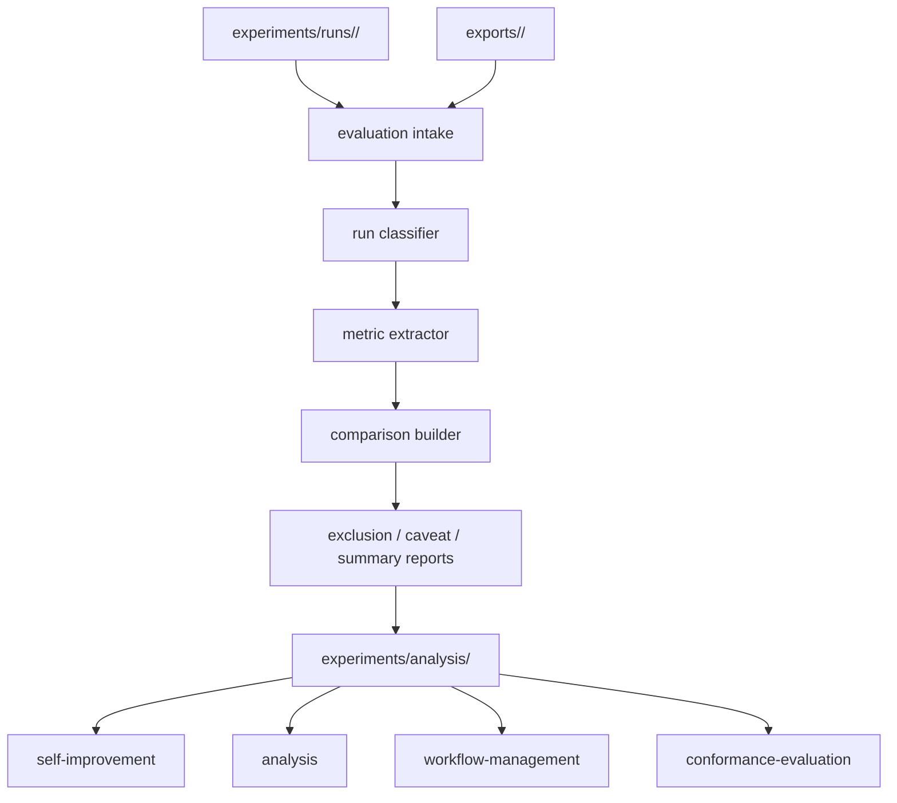

# Design Document：evaluation

## 概要（Overview）

`evaluation` は `runtime` が生成した実行成果物を読み取り、有効（valid）／無効（invalid）／明示的探索（exploratory）／分析不能（analysis_blocked）の区分、比較可能なメトリクス、注意点（caveat）付き分析成果物に変換する分析層（analysis layer）である。

本設計は、`evaluation` が生実行証拠を編集せず、`experiments/analysis/` 配下に派生成果物を生成する構造を定義する。`evaluation` は `foundation` と `runtime` 契約の **消費側**（contract consumer）であり、`self-improvement`／`analysis`／`workflow-management`／`conformance-evaluation` に対して **派生成果物供給側** として振る舞う。

## 目標（Goals）

- 有効／無効／探索／分析不能を機械的に切り分ける（foundation `evidence_class` 4 値正本を参照のみで使用）
- `treatment`（処理方式）と `phase_profile`（フェーズプロファイル）を保ったまま比較可能なメトリクスを作る
- 除外（exclusion）と注意点（caveat）を第一級成果物として残す
- `self-improvement` と `analysis` が再解析なしで再利用できる派生出力を作る
- 中央側での可搬証拠束（portable bundle）の取り込みと許容判定を支える
- `design` と `tasks` を主価値フェーズとする仮説を検証可能にする

## 範囲外（Non-Goals）

- 実行成果物の修正（`runtime` 責務）
- プロンプトやオーケストレーションの改善判断（`self-improvement` 責務）
- 報告書本文の生成（`analysis` 責務）
- 上流文書との適合性評価（`conformance-evaluation` 責務）
- 機能横断段の管理（`workflow-management` 責務）

## 設計の前提（Design Drivers）

- 生証拠は不変（immutable）（foundation §4／§8 と整合）
- 無効実行は削除せず、標準集計から除外する
- 探索実行は実行ライフサイクルではなく証拠区分として扱う（foundation §9 の決定に従う）
- `design`／`tasks` を主価値フェーズとする仮説を検証可能にする
- `evaluation` は foundation／runtime 契約の消費側であり、両者の語彙正本を再定義しない（contract consumer 原則）

## 全体構造（Architecture）

`evaluation` は次の 5 段に分ける。

- **intake**（取り込み）：runtime 成果物の読み込み
- **classification**（分類）：valid／invalid／exploratory／analysis_blocked の判定
- **metric extraction**（メトリクス抽出）：実行レベル／所見レベル／処理方式レベルのメトリクス生成
- **comparison**（比較）：treatment ／フェーズ対応集計の構築
- **reporting**（報告）：除外報告と注意点登録の生成



### 責務境界の明確化（Boundary Clarification）

`evaluation` は foundation 契約と runtime 出力契約の双方の消費側であり、契約自体の定義者ではない。

foundation から受け取るもの：

- 6 語彙正本（`counter_status`／`validator_status`／`evidence_class`／`review_mode`／`severity`／`final_label`）
- スキーマ形状（`review_case`／`finding`／`impact_score`／`failure_observation`／`necessity_judgment`／`validator_result`／`invalidation_marker`）
- メタデータ項目定義（§3 実行メタデータ契約）

runtime から受け取るもの：

- 実行成果物配置（`experiments/runs/<run_id>/`）
- `phase_profile` 4 値、`treatment` 3 値、`step_outcome` 3 値の語彙正本
- `evidence_class` 確定遷移結果

`evaluation` が所有するもの：

- 分析成果物配置（`experiments/analysis/`）
- メトリクス定義（中核層と phase 別重ね合わせ層）
- 比較規則（treatment 比較／phase 比較）
- 除外規則と注意点規則
- 取り込み証拠の許容判定規則（`admitted_standard`／`admitted_exploratory`／`rejected` の 3 値）

`evaluation` は foundation／runtime 契約を上書きせず、消費側として参照のみ。

## 分析成果物配置（Analysis Artifact Layout）

`evaluation` の正本出力先は次を採る。

```text
experiments/analysis/
├── imports/
│   ├── ingestion_register.json
│   ├── admission_register.json
│   └── bundles/
│       └── <bundle_id>/
│           └── run/
│               └── <run_id>/
│                   ├── run_manifest.yaml
│                   ├── review_case.json
│                   ├── decisions/
│                   ├── validation/
│                   ├── failures/
│                   └── derived/
├── manifests/
│   ├── analysis_run_manifest.yaml
│   └── staleness_register.json
├── classifications/
│   ├── run_classification_index.json
│   ├── exclusion_report.json
│   └── insufficient_metadata_report.json
├── metrics/
│   ├── run_metrics.json
│   ├── finding_metrics.json
│   └── treatment_metrics.json
├── comparisons/
│   ├── treatment_comparisons.json
│   └── phase_comparisons.json
├── caveats/
│   └── caveat_register.json
└── modes/
    └── mode_diff_report.json
```

### 配置の根拠（Placement Rationale）

- `manifests/`：どの evaluation 論理版で分析を作ったかを記録、`input_run_set` の被覆を記録
- `imports/`：取り込み証拠の取り込み履歴（`ingestion_register.json`）と許容判定履歴（`admission_register.json`）に加え、取り込み済み束の中身を `bundles/<bundle_id>/run/<run_id>/...` として永続保管する。runtime 側の輸出構造（runtime §可搬証拠束 行 540-547 で定義された `exports/<bundle_id>/run/<run_id>/...`）をそのまま中央側で継承し、構造の対称性を保つ。これにより、後の再分析や陳腐化伝播対応（受け取り後に元レビューが無効化された場合）で元データを参照可能（要件 10 受入 5 由来）
- `classifications/`：分類結果と除外報告
- `metrics/`：メトリクスを単位ごとに分離
- `comparisons/`：treatment／フェーズごとの集計を分離
- `caveats/`：注意点登録を保持（`analysis` と `self-improvement` が継承）
- `modes/`：3 経路（`manual_dogfooding`／`subagent_mediated`／`runtime_mediated`）別の所見差分（要件 9 受入 7 由来）

### 分析対象母集団の選定（Analysis Population Selection）

`evaluation` の既定分析母集団は、任意の実行寄せ集めではなく、再現可能な選定方針に基づいて選ぶ。

優先条件：

- `run_status=closed`
- 標準取り込み完了
- 検証器結果が利用可能（`validator_status` が `not_run` 以外）
- 同一 `case_id`／`phase_profile` 内で比較対象 `treatment` が揃う
- レビューモードが揃う（`runtime_mediated` を既定とする）

これにより、`analysis`／`self-improvement`／`conformance-evaluation` が同じ母集団を共有できる。

選定方針は選定マニフェスト（selection manifest）と更新ワークフローに落としてよい。マニフェストには少なくとも `case_id`／`phase_profile`／レビューモードフィルタ／treatment フィルタ／検証被覆要件を固定できるようにする。

## 取り込みモデル（Intake Model）

`evaluation` が 1 実行から読む最小成果物は次とする。

- `run_manifest.yaml`
- `review_case.json`
- `decisions/decision_units.json`
- `validation/validator_result.json`
- `validation/invalidation_markers.json`
- `derived/comparison_eligibility_note.json`

必要に応じて `steps/*.json` を読むが、標準集計は段の生本体ではなく `review_case.json` と検証成果物を一次入力にする。

失敗観察を扱う場合：

- `failures/failure_observations/<observation_id>.json`：foundation §4 配置方針に従い独立成果物として保管、`failure_observation.run_ref` で `review_case.run_id` を参照（一方向）

### 可搬証拠束の取り込み（Portable Bundle Intake）

中央側 `evaluation` はローカル実行ディレクトリだけでなく、可搬証拠束（runtime §可搬証拠束輸出が生成）も取り込み対象に含める。

可搬束取り込みの最小入力：

- `bundle_manifest.yaml`
- `checksums/bundle_checksums.json`（runtime §可搬証拠束 §束形状で生成される整合性検証用）
- 輸出版 `run_manifest.yaml`
- 輸出版 `review_case.json`
- 輸出版 `decisions/decision_units.json`
- 輸出版 `validation/validator_result.json`
- 輸出版 `validation/invalidation_markers.json`
- 輸出版 `derived/comparison_eligibility_note.json`

束に必要な来歴情報（`source_repository_id`／`source_revision`）が欠ける場合、`evaluation` は取り込みを継続しても標準許容（`admitted_standard`）を与えない（要件 10 受入 2）。

### 取り込み時の物理配置（Physical Placement on Intake）

取り込み時、`evaluation` は runtime 側の輸出構造（`exports/<bundle_id>/run/<run_id>/...`、runtime §可搬証拠束 行 540-547 で定義）をそのまま `experiments/analysis/imports/bundles/<bundle_id>/run/<run_id>/...` に複製する。これにより：

- 中央側で取り込み済み束の中身を永続保管し、再分析（陳腐化伝播対応・別 `analysis_logic_version` での再計算等）で元データを参照可能
- runtime 側と中央側で同じ階層構造を保つことで、ファイル参照規則が対称的になり実装の見通しが良くなる
- `ingestion_register.json` の各エントリは `bundle_path` フィールドで中央側保管パス（`imports/bundles/<bundle_id>/`）を指し示すことで、登録履歴と束実体の連結を保つ

raw bundle の物理コピーを行わず、元 `exports/` パスへの参照のみを保持する選択肢は採らない（元フォルダの移動・削除で参照不能となるリスク、特に外部組織からの取り込みでは元フォルダが中央側に存在しないため）。

**チェックサム整合性検証**：物理コピー前に `checksums/bundle_checksums.json` を読み、束内の各ファイルのチェックサム（SHA-256 等、runtime 側で生成）と実際のファイル内容を照合する。不一致が検出された場合、`admission_status=rejected` とし `admission_reason_codes` に `checksum_mismatch` を記録する。これにより外部組織から改ざんされた束を受け取った場合の比較メトリクス汚染を防ぐ（要件 10 受入 2「必要な来歴情報を検証する」の前提条件としての完全性検証）。

## 分類モデル（Classification Model）

### 1. 分類状態（Classification States）

`evaluation` は実行を foundation の `evidence_class` 4 値正本に従って分類する：

- `valid`（有効）
- `invalid`（無効）
- `exploratory`（明示的探索）
- `analysis_blocked`（分析不能）

これらは foundation §3／§9 で正本確定されており、`evaluation` は再定義せず参照のみ。素材文書では「`analysis_blocked` を evaluation 内部の local state とし foundation の `evidence_class` と区別する」としていたが、ReviewCompass では foundation で `analysis_blocked` を `evidence_class` 4 値正本の 1 つとして確定済みのため、評価側で別の local state を持たない（contract consumer 原則）。

### 2. 分類規則（Classification Rules）

runtime が実行終了時に `evidence_class` を確定する（runtime §セッションモデル §3 の網羅マッピング 9 ケース）。`evaluation` はこの確定結果を分類の主たる入力として読む。

- `evidence_class=valid` → 分類 `valid`
- `evidence_class=invalid` → 分類 `invalid`
- `evidence_class=exploratory` → 分類 `exploratory`
- `evidence_class=analysis_blocked` → 分類 `analysis_blocked`

加えて、評価側で次の追加検査を行う：

- 評価必須入力（`review_case.json`／`validator_result.json` 等）が欠落 → 分類 `analysis_blocked`（runtime 出力側の状態と独立して、評価側で取り込み不能と判定する場合）
- 取り込み証拠で `admission_status=rejected` → 分類 `analysis_blocked`（標準母集団に入れない）

`analysis_blocked` は除外報告（exclusion report）には出すが、比較対象母集団には入れない（foundation §9 と整合）。

### 3. 欠落（missing）と無効（invalid）の区別

`evaluation` は次を区別する：

- **欠落**：必要入力がない
- **無効**：入力はあるが契約に違反している

これにより、「実行が無効なのか」「分析側の入力準備不足なのか」を分離する（要件 1 受入 4）。

### 4. 設計上の段省略と障害欠損の弁別

段が欠けている場合、`evaluation` は runtime の `step_outcome`（3 値正本：`executed`／`skipped_by_treatment`／`failed`、runtime §段実行マトリクス由来）を参照して次を弁別する：

- **設計上の省略**：当該段が `step_outcome=skipped_by_treatment`、`reason` が treatment 由来で、実行の treatment と runtime の treatment × 段実行マトリクスに整合する場合。設計上の意図的省略であり障害ではない。同一 treatment 内では比較可能なまま扱い、欠損を障害として減点しない
- **障害欠損**：`step_outcome=failed` または `step_outcome` 値が宣言 treatment と矛盾する場合。障害・事故的欠落として扱い、当該実行をその段を前提とする比較から除外し、必要に応じて `analysis_blocked` または `invalid` とする

**整合チェックの具体手順**：

1. 当該実行の `treatment` 値を `run_manifest.yaml` から読み取る
2. runtime 設計書 §ステップ実行モデル §treatment × 段実行マトリクスを参照し、当該 `treatment` の行から各段（Step A／B／C／D）の期待 `step_outcome` 値を取得（runtime 所有マトリクスを正本とし、本機能では再定義しない）
3. 当該実行の `steps/*.json`（または `review_case.step_records[].step_status`、どちらも同値）から各段の実際の `step_outcome` 値を取得
4. 各段について、期待値と実際値を照合：
   - 一致 → 設計上の省略または意図通りの実行（障害ではない）
   - 不一致（例：`adversarial` treatment で Step B が `skipped_by_treatment` だが期待値 `executed`）→ 障害欠損として `analysis_blocked` または `invalid` 分類
5. 照合結果を `exclusion_report.json` の `reason_codes` に記録（設計上省略は記録のみ、障害欠損は分類変更の根拠）

これにより、実行条件比較の母集団から「設計上段が無い実行」を誤って障害扱いで排除しない（要件 2 受入 3、runtime 要件 2 受入 5 と整合）。

### 5. 直交軸：実行有効性とレビューモード

有効性分類（`valid`／`invalid`／`exploratory`／`analysis_blocked`）と `review_mode`（`manual_dogfooding`／`runtime_mediated`／`subagent_mediated`、foundation 3 値正本）は直交独立軸として扱う。`manual_dogfooding` または `subagent_mediated` で実施された内容上有効な実行を、レビューモードを理由に無効と誤分類しない（要件 1 受入 6）。

レビューモードによる標準母集団の切り分けは、分類とは別の slice 操作として行う（後述 §比較モデルと §レビューモード母集団規則）。

### 6. 取り込み証拠の許容判定状態（Admission States for Imported Bundles）

取り込み証拠（imported bundle）は分類の前段で次の許容判定状態を持つ。

- `admitted_standard`：標準母集団に入れる
- `admitted_exploratory`：探索集団に入れる
- `rejected`：母集団に入れない

許容判定規則（要件 10 受入 4、優先順に評価し最初に該当した状態を採る）：

- **`rejected`**：`bundle_manifest.yaml` が不在または不正、または必須来歴情報（`source_repository_id`／`source_revision`）が欠落、または必須取り込み入力（`run_manifest.yaml`／`review_case.json`／`validator_result.json`／`invalidation_markers.json`）がスキーマ不適合で読めない
- **`admitted_exploratory`**：必須取り込み入力は読めるが、(a) 必要な来歴情報の一部が非致命的に欠落、(b) protocol／prompt／schema 版が比較集合と不整合、または mixed maturity、(c) 低試料／探索専用 slice のいずれかに該当（要件 10 受入 2：標準許容には必要な来歴情報完備が前提）
- **`admitted_standard`**：必須取り込み入力が揃い、必要な来歴情報完備、版が比較集合と整合し、無効化標識が無い

判定結果と該当理由は `imports/admission_register.json` の `admission_status`／`admission_reason_codes` に記録する。

この許容判定状態は実行有効性（`evidence_class`）とは別に保持する。例えば取り込み束がスキーマ的には読めても、来歴不足で `admitted_exploratory` になることがある。

## メトリクスモデル（Metric Model）

### 1. メトリクス階層（Metric Tiers）

メトリクスは 3 階層に分ける（要件 3 受入 5）。

- 実行レベル（run-level）
- 所見レベル（finding-level）
- 処理方式レベル（treatment-level）

### 2. 中核メトリクス層と phase 重ね合わせ層（Core Layer ＋ Overlay Layer）

評価メトリクスは 2 層構造とする（要件 7 と要件 8 の関係、計画書 §5.17.4 由来）：

- **phase 共通の中核メトリクス層**（core metric layer）
- **phase ごとの重ね合わせメトリクス層**（overlay metric layer）

中核層は全 phase で共通の比較メトリクス、重ね合わせ層は phase ごとに何をもって有効とみなすかを別に持つ。

### 3. 最小メトリクス集合（初版）

#### 中核メトリクス層

実行レベル：

- 所見総数（total findings）
- 採択所見数（accepted findings、`final_label=must-fix` の人間採択数）
- 却下所見数（rejected findings、`human_decision=rejected` 数）
- 保留所見数（deferred findings、`human_decision=deferred` 数）
- 検証結果（`validator_status`）

所見レベル：

- 重大度分布（`severity` 4 値の分布、foundation 正本）
- 由来役分布（`source_role` 分布）
- 判定ラベル分布（`final_label` 3 値の分布、foundation 正本）
- **反証状態分布**（`counter_status` 3 値の分布：`counter_evidence_raised`／`no_counter_evidence_after_challenge`／`not_assessed` の件数集計、foundation 正本。敵対役の有効性測定の基礎指標、要件 2 受入 2 と計画書 §5.17.8 の中核価値命題に直結）

処理方式レベル：

- 実行あたり所見数（findings per run）
- 採択率（acceptance ratio）
- 判定段呼び出し被覆率（judgment invocation coverage）
- **反証発生率**（counter_evidence_rate）：`counter_evidence_raised` を出した所見数 / 全所見数。`adversarial`／`judgment` treatment における敵対役の有効性指標。`primary` treatment では Step B 非実行のため当該指標は「該当なし」とする（全所見が `counter_status=not_assessed` となるため）。本指標は ReviewCompass の主仮説「敵対役を加える treatment が反証発生率と所見質を実測で改善する」（要件 2、計画書 §5.17.8）を測定するための中核成果物

#### 重ね合わせメトリクス層（phase ごと）

phase ごとの主評価観点は異なりうる（要件 8 受入 1）：

- `intent`
  - 目標の曖昧さの低減
  - 範囲外の漏れ込み検出
  - 意図↔要件の追跡可能性支援
- `requirements`
  - 要件不整合の検出
  - 範囲の逸脱検出
  - 受入条件の欠落検出
- `design`
  - 節間整合性
  - 責務境界の欠陥
  - 失敗様式の欠落検出
- `tasks`
  - タスク範囲漏れ検出
  - 順序リスク検出
  - 検証不能なタスク分解の検出
- 将来拡張：実装指向レビュー（implementation-oriented review）

したがって、`design` 中心の中核メトリクスを全 phase の主指標とみなさない。共通比較のための中核メトリクスは残すが、phase ごとに重ね合わせメトリクスを持つ（要件 8 受入 3・5）。

### 4. 派生規則（Derivation Rule）

メトリクスは自由記述要約からではなく、次の順で計算する（要件 3 受入 2）。

1. メタデータ（`run_manifest.yaml`）
2. 構造化された所見（`review_case.findings[]` ／ `steps/*.json`）
3. 決定単位（`decisions/decision_units.json`）
4. 検証成果物／無効化成果物（`validation/*.json`）

`derived/runtime_summary.json` は便宜成果物のため、メトリクスの正本入力にしない（runtime 設計と整合）。

### 5. 派生メトリクスの導出経路保持

各メトリクスは生証拠から派生する経路を保持する（要件 3 受入 3）。これにより、`comparison_invalid_reason` や `caveat` 付与時に元の生証拠への遡及が可能。

### 6. 再計算許容性

スキーマ互換の生証拠が不変の場合、再計算を許容する（要件 3 受入 4）。`analysis_logic_version` が変わった場合は新規派生成果物として扱う（後述 §版管理モデル）。

## 比較モデル（Comparison Model）

### 1. 処理方式比較（Treatment Comparison）

標準比較軸（要件 2 受入 2 由来、計画書 §5.17.8 由来、runtime 3 値正本に整合）：

- `primary`（主役のみ）
- `adversarial`（主役＋敵対役）
- `judgment`（主役＋敵対役＋判定役）

比較前に次を満たすことを確認する（要件 2 受入 5・6）。

- 対象条件が一致
- `phase_profile` が比較可能
- `protocol_version`／`runtime_version`／`prompt_set_version`／`schema_set_version`／`config_version` が比較可能
- `comparison_eligibility_note.json` に標準比較不可の理由があれば、それを先に尊重する

不一致なら `comparison_invalid_reason` を出し、集計しない。

### 2. フェーズ対応比較（Phase-Aware Comparison）

phase 対応比較は次を標準 slice とする（要件 7 受入 3）。

- `intent`
- `requirements`
- `design`
- `tasks`

ただし初期検証の主関心は `design` と `tasks` に置く（要件 7 受入 4）。これはシステムの価値証明の優先順位であって、全 phase が同一指標で測れることを意味しない。比較成果物は `phase_profile` 同一性を消さずに保持し、phase 別の重ね合わせメトリクスの選択も明示する（要件 7 受入 5、要件 8 受入 4）。

### 3. 有効母集団規則（Valid Population Rule）

標準比較メトリクスは `valid` 母集団のみで計算する（要件 1 受入 2、要件 6 受入 4）。

`exploratory` は別途付録的集計として保持できるが、主比較に混ぜない（要件 4 受入 5）。

### 4. レビューモード母集団規則（Mode Population Rule）

レビューモード別の取扱いは次を標準とする（要件 9 受入 6 由来、計画書 §5.23.12.6 のフェーズ移行と整合）：

- **`runtime_mediated`**：標準比較母集団
- **`manual_dogfooding`**：別集団として扱い、標準の `runtime_mediated` 比較セットから除外、明示的に別 slice として含める場合のみ加える
- **`subagent_mediated`**：独立した第三集団として扱い、同様に標準母集団から除外

3 経路（`manual_dogfooding`／`subagent_mediated`／`runtime_mediated`）が並存する場合、引き継ぎ境界を派生成果物で明示する（要件 9 受入 5）。

通常の編集活動を、手動レビュー記録契約を通じて記録されない限り、有効なレビュー証拠として扱わない（要件 9 受入 3）。

## 除外と注意点のモデル（Exclusion and Caveat Model）

### 1. 除外報告（Exclusion Report）

`classifications/exclusion_report.json` は少なくとも次を持つ（要件 4 受入 1・3）：

- `run_id`
- `classification`（`invalid`／`exploratory`／`analysis_blocked` のいずれか）
- `reason_codes`（除外理由の機械可読コード）
- `reason_details`（除外理由の人間可読詳細）
- `phase_profile`
- `treatment`
- `review_mode`

### 2. 注意点登録（Caveat Register）

`caveats/caveat_register.json` は除外とは別に、報告上残すべき注意点を持つ（要件 4 受入 2）。

例：

- 混在成熟度証拠（mixed maturity evidence）
- 探索専用 slice（exploratory only slice）
- 低試料（low sample size）
- 比較集合を跨ぐプロトコル逸脱（protocol drift across comparison set）
- 混在レビューモード（mixed review modes、要件 9 受入 4）

これにより `analysis` は生集計を再読せず注意点を継承できる（要件 4 受入 4）。

## レビューモード差分報告（Mode Diff Report）

`modes/mode_diff_report.json` は 3 経路別の所見差分を `analysis` 機能向けに提供する（要件 9 受入 7）。

最低限の構造化形式項目：

- `feature`：機能名（例：`foundation`／`runtime` 等）
- `review_mode`：foundation `review_mode` 3 値（`manual_dogfooding`／`runtime_mediated`／`subagent_mediated`）
- `findings_by_severity`：所見集計（`severity` 4 値別の件数）
- `target`：対象識別子

本成果物は `analysis` 仕様 Requirement 7 受入 3「レビュー収束過程の可視化」の入力として機能する。

## 取り込み証拠の取り込み成果物（Imported Evidence Intake Artifacts）

### 1. 取り込み登録（Ingestion Register）

`imports/ingestion_register.json` は少なくとも次を持つ（要件 10 受入 1）：

- `bundle_id`
- `run_id`
- `source_repository_id`
- `source_revision`
- `review_mode`
- `ingested_at`
- `ingestion_status`
- `missing_fields`（欠落した来歴項目）

### 2. 許容判定登録（Admission Register）

`imports/admission_register.json` は少なくとも次を持つ（要件 10 受入 4・5）：

- `bundle_id`
- `run_id`
- `admission_status`（`admitted_standard`／`admitted_exploratory`／`rejected`）
- `admission_reason_codes`
- `eligible_for_standard_comparison`
- `eligible_for_exploratory_analysis`

これにより中央側評価は取り込み証拠を生ローカル実行と区別したまま扱える（要件 10 受入 3・5）。

## 版管理モデル（Versioning Model）

分析成果物も版管理出力とする（要件 5 受入 5）。

`manifests/analysis_run_manifest.yaml` に最低限記録するもの：

- `analysis_logic_version`
- `input_run_set`
- `generated_at`
- `metric_set_version`
- `phase_metric_profile_version`
- `comparison_contract_version`
- `protocol_version_coverage`：含まれる実行の `protocol_version` 集合（foundation 必須メタデータ由来、要件 2 受入 6「規約版混在の比較セットの検出」の機械検証根拠）
- `runtime_version_coverage`：含まれる実行の `runtime_version` 集合（同じく規約版混在検出のため）
- `prompt_set_version_coverage`：含まれる実行の `prompt_set_version` 集合

同じ生実行集合でも分析論理が変われば別出力として扱う。

### 陳腐化伝播の履行（Staleness Propagation Handling）

参照していた実行が事後に無効化された場合、その実行を入力に含む派生成果物は陳腐化フラグ付け、または再導出の対象とする（要件 5 受入 6）。無効化を含む実行の上に古い派生出力を据え置かない。

これは foundation の無効化伝播義務（foundation 要件 6 受入 9）を入力起点とする。**本評価機能は伝播義務の主要な履行者**として位置付けられる（要件 5 受入 6）。

### 履行手段の選択ロジック

`evaluation` は伝播義務の履行手段として次の選択ロジックを所有する：

- **陳腐化フラグ付け（staleness flagging）**：派生成果物を変更せず、`analysis_run_manifest.yaml` または別途 `staleness_register.json` に「無効化された入力を含む派生成果物」として記録。下流（`analysis`／`self-improvement`）は本フラグを参照して扱いを決める
- **再導出（re-derivation）**：無効化を反映した派生成果物を新規生成。旧成果物は `superseded` として保持

選択基準（初版）：

- 無効化された実行が標準比較セットの少数（例：5% 未満）で、比較結果への影響が軽微 → 陳腐化フラグ付け
- 無効化された実行が標準比較セットの多数を占める、または比較結果が定性的に変わる → 再導出
- `exploratory` 集計のみへの影響 → 陳腐化フラグ付け

具体的な閾値や境界判断の運用は `phase_metric_profile_version` の改訂時に経過観察し、必要に応じて改訂する。

## 評価準備メタデータの検査（Evaluation-Ready Metadata Completeness）

### 必須メタデータ検査

`evaluation` は標準集計の前に必須メタデータを検査する（要件 6 受入 1・2）。

必須メタデータ集合（foundation §3 メタデータ契約に従う、再定義禁止）：

- `run_id`
- `target_id`
- `target_artifact_hash`
- `source_repository_id`
- `source_revision`
- `phase_profile`
- `treatment`
- `review_mode`
- `protocol_version`
- `runtime_version`
- `schema_set_version`
- `prompt_set_version`
- `config_version`
- `validator_status`
- `human_signoff_status`
- `evidence_class`

必須項目が欠落している場合、標準集計を拒否する（要件 6 受入 2）。

### 不十分性の診断情報

集計が遮断された場合、明示的な不十分性の診断情報を `classifications/insufficient_metadata_report.json` に出力する（要件 6 受入 3）。本ファイルは `exclusion_report.json` と並列に `classifications/` 配下に配置し、「`analysis_blocked` 分類の原因報告」として位置付ける。

`insufficient_metadata_report.json` は少なくとも次の項目を持つ：

- `run_id`：当該実行の識別子
- `missing_fields`：欠落項目のリスト
- `evidence_class`：該当する証拠区分（多くは `analysis_blocked`）
- `affected_derived_artifacts`：影響を受ける派生成果物の一覧
- `detected_at`：不十分性検出時刻

### 致命的失敗と探索的部分分析の区別

両者の表現には foundation の `evidence_class` 4 値正本を再定義せず参照する（要件 6 受入 4、foundation §3／§9 と整合）：

- `invalid`：致命的失敗
- `exploratory`：探索的部分分析
- `analysis_blocked`：必要入力の不足、または実行未終了、または検証が前提不足で結論不能

自由記述の文脈から欠落したメタデータを発明しない（要件 6 受入 5）。

## 下流機能との接合面（Interfaces to Downstream Features）

### `self-improvement` への接合面

`self-improvement` は少なくとも次を読む：

- `classifications/run_classification_index.json`
- `classifications/exclusion_report.json`
- `metrics/run_metrics.json`
- `metrics/finding_metrics.json`
- `caveats/caveat_register.json`
- `modes/mode_diff_report.json`

特に `invalid`／`exploratory` の分布はワークフロー欠陥改善の入力になる。

### `analysis` への接合面

`analysis` は少なくとも次を読む：

- `comparisons/treatment_comparisons.json`
- `comparisons/phase_comparisons.json`
- `classifications/exclusion_report.json`
- `caveats/caveat_register.json`
- `modes/mode_diff_report.json`

`analysis` は生実行ディレクトリを一次入力にしない。

### `workflow-management` への接合面

`workflow-management` は所定手続きの実行結果評価のため次を読む（要件 introduction 隣接期待）：

- `classifications/run_classification_index.json`
- `manifests/analysis_run_manifest.yaml`（被覆状況の確認）

### `conformance-evaluation` への接合面

`conformance-evaluation` は検証器メタデータと評価成果物の同一性情報を必要とする（要件 introduction 隣接期待）。少なくとも次を読む：

- `manifests/analysis_run_manifest.yaml`
- `metrics/finding_metrics.json`（適合性判定の入力）
- `caveats/caveat_register.json`

`conformance-evaluation` は本機能の比較メトリクスを「適合性判定の根拠」として扱うが、適合判定そのものは `conformance-evaluation` が行う。

## 主要な設計判断（Key Decisions）

### 判断 1：評価は実行成果物を改変しない

分析は `experiments/analysis/` に分離する。

### 判断 2：分類は foundation `evidence_class` 4 値正本を参照のみで使用

素材文書では `analysis_blocked` を evaluation 内部の local state として持っていたが、ReviewCompass では foundation で正本確定したため参照のみとする（contract consumer 原則）。

### 判断 3：比較メトリクスは valid 母集団のみで計算

`exploratory`／`invalid` を黙って混ぜない。

### 判断 4：注意点は第一級成果物

後続報告のため、限界情報も機械可読に残す。

### 判断 5：レビューモード 3 集団扱い

`runtime_mediated` を標準母集団、`manual_dogfooding` と `subagent_mediated` を別集団として扱う。素材文書の 2 集団扱いから 3 集団扱いに拡張（計画書 §5.23.12.6 由来）。

### 判断 6：無効化伝播の履行手段選択ロジックを本機能が所有

foundation で「伝播義務の存在」が固定され、本機能で「具体的な履行手段の選択ロジック」を所有（陳腐化フラグ付け／再導出のいずれかを選択する基準）。

### 判断 7：取り込み証拠の許容判定状態を 3 値で所有

`admitted_standard`／`admitted_exploratory`／`rejected` を本機能の正本語彙として確定（要件 10 受入 4）。下流の `analysis`／`self-improvement`／`conformance-evaluation` はこの 3 値を参照のみで使用。

### 判断 8：contract consumer 原則

本機能は foundation／runtime 契約の双方の消費側であり、両者の語彙正本を再定義しない。

## 要件と設計の対応（Requirements Traceability）

| 要件 | 設計の応答 |
|------|------------|
| 要件 1：有効・無効実行の分離 | 分類モデルを foundation `evidence_class` 4 値正本参照で定義（§分類モデル）、レビューモードとの直交性を明示 |
| 要件 2：処理方式の比較契約 | treatment 3 値（primary／adversarial／judgment）の比較規則と前提条件を定義 |
| 要件 3：メトリクス抽出 | 3 階層メトリクスと派生規則を定義 |
| 要件 4：除外と注意点の報告 | 除外報告と注意点登録の構造を定義 |
| 要件 5：派生成果物の生成 | `experiments/analysis/` 配下配置と版管理、陳腐化伝播履行を定義 |
| 要件 6：評価準備メタデータの完全性 | 必須メタデータ検査と `analysis_blocked` 分類を定義 |
| 要件 7：フェーズ対応の評価 | フェーズ対応比較 slice を定義 |
| 要件 8：フェーズ特異な有効性メトリクス | 中核メトリクス層と phase 重ね合わせ層の 2 層構造を定義 |
| 要件 9：レビューモードの区別 | 3 経路集団規則と `modes/mode_diff_report.json` を定義 |
| 要件 10：外部証拠束の取り込みと許容判定 | 取り込みモデルと許容判定 3 値（`admitted_standard`／`admitted_exploratory`／`rejected`）を定義 |

## 下流仕様への影響（Impact on Downstream Specs）

- **`self-improvement`**：`classifications/`／`metrics/`／`caveats/`／`modes/` を入力に使う
- **`analysis`**：`comparisons/`／`exclusion_report.json`／`caveats/`／`modes/` を入力に使う、生実行を直接読まない
- **`workflow-management`**：`classifications/run_classification_index.json` と `manifests/` を入力に使う
- **`conformance-evaluation`**：`manifests/`／`metrics/`／`caveats/` を入力に使う、本機能の比較メトリクスを「適合性判定の根拠」として扱う

## テスト戦略（Test Strategy）

完全なテスト計画はタスク工程で策定するが、設計段階で次のテスト可能性の縫い目を固定する。

- **分類判定の単体検証点**：固定の `run_manifest.yaml`／`review_case.json`／`validator_result.json` 入力に対し、`evidence_class` 4 値分類が決定的に出る境界
- **メトリクス導出の単体検証点**：構造化された所見入力に対し、中核メトリクスと重ね合わせメトリクスが決定的に出る境界
- **取り込み許容判定の単体検証点**：固定の `bundle_manifest.yaml` 入力に対し、3 値（`admitted_standard`／`admitted_exploratory`／`rejected`）が決定的に出る境界。最低限次の 6 境界入力ケースを網羅する：
  1. `bundle_manifest.yaml` 不在 → `rejected`
  2. 必須来歴情報（`source_repository_id`／`source_revision`）の全欠落 → `rejected`
  3. 必須取り込み入力がスキーマ不適合で読み取り不能 → `rejected`
  4. 必須来歴情報の一部欠落（非致命的） → `admitted_exploratory`
  5. 規約版または `prompt_set_version` が比較集合と不整合 → `admitted_exploratory`
  6. 全条件揃い、無効化標識なし → `admitted_standard`
  7. チェックサム不一致 → `rejected`（議論 7 F-025 対処で追加された境界）
- **陳腐化伝播の検証点**：無効化標識付与時の派生成果物への影響伝播（陳腐化フラグ付けまたは再導出の選択）が決定的に動く境界
- **設計上の段省略と障害欠損の弁別検証点**：`step_outcome` 値の組み合わせに対し、弁別判定が決定的に出る境界

実装段階で具体的なテストツール選定と実行スクリプトを確定する。

## 先送り論点（Open Issues for Design Alignment Gate）

- 処理方式レベル最小メトリクスの最終確定（反証発生率指標の値域・閾値解釈を含む）
- 所見レベル `counter_status` 分布と処理方式レベル反証発生率のフィールド命名と JSON Schema 詳細（A-002 由来、骨格は §メトリクスモデル §3 中核層で確定）
- phase 別重ね合わせメトリクスの初版確定
- 探索集計をどこまで標準化するか
- `self-improvement` 向けに必要な所見レベル詳細の追加有無
- `analysis` 向け比較成果物の項目命名
- 陳腐化伝播履行手段の選択閾値の具体（初版は経過観察）
- 取り込み証拠の許容判定状態（`admitted_exploratory`）の境界条件の精緻化

これらは `self-improvement`／`analysis`／`workflow-management`／`conformance-evaluation` 設計が揃った後の design alignment 段で詰める。

## 完成判定基準（Completion Criteria）

- 生実行と分析成果物の境界を §分析成果物配置 で説明できる
- `valid`／`invalid`／`exploratory`／`analysis_blocked` の違いを §分類モデル で説明できる（foundation `evidence_class` 4 値正本を参照のみで使用）
- メトリクスと注意点がどこに出るか §メトリクスモデル と §除外と注意点のモデル で説明できる
- 下流 4 機能（`self-improvement`／`analysis`／`workflow-management`／`conformance-evaluation`）がどの分析成果物を読むか §下流機能との接合面 で追跡できる
- foundation の 6 語彙正本（`counter_status`／`validator_status`／`evidence_class`／`review_mode`／`severity`／`final_label`）を本機能が再定義せず参照のみで使用していることが本設計書から確認できる
- runtime の 3 語彙正本（`phase_profile`／`treatment`／`step_outcome`）を本機能が再定義せず参照のみで使用していることが本設計書から確認できる
- 本機能が所有する正本（`admitted_standard`／`admitted_exploratory`／`rejected` の許容判定 3 値、陳腐化伝播履行手段の選択ロジック）が §判断 6・7 で明示されている

## 変更意図（Change Intent）

本設計は先行プロジェクトの評価設計を簡略化して捨てたのではなく、ReviewCompass の方針に従い、自己適用前提を除去しつつ有効・無効分離、処理方式比較、メトリクス抽出、フェーズ対応評価を引き継ぐことを目的とする。

ReviewCompass 固有の追加：

- **隣接機能 6 機能体制**：素材の `paper-interface` を `analysis` に変更、`workflow-management` と `conformance-evaluation` を隣接機能に追加
- **treatment 名統一**：素材の `single`／`dual`／`dual+judgment` を要件 2 受入 2 と計画書 §5.17.8 由来の `primary`／`adversarial`／`judgment` に変更
- **レビューモード 3 集団扱い**：素材の 2 集団扱い（`manual_dogfooding`／`runtime_mediated`）を、`subagent_mediated` を加えた 3 集団扱いに拡張（計画書 §5.23.12.6 由来）
- **`analysis_blocked` の foundation 統一**：素材では evaluation 内部の local state として別扱いだったが、foundation で正本確定したため参照のみとする（contract consumer 原則の徹底）
- **`step_outcome` 参照（runtime 由来）**：素材の `execution_state`（executed／skipped／reduced）を、runtime で確定された `step_outcome`（executed／skipped_by_treatment／failed）を参照する形に変更。設計上の段省略と障害欠損の弁別ロジックも更新
- **6 語彙正本＋3 語彙正本の参照禁止対象としての位置付け**：foundation 6 語彙正本と runtime 3 語彙正本を本機能が再定義しない consumer 原則を明示
- **陳腐化伝播履行手段の選択ロジックを本機能で所有**：foundation で「伝播義務の存在」を固定、本機能で「具体的な履行手段の選択基準」（陳腐化フラグ付け／再導出の選択）を所有
- **取り込み証拠の許容判定 3 値正本を本機能で所有**：`admitted_standard`／`admitted_exploratory`／`rejected` を新規正本として確定
- **`modes/mode_diff_report.json` の構造化**：要件 9 受入 7 由来。4 要素（feature／review_mode／findings_by_severity／target）を含む構造化形式で `analysis` 向けに提供
- **`counter_status` メトリクスの中核層活用**（triad-review must-fix A-002 対処）：foundation 3 値正本 `counter_status`（`counter_evidence_raised`／`no_counter_evidence_after_challenge`／`not_assessed`）を所見レベル中核メトリクスとして集計、処理方式レベルに反証発生率指標を追加。ReviewCompass の中核価値命題「treatment 比較で敵対役効果を測る」（要件 2 受入 2、計画書 §5.17.8）の機械測定を骨格段階で保証

triad-review 段（2026-05-25 セッション 25）由来の追加修正：

- **取り込み束の物理配置確定**（must-fix A-001／F-005 対処）：受け取った可搬束を `experiments/analysis/imports/bundles/<bundle_id>/run/<run_id>/...` に永続保管、runtime の輸出構造をそのまま継承。raw bundle を参照のみとせず物理コピーする選択を採用（外部組織からの取り込みで元フォルダが消えるリスクへの対応）
- **版被覆記録の追加**（must-fix A-003 対処）：`analysis_run_manifest.yaml` に `protocol_version_coverage`／`runtime_version_coverage`／`prompt_set_version_coverage` を追加。規約版混在検出（要件 2 受入 6）の機械検証根拠を確立
- **段省略整合チェック手順の明示**（must-fix F-018 対処）：runtime の treatment × 段実行マトリクスを参照する 5 ステップ手順を §分類モデル §4 に追記
- **メタデータ不十分性報告の配置確定**（must-fix F-022 対処）：`classifications/insufficient_metadata_report.json` を新設、5 項目（`run_id`／`missing_fields`／`evidence_class`／`affected_derived_artifacts`／`detected_at`）を持つ
- **陳腐化記録ファイルの配置確定**（must-fix F-011 対処）：`manifests/staleness_register.json` を §分析成果物配置の構造図に追加
- **チェックサム整合性検証の追加**（must-fix F-025 対処）：`checksums/bundle_checksums.json` を取り込み入力に追加、物理コピー前のチェックサム照合手順と不一致時の `rejected` 判定を §取り込み時の物理配置に明示
- **許容判定境界入力ケースの列挙**（must-fix F-031 対処）：§テスト戦略に 7 つの境界入力ケース（不在／全欠落／読み取り不能／一部欠落／版不整合／全条件揃い／チェックサム不一致）を列挙
