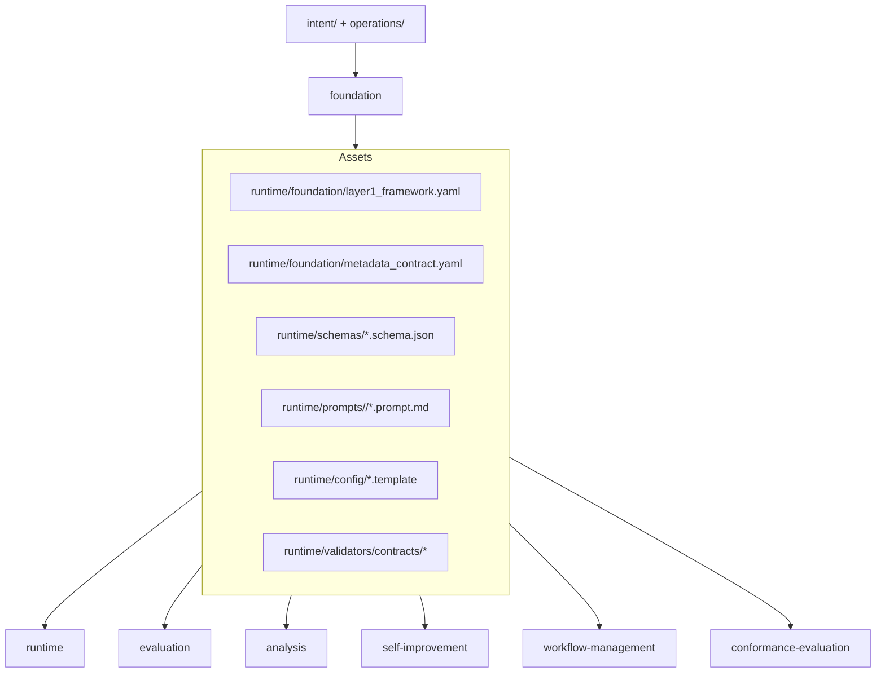
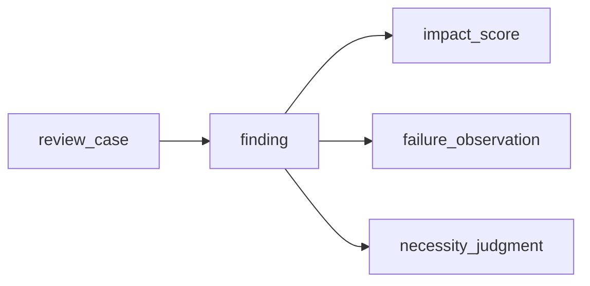

# Design Document：foundation

## 概要（Overview）

`foundation` は ReviewCompass 全体で共有される最下層の契約（contract、約束事の集合）を、成果物（artifact、ファイルとして実在する資産）と配置規約の形で固定する仕様である。本設計の対象はレビューを実行する仕組みそのものではなく、`runtime`／`evaluation`／`analysis`／`workflow-management`／`self-improvement`／`conformance-evaluation` の 6 機能が同じ前提で動けるよう、次をリポジトリ内成果物として定める。

- 4 段論理契約（4-step logical contract、レビューパイプラインの段定義）
- 共有スキーマ集合（5 ファイル）
- プロンプト雛形の正本配置と版管理規約
- 用語雛形の最小契約
- 設定雛形（2 層モデル）
- 検証器（validator、機械的合否判定機構）が読み取る実行メタデータ契約

再構築の主眼は、先行プロジェクト（旧 `dual-reviewer-rebuild`）の試作資産を引き継ぎつつも、リポジトリ外依存や運用者の暗黙知識への依存を排除し、対象アプリへ配置した直後から再現可能な土台を作ることにある。

## 目標（Goals）

- 共有成果物の正本を本リポジトリ内に集約する
- 6 つの隣接機能が同じスキーマ・同じメタデータ・同じ語彙正本を参照できるようにする
- プロンプト・スキーマ・雛形を、運用者の暗黙知識ではなく、版管理可能な成果物として扱う
- 検証器が `valid`（有効実行）／`invalid`（無効実行）／`exploratory`（明示的探索実行）／`analysis_blocked`（分析不能実行）の区分判定に必要な情報を、メタデータだけで読み取れるようにする
- 再演（replay、過去レビューの追体験）と無効化（invalidation、過去レビューを無効と宣言する処理）に必要な最低限の段別識別子を本機能で確保する

## 範囲外（Non-Goals）

- レビュー実行の段順序制御（`runtime` 責務）
- treatment（処理方式）ごとの段実行の有無決定（`runtime` 責務）
- phase／profile ごとのレビュー強調点の具体挙動（`runtime` 責務）
- メトリクス抽出や横断比較ロジック（`evaluation` 責務）
- 報告書生成（`analysis` 責務）
- 自己改善提案の採否ワークフロー（`self-improvement` 責務）
- ワークフロー段管理機構の具体実装（`workflow-management` 責務）
- 仕様適合性評価機構の具体実装（`conformance-evaluation` 責務）

## 設計の前提（Design Drivers）

本設計は要件文書と上位文書から次の制約を受ける。

- 大規模言語モデル（LLM、大量のテキストで学習した自然言語処理モデル）の自然言語出力は正本でなく、スキーマとメタデータを満たした証拠（evidence、レビュー判断の根拠資料）のみをシステム契約として扱う
- 生証拠（raw evidence、修正前の原本）は不変（immutable）とし、検証器結果や無効化標識は別成果物として重ねる
- プロンプトはスキル本体に埋め込まず、リポジトリ内成果物として版管理する
- `design`／`tasks` フェーズが高価値フェーズであるため、本機能でも phase／profile 識別子を実行メタデータに保持する
- 機能横断整合性の観点から、`run_status`（実行ライフサイクル状態）と `evidence_class`（証拠区分）の責務を分離する

## 全体構造（Architecture）

`foundation` は `runtime/` 配下の共有資産層を所有し、後続 6 機能はそこから読み込む。

知識層の位置付け：

- 一般層（general layer）：本機能が所有するレビュー契約と共有スキーマ
- メタ層（meta layer）：複数プロジェクト再利用可能な共有契約
- プロジェクト固有層（project-specific layer）：後続機能が証拠から抽出して蓄積する具体パターン

本機能は最初の 2 層の土台を提供する。

### 責務境界の明確化（Boundary Clarification）

本機能が所有するのは「共有契約」であり、「共有実行」ではない。

本機能に置くもの：

- レビュー段の正本名（canonical step names）
- 役の抽象化（role abstraction）
- メタデータ項目定義
- スキーマの形状
- プロンプト配置と識別規則
- 用語雛形配置規則
- 設定雛形配置規則（2 層モデル）

`runtime` に委ねるもの：

- 段の実行順序制御
- treatment ごとの段実行の有無
- phase／profile ごとのレビュー強調点の具体挙動
- 実行ディレクトリの配置と段ファイル命名
- プロンプト上書きの選択順序
- 証拠書き出しタイミングと検証呼び出しタイミング

この境界線を越えて、`runtime` 専用の利便性機能を本機能に入れない。



設計の中心は、成果物の責務分離にある。

- `framework`：レビューパイプラインと役抽象化の論理契約
- `metadata_contract`：検証器と `evaluation` が読む実行レベル項目定義
- `schemas`：生証拠の構造定義
- `prompts`：役・段に紐づくプロンプト成果物
- `config`：運用者が見える雛形
- `validators/contracts`：検証器実装が従う検証／無効化成果物の形状

## 共有資産配置（Shared Artifact Layout）

本機能が所有する具体配置は次を正本とする。

```text
runtime/
├── foundation/
│   ├── layer1_framework.yaml
│   └── metadata_contract.yaml
├── schemas/
│   ├── review_case.schema.json
│   ├── finding.schema.json
│   ├── impact_score.schema.json
│   ├── failure_observation.schema.json
│   └── necessity_judgment.schema.json
├── prompts/
│   ├── primary_detection/
│   │   └── primary_reviewer.prompt.md
│   ├── adversarial_review/
│   │   └── adversarial_reviewer.prompt.md
│   └── judgment/
│       └── judgment_reviewer.prompt.md
├── config/
│   ├── reviewcompass.yaml          # ツール本体既定値（2 層モデル下層）
│   ├── config.yaml.template        # アプリ側上書き用雛形（2 層モデル上層の素材）
│   └── terminology.yaml.template
└── validators/
    └── contracts/
        ├── validator_result.schema.json
        └── invalidation_marker.schema.json
```

加えて、対象アプリ側に実体化される成果物の配置規約：

```text
<対象アプリ>/.reviewcompass/
└── config.yaml          # config.yaml.template から実体化、ツール既定を項目別に上書き
```

### 配置決定（Placement Decisions）

1. **`runtime/foundation/`**：本機能固有の論理契約を置く。コードではなくデータ優先の成果物として扱う。
2. **`runtime/schemas/`**：生証拠スキーマの単一配置とする。`runtime` と `evaluation` がパス解決で迷わないようにする。
3. **`runtime/prompts/<段目的>/<役>.prompt.md`**：プロンプトは段目的ディレクトリ配下に役単位で配置する。
   - 正本配置：Step A=`primary_detection/primary_reviewer.prompt.md`、Step B=`adversarial_review/adversarial_reviewer.prompt.md`、Step C=`judgment/judgment_reviewer.prompt.md`
   - すべてリポジトリ相対パスで解決でき、`runtime` は外部状態に依存せず解決できる（要件 4 受入 4）
   - Step D（`integration`、統合）は追加 LLM 呼び出しを持たないため、プロンプト成果物は置かない
4. **`runtime/config/`**：2 層モデル（要件 2 受入 6）に対応する 2 ファイルを置く。
   - `reviewcompass.yaml`：ツール本体の既定値を保持する正本
   - `config.yaml.template`：アプリ側 `<対象アプリ>/.reviewcompass/config.yaml` を生成する雛形
5. **`runtime/validators/contracts/`**：検証器実装のコードとは分けて、検証成果物の形状だけを本機能が固定する。

## 領域モデル（Domain Model）

### 1. レビュー段の論理契約（Layer 1 Review Contract）

`layer1_framework.yaml` は `runtime` 実装の詳細ではなく、すべての treatment／すべての phase で共有されるレビュー状態機械（state machine、状態遷移の決まり事）を定義する。

最上位区画は次のとおりとする。

- `version`
- `roles`
- `step_pipeline`
- `step_intents`
- `required_metadata_refs`
- `asset_locations`
- `override_extension_point`

`override_extension_point` は、`runtime` がプロンプト上書き機構を接続するための所在のみを本機能が固定する。本機能は上書きの選択順序・優先規則・適用条件を一切定義しない（責務境界に基づく、これらは `runtime` 責務）。本機能が固定するのは「上書き拡張点が枠組みのどこに位置するか」のみである。

`step_pipeline` は Step A／B／C／D の正本名称のみを固定する。

- Step A: `primary_detection`（主役検出）
- Step B: `adversarial_review`（敵対レビュー）
- Step C: `judgment`（判定）
- Step D: `integration`（統合）

Step D（`integration`）は Step A・B・C の出力を 1 つのレビュー結果へ統合する契約であり、追加 LLM 呼び出しを要さない。出力は実行終了時に消費される統合レビュー記録とする（要件 1 受入 7）。

ここでは再試行、サブエージェント派遣、利用者対話の時機は定義しない。これらは `runtime` 設計の責務とする（要件 1 受入 2）。

### 2. 役の抽象化（Role Abstraction）

役は抽象名のみを本機能で固定する（要件 2 受入 1）。

- `primary_reviewer`（主役）
- `adversarial_reviewer`（敵対役）
- `judgment_reviewer`（判定役）

モデルベンダーや具体モデル名は設定に退避し、枠組み定義とスキーマ項目には出さない（要件 2 受入 2）。

`adversarial_reviewer` の Step B 強制差異化挙動は、主役結論への安易な同調ではなく独立した反証の提示を最低限の振る舞いとする。最終的に同意する場合でも「反証なし」を意図的結果として記録する（要件 1 受入 4）。

### 3. 実行メタデータ契約（Run Metadata Contract）

`metadata_contract.yaml` は実行レベル項目の一覧、語彙（enum、列挙値集合）、責務分離を定義する。

設計上もっとも重要なのは、`run_status` と `evidence_class` を分離する点である。

- `run_status`：`runtime` のライフサイクル状態を表す
- `validator_status`：機械的検証の結果を表す
- `human_signoff_status`：運用者の決定状態を表す
- `evidence_class`：下流消費上の区分を表す

これにより「実行は閉じたが無効」「実行は閉じたが探索」「運用者承認は未完了」といった状態を混同しない。

必須項目は次を初版とする。

| 項目 | 用途 |
|------|------|
| `run_id` | 実行の安定識別子 |
| `target_id` | レビュー対象識別子 |
| `target_artifact_hash` | 対象固定のためのハッシュ |
| `source_repository_id` | 証拠採取元リポジトリ識別子（要件 6 受入 7） |
| `source_revision` | 証拠採取時の改訂版識別子（要件 6 受入 7） |
| `phase_profile` | 値語彙は `runtime` 所有（要件 1 受入 8、本機能は列挙しない） |
| `treatment` | 値語彙は `runtime` 所有（要件 1 受入 9、本機能は列挙しない） |
| `review_mode` | レビューモード語彙（後述、要件 6 受入 6） |
| `protocol_version` | 規約版（プロトコル逸脱防止） |
| `runtime_version` | 実行時挙動追跡 |
| `schema_set_version` | スキーマ群整合追跡 |
| `prompt_set_version` | プロンプト群整合追跡 |
| `config_version` | 当該実行を生成した設定の版（要件 7 受入 3、設定↔実行の機械追跡） |
| `config_hash` | 設定内容固定のためのハッシュ（要件 2 受入 4、設定は `runtime` 入力であり暗黙状態でないことの担保） |
| `run_status` | ライフサイクル状態 |
| `validator_status` | 検証結果（後述、要件 6 受入 10） |
| `human_signoff_status` | 承認状態 |
| `evidence_class` | 証拠区分（後述、要件 6 受入 8） |
| `started_at` | 実行開始時刻 |
| `closed_at` | 実行終了時刻 |

本必須項目集合は、要件 1 受入 5 が定義する最小実行メタデータの上位集合（superset、拡張集合）である。要件 1 受入 5 は最小拘束集合のままとし、本リストは検証器専用項目（要件 6 受入 2）を追加する。

初版語彙は次を採る。

- `run_status`
  - `created`
  - `in_progress`
  - `closed`
  - `orchestration_failed`
- `validator_status`（4 値、要件 6 受入 10、`runtime`／`evaluation`／`conformance-evaluation` は再定義禁止）
  - `not_run`：検査がまだ実行されていない初期状態
  - `passed`：検査が実行されて合格した状態
  - `failed`：実行されて不合格となった状態
  - `blocked`：前提条件未充足のため実行できなかった状態
- `human_signoff_status`
  - `pending`
  - `approved`
  - `rejected`
  - `deferred`
- `evidence_class`（4 値、要件 6 受入 8、`evaluation`／`analysis`／`conformance-evaluation` は再定義禁止）
  - `valid`：有効実行
  - `invalid`：無効実行
  - `exploratory`：明示的探索実行
  - `analysis_blocked`：分析不能実行（必要入力の不足、または実行未終了、または検証が前提不足で結論不能な場合）
- `review_mode`（4 値、要件 6 受入 6、今後の経路追加に対応する拡張余地を持つ）
  - `manual_dogfooding`：手動 dogfooding（自食、自分自身を試食すること）レビュー記録
  - `runtime_mediated`：実行時経由のレビュー記録
  - `subagent_mediated`：サブエージェント経由のレビュー記録（計画書 §5.18.13／§5.23.12 由来）
  - `api_mediated`：独立 API 経由のレビュー記録（triad-review 独立 3 社化由来、2026-06-01 セッション 46）

機能横断データ取り込みを見据えた来歴項目の役割分担（要件 6 受入 7）：

- `source_repository_id`：どのローカルリポジトリで証拠が採取されたか
- `source_revision`：どの改訂版で証拠が採取されたか
- `target_id`：レビュー対象成果物の識別子
- `target_artifact_hash`：レビュー対象成果物自体の固定子

これにより「どのリポのどの改訂版で、どの対象をレビューした証拠か」を本機能のメタデータだけで最低限追跡できる。

### 3.5 推定タスク用語彙（Inference Task Vocabulary）

実行メタデータとは別に、推定タスク（コードからの上流文書推定など）で用いる語彙を本機能の正本として所有する（要件 6 受入 11、A-013 対処、2026-05-26 セッション 28 確定）。

- `confidence_label`（3 値、要件 6 受入 11、推定タスク用、`conformance-evaluation` は再定義禁止）
  - `high`：根拠が強い（コード参照件数が多い、明示性が高い）
  - `medium`：中程度（一部に根拠あり、補強で確からしさが上がる）
  - `low`：根拠が弱い（推定根拠が薄い、人間判断が必要）

本語彙は推定タスクを行う将来の他機能も参照できる。再定義は禁止。

### 4. 共有スキーマの関係（Shared Schema Relationships）

本機能が固定する各スキーマは、項目ごとに「フェーズ 3 必須（mandatory-B1.0）」か「意図的に先送りする拡張点（deferred）」かを明示する（要件 3 受入 9）。下記の項目一覧は特記なき限りすべて mandatory-B1.0 とし、deferred の拡張点は該当スキーマ節に明記する。

#### mandatory／deferred の JSON Schema 符号化規約

各スキーマ上で mandatory-B1.0 と deferred を機械可読に区別する符号化規約を次のとおり固定する。

- mandatory-B1.0 の項目は、当該スキーマの JSON Schema `required` 配列に列挙する。`required` への列挙が「フェーズ 3 運用で省略不可」の正本表現である。入れ子の object と配列 `items` についても、各階層の `required` で当該階層の mandatory を表現する（最上位の `required` のみで入れ子内部の必須を代表させない）。
- deferred の拡張点は、`required` に列挙しない。かつスキーマまたは対象項目の `description` に deferred である旨を記し、加えてスキーマ最上位に `x-deferred` 注記（先送り対象と委譲先を文章で示す）を置く。`x-deferred` は人間可読注記であり、機械的な deferred 検査の要否は検証器設計に委ねる（本規約は責務境界の明示にとどめ、検査機構は設計しない）。
- 値語彙・採点尺度・重み付けなど「形状は固定するが意味論を先送りする」項目は、項目自体は `required` に置き（形状は mandatory）、その値域 enum をスキーマに書かず `x-deferred` に委譲先を明記する。
- 「初版語彙を固定し将来拡張のみ先送りする」項目は、当該項目の `enum` をスキーマに記載する（形状・初版語彙とも mandatory）。そのうえで語彙の将来拡張が deferred である旨を `description` に記し、`x-deferred` に拡張の委譲先を併記する。
- 本規約は 5 スキーマと検証器側契約 2 スキーマに一律適用する。`runtime`／`evaluation`／`self-improvement`／`analysis`／`workflow-management`／`conformance-evaluation` はこの符号化を前提に取り込んでよい。ただし検証器側 2 契約で deferred を表現する際、専用注記キー（例：`x-staleness-propagation`）を `x-deferred` の代替として用いてよい。その場合も deferred 対象と委譲先を文章で示す義務は変わらない。

本機能が所有する 5 スキーマの関係は次のとおりとする。



#### `review_case`

実行レベルの包絡（envelope、包み込み構造）。`review_case` は Step D（`integration`、統合）の出力である「統合レビュー記録」の正本スキーマも兼ねる（要件 1 受入 7）。Step D の出力は本機能が別途独立スキーマを持たず、`review_case` に集約することで重複を避ける。

責務：

- 実行メタデータを持つ
- 段記録の境界を持つ
- `finding` 群を束ねる
- 検証成果物／無効化成果物への参照を持つ
- 段別再演に必要な段別識別子を含む（要件 3 受入 4）

フェーズ 3 必須項目は次のとおり（mandatory-B1.0、すべて `required` 配列に列挙）：

- `run_id`：実行の安定識別子（§3 実行メタデータ契約と一致）
- `target_id`：レビュー対象識別子（§3 と一致）
- `run_metadata_ref`：§3 で定義された実行メタデータ集合への参照。本機能は契約として「`review_case` から §3 の全メタデータ項目にアクセスできる」ことのみを固定し、具体的な保持方法（埋め込み object か別ファイル参照か）は `runtime` 設計の判断に委ねる
- `step_records`：段別記録の集合。各要素は §5 段別再演モデルの段別識別子（`step_id`／`step_name`／`step_status`／`step_prompt_artifact_id`／`step_started_at`／`step_closed_at`）を保持する。本機能は契約として「`review_case` から全段の段別記録にアクセスできる」ことのみを固定し、具体的な保持方法（埋め込み配列か別ファイル参照か）は `runtime` 設計の判断に委ねる
- `findings`：`finding` の集合。各要素は §4 `finding` スキーマに準拠する。`finding.step_id` を介して `step_records` と紐付く（双方向参照や入れ子構造を本機能は強制しない）。具体的な保持方法（埋め込み配列か別ファイル参照か）は `runtime` 設計の判断に委ねる
- `validator_result_refs`：本実行に対する検証器結果（`validator_result.schema.json`）への参照の配列。複数回検証実行に対応する
- `invalidation_marker_refs`：本実行に対する無効化標識（`invalidation_marker.schema.json`）への参照の配列。空配列は無効化なしを意味する
- `integration_summary`：Step D が生成する統合レビュー記録の本体（フリーテキスト形式、各 Step 出力の論理結合結果）。追加 LLM 呼び出しを伴わず、Step A／B／C の出力を機械的に統合する

`review_case` は生証拠を破壊せずに再利用できるよう、派生メトリクスは持たない。`failure_observation` は `review_case` の内部に埋め込まず、独立成果物として管理する（後述の `failure_observation` 節を参照）。これにより `review_case` の不変性を保つ。

#### `finding`

最小レビュー証拠単位。

フェーズ 3 必須項目は次のとおり。いずれも要件 3 受入 5（由来表示／重大度／反証連結／判定連結／人間決定連結／反証状態）を満たすため省略不可とする。

- `finding_id`
- `step_id`
- `source_role`
- `severity`
- `summary`
- `source_refs`
- `counter_evidence_refs`
- `judgment_ref`
- `decision_unit_id`
- `human_decision_ref`
- `counter_status`（反証状態、要件 1 受入 4 機械判定条件＋要件 3 受入 5 由来）

`counter_status` は Step B 敵対役の反証有無を意図的結果として記録する（要件 1 受入 4）。正本語彙は次の 3 値とし、本機能が所有する。下流の `runtime` および `evaluation` 仕様は本語彙を参照し、再定義してはならない（要件 1 受入 4）。

- `counter_evidence_raised`：反証提示
- `no_counter_evidence_after_challenge`：挑戦後も反証なし
- `not_assessed`：未評価

空の `counter_evidence_refs` だけでは区別できない「不在の意図的記録」を `counter_status` で担保する。

**`severity` の語彙正本所有方針**：`finding.severity` の値語彙は本機能が所有する正本として、初版 4 値を確定列挙する。計画書 §5.9.2 由来。下流の `runtime`／`evaluation`／`analysis`／`self-improvement`／`conformance-evaluation` は本語彙を参照し、再定義してはならない（`workflow-management` は所見の重大度を直接扱わないため参照禁止対象に含めない）。

- `CRITICAL`：致命的、必ず修正
- `ERROR`：重要、修正推奨
- `WARN`：軽微、修正可
- `INFO`：情報、修正不要

語彙の将来拡張（例：`HINT` 追加）は deferred とし、JSON Schema 上は `severity` 項目の `description` に「初版 4 値、将来拡張は `evaluation` 仕様に委譲」を記載、`x-deferred` で `evaluation` を委譲先として明記する。

フェーズ 3 時点で deferred とする `finding` 拡張点はない。将来拡張は本節に deferred として追記する。

#### `impact_score`

`finding` の影響度を構造化する補助スキーマ。要件 3 受入 7 が求める 3 軸を mandatory-B1.0 として固定する。

- `finding_ref`：対象 `finding` の識別子
- `severity_axis`：指摘自体の重大度
- `fix_cost_axis`：修正費用見積もり
- `downstream_scope_axis`：下流影響範囲

各軸の値語彙・採点尺度・重み付けなどの意味論最適化は deferred とし、`evaluation` に委ねる（本機能は項目形状のみ固定）。

#### `failure_observation`

レビューの見落とし（review miss）や役間不一致（disagreement）の構造を表すスキーマ。`self-improvement` の再演／後追検証で重要となるため、`finding` と分離した独立スキーマとする。要件 3 受入 8 が求める「横断研究メトリクスに必要な失敗様式分類データ」を mandatory-B1.0 として固定する。

- `observation_id`：失敗観測の識別子
- `run_ref`：観測元実行の識別子
- `related_finding_ref`：関連 `finding` の識別子
- `failure_type`：失敗モードの分類区分
- `missed_by_role`：見落とした役
- `detected_at_step`：検出された段

`failure_type` の詳細分類体系やメトリクス導出方法は deferred とし、`self-improvement`／`evaluation` に委ねる。

**配置方針**：`failure_observation` の実体は独立成果物として管理し、`review_case` の内部に埋め込まない。これにより `review_case` の不変性（生証拠は不変、要件 6 受入 3 由来）を保つ。観察記録は後から `self-improvement` が追加することがあり、`review_case` を書き換えずに新規 `failure_observation` ファイルを作成する形で追記する。`review_case` ↔ `failure_observation` の関連は `failure_observation.run_ref` で `review_case.run_id` を一方向参照する形で表現し、`review_case` 側に逆参照配列を持たない。

#### `necessity_judgment`

Step C の出力単位。必要性 5 項目と最終ラベルを表す（要件 3 受入 6）。

本機能は以下を固定する（要件 3 受入 10 に従い、スキーマフィールドラベルはすべて英語で定義する）：

- 5 項目構造：`requirement_link`／`ignored_impact`／`fix_cost`／`scope_expansion`／`uncertainty`
- `final_label`：最終ラベル（`must-fix`／`should-fix`／`leave-as-is` の 3 値、計画書 §5.9.3 由来）
- `recommended_action`：推奨措置（自由テキスト、または将来的に列挙化を `evaluation` に委譲）
- `override_reason`：任意の上書き理由（任意項目、`required` には含めない）

`final_label` の 3 値（`must-fix`／`should-fix`／`leave-as-is`）は本機能が所有する正本語彙とし、下流の `runtime`／`evaluation`／`self-improvement` 仕様は本語彙を参照し、再定義してはならない。

判定の質の評価や方針は `runtime`／`evaluation` に委ねる。

### 5. 段別再演モデル（Step-Level Replay Model）

再演の粒度は「実行全体」ではなく「実行内の段単位」を最小単位とする。

理由：

- `self-improvement` では Step B や Step C のみを再検討したい場合がある
- treatment 差分を実行丸ごとではなく段単位で比較したい
- `design`／`tasks` レビューでは特定段の失敗様式を分離したい

そのため、`review_case` 内で少なくとも次を参照可能にする。

- `step_id`
- `step_name`
- `step_status`
- `step_prompt_artifact_id`
- `step_started_at`
- `step_closed_at`

`runtime` は後続設計で具体保管を決めるが、本機能では「段単位で再演可能な識別子を残す」ことのみを契約として固定する（要件 1 受入 6）。

### 6. プロンプト成果物モデル（Prompt Artifact Model）

プロンプトは平文ではなく、フロントマター（frontmatter、文書冒頭の構造化メタデータ区画）付き Markdown 成果物とする。

理由：

- 版識別子をプロンプト自身に持たせられる
- 差分が読みやすい
- `source`、`role`、`step`、`language` を明示できる

各 `*.prompt.md` のフロントマターは少なくとも次を持つ。

- `prompt_id`
- `version`
- `role`
- `step`
- `language`
- `source_ref`

本文はプロンプト本体とし、`runtime` はフロントマターを解析した上で本文を LLM に渡す。

本機能はプロンプトの正本配置と識別規則を定義するが、実際のプロンプト選択方針は `runtime` が持つ（要件 4 受入 1〜5）。

### 7. パターン定義依存の除外（Pattern Asset Exclusion）

旧版（先行プロジェクトの v1）はパターン定義ファイル（種パターン・重大パターン）をデータ源として配置・管理していた。本機能はこの方式を採らず、レビュー検出を実 LLM 呼び出しによる動的判定として位置付ける（要件 5 受入 2）。

したがって本機能は次を行わない。

- パターン定義ファイル（種パターン・重大パターン）の配置規約を定義しない（要件 5 受入 1）
- パターン定義への定常依存を仕組みとして組み込まない

パターン定義の運用に関する具体は `runtime` 仕様の責務とする（要件 5 受入 3）。

### 8. 検証と無効化のモデル（Validation and Invalidation Model）

生証拠は不変とし、検証結果と無効化標識は別成果物に保存する。

本機能では次の 2 成果物形状を固定する。

- `validator_result.schema.json`：検証実行結果
- `invalidation_marker.schema.json`：無効化理由と適用範囲

責務分離は次のとおり。

- 生証拠：`runtime` が生成
- 検証器結果：検証器が生成
- 無効化標識：検証器または明示的な人間プロセスが生成

`validator_result` は少なくとも次の項目を持つ（`invalidation_marker` と対称形）。

- `run_id`：検証対象実行の識別子
- `validator_status`：検証結果（`not_run`／`passed`／`failed`／`blocked` のいずれか、§3 の語彙と整合）
- `checked_contract`：検証したスキーマ／メタデータ契約の対象範囲
- `error_list`：検出した契約違反の一覧（`passed` 時は空）
- `validated_by`：検証実施者
- `validated_at`：検証時刻

`invalidation_marker` は少なくとも次の項目を持つ（要件 6 受入 3、生証拠を改変せず実行記録へ付与する方法）。

- `run_id`
- `reason_code`
- `reason_detail`
- `scope`
- `issued_by`
- `issued_at`

`scope` は初版で次を想定する。

- `run`：実行全体
- `step`：段単位
- `finding`：所見単位

これにより、全部無効化と部分無効化を同じ成果物形式で扱える。

必須メタデータの欠落は検証器の不合格を引き起こす（要件 6 受入 4）。検証器が `validator_status=failed` を返した場合、無効化標識を付与する判断は別工程に属する。

無効化標識の付与は、その実行を参照していた下流の派生成果物への陳腐化伝播義務を伴う（要件 6 受入 9）。本機能は伝播義務の存在を契約として固定し、具体的な陳腐化フラグ付与や再導出手段は `evaluation`／`analysis` の設計に委ねる。

### 9. 探索実行と分析不能の取扱い（Exploratory and Analysis-Blocked Handling）

機能横断整合性で残っていた `exploratory` と `analysis_blocked` の正本所在は、本機能では `evidence_class` に置く（要件 6 受入 8）。

理由：

- `exploratory` は `runtime` ライフサイクルではない
- 検証器の合否とも別概念である
- `evaluation` が既定集計から外す対象として機械的に扱いやすい
- `analysis_blocked` は「実行は完了したが結論を出せる状態にない」ことを表し、`invalid` や `exploratory` とも別概念である

したがって、`run_status=closed` かつ `validator_status=passed` であっても、`evidence_class=exploratory` や `evidence_class=analysis_blocked` は成立しうる。

`evidence_class` の 4 値正本は本機能が所有し、`evaluation`／`analysis`／`conformance-evaluation` は再定義してはならない（要件 6 受入 8）。

### 10. 設定と雛形のモデル（Config and Template Model、2 層モデル）

要件 2 受入 6 に従い、設定成果物は次の 2 層モデルを採用する。

- **下層（ツール本体の既定値）**：`runtime/config/reviewcompass.yaml`
- **上層（アプリ側の上書き）**：`<対象アプリ>/.reviewcompass/config.yaml`（`runtime/config/config.yaml.template` から実体化）

実体化時、アプリ側設定はツール既定値を項目別に上書きする。実行時メタデータ `config_version` と `config_hash` は、上層と下層を結合した実効設定（effective config、実際に適用された設定）の版とハッシュを記録する。

`config.yaml.template` が少なくとも表現すべき項目は次のとおり（要件 2 受入 3）。

- 役ごとのモデル識別子
- 対象アプリの言語（`project language`）
- 規約版
- 証拠出力先
- 既定の phase／profile

`terminology.yaml.template` は空でも成立するが、`version` と `entries` を持つ。`entries` の具体運用は `runtime`／`self-improvement` 側で積み上げる（要件 2 受入 5）。

## 主要な設計判断（Interface Decisions）

### 判断 1：プロンプトは成果物、スキル本体ではない

スキル本体はオーケストレーション入口に留め、プロンプト正本はリポジトリ内成果物にする（要件 4 受入 1・3）。

### 判断 2：ライフサイクルと品質分類を分離する

`run_status` と `evidence_class` を分けることで、`runtime` 失敗、検証失敗、探索実行、分析不能を別扱いにする（要件 6 受入 1〜2）。

### 判断 3：人間連結は `finding` 単位に置く

承認単位の追跡を可能にするため、`finding` は `decision_unit_id` と `human_decision_ref` を持つ（要件 3 受入 5）。

### 判断 4：無効化は注釈であり、書き換えではない

無効化は生証拠の修正ではなく、別成果物の付与として表現する（要件 6 受入 3）。

### 判断 5：再演は段識別子から始める

再演の最小単位は段とし、実行全体の再演はその集合として扱う（要件 1 受入 6、要件 3 受入 4）。

### 判断 6：設定は 2 層モデル、ツール既定とアプリ上書きを分離する

ツール本体既定値（`reviewcompass.yaml`）とアプリ側上書き（`<対象アプリ>/.reviewcompass/config.yaml`）を分け、運用者の暗黙知識への依存を排除する（要件 2 受入 4・6）。

### 判断 7：複数の語彙正本を本機能が所有し、下流は参照のみ

本機能が所有する語彙正本（参照禁止対象は語彙ごとに異なる、詳細は §3 と §4 の各節を参照）：

- `counter_status`（3 値、`finding` 用、要件 1 受入 4 由来）
- `validator_status`（4 値、メタデータ用、要件 6 受入 10 由来）
- `evidence_class`（4 値、メタデータ用、要件 6 受入 8 由来）
- `review_mode`（最小 3 値、メタデータ用、要件 6 受入 6 由来）
- `severity`（4 値、`finding` 用、計画書 §5.9.2 由来）
- `final_label`（3 値、`necessity_judgment` 用、計画書 §5.9.3 由来）
- `confidence_label`（3 値、推定タスク用、要件 6 受入 11 由来）

下流仕様はこれらを参照のみで再定義しない。本リストは foundation が所有する語彙正本の全件であり、各下流機能が実際に参照する範囲はこの全件の部分集合となる（参照範囲は各機能の tasks.md の完成判定基準を正本とする。たとえば推定タスクを扱う機能は `confidence_label` を参照範囲に含め、扱わない機能は含めない）。本リストは設計の現時点での集合であり、将来 foundation が新規スキーマ・新規メタデータを追加する際はこのリストに追記する。

## 要件と設計の対応（Requirements Traceability）

| 要件 | 設計の応答 |
|------|------------|
| 要件 1：レビュー状態機械の契約 | `runtime/foundation/layer1_framework.yaml` で Step A／B／C／D と役意図を固定（§1）。`counter_status` 3 値を `finding` 契約に必須化（§4 finding） |
| 要件 2：役と設定の抽象化 | 抽象役名と設定雛形を分離（§2、§10）、設定 2 層モデルを採用（§10） |
| 要件 3：共通スキーマ集合 | `runtime/schemas/` に 5 スキーマを集約（§4）、`required` 配列と `x-deferred` で mandatory／deferred を符号化 |
| 要件 4：プロンプトの正本配置 | `runtime/prompts/<段目的>/<役>.prompt.md` を正本化（§配置決定 3、§6） |
| 要件 5：パターン定義依存の除外 | 配置規約を定義せず、動的判定を位置付け（§7） |
| 要件 6：検証器向けメタデータ契約 | `metadata_contract.yaml` と検証器側 2 契約を定義（§3、§8）、語彙の参照禁止対象を明文化（実行メタデータ用 validator_status／evidence_class／review_mode に加え、§3.5 で推定タスク用 confidence_label を追加） |
| 要件 7：リポジトリ内資産の規則 | 全成果物をリポジトリ配下に固定し、リポジトリ外記憶への依存を排除（§配置、§10） |

## 下流仕様への影響（Impact on Downstream Specs）

- **`runtime`**：プロンプト解決、段記録、実行終了時検証を本設計に従って実装する。`phase_profile`／`treatment` の値語彙を所有する
- **`evaluation`**：`evidence_class`、`phase_profile`、検証器成果物を入力に使う。`evidence_class` 4 値と `validator_status` 4 値を参照のみで使用
- **`analysis`**：報告書生成の入力として `evaluation` 由来成果物を使う。`evidence_class` 4 値を参照のみで使用
- **`self-improvement`**：段別再演と `failure_observation` を入力に使う
- **`workflow-management`**：本機能の状態機械契約と版管理規約に依存する（要件 introduction、Boundary Context）
- **`conformance-evaluation`**：本機能の検証器向けメタデータ契約に依存する。`validator_status` 4 値、`evidence_class` 4 値、`confidence_label` 3 値（§3.5、要件 6 受入 11）を参照のみで使用

## 先送り論点（Open Issues Deferred to Later Specs）

- phase／profile ごとのレビュー強調点マトリクス（`runtime`）
- 具体的な実行ディレクトリ配置（`runtime`）
- 検証器実装言語と実行入口（`runtime`／`conformance-evaluation`）
- `evaluation` 最小メトリクス集合の確定（`evaluation`）
- 各スキーマ軸の値語彙・採点尺度・重み付け（`evaluation`）
- 失敗様式分類の詳細体系（`self-improvement`）

これらは本機能の契約を前提に、後続仕様の整合確認段で決める。

## テスト戦略（Test Strategy）

本機能は実行コードを持たないため、テストは成果物の機械検証に限定する。後続仕様は本最小検証が通過することを前提にできる。

- **スキーマ整合**：`runtime/schemas/*.schema.json` と `runtime/validators/contracts/*.schema.json` がすべて有効な JSON Schema として meta-schema（スキーマのスキーマ、JSON Schema 仕様自体の定義）検証を通る
- **符号化規約整合**：各スキーマが §4「mandatory／deferred の JSON Schema 符号化規約」に準拠する（mandatory=`required` 列挙、deferred=`x-deferred`（検証器側契約は専用注記キー可）＋`description`）ことをスキーマ単体検査で確認する
- **枠組み整合**：`layer1_framework.yaml` が YAML として解析でき、必須最上位区画（`version`／`roles`／`step_pipeline`／`step_intents`／`required_metadata_refs`／`asset_locations`／`override_extension_point`）が存在する
- **メタデータ整合**：`metadata_contract.yaml` が YAML として解析でき、§3 の必須項目一覧と各語彙が宣言されている
- **語彙正本整合**：§判断 7 が列挙する語彙正本のすべてが、`metadata_contract.yaml`（`validator_status`／`evidence_class`／`review_mode`／`confidence_label`）および対応スキーマ（`finding` の `counter_status`／`severity`、`necessity_judgment` の `final_label`）に正しく列挙されている。各下流機能が実際に参照する語彙の範囲は機能ごとに異なる（下流の完成判定基準は各機能の tasks.md を正本とする）
- **プロンプト整合**：Step A／B／C の正本配置（§配置決定 3）にファイルが存在し、各フロントマターが解析可能で必須項目（`prompt_id`／`version`／`role`／`step`／`language`／`source_ref`）を持つ
- **雛形整合**：`reviewcompass.yaml`／`config.yaml.template`／`terminology.yaml.template` が YAML として解析できる

これらは外部依存なしにリポジトリ内で実行できる静的検証であり、CI（継続的統合、自動ビルドと検証の仕組み）または手動検査のいずれでも同一基準で判定できる。

## 実装由来契約の採用（Implementation-Derived Contracts）

### XDI-FOUND-001：validator と test contract に隠れていた完成・文字コード・戦略被覆契約

2026-06-08 の機能横断 conformance check で、foundation の completion validator、encoding convention validator、strategy coverage に関する契約が、本文仕様よりも `tools/foundation_validators/` と `tests/foundation/` に具体化されていることを確認した。本設計はその差分を実装由来契約として採用する。

- completion validator は、完成判定基準 6 項目と YAML レポートスキーマを対応させ、`overall_pass` と `criteria_results` によって完了可否を機械的に説明する
- encoding convention validator は、foundation 資産が UTF-8 として読めること、語彙正本・スキーマ・プロンプト・雛形の文字コードが検査可能であることを保証する
- strategy coverage は、レビュー実行戦略・語彙正本・下流参照禁止対象が設計本文、資産ファイル、テストのいずれかで欠落しないことを確認する
- これらの validator/test contract は foundation の仕様本文を置き換えず、完成判定と静的検証の観測可能な実装として扱う

## 完成判定基準（Completion Criteria）

本設計は、少なくとも次を満たすときに有効とみなす。判定は上記テスト戦略の機械検証で行い、説明文は補助とする。

- 上記テスト戦略の全項目が通過する
- 本機能資産の配置先が §共有資産配置で一意に解決できる
- メタデータ項目の責務分離（`run_status`／`validator_status`／`human_signoff_status`／`evidence_class`）が §3 で宣言されている
- 無効化と検証が生証拠を汚さない成果物分離が §8 で定義されている
- 6 つの下流仕様が取り込む成果物が §下流仕様への影響で追跡できる
- §判断 7 に列挙された語彙正本のすべてについて、所有関係が §3 と §4 で宣言され、参照禁止対象が個別に明示されている

### 完成判定レポートの YAML スキーマ（topic-10 A-005 別案採用、軽量再オープン手続きで追加）

T-010 の統合検証スクリプト（`tools/foundation_validators/check_completion.py`）が出力する YAML レポートは、次のスキーマに準拠する。本スキーマ定義は 7 モデル比較実験（2026-05-27 セッション 32）の topic-10 A-005 議論で、利用者本人が別案を採用して追加された。元々は機能内対処（tasks.md T-010 完了条件の補強）として判定されていたが、上流仕様（本 design.md）にスキーマを定義する遡及修正に変更。軽量再オープン手続きで処理（spec.json は本セッション中の更新対象外）。

```yaml
# レポートのトップレベル構造
type: object
required: [overall_pass, target_commit, timestamp, criteria_results]
properties:
  overall_pass:
    type: boolean
    description: 6 項目すべてが pass のときに true
  target_commit:
    type: string
    description: 判定対象の Git コミットハッシュ
  timestamp:
    type: string
    format: date-time
    description: 判定実行時刻（ISO 8601）
  criteria_results:
    type: array
    minItems: 6
    maxItems: 6
    items:
      type: object
      required: [criterion_id, name, status, details]
      properties:
        criterion_id:
          type: integer
          minimum: 1
          maximum: 6
          description: 完成判定基準の項目番号（1〜6）
        name:
          type: string
          description: 項目の短い名前（例：「テスト戦略全項目通過」）
        status:
          type: string
          enum: [pass, fail, error]
          description: 判定結果（error はスクリプト実行時の例外）
        details:
          type: string
          description: 判定の根拠または失敗時の詳細
```

スキーマ要件：

- レポートは必ず 6 項目分の `criteria_results` を含む（`minItems=maxItems=6`）
- 各項目の `criterion_id` は 1〜6 の一意な整数
- 上記 6 項目の自然言語宣言と `criterion_id` の対応：
  - 1：テスト戦略の全項目通過
  - 2：本機能資産の配置先が §共有資産配置で一意に解決
  - 3：メタデータ項目の責務分離が §3 で宣言
  - 4：無効化と検証が生証拠を汚さない成果物分離が §8 で定義
  - 5：6 つの下流仕様が取り込む成果物が §下流仕様への影響で追跡可能
  - 6：§判断 7 語彙正本すべての所有関係が §3 と §4 で宣言、参照禁止対象が明示

## 変更意図（Change Intent）

本設計は先行プロジェクトの土台設計を簡略化して捨てたのではなく、再構築の初期段階で必要な契約に絞り込み、運用依存だった部分をリポジトリ内・検証器対応・追跡可能な形に引き直すことを目的とする。

ReviewCompass 固有の追加（要件 Change Intent との対応）：

- **設定成果物の二層モデル**（§10、要件 2 受入 6 由来、§5.18.15 由来）：`reviewcompass.yaml`（ツール既定）と `<対象アプリ>/.reviewcompass/config.yaml`（アプリ上書き）の 2 ファイルに分割し、暗黙の運用者知識を排除
- **`review_mode` 語彙にサブエージェント経由を追加**（§3、要件 6 受入 6 由来、§5.18.13／§5.23.12 由来）：`subagent_mediated` を正式値として追加
- **隣接仕様として `workflow-management` と `conformance-evaluation` を追加**（§全体構造、要件 Boundary Context 由来、計画書 §3.1 由来）：下流仕様 6 機能体制に対応
- **`finding` 契約に `counter_status` を必須追加**（§4 finding、要件 1 受入 4＋要件 3 受入 5 由来）：素材の `adversarial_outcome` を要件文書側の命名 `counter_status` に揃え、機械判定可能性を確保
- **検証器状態語彙の参照禁止対象に `conformance-evaluation` を追加**（§3、要件 6 受入 10 由来）：隣接仕様の整合
- **証拠区分語彙を 4 値に再定義**（§3、要件 6 受入 8 由来）：素材の `candidate / valid / invalid / exploratory` を要件側の `valid / invalid / exploratory / analysis_blocked` に変更（`candidate` は `run_status=in_progress` で表現可能なため証拠区分から除外、代わりに「分析不能」の明示区分を導入）
- **パターン定義依存除外を能動的要件として位置付け**（§7、要件 5 由来）：先行プロジェクトの「削除済み」表記から能動的要件への書き換え
- **2026-06-08 の requirements 再確認への対応**：intent の「レビュー収集処理を事前設定の写像にしない」意図は、§7 のパターン定義依存除外、§3 の実行メタデータ契約、§4 の証拠スキーマ、§8 の検証・無効化成果物分離で受けられるため、設計構造の追加は不要と確認

triad-review 段（2026-05-25 セッション 25）由来の修正：

- **`review_case` の必須フィールドを明示**（§4 review_case、F-001／F-007／F-011／F-020／A-001 対処）：素材文書では責務記述のみだった `review_case` に必須項目 9 件を追加。Step D 統合レビュー記録の正本配置として `review_case` が兼ねることを明示（要件 1 受入 7 への直接的応答）
- **`finding.severity` の語彙正本所有方針を明示**（§4 finding、F-008 対処）：4 値（CRITICAL／ERROR／WARN／INFO）を本機能所有正本として確定列挙、下流への参照禁止を宣言
- **`necessity_judgment` の英語フィールド名を確定**（§4 necessity_judgment、F-002 対処）：素材文書の日本語列挙から `final_label`／`recommended_action`／`override_reason` の英語名へ変換、要件 3 受入 10 違反を解消。`final_label` の 3 値（must-fix／should-fix／leave-as-is）を本機能所有正本として宣言
- **語彙正本数を 4 から 6 に拡張**（§判断 7、§完成判定基準）：`severity`（4 値、`finding` 用）と `final_label`（3 値、`necessity_judgment` 用）を新規正本として追加、下流仕様への参照禁止対象を一括明示
- **モデル配分実験**：本 triad-review は 3 役配置「主役 Sonnet 4.6 ／ 敵対役 Opus 4.7 ／ 判定役 Opus 4.7」を採用（実験的に計画書 §5.9.1 多様化規律から逸脱）。実験の経緯と観察は [docs/notes/2026-05-25-triad-review-model-allocation-experiment.md](../../../docs/notes/2026-05-25-triad-review-model-allocation-experiment.md)、レビュー記録は [reviews/2026-05-25-design-triad-review.md](reviews/2026-05-25-design-triad-review.md) を参照

§3.5 推定タスク用語彙の追加（2026-05-26 セッション 28、A-013 対処）由来の修正：

- **語彙正本数を 6 から 7 に拡張**（§判断 7、§3.5）：`confidence_label`（3 値、推定タスク用、要件 6 受入 11）を新規正本として追加。`conformance-evaluation` 等の推定タスクを行う機能が参照、再定義禁止。本追加は design 段の機能横断段（review-wave）で処理（依存マップ順 1/7、コミット `e24d86e`）
