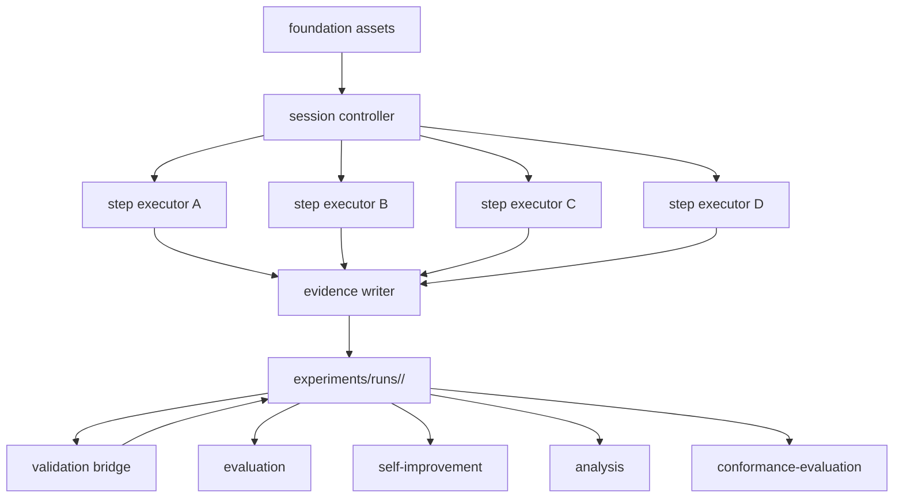

# Design Document：runtime

## 概要（Overview）

`runtime` は `foundation` が定義する共有資産層（shared asset layer）の上で、レビュー実行（review session）を駆動するオーケストレーション層（orchestration layer、調整実行層）である。本設計は次を具体に定義する。

- Step A／B／C／D の実行境界
- treatment（処理方式）と phase／profile（フェーズ／プロファイル）の切り分け
- プロンプト解決の方法
- 生証拠（raw evidence）と決定成果物（decision artifact）の保存形
- 検証器呼び出し（validator invocation）と実行終了境界（run close boundary）

runtime は ReviewCompass の中心にあるが、正本のスキーマやプロンプトを所有しない。foundation を **読む側**（consumer）であり、`evaluation`／`self-improvement`／`analysis`／`workflow-management`／`conformance-evaluation` に対して **証拠生成側**（evidence producer）として振る舞う。

## 目標（Goals）

- foundation 契約に従うレビュー駆動を提供する
- 人間決定単位（human decision unit）と生証拠単位を接続する
- 実行終了後に証拠が凍結される構造を作る
- `valid`／`invalid`／`exploratory`／`analysis_blocked` の下流分岐に必要な成果物を揃える
- `design`／`tasks` を中心にフェーズ対応のレビュープロファイルを切り替えられるようにする
- 対象アプリへ配置した直後から再現可能な実行環境として動作する

## 範囲外（Non-Goals）

- メトリクス集計（`evaluation` 責務）
- 改善提案の生成（`self-improvement` 責務）
- 報告書整形（`analysis` 責務）
- モデルベンダー抽象化の再定義（foundation で既定）
- 機能横断段の管理（`workflow-management` 責務）
- 仕様適合性評価（`conformance-evaluation` 責務）
- 中央側での外部取り込み判定（取り込み準備までは In scope、判定は別機能）

## 設計の前提（Design Drivers）

- プロンプトはスキル本体（skill body）ではなくリポジトリ内成果物として解決する
- 生証拠は不変（immutable）とし、検証器結果や人間判定は別成果物として重ねる
- 人間署名（human sign-off）を通っていない `finding` は確定レビュー出力にならない
- treatment と phase／profile は独立した軸として扱う
- 再演（replay）最小単位は foundation 設計に従い「実行内の段単位」とする
- runtime は foundation 契約を上書きせず、契約の内側で具体実行を定義する（contract consumer 原則）

## 全体構造（Architecture）

runtime は次の 4 役に分ける。

- **session controller**（セッション制御器）：実行開始、treatment／phase 選択、段遷移制御
- **step executors**（段実行器）：Step A／B／C／D ごとの入出力処理
- **evidence writer**（証拠書き出し器）：生証拠と決定成果物の保存
- **validation bridge**（検証橋）：実行終了時に検証器を呼び、結果を成果物とメタデータに反映



### 責務境界の明確化（Boundary Clarification）

runtime は foundation 契約の consumer であり、共有契約自体の定義者ではない。

foundation から受け取るもの：

- 段の正本名（canonical step names）
- スキーマ形状
- メタデータ項目定義（含む 6 語彙正本：`counter_status`／`validator_status`／`evidence_class`／`review_mode`／`severity`／`final_label`）
- プロンプト配置と識別規則
- 検証成果物形状

runtime が所有するもの：

- 実行ディレクトリ配置（run directory layout）
- 具体的な段ファイル命名（step file naming）
- treatment ごとの実行形態
- phase／profile 固有のレビュー挙動
- プロンプト上書きの選択順序（foundation §1 で「上書き拡張点の所在のみ固定」とされており、選択順序は runtime 所有）
- 証拠書き出し順序
- 実行終了境界と検証器呼び出し時機

runtime は foundation 契約を上書きせず、その内側で具体実行を定義する。

### Reference-Free Runtime Entry Principle（参照独立な実行入口）

runtime は特定の試験事例（pilot case）を前提にしない。

- 新しい事例（case）はワークフロー機構（workflow-management）側で初期化する
- runtime 入口は、その初期化で作られた事例マニフェスト（case manifest）か、同等に明示された入力群だけを受ける
- 汎用 runtime コードは特定事例の名称や識別子を暗黙の既定値にしない

これにより、対象アプリへ配置された runtime が、配置先プロジェクトの個別事例に暗黙依存しない。

## 実行成果物配置（Runtime Artifact Layout）

runtime が 1 実行ごとに生成するディレクトリは次を正本とする。

```text
experiments/runs/<run_id>/
├── run_manifest.yaml
├── review_case.json
├── steps/
│   ├── step_a_primary_detection.json
│   ├── step_b_adversarial_review.json
│   ├── step_c_judgment.json
│   └── step_d_integration.json
├── decisions/
│   ├── decision_units.json
│   └── human_signoff.json
├── failures/
│   └── failure_observations/
│       └── <observation_id>.json
├── validation/
│   ├── validator_result.json
│   └── invalidation_markers.json
└── derived/
    ├── runtime_summary.json
    ├── comparison_eligibility_note.json
    └── invalid_run_triage_note.json
```

### 配置の根拠（Placement Rationale）

- `run_manifest.yaml`：実行メタデータの運用者可読な正本
- `review_case.json`：foundation スキーマに従う機械可読な正本。Step D 統合レビュー記録も兼ねる（foundation §4 review_case 節の決定に従う）
- `steps/`：段単位再演の最小単位
- `decisions/`：人間決定連携を生証拠から切り離して保存
- `failures/failure_observations/`：失敗観察を独立成果物として保管。foundation §4 failure_observation 節の配置方針「`review_case` の内部に埋め込まず、独立成果物として管理」に従う。後から `self-improvement` が追加する場合も `review_case` を書き換えずに新規ファイル作成で対応
- `validation/`：検証器結果と無効化を別配置
- `derived/`：runtime 利便成果物。`evaluation` の正本ではない。無効実行トリアージのようなワークフロー支援成果物を含む

### 配置の運用ルール

- `review_case.json` は唯一の横断正本（スキーマは foundation 所有、下流はこれを正本として読む）
- 生証拠は不変。要約を後から更新しても生証拠は変更しない
- 可搬証拠束輸出は生実行ディレクトリを置き換えず、別成果物として扱う（後述 §可搬証拠束輸出）

## セッションモデル（Session Model）

### 1. 実行ライフサイクル（Run Lifecycle）

runtime のライフサイクル状態は foundation の `run_status` 語彙正本（4 値）に従う：

1. `created`：実行作成済み、開始前
2. `in_progress`：実行進行中（全段の完了前を含む）
3. `closed`：実行が段実行を完了し生証拠が凍結された状態
4. `orchestration_failed`：実行制御の失敗

重要な原則：`closed` は **有効性（validity）を意味しない**。`closed` は runtime が段実行を完了し、生証拠を凍結したことだけを表す。有効性は検証器と人間署名の結果で別に決まる（`validator_status` と `evidence_class`）。

### 2. セッション入力（Session Inputs）

実行開始時に session controller が固定する入力は次とする。

- `target_id`
- `target_artifact_hash`
- `source_repository_id`
- `source_revision`
- `phase_profile`
- `treatment`
- `review_mode`：foundation 正本語彙から選択（値は foundation 正本が定め、再定義しない）。runtime 自身が実行する場合は `runtime_mediated`
- `protocol_version`
- `runtime_version`
- `prompt_set_version`
- `schema_set_version`
- `config_version`：実効設定（effective config、ツール既定とアプリ上書きの結合結果）の版
- `config_hash`：実効設定のハッシュ
- 運用者識別子（operator identity）

これらは `run_manifest.yaml` に最初に記録し、実行中に上書きしない。

### 3. 実行マニフェスト項目集合（Run Manifest Field Set）

`run_manifest.yaml` は foundation §3 実行メタデータ契約が定める必須メタデータ項目を正本として保持する。項目は値を固定する時点で 2 群に分ける。runtime は項目集合を再定義せず、foundation 契約の項目を継承する。

**開始時固定**（実行開始時に controller が記録、実行中に上書きしない）：

- `run_id`
- §セッション入力の全項目（上記）
- `started_at`

**実行中に変化**（実行進行・検証・承認の結果で更新）：

- `run_status`
- `validator_status`（foundation 4 値正本：`not_run`／`passed`／`failed`／`blocked`）
- `human_signoff_status`
- `evidence_class`（foundation 4 値正本：`valid`／`invalid`／`exploratory`／`analysis_blocked`）
- `closed_at`

`evidence_class` は実行開始時には未確定とし、検証器結果と人間署名が揃った時点で確定遷移する。foundation §3／§9 の決定により、実行進行中の状態は `run_status=in_progress` で表現するため、`evidence_class` に過渡的な「候補」値は持たせない。確定後の値は foundation §9 探索実行と分析不能の取扱いに従う。

runtime は実行終了時に `evidence_class` の確定を、次の網羅的マッピングに従って行う。foundation の `validator_status`（4 値正本：`not_run`／`passed`／`failed`／`blocked`）と `human_signoff_status`（4 値正本：`pending`／`approved`／`rejected`／`deferred`）の組み合わせをすべてカバーする：

| `validator_status` | `human_signoff_status` | 探索宣言 | 無効化標識 | `evidence_class` 確定値 | 根拠 |
|---|---|---|---|---|---|
| 任意 | 任意 | あり | 任意 | `exploratory` | 探索宣言が他の判定より優先（運用者の意図的決定） |
| 任意 | 任意 | なし | あり | `invalid` | 無効化標識が付与された実行は無効 |
| `passed` | `approved` | なし | なし | `valid` | 検証合格＋人間明示承認 |
| `passed` | `rejected` | なし | なし | `invalid` | 人間が明示的に却下（検証は通ったが運用上は無効） |
| `passed` | `deferred` | なし | なし | `analysis_blocked` | 人間判断保留で確定不能 |
| `passed` | `pending` | なし | なし | `analysis_blocked` | 人間署名なしで実行終了、確定不能 |
| `failed` | 任意 | なし | なし | `invalid` | 検証失敗 |
| `blocked` | 任意 | なし | なし | `analysis_blocked` | 検証の前提条件未充足で結論不能 |
| `not_run` | 任意 | なし | なし | `analysis_blocked` | 検証未実行で確定不能 |

確定遷移は実行終了時の単一トランザクションで完了し、過渡値は持たせない（foundation §3／§9 の決定に従う）。本マッピングは下流仕様（`evaluation`／`analysis`／`conformance-evaluation`）が `evidence_class` を機械処理する際の網羅性を保証する。

### 4. phase／profile と treatment の軸

runtime では次の 2 軸を分離する。

- `phase_profile`（フェーズ・プロファイル）
  - `intent`
  - `requirements`
  - `design`
  - `tasks`
- `treatment`（処理方式、要件 2 受入 2、計画書 §5.15.6 由来）
  - `primary`（主役のみ）
  - `adversarial`（主役＋敵対役）
  - `judgment`（主役＋敵対役＋判定役）

`phase_profile` は「何を見るか」のレビュー強調点を変え、`treatment` は「どの段を使うか」の実行形態を変える。

語彙の所有関係：foundation §3 によれば `phase_profile` と `treatment` の値語彙は runtime 所有。本機能が初版 4 値（`phase_profile`）と 3 値（`treatment`）を確定する。

## ステップ実行モデル（Step Execution Model）

### Step A：Primary Detection（主役検出）

入力：

- 対象成果物（target artifact）
- phase／profile
- 主役プロンプト集合（primary prompt set）
- 設定（config）

出力：

- 主役所見（primary findings）
- 段別メタデータ
- プロンプト成果物の識別子（`prompt_id`／`prompt_version`／`prompt_artifact_path`）

保存先：`steps/step_a_primary_detection.json`

### Step B：Adversarial Review（敵対レビュー）

入力：

- 対象成果物
- Step A 所見
- phase／profile
- 敵対役プロンプト集合

出力：

- 敵対役所見（adversarial findings）
- 反証（counter-evidence）
- 差異化痕跡（divergence trace）
- 各所見の `counter_status`（foundation 3 値正本：`counter_evidence_raised`／`no_counter_evidence_after_challenge`／`not_assessed`）

保存先：`steps/step_b_adversarial_review.json`

`primary` treatment では実行せず、省略マーカーを記録する（後述）。

Step B は最終的に主役結論へ同意する場合でも、独立した反証の試行を必ず行う（foundation 要件 1 受入 4）。反証なしという結果も意図的結果として記録し、各所見の `counter_status` に上記 3 値のいずれかを必ず設定する。空の counter-evidence だけで「反証を試みていない」と「試みた結果なし」を曖昧にしない。

### Step C：Judgment（判定）

入力：

- Step A／B 所見
- 反証
- 判定役プロンプト成果物
- phase／profile

出力：

- 必要性判定（`necessity_judgment`）
- 最終ラベル（`final_label`、foundation 3 値正本：`must-fix`／`should-fix`／`leave-as-is`）
- 推奨措置（`recommended_action`）
- 任意の上書き理由（`override_reason`、任意項目）

保存先：`steps/step_c_judgment.json`

`primary` と `adversarial` treatment では実行せず、省略マーカーを記録する。

### Step D：Integration（統合）

入力：

- 前段出力（Step A／B、treatment に応じ Step C）
- 注：人間の判断行為は Step D の入力ではない。人間は Step D が生成した決定単位に対して後段で承認・否決・保留する（要件 5 受入 1、後述 §実行終了境界 参照）

出力：

- 決定単位（`decision_units`、推奨措置付き、未確定の人間決定を含む）
- 実行終了準備信号（run close readiness signal）

統合手順（追加の言語モデル呼び出しを行わない機械的手順、foundation 要件 1 受入 7）：

1. Step A・B の所見を収集し、`source_role` を保持したまま統合集合にする
2. treatment が Step C を含む場合、Step C の `necessity_judgment` と `final_label` を対応する所見に機械的に紐づける（Step C 非実行時は紐づけをスキップ）
3. 所見を決定単位に集約する（集約キーは所見の `requirement_link` または対象領域。新たな推論はしない）
4. 各決定単位の推奨措置を、Step C `final_label` がある場合はそれを写像し、ない場合は規定の既定規則で決める
5. 実行終了準備を、必須段出力の充足のみで機械判定する
6. 結果を `steps/step_d_integration.json` と `decisions/decision_units.json`、`review_case.json` の `integration_summary` に書き出す（人間決定は未確定のまま）

決定単位に対する承認・否決・保留は、Step D の出力ではなく、後段の人間署名の結果として `decision_units.json` と `human_signoff.json` に記録される（後述 §実行終了境界 の順序：Step D → 人間署名 → 検証器 → 終了）。

保存先：`steps/step_d_integration.json`、`decisions/decision_units.json`、`review_case.json`（`integration_summary` 項目）

### treatment × 段実行マトリクス（Treatment × Step Execution Matrix）

各段の実行状態は次の 3 値とする（要件 1 受入 4）：

- `executed`：段を通常実行する
- `skipped_by_treatment`：treatment 選択により意図的に実行しない（要件 2 受入 4）
- `failed`：実行されたが失敗

treatment ごとの各段実行状態は次を正本とする。

| treatment | Step A | Step B | Step C | Step D |
|-----------|--------|--------|--------|--------|
| `primary` | executed | skipped_by_treatment | skipped_by_treatment | executed |
| `adversarial` | executed | executed | skipped_by_treatment | executed |
| `judgment` | executed | executed | executed | executed |

`skipped_by_treatment` または `failed` の段は、`steps/step_<x>_*.json` に省略マーカー（marker record）を残す。マーカーは次を持つ。

- `step_id`／`step_name`
- `step_outcome`：`executed`／`skipped_by_treatment`／`failed`（要件 1 受入 4）
- `reason`：省略理由（treatment 由来である旨を示す）
- `treatment`：この決定の根拠となった treatment

これにより、設計上の意図的省略と事故的欠落を実行記録だけで区別できる（要件 2 受入 5）。`step_outcome` 語彙は本機能が所有する正本。`failed` の場合、必要に応じて foundation の `failure_observation` スキーマに準拠した記録を `failures/failure_observations/` に出力し、`step_outcome` 値の参照で連結する（要件 1 受入 4、要件 4 受入 7）。

**`step_status`（foundation）と `step_outcome`（本機能）の関係**：foundation §5 段別再演モデルは `step_records[]` の必須項目として `step_status` を要求するが、その値域は foundation 設計書では未確定。本機能の `step_outcome`（3 値正本）が `step_status` の値域として機能する。すなわち、`review_case.step_records[].step_status` には本機能が出力する `step_outcome` 値（`executed`／`skipped_by_treatment`／`failed`）が格納される。これは foundation contract consumer 原則の例外的解釈ではなく、foundation の `step_status` 値域未確定を本機能の正本で実体化する役割分担。下流仕様（`evaluation`／`self-improvement`／`conformance-evaluation` 等）が `step_status` を機械検査する際は、本 3 値正本を参照する。

## プロンプト解決モデル（Prompt Resolution Model）

runtime はプロンプト本体をコード内に持たない。各段は foundation と runtime 配下のプロンプト成果物をパス解決で読む。

### 解決順序

1. foundation 正本プロンプトパス（`runtime/foundation/layer1_framework.yaml` の `asset_locations.prompts` を経由して解決）
2. runtime 所有の役／フェーズ上書きパス
3. 一意解決できない場合は明示的に失敗（要件 3 受入 4）

定常挙動ではリポジトリ外プロンプト源を禁止する（要件 3 受入 5）。

### 役と段の対応（Role and Step Mapping）

各段は foundation の抽象役名を継承する（foundation 要件 2 受入 1）。対応は次を正本とする。

| Step | foundation 役 |
|------|---------------|
| Step A（primary_detection） | `primary_reviewer` |
| Step B（adversarial_review） | `adversarial_reviewer` |
| Step C（judgment） | `judgment_reviewer` |
| Step D（integration） | なし（言語モデル非依存の機械統合のためレビュアー役を持たない） |

### プロンプト識別子の記録（Prompt Identity Recording）

各段の記録は最低限次を持つ（要件 3 受入 2・3）。

- `prompt_artifact_path`
- `prompt_id`
- `prompt_version`
- `role`：このプロンプトを使った foundation 抽象役名

これにより再演時に「同じ段だがプロンプトが違う」ケースを判別できる。

## 決定単位モデル（Decision Unit Model）

runtime は生 `finding` をそのまま人間に渡さず、決定単位（decision unit）に束ねて提示する（要件 5 受入 1）。

決定単位の責務：

- 人間の承認・否決・保留の単位になる
- 1 つ以上の `finding` と `necessity_judgment` を束ねる
- 署名履歴を持つ

`decisions/decision_units.json` の各決定単位は次を持つ。

- `decision_unit_id`
- `finding_refs`
- `judgment_refs`
- `proposed_action`
- `human_decision`
- `human_decision_timestamp`
- `human_decision_note`

### 人間署名記録（Human Sign-off Record）

`decisions/human_signoff.json` は、個別決定単位の採否とは別に、実行全体の人間終了判断を表す実行レベル正本とする。実行終了境界（後述）の順序の起点であり、検証器呼び出しより前に書き込む（要件 6 受入 9）。

- `run_id`
- `human_signoff_status`：foundation `human_signoff_status` 語彙に従い `pending`／`approved`／`rejected`／`deferred` を区別（要件 5 受入 3）
- `signed_off_by`：終了判断を行った運用者識別子
- `signed_off_at`：終了判断の時刻
- `covered_decision_unit_ids`：この終了判断が対象とした決定単位の一覧
- `signoff_note`：任意の備考

foundation の `finding` スキーマにある `decision_unit_id` と `human_decision_ref` はこの成果物を参照する。

## 証拠出力モデル（Evidence Writing Model）

### 生証拠と派生証拠の分離（Raw vs Derived Separation）

runtime は証拠を次の 3 層で書き分ける。

- **生段証拠**（raw step evidence）：`steps/*.json`
- **人間／決定統合証拠**：`decisions/decision_units.json`、`decisions/human_signoff.json`
- **便宜要約**（convenience summaries）：`derived/*.json`

`review_case.json` を唯一の横断正本とする（スキーマは foundation 所有。下流はこれを正本として読む）。runtime は `steps/*.json` や `decisions/*.json` から `review_case.json` への投影規約（フィールド対応）を所有・定義し、`review_case.json` が常に foundation の `review_case` スキーマに準拠することを保証する。

**主要な投影対応**：

- `steps/*.json` の `step_outcome`（3 値正本）→ `review_case.step_records[].step_status`（foundation 必須項目、値域は本機能の `step_outcome` 3 値で実体化）
- `steps/*.json` の段別識別子（`step_id`／`step_name`／`step_prompt_artifact_id`／`step_started_at`／`step_closed_at`）→ `review_case.step_records[]` の対応項目
- 各段の所見（`findings`）→ `review_case.findings[]`（`finding.step_id` で `step_records` と紐付く、foundation §4 review_case 節に従う）
- `decisions/decision_units.json` の参照 → `review_case.findings[].decision_unit_id`
- `validation/validator_result.json` への参照 → `review_case.validator_result_refs[]`
- `validation/invalidation_markers.json` への参照 → `review_case.invalidation_marker_refs[]`
- Step D の統合本体 → `review_case.integration_summary`

レビュー実行が失敗状態（review miss／disagreement など）に陥った場合、runtime は foundation の `failure_observation` スキーマに準拠した記録を `failures/failure_observations/<observation_id>.json` に書き出す（要件 4 受入 7）。`failure_observation` は独立成果物として保管し、`review_case.json` の内部に埋め込まない（foundation §4 failure_observation 節の配置方針に従う）。`review_case` ↔ `failure_observation` の関連は `failure_observation.run_ref` で一方向参照する。

### 不変性の担保（Immutability Guarantee）

生段証拠は不変とする。要約を後から更新しても生段証拠は変更しない。具体的には：

- `steps/*.json`：実行終了後に書き換えない
- `review_case.json`：実行終了時に確定、後追で追加されるデータ（失敗観察、検証結果、無効化標識）は `failures/`／`validation/` に独立保管し、`review_case.json` からは参照のみ
- 凍結マーカー（freeze marker）：実行終了時に `run_manifest.yaml` に `closed_at` を記録し、これ以降の生段証拠変更を禁止

## 検証器連携（Validator Integration）

### 実行終了境界（Run Close Boundary）

実行終了は、次の順序がすべて完了した時点で成立する（要件 6 受入 9：人間署名 → 検証器 → 実行終了の順序を厳守し、検証器結果が人間決定に先行しない）。

1. Step D 完了
2. 人間署名成果物（`decisions/human_signoff.json`）の書き込み
3. 生証拠の凍結
4. 検証器呼び出し
5. `validation/validator_result.json` の保存

実行終了成立後に行うこと：

1. 無効化標識の付与（必要な場合）
2. `derived/invalid_run_triage_note.json` の生成（無効実行の場合）
3. `run_manifest.yaml` と `review_case.json` のメタデータ更新（`run_status=closed`、`validator_status`、`evidence_class` の確定）

この順序を崩さない。前提条件違反や多重起動を session controller が検知した場合、検証器を起動せず当該実行を fail-closed（`run_status=orchestration_failed`）とし、対応する無効化標識を付与する。

### 検証器結果（Validation Outcomes）

検証器結果は foundation `validator_status` 語彙正本（4 値）に従う：

- `not_run`：検査がまだ実行されていない
- `passed`：検査が実行されて合格した
- `failed`：実行されたが不合格となった
- `blocked`：前提条件未充足のため実行できなかった

runtime はこれを再定義・縮約せず、`blocked` をそのまま最終メタデータの `validator_status` に伝播し、前提不足の詳細を併記する（要件 6 受入 2）。

## 無効化処理（Invalidation Handling）

無効化は生証拠の編集ではなく `validation/invalidation_markers.json` への追加で表現する（要件 6 受入 3、foundation §8 検証と無効化のモデルに従う）。

runtime が自動で出せる典型は次のとおり：

- 必須成果物の欠落（missing required artifact）
- 解決不能なプロンプト識別子（unresolved prompt identity）
- 署名なしでの実行終了（run close without sign-off）
- treatment と段実行の不整合（treatment/step mismatch）

汚染（contamination）や隠れた介入のような人間判断が必要なものは、人間発行マーカーとして同じ成果物形式に追加する。

無効化標識の付与は、その実行を参照していた下流の派生成果物への陳腐化伝播義務を伴う（foundation 要件 6 受入 9）。本機能は伝播義務の発生を契約として扱い、具体的な陳腐化フラグ付与や再導出手段は `evaluation`／`analysis` の設計に委ねる。

無効実行が発生した場合、runtime は `derived/invalid_run_triage_note.json` を生成する。少なくとも次を含める。

- `primary_failure_code`
- `failed_validator_check_ids`
- `invalidation_marker_linkage`
- `operator_action_hint`

本トリアージ記録は runtime 便宜成果物だが、`self-improvement` やワークフロー失敗の再発パターン分析のための正規補助入力として使用してよい。

## 可搬証拠束輸出（Portable Evidence Bundle Export）

runtime はローカル実行の正本を `experiments/runs/<run_id>/` に保持したまま、機能横断分析のための可搬証拠束を生成できる形を採る（要件 9 受入 1〜5）。

### 輸出境界（Export Boundary）

輸出は runtime の実行終了・検証後に行う別工程であり、実行そのものには含めない。

輸出ができること：

- 生実行ディレクトリから束用複製を作る
- 輸出マニフェストを付与する
- 来歴を再確認する

輸出ができないこと：

- 生実行成果物の意味を書き換える
- 欠落した来歴を暗黙補完する
- 中央側の取り込み判定を済ませたことにする（後者は別機能の責務、要件 9 受入 4）

### 束形状（Bundle Shape）

初版では束を次のような可搬ディレクトリとして扱う。

```text
exports/<bundle_id>/
├── bundle_manifest.yaml
├── run/
│   └── <run_id>/...
└── checksums/
    └── bundle_checksums.json
```

`bundle_manifest.yaml` は少なくとも次を持つ（要件 9 受入 2）。

- `bundle_id`
- `run_id`
- `source_repository_id`（来歴の最低限保持）
- `source_revision`（来歴の最低限保持）
- `review_mode`（foundation 語彙の同一性を保持、要件 9 受入 3）
- `exported_at`
- `export_runtime_version`
- `included_artifact_refs`

`run/` 配下には中央側取り込みに必要な runtime 成果物の可搬複製を含める。輸出マニフェストは来歴の包絡であり、`evaluation` の取り込み判定そのものではない。

## フェーズ対応レビュープロファイル（Phase-Aware Review Profiles）

phase／profile ごとの差はプロンプトと強調点設定で吸収し、状態機械は変えない（要件 8 受入 2）。

初版ではプロファイルごとに次の強調点を持たせる。

- `intent`
  - 目標の曖昧さ
  - 範囲外の漏れ込み
- `requirements`
  - 範囲の逸脱
  - 要件の不整合
- `design`
  - 責務境界
  - 依存不整合
  - 失敗様式の欠落
- `tasks`
  - 範囲漏れ
  - 順序リスク
  - 検証不能なタスク分解

この強調点自体は runtime 所有のプロファイル設定に置き、foundation には戻さない。

### プロンプト上書きの選択（要件 8 受入 6）

リポジトリ内に複数のプロンプト候補がある場合、本機能はプロンプト上書きの解決方針を所有する。foundation の配置と同一性規則は維持する。

要件 3（プロンプト一意解決）との関係：要件 3 は単一候補プロンプトの版解決規則を扱い（一意解決の前提条件違反は失敗扱い、要件 3 受入 4）、本受入はフェーズプロファイル文脈で複数候補が存在する際の選択方針を扱う。両者の連動を実装側で保証する。

## 下流機能との接合面（Interfaces to Downstream Features）

### `evaluation` への接合面

`evaluation` は少なくとも次を読む。

- `run_manifest.yaml`
- `review_case.json`
- `validation/validator_result.json`
- `validation/invalidation_markers.json`
- `derived/comparison_eligibility_note.json`

`evaluation` は `derived/runtime_summary.json` に依存しない（便宜成果物の利用は任意）。

### `self-improvement` への接合面

`self-improvement` は少なくとも次を読む。

- 段ファイル（`steps/*.json`）
- 決定単位（`decisions/decision_units.json`）
- 検証器／無効化成果物
- `derived/invalid_run_triage_note.json`
- `failures/failure_observations/*.json`

特に Step B と Step C の成果物を再演入力として扱えるようにする（要件 7 受入 3）。

### `analysis` への接合面

`analysis` は runtime から直接生段ファイルを読むのではなく、原則 `evaluation` 出力を経由する。runtime は `analysis` の便宜のために成果物形状を変えない。

### `workflow-management` への接合面

`workflow-management` は本機能の状態機械契約（`run_status` 語彙、実行終了境界）に従い、各フェーズの所定手続きを駆動する。runtime は workflow-management が必要とする状態信号を `run_manifest.yaml` に提供する。

### `conformance-evaluation` への接合面

`conformance-evaluation` は本機能の出力する実行記録（`review_case.json`、`validation/validator_result.json`、`decisions/decision_units.json` 等）から、上流文書との適合性を評価する。runtime は appropriateness の判定ロジックを持たず、判定に必要な機械可読な実行記録を提供する責務のみ。

## 主要な設計判断（Key Decisions）

### 判断 1：実行ディレクトリは runtime の境界

1 実行 = 1 ディレクトリとし、再現性と移送性を確保する。

### 判断 2：決定単位は第一級成果物

`finding` と人間行為を安定的に結ぶため、決定単位を独立成果物にする。

### 判断 3：検証は証拠凍結後に行う

検証は生証拠を変更しない（要件 6 受入 3）。

### 判断 4：treatment と phase／profile は別軸

比較実験と認知負荷対応を混同しないため、両者を分離する。

### 判断 5：failure_observation は独立成果物

foundation §4 failure_observation 節の配置方針「`review_case` の内部に埋め込まず、独立成果物として管理」に従う。後追で追加されるデータは `review_case` の不変性を担保するため独立保管する。

### 判断 6：runtime は foundation 契約の consumer

runtime は foundation の語彙正本（6 件）を再定義・縮約せず、そのまま参照する。語彙拡張要求がある場合、foundation 側の改訂を経由する。

### 判断 7：パターン定義依存の除外（要件 10）

runtime はパターン定義ファイル（種パターン・重大パターン）の参照規約を持たない。レビュー検出は実 LLM 呼び出しによる動的判定として位置付け、固定パターン定義への定常依存を排除する。

## 要件と設計の対応（Requirements Traceability）

| 要件 | 設計の応答 |
|------|------------|
| 要件 1：レビュー実行制御 | session controller と step executors を定義（§ステップ実行モデル）、`step_outcome` 3 値正本（§treatment × 段実行マトリクス） |
| 要件 2：処理方式対応の実行 | treatment 別省略マーカーと実行形態を定義、3 値（primary／adversarial／judgment）を正本確定 |
| 要件 3：プロンプト解決と版追跡 | プロンプトパス解決と識別子記録を定義（§プロンプト解決モデル） |
| 要件 4：構造化された証拠の出力 | 実行ディレクトリと正本成果物を定義（§実行成果物配置）、foundation スキーマ準拠を保証 |
| 要件 5：人間決定の組み込み | 決定単位モデルを定義（§決定単位モデル）、人間署名記録を独立成果物に |
| 要件 6：検証器連携と実行終了 | 凍結 → 検証 → 注釈の順序を定義（§実行終了境界）、4 値検証器状態を伝播 |
| 要件 7：再演対応の実行時記録 | 段単位ファイルとプロンプト識別子を保存 |
| 要件 8：フェーズ対応レビュープロファイル | プロファイル軸と強調点モデルを定義 |
| 要件 9：可搬証拠束輸出 | 輸出境界と束形状を定義（§可搬証拠束輸出） |
| 要件 10：パターン定義依存の除外 | パターン定義参照規約を持たない、動的判定として位置付け（§判断 7） |

## テスト戦略（Test Strategy）

完全なテスト計画はタスク工程で策定するが、設計段階で次のテスト可能性の縫い目を固定する。

- **言語モデル差し替え点**：各段実行器の言語モデル呼び出しは差し替え可能な境界とし、固定応答に置換して段実行器を決定的に検証できる
- **検証ブリッジ起動点**：検証器呼び出しは実行終了境界の単一起動点に集約し、その入力（凍結後生証拠）と出力（`validator_result.json`）で単体検証できる
- **段入出力分離点**：各段実行器は入力（前段出力・プロンプト成果物・設定）と出力（`steps/*.json`）が分離され、前後段なしで単体検証できる
- **決定単位生成の検証方針**：Step D の機械的統合手順は言語モデル非依存のため、固定の Step A／B／C 出力を入力に与えれば決定単位生成を入出力対応で検証できる
- **実行終了境界の順序検証**：Step D → 人間署名 → 凍結 → 検証器 → 終了の順序を機械検査できる観測可能項目（observable）を controller に持たせる（凍結マーカー、署名タイムスタンプ、検証器呼び出しタイムスタンプ等）

実装段階で具体的なテストツール選定（pytest／rspec 等）と実行スクリプトを確定する。

## 先送り論点（Open Issues for Design Alignment Gate）

- runtime 所有プロファイル設定の具体配置
- `review_case.json` 内での段参照粒度
- 検証ブリッジの実行入口
- 確定レビュー出力の最終輸出形
- プロンプト上書き選択順序の具体実装

これらは `evaluation`／`self-improvement`／`analysis`／`workflow-management`／`conformance-evaluation` 設計が揃った後の design alignment 段で詰める。

## 完成判定基準（Completion Criteria）

- 1 実行の成果物配置を §実行成果物配置 で一意に説明できる
- 実行終了と検証の順序を §実行終了境界 で説明できる
- 決定単位が `finding` と人間判定をどう接続するか §決定単位モデル で説明できる
- 下流 5 機能（evaluation／self-improvement／analysis／workflow-management／conformance-evaluation）が runtime のどの成果物を読むか §下流機能との接合面 で追跡できる
- foundation の 6 語彙正本（`counter_status`／`validator_status`／`evidence_class`／`review_mode`／`severity`／`final_label`）を runtime が再定義せず参照のみで使用していることが、本設計書から確認できる
- runtime 所有の語彙（`phase_profile` 4 値、`treatment` 3 値、`step_outcome` 3 値）が §セッションモデルと §ステップ実行モデル で正本として確定されている

## 変更意図（Change Intent）

本設計は先行プロジェクトの runtime 設計を簡略化して捨てたのではなく、ReviewCompass の方針に従い、自己適用前提を除去しつつ実行制御・プロンプト解決・検証器連携・再演対応を引き継ぐことを目的とする。

ReviewCompass 固有の追加：

- **treatment 名の統一**：素材の `single`／`dual`／`dual+judgment` を要件 2 受入 2 と計画書 §5.15.6 由来の `primary`／`adversarial`／`judgment` に変更
- **`counter_status` の使用**：素材の `adversarial_outcome` を foundation で統一された `counter_status` に変更
- **`evidence_class` 4 値の運用**：素材の `candidate` 廃止と `analysis_blocked` 追加に対応。実行終了時の確定遷移を foundation §3／§9 に従う
- **`step_outcome` 3 値の正本所有**：要件 1 受入 4 由来。`executed`／`skipped_by_treatment`／`failed` を runtime が所有
- **隣接機能 6 機能体制**：素材の `paper-interface` を `analysis` に変更、`workflow-management` と `conformance-evaluation` を隣接機能に追加
- **`failure_observation` の独立成果物管理**：foundation §4 failure_observation 節の配置方針に従い、`review_case` 内に埋め込まず `failures/failure_observations/` に独立保管
- **設定 2 層モデル対応**：`config_version` と `config_hash` を実効設定（ツール既定とアプリ上書きの結合結果）の版とハッシュとして記録
- **`review_mode=runtime_mediated` の明示出力**：要件 6 受入 6 由来。runtime が生成する証拠には必ず `runtime_mediated` を付与し、下流の推論に頼らない
- **パターン定義依存除外を能動的要件として位置付け**：素材の「削除済み」表記から能動的要件への書き換え（要件 10）
- **contract consumer 原則の明示**：runtime は foundation 契約の consumer であり、語彙正本を再定義しない（§判断 6）

旧 v1 由来の歴史的セクション（素材末尾の「実装適合差し戻し対応」）は、新規構築のため必要事項を本文に吸収し、独立セクションとしては保持しない。
