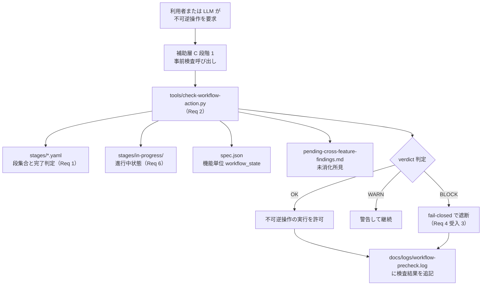

# Design Document：workflow-management

最終更新：2026-05-25（セッション 26：design.drafting 起草、要件 8 件に対応）

## 概要（Overview）

`workflow-management` は ReviewCompass における所定手続きの定義と機械強制を担う機能の **設計層** である。

要件文書（requirements.md）は 8 件の Requirement で、段集合の静的列挙、軽量版検査スクリプト、起草者と判定者の分離、不可逆操作の直前ゲート、reopen 機械強制、session 跨ぎ状態管理、多層防御の第 1 層位置付け、機能依存マップの一元化を求めている。本設計は計画書 §5.4〜§5.8（軽量化方針、所定手続きの階層構造、reopen 機械強制、session 跨ぎ状態管理、多層防御）を実装可能な形に落とし込み、先行プロジェクト `dual-reviewer-implementation-governance` の素材設計（466 行、節ハッシュ・独立再導出パーサ・supersedes リンク・通過マーカーの後続確認等を含む大規模機構）から **思想は継承、実装は 1／10** を目標として再設計する。

本設計の所有物は **手続きの段集合定義・検査スクリプト・直前ゲート・reopen 機械強制・session 跨ぎ状態管理** の 5 つのモデルである。レビューロジック（3 役・観点・所見分類）は `foundation` と `evaluation` が所有し、本機能は所定手続きの「どの段がいつ完了するか」「どの不可逆操作の前にどの検査を走らせるか」のみを担う。

## 目標（Goals）

- 所定手続きの段集合を機械可読な YAML（構造化テキスト形式）として静的に列挙し、Markdown 節からの動的解析を行わない
- 検査スクリプトの完了判定を「証跡ファイル存在＋必須節充足」のみに絞り、中身の妥当性判定を含めない（第 1 層の限界として明示）
- 起草者と判定者の分離をレビュー記録の冒頭メタデータ（front-matter、文書頭の構造化メタ情報）で機械検査可能にする
- 不可逆操作（spec.json 承認書き込み、コミット、プッシュ、フェーズ移行）の直前のみに機械ゲートを置き、それ以外には機械検査を強制しない（最小集合方針）
- 結論不能（証跡ファイルが解析不能、YAML が壊れている等）の場合に合格判定を出さず、必ず遮断する（fail-closed、検査結果が出せないときは止める方針）
- reopen 手続きの連鎖再実施を手戻り種別から機械的に決定し、`actor=human` の段（intent.yaml#approval 等）に到達した時点で必ず作業を停止する
- 機能間の処理順と依存関係を 1 ファイル（`stages/feature-dependency.yaml`）に一元化し、追加・削除を 1 箇所修正で完結させる

## 範囲外（Non-Goals）

- 各機能の業務ロジック修正（`runtime`／`evaluation`／`self-improvement`／`analysis`／`conformance-evaluation` の挙動変更は本機能の責務外）
- レビュー所見の妥当性判定（中身の質的評価は本機能の検査範囲外、利用者監査の第 3 層に委ねる）
- 節ハッシュ・supersedes リンク・grandfathering・format-migration・独立再導出パーサ（§5.4 で削除確定、素材から継承しない）
- 通過マーカーの後続確認（§5.4 で削除確定、二次防御は多層防御の第 2 層以降の宿題）
- 外部 CI・GitHub Actions・PR 運用ルール
- 人間レビュアーの組織割り当て方針
- 規律ファイル自体の起案・改廃方針（`self-improvement` の責務、本機能は所定手続きの入力として規律変更提案を受け取るのみ）
- 機械ゲートを git フックとして外部強制する仕組み（第 2 層、フェーズ 4 以降の宿題）

## 設計の前提（Design Drivers）

- 100% の規律遵守は原理的に不可能であり、複数層を重ねて実効遵守率を引き上げる方針（計画書 §5.8）
- LLM は文脈圧力下で規律ファイルの優先度を下げる失敗モードを起こす（§5.8 第 1 層の限界、補助層 C で事前検査を別途設計）
- 検査を呼ばない・結果を読まない・独断で進める経路は第 1 層の上にあるため、第 1 層単独では解決しない（多層防御の前提）
- 起草と判定を同一の actor が兼ねると自己承認の空洞化が起きる（§5.4 規律）
- 機能の追加・削除を 1 箇所修正で完結させないと、整合漏れが累積する（§5.5 選択肢 X の根拠）
- session 跨ぎの最大の盲点は「複数段にまたがる手続きの途中状態」であり、状態ベース検査だけでは捉えられない（§5.7 由来）

## 全体構造（Architecture）

本機能は repo 内に **段集合 YAML 9 ファイル ＋ 検査スクリプト 1 本 ＋ 進行中状態ファイル群** を持つ。実体は次の 3 層構造を取る。

```
リポジトリ内配置（実体）
├── stages/                              # 段集合 YAML の保管先（Req 1）
│   ├── intent.yaml                      # intent 層（drafting／review／approval の 3 段）
│   ├── feature-partitioning.yaml        # 機能分離（candidate-proposal／approval の 2 段）
│   ├── feature-dependency.yaml          # 機能依存マップ（Req 8、所有者は本機能）
│   ├── requirements.yaml                # 要件フェーズ（5 段、feature-dependency 参照）
│   ├── design.yaml                      # 設計フェーズ（5 段、同上）
│   ├── tasks.yaml                       # タスクフェーズ（5 段、同上）
│   ├── implementation.yaml              # 実装フェーズ（5 段、同上）
│   ├── reopen-procedure.yaml            # reopen 手続き（10 ステップ、trigger_map 含む）
│   ├── cross-spec-alignment.yaml        # 機能横断整合（段集合は別途確定）
│   ├── in-progress/                     # 進行中状態ファイル（Req 6、session 跨ぎ用）
│   └── completed/                       # 完了済み手続きの記録
├── tools/check-workflow-action.py       # 検査スクリプト本体（Req 2、補助層 C 段階 2）
├── docs/logs/workflow-precheck.log      # 検査結果のログ書き出し先（Req 2 受入 5 補強）
└── docs/reviews/reopen-classification-<日付>.md  # reopen 種別判定の根拠（Req 5 受入 5）
```

実行時のデータの流れ：



検査スクリプトは段集合 YAML、進行中状態ファイル、spec.json、未消化所見の 4 つを入力として読み、verdict（判定結果）を返す。verdict には OK／WARN／BLOCK の 3 値を使う（actor=human の段で承認待ちのときは BLOCK で止め、警告のみで継続できる軽微な未整合は WARN とする）。

### 責務境界の明確化（Boundary Clarification）

本機能が所有するのは **手続きの完了規則と検査スクリプト** であり、各機能の業務 artifact の所有権は持たない。

| 所有関係 | 所有者 | 本機能との関係 |
|---|---|---|
| 段集合 YAML（`stages/*.yaml`） | **workflow-management** | 本機能が単独所有・改廃 |
| 検査スクリプト（`tools/check-workflow-action.py`） | **workflow-management** | 本機能が単独所有・改廃 |
| 機能依存マップ（`stages/feature-dependency.yaml`） | **workflow-management**（Req 8 受入 5） | 他機能は再定義せず参照のみ |
| reopen 種別判定の根拠ファイル | **workflow-management**（Req 5 受入 5） | 他機能は参照のみ |
| 各機能の spec.json（`.reviewcompass/specs/<機能>/spec.json`） | 各機能 | 本機能は読むのみ、書き込みは検査通過後に各機能の起草者が行う |
| レビュー記録（`.reviewcompass/specs/<機能>/reviews/*.md`） | 各機能 | 本機能は front-matter の構造のみ検査（Req 3 受入 4） |
| レビュー所見の妥当性 | `evaluation`／利用者監査の第 3 層 | 本機能の検査範囲外（Req 2 受入 3、Req 7 受入 1） |
| 状態軸の語彙（`run_status`／`validator_status` 等） | `foundation` | 本機能は参照のみ、再定義しない（要件 Boundary Context 隣接期待） |
| 規律ファイル本体（`docs/disciplines/discipline_*.md`） | **workflow-management**（実体書き換え、A-007 案 2） | `self-improvement` から変更提案を受け取り、所定手続き経由で実体変更 |
| 規律ファイルの提案権 | `self-improvement` | 本機能は提案を所定手続きの入力として受け取る |

`self-improvement` との権限分散（A-007 案 2、2026-05-23 利用者承認）：規律ファイルの **提案権** は `self-improvement` が持ち、**実体変更権** は本機能が所定手続き（drafting → review → approval）経由で実施する。本機能は規律変更を Req 4 受入 1 の不可逆操作の対象として扱い、`self-improvement` が直接ファイル書き換えを行うことはない。

## 段集合の静的列挙モデル（Stage Set Static Enumeration Model）— Req 1

### 1. 9 ファイル体制（計画書 §5.5）

段集合は次の 9 ファイルに静的列挙する。Markdown 節からの動的解析は行わない（Req 1 受入 1）。

| ファイル | 段集合 | actor 構成 |
|---|---|---|
| `stages/intent.yaml` | drafting／review／approval の 3 段 | human／llm／human |
| `stages/feature-partitioning.yaml` | candidate-proposal／approval の 2 段 | llm／human |
| `stages/feature-dependency.yaml` | 段集合なし（機能依存マップ本体、Req 8） | — |
| `stages/requirements.yaml` | drafting／triad-review／review-wave／alignment／approval の 5 段 | llm／llm／llm／llm／human または proxy_model |
| `stages/design.yaml` | 同上 | 同上 |
| `stages/tasks.yaml` | 同上 | 同上 |
| `stages/implementation.yaml` | 同上 | 同上 |
| `stages/reopen-procedure.yaml` | 第 1〜10 ステップ、第 7 段に trigger_map | llm／human 混合 |
| `stages/cross-spec-alignment.yaml` | 段集合は別途確定（フェーズ 2 以降） | — |

各 YAML 段は最低限、段名／`actor`／期待する証跡ファイルのパスパターン／必須節名のリスト／完了判定方式を含む（Req 1 受入 3）。

### 2. 段定義の構造例

`stages/requirements.yaml` の段定義例：

```yaml
process_id: requirements
description: 要件フェーズの所定手続き（drafting → triad-review → review-wave → alignment → approval の 5 段）
feature_order: feature-dependency.yaml#phase_order   # Req 8 受入 3、Req 1 受入 4

stages:
  - name: drafting
    actor: llm                                      # 起草、主に LLM
    artifact_paths:
      - .reviewcompass/specs/{feature}/requirements.md
    required_sections:
      - Introduction
      - Boundary Context
      - Requirements
      - Change Intent
    completion_predicate: artifact_exists_and_sections_present
    description: 起草者と判定者の分離規律により、起草段は判定段と別 actor で実施する

  - name: triad-review
    actor: llm
    artifact_paths:
      - .reviewcompass/specs/{feature}/reviews/*-requirements-triad-review.md
    required_sections:
      - 主役レビュー
      - 敵対役レビュー
      - 判定役レビュー
      - 統合
    completion_predicate: artifact_exists_and_sections_present_and_author_reviewer_distinct
    front_matter_required:
      - author.identity
      - reviewer.identity
      - reviewer.separation_from_author
    description: 3 役レビュー、起草者と判定者の異名を front-matter で必須化

  - name: review-wave
    actor: llm
    feature_order_required: true                    # 全機能の drafting＋triad-review 完了後に開始
    artifact_paths:
      - docs/reviews/{phase}-review-wave-{日付}.md
    completion_predicate: all_features_drafting_and_triad_review_completed
    description: 機能横断の波及所見の集約消化

  - name: alignment
    actor: llm                                      # LLM 自動判定
    completion_predicate: cross_spec_alignment_passed
    description: フェーズ終端の機能横断整合確認（LLM 自動判定）

  - name: approval
    actor: human                                    # 人間が承認（proxy_model 代行は §5.12 で条件付き許容）
    actor_allowed:
      - human
      - proxy_model
    proxy_allowed_condition: reviewcompass.yaml#human_proxy.proxy_allowed
    completion_predicate: explicit_human_approval_recorded
    description: 不可逆操作（フェーズ移行）の直前ゲート、本人または proxy_model による明示承認
```

`{feature}` と `{phase}` は段集合 YAML のテンプレート変数。検査スクリプトは `feature_order` から機能名を順に展開して段の完了を判定する。

### 3. 機能横断段と機能単位段の区別

- **機能横断段**：`feature_order` を持つ段（review-wave、alignment、approval の 3 段）。`feature_order: feature-dependency.yaml#phase_order` で機能依存マップを参照し、対象機能集合を一元化する（Req 1 受入 4、Req 8 受入 3）
- **機能単位段**：`feature_order` を持たない段（drafting、triad-review の 2 段）。各機能の `spec.json` の `workflow_state.<フェーズ>.<段>` で個別に管理する

機能横断段の機能横断側状態は `stages/<フェーズ>.yaml` の進行記録または別途配置する集約ファイルで保持し、機能単位の状態は各機能の `spec.json` で保持する（計画書 §5.24.8 由来）。

### 4. 段集合の変更運用

段集合の変更は YAML ファイル 1 箇所の修正で完結する（Req 1 受入 5）。Markdown 文書（運営ガイド、計画書）側との整合は人手で取る前提とし、自動同期は行わない（§5.4 受け入れリスク）。段集合の変更そのものを不可逆操作の対象とするかは本フェーズで決めず、第 5 層（処理表面積の抑制）導入時に検討する（先送り論点参照）。

## 軽量版検査スクリプトモデル（Lightweight Check Script Model）— Req 2

### 1. 検査の対象と原則

検査スクリプト `tools/check-workflow-action.py` は Python 実装で（Req 2 受入 1）、次の 4 入力のみを読む：

- 段集合 YAML（`stages/*.yaml`）
- 進行中状態ファイル（`stages/in-progress/*.yaml`）
- 機能単位 spec.json（`.reviewcompass/specs/<機能>/spec.json`）
- 未消化所見（`.reviewcompass/pending-cross-feature-findings.md`）

判定原則：

- **段ごとの完了判定**：YAML に列挙された証跡ファイルがすべて存在し、必須節名がすべて含まれること、それ以外は判定対象としない（Req 2 受入 2）
- **中身の妥当性判定は行わない**：所見の質、表現の適切性、論理的整合性は判定範囲外（Req 2 受入 3、第 1 層の限界として明示）
- **fail-closed の既定**：結論不能（YAML が壊れている、証跡ファイルが解析不能、必須フィールド欠落）の場合は合格判定を出さず、必ず fail を返す（Req 2 受入 4）
- **進行中手続きの警告**：`stages/in-progress/` に何かファイルがあれば「未完了の手続きあり」の警告を出す（Req 2 受入 5）

### 2. サブコマンド構成（補助層 C 段階 2 由来、`docs/operations/WORKFLOW_PRECHECK.md` 参照）

| サブコマンド | 入力 | 用途 |
|---|---|---|
| `spec-set <feature> <phase> <stage> <new_value>` | 機能名・フェーズ・段・新しい真偽値 | `spec.json` の `workflow_state` 変更前の依存検査 |
| `commit` | （引数なし） | `git commit` 直前の検査（spec.json 整合、規律遵守、未消化所見の有無） |
| `push` | （引数なし） | `git push` 直前の検査（コミット履歴整合、リモート状態） |

各サブコマンドの戻り値（exit code）：

- `0`：OK（不可逆操作を許可）
- `1`：WARN（警告を出すが継続可、利用者判断で進める）
- `2`：BLOCK（fail-closed で遮断、不可逆操作を許可しない）

出力形式は人間可読の既定形式（VERDICT／ACTION／REASON／CURRENT STATE）と、`--json` 指定時の JSON 形式の 2 種類（補助層 C 段階 2 仕様 §7.3）。判定結果はログ（`docs/logs/workflow-precheck.log`、上書き可能）に追記する（同 §8.2）。

### 3. 完了判定の述語集合（completion_predicate 値域）

段集合 YAML の `completion_predicate` フィールドが取る値の集合：

| 述語名 | 判定内容 |
|---|---|
| `artifact_exists` | 期待する証跡ファイルが存在する |
| `artifact_exists_and_sections_present` | ファイル存在＋必須節名がすべて含まれる |
| `artifact_exists_and_sections_present_and_author_reviewer_distinct` | 上記＋front-matter の `author.identity` と `reviewer.identity` が異名 |
| `all_features_drafting_and_triad_review_completed` | `feature_order` の全機能で drafting＋triad-review が true |
| `cross_spec_alignment_passed` | 機能横断整合の判定が pass、未消化所見が 0 件 |
| `explicit_human_approval_recorded` | 利用者または proxy_model の明示承認が記録されている |

述語集合の追加・削除は本機能の責務。新しい述語を導入する場合は、本節と検査スクリプト実装の両方を同時に更新する。

### 4. 第 1 層の限界の明示

検査スクリプトが解決しない失敗モード（計画書 §5.8 由来、Req 7 受入 1）：

- 中身の空疎（必須節は存在するが内容が「特に問題なし」のみ）
- 検査スクリプト自体が呼ばれない経路
- `stages/in-progress/` ファイルの自己申告性（嘘・古い・欠落の余地）
- 文脈圧力下での規律ファイル優先度低下

これらは多層防御の他層（補助層 A／B／C、第 2〜5 層）で補完する。本機能は第 1 層の限界を運用文書（`docs/operations/WORKFLOW_PRECHECK.md`）に明示し、利用者の期待値を整える（Req 7 受入 4）。

## 起草者と判定者の分離モデル（Author-Reviewer Separation Model）— Req 3

### 1. front-matter の必須フィールド（計画書 §5.4 由来）

レビュー記録（`.reviewcompass/specs/<機能>/reviews/<日付>-<種別>.md`）の冒頭メタデータに次を必須化する：

```yaml
---
type: <レビュー種別>                     # 例：design_triad_review
target: <対象文書のパス>
target_commit: <commit hash>
target_content_hash: <sha256>
date: 2026-05-25
mode: subagent_mediated                  # manual_dogfooding／subagent_mediated／runtime_mediated
author:
  identity: claude_code_main_session     # 起草者の識別子
  model: claude-opus-4-7
  role: drafter
reviewer:
  identity: claude_code_subagent         # 最終判定者の識別子（必ず異名）
  model: claude-opus-4-7
  role: final_judgment
  separation_from_author: true           # 明示的に異名であることを宣言
---
```

機械検査は次の 3 点を判定する（Req 3 受入 4）：

1. `author.identity` と `reviewer.identity` フィールドの存在
2. `author.identity` ≠ `reviewer.identity`（文字列比較で同一を許容しない、Req 3 受入 2）
3. `reviewer.separation_from_author` が `true`

別モデル・別 session の機械判定は第 1 層検査対象外。これは利用者監査の第 3 層に委ねる（Req 3 受入 4 由来）。理由：CLI／API 経路の実行環境を機械判定で確実に区別する手段がフェーズ 1 では整わないため。

### 2. サブエージェント方式（subagent_mediated）の特例（Req 3 受入 3）

メインセッション LLM が主役（primary_reviewer）を兼ねる場合、判定役（judgment_reviewer）は **必ず別エンティティ**（別モデルかつ別 session）で実施する。これは計画書 §5.23.12 サブエージェント方式の限界（§5.23.12.7）を踏まえた特例である。

サブエージェント方式採用時の front-matter 例：

```yaml
author:
  identity: claude_code_main_session     # メインセッションが主役と起草を兼ねる
  model: claude-opus-4-7
  role: drafter_and_primary_reviewer     # 暫定許容の宣言
reviewer:
  identity: claude_code_subagent_judgment   # 判定役は別サブエージェント
  model: claude-opus-4-7                    # 同モデル許容（§5.9.1 改訂後）
  role: final_judgment
  separation_from_author: true
  subagent_invocation_method: agent_tool_with_general_purpose
```

`subagent_mediated` の場合、`role` フィールドに `drafter_and_primary_reviewer` 等の複合役を許容する（暫定許容の明示）。完全分離（メイン LLM が 3 役のいずれにもならない）はフェーズ 4 の runtime_mediated 経路で実装する。

### 3. 異名判定の機械検査範囲

機械検査の対象範囲（第 1 層で判定可能）：

- フィールドの存在判定
- 文字列の同一性判定
- 値域チェック（`actor` フィールドが `human`／`llm`／`proxy_model` のいずれか等）

機械検査の対象外（第 3 層 利用者監査または定期事後監査に委ねる）：

- 別モデルであることの実体確認（環境変数や API 呼び出し履歴の照合）
- 別 session であることの実体確認（session ID の独立性検証）
- レビュー記録の中身が独立性を満たすかの質的判定

## 不可逆操作の直前ゲートモデル（Pre-Operation Gate Model）— Req 4

### 1. 不可逆操作の最小集合（Req 4 受入 1）

機械ゲートの対象は次の 4 種類に絞る：

| 不可逆操作 | 検査対象 | 検査結果が fail の場合 |
|---|---|---|
| `spec.json` の `approval` 段書き込み | 当該機能の前段（alignment）が true、未消化所見が 0 件 | spec.json 書き込みを許可しない |
| `git commit` | 検査スクリプトが pass、`stages/in-progress/` が空 | commit を許可しない |
| `git push` | 直前のコミットが上記検査を通過済み、リモート状態と整合 | push を許可しない |
| フェーズ移行（次フェーズの drafting 段 true 化） | 当該フェーズの approval 段が全 7 機能で true | フェーズ移行を許可しない |

それ以外（spec.json の drafting／triad-review 段の書き込み、中間段の遷移など）には機械ゲートを置かない（最小集合方針、Req 4 受入 4）。これは検査スクリプトを呼ぶ頻度を下げ、検査自体の存在感を高めるため。

### 2. ゲート発火条件と独立走行（Req 4 受入 2）

ゲートは次の 2 条件で発火する：

1. Requirement 2 の検査スクリプトが pass を返す
2. `stages/in-progress/` に未完了手続きが存在しない

直前ゲートは **毎回独立して走行する**。session 開始時の検査結果（Req 6 受入 3）をキャッシュせず、session 開始後の状態変化（途中での `stages/in-progress/` ファイル追加、所見の追加等）を直前で再検出する。これは「session 開始時には pass だったが、その後の作業で状態が変わって本来 fail になるはずの遷移を見落とす」失敗モードを防ぐため。

### 3. fail-closed の既定（Req 4 受入 3）

検査が結論不能な場合：

- 検査スクリプトの実行に失敗した（exit code が 0 でも 1 でも 2 でもない、または stderr に致命的エラー）
- 段集合 YAML が壊れている（YAML パースエラー）
- 必須フィールドが欠落している
- `feature_order` が参照する `feature-dependency.yaml` が存在しない

これらの場合、ゲートを通さず必ず遮断する。判定不能を pass と解さない（fail-closed の既定）。これは「曖昧なときは止める」方針で、誤って不可逆操作を許可することによる被害を防ぐ。

### 4. ゲートと補助層 C 段階 3 の関係

本ゲートは検査スクリプト（補助層 C 段階 2）を内部で呼び出す。利用者または LLM が不可逆操作を要求した時点で、補助層 C の 3 段階が次の順に走る：

1. **段階 1**：LLM 規律として、これから何をするかを応答内で明示し、段階 2 を呼ぶ
2. **段階 2**：本ゲートの検査スクリプト（`check-workflow-action.py`）が走る
3. **段階 3**：Claude Code フック機構（フェーズ 2 以降の宿題）が段階 2 を自動で呼び、逸脱なら遮断

段階 3 が実装されるまでは段階 1 の規律で代用する。段階 1 と段階 3 は段階 2 を呼ぶ経路が異なるだけで、判定本体は段階 2 が単一の責務として持つ。

## reopen 機械強制モデル（Reopen Mechanical Enforcement Model）— Req 5

### 1. 手戻り種別の二次元表記（Req 5 受入 1、計画書 §5.6）

手戻り種別は **起点フェーズ記号 ＋ 深さ** の二次元で表す：

| 記号 | フェーズ | 深さの値域 |
|---|---|---|
| N | intent | 0 のみ（intent より上流なし） |
| R | requirements | 0〜1 |
| D | design | 0〜2 |
| A | tasks | 0〜3 |
| I | implementation | 0〜4 |

深さは「起点フェーズの何段上に戻るか」を表す。例：

- I-0 は実装段の整合ゲート再実施のみ
- I-4 は実装段で発見された問題が intent まで遡る場合の全フェーズ連鎖再実施
- D-1 は設計段で発見された問題が要件段の修正を要する場合（要件・設計の 2 フェーズ連鎖）

旧表記 A／B／C／D は I-0／I-2／I-3／I-4 に対応し、旧表記で欠落していた I-1 を含めた完全二次元表記となる。

### 2. trigger_map による連鎖再実施対象の決定（Req 5 受入 2）

`stages/reopen-procedure.yaml` の第 7 段に `trigger_map` を持たせる。種別から再実施対象を機械的に決定する：

```yaml
- name: 該当ゲートの再実施
  actor: llm                            # 段の進行は LLM、ただし actor=human の段に到達したら停止
  trigger_map:
    D-1:
      - stages/requirements.yaml#alignment
      - stages/requirements.yaml#approval
      - stages/design.yaml#alignment
      - stages/design.yaml#approval
    # 他種別の trigger_map は計画書 §5.6 を参照
```

連鎖再実施対象は「根本原因フェーズの整合ゲート」から「起点フェーズの整合ゲート」まで、上流から下流へ順に並べる。起点フェーズまで再実施することで、上流変更が下流に正しく伝播したかを機械判定できる（計画書 §5.6 連鎖再実施の対象範囲）。

### 3. actor=human 段での自動停止（Req 5 受入 3〜4）

LLM が trigger_map に沿って連鎖を進めるとき、`actor=human` の段（`intent.yaml#approval`、`feature-partitioning.yaml#approval`、`requirements.yaml#approval` 等）に到達した時点で **作業を停止し、`stages/in-progress/` ファイルに「人間承認待ち」を記録して待機する**。

人間承認なしに次の段への進行を許さない（fail-closed、Req 5 受入 4）。これは「LLM が intent を勝手に書き換えて承認なしで進む」リスクを構造的に止めるため。

待機中の `stages/in-progress/reopen-procedure-<日付>.yaml` の例：

```yaml
process_id: reopen-procedure
started_at: 2026-05-25T14:00:00+09:00
trigger: D-1（設計段で要件段の不整合発見）
classification_basis: docs/reviews/reopen-classification-2026-05-25.md
completed_steps: [1, 2, 3, 4, 5, 6]
next_step: 7
pending_gates:
  - stages/requirements.yaml#alignment   # actor=llm、機械判定で進行
  - stages/requirements.yaml#approval    # actor=human、ここで停止
  - stages/design.yaml#alignment
  - stages/design.yaml#approval
current_blocker: stages/requirements.yaml#approval（人間承認待ち）
```

### 4. 種別判定の根拠保存（Req 5 受入 5）

reopen の第 6 ステップで、種別判定の根拠を `docs/reviews/reopen-classification-<日付>.md` として保存する。第 7 段はこの判定ファイルを読み込んで `trigger_map` から連鎖再実施対象を決定する。

種別判定根拠ファイルの最低限の構造：

```markdown
---
date: 2026-05-25
classifier: claude_code_main_session
classification: D-1
trigger_source: design/triad-review で発見した要件段の不整合
---

## 分類根拠
- 発見段：design.triad-review
- 影響範囲：要件段の Requirement X の語彙が design.md と矛盾
- 上流戻り：requirements 段への修正が必須
- 連鎖：requirements の修正後、design の再整合を要する → D-1
```

判定が後で誤りと分かった場合、reopen 自体をやり直す（`stages/in-progress/` ファイルを新しいものに置き換え、旧ファイルは削除せず証跡として保全）。

## session 跨ぎ状態管理モデル（Session-Spanning State Model）— Req 6

### 1. 進行中状態ファイルの構造（Req 6 受入 1〜2）

現在進行中の手続きは `stages/in-progress/<process_id>-<日付>.yaml` で表す。ファイル名は「手続き ID」と「開始日付」で一意化する。

最低限のフィールド（Req 6 受入 2）：

| フィールド | 内容 |
|---|---|
| `process_id` | 手続きの識別子（`reopen-procedure`／`requirements-review-wave` 等） |
| `started_at` | 開始時刻（ISO 8601） |
| `trigger` | 開始の契機（人間可読の短い説明） |
| `completed_steps` | 完了済みステップの番号リスト |
| `next_step` | 次に実施すべきステップの番号 |
| `pending_gates` | 残ゲートのリスト（`stages/<ファイル>#<段名>` 形式） |

任意の追加フィールド：`classification_basis`（reopen の場合、種別判定根拠ファイルへのリンク）、`current_blocker`（人間承認待ちの場合、停止位置）、`escalation_status`（通知済みか否か）など。

### 2. session 開始時の標準フロー（Req 6 受入 3）

session 開始時、次を順に行う：

1. `TODO_NEXT_SESSION.md` を読み、全体の到達点を把握
2. `git log --oneline -10` ／ `git status` で直近の到達点と未コミット変更を確認
3. 検査スクリプトを `stages/*.yaml` 全件に走らせる（フェーズ 1 段階では人手で `check-workflow-action.py` を呼ぶ）
4. `stages/in-progress/` の有無を確認
5. 進行中手続きがあれば、それを優先的に完了させる（無視して新規作業を始めない）
6. 完了済み・未着手の状態に基づき、次の作業を決定

本フローは運営ガイド `docs/operations/SESSION_WORKFLOW_GUIDE.md` §1 必読フローと一体運用する。

### 3. 完了時の移動（Req 6 受入 4）

手続きが完了したら、`stages/in-progress/<process_id>-<日付>.yaml` を `stages/completed/` に移動するか削除する。移動を採用する利点は「過去の手続きの記録が残り、事後監査に使える」こと、削除を採用する利点は「ディレクトリが肥大化しない」こと。本フェーズでは移動を既定とし、定期的に古いものを `docs/archive/in-progress/` 配下に退避する運用とする。

### 4. 進行中状態と不可逆操作の関係（Req 6 受入 5）

`stages/in-progress/` に何かファイルがある状態での不可逆操作実行を遮断する（fail-closed、Req 4 と整合）。これは「進行中の手続きを放置して別の不可逆操作を始める」失敗モードを防ぐため。

例外：進行中状態ファイル自体の更新（次ステップ進行、人間承認の記録）は遮断対象外。これらは進行中の手続きを進めるための更新であり、別の不可逆操作とは区別する。

## 多層防御の位置付けモデル（Multi-Layered Defense Positioning Model）— Req 7

### 1. 第 1 層の限界の明文化（Req 7 受入 1）

本機能（軽量版 YAML 検査機構）は多層防御の **第 1 層** に位置付ける。第 1 層が解決しない失敗モードを次のように明文化する：

| 失敗モード | 発生原因 | 補完する層 |
|---|---|---|
| 中身の空疎 | 必須節は存在するが内容が「特に問題なし」のみ | 第 3 層（フェーズ境目の利用者監査）、第 4 層（定期事後監査） |
| 検査スクリプト呼び出し依存 | LLM が検査を呼ばない、結果を読まない | 第 2 層（git フック）、補助層 C 段階 3（Claude Code フック） |
| in-progress ファイルの自己申告性 | 「進行中」「次ステップ」を書くのは LLM 自身、嘘・古い・欠落の余地 | 第 3 層、第 4 層 |
| 文脈圧力下での規律低下 | 規律ファイルを増やすほど LLM が優先度を下げる | 第 5 層（処理表面積の抑制方針）、補助層 C |

これらは多層防御の他層で補完し、第 1 層単独で 100% の遵守を達成しようとしない。

### 2. 第 2〜5 層への参照（Req 7 受入 2、計画書 §5.8）

第 2〜5 層はフェーズ 4 以降の宿題として参照する：

- **第 2 層：git フックによる外部強制**：検査スクリプトを `pre-commit`／`pre-push` フックに組み込み、LLM が「呼ばない」選択を構造的に不可能にする
- **第 3 層：フェーズ境目の利用者監査**：フェーズの境目で利用者が検査結果を必ず確認する手続きを必須化
- **第 4 層：定期事後監査**：一定 session 数または期間ごとに独立 LLM で過去証跡全件を監査
- **第 5 層：処理表面積の抑制方針**：「新規規律を追加するときは既存規律 1 つ以上を統廃合する」等の縮減義務

本機能は第 2〜5 層の具体実装を持たないが、設計時に **将来導入する余地を残す** ことを明示する。例：段集合 YAML の `completion_predicate` 述語集合は第 2 層の git フックから直接呼び出せる構造とする（CLI からも fook からも同じスクリプトを呼ぶ）。

### 3. 補助層 A／B／C の位置付け（計画書 §5.8、§5.12、§5.13）

第 1 層と第 2 層の中間に補助層を 3 つ置く：

- **補助層 A：人間代役機構（§5.12）**：軽い判断を外部モデルが代行、本人関与の頻度を下げる
- **補助層 B：人間への通知機構（§5.13）**：本人判断が必要な場面で外部チャネル（メール・LINE 等）に即時通知
- **補助層 C：処理開始時のワークフロー事前検査（§5.8 補助層 C、3 段階共存モデル）**：本機能の検査スクリプトがその実体

補助層 C は本機能の検査スクリプトを段階 2 として持ち、段階 1（LLM 規律）と段階 3（Claude Code フック）から呼ばれる。本機能は段階 2 の実装を所有し、段階 1 の規律化と段階 3 のフック実装は別経路で進める。

### 4. 第 5 層運用ルールの反映（Req 7 受入 3）

第 5 層（処理表面積の抑制方針）の運用ルール「新規規律を追加するときは既存規律 1 つ以上を統廃合する」を本機能の運用ルールに反映する。フェーズ 4 までは利用者の意識に依拠（機械強制は第 5 層導入時に検討、Req 7 受入 3）。

本機能の段集合 YAML を変更する場合：

- 段の追加：既存段の統廃合または明確な根拠を運用文書に記録
- 段の改廃：影響を受ける機能（依存先・依存元）の確認と整合
- 述語の追加：既存述語との重複確認、検査スクリプトの拡張

これらは現時点では運用上の規律としてのみ存在し、機械検査の対象ではない。

### 5. 第 1 層の限界の運用文書への明示（Req 7 受入 4）

第 1 層の限界を運用文書（`docs/operations/WORKFLOW_PRECHECK.md`）に明示し、利用者の期待値を整える。「本検査スクリプトは中身の妥当性を判定しない」「結論不能なら必ず遮断する」「補助層 A／B／C と第 2〜5 層で補完する」の 3 点を最低限明示する。

## 機能依存マップモデル（Feature Dependency Map Model）— Req 8

### 1. 一元保管先（Req 8 受入 1、計画書 §5.5 選択肢 X）

機能間の処理順と依存関係を `stages/feature-dependency.yaml` に一元化する。各フェーズの YAML はこのファイルを参照し、重複させない。

### 2. ファイル構造（Req 8 受入 2）

最低限のフィールド：

```yaml
features:
  foundation:
    depends_on: []
  runtime:
    depends_on: [foundation]
  evaluation:
    depends_on: [foundation, runtime]
  analysis:
    depends_on: [foundation, evaluation]
  workflow-management:
    depends_on: [foundation, runtime, evaluation, analysis]
  self-improvement:
    depends_on: [foundation, workflow-management]
  conformance-evaluation:
    depends_on:
      foundation: hard                  # 連想配列構造、依存種別あり
      runtime: review
      evaluation: review
      workflow-management: review

phase_order:
  - foundation
  - runtime
  - evaluation
  - analysis
  - workflow-management
  - self-improvement
  - conformance-evaluation
```

`depends_on` は次の 2 形式を許容する（Req 8 受入 2 後段）：

- **単純リスト構造**：`[foundation, runtime]` のように依存先を列挙するだけ
- **連想配列構造**：`foundation: hard, runtime: review` のように依存種別（`hard`／`review`）を併記。`conformance-evaluation` のように依存性の強度を区別する機能で使う

依存種別の語彙：

- `hard`：その機能の仕様が変わると本機能の仕様も影響を受ける（必須整合）
- `review`：その機能の出力を本機能がレビュー対象とする（参照関係）

### 3. 各フェーズ YAML からの参照（Req 8 受入 3）

各フェーズの YAML（`requirements.yaml`／`design.yaml`／`tasks.yaml`／`implementation.yaml`）の草案段とレビュー波段は `feature_order: feature-dependency.yaml#phase_order` の参照を持つ。検査スクリプトはこの参照を解決して機能名を順に展開する。

### 4. 変更の一元化（Req 8 受入 4）

機能の追加・削除や依存関係の変更は本ファイル 1 箇所の修正で完結する。各フェーズの YAML を個別に修正する必要はない。これにより、新機能追加時の整合漏れを構造的に防ぐ。

### 5. 所有者の明示（Req 8 受入 5）

機能間依存マップの所有者は本機能（`workflow-management`）であり、`runtime`／`evaluation` 等の他機能は再定義せず参照のみとする。他機能の design.md／tasks.md で「依存関係を独自に定義する」記述があれば、本機能の `feature-dependency.yaml` を正本として参照する形に統一する。

## 主要な設計判断（Interface Decisions）

### 判断 1：段集合は静的列挙、Markdown からの動的解析はしない

理由：素材設計（節ハッシュ・独立再導出パーサ・通過マーカー）は実装コストが高く、フェーズ 1 では維持できない。YAML 静的列挙に置き換えることで実装コストを 1／10 に抑え、Markdown 側との整合は人手で取る前提とする（§5.4 受け入れリスク）。

### 判断 2：検査スクリプトは中身を判定しない

理由：中身の妥当性判定を始めると検査スクリプトの規模が爆発し、第 1 層の本来の責務（証跡＋必須節の機械判定）が薄まる。中身判定は第 3 層（利用者監査）と第 4 層（定期事後監査）に委ね、第 1 層は「形式が揃っているか」のみに絞る。

### 判断 3：fail-closed を全面採用

理由：誤って不可逆操作を許可することによる被害は、検査が pass しないことで作業が止まる不便さを大きく上回る。曖昧なときは止める方針を全段に適用する。

### 判断 4：直前ゲートは最小集合に絞る

理由：機械ゲートをすべての段遷移に置くと、検査スクリプトを呼ぶ頻度が上がり、LLM が「検査を回避する」「結果を読み飛ばす」失敗モードを誘発する。不可逆操作の直前のみに絞ることで、検査の存在感を維持し、回避のコストを上げる。

### 判断 5：reopen 連鎖は actor=human で必ず停止

理由：「LLM が intent を勝手に書き換えて承認なしで進む」リスクは構造的に止めなければならない。trigger_map の連鎖を `actor=human` の段で必ず停止させ、人間承認なしには次に進めない設計とする。

### 判断 6：機能依存マップは 1 ファイル所有

理由：各フェーズの YAML に依存関係を分散させると、新機能追加時の整合漏れが避けられない。1 ファイル所有・他機能は参照のみ、の構造で整合漏れを構造的に防ぐ。

### 判断 7：規律変更は本機能が所定手続き経由で実体変更（A-007 案 2）

理由：規律ファイル本体の変更権を `self-improvement`（提案権）と本機能（実体変更権）に分散させ、自己承認の空洞化を防ぐ。`self-improvement` が直接ファイル書き換えを行うことを禁じ、必ず本機能の所定手続き（drafting → review → approval）を通す。

### 判断 8：補助層 C の段階 2 を本機能が所有

理由：補助層 C 段階 2 の検査スクリプト（`check-workflow-action.py`）は本機能の Req 2 検査スクリプトと実体が同一であり、別経路で同じ機能を実装すると保守コストが二重化する。段階 2 は本機能が単独所有し、段階 1（LLM 規律）と段階 3（Claude Code フック）は段階 2 を呼ぶだけの薄い層とする。

## 要件と設計の対応（Requirements Traceability）

| 要件 | 受入基準 | 対応する設計節 |
|---|---|---|
| Requirement 1：段集合の静的列挙 | 受入 1（YAML 静的列挙、動的解析しない） | §段集合の静的列挙モデル §1〜§2 |
| | 受入 2（9 ファイル体制） | §段集合の静的列挙モデル §1 |
| | 受入 3（段名／actor／証跡パス／必須節／完了判定） | §段集合の静的列挙モデル §2 |
| | 受入 4（feature_order 参照） | §段集合の静的列挙モデル §3、§機能依存マップモデル §3 |
| | 受入 5（YAML 1 箇所修正、Markdown 整合は人手） | §段集合の静的列挙モデル §4 |
| Requirement 2：検査スクリプト | 受入 1（Python 実装） | §軽量版検査スクリプトモデル §1 |
| | 受入 2（証跡＋必須節のみ判定） | §軽量版検査スクリプトモデル §1〜§3 |
| | 受入 3（中身の妥当性判定しない） | §軽量版検査スクリプトモデル §4、§主要な設計判断 判断 2 |
| | 受入 4（結論不能は fail） | §軽量版検査スクリプトモデル §1、§不可逆操作の直前ゲートモデル §3、§主要な設計判断 判断 3 |
| | 受入 5（in-progress 警告） | §軽量版検査スクリプトモデル §2、§session 跨ぎ状態管理モデル §4 |
| Requirement 3：起草者と判定者の分離 | 受入 1（author／reviewer 必須） | §起草者と判定者の分離モデル §1 |
| | 受入 2（identity 同一を許容しない） | §起草者と判定者の分離モデル §1、§3 |
| | 受入 3（subagent_mediated の判定役は別エンティティ） | §起草者と判定者の分離モデル §2 |
| | 受入 4（front-matter 検査、別モデル／別 session は第 1 層対象外） | §起草者と判定者の分離モデル §3 |
| Requirement 4：不可逆操作の直前ゲート | 受入 1（4 種類の不可逆操作） | §不可逆操作の直前ゲートモデル §1 |
| | 受入 2（pass ＋ in-progress 空、毎回独立走行） | §不可逆操作の直前ゲートモデル §2 |
| | 受入 3（fail-closed） | §不可逆操作の直前ゲートモデル §3、§主要な設計判断 判断 3 |
| | 受入 4（最小集合方針） | §不可逆操作の直前ゲートモデル §1、§主要な設計判断 判断 4 |
| Requirement 5：reopen 機械強制 | 受入 1（二次元表記） | §reopen 機械強制モデル §1 |
| | 受入 2（trigger_map） | §reopen 機械強制モデル §2 |
| | 受入 3（actor=human で停止） | §reopen 機械強制モデル §3、§主要な設計判断 判断 5 |
| | 受入 4（人間承認なしに進まない） | §reopen 機械強制モデル §3 |
| | 受入 5（種別判定根拠の保存） | §reopen 機械強制モデル §4 |
| Requirement 6：session 跨ぎ状態管理 | 受入 1（in-progress ファイル） | §session 跨ぎ状態管理モデル §1 |
| | 受入 2（必須フィールド） | §session 跨ぎ状態管理モデル §1 |
| | 受入 3（標準フロー） | §session 跨ぎ状態管理モデル §2 |
| | 受入 4（完了時の移動） | §session 跨ぎ状態管理モデル §3 |
| | 受入 5（in-progress ある状態での遮断） | §session 跨ぎ状態管理モデル §4、§不可逆操作の直前ゲートモデル §2 |
| Requirement 7：多層防御 | 受入 1（第 1 層の限界の明文化） | §多層防御の位置付けモデル §1 |
| | 受入 2（第 2〜5 層を宿題として参照） | §多層防御の位置付けモデル §2 |
| | 受入 3（第 5 層運用ルールの反映） | §多層防御の位置付けモデル §4 |
| | 受入 4（第 1 層の限界の運用文書への明示） | §多層防御の位置付けモデル §5 |
| Requirement 8：機能依存マップの一元化 | 受入 1（feature-dependency.yaml が一元保管先） | §機能依存マップモデル §1 |
| | 受入 2（features ＋ phase_order、2 形式の depends_on） | §機能依存マップモデル §2 |
| | 受入 3（feature_order 参照） | §機能依存マップモデル §3 |
| | 受入 4（1 箇所修正で完結） | §機能依存マップモデル §4、§主要な設計判断 判断 6 |
| | 受入 5（所有者は本機能、他機能は参照のみ） | §機能依存マップモデル §5、§主要な設計判断 判断 6 |

## 下流仕様への影響（Impact on Downstream Specs）

本設計は次の下流仕様に影響を与える：

- **`self-improvement`**：規律変更の提案権と実体変更権の分離（判断 7、A-007 案 2）。`self-improvement` の design.md／tasks.md で「規律ファイルを直接書き換える」記述があれば、本機能の所定手続き経由に変更する必要がある
- **`conformance-evaluation`**：機能依存マップの依存種別（`hard`／`review`）を仕様内で明示する必要（A-005 の conformance-evaluation 側対処、`feature-dependency.yaml` の連想配列構造を Req 7 で参照）
- **全 7 機能の design 段以降**：レビュー記録の front-matter に `author.identity` ／ `reviewer.identity` ／ `separation_from_author` を必須化（Req 3 受入 1）。既存のレビュー記録 7 件（requirements の各機能）はフェーズ 2 の検査スクリプト導入時に遡及検査の対象に含めるか、grandfathering（移行期免除）として扱うかを別途決定する

`evaluation` への影響はなし（評価ロジック本体は `evaluation` が所有、本機能は所定手続きの実行結果に対する評価要求を受けるのみ）。

## 先送り論点（Open Issues Deferred to Later Specs）

本設計で確定せず、後続フェーズで決定する論点：

1. **段集合の変更そのものを不可逆操作の対象とするか**：第 5 層（処理表面積の抑制）導入時に検討（フェーズ 4 以降）
2. **第 2 層 git フックの具体配線**：フェーズ 4 で `pre-commit` ／ `pre-push` のフック実装、本機能の検査スクリプトを再利用する形を想定
3. **第 3 層 利用者監査の具体手順**：フェーズ境目（要件→設計、設計→タスク等）での確認チェックリストを `docs/operations/PHASE_BOUNDARY_AUDIT.md` として別途整備
4. **既存レビュー記録の遡及検査**：Req 3 の front-matter 必須化を既存 7 件（requirements の各機能）に遡及適用するか、grandfathering で免除するか
5. **段階 3 の Claude Code フック実装**：補助層 C 段階 3 はフェーズ 2 以降の宿題、本機能の検査スクリプトとの結合方式を別途設計
6. **規律変更の所定手続きの段集合**：規律変更を `drafting → review → approval` の 3 段で扱うか、`triad-review` を含めるかを A-007 案 2 対応の細部として後続セッションで確定
7. **`stages/cross-spec-alignment.yaml` の段集合**：機能横断整合手続きの段集合は別途確定、本設計では枠のみ確保

## テスト戦略（Test Strategy）

本機能の検証境界を設計段で次のとおり明示する。詳細ケース分解は tasks 段で行う。

- **単体テスト**：
  - 段集合 YAML のパース（壊れた YAML、必須フィールド欠落のケース）
  - 完了述語の判定（`artifact_exists`、`artifact_exists_and_sections_present` 等の各述語）
  - `author.identity` ≠ `reviewer.identity` の文字列比較
  - 手戻り種別の解析（`D-1` → `trigger_map[D-1]` の再実施対象リスト）
  - 進行中状態ファイルの読み書き（必須フィールド欠落の検出）
  - 依存マップの解析（`depends_on` の単純リスト構造と連想配列構造の両方）

- **統合テスト**：
  - 不可逆操作（spec.json 書き込み、commit、push）の直前ゲートが実際に遮断すること
  - reopen 連鎖が `actor=human` 段で停止し、`stages/in-progress/` にファイルが残ること
  - `stages/in-progress/` ある状態での不可逆操作が遮断されること
  - 機能依存マップの 1 箇所修正が各フェーズ YAML の解釈に正しく反映されること

- **異常系 fixture**：
  - YAML パースエラー（壊れた構文）
  - 証跡ファイル不在
  - 必須節欠落
  - `author.identity` ＝ `reviewer.identity` の同一
  - `feature-dependency.yaml` 不在または依存循環
  - 検査スクリプト実行失敗（Python 例外）
  - いずれも fail-closed となることを検証

- **境界条件**：
  - `depends_on: []`（依存先なし）の foundation の扱い
  - `depends_on` の連想配列構造で未知の依存種別（`hard`／`review` 以外）の扱い
  - 進行中状態ファイルが複数存在する場合（複数の `reopen-procedure-*.yaml` 並存）の扱い

- **対象外**：
  - 中身の妥当性判定（判断 2 で明示的に除外）
  - 別モデル・別 session の機械判定（Req 3 受入 4 で除外）
  - 第 2〜5 層の機能（先送り論点 1〜5）

## 完成判定基準（Completion Criteria）

本設計に基づく実装が完成したとみなす条件：

1. `stages/` 配下に 9 ファイル（`intent.yaml`／`feature-partitioning.yaml`／`feature-dependency.yaml`／`requirements.yaml`／`design.yaml`／`tasks.yaml`／`implementation.yaml`／`reopen-procedure.yaml`／`cross-spec-alignment.yaml`）がすべて配置されている
2. `tools/check-workflow-action.py` が 3 サブコマンド（`spec-set`／`commit`／`push`）を提供し、各サブコマンドが exit code 0／1／2 を正しく返す
3. 機能単位 spec.json 7 件（全 7 機能）が `workflow_state` を計画書 §5.24 の正本スキーマで持つ
4. レビュー記録の front-matter 検査が機能横断段（review-wave／alignment）の前提として組み込まれている
5. 進行中状態ファイル（`stages/in-progress/*.yaml`）の有無検査が `git commit`／`git push` の直前ゲートに統合されている
6. 手戻り種別判定の根拠ファイル（`docs/reviews/reopen-classification-*.md`）の雛形が `templates/review/reopen_classification_template.md` として配置されている
7. 運用文書（`docs/operations/WORKFLOW_PRECHECK.md`）に第 1 層の限界が明示されている

フェーズ 1 段階（本設計時点）では条件 1〜3 の最低限（9 ファイル骨格、検査スクリプトの `spec-set` サブコマンド、機能単位 spec.json）が満たされており、条件 4〜7 はフェーズ 2 以降で順次追加する。

## 変更意図（Change Intent）

本設計は先行プロジェクトの `dual-reviewer-implementation-governance/design.md`（466 行、節ハッシュ・独立再導出パーサ・supersedes リンク・通過マーカーの後続確認等を含む大規模機構）を、ReviewCompass の方針（計画書 §5.4〜§5.8）に基づき **思想は継承、実装は 1／10** で再設計した。

### 継承した思想

- 不可逆操作の直前にしか機械ゲートを置かない（fail-closed の最小集合）
- 証跡 artifact の存在＋構造適合で完了を判定する（主張ではなく証拠）
- 起草者と判定者を分ける（自己承認の禁止）
- 検査が結論不能なら遮断（fail-closed の既定）
- 完了判定述語と独立性 marker の分離（素材の小節 2 と小節 3 を §軽量版検査スクリプトモデル §3 と §起草者と判定者の分離モデル §1 に縮約継承）

### 削減・除去した機構（素材から継承しない、§5.4 確定）

- 節ハッシュ（`section_content_hash`）と陳腐化／改竄検知（素材の小節 1.3、§5.4 で削除確定）
- supersedes リンクによる旧台帳保全（素材の小節 1.1、§5.4 で削除確定）
- grandfathering と format-migration の機構（素材の小節 10、§5.4 で削除確定。本設計でも先送り論点 4 として grandfathering の判断は別途）
- 権威マップ（authority-map）と独立再導出パーサ（素材の小節 1.2、§5.4 で削除確定）
- 通過マーカーの後続確認（素材の小節 4 後段、§5.4 で削除確定、二次防御は補助層 C 段階 3 と第 2 層に分離）
- 実行台帳（workflow-execution-ledger）の機構全体（素材の §Workflow Execution Ledger and Enforcement Model、§5.4 で削除確定）
- 上位文書同期（C-1／C-2／C-3 取り込み、素材の小節 6）：人手の整合に置き換え

### ReviewCompass 固有の追加

- 補助層 C 段階 2 として `tools/check-workflow-action.py` を本機能に組み込む（§5.8 補助層 C、計画書 §5.8 採用承認 2026-05-25 セッション 24）
- サブエージェント方式（`mode: subagent_mediated`）への対応を §起草者と判定者の分離モデル §2 に明示（計画書 §5.23.12 由来）
- 規律変更の提案権と実体変更権の分離を §責務境界の明確化と §主要な設計判断 判断 7 に明示（A-007 案 2、2026-05-23 利用者承認）
- 機能依存マップの依存種別（`hard`／`review`）の連想配列構造を §機能依存マップモデル §2 に明示（A-005 対処由来、計画書 §5.5 行 368〜373）
- 検査スクリプトの 3 サブコマンド構成（`spec-set`／`commit`／`push`）と verdict 3 値（OK／WARN／BLOCK）を §軽量版検査スクリプトモデル §2 に明示（補助層 C 段階 2 仕様 `docs/operations/WORKFLOW_PRECHECK.md` 由来）
- 人間代役機構（proxy_model）による approval 段の代行条件を §段集合の静的列挙モデル §2 に明示（計画書 §5.12.4 由来）

### 機能横断レビューで対処された所見の反映状況

- **A-005**（feature-dependency 依存記述の連想配列構造）：§機能依存マップモデル §2 で対処済み
- **A-007**（self-improvement との権限分散調停、案 2 採用）：§責務境界の明確化と §主要な設計判断 判断 7 で対処済み
- **A-011**（analysis／design の 3 役差分集約ファイル、未消化）：本機能の責務範囲外、`analysis`／`evaluation` の design レビュー波段で消化予定（本設計の対処事項に含めない）

### triad-review 段への引き継ぎ事項

- 主要な設計判断 8 件（特に判断 1〜4 の fail-closed と最小集合方針、判断 7 の権限分散）の合理性を 3 役レビューで検証
- 先送り論点 7 件（特に論点 4 の grandfathering、論点 6 の規律変更の段集合）の妥当性と漏れの確認
- 素材設計から削減した機構（節ハッシュ・supersedes リンク等）の削減判断が ReviewCompass のリスク受容範囲内であるかの再確認
