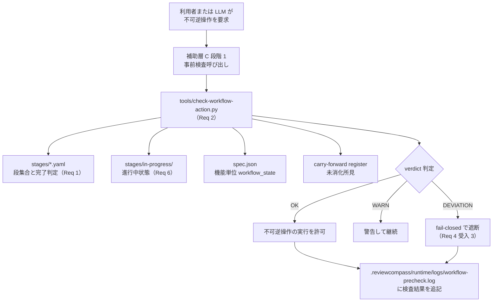

prompt_id: openai_review
provider: openai-api
model_id: gpt-5.4

# Task
Review the target document for the requested phase and criteria.

# Phase
tasks

# Criteria
# Tasks Triad Review Target

criteria_id: workflow_management_integrated_design_tasks_triad_review
phase: tasks
gate: stages/tasks.yaml#triad-review

## Review Purpose

Review whether `workflow-management` tasks drafting correctly and sufficiently reflects approved Requirement 13 through Requirement 16 from the integrated design follow-up.

## Target Files

- `.reviewcompass/specs/workflow-management/tasks.md`
- `.reviewcompass/specs/workflow-management/design.md`
- `.reviewcompass/specs/workflow-management/requirements.md`
- `.reviewcompass/specs/workflow-management/spec.json`
- `stages/in-progress/reopen-procedure-2026-06-19.yaml`
- `docs/notes/2026-06-18-integrated-design-selection-execution-layers.md`
- `docs/notes/working/2026-06-18-mechanized-workflow-execution-design.md`
- `docs/notes/working/2026-06-19-integrated-design-requirements-missing.md`
- `docs/notes/working/2026-06-19-proxy-model-triage-cost-issues.md`

## Required Checks

1. Check traceability from Requirement 13 to tasks for operation contract vocabulary, `required_action` mapping, `effect_kind`, `phase_boundary`, preconditions / postconditions, side effects, and commit boundary enforcement.
2. Check traceability from Requirement 14 to tasks for approval gate records, proxy_model / human decision boundary, side track stack push / pop / current behavior, return conditions, workflow-state snapshot, staged file set / digest checks, and drift detection.
3. Check traceability from Requirement 15 to tasks for structured effective prompt manifest, language task I/O schema, prompt audit, source digest coverage, machine task separation, `on_completion` constraints, and review-run recording.
4. Check traceability from Requirement 16 to tasks for Phase 0 through Phase 6 implementation plan, phase entry / exit criteria, forbidden operation checks, proxy_model triage decision mechanization, human-required decision boundary, and review-wave consumer impact blocking.
5. Check whether T-016 through T-019 have enough task-level implementation detail: owned files, prerequisites, completion conditions, and TDD-oriented test requirements.
6. Check whether the tasks document still has stale counts, stale completion criteria, missing traceability rows, or inconsistent references after adding T-016 through T-019.
7. Check whether the tasks contradict existing T-014 operation registry / preflight responsibilities or incorrectly move implementation behavior into a tasks drafting artifact.
8. Check whether `spec.json` and `stages/in-progress/reopen-procedure-2026-06-19.yaml` accurately reflect tasks drafting completion without prematurely marking tasks triad-review, review-wave, alignment, approval, implementation, commit, or push complete.

## Out Of Scope

- Do not request implementation changes in this tasks triad-review.
- Do not judge unrelated wording outside the Requirement 13 through 16 tasks expansion unless it creates a direct contradiction.
- Do not require edits to other features during this gate; cross-feature impact belongs to tasks review-wave.

## Finding Policy

- Report `must-fix` for missing task coverage for approved requirements, broken requirement traceability, stale state that falsely claims an uncompleted gate, contradictions that would make implementation unsafe, or task text that bypasses required commit / approval / review boundaries.
- Report `should-fix` for ambiguity that could cause repeated manual judgment, unclear task ownership, weak TDD completion criteria, or weak traceability to requirements / design.
- Return no findings when the tasks are traceable, internally consistent, and correctly scoped for a tasks drafting artifact.


# Output contract
Return YAML only.
The top-level key must be exactly findings.
Do not add wrapper keys such as review, result, metadata, or summary.
Do not wrap the YAML in Markdown code fences.
Do not write prose before or after the YAML.

Each finding must include these keys:
- severity
- target_location
- description
- rationale

Use only these severity values:
- CRITICAL
- ERROR
- WARN
- INFO

If there are no findings, return exactly:

findings: []

Valid shape example:

findings:
  - severity: WARN
    target_location: "path or section"
    description: "Plain finding summary"
    rationale: "Why this matters"

# Prior findings
なし

# Target path
.reviewcompass/specs/workflow-management/tasks.md
.reviewcompass/specs/workflow-management/design.md
.reviewcompass/specs/workflow-management/requirements.md
.reviewcompass/specs/workflow-management/spec.json
stages/in-progress/reopen-procedure-2026-06-19.yaml
docs/notes/2026-06-18-integrated-design-selection-execution-layers.md
docs/notes/working/2026-06-18-mechanized-workflow-execution-design.md
docs/notes/working/2026-06-19-integrated-design-requirements-missing.md
docs/notes/working/2026-06-19-proxy-model-triage-cost-issues.md

# Target document
## .reviewcompass/specs/workflow-management/tasks.md

---
spec: workflow-management
phase: tasks
stage: drafting
author:
  identity: claude-opus-4-7
  role: drafter
created_at: 2026-05-28
updated_at: 2026-06-19
language: ja
---

# Tasks Document：workflow-management

## 概要（Overview）

本文書は `workflow-management`（所定手続きの定義と機械強制を担う機能）の実装タスクを列挙する。本機能は、所定手続きの段集合定義、軽量版検査スクリプト、起草者と判定者の分離機械検査、不可逆操作の直前ゲート、reopen 機械強制、session 跨ぎ状態管理、多層防御の第 1 層位置付け、機能依存マップの一元化、既存システムへの後追い intent 追加時の下流再展開、operation contract 語彙、承認ゲート／side track stack／workflow-state snapshot、構造化有効プロンプト、proxy_model triage decision 機械処理化を担う。計画書 §5.4「軽量化方針」に従い、思想は継承、実装は 1／10 を目標として再設計する。

タスクは設計文書（design.md）の所有モデル単位でまとめ、各タスクは「起草・実装・テスト・コミット」まで一気通貫で完結できる粒度とする。タスクの依存順は design.md §全体構造（リポジトリ内配置の 3 層構造）と各 Requirement 対応モデル節に従う。

## タスク粒度と方針（Granularity and Policy）

- **粒度**：1 タスク ＝ 1 つの所有モデル領域。design.md の節と必ずしも 1 対 1 でなく、密接に関連する節は同じタスクにまとめる
- **一気通貫**：1 タスクは「起草・実装・テスト・コミット」まで止めず連続で進められる単位
- **依存順**：前提タスクが完了してから後続タスクに進む
- **自律進行**：実装段で per-task 承認は取らず、コミット・プッシュ・spec.json 更新・フェーズ移行のみ明示承認（規律 [[implementation-autonomy]] 準拠）
- **テスト要件**：成果物は静的検証（YAML スキーマ整合、述語値域、必須節充足、front-matter 異名）と動的検証（fail-closed の遮断、reopen 連鎖の actor=human 停止、後追い intent の下流再展開、drafting-before-review 防止）で機械的に判定可能とする
- **contract consumer 原則**：foundation が所有する語彙正本を再定義せず参照のみで使用。本機能が実際に参照するのは `review_mode`（レビューモード語彙、front-matter 検査 T-005 で使用）であり、所見系（`counter_status`／`severity`／`final_label`／`confidence_label`）・状態軸系（`run_status`／`validator_status`／`human_signoff_status`／`evidence_class`）は本機能の責務外で参照しない（A-003 対処 2026-05-28）。本機能所有の正本（`completion_predicate` 述語集合 7 値 ／ `verdict` 3 値 OK／WARN／DEVIATION ／ 手戻り種別記号 5 値 N／R／D／A／I ／ 依存種別 2 値 `hard`／`review`）は本機能で確定
- **fail-closed の徹底**：結論不能（YAML パースエラー、必須フィールド欠落、未知の値）の場合は合格判定を出さず必ず fail を返す（判断 3 全面採用）

`workflow-management` 全体で 19 タスク（T-012 は 2026-06-14 reopen R-0、T-013 は 2026-06-15 reopen R-0 decision-source-lint、T-014 は 2026-06-16 reopen R-0 operation registry / preflight、T-015 は 2026-06-18 reopen R-0 phase1-schema-definitions、T-016〜T-019 は 2026-06-19 reopen R-0 integrated design Requirement 13〜16 で追加）。2026-06-15 reopen R-0 commit-approval-nonce と 2026-06-16 reopen R-0 commit-execution-delegation-formal-cli は新タスクを増やさず、既存の commit 直前ゲート領域である T-004／T-006／T-011 へ展開する。

2026-06-16 reopen R-0 の design triad-review で利用者が選択した案A（commit 実行代行承認を別ファイル化する案）は、保存先と検証対象を分離する設計変更であり、所有領域は既存の commit gate 領域に収まる。したがって T-004 が CLI 入口、T-006 が runtime record と gate 判定、T-011 が統合・回帰テストを担う。

## タスク一覧（Task List）

### T-001：成果物配置の準備

- **対応設計節**：design.md §全体構造、§段集合の静的列挙モデル §1
- **対応要件**：Requirement 1 受入 1（段集合の静的列挙）、Requirement 6 受入 1（進行中状態ファイル配置）
- **責務**：リポジトリ内に `stages/` ディレクトリと配下の 9 ファイル骨格、`stages/in-progress/` と `stages/completed/` の 2 サブディレクトリ、検査スクリプト配置先 `tools/`、ログ書き出し先 `docs/logs/`、reopen 種別判定根拠ファイル配置先 `docs/reviews/`、種別判定根拠ファイル雛形配置先 `templates/review/` を新設し、各ディレクトリに配置目的を記す README を置く。`stages/in-progress/.gitkeep` と `stages/completed/.gitkeep` で空ディレクトリを Git 追跡可能にする（foundation T-001 ／ runtime T-001 ／ evaluation T-001 ／ analysis T-001 の方針継承）
- **前提タスク**：なし（起点）
- **成果物**：
  - `stages/README.md`
  - `stages/in-progress/.gitkeep`
  - `stages/in-progress/README.md`
  - `stages/completed/.gitkeep`
  - `stages/completed/README.md`
  - `docs/logs/README.md`（`workflow-precheck.log` の所在説明、初版は空ログ。ログの現行書き出し先は `.reviewcompass/runtime/logs/`、2026-06-12 配置規約 PLC-DEC-004〜005 反映。既存配置は凍結保全）
  - `docs/reviews/README.md`（`reopen-classification-<日付>.md` の所在説明）
  - `templates/review/reopen_classification_template.md`（reopen 種別判定根拠ファイルの雛形＝空の骨格を配置。内容の確定は T-007 が担い、本ファイルの成果物所有は T-001 単独、A-010 対処 案 2 2026-05-28）
  - `docs/operations/WORKFLOW_MANAGEMENT.md`（アプリ側規約節を追記、計画書 §5.4〜§5.8 由来）
  - `tools/README.md`（検査スクリプト配置先 `tools/` の説明、実体 `.py` は T-004 で配置。`tests/` との対称化、F-017 対処 2026-05-28）
  - `tests/workflow-management/.gitkeep`
- **完了条件**：
  1. `stages/` 配下のディレクトリ構造（直下 9 ファイル骨格 ＋ `in-progress/` ＋ `completed/`）と各 README が存在し、`docs/operations/WORKFLOW_MANAGEMENT.md` に配置規約が記述されている。`tools/` ディレクトリに README が存在し Git 追跡可能である（F-017 対処 2026-05-28）
  2. `templates/review/reopen_classification_template.md` が design.md §reopen 機械強制モデル §4 の最低限の構造（front-matter ＋分類根拠節）を満たす
  3. `tests/workflow-management/.gitkeep` が Git に追跡可能な状態である
- **テスト要件**：ディレクトリ存在検査、README 存在検査、`reopen_classification_template.md` 必須節検査、`.gitkeep` 存在検査

### T-002：機能依存マップ（feature-dependency.yaml）

- **対応設計節**：design.md §機能依存マップモデル §1〜§6、§主要な設計判断 判断 6
- **対応要件**：Requirement 8 受入 1〜5
- **責務**：`stages/feature-dependency.yaml` を作成、7 機能（foundation／runtime／evaluation／analysis／workflow-management／self-improvement／conformance-evaluation）の `features.<機能>.depends_on` と `feature_order`（機能間処理順。旧称 phase_order、requirements.md Requirement 8 受入 2 の由来注記参照）を一元保管。`depends_on` の 2 形式（単純リスト構造 ／ 連想配列構造）を許容し、`conformance-evaluation` のみ連想配列構造（`hard` ／ `review` 併記）。`feature_order` は 7 機能を依存マップ順で列挙。本機能が単独所有・他機能は再定義せず参照のみ、を運用文書に明示
- **前提タスク**：T-001
- **成果物**：
  - `stages/feature-dependency.yaml`（features ＋ feature_order）
  - パース仕様の正本：`tools/check-workflow-action.py` の解決・整合検査の実装（`resolve_feature_order`・`validate_feature_order_consistency`・`depends_on` 解釈）とそのテスト（単純リスト構造 ／ 連想配列構造の許容、値域 `hard` ／ `review` の 2 値、それ以外は結論不能）。独立した JSON Schema ファイルは作成しない（MLE-DEC-002、2026-06-12 利用者決定。当初計画の `stages/feature-dependency.schema.json` を実装検査で代替）
  - `docs/operations/WORKFLOW_MANAGEMENT.md` の §機能依存マップ節（所有者明示、改廃ルール）
- **完了条件**：
  1. `feature-dependency.yaml` の `features` に 7 機能すべてが列挙、`feature_order` が 7 機能を依存マップ順で列挙
  2. `conformance-evaluation` の `depends_on` が連想配列構造で `foundation: hard ／ runtime: review ／ evaluation: review ／ workflow-management: review` を保持
  3. `hard` ／ `review` 以外の値が結論不能になることが、検査ツールの実装とテストで機械検証される（MLE-DEC-002）
  4. 単純リスト構造と連想配列構造の両方が検査ツールでパース可能であることが機械検証される
- **テスト要件**：パース仕様の実装検査テスト、7 機能列挙テスト、依存マップ順テスト、連想配列構造の値域テスト（`hard` ／ `review` ／ 不正値 `weak` ／ 空文字 ／ null の 5 ケース）、依存循環検出テスト

### T-003：段集合 YAML 8 ファイル（9 ファイル体制のうち feature-dependency.yaml を除く）

- **対応設計節**：design.md §段集合の静的列挙モデル §1〜§4、§テンプレート変数の展開規則
- **対応要件**：Requirement 1 受入 1〜5、Requirement 5 受入 1〜5（reopen-procedure.yaml の構造）
- **責務**：`stages/` 配下に 8 ファイル（`intent.yaml` ／ `feature-partitioning.yaml` ／ `requirements.yaml` ／ `design.yaml` ／ `tasks.yaml` ／ `implementation.yaml` ／ `reopen-procedure.yaml` ／ `cross-spec-alignment.yaml`）を作成。各 YAML は段集合（段名・`actor`・`artifact_paths`・`required_sections`・`completion_predicate`）を静的列挙、機能横断段は `feature_order: feature-dependency.yaml#feature_order` を参照。テンプレート変数（`{feature}` ／ `{phase}` ／ `{日付}`）の展開規則は設計書 §テンプレート変数の展開規則に従う。`reopen-procedure.yaml` に `trigger_map` を持たせ（第3過程で参照）、種別記号 N／R／D／A／I × 深さの二次元表記から再実施対象を機械的に決定。`cross-spec-alignment.yaml` は段集合本体を後続フェーズで確定する旨を YAML コメントに明記、枠のみ確保
- **前提タスク**：T-001、T-002（`feature_order` 参照先）
- **成果物**：
  - `stages/intent.yaml`（drafting／review／approval の 3 段、actor=human／llm／human）
  - `stages/feature-partitioning.yaml`（candidate-proposal／approval の 2 段、actor=llm／human）
  - `stages/requirements.yaml`（drafting／triad-review／review-wave／alignment／approval の 5 段、機能横断段 3 段は `feature_order` 参照）
  - `stages/design.yaml`（同 5 段）
  - `stages/tasks.yaml`（同 5 段）
  - `stages/implementation.yaml`（同 5 段）
  - `stages/reopen-procedure.yaml`（4 過程構成、`trigger_map` ＋ `actor_resolution: per_target_stage` を第3過程で参照）
  - `stages/cross-spec-alignment.yaml`（枠のみ、段集合は後続フェーズで確定）
  - `stages/stage_schema.json`（段集合 YAML 共通スキーマ：段名・actor・artifact_paths・required_sections・completion_predicate・feature_order・front_matter_required）
- **完了条件**：
  1. 8 ファイルすべてが配置、各 YAML が `stage_schema.json` で構造検証を通る。`stage_schema.json` は `completion_predicate` を 7 値（design §軽量版検査スクリプトモデル §3 確定）に、`actor` を 3 値（`human` ／ `llm` ／ `proxy_model`、design §段集合 §1／§3 確定）に enum で値域制限し、いずれも未知の値が DEVIATION（fail-closed）になることが機械検証される（F-015／A-004 対処 2026-05-28）
  2. 機能横断段（review-wave／alignment／approval）が `feature_order: feature-dependency.yaml#feature_order` を参照、機能単位段（drafting／triad-review）は `feature_order` を持たない
  3. `reopen-procedure.yaml` の `trigger_map` が手戻り種別 N-0 ／ R-0〜1 ／ D-0〜2 ／ A-0〜3 ／ I-0〜4 の全 15 種について再実施対象段リストを保持
  4. `trigger_map` 各エントリの参照先段（`<YAML ファイル>#<段名>` 形式）が、`actor_resolution: per_target_stage` により段定義から動的解決可能であることが機械検証される
  5. テンプレート変数 `{feature}` ／ `{phase}` ／ `{日付}` の展開元と解決規則が `stage_schema.json` の構造化フィールド（各変数の展開元を列挙する `template_vars` 等）に格納され、フィールドの存在が機械検証される（自由記述コメントの grep ではなく構造化、F-010 対処 案 2 2026-05-28）
- **テスト要件**：8 ファイルすべての構造検証、`feature_order` 参照解決テスト、`trigger_map` 全 15 種テスト、テンプレート変数展開テスト（3 種それぞれ）、`cross-spec-alignment.yaml` の枠のみ確保テスト、`completion_predicate` 値域 7 値テスト（7 値 OK ＋ 未知値 DEVIATION）、`actor` 値域 3 値テスト（human ／ llm ／ proxy_model OK ＋ 未知値 DEVIATION、F-015／A-004 対処 2026-05-28）

### T-004：軽量版検査スクリプト本体（補助層 C 段階 2）

- **対応設計節**：design.md §軽量版検査スクリプトモデル §1〜§4、§主要な設計判断 判断 2 ／ 判断 3 ／ 判断 8
- **対応要件**：Requirement 2 受入 1〜5、Requirement 4 受入 2 ／ 3 ／ 6 ／ 7 ／ 8（fail-closed、独立走行、commit approval nonce challenge、LLM 非依存判定、commit execution delegation formal CLI）、Requirement 8 受入 6〜8（feature 一覧解決・整合検査・立ち上げ案内）、Requirement 9 受入 2 ／ 5（drafting-before-review と下流再展開判定）
- **責務**：`tools/check-workflow-action.py` を Python で実装。3 サブコマンド（`spec-set <feature> <phase> <stage> <new_value> [--rationale "..."]` ／ `commit --rationale "..."` ／ `push --rationale "..."`）と next サブコマンド、`--json` 出力オプションを提供。next サブコマンドは標準のワークフロー遷移入口として `workflow_state`、`stages/in-progress/`、reopen pending、post-write-verification pending、上流成果物が下流成果物より新しい状態を読み、次作業を返す。完了済み workflow でも、intent → feature-partitioning、feature-partitioning → requirements、requirements → design、design → tasks、tasks → implementation の順で上流更新後の再展開漏れを `upstream_recheck` として返す。`docs/operations/WORKFLOW_DISCIPLINE_MAP.yaml` を読み、判定点ごとの `required_disciplines` と `required_inputs` を `next_action` に含める。このマップは判定点ごとの `effective prompt` 生成に使う元資料の正本である。`next` は判定点ごとの元資料を 1 本の prompt に束ね、`.reviewcompass/runtime/effective-prompts/` に保存し（旧 `.reviewcompass/effective-prompts/` からの変更は 2026-06-12 配置規約 PLC-DEC-004・009〜011 反映、旧パス読み取り互換は P3 まで維持）、`next_action.effective_prompt` の `effective_prompt_path`、`effective_prompt_sha256`、`effective_prompt_loaded` として返す。元資料を読めない場合は `effective_prompt_loaded: false` とし、`DEVIATION` で fail-closed する。`tools/api_providers/run_role.py` と `tools/api_providers/run_review.py` は review-run の `rounds.yaml` に `effective_prompt_path` と `effective_prompt_sha256` を記録する。後追い intent を既存システムへ適用する reopen では、pending_gates が triad-review を指していても、対応 phase の `drafting_completed_gates` または `completed_gates` に `stages/<phase>.yaml#drafting` がなければ、next は triad-review ではなく `run_reopen_drafting` を返す。verdict 3 値（OK／WARN／DEVIATION）と exit code（0 ／ 1 ／ 2）の対応。`completion_predicate` 述語集合 7 値（`artifact_exists` ／ `artifact_exists_and_sections_present` ／ `artifact_exists_and_sections_present_and_author_reviewer_distinct` ／ `all_features_drafting_and_triad_review_completed` ／ `cross_spec_alignment_passed` ／ `explicit_human_approval_recorded` ／ `depends_on_resolves_correctly`）の判定ロジックを符号化。post-write target detection と manifest verification を実装契約として扱い、completed manifest の `target_files`、`target_sha256`、`required_verifiers`、`verifications[]`、`unresolved_substantive_findings` を検査する。feature 一覧と機能順は `feature-dependency.yaml` の `feature_order` キーから解決する（ツール実行時のカレントディレクトリ基準で `.reviewcompass/feature-dependency.yaml` → `stages/feature-dependency.yaml` → `feature-dependency.yaml` の順、最初に存在した 1 ファイルのみ、遡上探索なし。`resolve_feature_order`。design §機能依存マップモデル §7、2026-06-12 反映）。ファイル不在・`feature_order` 未定義は `next_action.kind: feature_definition_required`（verdict OK、exit 0）で intent／feature-partitioning の実施を案内し、探索で選ばれた 1 ファイルが読めない場合（パース不能・空・最上位が連想配列でない場合を含む。値の整合検査より先に判定）と `feature_order` と `depends_on` の整合違反（依存先行違反・循環、`validate_feature_order_consistency`）は `next_action.kind: unknown`・`reasons` 列挙・DEVIATION（exit 2）で遮断する（パース不能は破損ファイルのパスと内容確認を促す理由、空の場合は `feature_order` の記録を促す理由を含める）。fail-closed の既定（YAML パースエラー（段集合・feature-dependency とも） ／ 証跡欠落 ／ 必須フィールド欠落 ／ `feature_order` 整合違反で遮断。feature-dependency.yaml の不在・未定義のみ立ち上げ案内として OK）を全面採用（パース不能の遮断分離は MLE-DEC-005 により本契約へ反映、FUP-2026-06-12-001 解消、2026-06-12）。`.reviewcompass/runtime/logs/workflow-precheck.log` への追記（旧 `docs/logs/workflow-precheck.log` からの変更は同配置規約反映。commit 承認記録も同様に `.reviewcompass/runtime/approvals/commit-approval.json` へ〔旧 `.reviewcompass/approvals/commit-approval.json`〕）、出力形式は `[VERDICT]` ／ `[ACTION]` ／ `[REASON]` ／ `[CURRENT STATE]` の 4 ブロック大括弧付きラベル形式。**凍結期（P3 まで）の責務（2026-06-12 配置規約反映、正本は design §実行時生成物の凍結期（P3 まで）の扱い）**：実行時生成物 3 パス（検査ログ・effective prompt・commit 承認記録）の書き込みは常に新配置とし、旧配置（`docs/logs/workflow-precheck.log`・`.reviewcompass/effective-prompts/`・`.reviewcompass/approvals/commit-approval.json`）への新規書き込みを行わない（凍結契約。効力発生は P1 実装反映コミット＝書き込み先切替と同時。互換の終了は P3 の専用 reopen における設計改訂として扱い、暗黙の終了はない）。読み取りは新配置優先・旧配置フォールバック（**新→旧の順**、3 パスとも P3 まで）。新旧いずれにも記録がない場合は各ツールの既存挙動（検査ログの初回新規作成、effective prompt 元資料欠落の DEVIATION fail-closed、commit 承認記録不在のガード遮断）に従い、本配置変更はそれらの挙動を変えない
- **next unique action selector 補足責務**：`next --json` は状態投影ではなく唯一 action selector として `required_action`、`active_gate`、`blocked_by`、`action_parameters` を返す。maintenance は `required_action=run_maintenance` に固定し、個別 action 名は `maintenance_action` へ分離する。reopen では `current_blocker` を `wait_for_human_decision`、`commit_stop_point: true` を `commit_stop_point` として pending gate より優先し、第3過程で停止点がない場合だけ `run_reopen_drafting` / `run_reopen_pending_gate` を active gate とする。
- **commit 承認 nonce 補足責務**：`tools/check-workflow-action.py` に `commit-approval prepare --json`、`commit-approval record --nonce <nonce> --source-text-stdin --json`、`commit-approval record --nonce <nonce> --no-source-text --json`、`commit-approval invalidate --json` を追加する。承認本文を argv で受け取る経路は提供しない。`--json` 指定時の正常系出力は機械可読 JSON に限定し、happy path で自由文を混在させない。これらのサブコマンドは T-006 の `commit_approval.py` を呼び、challenge／承認レコードの生成・検証・invalidate・consume を行う。承認本文を保存する場合は `tools.session_record_extractor.redact.redact_text` と `find_residual_secrets` を通し、保存不能時は T-006 の `source_omission_reason` enum に従う。
- **commit 実行代行承認補足責務**：`tools/check-workflow-action.py` に `commit-approval delegate-execution --nonce <nonce> --source-text-stdin --json` を追加する。承認文を argv で受け取る経路は提供しない。`--json` 指定時の正常系出力は機械可読 JSON に限定し、happy path で自由文を混在させない。このサブコマンドは T-006 の `commit_approval.py` を呼び、同じ nonce の challenge と staged 内容承認 record が有効で、現在の index と target digest が一致する場合だけ `.reviewcompass/runtime/approvals/commit-execution-delegation.json` を作成する。承認文は UTF-8 stdin、末尾 POSIX LF 1 個のみ許容、CR／CRLF／内部改行／NUL／空白のみ／256 bytes 超過を fail-closed とし、許可文言の完全一致を T-006 の正規化規則に委譲する。
- **配布可能 commit UX 補足責務**：`tools/guarded-git-commit.py` に `--approval-nonce <nonce>` と `--approval-source-text-line-stdin` を追加する。この wrapper は stdin から承認文を 1 行だけ読み、EOF を待たずに staged 内容承認 record と commit 実行代行 delegation record を順序作成してから commit 直前ゲートを実行する。低レベル `record`／`delegate-execution` はデバッグ・検査用に残すが、第三者向け通常手順には露出させない。`commit-approval prepare` は古い壊れた runtime approval / delegation record を invalidated へ寄せ、新しい challenge 準備の邪魔にしない。commit 直前ゲート通過後、`git commit` 呼び出し直前に `index.lock` の排他作成可否を preflight し、permission / sandbox 系の作成失敗を `sandbox_git_write_denied`、`required_action=rerun_commit_with_escalation` として表示して停止する。この停止では `git commit` を呼ばず、approval / challenge / delegation を consumed または invalidated にしない。`git commit` 実行後に `.git/index.lock` / permission 系エラーが返った場合も同じ分類表示を行い、承認保持・staged 内容不変なら再承認不要・sandbox 外 guarded commit 再実行が必要、の 3 点に絞って利用者へ示す。
- **前提タスク**：T-001、T-002、T-003
- **成果物**：
  - `tools/check-workflow-action.py`（argparse 定義 ＋ 3 サブコマンド ＋ `--json` ＋ ログ追記）
  - `tools/check_workflow_action/predicates.py`（`completion_predicate` 述語集合 7 値の判定ロジック）
  - `tools/check_workflow_action/yaml_loader.py`（YAML 読み込み ＋ パースエラー fail-closed）
  - `tools/check_workflow_action/output_formatter.py`（4 ブロック大括弧付きラベル形式 ／ JSON 形式）
  - `docs/operations/WORKFLOW_DISCIPLINE_MAP.yaml`（判定点ごとの `required_disciplines`、`required_inputs`、effective prompt 元資料マップ）
  - `docs/operations/WORKFLOW_PRECHECK.md`（ワークフロー事前検査の運用契約）
  - `docs/operations/WORKFLOW_PRECHECK_DETAILS.md`（サブコマンド引数 ／ 出力形式 ／ ログの詳細仕様）
- **完了条件**：
  1. 3 サブコマンドと `next` サブコマンドが exit code 0 ／ 1 ／ 2 を正しく返す
  2. 述語 7 値すべてが正常系で OK、異常系（証跡欠落 ／ 必須節欠落 ／ 異名不成立 等）で DEVIATION を返す
  3. YAML パースエラー時に DEVIATION（exit 2）を返す（fail-closed）
  4. `--rationale` が `commit` ／ `push` で必須引数として強制される（省略時はエラー）。`spec-set` の `--rationale`（任意）を省略した場合もログ記録が正しく行われる（F-013 対処 2026-05-28）
  5. ログ追記が `.reviewcompass/runtime/logs/workflow-precheck.log` に発生し、4 ブロックラベル形式と JSON 形式の両方が正しく出力される。実行時生成物 3 パス（検査ログ・effective prompt・commit 承認記録）それぞれについて、(1) 新配置への書き込み、(2) 旧配置への新規書き込みが発生しないこと、(3) 旧パスにしか記録がない場合の新→旧フォールバック読み取り、(4) 新旧両方に記録がある競合時に新配置が採用されること（design 契約「新→旧の順」の直接検証）、(5) 凍結済み旧成果物の不変性（P1 実装反映コミット以降に旧既存ファイルが変更・削除されていないこと）、の凍結期挙動が機械検証される（2026-06-12 配置規約反映、観点 4・5 は triad-review round-3 所見の適用）
  6. `explicit_human_approval_recorded` 述語は `actor=proxy_model` の場合 `reviewcompass.yaml#human_proxy.proxy_allowed` を参照して代行可否を機械判定する（条件を満たさなければ DEVIATION）。`depends_on_resolves_correctly` 述語は値域チェック（依存先の解決可能性）のみを担い、依存先の変更検知と recheck 更新発火は別機構（フェーズ 2 宿題、DVT-W007）であることを境界テストで明示する（A-004／A-006 対処 2026-05-28）
  7. review-run の proxy_model 判断代行ゲートは、`approval-proxy-<日付>.yaml`、`proxy-decisions/<finding-id>.decision.yaml`、decision prompt、元 review raw、raw response、候補案、採用案、判断理由、最終ラベルを検査し、欠落または triage との不一致があれば DEVIATION にする。proxy_model 代行は実装方針判断に限定し、コミット・プッシュ・spec.json 更新・フェーズ移行には使わない
  8. post-write-verification pending の検出、completed manifest の sha 一致、verifier ごとの全対象 coverage、未解決本質的指摘 0 件が機械検証される
  9. triad-review が pending でも drafting が未完了なら、next が `run_reopen_drafting` を返し、review を先に実施しない
  10. `WORKFLOW_DISCIPLINE_MAP.yaml` から判定点ごとの `required_disciplines` と `required_inputs` を返せる
  11. `next` は `effective_prompt_path`、`effective_prompt_sha256`、`effective_prompt_loaded` を返し、元資料欠落時は `DEVIATION` で fail-closed する
  12. review-run は `rounds.yaml` に `effective_prompt_path` と `effective_prompt_sha256` を記録できる
- **テスト要件**：3 サブコマンド × 各 verdict 3 値 = 9 ケース、`next` サブコマンドの通常 workflow／reopen pending／post-write-verification pending／upstream_recheck ケース、述語 7 値の正常系 ／ 異常系テスト、YAML パースエラーの fail-closed テスト、`--rationale` 必須化テスト（commit／push）＋ `spec-set` 省略時ログ記録テスト（F-013）、ログ追記テスト、4 ブロックラベル形式 ／ JSON 出力テスト、`explicit_human_approval_recorded` の proxy_model 代行可否テスト（proxy_allowed 満たす／満たさないの 2 ケース、A-004）、`depends_on_resolves_correctly` の境界テスト（値域チェックのみで変更検知しないことの確認、A-006）、post-write target detection と manifest verification の正常系／sha 不一致／coverage 不足／未解決本質的指摘ありテスト、proxy_model 判断代行ゲートの正常系／raw 欠落／候補案欠落／採用案欠落／判断理由欠落／triage 不一致の fail-closed テスト、intent 更新後に feature-partitioning 確認を返すテスト、requirements 更新後に design 再確認を返すテスト、tasks 更新後に implementation 再確認を返すテスト、triad-review pending かつ drafting 未完了なら `run_reopen_drafting` を返すテスト、reopen `commit_stop_point: true` が pending gate より優先されるテスト、reopen blocker が `wait_for_human_decision` と `blocked_by` を返すテスト、maintenance が `required_action=run_maintenance` と `maintenance_action` を分離するテスト、active gate がある時だけ `active_gate` / `phase` / `stage` が非 null になるテスト、`WORKFLOW_DISCIPLINE_MAP.yaml` の `required_disciplines`／`required_inputs` 反映テスト、`effective_prompt_path`／`effective_prompt_sha256`／`effective_prompt_loaded` の JSON 出力テスト、effective prompt 元資料欠落時の fail-closed テスト、`rounds.yaml` への effective prompt 記録テスト、**凍結期挙動テスト（実行時生成物 3 パス × 5 観点＝計 15 観点：新配置への書き込み／旧配置への新規書き込みが発生しないこと／旧パスにしか記録がない場合の新→旧フォールバック読み取り／新旧両方に記録がある競合時に新配置が採用されること〔新旧に異なる内容を置き、新配置の内容が採用されることを 3 パスそれぞれで検証。design 契約「新→旧の順」の直接検証〕／凍結済み旧成果物の不変性〔P1 実装反映コミット以降に旧 3 パスの既存ファイルが変更・削除されていないことを git 追跡履歴で検出。conformance-evaluation の凍結違反検出と同一判定規則〕。境界条件として、観点 2 が凍結の効力発生時点〔P1 実装反映コミット以後の旧書き込み不在〕の検証を兼ねること、観点 3 のフォールバックが設定・条件分岐等で暗黙に無効化されないことを検証対象に含める。2026-06-12 配置規約反映、観点 4・5 は triad-review round-3 所見の適用、TDD 先行）**、feature_order 外出し・探索順・立ち上げ案内（feature_definition_required）・整合検査・対象アプリ独自 feature 構成での next 動作テスト（2026-06-12 反映、cde1f5c で実装済み）、feature-dependency.yaml パース不能・空・非連想配列の遮断テスト（`next_action.kind: unknown`・verdict DEVIATION・exit 2 を検証し、`reasons` に対象ファイルパスと、パース不能・非連想配列では内容確認を促す文言、空では `feature_order` の記録を促す文言が含まれることを検証）と、不在・未定義の案内維持テスト（`next_action.kind: feature_definition_required`・verdict OK・exit 0 を検証）（MLE-DEC-005、仕様確定後に TDD で実装。検証粒度の明記は triad-review 同根所見対処）

### T-005：起草者と判定者の分離 機械検査

- **対応設計節**：design.md §起草者と判定者の分離モデル §1〜§3
- **対応要件**：Requirement 3 受入 1〜4
- **責務**：レビュー記録の front-matter 検査機能を `tools/check_workflow_action/front_matter_checker.py` として実装、`completion_predicate=artifact_exists_and_sections_present_and_author_reviewer_distinct` から呼び出される。判定 3 点：(1) `author.identity` ／ `reviewer.identity` フィールドの存在、(2) `author.identity` ≠ `reviewer.identity`（文字列比較）、(3) `reviewer.separation_from_author=true`。`mode: subagent_mediated` の場合の `role` フィールド複合役（`drafter_and_primary_reviewer` 等）を許容する暫定特例を符号化。別モデル ／ 別 session の機械判定は範囲外（第 3 層利用者監査に委ねる、Req 3 受入 4）であることを運用文書に明示
- **前提タスク**：T-004
- **成果物**：
  - `tools/check_workflow_action/front_matter_checker.py`（3 点判定ロジック）
  - `tools/check_workflow_action/front_matter_schema.json`（必須フィールド：type ／ target ／ target_commit ／ target_content_hash ／ date ／ mode ／ author ／ reviewer、author/reviewer の必須サブフィールド：identity ／ model ／ role、reviewer.separation_from_author=true 必須）
  - `docs/operations/WORKFLOW_PRECHECK_DETAILS.md`（関連する判定詳細を必要に応じて更新）
- **完了条件**：
  1. 3 点判定が機械検証で確実に発火する（異名のみ／同名／separation_from_author=false の 3 ケース）
  2. `subagent_mediated` の複合役（`drafter_and_primary_reviewer`）が許容される
  3. 既存レビュー記録 7 件以上（各機能の requirements ／ design ／ tasks）への本検査の遡及適用は、grandfathering（遡及検査の免除）判断（DVT-W002、利用者承認事項）が確定するまで検査対象から除外する（未確定のまま走らせて既存記録が DEVIATION を返し本機能のゲートが自己ロックするのを回避）。本完了条件としては「DVT-W002 のエントリが DVT 表に存在すること」を grep で機械検証する（実装作業と人手判断を分離、F-009／A-007 対処 2026-05-28）
- **テスト要件**：3 点判定テスト（異名 ／ 同名 ／ separation_from_author=false の 3 ケース）、`mode` の各値（foundation 正本が定める）の複合役許容テスト（複合役の許容は `subagent_mediated` 特例のみ、他の値は不許容）、必須フィールド欠落テスト、fail-closed テスト

### T-006：不可逆操作の直前ゲート機構

- **対応設計節**：design.md §不可逆操作の直前ゲートモデル §1〜§4、§主要な設計判断 判断 4
- **対応要件**：Requirement 4 受入 1〜8
- **責務**：4 種類の不可逆操作（`spec.json` の `approval` 段書き込み ／ `git commit` ／ `git push` ／ フェーズ移行）の直前ゲート判定ロジックを `tools/check_workflow_action/gate_predicates.py` として実装、T-004 のサブコマンドから呼ばれる。ゲート発火条件：(1) Requirement 2 検査スクリプトが pass を返す、(2) `stages/in-progress/` が空。毎回独立走行（session 開始時のキャッシュを使わない、状態変化を直前で再検出）。fail-closed の既定（検査結論不能で必ず遮断）。`git commit` では commit 承認 challenge と承認レコードを読み、nonce 一致、UTC ISO-8601 の `created_at`／`expires_at`、TTL 10 分、`now_utc` 注入可能な時刻判定、clock rollback fail-closed、未期限切れ、未消費、staged ファイル集合一致、staged 内容一致、approval と challenge の全体 target digest 一致、実際に commit される exact index との一致を検査する。承認レコード単体の `target_sha256` 検査は互換入力として維持するが、nonce challenge がある場合は challenge と承認レコードの両方を必須とする。canonical target digest は `commit-approval-v1` の固定形式で計算し、path 順非依存、削除 staged、git index mode、staged object id を覆う。challenge／承認レコードが JSON として読めない、object でない、必須フィールド欠落、型不正、path 重複、不正 path、未知 path、file set 不一致などの場合は、部分推測せず fail-closed とする。schema に `llm`、`provider`、`model`、`model_id`、`proxy_model_id` を受け入れず、承認レコードは `attestation_type=staged_content_nonce_binding` と `guarantee_scope=staged_content_binding_not_ui_utterance_proof` を必須とする。承認本文は stdin または no-store mode のみで扱い、保存する場合は `tools.session_record_extractor.redact.redact_text` と `find_residual_secrets` を通す。`source_omission_reason` は `source_not_provided`、`unsafe_source_omitted`、`redaction_failed`、`residual_secret_detected` の 4 値に限定する。`--execution-actor llm` の commit gate では、challenge と staged 内容承認 record に加えて `.reviewcompass/runtime/approvals/commit-execution-delegation.json` を必須とし、strict schema、`approved_action=commit_execution_delegation`、`delegated_action=commit`、`delegated_to=llm`、`approved_by=user`、nonce／target digest／staged file set digest／staged 内容承認 digest／expiry 一致、未期限切れ、未消費、未 invalidated、禁止 LLM/provider/model 系 field 不在、許可文言完全一致、`attestation_type=commit_execution_delegation_nonce_binding`、`guarantee_scope=stdin_text_instruction_bound_to_commit_approval_not_ui_utterance_proof` を検査する。`--execution-actor human` では execution delegation を不要とする。delegation record の作成は保存直前再検証と atomic write を必須にし、既存未期限切れ delegation、形式不正、unknown field、外部変更、保存直前の期限切れは fail-closed とする。`commit-approval invalidate --json` は challenge／staged 内容承認 record／delegation record を一括 invalidated にする。validation failure は security failure として challenge／承認レコード／delegation record を invalidated にし、commit 成功後は consumed にする。consume 永続化失敗後は later gate で再利用を拒否する。通常の git execution failure は index と approval 状態が validation 時と同一の場合だけ再試行可能とする。フェーズ移行検査は `feature-dependency.yaml#feature_order` の全機能で approval=true を要求。最小集合方針の徹底（中間段の遷移には機械ゲートを置かない）
- **前提タスク**：T-002、T-003、T-004
- **成果物**：
  - `tools/check_workflow_action/gate_predicates.py`（4 種類のゲート判定）
  - `tools/check_workflow_action/commit_approval.py`（nonce challenge、承認レコード、canonical digest、redaction、validation、invalidate／consume）
  - `tools/check_workflow_action/state_resolver.py`（spec.json ／ in-progress ／ pending 所見の状態解決、毎回独立走行）
- **完了条件**：
  1. 4 種類のゲートそれぞれが正常系で OK、異常系（前段未完了 ／ in-progress あり ／ 未消化所見あり ／ 全機能 approval 未完了）で DEVIATION を返す
  2. session 開始時のキャッシュを使わず、毎回 spec.json と `stages/in-progress/` を読み直すことが機械検証される
  3. 最小集合方針（中間段の遷移には機械ゲートが発火しない）が機械検証される
  4. commit 承認レコードの `target_sha256` 欠落、形式不正、staged 内容との不一致が DEVIATION になる
  5. nonce challenge の prepare／record／invalidate／commit validation／consume が機械検証され、欠落・形式不正・期限切れ・消費済み・staged 内容不一致・approval/challenge target digest 不一致・exact index 不一致・clock rollback が DEVIATION になる
  6. 承認 schema に `llm`、`provider`、`model`、`model_id`、`proxy_model_id` が混入した場合は形式不正で DEVIATION になる
  7. `attestation_type=staged_content_nonce_binding`、`guarantee_scope=staged_content_binding_not_ui_utterance_proof` が機械検証される
  8. 承認本文の stdin 入力、no-store mode、4096 bytes 上限、redaction 失敗時の source omission が機械検証される
  9. LLM commit 実行代行承認は staged 内容承認と別 record として `.reviewcompass/runtime/approvals/commit-execution-delegation.json` に保存され、`commit-approval.json` は staged 内容承認のみを保持することが機械検証される
  10. delegation record の全必須 field（`approved_action`、`delegated_action`、`delegated_to`、`approved_by`、`nonce`、`target_digest`、`staged_file_set_digest`、`staged_content_approval_digest`、`challenge_path`、`approval_record_path`、`created_at`、`expires_at`、`explicit_instruction`、`instruction_sha256`、`attestation_type`、`guarantee_scope`、`consumed`、`invalidated`）の生成・検証・欠落時 fail-closed が機械検証される
  11. delegation record の strict schema、禁止 LLM/provider/model 系 field、staged 内容 binding、stdin 正規化、許可文言完全一致、secret redaction、保存直前再検証、atomic write、invalidate／consume／再利用拒否が機械検証される
  12. `--execution-actor llm` では challenge／staged 内容承認 record／delegation record／現在 index を commit gate 直前に再検証し、`--execution-actor human` では delegation を不要とすることが機械検証される
  13. precheck OK 後に `git commit` 本体が commit 未作成のまま失敗した場合、approval／challenge／delegation を consumed または invalidated にせず、同じ staged exact index と nonce の wrapper 再実行で既存 active transaction を再利用できることが機械検証される
  14. `guarded-git-commit.py` が `git commit` 呼び出し直前に `index.lock` 作成可否を preflight し、permission / sandbox 系の作成失敗では `git commit` を呼ばず、approval／challenge／delegation を consumed または invalidated にせず、`sandbox_git_write_denied` と `required_action=rerun_commit_with_escalation` を表示することが機械検証される
  15. `git commit` 実行後に `.git/index.lock` / permission 系エラーが返った場合も、approval／challenge／delegation を consumed または invalidated にせず、同じ `sandbox_git_write_denied` 分類表示を行うことが機械検証される
- **テスト要件**：4 種類ゲート × 正常系 ／ 異常系 = 8 ケース、独立走行テスト（同 session 内で状態変化させて再検査が異なる結果を返す）、最小集合テスト（drafting ／ triad-review の遷移ではゲート発火しない）、commit 承認レコードの `target_sha256` 正常系／欠落／不一致テスト、nonce challenge 正常系（prepare→record→commit validation→consume）、期限切れ、UTC ISO-8601 不正、TTL 10 分以外、`now_utc` 注入、clock rollback、未消費 challenge あり prepare、明示 invalidate、canonical digest `commit-approval-v1`、canonical digest のパス順非依存、削除 staged、approval/challenge target digest 不一致、exact index 不一致、malformed challenge／approval record の no partial inference、schema 禁止フィールド混入、`attestation_type`／`guarantee_scope` 欠落・不正、stdin source text、no-store mode、UTF-8 不正、4096 bytes 超過、`source_not_provided`、`unsafe_source_omitted`、`redaction_failed`、`residual_secret_detected` の 4 値、`redact_text` 呼び出し、`find_residual_secrets` 呼び出し、residual secret 検出、validation failure 後の再利用拒否、consume 永続化失敗後の再利用拒否、git execution failure 後の条件付き retry、`commit-approval * --json` の parseable JSON 出力テスト、`delegate-execution` 正常系（prepare→record→delegate-execution→commit validation→consume）、staged 内容承認前の delegation 拒否、既存未期限切れ delegation 拒否、delegation record の全必須 field の生成／欠落／型不正、delegation の nonce／target digest／staged file set digest／staged 内容承認 digest／challenge path／approval record path／expiry／instruction hash 不一致、malformed delegation record、unknown field、禁止 LLM/provider/model 系 field、`attestation_type=commit_execution_delegation_nonce_binding`、`guarantee_scope=stdin_text_instruction_bound_to_commit_approval_not_ui_utterance_proof`、両 field の欠落・不正、末尾 POSIX LF 1 個だけ許容、CR／CRLF／内部改行／2 個以上の末尾 LF／NUL／空／空白のみ／256 bytes 超過／全角 Latin 拒否、ASCII 英字のみ小文字化、末尾日本語句点 1 個だけ除去、許可文言 `コミット`／`コミットして`／`コミットを実行`／`承認`／`commit`／`commitして` の完全一致、secret redaction failure／residual secret 検出時の delegation 作成拒否、保存直前再検証、atomic write 失敗、保存直前 expiry race、`--execution-actor llm` で challenge／staged 内容承認 record／delegation record／現在 index の全再検証と delegation 必須、`--execution-actor human` で delegation 不要、invalidate が challenge／staged 内容承認 record／delegation record を一括 invalidated にすること、`guarded-git-commit.py --approval-nonce --approval-source-text-line-stdin` が承認 1 行で record／delegate-execution／commit／consume まで完了すること、同 wrapper が precheck OK 後の git execution failure で commit 未作成の場合に record を消費・無効化せず、同一 nonce 再実行で既存 approval／delegation を再利用すること、`index.lock` preflight 失敗時に commit を呼ばず承認を保持して `sandbox_git_write_denied` / `required_action=rerun_commit_with_escalation` を表示すること、`git commit` 実行後の `.git/index.lock` / permission 系失敗も同じ分類で表示し承認を保持すること、壊れた古い delegation が `prepare` 後の新規承認フローを妨げないこと

### T-007：reopen 機械強制

- **対応設計節**：design.md §reopen 機械強制モデル §1〜§4、§主要な設計判断 判断 5
- **対応要件**：Requirement 5 受入 1〜5、Requirement 9 受入 1〜4
- **責務**：reopen 手続きの 4 過程構成を T-003 の `stages/reopen-procedure.yaml` で静的列挙、第3過程の `trigger_map` 解決ロジックを `tools/check_workflow_action/reopen_resolver.py` として実装。手戻り種別の二次元表記（N／R／D／A／I × 深さ）から再実施対象段リストを取得、各段の `actor` を当該段定義から動的解決（`actor_resolution: per_target_stage`）。`actor=human` 段に到達した時点で作業を停止し、`stages/in-progress/reopen-procedure-<日付>.yaml` に「人間承認待ち」を記録して待機。種別判定根拠ファイル（`docs/reviews/reopen-classification-<日付>.md`）の保存・読み込み機構を実装。後追い intent の downstream impact では、conformance-evaluation から受け取った候補を直接の実行命令にせず、既存 feature の受け皿ありなら `reopen_existing_feature`、受け皿なしなら `new_feature_required`、根拠不足なら `human_decision_required` として分類する。CE から渡される `downstream_impact_candidate` や `implementation_change_candidate` が tasks phase を指す場合も、候補 ID、対象 feature、対象 phase、根拠参照を読み、T-007 が受け皿判定を行って `pending_gates` に反映する。`reopen_existing_feature` は既存 feature の該当 phase を reopen し、`new_feature_required` は feature-partitioning へ戻し、`human_decision_required` は blocker として停止する。fail-closed の既定（人間承認なしに次段への進行を許さない）
- **前提タスク**：T-003、T-004、T-005、T-006（T-005 を追加：reopen 解決器が triad-review 段の述語 `artifact_exists_and_sections_present_and_author_reviewer_distinct` 経由で `front_matter_checker` を呼ぶため、T-005 完了前の着手を防ぐ。F-006 対処 2026-05-28）
- **成果物**：
  - `tools/check_workflow_action/reopen_resolver.py`（`trigger_map` 解決 ＋ `actor` 動的解決 ＋ actor=human 自動停止）
  - `tools/check_workflow_action/classification_loader.py`（種別判定根拠ファイルの読み込み）
  - （`templates/review/reopen_classification_template.md` の成果物所有は T-001 単独。本タスクは内容確定のみで成果物に再列挙しない、A-010 対処 案 2 2026-05-28）
- **完了条件**：
  1. 全 15 種の手戻り種別（N-0 ／ R-0〜1 ／ D-0〜2 ／ A-0〜3 ／ I-0〜4）に対する `trigger_map` 解決が機械検証される
  2. `actor=human` 段で自動停止し、`stages/in-progress/reopen-procedure-<日付>.yaml` に `current_blocker` フィールドが書き込まれる
  3. 種別判定根拠ファイル不在の場合は結論不能（DEVIATION）で遮断
  4. 人間承認なしに次段への進行が機械的に許可されない（fail-closed）
  5. T-001 が配置した `reopen_classification_template.md` の内容（front-matter ＋ 分類根拠節）が確定している（成果物所有は T-001、本タスクは内容確定のみ、A-010 対処 案 2 2026-05-28）
  6. 後追い intent の受け皿判定が `reopen_existing_feature` ／ `new_feature_required` ／ `human_decision_required` の 3 値で記録される
  7. CE から渡された tasks phase の `downstream_impact_candidate` を、直接実装せず reopen pending gate へ変換できる
- **テスト要件**：15 種類の `trigger_map` 解決テスト、`actor=human` 自動停止テスト、種別判定根拠ファイル欠落の fail-closed テスト、人間承認なし進行禁止テスト、後追い intent の受け皿判定 3 値の分岐テスト、CE 由来 tasks phase 候補の reopen pending gate 変換テスト

### T-008：session 跨ぎ状態管理

- **対応設計節**：design.md §session 跨ぎ状態管理モデル §1〜§5
- **対応要件**：Requirement 6 受入 1〜7、Requirement 9 受入 3 ／ 5 ／ 6
- **責務**：進行中状態ファイル（`stages/in-progress/<process_id>-<日付>.yaml`）の発行 ／ 読み込み ／ 完了時移動（`stages/completed/` への移動）の機構を `tools/check_workflow_action/in_progress_manager.py` として実装。最低限のフィールド 6 件（`process_id` ／ `started_at` ／ `trigger` ／ `completed_steps` ／ `next_step` ／ `pending_gates`）を必須化、任意フィールド（`classification_basis` ／ `current_blocker` ／ `escalation_status`）を許容。後追い intent の reopen では `completed_gates`、`drafting_completed_gates`、`downstream_impact_decisions` を保持できる。`downstream_impact_decisions` は `gate`、`feature_scope`、`decision`、`rationale`、`evidence`、`decision_actor`、`decision_source` を最低フィールドとする。これらの進行中状態フィールドは workflow-management が所有する `stages/in-progress.schema.json` を正本とし、foundation の共有スキーマへ昇格するまでは foundation tasks.md に追加タスクを作らない。通常の `next_action` と異なる side track、または `next` 判定自体の欠陥修復に入る場合は、`process_id: maintenance` と `mainline_blocked_by`、`allowed_scope`、`allowed_files`、`completion_conditions` を持つ進行中ファイルを先に作成する。session 開始時の標準フロー 7 ステップ（TODO 確認 ／ 直近 session 記録確認 ／ git log ／ 検査スクリプト全件 ／ in-progress 有無 ／ 進行中優先 ／ 次作業決定）と、session record 作成手順（重要な判断・承認・レビュー結果・修正経緯を `docs/sessions/session-<N>-<YYYY-MM-DD>.md` に残す）を運用文書に明示、`tools/check-workflow-action.py session-start` サブコマンドとして実装可能か別途判断（任意拡張）。fail-closed：`stages/in-progress/` に何かファイルがある状態での不可逆操作実行を遮断（T-006 と整合）。reopen 固有フィールド（`current_blocker` 等）の意味解釈は T-007 の責務とし、T-008 は進行中ファイルの一般管理（発行 ／ 読み込み ／ 移動 ／ 遮断）に徹して reopen 連動を内包しない（前提タスクに T-007 を加えず独立性を保つ、F-007 対処 案 2 2026-05-28）
- **前提タスク**：T-001、T-004、T-006
- **成果物**：
  - `tools/check_workflow_action/in_progress_manager.py`（発行 ／ 読み込み ／ 完了時移動）
  - `stages/in-progress.schema.json`（必須 6 フィールド ＋ 任意フィールド。命名をディレクトリ名 `in-progress/` に合わせハイフン統一、design 配置ツリーにも追記、F-018 対処 案 1 2026-05-28）
  - `docs/operations/WORKFLOW_PRECHECK.md`（段階 1・段階 3 との接続）
  - `docs/operations/SESSION_WORKFLOW_GUIDE.md` §セッション記録の作成規律
- **完了条件**：
  1. `in-progress.schema.json` が JSON Schema として meta-schema 検証を通る、必須 6 フィールドが確定（F-018 対処 命名統一）
  2. 進行中状態ファイルの発行 ／ 読み込み ／ 完了時移動が機械検証される
  3. `stages/in-progress/` に何かある状態での不可逆操作実行が遮断される（T-006 連動）
  4. 進行中状態ファイル自体の更新（次ステップ進行 ／ 人間承認の記録）は遮断対象外であることが機械検証される
  5. `SESSION_WORKFLOW_GUIDE.md` と workflow-management 仕様が session record 作成手順を持つことが機械検証される
  6. maintenance 進行中ファイルが `mainline_blocked_by`、`allowed_scope`、`allowed_files`、`completion_conditions` を保持できる
  7. `completed_gates`、`drafting_completed_gates`、`downstream_impact_decisions` の最低フィールドを保持できる
- **テスト要件**：スキーマ検証、必須 6 フィールド検査、発行 ／ 読み込み ／ 移動の 3 機能テスト、in-progress あり状態での不可逆操作遮断テスト、自己更新の許容テスト、maintenance side track の読み込みテスト、複数 in-progress 並存テスト（複数 reopen-procedure-*.yaml が正常系として並ぶ場合の優先完了対象と解決順。design §テスト戦略 境界条件 L840、reopen やり直し時の証跡保全 L505 由来、A-008 対処 案 1 2026-05-28）、`downstream_impact_decisions` の gate coverage テスト、`drafting_completed_gates` による再開位置判定テスト

### T-009：多層防御の位置付けと運用文書

- **対応設計節**：design.md §多層防御の位置付けモデル §1〜§5、§主要な設計判断（全般）
- **対応要件**：Requirement 7 受入 1〜4
- **責務**：ワークフロー事前検査の呼び出し責務、対象操作、判定結果の扱いを `docs/operations/WORKFLOW_PRECHECK.md` に置き、サブコマンド引数、判定条件、出力形式、ログ、テスト観点の詳細を `docs/operations/WORKFLOW_PRECHECK_DETAILS.md` に置く。自律・並列実行の安全契約として自律 plan と履歴 ledger を運用文書に明示し、依存順、recheck 対象、許可パス、期待テスト、統合判断、未解決 blocker を追跡できるようにする。本タスクは実装ではなく運用文書の整備が主、機械検査の対象ではない。
- **前提タスク**：T-004、T-005、T-006、T-007、T-008
- **成果物**：
  - `docs/operations/WORKFLOW_PRECHECK.md`（ワークフロー事前検査の運用契約）
  - `docs/operations/WORKFLOW_PRECHECK_DETAILS.md`（ワークフロー事前検査の詳細仕様）
  - `docs/operations/WORKFLOW_MANAGEMENT.md` の §多層防御位置付け節
- **完了条件**：
  1. 運用契約と詳細仕様の分離が明示される
  2. 自律 plan と履歴 ledger の必須目的が運用文書に明示される
- **テスト要件**：本タスクの「実装ではなく運用文書の整備が主、機械検査の対象ではない」位置づけ（責務記述）と整合させ、文書内容の grep キーワード検査は完了条件・テスト要件から外す

### T-010：規律変更の所定手続き経由実体変更（A-007 案 2、A-012 連動）

- **対応設計節**：design.md §責務境界の明確化、§主要な設計判断 判断 7
- **対応要件**：Requirement 4 受入 1（規律変更は不可逆操作）、Boundary Context 隣接期待（self-improvement との接合面）
- **責務**：`learning/workflow/approved-updates/` ディレクトリを新設、`self-improvement` から承認済み提案 YAML が `git mv` で配置される入力経路を確立。本機能の所定手続き（drafting → review → approval）を経て規律ファイル（`docs/disciplines/discipline_*.md`）の実体変更を実施。完了時に `approved-updates/<日付>-<id>.yaml` に `materialized_at`（ISO 8601 完了時点）と `materialization_commit_hash`（規律変更コミットのハッシュ）を追記。`self-improvement` design §13.5 と本機能 判断 7 の相互参照、時系列契約（`approved` ＝ self-improvement 承認時点 ／ `materialized_at` ＝ 本機能完了時点）の符号化。ロールバック責務は `self-improvement` 側、本機能は受動的に状態通知を受ける
- **前提タスク**：T-003（段集合 YAML 群の配置）、T-004。**規律変更段集合の方針（F-008 対処 案 1 2026-05-28）**：規律変更専用の段集合は機能横断整合用 `cross-spec-alignment.yaml` への相乗り（責務混在）を避け、独立ファイル `stages/discipline-update.yaml` とする方針に一意化。ただし段集合本体（`drafting → review → approval` の 3 段か `triad-review` を含むか）は未確定のため **DVT-W003 として後続セッションに延期**し、本ファイルは T-003 の成果物には含めず DVT-W003 解除時に静的列挙する（tasks 段 2 軸整合性監査 #5 で「T-003 が枠を新設」との誤記述を訂正、2026-05-29）
- **成果物**：
  - `learning/workflow/approved-updates/.gitkeep`
  - `learning/workflow/approved-updates/README.md`（入力経路の説明、`git mv` 配置の規約）
  - （入力 YAML のスキーマは本機能で独自定義しない。self-improvement design §8.4 の正本スキーマを唯一の定義元として参照し、項目名は §8.4（`target_discipline_path` ／ `status` ／ `materialized_at` ／ `materialization_commit_hash` 等）に従う。受け手側の検証は §8.4 由来の共有フィクスチャで行う。**A-019 対処（案1、2026-05-29 セッション40）**：独自 `approved_update.schema.json` の新設と独自項目名 `approved_at` ／ `target_discipline` を廃止し、二重管理を解消）
  - `tools/check_workflow_action/discipline_update_processor.py`（規律変更の所定手続き実施 ＋ 完了通知の追記）
  - （`learning/workflow/approved-updates/` の配置は本機能 design 配置ツリー外だが、self-improvement design §13.5 に正本記述があり機能横断では整合済み。tasks.md 側は出典注記で吸収し design 遡及はしない、F-020 対処 案 1 2026-05-28）
- **完了条件**：
  1. `approved-updates/` ディレクトリが配置され、入力 YAML が self-improvement §8.4 正本スキーマに適合することを検証する（本機能は独自スキーマを定義しない、A-019 対処 案1）
  2. `self-improvement` から `git mv` で配置された YAML を本機能が読み、所定手続きを経て規律ファイル実体変更を完了
  3. 完了時に `materialized_at` ／ `materialization_commit_hash` が追記される
  4. `self-improvement` design §13.5 との時系列契約の整合が機械検証される（DVT-W003）。さらに **§13.5 の変更が機能依存マップ（feature-dependency.yaml）に記録されたとき、DVT-W003 を自動的に open（未解決）へ差し戻し、事前検査スクリプトが再評価完了を確認するまで本タスクを完了扱いにしない**（依存マップ駆動の追従強制、本機能の自己適用、F-016 対処 案 3 2026-05-28）。**【実装時の調停】** A-006 で「`depends_on_resolves_correctly` の汎用的な変更検知はフェーズ 2 の宿題（DVT-W007）」と確定したため、本条件では §13.5（self-improvement 接合面）の変更検知のみを先行実装し、機能依存マップ全般の汎用変更検知はフェーズ 2 に据え置く
- **テスト要件**：スキーマ検証、所定手続きの 3 段（drafting → review → approval）が走るテスト、完了通知の追記テスト、時系列契約の整合テスト、self-improvement の `git mv` 外部依存をモック／スタブ化した consumer 側統合テスト（`approved-updates/` への YAML 配置を擬似再現、実 git mv は呼ばない。擬似 YAML は self-improvement §8.4 正本スキーマ準拠の共有フィクスチャとする（A-019 解消＝案1 採用 2026-05-29 により §8.4 を唯一の定義元として参照）。producer/consumer 境界の契約確認は T-011 に集約、F-012 対処 別案 2026-05-28）

### T-011：テスト戦略全体の整備

- **対応設計節**：design.md §テスト戦略 §1〜§5、§完成判定基準
- **対応要件**：本機能全要件の機械的合否判定、foundation 語彙正本（本機能が参照する `review_mode`）の参照のみ使用の機械検証、要件追跡表の双方向整合、DVT 解除確認、Requirement 9 の統合検証
- **責務**：design.md §テスト戦略で定義された 4 検証類（単体テスト ／ 統合テスト ／ 異常系 fixture ／ 境界条件）をすべて Python テストとして整備。pytest で一括実行可能。foundation 語彙正本（本機能が参照する `review_mode`）の参照のみ使用の機械検証、および所見系・状態軸系語彙を参照していないことの機械検証、本機能所有正本（`completion_predicate` 述語 7 値 ／ `verdict` 3 値 ／ 手戻り種別記号 5 値 ／ 依存種別 2 値）が T-002 ／ T-003 ／ T-004 ／ T-007 の成果物で正本確定されていることの機械検証。要件追跡表と各タスク本文の対応要件欄の双方向整合チェック（foundation T-010 ／ runtime T-011 ／ evaluation T-011 ／ analysis T-011 の方針継承）。Requirement 4 受入 8 については、T-004 の `delegate-execution` CLI、T-006 の delegation record 生成・validation・`--execution-actor llm` gate、staged 内容承認との分離、LLM/provider/model 非依存、secret handling、invalidate／consume の一連の統合・回帰テストを T-011 が覆う。XDI-WM-002 として、後追い intent の下流再展開、conformance-evaluation 候補の受け取り、drafting-before-review 防止、side track 分離、`downstream_impact_decisions` の証跡保持を統合検証する。**遅延確認事項テーブル（DVT）内の未解除項目がない、または延期理由が明記されている**ことを完了条件にゲート化（evaluation T-011 ／ analysis T-011 の方針継承）
- **前提タスク**：T-001 ／ T-002 ／ T-003 ／ T-004 ／ T-005 ／ T-006 ／ T-007 ／ T-008 ／ T-009 ／ T-010
- **成果物**：`tests/workflow-management/` 配下のテストファイル群（`test_feature_dependency.py` ／ `test_stages_yaml.py` ／ `test_check_workflow_action.py` ／ `test_front_matter.py` ／ `test_gate_predicates.py` ／ `test_reopen.py` ／ `test_in_progress.py` ／ `test_discipline_update.py` ／ `test_operations_docs.py` ／ `test_traceability.py` の 10 ファイル相当）
- **完了条件**：すべての pytest が pass、4 検証類を網羅、foundation 語彙正本（本機能が参照する `review_mode`）の参照のみ使用が機械検証される（所見系・状態軸系の不参照を含む）、workflow-management 所有正本（`completion_predicate` 述語 7 値 ／ `verdict` 3 値 ／ 手戻り種別記号 5 値 ／ 依存種別 2 値）が正本確定されている、要件追跡表の双方向整合が機械チェックされる、DVT 内の未解除項目がない（または延期理由が明記されている）
- **テスト要件**：すべての pytest が pass、回帰なし、要件追跡表の双方向整合チェック、DVT ゲート化、self-improvement との接合面の producer/consumer 境界の契約確認（T-010 の consumer 側統合テストと対をなす境界テスト、`git mv` 経由の `approved-updates/` 取り込みの整合確認を集約、F-012 対処 別案 2026-05-28）、Requirement 4 受入 8 の一気通貫統合テスト（prepare→record→delegate-execution→`--execution-actor llm` commit gate→consume、human actor 免除、staged 内容承認と execution delegation の分離、LLM/provider/model 非依存、secret handling、invalidate／再利用拒否）、XDI-WM-002 の後追い intent 下流再展開テスト、CE 候補受け取りテスト、drafting-before-review 防止テスト、side track 分離テスト、`downstream_impact_decisions` 証跡保持テスト

### T-012：review-wave 横断確認の要約コマンド（Req 10、reopen R-0 2026-06-14）

- **対応設計節**：design.md §review-wave 要約コマンドモデル §1〜§6
- **対応要件**：Requirement 10 受入 1〜5
- **責務**：`tools/check-workflow-action.py` に `review-wave-summary` サブコマンドを追加（`next`／`spec-set`／`commit` と同じ CLI 体系）。design §2 の読み取り元（各 feature の spec.json の `workflow_state`・`recheck`、`stages/in-progress/`、feature-dependency.yaml の `feature_order`、review-run の `triage.yaml` 群〔`evidence/review-runs/` 優先・旧 `_cross_feature/reviews/` 互換、`run_id` 単位で重複排除〕、carry-forward register）から design §2 の算出定義で指標を集計する。出力は Markdown（既定）と JSON（`--json`、design §3 の安定スキーマ）で情報同等。fail-closed（design §4：必須記録〔spec.json・feature-dependency.yaml〕の欠落・解析不能、および任意記録の解析不能で `status: insufficient`＋非ゼロ終了コード 2。任意記録〔triage.yaml 群・carry-forward register〕の非在は 0 件として `ok`）。読み取りに徹し spec.json・triage・phase を書き換えない。保存は `--out`／`--save` で自身の要約出力のみ（design §5）。既存関数（`load_all_feature_specs`・`feature_order` 解決・`collect_recheck_items`・`review_triage` 集計）を再利用し二重定義を避ける。
- **前提タスク**：T-002（feature-dependency）、T-003（段集合 YAML）、T-004（検査スクリプト本体）
- **成果物**：`tools/check-workflow-action.py` の `review-wave-summary` サブコマンド（必要に応じ `tools/check_workflow_action/` 配下の helper モジュール）、`tests/tools/`（または `tests/workflow-management/`）のテストファイル
- **完了条件**：design §1〜§6 を満たす。Markdown と JSON が情報同等で JSON が安定スキーマ（キー名・型固定）。必須記録の欠落・解析不能で `status: insufficient`＋終了コード 2、任意記録の非在は `ok`（0 件）。spec.json・triage・phase を書き換えない。TDD（赤→緑→全テスト通過、回帰なし）。
- **テスト要件（TDD：先に失敗テストを書く）**：(1) 各指標の集計（feature coverage・phase/stage 状態・triage の unresolved/draft/human_required・recheck・依存状況・carry-forward 未消化）、(2) JSON 安定スキーマの**キー名・型を固定値として表明検証**（design §3 のトップレベル・ネスト構造と一致）と `status` 判定基準、(3) Markdown と JSON の情報同等、(4) fail-closed：必須記録（spec.json・feature-dependency.yaml）の**欠落**と**解析不能（パースエラー・非連想配列）**で `status: insufficient`＋**exit 2**、任意記録（triage.yaml 群・carry-forward register・stages/in-progress/）の**非在は `ok`・0 件**だが**存在して解析不能なら `status: insufficient`＋exit 2**、(5) 読み取り専用（実行後に spec.json・triage が不変）、(6) draft は run 単位・unresolved/human_required は item 単位の集計軸の区別、(7) **`--out`／`--save` の保存正常系**（指定パス／既定保存先 `_cross_feature/reviews/` へ自身の要約出力が書かれ、spec.json・triage・phase は不変）。全 pytest が pass、回帰なし。

### T-013：重要決定の出典検査（decision-source-lint サブコマンド、Req 11、reopen R-0 2026-06-15）

- **対応設計節**：design.md §Req 11 設計モデル §1〜§6
- **対応要件**：Requirement 11 受入 1〜7
- **責務**：`tools/check-workflow-action.py` に `decision-source-lint` サブコマンドを追加し、`.reviewcompass/decisions/` 直下の重要決定記録 YAML を逐語照合・束ね検出・内容性検査する。①`stages/decision-source-lint-config.yaml` の生成（内容なし語リスト初期値 11 件）。②決定記録スキーマの機械検査（必須フィールド・category 3 値 enum・multiplicity 制約・verification_status 3 値 enum）。③逐語照合：source.locator のパス部分に対応する転写ファイル全文に対して NFC 正規化・連続空白→単一スペース・前後除去の正規化を両辺に適用し `source.excerpt` が含まれるかを検索（ターン番号は絞り込みに使わない）。④束ね例外の 3 条件確認（承認レコードが存在し・当該 decision_id が covered_decision_ids に含まれ・multiplicity が single）。⑤内容なし語リスト判定（句読点除去→スペース区切りトークン化→全トークンがリスト一致で fail-closed）。⑥commit 直前ゲートへの統合（`cmd_commit` から `decision-source-lint --all` を呼び出し、pending=WARN・unverifiable=DEVIATION・multiplicity:bundled かつ承認なし=DEVIATION）。⑦`--verify-pending` フラグ（verification_status: pending の決定を再照合し合格なら verified に更新・verified_at に現在日時を記録。書き換えるのは verification_status・verified_at の 2 フィールドのみ。照合不合格時はファイル不変・差分表示・非ゼロ終了）。
- **前提タスク**：T-001（配置）、T-004（検査スクリプト本体）
- **成果物**：`tools/check-workflow-action.py` の `decision-source-lint` サブコマンド、`stages/decision-source-lint-config.yaml`（初期内容なし語リスト）、`tests/tools/` のテストファイル
- **完了条件**：design §1〜§6 を満たす。TDD（赤→緑→全テスト通過、回帰なし）。commit 直前ゲートへの統合済み（`pending=WARN`・`unverifiable=DEVIATION`）。`--all` が `bundle-exceptions/` サブディレクトリを除外する。`--verify-pending` が `verification_status`・`verified_at` の 2 フィールドのみを更新し他フィールドを書き換えない。design §6 の実装委譲 4 事項（`--verify-pending` 安全性保証・`bundle_exception_id` 採番規則・逐語不一致時の差分表示形式・既存関数との統合方法）が implementation で確定されていること。
- **テスト要件（TDD：先に失敗テストを書く）**：(1) 必須フィールドと category 3 値 enum の検査（欠落・不正値・空文字列・非文字列型で DEVIATION）、(2) multiplicity: bundled → fail-closed（承認レコードなし）、束ね例外 3 条件の**部分満足も fail-closed**（承認レコードあり＋covered_decision_ids 含むが multiplicity=bundled で DEVIATION・承認レコードなし＋multiplicity=single で DEVIATION）、全 3 条件充足（承認レコード有＋covered_decision_ids 含む＋multiplicity=single）で通過、(3) 逐語照合正常系（正規化後 excerpt が転写ファイル全文に含まれる → verified 判定）、(4) 逐語照合不合格系（転写ファイルに excerpt なし → pending 維持・差分表示・非ゼロ終了）、(5) verification_status: pending → WARN（commit 遮断しない）、verification_status: unverifiable → DEVIATION、(6) 内容なし語リスト正常系（全トークンが empty_content_words に一致 → fail-closed）と不合格系（一部不一致 → 通過）、(7) `--all` で `decisions/` 直下のみ（`bundle-exceptions/` YAML は検査対象外）、(8) `--verify-pending` 正常系（pending → verified・verified_at 記録・他フィールド不変）、(9) `--verify-pending` 不合格系（ファイル内容不変・差分表示・非ゼロ終了）、(10) commit ゲート統合（`python3 check-workflow-action.py commit` の end-to-end テストで decision-source-lint の DEVIATION/WARN 判定が commit 結果に反映されること）、(11) 設定ファイル `stages/decision-source-lint-config.yaml` の読み取り（リストの内容が正しく反映される）。全 pytest が pass、回帰なし。

### T-014：operation registry / read-only preflight（Req 12、reopen R-0 2026-06-16）

- **対応設計節**：design.md §Requirement 12 設計モデル §1〜§13、§XDI-WM-004
- **対応要件**：Requirement 12 受入 1〜13
- **責務**：`stages/operation-registry.yaml` と read-only preflight を追加し、review-run、post-write verification、triage、reopen、commit approval chain、session-record、deployment / export などの操作を、記憶・前例・短縮名ではなく operation contract から開始できるようにする。Phase 1 は成果物を作らない preflight のみとし、review-run directory、manifest、approval record、session record、commit、deployment / export output を作成・更新しない。実際に artifact を作る runner は Phase 2 として分離する。
- **前提タスク**：T-002（feature-dependency）、T-003（段集合 YAML）、T-004（`next`／workflow CLI／parser 接続）、T-006（commit gate）、T-007（reopen 解決）、T-008（in-progress 管理）、T-012（review-wave summary）、T-013（decision-source-lint）。T-011 は T-014 の前提ではなく、T-014 の個別テストを後段で統合・回帰検証する集約タスクとして扱う。
- **成果物**：
  - `stages/operation-registry.yaml`（operation_id、kind、operation_family、canonical_invocation、workflow_binding、required_inputs、target_identity、planned_outputs、sequence_mode、worktree_policy、pending_conflict_policy、artifact_policy、family_required_checks、vocabulary_refs）
  - `tools/check_workflow_action/operation_registry.py`（registry 読み込み、schema 検査、operation family 必須 check 検査）
  - `tools/check_workflow_action/operation_preflight.py`（read-only preflight 判定、state_refs、conflict、planned_outputs、canonical_commands、verdict 生成）
  - `tools/check-workflow-action.py operation-preflight --operation-id <id> --json` サブコマンド
  - `tests/workflow-management/test_operation_registry.py`
  - `tests/workflow-management/test_operation_preflight_response.py`
  - `tests/workflow-management/test_operation_preflight_next_state.py`
  - `tests/workflow-management/test_operation_preflight_review_artifacts.py`
  - `tests/workflow-management/test_operation_preflight_approval_chain.py`
  - `tests/workflow-management/test_operation_preflight_session_record.py`
  - `tests/workflow-management/test_operation_preflight_nested_issue.py`
  - `tests/workflow-management/test_operation_preflight_deployment_export.py`
- **完了条件**：
  1. registry が `operation_id`、`kind`、`operation_family`、canonical invocation、workflow binding、required inputs、target identity、planned outputs、sequence mode、各 policy、family required checks、`vocabulary_refs` を機械検査できる。
  2. preflight response が `schema_version`、`operation_id`、`verdict`、`allowed_verdicts`、`sequence_mode`、`allowed_sequence_modes`、`state_refs`、`required_inputs`、`missing_inputs`、`template_available`、`target_identity`、`worktree_state`、`pending_conflicts`、`integrity_conflicts`、`checks`、`planned_outputs`、`canonical_commands`、`next_step` を返す。
  3. workflow state に依存する operation では、Requirement 2 が所有する `next --json` の active state dimensions（current mainline、required action、phase、stage、reopen scope、impact review scope、direct / indirect features、flag policy、next pending gate、next drafting gate、pending / completed / superseded gates、state files）を `state_refs.next_action` に返す。Requirement 12 は `next` 正本を複製せず、preflight が参照・照合する側として実装する。
  4. command validation は help 文字列ではなく parser / parser adapter と registry の `canonical_invocation` を照合し、存在しない entrypoint、subcommand、option、未登録 alias、誤 script path を成果物作成前に DEVIATION または確認不能 WARN として返す。
  5. worktree conflict と integrity conflict を分け、post-write pending、reopen in-progress、staged / unstaged 混在、承認 record / delegation record / manifest / bundle / target digest の欠落・stale・不一致・消費済み・対象外を検出できる。
  6. `operation_family=review_artifact` は target / manifest / bundle / criteria / document-type / approval record / existing review-run artifact の対象集合一致、approval.yaml の finding id / final_label、bundle 非空、staged / unstaged 対象選択、上書き・stale・drift を必須 check として作成前に検査できる。
  7. `serial_only` operation は `prepare -> record -> delegate-execution -> guarded commit` の内部順序、または配布可能 UX の `prepare -> guarded commit --approval-nonce --approval-source-text-line-stdin` の wrapper 順序、nonce、target digest、staged file set digest、staged content approval digest、expiry、consume、invalidated、target を検査し、並列・順序外実行を DEVIATION にする。
  8. current-session formal record guard は `session_record_mode`、`current_session_id`、`target_session_id` を返し、formal 出力で current と target が同一または不明なら DEVIATION にする。
  9. nested issue handling は parent task、discovered issue、relation、allowed files、return condition、nesting depth を検査し、記録なしの scope drift を DEVIATION にする。
  10. deployment / export preflight は planned outputs、既存成果物、上書き禁止 policy、外部 app root、既存 bundle / smoke-run / app file 衝突を作成前に返す。観測範囲は registry または明示入力で与えられた repo-relative output、許可済み external output root、target app root に限定し、未指定の外部探索はしない。観測範囲が不明な場合は OK にせず WARN 以上、runner-enabled operation では DEVIATION とする。
  11. `reopen_scope` と `impact_review_scope` を区別し、direct / indirect feature sets、flag policy、判断理由、証跡を `next --json` と整合させる。不整合は WARN または DEVIATION として通常進行を止める。
  12. 判定は LLM、provider、model 名に依存しない。registry / response schema に `llm`、`provider`、`model`、`model_id`、`proxy_model_id` を合否条件として持たせない。
  13. read-only preflight は正本 artifact を作らず、runner-enabled operation は本タスクの範囲外として明示されている。
- **operation_family 初期必須 check**：
  - `review_artifact`：target / manifest / bundle / criteria / document-type / approval record / existing artifact drift / staged-vs-unstaged target selection。
  - `workflow_cli`：parser / parser adapter invocation、workflow binding、`next --json` active state dimensions、scope consistency。
  - `commit_approval_chain`：nonce、target digest、staged file set digest、staged content approval digest、expiry、consume、invalidated、target。
  - `session_record_capture`：session_record_mode、current_session_id、target_session_id、formal output の current-session 禁止。
  - `deployment_export`：planned outputs、overwrite policy、external output root、target app root、existing bundle / smoke-run / app file。
  - `nested_issue_control`：parent task、discovered issue、relation、allowed files、return condition、nesting depth。
- **テスト要件（TDD：先に失敗テストを書く）**：(1) registry schema 正常系と必須 field 欠落・未知 kind・未知 operation_family・family_required_checks / vocabulary_refs 欠落の fail-closed、(2) parser / parser adapter との invocation 照合正常系・存在しない subcommand / option / entrypoint / alias の DEVIATION、(3) preflight response JSON のキー名・型固定、`allowed_verdicts` と `verdict` 整合、DEVIATION hard-stop の WARN downgrading 拒否、(4) `state_refs.next_action` の必須キー固定検証（current mainline、required_action、phase、stage、reopen_scope、impact_review_scope、direct / indirect features、flag policy、next_pending_gate、next_drafting_gate、pending_gates、completed_gates、superseded_gates、state_files）、(5) Requirement 2 所有の `next --json` 出力を参照し、別正本を作らないことの検証、(6) `feature_impact_decisions` / `spec.json` / `pending_gates` / `drafting_completed_gates` / `downstream_impact_decisions` 不整合の検出、(7) worktree conflict と integrity conflict の分離、(8) review artifact preflight の target / manifest / bundle / criteria / document-type / approval.yaml / existing artifact drift / staged-vs-unstaged target selection 検査、(9) serial_only approval chain の順序外・期限切れ・消費済み・invalidated・digest 不一致検査、(10) current-session formal record guard、(11) nested issue scope drift、(12) deployment / export planned output / overwrite policy / explicit external root / target app root 衝突、および未指定外部探索をしないこと、(13) read-only 不変性（preflight 実行前後で registry 以外の正本 artifact が変化しない）、(14) LLM/provider/model 系 field 非依存・禁止 field 検査。全 pytest が pass、回帰なし。

### T-015：Phase 1 最小スキーマ定義ファイルの作成（Req 2 受入 10・11、reopen R-0 2026-06-18）

- **対応設計節**：design.md §軽量版検査スクリプトモデル §5（§5.1 required_action.schema.json・§5.2 next_action_response.schema.json）
- **対応要件**：Requirement 2 受入 10・11
- **責務**：`.reviewcompass/schema/required_action.schema.json` と `.reviewcompass/schema/next_action_response.schema.json` の 2 ファイルを TDD で作成する。スキーマ形式は JSON Schema Draft 2020-12。テストファイル `tests/tools/test_phase1_schema_definitions.py` の 17 テストを通過させることで実装の正しさを担保する。スキーマの設計仕様は design.md §5 を正本とし、コード内に語彙を直書きしない。
- **前提タスク**：T-004（`check-workflow-action.py` が参照するスキーマの実体）、T-011（回帰テスト統合）
- **成果物**：
  - `.reviewcompass/schema/required_action.schema.json`（Req 2 受入 10）
  - `.reviewcompass/schema/next_action_response.schema.json`（Req 2 受入 11）
- **完了条件**：
  1. `required_action.schema.json` が design §5.1 の設計（`$schema: https://json-schema.org/draft/2020-12/schema`・`$id: urn:reviewcompass:schema:required_action`・`type: string`・`enum` 19語彙）を満たし、かつ `enum` の配列が D-003 §6 の優先順位順に並んでいること（テストは順序を確認しないため手動確認）
  2. `next_action_response.schema.json` が design §5.2 の設計を満たすこと：最上位5フィールド必須（`verdict`・`exit_code`・`next_action`・`reasons`・`current_state`）、`next_action` 10フィールド必須（`kind`・`required_action`・`active_gate`・`feature`・`phase`・`stage`・`required_feature_scope`・`blocked_by`・`future_gates`・`state_refs`）、`next_action` 内で `properties: { "verdict": false }` による verdict 禁止（手動確認）、`next_action.required_action` が `$ref: "urn:reviewcompass:schema:required_action"` を参照（手動確認、テストは $ref 値を検証しない）、`kind` が 14 値インライン enum であること（手動確認）、条件付き必須フィールドが `if/then` 構文で定義されていること：`repair_reasons`（`required_action = "repair_workflow_state"` のとき必須）・`action_parameters`（`required_action = "run_maintenance"` のとき必須）（手動確認）
  3. `python3 -m pytest tests/tools/test_phase1_schema_definitions.py -v` の 17 テストが全て pass する（exit 0）。ただし17テスト全通過は必要条件であり、完了条件1の enum 順序、完了条件2の手動確認項目（verdict 禁止・kind 14 値の具体値・$ref 具体値・条件付き必須フィールド）の充足は別途手動で確認する
- **テスト要件（TDD：テストは作成済み、失敗状態）**：テストは `tests/tools/test_phase1_schema_definitions.py` に作成済みで commit 済み（失敗状態）。実装でテストを通過させる。テストの変更は禁止。

### T-016：operation contract 語彙と required_action 対応（Req 13、reopen R-0 2026-06-19）

- **対応設計節**：design.md §Requirement 13 設計モデル、§D-003、§XDI-WM-005
- **対応要件**：Requirement 13 受入 1〜10
- **責務**：operation contract を、operation registry / preflight の補助情報ではなく、`next --json` の `required_action` と実行前検査を束ねる正本契約として定義する。`effect_kind`、`phase_boundary`、operation contract response、precondition／postcondition、side effect 宣言、commit boundary 宣言、required_action mapping を構造化し、各 `required_action` が必ず 1 つ以上の operation contract に接続されることを機械検査する。T-014 の registry / read-only preflight は参照側として残し、T-016 が operation contract 語彙・schema・対応表の所有タスクとなる。
- **前提タスク**：T-004（`next --json`）、T-014（operation registry / preflight）、T-015（required_action schema）
- **成果物**：
  - `.reviewcompass/schema/effect_kind.schema.json`
  - `.reviewcompass/schema/phase_boundary.schema.json`
  - `.reviewcompass/schema/operation_contract.schema.json`
  - `stages/operation-contracts.yaml`（または `stages/operation-registry.yaml` の contract 正本節。implementation で 1 箇所に確定）
  - `tools/check_workflow_action/operation_contracts.py`
  - `tests/workflow-management/test_operation_contract_schema.py`
  - `tests/workflow-management/test_required_action_contract_mapping.py`
- **完了条件**：
  1. `effect_kind` と `phase_boundary` が JSON Schema Draft 2020-12 で定義され、未知値・空文字・型不一致を fail-closed にできる。
  2. operation contract が `operation_id`、`required_action`、`effect_kind`、`phase_boundary`、preconditions、postconditions、side_effects、commit_boundary、workflow_state_effect、canonical_invocation を構造化して保持する。
  3. `required_action.schema.json` の enum 全値が operation contract に接続され、未接続・重複矛盾・未知 `required_action` を DEVIATION にする。
  4. commit を強制すべき operation と強制しない operation が `commit_boundary` で区別され、停止点消費・approval consumption・phase boundary などの強制 commit 点を bypass できない。
  5. T-014 の preflight response が operation contract を参照でき、別正本の再定義を持たない。
- **テスト要件（TDD：先に失敗テストを書く）**：(1) schema 正常系、(2) 必須 field 欠落・未知 enum・型不一致の fail-closed、(3) required_action 全値 coverage、(4) 未接続 required_action の DEVIATION、(5) commit_boundary 強制点の bypass 拒否、(6) commit_boundary 不要点での不要な commit 要求なし、(7) T-014 preflight が contract 正本を参照し二重定義しないこと。全 pytest が pass、回帰なし。

### T-017：承認ゲート・side track stack・workflow-state snapshot（Req 14、reopen R-0 2026-06-19）

- **対応設計節**：design.md §Requirement 14 設計モデル、§XDI-WM-005
- **対応要件**：Requirement 14 受入 1〜10
- **責務**：承認ゲート、side track stack、workflow-state snapshot を同一の状態防御層として追加する。承認ゲートは human / proxy_model decision の対象・根拠・有効期限・消費状態を構造化し、side track stack は本線作業、maintenance、nested issue、post-write verification などの入れ子状態を LIFO で保持する。workflow-state snapshot は `spec.json`、`stages/in-progress/`、pending gates、drafting completed gates、completed gates、worktree digest、staged file set、operation contract を同時点の証跡として記録し、状態 drift を検出する。
- **前提タスク**：T-006（直前ゲート）、T-008（in-progress 管理）、T-014（preflight）、T-016（operation contract）
- **成果物**：
  - `.reviewcompass/schema/approval_gate.schema.json`
  - `.reviewcompass/schema/side_track_stack.schema.json`
  - `.reviewcompass/schema/workflow_state_snapshot.schema.json`
  - `tools/check_workflow_action/approval_gate.py`
  - `tools/check_workflow_action/side_track_stack.py`
  - `tools/check_workflow_action/workflow_state_snapshot.py`
  - `tools/check-workflow-action.py workflow-snapshot --json`
  - `tests/workflow-management/test_approval_gate.py`
  - `tests/workflow-management/test_side_track_stack.py`
  - `tests/workflow-management/test_workflow_state_snapshot.py`
- **完了条件**：
  1. 承認ゲートは対象 operation、承認 actor、source evidence、target digest、expiry、consume / invalidate 状態を保持し、欠落・期限切れ・対象不一致を fail-closed にする。
  2. proxy_model decision は人間承認を置換しない対象と、代行可能な判断対象を schema / gate で区別する。
  3. side track stack は push / pop / current の 3 操作を持ち、親 task、許可ファイル、戻り条件、nesting depth、関連 operation を検査する。
  4. side track 完了後に本線へ戻る条件が未充足なら通常進行を返さず、必要 action を `next --json` に反映する。
  5. workflow-state snapshot は正本状態と worktree / staged 対象を同時点で固定し、snapshot と現状態の drift を WARN または DEVIATION として検出する。
  6. snapshot は commit / phase transition / approval consumption など T-016 の commit boundary と接続する。
- **テスト要件（TDD：先に失敗テストを書く）**：(1) approval gate 正常系、(2) expired / consumed / invalidated / target digest mismatch の fail-closed、(3) proxy_model 代行可否の境界、(4) side track push / pop / current、(5) LIFO 違反・許可ファイル逸脱・nesting depth 超過の DEVIATION、(6) side track 完了後の本線復帰条件、(7) workflow-state snapshot 作成、(8) spec / in-progress / staged set drift 検出、(9) commit boundary と snapshot 必須化の接続。全 pytest が pass、回帰なし。

### T-018：構造化有効プロンプトと prompt audit（Req 15、reopen R-0 2026-06-19）

- **対応設計節**：design.md §Requirement 15 設計モデル、§XDI-WM-005
- **対応要件**：Requirement 15 受入 1〜7
- **責務**：`effective prompt` を単なる連結テキストではなく、language task I/O、入力 artifact、制約、禁止事項、出力 schema、completion routing、監査 anchor を持つ構造化成果物として生成・検査する。LLM に実行させる作業と機械が検査する作業を分け、prompt 内の on_completion 指示が workflow state を暗黙に変更しないようにする。prompt audit は、元資料 digest、schema coverage、禁止指示、機械実行タスク混入、出力 schema 不整合を検出する。
- **前提タスク**：T-004（effective prompt 生成）、T-014（operation preflight）、T-016（operation contract）、T-017（snapshot）
- **成果物**：
  - `.reviewcompass/schema/language_task_io.schema.json`
  - `.reviewcompass/schema/effective_prompt_manifest.schema.json`
  - `tools/check_workflow_action/effective_prompt_builder.py`
  - `tools/check_workflow_action/prompt_audit.py`
  - `tools/check-workflow-action.py prompt-audit --prompt-manifest <path> --json`
  - `tests/workflow-management/test_language_task_io_schema.py`
  - `tests/workflow-management/test_effective_prompt_manifest.py`
  - `tests/workflow-management/test_prompt_audit.py`
- **完了条件**：
  1. effective prompt manifest が source artifacts、sha256、required disciplines、operation contract、expected output schema、completion routing を構造化して保持する。
  2. language task I/O schema が input role、allowed action、forbidden action、output contract、evidence anchors を定義し、未知 field / 欠落を fail-closed にする。
  3. prompt に含まれる on_completion / next step 指示は `next --json` または operation contract への参照に限定され、spec.json・phase・commit の直接変更指示を禁止する。
  4. prompt audit が元資料 digest 不一致、必須 source 欠落、機械実行タスク混入、出力 schema 欠落、禁止事項違反を DEVIATION にする。
  5. review-run / role-run の `rounds.yaml` は prompt manifest path と sha256 を記録し、旧 text-only prompt からの移行中互換を明示的に扱う。
- **テスト要件（TDD：先に失敗テストを書く）**：(1) language_task_io schema 正常系、(2) 欠落・未知値・型不一致の fail-closed、(3) effective prompt manifest の source digest coverage、(4) on_completion の直接状態変更指示拒否、(5) operation contract 参照正常系、(6) prompt audit の digest mismatch / source missing / machine task contamination / output schema missing、(7) rounds.yaml への manifest path / sha256 記録。全 pytest が pass、回帰なし。

### T-019：段階的実装計画 Phase 0〜6 と proxy_model triage decision 機械処理化（Req 16、reopen R-0 2026-06-19）

- **対応設計節**：design.md §Requirement 16 設計モデル、§XDI-WM-005
- **対応要件**：Requirement 16 受入 1〜12
- **責務**：Requirement 13〜15 の実装を Phase 0〜6 に分け、各 phase の開始条件・完了条件・禁止事項・成果物・回帰範囲を機械的に確認できるようにする。proxy_model triage decision は review-run の raw response、triage 候補、decision prompt、decision output、採用理由、最終反映先を束ね、human decision と proxy_model decision の境界を operation contract / approval gate / prompt audit に接続する。review-wave への影響は consumer impact として追跡し、未反映のまま完了できないようにする。
- **前提タスク**：T-012（review-wave summary）、T-014（operation preflight）、T-016（operation contract）、T-017（approval / snapshot）、T-018（structured prompt）
- **成果物**：
  - `stages/workflow-management-implementation-phases.yaml`
  - `.reviewcompass/schema/implementation_phase.schema.json`
  - `.reviewcompass/schema/proxy_triage_decision.schema.json`
  - `tools/check_workflow_action/implementation_phases.py`
  - `tools/check_workflow_action/proxy_triage_decisions.py`
  - `tools/check-workflow-action.py implementation-phase-check --feature workflow-management --json`
  - `tools/check-workflow-action.py proxy-triage-decision-check --run <path> --json`
  - `tests/workflow-management/test_implementation_phase_plan.py`
  - `tests/workflow-management/test_proxy_triage_decision_machine.py`
  - `tests/workflow-management/test_review_wave_consumer_impact.py`
- **完了条件**：
  1. Phase 0〜6 が schema 化され、各 phase の entry criteria、exit criteria、allowed operations、forbidden operations、required tests、commit boundary を検査できる。
  2. Phase の順序違反、未完了 exit criteria、禁止 operation 実行、必要 snapshot 欠落を DEVIATION にする。
  3. proxy_model triage decision が raw response、triage item、decision prompt、candidate decisions、selected decision、reasoning summary、final application target を構造化して保持する。
  4. proxy_model decision は LLM/provider/model 名ではなく、証跡 completeness、対象一致、decision schema、approval gate 可否で判定する。
  5. human 承認が必要な decision を proxy_model decision で通過させない。
  6. review-wave summary / carry-forward register / downstream impact decisions への consumer impact が未反映なら完了判定を出さない。
- **テスト要件（TDD：先に失敗テストを書く）**：(1) phase plan schema 正常系、(2) Phase 0〜6 coverage、(3) entry / exit criteria 欠落の fail-closed、(4) phase 順序違反、(5) forbidden operation 実行の DEVIATION、(6) proxy triage decision schema 正常系、(7) raw / prompt / candidate / selected / reason / target 欠落の fail-closed、(8) human-required decision の proxy 通過拒否、(9) provider / model 名非依存、(10) review-wave consumer impact 未反映検出。全 pytest が pass、回帰なし。

## 要件追跡（Requirements Traceability）

| 要件 | 対応タスク |
|------|-----------|
| Requirement 1 受入 1：YAML 静的列挙、Markdown 動的解析しない | T-003 |
| Requirement 1 受入 2：9 ファイル体制 | T-001（配置）＋ T-002（feature-dependency）＋ T-003（8 ファイル） |
| Requirement 1 受入 3：段名／actor／証跡パス／必須節／完了判定 | T-003 |
| Requirement 1 受入 4：feature_order 参照 | T-002（参照先）＋ T-003（参照側） |
| Requirement 1 受入 5：YAML 1 箇所修正、Markdown 整合は人手 | T-003 |
| Requirement 1 受入 6：機能横断段 review-wave の作業内容（7 モデル評価 2 回方式） | T-003（`cross-spec-alignment.yaml` 枠）＋ T-009（運用文書）※ 段集合本体は DVT-W004 で延期、cross-spec-alignment.yaml 確定後に符号化（F-001 対処 2026-05-28） |
| Requirement 2 受入 1：Python 実装 | T-004 |
| Requirement 2 受入 2：証跡＋必須節のみ判定 | T-004 |
| Requirement 2 受入 3：中身の妥当性判定しない | T-004（判定範囲）＋ T-009（運用文書での明示） |
| Requirement 2 受入 4：結論不能は fail（fail-closed） | T-004（パースエラー）＋ T-006（ゲート） |
| Requirement 2 受入 5：in-progress 警告 | T-004（警告出力）＋ T-008（in-progress 管理） |
| Requirement 2 受入 10：required_action 語彙スキーマ定義 | T-015 |
| Requirement 2 受入 11：next_action_response 応答スキーマ定義 | T-015 |
| Requirement 3 受入 1：author／reviewer 必須 | T-005 |
| Requirement 3 受入 2：identity 同一を許容しない | T-005 |
| Requirement 3 受入 3：subagent_mediated の判定役は別エンティティ | T-005（複合役許容） |
| Requirement 3 受入 4：front-matter 検査、別モデル／別 session は第 1 層対象外 | T-005（検査範囲）＋ T-009（運用文書での明示） |
| Requirement 4 受入 1：4 種類の不可逆操作 | T-006 |
| Requirement 4 受入 2：pass ＋ in-progress 空、毎回独立走行 | T-006（独立走行）＋ T-008（in-progress 連動） |
| Requirement 4 受入 3：fail-closed | T-004 ／ T-006 ／ T-007 ／ T-008（全体方針） |
| Requirement 4 受入 4：最小集合方針 | T-006 |
| Requirement 4 受入 5：commit 承認レコード・staged `target_sha256` | T-006（互換入力検査）＋ T-011（回帰テスト） |
| Requirement 4 受入 6：nonce challenge・target digest・consume | T-004（commit-approval サブコマンドと `--json` 契約）＋ T-006（prepare／record／validation／invalidate／consume／consume 永続化失敗）＋ T-011（統合テスト） |
| Requirement 4 受入 7：LLM 非依存・保証範囲 | T-006（schema 禁止フィールド、判定入力限定、`attestation_type`、`guarantee_scope`）＋ T-011（統合テスト） |
| Requirement 4 受入 8：LLM commit 実行代行承認の正式 CLI | T-004（`commit-approval delegate-execution --source-text-stdin --json`）＋ T-006（delegation record 生成／validation／invalidate／consume／`--execution-actor llm` gate）＋ T-011（統合テスト） |
| Requirement 5 受入 1：手戻り種別の二次元表記 | T-003（reopen-procedure.yaml）＋ T-007（解決ロジック） |
| Requirement 5 受入 2：trigger_map | T-003（trigger_map 列挙）＋ T-007（解決） |
| Requirement 5 受入 3：actor=human で停止 | T-007 |
| Requirement 5 受入 4：人間承認なしに進まない | T-007 |
| Requirement 5 受入 5：種別判定根拠の保存 | T-001（雛形配置）＋ T-007（読み込み機構） |
| Requirement 6 受入 1：in-progress ファイル配置 | T-001（配置）＋ T-008（管理機構） |
| Requirement 6 受入 2：必須フィールド | T-008 |
| Requirement 6 受入 3：session 開始時の標準フロー | T-008（実装）＋ T-009（運用文書） |
| Requirement 6 受入 4：完了時の移動 | T-008 |
| Requirement 6 受入 5：in-progress ある状態での遮断 | T-006 ／ T-008 連動 |
| Requirement 7 受入 1：第 1 層の限界の明文化 | T-009 |
| Requirement 7 受入 2：第 2〜5 層を宿題として参照 | T-009 |
| Requirement 7 受入 3：第 5 層運用ルールの反映 | T-009 |
| Requirement 7 受入 4：第 1 層の限界の運用文書への明示 | T-009 |
| Requirement 8 受入 1：feature-dependency.yaml が一元保管先 | T-002 |
| Requirement 8 受入 2：features ＋ feature_order、2 形式の depends_on | T-002 |
| Requirement 8 受入 3：feature_order 参照 | T-003 |
| Requirement 8 受入 4：1 箇所修正で完結 | T-002（運用文書）※ T-009 は本受入に直接寄与しないため追跡先から除外（F-003 対処 2026-05-28） |
| Requirement 8 受入 5：所有者は本機能、他機能は参照のみ | T-002（運用文書） |
| Requirement 9 受入 1：後追い intent を既存システムへ適用する reopen 分類 | T-007 |
| Requirement 9 受入 2：受け皿あり／なし／人間判断の分岐 | T-004 ＋ T-007 |
| Requirement 9 受入 3：downstream impact decision の証跡保持 | T-007 ＋ T-008 |
| Requirement 9 受入 4：conformance-evaluation 候補を実行命令にしない | T-007 ＋ T-008 |
| Requirement 9 受入 5：drafting-before-review の機械強制 | T-004 ＋ T-008 |
| Requirement 9 受入 6：side track と本線 reopen の分離 | T-008 ＋ T-009 |
| Requirement 10 受入 1：要約サブコマンド・読み取り元 | T-012（T-002／T-003／T-004 を前提） |
| Requirement 10 受入 2：出力項目 | T-012 |
| Requirement 10 受入 3：Markdown／JSON 両方・安定スキーマ・情報同等 | T-012 |
| Requirement 10 受入 4：結論不能は fail-closed・機械可読シグナル | T-012（T-004 の fail-closed と整合） |
| Requirement 10 受入 5：読み取り専用・自身の出力のみ保存 | T-012 |
| Requirement 11 受入 1：決定記録スキーマ・category 種別判定基準・going-forward 適用 | T-013 |
| Requirement 11 受入 2：multiplicity:bundled の fail-closed・束ね例外 3 条件 | T-013 |
| Requirement 11 受入 3：逐語照合・正規化規則・保留管理・照合不合格時 pending 維持 | T-013 |
| Requirement 11 受入 4：内容なし語リスト・判定ロジック・設定ファイル配置 | T-013 |
| Requirement 11 受入 5：サブコマンド呼び出し形式・--all（bundle-exceptions/ 除外）・読み取り専用例外（--verify-pending） | T-013 |
| Requirement 11 受入 6：lint が内部エラー時に unverifiable 判定・人が設定するのは口頭合意等の場合のみ | T-013 |
| Requirement 11 受入 7：commit 直前ゲート組み込み（pending=WARN・unverifiable=DEVIATION） | T-013 |
| Requirement 12 受入 1：operation registry | T-014 |
| Requirement 12 受入 2：read-only preflight | T-014 |
| Requirement 12 受入 3：共通 response・verdict・fail-closed | T-014 |
| Requirement 12 受入 4：command validation と parser / parser adapter 照合 | T-014（T-004 の parser 接続を前提） |
| Requirement 12 受入 5：worktree / pending / integrity conflict 分離 | T-014（T-006／T-008 と連動） |
| Requirement 12 受入 6：review artifact / bundle / approval 作成前検査 | T-014（T-012／T-013 と連動） |
| Requirement 12 受入 7：serial_only approval chain | T-014（T-004／T-006／T-011 と連動） |
| Requirement 12 受入 8：current-session formal record guard | T-014（T-008 と連動） |
| Requirement 12 受入 9：nested issue handling | T-014（T-008 と連動） |
| Requirement 12 受入 10：deployment / export preflight | T-014 |
| Requirement 12 受入 11：reopen scope / impact review scope 分離 | T-014（T-007／T-008 と連動） |
| Requirement 12 受入 12：LLM / provider / model 非依存 | T-014（T-006 の非依存契約と整合） |
| Requirement 12 受入 13：`next --json` 状態一意性 | T-014（T-004 の `next` 契約を拡張） |
| Requirement 13 受入 1〜2：operation contract 語彙・schema | T-016 |
| Requirement 13 受入 3〜4：required_action と operation contract の対応 | T-016（T-015 と連動） |
| Requirement 13 受入 5〜7：precondition / postcondition / side effect / phase boundary | T-016（T-014 と連動） |
| Requirement 13 受入 8〜10：commit boundary 強制・bypass 防止・LLM 非依存 | T-016（T-006／T-014 と連動） |
| Requirement 14 受入 1〜3：承認ゲートと decision 境界 | T-017（T-006／T-016 と連動） |
| Requirement 14 受入 4〜7：side track stack と本線復帰条件 | T-017（T-008／T-014 と連動） |
| Requirement 14 受入 8〜10：workflow-state snapshot と drift 検出 | T-017（T-016 と連動） |
| Requirement 15 受入 1〜2：language task I/O と effective prompt manifest | T-018 |
| Requirement 15 受入 3〜5：prompt audit、on_completion 制御、機械実行タスク混入防止 | T-018（T-004／T-016 と連動） |
| Requirement 15 受入 6〜7：review-run 記録・structured prompt 互換 | T-018（T-014／T-017 と連動） |
| Requirement 16 受入 1〜4：Phase 0〜6 実装計画と phase gate | T-019（T-016〜T-018 と連動） |
| Requirement 16 受入 5〜9：proxy_model triage decision の機械処理化 | T-019（T-017／T-018 と連動） |
| Requirement 16 受入 10〜12：review-wave consumer impact と完了遮断 | T-019（T-012／T-016〜T-018 と連動） |
| Boundary Context 隣接期待（self-improvement との接合面、A-007 案 2／A-012） | T-010 |

## テスト戦略の継承（Test Strategy Inheritance）

design.md §テスト戦略の 4 検証類を T-011 にまとめて継承する。各検証類の対応タスクは次のとおり：

- 単体テスト → T-002 ／ T-003 ／ T-004 ／ T-005 ／ T-008 ／ T-014 ／ T-015 ／ T-016 ／ T-017 ／ T-018 ／ T-019 個別 ＋ T-011 統合
- 統合テスト → T-006 ／ T-007 ／ T-010 ／ T-014 ／ T-016 ／ T-017 ／ T-018 ／ T-019 個別 ＋ T-011 統合
- 異常系 fixture → 各タスクで fail-closed テスト ＋ T-011 統合
- 境界条件 → T-002（依存マップ境界）／ T-003（テンプレート変数境界）／ T-008（複数 in-progress 並存）／ T-016（commit boundary）／ T-017（side track / snapshot drift）／ T-018（prompt / machine task 境界）／ T-019（proxy_model / human decision 境界）＋ T-011 統合

## 完成判定基準（Completion Criteria）

本タスク文書は次を満たすときに完了とみなす：

- T-001〜T-019 のすべてが起草・実装・テスト・コミット完了
- design.md §完成判定基準の 7 項目すべてが T-011 の統合テストで pass
- foundation が所有する語彙正本のうち本機能が参照する `review_mode` を再定義せず参照のみで使用し、所見系（`counter_status`／`severity`／`final_label`／`confidence_label`）・状態軸系（`run_status`／`validator_status`／`human_signoff_status`／`evidence_class`）を参照していないことが、機械検証で確認できる（A-003 対処 2026-05-28）
- workflow-management 所有の正本（`completion_predicate` 述語集合 7 値 ／ `verdict` 3 値 OK／WARN／DEVIATION ／ 手戻り種別記号 5 値 N／R／D／A／I ／ 依存種別 2 値 `hard`／`review`）が T-002 ／ T-003 ／ T-004 ／ T-007 の成果物で正本として確定されている
- 各タスクの成果物配置が design.md §全体構造 と一致
- 各タスクの依存順が守られている（前提タスクなしで後続タスクを開始しない）
- 遅延確認事項テーブル（DVT）内の未解除項目がない（または延期理由が明記されている）

## 変更意図（Change Intent）

本タスク文書は workflow-management 機能を「思想は継承、実装は 1／10」（計画書 §5.4 軽量化方針）の精神で実装するため、次を採用する：

- **一気通貫粒度**：1 タスク ＝ 1 つの所有モデル領域。foundation T-001〜T-010 ／ runtime T-001〜T-011 ／ evaluation T-001〜T-011 ／ analysis T-001〜T-011 の粒度方針を継承
- **所有モデル単位の分離**：design.md の所有モデル（段集合 ／ 検査スクリプト ／ 起草者判定者分離 ／ 直前ゲート ／ reopen 機械強制 ／ session 跨ぎ ／ 多層防御 ／ 機能依存マップ ／ review-wave 要約 ／ 重要決定の出典検査 ／ operation registry / preflight）に各タスクを対応付け
- **依存順の明示**：T-001（配置）→ T-002（依存マップ）→ T-003（段集合 YAML）→ T-004（検査スクリプト本体）→ T-005〜T-008（各機械検査）→ T-009（運用文書）→ T-010（規律変更接合面）→ T-011（統合テスト）の流れを固定
- **fail-closed の全面採用**：判断 3 を全タスクで徹底、結論不能（YAML パースエラー ／ 証跡欠落 ／ 必須フィールド欠落 ／ 未知の値）は必ず DEVIATION で遮断
- **最小集合方針**：判断 4 を T-006 で徹底、中間段の遷移には機械ゲートを置かない
- **contract consumer 原則の徹底**：foundation が所有する語彙正本を再定義せず参照のみで使用（本機能が参照するのは `review_mode` のみ。所見系・状態軸系は責務外で不参照、A-003 対処 2026-05-28）、本機能所有の正本（`completion_predicate` 述語 7 値 ／ `verdict` 3 値 ／ 手戻り種別記号 5 値 ／ 依存種別 2 値）は本機能で確定
- **2026-06-08 の design 再確認への対応**：intent の「レビュー収集処理を事前設定の写像にしない」意図は、T-004 の `next` による上流更新再展開、T-006 の不可逆操作直前ゲート、T-008 の session 跨ぎ状態管理、T-002 の機能依存マップ一元化で受けられるため、タスク追加は不要と確認
- **2026-06-08 の reopen 判定修正**：完了済み workflow で上流正本が後続成果物より新しい場合、T-004 の `next` は `reopen_classification_required` を返し、単なる再確認ではなく reopen 分類と `reopen-start` へ進ませる。テストは intent → feature-partitioning、requirements → design、tasks → implementation の代表経路を覆う。
- **2026-06-09 の後追い intent 追加への対応**：既存システムに intent を後から追加した場合、conformance-evaluation から受け取る差分候補を実行命令にせず、T-007 で既存 feature reopen／新規 feature 必要／人間判断必要に分類する。T-004 は drafting-before-review を機械強制し、T-008 は `downstream_impact_decisions` と `drafting_completed_gates` を保持する。正式な requirements／design／tasks／implementation 更新は reopen 手続きで行う。
- **テスト戦略の継承**：design.md §テスト戦略の 4 検証類を T-011 で網羅
- **要件追跡表の双方向整合チェックを T-011 に組み込み**：foundation T-010 ／ runtime T-011 ／ evaluation T-011 ／ analysis T-011 の方針を踏襲
- **遅延確認事項テーブル（DVT）の活用**：未確定上流仕様（段階 3 Claude Code フック ／ 既存レビュー記録の遡及検査 grandfathering ／ 規律変更の所定手続きの段集合 ／ cross-spec-alignment.yaml の段集合）を DVT で集約管理、T-011 完了条件で未解除項目がないことをゲート化（evaluation T-011 ／ analysis T-011 の方針継承）
- **自律進行**：実装段で per-task 承認は取らず、コミット・プッシュ・spec.json 更新・フェーズ移行のみ明示承認（規律 [[implementation-autonomy]] 準拠）
- **計画書 §5.4 軽量化方針との整合**：節ハッシュ・supersedes リンク・通過マーカー後続確認・独立再導出パーサ・実行台帳の機構全体は導入せず、`required_sections` 配列と `completion_predicate` 述語集合、構造化参照、機械検証可能な fail-closed 判定のみで mandatory ／ deferred を符号化
- **2026-06-15 reopen R-0（decision-source-lint）Req 11 への対応**：重要決定の出典検査・束ね検出・逐語照合・内容性検査と構造化決定記録の新設を T-013 として追加。decision-source-lint サブコマンドを commit 直前ゲートに統合し、pending=WARN・unverifiable=DEVIATION で fail-closed を保証する。
- **2026-06-15 reopen R-0（commit-approval-nonce）Req 4 受入 6〜7 への対応**：LLM 介在の commit 承認を staged 内容に束縛する nonce challenge は既存の不可逆操作直前ゲート強化であるため新タスク化せず、T-004 に commit-approval サブコマンド、T-006 に validation／consume／redaction／LLM 非依存 schema、T-011 に統合テストとして展開する。
- **2026-06-16 reopen R-0（commit-execution-delegation-formal-cli）Req 4 受入 8 への対応**：LLM の commit 実行代行承認は staged 内容承認とは別責務だが、既存の commit 直前ゲート領域で受けられるため新タスク化しない。T-004 に `commit-approval delegate-execution` サブコマンド、T-006 に `.reviewcompass/runtime/approvals/commit-execution-delegation.json` の生成／validation／invalidate／consume／`--execution-actor llm` gate、T-011 に統合テストとして展開する。
- **Req 4 受入 8 と T-013 の責務分離**：T-013 は重要決定の出典検査・束ね検出・逐語照合を担う。Req 4 受入 8 は runtime の commit execution delegation record と commit gate validation を担う。両者はいずれも commit 前の防御に関係するが、T-013 は判断出典の lint、T-004／T-006／T-011 は実行代行承認の CLI・record・gate・統合テストを担当し、互いの責務を置き換えない。
- **2026-06-16 reopen R-0（operation-registry-preflight-unified-design）Req 12 への対応**：推測コマンド、誤 entrypoint、review artifact drift、approval record gap、staged / unstaged 対象誤り、current-session formal record 作成、nested issue scope drift を個別対処ではなく、operation registry / read-only preflight として T-014 に集約する。Phase 1 は作成前に止める read-only 検査に限定し、runner-enabled operation は後段に分離する。
- **2026-06-19 reopen R-0（integrated design）Req 13〜16 への対応**：operation contract 語彙と required_action 対応を T-016、承認ゲート・side track stack・workflow-state snapshot を T-017、構造化有効プロンプトと prompt audit を T-018、Phase 0〜6 実装計画と proxy_model triage decision 機械処理化を T-019 として追加する。T-014 の operation registry / preflight は参照側、T-016〜T-019 は新規正本・状態防御・prompt 防御・実装段階防御の所有タスクとして分離する。

---

## 遅延確認事項テーブル（Deferred Verification Table、DVT）

本テーブルは tasks 段で参照される未確定上流仕様または将来確定予定の事項を集約管理する。evaluation T-011 ／ analysis T-011 の DVT 同型運用。

| ID | 関連タスク | 遅延内容 | 解除トリガー | 状態 |
|---|---|---|---|---|
| DVT-W001 | T-004 ／ T-006 | 段階 3 Claude Code フックとの結合方式（design.md §先送り論点 5）。検査スクリプトを `pre-commit` ／ `pre-push` フックから呼ぶ経路、および Claude Code の PreToolUse フックから呼ぶ経路の具体配線はフェーズ 2 以降の宿題 | フェーズ 2 で段階 3 フック実装着手時に T-004 ／ T-006 完了条件と整合を再確認 | 未解除（フェーズ 2 以降まで延期） |
| DVT-W002 | T-005 | 既存レビュー記録の遡及検査（design.md §先送り論点 4）。Req 3 の front-matter 必須化を既存 7 件（requirements の各機能）に遡及適用するか、grandfathering（移行期免除）で扱うかが未確定 | フェーズ 2 で検査スクリプト導入時に grandfathering 判断を確定、または利用者明示承認で遡及適用範囲を確定 | 未解除 |
| DVT-W003 | T-010 | 規律変更の所定手続きの段集合（design.md §先送り論点 6）。規律変更を `drafting → review → approval` の 3 段で扱うか、`triad-review` を含めるかが未確定。A-007 案 2 対応の細部 | 後続セッションで規律変更の段集合を確定、`stages/discipline-update.yaml` 等として静的列挙 | 未解除 |
| DVT-W004 | T-003 | `cross-spec-alignment.yaml` の段集合（design.md §先送り論点 7）。機能横断整合手続きの段集合本体が未確定、本タスクでは枠のみ確保 | フェーズ 2 以降で機能横断整合手続きの実体設計時に段集合を確定 | 未解除（フェーズ 2 以降まで延期） |
| DVT-W005 | T-010 | 規律変更の所定手続き実装と参照層 5 件（memory 配下の現行規律本体）の memory→repo 移管要否（design.md §先送り論点 8）。参照層が repo 未移管なら本機能の機械検査が効かない構造問題 | 参照層の移管方針を利用者明示承認で確定、またはフェーズ 2 で対象範囲を確定 | 未解除（A-005 対処で登録 2026-05-28） |
| DVT-W006 | T-009 ／ T-010 | 運営ガイド等の現行規律本体の改廃手続きを本機能の規律変更手続きの対象に含めるか（design.md §先送り論点 9） | フェーズ 2 以降で対象範囲を確定 | 未解除（A-005 対処で登録 2026-05-28） |
| DVT-W007 | T-004 ／ T-010 | `depends_on_resolves_correctly` の汎用的な変更検知と recheck 更新発火（design.md §機能依存マップ §6、フェーズ 2 宿題）。**ただし F-016 案 3 により §13.5（self-improvement 接合面）の変更検知のみ T-010 で先行実装**、機能依存マップ全般の汎用変更検知は本 DVT で据え置き | フェーズ 2 で変更検知機構の実装着手時に T-004／T-010 完了条件と整合を再確認 | 未解除（A-006／F-016 調停で登録 2026-05-28、フェーズ 2 以降まで延期） |

**運用ルール**：

- 本テーブルの「未解除」項目があるとき、関連タスクは完了判定可能だが、解除トリガー発火時に再評価が必須
- T-011 完了条件は本テーブル内の未解除項目がない（または延期理由が明記されている）ことをゲート化
- 新規の遅延項目が発生した場合は本テーブルに追記、解除時に「状態」を「解除済（日付、解除根拠）」に更新

---

## 機能横断段への持ち越し事項

本機能の triad-review 段で発見された機能横断波及所見は、carry-forward register 正本 `learning/workflow/carry-forward-register/reviewcompass-import.yaml` に追記し、tasks の機能横断段（review-wave）で消化する。7 モデル評価 2 回目と同根問題集約は本機能では実施せず、機能横断段で一括実施する（(Q2) ／ (ニ) 採用、2 回方式に訂正、計画書 §5.5 ／ §5.9.6 反映済み）。

## 実装由来契約の波及トレース

- `XDI-WM-001`：T-003／T-006／T-009／T-011 の実装・検証範囲で post-write verification、commit approval、audit trail、autonomous ledger の回帰を保持する。commit approval は nonce challenge、canonical target digest、redaction、invalidate／consume、LLM 非依存 schema、commit execution delegation の別 record 化と `--execution-actor llm` gate を含み、判定が LLM／provider／model 名に依存しないことを invariant とする。詳細な設計採用は design.md §実装由来契約の採用を正本とし、本 tasks.md はタスク層から追跡可能であることを示す。
- `XDI-WM-002`：T-004／T-007／T-008／T-011 の実装・検証範囲で、後追い intent の下流再展開、CE 候補の受け取り、drafting-before-review の強制、`downstream_impact_decisions` の証跡保持、side track と本線 reopen の分離を保持する。詳細な設計採用は design.md §既存システム後追い intent モデルと §実装由来契約の採用を正本とし、本 tasks.md はタスク層から追跡可能であることを示す。
- `XDI-WM-004`：T-014 の実装・検証範囲で、operation registry / preflight、正本 invocation、parser / parser adapter 照合、worktree / pending / integrity conflict、review artifact / bundle / approval 作成前検査、serial_only approval chain、current-session formal record guard、nested issue handling、deployment / export preflight、reopen scope / impact review scope、`next --json` 状態一意性、LLM／provider／model 非依存を保持する。詳細な設計採用は design.md §XDI-WM-004 と §Requirement 12 設計モデルを正本とし、本 tasks.md はタスク層から追跡可能であることを示す。
- `XDI-WM-005`：T-016／T-017／T-018／T-019 の実装・検証範囲で、operation contract 語彙、required_action 対応、commit boundary 強制、承認ゲート、side track stack、workflow-state snapshot、構造化有効プロンプト、prompt audit、Phase 0〜6 実装計画、proxy_model triage decision の機械処理化、review-wave consumer impact の完了遮断を保持する。詳細な設計採用は design.md §XDI-WM-005 と §Requirement 13〜16 設計モデルを正本とし、本 tasks.md はタスク層から追跡可能であることを示す。


## .reviewcompass/specs/workflow-management/design.md

# Design Document：workflow-management

最終更新：2026-06-19（Req 13〜16 統合設計メモ反映、reopen R-0 design drafting）

## 概要（Overview）

`workflow-management` は ReviewCompass における所定手続きの定義と機械強制を担う機能の **設計層** である。

要件文書（requirements.md）は 16 件の Requirement で、段集合の静的列挙、軽量版検査スクリプト、起草者と判定者の分離、不可逆操作の直前ゲート、reopen 機械強制、session 跨ぎ状態管理、多層防御の第 1 層位置付け、機能依存マップの一元化、既存システムへの後追い intent 追加時の下流再展開、review-wave 横断確認の要約、重要決定の出典検査、operation registry / preflight、operation contract 語彙、承認ゲート・側道スタック・状態スナップショット、構造化有効プロンプト、段階的実装計画を求めている。本設計は計画書 §5.4〜§5.8（軽量化方針、所定手続きの階層構造、reopen 機械強制、session 跨ぎ状態管理、多層防御）を実装可能な形に落とし込み、先行プロジェクト `dual-reviewer-implementation-governance` の素材設計（466 行、節ハッシュ・独立再導出パーサ・supersedes リンク・通過マーカーの後続確認等を含む大規模機構）から **思想は継承、実装は 1／10** を目標として再設計する。

本設計の所有物は **手続きの段集合定義・検査スクリプト・直前ゲート・reopen 機械強制・session 跨ぎ状態管理・後追い intent 下流再展開・review-wave 要約・重要決定の出典検査・operation registry / preflight・operation contract・承認ゲート／側道スタック／状態スナップショット・構造化有効プロンプト・段階的実装計画** の 13 モデルである。レビューロジック（3 役・観点・所見分類）は `foundation` と `evaluation` が所有し、本機能は所定手続きの「どの段がいつ完了するか」「どの不可逆操作の前にどの検査を走らせるか」「既存システムに後から intent を入れたときにどの下流段を reopen するか」「操作開始前に何を確認して止めるか」「選択層の action を実行層の contract にどう接続するか」を担う。

## 目標（Goals）

- 所定手続きの段集合を機械可読な YAML（構造化テキスト形式）として静的に列挙し、Markdown 節からの動的解析を行わない
- 検査スクリプトの完了判定を「証跡ファイル存在＋必須節充足」のみに絞り、中身の妥当性判定を含めない（第 1 層の限界として明示）
- 起草者と判定者の分離をレビュー記録の冒頭メタデータ（front-matter、文書頭の構造化メタ情報）で機械検査可能にする
- 不可逆操作（spec.json 承認書き込み、コミット、プッシュ、フェーズ移行）の直前のみに機械ゲートを置き、それ以外には機械検査を強制しない（最小集合方針）
- 結論不能（証跡ファイルが解析不能、YAML が壊れている等）の場合に合格判定を出さず、必ず遮断する（fail-closed、検査結果が出せないときは止める方針）
- reopen 手続きの連鎖再実施を手戻り種別から機械的に決定し、`actor=human` の段（intent.yaml#approval 等）に到達した時点で必ず作業を停止する
- 機能間の処理順と依存関係を 1 ファイル（`stages/feature-dependency.yaml`）に一元化し、追加・削除を 1 箇所修正で完結させる
- 既存システムへ intent を後から追加した場合、既存 feature が受け皿になるか、新規 feature が必要かを記録し、該当 feature の requirements／design／tasks／implementation を上流から順に再展開する
- operation registry / preflight により、review-run、post-write verification、triage、reopen、commit approval、session-record、deployment / export などの操作を、記憶や前例ではなく正本 operation contract から開始できるようにする
- `next --json` の reopen 状態を一意に読み取れるようにし、reopen scope と impact review scope、flag policy、pending gate の混同を作業開始前に検出する
- `required_action` 19語彙を operation contract に対応させ、`effect_kind`、承認要否、phase boundary、sequence、preconditions / postconditions を機械可読にする
- 承認ゲートを判断記録と対象 operation の承認から分離し、side track を stack frame として管理し、`next --json` 由来の状態スナップショットを監査補助として出力できるようにする
- 有効プロンプトを言語タスク仕様として構造化し、機械タスクは operation contract / preflight / runner / guard に寄せる
- Phase 0〜6 の実装順序を固定し、選択層、registry、preflight、構造化 prompt、機械ブロック、LLM judge 監査を混在させず TDD で進める

## 範囲外（Non-Goals）

- 各機能の業務ロジック修正（`runtime`／`evaluation`／`self-improvement`／`analysis`／`conformance-evaluation` の挙動変更は本機能の責務外）
- レビュー所見の妥当性判定（中身の質的評価は本機能の検査範囲外、利用者監査の第 3 層に委ねる）
- 節ハッシュ・supersedes リンク・grandfathering・format-migration・独立再導出パーサ（§5.4 で削除確定、素材から継承しない）
- 通過マーカーの後続確認（§5.4 で削除確定、二次防御は多層防御の第 2 層以降の宿題）
- 外部 CI・GitHub Actions・PR 運用ルール
- 人間レビュアーの組織割り当て方針
- 規律ファイル自体の起案・改廃方針（`self-improvement` の責務、本機能は所定手続きの入力として規律変更提案を受け取るのみ）
- 機械ゲートを git フックとして外部強制する仕組み（第 2 層、フェーズ 4 以降の宿題）

## 設計の前提（Design Drivers）

- 100% の規律遵守は原理的に不可能であり、複数層を重ねて実効遵守率を引き上げる方針（計画書 §5.8）
- LLM は文脈圧力下で規律ファイルの優先度を下げる失敗モードを起こす（§5.8 第 1 層の限界、補助層 C で事前検査を別途設計）
- 検査を呼ばない・結果を読まない・独断で進める経路は第 1 層の上にあるため、第 1 層単独では解決しない（多層防御の前提）
- 起草と判定を同一の actor が兼ねると自己承認の空洞化が起きる（§5.4 規律）
- 機能の追加・削除を 1 箇所修正で完結させないと、整合漏れが累積する（§5.5 選択肢 X の根拠）
- session 跨ぎの最大の盲点は「複数段にまたがる手続きの途中状態」であり、状態ベース検査だけでは捉えられない（§5.7 由来）

## 全体構造（Architecture）

本機能は repo 内に **段集合 YAML 9 ファイル ＋ 検査スクリプト 1 本 ＋ 進行中状態ファイル群** を持つ。実体は次の 3 層構造を取る。

```
リポジトリ内配置（実体）
├── stages/                              # 段集合 YAML の保管先（Req 1）
│   ├── intent.yaml                      # intent 層（drafting／review／approval の 3 段）
│   ├── feature-partitioning.yaml        # 機能分離（candidate-proposal／approval の 2 段）
│   ├── feature-dependency.yaml          # 機能依存マップ（Req 8、所有者は本機能）
│   ├── requirements.yaml                # 要件フェーズ（5 段、feature-dependency 参照）
│   ├── design.yaml                      # 設計フェーズ（5 段、同上）
│   ├── tasks.yaml                       # タスクフェーズ（5 段、同上）
│   ├── implementation.yaml              # 実装フェーズ（5 段、同上）
│   ├── reopen-procedure.yaml            # reopen 手続き（4 過程構成、trigger_map 含む）
│   ├── cross-spec-alignment.yaml        # 機能横断整合（段集合は別途確定）
│   ├── in-progress.schema.json          # 進行中状態ファイルのスキーマ（T-008、命名を in-progress/ に統一、F-018 対処 2026-05-28）
│   ├── in-progress/                     # 進行中状態ファイル（Req 6、session 跨ぎ用）
│   └── completed/                       # 完了済み手続きの記録
├── tools/check-workflow-action.py       # 検査スクリプト本体（Req 2、補助層 C 段階 2）
├── .reviewcompass/schema/               # ワークフロー管理スキーマ定義（Req 2 受入 10・11）
│   ├── required_action.schema.json      # required_action 19語彙スキーマ（Req 2 受入 10）
│   ├── next_action_response.schema.json # next --json 応答スキーマ（Req 2 受入 11）
│   ├── effect_kind.schema.json          # operation contract 副作用語彙（Req 13）
│   ├── phase_boundary.schema.json       # phase boundary 語彙（Req 13）
│   ├── operation_contract.schema.json   # operation contract 共通構造（Req 13）
│   ├── workflow_state_snapshot.schema.json # 状態スナップショット（Req 14）
│   └── language_task_io.schema.json     # 構造化有効プロンプトの言語タスク入出力（Req 15）
├── stages/operation-registry.yaml        # operation registry / contract 定義（Req 12・13）
├── .reviewcompass/runtime/logs/workflow-precheck.log  # 検査結果のログ書き出し先（Req 2 受入 5 補強。旧 docs/logs/ からの変更は 2026-06-12 配置規約 PLC-DEC-004〜005・009〜011 反映。凍結・読み取り互換は §実行時生成物の凍結期（P3 まで）の扱いを正本とする）
├── .reviewcompass/runtime/workflow-state-snapshot.yaml # next --json 由来の可視化補助（Req 14）
├── docs/reviews/reopen-classification-<日付>.md  # reopen 種別判定の根拠（Req 5 受入 5）
├── docs/operations/WORKFLOW_MANAGEMENT.md        # アプリ側規約（T-001 で配置、F-019 対処 2026-05-28）
├── docs/operations/WORKFLOW_PRECHECK.md          # ワークフロー事前検査の運用契約
└── docs/operations/WORKFLOW_PRECHECK_DETAILS.md  # ワークフロー事前検査の詳細仕様
```

実行時のデータの流れ：



検査スクリプトは段集合 YAML、進行中状態ファイル、spec.json、持ち越し所見レジスタの 4 つを入力として読み、verdict（判定結果）を返す。verdict には OK／WARN／DEVIATION の 3 値を使う（actor=human の段で承認待ちのときは DEVIATION で止め、警告のみで継続できる軽微な未整合は WARN とする）。語彙と出力契約の正本は `docs/operations/WORKFLOW_PRECHECK.md` と `docs/operations/WORKFLOW_PRECHECK_DETAILS.md`、および検査スクリプト本体 `tools/check-workflow-action.py` の実装で、本設計は実装に合わせる方向で語彙を確定する。

### 実行時生成物の凍結期（P3 まで）の扱い（2026-06-12 配置規約 P1）

本機能の実行時生成物 3 パス（検査ログ `.reviewcompass/runtime/logs/workflow-precheck.log`〔旧 `docs/logs/workflow-precheck.log`〕、effective prompt `.reviewcompass/runtime/effective-prompts/`〔旧 `.reviewcompass/effective-prompts/`〕、commit 承認記録 `.reviewcompass/runtime/approvals/commit-approval.json`〔旧 `.reviewcompass/approvals/commit-approval.json`〕）の凍結期共通契約を本節の正本とする：

- **書き込みは常に新配置**。旧配置への新規書き込みは行わない（凍結契約）
- **既存分は旧置き場で凍結**する（移動・上書き・追記をしない）。凍結の効力発生は P1 実装反映コミット（書き込み先切替）と同時であり、それ以前の旧配置への書き込みは現行実装の正規動作として凍結対象に含まれる
- **旧パス読み取り互換は 3 パスとも P3 まで維持**する（新 → 旧の順）。既存証跡（rounds.yaml 等）が記録する旧 `effective_prompt_path` の参照は凍結された旧配置で解決できる
- **互換の終了は P3 の専用 reopen における本設計の改訂として扱う**（暗黙の終了はない）

### 責務境界の明確化（Boundary Clarification）

本機能が所有するのは **手続きの完了規則と検査スクリプト** であり、各機能の業務 artifact の所有権は持たない。

| 所有関係 | 所有者 | 本機能との関係 |
|---|---|---|
| 段集合 YAML（`stages/*.yaml`） | **workflow-management** | 本機能が単独所有・改廃 |
| 検査スクリプト（`tools/check-workflow-action.py`） | **workflow-management** | 本機能が単独所有・改廃 |
| 機能依存マップ（`stages/feature-dependency.yaml`） | **workflow-management**（Req 8 受入 5） | 他機能は再定義せず参照のみ |
| reopen 種別判定の根拠ファイル | **workflow-management**（Req 5 受入 5） | 他機能は参照のみ |
| 各機能の spec.json（`.reviewcompass/specs/<機能>/spec.json`） | 各機能 | 本機能は読むのみ、書き込みは検査通過後に各機能の起草者が行う |
| レビュー記録（`.reviewcompass/specs/<機能>/reviews/*.md`） | 各機能 | 本機能は front-matter の構造のみ検査（Req 3 受入 4） |
| レビュー所見の妥当性 | `evaluation`／利用者監査の第 3 層 | 本機能の検査範囲外（Req 2 受入 3、Req 7 受入 1） |
| 語彙正本（本機能が参照するのは `review_mode` のみ。所見系・状態軸系は責務外で不参照） | `foundation` | 本機能は再定義せず参照のみ（要件 Boundary Context 隣接期待。A-003 対処 2026-05-28） |
| 規律ファイル本体（`docs/disciplines/discipline_*.md`、12 件配置済み） | **workflow-management**（実体書き換え、A-007 案 2） | `self-improvement` から変更提案を受け取り、所定手続き経由で実体変更。本機能の検査スクリプトと段階 3 フックの対象に含まれる |
| 規律ファイルの提案権 | `self-improvement` | 本機能は提案を所定手続きの入力として受け取る |
| 規律ファイルの memory 側索引（`~/.claude/projects/.../memory/feedback_*.md`、12 件） | Claude Code auto memory 機構（製品機能） | 本機能の管理対象外。短い参照索引のみ保持し、本体は `docs/disciplines/` を Read で参照する設計（A-007 対処、2026-05-25 セッション 26 移管） |

**規律ファイルの所有先確定の経緯（A-007 対処、2026-05-25 セッション 26 利用者明示承認）**：本機能の所定手続きが規律変更を扱うには、規律ファイル本体がリポジトリ内（git 追跡対象）に存在する必要がある。素材設計時点では本体が memory（リポジトリ外、Claude Code auto memory 機構の領域）に置かれていたため、本機能の機械検査が効かない構造的問題があった。本セッション 26 で **軽量手続き** により次を実施し本問題を解消：

- active 必読 11 件（feedback_must_fix_discussion_obligation／intent_conformance_is_the_acceptance_gate／standing_directives_are_hard_constraints／workflow_precheck_invocation／approval_operation／facts_vs_interpretation／pre_action_precheck／workflow_state_truth_source／concise_complete_report／reopen_procedure_for_settled_topics／plain_japanese）と参照層 5 件（feedback_dominant_dominated_options／feedback_choice_presentation／feedback_no_redundant_workflow_questions／feedback_plain_explanation_each_step／feedback_implementation_autonomy）の合計 **16 件** の本体を `docs/disciplines/discipline_*.md` にフラット配置で移管（コミット b830785 で active 必読 12 件＋参照層 5 件＝17 件として移管後、セッション 26 で利用者明示承認に基づき `no-unilateral-action` 規律 1 件を撤去、合計 16 件に減）。さらに memory 側の `feedback_*.md` 16 件はシンボリックリンクで repo 本体を指す構成に変更（2026-05-25 セッション 26、利用者明示承認「試してみる」）。当初は auto memory 機構がセッション起動時にリンクをたどって規律本体を完全に auto load する想定だったが、**2026-05-25 セッション 27 の検証で否定された**：auto memory の起動時 load 対象は `MEMORY.md` の索引（1 文要約）までで、シンボリックリンク経由でも本体はたどられない。**fallback 案イを採用**（利用者明示承認「推奨案」、2026-05-25 セッション 27）：シンボリックリンク 16 件は単一正本（repo）維持の補助機構として残置、TODO §1 起動手順に「規律本体 11 件を Read で読む」ステップを追加、active 必読 11 件は毎セッション開始時に Read で明示的に読み込む運用に切り替え。
- memory 側は短い参照索引（移管先パスと改廃ルールへのリンクのみ）に置換、`MEMORY.md` 索引ファイルにも移管反映
- archive 14 件（`memory/archive/2026-05-25-consolidation/`）のみ memory 側に残存（過去履歴の保全）
- 移管後の整理として、front-matter の memory 機構固有メタ（`node_type: memory`／`originSessionId`）を全 17 件から削除、`plain_japanese` ／参照層 5 件の旧形式を統一形式に正規化、旧名リンク（`[[feedback-implementation-autonomy]]` 等）を新名に修正、`docs/disciplines/README.md` を新設して内部リンク `[[link-name]]` の解決規則と全 17 件のインデックスを明記
- 計画書 §5.21（規律ファイルの ReviewCompass 方針への取り入れ手順）を前倒し実施した位置付け

`self-improvement` との権限分散（A-007 案 2、2026-05-23 利用者承認）：規律ファイルの **提案権** は `self-improvement` が持ち、**実体変更権** は本機能が所定手続き（drafting → review → approval）経由で実施する。本機能は規律変更を Req 4 受入 1 の不可逆操作の対象として扱い、`self-improvement` が直接ファイル書き換えを行うことはない。

## 段集合の静的列挙モデル（Stage Set Static Enumeration Model）— Req 1

### 1. 9 ファイル体制（計画書 §5.5）

段集合は次の 9 ファイルに静的列挙する。Markdown 節からの動的解析は行わない（Req 1 受入 1）。

| ファイル | 段集合 | actor 構成 |
|---|---|---|
| `stages/intent.yaml` | drafting／review／approval の 3 段 | human／llm／human |
| `stages/feature-partitioning.yaml` | candidate-proposal／approval の 2 段 | llm／human |
| `stages/feature-dependency.yaml` | 段集合なし（機能依存マップ本体、Req 8） | — |
| `stages/requirements.yaml` | drafting／triad-review／review-wave／alignment／approval の 5 段 | llm／llm／llm／llm／human または proxy_model |
| `stages/design.yaml` | 同上 | 同上 |
| `stages/tasks.yaml` | 同上 | 同上 |
| `stages/implementation.yaml` | 同上 | 同上 |
| `stages/reopen-procedure.yaml` | 4 過程構成（§reopen 機械強制モデル §5）、第3過程で trigger_map 参照 | llm／human 混合 |
| `stages/cross-spec-alignment.yaml` | 段集合は別途確定（フェーズ 2 以降） | — |

各 YAML 段は最低限、段名／`actor`／期待する証跡ファイルのパスパターン／必須節名のリスト／完了判定方式を含む（Req 1 受入 3）。

### 2. 段定義の構造例

`stages/requirements.yaml` の段定義例：

```yaml
process_id: requirements
description: 要件フェーズの所定手続き（drafting → triad-review → review-wave → alignment → approval の 5 段）
feature_order: feature-dependency.yaml#feature_order   # Req 8 受入 3、Req 1 受入 4

stages:
  - name: drafting
    actor: llm                                      # 起草、主に LLM
    artifact_paths:
      - .reviewcompass/specs/{feature}/requirements.md
    required_sections:
      - Introduction
      - Boundary Context
      - Requirements
      - Change Intent
    completion_predicate: artifact_exists_and_sections_present
    description: 起草者と判定者の分離規律により、起草段は判定段と別 actor で実施する

  - name: triad-review
    actor: llm
    artifact_paths:
      - .reviewcompass/specs/{feature}/reviews/*-requirements-triad-review.md
    required_sections:
      - 主役レビュー
      - 敵対役レビュー
      - 判定役レビュー
      - 統合
    completion_predicate: artifact_exists_and_sections_present_and_author_reviewer_distinct
    front_matter_required:
      - author.identity
      - reviewer.identity
      - reviewer.separation_from_author
    description: 3 役レビュー、起草者と判定者の異名を front-matter で必須化

  - name: review-wave
    actor: llm
    feature_order_required: true                    # 全機能の drafting＋triad-review 完了後に開始
    artifact_paths:
      - docs/reviews/{phase}-review-wave-{日付}.md
    completion_predicate: all_features_drafting_and_triad_review_completed
    description: 機能横断の波及所見の集約消化

  - name: alignment
    actor: llm                                      # LLM 自動判定
    completion_predicate: cross_spec_alignment_passed
    description: フェーズ終端の機能横断整合確認（LLM 自動判定）

  - name: approval
    actor: human                                    # 人間が承認（proxy_model 代行は §5.12 で条件付き許容）
    actor_allowed:
      - human
      - proxy_model
    proxy_allowed_condition: reviewcompass.yaml#human_proxy.proxy_allowed
    completion_predicate: explicit_human_approval_recorded
    description: 不可逆操作（フェーズ移行）の直前ゲート、本人または proxy_model による明示承認
```

### review-run 後の proxy_model 判断代行モデル

review-run 後の重要件判断は、approval 段の proxy_model 許容とは別に、triad-review 段内の修正方針決定にも適用できる。対象は API 経由 review-run の `must-fix`、`should-fix`、`ERROR`、`CRITICAL`、または同根所見クラスタである。

責務分担：

- メインセッション LLM：raw response を読み、モデル別要約、同根所見集約、三段階トリアージ下書き、候補案、推薦案、proxy_model への判断材料を作る
- proxy_model：重要件ごと、または同根所見クラスタごとに、採用案、判断理由、棄却案理由、最終ラベルを決定する
- 機械ガード：proxy decision の存在、raw response の存在、候補案の存在、採用案と最終ラベルの整合、未判断件数 0 を確認する
- メインセッション LLM：機械ガード通過後、採用された修正だけを TDD で実装する
- 利用者：コミット、プッシュ、spec.json 更新、フェーズ移行、規律変更、大方針変更を承認する

証跡構造：

```text
.reviewcompass/specs/<feature>/reviews/<review-run-id>/
  raw/
  parsed/
  triage.yaml
  model-result-summary.yaml
  review_summary.md
  proxy-decisions/
    <finding-id>.prompt.md
    <finding-id>.raw.txt
    <finding-id>.decision.yaml
  approval-proxy-<日付>.yaml
```

`proxy-decisions/<finding-id>.decision.yaml` は最低限、`finding_id`、`approved_by: proxy_model`、`proxy_model_id`、`selected_option`、`final_label`、`rationale`、`rejected_options`、`raw_response_path` を持つ。`approval-proxy-<日付>.yaml` は対象 review-run、承認対象 finding、参照した decision、summary/triage 提示済みフラグを束ねる。

proxy decision の監査性を保つため、decision は `decision_prompt_path`、`source_raw_paths`、`candidate_options` も持つ。`decision_prompt_path` は proxy_model に渡した prompt 証跡、`source_raw_paths` は元 review raw、`candidate_options` は proxy_model に提示された候補案セットである。機械ガードは、これらの参照先が存在し、`candidate_options` が空でないことを確認する。現行の軽量ガードは、`proxy_model_id` の文字列一致、decision file の `finding_id` 一致、`final_label` 一致、prompt/raw/候補案証跡の存在を検査する。API 署名や暗号学的な生成元証明は将来課題とする。

parallelizable_units：

- proxy_model 判断依頼：同根所見クラスタ単位で並列化可能。同根とは、複数モデルの所見が同じ対象ファイル、同じ出力契約、同じ機械ガード、同じ証跡、または同じ原因に触れているものをいう
- 実装：互いに同じファイルを更新しない実装単位、または入出力契約が独立したタスク単位で並列化可能
- 直列必須：共通スキーマ、共通ビルダー、同一ファイル、同一 manifest、同一 traceability 出力、生成物、共有 helper、推移的契約を触る修正
- 統合時：メインセッション LLM が triage、proxy decision、テスト結果、ファイル差分を再照合する

実装サブ担当 LLM は、原則として別スレッドかつ分離 worktree で扱う。同じ repo での並列実装は原則禁止し、読み取り調査または差分を残さない確認に限定する。メインセッション LLM は、対象 finding、proxy decision、許可ファイル、期待テスト、禁止事項、停止条件を渡し、統合時に差分とテスト結果を検査する。未承認の便乗リファクタ、隣接挙動変更、対象外 cleanup は実施せず、新規判断問題として停止する。

subimplementation_outputs：

- implementation_diff：本線へ取り込み可能なソース、テスト、スキーマ、fixture、必要最小限の docs 差分
- verification_summary：サブ担当が実行したテスト、赤確認、緑確認、未実行理由
- decision_basis：実装不能、停止、新規判断問題、採否判断に影響する失敗ログ
- work_noise：一時メモ、途中ログ、失敗パッチ案、ローカル調査メモ。原則として本線 repo に取り込まない

本線へ戻す標準単位は、パッチ、テスト結果サマリ、未解決事項の 3 点である。メインセッション LLM は `work_noise` を直接取り込まず、必要な場合のみ session record または docs/notes に要約する。判断に影響した失敗試行、失敗パッチ、途中ログは `decision_basis` へ昇格し、メインセッション LLM が要約または該当箇所を保存する。

### テンプレート変数の展開規則（F-006 対処、2026-05-25 セッション 26 利用者明示承認）

段集合 YAML の `artifact_paths` フィールドに登場する 3 種のテンプレート変数（プレースホルダ）の展開元と解決規則を次のとおり確定する：

- **`{feature}`**：機能横断段（`feature_order` を持つ段）では `feature-dependency.yaml#feature_order` から機能名を順に展開する。機能単位段（`feature_order` を持たない段）では当該機能名で固定する
- **`{phase}`**：当該 YAML の `process_id` フィールドから取得する（例：`requirements.yaml` の `process_id: requirements` なら `{phase}` は `requirements` に展開）。`process_id` と YAML ファイル名は段集合 YAML 配置時に同期させる前提とし、両者がずれた場合は `process_id` を正本として優先する
- **`{日付}`**：ファイル名のワイルドカード（`*`）として許容する。検査スクリプトは `glob` で `artifact_paths` パターンに一致する全ファイルを取得し、ファイル名に含まれる日付部分（`YYYY-MM-DD` 形式と仮定）の **辞書順最大** を最新と判定する

ワイルドカード解決時の優先順位を「辞書順最大」（mtime 基準ではなく）にする理由：ファイル名の日付は人手で命名されるため意図が明示される一方、ファイルの更新時刻（mtime）は `git clone` ／ `git checkout` で書き換わるため再現性に劣る。`YYYY-MM-DD` 以外の日付形式が混入した場合、検査スクリプトは結論不能（fail-closed）として DEVIATION を返す。

複数ファイルが存在しても重複定義の禁止ではなく、reopen による複数回生成（同じ段の証跡が日付違いで複数並存）を自然に扱うための設計。

### 3. 機能横断段と機能単位段の区別

- **機能横断段**：`feature_order` を持つ段（review-wave、alignment、approval の 3 段）。`feature_order: feature-dependency.yaml#feature_order` で機能依存マップを参照し、対象機能集合を一元化する（Req 1 受入 4、Req 8 受入 3）
- **機能単位段**：`feature_order` を持たない段（drafting、triad-review の 2 段）。各機能の `spec.json` の `workflow_state.<フェーズ>.<段>` で個別に管理する

機能横断段の機能横断側状態は `stages/<フェーズ>.yaml` の進行記録または別途配置する集約ファイルで保持し、機能単位の状態は各機能の `spec.json` で保持する（計画書 §5.24.8 由来）。

**機能横断段 review-wave の作業内容（2026-05-27 セッション 34 追記、2026-05-28 セッション 35 で 2 回方式に訂正、軽量手続き、Req 1 受入 6 と整合）**：

7 モデル比較実験は **2 回方式** で実施する（2026-05-28 セッション 35 確定、初版の「機能横断段で一括実施、機能ごとに実施しない」記述を訂正）：

- **1 回目（機能ごとの triad-review 段）**：当該機能の機能内 must-fix／should-fix を 7 モデル評価し、機能内対処を triad-review 段で完了させる。前機能の機能内対処未完了に次機能の triad-review が依存しない構造を保つ
- **2 回目（本機能横断段 review-wave）**：全機能の triad-review 完了後、機能横断波及所見と同根所見を 7 モデル評価

機能横断段 review-wave は、機能横断波及所見の集約・対処に加え、次の作業を含む（計画書 §5.5 ／ §5.9.6 と整合）：

- 全機能の triad-review が完了した時点で本段を開始する
- 機能横断波及所見と同根所見を対象に 7 モデル評価（2 回目）を実施
- 7 モデル評価データを全機能横並びで分析し、**同根所見**（異なる機能で同じ性格の所見が独立に発見された組）を grep ／ 集約で識別
- 同根所見ごとに一貫した対処方針を立案、全該当機能の仕様文書（requirements.md ／ design.md ／ tasks.md）に同じ対処を反映
- 個別機能の triad-review で「機能横断段に持ち越し」と判定された所見も本段で一括対処

本作業内容は、セッション 33 利用者発言「あるフィーチャーだけをみてもダメで、全フィーチャーの triad-review を行い、それを 7 つのモデルで評価させたところで、同根の問題をまとめて考える」を受けた構造的対処、およびセッション 35 利用者指摘「機能内対処は triad-review 段で実施しないと、他のフィーチャーの処理に影響する可能性がある」を受けた 2 回方式への訂正。利用者明示承認の出典：「(ニ)」「提案通り」「計画書や仕様・設計にも反映」（2026-05-27 セッション 34）／「2 回に分けて 7 モデルの must-fix+should-fix の対応が必要」「案 イ」「案 ア」（2 回方式への訂正、2026-05-28 セッション 35）。本記述は計画書 §5.23.13 軽量手続き許容の範囲内で追加。

### 4. 段集合の変更運用

段集合の変更は YAML ファイル 1 箇所の修正で完結する（Req 1 受入 5）。Markdown 文書（運営ガイド、計画書）側との整合は人手で取る前提とし、自動同期は行わない（§5.4 受け入れリスク）。段集合の変更そのものを不可逆操作の対象とするかは本フェーズで決めず、第 5 層（処理表面積の抑制）導入時に検討する（先送り論点参照）。

## 軽量版検査スクリプトモデル（Lightweight Check Script Model）— Req 2

### 1. 検査の対象と原則

検査スクリプト `tools/check-workflow-action.py` は Python 実装で（Req 2 受入 1）、次の 4 入力のみを読む：

- 段集合 YAML（`stages/*.yaml`）
- 進行中状態ファイル（`stages/in-progress/*.yaml`）
- 機能単位 spec.json（`.reviewcompass/specs/<機能>/spec.json`）
- 未消化所見（`learning/workflow/carry-forward-register/reviewcompass-import.yaml`）

判定原則：

- **段ごとの完了判定**：YAML に列挙された証跡ファイルがすべて存在し、必須節名がすべて含まれること、それ以外は判定対象としない（Req 2 受入 2）
- **中身の妥当性判定は行わない**：所見の質、表現の適切性、論理的整合性は判定範囲外（Req 2 受入 3、第 1 層の限界として明示）
- **fail-closed の既定**：結論不能（YAML が壊れている、証跡ファイルが解析不能、必須フィールド欠落）の場合は合格判定を出さず、必ず fail を返す（Req 2 受入 4）
- **進行中手続きの警告**：`stages/in-progress/` に何かファイルがあれば「未完了の手続きあり」の警告を出す（Req 2 受入 5）

### 2. サブコマンド構成（`docs/operations/WORKFLOW_PRECHECK.md` と `docs/operations/WORKFLOW_PRECHECK_DETAILS.md` 参照）

| サブコマンド | 入力（必須引数） | 用途 |
|---|---|---|
| `spec-set <feature> <phase> <stage> <new_value>` | 機能名・フェーズ・段・新しい真偽値、`--rationale "<理由>"`（任意、ログ記録用） | `spec.json` の `workflow_state` 変更前の依存検査 |
| `commit` | `--rationale "<理由>"`（**必須**） | `git commit` 直前の検査（spec.json 整合、規律遵守、未消化所見の有無） |
| `push` | `--rationale "<理由>"`（**必須**） | `git push` 直前の検査（コミット履歴整合、リモート状態） |
| `next` | なし、`--json`（任意） | 標準のワークフロー遷移入口。`workflow_state`、`stages/in-progress/`、reopen pending、post-write-verification pending を読み、次作業を返す |

引数仕様の正本は `docs/operations/WORKFLOW_PRECHECK_DETAILS.md` と検査スクリプト本体 `tools/check-workflow-action.py` の argparse 定義。`commit` と `push` の `--rationale` 必須化の理由：両者は不可逆操作で、人による承認の出典をログに残す必要があるため。next サブコマンドは、LLM が次作業を独断で選ばず、同じワークフロー遷移入口から状態を再確認するための読み取り専用入口である。

next サブコマンドは、`workflow_state` が全完了を示す場合でも、上流成果物が下流成果物より新しければ `upstream_recheck` を返す。代表的な伝播は、intent → feature-partitioning、feature-partitioning → requirements、requirements → design、design → tasks、tasks → implementation である。これにより、intent 更新後に requirements へ飛ぶ、requirements 更新後に tasks や implementation へ飛ぶ、tasks 更新後に implementation 再確認を省く、といった手順逸脱を機械的に避ける。

next サブコマンドは、feature 一覧が解決できない場合（`feature-dependency.yaml` 不在または `feature_order` 未定義、対象アプリの初期状態を想定）は `feature_definition_required`（verdict OK）を返して intent／feature-partitioning の実施を案内し、`feature_order` と `depends_on` の整合違反（依存先行違反・循環）は `kind: unknown`／DEVIATION で遮断する（§機能依存マップモデル 7、2026-06-12 反映）。

`docs/operations/WORKFLOW_DISCIPLINE_MAP.yaml` は、判定点ごとに読み込む規律文書と入力資料の機械可読マップである。`default`、`by_kind`、`by_stage` は `next_action.required_disciplines` の元資料を定義し、`required_inputs` は対象 feature 文書、reopen 状態、review-run bundle、carry-forward register などの入力資料を定義する。`next` はこのマップを読み、現在の判定点に対応する `required_disciplines` と `required_inputs` を JSON に含める。判定点ごとの `effective prompt` は、このマップが示す元資料を 1 本へ束ねる生成物であり、マップ自体は複数元資料の正本である。`next` は生成した prompt を `.reviewcompass/runtime/effective-prompts/` に保存し（旧 `.reviewcompass/effective-prompts/` からの変更は 2026-06-12 配置規約 PLC-DEC-004・009〜011 反映。実行時生成物の runtime 区画集約。旧パス読み取り互換は P3 まで維持し、凍結・互換の正本は §実行時生成物の凍結期（P3 まで）の扱い）、`next_action.effective_prompt` に `effective_prompt_path`、`effective_prompt_sha256`、`effective_prompt_loaded` を含める。元資料が読めない場合は `effective_prompt_loaded: false` として `DEVIATION` を返し、通常作業へ進ませない。API review-run では `run_role.py`／`run_review.py` が `rounds.yaml` に `effective_prompt_path` と `effective_prompt_sha256` を記録し、後続の raw response・triage・proxy decision と同じ review-run 証跡として追跡できるようにする。マップにない判定点は、規律読み込み規約が未定義の判定点として扱い、追加時は本マップへ登録する。

### 2. next --json unique action selector

`next --json` は状態要約ではなく、現在実行してよい唯一 action を選ぶ selector である。`required_action` は 1 つだけを返し、`pending_gates` や scope list は予定または補助情報として扱う。

共通フィールドは `kind`、`required_action`、`active_gate`、`feature`、`phase`、`stage`、`blocked_by`、`action_parameters`、`state_refs` とする。active workflow unit があるのは、通常 workflow の `<feature, phase, stage>` または reopen 第3過程の drafting / review gate だけである。この場合だけ `active_gate`、`feature`、`phase`、`stage` を非 null にする。post-write verification、human decision、maintenance、reopen 第1・第2過程、commit stop point、workflow state repair は active workflow unit を持たない action であり、`feature`、`phase`、`stage`、`active_gate` は null にする。対象 feature、対象 phase、対象ファイル、実行コマンドは `action_parameters` または `state_refs` から読む。

selector の優先順位は、workflow state / reopen plan の破損、post-write verification pending、human decision、maintenance / side track top frame、reopen commit stop point、reopen 第1・第2過程、reopen 第3過程 drafting、reopen 第3過程 gate、reopen 第4過程、通常 workflow、completed の順に固定する。maintenance は `required_action=run_maintenance` を返し、maintenance YAML 内の個別名は `maintenance_action` と `action_parameters.maintenance_action` に分離する。reopen では `current_blocker` がある場合に pending gate を active にせず `wait_for_human_decision` を返す。`commit_stop_point: true` がある場合も pending gate を active にせず、`blocked_by.type=commit_stop_point`、`active_gate=null`、`phase=null`、`stage=null` とする。第3過程の pending gate は、blocker と stop point がない場合だけ active gate にできる。

post-write target detection と manifest verification は、`next` と `commit` の双方が参照する実装契約である。post-write-verification 対象の未コミット変更がある場合、`next` は通常 workflow ではなく post-write-verification pending を返す。completed manifest は `target_files` と現在内容の `target_sha256` が一致し、`required_verifiers` の各 verifier が `verifications[]` の単一エントリで全対象ファイルと同じ sha を覆い、`unresolved_substantive_findings` が 0 である場合だけ完了とみなす。

各サブコマンドの戻り値（exit code）：

- `0`：OK（不可逆操作を許可）
- `1`：WARN（警告を出すが継続可、利用者判断で進める）
- `2`：DEVIATION（fail-closed で遮断、不可逆操作を許可しない）

出力形式は人間可読の既定形式と、`--json` 指定時の JSON 形式の 2 種類。出力構造とログ形式は `docs/operations/WORKFLOW_PRECHECK_DETAILS.md` を正本参照する。人間可読既定の書式は `[VERDICT] OK ／ WARN ／ DEVIATION（exit N）` のように **大括弧付きラベル形式** で、`[VERDICT]`／`[ACTION]`／`[REASON]`／`[CURRENT STATE]` の 4 ブロックを順に出力する。判定結果はログ（`.reviewcompass/runtime/logs/workflow-precheck.log`、上書き可能＝ログファイル自体の再生成可否を指す。旧配置を対象とする凍結契約〔§実行時生成物の凍結期（P3 まで）の扱い〕とはスコープが異なる）に追記する。

### 3. 完了判定の述語集合（completion_predicate 値域）

段集合 YAML の `completion_predicate` フィールドが取る値の集合：

| 述語名 | 判定内容 |
|---|---|
| `artifact_exists` | 期待する証跡ファイルが存在する |
| `artifact_exists_and_sections_present` | ファイル存在＋必須節名がすべて含まれる |
| `artifact_exists_and_sections_present_and_author_reviewer_distinct` | 上記＋front-matter の `author.identity` と `reviewer.identity` が異名 |
| `all_features_drafting_and_triad_review_completed` | `feature_order` の全機能で drafting＋triad-review が true |
| `cross_spec_alignment_passed` | 機能横断整合の判定が pass、未消化所見が 0 件 |
| `explicit_human_approval_recorded` | 利用者または proxy_model の明示承認が記録されている |
| `depends_on_resolves_correctly` | `feature-dependency.yaml` の各機能の `depends_on` が単純リスト構造または連想配列構造として解析可能、連想配列構造の場合は値が `hard` または `review` のいずれかであること（A-004 対処、2026-05-25 セッション 26 利用者明示承認） |

述語集合の追加・削除は本機能の責務。新しい述語を導入する場合は、本節と検査スクリプト実装の両方を同時に更新する。

### 4. 第 1 層の限界の明示

検査スクリプトが解決しない失敗モード（計画書 §5.8 由来、Req 7 受入 1）：

- 中身の空疎（必須節は存在するが内容が「特に問題なし」のみ）
- 検査スクリプト自体が呼ばれない経路
- `stages/in-progress/` ファイルの自己申告性（嘘・古い・欠落の余地）
- 文脈圧力下での規律ファイル優先度低下

これらは hook 連携や人の確認で補完する。本機能はワークフロー事前検査の限界を運用文書（`docs/operations/WORKFLOW_PRECHECK.md`）に明示し、人の期待値を整える（Req 7 受入 4）。

### 5. スキーマ定義（Phase 1 最小スキーマ、Req 2 受入 10・11）

本節は `next --json` の語彙と応答形式を機械検証可能な JSON Schema として定義する。2 ファイルを `.reviewcompass/schema/` 配下に置く。スキーマ形式はいずれも JSON Schema Draft 2020-12 を使う。実装コードはこの 2 ファイルを語彙と応答構造の正本として参照し、コード内に語彙を直書きしない。

#### 5.1 required_action.schema.json（Req 2 受入 10）

`required_action` の取り得る値を列挙する語彙ファイル。

- **`$schema`**：`https://json-schema.org/draft/2020-12/schema`
- **`$id`**：`urn:reviewcompass:schema:required_action`
- **`type`**：`string`
- **`enum`**：D-003 §6 の優先順位順に 19 値を列挙する（この順が正本）

| 優先順位 | 値 |
|---:|---|
| 1 | `repair_workflow_state` |
| 2 | `run_post_write_verification` |
| 3 | `wait_for_human_decision` |
| 4 | `record_human_decision` |
| 5 | `run_maintenance` |
| 6 | `advance_reopen_after_commit_stop_point` |
| 7 | `commit_stop_point` |
| 8 | `draft_reopen_plan_candidates` |
| 9 | `apply_approved_reopen_plan` |
| 10 | `advance_reopen_after_approval_stop_point` |
| 11 | `repair_canonical_documents` |
| 12 | `run_reopen_drafting` |
| 13 | `run_reopen_pending_gate` |
| 14 | `collect_required_decisions` |
| 15 | `finalize_reopen` |
| 16 | `draft_reopen_classification` |
| 17 | `run_reopen_start` |
| 18 | `run_workflow_stage` |
| 19 | `completed` |

語彙の追加・変更はこのファイルの `enum` 修正で完結する。

#### 5.2 next_action_response.schema.json（Req 2 受入 11）

`next --json` の目標応答スキーマ。

**最上位構造の設計確定事項**

- **`$schema`**：`https://json-schema.org/draft/2020-12/schema`
- **`$id`**：`urn:reviewcompass:schema:next_action_response`
- **`type`**：`object`
- **必須フィールド（5つ）**：`verdict`（文字列）・`exit_code`（整数）・`next_action`（オブジェクト）・`reasons`（配列）・`current_state`（オブジェクト）
- **`additionalProperties`**：最上位は指定しない（**前向き拡張用**：将来の実装で新フィールドを追加してもスキーマ改訂なしに対応できるよう、段階的拡張を妨げない。スキーマファイルの `$comment` に意図を記録する）

**`next_action` オブジェクトの設計確定事項**

- **`type`**：`object`
- **必須フィールド（10つ）**：`kind`・`required_action`・`active_gate`・`feature`・`phase`・`stage`・`required_feature_scope`・`blocked_by`・`future_gates`・`state_refs`
- **`additionalProperties`**：指定しない（**後ろ向き互換用**：旧バージョンのツールが出力する `pending_gates`・`next_pending_gate` 等を許容するため。最上位の「前向き拡張」とは目的が異なる。スキーマファイルの `$comment` に意図を記録する）
- **`properties: { "verdict": false }`**：`verdict` フィールドを `next_action` 内で明示禁止する（受入 11：`verdict` は最上位にのみ存在し `next_action` 内には含めない。`additionalProperties` を開放したまま特定フィールドのみを禁止できる最も局所的な方法）

**`next_action` フィールド型定義**

| フィールド | 型 |
|---|---|
| `kind` | string enum（14値インライン定義、下記参照） |
| `required_action` | `$ref: "urn:reviewcompass:schema:required_action"`（19語彙に限定。絶対 URN 参照により基底 URI 解決不要） |
| `active_gate` | string または null（作業単位がない場合は null） |
| `feature` | string または null（単一機能名・`"all_features"`・null の 3 種） |
| `phase` | string または null |
| `stage` | string または null |
| `required_feature_scope` | array of string |
| `blocked_by` | object または null |
| `future_gates` | array |
| `state_refs` | object |

**`kind` フィールドの値域**

`kind` は `next_action_response.schema.json` 内にインライン `enum` として定義する（`required_action` とは異なり別ファイル化しない。`kind` は `next_action_response` 内でのみ参照されるため）。

| 優先順位 | 値 |
|---:|---|
| 1 | `resume_in_progress` |
| 2 | `reopen_in_progress` |
| 3 | `maintenance_in_progress` |
| 4 | `reopen_classification_required` |
| 5 | `post_write_verification` |
| 6 | `lightweight_self_check` |
| 7 | `post_write_policy_violation` |
| 8 | `post_write_human_decision_required` |
| 9 | `stage` |
| 10 | `cross_feature_stage` |
| 11 | `upstream_recheck` |
| 12 | `feature_definition_required` |
| 13 | `completed` |
| 14 | `unknown` |

値の追加・変更はこの表と `next_action_response.schema.json` の `enum` 修正で完結する。

**条件付き必須フィールド（`if/then` 構文で `next_action` 内に定義）**

- `repair_reasons`（非空配列、`type: array, minItems: 1`）：`required_action = "repair_workflow_state"` のとき必須
- `action_parameters`（オブジェクト）：`required_action = "run_maintenance"` のとき必須。サブフィールド必須 6 つ（`maintenance_action`・`allowed_scope`・`allowed_files`・`completion_conditions`・`active_stack_frame_id`・`parent_frame_id`）

**後方互換フィールドの整合規則**

`pending_gates` が存在する場合は `future_gates` と一致させること（実装側の不変条件）。JSON Schema の標準機能では 2 フィールドの内容が等しいことを機械検証できないため、この等価性はスキーマの責務対象外とし、実装コードで保証する。スキーマは `pending_gates` の型（配列）のみ定義する。

## 起草者と判定者の分離モデル（Author-Reviewer Separation Model）— Req 3

### 1. front-matter の必須フィールド（計画書 §5.4 由来）

レビュー記録（`.reviewcompass/specs/<機能>/reviews/<日付>-<種別>.md`）の冒頭メタデータに次を必須化する：

```yaml
---
type: <レビュー種別>                     # 例：design_triad_review
target: <対象文書のパス>
target_commit: <commit hash>
target_content_hash: <sha256>
date: 2026-05-25
mode: subagent_mediated                  # レビューモード。値は foundation 正本を参照（再定義しない）
author:
  identity: claude_code_main_session     # 起草者の識別子
  model: claude-opus-4-7
  role: drafter
reviewer:
  identity: claude_code_subagent         # 最終判定者の識別子（必ず異名）
  model: claude-opus-4-7
  role: final_judgment
  separation_from_author: true           # 明示的に異名であることを宣言
---
```

機械検査は次の 3 点を判定する（Req 3 受入 4）：

1. `author.identity` と `reviewer.identity` フィールドの存在
2. `author.identity` ≠ `reviewer.identity`（文字列比較で同一を許容しない、Req 3 受入 2）
3. `reviewer.separation_from_author` が `true`

別モデル・別 session の機械判定は第 1 層検査対象外。これは利用者監査の第 3 層に委ねる（Req 3 受入 4 由来）。理由：CLI／API 経路の実行環境を機械判定で確実に区別する手段がフェーズ 1 では整わないため。

### 2. サブエージェント方式（subagent_mediated）の特例（Req 3 受入 3）

メインセッション LLM が主役（primary_reviewer）を兼ねる場合、判定役（judgment_reviewer）は **必ず別エンティティ**（別モデルかつ別 session）で実施する。これは計画書 §5.23.12 サブエージェント方式の限界（§5.23.12.7）を踏まえた特例である。

サブエージェント方式採用時の front-matter 例：

```yaml
author:
  identity: claude_code_main_session     # メインセッションが主役と起草を兼ねる
  model: claude-opus-4-7
  role: drafter_and_primary_reviewer     # 暫定許容の宣言
reviewer:
  identity: claude_code_subagent_judgment   # 判定役は別サブエージェント
  model: claude-opus-4-7                    # 同モデル許容（§5.9.1 改訂後）
  role: final_judgment
  separation_from_author: true
  subagent_invocation_method: agent_tool_with_general_purpose
```

`subagent_mediated` の場合、`role` フィールドに `drafter_and_primary_reviewer` 等の複合役を許容する（暫定許容の明示）。完全分離（メイン LLM が 3 役のいずれにもならない）はフェーズ 4 の runtime_mediated 経路で実装する。

### 3. 異名判定の機械検査範囲

機械検査の対象範囲（第 1 層で判定可能）：

- フィールドの存在判定
- 文字列の同一性判定
- 値域チェック（`actor` フィールドが `human`／`llm`／`proxy_model` のいずれか等）

機械検査の対象外（第 3 層 利用者監査または定期事後監査に委ねる）：

- 別モデルであることの実体確認（環境変数や API 呼び出し履歴の照合）
- 別 session であることの実体確認（session ID の独立性検証）
- レビュー記録の中身が独立性を満たすかの質的判定

## 不可逆操作の直前ゲートモデル（Pre-Operation Gate Model）— Req 4

### 1. 不可逆操作の最小集合（Req 4 受入 1）

機械ゲートの対象は次の 4 種類に絞る：

| 不可逆操作 | 検査対象 | 検査結果が fail の場合 |
|---|---|---|
| `spec.json` の `approval` 段書き込み | 当該機能の前段（alignment）が true、未消化所見が 0 件 | spec.json 書き込みを許可しない |
| `git commit` | 検査スクリプトが pass、`stages/in-progress/` が空 | commit を許可しない |
| `git push` | 直前のコミットが上記検査を通過済み、リモート状態と整合 | push を許可しない |
| フェーズ移行（次フェーズの drafting 段 true 化） | 当該フェーズの approval 段が `feature-dependency.yaml#feature_order` の全機能で true（本設計時点 7 機能、§機能依存マップモデル §2 の A-001 注記参照） | フェーズ移行を許可しない |

それ以外（spec.json の drafting／triad-review 段の書き込み、中間段の遷移など）には機械ゲートを置かない（最小集合方針、Req 4 受入 4）。これは検査スクリプトを呼ぶ頻度を下げ、検査自体の存在感を高めるため。

### 2. ゲート発火条件と独立走行（Req 4 受入 2）

ゲートは次の 2 条件で発火する：

1. Requirement 2 の検査スクリプトが pass を返す
2. `stages/in-progress/` に未完了手続きが存在しない

直前ゲートは **毎回独立して走行する**。session 開始時の検査結果（Req 6 受入 3）をキャッシュせず、session 開始後の状態変化（途中での `stages/in-progress/` ファイル追加、所見の追加等）を直前で再検出する。これは「session 開始時には pass だったが、その後の作業で状態が変わって本来 fail になるはずの遷移を見落とす」失敗モードを防ぐため。

`git commit` の直前ゲートでは commit 承認レコードを別入力として読み、`approved_action=commit`、`approved_by=user`、未消費状態、staged ファイル被覆、staged 内容と一致する `target_sha256` を検査する。承認レコードの `target_sha256` は各 staged ファイルの現在 staged blob から計算した sha と比較し、欠落・形式不正・不一致のいずれも DEVIATION とする。これにより、承認後に対象ファイルが差し替わった commit を fail-closed で遮断する。

### 2.1 commit 承認 nonce challenge（Req 4 受入 6〜7）

commit 承認は、承認レコード単体ではなく nonce challenge と対で扱う。challenge の保存先は `.reviewcompass/runtime/approvals/commit-approval-challenge.json`、承認レコードの保存先は既存どおり `.reviewcompass/runtime/approvals/commit-approval.json` とする。challenge は `approved_action=commit` に限り、staged ファイル一覧、ファイル別 `target_sha256`、全体 target digest、nonce、有効期限、消費状態を保持する。

`tools/check-workflow-action.py commit-approval prepare --json` は、staged ファイルが存在する場合だけ challenge を作成する。staged ファイルが 0 件、staged 内容の sha 計算不能、または保存不能の場合は fail-closed とし、commit 承認手続きに進ませない。`prepare` は新しい challenge を作る前に、古い runtime の staged 内容承認 record と実行代行 delegation record を invalidated 状態へ寄せる。これは、消費済み・期限切れ・壊れた旧 record が第三者向け commit UX の邪魔をしないようにするためである。手動の `commit-approval invalidate --json` は低レベル復旧手段として残すが、通常の準備操作で古い runtime record の掃除を利用者に求めない。全体 target digest は、正規化した staged ファイルパスと各 staged blob hash から安定順で計算し、ファイル順や環境差に依存させない。challenge は `created_at` と `expires_at` を UTC ISO-8601 文字列で保持し、TTL は 10 分とする。テスト時は checker の `now_utc` を注入できる実装境界を持つ。

全体 target digest の canonical format は `commit-approval-v1` とする。digest 入力は UTF-8 bytes で、先頭行を `commit-approval-v1\n` とし、以後 staged entry を repo-relative POSIX path の UTF-8 byte 昇順で 1 行ずつ並べる。各 entry 行は、`{"mode":"<git-index-mode>","object_id":"<staged-object-id-or-DELETED>","path":"<repo-relative-posix-path>","target_sha256":"<sha256-or-DELETED>"}` を JSON object として、キー順 `mode`、`object_id`、`path`、`target_sha256`、区切り文字は `,` と `:` のみ、余分な空白なしで直列化し、末尾に `\n` を付ける。`mode` は git index の file mode、`object_id` は staged object id、削除 staged は `object_id=DELETED` かつ `target_sha256=DELETED` とする。全体 target digest はこの bytes 列の SHA-256 hex とする。canonical format のバージョンを変える場合は `commit-approval-v2` のように新しい header を使い、旧 challenge と混在させない。

challenge と承認レコードは、部分的に読める場合でも補完や推測をしない。JSON として読めない、object ではない、必須フィールドが欠落している、フィールド型が違う、ファイルパスが重複している、repo-relative POSIX path として不正、repo 外を指す、空文字を含む、`target_sha256` の形式が不正、未知の path が混入している、challenge と承認レコードの file set が一致しない、のいずれも形式不正として fail-closed にする。この検査は承認レコード作成時と commit 直前ゲートの両方で行う。

challenge と承認レコードの schema は、操縦 LLM、provider、model 名を持たない。`llm`、`provider`、`model`、`model_id`、`proxy_model_id` のように操縦主体を表すフィールドが混入した場合は、情報用フィールドとしても受け入れず形式不正として fail-closed にする。承認レコードは `attestation_type=staged_content_nonce_binding` と `guarantee_scope=staged_content_binding_not_ui_utterance_proof` を持ち、保証範囲を機械可読にする。

`tools/check-workflow-action.py commit-approval record --nonce <nonce> --source-text-stdin --json` は、challenge が存在し、未期限切れ、未消費で、nonce が一致し、現在の staged ファイル集合・staged 内容が challenge と一致する場合だけ承認レコードを作成する。承認文は CLI 引数で受け取らず、標準入力から読む。これは、redaction 前の承認文が shell history、process listing、OS audit log 等へ露出することを避けるためである。承認文を保存しない運用では `--no-source-text` を指定し、本文の代わりに `source_omission_reason=source_not_provided` を記録する。`--source-text <user text>` のように本文を argv へ載せる入力経路は提供しない。

承認文は UTF-8 text として扱い、UTF-8 として解析不能、または解析後の UTF-8 bytes が 4096 bytes を超える場合は fail-closed とする。承認レコードは `approved_action=commit`、`approved_by=user`、challenge と同じ target digest、ファイル別 `target_sha256`、作成時刻、消費状態を持つ。`source_text_redacted` を保存する場合は `tools.session_record_extractor.redact.redact_text` と `tools.session_record_extractor.redact.find_residual_secrets` の builtin rules を通し、API キー、token、secret、password、credential に相当する値を生のまま残さない。通常文まで一律に秘密扱いするのではなく、秘密性のある文字列だけを redaction 対象とする。ただし、秘匿情報除去に失敗した、または安全に保存できる形へ変換できない場合は、出典本文を保存せず、`source_omission_reason` を記録する。`source_omission_reason` は `source_not_provided`、`unsafe_source_omitted`、`redaction_failed`、`residual_secret_detected` のいずれかに限る。

commit 直前ゲートは、commit 実行パス内で、実際に commit される index に対して承認レコードと challenge の両方を読み、nonce 一致、未期限切れ、未消費、target digest 一致、staged ファイル集合一致、staged 内容一致を検査する。欠落、形式不正、期限切れ、不一致、消費済みのいずれも DEVIATION とし、commit を遮断する。この validation 失敗は security failure として扱い、challenge と承認レコードを invalidated 状態にして、同じ承認の再利用を許可しない。

validation 通過後に `git commit` 実行自体が失敗した場合は、通常の git execution failure として扱う。署名失敗や hook infrastructure 失敗など、commit が作成されず index が validation 時と同一で、challenge が期限内・未消費・未 invalidated のままなら再試行を許す。index が変わった、期限切れ、消費済み、invalidated、または validation 条件を再度満たせない場合は新しい承認を要求する。commit 成功後は challenge と承認レコードを消費済みに更新する。commit 成功後に consume 記録の永続化へ失敗した場合、その approval/challenge は次回以降の gate で拒否し、新しい承認なしに再利用させない。

時刻判定は UTC の現在時刻 `now_utc` と challenge の `created_at`／`expires_at` で行う。`now_utc < created_at` はシステム時計の巻き戻りまたは challenge 破損の可能性として fail-closed にし、`now_utc > expires_at` は期限切れとして fail-closed にする。`created_at`／`expires_at` の欠落、UTC ISO-8601 として解析不能、`expires_at <= created_at`、TTL が 10 分以外に見える値も形式不正として fail-closed にする。

本判定は、操縦する LLM、provider、model 名に依存しない。判定入力は staged ファイル集合、staged blob hash、全体 target digest、nonce、expiry、consumed 状態に限定する。LLM ごとの差異は、利用者へ nonce を提示する説明文やプロンプト表現だけに閉じる。本方式は、利用者が UI 上で nonce を発話したことを暗号的に証明するものではない。保証範囲は、古い承認、別対象の承認、承認後に staged 内容が差し替えられた commit を防ぐことに限る。UI 署名や runtime event 署名による発話証明は将来拡張とし、本 reopen では実装対象外とする。

### 2.2 commit 実行代行承認（Req 4 受入 8）

LLM が `git commit` の実行を代行する場合、staged 内容承認とは別に、LLM への commit 実行代行承認を記録する。staged 内容承認は「この staged 内容を commit してよい」という承認であり、実行代行承認は「LLM が commit 実行を代行してよい」という承認である。両者を混ぜないため、`commit-approval record` は `execution_delegation` を既定で書かない。

低レベル正式 CLI は `tools/check-workflow-action.py commit-approval delegate-execution --nonce <nonce> --source-text-stdin --json` とする。承認文は標準入力からのみ読む。`--source-text <user text>` のように argv へ載せる入力経路は提供しない。これは、redaction 前の承認文が shell history、process listing、OS audit log 等へ露出することを避けるためである。

第三者へ見せる通常 UX では、`record` と `delegate-execution` を別操作として露出させない。`tools/guarded-git-commit.py --approval-nonce <nonce> --approval-source-text-line-stdin ...` は stdin から承認文を 1 行だけ読み、EOF を待たずに staged 内容承認 record と実行代行 delegation record を順序どおり作成し、そのまま commit 直前ゲートと `git commit` へ進む。これにより利用者に見える手順は「1 回目の『コミット』で staged 対象・digest・nonce・期限を提示」「2 回目の『承認』で commit 完了」に閉じ、nonce / digest / delegation の多層防御を操作体験へ露出させない。

`delegate-execution` は、同じ nonce の challenge と staged 内容承認 record が存在し、どちらも未期限切れ・未消費・未 invalidated で、現在の staged ファイル集合・staged 内容・全体 target digest が challenge / staged 内容承認 record と一致する場合だけ成功する。challenge 不在、staged 内容承認 record 不在、staged 内容承認より前の実行、期限切れ、消費済み、invalidated、target digest 不一致、staged 内容差し替え、形式不正 JSON、JSON object 以外、unknown field、nonce 衝突、または未期限切れの delegation record が既に存在する場合は fail-closed とする。ただし、既存 delegation record が同じ nonce、同じ staged exact index、同じ staged 内容承認 record digest、同じ正規化済み承認文に対する有効 record である場合、これは重複作成ではなく active transaction の再利用として扱う。壊れた旧 delegation が残っている場合は、次の `prepare` が旧 runtime record を invalidated へ寄せ、新しい challenge からやり直せるようにする。

delegation record は `.reviewcompass/runtime/approvals/commit-approval.json` へ追記せず、`.reviewcompass/runtime/approvals/commit-execution-delegation.json` に独立して保存する。`commit-approval.json` は staged 内容承認のみを表す単一責務の record とし、commit gate は challenge、staged 内容承認 record、実行代行承認 record の 3 つを照合する。分離した record であっても別対象へ流用できないよう、delegation record は staged 内容へ明示的に束縛される。

delegation record は strict schema とし、最低限、次を持つ。未定義 field は拒否する：

```yaml
approved_action: commit_execution_delegation
delegated_action: commit
delegated_to: llm
approved_by: user
nonce: <challenge nonce>
target_digest: <commit-approval-v1 digest>
staged_file_set_digest: <sha256 of canonical staged file paths and modes>
staged_content_approval_digest: <sha256 of canonical commit-approval.json content>
challenge_path: .reviewcompass/runtime/approvals/commit-approval-challenge.json
approval_record_path: .reviewcompass/runtime/approvals/commit-approval.json
created_at: <UTC ISO-8601>
expires_at: <challenge expires_at>
explicit_instruction: <normalized explicit commit instruction>
instruction_sha256: <sha256 of normalized instruction>
attestation_type: commit_execution_delegation_nonce_binding
guarantee_scope: stdin_text_instruction_bound_to_commit_approval_not_ui_utterance_proof
consumed: false
invalidated: false
```

`created_at` は UTC ISO-8601 文字列とし、`expires_at` は challenge と同じ値にする。delegation record の有効期限は challenge を超えない。`nonce`、`target_digest`、`staged_file_set_digest`、`staged_content_approval_digest`、`expires_at` が challenge / staged 内容承認 record / 現在の index と一致しない場合は形式不正として fail-closed にする。schema には `llm`、`provider`、`model`、`model_id`、`proxy_model_id` のように操縦主体を表すフィールドを受け入れない。判定は LLM / provider / model 名に依存しない。`attestation_type` は `commit_execution_delegation_nonce_binding`、`guarantee_scope` は `stdin_text_instruction_bound_to_commit_approval_not_ui_utterance_proof` の完全一致だけを許可する。この `guarantee_scope` は、stdin で受けた明示文言が nonce と staged 内容承認へ束縛されていることだけを表し、UI 発話証明、provider 証明、model 証明ではない。

承認文の stdin payload は UTF-8 text として扱う。UTF-8 として解析不能、NUL を含む、空、空白のみ、または UTF-8 bytes が 256 bytes を超える場合は fail-closed とする。標準的な pipe 入力に合わせ、末尾の POSIX LF `\n` は 1 個だけ除去してよい。ただし、`CR`、`CRLF`、内部改行、2 個以上の末尾 LF は拒否する。入力は、前後の ASCII 空白と全角空白を除去し、ASCII 英字だけを小文字化し、末尾の日本語句点 `。` を 1 つだけ除去して正規化する。内部空白は畳み込まず、複数行は許可しない。全角 Latin 文字は ASCII へ正規化せず、許可文言に完全一致しないため拒否する。

正規化後の許可文言は次の完全一致に限定する：

- `コミット`
- `コミットして`
- `コミットを実行`
- `承認`
- `commit`
- `commitして`

正規化後の文言が上記以外の場合は fail-closed とする。特に、`次のコミットまで`、`コミット点まで`、`コミット準備`、`コミット可能なところまで`、`自律実行`、`進めて`、`続けて`、`OK` は commit 実行代行承認として扱わない。`承認` は、直前に nonce / target digest / staged 対象 / 期限が提示済みである commit approval challenge に対する 2 回目入力に限って、staged 内容承認と LLM commit 実行代行承認を兼ねる許可文言として扱う。

承認文を保存する場合は、`tools.session_record_extractor.redact.redact_text` と `find_residual_secrets` の builtin rules を通す。API キー、token、secret、password、credential に相当する値を生のまま残さない。redaction に失敗した、または redaction 後に残留 secret が検出された場合は、本文を省略した delegation record を作るのではなく、delegation record 自体を作成せず fail-closed にする。通常文まで一律に秘密扱いするのではなく、秘密性のある文字列だけを redaction 対象とする。

delegation record の書き込みは、保存直前に challenge / staged 内容承認 record / 現在 index / expiry を再検証してから行う。再検証後に temp file へ書き、fsync 可能な環境では file と parent directory を fsync し、同一 filesystem 内の atomic rename で確定する。部分書き込み、外部変更、書き込み中の race、保存直前の期限切れを検出した場合は delegation record を作らず fail-closed とする。

commit 直前ゲートで `--execution-actor llm` が指定された場合、staged 内容承認 record / challenge の検査に加え、`.reviewcompass/runtime/approvals/commit-execution-delegation.json` を必須とする。gate は commit 実行直前に challenge、staged 内容承認 record、delegation record、現在の index を再読込し、strict schema、`approved_action=commit_execution_delegation`、`delegated_action=commit`、`delegated_to=llm`、`approved_by=user`、nonce / target digest / staged file set digest / staged 内容承認 digest / expiry 一致、未期限切れ、未消費、未 invalidated、禁止 LLM/provider/model 系 field 不在、`explicit_instruction` の許可文言一致、`attestation_type`、`guarantee_scope` を検査する。欠落・形式不正・unknown field・不一致・期限切れ・消費済み・invalidated・不許可文言はいずれも DEVIATION として commit を遮断する。人間が自分で commit を実行する `--execution-actor human` では execution delegation は不要である。

commit 成功後は、staged 内容承認 record / challenge と同じ commit approval 消費処理で delegation も再利用不能にする。consume 永続化失敗後は、次回以降の gate で同じ approval / challenge / delegation を拒否し、新しい承認なしに再利用させない。

`guarded-git-commit.py --approval-nonce --approval-source-text-line-stdin` は、同じ nonce に対する有効な staged 内容承認 record と delegation record が既にある場合、approval record を再書き込みしない。これは、`git commit` 本体が sandbox、lock、hook、署名などの git execution failure で commit を作成できず終了した後、同一 staged exact index で wrapper を再実行したときに、既存 delegation の `staged_content_approval_digest` を壊さないためである。precheck が OK で `git commit` 本体だけが失敗した場合、wrapper は approval / challenge / delegation を consumed にせず、validation failure として invalidated にもしない。再実行時に staged exact index、nonce、expiry、approval、delegation がすべて同一なら同じ active transaction を使って commit を再試行できる。

`guarded-git-commit.py` は commit precheck 通過後、`git commit` を呼ぶ直前に `git rev-parse --git-path index.lock` で解決した `index.lock` の排他作成を preflight する。`index.lock` が既に存在する場合は既存 lock の調査を促して停止し、作成が permission / sandbox 系の理由で失敗した場合は `sandbox_git_write_denied` として分類し、`required_action=rerun_commit_with_escalation` を表示して停止する。この停止では `git commit` を呼ばず、approval / challenge / delegation を consumed または invalidated にしない。`git commit` 実行後に `.git/index.lock` / permission 系エラーが返った場合も同じ分類と required action を表示し、承認は保持されたこと、staged 内容が変わらなければ再承認不要であること、sandbox 外で guarded commit を再実行する必要があることだけを利用者へ示す。sandbox 外再実行の直前 gate は既存の staged exact index / nonce / expiry / approval / delegation 再照合を再度行うため、staged 内容が変化した場合は既存 approval を使わず新しい challenge / approval からやり直す。

### 3. fail-closed の既定（Req 4 受入 3）

検査が結論不能な場合：

- 検査スクリプトの実行に失敗した（exit code が 0 でも 1 でも 2 でもない、または stderr に致命的エラー）
- 段集合 YAML が壊れている（YAML パースエラー）
- 必須フィールドが欠落している
- `feature_order` が参照する `feature-dependency.yaml` が存在しない

これらの場合、ゲートを通さず必ず遮断する。判定不能を pass と解さない（fail-closed の既定）。これは「曖昧なときは止める」方針で、誤って不可逆操作を許可することによる被害を防ぐ。

### 4. ゲートと補助層 C 段階 3 の関係

本ゲートは検査スクリプト（補助層 C 段階 2）を内部で呼び出す。利用者または LLM が不可逆操作を要求した時点で、補助層 C の 3 段階が次の順に走る：

1. **段階 1**：LLM 規律として、これから何をするかを応答内で明示し、段階 2 を呼ぶ
2. **段階 2**：本ゲートの検査スクリプト（`check-workflow-action.py`）が走る
3. **段階 3**：Claude Code フック機構（フェーズ 2 以降の宿題）が段階 2 を自動で呼び、逸脱なら遮断

段階 3 が実装されるまでは段階 1 の規律で代用する。段階 1 と段階 3 は段階 2 を呼ぶ経路が異なるだけで、判定本体は段階 2 が単一の責務として持つ。

## reopen 機械強制モデル（Reopen Mechanical Enforcement Model）— Req 5

### 1. 手戻り種別の二次元表記（Req 5 受入 1、計画書 §5.6）

手戻り種別は **起点フェーズ記号 ＋ 深さ** の二次元で表す：

| 記号 | フェーズ | 深さの値域 |
|---|---|---|
| N | intent | 0 のみ（intent より上流なし） |
| R | requirements | 0〜1 |
| D | design | 0〜2 |
| A | tasks | 0〜3 |
| I | implementation | 0〜4 |

深さは「起点フェーズの何段上に戻るか」を表す。例：

- I-0 は実装段の整合ゲート再実施のみ
- I-4 は実装段で発見された問題が intent まで遡る場合の全フェーズ連鎖再実施
- D-1 は設計段で発見された問題が要件段の修正を要する場合（要件・設計の 2 フェーズ連鎖）

旧表記 A／B／C／D は I-0／I-2／I-3／I-4 に対応し、旧表記で欠落していた I-1 を含めた完全二次元表記となる。

### 2. trigger_map による連鎖再実施対象の決定（Req 5 受入 2）

`stages/reopen-procedure.yaml` に `trigger_map` を持たせ、第3過程（連鎖再実施）で参照する。種別から再実施対象を機械的に決定する：

```yaml
- name: 該当ゲートの再実施
  actor: llm                            # 第3過程の実行主体は LLM（trigger_map を解決して順次進行する）
  actor_resolution: per_target_stage    # 各 trigger_map エントリの参照先段の `actor` を段定義から動的解決
  trigger_map:
    D-1:
      - stages/requirements.yaml#alignment    # 参照先段の actor は当該段定義から取得（actor=llm 等）
      - stages/requirements.yaml#approval     # 同上（actor=human または proxy_model）
      - stages/design.yaml#alignment
      - stages/design.yaml#approval
    # 他種別（N-0／R-0〜1／D-0／D-2／A-0〜3／I-0〜4）の trigger_map は計画書 §5.6 行 457〜565 を正本参照
```

**第3過程の actor 解決規則（A-002 対処、2026-05-25 セッション 26 利用者明示承認）**：第3過程の進行ロジックは LLM が担うが、各 trigger_map エントリの参照先段（`<YAML ファイル>#<段名>` 形式）の実 actor は **当該段定義（`stages/<YAML>.yaml` の `stages` 配列のうち該当段の `actor` フィールド）から動的に解決** する。段定義の `actor` フィールドが単一正本で、trigger_map 側には actor を二重記述しない（Req 1 受入 5 の「YAML 1 箇所修正で完結」の趣旨と整合）。動的解決の挙動：

- 参照先段の actor が `llm`：第3過程の進行ロジックが当該段の完了判定を実施
- 参照先段の actor が `human`：作業を停止し、`stages/in-progress/` ファイルに「人間承認待ち」を記録して待機（Req 5 受入 3〜4）
- 参照先段の actor が `proxy_model`：`reviewcompass.yaml#human_proxy.proxy_allowed` の許可条件を満たす場合のみ proxy_model が代行（§段集合の静的列挙モデル §2 の approval 段の記述と整合）

これにより Req 5 受入 3〜4 の機械強制が段定義 `actor` フィールドという単一正本に基づき動作する。

連鎖再実施対象は「根本原因フェーズの整合ゲート」から「起点フェーズの整合ゲート」まで、上流から下流へ順に並べる。起点フェーズまで再実施することで、上流変更が下流に正しく伝播したかを機械判定できる（計画書 §5.6 連鎖再実施の対象範囲）。

### 3. actor=human 段での自動停止（Req 5 受入 3〜4）

LLM が trigger_map に沿って連鎖を進めるとき、`actor=human` の段（`intent.yaml#approval`、`feature-partitioning.yaml#approval`、`requirements.yaml#approval` 等）に到達した時点で **作業を停止し、`stages/in-progress/` ファイルに「人間承認待ち」を記録して待機する**。

人間承認なしに次の段への進行を許さない（fail-closed、Req 5 受入 4）。これは「LLM が intent を勝手に書き換えて承認なしで進む」リスクを構造的に止めるため。

待機中の `stages/in-progress/reopen-procedure-<日付>.yaml` の例：

```yaml
process_id: reopen-procedure
started_at: 2026-05-25T14:00:00+09:00
trigger: D-1（設計段で要件段の不整合発見）
classification_basis: docs/reviews/reopen-classification-2026-05-25.md
completed_steps: [第1過程：判定とフラグ差し戻し, 第2過程：正本修正]
next_step: 第3過程：連鎖再実施
pending_gates:
  - stages/requirements.yaml#alignment   # actor=llm、機械判定で進行
  - stages/requirements.yaml#approval    # actor=human、ここで停止
  - stages/design.yaml#alignment
  - stages/design.yaml#approval
current_blocker: stages/requirements.yaml#approval（人間承認待ち）
```

### 4. 種別判定の根拠保存（Req 5 受入 5）

reopen の第1過程で、種別判定の根拠を `docs/reviews/reopen-classification-<日付>.md` として保存する。第3過程はこの判定ファイルを読み込んで `trigger_map` から連鎖再実施対象を決定する。

種別判定根拠ファイルの最低限の構造：

```markdown
---
date: 2026-05-25
classifier: claude_code_main_session
classification: D-1
trigger_source: design/triad-review で発見した要件段の不整合
---

## 分類根拠
- 発見段：design.triad-review
- 影響範囲：要件段の Requirement X の語彙が design.md と矛盾
- 上流戻り：requirements 段への修正が必須
- 連鎖：requirements の修正後、design の再整合を要する → D-1
```

判定が後で誤りと分かった場合、reopen 自体をやり直す（`stages/in-progress/` ファイルを新しいものに置き換え、旧ファイルは削除せず証跡として保全）。

### 5. 再オープン手続きの 4 過程構成

本機能が管理する再オープン手続きの全体構成を、現在の 5 段ワークフロー（drafting → triad-review → review-wave → alignment → approval）に合わせて 4 つの過程で定義する。運用時の入口は `docs/operations/REOPEN_PROCEDURE.md` とし、本節は workflow-management 側の状態管理・機械判定契約を定める。各過程は「停止せず連続実行できる作業の単位」とし、人の承認点または commit 停止点で締める。

| 過程 | 作業 | 停止点 |
|---|---|---|
| 1：判定とフラグ差し戻し | 種別判定 → trigger_map で再実施対象決定 → 根拠記録 → 進行中ファイル発行 → spec.json のフラグ差し戻し（reopened／recheck、上流・下流の対象段を false に） | フラグ差し戻しを人が承認（コミットなし） |
| 2：正本修正 | 上流フェーズの正本を修正 | コミット（第1過程＋第2過程をまとめて） |
| 3：連鎖再実施 | 依存順に上流→下流で再実施対象 gate を処理する。正本本文を実質修正した phase は triad-review → review-wave → alignment → approval の順に再実施し、正本本文を修正していない phase は trigger_map の pending gate に従って再確認する。各 gate の完了判定は `downstream_impact_decisions` に記録する | actor=human の approval、または人間判断が必要な blocker。全完了後にコミット |
| 4：完了 | 整合性の最終確認 → recheck クリア → 進行中ファイルを completed へ | コミット |

spec.json の `reopened`／`recheck` の更新は、`docs/operations/REOPEN_PROCEDURE.md` と commit 前検査の reopen 契約に従う。`reopened` は 6 フェーズ（intent／feature-partitioning／requirements／design／tasks／implementation）を対象とする。

第3過程の進行中状態では、`pending_gates` は「これから処理する残 gate」として扱う。完了した gate は `pending_gates` から外し、`completed_gates` と `downstream_impact_decisions` に記録する。監査用に全体集合を固定したい場合は `required_gates` を併記できる。reopen 完了時の機械検査は `pending_gates`、`completed_gates`、`required_gates` の和集合を対象に、各 gate が `downstream_impact_decisions` で覆われていることを確認する。

**`reopen-procedure.yaml` への反映**：本 4 過程構成を `stages/reopen-procedure.yaml` の段集合として静的列挙する（tasks 段 T-003／T-007 の実装対象）。trigger_map（§2）は本構成の第3過程（連鎖再実施）で参照される。

本節により、tasks.md T-003／T-007 が参照する再オープン手続きの段集合を design.md に明示する。

### 6. 後追い intent の下流再展開モデル（Req 9）

既存システムに requirements／design／tasks／implementation が存在する状態で intent が後から追加または修正された場合、本機能は通常の新規開発とは別に、既存成果物へ意図を取り込むための reopen 手続きを管理する。

最初に feature の受け皿を判定する。判定では intent 文面の所属表現よりも、実装上の所有、既存 requirements／design／tasks の責務、該当コードの配置、`conformance-evaluation` が出す証拠付き候補を重視する。

| 判定 | 意味 | 次の処理 |
|---|---|---|
| `reopen_existing_feature` | 既存 feature が受け皿になる | 該当 feature を reopen し、requirements 以降の下流段を再展開する |
| `new_feature_required` | 既存 feature では受け止められない | feature-partitioning の候補提案に戻り、新規 feature 作成を判断する |
| `human_decision_required` | 機械的に決められない | `current_blocker` に人間判断待ちを記録して停止する |

既存 requirements に似た記述があることは、処理終了の根拠にしない。受け皿がある場合は、その feature の requirements／design／tasks／implementation を上流から順に確認し、各段で「既存十分」「仕様追記が必要」「設計衝突候補」「下流影響候補」「実装変更候補」を記録する。受け皿がない場合は、既存文書を無理に解釈せず、新規 feature 分割に戻す。

第3過程では、`pending_gates` は review／review-wave／alignment／approval などの正式 gate を表す。`pending_gates` の先頭が `stages/<phase>.yaml#triad-review` であっても、当該 phase の正本本文をまだ起草していない場合、`next` は triad-review ではなく `run_reopen_drafting` を返す。起草完了は `drafting_completed_gates` または `completed_gates` の `stages/<phase>.yaml#drafting` で判定する。これにより、レビューを先に実施してから本文を直す逸脱を防ぐ。

第2過程の正本修正後に `commit_stop_point: true` が立っている場合、`pending_gates` は将来予定として残っていても active gate ではない。`next` は `required_action=commit_stop_point` を返し、`next_pending_gate`、`phase`、`stage`、`active_gate` を null にする。commit stop point を処理して構造化 ledger と step transition が完了した後だけ、第3過程の drafting / gate selector が動作する。

`conformance-evaluation` から受け取る候補は、少なくとも次の項目を持つ評価記録として扱う。

| フィールド | 内容 |
|---|---|
| `feature` | 候補が関係する feature |
| `phase` | 候補が関係する phase（requirements／design／tasks／implementation） |
| `classification` | `existing_sufficient`／`spec_update_candidate`／`design_conflict_candidate`／`downstream_impact_candidate`／`implementation_change_candidate` |
| `code_refs` | 判断根拠となるコード参照 |
| `existing_spec_refs` | 既存仕様側の参照 |
| `reasoning_summary` | 候補抽出理由の短い説明 |
| `needs_human_decision` | 人間判断が必要か |

本機能はこれらの候補を生成しない。候補の生成とコード由来の証拠抽出は `conformance-evaluation` が担い、本機能は候補を reopen 手続きの入力として検証・記録・順序化する。

下流判断は `downstream_impact_decisions` に記録する。各判断は `gate`、`feature_scope`、`decision`、`rationale`、`evidence`、`decision_actor`、`decision_source` を持つ。`decision` には既存語彙である `affected_update_required`、`existing_sufficient`、`no_impact`、`approved`、`proxy_approved` を使い、未定義語彙をその場で増やさない。衝突候補や人間判断候補がある場合は `current_blocker` を設定し、利用者承認または判断材料提示で停止する。

dogfooding 中に workflow 手続き自体の欠陥が見つかった場合は、通常の reopen 候補として処理しない。`process_id: maintenance` の side track 進行中ファイルを作り、`mainline_blocked_by`、`allowed_scope`、`allowed_files`、`completion_conditions` を明示してから修復する。side track の開始と終了は利用者に明示し、終了後に本線の reopen 状態へ戻る。

## session 跨ぎ状態管理モデル（Session-Spanning State Model）— Req 6

### 1. 進行中状態ファイルの構造（Req 6 受入 1〜2）

現在進行中の手続きは `stages/in-progress/<process_id>-<日付>.yaml` で表す。ファイル名は「手続き ID」と「開始日付」で一意化する。

最低限のフィールド（Req 6 受入 2）：

| フィールド | 内容 |
|---|---|
| `process_id` | 手続きの識別子（`reopen-procedure`／`requirements-review-wave` 等） |
| `started_at` | 開始時刻（ISO 8601） |
| `trigger` | 開始の契機（人間可読の短い説明） |
| `completed_steps` | 完了済みステップの番号リスト |
| `next_step` | 次に実施すべきステップの番号 |
| `pending_gates` | 残ゲートのリスト（`stages/<ファイル>#<段名>` 形式） |
| `completed_gates` | 完了済みの正式 gate |
| `drafting_completed_gates` | 本文起草が完了した drafting 段。review gate より前の起草漏れ防止に使う |
| `downstream_impact_decisions` | 下流影響判断の記録。gate、feature_scope、decision、rationale、evidence、decision_actor、decision_source を持つ |
| `current_blocker` | 人間判断や承認待ちで停止している位置 |

任意の追加フィールド：`classification_basis`（reopen の場合、種別判定根拠ファイルへのリンク）、`escalation_status`（通知済みか否か）など。

通常の `next_action` と異なる side track、または `next` 判定自体の欠陥修復に着手する場合は、`process_id: maintenance` の進行中ファイルを先に作成する。maintenance 進行中ファイルは、少なくとも `trigger`、`mainline_blocked_by`、`allowed_scope`、`allowed_files`、`completion_conditions` を持ち、本筋が何によって一時停止しているか、どの範囲だけを修復してよいか、どの条件で本筋へ戻れるかを明示する。

### 2. session 開始時の標準フロー（Req 6 受入 3）

session 開始時、次を順に行う：

1. `TODO_NEXT_SESSION.md` を読み、全体の到達点を把握
2. 直近の `docs/sessions/session-*.md` を読み、TODO に圧縮された経緯の詳細を確認
3. `git log --oneline -10` ／ `git status` で直近の到達点と未コミット変更を確認
4. 検査スクリプトを `stages/*.yaml` 全件に走らせる（フェーズ 1 段階では人手で `check-workflow-action.py` を呼ぶ）
5. `stages/in-progress/` の有無を確認
6. 進行中手続きがあれば、それを優先的に完了させる（無視して新規作業を始めない）
7. 完了済み・未着手の状態に基づき、次の作業を決定

本フローは運営ガイド `docs/operations/SESSION_WORKFLOW_GUIDE.md` §1 必読フローと一体運用する。

### 3. セッション記録の保存（Req 6 受入 6）

原則として毎 session、特に重要な判断・承認・レビュー結果・修正経緯が発生した session は、セッション終了時または重要判断後に `docs/sessions/session-<N>-<YYYY-MM-DD>.md` へ要約記録を残す。記録は会話全文の逐語ログではなく、後で判断経緯を再構成できる運用記録とする。`<N>` は `docs/sessions/` に存在する既存の最大セッション番号に 1 を加えた番号とし、同じ番号を再利用しない。1 session につき 1 ファイルとし、同一 session 内の重要判断は同じファイルへ追記する。並行 session や未コミット作業により採番が衝突した場合、メインセッション LLM は既存記録・git 状態・未コミット差分を確認し、利用者が採番を確定するまで正式な新規セッション記録を作成しない。採番確定前に記録が必要な場合は、`docs/sessions/drafts/session-<YYYY-MM-DD>-<short-topic>.md` に一時草案を置き、正式番号確定後に `docs/sessions/session-<N>-<YYYY-MM-DD>.md` へ移動する。移動後は draft ファイルを残さず、正式ファイルに草案内容が統合済みであることを確認する。

メインセッション LLM はセッション記録の草案作成責任を持つ。利用者判断の引用・承認範囲・未確定事項に曖昧さがある場合は、記録前に利用者へ確認する。コンテキスト切れや中断により当該 LLM が記録できない場合、次 session が草案を引き継ぐ。草案がない場合は、TODO、review-run、approval record、git diff から経緯を再構成して記録する。

`TODO_NEXT_SESSION.md` は次セッション開始時の入口メモであり、詳細経緯の正本ではない。詳細経緯は `docs/sessions/`、API レビューの raw/parsed/triage は各 review-run ディレクトリ、承認記録は approval record に分けて保持する。

### 4. 完了時の移動（Req 6 受入 4）

手続きが完了したら、`stages/in-progress/<process_id>-<日付>.yaml` を `stages/completed/` に移動するか削除する。移動を採用する利点は「過去の手続きの記録が残り、事後監査に使える」こと、削除を採用する利点は「ディレクトリが肥大化しない」こと。本フェーズでは移動を既定とし、定期的に古いものを `docs/archive/in-progress/` 配下に退避する運用とする。

### 5. 進行中状態と不可逆操作の関係（Req 6 受入 5）

`stages/in-progress/` に何かファイルがある状態での不可逆操作実行を遮断する（fail-closed、Req 4 と整合）。これは「進行中の手続きを放置して別の不可逆操作を始める」失敗モードを防ぐため。

例外：進行中状態ファイル自体の更新（次ステップ進行、人間承認の記録）は遮断対象外。これらは進行中の手続きを進めるための更新であり、別の不可逆操作とは区別する。

## 多層防御の位置付けモデル（Multi-Layered Defense Positioning Model）— Req 7

### 1. 第 1 層の限界の明文化（Req 7 受入 1）

本機能（軽量版 YAML 検査機構）は多層防御の **第 1 層** に位置付ける。第 1 層が解決しない失敗モードを次のように明文化する：

| 失敗モード | 発生原因 | 補完する層 |
|---|---|---|
| 中身の空疎 | 必須節は存在するが内容が「特に問題なし」のみ | 第 3 層（フェーズ境目の利用者監査）、第 4 層（定期事後監査） |
| 検査スクリプト呼び出し依存 | LLM が検査を呼ばない、結果を読まない | 第 2 層（git フック）、補助層 C 段階 3（Claude Code フック） |
| in-progress ファイルの自己申告性 | 「進行中」「次ステップ」を書くのは LLM 自身、嘘・古い・欠落の余地 | 第 3 層、第 4 層 |
| 文脈圧力下での規律低下 | 規律ファイルを増やすほど LLM が優先度を下げる | 第 5 層（処理表面積の抑制方針）、補助層 C |

これらは多層防御の他層で補完し、第 1 層単独で 100% の遵守を達成しようとしない。

### 2. 第 2〜5 層への参照（Req 7 受入 2、計画書 §5.8）

第 2〜5 層はフェーズ 4 以降の宿題として参照する：

- **第 2 層：git フックによる外部強制**：検査スクリプトを `pre-commit`／`pre-push` フックに組み込み、LLM が「呼ばない」選択を構造的に不可能にする
- **第 3 層：フェーズ境目の利用者監査**：フェーズの境目で利用者が検査結果を必ず確認する手続きを必須化
- **第 4 層：定期事後監査**：一定 session 数または期間ごとに独立 LLM で過去証跡全件を監査
- **第 5 層：処理表面積の抑制方針**：「新規規律を追加するときは既存規律 1 つ以上を統廃合する」等の縮減義務

本機能は第 2〜5 層の具体実装を持たないが、設計時に **将来導入する余地を残す** ことを明示する。例：段集合 YAML の `completion_predicate` 述語集合は第 2 層の git フックから直接呼び出せる構造とする（CLI からもフックからも同じスクリプトを呼ぶ）。

### 3. 補助層 A／B／C の位置付け（計画書 §5.8、§5.12、§5.13）

第 1 層と第 2 層の中間に補助層を 3 つ置く：

- **補助層 A：人間代役機構（§5.12）**：軽い判断を外部モデルが代行、本人関与の頻度を下げる
- **補助層 B：人間への通知機構（§5.13）**：本人判断が必要な場面で外部チャネル（メール・LINE 等）に即時通知
- **補助層 C：処理開始時のワークフロー事前検査（§5.8 補助層 C、3 段階共存モデル）**：本機能の検査スクリプトがその実体

補助層 C は本機能の検査スクリプトを段階 2 として持ち、段階 1（LLM 規律）と段階 3（Claude Code フック）から呼ばれる。本機能は段階 2 の実装を所有し、段階 1 の規律化と段階 3 のフック実装は別経路で進める。

### 4. 第 5 層運用ルールの反映（Req 7 受入 3）

第 5 層（処理表面積の抑制方針）の運用ルール「新規規律を追加するときは既存規律 1 つ以上を統廃合する」を本機能の運用ルールに反映する。フェーズ 4 までは利用者の意識に依拠（機械強制は第 5 層導入時に検討、Req 7 受入 3）。

本機能の段集合 YAML を変更する場合：

- 段の追加：既存段の統廃合または明確な根拠を運用文書に記録
- 段の改廃：影響を受ける機能（依存先・依存元）の確認と整合
- 述語の追加：既存述語との重複確認、検査スクリプトの拡張

これらは現時点では運用上の規律としてのみ存在し、機械検査の対象ではない。

自律・並列実行を使う場合は、第 1 層の補助的な安全契約として自律 plan と履歴 ledger を持つ。自律 plan は run ID、依存順、recheck 対象、許可パス、期待テスト、停止条件を宣言し、履歴 ledger は各作業単位の実行結果、統合判断、検証コマンド、未解決 blocker を追跡する。新しい依存、未記録依存、上流 recheck の下流反映が必要になった場合は、当該作業単位を進めず統合判断へ戻す。

### 5. 第 1 層の限界の運用文書への明示（Req 7 受入 4）

ワークフロー事前検査の限界を運用文書（`docs/operations/WORKFLOW_PRECHECK.md`）に明示し、人の期待値を整える。「本検査スクリプトは中身の妥当性を判定しない」「結論不能なら必ず遮断する」「必要に応じて hook 連携や人の確認で補完する」の 3 点を最低限明示する。

## 機能依存マップモデル（Feature Dependency Map Model）— Req 8

### 1. 一元保管先（Req 8 受入 1、計画書 §5.5 選択肢 X）

機能間の処理順と依存関係を `feature-dependency.yaml` に一元化する。各フェーズの YAML はこのファイルを参照し、重複させない。開発リポジトリでは `stages/feature-dependency.yaml` に置き、対象アプリでは feature-partitioning の承認結果を `.reviewcompass/feature-dependency.yaml` として実体化する（テンプレートは `templates/specs/feature-dependency.yaml.template` として配布。設計記録 2026-06-10 §3.5 由来、2026-06-12 反映）。

### 2. ファイル構造（Req 8 受入 2）

最低限のフィールド：

```yaml
features:
  foundation:
    depends_on: []
  runtime:
    depends_on: [foundation]
  evaluation:
    depends_on: [foundation, runtime]
  analysis:
    depends_on: [foundation, evaluation]
  workflow-management:
    depends_on: [foundation, runtime, evaluation, analysis]
  self-improvement:
    depends_on: [foundation, workflow-management]
  conformance-evaluation:
    depends_on:
      foundation: hard                  # 連想配列構造、依存種別あり
      runtime: review
      evaluation: review
      workflow-management: review

feature_order:
  - foundation
  - runtime
  - evaluation
  - analysis
  - workflow-management
  - self-improvement
  - conformance-evaluation
```

機能順のキー名は `feature_order` とする（旧称 `phase_order`。語彙調停 案 A、MLE-DEC-001、2026-06-12 利用者決定。過去記録・計画書・分割提案書の `phase_order` 表記は書き換えず、requirements.md Requirement 8 受入 2 の由来注記で読み解く）。

**機能順 7 機能採用の根拠（A-001 対処、2026-05-25 セッション 26 利用者明示承認）**：計画書 §5.5 の `phase_order` 構造例（行 376〜383）には self-improvement が記載漏れで 6 機能のみ列挙されている。本設計は次の確定事項に基づき機能順に self-improvement を含めて **7 機能** を採用する：

- 計画書 §3.1（self-improvement の workflow 層改善を第 1 期に含める確定）
- 計画書 §5.16（self-improvement の全面書き直し方針）
- A-007 案 2（2026-05-23 利用者承認による本機能と self-improvement の権限分散調停、規律ファイルの提案権と実体変更権の分離）
- 全 7 機能の requirements 段 approval 完了（2026-05-24 セッション 23 末）

計画書 §5.5 の構造例の補正は計画書全体管理の責務範囲で、本機能の責務範囲外。本セッション末尾の TODO_NEXT_SESSION.md に「計画書 §5.5 phase_order の self-improvement 追記」を補正課題として記録する。

`depends_on` は次の 2 形式を許容する（Req 8 受入 2 後段）：

- **単純リスト構造**：`[foundation, runtime]` のように依存先を列挙するだけ
- **連想配列構造**：`foundation: hard, runtime: review` のように依存種別（`hard`／`review`）を併記。`conformance-evaluation` のように依存性の強度を区別する機能で使う

依存種別の語彙：

- `hard`：その機能の仕様が変わると本機能の仕様も影響を受ける（必須整合）
- `review`：その機能の出力を本機能がレビュー対象とする（参照関係）

### 3. 各フェーズ YAML からの参照（Req 8 受入 3）

各フェーズの YAML（`requirements.yaml`／`design.yaml`／`tasks.yaml`／`implementation.yaml`）の草案段とレビュー波段は `feature_order: feature-dependency.yaml#feature_order` の参照を持つ。検査スクリプトはこの参照を解決して機能名を順に展開する。

### 4. 変更の一元化（Req 8 受入 4）

機能の追加・削除や依存関係の変更は本ファイル 1 箇所の修正で完結する。各フェーズの YAML を個別に修正する必要はない。これにより、新機能追加時の整合漏れを構造的に防ぐ。

### 5. 所有者の明示（Req 8 受入 5）

機能間依存マップの所有者は本機能（`workflow-management`）であり、`runtime`／`evaluation` 等の他機能は再定義せず参照のみとする。他機能の design.md／tasks.md で「依存関係を独自に定義する」記述があれば、本機能の `feature-dependency.yaml` を正本として参照する形に統一する。

### 6. パース仕様と依存種別の機械処理上の意味（A-004 対処、2026-05-25 セッション 26 利用者明示承認）

検査スクリプトが `feature-dependency.yaml` を解析する際の規則と、依存種別（`hard` ／ `review`）の機械処理上の意味を次のとおり確定する。

**パース仕様**：

- `depends_on` の値が YAML パーサで配列（`list`）として解釈できる場合は **単純リスト構造**（例：`[foundation, runtime]`）と判定する
- `depends_on` の値が YAML パーサで辞書（`dict` ／ `mapping`）として解釈できる場合は **連想配列構造**（例：`foundation: hard, runtime: review`）と判定する
- 上記以外の型（文字列、整数、null、ネスト構造等）は結論不能とし、検査スクリプトは DEVIATION（exit 2）を返す（fail-closed、Req 2 受入 4 と整合）

**連想配列構造の値域**：

- 値は `hard` または `review` の 2 値のみ許容する
- それ以外の値（例：`weak`、`strong`、空文字、null）は結論不能とし、DEVIATION を返す
- 将来の依存種別追加（例：`weak`）は、本設計の本節と検査スクリプト実装の両方を同時に更新する

**依存種別の機械処理上の意味**：

- **`hard`（強依存）**：当該依存先の仕様が変更された場合、本機能の `spec.json` の `recheck.upstream_change_pending` を `true` に設定し、`recheck.impacted_downstream_phases` に本機能の下流フェーズ（design／tasks／implementation）を追記する。これにより本機能の下流フェーズの再検査が要求される（reopen 手続きの軽量版として動作）
- **`review`（レビュー対象）**：当該依存先は本機能のレビュー対象として参照されるのみで、依存先の変更は本機能の `recheck` を自動発火しない。レビュー記録の作成時に依存先の最新状態を読むが、依存先の変更が本機能の再検査を必須化しない

**判定述語との関係**：`depends_on_resolves_correctly` 述語は値域チェックのみを担い、依存先の変更検知と `recheck` の更新発火は別の機構（tasks 段で実装、本設計時点ではフェーズ 2 以降の宿題）が担う。本設計では「述語が値域を判定できる」「機械処理上の意味が確定している」までを設計範囲とし、変更検知ロジックの実装は先送り論点として §先送り論点に追加する。

### 7. feature 一覧の解決と立ち上げ案内（Req 8 受入 6〜8、2026-06-12 反映）

検査スクリプトの `next` サブコマンドは、feature 一覧と機能順をソース直書き定数ではなく
`feature-dependency.yaml` の `feature_order` キーから解決する（`resolve_feature_order`）。
ソース直書きの既定機能順は後方互換の既定値であり、`next` では解決結果で上書きされる。

- **探索順**：ツール実行時のカレントディレクトリを基準に、相対パス
  `.reviewcompass/feature-dependency.yaml` → `stages/feature-dependency.yaml` →
  `feature-dependency.yaml` の順で確認し、最初に存在したファイル 1 つだけを読む
  （`FEATURE_DEPENDENCY_SEARCH_PATHS`、`tools/check-workflow-action.py` 内の定数）。親ディレクトリへの遡上探索は行わない。
  第一探索先の `.reviewcompass/` 配置は「ReviewCompass の物は `.reviewcompass/` に閉じる」原則と
  整合させるための対象アプリ向け規約で、開発リポジトリは既存の `stages/` 配置のまま互換とする。
  直下の `feature-dependency.yaml` は標準 2 配置に該当しない配置への後方互換の受け皿であり、
  標準配置としては使わない（requirements Requirement 8 受入 6 と整合。2026-06-12 requirements
  triad-review クラスタ A・F1 の精密化を design へ追従）。遡上探索を行わない根拠：親ディレクトリに
  別の `feature-dependency.yaml` が存在すると、対象アプリ内の入れ子作業ディレクトリや一時ディレクトリ
  からの実行で意図しないファイルを拾う恐れがあり、解決元の予測可能性（カレントディレクトリ基準の
  3 パスだけを見れば解決元が確定する）を優先する。
- **立ち上げ案内**：ファイル不在または `feature_order` 未定義の場合、エラーではなく `next_action.kind: feature_definition_required`（verdict OK／exit 0）を返し、
  intent／feature-partitioning の実施と、承認された分割結果（依存の根拠と順序の導出を含む）の
  記録先を案内する。`current_state.feature_dependency_source` に解決元（不在時 null）を含める。
  **判断 3（fail-closed 全面採用）との両立**：判断 3 は「不可逆操作を誤って許可することによる被害」を
  防ぐ原則であり、本案内は spec.json 更新・commit・push 等のいかなる操作も許可せず、通常 workflow の
  次タスク判定も返さない。つまり「作業を進ませない」という安全側の性質は保たれており、fail-closed が
  守る対象（不可逆操作の誤許可）に抵触しない。立ち上げ案内を DEVIATION にしないのは、対象アプリの
  初期状態（feature 一覧が未定義であることが正常）で利用者を次の正規手順（intent／feature-partitioning）
  へ誘導するためである。パース不能（ファイル破損）は未定義（初期状態）と区別して遮断するため
  （次項「パース不能の遮断」）、破損が案内で覆い隠される弱点は解消済みである（MLE-DEC-005）。
- **パース不能の遮断**：探索で選ばれた（最初に存在した）1 ファイルが、YAML として読めない、
  空（内容なし）、または最上位が連想配列でない場合、未定義と区別して `next_action.kind: unknown`
  （既存の判定種別。整合検査と同じ kind）を返し、破損ファイルのパスと内容確認を促す理由
  （空の場合は `feature_order` の記録を促す理由）を `reasons` 配列に列挙して DEVIATION
  （exit code 2、fail-closed）とする。これはファイルそのものの破損・構造異常の検査であり、
  読み込み後の値の整合検査（次項）より先に判定する。破損を立ち上げ案内で覆い隠さない
  （MLE-DEC-005、2026-06-12 利用者決定。当初 FUP-2026-06-12-001 として追跡したが同日の
  利用者決定で遮断分離を実施。Req 8 受入 9 と整合）。
- **整合検査**：`feature_order` と `depends_on` の整合（依存される機能［依存先］を依存する機能
  ［依存元］より先に置くこと、循環依存なし）を `validate_feature_order_consistency` が検査し、
  違反時は `next_action.kind: unknown` を返して違反内容を出力の `reasons` 配列に列挙し、
  verdict DEVIATION（exit code 2、fail-closed）とする。失敗の種類で挙動を分ける：
  不在・未定義 → 案内（OK）、パース不能・整合違反 → 遮断（DEVIATION）。
- **判定点の登録**：`feature_definition_required` は `WORKFLOW_DISCIPLINE_MAP.yaml` の
  `next_action_kind` 判定点として登録し、effective prompt の生成対象とする
  （登録は 2026-06-12 の本変更セットで実施済み。書き込み後検証 3 系統を通過、
  manifest post-write-2026-06-12-004）。

実装：`tools/check-workflow-action.py`（コミット cde1f5c、maintenance side track
`stages/completed/maintenance-2026-06-11-feature-order-generalization.yaml`、TDD テスト
`tests/tools/test_check_workflow_action.py`）。本節は実装先行で確立した契約の設計追認である。

## review-wave 要約コマンドモデル（Review-Wave Summary Command Model）— Req 10

reopen R-0（2026-06-14、D-001）で新設。review-wave（機能横断段）の横断確認で使う指標を、手動集計ではなく機械生成する。Req 1 の「段集合 YAML の静的列挙」と Req 2 の検査スクリプトを土台にした、機能内の静的検査である（実装は仕様確定後に TDD で行う正順）。

### 1. 配置と原則（Req 10 受入 1・5）

- サブコマンド `review-wave-summary` を `tools/check-workflow-action.py` に追加する（`next`／`spec-set`／`commit` と同じ CLI 体系。Req 2 の検査スクリプトのサブコマンド）。
- 読み取りに徹し、`spec.json`・フェーズ状態・トリアージを書き換えない（Req 3 受入 5・Req 4 受入 1 と整合）。書き込みは自身の要約出力に限る。

### 2. 読み取り元と指標の算出定義（Req 10 受入 1・2）

| 指標 | 読み取り元 | 算出定義 |
| --- | --- | --- |
| feature coverage | 各 feature の spec.json `workflow_state` | feature ごとに、全 phase × 全 stage のうち true の比率、および「全 phase approval 済みか」。`FEATURE_ORDER` の全 feature を対象。 |
| phase／stage 状態 | 同上 | feature × phase × stage の真偽をそのまま展開。 |
| triage 未解決／draft／human_required 件数 | review-run の `triage.yaml` 群（`.reviewcompass/evidence/review-runs/*/triage.yaml`、互換で旧 `.reviewcompass/specs/_cross_feature/reviews/*/triage.yaml`） | unresolved／human_required は `items[]` の `decision_status` で集計、draft は run 単位（補足の判定規則を正とする）。 |
| recheck 状態 | 各 feature の spec.json `recheck` | `upstream_change_pending` と `impacted_downstream_phases` をそのまま。 |
| 依存状況 | `feature-dependency.yaml` の `feature_order` と各 feature の依存記述 | `feature_order` を提示し、上流が未 approval の依存（未充足依存）を列挙。解決は Req 8 受入 6 の探索順を再利用。 |
| carry-forward 未消化件数 | carry-forward register（`learning/workflow/carry-forward-register/*.yaml`） | `items[]` のうち `status` が `resolved` 以外の件数。 |

補足（集計規則）：

- **triage の重複排除**：重複排除は `triage.yaml` ファイル（＝`run_id`）単位で行う。同一 `run_id` の `triage.yaml` が新旧両パスに見つかった場合は、新パス（`evidence/review-runs/`）を優先して 1 ファイルだけ採用する（旧パスは互換読みのみ）。各 finding item は単一の run に属するため、item レベルでの状態競合（同一 item が複数 run で異なる状態）は生じない。
- **triage 件数の判定規則**（定義はここを正とする）：
  - `unresolved`（item 単位）＝全 run の `items[]` のうち `decision_status` が `decided` 以外の item 数（`review_triage` の既存定義に一致）。
  - `human_required`（item 単位）＝全 run の `items[]` のうち `decision_status: human_required` の item 数。
  - `draft`（**run 単位**）＝`triage.yaml` の `triage_status: draft` である run の数。item 個別の draft は数えない。
  - unresolved は human_required を内包しうる（重なりを許す内訳。合計は取らない）。draft は run 単位のため item 単位の 2 つとは集計軸が異なる点を Markdown でも明示する。
- **carry-forward 未消化**：register の各 item の `status` が `resolved` 以外（`in_progress`・`deferred`・未設定などを含む）を未消化として数える。

各指標の集計には既存関数（`load_all_feature_specs`、`feature_order` 解決、`collect_recheck_items`、`review_triage` の集計）を再利用し、二重定義を避ける。

### 3. 出力形式とスキーマ（Req 10 受入 3）

- `--json` で JSON、既定は Markdown。両者は同一情報源から生成し**情報同等**とする。
- JSON の安定スキーマ（キー名・型を固定。追加は後方互換＝既存キーを変えない）：

```
{
  "schema_version": int,                  # 本設計の初版は 1
  "generated_at": str|null,               # ISO8601。実行時刻は呼び出し側が渡す。省略時 null
  "status": "ok" | "insufficient",
  "features": [                           # FEATURE_ORDER 順
    {
      "name": str,
      "coverage": {"completed": int, "total": int, "all_approved": bool},
      "phases": {                         # phase 名をキーとするオブジェクト
        "<phase>": {"<stage>": bool, ...}  # 各 phase の stage→真偽
      },
      "recheck": {"upstream_change_pending": bool, "impacted_downstream_phases": [str]}
    }
  ],
  "triage": {"unresolved": int, "draft": int, "human_required": int},
  "dependencies": {"feature_order": [str], "unmet": [{"feature": str, "depends_on": str}]},
  "carry_forward": {"unresolved": int},
  "errors": [str]                         # insufficient 時に対象と理由を列挙
}
```

- `features[].phases` は **phase 名をキーとするオブジェクト**（配列ではない）で、各値は stage 名→真偽（bool）のオブジェクト。stage キーの集合はその phase が spec.json `workflow_state` に持つ stage 群をそのまま用いる（requirements／design／tasks／implementation は drafting・triad-review・review-wave・alignment・approval、intent は drafting・review・approval、feature-partitioning は candidate-proposal・approval）。bool は当該 stage の完了真偽。spec.json に存在しない stage はキーに含めない。
- **`status` の判定基準**（必須記録と任意記録を区別）：
  - **必須記録**＝全 feature の spec.json と feature-dependency.yaml。これらの欠落・解析不能は `insufficient`。
  - **任意記録**＝triage.yaml 群と carry-forward register。これらの**非在**（glob ゼロ件・ディレクトリ/ファイル欠落＝レビュー未実施の初期状態）は当該件数を 0 として正常に扱い `ok` を妨げない（非在を欠落と同一視しない）。ただし**存在するが解析不能**な任意記録があれば `insufficient`。
  - 必須記録がすべて読め、存在する任意記録もすべて解析できたとき `ok`。
- Markdown は同じ項目を見出し＋表で表し、JSON と情報同等とする。

### 4. fail-closed（Req 10 受入 4）

- **不能とする入力範囲（design で一意化）**：(a) **必須記録**（spec.json・feature-dependency.yaml）の欠落、(b) 読み取った記録（必須・任意いずれも）が YAML として解析不能（パース不能）、(c) 最上位が連想配列でない等の構造異常。**任意記録**（triage.yaml 群・carry-forward register）の非在は不能に含めず 0 件として扱う（§3 の status 判定と一致）。これは Req 8 受入 9（パース不能の遮断）と同型で、Req 2 受入 4（結論不能は fail）に従う。
- これらの場合、`status: insufficient` とし、`errors[]` に対象パスと理由を列挙、**非ゼロ終了コード**を返す。**終了コード規約**は既存サブコマンド（`next`／`spec-set`／`commit`）と整合させ、`0`＝ok、`2`＝insufficient（fail-closed、DEVIATION 相当）とする。`1` は本コマンドの集計判定では使わず、想定外の実行時例外（呼び出し誤り等）にのみ割り当てる。
- Markdown では見出しに不完全である旨を明示し、完了と誤読させない。
- 部分的に読めた集計値があっても `status: ok` にしない（部分集計を完了扱いしない）。第 1 層の限界（Req 7・中身の妥当性は判定しない）と整合。

### 5. 保存（Req 10 受入 5）

- 既定は標準出力（保存しない）。オプションで自身の要約出力のみ書き出す：
  - `--out <path>`：指定パスへ書き出す（パスは呼び出し側が決める）。
  - `--save`：既定の保存先 `.reviewcompass/specs/_cross_feature/reviews/` に既定命名で書き出す。命名は `<generated_at の日付>-review-wave-summary.<md|json>`（`generated_at` 省略時は連番や日付の付与方法を implementation で確定）。
- 保存先 `.reviewcompass/specs/_cross_feature/reviews/` は承認済み requirements 受入 5 で定めた現行の横断レビュー記録置き場であり、旧配置ではない（review-run 生成物の `evidence/review-runs/` とは別系統の、人が読む横断記録の置き場）。
- いずれも spec.json・triage・phase 状態を書き換えない。自身の要約出力の書き出しは状態変更に当たらない（Req 3 受入 5・Req 4 受入 1 と整合）。

### 6. implementation へ委譲する未確定事項

§3 の JSON スキーマ（キー名・型・構造）は**本 design で固定する契約**であり、implementation は変更しない（将来の追加は後方互換でのみ）。implementation 段で確定するのは契約に属さない次の細部に限る：

- `--save` 既定命名の連番・タイムスタンプ付与方法（`generated_at` 省略時の扱い）と、保存先ファイル名が衝突した場合の振る舞い（上書きするか・エラーにするか）。呼び出し側が保存先の一意性を保証する前提とする。
- 既存関数の具体的な呼び出し・統合方法（`load_all_feature_specs` 等の再利用）。
- Markdown の具体的な表レイアウト（情報同等を満たす範囲で）。

## Requirement 11 設計モデル：重要決定の出典検査（Req 11）

Requirement 11 は requirements フェーズで「design で確定」と明示した 6 つの事項（記録スキーマ・ロケータ表現・正規化規則・保留管理・内容なし語リスト・接続点）を本節で確定する。

### 1. 重要決定の記録スキーマ（Req 11 受入 1）

**配置先**：`.reviewcompass/decisions/{decision_id}.yaml`（1 決定 = 1 ファイル）。

**フィールド定義**：

```yaml
decision_id: string          # プロジェクト内一意。命名則: DEC-{機能略称}-{連番3桁}  例: DEC-WM-001
category: string             # 重要種別: irreversible_operation | discipline_change | spec_plan_change
statement: string            # 決定文言（1 文〜数文）
source:
  excerpt: string            # 出典の逐語引用（会話転写から抜粋した原文）
  session_id: string         # 転写ファイルのベース名（拡張子なし）例: 2026-06-15-claude-4e02c8a6
                             # ※ファイル特定の正本は locator のパス部分。session_id はインデックス・メタデータ用補助
  locator: string            # 形式: {転写ファイルパス}:{ターン番号}
                             # 例: .reviewcompass/evidence/sessions/2026-06-15-claude-4e02c8a6.md:42
                             # ターン番号: 転写内の ## セクションを先頭から 1 から数えた順序番号（人向け位置情報）
                             # ※逐語照合はロケータを使わず転写全文を照合対象とする（§3 参照）
  multiplicity: string       # single（当該決定専用）| bundled（他の決定と出典共有）
verification_status: string  # verified | pending | unverifiable
verified_at: string          # ISO 8601 タイムスタンプ（verified 時のみ。pending/unverifiable は省略）
bundle_exception_id: string  # optional。multiplicity: bundled かつ例外承認済みの場合のみ
                             # 命名則: BEX-{機能略称}-{連番3桁}  例: BEX-WM-001
```

**型制約**：
- `category`：3 値 enum のみ。種別判定基準（§1 末尾参照）。
- `multiplicity: bundled`：束ね検出が fail-closed する（Req 11 受入 2）。例外承認がある場合は `bundle_exception_id` フィールドを追加し、束ね例外承認手順（§2）を経て各決定の `multiplicity` を `single` に更新することを確定の必要条件とする。
- `verification_status`：
  - `verified`：逐語照合合格済み。`verified_at` が必須。
  - `pending`：確定済み重要決定として扱わない。後続の確定・承認の根拠に用いない。
  - `unverifiable`：逐語照合対象の転写ファイルが取得不能・解析不能、または必須フィールドが欠落しており機械が照合を完了できない状態。lint が内部エラー検出時に判定結果として扱う（commit を DEVIATION で遮断）。記録者が初期値として設定するのは出典が原則取得不能（口頭合意等でセッションログが存在しない）なケースに限る。

**`category` 種別判定基準**（Req 11 受入 1 からの design 委任事項）：

| 種別 | 対象例 | 除外例 |
| --- | --- | --- |
| `irreversible_operation` | コミット・プッシュ・フェーズ移行・reopen 開始 | ファイル読み取り・検査スクリプト実行 |
| `discipline_change` | docs/disciplines/ の規律ファイル変更・内容なし語リスト拡張 | 規律の参照・説明 |
| `spec_plan_change` | requirements.md / design.md / tasks.md の内容追加・変更、spec.json の確定的変更 | stages/in-progress/ への作業ログ追記、spec.json の段フラグ（true/false）更新のみ、進行中ファイルの next_step 記録 |

**going-forward 適用**：本スキーマは新規重要決定にのみ適用し、過去の散文決定台帳は遡及移行しない（Req 11 受入 1 確定済み）。

### 2. 束ね例外の扱いと記録（Req 11 受入 2）

機械は `multiplicity: bundled` を検出して fail-closed（非ゼロ終了）する。例外が承認された場合のみ進行を許可する。例外の承認手順：

1. 人の明示承認記録 `.reviewcompass/decisions/bundle-exceptions/{bundle_exception_id}.yaml` を別途保存する。
   承認レコードの最低限スキーマ：
   ```yaml
   bundle_exception_id: string   # 例: BEX-WM-001
   approved_by: string           # 承認者の識別子（人または proxy_model の明示委任）
   approved_at: string           # ISO 8601 タイムスタンプ
   covered_decision_ids:         # この例外が適用される decision_id のリスト
     - string
   rationale: string             # 束ねが避けられない理由の説明
   ```
2. 各決定に個別の `source.excerpt`・`source.locator`・`bundle_exception_id` フィールドを付与し、`multiplicity` を `single` に更新する（Req 11 受入 2「個別出典なしには確定させない」の機械強制）。
3. lint は（a）承認レコードが存在し、（b）当該 `decision_id` が `covered_decision_ids` に含まれ、（c）`multiplicity: single` であること、の 3 条件をすべて満たす場合のみ通過とする。

「個別出典なしには確定させない」という必要条件は design で緩めない。

### 3. 逐語照合・正規化規則・保留状態管理（Req 11 受入 3）

**正規化規則**（照合の前処理として両辺に適用）：
1. Unicode NFC 正規化。
2. 連続する空白・改行・タブを単一の半角スペースに置換。
3. 先頭・末尾の空白を除去。

**照合の対象範囲**：`source.locator` のパス部分に対応する層 1 転写ファイル（`.reviewcompass/evidence/sessions/`）の全文字列を検索する。`source.locator` のターン番号での絞り込みは行わず、全文を照合対象とする（ターン番号は人向けの位置情報であり、lint は使用しない）。

**保留状態の管理と後追い確定の順序制御**：

| ステップ | 主体 | 内容 |
| --- | --- | --- |
| 1 | 記録者 | `verification_status: pending` として記録する |
| 2 | 作業継続 | 作業（コミット等）はブロックしない。確定済みとして扱わない |
| 3 | SessionStart フック | セッション転写を `.reviewcompass/evidence/sessions/` に取り込む |
| 4 | 保守担当 | `check-workflow-action.py decision-source-lint --verify-pending` を実行 |
| 5 | lint | 逐語照合合格 → `verification_status: verified` へ更新・`verified_at` に現在日時を記録（Req 11 受入 5 の読み取り専用例外として design で明示。書き換えられるフィールドは `verification_status`・`verified_at` の 2 フィールドのみ） |
| 5b | lint | 逐語照合**不合格** → `verification_status` を変更しない（`pending` のまま）。差分表示と非ゼロ終了のみを行う |
| 6 | — | タイムアウト昇格なし。照合合格のみが確定の唯一の経路 |

### 4. 内容なし語リスト（Req 11 受入 4）

**設定ファイル配置**：`stages/decision-source-lint-config.yaml`

**初期リスト**：

```yaml
empty_content_words:
  - "OK"
  - "ok"
  - "承認"
  - "了解"
  - "はい"
  - "Yes"
  - "yes"
  - "LGTM"
  - "✓"
  - "◯"
  - "○"
```

**判定ロジック**：正規化後の `source.excerpt` に対して、以下の手順で判定する。
1. 句読点・記号（。、！？）を除去する。
2. スペース区切りでトークン化する。
3. 全トークンが `empty_content_words` リストに含まれる場合、内容なし（fail-closed、非ゼロ終了）。
（例：「承認！」→ 記号除去 →「承認」→ リスト一致 → fail-closed。「承認します」→「承認します」→ リスト不一致 → 通過）

**リスト拡張**：規律変更扱い（Req 11 受入 4 の規定どおり人の明示承認を要する）。設定ファイル自体の変更も同じ扱いとする。

### 5. サブコマンドと接続点（Req 11 受入 5・7）

**サブコマンド名**：`decision-source-lint`（Req 2 サブコマンドとして提供する必須基線）。

**呼び出し形式**：

```
check-workflow-action.py decision-source-lint [--all | <decision_file>]
check-workflow-action.py decision-source-lint --verify-pending
```

- 引数なし or `--all`：`.reviewcompass/decisions/` 直下の YAML ファイルのみを検査（`bundle-exceptions/` サブディレクトリは除外する。承認レコードは decision スキーマと異なるためパース失敗→ unverifiable → commit 遮断の誤動作を防ぐ）。
- `<decision_file>`：指定ファイルのみ検査。
- `--verify-pending`：`verification_status: pending` の決定を再照合し、合格すれば `verified` へ更新する。ファイルを書き換える唯一の合法的な経路。Req 11 受入 5 の読み取り専用例外として design で明示的に確定する（書き換えるフィールドは `verification_status`・`verified_at` の 2 フィールドに限定）。

**commit 直前ゲートへの組み込み**（Req 11 受入 7 の「設計拡張」として本 design で確定）：

- **組み込む**。`commit` サブコマンドは `decision-source-lint --all` を呼び出す。
- `verification_status: pending` の決定：WARN（commit の進行を遮断しない。AC3 のデッドロック回避）。
- `verification_status: unverifiable`（記録が解析不能・必須フィールド欠落）：DEVIATION（fail-closed、commit を遮断）。
- `multiplicity: bundled` かつ承認レコードなし：DEVIATION（fail-closed）。

### 6. implementation へ委譲する未確定事項

本節の §1〜5 のスキーマ・規則・サブコマンド構成は **本 design で固定する契約** であり、implementation は変更しない。implementation 段で確定するのは次の細部に限る：

- `--verify-pending` でファイルを更新する際の安全性保証（並行書き込みの防止・失敗時の不完全書き込み防止）。
- `bundle_exception_id` の採番規則の実装細部（予約済みの命名則 `BEX-{機能略称}-{連番3桁}` を実装で確認）。
- 逐語不一致時の差分表示形式（どこが一致しなかったかの人向け出力。情報を含む範囲で形式を選ぶ）。
- `decision-source-lint` の既存関数との統合方法（`load_all_feature_specs` 等の再利用可否）。

## Requirement 12 設計モデル：operation registry / preflight（Req 12）

Requirement 12 は、作業開始前に「正本コマンド・入力・成果物・順序・衝突・停止条件」を同じ形式で確認するための operation contract 層である。本節は read-only preflight を先に確定し、runner による実行代行は後段へ分離する。

### 1. operation contract schema（Req 12 受入 1）

**配置先**：`stages/operation-registry.yaml`。workflow-management が所有し、他 feature は参照のみ行う。

各 operation は最低限、次のフィールドを持つ。

```yaml
operation_id: string
kind: irreversible | review_artifact | workflow_state | evidence_capture | deployment_export
operation_family: review_artifact | workflow_cli | commit_approval_chain | session_record_capture | deployment_export | nested_issue_control
canonical_invocation:
  entrypoint: string
  subcommand: string
  options: [string]
  positional_args: [string]
  execution_context: repo_root | target_app_root | external_output
workflow_binding:
  phase: intent | feature-partitioning | requirements | design | tasks | implementation | null
  stage: drafting | triad-review | review-wave | alignment | approval | null
  gate: string | null
  next_action_kind: string | null
required_inputs: [string]
target_identity: [string]
planned_outputs: [string]
sequence_mode: parallel_ok | serial_only
worktree_policy: string
pending_conflict_policy: string
artifact_policy: string
family_required_checks: [string]
vocabulary_refs: [string]
```

`workflow_binding` は workflow 段に属する operation のみ必須とする。該当しない operation では `null` を許すが、`kind` と `artifact_policy` で適用範囲を説明する。

`operation_family` は operation ごとの policy 文字列だけに依存しないための型である。たとえば `review_artifact` は target / manifest / bundle / criteria / document-type / approval record の対応検査、`commit_approval_chain` は nonce / digest / expiry / consume / invalidated / target 検査、`deployment_export` は planned outputs / overwrite policy / external root 検査を `family_required_checks` として必ず持つ。未知の `kind`、未知の `operation_family`、未登録の `sequence_mode`、存在しない entrypoint、parser / parser adapter と一致しない option、family に必須の check 欠落は registry 定義エラーである。

### 2. preflight response schema（Req 12 受入 2〜3）

preflight は read-only であり、正本 artifact を作成・更新しない。出力は JSON を正本とし、Markdown は人向け表示に限る。

```yaml
schema_version: string
operation_id: string
verdict: OK | WARN | DEVIATION
allowed_verdicts: [OK, WARN, DEVIATION]
sequence_mode: parallel_ok | serial_only
allowed_sequence_modes: [parallel_ok, serial_only]
state_refs:
  next_action:
    kind: string
    current_mainline: string
    required_action: string
    phase: string
    stage: string
    reopen_scope: [string]
    impact_review_scope: [string]
    direct_features: [string]
    indirect_features: [string]
    flag_policy: object
    next_pending_gate: string | null
    next_drafting_gate: string | null
    pending_gates: [string]
    completed_gates: [string]
    superseded_gates: [string]
    state_files: [string]
    inconsistencies: [object]
  current_session_id: string | null
  target_session_id: string | null
  session_record_mode: formal | diagnostic | none | null
  nested_issue_state:
    parent_task_id: string | null
    discovered_issue_id: string | null
    relation: blocker | follow-up | side-track | dependent_issue | null
    allowed_files: [string]
    return_condition: string | null
    nesting_depth: integer
  workflow_state_files: [string]
  git_index: object | null
required_inputs: [string]
missing_inputs: [string]
template_available: boolean
target_identity: [string]
worktree_state: object
pending_conflicts: [object]
integrity_conflicts: [object]
checks: [object]
planned_outputs: [string]
canonical_commands: [string]
next_step: string
```

workflow state に依存する operation は、`state_refs.next_action` に `next --json` から読んだ active state dimensions を含める。少なくとも current mainline、`required_action`、phase、stage、`reopen_scope`、`impact_review_scope`、direct / indirect features、flag policy、`next_pending_gate`、`next_drafting_gate`、`pending_gates`、`completed_gates`、superseded gate の有無、参照 state files を含める。

`allowed_verdicts` は、その operation contract が許す verdict 集合である。省略時や通常 operation では `[OK, WARN, DEVIATION]` を使う。subset を許す場合は operation contract に理由を明示し、`verdict` は必ず `allowed_verdicts` の要素でなければならない。`DEVIATION` は hard-stop であり、operation policy や人向け表示の都合で `WARN` に下げてはならない。

preflight は `review-run directory`、manifest、approval record、session record、commit、deployment / export output を作らない。作成が必要な場合は、Phase 2 runner operation として別 operation にする。

### 3. verdict と fail-closed（Req 12 受入 3、7〜9）

`DEVIATION` は対象 operation の開始を拒否する。次の場合は少なくとも `DEVIATION` とする。

- 必須入力欠落
- 正本 command / option / entrypoint が parser または parser adapter と不一致
- 上書き禁止 policy 違反
- serial_only operation の順序外・並列実行
- approval chain の nonce / target digest / staged file set digest 不一致、期限切れ、消費済み、invalidated、対象外 record
- current-session formal record の作成要求
- side-track / follow-up / blocker 記録なしの scope drift
- `next` active state dimensions と operation contract の workflow binding が矛盾
- `feature_impact_decisions`、`spec.json`、`pending_gates`、`drafting_completed_gates`、`downstream_impact_decisions`、`reopen_scope`、`impact_review_scope` の間に矛盾がある
- `allowed_verdicts` が不正、または `DEVIATION` 対象条件を `WARN` として返そうとしている

`WARN` は advisory / read-only 条件で、かつ operation contract が「開始は妨げないが注意表示が必要」と明示した場合に限る。上記の hard-stop 条件は `WARN` にできない。安全性または適用可否を確認できない場合、read-only advisory 段階では `WARN` 以上、runner-enabled operation では `DEVIATION` とする。

### 4. command validation（Req 12 受入 4）

command validation の正本は help 文字列ではなく、実 parser または parser adapter とする。adapter は、argparse 等からサブコマンド、option、required option、位置引数を取り出し、operation registry の `canonical_invocation` と照合する。

`reopen-status`、`next --file`、誤った script path、短縮名、未登録 alias のような推測実行は、成果物作成前に `DEVIATION` または確認不能 `WARN` として返す。

### 5. worktree / pending / integrity conflict（Req 12 受入 5）

preflight は worktree conflict と integrity conflict を分けて返す。

- worktree conflict：post-write pending、reopen in-progress、maintenance in-progress、staged / unstaged 混在、対象外差分同居、commit approval 後の staged 変更。
- integrity conflict：worktree が clean でも発生する承認 record、delegation record、manifest、bundle、target digest の欠落、stale、不一致、消費済み、対象外。

`pending_conflict_policy` と `artifact_policy` が明示されていない衝突は `OK` にしてはならない。

### 6. review artifact preflight（Req 12 受入 6）

初期・拡張可能な対象 operation id は次とする。

- `post_write_review`
- `review_run_create`
- `triage_decide`
- `document_type_preflight`
- `review_criteria_preflight`
- `post_write_manifest_coverage_preflight`
- `approval_record_preflight`
- `bundle_preflight`

検査対象は review target、manifest、bundle、criteria、document-type、approval record、既存 review-run artifact の対象集合一致である。phase / artifact 種別に必要な一次情報が review target に含まれること、差分 bundle が空でないこと、staged / unstaged のどちらを対象にすべきか、既存 artifact の上書き・stale・drift がないことを作成前に確認する。

### 7. commit approval chain と serial_only（Req 12 受入 7）

`prepare -> record -> delegate-execution -> guarded commit` は内部 chain として `serial_only` として扱う。配布可能 UX では `guarded-git-commit.py --approval-nonce <nonce> --approval-source-text-line-stdin` が `record -> delegate-execution -> guarded commit` を単一操作として順序実行する。preflight は各段階の成果物存在、nonce、target digest、staged file set digest、staged content approval digest、expiry、consume 状態を返す。

この設計は Requirement 4 の commit approval / execution delegation 契約を置き換えない。Requirement 12 は操作開始前にそれらを参照して、順序外実行や古い承認を早期に止める。

### 8. current-session formal record guard（Req 12 受入 8）

evidence capture 系 operation では、formal 2 層 session record 出力が現セッションを対象にしていないことを作成前に確認する。preflight response は `session_record_mode`、`current_session_id`、`target_session_id` を返す。`session_record_mode=formal` の場合、`current_session_id` と `target_session_id` がどちらも既知であり、かつ一致しないことを必須条件にする。current session id を確認できない、target session id を確認できない、または両者が一致する場合は正式出力を fail-closed にする。

commit guard による混入防止は最後の保険として維持し、preflight は生成前防止を担う。

### 9. nested issue handling（Req 12 受入 9）

preflight は、parent task、発見 issue、親作業との関係、分類（blocker / follow-up / side-track / dependent issue）、allowed files、return condition、nesting depth を確認する。

この情報は `state_refs.nested_issue_state` に返す。`relation`、`allowed_files`、`return_condition` が欠けている状態で、元作業の対象、検証範囲、allowed files、review target、manifest target、return condition が広がる場合は `DEVIATION` とする。意味的にどの分類が妥当かは人または review / proxy が判断する。

### 10. deployment / export preflight（Req 12 受入 10）

deployment smoke、deploy package build、runtime bundle export など repo 外または出力ディレクトリへ成果物を書く operation は、作成予定ファイル一覧、出力先の既存成果物、上書き禁止 policy、外部 app root への書き込み、既存 bundle / smoke-run / app file との衝突を作成前に返す。

deployment / export は read-only preflight の対象であり、実際の出力作成は Phase 2 runner operation として分離する。

### 11. reopen scope / impact review scope と next state uniqueness（Req 12 受入 11・13）

`next --json` は Requirement 2 が所有する。Requirement 12 は、その出力を operation preflight が一意に参照できるよう拡張する。

`reopen_in_progress` の `next_action` は次を含める。

- current mainline
- `required_action`
- `active_gate`
- `blocked_by`
- phase / stage
- `reopen_scope`
- `impact_review_scope`
- direct / indirect features
- flag policy
- `next_pending_gate`
- `next_drafting_gate`
- `pending_gates`
- `completed_gates`
- superseded gate の有無
- 参照した state files

`reopen_scope` は正本を再オープンして flag を false に戻す feature、`impact_review_scope` は正本変更要否だけを確認し flag を維持する feature である。これらは `feature_impact_decisions`、`spec.json`、`pending_gates`、`drafting_completed_gates`、`downstream_impact_decisions` と整合しなければならない。整合しない場合、`next` は通常進行を許す `OK` として扱わず、`WARN` または `DEVIATION` と理由を返す。

Requirement 12 は `next --json` の別正本を持たない。operation preflight は `state_refs.next_action` に Requirement 2 の selector 結果を写し、operation 開始前の照合に使う。preflight 側が pending gate や maintenance action を独自に選んではならない。

### 12. LLM / provider / model 非依存（Req 12 受入 12）

preflight の合否判定は repository 状態、git index、workflow state、registry 定義、parser / parser adapter、既存成果物、明示入力に限定する。LLM、provider、model 名は合否条件に含めない。LLM ごとの差異は説明文や prompt 表現に限定する。

### 13. Phase 1 / Phase 2 の境界

- Phase 1：read-only registry / preflight。成果物を作らず、operation 可否と衝突を返す。
- Phase 2：runner-enabled operation。Phase 1 の preflight が `OK` または明示許可された `WARN` の場合のみ、実際の artifact 作成・更新を行う。

実装フェーズでは Phase 1 を先に TDD 対象にする。Phase 2 は runner 契約と安全確認を別タスクに分ける。

## Requirement 13 設計モデル：operation contract 語彙と required_action 対応（Req 13）

Requirement 13 は、`next --json` の選択層が返す唯一 action を、実行層の operation contract へ接続する。Requirement 12 の operation registry / preflight は「操作開始前の read-only 確認」を担い、本節の operation contract は「操作の副作用・承認要否・順序・前提・事後条件」を定義する。

### 1. 共通語彙 schema（Req 13 受入 1〜2）

Phase 1 で追加する schema は次の 5 ファイルである。いずれも JSON Schema Draft 2020-12 を使い、既存実行挙動を変更しない。

| ファイル | 責務 |
|---|---|
| `.reviewcompass/schema/effect_kind.schema.json` | `read`、`write`、`state_mutation`、`external_call` の 4 値を定義する |
| `.reviewcompass/schema/phase_boundary.schema.json` | `none`、`within_phase`、`phase_transition`、`reopen_boundary`、`commit_boundary`、`push_boundary`、`external_boundary` を定義する |
| `.reviewcompass/schema/operation_contract.schema.json` | operation contract の共通構造を定義する |
| `.reviewcompass/schema/workflow_state_snapshot.schema.json` | Requirement 14 の snapshot 構造を定義する |
| `.reviewcompass/schema/language_task_io.schema.json` | Requirement 15 の `language_task` 入出力構造を定義する |

`effect_kind` は副作用の種類だけを表す。承認要否は `approval_required` として独立させ、`read` でも承認が必要な操作、`state_mutation` でも承認不要な判断記録操作を表現できるようにする。

### 2. operation contract schema（Req 13 受入 3〜4、10）

`operation_contract.schema.json` の論理構造は次を最低限とする。

```yaml
schema_version: string
operation_id: string
required_action: string
effect_kind: read | write | state_mutation | external_call
approval_required: boolean
phase_boundary: none | within_phase | phase_transition | reopen_boundary | commit_boundary | push_boundary | external_boundary
sequence:
  mode: parallel_ok | serial_only
  internal_steps: [object]
actor:
  kind: human | llm | proxy_model | tool | mixed
  source: string
branching:
  has_branches: boolean
  branches: [object]
max_effect_kind: read | write | state_mutation | external_call
preconditions: [object]
postconditions: [object]
state_refs: [string]
registry_refs: [string]
```

`preconditions` と `postconditions` は `id`、`description`、`check_kind`、`machine_checkable`、`source_ref`、`failure_verdict` を持つ。`machine_checkable=false` の条件を `OK` の根拠にしてはならない。read-only advisory 段階では確認不能を `WARN` 以上、runner-enabled operation では `DEVIATION` として扱う。

### 3. required_action 19語彙の対応表（Req 13 受入 3〜5、7〜8）

19語彙の正本は `.reviewcompass/schema/required_action.schema.json` である。`stages/operation-registry.yaml` は各 `required_action` について `operation_contract` を参照し、最低限 `required_action`、`effect_kind`、`approval_required`、`phase_boundary`、`sequence`、実行主体、分岐条件、preconditions / postconditions を持つ。

単純操作で承認を必須とする action は次を基線とする。

- `commit_stop_point`
- `apply_approved_reopen_plan`
- `run_reopen_start`
- `advance_reopen_after_commit_stop_point`
- `advance_reopen_after_approval_stop_point`
- `finalize_reopen`
- `repair_workflow_state`

`run_reopen_pending_gate` は active gate で分岐する。

| active gate | effect_kind | approval_required | 補足 |
|---|---|---|---|
| `triad-review` | `external_call` | false | review-run と proxy decision の承認境界は別 contract で扱う |
| `review-wave` | `external_call` | false | 横断 impact check の証跡生成を含む |
| `alignment` | `write` | false | LLM が整合確認 artifact を生成する |
| `approval` | `state_mutation` | true | 承認要求を構造化し、人間または proxy_model 判断へ渡す |

`run_reopen_drafting` は drafting 正本の更新であり、`run_reopen_pending_gate` とは分離する。`run_maintenance` と `run_workflow_stage` は複合操作として扱い、内部 operation または stage 種別により `effect_kind` と `approval_required` が変わる。代表値だけで確定せず、`branching.branches[]` に分岐条件、内部 step、各 step の `effect_kind`、最大副作用、承認要否の集約規則を持たせる。

### 4. 複合操作の schema 表現（Req 13 受入 8〜9）

複合 operation は `effect_kind` を単一 enum のまま保持し、`max_effect_kind` に最大副作用を置く。複数副作用の詳細は `sequence.internal_steps[]` と `branching.branches[]` に展開する。これにより、既存の単一値 schema を保ちながら、`run_maintenance` や `run_workflow_stage` の内部差異を LLM の推測に戻さない。

`record_human_decision` は承認対象 operation ではなく、判断記録 operation とする。`effect_kind=state_mutation`、`approval_required=false`、`phase_boundary=within_phase` とし、記録対象は `target_operation_id`、`target_required_action`、`target_artifact_digest` または `staged_file_set_digest` で束縛する。`record_human_decision` の完了だけでは、対象 operation の `approval_required=true` を満たさない。

## Requirement 14 設計モデル：承認ゲート、側道スタック、状態スナップショット（Req 14）

Requirement 14 は、判断記録、側道作業、現在状態の可視化を、会話文脈ではなく機械可読状態として扱う。

### 1. 承認ゲート record（Req 14 受入 1〜3）

承認ゲートは `wait_for_human_decision` と `record_human_decision` のペアとして扱う。判断 record の最低構造は次とする。

```yaml
schema_version: string
decision_id: string
decision: approved | rejected | deferred | changes_requested
target_operation_id: string
target_required_action: string
target_artifact: string | null
target_artifact_digest: string | null
staged_file_set_digest: string | null
decided_by: user | proxy_model
decided_at: string
source_ref: string
rationale: string
next_action_expectation: proceed | stay_blocked | redraft | repair
consumed: boolean
```

`approved` 以外の判断は対象不可逆操作へ進めない。`rejected` は停止維持、`deferred` は待機、`changes_requested` は再起草または repair へ分岐する。分岐を選ぶ責務は `next --json` に置き、LLM が会話上の雰囲気で選ばない。

### 2. side track stack（Req 14 受入 4〜7）

side track は stack frame として `stages/in-progress/side-track-stack.yaml` または後継 runtime state に保持する。初期実装では既存の `process_id: maintenance` 進行中ファイルを互換入力として扱い、Phase 3 以降で stack schema へ寄せる。

frame の最低構造は次とする。

```yaml
frame_id: string
kind: maintenance | follow_up | blocker_repair | dependent_issue
parent_frame_id: string | null
pushed_by: user | llm | tool
title: string
spawned_from:
  required_action: string
  active_gate: string | null
  state_file: string | null
allowed_scope: string
allowed_files: [string]
completion_conditions: [string]
return_to:
  required_action: string
  active_gate: string | null
  state_refs: [string]
staged_file_set: [string]
staged_file_digest: string
pushed_at: string
max_depth: integer
```

push 時、pop 直前、commit / push 直前に `staged_file_set` と `staged_file_digest` を採取して照合する。top frame 以外の pop、`allowed_files` 外の staged 変更、親子 frame の未許可 overlap、push 時点からの予期しない digest 変化、pop 時の digest / set 不一致は、Phase 3 では `WARN` 以上、Phase 5 では `DEVIATION` または `repair_workflow_state` とする。`max_depth` は既定 2 で、Phase 3 は警告、Phase 5 はブロックする。

### 3. workflow-state snapshot（Req 14 受入 8〜10）

`.reviewcompass/runtime/workflow-state-snapshot.yaml` は `next --json` の副産物であり、正本ではない。正本は常に `next --json` と state refs である。snapshot が古い、手動更新された、または直近 `next --json` と照合できない場合は信頼しない。

snapshot の最低構造は次とする。

```yaml
schema_version: string
generated_by: tools/check-workflow-action.py
generated_at: string
source_next_action_sha256: string
current_work:
  required_action: string
  title: string
  outer_node: string | null
  inner_node: string | null
  active_gate: string | null
active_side_tracks: [object]
git_tree_summary:
  clean: boolean
  staged_files: [string]
  unstaged_files: [string]
post_write_manifest_summary: object
workflow_state_summary: object
```

`current_work.outer_node` は reopen / maintenance / workflow / post-write などの外側の状態、`inner_node` は phase / stage / gate などの内側の単位を表す。UI や人向け報告は snapshot を読んでよいが、操作可否は `next --json` と operation preflight で再確認する。

## Requirement 15 設計モデル：構造化有効プロンプトと監査（Req 15）

Requirement 15 は、有効プロンプトを「LLM が行う言語タスクの仕様」として構造化する。機械タスクは operation contract、preflight、runner、guard が担う。

### 1. structured effective prompt schema（Req 15 受入 1〜4）

既存の `.reviewcompass/runtime/effective-prompts/*.prompt.md` は互換出力として維持する。Phase 4 では、同じ判定点から構造化 YAML または JSON を生成し、Markdown prompt はその人向けレンダリングとして扱う。

```yaml
schema_version: string
decision_point:
  kind: string
  required_action: string
  phase: string | null
  stage: string | null
  active_gate: string | null
preconditions_checked:
  - id: string
    source: next_json | operation_preflight | schema_validation | manifest_validation
    machine_checked: true
    evidence_ref: string
language_task:
  document_kind: design | requirements | tasks | review | alignment | approval | report
  input:
    required_files: [string]
    state_refs: [string]
    source_refs: [string]
  output_format:
    kind: markdown | yaml | json
    required_sections: [string]
    schema_ref: string | null
  constraints: [string]
postconditions:
  - id: string
    check_kind: section_exists | schema_valid | target_set_matches | next_action_compatible | manual_review_required
    source_ref: string
on_completion:
  next_required_action: string | null
  allowed_followups: [string]
  forbidden_actions: [string]
```

`preconditions_checked` は機械が確認済みの条件だけを参照する。LLM がこれから確認する事項をここに置いてはならない。`language_task` は生成または判断する文章の範囲を表し、commit、push、spec.json 更新、review-run 実行などの機械操作手順を埋め込まない。

### 2. 第1層機械検査（Req 15 受入 5）

有効プロンプト検査は次を確認する。

- 参照先ファイルとアンカーが存在する
- `decision_point`、`preconditions_checked`、`language_task`、`postconditions`、`on_completion` が存在する
- 長さが判定点ごとの上下限内にある
- DISCIPLINE_MAP または後継 registry に未登録の action kind を使っていない
- review target manifest と review-run target が一致する
- `language_task.output_format` と `postconditions` が対応している
- `preconditions_checked` が機械確認済み条件だけを参照している
- `on_completion` が operation contract の postconditions と次 action に矛盾しない

staged file set とのコミット混線、side track depth、operation preflight の pending conflict は Requirement 12・14 の責務であり、有効プロンプト検査はその結果を参照するだけにする。

### 3. LLM judge audit（Req 15 受入 6〜7）

Phase 6 では、構造化有効プロンプト、該当する `WORKFLOW_NAVIGATION.md` 節、operation contract を入力として LLM judge audit を実行できるようにする。出力は schema 適合 JSON または同等の構造化形式とし、最低限 `gap_id`、`severity`、`prompt_ref`、`contract_ref`、`finding`、`recommended_action`、`blocks_approval` を持つ。

LLM judge audit は意味的な不足を見つける補助であり、最終承認を自動化しない。既知 gap fixture には、必須構造節欠落、機械タスクの prompt 内残留、preconditions の網羅不足、postconditions の確認不能性を含める。

## Requirement 16 設計モデル：段階的実装計画 Phase 0〜6（Req 16）

Requirement 16 は、選択層と実行層の機械化を一度に混ぜず、既存挙動を壊さない順序で実装するための計画である。

### 1. Phase anchor と順序（Req 16 受入 1〜10）

| Phase | 主対象 | 完了条件 |
|---|---|---|
| Phase 0 | D-003 選択層 | 19段階優先順位、`required_action` 唯一化、invariant 検査、reopen plan compiler / `reopen-recompile` 相当が TDD で通る |
| Phase 1 | 語彙・schema | `.reviewcompass/schema/` の required_action / next_action / operation contract / effect_kind / phase_boundary / snapshot / language task schema が meta-schema 検証を通る |
| Phase 2 | read-only registry | `check-workflow-action.py operation-list --json` または同等が operation contract を読み取り専用で返す |
| Phase 3 | advisory preflight | `operation-preflight <id> --json` または同等が pending conflict、side track depth、commit mixing、prompt 機械検査を `WARN` 以上で返す |
| Phase 4 | structured effective prompt | 全判定点で構造化 prompt と既存 Markdown prompt を生成し、互換 path を維持する |
| Phase 5 | mechanical blocking | Phase 3 の警告対象のうち serial_only 違反、承認欠落、side track depth 超過、commit mixing を `DEVIATION` で止める |
| Phase 6 | LLM judge audit | 構造化 prompt と運用文書を入力に gap を構造化出力する。承認自動化はしない |

Phase 0 の安定 anchor は `docs/notes/working/2026-06-16-next-json-unique-state-redesign.md` の D-003 とする。節番号が変わる場合は、D-003 §7.1 の 6 つの失敗テストを tasks または implementation の受入単位へ写し、節番号だけに依存しない完了条件へ移す。

Phase 1 のうち `required_action.schema.json` と `next_action_response.schema.json` は Phase 0 開始をブロックする最小前提として先行済みである。他の operation contract 系 schema は Phase 0 と並行可能だが、Phase 2 へ進む前にはそろえる。

各 Phase の終了時は、`next --json` が通常作業へ戻れる状態、または明示された停止状態を返すことを確認する。Phase をまたいだ途中状態を単一 commit に混在させない。

### 2. reopen scope と impact review scope（Req 16 受入 11〜12）

本改訂の active reopen scope は `workflow-management` の requirements から design / tasks / implementation への連鎖再実施である。`spec.json.reopened` は過去に上流を reopen した履歴フラグとして保持され得るため、現在の active reopen scope と同一視しない。

operation contract、構造化有効プロンプト、状態スナップショット、proxy_model triage decision の機械処理化は、他 feature が consumer / derivative として参照し得る。正本 reopen 対象を `workflow-management` に限定する場合でも、review-wave では foundation、runtime、evaluation、analysis、self-improvement、conformance-evaluation への正本変更要否と consumer 契約影響を確認し、reopen scope と impact review scope を混同せず記録する。

### 3. proxy_model triage decision の機械処理化

proxy_model triage decision は、review-run 後の重要件判断を一括化しても、finding ごとの traceability と承認 scope を失わないための operation family として扱う。対象 operation は次を初期集合とする。

- `proxy_triage_prepare_input`：raw response、parsed finding、同根 cluster、候補案を読み、proxy_model 入力 bundle を作る。
- `proxy_triage_record_cluster_decision`：cluster 単位の proxy raw response と decision を保存する。
- `proxy_triage_expand_findings`：cluster-level decision を finding-level decision へ展開する。
- `proxy_triage_validate_coverage`：triage 対象 finding ID が decision file で過不足なく覆われているか検査する。
- `proxy_triage_apply_batch`：coverage validation が通った finding-level decision だけを `triage.yaml` へ batch 適用する。

cluster-level decision は保存してよいが、実装修正や manifest 作成の承認単位は finding-level decision とする。`proxy_triage_expand_findings` は、cluster ID、含まれる finding IDs、採用案、棄却案理由、final label、source raw paths、decision prompt path、proxy raw path を finding ごとに複製し、各 finding decision に `cluster_decision_id` を保持する。

coverage validation は次を fail-closed にする。

- triage 対象 finding ID が decision file に存在しない
- decision file に triage 対象外 finding ID が混入している
- cluster decision の finding set と展開後 finding decisions が一致しない
- `final_label`、採用案、判断理由、source raw paths、decision prompt path、proxy raw path のいずれかが欠落している
- `review_triage_decide` approval と apply-fixes approval の scope が一致しない

approval scope は `approval_record.scope` で区別する。`review_triage_decide` は triage label の採否だけを許可し、仕様文書・実装・spec.json・workflow_state の変更は許可しない。apply-fixes は対象 finding IDs、対象ファイル、期待する変更種別を別 record として持つ。batch 適用は triage decision の一括反映に限り、修正実装を同時に行わない。

## 主要な設計判断（Interface Decisions）

### 判断 1：段集合は静的列挙、Markdown からの動的解析はしない

理由：素材設計（節ハッシュ・独立再導出パーサ・通過マーカー）は実装コストが高く、フェーズ 1 では維持できない。YAML 静的列挙に置き換えることで実装コストを 1／10 に抑え、Markdown 側との整合は人手で取る前提とする（§5.4 受け入れリスク）。

### 判断 2：検査スクリプトは中身を判定しない

理由：中身の妥当性判定を始めると検査スクリプトの規模が爆発し、第 1 層の本来の責務（証跡＋必須節の機械判定）が薄まる。中身判定は第 3 層（利用者監査）と第 4 層（定期事後監査）に委ね、第 1 層は「形式が揃っているか」のみに絞る。

### 判断 3：fail-closed を全面採用

理由：誤って不可逆操作を許可することによる被害は、検査が pass しないことで作業が止まる不便さを大きく上回る。曖昧なときは止める方針を全段に適用する。

### 判断 4：直前ゲートは最小集合に絞る

理由：機械ゲートをすべての段遷移に置くと、検査スクリプトを呼ぶ頻度が上がり、LLM が「検査を回避する」「結果を読み飛ばす」失敗モードを誘発する。不可逆操作の直前のみに絞ることで、検査の存在感を維持し、回避のコストを上げる。

### 判断 5：reopen 連鎖は actor=human で必ず停止

理由：「LLM が intent を勝手に書き換えて承認なしで進む」リスクは構造的に止めなければならない。trigger_map の連鎖を `actor=human` の段で必ず停止させ、人間承認なしには次に進めない設計とする。

### 判断 6：機能依存マップは 1 ファイル所有

理由：各フェーズの YAML に依存関係を分散させると、新機能追加時の整合漏れが避けられない。1 ファイル所有・他機能は参照のみ、の構造で整合漏れを構造的に防ぐ。

### 判断 7：規律変更は本機能が所定手続き経由で実体変更（A-007 案 2、A-012 対処で時系列契約・完了通知形式を詳細化）

理由：規律ファイル本体の変更権を `self-improvement`（提案権）と本機能（実体変更権）に分散させ、自己承認の空洞化を防ぐ。`self-improvement` が直接ファイル書き換えを行うことを禁じ、必ず本機能の所定手続き（drafting → review → approval）を通す。

**self-improvement との時系列契約・完了通知形式（A-012 対処、2026-05-26 セッション 28 確定、self-improvement design §13.5 の合意点を受け入れ）**：

self-improvement design §13.5 で本機能との接合面の詳細が定義されており、本機能はこの合意点を受け入れる。

- **時系列契約**：
  - `approved` ＝ self-improvement の提案レビュー承認時点
  - `materialized_at` ＝ 本機能の所定手続き完了時点（self-improvement の status は `approved` のまま、本フィールドのみ追記）
- **入力経路**：self-improvement が承認済み提案 YAML を `git mv` で `learning/workflow/approved-updates/` に配置、本機能はこのディレクトリを所定手続きの input として読む
- **完了通知形式**：本機能が所定手続き完了時に `approved-updates/<日付>-<id>.yaml` に次のフィールドを追記：
  - `materialized_at`：ISO 8601 形式の完了時点
  - `materialization_commit_hash`：規律ファイルの実体変更コミットのハッシュ
- **ロールバック責務**：`approved` だが未 `materialized` の状態でロールバックが必要になった場合、self-improvement が `superseded` に遷移させ、本機能に通知する（本機能側で能動的なロールバック実行は不要、状態は self-improvement が管理）
- **整合性検査タイミング**：本機能の `materialized_at` 記録後、self-improvement の遵守検査再実行のトリガーとなる（self-improvement §11.6 と整合）

### 判断 8：補助層 C の段階 2 を本機能が所有

理由：補助層 C 段階 2 の検査スクリプト（`check-workflow-action.py`）は本機能の Req 2 検査スクリプトと実体が同一であり、別経路で同じ機能を実装すると保守コストが二重化する。段階 2 は本機能が単独所有し、段階 1（LLM 規律）と段階 3（Claude Code フック）は段階 2 を呼ぶだけの薄い層とする。

## 要件と設計の対応（Requirements Traceability）

| 要件 | 受入基準 | 対応する設計節 |
|---|---|---|
| Requirement 1：段集合の静的列挙 | 受入 1（YAML 静的列挙、動的解析しない） | §段集合の静的列挙モデル §1〜§2 |
| | 受入 2（9 ファイル体制） | §段集合の静的列挙モデル §1 |
| | 受入 3（段名／actor／証跡パス／必須節／完了判定） | §段集合の静的列挙モデル §2 |
| | 受入 4（feature_order 参照） | §段集合の静的列挙モデル §3、§機能依存マップモデル §3 |
| | 受入 5（YAML 1 箇所修正、Markdown 整合は人手） | §段集合の静的列挙モデル §4 |
| Requirement 2：検査スクリプト | 受入 1（Python 実装） | §軽量版検査スクリプトモデル §1 |
| | 受入 2（証跡＋必須節のみ判定） | §軽量版検査スクリプトモデル §1〜§3 |
| | 受入 3（中身の妥当性判定しない） | §軽量版検査スクリプトモデル §4、§主要な設計判断 判断 2 |
| | 受入 4（結論不能は fail） | §軽量版検査スクリプトモデル §1、§不可逆操作の直前ゲートモデル §3、§主要な設計判断 判断 3 |
| | 受入 5（in-progress 警告） | §軽量版検査スクリプトモデル §2、§session 跨ぎ状態管理モデル §4 |
| | 受入 8（WORKFLOW_DISCIPLINE_MAP.yaml と required_disciplines／required_inputs） | §軽量版検査スクリプトモデル §2 |
| Requirement 3：起草者と判定者の分離 | 受入 1（author／reviewer 必須） | §起草者と判定者の分離モデル §1 |
| | 受入 2（identity 同一を許容しない） | §起草者と判定者の分離モデル §1、§3 |
| | 受入 3（subagent_mediated の判定役は別エンティティ） | §起草者と判定者の分離モデル §2 |
| | 受入 4（front-matter 検査、別モデル／別 session は第 1 層対象外） | §起草者と判定者の分離モデル §3 |
| Requirement 4：不可逆操作の直前ゲート | 受入 1（4 種類の不可逆操作） | §不可逆操作の直前ゲートモデル §1 |
| | 受入 2（pass ＋ in-progress 空、毎回独立走行） | §不可逆操作の直前ゲートモデル §2 |
| | 受入 3（fail-closed） | §不可逆操作の直前ゲートモデル §3、§主要な設計判断 判断 3 |
| | 受入 4（最小集合方針） | §不可逆操作の直前ゲートモデル §1、§主要な設計判断 判断 4 |
| | 受入 5（commit 承認レコード・target_sha256） | §不可逆操作の直前ゲートモデル §2 |
| | 受入 6（nonce challenge・target digest・consume） | §不可逆操作の直前ゲートモデル §2.1 |
| | 受入 7（LLM 非依存・保証範囲） | §不可逆操作の直前ゲートモデル §2.1 |
| | 受入 8（LLM commit 実行代行承認の正式 CLI） | §不可逆操作の直前ゲートモデル §2.2 |
| Requirement 5：reopen 機械強制 | 受入 1（二次元表記） | §reopen 機械強制モデル §1 |
| | 受入 2（trigger_map） | §reopen 機械強制モデル §2 |
| | 受入 3（actor=human で停止） | §reopen 機械強制モデル §3、§主要な設計判断 判断 5 |
| | 受入 4（人間承認なしに進まない） | §reopen 機械強制モデル §3 |
| | 受入 5（種別判定根拠の保存） | §reopen 機械強制モデル §4 |
| Requirement 6：session 跨ぎ状態管理 | 受入 1（in-progress ファイル） | §session 跨ぎ状態管理モデル §1 |
| | 受入 2（必須フィールド） | §session 跨ぎ状態管理モデル §1 |
| | 受入 3（標準フロー） | §session 跨ぎ状態管理モデル §2 |
| | 受入 4（完了時の移動） | §session 跨ぎ状態管理モデル §3 |
| | 受入 5（in-progress ある状態での遮断） | §session 跨ぎ状態管理モデル §4、§不可逆操作の直前ゲートモデル §2 |
| Requirement 7：多層防御 | 受入 1（第 1 層の限界の明文化） | §多層防御の位置付けモデル §1 |
| | 受入 2（第 2〜5 層を宿題として参照） | §多層防御の位置付けモデル §2 |
| | 受入 3（第 5 層運用ルールの反映） | §多層防御の位置付けモデル §4 |
| | 受入 4（第 1 層の限界の運用文書への明示） | §多層防御の位置付けモデル §5 |
| Requirement 8：機能依存マップの一元化 | 受入 1（feature-dependency.yaml が一元保管先） | §機能依存マップモデル §1 |
| | 受入 2（features ＋ feature_order、2 形式の depends_on） | §機能依存マップモデル §2 |
| | 受入 3（feature_order 参照） | §機能依存マップモデル §3 |
| | 受入 4（1 箇所修正で完結） | §機能依存マップモデル §4、§主要な設計判断 判断 6 |
| | 受入 5（所有者は本機能、他機能は参照のみ） | §機能依存マップモデル §5、§主要な設計判断 判断 6 |
| Requirement 9：既存システムへの後追い intent 追加時の下流再展開 | 受入 1（受け皿判定） | §reopen 機械強制モデル §6 |
| | 受入 2（既存 requirements で早期終了しない） | §reopen 機械強制モデル §6 |
| | 受入 3（既存設計・実装との衝突確認） | §reopen 機械強制モデル §6、§session 跨ぎ状態管理モデル §1 |
| | 受入 4（conformance-evaluation の候補を入力として扱う） | §reopen 機械強制モデル §6、§下流仕様への影響 |
| | 受入 5（下流 phase の判断記録） | §reopen 機械強制モデル §6、§session 跨ぎ状態管理モデル §1 |
| | 受入 6（dogfooding 中の side track 管理） | §reopen 機械強制モデル §6、§session 跨ぎ状態管理モデル §1 |
| Requirement 10：review-wave 横断確認の要約コマンド | 受入 1（要約サブコマンド・読み取り元） | §review-wave 要約コマンドモデル §1〜§2 |
| | 受入 2（出力項目） | §review-wave 要約コマンドモデル §2〜§3 |
| | 受入 3（Markdown／JSON 両方・安定スキーマ・情報同等） | §review-wave 要約コマンドモデル §3 |
| | 受入 4（結論不能は fail-closed・機械可読シグナル） | §review-wave 要約コマンドモデル §4、§軽量版検査スクリプトモデル §4 |
| | 受入 5（読み取り専用・自身の出力のみ保存） | §review-wave 要約コマンドモデル §1・§5、§不可逆操作の直前ゲートモデル §1 |
| Requirement 11：重要決定の出典検査 | 受入 1（記録スキーマ） | §Req 11 設計モデル §1 |
| | 受入 2（束ね検出 fail-closed・例外の人承認） | §Req 11 設計モデル §2 |
| | 受入 3（逐語照合・正規化・保留管理） | §Req 11 設計モデル §3 |
| | 受入 4（内容なし語リスト） | §Req 11 設計モデル §4 |
| | 受入 5（読み取り専用・fail-closed） | §Req 11 設計モデル §5、§軽量版検査スクリプトモデル §4 |
| | 受入 6（意味一致は人/判定役） | §Req 11 設計モデル §3（保留管理）、§主要な設計判断 判断 2 |
| | 受入 7（サブコマンド必須・commit ゲート組み込み） | §Req 11 設計モデル §5 |
| Requirement 12：operation registry / preflight | 受入 1（operation registry） | §Req 12 設計モデル §1 |
| | 受入 2（read-only preflight） | §Req 12 設計モデル §2、§13 |
| | 受入 3（共通 response・verdict） | §Req 12 設計モデル §2〜§3 |
| | 受入 4（command validation） | §Req 12 設計モデル §4 |
| | 受入 5（worktree / pending / integrity conflict） | §Req 12 設計モデル §5 |
| | 受入 6（review artifact preflight） | §Req 12 設計モデル §6 |
| | 受入 7（serial_only・commit approval chain） | §Req 12 設計モデル §7 |
| | 受入 8（current-session formal record guard） | §Req 12 設計モデル §8 |
| | 受入 9（nested issue handling） | §Req 12 設計モデル §9 |
| | 受入 10（deployment / export preflight） | §Req 12 設計モデル §10 |
| | 受入 11（all feature impact review scope） | §Req 12 設計モデル §11 |
| | 受入 12（LLM / provider / model 非依存） | §Req 12 設計モデル §12 |
| | 受入 13（next state uniqueness） | §Req 12 設計モデル §11、§軽量版検査スクリプトモデル §2 |
| Requirement 13：operation contract 語彙と required_action 対応 | 受入 1（共通語彙） | §Req 13 設計モデル §1 |
| | 受入 2（Phase 1 schema） | §Req 13 設計モデル §1、§全体構造 |
| | 受入 3（19 required_action 対応） | §Req 13 設計モデル §3 |
| | 受入 4（対応表の最低フィールド） | §Req 13 設計モデル §2〜§3 |
| | 受入 5（承認必須の単純操作） | §Req 13 設計モデル §3 |
| | 受入 6（record_human_decision） | §Req 13 設計モデル §4、§Req 14 設計モデル §1 |
| | 受入 7（run_reopen_pending_gate 分岐） | §Req 13 設計モデル §3 |
| | 受入 8（run_maintenance / run_workflow_stage 複合操作） | §Req 13 設計モデル §3〜§4 |
| | 受入 9（複合操作 schema 表現） | §Req 13 設計モデル §4 |
| | 受入 10（preconditions / postconditions） | §Req 13 設計モデル §2 |
| Requirement 14：承認ゲート、側道スタック、状態スナップショット | 受入 1（wait_for_human_decision / record_human_decision） | §Req 14 設計モデル §1 |
| | 受入 2（承認／拒否／保留／修正要求） | §Req 14 設計モデル §1 |
| | 受入 3（判断 record の対象束縛） | §Req 14 設計モデル §1 |
| | 受入 4（side track frame schema） | §Req 14 設計モデル §2 |
| | 受入 5（staged file set / digest 照合） | §Req 14 設計モデル §2 |
| | 受入 6（top frame pop と return_to） | §Req 14 設計モデル §2 |
| | 受入 7（max_depth） | §Req 14 設計モデル §2 |
| | 受入 8（workflow-state snapshot） | §Req 14 設計モデル §3 |
| | 受入 9（snapshot 最低フィールド） | §Req 14 設計モデル §3 |
| | 受入 10（snapshot は補助で正本ではない） | §Req 14 設計モデル §3 |
| Requirement 15：構造化有効プロンプトと監査 | 受入 1（prompt 構造） | §Req 15 設計モデル §1 |
| | 受入 2（language_task） | §Req 15 設計モデル §1 |
| | 受入 3（機械タスクの分離） | §Req 15 設計モデル §1〜§2 |
| | 受入 4（Phase 4 生成と互換） | §Req 15 設計モデル §1 |
| | 受入 5（第1層機械検査） | §Req 15 設計モデル §2 |
| | 受入 6（LLM judge audit） | §Req 15 設計モデル §3 |
| | 受入 7（監査出力 schema と既知 gap） | §Req 15 設計モデル §3 |
| Requirement 16：段階的実装計画 Phase 0〜6 | 受入 1（Phase 0 D-003） | §Req 16 設計モデル §1 |
| | 受入 2（Phase 0 開始前提） | §Req 16 設計モデル §1 |
| | 受入 3（Phase 0 完了条件） | §Req 16 設計モデル §1 |
| | 受入 4（Phase 1） | §Req 16 設計モデル §1、§Req 13 設計モデル §1 |
| | 受入 5（Phase 2） | §Req 16 設計モデル §1 |
| | 受入 6（Phase 3） | §Req 16 設計モデル §1 |
| | 受入 7（Phase 4） | §Req 16 設計モデル §1、§Req 15 設計モデル §1 |
| | 受入 8（Phase 5） | §Req 16 設計モデル §1 |
| | 受入 9（Phase 6） | §Req 16 設計モデル §1、§Req 15 設計モデル §3 |
| | 受入 10（Phase 終了時の next 確認） | §Req 16 設計モデル §1 |
| | 受入 11（reopened と active reopen scope の区別） | §Req 16 設計モデル §2 |
| | 受入 12（consumer / derivative impact review） | §Req 16 設計モデル §2、§下流仕様への影響 |

## 下流仕様への影響（Impact on Downstream Specs）

本設計は次の下流仕様に影響を与える：

- **`self-improvement`**：規律変更の提案権と実体変更権の分離（判断 7、A-007 案 2）。`self-improvement` の design.md／tasks.md で「規律ファイルを直接書き換える」記述があれば、本機能の所定手続き経由に変更する必要がある。**時系列契約・完了通知形式は self-improvement design §13.5 と本機能 判断 7 で相互参照（A-012 対処、2026-05-26 セッション 28 確定）**
- **`conformance-evaluation`**：機能依存マップの依存種別（`hard`／`review`）を仕様内で明示する必要（A-005 の conformance-evaluation 側対処、`feature-dependency.yaml` の連想配列構造を Req 7 で参照）
- **`conformance-evaluation`**：後追い intent 追加時のコード由来差分候補を生成し、本機能へ渡す必要（Req 9）。本機能は候補を作らず、候補の検証・記録・reopen 順序化を担う
- **全 7 機能の design 段以降**：レビュー記録の front-matter に `author.identity` ／ `reviewer.identity` ／ `separation_from_author` を必須化（Req 3 受入 1）。既存のレビュー記録 7 件（requirements の各機能）はフェーズ 2 の検査スクリプト導入時に遡及検査の対象に含めるか、grandfathering（移行期免除）として扱うかを別途決定する
- **全 7 機能の運用・実装段**：operation contract、structured effective prompt、workflow-state snapshot、side track stack は `workflow-management` が正本を持つが、foundation／runtime／evaluation／analysis／self-improvement／conformance-evaluation が consumer / derivative として参照し得る。正本変更要否は review-wave で確認し、reopen scope と impact review scope を分けて記録する
- **`evaluation`**：LLM judge audit の意味評価ロジックそのものは `evaluation` の責務と接続し得る。ただし本機能は監査対象の prompt / contract / state refs と出力 schema を所有し、評価ロジックの妥当性判定は自機能内へ取り込まない

`evaluation` の既存評価ロジック本体への正本変更要否は review-wave で確認する。本 design drafting 時点では、operation contract と prompt audit の contract consumer としての確認対象に置く。

## 先送り論点（Open Issues Deferred to Later Specs）

本設計で確定せず、後続フェーズで決定する論点：

1. **段集合の変更そのものを不可逆操作の対象とするか**：第 5 層（処理表面積の抑制）導入時に検討（フェーズ 4 以降）
2. **第 2 層 git フックの具体配線**：フェーズ 4 で `pre-commit` ／ `pre-push` のフック実装、本機能の検査スクリプトを再利用する形を想定
3. **第 3 層 利用者監査の具体手順**：フェーズ境目（要件→設計、設計→タスク等）での確認チェックリストを `docs/operations/PHASE_BOUNDARY_AUDIT.md` として別途整備
4. **既存レビュー記録の遡及検査**：Req 3 の front-matter 必須化を既存 7 件（requirements の各機能）に遡及適用するか、grandfathering で免除するか
5. **段階 3 の Claude Code フック実装**：補助層 C 段階 3 はフェーズ 2 以降の宿題、本機能の検査スクリプトとの結合方式を別途設計
6. **規律変更の所定手続きの段集合**：規律変更を `drafting → review → approval` の 3 段で扱うか、`triad-review` を含めるかを A-007 案 2 対応の細部として後続セッションで確定
7. **`stages/cross-spec-alignment.yaml` の段集合**：機能横断整合手続きの段集合は別途確定、本設計では枠のみ確保
8. **規律変更の所定手続きの実装と参照層 5 件の扱い**：A-007 対処で active 必読 12 件は `docs/disciplines/` に移管済み（2026-05-25 セッション 26）。本機能の所定手続きが `docs/disciplines/` 内の規律変更を扱う実装はフェーズ 2 以降。参照層 5 件（feedback_dominant_dominated_options 等）の memory → repo 移管要否は別途判断
9. **運営ガイド等の現行規律本体の改廃手続き**：`docs/operations/SESSION_WORKFLOW_GUIDE.md` 等の運営文書を本機能の所定手続きの対象に含めるかは別論点。フェーズ 2 で `docs/disciplines/` 配置構造との整合とともに整理

## テスト戦略（Test Strategy）

本機能の検証境界を設計段で次のとおり明示する。詳細ケース分解は tasks 段で行う。

- **単体テスト**：
  - 段集合 YAML のパース（壊れた YAML、必須フィールド欠落のケース）
  - 完了述語の判定（`artifact_exists`、`artifact_exists_and_sections_present` 等の各述語）
  - `author.identity` ≠ `reviewer.identity` の文字列比較
  - 手戻り種別の解析（`D-1` → `trigger_map[D-1]` の再実施対象リスト）
  - 進行中状態ファイルの読み書き（必須フィールド欠落の検出）
  - 依存マップの解析（`depends_on` の単純リスト構造と連想配列構造の両方）
  - operation contract schema、`effect_kind`、`phase_boundary`、snapshot、language task I/O の meta-schema 検証
  - required_action 19語彙と operation contract 対応表の網羅性検査
  - side track stack frame の depth、top frame pop、staged file set digest の検査
  - structured effective prompt の必須構造、参照 anchor、output_format / postconditions 対応検査

- **統合テスト**：
  - 不可逆操作（spec.json 書き込み、commit、push）の直前ゲートが実際に遮断すること
  - reopen 連鎖が `actor=human` 段で停止し、`stages/in-progress/` にファイルが残ること
  - `stages/in-progress/` ある状態での不可逆操作が遮断されること
  - 機能依存マップの 1 箇所修正が各フェーズ YAML の解釈に正しく反映されること
  - operation preflight が `next --json` の active state dimensions と operation contract を照合すること
  - Phase 3 advisory では WARN 以上を返し、Phase 5 では同じ条件を DEVIATION に昇格すること
  - workflow-state snapshot が `next --json` と照合できる場合だけ監査補助として使えること
  - LLM judge audit が既知 gap fixture を構造化 finding として返し、承認を自動化しないこと

- **異常系 fixture**：
  - YAML パースエラー（壊れた構文）
  - 証跡ファイル不在
  - 必須節欠落
  - `author.identity` ＝ `reviewer.identity` の同一
  - `feature-dependency.yaml` 不在または依存循環
  - 検査スクリプト実行失敗（Python 例外）
  - operation contract 対応表の 19語彙欠落
  - 複合 operation の branch 欠落または最大副作用欠落
  - side track stack の depth 超過、allowed_files 外 staged 変更、digest 不一致
  - structured prompt の機械タスク混入、preconditions の未確認条件参照、postconditions 確認不能
  - いずれも fail-closed となることを検証

- **境界条件**：
  - `depends_on: []`（依存先なし）の foundation の扱い
  - `depends_on` の連想配列構造で未知の依存種別（`hard`／`review` 以外）の扱い
  - 進行中状態ファイルが複数存在する場合（複数の `reopen-procedure-*.yaml` 並存）の扱い

- **対象外**：
  - 中身の妥当性判定（判断 2 で明示的に除外）
  - 別モデル・別 session の機械判定（Req 3 受入 4 で除外）
  - LLM judge audit による最終承認の自動化（Req 15 で除外）
  - 第 2〜5 層のうち本設計で Phase 0〜6 に含めていない外部 hook / CI 強制

## 完成判定基準（Completion Criteria）

本設計に基づく実装が完成したとみなす条件：

1. `stages/` 配下に 9 ファイル（`intent.yaml`／`feature-partitioning.yaml`／`feature-dependency.yaml`／`requirements.yaml`／`design.yaml`／`tasks.yaml`／`implementation.yaml`／`reopen-procedure.yaml`／`cross-spec-alignment.yaml`）がすべて配置されている
2. `tools/check-workflow-action.py` が通常 workflow と reopen の選択層入口（少なくとも `next`、`spec-set`、`commit`、`push`、`reopen-start`、commit / push 直前 gate）を提供し、各サブコマンドが exit code 0／1／2 を正しく返す
3. 機能単位 spec.json 7 件（全 7 機能）が `workflow_state` を計画書 §5.24 の正本スキーマで持つ
4. レビュー記録の front-matter 検査が機能横断段（review-wave／alignment）の前提として組み込まれている
5. 進行中状態ファイル（`stages/in-progress/*.yaml`）の有無検査が `git commit`／`git push` の直前ゲートに統合されている
6. 手戻り種別判定の根拠ファイル（`docs/reviews/reopen-classification-*.md`）の雛形が `templates/review/reopen_classification_template.md` として配置されている
7. 運用文書（`docs/operations/WORKFLOW_PRECHECK.md`）にワークフロー事前検査の限界が明示されている
8. `.reviewcompass/schema/` に operation contract、`effect_kind`、`phase_boundary`、workflow-state snapshot、language task I/O の schema が配置され、operation registry / structured effective prompt / side track stack と相互参照できる
9. Phase 0〜6 の各完了条件が tasks 段で TDD 可能な単位に分解され、Phase をまたいだ途中状態を単一 commit に混在させない順序が明示されている
10. decision-source-lint、review-wave summary、operation registry / preflight、structured effective prompt、workflow-state snapshot、proxy_model triage decision 機械処理化など、Requirement 11〜16 で追加された operation surface が、該当 Phase の tasks / implementation で実装・検査されている

本 design drafting 時点では、条件 1〜3 の一部と `required_action.schema.json` / `next_action_response.schema.json` の先行実装が存在するが、Requirement 13〜16 の operation contract、side track stack、structured effective prompt、workflow-state snapshot、proxy_model triage decision 機械処理化は今後の tasks / implementation 段で TDD 対象として分解・実装する。したがって本節は完成判定の目標条件であり、現時点の実装完了主張ではない。

## 実装由来契約の採用（Implementation-Derived Contracts）

### XDI-WM-001：post-write・承認・監査・自律台帳契約

2026-06-08 の機能横断 conformance check で、workflow-management の post-write verification、commit approval、audit trail、autonomous ledger に関する契約が、運用文書・規律・ゲート実装・テストにまたがって具体化されていることを確認した。本設計はその差分を実装由来契約として採用する。

- post-write verification は、対象ファイルと検証結果の対応を commit 前に確認し、必要な検証記録がない変更を不可逆操作へ進ませないための境界である
- commit approval は、利用者の明示指示、対象ファイル、ハッシュ、rationale を `.reviewcompass/runtime/approvals/commit-approval.json` に固定し、ガード付き commit の入力として扱う（旧 `.reviewcompass/approvals/` からの変更は 2026-06-12 配置規約 PLC-DEC-004・009〜011 反映。凍結・読み取り互換は §実行時生成物の凍結期（P3 まで）の扱いを正本とする）
- audit trail は `check-workflow-action.py` と `guarded-git-commit.py` の verdict、理由、staged files、承認レコード状態を観測可能な証跡として残す
- autonomous ledger は、進行中状態・未消化所見・承認済み不可逆操作を workflow の状態判断に反映し、自律進行と人間承認境界を混同しない

### XDI-WM-002：後追い intent 下流再展開契約

2026-06-09 の dogfooding で、既存システムに intent を後から追加した場合、既存 requirements が受け止められるかだけで処理を終えず、該当 feature の requirements／design／tasks／implementation を上流から再展開する必要が確認された。本設計はその差分を実装由来契約として採用する。

- 受け皿 feature がある場合は既存 feature を reopen し、ない場合は feature-partitioning に戻る
- `conformance-evaluation` はコード由来差分候補を生成し、本機能はその候補を reopen 手続きへ取り込む
- `pending_gates` が triad-review を指していても、drafting 証跡がなければ `next` は `run_reopen_drafting` を返す
- side track は `process_id: maintenance` で本線と分離し、開始と終了を明示する

### XDI-WM-003：配布側複数 LLM 入口の配布契約（2026-06-12 反映）

2026-06-10〜12 の配布側複数 LLM 入口整備（設計記録 `docs/notes/2026-06-10-deployment-multi-llm-entry-design.md`、conformance 評価 `2026-06-12-completed-followup-conformance.md` の MLE-C-005・C-006）で確立した配布契約を、本機能の設計境界として採用する。

- **対象アプリ入口規律**：`templates/entry/AGENT_ENTRY.template.md` を配布し、対象アプリの `.reviewcompass/AGENT_ENTRY.md` として実体化する。LLM 別差分（入口ファイル・記憶の扱い・設定の置き場）は §10 に 1 ファイル同居とし、別ファイル化しない。既存入口（CLAUDE.md／AGENTS.md）への合流条件（設計記録 2026-06-10 §3.4、方式 A、利用者承認済み）：追記前に書き込み先・挿入行・挿入位置（末尾）を利用者へ提示して承認を得る。同じ行が既にあれば何もしない。ファイルが存在しなければ承認のうえその 1 行のみで新規作成する。既存記述は変更しない。追記する 1 行の正本は `AGENT_ENTRY.template.md` §11 の定型文（Claude 用は取り込み行 `@.reviewcompass/AGENT_ENTRY.md`、Codex 用は AGENT_ENTRY を最初に読む旨の指示文）とする。
- **hook 配布**：`templates/hooks/pre-bash-precheck.sh.template` を 1 本だけ配布する。プレースホルダは `{{REVIEWCOMPASS_PYTHON}}`・`{{REVIEWCOMPASS_DIR}}` の 2 つで、いずれも絶対パス必須。初期設定時に LLM が実パスへ置換し、`.claude/hooks/` と `.codex/hooks/` の両方へ同一内容で複製する。**自己診断の契約**：診断の主体は hook スクリプト自身、実行タイミングは hook 起動時（検査ツール呼び出しの前）。未置換トークンの残存、検査ツール（`tools/check-workflow-action.py`）の不在、Python 実行系の実行不能を検出した場合、「hook 設定不備」という明確な理由を出力して当該 commit／push を拒否する（fail-closed、非 0 終了）。復旧手順（プレースホルダの再置換）は初期設定ガイドに記載する。置換が正しく完了したことの検証は、hook 起動時の自己診断（最初の commit／push 時）に加え、初期設定完了時の有効化確認手順（正本＝`docs/operations/INITIAL_SETUP_LLM_GUIDE.md`）で初期設定の時点でも行う。動作仕様の実体正本はテンプレート本体（`pre-bash-precheck.sh.template` の deny 関数と診断部）とする。
- **登録雛形**：`.claude/settings.json` の hook 登録断片（`templates/hooks/claude-settings.json.template`）と `.codex/hooks.json` 雛形（`templates/hooks/codex-hooks.json.template`）を配布する。実体化先は対象アプリの `.claude/settings.json`（既存設定があれば断片を統合）と `.codex/hooks.json`。導入は強推奨であり、有効化確認（hook が commit／push 時に起動すること）の手順と検証責務は `docs/operations/INITIAL_SETUP_LLM_GUIDE.md` を正本とする。導入を見送る場合は利用者の明示判断とし、見送った事実を初期設定の完了報告に記録する。hook が未登録または見送られた間は、機械ガード第 1 層（hook による commit／push 直前の事前検査）が存在しない状態であり、この保護境界の不在は利用者明示判断による受容リスクとして扱う。その間の運用は AGENT_ENTRY の規律（検査ツールの手動実行）に委ねる。
- **配布 allowlist**：`deploy-manifest.yaml` に entry／hooks／feature-dependency の各テンプレートを含める。
- 運用手順の正本は `docs/operations/INITIAL_SETUP_LLM_GUIDE.md`・`INITIAL_DEPLOYMENT_USER_GUIDE.md`・`DEPLOYMENT.md` §4 とし、本設計は配布物の契約境界（何を配布し、何を対象アプリ側で実体化するか）を定める。

### XDI-WM-004：operation registry / preflight 契約（2026-06-16 反映）

2026-06-16 の workflow recovery smell inventory と operation registry / preflight reopen R-0 で確認した、推測コマンド、誤 entrypoint、review artifact drift、approval record gap、staged / unstaged 対象誤り、current-session formal record 作成、nested issue scope drift を、本機能の設計境界として採用する。

- operation registry は `stages/operation-registry.yaml` を正本とし、operation id、kind、canonical invocation、workflow binding、required inputs、target identity、planned outputs、sequence mode、worktree / pending / artifact policy を定義する。
- preflight は read-only を Phase 1 とし、review-run directory、manifest、approval record、session record、commit、deployment / export output を作成しない。
- `next --json` の reopen 状態は Requirement 2 の契約を拡張し、reopen scope、impact review scope、direct / indirect features、flag policy、pending / completed / superseded gate、参照 state files を一意に返す。
- approval chain、review artifacts、bundle、manifest、criteria、document-type、target digest、session record、deployment / export は operation preflight の初期対象とする。
- 判定は LLM / provider / model 名に依存しない。

### XDI-WM-005：選択層／実行層接続と構造化プロンプト契約（2026-06-19 反映）

2026-06-18〜19 の統合設計メモ反映で確認した、`next --json` の唯一 action selector と operation contract / structured effective prompt / side track stack / workflow-state snapshot の接続を、本機能の設計境界として採用する。

- `required_action` 19語彙は operation contract に接続し、`effect_kind`、承認要否、phase boundary、sequence、preconditions / postconditions を機械可読に持つ。
- 複合 operation は単一代表値へ丸めず、branch / internal step / max effect / approval aggregation を registry 上で表す。
- 承認ゲートは判断記録 operation と対象 operation の承認を分離し、`record_human_decision` の完了だけで不可逆操作を許可しない。
- side track は stack frame として管理し、`return_to`、allowed files、staged file set digest、max depth を機械検査対象にする。
- workflow-state snapshot は `next --json` の副産物であり、正本ではなく可視化・監査補助である。
- structured effective prompt は LLM の言語タスク仕様であり、機械タスクは operation contract / preflight / runner / guard の責務とする。
- Phase 0〜6 は選択層、schema、read-only registry、advisory preflight、structured prompt、mechanical blocking、LLM judge audit の順に分け、TDD 実装時に混在させない。

## 変更意図（Change Intent）

本設計は先行プロジェクトの `dual-reviewer-implementation-governance/design.md`（466 行、節ハッシュ・独立再導出パーサ・supersedes リンク・通過マーカーの後続確認等を含む大規模機構）を、ReviewCompass の方針（計画書 §5.4〜§5.8）に基づき **思想は継承、実装は 1／10** で再設計した。

### 継承した思想

- 不可逆操作の直前にしか機械ゲートを置かない（fail-closed の最小集合）
- 証跡 artifact の存在＋構造適合で完了を判定する（主張ではなく証拠）
- 起草者と判定者を分ける（自己承認の禁止）
- 検査が結論不能なら遮断（fail-closed の既定）
- 完了判定述語と独立性 marker の分離（素材の小節 2 と小節 3 を §軽量版検査スクリプトモデル §3 と §起草者と判定者の分離モデル §1 に縮約継承）

### 削減・除去した機構（素材から継承しない、§5.4 確定）

- 節ハッシュ（`section_content_hash`）と陳腐化／改竄検知（素材の小節 1.3、§5.4 で削除確定）
- supersedes リンクによる旧台帳保全（素材の小節 1.1、§5.4 で削除確定）
- grandfathering と format-migration の機構（素材の小節 10、§5.4 で削除確定。本設計でも先送り論点 4 として grandfathering の判断は別途）
- 権威マップ（authority-map）と独立再導出パーサ（素材の小節 1.2、§5.4 で削除確定）
- 通過マーカーの後続確認（素材の小節 4 後段、§5.4 で削除確定、二次防御は補助層 C 段階 3 と第 2 層に分離）
- 実行台帳（workflow-execution-ledger）の機構全体（素材の §Workflow Execution Ledger and Enforcement Model、§5.4 で削除確定）
- 上位文書同期（C-1／C-2／C-3 取り込み、素材の小節 6）：人手の整合に置き換え

### ReviewCompass 固有の追加

- 補助層 C 段階 2 として `tools/check-workflow-action.py` を本機能に組み込む（§5.8 補助層 C、計画書 §5.8 採用承認 2026-05-25 セッション 24）
- サブエージェント方式（`mode: subagent_mediated`）への対応を §起草者と判定者の分離モデル §2 に明示（計画書 §5.23.12 由来）
- 規律変更の提案権と実体変更権の分離を §責務境界の明確化と §主要な設計判断 判断 7 に明示（A-007 案 2、2026-05-23 利用者承認）
- 機能依存マップの依存種別（`hard`／`review`）の連想配列構造を §機能依存マップモデル §2 に明示（A-005 対処由来、計画書 §5.5 行 368〜373）
- 検査スクリプトの 3 サブコマンド構成（`spec-set`／`commit`／`push`）と verdict 3 値（OK／WARN／DEVIATION）を §軽量版検査スクリプトモデル §2 に明示（運用契約 `docs/operations/WORKFLOW_PRECHECK.md` と詳細仕様 `docs/operations/WORKFLOW_PRECHECK_DETAILS.md` 由来）
- 人間代役機構（proxy_model）による approval 段の代行条件を §段集合の静的列挙モデル §2 に明示（計画書 §5.12.4 由来）
- 規律ファイル本体を `~/.claude/projects/.../memory/feedback_*.md`（Claude Code auto memory 機構の領域）から `docs/disciplines/discipline_*.md`（リポジトリ内 git 追跡対象）へ軽量手続きで移管、12 件（active 必読相当）を移管、memory 側は短い参照索引に置換（2026-05-25 セッション 26、計画書 §5.21 前倒し実施、利用者明示承認）
- 2026-06-08 の requirements 再確認への対応として、intent の「レビュー収集処理を事前設定の写像にしない」意図は §軽量版検査スクリプトモデルの `next`、§不可逆操作の直前ゲートモデル、§session 跨ぎ状態管理モデル、§機能依存マップモデルで受けられるため、設計構造の追加は不要と確認
- 2026-06-08 の reopen 判定修正として、完了済み workflow で上流正本が後続成果物より新しい場合、`next` は `upstream_recheck` ではなく `reopen_classification_required` を返す。意味変更の有無と reopen 種別は分類根拠を保存して `reopen-start` に渡す。
- 2026-06-09 の後追い intent 追加への対応として、既存システムで intent が後から追加された場合は、受け皿 feature 判定、requirements 以降の下流再展開、CE 候補受け取り、drafting 漏れ防止、side track 分離を §reopen 機械強制モデル §6 と §session 跨ぎ状態管理モデル §1 に反映した。
- 2026-06-12 の reopen R-0（conformance 評価 `2026-06-12-completed-followup-conformance.md` の gap 反映）として、feature 一覧の解決と立ち上げ案内を §機能依存マップモデル §7 に、機能順キー名の `feature_order` 統一（旧称 `phase_order`、案 A、MLE-DEC-001）を §機能依存マップモデル §1〜3 に、配布側複数 LLM 入口の配布契約を §XDI-WM-003 に反映した。実装は先行済み（コミット cde1f5c・c2903df）で、本改訂は設計の追認である。
- 2026-06-12 の reopen R-0（parse-error-failclosed、MLE-DEC-005）として、パース不能ファイルの扱いを立ち上げ案内（OK）から遮断（DEVIATION）へ改めた（§機能依存マップモデル §7「パース不能の遮断」）。本改訂は仕様確定後に TDD で実装する正順の手続きである。
- 2026-06-15 の reopen R-0（decision-source-lint）として、Requirement 11（重要決定の出典検査）の設計節（§Req 11 設計モデル）を追加し、記録スキーマ・ロケータ表現・正規化規則・保留管理・内容なし語リスト・サブコマンドと接続点（commit ゲート組み込み）の 6 事項を確定した。本改訂は仕様確定後に TDD で実装する正順の手続きである。
- 2026-06-15 の reopen R-0（commit-approval-nonce）として、Requirement 4 受入 6〜7 の設計を §不可逆操作の直前ゲートモデル §2.1 に追加し、commit 承認を staged 内容に束縛する nonce challenge、承認レコードとの照合、consume、LLM／provider／model 非依存、機微情報除去後の出典保存方針を確定した。本改訂は仕様確定後に TDD で実装する正順の手続きである。
- 2026-06-16 の reopen R-0（commit-execution-delegation-formal-cli）として、Requirement 4 受入 8 の設計を §不可逆操作の直前ゲートモデル §2.2 に追加し、`commit-approval delegate-execution`、`execution_delegation` record、staged 内容承認との順序制約、nonce / target digest / expiry 束縛、許可文言の正規化と完全一致、secret 検出時の fail-closed、LLM／provider／model 非依存を確定した。後続の配布可能 UX 改善として、`guarded-git-commit.py --approval-nonce <nonce> --approval-source-text-line-stdin` が承認 1 行から staged 内容承認 record、execution delegation、直前 gate、commit までを連続実行する wrapper を §2.2 に追記した。本改訂は仕様確定後に TDD で実装する正順の手続きである。
- 2026-06-16 の reopen R-0（operation-registry-preflight-unified-design）として、Requirement 12 の設計を §Req 12 設計モデルに追加し、operation registry schema、read-only preflight response、command validation、worktree / pending / integrity conflict、review artifact / bundle preflight、serial_only approval chain、current-session guard、nested issue handling、deployment / export preflight、reopen scope / impact review scope、`next` state uniqueness、LLM／provider／model 非依存、Phase 1 / Phase 2 境界を確定した。本改訂は requirements approval r2 後に design へ連鎖した正順の手続きである。
- 2026-06-17 の maintenance（next-json-unique-state）として、D-003 rollback 退避資料 `/private/tmp/reviewcompass-d003-rollback-20260617/files/docs/notes/2026-06-16-next-json-unique-state-redesign.md` を根拠に、§軽量版検査スクリプトモデルへ `next --json unique action selector` を追加した。maintenance action と `required_action` の分離、reopen blocker / commit stop point / pending gate の相互排他、`active_gate` / `blocked_by` の JSON 契約を実装に合わせて確定した。
- 2026-06-18 の reopen R-0（phase1-schema-definitions）として、§軽量版検査スクリプトモデル §5 に `required_action.schema.json`・`next_action_response.schema.json` のスキーマ定義節を追加し、ファイル配置（`.reviewcompass/schema/`）・`$schema`・`$id`・`enum` 19語彙順・`next_action` 必須フィールド 10 個・条件付き必須フィールド（`repair_reasons`・`action_parameters`）・`$ref` による語彙参照・後方互換フィールド整合規則を確定した。§全体構造のリポジトリ配置図にも 2 ファイルを追記した。本改訂は仕様確定後に TDD で実装する正順の手続きである（失敗テスト `tests/tools/test_phase1_schema_definitions.py` は作成済み）。
- 2026-06-19 の reopen R-0（integrated-design-requirements-followup）として、Requirement 13〜16 の設計を §Req 13〜§Req 16 設計モデルに追加した。operation contract 語彙、required_action 19語彙対応、承認ゲート、side track stack、workflow-state snapshot、structured effective prompt、第1層 prompt 検査、LLM judge audit、Phase 0〜6 の段階的実装順序を確定した。これは 2026-06-18 セッション 77e272a2 の「統合設計メモ全体を requirements に書き込む」依頼から漏れていた設計層への連鎖反映であり、requirements approval 後の reopen 第3過程 design drafting として実施した。

### 機能横断レビューで対処された所見の反映状況

- **A-005**（feature-dependency 依存記述の連想配列構造）：§機能依存マップモデル §2 で対処済み
- **A-007**（self-improvement との権限分散調停、案 2 採用＋規律ファイルの配置先移管）：§責務境界の明確化、§主要な設計判断 判断 7、ReviewCompass 固有の追加で対処済み。本セッション 26 で軽量手続きにより `docs/disciplines/` への移管も完了（精査により memory ファイルが規律本体であることが判明、技術機構（Claude Code）と内容（ReviewCompass 規律）の二重性を移管で解消）
- **A-011**（analysis／design の 3 役差分集約ファイル、未消化）：本機能の責務範囲外、`analysis`／`evaluation` の design レビュー波段で消化予定（本設計の対処事項に含めない）

### must-fix 所見の対処状況（本セッション 26 triad-review）

主役 19 件＋敵対役独立発見 12 件＝計 31 件の所見のうち、判定役が must-fix と判定した 10 件への対処：

- **F-003**（verdict 語彙 BLOCK → DEVIATION 統一）：機能内対処済み、§全体構造／§軽量版検査スクリプトモデル §2／§変更意図 の 4 箇所
- **F-006**（テンプレート変数の展開規則明示）：機能内対処済み、§段集合の静的列挙モデル §2 末尾に新節追加
- **F-009 ＋ F-010**（commit／push の `--rationale` 必須引数と参照節番号修正）：機能内対処済み、§軽量版検査スクリプトモデル §2 の表と出力形式説明
- **F-016**（「fook」→「フック」タイポ修正）：機能内対処済み、§多層防御の位置付けモデル §3
- **A-001 ＋ A-009**（`phase_order` 7 機能採用の根拠注記、「全 N 機能」を `feature-dependency.yaml#phase_order` 参照に変更）：機能内対処済み、§機能依存マップモデル §2 と §不可逆操作の直前ゲートモデル §1
- **A-002**（trigger_map の `actor` 値域を動的解決に修正）：機能内対処済み、§reopen 機械強制モデル §2
- **A-004**（`depends_on` の連想配列構造のパース仕様と判定述語追加）：機能内対処済み、§軽量版検査スクリプトモデル §3 の述語集合と §機能依存マップモデル §6 新節
- **A-007**（規律ファイル所有先パスと実体配置の不一致）：軽量手続き経由で `docs/disciplines/` への移管実施により解消（本節と §責務境界の明確化に反映）

### triad-review 段への引き継ぎ事項

- 主要な設計判断 8 件（特に判断 1〜4 の fail-closed と最小集合方針、判断 7 の権限分散）の合理性を 3 役レビューで検証
- 先送り論点 7 件（特に論点 4 の grandfathering、論点 6 の規律変更の段集合）の妥当性と漏れの確認
- 素材設計から削減した機構（節ハッシュ・supersedes リンク等）の削減判断が ReviewCompass のリスク受容範囲内であるかの再確認


## .reviewcompass/specs/workflow-management/requirements.md

# Requirements Document：workflow-management

## Introduction

`workflow-management` は ReviewCompass における所定手続きの定義と機械強制を担う機能である。先行プロジェクトでは `implementation-governance` と呼ばれ、節ハッシュ・独立再導出パーサ・通過マーカーの後続確認・supersedes リンク等を含む大規模機構として組み上がっていたが、ReviewCompass では計画書 §5.4「軽量化方針」に従い、**思想は継承、実装は 1／10** を目標として再設計する。

計画書 §5.15.6 により機能名を `implementation-governance` → `workflow-management` に改称、§5.4〜§5.8 で軽量化方針・段階層構造・reopen 機械強制・session 跨ぎ状態管理・多層防御の位置付けを確定済み。本仕様はこれらの確定事項を要件として整理する。

## Boundary Context

- **In scope（範囲内）**
  - 所定手続き（intent／feature-partitioning／requirements／design／tasks／implementation／reopen／cross-spec-alignment）の段集合定義
  - 段集合の YAML 静的列挙（リポジトリ内 `stages/<process_id>.yaml`）
  - 軽量版検査スクリプト（証跡ファイル存在 ＋ 必須節充足の判定）
  - 不可逆操作の直前ゲート（spec.json 承認／コミット／プッシュ／フェーズ移行）
  - reopen 手続きの機械強制（手戻り種別の二次元表記、`trigger_map` による連鎖再実施）
  - session 跨ぎ状態管理（`stages/in-progress/`）
  - 多層防御の第 1 層位置付け（フェーズ 4 以降の第 2〜5 層の宿題化）
  - 起草者と判定者の分離（レビュー記録の front-matter `author`／`reviewer` 異名必須）

- **Out of scope（範囲外）**
  - 各機能の業務ロジック修正
  - `runtime`／`evaluation`／`self-improvement`／`analysis`／`conformance-evaluation` の具体的挙動変更
  - PR 運用や外部 CI の詳細
  - 人間レビュアー割り当て方針
  - 節ハッシュ・supersedes リンク・grandfathering 機構（§5.4 で削除確定）
  - 独立再導出パーサ（§5.4 で削除確定）
  - 通過マーカーの後続確認（§5.4 で削除確定、二次防御は多層防御の宿題）

- **隣接仕様の期待**
  - `foundation`／`runtime`／`evaluation`／`analysis`／`self-improvement`／`conformance-evaluation` は本仕様の完了規則に従う
  - `foundation` が所有する語彙正本を再定義せず参照する。本機能が実際に参照するのは、レビュー記録の冒頭メタデータ検査（Requirement 3）で用いる `review_mode`（レビューモード語彙、`foundation` Requirement 6 受入 6 所有）であり、所見系（`counter_status`／`severity`／`final_label`／`confidence_label`）・状態軸系（`run_status`／`validator_status`／`human_signoff_status`／`evidence_class`）は本機能の責務外で参照しない（`foundation` design.md が `severity` 等の再定義禁止対象から本機能を明示的に除外していることと整合。A-003 対処 2026-05-28）
  - `evaluation` から本仕様の所定手続き実行結果に対する評価要求を受ける
  - `self-improvement` からの規律変更提案（5 種類：new_discipline／update／status_change／archive／consolidation、`self-improvement` Requirement 3 由来）を所定手続き（drafting → review → approval）の入力として受け取り、承認後に規律ファイル（`docs/disciplines/discipline_*.md`、active 必読 12 件は 2026-05-25 セッション 26 で memory から軽量手続きで移管済み）の実体変更を本機能が実施する。本機能は規律変更を不可逆操作（Requirement 4 受入 1）の対象として扱い、`self-improvement` が直接ファイル書き換えを行うことはない（案 2、2026-05-23 利用者承認、A-007 由来）。memory 側の `feedback_*.md` 索引（Claude Code auto memory 機構の領域）は本機能の管理対象外で、本体は repo の `docs/disciplines/` を参照する設計

## Requirements

### Requirement 1：所定手続きの段集合の静的列挙

**目的（Objective）**：保守担当者と実装者が、所定手続きの段集合を機械可読な形で参照でき、各段の完了条件を再現可能に検査できるようにする。

#### 受入基準（Acceptance Criteria）

1. 本機能はリポジトリ内 `stages/` ディレクトリに、所定手続きごとの段集合を YAML として静的に列挙する。Markdown 節からの動的解析を行わない。
2. 本機能は計画書 §5.5 で確定した 9 ファイル体制（`intent.yaml`／`feature-partitioning.yaml`／`feature-dependency.yaml`／`requirements.yaml`／`design.yaml`／`tasks.yaml`／`implementation.yaml`／`reopen-procedure.yaml`／`cross-spec-alignment.yaml`）を支える。
3. 各 YAML 段は最低限、段名、`actor`（`human` または `llm`）、期待する証跡ファイルのパスパターン、必須節名のリスト、完了判定方式を含む。
4. 機能横断段の場合、`feature_order` フィールドで `feature-dependency.yaml#feature_order` を参照する（旧称 `phase_order`。Requirement 8 受入 2 の由来注記を参照）。
5. 段集合の変更は YAML ファイル 1 箇所の修正で完結し、Markdown 文書側との整合は人手で取る前提とする（§5.4 受け入れリスク）。
6. **機能横断段（review-wave）の作業内容（2026-05-27 セッション 34 追記、2026-05-28 セッション 35 で 2 回方式に訂正、軽量手続き）**：本機能が管理する所定手続きの中で、機能横断段（review-wave）の作業内容は計画書 §5.5（機能横断段の作業内容）／ §5.9.6（N モデル比較実験の実施タイミング）と整合する。具体的には、機能横断段は「機能横断波及所見の集約・対処」に加え、「**7 モデル比較実験の 2 回目（同根問題評価）と同根問題集約**」（(ニ) (Q2)、2026-05-27 セッション 34 確定 ／ 2 回方式への訂正、2026-05-28 セッション 35 確定）を作業内容として含む。7 モデル比較実験は **2 回方式** で実施し、1 回目は機能ごとの triad-review 段で機能内 must-fix／should-fix を評価して機能内対処を完了させ、2 回目（本機能横断段）は機能横断波及所見と同根所見を評価する。本受入基準は計画書 §5.23.13 軽量手続き許容の範囲内で追加。利用者明示承認の出典：「計画書や仕様・設計にも反映」「提案通り」（2026-05-27 セッション 34）／「機能内対処は triad-review 段で実施しないと、他のフィーチャーの処理に影響する可能性がある。一方、同根問題は機能横断段で処理するべきである。つまり、2 回に分けて 7 モデルの must-fix+should-fix の対応が必要」「案 イ」「案 ア」（2 回方式への訂正、2026-05-28 セッション 35）。

### Requirement 2：軽量版検査スクリプトの提供

**目的**：保守担当者が、所定手続きの段完了を機械検査できるようにする。検査は主張ではなく証拠に基づき、結論不能なら遮断する。

#### 受入基準

1. 本機能はリポジトリ内検査スクリプト（Python 実装）を提供する。
2. 本検査スクリプトは段ごとの完了判定を次のみで実施する：YAML に列挙された証跡ファイルがすべて存在し、必須節名がすべて含まれること。
3. 本検査スクリプトは中身の妥当性（記述内容の品質）を判定しない。第 1 層の限界（§5.8）として明示する。
4. 本検査スクリプトは結論不能（証跡ファイルが解析不能、YAML が壊れている等）の場合、合格判定を出さず fail を返す。
5. 本検査スクリプトは `stages/in-progress/` に何かファイルがあれば「未完了の手続きあり」の警告を出す（§5.7）。
6. 本検査スクリプトは next サブコマンドを標準のワークフロー遷移入口として提供し、`workflow_state`、`stages/in-progress/`、post-write-verification pending、reopen pending、上流成果物が下流成果物より新しい状態から次に実行すべき作業を機械的に返す。完了済み workflow であっても、intent が feature-partitioning より新しい場合は機能分割確認、requirements が design より新しい場合は design 再確認、tasks が implementation 成果物より新しい場合は implementation 再確認のように、上流から下流への再展開を next action として返す。
7. 本検査スクリプトは post-write target detection と manifest verification を workflow-management の実装契約として扱う。post-write-verification 対象の未コミット変更がある場合、通常 workflow へ進ませず、completed manifest の `target_files`、`target_sha256`、`required_verifiers`、`verifications[]`、`unresolved_substantive_findings` に基づいて完了可否を判定する。
8. 本機能は `docs/operations/WORKFLOW_DISCIPLINE_MAP.yaml` を、判定点ごとに読み込む規律文書と入力資料の機械可読マップとして所有する。`next` はこのマップを読み、`next_action.required_disciplines` と `next_action.required_inputs` を返す。判定点ごとの `effective prompt` は、このマップが示す元資料を束ねて生成・記録する。`next` は生成した prompt の `effective_prompt_path`、`effective_prompt_sha256`、`effective_prompt_loaded` を `next_action.effective_prompt` に含める。元資料をすべて読めない場合は `effective_prompt_loaded: false` とし、fail-closed で通常作業へ進ませない。review-run 実行時は `rounds.yaml` に `effective_prompt_path` と `effective_prompt_sha256` を記録する。
9. 本検査スクリプトの `next --json` は、状態要約ではなく現在実行してよい唯一の action selector として振る舞う。`next_action.required_action` は常に 1 つだけを返し、post-write verification、maintenance、reopen blocker、reopen commit stop point、workflow state repair のような active workflow unit を持たない action では `feature`、`phase`、`stage`、`active_gate` を null にする。reopen 第3過程または通常 workflow の gate 実行だけが active workflow unit を持ち、その場合のみ `active_gate`、`feature`、`phase`、`stage` を非 null にする。`pending_gates`、`future_gates`、reopen scope、impact review scope は予定または補助情報であり、`active_gate` と混同してはならない。
10. 本機能は `required_action` の19語彙（D-003 §6 の19段階優先順位に対応）を `.reviewcompass/schema/required_action.schema.json` として JSON Schema 形式で定義する。語彙は D-003 §6 の優先順位順に列挙し、`repair_workflow_state`〜`completed` の19値を `enum` として持つ。語彙の追加・変更はこのスキーマファイルの修正で完結し、実装コード側の列挙はこのファイルを正本とする。
11. 本機能は `next --json` の目標応答スキーマを `.reviewcompass/schema/next_action_response.schema.json` として JSON Schema 形式で定義する。本スキーマは受入9が定める振る舞い契約（唯一アクション選択・進行中作業単位の有無による null/非 null の切り替え）をスキーマとして表現する。（1）最上位の必須フィールドは `verdict`（文字列）・`exit_code`（整数）・`next_action`（オブジェクト）・`reasons`（配列）・`current_state`（オブジェクト）の5つとし、`verdict` は最上位だけに置き `next_action` 内には含めない。（2）`next_action` の最低限の必須フィールドは `kind`（文字列・`required_action` の分類子、値域は design で確定）・`required_action`（受入10のスキーマを参照）・`active_gate`（文字列または null）・`feature`（文字列または null）・`phase`（文字列または null）・`stage`（文字列または null）・`required_feature_scope`（配列）・`blocked_by`（オブジェクトまたは null）・`future_gates`（配列）・`state_refs`（オブジェクト）の10フィールドとする。これに加え、`repair_reasons`（配列）は `repair_workflow_state` 時に必須となる条件付きフィールド（非空配列・最低1要素）とし、`action_parameters`（オブジェクト）は `run_maintenance` のみを対象とする必須の条件付きフィールドとして定義する。6フィールド（`maintenance_action`・`allowed_scope`・`allowed_files`・`completion_conditions`・`active_stack_frame_id`・`parent_frame_id`）はすべて required とし、追加フィールドの許可・禁止は design で確定する。（3）`feature` はリスト型を許容せず、取り得る値は「単一フィーチャー名」・`"all_features"`（review-wave のような真に横断的な実行単位の場合のみ）・null（進行中の作業単位がない場合）の3種類に限る。複数フィーチャーが影響範囲に入る場合は `required_feature_scope` または `future_gates` に置く。（4）受入9の null/非 null 規則をスキーマで表現する。進行中の作業単位（active workflow unit）がない場合、`feature`・`phase`・`stage`・`active_gate` はすべて null とする。作業単位がある（reopen 第3過程または通常 workflow の gate 実行時）場合のみ、これらのフィールドは非 null とする。（5）後方互換のため `pending_gates`・`next_pending_gate` はオプションフィールドとして定義し、このスキーマの正本フィールドは `future_gates`・`active_gate` とする。これらの後方互換フィールドが存在する場合は対応する正本フィールドと一致させること（`next --json` の実装側の不変条件として要求する。JSON Schema での表現は design で確定する）。新規のコンシューマは正本フィールドのみを参照してよい。（6）`required_action` の値ごとにフィールドの値制約（相互排他）がある。以下は D-003 §4.2 で確定している制約であり、スキーマはこれらを機械的に検証できる構造で表現する（スキーマ上の表現方法は design で確定）。① `commit_stop_point` の時：`active_gate=null`・`phase=null`・`stage=null`・`blocked_by.type="commit_stop_point"`。② `run_reopen_pending_gate` の時：`active_gate` 非 null・`phase`/`stage` は `active_gate` と一致・`blocked_by=null`。③ `run_reopen_drafting` の時：`active_gate` は `stages/<phase>.yaml#drafting` 形式・`phase`/`stage` はその drafting 単位と一致。④ `repair_workflow_state` の時：`active_gate=null`・`phase=null`・`stage=null`・`repair_reasons` に修復理由を含める。⑤ `wait_for_human_decision` の時：`blocked_by.type` で停止理由を区別。⑥ `run_maintenance` の時：`action_parameters` に `maintenance_action`・`allowed_scope`・`allowed_files`・`completion_conditions`・`active_stack_frame_id`・`parent_frame_id` を含める。上記①〜⑥の制約は D-003 §4.2 で確定している制約の全てであり、これ以外の `required_action` 種別には確定した追加フィールド制約はない（universal 必須フィールドのみが適用される）。

### Requirement 3：起草者と判定者の分離

**目的**：保守担当者が、自己承認による所定手続きの空洞化を防ぐ。レビュー記録の冒頭メタデータで起草者と判定者の異名を必須化する。

#### 受入基準

1. 本機能はレビュー記録の front-matter に `author`（起草者）と `reviewer`（最終判定者）のフィールドを必須化する。
2. 本機能は `author.identity` と `reviewer.identity` の同一を許容しない（§5.4 の自己承認禁止）。
3. 本機能はサブエージェント方式（`mode: subagent_mediated`、計画書 §5.23.12）でメインセッションが主役を担う場合、判定役を必ず別エンティティ（別モデル、別 session）で実施することを要求する。
4. 本機能は機械検査時に front-matter の必須フィールド存在と異名条件を判定する（別モデル・別 session の機械判定は第 1 層検査対象外。利用者監査の第 3 層に委ねる、Requirement 7 受入 2 由来）。
5. 本機能は review-run 後の proxy_model 判断代行を、メインセッション LLM のトリアージ下書き、proxy_model の採用案・判断理由・最終ラベル決定、機械ガードによる proxy decision 充足確認、メインセッション LLM の TDD 実装、利用者による不可逆操作承認、の分担として扱う。proxy_model は重要件の判断を代行できるが、コミット・プッシュ・spec.json 更新・フェーズ移行は代行しない。

### Requirement 4：不可逆操作の直前ゲート

**目的**：保守担当者が、所定手続きの空洞化を構造的に防ぐ。機械ゲートを不可逆操作の直前に集中する。

#### 受入基準

1. 本機能は次の不可逆操作の直前を機械ゲートの対象とする：`spec.json` の `approve` 書き込み、コミット、プッシュ、フェーズ移行。
2. 本機能はゲート発火条件として、Requirement 2 の検査スクリプトが pass を返すこと、および `stages/in-progress/` に未完了手続きがないことを要求する。直前ゲートは毎回独立して走行する（session 開始時の検査結果（Requirement 6 受入 3）をキャッシュせず、session 開始後の状態変化を直前で再検出する）。
3. 本機能は検査が結論不能な場合、ゲートを通さない（fail-closed の既定）。
4. 本機能は機械ゲートを最小集合に絞り、不可逆操作以外には機械検査を強制しない（§5.4 の「最小集合」方針）。
5. 本機能はコミット直前ゲートで commit 承認レコードを要求する。承認レコードは `approved_action=commit`、`approved_by=user`、未消費状態、staged ファイルの被覆に加え、staged 内容と一致する `target_sha256` を対象ファイルごとに保持しなければならない。`target_sha256` が欠落、形式不正、または staged 内容と不一致の場合は fail-closed で遮断する。
6. 本機能は LLM 介在の commit 承認を、staged ファイル集合と staged 内容に束縛した nonce challenge 経由で記録する。commit 承認用 challenge は、staged ファイル一覧、ファイル別 `target_sha256`、全体 target digest、nonce、有効期限、消費状態を保持する。commit 承認レコードの作成時と commit 直前ゲートは、nonce 一致、challenge の未期限切れ、未消費、staged ファイル集合と staged 内容の一致、approval record と challenge の target digest 一致を検査し、欠落・形式不正・期限切れ・不一致・消費済みの場合は fail-closed で遮断する。
7. 本機能は commit 承認 nonce の判定を、操縦する LLM、provider、model に依存させない。nonce 生成、challenge 保存、approval record 作成、commit gate 判定、consume は staged ファイル集合・staged blob hash・target digest・nonce・expiry・consumed 状態だけを入力にし、model 名や provider 名を判定条件に含めない。LLM ごとの差異は利用者への説明文やプロンプト表現に限定する。本方式は利用者が UI 上で nonce を発話したことの暗号的証明ではなく、承認を staged 内容に束縛して古い承認・別対象の承認・対象差し替え後の commit を防ぐ範囲を保証する。
8. 本機能は LLM が `git commit` 実行を代行する場合、staged 内容承認とは別に、LLM への commit 実行代行承認を正式 CLI で記録できなければならない。正式 CLI は承認文を標準入力からのみ受け取り、argv には載せず、commit approval record と同居または参照可能な機械可読 delegation record を書き込む。実行代行承認は、同じ nonce challenge、target digest、staged ファイル集合、有効期限に束縛し、runtime JSON の手編集を正規経路として扱わない。delegation record は、同じ nonce に対する有効・未期限切れ・未消費の staged 内容承認 challenge と staged 内容承認 record が存在する場合だけ作成でき、staged 内容承認より前、challenge 不在、期限切れ、消費済み、target digest 不一致、または未期限切れ delegation record が既に存在する場合は fail-closed にする。ただし、同じ nonce・同じ staged exact index・同じ承認文に対する有効な staged 内容承認 record と delegation record が既に揃っている場合、配布可能 wrapper の再実行は既存 transaction を再利用し、approval record を書き直して delegation の digest を壊してはならない。承認文は commit 実行を明示する短い UTF-8 text に限定し、UTF-8 として解析不能、空、空白のみ、設計で定める byte 上限超過、または non-text/binary input の場合は fail-closed にする。承認文を保存する場合は秘匿性のある文字列を redaction し、redaction 失敗または redaction 後の残留 secret 検出時は delegation record を作成せず fail-closed にする。承認文言は `コミット`、`コミットして`、`コミットを実行`、`承認`、`commit`、`commitして` のような commit 実行代行を明示する短い文言に限定し、`次のコミットまで`、`コミット点まで`、`コミット準備`、`自律実行`、`進めて`、`続けて`、`OK` のような準備・継続・一般応答を表す文言では fail-closed にする。配布可能な通常 UX では、1 回目の「コミット」で nonce / target digest / staged 対象を提示し、2 回目の「承認」1 行を `guarded-git-commit.py` が読み、staged 内容承認 record と実行代行 delegation record を内部で連続作成してから commit 直前ゲートを通す。低レベルの `prepare`、`record`、`delegate-execution` はデバッグ・検査用に残してよいが、第三者向け操作手順に露出させない。commit 直前 gate 通過後に `git commit` 本体が lock、sandbox、hook、署名などの実行失敗で commit を作成できなかった場合、staged exact index と approval / challenge / delegation が同一で未期限切れなら、approval / challenge / delegation を consumed または invalidated にせず同じ transaction で再試行可能にする。

### Requirement 5：reopen 手続きの機械強制

**目的**：保守担当者が、reopen 手続き（やり直し）の連鎖再実施を機械的に決定できるようにする。手戻り種別から再実施対象を自動決定する。

#### 受入基準

1. 本機能は手戻り種別を「起点フェーズ記号 N／R／D／A／I ＋ 深さ」の二次元表記で表す（計画書 §5.6）。N＝intent、R＝requirements、D＝design、A＝tasks、I＝implementation。深さの範囲は起点ごとに非対称：N 起点は深さ 0 のみ（intent より上流が存在しないため）、R 起点は 0〜1、D 起点は 0〜2、A 起点は 0〜3、I 起点は 0〜4。
2. 本機能は `stages/reopen-procedure.yaml` の第 7 段に `trigger_map` を持たせ、種別から再実施対象を機械的に決定する。
3. 本機能は actor=human の段（intent.yaml#approval、feature-partitioning.yaml#approval 等）に進行が到達した時点で作業を停止し、in-progress ファイルに「人間承認待ち」を記録して待機する。
4. 本機能は人間承認なしに次の段への進行を許さない（fail-closed）。
5. 本機能は種別判定の根拠を `docs/reviews/reopen-classification-<日付>.md` として保存し、第 7 段はその判定ファイルを読み込んで連鎖再実施対象を決定する。
6. 本機能は reopen 進行中 state を `next --json` へ投影する前に、blocker、commit stop point、reopen step、pending gate の優先順位を機械的に解決する。`current_blocker` がある場合は gate 実行ではなく `wait_for_human_decision`、`commit_stop_point: true` がある場合は pending gate が残っていても `commit_stop_point` を唯一 action とする。第3過程の pending gate は、これらの停止点がない場合だけ `run_reopen_drafting` または `run_reopen_pending_gate` として active gate になる。

### Requirement 6：session 跨ぎ状態管理

**目的**：複数段にまたがる手続きの途中で session が切れる場合、進行中状態を明示し、次セッションが優先処理できるようにする。

#### 受入基準

1. 本機能は現在進行中の手続きを `stages/in-progress/<process_id>-<日付>.yaml` で表す。
2. 進行中ファイルは最低限、`process_id`、`started_at`、`trigger`、`completed_steps`、`next_step`、`pending_gates` を含む。
3. 本機能は session 開始時の標準フローとして次を要求する：TODO_NEXT_SESSION.md と git log で全体到達点把握、`stages/*.yaml` 全件検査、`stages/in-progress/` の有無確認、進行中手続きの優先完了、次作業の決定。
4. 本機能は手続き完了時、進行中ファイルを `stages/completed/` に移動するか削除する。
5. 本機能は `stages/in-progress/` に何かある状態での不可逆操作実行を遮断する（fail-closed、Requirement 4 と整合）。
6. 本機能は原則として毎 session、特に重要な判断・承認・レビュー結果・修正経緯が発生した session について、`docs/sessions/session-<N>-<YYYY-MM-DD>.md` にセッション記録を残す運用を要求する。`<N>` は既存の最大セッション番号 + 1 とし、メインセッション LLM が草案作成責任を持つ。`TODO_NEXT_SESSION.md` は入口メモ、`docs/sessions/` は経緯記録の保存先として役割を分離する。
7. 本機能は、通常の `next_action` と異なる side track、または `next` 判定自体の欠陥修復に着手する場合、ファイル編集前に `process_id: maintenance` の進行中ファイルを作成することを要求する。maintenance 進行中ファイルは `trigger`、`mainline_blocked_by`、`allowed_scope`、`allowed_files`、`completion_conditions` を保持する。

### Requirement 7：多層防御の位置付け

**目的**：保守担当者が、本機能（軽量版 YAML 検査機構）が多層防御の第 1 層であることを理解し、過剰な期待をしないようにする。100% の規律遵守は原理的に不可能であり、複数層を重ねて実効遵守率を引き上げる方針。

#### 受入基準

1. 本機能は自身を多層防御の第 1 層として位置付け、第 1 層が解決しない失敗モード（中身の空疎、検査スクリプトの呼び出し依存、in-progress ファイルの自己申告性、文脈圧力下での規律低下、§5.8 由来）を明文化する。
2. 本機能は第 2〜5 層（git フックによる外部強制、フェーズ境目の利用者監査、定期事後監査、処理表面積の抑制方針）をフェーズ 4 以降の宿題として参照する。
3. 本機能は第 5 層（処理表面積の抑制方針）の運用ルール「新規規律を追加するときは既存規律 1 つ以上を統廃合する」を本機能の運用ルールに反映する（フェーズ 4 までは利用者の意識に依拠、機械強制は第 5 層導入時に検討）。
4. 本機能は第 1 層の限界を運用文書に明示し、利用者の期待値を整える。
5. 本機能は自律・並列実行を行う場合の安全契約として、自律 plan と履歴 ledger を検査対象に含める。自律 plan は run ID、依存順、recheck 対象、許可パス、期待テストを明示し、履歴 ledger は実行結果、統合判断、検証コマンド、未解決 blocker を追跡する。未記録依存や上流 recheck の下流反映が必要になった場合は、統合判断に戻るまで当該作業を進めない。

### Requirement 8：機能依存マップの一元化

**目的**：保守担当者が、機能間の処理順と依存関係を 1 箇所で管理できるようにする。各フェーズの YAML がこのマップを参照することで、機能の追加・削除や依存関係の変更が 1 箇所のみの修正で完結する。

#### 受入基準

1. 本機能は `feature-dependency.yaml` を機能間処理順と依存関係の一元保管先とする。開発リポジトリでは `stages/feature-dependency.yaml` に置く。対象アプリでは feature-partitioning の承認結果を `.reviewcompass/feature-dependency.yaml` として実体化する（設計記録 `docs/notes/2026-06-10-deployment-multi-llm-entry-design.md` §3.5 由来、2026-06-12 反映）。
2. 本ファイルは最低限、`features`（機能ごとの `depends_on` 列挙）と `feature_order`（機能間処理順）を含む。`depends_on` の値は単純なリスト構造（例：`[foundation, runtime]`）、または依存種別（`hard`／`review`）を持つ連想配列構造（例：`foundation: hard, runtime: review`）の両方を許容する。後者は `conformance-evaluation` のように依存性の強度を区別する機能で使う（計画書 §5.5 行 368〜373 由来）。**由来注記**：旧称 `phase_order`（計画書 §5.5 および `stages/feature-partitioning/2026-05-24-proposal.md` の表記）は `feature_order` と同一物である。過去記録（レビュー記録・分割提案書・計画書）は書き換えず、本注記で読み解く（語彙調停 案 A、MLE-DEC-001、2026-06-12 利用者決定）。
3. 各フェーズの YAML（`requirements.yaml`／`design.yaml`／`tasks.yaml`／`implementation.yaml`）の草案段とレビュー波段は `feature_order: <feature-dependency.yaml#feature_order>` の参照を持つ。
4. 機能の追加・削除や依存関係の変更は本ファイル 1 箇所の修正で完結する（計画書 §5.5 選択肢 X：独立 YAML 参照方式）。
5. 機能間依存マップの所有者は本機能であり、`runtime`／`evaluation` 等の他機能は再定義せず参照のみとする。
6. 検査ツール（Requirement 2）は feature 一覧と機能順を `feature-dependency.yaml` の `feature_order` キーから解決する。探索はツール実行時のカレントディレクトリを基準に、相対パス `.reviewcompass/feature-dependency.yaml` → `stages/feature-dependency.yaml` → `feature-dependency.yaml` の順で行い、最初に存在したファイル 1 つだけを読む。親ディレクトリへの遡上探索は行わない。直下の `feature-dependency.yaml` は標準 2 配置（受入 1：対象アプリ＝`.reviewcompass/`、開発リポジトリ＝`stages/`）のいずれにも該当しない配置への後方互換の受け皿であり、標準配置としては使わない。「一元保管先」（受入 1）とは、この探索で選ばれる実行文脈ごとの単一ファイルを指し、同一実行で複数ファイルを併読しない。ソース直書きの既定機能順（`tools/check-workflow-action.py` 内の既定定数）は `next` 判定では解決結果で上書きされる（2026-06-12 反映、MLE-C-001。探索基準の精密化は triad-review クラスタ A・F1・F2 対処）。
7. 検査ツールは `feature_order` が `depends_on` と矛盾しない順序であること（依存される機能［依存先］を、依存する機能［依存元］より先に置くこと。例：runtime が foundation に依存する場合、foundation を runtime より先に置く）、および循環依存がないことを機械検査する。違反時、`next` は `next_action.kind: unknown` を返し、違反内容を出力の `reasons` 配列に理由として列挙し、verdict は DEVIATION（exit code 2、fail-closed）とする（2026-06-12 反映、MLE-C-003。出力形式の明記は triad-review クラスタ B・D・F3 対処）。
8. feature 一覧が解決できない場合のうち、`feature-dependency.yaml` がどの探索先にも存在しない、または `feature_order` キーが未定義の場合、検査ツールはエラーではなく `next_action.kind: feature_definition_required`（verdict OK、exit code 0）を返し、intent／feature-partitioning の実施と、承認された分割結果（依存の根拠と順序の導出を含む）の `feature-dependency.yaml` への記録を案内する（2026-06-12 反映、MLE-C-002）。
9. 受入 6 の探索で選ばれた（最初に存在した）1 ファイルが、YAML として読めない（パース不能）、空（内容なし）、または最上位が連想配列でない場合は、未定義と区別して遮断する。これらはファイルそのものの破損・構造異常であり、読み込み後の値の整合検査（受入 7）とは別であって、判定は受入 9 を受入 7 より先に行う。`next` は `next_action.kind: unknown`（既存の判定種別。受入 7 の整合違反と同じ kind で、WORKFLOW_DISCIPLINE_MAP.yaml に登録済み）を返し、破損ファイルのパスと内容確認を促す理由（空の場合は `feature_order` の記録を促す理由）を `reasons` 配列に列挙し、verdict は DEVIATION（exit code 2、fail-closed）とする。破損を立ち上げ案内で覆い隠さない（2026-06-12 反映、MLE-DEC-005。同日の triad-review F4 では現挙動の明文化（案 a）をいったん採ったが、利用者決定により遮断へ改めた。FUP-2026-06-12-001 の解消。境界の精密化は同日 triad-review 対処）。

### Requirement 9：既存システムへの後追い intent 追加時の下流再展開

**目的**：保守担当者が、既に requirements／design／tasks／implementation が存在するシステムへ intent を後から追加した場合でも、仕様駆動開発の順序を崩さず、既存設計との衝突確認を含めて下流工程へ進められるようにする。

#### 受入基準

1. 本機能は、既存システムで intent が追加または修正された場合、機能分割で受け皿 feature を判定し、受け皿がある feature は reopen 対象、受け皿がない場合は新 feature 候補として扱う。
2. 本機能は、既存 requirements に似た記述があることだけを理由に処理を終了しない。該当 feature を reopen し、requirements／design／tasks／implementation の各段で、修正不要か修正必要かを判定して記録する。
3. 本機能は、下流工程の各段で既存仕様との衝突確認を要求する。新しい要件や設計が既存設計、既存タスク、既存実装と矛盾する可能性がある場合は、衝突候補として記録し、reopen record の `current_blocker` に人間承認待ちを設定するか、該当 phase の approval gate で停止する。停止解除には、判定対象 gate、feature scope、判断、理由、証跡、判定者を `downstream_impact_decisions` に記録することを必要とする。
4. 本機能は、コード由来の仕様差分抽出を `conformance-evaluation` の評価記録として受け取り、正式な requirements／design／tasks／implementation 更新は本機能の reopen 手続きで進める。受け取り対象の評価記録は、最低限 `feature`、`phase`、`classification`、`code_refs`、`existing_spec_refs`、`reasoning_summary`、`needs_human_decision` を持つ候補一覧を含む。
5. 本機能は、後追い intent 追加が既存 implementation まで影響する可能性を持つ場合、`impacted_downstream_phases` に requirements、design、tasks、implementation を含める。各段で `existing_sufficient` と判定する場合も、その判定対象 gate、feature scope、理由、証跡、判定者を `downstream_impact_decisions` に残す。
6. 本機能は、ReviewCompass 自身を試行対象にした場合も、通常の所定手続きとして扱う。試行中にワークフロー手続きの不足が見つかった場合は、本線作業と side track を区別し、必要なら `stages/in-progress/maintenance-*.yaml` を作成する。maintenance 進行中ファイルは、本線の `mainline_blocked_by`、許可範囲、許可ファイル、完了条件を持ち、完了時は `stages/completed/maintenance-*.yaml` に移す。

### Requirement 10：review-wave 横断確認の要約コマンド

**目的（Objective）**：保守担当者が、review-wave（機能横断段）の横断確認で用いる指標を、手動集計ではなく機械的に生成・再現できるようにする。集計漏れや報告の揺れを防ぐ。本要件は Requirement 1 が定める「段集合 YAML による静的列挙」と Requirement 2 の検査スクリプトを土台に、横断確認の指標化を機能内の静的検査として位置づける（新しい意図を要さない。2026-06-14 reopen R-0、利用者決定）。

#### 受入基準（Acceptance Criteria）

1. 本機能は、review-wave の横断確認指標を機械生成する要約コマンド（Requirement 2 の検査スクリプトのサブコマンド、または同等の helper）を提供する。読み取り元は次とし、手動集計に依存しない：各 feature の spec.json の `workflow_state` と `recheck`、`stages/in-progress/`、機能依存マップ（Requirement 8 の `feature_order`）、各 review-run の `triage.yaml`（triage 件数の算出元）、機能横断持ち越し所見記録（carry-forward register、`learning/workflow/carry-forward-register/`）。各指標の厳密な算出定義（フィールド対応・集計規則）の詳細は design で確定する。
2. 本コマンドの出力項目は最低限、次を含む：feature coverage（機能ごとの段到達状況）、各機能の phase／stage 状態、triage の未解決（unresolved）件数・draft 件数・human_required 件数、recheck 状態（`upstream_change_pending` と `impacted_downstream_phases`）、依存状況（`feature_order` と未充足依存）、carry-forward（機能横断持ち越し所見）の未消化件数。
3. 本コマンドは出力形式として Markdown と JSON の両方を提供し、両者は情報同等とする。JSON は機械処理用に安定したスキーマ（キー構造・型）を持ち、その確定は design で行う。Markdown は人が読む横断確認用とする。
4. 本コマンドは結論不能（必要な記録が解析不能・欠落。解析不能の範囲は Requirement 2 受入 4 に従う）の場合、合格や完了を主張しない。機械可読な失敗シグナルとして**非ゼロ終了コード**を返し、JSON 出力に不能を示す機械可読な `status` を含め、Markdown でも完了と誤読されない明示をする。部分集計値を完了として扱わない（第 1 層の限界・fail-closed と整合、Requirement 2 受入 4・Requirement 7）。
5. 本コマンドは集計（読み取り）に徹し、`spec.json`・フェーズ状態・トリアージ判断を書き換えない（Requirement 3 受入 5 の proxy_model 非代行範囲、および Requirement 4 受入 1 の不可逆操作と整合）。書き出しは自身の要約出力に限り、保存先は `.reviewcompass/specs/_cross_feature/reviews/` とする（保存はオプションで既定は標準出力。自身の要約出力の書き出しは状態変更に当たらない）。

由来：D-001（review-wave summary command）。要件正本は `docs/notes/2026-06-04-implementation-review-wave-improvements.md` と `docs/notes/2026-06-05-future-development-candidates.md`。分類は 2026-06-14 reopen R-0（`docs/reviews/reopen-classification-2026-06-14-wm-review-wave-summary-command.md`）。実装は仕様確定後に TDD で行う正順の手続きとする。

### Requirement 11：重要決定の出典検査（裁定負荷対策）

**目的（Objective）**：保守担当者が、重要決定（不可逆操作・規律変更・仕様／計画変更に限定）の確定について、出典の有無・束ね・逐語一致・内容性を機械検査できるようにし、一括承認のなかに重要な件が埋もれて正しく裁定されないまま確定する誤り（裁定負荷）を防ぐ。本要件は新しい規律を導入するのではなく、既存規律 `discipline_approval_operation`（確定記述に出典必須・出典なし禁止・機械検査は承認の代替でない）と `discipline_plain_explanation_each_step`（重要承認は 1 件ずつ）を機械強制するものであり、Requirement 1 が定める静的検査と Requirement 4 が定める不可逆操作の直前ゲートの範囲に位置づける（新しい意図を要さない。2026-06-15 reopen R-0、利用者決定）。

#### 受入基準（Acceptance Criteria）

1. 本機能は、機械検査を可能にする構造化した重要決定の記録形式を定める。記録は最低限、決定 ID、重要種別（不可逆操作／規律変更／仕様・計画変更のいずれか）、決定文言、出典（出典の引用、セッション ID、出典発言を一意に特定するロケータ〔会話転写内の位置情報〕、当該出典が単一決定に対応するか複数決定で共有されるかの区分）を持つ。重要種別は不可逆操作・規律変更・仕様／計画変更に限定し、各種別の境界は既存の Requirement 4（不可逆操作の直前ゲート対象）を基準に判定する。仕様／計画変更は spec.json・requirements／design／tasks・計画文書の確定的変更を指し、軽微なタスク状態更新（段フラグの true/false 更新、進行中ファイルへの作業ログ追記など、新たな確定的決定を伴わない状態反映）とは区別する（境界の細目は design で確定）。本記録形式は going-forward の新規重要決定から適用し、過去の散文の決定台帳は遡及移行しない。記録形式の厳密なスキーマ（フィールド名・型・配置先・ロケータの表現）は design で確定する。
2. 本機能は、束ね検出を行う。複数の重要決定が同一の出典（同じ一回の承認発言）を共有している場合、それらを確定扱いにさせない（fail-closed、非ゼロ終了）。束ねの例外は原則認めず、避けられない場合も各決定が個別の出典・ロケータ・区分を持つことを確定の必要条件とする（束ね一括では確定させない）。束ね例外の適用（「避けられない場合」の判定）は機械が自動で認めず、機械は束ねを検出して fail-closed するに留め、例外適用は人の明示承認に委ねる。例外時の具体的な扱い・記録方法は design で確定するが、この「個別出典なしには確定させない」という必要条件は design で緩めない。
3. 本機能は、逐語照合を行う。各重要決定の出典の引用が、repo に取り込み済みの会話転写（層 1、`.reviewcompass/evidence/sessions/`）に逐語で存在するかを機械照合する。逐語で存在しない（言い換え・でっち上げ）場合は fail-closed とする。出典が現在進行中（未取り込み）のセッションの発言である場合は、確定操作（不可逆操作の直前ゲート）と転写取り込みの順序依存によるデッドロックを避けるため、次のとおり扱う。(i) 当該決定を「未検証（保留）」として記録し、検証済みの確定済み重要決定として扱わない（後続の確定や承認の根拠に用いない。直前ゲートを通過させて確定済みと見なすことはしない＝fail-closed の抜け道を作らない）。(ii) 直前ゲートは未取り込み出典の即時照合合格を確定の条件として強制しないことで作業の進行（コミット等）自体はブロックしないが、当該決定の「確定」は保留のままとする。(iii) 当該セッションの転写が層 1 へ取り込まれた後に逐語照合し、合格して初めて確定とする。取り込み・照合が行われない限り当該決定は未検証のままで、タイムアウト等で確定へ昇格させない。照合の対象範囲・正規化（空白・改行等）の規則、および保留状態の管理と後追い確定の順序制御の仕組みは design で確定する。
4. 本機能は、内容性検査を行う。「OK」「承認」等の内容を持たない返事だけを、重要決定の唯一の出典として認めない。検査は機械的に検出し fail-closed とする。内容なしとみなす語の判定基準は拡張可能なリストで管理し、その確定は design で行う。リストの拡張は規律変更扱いとし人の明示承認を要する。
5. 本機能は、検査（読み取り）に徹し、`spec.json`・フェーズ状態・決定記録そのものを書き換えない（Requirement 3 受入 5 の proxy_model 非代行範囲、および Requirement 4 受入 1 の不可逆操作と整合）。ただし `--verify-pending` による `verification_status`（pending → verified）と `verified_at` フィールドの更新のみを例外とし、design で明示的に確定する（書き換えられるフィールドは `verification_status`・`verified_at` の 2 フィールドに限定し、`statement`・`source`・`category` は書き換えない）。必要な記録が解析不能・欠落で結論不能の場合、合格や完了を主張せず、非ゼロ終了と機械可読な `status` で fail-closed とする（Requirement 2 受入 4・Requirement 7 と整合）。
6. 本機能の検査範囲は、出典の存在・束ね・逐語一致・内容性という機械的に判定可能なものに限定する。決定文言が利用者の意図を正しく汲んでいるかという意味一致の最終判断は機械で行わず、人または判定役（会話転写との突き合わせ）に委ねる。本機能は意味一致を「検証可能化」する（突き合わせに必要な出典と転写を提示する）ところまでを担う。
7. 本機能は、本検査を Requirement 2 の検査スクリプトのサブコマンドとして提供することを必須とする（基線）。加えて、Requirement 4 の不可逆操作の直前ゲート（commit 直前検査）へ組み込むかどうかは、組み込みの可否・発火条件を含めて design で確定する（設計上の拡張であり必須ではない）。これにより接続点を「必須のサブコマンド提供」と「設計判断の直前ゲート組み込み」に分け、達成条件を一意にする。

由来：裁定負荷対策（利用者決定の埋没防止）。動機事例は PLC-DEC-007 の誤記録（6 論点の一括確認表＋包括「OK」により、利用者発言と食い違う決定文言が裁定されないまま台帳化された。訂正記録は `docs/notes/2026-06-12-document-placement-stage2-decisions.md` の PLC-DEC-007 2026-06-13 訂正欄）。方針は 2026-06-13 利用者決定「(b) で対応」、検査方針（束ね検出・逐語照合・内容性、重要種別限定）の確定は 2026-06-14 利用者決定。分類は 2026-06-15 reopen R-0（`docs/reviews/reopen-classification-2026-06-15-wm-decision-source-lint.md`）。実装は仕様確定後に TDD で行う正順の手続きとする。

### Requirement 12：operation registry / preflight

**目的（Objective）**：保守担当者が、review-run、post-write verification、triage、reopen、commit approval、session-record、deployment / export などの操作を、記憶・前例・短縮名ではなく、機械可読な operation contract に基づいて開始できるようにする。操作開始前に、正本コマンド、入力、成果物、順序、pending 衝突、worktree 状態、上書き policy を read-only に検査し、作ってから直す手戻りを減らす。

#### 受入基準（Acceptance Criteria）

1. 本機能は operation registry を提供し、各 operation について最低限、`operation_id`、`kind`、正本 invocation identity（entrypoint path、subcommand、option、位置引数、実行 context を含む）、必須入力、対象識別子、生成予定成果物、順序モード、worktree policy、pending conflict policy、artifact policy、参照する既存 workflow 語彙を機械可読に定義する。workflow 段に属する operation は、対応する phase、stage、gate、または `next_action.kind` を registry 上で示し、現在の workflow state と照合できるようにする。registry の pending conflict は静的な衝突 policy、preflight 結果の pending conflict は実 worktree / workflow state から観測した runtime state として分ける。初期の `kind` は `irreversible`、`review_artifact`、`workflow_state`、`evidence_capture`、`deployment_export` を基本値とし、未知の `kind` は registry 定義エラーとして扱う。
2. 本機能は read-only の operation preflight を提供する。preflight は成果物を作らず、操作可否、足りない入力、衝突している pending / dirty / staged 状態、生成予定成果物、正本コマンド、順序モード、次に必要な人間向け手順を機械可読に返す。workflow state に依存する operation では、preflight が確認した現在の本線、required action、phase、stage、reopen scope、impact review scope、direct features、indirect features、flag policy、next pending gate などの状態次元を返し、`next --json` の状態一意性と照合できるようにする。read-only preflight は review-run directory、manifest、approval record、session record、commit、deployment / export output など、対象 operation の正本成果物を作成・更新してはならない。
3. preflight の共通結果は、少なくとも `schema_version`、`operation_id`、`verdict`、`allowed_verdicts`、`sequence_mode`、`allowed_sequence_modes`、`state_refs`、`required_inputs`、`missing_inputs`、`template_available`、`target_identity`、`worktree_state`、`pending_conflicts`、`checks`、`planned_outputs`、`canonical_commands`、`next_step` を持つ。`verdict` は `OK`、`WARN`、`DEVIATION` の 3 値とし、必須入力欠落、確認済み衝突、存在しない command / option、上書き禁止違反は `DEVIATION` として扱う。`DEVIATION` は対象 operation の開始を許さない。安全性または適用可否を確認できない条件は `OK` にしてはならず、read-only advisory 段階では `WARN` 以上、runner-enabled operation では `DEVIATION` として fail-closed にする。
4. 本機能は command validation を operation preflight の一部として扱い、registry の正本 invocation identity と実 parser / parser adapter を照合して、正本 entrypoint、サブコマンド、option、required option、位置引数の存在を実行前に検査できるようにする。`reopen-status`、`next --file`、誤った script path、短縮名、未登録 alias のような推測実行は、成果物を作る前に `DEVIATION` または確認不能 `WARN` として表示する。command validation の正本は人間向け help 文字列ではなく、実 parser または parser adapter から得る。
5. 本機能は worktree / pending conflict を operation ごとに検査する。post-write pending、reopen in-progress、maintenance in-progress、staged / unstaged の混在、対象外差分の同居、commit approval 作成後の staged 変更など、操作開始前に分離が必要な状態を表示し、明示された policy なしに別作業を混ぜて進ませない。worktree が clean でも、対象 operation に必要な承認 record、delegation record、manifest、bundle、target digest が欠落、stale、不一致、消費済み、または対象外である場合は pending conflict とは別の integrity conflict として扱う。
6. 本機能は review artifact 系 operation の作成前 preflight を扱う。対象には少なくとも `post_write_review`、`review_run_create`、`triage_decide`、`document_type_preflight`、`review_criteria_preflight`、`post_write_manifest_coverage_preflight`、`approval_record_preflight`、`bundle_preflight` を含める。preflight は、review target が phase / artifact 種別に必要な一次情報を含むか、差分 bundle が空でないか、staged / unstaged のどちらを対象にすべきか、review target、manifest、bundle、criteria、document-type、approval record、既存 review-run artifact の対象集合が一致するか、approval record に対象 finding id と final label があるか、bundle / export artifact が対象全体を過不足なく覆るか、既存 artifact の上書き・stale・drift がないかを検査できる。
7. 本機能は順序依存 operation を `serial_only` として表現し、`prepare -> record -> delegate-execution -> guarded commit` のような commit approval chain を並列実行対象として扱わない。配布可能 UX では `guarded-git-commit.py --approval-nonce <nonce> --approval-source-text-line-stdin` が `record -> delegate-execution -> guarded commit` を単一操作として順序実行する。preflight は `serial_only` operation の複数 step を並列または順序外に実行しようとする状態、または承認 chain の成果物欠落、nonce / target digest / staged file set digest の不一致、stale、期限切れ、消費済み、invalidated、対象外 record を検出した場合、`DEVIATION` として対象 operation の開始を拒否する。runner を導入する前の read-only 段階でも、各段階の成果物存在、nonce、target digest、stale 状態、未消費状態を preflight 結果に示す。
8. 本機能は evidence capture 系 operation の current-session guard を扱う。session-record の formal 2 層出力入口では、現セッションを正式記録として生成しようとする操作を作成前に `DEVIATION` として拒否し、current session id を確認できない場合は正式出力を fail-closed にする。commit guard による混入防止は最後の保険として維持する。
9. 本機能は nested issue handling を operation preflight の対象に含める。作業中に別問題が見つかり、元作業の対象、検証範囲、allowed files、review target、manifest target、return condition のいずれかが広がる場合、parent task、発見 issue、親作業との関係、blocker / follow-up / side-track / dependent issue の分類、allowed files、return condition、nesting depth を記録または検査できるようにする。機械は記録漏れ、scope 増加、return condition 欠落、深度超過を検出し、明示された side-track / follow-up / blocker 記録がない scope drift は `DEVIATION` として停止する。意味判断は人または review / proxy に委ねる。
10. 本機能は deployment / export 系 operation の作成前 preflight を扱う。対象には少なくとも deployment smoke、deploy package build、runtime bundle export など、repo 外または出力ディレクトリへ成果物を書く操作を含める。preflight は、出力先の既存成果物、上書き禁止 policy、作成予定ファイル一覧、外部 app root への書き込み、既存 bundle / smoke-run / app file との衝突を成果物作成前に検査できる。
11. 本機能は全 feature impact review scope を operation preflight の入力として扱えるようにする。operation contract の直接所有が `workflow-management` にある場合でも、consumer / derivative として参照する foundation／runtime／evaluation／analysis／self-improvement／conformance-evaluation を review scope に含め、正本変更要否を gate ごとに記録できるようにする。このとき、正本を再オープンして flag を false に戻す `reopen_scope` と、正本変更要否だけを確認し flag を維持する `impact_review_scope` を区別し、direct / indirect feature sets、各 feature の flag policy、判断理由、証跡を機械可読に残す。
12. 本機能は operation registry / preflight の判定を、利用する LLM、provider、model に依存させない。判定入力は repository 状態、git index、既存 workflow state、registry 定義、parser / parser adapter、既存成果物、明示入力に限定し、model 名や provider 名を合否条件に含めない。LLM ごとの差異は説明文や prompt 表現に限定する。
13. 本機能は、Requirement 2 が所有する `next --json` の reopen 出力契約を拡張し、operation registry / preflight が `next` 状態を一意に参照できるようにする。`next` が `reopen_in_progress` を返す場合、現在の本線、次に実行すべき `required_action`、phase、stage、reopen scope、impact review scope、direct features、indirect features、flag policy、`next_pending_gate`、`next_drafting_gate`、`pending_gates`、`completed_gates`、superseded gate の有無、参照した state files を機械可読に返し、どの feature の workflow flag を false に戻し、どの feature の flag を維持するかを一意に判定できるようにする。これらの値は `feature_impact_decisions`、`spec.json`、`pending_gates`、`drafting_completed_gates`、`downstream_impact_decisions` と整合していなければならない。reopen scope と impact review scope が欠落、矛盾、または `feature_impact_decisions` / `spec.json` / `pending_gates` と整合しない場合、`next` は通常進行を許す `OK` として扱わず、`WARN` または `DEVIATION` と理由を返して停止させる。
14. Requirement 12 の preflight は `next --json` の出力を複製せず、Requirement 2 の selector 結果を参照する。preflight が扱う `state_refs.next_action` では、`required_action`、`active_gate`、`blocked_by`、`action_parameters`、`state_refs` を用いて唯一 action と補助情報を分離し、古い in-progress record、複数 frame、pending gate、maintenance action を LLM が解釈で選ぶ経路を作らない。

由来：operation registry / preflight 統合設計。動機事例は `docs/notes/2026-06-16-workflow-recovery-smell-inventory.md`、設計入口は `docs/notes/2026-06-16-operation-registry-preflight-design.md`、nested issue handling は `docs/notes/2026-06-16-nested-issue-handling-smell.md`。reopen scope / impact review scope と `next` 状態一意性の追記は、2026-06-16 セッション中の requirements approval 後の再確認で発見した証跡追跡上の欠落に基づく。分類は 2026-06-16 reopen R-0（`docs/reviews/reopen-classification-2026-06-16-wm-operation-registry-preflight.md`）。本改訂は仕様確定後に design／tasks／implementation へ連鎖し、実装は TDD で進める正順の手続きとする。

### Requirement 13：operation contract 語彙と required_action 対応

**目的（Objective）**：保守担当者が、`next --json` が選んだ唯一 action を、記憶や前例ではなく operation contract に基づいて実行できるようにする。選択層は「何をすべきか」を一意に返し、実行層は「どう実行するか」を副作用・承認・前提条件・事後条件として定義する。

#### 受入基準（Acceptance Criteria）

1. 本機能は operation contract の共通語彙として、最低限 `effect_kind`、`approval_required`、`phase_boundary`、`sequence`、`preconditions`、`postconditions` を定義する。`effect_kind` は `read`、`write`、`state_mutation`、`external_call` の4値を基線とし、`approval_required` は `effect_kind` とは独立した真偽値として扱う。
2. 本機能は Phase 1 のスキーマ定義として、operation contract schema、`effect_kind` schema、`phase_boundary` schema、状態スナップショット schema、言語タスク共通入出力 schema を `.reviewcompass/schema/` 配下に定義する。既存実行挙動はこの段階では変更しない。
3. 本機能は D-003 §6 の19段階優先順位に対応する `required_action` それぞれについて、operation contract 上の `effect_kind`、実行主体、`approval_required` の対応を registry または同等の機械可読定義で表す。対応表は19語彙すべてを対象とし、`run_maintenance`、`run_reopen_pending_gate`、`run_workflow_stage` のような条件分岐を持つ action を代表値だけで曖昧化しない。`required_action` 語彙そのものの正本は Requirement 2 受入 10 の JSON Schema とする。
4. 19語彙対応表は各 `required_action` について、最低限 `required_action`、`effect_kind`、`approval_required`、`phase_boundary`、`sequence`、実行主体、分岐条件の有無、参照する preconditions / postconditions を機械可読に持つ。複合操作または条件分岐を持つ語彙は、対応表上で「未確定」や代表値だけにせず、分岐ごとの条件と最大副作用を明示する。
5. 承認ゲートを必須とする単純操作は、最低限 `commit_stop_point`、`apply_approved_reopen_plan`、`run_reopen_start`、`advance_reopen_after_commit_stop_point`、`advance_reopen_after_approval_stop_point`、`finalize_reopen`、`repair_workflow_state` を含む。これらは `approval_required: true` として扱い、実行前に明示的な人間判断記録を必要とする。この列挙は複合操作の分岐条件を否定しない。`run_maintenance` は maintenance YAML または内部操作の承認要求に従い、`run_workflow_stage` は stage 種別に従う。
6. `record_human_decision` は承認対象操作ではなく、承認ゲートを構成する判断記録操作として扱う。`effect_kind` は判断記録を書き込む場合は `state_mutation` とし、`approval_required` は常に `false` とする。`record_human_decision` の完了だけでは、対象 operation の `approval_required: true` を満たしたことにしてはならない。
7. `run_reopen_pending_gate` は active gate 種別に応じて operation contract を分岐する。`triad-review` と `review-wave` は外部レビュー実行を伴う `external_call`、`alignment` は LLM が整合確認材料を生成する `write`、`approval` は承認要求を構造化する `state_mutation` として扱う。drafting は `run_reopen_drafting` として分離する。
8. `run_maintenance` と `run_workflow_stage` は、内部で実行する操作または stage 種別によって `effect_kind` と `approval_required` が変わる複合操作として扱う。複合操作を単一代表値、list 型、内部ステップ分解のいずれで表すかは design で確定するが、LLM が都度推測する形にはしない。design で確定するまでの最小規則として、複合操作は分岐条件、内部 step、各 step の `effect_kind`、最大副作用、承認要否の集約規則を持つものとして扱う。
9. 複合操作の schema 表現は Phase 1 の未確定事項として扱う。候補は、最大副作用の `effect_kind` を代表値として注記する、`effect_kind` を list 型にする、複合操作を単一 enum の内部ステップへ分解する、の3案を最低限保持する。また、`record_human_decision` が記録する判断と承認対象の `required_action` を、セッション識別子、タイムスタンプ、操作 ID、または同等の識別子で結びつける方法を design で確定する。
10. 本機能は operation contract の実行前に preconditions を、実行後に postconditions を機械確認できるようにする。確認不能な条件を `OK` として扱わず、read-only advisory 段階では `WARN` 以上、runner-enabled operation では `DEVIATION` として fail-closed にする。

由来：`docs/notes/2026-06-18-integrated-design-selection-execution-layers.md` §3、`docs/notes/working/2026-06-18-mechanized-workflow-execution-design.md` §3・§10 Phase 1。2026-06-18 セッション 77e272a2 の統合設計メモ要件追記未完了分を、AC10・AC11 だけでなく operation contract 全体へ戻す。

### Requirement 14：承認ゲート、側道スタック、状態スナップショット

**目的（Objective）**：保守担当者が、不可逆操作の承認、予期しない側道作業、現在状態の可視化を、LLM の暗黙解釈ではなく機械可読な状態として扱えるようにする。

#### 受入基準（Acceptance Criteria）

1. 本機能は承認ゲートを、`wait_for_human_decision` と `record_human_decision` のペア、およびその後の `next --json` による分岐として扱う。`record_human_decision` が完了した事実は、対象操作が承認された事実と同一視しない。
2. 承認ゲートは、承認、拒否、保留、修正要求を区別して記録できなければならない。記録された判断の内容を読み、対象の不可逆操作へ進むか、停止を維持するか、再起草へ戻すかを決めるのは `next --json` の責務とする。
3. 承認、拒否、保留、修正要求の各判断は、対象 operation ID、対象 `required_action`、対象 artifact または staged file set digest、判断者、判断時刻、出典を持つ。`next --json` は、承認以外の判断が記録されている場合に対象の不可逆操作を許可してはならず、拒否は停止、保留は待機、修正要求は再起草または repair に分岐させる。
4. 本機能は side track をスタックとして扱う。各 frame は最低限、`frame_id`、`kind`、`parent_frame_id`、`pushed_by`、`allowed_scope`、`allowed_files`、`completion_conditions`、`return_to`、`title`、`spawned_from`、`staged_file_digest`、`staged_file_set` を持つ。
5. `staged_file_set` と `staged_file_digest` は side track push 時点、pop 直前、commit / push 直前に採取・照合できなければならない。frame の `allowed_files` 外の staged 変更、push 時点からの予期しない digest 変化、親子 frame 間で明示許可されていない staged file set の重なり、pop 時の digest / set 不一致は、Phase 3 では WARN 以上、Phase 5 では `DEVIATION` または `repair_workflow_state` として扱う。
6. side track は top frame だけを閉じられる。`side-track-pop` 後は `next --json` が直下の frame または本線作業を自動的に再開する。LLM が復帰先を会話文脈から選ばない。pop 後に git index が side track 開始前の本線状態へ戻っていない場合、または side track 内の commit / push 後に index の変化を説明する記録がない場合、通常作業へ戻してはならない。
7. side track の `max_depth` は既定 2 とし、Phase 3 では超過を警告、Phase 5 ではブロック対象とする。深度超過または scope drift は `repair_workflow_state` または同等の停止状態として扱う。
8. 本機能は `.reviewcompass/runtime/workflow-state-snapshot.yaml` を現在状態のスナップショットとして出力できるようにする。スナップショットは `next --json` の副産物であり、`next --json` 自体の出力契約を置き換えない。
9. 状態スナップショットは最低限、`schema_version`、`generated_by`、`generated_at`、`current_work`、`active_side_tracks`、`git_tree_summary`、`post_write_manifest_summary`、`workflow_state_summary` を持つ。`current_work` は `required_action`、人間可読 `title`、`outer_node`、`inner_node`、`active_gate` を含む。
10. スナップショットが古い、手動更新された、または `next --json` の実行結果と照合できない場合は信頼しない。正本は常に `next --json` と state refs であり、スナップショットは可視化・監査補助である。

由来：`docs/notes/2026-06-18-integrated-design-selection-execution-layers.md` §5.1〜§5.3、`docs/notes/working/2026-06-18-mechanized-workflow-execution-design.md` §3.3・§8・§10 Phase 1。

### Requirement 15：構造化有効プロンプトと監査

**目的（Objective）**：保守担当者が、有効プロンプトを長い説明文ではなく、LLM が担当する言語タスクの仕様書として扱えるようにする。機械タスクは operation contract とツールが担い、有効プロンプトには言語タスクの入力・出力・制約・事後条件を明示する。

#### 受入基準（Acceptance Criteria）

1. 本機能は有効プロンプトの構造として、最低限 `decision_point`、`preconditions_checked`、`language_task`、`postconditions`、`on_completion` を定義する。
2. `language_task` は最低限、`document_kind`、`input`、`output_format`、`constraints` を持つ。LLM が生成または判断する対象、参照すべき入力、出力形式、禁止事項を判定点ごとに明示する。
3. 機械タスクは有効プロンプトに実行手順として埋め込まず、operation contract、preflight、runner、guard の責務として扱う。有効プロンプトは、機械が実行済みまたは確認済みの preconditions と、LLM が行う言語タスクだけを表す。
4. 本機能は Phase 4 で、`docs/operations/WORKFLOW_DISCIPLINE_MAP.yaml` または後継 registry から、全判定点について構造化有効プロンプトを生成できるようにする。既存の `next_action.effective_prompt.effective_prompt_path` との互換は維持する。
5. 本機能は有効プロンプトの第1層機械検査を提供する。検査は、参照先ファイルの実在、アンカーの実在、必須構造節の存在、長さの上下限、DISCIPLINE_MAP 未登録 action kind、review target manifest と review-run target の一致を確認する。加えて、`language_task.output_format` と `postconditions` の対応、`preconditions_checked` が機械確認済み条件だけを参照していること、`on_completion` が operation contract の postconditions / 次 action と矛盾しないことを検査する。側道スタックまたは operation preflight が持つ staged file set とのコミット混線検査は Requirement 12・14 の責務として扱い、有効プロンプト監査から参照可能にする。
6. 本機能は Phase 6 で、構造化有効プロンプトと `WORKFLOW_NAVIGATION.md` の該当節を入力に、LLM 裁判官による意味的監査を行えるようにする。監査は不足や gap を構造化出力で返す補助であり、意味的な最終承認を自動化しない。監査観点は、前提条件が機械確認可能な条件を網羅しているか、言語タスクの入出力形式が明確か、事後条件が出力妥当性を確認できるか、機械タスクに移すべき処理が有効プロンプトへ残っていないかを含む。
7. LLM 裁判官の出力は schema に適合する JSON または同等の構造化形式とし、既知の gap を検出できることをテストで確認する。既知の gap には、必須構造節の欠落だけでなく、機械タスクの有効プロンプト内残留、preconditions の網羅不足、postconditions の確認不能性を含める。Phase 6 は Phase 5 までの機械的強制が完了した後の任意・後回し可能な段階とする。

由来：`docs/notes/working/2026-06-18-mechanized-workflow-execution-design.md` §4・§5・§10 Phase 4・Phase 6、`docs/notes/2026-06-18-integrated-design-selection-execution-layers.md` §4.2。

### Requirement 16：段階的実装計画 Phase 0〜6

**目的（Objective）**：保守担当者が、選択層と実行層の機械化を一度に混ぜず、既存挙動を壊さない順序で TDD 実装できるようにする。

#### 受入基準（Acceptance Criteria）

1. 本機能は D-003 の19段階優先順位、`required_action` 唯一化、invariant 検査、reopen plan compiler を Phase 0 として扱う。Phase 0 は選択層の実装であり、D-003 全体を仕様とする。D-003 の参照元は `docs/notes/working/2026-06-16-next-json-unique-state-redesign.md` とし、正本昇格または移動が起きた場合は stable canonical anchor を requirements または design で明示する。
2. Phase 0 の開始前提として、Phase 1 のうち Requirement 2 受入 10・11 のスキーマ定義を先に満たす。これは Phase 0 TDD 開始を可能にする最小前提であり、統合設計全体を AC10・AC11 に限定するものではない。`effect_kind`、`phase_boundary`、operation contract、状態スナップショット、言語タスク共通入出力 schema は Phase 0 と並行して定義してよい。
3. Phase 0 の完了条件は、D-003 §7.1 の6つの失敗テストが全てパスし、現在の D-003 reopen に必要な workflow state repair を機械的に検出できることである。D-003 の節番号が変わる場合は、6つの失敗テストを requirements、design、または tasks のいずれかで列挙し、節番号だけに依存しない完了条件へ移す。必要に応じて `reopen-recompile` が reopen plan の派生値を再導出し、in-progress YAML の `pending_gates` と `commit_stop_point` の整合を修復できるようにする。
4. Phase 1 は語彙・スキーマ定義を行い、実行挙動を変えない。新規スキーマは `.reviewcompass/schema/` に置き、スキーマ自体の整合性をテストで確認する。Phase 1 のうち Phase 0 開始をブロックする最小スキーマは Requirement 2 受入 10・11 であり、それ以外の operation contract 系 schema は Phase 0 と並行可能な Phase 1 作業として扱う。
5. Phase 2 は読み取り専用 registry を実装する。`check-workflow-action.py operation-list --json` または同等のコマンドが、各 operation の `canonical_commands`、`effect_kind`、`approval_required`、`sequence`、`pending_conflicts` を返せることを完了条件とする。既存の `next --json` の動作は変えない。
6. Phase 3 は `operation-preflight <id> --json` または同等の事前検査を警告のみで導入する。pending conflict、側道 depth、コミット混線、有効プロンプト第1層機械検査を検出するが、この段階では既存フローをブロックしない。
7. Phase 4 は有効プロンプトを構造化し、全判定点で新構造の prompt を生成できるようにする。構造の完全性はテストで確認する。
8. Phase 5 は Phase 3 の警告を機械的ブロックへ昇格する。`sequence: serial_only` の順序違反、コミット混線、side track depth 超過、`approval_required: true` の承認欠落をブロックする。正常パスがブロックされないことをテストで確認する。
9. Phase 6 は LLM 裁判官による意味的監査を実装する。構造化した有効プロンプトと該当運用文書を入力にし、gap を構造化出力として返す。Phase 6 は Phase 5 までの後に着手し、後回し可能とする。
10. 各 Phase の終了時には `next --json` が通常作業に戻れる状態、または明示された停止状態を返すことを確認してからコミット対象にする。Phase をまたいだ途中状態を単一コミットに混在させない。
11. 本改訂の reopen scope は workflow-management の requirements から design / tasks / implementation への連鎖再実施である。`spec.json.reopened` は過去に上流を reopen した履歴フラグとして保持し得るため、現在の active reopen scope と同一視しない。現在の scope、impact review scope、direct / indirect feature、flag policy は in-progress reopen record、classification record、`spec.json.recheck`、および review-wave / alignment の証跡で区別して記録する。
12. operation contract、構造化有効プロンプト、状態スナップショット、proxy_model triage decision の機械処理化は、workflow-management 以外の feature が consumer / derivative として参照し得る。正本 reopen の対象を workflow-management に限定する場合でも、review-wave では foundation、runtime、evaluation、analysis、self-improvement、conformance-evaluation などへの正本変更要否と consumer 契約影響を確認し、reopen scope と impact review scope を混同せず記録する。

由来：`docs/notes/2026-06-18-integrated-design-selection-execution-layers.md` §4・§6・§7、`docs/notes/working/2026-06-18-mechanized-workflow-execution-design.md` §7・§10。2026-06-18 セッション 77e272a2 の「統合設計メモ全体を requirements に書き込む」未完了作業の中核。

## Change Intent

本仕様は先行プロジェクトの `implementation-governance` 仕様（156 行、9 要件）を、ReviewCompass の方針（計画書 §5.4〜§5.8）に基づき**思想は継承、実装は 1／10**で再設計した。素材の Req 9（実行台帳と強制機構）の大規模機構（節ハッシュ・独立再導出パーサ・通過マーカーの後続確認・supersedes リンク等）は §5.4 で削除確定。

ReviewCompass 固有の追加：

- 機能名 `implementation-governance` → `workflow-management` に改称（計画書 §5.15.6）
- 段集合の YAML 静的列挙への置き換え（Requirement 1、§5.4 由来）
- 軽量版検査スクリプト（証跡 ＋ 必須節のみ判定）（Requirement 2、§5.4 由来）
- 起草者と判定者の分離をレビュー記録の front-matter で担保（Requirement 3、§5.4 由来）
- 不可逆操作の直前ゲートを最小集合に絞る（Requirement 4、§5.4 由来）
- reopen 手続きの機械強制を `trigger_map` で（Requirement 5、§5.6 由来）
- session 跨ぎ状態管理を `stages/in-progress/` で（Requirement 6、§5.7 由来）
- 多層防御の第 1 層位置付けを明示（Requirement 7、§5.8 由来）
- 機能依存マップの一元化（Requirement 8、§5.5 由来）
- サブエージェント方式（`mode: subagent_mediated`）への対応を Requirement 3 受入 3 で明示（計画書 §5.23.12 由来）
- 2026-06-08 の feature-partitioning 再確認により、intent の「レビュー収集処理を事前設定の写像にしない」意図は新機能追加を要さず、workflow-management では Requirement 2 の `next` による上流から下流への再展開、Requirement 4 の不可逆操作直前ゲート、Requirement 6 の session 跨ぎ状態管理、および Requirement 8 の機能依存マップ一元化で受けることを確認した。
- 2026-06-08 の reopen 判定修正により、完了済み workflow で上流正本が後続成果物より新しい場合は、`next` が単なる再確認ではなく `reopen_classification_required` を返し、reopen 分類と `reopen-start` へ進ませることを Requirement 2 の判定責務に含める。
- 2026-06-09 の再確認により、後追い intent 追加を既存システムに適用する場合は、既存 requirements の有無だけで終了せず、受け皿 feature を reopen して requirements／design／tasks／implementation へ順に再展開することを Requirement 9 に明示した。
- 2026-06-09 の判定点プロンプト方針確認により、`WORKFLOW_DISCIPLINE_MAP.yaml` を判定点ごとの `required_disciplines`／`required_inputs` の正本として Requirement 2 に明示した。将来の `effective prompt` はこのマップの元資料を束ねる。
- 2026-06-12 の reopen R-0（conformance 評価 `2026-06-12-completed-followup-conformance.md` の gap 反映）により、Requirement 8 へ feature 一覧解決の外出し（受入 6：`feature_order` キーと探索順）、整合検査（受入 7）、立ち上げ案内（受入 8：`feature_definition_required`）を追加した。語彙は利用者決定（案 A、MLE-DEC-001）により実装語彙 `feature_order` へ統一し、旧称 `phase_order` は受入 2 の由来注記で読み解く。実装は先行済み（コミット cde1f5c、maintenance side track `stages/completed/maintenance-2026-06-11-feature-order-generalization.yaml`）で、本改訂は仕様の追認である。
- 2026-06-12 の reopen R-0（parse-error-failclosed、MLE-DEC-005）により、Requirement 8 受入 9 を新設し、パース不能ファイルの扱いを立ち上げ案内（OK）から遮断（DEVIATION、fail-closed）へ改めた。本改訂は実装先行ではなく、仕様確定後に TDD で実装する正順の手続きである。
- 2026-06-14 の reopen R-0（review-wave-summary-command、D-001）により、Requirement 10 を新設し、review-wave 横断確認指標の機械生成（要約コマンド）を機能内の静的検査として要件化した。分類は意図文書を改めず既存「静的検査」（Requirement 1）の範囲に含める R-0 とした（2026-06-13 記録の R-1 ラベルと併記説明文の食い違いを 2026-06-14 に利用者と確認のうえ R-0 を採用。根拠は `docs/reviews/reopen-classification-2026-06-14-wm-review-wave-summary-command.md`）。本改訂は仕様確定後に TDD で実装する正順の手続きである。
- 2026-06-15 の reopen R-0（decision-source-lint）により、Requirement 11 を新設し、重要決定の出典検査（束ね検出・逐語照合・内容性）と構造化した重要決定の記録形式を要件化した。既存規律 `discipline_approval_operation`／`discipline_plain_explanation_each_step` の機械強制であり、意図文書を改めず既存「静的検査」（Requirement 1）と「不可逆操作の直前ゲート」（Requirement 4）の範囲に含める R-0 とした（根拠は `docs/reviews/reopen-classification-2026-06-15-wm-decision-source-lint.md`）。動機事例は PLC-DEC-007 の誤記録（裁定負荷）。本改訂は仕様確定後に TDD で実装する正順の手続きである。
- 2026-06-15 の reopen R-0（commit-approval-nonce）により、Requirement 4 受入 6〜7 を追加し、LLM 介在 commit 承認を staged 内容に束縛した nonce challenge 経由で記録・検査すること、および commit 承認 nonce 判定を操縦 LLM／provider／model に依存させないことを要件化した。既存「不可逆操作の直前ゲート」の commit 承認レコード強化であり、意図文書・feature-partitioning は改めない（根拠は `docs/reviews/reopen-classification-2026-06-15-wm-commit-approval-nonce.md`）。本改訂は仕様確定後に TDD で実装する正順の手続きである。
- 2026-06-16 の reopen R-0（commit-execution-delegation-formal-cli）により、Requirement 4 受入 8 を追加し、staged content approval と LLM commit 実行代行承認を分離したまま、実行代行承認を正式 CLI で記録・検査することを要件化した。既存「不可逆操作の直前ゲート」の commit 承認レコード強化であり、runtime JSON 手編集を正規経路にしない（根拠は `docs/reviews/reopen-classification-2026-06-16-wm-commit-execution-delegation.md`）。本改訂は仕様確定後に TDD で実装する正順の手続きである。
- 2026-06-16 の reopen R-0（operation-registry-preflight-unified-design）により、Requirement 12 を新設し、review-run、post-write verification、triage、reopen、commit approval、session-record、deployment / export などの操作を operation contract と read-only preflight で扱うことを要件化した。個別 helper の追加ではなく、正本コマンド、入力、成果物、順序、pending 衝突、worktree 状態、上書き policy を操作開始前に同じ形式で検査する横断基盤として扱う（根拠は `docs/reviews/reopen-classification-2026-06-16-wm-operation-registry-preflight.md`）。requirements approval 後の再確認で、`next` から reopen scope と impact review scope が一意に読める必要があると判明したため、受入 13 を追加し、requirements 後段を再実施対象へ戻した。本改訂は仕様確定後に TDD で実装する正順の手続きである。
- 2026-06-17 の maintenance（next-json-unique-state）により、D-003 rollback 退避資料 `/private/tmp/reviewcompass-d003-rollback-20260617/files/docs/notes/2026-06-16-next-json-unique-state-redesign.md` を根拠として、Requirement 2 受入 9、Requirement 5 受入 6、Requirement 12 受入 14 を追加した。`next --json` を状態投影ではなく唯一 action selector とし、maintenance / reopen blocker / commit stop point / active gate の相互排他を要件化する。本改訂は退避後の単独 maintenance として TDD で実装する正順の手続きである。
- 2026-06-18 の reopen R-0（phase1-schema-definitions）により、Requirement 2 受入 10・11 を追加した。Phase 0（D-003 選択層 TDD 実装）の開始前提として、`required_action` 19語彙スキーマ（`.reviewcompass/schema/required_action.schema.json`）と `next --json` 応答スキーマ（`.reviewcompass/schema/next_action_response.schema.json`）の定義を要件化する。根拠は `docs/notes/2026-06-18-integrated-design-selection-execution-layers.md` §7 item 2 および `docs/notes/working/2026-06-16-next-json-unique-state-redesign.md` §4.1・§4.2。実装は仕様確定後に TDD で行う正順の手続きとする（失敗テスト `tests/tools/test_phase1_schema_definitions.py` は作成済み）。
- 2026-06-19 の統合設計メモ追記補完により、Requirement 13〜16 を追加した。2026-06-18 セッション 77e272a2 では `docs/notes/2026-06-18-integrated-design-selection-execution-layers.md` と `docs/notes/working/2026-06-18-mechanized-workflow-execution-design.md` の全体を intent／requirements へ織り込む依頼だったが、直前の「Phase 1 の最小限」議論に引かれて AC10・AC11 のみが追記された。今回、統合設計 §3〜§5、Phase 0〜6、機械化設計 §3〜§10 を要件層へ戻し、operation contract 語彙、承認ゲート、側道スタック、状態スナップショット、構造化有効プロンプト、段階的実装計画を正本要件化した。経緯は `docs/notes/working/2026-06-19-integrated-design-requirements-missing.md`。

削減・除去：

- 旧 Req 1（implementation conformance review の必須化）：ReviewCompass の所定手続き全体に統合（要件 5 の reopen を含む）
- 旧 Req 2（レビュー成果物と所見契約）：内容は §5.9（レビュー方法、所有者は本機能と evaluation の境界に位置）に整理
- 旧 Req 3（適合性メトリクス台帳）：§5.9.5 効果測定 3 指標に統合
- 旧 Req 4（signal と handback 連携）：Requirement 5 reopen の中に統合
- 旧 Req 5（governance artifact 検証）：Requirement 2 検査スクリプトに統合
- 旧 Req 6（workflow gate 状態と機能横断整合）：Requirement 4 ＋ Requirement 8 ＋ §5.5 の `cross-spec-alignment.yaml` に分散
- 旧 Req 7（intent review と phase-review メトリクス）：§5.5 の intent 層 ＋ §5.9.5 効果測定 3 指標に統合
- 旧 Req 8（reference-free case bootstrap）：ReviewCompass の対象アプリ配置（§5.23.7）に統合、本機能から外す
- 旧 Req 9（実行台帳と強制機構）：本仕様 Requirement 1〜4 の軽量版に置き換え。大規模機構は §5.4 で削除確定

機能横断レビューで対処された所見：

- 本機能に関連する所見：A-005（feature-dependency 依存記述の連想配列構造、Requirement 8 受入 2 で対処済み、2026-05-23）、A-007（self-improvement との権限分散調停、Boundary Context 隣接期待で対処済み、案 2 採用、2026-05-23 利用者承認）
- 参考：他機能の所見（A-001／A-003／A-004 とも 2026-05-23 対処済み）の対処履歴は carry-forward register 正本 [reviewcompass-import.yaml](../../../../../../learning/workflow/carry-forward-register/reviewcompass-import.yaml) を参照

## 実装由来契約の波及トレース

- `XDI-WM-001`：post-write verification、commit approval、audit trail、autonomous ledger は、Requirement 2／3／4／8 の外部可視要件にまたがる。詳細な設計採用は design.md §実装由来契約の採用を正本とし、本 requirements.md は要件層から追跡可能であることを示す。
- `XDI-WM-002`：既存システムへの後追い intent 追加時に、受け皿 feature の reopen、下流工程の修正要否判定、既存設計との衝突確認、conformance-evaluation 評価記録の正式手続きへの取り込み、衝突候補発見時の停止・承認・記録を行う契約は Requirement 9 の外部可視要件に含める。詳細な設計・タスク化は design／tasks 段で確定する。
- `XDI-WM-004`：operation registry / preflight は、Requirement 12 の外部可視要件に含める。既存の `next`、post-write verification、commit approval、reopen、decision-source-lint、session-record guard などの部分対応を、操作単位の contract / preflight として束ねる。詳細な設計・タスク化は design／tasks 段で確定する。
- `XDI-WM-005`：統合設計メモ由来の選択層／実行層接続は、Requirement 13〜16 の外部可視要件に含める。`required_action` と operation contract の対応、承認ゲート、側道スタック、状態スナップショット、構造化有効プロンプト、Phase 0〜6 の段階的実装順序を要件層から追跡可能にする。詳細な設計・タスク化は design／tasks 段で確定する。


## .reviewcompass/specs/workflow-management/spec.json

{
  "feature_name": "workflow-management",
  "language": "ja",
  "created_at": "2026-05-24T00:00:00+09:00",
  "updated_at": "2026-06-19T00:00:00+09:00",
  "workflow_state": {
    "intent": {
      "drafting": true,
      "review": true,
      "approval": true,
      "reference": "stages/intent.yaml"
    },
    "feature-partitioning": {
      "candidate-proposal": true,
      "approval": true,
      "reference": "stages/feature-partitioning/2026-05-24-proposal.md"
    },
    "requirements": {
      "drafting": true,
      "triad-review": true,
      "review-wave": true,
      "alignment": true,
      "approval": true
    },
    "design": {
      "drafting": true,
      "triad-review": true,
      "review-wave": true,
      "alignment": true,
      "approval": true
    },
    "tasks": {
      "drafting": true,
      "triad-review": false,
      "review-wave": false,
      "alignment": false,
      "approval": false
    },
    "implementation": {
      "drafting": false,
      "triad-review": false,
      "review-wave": false,
      "alignment": false,
      "approval": false
    }
  },
  "reopened": {
    "intent": true,
    "feature-partitioning": true,
    "requirements": true,
    "design": true,
    "tasks": true,
    "implementation": true
  },
  "recheck": {
    "upstream_change_pending": true,
    "impacted_downstream_phases": [
      "tasks",
      "implementation"
    ]
  }
}


## stages/in-progress/reopen-procedure-2026-06-19.yaml

process_id: reopen-procedure
feature: workflow-management
classification: R-0
started_at: '2026-06-19T00:00:00+09:00'
trigger: 統合設計メモ Requirement 13〜16 反映後の workflow state 実体差し戻し
classification_basis: docs/reviews/reopen-classification-2026-06-19-wm-integrated-design-requirements.md
completed_steps:
- R-0 判定確定・spec.json フラグ差し戻し完了（requirements.triad-review/review-wave/alignment/approval
  → false、design/tasks/implementation 全段 → false、recheck.upstream_change_pending →
  true、impacted_downstream_phases → design/tasks/implementation）
- intent/INTENT.md と requirements.md に統合設計メモを反映済み（commit 50c6cbda）
- requirements triad-review gate 完了（新規3者レビュー、proxy_model 判断、C1〜C7反映、post-write verification
  no findings）
- requirements review-wave gate 完了（全 feature impact check、workflow-management 以外 existing_sufficient、post-write
  verification no findings）
- requirements alignment gate 完了（intent / requirements / triad-review / review-wave
  / workflow_state 整合、post-write verification no findings）
- requirements approval gate 完了（利用者発言『承認』に基づく明示承認）
- design drafting 完了（Requirement 13〜16 を design.md へ展開し、operation contract、承認ゲート、side
  track stack、workflow-state snapshot、structured effective prompt、proxy_model triage
  decision 機械処理化、Phase 0〜6 を設計化）
- design triad-review gate 完了（3者レビュー、利用者承認 triage、C2/C3反映、post-write verification
  no findings）
- design review-wave gate 完了（全 feature impact check、workflow-management 以外 existing_sufficient、post-write
  verification no findings）
- design alignment gate 完了（requirements Requirement 13〜16 / design / triad-review
  / review-wave / workflow_state 整合、post-write verification no findings）
- design approval gate 完了（利用者発言『承認』に基づく明示承認）
- tasks drafting 完了（Requirement 13〜16 を T-016〜T-019 として tasks.md へ展開）
next_step: 第3過程：tasks triad-review
step_number: 3
pending_gates:
- stages/tasks.yaml#triad-review
- stages/tasks.yaml#review-wave
- stages/tasks.yaml#alignment
- stages/tasks.yaml#approval
- stages/implementation.yaml#triad-review
- stages/implementation.yaml#review-wave
- stages/implementation.yaml#alignment
- stages/implementation.yaml#approval
completed_gates:
- stages/requirements.yaml#triad-review
- stages/requirements.yaml#review-wave
- stages/requirements.yaml#alignment
- stages/requirements.yaml#approval
- stages/design.yaml#triad-review
- stages/design.yaml#review-wave
- stages/design.yaml#alignment
- stages/design.yaml#approval
drafting_completed_gates:
- stages/requirements.yaml#drafting
- stages/design.yaml#drafting
- stages/tasks.yaml#drafting
current_blocker: null
side_track_records:
- completed_maintenance: stages/completed/maintenance-2026-06-19-post-write-review-target-preflight.yaml
  rationale: post-write API review の criteria / review-target 生成を機械化する局所改善を、本線 design
    drafting 再開前の maintenance commit として記録した。reopen gate 状態は変更しない。
  evidence:
  - .reviewcompass/post-write-verification/post-write-2026-06-19-268.yaml
  - .reviewcompass/evidence/review-runs/2026-06-19-post-write-review-target-preflight-postwrite/review_summary.md
reopen_step_records:
- from_step: 1
  completed_step: R-0 判定確定・spec.json フラグ差し戻し完了（requirements.triad-review/review-wave/alignment/approval
    → false、design/tasks/implementation 全段 → false、recheck.upstream_change_pending
    → true、impacted_downstream_phases → design/tasks/implementation）
  rationale: 利用者承認済み（2026-06-19 Codex セッション、「承認」発言）。分類根拠：docs/reviews/reopen-classification-2026-06-19-wm-integrated-design-requirements.md
  evidence:
  - docs/reviews/reopen-classification-2026-06-19-wm-integrated-design-requirements.md
  - .reviewcompass/specs/workflow-management/spec.json
- from_step: 2
  completed_step: intent/INTENT.md と requirements.md に統合設計メモを反映済み（commit 50c6cbda）
  rationale: Requirement 13〜16、Change Intent、XDI-WM-005、および intent 追記は commit 50c6cbda
    で反映済み。次は正式 requirements triad-review から再実施する。
  evidence:
  - 50c6cbda
  - intent/INTENT.md
  - .reviewcompass/specs/workflow-management/requirements.md
- from_step: 3
  completed_step: requirements triad-review の proxy_model 判定結果を requirements と関連記録へ反映済み
  rationale: C1/C2 must-fix と C3〜C7 should-fix を requirements.md へ反映し、review-response.md
    に反映内容を記録した。C8/C9 は proxy_model 判定どおり leave-as-is とした。requirements triad-review
    gate 自体は post-write verification 後に完了記録する。
  evidence:
  - .reviewcompass/specs/workflow-management/requirements.md
  - .reviewcompass/specs/workflow-management/reviews/2026-06-19-workflow-management-requirements-integrated-design-review-run/review-response.md
  - .reviewcompass/specs/workflow-management/reviews/2026-06-19-workflow-management-requirements-integrated-design-review-run/proxy-decision-summary.md
- from_step: 3
  completed_step: requirements review-wave gate 完了（全 feature impact check、workflow-management
    以外 existing_sufficient）
  rationale: requirements review-wave / impact check を実施し、workflow-management 以外の
    feature は consumer / derivative として現行正本で受けられるため requirements 正本変更不要と判断した。post-write
    verification は gemini-3.5-flash no findings。
  evidence:
  - .reviewcompass/specs/_cross_feature/reviews/2026-06-19-requirements-integrated-design-review-wave.md
  - .reviewcompass/specs/_cross_feature/reviews/2026-06-19-requirements-integrated-design-review-wave-summary.md
  - .reviewcompass/post-write-verification/post-write-2026-06-19-256.yaml
- from_step: 3
  completed_step: design drafting 完了（Requirement 13〜16 を design.md へ展開）
  rationale: requirements approval 済みの Requirement 13〜16 を workflow-management design.md
    へ展開し、operation contract 語彙、required_action 対応、承認ゲート、side track stack、workflow-state
    snapshot、structured effective prompt、proxy_model triage decision 機械処理化、Phase 0〜6
    の段階的実装順序を設計化した。次は design triad-review gate。
  evidence:
  - .reviewcompass/specs/workflow-management/design.md
  - docs/notes/working/2026-06-19-integrated-design-manual-workflow-progress.md
- from_step: 3
  completed_step: design triad-review gate 完了
  rationale: design triad-review を実施し、C1 leave-as-is、C2/C3 should-fix のトリアージ案を利用者発言「承認」に基づき確定した。
    C2/C3 は design.md の完成判定基準へ反映済み。post-write verification は gemini-3.5-flash no findings。
    次は design review-wave / impact check。
  evidence:
  - .reviewcompass/specs/workflow-management/reviews/2026-06-19-workflow-management-design-integrated-design-review-run/raw-review-triage-summary.md
  - .reviewcompass/specs/workflow-management/reviews/2026-06-19-workflow-management-design-integrated-design-review-run/triage.yaml
  - .reviewcompass/specs/workflow-management/reviews/2026-06-19-workflow-management-design-integrated-design-review-run/review-response.md
  - .reviewcompass/specs/workflow-management/design.md
  - .reviewcompass/post-write-verification/post-write-2026-06-19-276.yaml
- from_step: 3
  completed_step: design review-wave gate 完了（全 feature impact check、workflow-management
    以外 existing_sufficient）
  rationale: design review-wave / impact check を実施し、workflow-management 以外の feature
    は consumer / derivative として現行正本で受けられるため design 正本変更不要と判断した。post-write verification
    は gemini-3.5-flash no findings。
  evidence:
  - .reviewcompass/specs/_cross_feature/reviews/2026-06-19-design-integrated-design-review-wave.md
  - .reviewcompass/specs/_cross_feature/reviews/2026-06-19-design-integrated-design-review-wave-summary.md
  - .reviewcompass/post-write-verification/post-write-2026-06-19-278.yaml
- from_step: 3
  completed_step: design alignment gate 完了
  rationale: design alignment を実施し、requirements Requirement 13〜16、design、triad-review
    対処、review-wave 判定、workflow_state / reopen 記録が整合していると確認した。design 内の追加修正は不要で、tasks
    / implementation への recheck は維持する。post-write verification は gemini-3.5-flash no
    findings。
  evidence:
  - .reviewcompass/specs/_cross_feature/reviews/2026-06-19-design-integrated-design-reopen-alignment.md
  - .reviewcompass/post-write-verification/post-write-2026-06-19-279.yaml
- from_step: 3
  completed_step: tasks drafting 完了（Requirement 13〜16 を T-016〜T-019 として tasks.md へ展開）
  rationale: design approval 済みの Requirement 13〜16 を workflow-management tasks.md
    へ展開し、operation contract 語彙、承認ゲート・side track stack・workflow-state
    snapshot、構造化有効プロンプト、Phase 0〜6 と proxy_model triage decision 機械処理化を
    T-016〜T-019 として追加した。要件追跡、テスト戦略、完成判定、変更意図、XDI-WM-005 も更新済み。
    次は tasks triad-review gate。
  evidence:
  - .reviewcompass/specs/workflow-management/tasks.md
downstream_impact_decisions:
- gate: stages/requirements.yaml#triad-review
  feature_scope: workflow-management
  decision: proxy_approved
  rationale: 新規3者レビューを実施し、proxy_model 判断により C1/C2 must-fix、C3-C7 should-fix、C8/C9
    leave-as-is を確定した。C1-C7 は requirements.md と review-response.md に反映済みで、post-write
    verification は gemini-3.5-flash no findings。利用者の『次へ』指示に基づき gate 完了へ進める。
  evidence:
  - .reviewcompass/specs/workflow-management/reviews/2026-06-19-workflow-management-requirements-integrated-design-review-run/proxy-decision-summary.md
  - .reviewcompass/specs/workflow-management/reviews/2026-06-19-workflow-management-requirements-integrated-design-review-run/review-response.md
  - .reviewcompass/post-write-verification/post-write-2026-06-19-254.yaml
  - .reviewcompass/specs/workflow-management/requirements.md
- gate: stages/requirements.yaml#review-wave
  feature_scope: all_features
  decision: existing_sufficient
  rationale: requirements review-wave / impact check を実施し、workflow-management 以外の
    feature は consumer / derivative として現行正本で受けられるため requirements 正本変更不要と判断した。post-write
    verification は gemini-3.5-flash no findings。利用者の『進めて』指示に基づき gate 完了へ進める。
  evidence:
  - .reviewcompass/specs/_cross_feature/reviews/2026-06-19-requirements-integrated-design-review-wave.md
  - .reviewcompass/specs/_cross_feature/reviews/2026-06-19-requirements-integrated-design-review-wave-summary.md
  - .reviewcompass/post-write-verification/post-write-2026-06-19-256.yaml
- gate: stages/requirements.yaml#alignment
  feature_scope: workflow-management
  decision: existing_sufficient
  rationale: requirements alignment を実施し、intent、requirements、triad-review 対処、review-wave
    判定、workflow_state / reopen 記録が整合していると確認した。requirements 内の追加修正は不要で、design/tasks/implementation
    への recheck は維持する。post-write verification は gemini-3.5-flash no findings。利用者の『次へ』指示に基づき
    gate 完了へ進める。
  evidence:
  - .reviewcompass/specs/_cross_feature/reviews/2026-06-19-requirements-integrated-design-reopen-alignment.md
  - .reviewcompass/post-write-verification/post-write-2026-06-19-258.yaml
- gate: stages/requirements.yaml#approval
  feature_scope: workflow-management
  decision: approved
  rationale: 利用者が 2026-06-19 Codex セッションで『承認』と明示し、requirements drafting、triad-review、review-wave、alignment
    が完了済みであるため、統合設計メモ反映の requirements phase を承認済みとして扱う。
  evidence:
  - .reviewcompass/specs/_cross_feature/reviews/2026-06-19-requirements-integrated-design-approval.md
  - .reviewcompass/specs/_cross_feature/reviews/2026-06-19-requirements-integrated-design-reopen-alignment.md
  - .reviewcompass/post-write-verification/post-write-2026-06-19-259.yaml
- gate: stages/design.yaml#triad-review
  feature_scope: workflow-management
  decision: approved
  rationale: design triad-review を実施し、利用者承認に基づき C1 は leave-as-is、C2/C3 は should-fix
    とした。C2/C3 は design.md へ反映済みで、post-write verification は gemini-3.5-flash no findings。
  evidence:
  - .reviewcompass/specs/workflow-management/reviews/2026-06-19-workflow-management-design-integrated-design-review-run/raw-review-triage-summary.md
  - .reviewcompass/specs/workflow-management/reviews/2026-06-19-workflow-management-design-integrated-design-review-run/triage.yaml
  - .reviewcompass/specs/workflow-management/reviews/2026-06-19-workflow-management-design-integrated-design-review-run/review-response.md
  - .reviewcompass/post-write-verification/post-write-2026-06-19-276.yaml
- gate: stages/design.yaml#review-wave
  feature_scope: all_features
  decision: existing_sufficient
  rationale: design review-wave / impact check を実施し、workflow-management 以外の feature
    は consumer / derivative として現行正本で受けられるため design 正本変更不要と判断した。post-write verification
    は gemini-3.5-flash no findings。利用者の『次へ』指示に基づき gate 完了へ進める。
  evidence:
  - .reviewcompass/specs/_cross_feature/reviews/2026-06-19-design-integrated-design-review-wave.md
  - .reviewcompass/specs/_cross_feature/reviews/2026-06-19-design-integrated-design-review-wave-summary.md
  - .reviewcompass/post-write-verification/post-write-2026-06-19-278.yaml
- gate: stages/design.yaml#alignment
  feature_scope: workflow-management
  decision: existing_sufficient
  rationale: design alignment を実施し、requirements Requirement 13〜16、design、triad-review
    対処、review-wave 判定、workflow_state / reopen 記録が整合していると確認した。design 内の追加修正は不要で、tasks
    / implementation への recheck は維持する。post-write verification は gemini-3.5-flash no
    findings。利用者の『次へ』指示に基づき gate 完了へ進める。
  evidence:
  - .reviewcompass/specs/_cross_feature/reviews/2026-06-19-design-integrated-design-reopen-alignment.md
  - .reviewcompass/post-write-verification/post-write-2026-06-19-279.yaml
- gate: stages/design.yaml#approval
  feature_scope: workflow-management
  decision: approved
  rationale: 利用者が 2026-06-19 Codex セッションで『承認』と明示し、design drafting、triad-review、review-wave、alignment
    が完了済みであるため、統合設計メモ反映の design phase を承認済みとして扱う。
  evidence:
  - .reviewcompass/specs/_cross_feature/reviews/2026-06-19-design-integrated-design-approval.md
  - .reviewcompass/specs/_cross_feature/reviews/2026-06-19-design-integrated-design-reopen-alignment.md
  - .reviewcompass/post-write-verification/post-write-2026-06-19-279.yaml
commit_stop_point_records:
- step: 3
  kind: approval_complete
  gate: stages/design.yaml#approval
  reason: design approval 完了時点の停止点
  head: 75411eb282475636719c2f79a4f372922ef57ba3
  evidence:
  - .reviewcompass/post-write-verification/post-write-2026-06-19-281.yaml
commit_required: true
commit_required_kind: stop_point_consumed
commit_required_reason: reopen commit stop point 消費完了時点の停止点


## docs/notes/2026-06-18-integrated-design-selection-execution-layers.md

---
date: 2026-06-18
record_type: design-note
status: draft
topic: integrated-design-selection-and-execution-layers
related:
  - docs/notes/working/2026-06-16-next-json-unique-state-redesign.md
  - docs/notes/working/2026-06-18-mechanized-workflow-execution-design.md
  - docs/operations/WORKFLOW_NAVIGATION.md
  - docs/operations/WORKFLOW_DISCIPLINE_MAP.yaml
---

# 統合設計メモ：選択層と実行層の接続

## 1. このメモの目的と入力資料の位置づけ

本メモは、2つの設計メモを入力資料として、それらの接続点を整理したものである。

| 入力資料 | 役割 | 通称 |
|---|---|---|
| `2026-06-16-next-json-unique-state-redesign.md` | **選択層の設計**：`next --json` が返す唯一アクションの定義、19段階優先順位、`required_action` 語彙、reopen plan compiler | D-003 |
| `2026-06-18-mechanized-workflow-execution-design.md` | **実行層の設計**：選択されたアクションを実行する仕組み（operation contract・タスク分類・有効プロンプト構造化・Phase 1-6） | 機械化設計 |

本メモはこの2本を入力として参照し、接続点を整理する。

---

## 2. 全体構造：選択層と実行層の境界

### 2.1 処理連鎖（end-to-end）

```
next --json
  → required_action（唯一）を返す      ← 選択層（D-003）が保証
    → operation contract を参照          ← 実行層（機械化設計）が規定
      → preconditions を機械確認
        → 言語タスク（LLM が担当）または機械タスク（ツールが自動実行）
          → postconditions を機械確認
            → next --json を再実行
```

### 2.2 境界の定義

**選択層（D-003）** は次を保証する。

- `next --json` が返す `required_action` は常に1つだけである
- `phase` / `stage` / `active_gate` は active workflow unit がある時だけ非 null になる
- 不整合状態では通常アクションを返さず `repair_workflow_state` を返す

**実行層（機械化設計）** は次を規定する。

- 各 `required_action` に対応する operation contract（前提条件・副作用種別・事後条件）
- タスク分類：言語タスク（LLM）/ 機械タスク（ツール）/ 人間判断（明示的チャンネル）
- 有効プロンプトの構造（言語タスクの仕様書として再定義）

選択層が「何をすべきか」を唯一に決め、実行層が「どうやって実行するか」を規定する。この分離により、`next --json` の出力さえ正しければ、実行層は独立して強化できる。

---

## 3. `required_action` 語彙と operation contract の対応

D-003 §4.2 で定義された19種の `required_action` それぞれについて、
機械化設計 §3.1 の `effect_kind` および実行構造を対応付ける。

| required_action | effect_kind | 実行主体 | approval_required |
|---|---|---|---|
| `repair_workflow_state` | `state_mutation` | 構造化コマンド | はい |
| `run_post_write_verification` | `external_call` | ツール（run_review.py） | いいえ |
| `wait_for_human_decision` | `read` | LLM（提示） | いいえ |
| `record_human_decision` | `state_mutation` | 構造化コマンド | いいえ（承認ゲートの部品） |
| `run_maintenance` | `write` / `state_mutation`（§7 item 6） | LLM + ツール | 操作による（§7 item 6） |
| `draft_reopen_plan_candidates` | `write` | LLM（言語タスク） | いいえ |
| `apply_approved_reopen_plan` | `state_mutation` | 構造化コマンド（spec rollback） | はい |
| `advance_reopen_after_approval_stop_point` | `state_mutation` | 構造化コマンド | はい |
| `repair_canonical_documents` | `write` | LLM（言語タスク） | いいえ |
| `commit_stop_point` | `state_mutation` | guarded commit | はい |
| `advance_reopen_after_commit_stop_point` | `state_mutation` | 構造化コマンド | はい |
| `run_reopen_drafting` | `write` | LLM（言語タスク） | いいえ |
| `run_reopen_pending_gate` | `external_call` / `write` / `state_mutation`（§3.2 参照・§7 item 6） | ツールまたは LLM（gate 種別による） | いいえ（§3.2 参照） |
| `finalize_reopen` | `state_mutation` | 構造化コマンド（reopen-finalize） | はい |
| `collect_required_decisions` | `write` | LLM（言語タスク） | いいえ |
| `draft_reopen_classification` | `write` | LLM（言語タスク） | いいえ |
| `run_reopen_start` | `state_mutation` | 構造化コマンド（reopen-start） | はい |
| `run_workflow_stage` | ステージ種別による（§7 item 6） | LLM または ツール | ステージ種別による（§7 item 6） |
| `completed` | `read` | LLM（候補提示） | いいえ |

### 3.1 `approval_required: true` の操作（承認ゲートが必要な操作）

D-003 §3（原則）と機械化設計 §3.1 の承認ゲート定義を統合する。

`approval_required: true` となる操作は、実行前に必ず承認ゲートを通す。
`approval_required` は `effect_kind`（副作用の種別）とは独立した属性であり、
`state_mutation` であっても承認ゲートが必要な操作がある。
該当する `required_action` は次のとおり。

- `commit_stop_point`（guarded commit）
- `apply_approved_reopen_plan`（spec.json workflow_state の rollback）
- `run_reopen_start`（reopen plan の生成と in-progress YAML 作成）
- `advance_reopen_after_commit_stop_point`（commit stop point の消費）
- `advance_reopen_after_approval_stop_point`（step advance）
- `finalize_reopen`（completed YAML への移動）
- `repair_workflow_state`（状態修復コマンドの実行）

`record_human_decision` は「判断を記録する操作」（`effect_kind: state_mutation`、`approval_required: false`）であり、
承認ゲートの対象操作ではなく、承認ゲートを構成する部品である。
承認ゲートを通す対象はあくまで上記リストの操作であり、
`record_human_decision` 自体を承認ゲートに通す必要はない。

`run_maintenance` は操作内容によって変わる。maintenance YAML の `approval_required` が `true` のものは承認ゲートを通す。

### 3.2 `run_reopen_pending_gate` の gate 種別による分岐

`run_reopen_pending_gate` は `active_gate` の種別に応じて実行層が変わる。

| active_gate の種別 | 実行主体 | effect_kind | approval_required |
|---|---|---|---|
| `triad-review` / `review-wave` | ツール（run_review.py） | `external_call` | いいえ |
| `alignment` | LLM（言語タスク：承認材料の提示と合意確認） | `write` | いいえ |
| `approval` | 承認ゲート経由（構造化コマンド） | `state_mutation` | いいえ（承認要求の設定自体は可逆。承認が必要なのはその後の対象操作） |
| `drafting`（run_reopen_drafting として分離） | LLM（言語タスク） | `write` | いいえ |

`approval` gate は D-003 §8.4 S-032 に従い、承認要求の構造化（`reopen-set-blocker`）が実行内容であり、直接 completed にしない。

---

## 4. 19段階優先順位と Phase 0-6 の関係

### 4.1 Phase 0 は D-003 の実装

機械化設計 §7 は「本メモの設計を実装してから D-003 と照合する」と述べていた。
ただし、**選択層が壊れたままでは実行層の機械化が無意味になる**。

D-003 §6 の19段階優先順位を「**Phase 0**」と位置づけ、機械化設計の Phase 1 より先に着手する。
Phase 0 と Phase 1 はほぼ同時並行で進めることができるが、
Phase 1 の語彙（`effect_kind`・`phase_boundary` 等）は Phase 0 の実装でも参照するため、
**Phase 1 のスキーマ定義が Phase 0 の実装の前提**になる。

```
Phase 1（スキーマ定義）→ Phase 0（選択層実装）→ Phase 2〜6（実行層強化）
```

### 4.2 各 Phase の目的と D-003 との関係

| Phase | 目的 | D-003 との関係 |
|---|---|---|
| Phase 0 | 19段階優先順位・`required_action` 唯一化・invariant 検査・reopen plan compiler の実装 | D-003 全体が Phase 0 の仕様 |
| Phase 1 | `effect_kind` / `phase_boundary` 語彙・operation contract スキーマ・スナップショットスキーマ定義 | D-003 §8.0 の軸定義（feature / phase / stage）とスキーマを整合させる |
| Phase 2 | 読み取り専用 registry（`operation-list --json`） | D-003 の `command registry / operation schema`（§8 情報源一覧）の実装 |
| Phase 3 | preflight 警告（ブロックなし） | D-003 §5.3 の invariant 関数を preflight に組み込む |
| Phase 4 | 有効プロンプトの構造化（言語タスクの仕様書化） | D-003 §4.1 の JSON 契約フィールドと有効プロンプトの `language_task` 構造を対応させる |
| Phase 5 | 機械的ブロック（ガード追加） | D-003 §7 の commit gate invariant 検査を強制に昇格 |
| Phase 6 | LLM 裁判官（意味的監査） | D-003 §8 のシナリオを監査テストケースとして使う |

### 4.3 Phase 0 の完了条件

D-003 §7.1 に記載の6つの失敗テストが全てパスし、
D-003 §9 に記載の「現在の D-003 reopen に必要な workflow state repair」が
機械的に検出できること。

---

## 5. 統一定義

### 5.1 承認ゲート（approval gate）

**選択層からの視点（D-003）：** `required_action` として `wait_for_human_decision` / `record_human_decision` のペアで表現される。

**実行層からの視点（機械化設計）：** `approval_required: true` を持つ操作の前に必須の、明示的チャンネルによる人間判断記録。

**統一定義：** 取り消し不能な操作を実行する前に、人間の判断を構造化コマンドで記録し、
その記録内容に応じて選択層（`next --json`）が次の操作を決めるチャンネル。

```
wait_for_human_decision
  → (人間が判断を下す)
    → record_human_decision（判断内容を記録するだけ）
      → next --json を再実行
          ↓ 承認     → 対象の不可逆操作を実行
          ↓ 拒否     → 対象操作の中止。次の required_action は各 operation contract で定義
          ↓ 保留     → 再び wait_for_human_decision へ
          ↓ 修正要求 → 再起草へ戻す（draft 系の required_action）
```

- `wait_for_human_decision` と `record_human_decision` は必ずペアで完結する。
- `record_human_decision` は「判断を記録する操作」であり、対象操作の実行を直接引き起こさない。
- 記録された判断の内容（承認 / 拒否 / 保留 / 修正要求）を読んで次の `required_action` を決めるのは、
  選択層（`next --json`）の責務である。
- 拒否時・保留時に `next --json` が何を返すかは各 `required_action` の operation contract で定義する。
- 「記録が完了した」ことと「承認された」ことは別の事実である。記録の完了は対象操作の許可を意味しない。
- `approval gate` という語は「このペアの構造と、その後の選択層による分岐を含む全体」を指す。

reopen の `approval` gate（`run_reopen_pending_gate` の一種）は、
この承認ゲートを `reopen-set-blocker` → `wait_for_human_decision` → `record_human_decision` の順で踏む。
拒否された場合の動作（reopen の中止・再起草・blocker 維持）は reopen の operation contract で定義する。

### 5.2 側道とスタック（side track stack）

**選択層からの視点（D-003 §8.6）：** side track frame をスタックとして管理し、`next --json` は常にスタック top の frame だけを返す。`required_action=run_maintenance` として表現される。

**実行層からの視点（機械化設計 §3.3）：** `side-track-push/pop` で側道を開閉する。push 時に staged 差分 digest とファイルセットを記録し、コミット混線を検査する。

**統一定義：** 側道はスタックとして管理され、以下の属性を持つ。

```yaml
# スタックフレームの最低限の属性（D-003 §8.6 + 機械化設計 §3.3 の統合）
frame_id: string
kind: maintenance | side_track
parent_frame_id: string | null
pushed_by: string
allowed_scope: list
allowed_files: list
completion_conditions: list
return_to: string
title: string                    # Navigator WebUI 向けの人間可読ラベル
spawned_from:
  outer_node: string             # 派生元の大工程
  inner_node: string             # 派生元の細かい作業
  trigger: string                # きっかけとなった操作
staged_file_digest: string       # コミット混線検査用
staged_file_set: list            # コミット混線検査用
```

`return_to` は機械参照であり、LLM が復帰先を解釈・選択しない。
`side-track-pop` は top frame だけを閉じ、`next --json` が直下の frame を自動的に再開する。

`max_depth`（既定 2）を超えた側道開始は Phase 3 で警告、Phase 5 でブロックする。

### 5.3 状態スナップショット（workflow state snapshot）

**選択層からの視点（D-003）：** `next --json` の `current_state` と `state_refs` として部分的に表れる。`next --json` 自体はスナップショットを出力しない。

**実行層からの視点（機械化設計 §8）：** Navigator WebUI が読む機械可読ファイル。Phase 1 でスキーマを定義し、Phase 2 で出力を開始する。

**統一定義：** `.reviewcompass/runtime/workflow-state-snapshot.yaml` に出力される現在状態ファイル。`next --json` の実行後に自動更新される。

```yaml
# スナップショットの必須項目（D-003 current_state + 機械化設計 §8 を統合）
schema_version: "1"
generated_by: "next --json"
generated_at: string

current_work:
  required_action: string
  title: string                  # 人間可読ラベル
  outer_node: string             # 大工程名（feature / reopen / maintenance）
  inner_node: string             # 細かい作業名（phase / stage / gate）
  active_gate: string | null

active_side_tracks:
  - title: string
    spawned_from:
      outer_node: string
      inner_node: string
      trigger: string
    return_to:
      outer_node: string
      inner_node: string
    staged_file_digest: string

git_tree_summary:
  status: clean | dirty
  dirty_files: list

post_write_manifest_summary:
  status: none | pending | complete

workflow_state_summary:
  completed_features: list
  in_progress_feature: string | null
  in_progress_phase: string | null
```

スナップショットは `next --json` の副産物であり、`next --json` 自体の出力を変えない。
スナップショットが古い（`next --json` を実行せずに手動更新した）場合は信頼しない。

---

## 6. D-003 の未決事項と機械化設計の関係

D-003 §9 は「現在の D-003 reopen は workflow state repair が必要」と述べている。
この状態修復は次の順序で行う。

1. **Phase 0 の invariant 検査を実装する**（D-003 §7.2 ステップ2の `validate_reopen_state_for_next()`）
2. 実装後に `next --json` を実行し、`verdict=DEVIATION`・`required_action=repair_workflow_state` が返ることを確認する
3. `reopen-recompile`（D-003 §7.2 ステップ9）を実装し、reopen plan の派生値を再導出する
4. `reopen-recompile` を実行して in-progress YAML の `pending_gates` と `commit_stop_point` の整合を機械的に修復する

機械化設計 §7 は「D-003 の再開は本メモの実装完了後に判断する」と述べていたが、
Phase 0 の実装は機械化設計 Phase 1〜2 と並行して進めることができる（スキーマ定義が先）。

---

## 7. 未確定事項（継続検討）

次の事項は両メモで未確定または判断保留になっており、実装時に決める。

1. **`run_reopen_pending_gate` の gate 種別ごとの effect_kind と approval_required の定義（§3.2 の詳細補足）**
   - `drafting` は `write`（承認不要）、`triad-review` は `external_call`（承認不要）、
     `review-wave` は `external_call`（承認不要）として概ね決まる。
   - `alignment` は `write`（承認不要）に確定。LLM が整合確認レポートをファイルに書き出す操作であり、
     ワークフロー状態フラグの更新は後続の操作（`commit_stop_point` 等）が担う。§3.2 と一致。
   - `approval` gate は §3.2 を参照（承認要求の設定自体は `state_mutation`・承認不要）
   - `run_workflow_stage` のステージ種別（異なる operation）との混同注意：`run_workflow_stage` の effect_kind は §7 item 6 を参照

2. **Phase 0 と Phase 1 の並行作業の分割**（方針確定）
   - Phase 0 の TDD（テスト先行開発）を始める前に必要な最小 Phase 1 作業は次の2点のみ。
     1. `required_action` の19語彙を `.reviewcompass/schema/` 配下にスキーマファイルとして正式定義する
     2. `next --json` の応答スキーマ（`kind`・`feature`・`required_action` 等のフィールドと型）を同配下に定義する
   - D-003 の設計書（`docs/notes/working/2026-06-16-next-json-unique-state-redesign.md`）には語彙がすでに列挙されており、スキーマファイル化が残作業。
   - `effect_kind`・`phase_boundary`・operation contract スキーマ・スナップショットスキーマは Phase 0 と並行で定義してよい（Phase 0 の選択ロジックはこれらを参照しない）。

3. **スナップショット出力の実装方針**
   - 設計方針は §5.3 で確定：`next --json` の副産物として実行後に自動出力する。専用サブコマンドは設けない。
   - 未確定なのは実装詳細（`check-workflow-action.py` のどのコードパスで書き出すか）。Phase 2 の `operation-list --json` 実装と合わせて確定する。

4. **D-003 §8 の72シナリオを Phase 6 の監査テストとして使う方法**
   - シナリオを構造化テストフィクスチャとして保存するか、
     テストコード内に直接記述するかは Phase 6 着手時に決める。

5. **承認記録と対象操作の紐付け方法**
   - `record_human_decision` が記録する判断と、承認対象となった `required_action` をどう結びつけるか（セッション識別子・タイムスタンプ・操作 ID 等）。
   - `wait_for_human_decision` で設定した承認要求と、`record_human_decision` の記録を同一の承認フローとして追跡できるデータ構造が必要。
   - Phase 0 の invariant 検査実装または Phase 5 の承認ゲート強制実装時に具体化する。

6. **`effect_kind` が操作内容によって変わる操作のスキーマ上の扱い**
   - `run_maintenance`・`run_reopen_pending_gate`・`run_workflow_stage` は、実行される内部操作・ゲート種別によって `effect_kind` が変わる。
   - 機械化設計 §3.1 は `effect_kind` を単一 enum で定義しているが、これらの「複合操作」が単一値制約に適合するかは未確定。
   - 選択肢：① 最大副作用の `effect_kind` を代表値として採用し注記で補足する　② `effect_kind` を list 型に拡張してスキーマを修正する　③ 複合操作を内部ステップに分解して各ステップを単一 enum にする。
   - Phase 1 のスキーマ定義時に確定する。

---

## 8. この統合設計メモの扱い

本メモは入力資料（D-003・機械化設計）の接続点を整理した**作業中メモ**である。
正本への昇格は行わない。

実装が進み、Phase 0 の requirements/design が更新される段階で、
本メモの内容を適宜 `.reviewcompass/specs/workflow-management/` へ織り込む。
その時点で本メモの status を `superseded` に更新する。


## docs/notes/working/2026-06-18-mechanized-workflow-execution-design.md

---
date: 2026-06-18
record_type: design-note
status: draft
topic: mechanized-workflow-execution
related:
  - docs/notes/2026-06-16-next-json-unique-state-redesign.md
  - docs/operations/WORKFLOW_NAVIGATION.md
  - docs/operations/WORKFLOW_DISCIPLINE_MAP.yaml
---

# ワークフロー機械化最大化の設計メモ

## 1. 動機

### 1.0 ReviewCompass の価値と本設計の位置づけ

仕様駆動開発（要件・設計・実装を段階的に仕様化しながら進める開発手法）では、**裁定**（何が正しいか・何をすべきか・これで十分かの判断）が随所に発生する。この裁定は専門知識と認知負荷を要し、人によって結果がばらつく。

ReviewCompass の価値は**裁定の負荷を下げながら、裁定の品質と追跡性を上げる**ことである。

| 価値 | 手段 |
|---|---|
| 次に何をすべきかの裁定をなくす | `next --json` が唯一のアクションを返す |
| 成果物が正しいかの裁定を支援する | AI による複数モデルレビュー |
| 裁定を記録・再利用可能にする | 承認記録・判断記録の構造化保存 |

本設計はこの価値の**実現精度を上げる**ものである。現状は「裁定負荷を下げているように見えて、実は LLM という不透明な場所に移しているだけ」になっている部分がある。

- `next --json` が唯一のアクションを返さなければ、「次に何をすべきか」の裁定は消えていない
- 有効プロンプトが長く曖昧なままでは、LLM の解釈次第で動きが変わり、裁定の品質が安定しない
- LLM が暗黙に判断を変えると、裁定が行われたこと自体が記録されず、追跡性が失われる

機械化は自動化が目的ではなく、裁定の負荷を本当に下げるための手段である。

### 1.1 現状の構造

現在の処理連鎖は次のとおりである。

```
next --json を実行
  → next_action を返す（唯一性は現状未保証）
    → kind / required_action から DISCIPLINE_MAP で判定点（decision point）を解決
      → 判定点に対応する有効プロンプトを生成・ロード
        → LLM が読む
          → LLM が判断・実行
```

`next --json` が返すのは「アクション（next_action）」であり「判定点」ではない。判定点は DISCIPLINE_MAP 上の概念であり、返ってきたアクションの `kind` と `required_action` を照合して初めて決まる。

### 1.2 不安定要素

この連鎖には4つの構造的な不安定点がある。

1. **`next --json` の唯一性未保証**：現状の実装では、`commit_stop_point` と `pending_gate` が同一応答に混在するなど、返すアクションが唯一に定まらない場合がある（2026-06-16 設計メモが指摘する中核欠陥）。これは有効プロンプト以前の問題である。
2. **LLM のバイアス**：訓練の偏りにより、指示を正しく読んでいても従えない場合がある。
3. **手作業のタスク組み立て**：人が手順を組む場合、抜け・順序誤り・解釈ずれが入る。
4. **遵守の無保証**：有効プロンプトを読んだかどうか、読んだとおりに動いたかどうか、現状は誰も確認できない。

### 1.3 従来の対処の限界

「有効プロンプトを読ませる強制（読了証跡、ガード）」は不安定要素を軽減するが根本的には解消しない。LLM が有効プロンプトに従う、という前提自体が不安定要素であるためである。不安定要素1（唯一性未保証）はそもそも有効プロンプト到達前の問題であり、読了強制では対処できない。

---

## 2. 中核思想

**機械実行できるものを機械に移し、LLM の担当範囲を言語タスクだけに絞る。人間判断が必要な場面は、構造化されたチャンネルを通じて明示的に記録する。**

目指す処理連鎖：

```
next --json
  → 機械コマンドが実行できる部分を自動実行
    → 人間判断が必要な場合は明示的チャンネルで受け取り記録
    → LLM は言語タスクの入出力だけを担当
      → 機械が事後条件を検査
        → next --json を再実行
```

実際の開発は設計通りに進まない。アドホックな対応や手順の変更、優先順位の急な変化が起きる。この設計はそれを排除するのではなく、**人間判断の入り方を構造化**することで対応する。LLM が暗黙に手順を変えることと、人間が明示的に判断を記録することは根本的に異なる。

---

## 3. タスクの分類

判定点が定まった後の各タスクを次の2種類に分ける。

### 3.1 機械タスク（ツールが実行する）

言語理解を必要とせず、アルゴリズムで確定できる処理。

| 例 | 実行主体 |
|---|---|
| ファイルの存在確認・ハッシュ照合 | ツール |
| spec.json フラグの更新 | 構造化コマンド |
| staged 差分の digest 計算 | ツール |
| 前提条件・事後条件の検査 | guard |
| レビュー実行の起動・結果収集 | ツール |
| commit・push の実行 | guarded コマンド |
| 次の `next --json` の実行 | 自動 |

機械タスクは **operation contract（操作契約）** として形式化する。各操作が以下の属性を持つことで、機械が事前検査と実行強制を担える。

| 属性 | 役割 |
|---|---|
| `canonical_commands` | LLM が記憶でコマンドを推測せず、registry（操作台帳）から正式コマンドを得る |
| `effect_kind` | 副作用の種別。`read / write / state_mutation / external_call` の4値 |
| `approval_required` | 実行前に人間の承認が必要か。`true / false` |
| `sequence` | `serial_only`（直列専用）か `single_step` か。並列実行の機械的禁止に使う |
| `pending_conflicts` | 他の保留中操作との混線条件。worktree 混線（同一作業ツリーへの別変更混入）を事前に検出する |
| `preconditions` | 操作開始前に満たすべき機械確認条件 |
| `postconditions` | 操作完了後に機械が確認する条件 |

`approval_required: true` を持つ操作は、承認ゲート（`approval_gate`）を通過してからでないと実行できない。該当する操作は `commit_stop_point`・`apply_approved_reopen_plan`・`run_reopen_start`・`advance_reopen_after_commit_stop_point`・`advance_reopen_after_approval_stop_point`・`finalize_reopen`・`repair_workflow_state` であり、統合設計メモ §3.1 を正本とする。`approval_required` は副作用の種別（`effect_kind`）とは独立した属性であり、`state_mutation` であっても `approval_required: false` になる操作がある（例：`record_human_decision` は承認ゲートの部品であり、自身は承認不要）。

### 3.2 言語タスク（LLM が担当する）

言語理解・生成・判断が不可欠な処理。

| 例 | 入出力の形式 |
|---|---|
| 要件・設計の起草 | 入力：既存文書。出力：更新文書 |
| 所見のトリアージ判断 | 入力：構造化所見。出力：ラベル＋理由 |
| 審査・分類の候補生成 | 入力：状態情報。出力：構造化候補リスト |
| 曖昧な判断の提示 | 入力：状態。出力：選択肢＋推奨 |

言語タスクも、入力と出力の形式を明示し、LLM の解釈余地を最小化する。

### 3.3 人間判断タスク（明示的チャンネルを通じて記録する）

実際の開発では、機械も LLM も進めない判断が必要になる場面がある。この設計はそれを「例外」として扱うのではなく、明示的なチャンネルとして組み込む。

**重要な区別：**

| 種類 | 何が起きるか | 結果 |
|---|---|---|
| **LLM の暗黙の逸脱** | LLM が文脈を読んで手順を飛ばす・変える | 変更が記録されず、機械は新しい状態を知らない。後から追跡不能 |
| **人間の明示的な判断** | 人間が構造化コマンドを通じて決定を下す | 判断がシステム状態に記録され、機械は新しい正しい状態から再開できる |

**明示的チャンネルの一覧：**

| action | 用途 |
|---|---|
| `wait_for_human_decision` | 機械が進めない判断点で、判断材料を提示して人間に委ねる |
| `record_human_decision` | 人間の判断をシステム状態に記録し、機械が新しい状態から再開できるようにする |
| side track push | 予期しない作業が発生したとき、スタックに積んで逸脱を明示的に記録する |
| `collect_required_decisions` | あらかじめ予測できなかった判断が必要になったとき、機械が立ち止まり問いを構造化して提示する |
| `repair_workflow_state` | 状態が予測外の形に壊れたとき、修復の必要性を明示して人間判断を求める |

これらを通じた人間判断は柔軟性を保ちながら、すべての決定を追跡可能にする。

**側道のネストとコミット混線：**

側道が別の側道を開くと、作業が縦方向に深くネストする。このとき、staged エリア（コミット待ちの変更置き場）に複数の作業レベルの変更が混在する「コミット混線」が発生する。

| 問題 | 影響 |
|---|---|
| 側道 A の変更と側道 B の変更が同じ staged エリアに混在する | どの変更がどの作業レベルに属するか追跡不能になる |
| 混線したままコミットする | 作業単位の粒度が崩れ、後から revert できなくなる |
| 深さ無制限に側道が開く | 復帰条件が管理できなくなる |

機械的対策：

- 側道 push 時点で次をスタックに記録する
  - **作業タイトル**（人間が読めるラベル。Navigator で「今何の作業をしているか」として表示される）
  - **派生元**（どの外側工程・内側工程から、何をきっかけに側道に入ったか）
  - **復帰先**（側道を抜けた後に戻る作業位置）
  - その時点の staged 差分 digest とファイルセット（コミット混線の検査に使う）
- コミット直前に `operation-preflight commit --json` が「staged ファイルが現作業レベルのファイルセットに収まっているか」を検査する
- 超過分（別レベルの変更が混入）を検出した場合はコミットを中断して報告する
- `max_depth`（最大ネスト深さ。デフォルト 2）を超えた側道開始を機械が警告し、`repair_workflow_state` で人間判断を求める

---

## 4. 有効プロンプトの再定義

### 4.1 従来の役割と限界

現在の有効プロンプトは「参照文書を1本に束ねた説明書」である。LLM に何をすべきかを伝えるが、何を機械が実行するかは記述されていない。

### 4.2 新しい役割

有効プロンプトは「言語タスクの仕様書」になる。機械タスクはツールが自動実行するため、有効プロンプトには記述しない。

### 4.3 新しい構造

```yaml
decision_point: next_action_kind:completed

# 機械タスク（ツールが事前に自動実行済み）
preconditions_checked:
  - 全 workflow_state が完了していること
  - 進行中ファイルが存在しないこと
  - post-write pending がないこと

# LLM への言語タスク指示
language_task:
  document_kind: none  # 生成文書なし（提示のみ）
  input:
    - next_action（next --json の返値）
    - 利用者の直近の指示
  output_format:
    - 次作業候補のリスト（構造化）
    - 利用者への提示文
  constraints:
    - 利用者の指示がない場合は候補提示のみ
    - spec.json の変更は行わない
    - side track 開始前に3行の宣言を行う

# 事後条件（ツールが実行後に検査）
postconditions:
  - 出力が output_format に従っていること

# 必須の終了操作（ツールが自動実行）
on_completion:
  - next --json を再実行する
```

---

## 5. 有効プロンプト監査ツール

有効プロンプトが新しい構造に従っているかを監査するツールを設ける。

### 5.1 第1層：機械検査（自動実行）

| 検査項目 | 検査方法 |
|---|---|
| 参照先ファイルの実在 | パスの存在確認 |
| アンカーが実在する節を指しているか | `<a id="...">` タグの照合 |
| 全判定点で有効プロンプトが生成できるか | 全エントリを一括生成 |
| 必須構造節が揃っているか | `preconditions_checked`・`language_task`・`postconditions`・`on_completion` の存在確認 |
| 有効プロンプトの長さが上下限内か | 文字数確認（空・全文丸ごとを検出） |
| DISCIPLINE_MAP 未登録の action kind がないか | コードが返せる kind と MAP の照合 |
| review 対象の manifest（対象一覧）が実際の review-run ターゲットと一致するか | manifest のファイルセットと review-run の実行ターゲットを照合 |
| staged ファイルが現作業レベルのファイルセットに収まっているか（コミット混線検査） | 側道スタックに記録したファイルセットとの差分確認 |

### 5.2 第2層：意味的妥当性（LLM 裁判官）

第1層を通過した判定点について、LLM 裁判官が次を確認する。

```
判定点: <id>
有効プロンプト本文: <内容>
WORKFLOW_NAVIGATION.md の該当節: <内容>

問い：
1. 前提条件は、この判定点で機械的に確認できる条件をすべて網羅しているか？
2. 言語タスクの入出力形式は明確か？LLM の解釈余地が残っていないか？
3. 事後条件は、言語タスクの出力が正しいかを確認できるか？
4. 不足している機械タスクはあるか？
```

出力形式（構造化）：

```json
{
  "decision_point": "completed",
  "verdict": "gap_found",
  "gaps": [
    {
      "section": "language_task.constraints",
      "description": "side track 宣言ルール（WORKFLOW_NAVIGATION_FOR_CLAUDE.md §2 規則6）が未含有",
      "severity": "must_fix"
    }
  ],
  "unnecessary": [],
  "confidence": "high"
}
```

---

## 6. 判定点ごとの機械化率の目標

| 判定点 | 現状の機械化率 | 目標 |
|---|---|---|
| `completed` | 低（提示内容は LLM 任せ） | 候補リストの構造化、side track 宣言の強制 |
| `post_write_verification` | 中（レビュー起動はツール） | 対象ファイル・ダイジェスト・バリアント選択を自動決定 |
| `maintenance_in_progress` | 中（YAML 読み取りはツール） | completion_conditions の機械確認 |
| `reopen_in_progress` | 低（gate 選択は LLM 依存） | active_gate を機械が一意に決定（2026-06-16 設計メモ §6） |
| `stage`（通常ワークフロー） | 中（stage 選択はツール） | 入力文書のロード、出力先・形式の自動決定 |

---

## 7. D-003 との関係

2026-06-16 設計メモ（D-003 reopen 設計）は `next --json` の唯一セレクタ契約を定義した。本メモはその延長として、**セレクタが返した判定点以降の処理**を機械化する設計を補う。

**実装の順序方針（統合設計メモ §4.1 を正本とする）：**

統合設計メモ §4.1 で方針が確定した。D-003 を「Phase 0」として位置づけ、本メモの Phase 1 スキーマ定義の直後に着手する。

```
Phase 1（スキーマ定義）→ Phase 0（D-003 選択層実装）→ Phase 2〜6（実行層強化）
```

Phase 0 の完了条件は統合設計メモ §4.3 を参照。旧来の「本メモの実装完了後に D-003 と照合する」という方針は統合設計メモ §4.1 によって更新された。

---

## 8. 未確定事項（次の検討で決める）

1. 有効プロンプトの新フォーマットのスキーマ定義ファイルは `.reviewcompass/schema/effective-prompt-format.yaml` に置く（方針決定済み）。`WORKFLOW_DISCIPLINE_MAP.yaml` 本体は現在 `docs/operations/` にあるが、配置移動は Phase 2 完了後に独立した保守作業として行う（後述）。
2. 機械タスクの自動実行をどのコマンドが担うか（方針確定）
   - **専用の新規サブコマンド**（例：`check-workflow-action.py run-next`）を作る。`next --json` 自体は「判定を返すだけ」の責務を維持し、実行を混ぜない。
   - 具体的なコマンド名・引数・冪等性の設計は Phase 2（操作台帳の実装）と合わせて確定する。
3. LLM 裁判官（§5.2）の実行基盤（既存の `run_review.py` を使うか、新規スクリプトか）
4. 言語タスクの入出力形式のスキーマ定義（方針確定）
   - **枠組みは Phase 1 で定義する**：すべての言語タスクに共通する入出力スキーマ（入力フィールドの種類・出力フィールドの種類・必須項目）を `.reviewcompass/schema/` に置く。
   - **判定点ごとの詳細は Phase 4 で定義する**：有効プロンプトの構造化（Phase 4）の中で、各判定点の言語タスクに具体的な入出力内容を埋めていく。
   - Phase 4 の完了条件（テストで構造の完全性を確認）は、この共通スキーマに対してテストを書くことで達成する。
5. 状態スナップショット（Navigator WebUI が読む機械可読な現在状態ファイル）の形式。Phase 1 でスキーマを定義し、Phase 2 で出力を開始する。最低限必要な項目は次のとおり（Navigator WebUI 計画書 §2・§5 を参照）。

```yaml
current_work:
  title: "（人間が読めるラベル）"
  outer_node: "（外側の大工程名）"
  inner_node: "（内側の細かい作業ステップ名）"

active_side_tracks:           # 入れ子になった側道をスタック順に並べる（最初が最上位）
  - title: "（この側道の作業タイトル）"
    spawned_from:
      outer_node: "（派生元の外側工程）"
      inner_node: "（派生元の内側工程）"
      trigger: "（きっかけとなった操作）"
    return_to:
      outer_node: "（復帰先の外側工程）"
      inner_node: "（復帰先の内側工程）"
    staged_file_digest: "（コミット混線検査用）"

git_tree_summary:
  status: "clean / dirty"
  dirty_files: []

post_write_manifest_summary:
  status: "none / pending / complete"
```

出力先：`.reviewcompass/runtime/workflow-state-snapshot.yaml`

---

## 9. この設計が変えないこと

- `next --json` の出力形式（既存の `kind`・`required_action`・`effective_prompt_path` の構造）
- WORKFLOW_NAVIGATION.md の判定点の定義
- 既存の guard（guarded-git-commit 等）の動作

本設計は既存の机械的正確性の基盤の上に、機械化層を追加する。既存契約は変えない。

また、次のことも変えない。

- **意味的な正しさの判断（semantic judgment）を自動化しない**。LLM 裁判官（§5.2）は監査の補助であり、最終判断は人間が担う。
- **`next --json` を「次に何をするか」の唯一の起点**とする役割は変えない。operation contract はその選択結果を実行しやすくする補助機構であり、`next --json` を置き換えない。
- **既存のガード（guarded-git-commit 等）の動作**は変えない。新しい検査はガードの前段に追加する。

---

## 10. 段階的開発ステップ

一度に全機能を実装すると既存の動作を壊すリスクが高く、手戻りも大きくなる。次の6段階で進める。各 Phase の終了時に `next --json` が `completed` を返す状態に戻してからコミットする。Phase をまたいだ途中状態はコミットしない。

### Phase 1：語彙・スキーマ定義（実行挙動を変えない）

目的：後の実装の土台になる語彙とスキーマ（型定義）を確定する。この段階でコードを動かす変更は一切しない。

- `effect_kind` の語彙を確定する（`read / write / state_mutation / external_call` の4値。`irreversible_action` は廃止）
- `approval_required` を operation contract の独立した属性として定義する（`true / false`）
- `phase_boundary` の語彙を確定する（`scratch / evidence / canonical_update / approval_gate`）
- operation contract の YAML スキーマを定義する
- コミット混線の検査ルール（ファイルセット記録方式）を文書化する
- **新規スキーマファイルは最初から `.reviewcompass/schema/` に置く**（既存ファイルの移動は Phase 2 完了後に別タスクで行うため、ここでは新規ファイルのみ）
- **状態スナップショットのスキーマを定義する**（§8 項目5 の形式。Navigator WebUI 計画書 §2・§5 と整合させる）

完了条件：スキーマファイルが `.reviewcompass/schema/` に存在し、テストでスキーマ自体の整合性を確認できること。状態スナップショットのスキーマが Navigator WebUI 計画書の必須項目を網羅していること。

### Phase 2：読み取り専用 registry（既存の動作を変えない）

目的：各操作の contract 情報を返す読み取り専用 API を作る。

- `check-workflow-action.py operation-list --json` を実装する
- 各操作の `canonical_commands / effect_kind / approval_required / sequence / pending_conflicts` を返す
- `next --json` をはじめ既存コマンドの動作は変えない

完了条件：全操作が registry に登録されており、テストで内容がスキーマに適合することを確認できること。

**Phase 2 完了後に独立した保守タスクを実施する：**

> `docs/operations/` にある実行時参照ファイル（`WORKFLOW_DISCIPLINE_MAP.yaml` 等）を `.reviewcompass/` 配下へ移動する。`check-workflow-action.py` のパス参照、テストのパス参照を更新し、`next --json` が移動前と同じ結果を返すことを確認してコミットする。機能実装とファイル移動を同一コミットに混在させない。

### Phase 3：事前検査（警告のみ、ブロックしない）

目的：問題を検出して報告するが、実行を止めない。既存フローへの影響を最小化する。

- `operation-preflight <id> --json` を実装する
- `pending_conflicts` の検出（警告のみ）
- 側道スタックの depth 計算（`max_depth` 超過の警告のみ）
- コミット混線の検出（staged ファイルのセット差分、警告のみ）
- 有効プロンプトの第1層機械検査（§5.1）をこの preflight に組み込む

完了条件：各警告が正しい条件で発火し、誤検知がないことをテストで確認できること。

### Phase 4：有効プロンプトの構造化

目的：有効プロンプトを「言語タスクの仕様書」に作り替える。

- DISCIPLINE_MAP を新構造（`preconditions_checked / language_task / postconditions / on_completion`）に更新する
- `document_kind` を各判定点に明示する
- 既存の `next --json` の `effective_prompt_path` との互換を保ちながら新構造を追加する

完了条件：全判定点で新構造の有効プロンプトが生成でき、テストで構造の完全性を確認できること。

### Phase 5：機械的強制（ガード追加）

目的：警告だけだったものを機械的にブロックする。実行への影響が最も大きい段階。

- `sequence: serial_only` の実行ガードを追加する
- コミット混線を検出したらコミットをブロックする
- `max_depth` 超過の側道開始をブロックし `repair_workflow_state` を要求する
- `approval_required: true` の操作に承認ゲートを強制する

完了条件：ブロック条件が正しく機能し、かつ正常パスがブロックされないことをテストで確認できること。

### Phase 6：LLM 裁判官（任意・後回し可）

目的：§5.2 の意味的監査を実装する。Phase 5 まで完了してから着手する。

- 構造化した有効プロンプトと WORKFLOW_NAVIGATION.md の該当節を入力に、LLM が gap を返す
- `run_review.py` の流用か新規スクリプトかは実装時に決定する
- 出力は構造化 JSON（§5.2 参照）

完了条件：構造化出力が schema に適合し、既知の gap を正しく検出できることをテストで確認できること。


## docs/notes/working/2026-06-19-integrated-design-requirements-missing.md

---
date: 2026-06-19
record_type: incident-memo
status: active
topic: 統合設計メモの要件未追記の経緯
related:
  - docs/notes/2026-06-18-integrated-design-selection-execution-layers.md
  - docs/notes/working/2026-06-18-mechanized-workflow-execution-design.md
  - .reviewcompass/specs/workflow-management/requirements.md
---

# 統合設計メモの要件追記が未完了になった経緯

## 依頼の原文

2026-06-18 セッション（77e272a2）にて：

> 「今考えている改善案は、`docs/notes/2026-06-18-integrated-design-selection-execution-layers.md`
> と `docs/notes/working/2026-06-18-mechanized-workflow-execution-design.md` がもとになっている。
> これらの要件を `intent.md` とその下位フェーズの `requirements.md` に書き込み、
> ワークフローに従って開発していくやり方。」

## 何が起きたか

1. 直前の議論で「Phase 1 のうち最小限として先に確定すべきものを挙げて」という流れがあった
2. Claude がこれを受け、要件追記の対象を最小2点（AC10・AC11：スキーマ定義ファイル）だけに絞り込んだ
3. 利用者が途中で気づき「本当に2カ所だけなのか？　元文書には多数の項目がある」「やり直し」と指示
4. しかしセッションのコンテキスト（会話の記憶）が4〜5回枯渇し、やり直しが完遂されないまま AC10・AC11 のみのコミットで終わった

## 実際に追記された内容（requirements.md）

- AC10：`required_action` の19語彙スキーマ定義（`.reviewcompass/schema/required_action.schema.json`）
- AC11：`next --json` 応答スキーマ定義（`.reviewcompass/schema/next_action_response.schema.json`）

## 追記されていない内容

| 元文書の章 | 内容 |
|---|---|
| 統合設計 §3 | 19種の `required_action` と operation contract の対応（`effect_kind`・`approval_required`） |
| 統合設計 §4 Phase 0 | 選択層 TDD 実装要件（D-003 §7.1 の6テスト・`reopen-recompile`） |
| 統合設計 §4 Phase 2〜6 | `operation-list`・preflight 強制・有効プロンプト構造化・機械的ブロック・LLM 裁判官 |
| 統合設計 §5.1 | 承認ゲートの統一定義（`wait_for_human_decision`/`record_human_decision` ペア） |
| 統合設計 §5.2 | 側道スタックの統一定義（`side-track-push/pop`） |
| 統合設計 §5.3 | 状態スナップショット（`workflow-state-snapshot.yaml`） |
| 機械化設計全体 | `effect_kind`・`phase_boundary`・operation contract スキーマ・タスク分類 |

`intent.md` への追記は一切行われていない。

## 原因

1. **Claude が範囲を早期に絞りすぎた**：「最小限を挙げて」という前の発言を受けて、全体追記から最小2点への作業範囲の限定を利用者合意なしに行った
2. **コンテキスト枯渇による継続の失敗**：「やり直し」指示後にコンテキストが複数回切れ、やり直しが有効に引き継がれなかった

## 次のアクション

統合設計メモ（2本）の内容全体を `intent.md` と `requirements.md` に追記する作業が残っている。
reopen または新規の要件追記として、正式なワークフロー手続きで実施する。


## docs/notes/working/2026-06-19-proxy-model-triage-cost-issues.md

# proxy_model トリアージ運用のコスト問題メモ

作成日: 2026-06-19

## 対象

workflow-management requirements triad-review run における proxy_model 判定手順で発生した運用上の問題点を記録する。

対象 run:

- `.reviewcompass/specs/workflow-management/reviews/2026-06-19-workflow-management-requirements-integrated-design-review-run/`

このメモは後日の改善検討用である。triage 判定や workflow state は変更しない。

## 観測された問題

### 1. 最初に不適切なツール経路を使った

最初の proxy_model 実行で `tools/api_providers/run_role.py` を使った。

このツールは role-based review 実行には適しているが、今回の用途には適していなかった。今回の proxy_model の役割は、プロンプト自体を review することではなく、すでにクラスタ化された finding の採否ラベルを判断することだった。

観測された影響:

- モデル出力が、C1-C9 の採否判断ではなく、プロンプトや review task への finding のような形になった。
- その出力は採用しなかった。
- 誤った parsed 出力は削除した。
- proxy_model 呼び出しは `tools/experiments/_experiment_n_model.py` で直接やり直した。

影響:

- 余分なモデル/API コストが発生した。
- 余分な operator 時間が発生した。
- 無効な出力を正式な decision record に混入させるリスクが増えた。

最終結果への影響:

- 最終 triage 結果への混入は確認されていない。
- 最終的な proxy 判断は、直接実行した `_experiment_n_model.py` の出力から採用した。

### 2. apply-fixes readiness guard を早く確認しすぎた

proxy triage decision を記録した後、`review_triage.py assert-apply-fixes-ready --approval-record proxy-approval.yaml` を試した。

この時点で生成されていた approval record は `review_triage_decide` 用であり、fix 適用用ではなかった。そのため、この guard が失敗するのは自然だった。

影響:

- 外部モデルコストは発生していない。
- approval scope と一致しない確認に operator 時間を使った。
- 明示的に説明しないと、proxy_model triage decision 自体に問題があったように誤読される可能性があった。

最終結果への影響:

- triage decision への影響は確認されていない。
- proxy approval は triage decision 記録用として有効である。
- fix 適用時に workflow guard が要求する場合は、別途 apply-fixes 用の承認経路が必要になる可能性がある。

### 3. クラスタ判定を個別 finding へ手動展開する必要があった

proxy_model は C1-C9 のクラスタを判定したが、workflow record は finding ID 単位で decision を保持する。

実際に必要だった作業:

- クラスタ単位のラベルを `proxy-decisions/C1-C9.decisions-input.yaml` に変換する。
- すべての元 finding ID を final label に対応付ける。
- finding ごとに `review_triage.py decide` を実行する。

影響:

- 手作業の負荷が高い。
- 転記ミスの可能性が上がる。
- command history と review artifact が冗長になる。

最終結果への影響:

- 現時点で mapping error は確認されていない。
- 繰り返し使う前に自動化を強める価値がある。

## 改善案

### A. proxy_model の canonical command path を定義する

finding 採否判断の proxy_model では、標準手順を以下に固定する。

1. クラスタ summary を作る。
2. proxy decision prompt を作る。
3. `tools/experiments/_experiment_n_model.py` を直接実行する。
4. raw model output を `proxy-decisions/` 以下に保存する。
5. raw output から `decisions-input.yaml` を作る。
6. `tools/make-proxy-approval.py` を実行する。
7. `review_triage.py decide` で decision を適用する。

この用途では、専用の proxy-decision mode が追加されるまでは `tools/api_providers/run_role.py` を使わない。

### B. proxy-decision 補助ツールを追加する

以下を入力として受け取る helper を追加する。

- cluster summary
- proxy raw output
- cluster-to-finding mapping

出力:

- `decisions-input.yaml`
- 必要であれば `review_triage.py decide` の command list
- すべての finding ID が重複なく 1 回だけ covered されていることの validation

これにより、クラスタ単位の proxy 判断を finding 単位へ展開する手作業を減らせる。

### C. approval scope の確認を operator guidance に追加する

guard 実行前に、approval scope を明示的に確認できるようにする。

- `review_triage_decide` approval は triage decision の記録用である。
- apply-fixes approval は source / requirements artifact の変更用である。

これにより、`assert-apply-fixes-ready` の早すぎる実行が proxy decision failure のように見えることを避けられる。

### D. first-class proxy_model mode を検討する

専用 command または mode として、次を一括で扱えるようにする。

- input: review run directory と cluster summary
- output: proxy raw response、decisions input、approval record、適用済み triage decisions
- constraints: 必要に応じて operator 以外の provider を使う、raw output を保存する、prompt-review 形の誤出力を拒否する

これにより、proxy_model 運用が operator の記憶に依存しにくくなる。

## 未決事項

- `run_role.py` は、専用 mode なしに proxy-decision prompt を受け取った場合、拒否すべきか。
- `make-proxy-approval.py` は、cluster-level decision を直接受け取り、finding ID へ展開できるようにすべきか。
- `review_triage.py decide` は、`decisions-input.yaml` から batch application できるべきか。
- `assert-apply-fixes-ready` は、approval record の action が triage decision 用である場合、より明確なメッセージを出すべきか。

## 現時点の推奨

次に proxy_model を使う前に、canonical command path を関連する workflow または discipline document に記載する。

繰り返し利用する場合は、クラスタ単位の proxy 判断を finding 単位の decision に変換し、coverage validation まで行う helper を優先して整備する。

