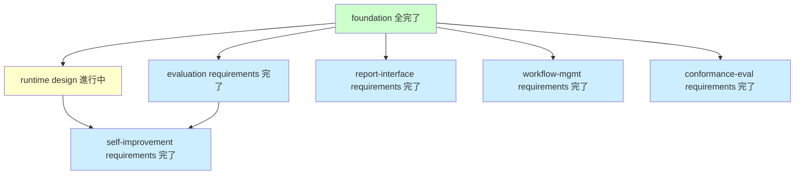

### claude/v2-acquisition-code-modブランチでの作業


[ワークフロー](##ワークフロー)

[論文ネタ](##論文ネタ)

[レビュー方法](##レビュー方法)

[TriadReview再利用](##TriadReview再利用)

[Conformance evaluation](##Conformance evaluation)

[論文ネタ2](##論文ネタ2)

[マルチターン](##マルチターン)

[Analysis](##Analysis)

[RUNTIME](##RUNTIME)

[メモリ、規律、運用md](##メモリ、規律、運用md)

[INTENT再構築](##INTENT再構築)

[Dogfeeding](##Dogfeeding)

[Rheniumでの作業開始](##Rheniumでの作業開始)


```
既に現在のリポジトリは複雑になりすぎている。これまで、何度も作成、改変を行ってきたため。そこから得られた仕様やノウハウがあるので、それらを抽出し、ReviewCompassを再構築する。再構築にあたり、デプロイの枠組みをスタブで作成し、それが動くようになったら、そこで開発を行う。どうか？
```

ご提案は **筋がよい** と思います。私の評価と、いくつか補足を述べます。

## ご提案の評価

### 良い点

- **複雑さの除去**：現リポジトリは何度も改変を重ねた結果、自己適用の前提が随所に染み込んでおり、デプロイ向けに作り変えるより、クリーンスレート（白紙）から作るほうが結果的に安く済む
- **抽出と再構築の分離**：「現リポジトリ＝素材」「ReviewCompass＝再構築」と役割を分けることで、現リポジトリを変更しないまま新しい設計に注力できる
- **デプロイの強制設計**：ReviewCompass の最初の関門が「自分をデプロイできること」になるので、自己適用前提を作り込まないという設計規律が自然に生まれる
- **スタブから始める段階開発**：いきなり全機能を再構築せず、まず「デプロイの枠組みが動く」ことを示し、その上で実機能を載せていく。最小実証（minimum viable proof）の発想と合致する
- **論文の素材は保全される**：論文 1 の本文と v2 抽出は素材として ReviewCompass へ移管できる。論文化を再開するときも材料が失われない

### 課題（考慮すべき点）

- **抽出の範囲を決める**：何を抽出して何を捨てるかの判断。今までの 6 機能仕様、operations の正本文書、規律ファイル、本セッションで発見した課題、テンプレート、論文 1 の素材など、全てを抽出すべきか、優先順位を付けるか
- **抽出の信頼性**：現リポジトリの仕様や設計の中に、自己適用前提で歪んだ箇所がある可能性。抽出時にその歪みを引き継がない仕掛けが必要
- **スタブが満たすべき条件**：「動く」の定義（どこまでの機能が動けば「次に進める」か）を先に決めないと、スタブが肥大する
- **現リポジトリの扱い**：抽出元として残すのか、archive 化するのか、最終的に破棄するのか。論文 1 を再開する場合の参照源としてどの版を保つか

## 提案する次のステップ

ご提案を具体化するなら、以下の順で進めるのが良いと考えます：

### ステップ 1：抽出計画と再構築方針の確定（本セッション内で可能）

ドキュメントを 1 本作成し、次を明確にする：

- 抽出する範囲（6 機能仕様、正本文書、規律、テンプレート、論文素材のどれを、どの粒度で抽出するか）
- 抽出の方針（自己適用前提を取り除くルール、デプロイ前提に書き換えるルール）
- スタブの完成条件（「動く」の定義）
- 現リポジトリの扱い（archive 化するか、参照源として残すか）

### ステップ 2：ReviewCompass リポジトリの新設

- GitHub 上に新規リポジトリ作成
- 最小限の構造（README、設計方針、抽出された主要文書のみ）

### ステップ 3：デプロイスタブの設計と実装

- アプリ側のディレクトリ規約を確定（`.kiro/specs/...` など）
- ReviewCompass がアプリのパスを認識する仕掛け（コマンドライン引数や設定ファイル）
- スタブのレビュー関門（最小機能でも、エンドツーエンドで動くもの）

### ステップ 4：スタブ上で ReviewCompass 自身を開発する

- ReviewCompass がスタブの上で動くようになったら、それを使って ReviewCompass の機能拡張を進める（自己適用、ただしデプロイ前提）

## お聞きしたい点

このご提案で、本セッション内で取り組むのは **ステップ 1（抽出計画と再構築方針の確定）** が現実的だと考えます。

以下を確認させてください：

- 本セッションで **抽出計画と再構築方針のドキュメント** を作成してよいか（ファイル名候補：`reviewcompass-reconstruction-plan-2026-05-21.md`）
- ドキュメントは現リポジトリ内 `.kiro/methodology/dual-reviewer-spec-driven-paper/` に置くか、それとも別の場所か（例：リポジトリ直下の `docs/` や、新規 `reviewcompass-plan/` ディレクトリ）
- 論文 1 投稿の扱いを「**保留（pending）**」とし、再構築の進捗に応じて再開判断する形でよいか

ご指示をお願いします。


```
**抽出計画と再構築方針のドキュメント**を作成する。
新しくリポジトリを作成し、そこに配置するので、現時点では適当なところでよい。
論文1は保留。
```

再構築計画書　.kiro/methodology/dual-reviewer-spec-driven-paper/reviewcompass-reconstruction-plan-2026-05-21.md


相談ですね。私の考えを整理して提示します。

## B-1 相談用整理：実装言語と実行形態

### 前提の確認

スタブが満たすべき条件（§5）と、その後に載せる実機能（§5 末尾の 6 項目）から逆算します。

- スタブ：パス認識／仕様読み込み／スタブレビュー書き出し／承認関門のモック
- 実機能（後段）：主役・敵対役・判定役の 3 役レビュー、機能横断整合ゲート、独立適合レビュー、ワークフロー管理

つまりスタブは「単なるファイル入出力＋ディレクトリ走査＋簡単な構造化」で済みますが、その上に載る実機能は LLM 呼び出しと多役並列実行を含みます。スタブ単体で見る軽さと、実機能まで見据えた相性は別軸です。

### 軸 1：言語

- **Python**
  - 利点：LLM 呼び出しは Anthropic SDK の公式言語のひとつで事例が多い。仕様文書（Markdown）の構造化解析や YAML 取り扱いの標準ライブラリが充実。研究用途のスクリプトとも親和性が高い
  - 欠点：型注釈をどこまで使うかで品質が上下する。実行環境（仮想環境）の管理が依存先環境ごとに必要
- **TypeScript / Node.js**
  - 利点：Claude Agent SDK の本流。MCP（Model Context Protocol：Claude Code と外部ツールを繋ぐ規格）サーバーを書くなら一番素直。型による契約の明示が容易
  - 欠点：仕様文書解析のライブラリは Python ほど揃っていない。並列実行の表現は得意だが、研究用の軽い試行錯誤にはやや重い
- **Bash + Markdown**
  - 利点：依存ゼロ。スタブ段階は本当に「ファイルを置いて読む」だけなので最軽量
  - 欠点：実機能（LLM 呼び出し、3 役並列、台帳管理）に進んだ瞬間に書き直しになる。捨てる前提のスタブとして割り切れるなら成立

### 軸 2：実行形態

- **コマンドライン道具（独立した実行ファイル）**
  - 利点：対象アプリのリポジトリで `reviewcompass <command>` のように使える。Claude Code 以外の環境からも呼べる。デプロイ可能性が最も明確
  - 欠点：Claude Code との統合は別途必要（外部コマンドとして呼ぶ形）
- **Claude Code の Skill / Slash Command**
  - 利点：現在の `.claude/skills/kiro-*` と同じ構造に揃う。即座に使える
  - 欠点：Claude Code 環境に縛られる。「デプロイ可能な独立成果物」という §2.3 の方針と矛盾しうる
- **MCP サーバー**
  - 利点：Claude Code を含む複数のクライアントから使える。ツール／アプリ分離（§2.3）と相性がよい
  - 欠点：実装が最も重い。スタブ段階でこれを選ぶと「スタブで動くまで」が遠くなる

### 私の推奨

ふたつの軸を組み合わせて、私としては **「Python ＋ コマンドライン道具」** を初期スタブの基本線として推したいです。理由は次の 3 点。

- §2.3 の「デプロイ可能な独立成果物」を最も素直に満たす
- 後段の LLM 呼び出し・並列実行まで言語を変えずに伸ばせる
- Skill / MCP は「コマンドライン道具を呼ぶ薄い層」として後から重ねれば済む

ただし利用者の判断軸（軽さ最優先か、Claude Code 統合最優先か、デプロイ独立性最優先か）次第で結論は変わります。

どの軸を最優先にしたいか、教えていただけますか。あるいは私の推奨で進めてよいか。

```
推奨案
```

承知しました。「Python ＋ コマンドライン道具」で計画書に反映します。

B-1 を計画書に反映しました：

- §5.1 新設：言語＝Python、実行形態＝コマンドライン道具、理由を明記
- §5.2／§5.3 に小節分け（完成条件と実機能の順序を整理）

------

次は B-2：各フェーズの完了条件の具体化です。

現状の問題点を再掲します。

- フェーズ 1（抽出作業）：「抽出物が ReviewCompass 初期コンテンツとして整っている」→ 何が揃えば「整った」と判定するか不明
- フェーズ 2（リポジトリ新設）：「他者が新リポジトリを読んで『何のためのプロジェクトか』を理解できる」→ 主観的で検証できない
- フェーズ 3（スタブ実装）：「§5 の条件を満たす」→ §5.2 自体が抽象的（「読み込めた」「書き出せた」の判定方法が未定）
- フェーズ 4（実機能開発）：「5 機能のうち少なくとも 1〜2 機能が動く」→ 「動く」の定義が未定

私の提案する具体化案は次のとおりです。

### フェーズ 1（抽出作業）の完了条件案

- 5 機能の仕様（intent.md／brief.md／requirements.md／design.md／tasks.md／spec.json の構造）が ReviewCompass 用に書き換えられ、自己適用前提の表現が grep で 0 件であることを示せる
- 正本文書 14 件（operations 6 件＋ docs/coordination 1 件＋直下 7 件）が `docs/operations/` あるいは `docs/foundations/` に配置済みで、各文書の対応表（抽出元 → 抽出先）が `docs/extraction-mapping.md` に記録されている
- 規律ファイル 10 件程度が `docs/disciplines/` に配置済みで、内容は「アプリ開発支援ツールとしての規律」に書き換え済み

### フェーズ 2（リポジトリ新設）の完了条件案

- GitHub 上に新リポジトリが存在し、URL が記録されている
- フェーズ 1 の抽出物が配置済み（フェーズ 1 完了条件で挙げたファイル群が新リポジトリの該当パスに存在）
- README.md が「目的・対象利用者・スタブ完成までの段取り」を 1 ページ以内で説明している（主観的判定でなく、これら 3 項目の見出しが存在することで判定）

### フェーズ 3（スタブ実装）の完了条件案

§5.2 の各条件に検証手順を付ける形にします。

- パス認識：コマンドラインで `reviewcompass --app <パス>` を実行し、標準出力に「発見した仕様ディレクトリ」が一覧で出る
- 仕様読み込み：`reviewcompass parse-spec <feature>` で、requirements.md を構造化した JSON（または同等の構造化出力）を標準出力に出す
- スタブレビュー：`reviewcompass review <feature>` で、対象アプリ側の `<feature>/reviews/` にタイムスタンプ付きの「スタブレビュー記録」ファイルが新規作成される
- 承認関門のモック：`reviewcompass approve <feature> <phase>` で、対象アプリ側の spec.json の該当フェーズ承認フラグが更新される
- エンドツーエンド動作：上記 4 コマンドを順に実行する統合テストが 1 本通る

### フェーズ 4（実機能開発）の完了条件案

- 5 機能のうち少なくとも 1 機能（主役レビューを推奨）が、実際の LLM 呼び出しを伴って動き、スタブ版でなく実 LLM 版のレビュー記録を出力する
- その 1 機能について、自己適用（ReviewCompass 自身を ReviewCompass で開発）の最初の 1 サイクルが完走している（仕様 → 主役レビュー → 利用者承認）

------

この具体化案で進めてよいか、または調整したい点があるか、確認させてください。

フェーズ完了条件の具体化案をどうしますか

```
提案どおり反映
```


## ワークフロー

```
ワークフロー管理が現在どのような仕組みになっているか説明して
```

サブツリーの規約に従い、まず `dual-reviewer-rebuild/CLAUDE.md` を読み、続けて全体像を確認します。

ワークフロー管理（現リポジトリでは `dual-reviewer-implementation-governance` という名称）の仕組みを、上位の流れから細部の機序へ順に説明します。

## 1. 位置付け

- 5 機能の中で 1 つだけ性格が違う「横断仕様」。foundation／runtime／evaluation／report-interface（旧 paper-interface）が「機能の中身」を担うのに対し、本仕様は「機能横断の手続きと証跡契約」を持つ
- 主目的：実装の完了を「タスクが終わってスモークテスト（最低限の動作確認）が通った」だけで閉じさせず、適合レビュー（実装が仕様どおりか確認するレビュー）を必ず通すこと

## 2. 全体の流れ（フェーズ連鎖）

正本は `dual-reviewer-rebuild/operations/WORKFLOW_OVERVIEW.md` で、フェーズの連鎖は次のとおり。

- intent（意図）→ requirements（要件）→ design（設計）→ tasks（タスク）→ implementation（実装）→ review acquisition（レビュー取得）
- 各フェーズの終端に「人間関門」がある。承認状態は各機能の `spec.json`（承認状況の正本ファイル）に記録される
- 各フェーズは内部で「wave（波）」と呼ばれる連鎖を持つ。たとえば requirements wave は「起草 → 機能個別レビュー → 機能横断レビュー → 機能間整合ゲート → 承認依頼パッケージ作成」の 5 段

## 3. 機能間整合ゲート（multi-feature alignment gate）

複数機能の開発で「機能ごとに正しく見えるが、合わせると矛盾する」を防ぐための専用ゲート。

- requirements alignment gate：メタデータ契約・無効化規則・依存関係・責務境界を横断確認
- design alignment gate：インターフェース・配置・版整合・統合点を横断確認
- tasks alignment gate：実装順・共有成果物移行・依存・テスト順を横断確認
- 是正規則：レビュー波で同じフェーズの文書が修正されたら、次フェーズへ進む前に当該フェーズの alignment gate を再実施

## 4. 手戻り種別（handback class）

問題を検出したときに「どこまで戻すか」を分類する記号。現状の正本では 4 段。

- A：タスク内で吸収できる微修正
- B：設計に戻す
- C：要件に戻す
- D：意図に戻す
- 迷ったら上流に戻す側に倒す（保守的判定）

注：論文側ではこの 4 区分を「起点フェーズ記号 N／R／D／A／I ＋ 深さ 0〜4」の二次元表記に拡張済み（セッション 14 で改訂）。リポジトリ側の正本は 4 区分のまま

## 5. reopen 10 ステップ

問題検出後の標準手順。条件付き分岐の余地を残さず、毎回同じ 10 段を踏む。

1. 問題検出
2. 手戻り種別の判定（A／B／C／D）
3. 影響範囲の特定
4. 正本（intent／spec／operations／追跡表）の更新
5. `spec.json` の更新（reopened・upstream_change_pending・impacted_downstream_phases の各フィールド）
6. 証跡を残す（レビュー記録・調整ログ・signal register・gate status のいずれか該当先へ）
7. 該当ゲートを再実施
8. 下流フェーズを再判定（完了済みでも影響下なら reopen 扱いに戻す）
9. 承認済みフェーズから再開
10. 実装完了を再判定

詳細正本：`dual-reviewer-rebuild/docs/coordination/workflow-repair-procedure.md`

## 6. 実装後の適合レビュー（Stage 3）

実装完了直後に必ず通す関門。

- レビュー観点：仕様適合・境界条件・証跡追跡可能性
- 起票する所見（finding）は P1／P2／P3 の重大度で分類
  - P1：承認・採用・信頼境界・無効化・由来追跡のいずれかの破綻
  - P2：仕様外固定値・ヒューリスティック依存などの脆い箇所
  - P3：追跡可能性・保守性を弱めるが即時破綻ではないもの
- 完了条件は「所見 0 件」または「所見＋disposition（処理方針）が明示記録されていること」。ただし P1 が未解決なら次機能着手前に修正必須

## 7. 完了状態の細分化

「完了」を一語で扱わず、状態を 5 段に分ける。

- pending（未着手）
- in_progress（進行中）
- completed（完了）
- completed_with_open_findings（所見残ありの完了）
- reopen_required（reopen 必要）

正本台帳：`dual-reviewer-rebuild/docs/coordination/workflow-gate-status.md`

## 8. Requirement 9：実行台帳と強制機構（最も複雑な機序）

セッション 13 で追加された、本仕様の中核装置。「手続きの段を勢いで省略してしまう」現象を機械的に止める仕組み。要点を順に。

### 8.1 権威マップ（authority map）

- すべての所定ワークフロー手続き（フェーズ実行・レビュー波・整合ゲート・reopen 手続き・機能横断整合）は、段集合の権威ソース文書を 1 つだけ持つ
- 正本：`docs/coordination/workflow-process-authority-map.md`
- 各行は `process_id` ／ 権威文書パス ／ 該当節 ／ 段抽出規則 を持つ

### 8.2 実行台帳（execution ledger）

- 手続きに着手する前に、その手続きの段集合を権威ソース文書から新たに導出し、`docs/coordination/ledgers/<process_id>-<日付>.md` として台帳ファイルを生成する
- 各段は「段名／出典／完了述語（証跡 artifact の存在＋構造適合）／独立性要件」を持つ
- 台帳には導出元の `section_content_hash`（権威節本文の正規化ハッシュ）を記録し、後で権威節が変わったかを機械判定できるようにする

### 8.3 独立再導出

- 台帳が正しいかは「台帳を作ったロジックとは別の経路で、権威文書を一次資料として再パースし、段集合が一致するか」で検証する
- これにより「台帳を作る側が自分の台帳を承認する」自己審査を防ぐ

### 8.4 不可逆操作の遮断（fail-closed）

- 次の操作の直前で必ず判定する
  - `spec.json` の approvals／phase 書き込み
  - `workflow-gate-status.md` の状態遷移書き込み
  - 機能横断整合メモの確定
  - 人間承認依頼（phase evidence summary／gate package）の生成
- 判定が pass = 「台帳が存在 ∧ 全段の完了述語を充足 ∧ 独立再導出と段集合が一致」
- いずれかが不成立、または検査自体が結論を出せない場合（不在・実行失敗・権威ソースが曖昧）は **pass とみなさず遮断**（fail-closed）

### 8.5 通過マーカーと遮断記録

- pass した事実も台帳に記録（process_id ／対象操作／タイムスタンプ／突合ハッシュ）
- 遮断された事実も台帳に記録
- 後続の手続きに着手するときは、前手続きの通過マーカーの存在と整合を必須確認。マーカーを欠く状態遷移は「検査が呼ばれない／配線されない」攻撃面とみなして遮断

### 8.6 移行戦略（grandfathering）

- 本契約は設計承認以降に新規着手する手続きから適用
- 導入前に完了済みの手続きは遡って fail-closed にしない
- 本契約を導入する当の設計・タスク段は移行期として手作業で台帳を用意してよい（免除は workflow-gate-status.md に記録）

## 9. 所有する成果物（一覧）

本仕様が repo 内に固定する成果物は次のとおり。

- 手続き正本：`docs/coordination/implementation-conformance-review.md`、`workflow-repair-procedure.md`、`workflow-process-authority-map.md`
- 指標台帳：`implementation-conformance-metric-register.md`、`phase-review-metric-register.md`
- 状態台帳：`workflow-gate-status.md`
- 台帳テンプレートとインスタンス：`workflow-execution-ledger-template.md`、`ledgers/<process_id>-<日付>.md`
- レビューテンプレート：`docs/reviews/templates/intent-review-template.md`、`implementation-conformance-review-template.md`
- 検証スクリプト：`scripts/validate_implementation_governance_artifacts.rb`（Ruby 実装、台帳・独立再導出・fail-closed 判定の機械化部分）
- 機能横断整合メモ：`docs/alignment/cross-spec-implementation-governance-alignment.md`
- 新規ケース起動：`scripts/bootstrap_reference_free_case.rb`、`.kiro/methodology/dual-reviewer-spec-driven-paper/reference-free-case-bootstrap-guide.md`

## 10. 現状の癖（再構築で引き継ぐべきか議論したい点）

ワークフロー管理は最も複雑な機能で、現リポジトリで一番大きく改訂された箇所でもあります。再構築での扱いとして次の論点があります。

- Requirement 9 の実行台帳・独立再導出・fail-closed の機構をスタブ段階から組み込むのか、最初は簡略化して後段で導入するのか
- 検証スクリプトが Ruby 実装。スタブを Python に揃えるなら書き直しが必要
- 機能横断整合ゲート（multi-feature alignment gate）はスタブ段階では発火しない（機能が 1 つしかない）。実機能を 2 機能載せた時点で必要になる
- 「実装の自己適用」（ReviewCompass 自身を ReviewCompass で開発）を行うなら、ワークフロー管理がスタブの早い段階で必要になる

------

説明はここまでです。再構築計画でワークフロー管理をどう扱うか（最初から重い機構を載せるか、段階的に増やすか）を詰めたければそのまま続けられます。あるいは別の部分を見るか、判断を委ねます。


```
議論です。ワークフロー管理は苦労して、現在の形になっています。なぜか？LLMがワークフローを正しく実行しないことがあり、それをガードするためです。本当にここまで緻密にする必要があるのかも疑問ですが。どう考えるか？
```

議論ですね。私の見方を率直に述べます。

## まず立場の整理

利用者の感覚（「ここまで緻密にする必要があるのかも疑問」）に、私は **半分同意・半分反対** です。

- 同意する半分：現状の機構は、起きた問題ごとに追加した防具を積み重ねた結果であり、設計としては明らかに過剰
- 反対する半分：機構が解こうとしている問題（LLM がワークフローを段飛ばしする）は本物。緻密さを単純に削ぐと、削いだ箇所から元の失敗が再発する

順を追って論じます。

## 1. 機構が存在する根本理由を確認する

ワークフロー管理が現在の形になった原因を、私の側から整理します。

- **段の圧縮（momentum compression）**：LLM は文脈が長くなったり「自明に見える」と段を飛ばす。証跡を残さず「完了しました」と言う
- **自己承認（self-approval bias）**：LLM は自分が書いた成果物を自分で「適合」と判定しがち。レビュー役と起草役を同じ LLM が兼ねると、合格判定が甘くなる
- **見栄えで誤魔化す（appearance over evidence）**：必要な節があるかのように見える文書を生成するが、中身は要件を満たさない

これは抽象的な懸念ではなく、本リポジトリで実際に観測された失敗モードです（個人記憶の `feedback_completion_verification_protocol.md` がまさにこの失敗から生まれた規律）。Requirement 9 の機構は、この 3 つを機械的に塞ぐために設計されています。

## 2. 機構の各部品が実際に何を防いでいるか

部品ごとに「これがないと何が起きるか」を見ると、過剰さの実体が見えてきます。

- **権威マップ ＋ 単一の権威ソース**：段集合の「正しさ」を 1 か所に固定する。これがないと LLM が「文脈に合わせて」段集合を勝手に変える
- **実行台帳の事前生成**：手続き着手 *前* に段集合を起こすことで、後から「もう終わったから OK」と書き換えるのを防ぐ
- **独立再導出**：台帳を作った経路と別経路で段集合を再導出し突合する。これがないと「LLM が書いた台帳を LLM が読んで pass」になる（自己承認）
- **`section_content_hash`（節の本文ハッシュ）**：権威ソースが変わったら台帳を陳腐化扱いにする。これがないと「古い段集合のまま新しい権威に対して pass」が出る
- **fail-closed（既定で遮断）**：検査が結論を出せない状況を「pass にしない」。これがないと検査スクリプトが落ちただけで素通り
- **通過マーカー ＋ 遮断記録**：「検査が呼ばれない／配線されない」攻撃面を事後検知可能にする。これがないと「検査自体が存在しないことに気づけない」

つまり個々の部品には、それぞれ独立した失敗モードへの対応があります。**重複や装飾ではない。**

## 3. しかし「1 人＋ LLM 数体」の規模では明らかに過剰

部品が全部必要だとしても、それぞれの実装コストが問題です。

- Ruby の検証スクリプトを Python に書き直すコスト
- 節ハッシュの正規化規則・ハッシュアルゴリズムの確定
- 権威マップの保守（権威文書の節構成が変わるたびに追従）
- 移行戦略・grandfathering・format-migration の運用
- 「台帳が陳腐化したら supersedes リンクで保全」の証跡保全運用

これらは、組織で複数開発者が手分けして実装するなら釣り合うコストですが、1 人＋ LLM で進めるには明らかに重い。

しかも、機構が複雑になればなるほど、**「機構自体のバグや配線漏れが新たな攻撃面になる」** という再帰的問題が発生します。実際 §1.1 や §4 の通過マーカー検査は、まさに「機構が呼ばれない」事態への二次防御として後から追加されたもの。これは底なし沼の兆候です。

## 4. では何を残し、何を削るか

私の提案する切り方は次のとおりです。

### 4.1 残すべき「思想」

- **不可逆操作の直前にしか機械ゲートを置かない**（fail-closed の最小集合）
- **証跡 artifact の存在＋構造適合で完了を判定する**（主張ではなく証拠）
- **起草者と判定者を分ける**（自己承認の禁止）
- **検査が結論不能なら遮断**（fail-closed の既定）

### 4.2 削ってよい「実装」

- 節ハッシュ・supersedes リンク・grandfathering・format-migration の機構
- 権威マップという独立した文書（後述の代替で吸収）
- 機構のための機構（通過マーカーの後続確認、二次防御）

### 4.3 代替案

不可逆操作の直前で、次の極小チェックだけを行う：

- 当該手続きの段集合を **YAML（構造化テキスト形式）に静的に列挙** しておく。Markdown 節からのパースはしない
- 各段に「期待する証跡ファイルのパスと、そこに含むべき節名のリスト」を書く
- 検査スクリプトは「YAML に列挙された証跡ファイルがすべて存在し、必須節名がすべて含まれるか」だけを見る
- これだけで pass／fail を出す。検査が落ちたら fail
- 起草者と判定者の分離は、レビュー記録の front-matter（先頭メタデータ）に `author` と `reviewer` の異名を必須化することで担保

これで現状の機構の **本質的な防御（段省略の機械的禁止・自己承認の禁止・fail-closed）** は維持しつつ、実装が 1／10 程度になります。

## 5. ただし削ったぶん「見える失敗」も増える

正直に言うと、軽量化は次のリスクと引き換えです。

- 権威マップを廃すると、「段集合の正本は何か」が文書上で曖昧になる。複数文書間で段の数や順序がずれても気づきにくい
- 節ハッシュを廃すると、権威文書が改訂されても古い台帳が pass する余地が残る
- 通過マーカーの後続確認を廃すると、検査スクリプト自体が呼ばれない経路が残る

これらは「人間がレビューで気づける」ことを期待して受け入れる、という割り切りです。1 人の利用者がフェーズの境目で見るならカバーできる範囲だと思いますが、多人数開発に拡張すると破綻します。

## 6. 結論

- 現状のワークフロー管理は、**目的（LLM の段省略を機械で止める）は正しい** が、**1 人＋ LLM の規模に対しては実装が過剰**
- ReviewCompass 再構築では「思想は継承、実装は 1／10」を目標にすべき
- 具体的には、不可逆操作の直前で YAML ベースの極小チェックだけ走らせる方式を推奨
- 多人数開発に拡張するときに、節ハッシュ・独立再導出パーサ・通過マーカー後続確認などを追加導入する余地を残す

逆に「いや、たとえ 1 人運用でも段省略が再発するから今の緻密さを維持したい」というご判断なら、現状機構を Python に書き直す前提でフェーズ 4 以降のスコープに組み込む、という結論もあり得ます。

どちらに倒したいか、利用者の判断を伺えますか。

```
代替案にしよう。
```


```
ワークフローの手続き処理自体に変更はないが、ワークフロー全体の手順管理と各フェーズ内での管理は整合しているか
```

良い問いです。「手続きの段（中身）」は変えていなくても、**全体管理と各フェーズ内管理が整合しているか** は別問題で、私の見るところ **完全には整合していません**。具体的に検証してから答えます。

調査結果から答えます。

## 結論

**整合していません。** 設計上は「Requirement 9 の統一適用」でワークフロー全体管理と各フェーズ内管理を 1 つの台帳機構で束ねる方針ですが、その束ねの中心である `workflow-process-authority-map.md`（手続き → 権威ソース対応表）を実際に見ると、17 件中 1 件しか完了していません。

## 根拠

`workflow-process-authority-map.md` 第 6 節「確定書式適合状態」に明記されている現状は次のとおりです。

- **確定書式適合（完全に通る）：1 件のみ**
  - `reopen-procedure` だけ
- **確定書式 未適合（権威文書は指せるが、節の書式が確定していない＝fail-closed）：12 件**
  - cross-spec-alignment
  - requirements-review-wave／design-review-wave／tasks-review-wave
  - requirements-alignment-gate／design-alignment-gate／tasks-alignment-gate
  - intent-phase-execution／requirements-phase-execution／design-phase-execution／tasks-phase-execution／implementation-phase-execution
- **権威ソース 未確立（権威節が未特定＝fail-closed）：4 件**
  - intent-review-wave
  - implementation-review-wave
  - intent-alignment-gate
  - implementation-alignment-gate

つまり、17 件の手続きのうち **16 件が fail-closed のまま**。設計の「全手続きを同じ台帳機構で扱う」の現実装では、最上流（intent）と最下流（implementation）のレビュー波・整合ゲートが穴になっています。

## 4 つの具体的なずれ

整合していない箇所を具体に挙げます。

### ずれ 1：実装フェーズだけ波の形が違う

- 要件・設計・タスクの波：起草 → 機能個別レビュー → 機能横断レビュー波 → 整合ゲート → 承認パッケージ（5 段）
- 実装フェーズの段：実装 → スモークテスト → 適合レビュー → 完了（4 段、形が違う）

実装フェーズには「機能横断レビュー波」も「整合ゲート」もない。`implementation-alignment-gate` が「未確立」とされている理由はここ。

### ずれ 2：intent フェーズの波が定義されていない

intent はワークフローの最上流で、ここの誤りが全下流に伝播するにもかかわらず、`intent-review-wave` と `intent-alignment-gate` がどちらも「未確立」。intent review というステージ名は出てくるが、それを「波」として段集合化した正本が存在しない。

### ずれ 3：reopen 10 ステップの第 7 段が暗黙参照

reopen はワークフロー全体管理に属する手続きですが、第 7 段「該当ゲートを再実施」はフェーズ内ゲートを参照する。両層の接続が手続き文書（自然文）で書かれていて、authority map では別行（reopen-procedure と各 alignment-gate）に分離されたまま。再開時にどのゲートを再実施するかの照合は、人間が文書を読んで判断するしかない。

### ずれ 4：implementation-governance 設計文書内で語彙が混在

`implementation-governance/design.md` の §「Workflow Model」は Stage -1（ブートストラップ）／Stage 0（intent review）／Stage 1（implementation）／Stage 2（smoke）／Stage 3（適合レビュー）／Stage 4（close）と並ぶ。

- Stage -1 と Stage 0 はワークフロー全体レベル
- Stage 1〜4 は実装フェーズ内レベル

これが 1 つの「Workflow Model」節に並列で並んでいる。authority map では `implementation-phase-execution` という別 process として扱う前提なのに、設計文書側では混ざっている。読む側は層を判別する手がかりがない。

## なぜこうなったか（推測）

- Requirement 9 は後発（セッション 13 で追加）で、それ以前の文書は層分離を意識せず書かれていた
- authority map は Requirement 9 で導入された統一インターフェースだが、既存文書の側に「番号付き段見出しの単一リスト」という確定書式が課されていない
- 適用範囲を全手続きに広げると書式整備のコストが大きいため、`reopen-procedure` だけ先に揃えて他は fail-closed のまま据え置いた、というのが現状の説明（同文書 §6 末尾「未適合・未確立の解消は別途の上位文書同期で扱う」）

## 再構築への含意

ここで利用者に判断していただきたい論点があります。

- **論点 1**：軽量化方針（§5.4）でも「層」は維持するか
  - 現状の階層（workflow-level 2 件、phase-level 15 件）をそのまま継承するか、再構築で簡素化するか
- **論点 2**：実装フェーズの波の形を他フェーズに揃えるか
  - 「実装フェーズだけ違う」は本質的な違いか、揃えるべきか
- **論点 3**：intent の波・整合ゲートを定義するか
  - 現状「未確立」のまま放置すべきか、再構築で定義するか
- **論点 4**：reopen 第 7 段の層横断接続をどう機械化するか
  - YAML に「reopen 時に再実施するゲート集合」を明示するか、自然文のまま残すか

どの論点から議論しますか。あるいは「層分離を諦めて 1 階層のフラットな手続き一覧にする」という別解もあります。

論点 1 から順に説明します。まずは 1 を詳しく論じ、判断をいただいてから 2 へ進みます。

## 論点 1：軽量化方針でも「層」を維持するか

### 現状の階層構造

`workflow-process-authority-map.md` が定める手続き分類は 2 階層です。

- **ワークフロー全体レベル（2 件）**
  - `reopen-procedure`（reopen 手続き）
  - `cross-spec-alignment`（機能横断整合）
- **フェーズ別レベル（15 件 ＝ 5 フェーズ × 3 種類）**
  - 各フェーズ（intent／requirements／design／tasks／implementation）について
    - `<phase>-phase-execution`（フェーズ実行）
    - `<phase>-review-wave`（レビュー波）
    - `<phase>-alignment-gate`（整合ゲート）

合計 17 件。設計上は「全 17 件を同じ台帳機構で扱う」が方針。

### 維持する場合の利点

階層を残すと次の恩恵があります。

- 同じ「レビュー波」「整合ゲート」という概念がフェーズをまたいで同じ形で現れることが文書上に明示される
- reopen 手続きや機能横断整合のように「フェーズに紐づかない」手続きを独立して扱える
- 新しいフェーズを追加する場合、既存パターンを写すだけで一貫した形になる
- どの手続きが「上流に戻す」「機能をまたぐ」性格かが分類上見える

### 維持する場合の欠点

- 1 人＋ LLM の規模では、5 フェーズ × 3 種類 ＝ 15 件のフェーズ別手続きの大半が「ほぼ同じ内容」を別ファイルで持つ冗長さになる
- 現状 17 件中 16 件が「未適合」or「未確立」のまま運用が始まっている事実は、階層構造の維持コストが実際に支払えていない証拠
- 軽量版（§5.4）で YAML 静的列挙にする場合、15 個の似た YAML ファイルが並ぶ
- フェーズ実行・レビュー波・整合ゲートの 3 種を分けても、実態としては「フェーズ進行の一連の流れ」を 3 つに切り分けただけで、独立して動く別手続きではない

### 簡素化する場合の代替案

層を諦めてフラットにする場合、次の 2 つの切り方があります。

**案 A：フェーズ単位 1 ファイル（5 件＋全体 2 件 ＝ 7 件）**

- 各フェーズで「フェーズ実行・レビュー波・整合ゲート」を 1 つの YAML にまとめる
- 例：`stages/requirements.yaml` が起草・個別レビュー・横断レビュー波・整合ゲート・承認パッケージの 5 段を 1 ファイルに持つ
- ワークフロー全体レベルの 2 件（reopen／cross-spec-alignment）は別ファイル
- 結果：7 ファイル

**案 B：完全フラット（手続き種別を捨てる）**

- 手続きを「種別」で分類せず、ワークフロー全体の一連の段を 1 つの YAML に列挙
- 例：`stages/workflow.yaml` に intent 起草 → intent レビュー → intent 整合 → requirements 起草 → … と全部を並べる
- reopen は「途中の任意の段から再開する規則」を別 YAML で記述
- 結果：2〜3 ファイル

### 私の推奨

**案 A（フェーズ単位 1 ファイル、計 7 件）** を推します。理由は次のとおりです。

- 案 B（完全フラット）はあまりに大きな単位になり、「いまどこにいるか」の把握が逆に難しくなる
- 案 A はフェーズという既存の自然な区切りに沿うため、利用者の頭の中の構造と一致する
- フェーズ実行・レビュー波・整合ゲートを 1 ファイルにまとめても、各段に「種別」フィールドを持たせれば分類は失わない
- 17 件 → 7 件で運用コストが半減
- それでもワークフロー全体レベル 2 件（reopen／cross-spec-alignment）は性格が違うので別建てを維持

ただし案 A の代償として「実装フェーズの波の形が他フェーズと違う」問題（論点 2）がそのまま残ります。論点 2 で実装フェーズを他に揃えるなら、案 A は綺麗に機能します。揃えないと「フェーズ単位 1 ファイル」内で実装だけ異質な構造を持つことになります。

つまり論点 1 の選択は論点 2 と連動しています。

------

論点 1 の判断をいただけますか。選択肢は次の 3 つです。

- 現状の 2 階層（17 件）を維持
- 案 A（フェーズ単位 1 ファイル、7 件）
- 案 B（完全フラット、2〜3 件）

```
5 フェーズ × 3 種類の3種類とはなに？　同じ台帳機構で扱うの意味は？
```

質問にお答えします。

## 質問 1：5 フェーズ × 3 種類の「3 種類」とは

各フェーズの中で別個に管理される手続きが 3 種類ある、という意味です。それぞれの中身は次のとおり。

### 種類 1：フェーズ実行（`<phase>-phase-execution`）

そのフェーズの「本作業」を進める手続き。

- 要件フェーズなら：要件文書（requirements.md）を起草する作業そのもの
- 設計フェーズなら：設計文書（design.md）を起草する作業
- タスクフェーズなら：タスク一覧（tasks.md）を作る作業
- 実装フェーズなら：コードを書いて成果物を作る作業

権威ソースは `operations/HUMAN_WORKFLOW.md` の §5.2（仕様フェーズ）と §5.3（実装フェーズ）。

### 種類 2：レビュー波（`<phase>-review-wave`）

そのフェーズの成果物を **複数機能にまたがって横断レビューする** 手続き。1 機能ずつの個別レビューとは別に、機能間の整合性を確認するために行う、複数ラウンドのレビュー。

- 要件レビュー波：要件文書を 5 ラウンドで横断レビュー
- 設計レビュー波：設計文書を 10 観点で横断レビュー
- タスクレビュー波：タスク一覧を 7 観点で横断レビュー

権威ソースは `operations/REVIEW_PROTOCOL.md` の §2／§3／§5。

### 種類 3：整合ゲート（`<phase>-alignment-gate`）

そのフェーズの終端で、複数機能を並べて整合性を最終確認する関門。レビュー波の結果を踏まえ「次フェーズに進んでよいか」を決める段。

- 要件整合ゲート：メタデータ契約・無効化規則・依存関係・責務境界を横断確認
- 設計整合ゲート：インターフェース・配置・版整合・統合点を横断確認
- タスク整合ゲート：実装順・共有成果物移行・依存・テスト順を横断確認

権威ソースは `operations/HUMAN_WORKFLOW.md` §5.2.5。

### つまり 3 種類は「同じフェーズの中で時系列に並ぶ別工程」

要件フェーズの場合の流れを並べると：

1. 種類 1：要件文書を起草する（フェーズ実行）
2. 種類 2：起草した文書を複数ラウンドでレビューする（レビュー波）
3. 種類 3：機能間の整合を最終確認する（整合ゲート）
4. 人間承認 → 次フェーズへ

これを 5 つのフェーズすべてで繰り返すので、5 フェーズ × 3 種類 = 15 件の手続きになります。

ただし前回の調査でわかったとおり、実装フェーズだけは「種類 2 のレビュー波」と「種類 3 の整合ゲート」が未確立。intent フェーズもレビュー波と整合ゲートが未確立。だから実態として動いているのは要件・設計・タスクの 3 フェーズ × 3 種類 = 9 件＋実装フェーズの実行 1 件 ＝ 10 件で、残り 7 件は名目上の存在。

------

## 質問 2：「同じ台帳機構で扱う」とは

Requirement 9 が導入した「実行台帳（execution ledger）」という機械強制の仕組みを、上記 17 件すべての手続きに **同じ形で適用する** という意味です。具体的な手順は次の 5 段。

### 段 1：手続きに着手する直前に台帳を作る

たとえば「要件レビュー波を始める」前に、`docs/coordination/ledgers/requirements-review-wave-2026-05-21.md` という台帳ファイルを新規生成する。

### 段 2：台帳の中身を権威ソースから機械的に導出する

権威マップ（`workflow-process-authority-map.md`）を見て、「要件レビュー波の段集合は `REVIEW_PROTOCOL.md` の §2 に書いてある」と特定し、その節から段の一覧（5 ラウンド分）を機械抽出して台帳に書き込む。

### 段 3：各段に「証跡ファイルの存在＋必須節充足」という完了条件を書く

たとえば「ラウンド 1：起草レビュー」の完了条件は「`docs/reviews/round1-*.md` が存在し、必須節（Reviewed Scope／Findings／Disposition など）が全部含まれること」と書く。

### 段 4：不可逆操作の直前に検査する

`spec.json` の承認フラグを書く・状態台帳を更新する・承認依頼を生成する、といった「あとから戻せない操作」の直前に、検査スクリプトを呼ぶ。検査の中身は次の 3 つを全部満たすか。

- 台帳ファイルが存在する
- 台帳の各段の完了条件が全部満たされている
- 台帳生成とは別経路で同じ権威ソースを読み直し、同じ段集合が出る（独立再導出）

3 つ全部 OK なら通す。1 つでも怪しければ遮断（fail-closed）。

### 段 5：通過した事実を台帳に記録する

検査を通った事実をタイムスタンプ付きで台帳に書き込む。後続の手続きはこの記録を見て「前の手続きは正規に通過済み」と確認する。

------

## なぜ「同じ機構で扱う」が大事か

reopen 手続きでも、要件レビュー波でも、実装の整合ゲートでも、**同じ 5 段の検査を通す** のがポイントです。

- 手続きごとに別の検査ロジックを書くと、手続きが増えるたびに検査の整備が追いつかなくなる
- 「この手続きだけ例外」を許すと、そこが攻撃面（LLM が省略する経路）になる
- 同一機構なら、検査スクリプトを 1 つ作れば全手続きに適用できる（はず）

これが Requirement 9 の「Uniform Application」（一律適用）という宣言の意味です。

------

## 現状との乖離

設計は「全 17 件に同じ機構を一律適用」と宣言していますが、実装の現実は次のとおり。

- 機構を完全に通せるのは 17 件中 1 件のみ（`reopen-procedure`）
- 残り 16 件は権威節の書式（番号付き段見出しの単一リスト）が未整備、または権威節そのものが未特定

つまり「同じ台帳機構で扱う」は **設計の宣言** であって、**運用は届いていない** のが現状です。これが前回私が「整合していない」と申し上げた根拠です。

------

ここまでで質問への回答は以上です。論点 1（層構造をどう扱うか）の議論に戻りますか。それとも更に確認したい点がありますか。


```
phase-executionとしているのは、最初の草案document-generationですね。
intent フェーズはアプリの開発意図なので、フィーチャーに分かれていないのでreview waveとはあり得ない。alignment-gateはないが、代わりに単なるgateは必要。実装フェーズはレビュー波と整合ゲートは必要だが、現時点では未実装。
intent フェーズだけ縮退させれば、形式は統一できる。
台帳機構は、現状から代替案に変更することによりなくならないのか？
```

各点を確認してから、ご質問に答えます。

## 点 1：phase-execution は草案生成（document-generation）か

そのとおりです。各フェーズの「本作業」とは、要件・設計・タスクのいずれでも **初版の文書を起こすこと**。実装フェーズだけは「文書を起こす」ではなく「コードと成果物を作る」になりますが、性質としては同じ（フェーズの中心成果物を生み出す段）。

## 点 2：intent フェーズの縮退

整理に同意します。intent はアプリ全体の開発意図そのもので、機能（feature）に分かれていない以上、

- レビュー波（複数機能をまたぐ横断レビュー）は概念として成立しない
- 機能間整合ゲートも対象がない

ただし「単なる gate（intent 文書を承認するための関門）」は必要。これは機能横断ではなく、intent 文書そのものの妥当性を判定する関門で、性格が違う。

## 点 3：実装フェーズのレビュー波と整合ゲートが未整備

そのとおりで、authority map で「未確立」とされている `implementation-review-wave` と `implementation-alignment-gate` がまさにこの穴。再構築では他フェーズと同じ 3 種類を整備すべき。

## 点 4：intent だけ縮退させれば形式統一

提案を整理するとこうなります。

- intent：2 種類（phase-execution ＋ 単なる gate）
- requirements／design／tasks／implementation：3 種類（phase-execution ＋ review wave ＋ alignment gate）
- ワークフロー全体レベル：2 件（reopen-procedure ＋ cross-spec-alignment）

合計：2 ＋ 4 × 3 ＋ 2 ＝ 16 件。

「案 A（フェーズ単位 1 ファイル）」と組み合わせれば、ファイル数は次のとおり。

- `stages/intent.yaml`（2 段：草案＋単純 gate）
- `stages/requirements.yaml`／`stages/design.yaml`／`stages/tasks.yaml`／`stages/implementation.yaml`（各 3 段：草案＋レビュー波＋整合ゲート）
- `stages/reopen-procedure.yaml`
- `stages/cross-spec-alignment.yaml`

計 7 ファイル。intent の中身が他より短いだけで、フォーマットは全部同じ。これは綺麗に統一されます。

私もこの形に賛成です。

------

## ご質問への回答：台帳機構は代替案でなくならないのか

**結論：中核は残るが、「台帳」「独立再導出」「節ハッシュ」「supersedes」「grandfathering」は YAML 化によって不要になり消える** が正確な答えです。

順を追って説明します。

### 現状の台帳機構が複雑になっている根本原因

現状の機構が複雑なのは、**権威ソースが Markdown 文書（自然文の節）に書かれている** からです。Markdown の節から段集合を抽出するには、

- 節を一意特定する（見出しのゆらぎへの対応）
- 番号付き見出しの単一リストという書式を強制する
- 抽出した段集合が後で陳腐化していないか検知する（節ハッシュ）
- 陳腐化した古い台帳を保全しつつ新台帳を作る（supersedes）
- 抽出ロジック自体が信頼できない可能性に備えて独立再導出する

…という付随機構が芋づる式に必要になります。**機構の半分以上は「Markdown を権威ソースにしたこと」の代償** です。

### 代替案（§5.4）で何が消えるか

代替案では、権威ソースを **最初から構造化された YAML** にします。

- 段集合の抽出が不要：YAML を読めば段の配列がそのまま手に入る
- 節ハッシュが不要：YAML 全体の更新検知でよい（あるいは git の履歴で十分）
- supersedes が不要：陳腐化検知の機構自体が消える
- grandfathering が不要：移行戦略がそもそも生じない
- 独立再導出が不要：パースする一次資料がない（YAML 自体が一次資料）

これらは **すべて Markdown 由来の複雑さ** で、YAML にした瞬間に消えます。

### 何が残るか

中核の検査論理は残ります。

- 不可逆操作の直前に検査スクリプトを呼ぶ
- 検査内容：「YAML の各段について、期待する証跡ファイルが存在し、必須節を含むか」
- 通過したら通す、1 つでも欠ければ遮断（fail-closed）
- 起草者と判定者の分離（front-matter の `author` と `reviewer` 異名強制）

つまり「ワークフロー全体管理と各フェーズ管理を、同じ検査論理で機械強制する」という **設計思想は完全に保たれる**。消えるのは、その思想を実装するために Markdown 由来で膨らんだ付随物だけです。

### 用語上の整理

「台帳（ledger）」という言葉について。現状の機構では台帳は「権威ソース文書から導出して動的生成する別ファイル」でした。代替案では、

- 段集合の正本 = YAML ファイル（静的）
- 通過マーカー = YAML と同じディレクトリの記録ファイル（あるいは状態台帳 `workflow-gate-status.md` への追記）

として分散します。「台帳」という独立した artifact 概念は消えますが、その役割（段集合の固定・通過事実の記録）は分散先に吸収されます。

### 図式で対比

現状：

- Markdown 権威 → 抽出パーサ → 動的台帳 → 検査スクリプト → 別パーサで再導出 → 突合 → 通過マーカー記録

代替案：

- 静的 YAML → 検査スクリプト → 通過マーカー記録

機構の段数で半分以下、機構間の依存関係が単純化されます。

------

## まとめ

- 点 1〜4 の整理に同意：intent だけ縮退（2 種類）、他 4 フェーズは 3 種類、計 16 件、フェーズ単位 1 ファイル化で 7 ファイル
- 台帳機構の **中核（不可逆操作直前の機械検査・fail-closed）は残る**
- 消えるのは Markdown 由来の付随機構（節ハッシュ・supersedes・独立再導出・grandfathering）
- 結果として「同じ検査論理で全手続きを一律扱う」設計思想は維持されたまま、実装が大幅に簡素化される

ここまでで合意できれば、論点 1 は「案 A（フェーズ単位 1 ファイル）＋ intent 縮退」で確定とします。論点 2（実装フェーズの波の形を他に揃えるか）も同時に確定（揃える方向）に倒れます。

論点 3（intent の波・整合ゲートを定義するか）も実質的に決着：「定義しない、単純 gate のみ」。

残るは論点 4（reopen 第 7 段の層横断接続をどう機械化するか）です。論点 1〜3 が確定したら 4 に進みますか。

```
intent：2 種類（phase-execution ＋ 単なる gate）はちょっとちがうな。intentは人間にしか作れない。そうすると、LLMがやるべきことはレビューになる、。ただし、waveは必要ない。
```

ご指摘で前提を修正します。私の理解違いでした。

## 修正後の intent フェーズ理解

利用者の整理を踏まえると、intent フェーズの構造は次のようになります。

- **intent 草案の作成** は人間担当（LLM がやる作業ではない）
- **LLM がやるのは intent レビューのみ**（intent 文書を読んで論点を抽出・指摘する作業）
- intent レビューは **単発**。機能横断ではないので波（wave）ではなく 1 ラウンド
- 機能間整合ゲートも intent には不要（機能に分かれていないため）

これだと、LLM 視点での intent フェーズの手続きは **1 種類（単発レビュー）** だけ。私が前に書いた「2 種類（草案＋単純 gate）」は、人間担当の段を含めた数え方で、ワークフロー管理（LLM の段省略を防ぐ機構）の対象とは性格が違いました。

## 形式統一の数え直し

LLM 担当の手続きだけを数えると次のとおり。

- intent：1 種類（単発レビュー）
- requirements／design／tasks／implementation：3 種類（草案＋レビュー波＋整合ゲート）
- ワークフロー全体レベル：2 件（reopen-procedure ＋ cross-spec-alignment）

合計 ＝ 1 ＋ 4 × 3 ＋ 2 ＝ 15 件。

フェーズ単位 1 ファイル方式なら、ファイル数は 7 のまま（intent.yaml の中身が短いだけ）。

## 残る確認点

ここで利用者に判断していただきたい点が 2 つあります。

### 確認点 A：intent 草案を YAML に段として残すか

3 つの選択肢があります。

- **選択肢 A-1**：intent.yaml に「intent 草案（人間担当）」と「intent レビュー（LLM 担当）」の 2 段を持ち、各段に `actor: human` または `actor: llm` のフィールドを付ける。人間担当段は「ファイルの存在」だけ確認、LLM 担当段は「証跡＋必須節充足」を確認
- **選択肢 A-2**：intent.yaml には LLM 担当の「intent レビュー」1 段のみ書く。intent 草案はワークフロー管理の対象外。ただし intent 文書ファイルの存在は intent レビュー段の前提条件として暗黙参照
- **選択肢 A-3**：intent はワークフロー管理の対象外。intent.yaml を作らず、intent → requirements の接続は人間判断に委ねる

### 確認点 B：intent レビューと「intent 文書承認の gate」の関係

- **選択肢 B-1**：intent レビューの完了が承認 gate を兼ねる（レビューで OK が出れば承認）
- **選択肢 B-2**：intent レビューと承認 gate を分ける（レビューは LLM、承認は人間）

------

私の推奨は **A-1 ＋ B-2** です。理由は次のとおり。

- A-1：人間担当段も YAML に置くと、フェーズ間の段の連続性が文書上で見える。LLM 担当でない段は検査が緩い（ファイル存在のみ）だけで、形式統一は保たれる
- B-2：レビューと承認は性格が違う。LLM レビューは論点抽出、人間承認は最終判断。分けておくと「LLM が承認まで自走する」リスクを減らせる

ただし利用者の最初の発言「intent は人間にしか作れない」を厳密に解釈すると、A-2 や A-3 の方向もあり得ます。どう判断されますか。

```
A-1 ＋ B-2でよい
```

確定事項を計画書に反映します。

反映完了。§5.5 を新設し、次を確定事項として記録しました。

- フェーズ別手続き 13 件 ＋ ワークフロー全体レベル 2 件 ＝ 計 15 件
- intent フェーズは 1 種類（LLM 担当の単発レビュー）に縮退
- intent 文書起草は人間担当、intent 文書承認 gate も人間担当（自走防止）
- 他 4 フェーズは 3 種類（草案・レビュー波・整合ゲート）で統一
- 実装フェーズの波と整合ゲートは再構築で整備（現状未確立を解消）
- フェーズ単位 1 ファイル方式で計 7 ファイル
- 各段に `actor` フィールドを持たせ、`human` と `llm` で完了判定を分ける

------

## 残る論点 4：reopen 第 7 段の層横断接続

reopen 手続き（ワークフロー全体レベル）の第 7 段「該当ゲートを再実施」は、フェーズ別の整合ゲートを再実施することを意味します。これは「ワークフロー全体レベルの手続き」が「フェーズ別レベルの手続き」を呼ぶ層横断の動作で、現状の正本（reopen 10 ステップ）では自然文で書かれています。

機械化の選択肢は次のとおりです。

- **選択肢 1**：`reopen-procedure.yaml` の第 7 段に「再実施対象のフェーズ別 YAML 名」を明示記載
  - 例：reopen の手戻り種別が「設計（B）」なら `design.yaml` の整合ゲート段を再実施、と機械抽出可能な形で書く
- **選択肢 2**：自然文のまま reopen-procedure.yaml に書き、人間判断に委ねる
- **選択肢 3**：reopen 自体をワークフロー管理の機械強制対象から外し、人間オペレーション扱いにする

私の推奨は **選択肢 1** です。reopen は「LLM が省略しがちな手続き」の代表例で、機械強制の対象に含めるべきだから。記述例は次のような形を想定しています。

```yaml
- name: 該当ゲートの再実施
  actor: llm
  trigger_map:
    handback_A: [<該当タスクの再実施>]
    handback_B: [stages/design.yaml#alignment-gate, stages/tasks.yaml#alignment-gate]
    handback_C: [stages/requirements.yaml#alignment-gate, stages/design.yaml#alignment-gate, stages/tasks.yaml#alignment-gate]
    handback_D: [stages/intent.yaml#review, ...]
```

この形だと、手戻り種別から再実施対象が機械的に決まり、抜けや勘違いを防げます。

どの選択肢で進めますか。


```
その前に、intentからrequirementsに移る前に、機能フィーチャーに分離し、それを承認してもらう手続きが必要。また、各フェーズではフィーチャーの処理順（フィーチャー間の依存関係による）を決めないといけないが、現状はどうなっているか
```

重要な指摘です。両方とも層構造の整理に影響します。まずは依存関係マップを確認します。

調査結果から答えます。

## ポイント 1：機能分離と承認の手続き

### 現状の答え

**正本にこの手続きは存在しません。** 確認した正本文書をすべて見ましたが、「intent から requirements に移る前に、アプリ全体を機能に分離し、それを承認する」段は明示されていません。

- `WORKFLOW_OVERVIEW.md`：フェーズ連鎖は `intent → requirements → ...` で、間に挟まる段は記述なし
- `phase-and-feature-dependency-map.md`：機能依存マップだが、6 機能（foundation／runtime／evaluation／self-improvement／paper-interface／implementation-governance）が **既に決まっている前提** で書かれている
- 機能の決め方・承認手続きを定めた文書は見当たらない

実態としては、利用者が頭の中で機能分離を決め、それを前提として requirements を 6 つに分けて書き始めた、という経緯と推測されます。**ワークフロー上の空白** です。

### 再構築での扱いの提案

intent と requirements の間に新たな段を入れるべき。仮称は「機能分離（feature partitioning）」。

- 入力：intent 文書（人間が起草）
- 作業：機能候補の抽出、責務境界の整理、機能依存マップの初版作成
- 成果物：機能一覧（`features.yaml`）と機能依存マップ（`feature-dependency.yaml`）
- LLM の担当：候補提示と整理（依存関係や責務重なりの検出）
- 人間の担当：最終決定と承認（intent と同じく重大判断）

これを `stages/feature-partitioning.yaml` として独立した手続きにする。intent.yaml と並ぶ「intent 層」の 2 つ目の手続き。

つまり階層は次のようになります。

- intent 層（フェーズに紐づかない上流手続き）
  - intent 起草（人間担当）
  - intent レビュー（LLM 担当、単発）
  - intent 承認（人間担当）
  - 機能分離（LLM 候補提示 ＋ 人間承認）← 新設
- フェーズ別手続き（requirements 以降の 4 フェーズ、各 3 種類）
- ワークフロー全体レベル手続き（reopen ／ cross-spec-alignment）

------

## ポイント 2：機能間の処理順

### 現状の答え

**`phase-and-feature-dependency-map.md` の §5 に明示されています。** ただし問題があります。

各 wave の機能間処理順は次のとおり全フェーズ共通で定められています。

1. foundation
2. runtime
3. evaluation
4. self-improvement
5. paper-interface
6. （要件／設計／タスクの）整合ゲート
7. implementation-governance

理由は依存マップ §4 に書かれていて、foundation が共有契約（メタデータ／スキーマ）を持つ最上位で、他の機能が依存するから、というもの。implementation-governance は他機能の完成を前提とするため最後。

### 問題点

ただし、この順序情報は **台帳機構（authority-map）には組み込まれていません**。具体的には次の通り。

- authority-map で `requirements-phase-execution` の権威ソースは `HUMAN_WORKFLOW.md §5.2 spec フェーズ` を指している
- 機能間処理順を定めているのは `phase-and-feature-dependency-map.md` §5
- この 2 つは別文書で、authority-map は依存マップを参照していない

つまり、

- 「手続きの段集合」（authority-map 経由で台帳機構が機械強制）
- 「機能間処理順」（依存マップに自然文で記載、人間が読んで判断）

が **別経路で管理されている** 状態。LLM が「機能順を勝手に並べ替える」「依存マップを読まずに進める」失敗を機械検知できない。

依存マップ §8.1 に「本書 §5 は wave 段構成の権威ソースの一つ」とあるものの、authority-map 側の対応行が存在しないので、強制力が及んでいません。

### 再構築での扱いの提案

機能間処理順を YAML に組み込む方法は 2 つあります。

**選択肢 X**：機能依存マップを独立 YAML にし、各フェーズ YAML から参照する

```yaml
# stages/feature-dependency.yaml
features:
  foundation:
    depends_on: []
  runtime:
    depends_on: [foundation]
  evaluation:
    depends_on: [foundation, runtime]
  ...
phase_order:  # 各フェーズ共通の処理順
  - foundation
  - runtime
  - evaluation
  - report-interface
  - workflow-management
```

各フェーズ YAML（requirements.yaml 等）の「草案」段や「レビュー波」段に `feature_order: <feature-dependency.yaml#phase_order>` のような参照を入れる。

**選択肢 Y**：機能間処理順をフェーズごとに個別に持つ

各フェーズ YAML に直接機能順序を埋め込む。フェーズによって順序を変える余地を残すが、重複が多くなる。

私の推奨は **選択肢 X**。理由は次のとおり。

- 機能依存関係は本質的に「全フェーズ共通」（foundation が常に最上流）。重複させる意味がない
- 機能の追加・削除があった場合に 1 か所だけ直せば全フェーズに反映される
- 機能分離（ポイント 1 の新設手続き）の成果物が `feature-dependency.yaml` そのものになり、自然に接続する

------

## 合わせた再構築構造

ポイント 1 と 2 を反映すると、ファイル配置は次のようになります。

```
stages/
├── intent.yaml                  （起草＝人間／レビュー＝LLM／承認＝人間）
├── feature-partitioning.yaml    （LLM 候補提示＋人間承認、新設）
├── feature-dependency.yaml      （機能一覧と依存関係、機能分離の成果物）
├── requirements.yaml            （草案／レビュー波／整合ゲート、feature-dependency を参照）
├── design.yaml                  （同上）
├── tasks.yaml                   （同上）
├── implementation.yaml          （同上）
├── reopen-procedure.yaml
└── cross-spec-alignment.yaml
```

計 9 ファイル（前回の 7 ＋ feature-partitioning ＋ feature-dependency）。

------

## 確認したい点

提案で進めてよいか、確認したい点が 2 つあります。

intent と requirements の間に「機能分離」手続きを新設しますか

```
新設する
```

機能間処理順をどう取り込みますか

```
選択肢 X （独立 YAML 参照）
```

両方とも提案どおりで確定しました。§5.5 を更新します。

編集済みreviewcompass-reconstruction-plan-2026-05-21.md+66-11

反映完了。§5.5 を全面更新し、次を確定事項として記録しました。

- **intent 層に「機能分離」手続きを新設**（intent と requirements の間の空白を解消）
- 機能依存マップを `feature-dependency.yaml` として独立 YAML に一元化
- 各フェーズ YAML から feature-dependency.yaml を参照する形で機能間処理順を取り込む
- ファイル配置は計 9 ファイル（intent.yaml ／ feature-partitioning.yaml ／ feature-dependency.yaml ／ 4 フェーズ ／ reopen ／ cross-spec-alignment）
- 各段のフィールドに `feature_order` 参照を追加


```
その前にもう一つ。長期にわたる実行ではsession-contを継続して続けることになる。この場合のワークフロー処理はどうなる？
```

重要な論点です。整理して答えます。

## 軽量版 YAML は session 跨ぎに強い

まず良いお知らせから。代替案（§5.4）の軽量版は **session 跨ぎに対して構造的に強い** 仕組みになっています。理由を順に説明します。

### 「状態ベース」と「履歴ベース」の違い

ワークフロー管理の検査方式には大きく 2 種類あります。

- **履歴ベース**：「今この手続きの第 3 段にいる」「直前に検査が通った」など、実行の経過を機構が記憶する方式。現リポジトリの実行台帳（execution ledger）はこちら寄り
- **状態ベース**：「証跡ファイルがすべて存在し、必須節を含むか」だけを見る方式。誰が・いつ・何回の session でやったかは無関係。軽量版（§5.4）はこちら

軽量版は状態ベースなので、session が何回入れ替わろうと、各 session 開始時に検査を走らせれば **常に同じ結論** が出ます。LLM の記憶や session 内の経緯に依存しません。

### 具体的な session 開始時の動き

新しい session が始まったら、次の流れになります。

1. TODO_NEXT_SESSION.md と git log で全体の到達点を把握（現状と同じ）
2. 検査スクリプトを `stages/*.yaml` 全件に対して走らせる
3. 各手続きの各段について「完了」「未完了」が一覧で出る
4. 未完了の段から作業を再開する

これは **session 跨ぎ専用の処理を機構に追加する必要がない** ことを意味します。session 1 で半分やった、session 2 で続きをやった、というのを機構は意識しません。「成果物が揃っているか」だけ見るので。

## ただし「途中状態を持つ手続き」は別問題

完全に session 跨ぎに無頓着でいられるかというと、そうでもありません。次の 2 種類の途中状態が問題になります。

### 問題 1：1 つの段の途中で session が切れる場合

たとえば、要件レビュー波のラウンド 3（5 ラウンド中の 3 番目）を作業中に session が切れたとします。

- ラウンド 3 のレビュー記録ファイルは存在するが、必須節（Findings／Disposition）が未充足
- 検査結果は「ラウンド 3 未完了」
- 新 session はラウンド 3 を「未完了」と認識し、続きを書く

これは **問題なく回ります**。中途半端な成果物は「未完了」と扱われるので、新 session が自然に続きから取り組みます。

ただし「ラウンド 3 の途中で何を考えていたか」「次に書くべき節は何か」は、検査結果からは分かりません。これは TODO_NEXT_SESSION.md か、レビュー記録ファイル自体のメモ欄に残しておく必要があります（現状の作業習慣と同じ）。

### 問題 2：複数段にまたがる手続きの途中で session が切れる場合

これは reopen が典型例です。reopen 10 ステップの第 1 ステップ（問題検出）から第 6 ステップ（証跡を残す）までを session 1 で終え、第 7 ステップ（該当ゲートの再実施）から session 2 で始める場合。

- 第 1〜6 ステップの成果物（更新された spec.json、追加された証跡ファイル等）は git に残る
- ただし「いま reopen の途中である」「次に再実施すべきゲートは何か」は、成果物だけからは復元しにくい
- 新 session が「reopen 途中」を知らずに、別の作業を始めるリスクがある

これは **状態ベース検査の盲点** です。検査スクリプトは「ファイルがあるか」しか見ないので、「手続きの途中である」を表現できない。

## 問題 2 への対処の選択肢

3 つの方法があります。

### 選択肢 P：途中状態を明示ファイルに書く

`stages/in-progress/` というディレクトリを作り、現在進行中の手続きを明示ファイルとして置く。

```yaml
# stages/in-progress/reopen-2026-05-21.yaml
process_id: reopen-procedure
started_at: 2026-05-21T10:00:00Z
trigger: 設計矛盾の発見（C 手戻り）
completed_steps: [1, 2, 3, 4, 5, 6]
next_step: 7
pending_gates:
  - stages/requirements.yaml#alignment-gate
  - stages/design.yaml#alignment-gate
  - stages/tasks.yaml#alignment-gate
```

検査スクリプトは `stages/in-progress/` に何かあれば「未完了の手続きあり、優先的に処理せよ」と警告する。手続きが完了したら、このファイルを `stages/completed/` に移すか削除する。

### 選択肢 Q：reopen を完了ごとに atomic な段に分解

reopen 10 ステップをそれぞれ独立した段として扱い、各段に証跡ファイルを義務付ける。第 6 ステップの完了で「証跡を残した」という証跡ファイル、第 7 ステップの完了で「ゲートを再実施した」という証跡ファイル、と並べる。

利点：完全に状態ベースで session 跨ぎを扱える。「途中である」状態が「最後に完了した段」と「次の段の未完了」で表現される。

欠点：10 ステップそれぞれに証跡ファイルを義務付けると、運用コストが重くなる。

### 選択肢 R：TODO_NEXT_SESSION.md に頼る

機構を増やさず、現状どおり TODO ファイルで「いま reopen 中、次は第 7 ステップ」を人間が書き、人間が読む。

利点：機構の追加なし。

欠点：機械検知できないので、新 session が TODO を読み飛ばすと「reopen を忘れて別作業を始める」リスクが残る。

## 私の推奨

**選択肢 P** を推奨します。理由は次のとおり。

- 選択肢 Q（atomic 分解）は綺麗だが、10 ステップそれぞれに証跡ファイルを義務付けるのは軽量版の趣旨に反する
- 選択肢 R は機械強制が効かず、軽量版の「LLM の段省略を機械で止める」中核思想と矛盾する
- 選択肢 P は単一ファイル 1 つで途中状態を表現でき、検査スクリプトに「`stages/in-progress/` の存在チェック」を 1 行追加するだけで対応できる

具体的な session 跨ぎ時の流れは次のようになります。

1. session 1 で reopen の第 6 ステップまで完了、`stages/in-progress/reopen-2026-05-21.yaml` を更新して session 終了
2. session-cont でセッション継続準備、TODO_NEXT_SESSION.md にも「reopen 中」を記録
3. session 2 開始時、検査スクリプトを走らせると「未完了の手続きあり」と警告される
4. session 2 は第 7 ステップから再開、完了時に in-progress ファイルを `stages/completed/` に移す

## 機能分離・intent 層との関係

機能分離（前回の議論で新設）も、人間承認待ちの段で session 跨ぎが起きる可能性があります。LLM が機能候補を提示し、人間が承認するまで待つあいだに session が切れる、というパターン。

これも選択肢 P で扱えます。「機能分離 LLM 候補提示完了、人間承認待ち」を `stages/in-progress/feature-partitioning-2026-05-21.yaml` として残す。

------

## 確認

選択肢 P で進めてよいか、確認させてください。

session 跨ぎの途中状態をどう扱いますか

```
選択肢 P（in-progress ファイル）
```

選択肢 P で確定します。§5.5 に追記します。

§5.6 を新設し、session 跨ぎ時の状態管理を確定事項として記録しました。要点は次のとおりです。

- 軽量版 YAML 検査は **状態ベース**（証跡ファイル＋必須節）なので、session 跨ぎ自体に専用機構は不要
- 例外は「複数段にまたがる手続きの途中状態」（reopen・機能分離・レビュー波・機能横断整合）
- 途中状態は `stages/in-progress/<process_id>-<日付>.yaml` として明示ファイルに残す
- 検査スクリプトは `in-progress/` に何かあれば警告し、不可逆操作を遮断
- session 開始時の標準フロー（TODO 読み → 検査実行 → in-progress 確認 → 進行中手続きの優先処理 → 次作業の決定）を明示

------

## 残り論点

ここまでで論点 1〜3 と新しい論点（機能分離・機能間処理順・session 跨ぎ）はすべて確定しました。残るのは論点 4 のみです。

**論点 4：reopen 第 7 段の層横断接続**

前回提案した内容は、reopen-procedure.yaml の第 7 段に `trigger_map` フィールドを持たせ、手戻り種別（A／B／C／D）から再実施対象（フェーズ別 YAML のゲート段）を機械的に決定できるようにする、というものでした。

選択肢 1（trigger_map で機械化）で進めてよいか確認させてください。


```
再度説明
```

論点 4 を改めて整理します。

## 何が論点なのか

reopen 手続き（問題発見時のやり直し手順）の第 7 ステップは「該当ゲートを再実施」と書かれています。この「該当ゲート」が、手戻り種別（どこまで戻すか）によって変わります。

手戻り種別は現状 4 段階あります。

- **A**：タスクの中で吸収できる微修正
- **B**：設計まで戻す
- **C**：要件まで戻す
- **D**：意図（intent）まで戻す

「設計まで戻す」場合は、設計の整合ゲートを再実施し、続けてタスクの整合ゲートも再実施する必要があります（設計を直したらタスクも見直し）。「要件まで戻す」場合は、要件・設計・タスクの 3 つの整合ゲートを順に再実施。「意図まで戻す」場合は、最も上流から連鎖再実施。

## 現状の問題

現リポジトリの正本（`workflow-repair-procedure.md`）では、この「種別 → 再実施対象」の対応関係が **自然文** で書かれています。LLM が reopen を実行するとき、

- 種別を判定する
- 自然文を読んで「どのゲートを再実施するか」を判断する
- そのとおりに実施する

の 3 段を踏むことになります。**LLM が自然文を読み違える、種別判定を間違える、ゲート再実施を省略する** という失敗モードが、いずれの段でも起こり得ます。前のやりとりで議論した「LLM の段省略を機械で止める」中核思想と矛盾している箇所です。

## 機械化の方法（選択肢 1）

reopen を扱う YAML ファイル（`stages/reopen-procedure.yaml`）の第 7 段に、種別ごとの再実施対象を **構造化テキストで明示** します。具体例は次のとおりです。

```yaml
- name: 該当ゲートの再実施
  actor: llm
  trigger_map:
    handback_A:
      - 該当タスクのみ再実施（フェーズ別ゲートへの遡及なし）
    handback_B:
      - stages/design.yaml#alignment-gate
      - stages/tasks.yaml#alignment-gate
    handback_C:
      - stages/requirements.yaml#alignment-gate
      - stages/design.yaml#alignment-gate
      - stages/tasks.yaml#alignment-gate
    handback_D:
      - stages/intent.yaml#review
      - stages/feature-partitioning.yaml#approval
      - stages/requirements.yaml#alignment-gate
      - stages/design.yaml#alignment-gate
      - stages/tasks.yaml#alignment-gate
```

これにより、

- 種別 B と判定 → 検査スクリプトが design と tasks の整合ゲートを再実施対象として返す
- LLM が自然文を読み違える余地がなくなる
- LLM がゲート再実施を省略しても、検査スクリプトが「未実施」と検出して fail-closed で遮断

## 今回の議論との接続

今回 intent 層に「機能分離（feature-partitioning）」を新設しました。これは reopen の種別 D（意図まで戻す）の連鎖対象に影響します。

- 旧来：D 手戻り → intent → requirements → design → tasks
- 新規構造：D 手戻り → intent → 機能分離 → requirements → design → tasks

機能分離が変わると下流すべてが変わる可能性があるため、D の連鎖対象に `feature-partitioning.yaml#approval` を含めるべき、というのが上の例の意味です。

また、reopen 自体は複数段にまたがる手続きで、第 7 ステップが終わるまで時間がかかります。前回の議論で確定した「途中状態は `stages/in-progress/` に明示ファイルを置く」が reopen にもそのまま適用されます。reopen 中に session が切れたら、`in-progress/reopen-<日付>.yaml` に次のような形で残します。

```yaml
process_id: reopen-procedure
trigger_class: C
pending_gates:
  - stages/requirements.yaml#alignment-gate
  - stages/design.yaml#alignment-gate
  - stages/tasks.yaml#alignment-gate
completed_gates: []
next_gate: stages/requirements.yaml#alignment-gate
```

## 3 つの選択肢の比較

改めて並べます。

- **選択肢 1**：`trigger_map` で機械化（上記方式）
  - 利点：LLM の判断ミスを機構で止められる、reopen が機械強制対象に入る
  - 欠点：種別判定そのものは LLM が行うため、種別を間違えると間違った連鎖が走る（ただし種別判定の証跡ファイルは残るので、後で人間が確認できる）
- **選択肢 2**：自然文のまま記載、LLM の判断に委ねる
  - 利点：実装が軽い、YAML が短くなる
  - 欠点：機械検知できない、軽量版の中核思想と矛盾
- **選択肢 3**：reopen を機械強制対象から外す
  - 利点：実装が最も軽い
  - 欠点：reopen は「LLM が省略しがちな手続き」の代表例（個人記憶の「複数 file 操作前 graph 調査」「ワークフロー手順」等が示すとおり）。ここを機械強制から外すと、機構の意義が大きく薄れる

## 私の推奨

**選択肢 1** を引き続き推奨します。理由は、reopen は「失敗時のやり直し」という性質上、LLM の momentum が最も働きやすい場面で、機械強制の必要性が高いからです。

ただし、種別判定そのものは LLM が行うため、「種別判定の証跡」を明示的に残す段を 1 つ前に追加するのが安全です。具体的には次のような流れになります。

- 第 6 ステップ（証跡を残す）の中で、reopen 種別判定の根拠を `reopen-classification-<日付>.md` として残す
- 第 7 ステップ（該当ゲートの再実施）で、その判定ファイルを読み込んで `trigger_map` から再実施対象を決定
- 種別判定が後で間違いと分かったら、reopen 自体をやり直す（in-progress ファイルを supersede して新しいものを作る）

これにより、種別判定が後で見直せる形で残り、間違った連鎖が走っても遡って修正できます。

------

選択肢 1 で進めてよいか、それとも別の選択肢にするか、判断をいただけますか。


```
基本提案でよいが、フェーズは、intent, requirements, design, tasks, implementationがある。A,B,C,Dという分離は変更になりI-4のように扱うはず。この点が違う。
```

ご指摘で前提を修正します。手戻り種別の表記が古いままでした。

## 新表記の確認

セッション 14 で確定した新表記は「起点フェーズの記号 N／R／D／A／I ＋ 深さの数字 0／1／2／3／4」の二次元表記でした。私が前回使った A／B／C／D は旧表記で、対応関係は次のとおりです（TODO §0.1 記載のとおり）。

- 旧 A（task-local）= I-0
- 旧 B（design handback）= I-2
- 旧 C（requirements handback）= I-3
- 旧 D（intent handback）= I-4
- I-1（実装→タスク差し戻し）は旧表記で欠落していた限界点

## 新表記の意味の整理

5 つのフェーズに記号を割り当て：

- **N**：intent（iNtent）
- **R**：requirements
- **D**：design
- **A**：tasks（tAsks／Activity）
- **I**：implementation

各記号 ＋ 深さの数字で「起点フェーズで検出され、深さ d だけ上流に根本原因がある」を表します。たとえば：

- **I-0**：実装で検出、実装内で吸収
- **I-1**：実装で検出、タスクまで戻す
- **I-2**：実装で検出、設計まで戻す
- **I-3**：実装で検出、要件まで戻す
- **I-4**：実装で検出、intent まで戻す（連鎖最大）
- **A-2**：タスクで検出、要件まで戻す
- **D-1**：設計で検出、要件まで戻す
- **R-0**：要件で検出、要件内で吸収

つまり可能な組合せは 5×5 ＝ 最大 25 通り（実際には D-3 や R-2 のような起点フェーズより上流に行けない組合せは存在しない）。

## 機能分離との関係

今回 intent 層に「機能分離（feature-partitioning）」を新設しました。これを新表記にどう組み込むかが論点になります。

- **案 X**：機能分離を 6 番目のフェーズ記号として独立させる（仮に F：Feature-partitioning）。起点フェーズ ＝ N／F／R／D／A／I の 6 種、深さ 0／1／2／3／4／5
- **案 Y**：機能分離は intent 層の一部とみなし、フェーズ記号は N／R／D／A／I の 5 種のまま維持。N まで戻す（深さで N-0 や ◯-（N まで届く深さ）に到達）場合は、intent 文書と機能分離の **両方** を再実施する

私の推奨は **案 Y** です。理由：

- 機能分離は intent の派生物であり、intent が変わったら機能分離も自動的に見直しが必要。逆に intent が変わらず機能分離だけ変わる場面は限定的
- フェーズ記号を増やすと表記がさらに複雑になる
- セッション 14 で確定した N／R／D／A／I を維持できる

ただし「機能分離だけ変えたい」という独立した手戻りがある場合、案 Y では表現できません。その必要性が出てきたら案 X に変える余地を残す、という形にできます。

## 修正後の trigger_map の例

新表記と案 Y を反映した reopen-procedure.yaml の第 7 段は次のようになります。

```yaml
- name: 該当ゲートの再実施
  actor: llm
  trigger_map:
    # I 起点（実装段で検出）
    I-0: [<実装内修正のみ、上流ゲートへの遡及なし>]
    I-1: [stages/tasks.yaml#alignment-gate]
    I-2:
      - stages/design.yaml#alignment-gate
      - stages/tasks.yaml#alignment-gate
    I-3:
      - stages/requirements.yaml#alignment-gate
      - stages/design.yaml#alignment-gate
      - stages/tasks.yaml#alignment-gate
    I-4:
      - stages/intent.yaml#review
      - stages/feature-partitioning.yaml#approval
      - stages/requirements.yaml#alignment-gate
      - stages/design.yaml#alignment-gate
      - stages/tasks.yaml#alignment-gate

    # A 起点（タスク段で検出）
    A-0: [<タスク内修正のみ>]
    A-1: [stages/design.yaml#alignment-gate]
    A-2:
      - stages/requirements.yaml#alignment-gate
      - stages/design.yaml#alignment-gate
    A-3:
      - stages/intent.yaml#review
      - stages/feature-partitioning.yaml#approval
      - stages/requirements.yaml#alignment-gate
      - stages/design.yaml#alignment-gate

    # D 起点（設計段で検出）
    D-0: [<設計内修正のみ>]
    D-1: [stages/requirements.yaml#alignment-gate]
    D-2:
      - stages/intent.yaml#review
      - stages/feature-partitioning.yaml#approval
      - stages/requirements.yaml#alignment-gate

    # R 起点（要件段で検出）
    R-0: [<要件内修正のみ>]
    R-1:
      - stages/intent.yaml#review
      - stages/feature-partitioning.yaml#approval

    # N 起点（intent 段で検出）
    N-0: [<intent 内修正のみ、機能分離以降の遡及なし>]
```

考え方の規則：

- 「起点フェーズ - 深さ」で根本原因のあるフェーズが決まる
- 根本原因フェーズから起点フェーズの 1 つ上まで、整合ゲートを順に連鎖再実施
- 起点フェーズの整合ゲートは再実施対象には入れない（起点で検出した時点でその直前のゲートはすでに通過しており、上流変更を受けて再実施するのは「直前のゲートより上流まで」が筋。ただしこれは判断が分かれる点なので確認したい）

## 残る確認点

修正方針について、判断をいただきたい点が 2 つあります。

機能分離を表記にどう組み込みますか

```
案 Y（intent 層の一部）
```

起点フェーズの整合ゲートを連鎖再実施対象に含めますか

```
詳しく説明して
```

「起点フェーズの整合ゲートを連鎖に含めるか」を詳しく説明します。

## 何を議論しているのか

reopen の連鎖再実施の **終点** をどこにするかの問題です。具体例で考えます。

たとえば I-2（実装で検出、設計まで戻す）の場合、連鎖は次のように進みます。

1. 設計の内容を修正
2. 設計の整合ゲート再実施
3. タスクの内容を新設計に合わせて更新
4. タスクの整合ゲート再実施
5. 実装の内容を新タスクに合わせて更新
6. **実装の適合レビュー再実施 ←ここを含めるか含めないか**

ステップ 6 が「起点フェーズの整合ゲート」（実装フェーズの場合は適合レビュー）の再実施です。

## 含めるべき理由

論理的に考えると、**含めるべき** が正しいと私は考えます。理由は次のとおり。

- 上流（設計）を直すと、その変更は下流（タスク・実装）に伝播する
- 下流が伝播変更を正しく受け止めたかを確認しないと、修正が本当に効いたか分からない
- reopen の目的は「問題を直すこと」であり、検出フェーズで問題が消えたことを確認しないと完了したと言えない

逆に含めない場合、次の問題が起きます。

- 設計を直し、タスクを直し、実装を直したけれど、実装が正しく直ったかを誰も確認しない
- 「検出フェーズで再確認しないなら、そもそも reopen の意味は何だったのか」になる

## I-0 との関係

「起点フェーズのゲートを含める」ことで、I-0（同一フェーズ内修正）も自然に扱えます。

- I-0：実装で検出、実装内で吸収
- 連鎖：実装の整合ゲートを再実施のみ
- これは「連鎖の長さが 1」の特殊例として扱える

つまり trigger_map の各エントリは **「根本原因のフェーズの整合ゲートから、起点フェーズの整合ゲートまで、順に並べる」** という統一規則で書けます。

## 修正後の trigger_map

「起点を含める」方針で書き直すと次のようになります。

```yaml
trigger_map:
  # I 起点
  I-0: [stages/implementation.yaml#alignment-gate]
  I-1:
    - stages/tasks.yaml#alignment-gate
    - stages/implementation.yaml#alignment-gate
  I-2:
    - stages/design.yaml#alignment-gate
    - stages/tasks.yaml#alignment-gate
    - stages/implementation.yaml#alignment-gate
  I-3:
    - stages/requirements.yaml#alignment-gate
    - stages/design.yaml#alignment-gate
    - stages/tasks.yaml#alignment-gate
    - stages/implementation.yaml#alignment-gate
  I-4:
    - stages/intent.yaml#review
    - stages/feature-partitioning.yaml#approval
    - stages/requirements.yaml#alignment-gate
    - stages/design.yaml#alignment-gate
    - stages/tasks.yaml#alignment-gate
    - stages/implementation.yaml#alignment-gate

  # A 起点
  A-0: [stages/tasks.yaml#alignment-gate]
  A-1:
    - stages/design.yaml#alignment-gate
    - stages/tasks.yaml#alignment-gate
  # （以下同様）

  # N 起点
  N-0:
    - stages/intent.yaml#review
    - stages/feature-partitioning.yaml#approval
```

注：N-0（intent 内修正）でも機能分離まで再実施するのは、案 Y（intent と機能分離をひと組として扱う）に従っているため。intent が変われば機能分離も見直しが必要、という考え方の帰結です。

## 含めない場合の反論

「含めない」派の論拠も一応あります。

- 起点フェーズはすでに検出時に一度ゲートを通している。上流変更で内容が変わったとしても、その変更後の起点フェーズの整合確認は「reopen の一部」ではなく「通常のフェーズ進行」として扱うべき、という整理
- reopen 機構自体を小さく保ちたい

しかし、この場合でも実際には起点フェーズの再確認は必要で、それを「reopen の外で人間が判断して走らせる」か「reopen の中に組み込む」かの違いだけ。**機械強制の対象から外すと省略リスクが残る** ので、軽量版の中核思想からは矛盾します。

## 私の推奨

**含める** を推奨します。理由：

- 連鎖の終点が明確になり、reopen の完了条件が機械判定可能になる
- 起点フェーズの整合ゲートまで連鎖再実施することで「修正が効いた」を確認できる
- trigger_map が「根本原因 → 起点」を順に並べる統一規則で書け、読み手の理解が楽になる
- LLM が起点フェーズの再確認を省略するリスクを機構で止められる

------

含めるか含めないか、判断をいただけますか。

起点フェーズの整合ゲートを連鎖再実施対象に含めますか

```
含める（推奨）
```

確定事項を計画書に反映します。

順序が逆になりました。修正します。

節番号は連番で揃いました。これで論点 4（reopen の機械強制）の確定事項を §5.6 として、session 跨ぎを §5.7 として記録できました。

------

## ここまでの確定事項の総括

論点 1〜4 と、議論の中で出てきた追加論点が全て確定しました。

- 階層構造：intent 層（4 段：起草・レビュー・承認・機能分離）＋ 4 フェーズ × 3 種類 ＋ ワークフロー全体レベル 2 件
- ファイル配置：`stages/` 配下に 9 ファイル ＋ in-progress／completed ディレクトリ
- 手戻り表記：N／R／D／A／I × 0〜4 の二次元表記、機能分離は intent 層の一部（案 Y）
- reopen の連鎖：根本原因フェーズから起点フェーズまでの整合ゲートを順に再実施
- session 跨ぎ：`stages/in-progress/` ファイルで途中状態を明示、検査スクリプトが検出

------

## 次の論点候補

以下のいずれを進めますか。

- 計画書のコミット可否（TODO では「次セッション以降に判断」となっており、今回大幅に追記されたので可否を確認したい）
- TODO_NEXT_SESSION.md の更新（セッション 16 の到達点を反映）
- 他の論点（フェーズ 1 着手前の準備、抽出元の具体的リスト化など）の議論を続ける


```
ワークフローについて：ワークフローの制御は事前のコンテキストにきづられ指示を守れない、逸脱した処理を行う、あるいはスキップするという事象が多発した。これまでの印象では制御しにくい。LLMは人間とシステムの間に介在し、処理を代行するコンシェルジュ的な振る舞いに期待したいところだが、100％の信頼を置けないというところだった。ReviewCompassでは長期にわたる実行で決められた処理をルールに従い処理する必要がある。それを実現する仕組みとして、現在の案は妥当か？
```

正直に申し上げます。**今回の案は必要だが、十分とは言えません。** 利用者が指摘された根本問題（LLM が事前コンテキストに引きずられ、指示を守らない・逸脱する・スキップする）に対して、我々の案は半分の解にしかなりません。

## なぜ「半分」か

まず、案が **解決する** 範囲を整理します。

- 「やった」と主張だけする失敗：証跡ファイルの存在と必須節の充足で機械検知できる
- 段を黙って飛ばす失敗：fail-closed（既定で遮断）で不可逆操作を止められる
- 自己承認する失敗：author／reviewer の異名強制で防げる
- session 跨ぎで状態を失う失敗：in-progress ファイルで途中状態を保持できる
- reopen のゲート選択ミス：trigger_map で機械決定できる

これだけ並べると強そうですが、**解決できない** 範囲が残ります。

### 解決できない問題 1：構造は通るが中身が空疎

検査は「必須節（Findings、Disposition 等）が存在するか」しか見ません。LLM が

- Findings 節に「特に問題なし」とだけ書く
- Disposition に「対応済み」とだけ書く

ような中身の薄い記述をしても、機械は通します。**形だけ整えて中身を見ない** という失敗モードは止められません。

### 解決できない問題 2：検査スクリプト自体が呼ばれない

検査は LLM が（あるいは LLM の処理基盤が）呼び出して初めて動きます。LLM が

- 「いまは検査不要」と判断して呼ばない
- 検査結果を読んだが「軽微なので進める」と独断
- そもそも検査の存在を忘れる

という場面では、検査機構があっても無力です。これは「機構の上に LLM がいる」構造的限界です。

### 解決できない問題 3：in-progress ファイルも自己申告

「いま reopen 中、第 6 ステップ完了」と in-progress ファイルに書くのは LLM 自身。LLM が

- 嘘の状態を書く
- 古い状態を更新せず放置する
- そもそも書かない

これらは止められません。

### 解決できない問題 4：根本問題そのもの

利用者が指摘された「事前コンテキストに引きずられる」現象は、LLM の動作原理そのものに由来します。コンテキストに規律ファイルを増やしても、コンテキスト圧力が上がるとそれら自体が優先度を下げられる対象になります。**規律を増やすほど守られにくくなる** という逆説が成立しうる。

## 構造的な限界

率直に言って、**LLM を処理の主体に置いたまま 100% の規律遵守を実現する仕組みは原理的に存在しません。** これは設計の問題ではなく、LLM の性質の問題です。

我々の案は「LLM がやらかしたとき、その先で機械が止める」という後ろ向きの防御です。LLM がやらかすこと自体は防げません。

## 追加で必要な層

「半分」を「より十分」に近づけるには、LLM の上位に **LLM が回避できない外部強制** を置く必要があります。考えられる手段：

### 層 1：git フックによる外部強制

検査スクリプトを LLM が呼び出すのではなく、**git の commit／push フック** に組み込む。LLM がコミットしようとした瞬間に、検査スクリプトが必ず走る。検査が落ちたらコミット自体が成立しない。

- 利点：LLM が「検査を呼ばない」選択ができない
- 欠点：すべての irreversible 操作が git 経由とは限らない（spec.json の更新など）

### 層 2：人間による境界点監査

フェーズの境目（要件 → 設計、設計 → タスクなど）で、利用者が **検査結果を読む** ことを必須化する。LLM が承認に進む前に、利用者が「検査結果は本当に正しいか」を毎回確認する。

- 利点：最も信頼性が高い
- 欠点：利用者の手間が増える、自走性が落ちる

### 層 3：定期的な事後監査

数 session ごとに「これまでの履歴を全件監査する」段を設ける。LLM が独立した立場で過去の証跡を見直し、抜けや不整合を検出する。

- 利点：累積した drift（積み重なったずれ）を発見できる
- 欠点：監査自体も LLM が行うので限界がある

### 層 4：処理表面積の縮小

そもそも **手続きを減らす**。複雑なフェーズ・複雑な手戻り種別をなくし、人間が見て理解できる範囲に抑える。手続きが少なければ skip 機会も減る。

- 利点：構造的に堅牢
- 欠点：表現力が下がる、複雑な事例に対応できない

### 層 5：LLM の自律を諦める方向

LLM は「提案者」に徹し、**実行は人間（あるいは決定論的なスクリプト）が行う**。コンシェルジュ役を全面的に LLM に任せず、判断の核は人間に残す。

- 利点：規律違反は構造的に起きない
- 欠点：速度が大幅に落ちる、利用者の意図と矛盾するかもしれない

## 私の推奨：多層防御で組む

単一の仕組みでは解決しないため、**多層防御** が現実解です。具体案：

- **第 1 層：今回の YAML 検査機構**（解決できる範囲を解決する）
- **第 2 層：git フック**（commit／push の経路を機械強制で塞ぐ）
- **第 3 層：フェーズ境目の利用者監査**（フェーズ承認時に検査結果を必ず人間が見る）
- **第 4 層：定期事後監査**（10 session ごとに過去履歴の整合性を独立 LLM で見直す）
- **第 5 層：処理表面積の意識的な抑制**（複雑な手続きを増やさない方針）

これでも 100% ではありません。しかし「半分」が「8 割」「9 割」に近づきます。残る 1〜2 割は

- **明示的にリスクとして受け入れる**（完全自動化を諦める）
- 利用者が手動で監視する範囲とする

という割り切りが必要です。

## 計画書への含意

現在の §5.4 〜 §5.7 は第 1 層の話に終始しています。これを残しつつ、**§5.8（仮）として「多層防御の必要性とその構成」を明文化** すべきと考えます。具体的には：

- 機構の限界を正直に書く（中身検査不能・呼び出し依存・自己申告依存）
- 第 2〜5 層をスタブ完成後のフェーズ 4 以降で順次導入する旨を明記
- 「100% の規律遵守は原理的に不可能」「許容範囲はどこまでか」を明示

これは率直で勇気のいる文書化ですが、再構築の精神（仕様とノウハウの抽出）に照らせば、**「失敗を含む経験を率直に記録する」のは継承価値が高い** と思います。

## 質問への直接の答え

**「現在の案は妥当か」への答え**：

- **必要条件としては妥当**。第 1 層として最も実装可能な範囲で必要なことを押さえています
- **十分条件としては不十分**。LLM の根本問題を解決しているわけではない
- **多層防御の一部として位置付ければ妥当**。単独の解と考えるべきではない

利用者の判断を仰ぎたい点：

- 現在の案を第 1 層と位置付け、第 2〜5 層をフェーズ 4 以降の宿題として明文化するか
- それとも「現状の案で十分」と割り切るか
- あるいは「LLM の自律を大幅に諦める」（層 5）方向に倒し、もっと人間関与を増やす設計に作り替えるか

```
現在の案を第 1 層と位置付け、第 2〜5 層をフェーズ 4 以降の宿題として明文化するか
```

確定事項を計画書に追加します。

§7 のフェーズ 4 完了条件にも多層防御の存在を反映します。

確定事項を計画書に反映しました。

- **§5.8 新設**：多層防御の必要性と段階的導入を確定事項として記録
  - 第 1 層（今回の YAML 検査機構）の限界を明文化
  - 第 2 層（git フック）・第 3 層（フェーズ境目の利用者監査）・第 4 層（定期事後監査）・第 5 層（処理表面積の抑制方針）を概説
  - 受け入れる残余リスクを明示
  - フェーズ 4 開始時に本節を読み返してアップデートする方針を明記
- **§7 にスコープ外項目を追加**：第 2〜5 層をフェーズ 4 以降の宿題として位置付け
  - ただし第 5 層（処理表面積の抑制方針）はフェーズ 1〜4 を通じて運用ルールとして意識する
  - 「新規規律を追加するときは既存規律 1 つ以上を統廃合する」の縮減義務を運用方針として明示

------

## ここまでの確定事項の総括

長い議論となりましたが、ワークフロー管理に関する主要論点は全て確定しました。

- 階層構造（intent 層 4 段 ＋ 4 フェーズ × 3 種類 ＋ ワークフロー全体 2 件、計 9 ファイル）
- 軽量版 YAML 検査機構の方針と限界（§5.4・§5.5・§5.8）
- reopen の機械強制（新表記 N／R／D／A／I × 0〜4 ＋ trigger_map、§5.6）
- session 跨ぎの in-progress ファイル方式（§5.7）
- 多層防御の段階的導入（第 1 層のみ本計画書、第 2〜5 層はフェーズ 4 以降）

------

## 次の選択肢

長時間の議論で計画書がだいぶ加筆されました。session 終了に向けて、次のいずれかを進めるのが妥当と思います。

- TODO_NEXT_SESSION.md の更新（セッション 16 の到達点と次セッションへの引き継ぎを記録）
- 計画書のコミット可否の確認（変更が大きく入ったため、コミットすべきか判断したい）
- 別の論点を続けて議論する

どれを進めますか。


```
現時点で、計画書の記述の整合性をチェック
```


## 論文ネタ

```
これまでの議論で、論文化の価値のあるトピックはあるか？
```

率直に整理します。本セッションで議論した内容のうち、論文化の価値がありそうなものを 3 段階の評価で並べます。

## 評価軸

論文化の価値 ＝ 次の 3 つを満たすか。

- ReviewCompass 固有でない、より広い適用範囲がある
- 自明でない、新規性のある洞察
- 主張を裏付ける証拠（観察事実・設計事例・反例）が揃う

## 高い価値があると私が考えるトピック

### A. 権威ソース選択が機構複雑性に与える影響

**観察**：現リポジトリの大規模機構（実行台帳・節ハッシュ・独立再導出パーサ・supersedes・grandfathering）の複雑さは、その大部分が「権威ソースを Markdown 自然文に置いた」という設計判断の副作用だった。権威を YAML（構造化テキスト形式）に直接置くと、複雑機構の大半が **原理的に** 不要になる。

**新規性**：LLM エージェント向けワークフロー設計で「権威ソースの形式選択」と「機構の複雑性」を結びつけた論はあまり見ない。

**証拠**：現リポジトリの 17 件中 16 件が未適合・未確立で運用が始まっている事実は、複雑機構の保守コストが現実に支払えていないことを示す具体例。軽量版で機構が 1／10 程度になる計算も提示可能。

**論文題目案**：「LLM エージェントのワークフロー強制機構における権威ソース形式の選択：Markdown 自然文 vs 構造化テキストの複雑性比較」

### B. LLM-in-loop の根本限界と多層防御

**観察**：LLM をワークフローの主体に置く限り、100% の規律遵守は原理的に不可能。単一機構で完璧を目指すと逆に複雑性が累積する。代わりに、複数の層を重ねて「実効的な遵守率」を引き上げる設計が有効。

**新規性**：LLM エージェント運用において「単一の防御で完璧を目指さず、層を重ねる」という枠組みは、現状の業界で十分に体系化されていない。多くの議論は単一機構の改善に集中している。

**証拠**：利用者の長期にわたる運用経験（事前コンテキストに引きずられる現象、段省略の多発、規律ファイルを増やすほど守られにくくなる逆説）は、強力な体験的証拠。

**論文題目案：**「LLM エージェントの長期実行における規律遵守：単一機構の限界と多層防御モデル」

論文 A と B は **1 本にまとめても綺麗** です。テーマ：「LLM ワークフロー機構の設計：権威ソース選択と多層防御」

### C. 自走と人間関与の境界の機械的明示

**観察**：LLM の自走を機構で止めるには、actor=human の段を機械機構に明示的に組み込み、fail-closed で待機させる必要がある。trigger_map に人間承認段を含める方針 α は、その具体的な実装。

**新規性**：「LLM をコンシェルジュ的に介在させる」ビジョンと「自走の限界」を、機構レベルで両立させる設計はまだ確立していない。

**証拠**：reopen の trigger_map で N まで戻る経路に intent.yaml#approval を必須化した本セッションの設計判断は、具体的な事例。

**論文題目案**：「LLM エージェントと人間承認の境界設計：機械強制への actor 区分の組み込み」

## 中程度の価値があると考えるトピック

### D. reopen の二次元表記と機械強制

**観察**：手戻り種別を「起点フェーズ × 深さ」の二次元表記（N／R／D／A／I × 0〜4）に拡張し、trigger_map で再実施対象を機械決定する。旧 A／B／C／D で欠落していた I-1 が明示化される。

**新規性**：spec-driven 開発における reopen 手続きの形式化は spec-driven 系コミュニティで議論されているが、二次元表記＋機械強制の組合せはまだ目立たない。

**論文化適性**：単独で 1 本というより、論文 A／B の中の節として組み込むのが現実的。

### E. session 跨ぎの状態管理

**観察**：状態ベース検査（証跡ファイルの存在＋必須節）は session 跨ぎに強いが、複数段にまたがる手続きの途中状態が盲点。in-progress ファイルで明示的に扱う。

**新規性**：LLM の長期実行における状態管理として、汎用性のあるパターン。ただし類似の議論が他にもあるかもしれない（要調査）。

**論文化適性**：論文 B の一節として組み込む。

## 低い価値（あるいは ReviewCompass 固有）

### F. intent → requirements の機能分離ギャップ

dual-reviewer 系の意図駆動ワークフロー周辺に応用範囲が限定され、汎用化が難しい。再構築の記録として残す価値はあるが、論文化までは要求過大。

### G. 階層構造の縮減（17 件→ 9 ファイル）

ReviewCompass 固有の整理に近く、一般化しにくい。

## 私の推奨

論文 A ＋ B を 1 本にまとめるのが最も価値が高いと考えます。

- タイトル案：「LLM エージェントのワークフロー強制機構：権威ソース形式の選択と多層防御モデル」
- 章立て案：
  - §1 問題設定（LLM の段省略・自走・コンテキストに引きずられる現象）
  - §2 単一機構の限界事例（現リポジトリの 17 件中 16 件未整備の実例）
  - §3 権威ソース形式の選択（Markdown vs 構造化テキスト）と機構の複雑性
  - §4 多層防御モデル（5 層）
  - §5 残余リスクの明文化と「完璧でないことを認める設計哲学」
  - §6 事例：ReviewCompass 軽量版の設計と評価
- 想定読者：LLM エージェント研究者、spec-driven 開発実践者、ワークフロー機構設計者

論文 C は別建てにするか、論文 A ＋ B の §3 と §4 に組み込むかの選択肢があります。

## ただし注意点

利用者が以前「論文 1 は対象外」と決定された経緯があります。本セッションのトピックも論文化に進める場合、現在の戦略転換（ReviewCompass 再構築に集中する）との優先順位を整理する必要があります。

考えられる選択肢：

- 今は ReviewCompass 再構築を優先し、論文化は **後回しの宿題** として記録する
- ReviewCompass 再構築と並行で、論文 A ＋ B の構想メモを残しておく
- 戦略転換し、論文 A ＋ B を先に書く

どれを取るか、判断をいただけますか。


------


## レビュー方法

```
さて、次はレビューについて。現在のレビュー方法の説明をしてください。問題点と改善点があれば、一緒に。
```

レビュー機構の正本文書を確認します。

現在のレビュー方法を、構造・観点・規律の 3 層で整理してから問題点と改善点に進みます。

## 1. レビューの 3 役構造（CONVENTIONS.md 節 8）

レビュー作業を 3 つの役に分業する「3 役レビュー」が中核です。

- **主役（primary）**：一次検出役。検査軸に沿って所見を網羅列挙。「見落とさない」方向に最適化されており、過剰検出に偏る傾向
- **敵対役（adversarial）**：主役の出力を独立検証。「反論」（主役の修正動機への試問）と「独立発見」（主役が見落とした所見）の 2 パート構成
- **判定役（judgment）**：主役と敵対役の両出力を入力として、各所見を「修正必須／必要に応じて／修正不要」の三段に分類

3 役は **β 逐次方式**（主役 → 敵対役 → 判定役の直列）で結合し、**各役は独立呼び出し**（会話履歴を共有しない別 session）で動作。メインの応答主体は 3 役のいずれにもならない。

## 2. フェーズごとのレビュー構造（REVIEW_PROTOCOL.md）

各フェーズで観点数とラウンド数が違います。

- **要件レビュー：5 ラウンド構成**
  - R1：基本整合性（内部矛盾、参照漏れ）
  - R2：上位文書照合（唯一の正本との齟齬）
  - R3：本質的観点（俯瞰、概念定義整合）
  - R4：例外系（失敗モード、並行、セキュリティ、観測、可逆性、規模）
  - R5：波及精査（隣接フィーチャーへの影響伝達 ＋ 連鎖更新漏れ）。**修正適用後に必須**
- **設計レビュー：10 観点 ＝ 10 ラウンド**（省略禁止）
  - 要件全件網羅／アーキテクチャ整合／データモデル／API ／アルゴリズム＋性能／失敗＋観測／セキュリティ／依存／テスト戦略／移行戦略
- **タスクレビュー：7 観点 ＝ 7 ラウンド**
  - 設計全件網羅／粒度と完了基準／依存と順序／要件設計とのトレース／横断タスク／巻き戻し単位／波及精査
- **フィーチャー横断レビュー**（フェーズ完走後）：A 群（確認済整合）／B 群（既存対応済）／C 群（新規含意）／不整合 の 4 分類で構造化

## 3. 主要な規律

レビュー基本規律は 4 段階で組み立てられます。

- **検出時**：所見は 4 要素で書く（箇所／現状／問題／修正後）
- **提示時**：1 ラウンド＝ 1 応答単位（一括処理禁止）、ラウンド提示と完了報告は統一書式
- **判定時**：利用者判断を仰ぐ所見の 23 パターン、過剰修正偏りを抑える「必要性判定」（5 観点）
- **記録時**：3 役の各役完了時点で即時ファイル保存

加えて重要な規律：

- 「ラウンドを跳ばさない」原則（「該当なし」確認も明示）
- 「明らかに劣る選択肢は提示しない」
- 基盤フィーチャー改版時は下位全フィーチャーへの波及精査必須

------

## 問題点

### 問題 1：呼び出し回数が膨大

要件 5 ラウンド ＋ 設計 10 ラウンド ＋ タスク 7 ラウンド ＝ 22 ラウンド。各ラウンドで 3 役を動かすと **66 呼び出し／フィーチャー／フェーズ**。5 フィーチャーなら **330 呼び出し／フェーズ** になります。コストと時間の両面で重い。

### 問題 2：「3 役の独立性」は表面的

3 役は別 session で呼ばれるため会話履歴は分離されていますが、**同じ訓練済みモデルを使う限り、バイアスは独立しません**。「独立検証」と銘打ちつつ、同じモデルが同じ盲点を持つ可能性が高い。真の独立性は別モデル間でしか得られない。

### 問題 3：ラウンド一括禁止と呼び出し効率のトレードオフ

「1 ラウンド ＝ 1 応答単位」の規律は LLM の段省略を防ぐ目的で導入されましたが、各ラウンドで context を再ロードする必要があり、コスト効率を犠牲にしています。

### 問題 4：「該当なし」を機械的に消化する形骸化

「ラウンドを跳ばさない」の原則で、観点が薄いフィーチャー（例：基盤フィーチャーの設計レビューで観点 2〜9 が「軽微」）でも全 10 ラウンドを通す。形骸化したラウンドが混入し、本当に重要なラウンドの注意を薄める。

### 問題 5：所見の中身が空疎でも通る

セッション 16 前半でも議論したとおり、4 要素（箇所／現状／問題／修正後）の構造を満たしても、中身が「特に問題なし」「対応済み」のような実体のない記述で通せる。**構造検査と中身検査の乖離**。

### 問題 6：実装フェーズのレビュー構造が REVIEW_PROTOCOL.md に欠落

REVIEW_PROTOCOL.md は §2（要件）／§3（設計）／§4（横断）／§5（タスク）の 4 節構成で、**実装フェーズのレビュー構造を持たない**。実装フェーズのレビューは implementation-governance 側の「適合レビュー（implementation conformance review）」として別立てになっており、他フェーズと体系が断絶している（§5.5 の議論でも露呈した問題）。

### 問題 7：判定役と「必要性判定」の役割重複

判定役（3 役の 1 つ）も「過剰修正偏りを抑える独立判定の装置」、必要性判定（規律）も「主役の過剰修正偏りを抑える独立判定」と書かれている。両者の境界が曖昧で、実運用ではどちらか一方に偏るか、両方を機械的に通すかになりがち。

### 問題 8：23 パターンの運用負荷

「利用者判断を仰ぐ所見の 23 パターン」は、LLM が記憶して照合する量として多すぎる。コンテキスト圧力下で照合の精度が落ちる可能性が高い。

### 問題 9：規律違反を機械検知する仕組みがない

ラウンド一括禁止・ラウンド跳ばし禁止・所見 4 要素必須 などの規律は **LLM が自己遵守する前提** で、外部の機械検査がない。本セッション前半で議論した「軽量版 YAML 検査」を要件・設計・タスクレビューに広げる余地がある。

### 問題 10：3 役の入出力フォーマットが標準化されていない

主役の出力 → 敵対役の入力、敵対役の出力 → 判定役の入力、の橋渡しが規律ファイル間に分散して書かれており、機械検査可能な統一フォーマット（YAML 等）が存在しない。

------

## 改善点

### 改善 1：3 役の階層的適用（ラウンド全体ではなく所見ごと）

現状：1 ラウンド分の所見集合に対して 3 役を 1 回ずつ動かす
 改善：所見ごとに 3 役を判定する（重要度の高い所見のみ）
 効果：重要所見の判定精度が上がる、軽微所見はラウンド単位の処理で済む

### 改善 2：ラウンド数の動的削減（適応的ラウンド選択）

現状：全ラウンドを必ず通す
 改善：フィーチャーの性質（規範中心／実装中心／接合中心）から、ラウンドの深さを事前に予測。浅い予測のラウンドは「該当なし」前提でスキャンのみ実施し、その判断根拠を明示記録
 効果：形骸化したラウンドの消費を減らす

### 改善 3：3 役の中身検査を組み込む（中身の空疎を抑える）

現状：4 要素の構造のみ検査
 改善：所見ごとに「最小語数」「具体的なファイル参照の有無」「修正後文言が修正前と意味的に異なるか」を機械検査
 効果：内容の薄い所見を機構で弾く

### 改善 4：実装フェーズのレビュー構造を REVIEW_PROTOCOL.md に組み込む

現状：implementation-governance 側に切り出され、他フェーズと体系断絶
 改善：REVIEW_PROTOCOL.md に §6（実装レビュー）を新設し、観点とラウンド構造を他フェーズと並列に並べる
 効果：体系の連続性が回復、再構築での YAML 化が綺麗にできる

### 改善 5：判定役と必要性判定を統合

現状：両者の境界が曖昧
 改善：必要性判定（5 観点）を判定役の判定基準に組み込み、判定役の出力に必要性判定の根拠を明示
 効果：規律と役の重複が解消、判定の根拠が一本化

### 改善 6：23 パターンを階層化または分割

現状：23 個のフラットなリスト
 改善：パターンを上位カテゴリ（例：「致命的観点に該当」「複数の合理的選択肢が残る」「規範変更を伴う」）にグループ化し、LLM が階層的に判定できるようにする
 効果：照合精度が上がる、コンテキスト負荷が下がる

### 改善 7：レビュー記録の YAML 化（軽量版機構との接続）

現状：レビュー記録は Markdown（自由形式）
 改善：所見を構造化 YAML（または Markdown front-matter ＋ 本文）で記録し、機械検査の対象に組み込む
 効果：軽量版ワークフロー管理機構が所見の存在と構造を検査可能になる

### 改善 8：3 役の独立性を強化（モデル多様化）

現状：同じモデルを別 session で 3 回呼ぶ
 改善：主役と敵対役で異なるモデル（Opus と Sonnet、Anthropic と OpenAI など）を使う
 効果：真の独立性に近づく、同モデル盲点を補完できる
 注意：コストと運用複雑性が上がる、ReviewCompass の初期段階では時期尚早かもしれない

### 改善 9：ラウンドのタイミングを再設計

現状：要件＝ 5 ラウンド、設計＝ 10 ラウンド、タスク＝ 7 ラウンド
 改善：フェーズによってラウンド数を変えるのではなく、**観点の数だけラウンドを持ち、全フェーズで共通の観点プールから関連観点を選ぶ**
 効果：フェーズ間の体系統一、観点の追加・削除が容易になる

------

## 私の推奨：再構築での扱い

すべての改善を ReviewCompass 初期に組み込むのは過剰です。優先順位を提案します。

- **第 1 期（フェーズ 4 まで）**：改善 4（実装フェーズの体系統合）、改善 5（判定役と必要性判定の統合）、改善 7（レビュー記録の YAML 化）を組み込む。これらは構造論の単純化で、コスト追加が少ない
- **第 2 期（フェーズ 4 完了後）**：改善 1（3 役の階層的適用）、改善 2（適応的ラウンド選択）、改善 6（23 パターン階層化）を導入。運用データを見てから判断
- **第 3 期（多人数展開時）**：改善 3（中身検査）、改善 8（モデル多様化）。大きな運用変更を伴うため後段

## 確認したい点

ご意見を伺いたい論点が 2 つあります。

レビュー改善を ReviewCompass にどう取り込みますか


```
まず、この説明は文書からのみ起こしているだろう。実体と乖離しているかもしれないよ
```

そのとおりです。文書だけ読んで「規定上はこう」を書きました。実体と乖離している可能性が高い。実際のレビュー成果物を確認します。

調査結果を報告します。**ご指摘どおり、私の説明には文書と実体の重要な乖離が複数ありました。**

## 確認した実体（レビュー成果物から）

各フィーチャーの `.kiro/specs/<feature>/reviews/` 配下の実物を見て、文書（REVIEW_PROTOCOL.md／CONVENTIONS.md）の規定と突き合わせました。

### 乖離 1：3 役の独立性は「異なるモデル」で実現されている

私は問題 2 で「同じモデルを別 session で呼ぶだけで独立性は表面的」と書きましたが、**これは誤りでした**。

実体（requirements-local-review-2026-05-13.md のメタデータ）：

- 主役：claude-sonnet-4-6
- 敵対役：claude-opus-4-7
- 判断役：claude-opus-4-6

**異なるモデルファミリーと異なるバージョン** が使われています。私が改善 8 で「将来の改善案」として提案した「モデル多様化」は、**すでに実装されていた**。文書（CONVENTIONS.md 節 8.4）には「会話履歴を共有しないセッションで動作させる」とだけ書かれていて、モデル多様化は明文化されていません。

加えて、各役は `claude --print --disallowedTools "Read,Write,Edit"` でファイルアクセスを技術的に遮断されています。これも私の説明には抜けていた重要な独立性担保です。

### 乖離 2：「判定役」が「判断役」のまま運用されている

CONVENTIONS.md 節 8.5 は「判定役を正本とする。文書中で『判断役』と書かれている箇所は、見つけ次第『判定役』に統一する」と規定。

実体（全レビュー記録）：「判断役」のまま。用語統一規律が **実際には守られていない**。これは本セッション前半で議論した「規律違反の機械検知の欠如」の具体例。

### 乖離 3：要件レビューの 5 ラウンド構成が実体に存在しない

REVIEW_PROTOCOL.md §2 は要件レビューを R1〜R5 の 5 ラウンド構成と規定。

実体（requirements-local-review-2026-05-13.md）の見出し構造：

- ## 取得メタデータ

- ## 主役発見（claude-sonnet-4-6）← ラウンド分けなし、所見が `---` 区切りで列挙

- ## 敵対役レビュー（claude-opus-4-7）

  - ### パート1：主役発見への反論

  - ### パート2：敵対役独立発見

- ## 判断役レビュー（claude-opus-4-6）

  - ### 発見 P-1〜P-11（主役）

  - ### 発見 A-1〜A-9（敵対役）

- ## 集計

**5 ラウンドの見出しがどこにもない**。所見はラウンドではなく、検出順または重大度順に並べられている。

一方、設計レビュー（design-local-review-2026-05-16.md）は Round 1〜10 の見出しを持ち、規律どおり。タスクレビュー（tasks-local-review-2026-05-18.md）も「観点 1〜7」の見出しを持ち、規律どおり。

**つまり要件レビューだけが規律違反**。これは時系列で説明できる可能性が高い：

- 要件レビュー実施：2026-05-13
- REVIEW_PROTOCOL.md 作成：2026-05-15
- 設計レビュー実施：2026-05-16

REVIEW_PROTOCOL.md は **要件レビューが終わった後に書かれた**。事後規律化です。要件レビューの実体は規律にまだ拘束されていなかった。

### 乖離 4：所見の 4 要素の項目名が違う

規律 `discipline_finding_4elements.md`（私の説明）：箇所／現状／問題／修正後

実体の所見：重大さ／対象箇所／説明／根拠

**項目名が完全に異なります**。修正後（解決策の方向性）は実体の所見には基本的になく、判断役の「判断根拠」が代わりにその役割を果たしている。

文書と実体の不整合の典型例。

### 乖離 5：必要性判定 5 観点と 23 パターンが実体に見当たらない

規律 `discipline_review_necessity_judgment.md`（必要性 5 観点）と `discipline_review_judgment_patterns.md`（23 パターン）は、判定役の判定根拠として明示されるべきものとされる。

実体（判断役の出力）：判定ラベルは「must-fix／should-fix／leave-as-is」の 3 段。必要性判定の 5 観点の根拠も、23 パターンの参照も、明示的には現れない。判断根拠は自然文で書かれている。

**規律として書かれているが、実体に反映されていない**。

### 乖離 6：実装適合レビューが他フェーズと別構造

REVIEW_PROTOCOL.md には §2（要件）／§3（設計）／§4（横断）／§5（タスク）の 4 節があるが、**実装フェーズの節がない**。

実体（implementation-conformance-review-2026-05-18.md）：

- ## 1. review scope

- ## 2. validation rerun

- ## 3. findings（P1／P2／P3 重大度）

- ## 4. metric snapshot

- ## 5. disposition summary

完全に別の構造。implementation-governance 仕様の design.md で別途定義されたフォーマット。**体系断絶を実体で確認**。

## 文書ベースの私の説明で正しかった点

- 3 役の役割分担（主役・敵対役・判定役）：実体と一致
- 設計レビューの 10 観点：実体で守られている
- タスクレビューの 7 観点：実体で守られている
- 横断レビューと整合ゲートの存在：実体で確認（docs/coordination/ 配下）
- 主役の所見 → 敵対役の反論＋独立発見 → 判定役の判定の β 逐次方式：実体と一致
- 集計セクション（must-fix／should-fix／leave-as-is の件数集計）：実体に存在

## 修正された問題点リスト

文書ベースで挙げた 10 点を、実体を踏まえて見直します。

- **問題 1（呼び出し回数）**：実体でも 22 ラウンド × 3 役の規模。維持。ただし要件レビューはラウンド分けされていない実体があるため、実際の呼び出し回数は文書規定より少ない可能性
- **問題 2（独立性が表面的）**：**取り下げ**。異なるモデルとファイルアクセス遮断で、想定以上に独立性が確保されている
- **問題 3（ラウンド一括禁止 vs 効率）**：実体では要件レビューが既にラウンド分けされていない。規律が後付けで、実態に追いついていない
- **問題 4（「該当なし」消化）**：実体（design-local-review）でも観点ごとの「該当なし」確認はされている形跡。維持
- **問題 5（中身の空疎）**：実体の所見はそれなりに詳細に書かれているが、中身検査機構はない。維持
- **問題 6（実装レビューの体系断絶）**：**実体で確認**。重大度高
- **問題 7（判定役と必要性判定の重複）**：実体では必要性判定の 5 観点が明示されない。重複以前に **必要性判定が機構に組み込まれていない**
- **問題 8（23 パターンの運用負荷）**：実体では参照されない。**形骸化** している
- **問題 9（規律違反の機械検知の欠如）**：実体で確認。要件レビューの 5 ラウンド構成不遵守、判定役 vs 判断役の用語不統一、所見項目名の規律と実体の不一致。**最も重大な実体問題**
- **問題 10（3 役の入出力フォーマット未標準化）**：実体で確認。Markdown 自由形式

## 重要度高として追加する新発見

文書ベースでは見えなかった問題：

### 新発見 1：規律が後付けで書かれ、実体に遡及していない

REVIEW_PROTOCOL.md は要件レビュー実施後に書かれた可能性が高い。**規律と実体の時系列ギャップ** が観察される。規律が書かれても過去の実体は更新されない。

### 新発見 2：規律ファイルに書かれた内容と実体運用に齟齬がある

- 「判定役」が「判断役」のまま運用
- 「箇所／現状／問題／修正後」の項目名が「重大さ／対象箇所／説明／根拠」になっている
- 23 パターン参照が実体に現れない
- 必要性 5 観点の根拠表示が実体に現れない

**規律ファイルが「願望」になっており、実体は別ルートで進んでいる**。これは本セッション前半で議論した「LLM がワークフローを正しく実行しないことが多発」の典型的具体例。

### 新発見 3：モデル多様化と技術的ファイル遮断は文書化されていない

実体で行われているのに、規律にも仕様にも明示記載がない。**運用知見が暗黙のまま**。

## 再構築への含意

ご指摘のとおり、文書だけで設計を決めると、**実体で動いている重要な工夫（モデル多様化、ファイル遮断）を継承し損なう** リスクと、**実体で守られていない規律（23 パターン、必要性 5 観点）を真面目に再実装する** 無駄が両方発生します。

抽出フェーズ（フェーズ 1）では、**規律ファイルの抽出は実体との突き合わせを前提にする** 必要があります。具体的には：

- 規律として書かれていても実体で守られていないものは、抽出時に「願望規律」と「実運用規律」に区別する
- 実体で動いている工夫（モデル多様化、ファイル遮断、所見項目名）を規律として正本化する
- 規律と実体の双方向同期を再構築の運用ルールに組み込む

§3.3「規律ファイル（プロジェクトメモリ）」の抽出方針に、この観点を追記する余地があります。

------

私の前回の説明が文書ベースに偏っていたことを認めます。今後は実体確認を先に行うようにします。次の議論をどう進めるか、判断をいただけますか。


```
文書ベースと実体を考慮して、レビュー方法を提案する
```

文書ベースと実体の両方を踏まえて、ReviewCompass で採用するレビュー方法を提案します。基本方針は「実体で機能しているものを正本化、形骸化規律を取り下げ、機械検査と双方向同期で乖離を防ぐ」です。

## 1. 基本構造（実体に合わせて正本化）

### 1.1 3 役の構造とモデル多様化を規律として明文化

実体で動いているがこれまで文書化されていなかった工夫を、正式な規律として書き起こします。

- **主役（primary）**：軽量モデル系（例：sonnet）を割り当て。所見の網羅検出を担当
- **敵対役（adversarial）**：上位モデル系（例：opus の最新）。反論と独立発見の 2 パート
- **判定役（judgment）**：上位モデル系の異なるバージョン。3 段判定（must-fix／should-fix／leave-as-is）

**追加規律として明文化**：

- 各役は **異なるモデルファミリーまたは異なるバージョン** を割り当てる（同モデル使用は禁止）
- 各役は **ファイルアクセスを技術的に遮断**（コマンド側で `--disallowedTools "Read,Write,Edit"` 相当を強制）
- 各役のメタデータに使用モデルとバージョンを必ず記録（再現可能性のため）

これにより、本セッションで露呈した「文書化されていない暗黙運用」を解消します。

### 1.2 β 逐次方式の維持

主役 → 敵対役 → 判定役の直列実行を維持。各役は前段の出力を入力として受け取り、独立 session（会話履歴を共有しない）で動作。

## 2. フェーズごとの構造（実体ベースで再規律化）

### 2.1 要件レビュー：5 ラウンド構成を廃止、観点列挙方式に変更

実体で 5 ラウンド構成が守られなかった事実を直視し、規律を **実体に合わせる**。

- 観点（5 軸）：基本整合性／上位文書照合／本質的観点／例外系／波及精査
- 各観点は「ラウンド」として時系列に分けず、所見に **どの軸で検出したか** をタグ付けする方式
- 所見はラウンドではなく重大度順または検出順に列挙
- 観点ごとに「該当所見数」を集計セクションに明示（薄い観点を明らかにする）

これは「5 ラウンド構成を強制する」のではなく「5 軸の網羅性をタグで確認する」アプローチ。実体が既にこちらに近い形なので、規律と実体が一致します。

### 2.2 設計レビュー：10 ラウンド構成を維持（実体どおり）

実体で守られているため、規律も維持。Round 1〜10 の見出しを必須化し、機械検査で確認。

### 2.3 タスクレビュー：7 観点構成を維持（実体どおり）

同上。観点 1〜7 の見出しを必須化、機械検査。

### 2.4 実装適合レビュー：REVIEW_PROTOCOL.md に統合

現状 implementation-governance の design.md 側に切り出されている実装適合レビューを、レビュー体系の中に組み込む。新規節 §6 として REVIEW_PROTOCOL.md（再構築では `docs/operations/REVIEW_PROTOCOL.md`）に追加。

- §6 観点：scope ／ validation rerun ／ findings ／ metric snapshot ／ disposition summary
- 重大度語彙：P1／P2／P3（実体どおり、要件・設計の CRITICAL／ERROR／WARN とは別語彙）

体系断絶を解消しつつ、実体の独自フォーマットを尊重します。

### 2.5 横断レビュー：4 分類を維持

A 群（確認済整合）／B 群（既存対応済）／C 群（新規含意）／不整合 の 4 分類。実体で機能しているので維持。

## 3. 所見フォーマット（実体に合わせて項目名統一）

文書側を実体に合わせる。

- **重大さ**：CRITICAL／ERROR／WARN（要件・設計）または P1／P2／P3（実装適合）
- **対象箇所**：ファイル名と節番号または行番号
- **説明**：問題の概略
- **根拠**：詳細な分析（複数の参照含む）
- **判定**（判定役のみ）：must-fix／should-fix／leave-as-is

「箇所／現状／問題／修正後」という規律ファイルの記述は、実体に合わせて「対象箇所／説明／根拠／判定」に置き換える。「修正後」（解決方向の提示）は所見の必須要素から外し、判定役の判定根拠の中で必要な場合のみ記述する。

## 4. 機械検査（軽量版機構との接続）

レビュー記録を本セッション前半で設計した軽量版 YAML 検査機構の対象に組み込む。

### 4.1 構造検査

レビュー記録ファイルの先頭にメタデータ（front-matter）を置き、機械検査で次を確認：

```yaml
---
type: requirements_local_review
target: <feature>/requirements.md
date: 2026-05-13
primary_model: claude-sonnet-4-6
adversarial_model: claude-opus-4-7
judgment_model: claude-opus-4-6
findings_count:
  primary: 11
  adversarial: 9
  total: 20
verdict_counts:
  must-fix: 6
  should-fix: 8
  leave-as-is: 6
---
```

検査内容：

- メタデータが揃っているか（type／target／date／3 役のモデル名）
- 必須節（主役発見／敵対役レビュー／判定役レビュー／集計）が存在するか
- 3 役のモデルがすべて異なるか
- 集計の合計が一致するか（findings_count.total ＝ verdict_counts の合計）

### 4.2 中身検査（軽量）

中身の空疎を完全に防ぐのは難しいですが、軽量な検査を入れます。

- 各所見が最小語数（例：50 文字以上）を満たすか
- 「対象箇所」に具体的なファイル名または節番号が含まれるか（正規表現で照合）
- 「根拠」が「説明」と完全一致でないか（コピペ防止）

これで「特に問題なし」だけの所見を弾く。

## 5. 取り下げる規律（形骸化したもの）

実体で参照されていない規律は取り下げ、混乱を減らす。

- **23 パターン**：実体の判定役出力で参照されない。再構築時に **削除または大幅縮減**。代わりに「判定役は判断根拠を自然文で記述する」を最低要件として残す
- **必要性判定 5 観点の明示要求**：実体に現れない。再構築時に **判定役の判断根拠の中で扱う任意項目** として位置付け、強制しない
- **「判定役」と「判断役」の用語統一規律**：実体で守られていない。再構築時に **「判定役（judgment）」を YAML キーとし、表示文字列は緩く許容**（実害なし、議論を呼ばない解決）
- **所見「修正後」項目**：実体に現れない。所見の必須要素から外し、判定役で必要な場合のみ記述

## 6. 双方向同期（規律と実体の乖離を防ぐ）

本セッションで発見した最大の問題（規律が後付けで実体に遡及しない）への対策。

### 6.1 規律 → 実体の伝播

新しい規律を追加したら、過去レビュー記録の **再検査** を必須化。再検査で違反が見つかった場合、過去レビューに注記を追加（過去レビューの内容自体は改変しない、規律追加の証跡として残す）。

### 6.2 実体 → 規律の昇格

実体で新しい運用パターンが観察されたら（例：モデル多様化、ファイル遮断）、規律ファイルへの昇格手続きを発動。具体的には：

- 利用者監査の中で「新しい運用パターン候補」を提示
- 利用者が「正式規律化」「実験段階維持」「却下」を判定
- 正式規律化する場合は、規律ファイル新設または既存規律の更新

### 6.3 願望規律と実運用規律の区別

規律ファイルにメタデータを追加：

- `status: enforced`（機械検査または運用で守られている）
- `status: aspirational`（願望、まだ実体に反映されていない）

これにより、形骸化規律を「願望」と明示でき、無理に守ろうとする運用負荷が減る。

## 7. コスト最適化（呼び出し回数の削減）

実体で 22 ラウンド × 3 役 ＝ 66 呼び出し／フィーチャー／フェーズの規模。階層化で削減。

### 7.1 軽量フィルタの導入

- 主役の所見のうち、重大度 WARN（または P3）以下は 3 役を通さず主役のみで完結
- 重大度 CRITICAL／ERROR／WARN の所見のみが敵対役と判定役に渡る
- これで判定役までの所見数が大幅に減る

### 7.2 ラウンド束ねの選択的解禁

「ラウンド一括禁止」を全面的に守るのではなく、**致命級が出にくいラウンド** はまとめて処理可能にする。具体的には：

- 設計レビューの観点 9（テスト戦略）と観点 10（移行戦略）は規模の小さいフィーチャーでは束ね可
- ただし束ねた事実をメタデータに記録（`bundled_rounds: [9, 10]`）

実体は既に要件レビューで束ねに近い形になっているので、選択的解禁は実態に追従。

## 8. 再構築での導入順序

すべてを一気に導入すると過剰なので、段階的に：

- **フェーズ 1〜3（抽出〜スタブ）**：所見フォーマット統一、3 役メタデータ正本化、規律と実体の乖離リストを `extraction-mapping.md` に記録
- **フェーズ 4 第 1 サイクル**：主役レビューだけ動かし、軽量フィルタを実装。所見の機械検査を YAML 機構に組み込む
- **フェーズ 4 第 2 サイクル**：敵対役と判定役を追加、モデル多様化規律を確認
- **フェーズ 4 完了後**：双方向同期機構、願望規律の整理、コスト最適化のチューニング

## 9. 残る限界の明示

本セッションで合意した多層防御の枠組みに沿い、本提案で解決できない問題を明示。

- 所見の中身の空疎を完全には防げない（軽量中身検査は字数や正規表現のみ）
- 判定役の判定が真に独立かは保証できない（モデル多様化で近づくが完全ではない）
- 規律と実体の双方向同期は人間判断（利用者監査）に依存する

これらは多層防御の第 3 層（利用者監査）と第 4 層（事後監査）で補う。

------

## まとめ

本提案の核は「文書を実体に合わせる」「実体に明示記録を加える」「機械検査で両者を橋渡しする」の 3 点です。これにより：

- 暗黙運用（モデル多様化、ファイル遮断）が正本化される
- 形骸化規律（23 パターン、必要性 5 観点）が取り下げられる
- 規律と実体の乖離が機械的に検出可能になる
- 願望規律と実運用規律の区別が明示される

ReviewCompass 再構築計画書（§5 系統）にこのレビュー方法を組み込むか、別計画書として独立させるか、判断をいただきたいです。

本レビュー方法提案をドキュメントとしてどう位置付けますか


```
1から。まずTriadReviewは維持。現在はClaudeを想定した作りになっているが、それは活かす。加えて、API経由で他モデルを指定して利用する機能を追加する。
```

論点 1 を詰めます。

## 利用者の方針の確認

利用者の方向性を整理すると次のとおり。

- **TriadReview（3 役レビュー）の構造を維持**：主役・敵対役・判定役の 3 役を保持
- **現在の Claude を想定した作りを活かす**：claude コマンド経由（`--disallowedTools "Read,Write,Edit"` でファイル遮断する方式）の既存実装を継承
- **API 経由で他モデルを指定する機能を追加**：Claude 以外のモデル（他社の大規模言語モデル）も役に割り当てられる拡張

これは既存実装を残しつつ、モデル多様性をさらに広げる方向。私の前回提案（モデル多様化を規律として明文化）に「他社モデルも使える形に拡張」を加えた形。賛成です。

## 具体設計の提案

### A. 2 つの呼び出し経路を併存させる

ReviewCompass のレビュー実行機構は次の 2 経路を持つ。

- **Claude CLI 経路（既存方式）**：`claude --print --disallowedTools "Read,Write,Edit"` をサブプロセスで起動。ファイル遮断はコマンドライン側で技術的に強制される
- **API 経路（新規）**：Anthropic API・OpenAI API・Google API・その他をプログラムから直接呼ぶ。ファイル遮断は別手段で実現（後述）

両経路の選択は役ごとに独立。たとえば主役は Claude CLI、敵対役は OpenAI API、判定役は Anthropic API、のように混ぜられる。

### B. 役ごとのモデル指定方式

ReviewCompass の設定ファイル（`reviewcompass.yaml`）に 3 役のモデルを指定する形式。

```yaml
review:
  primary:
    provider: claude-cli       # claude-cli / anthropic-api / openai-api / google-api
    model: claude-sonnet-4-6
  adversarial:
    provider: openai-api
    model: gpt-5
  judgment:
    provider: anthropic-api
    model: claude-opus-4-7
```

各役のモデルが異なることを機械検査で確認（規律として明文化）。

### C. API 経路でのファイル遮断の実現方法

Claude CLI の `--disallowedTools` 相当の機能は API では提供されない（少なくとも均一には）。次の方法で実質的にファイル遮断を実現する。

- **プロンプト埋め込み方式**：レビュー対象の文書内容を ReviewCompass 側が読み、プロンプトに埋め込んで API に渡す。API 側にはファイルアクセスのツール権限を与えない（tool_use を許可しない、または specifically Read/Write/Edit に相当するツールを定義しない）
- **ツール明示無効**：API リクエストでツール使用を明示的に「ツールなし」に指定（Anthropic API なら tools 引数を空配列、OpenAI API なら tools パラメータを渡さない）

これにより、API 経由でも実質的なファイル遮断（モデルが直接ファイルシステムを触れない状態）が実現できる。

### D. レスポンス形式の統一

各 API のレスポンス形式は異なる。所見フォーマット（重大さ／対象箇所／説明／根拠）を統一して受け取る仕組みが必要。

- 各役のプロンプトに「出力は次の YAML 形式で書け」と明示
- ReviewCompass 側でレスポンスを YAML としてパース、所見フォーマット schema に適合するか検証
- パース失敗または schema 不適合は失敗扱い（fail-closed、軽量版機構の原則に沿う）

### E. メタデータ記録の拡張

レビュー記録の front-matter に次を追加。

```yaml
---
type: requirements_local_review
target: <feature>/requirements.md
date: 2026-05-21
primary:
  provider: claude-cli
  model: claude-sonnet-4-6
adversarial:
  provider: openai-api
  model: gpt-5
  api_version: "2025-10-01"
judgment:
  provider: anthropic-api
  model: claude-opus-4-7
  api_version: "2025-11-01"
findings_count:
  primary: 11
  adversarial: 9
verdict_counts:
  must-fix: 6
  should-fix: 8
  leave-as-is: 6
---
```

これにより、後で「どのモデルでどう判定したか」が完全に再現可能。

### F. コスト管理

API 経路は呼び出しごとに課金される。コスト管理を運用ルールに組み込む。

- レビュー記録のメタデータに「呼び出しごとのトークン消費」を記録（API がレスポンスで返す）
- `reviewcompass.yaml` に予算上限・警告閾値を設定可能
- 1 機能 × 1 フェーズあたりの呼び出し回数の概算をフェーズ実行前に表示

### G. API キーの管理

API キー（認証情報）の扱い。

- `reviewcompass.yaml` に直接書かない（誤って commit するリスク）
- 環境変数経由（`ANTHROPIC_API_KEY`、`OPENAI_API_KEY` 等）
- `.reviewcompass/config.yaml` も同様（アプリ側）

## 残る論点

私からの確認したい点が 3 つあります。

API 経路の初期対応プロバイダーをどこまで広げますか

```
抽象層として設計し、プロバイダー抽加を容易に
```

Claude CLI 経路と API 経路の內存ヒーチャーをどう位置付けますか

```
完全並列・ユーザ選択
```

API キーはどこで管理しますか

```
環境変数のみ
```

論点 1 の確定事項を整理します。

## 論点 1：3 役のモデル多様化とファイル遮断の規律化（確定事項）

- **3 役構造の維持**：主役・敵対役・判定役の役割分担、β 逐次方式（直列）、各役独立 session を維持
- **モデル多様化を規律化**：異なるモデルファミリーまたは異なるバージョンを 3 役に割り当てる規律を明文化
- **ファイルアクセス遮断を規律化**：各役はファイルアクセスを技術的に遮断、規律として明文化
- **2 つの呼び出し経路を完全並列で対応**：
  - Claude CLI 経路（既存）：`--disallowedTools "Read,Write,Edit"` で遮断
  - API 経路（新規）：プロバイダー抽象層として設計、初期実装は Anthropic API のみ、後から他プロバイダー追加可能
- **役ごとに経路とモデルを独立指定**：`reviewcompass.yaml` で各役の provider と model を指定
- **API 経路でのファイル遮断実装**：ツール権限を与えず、対象文書はプロンプトに埋め込む
- **レスポンス形式の統一**：所見フォーマットを YAML schema で統一、パース失敗は fail-closed
- **メタデータ拡張**：レビュー記録の front-matter に provider・model・api_version・トークン消費を記録
- **API キー管理**：環境変数のみ（`reviewcompass.yaml` には書かない）

------

論点 1 はここで一旦区切りです。論点 2 に進みますか。

論点 2 は **要件レビューの 5 ラウンド廃止、観点タグ方式に変更** です。実体が既に 5 ラウンド構成になっておらず、規律と実体の乖離があるため、規律を実体に合わせる方向。

進めてよいか、それとも論点 1 に追加で詰めたい点があるか、判断をいただけますか。


```
各フェーズのレビューについては、ログからメトリックを切り出すところ（評価軸）とも関連する。現在は、各フェーズでの評価がばらばらだという問題点があった。要件・設計の個別レビューは CRITICAL／ERROR／WARN／INFO で、タスクと実装適合レビューは致命／重要／軽微または P1／P2／P3 で、それぞれ重大度を記録しており、フェーズで重大度語彙が異なる。また、ラウンドの整理も必要。一度、この現状を整理して
```

各フェーズのレビューと重大度語彙の実体を整理します。実物を確認します。

実体から見える現状を整理します。

## 1. 重大度語彙の分布（実体）

調査結果から、フェーズごとに 3 種類の語彙が混在しています。

### 1.1 語彙 A：CRITICAL ／ ERROR ／ WARN ／ INFO（英語 4 段）

- 適用フェーズ：要件レビュー、設計レビュー
- 用例（foundation requirements review 2026-05-13）：「重大さ: CRITICAL」「重大さ: ERROR」「重大さ: WARN」「重大さ: INFO」
- 設計レビューでも同じ語彙が使われる

### 1.2 語彙 B：致命 ／ 重要 ／ 軽微（日本語 3 段）

- 適用フェーズ：タスクレビュー
- 用例（foundation tasks review 2026-05-18）：「致命：0 件」「重要（must-fix 級）：0 件」「軽微：2 件」「致命的デメリットなし」

### 1.3 語彙 C：P1 ／ P2 ／ P3（記号 3 段）

- 適用フェーズ：実装適合レビュー
- 用例（foundation implementation conformance review）：`Finding 1 ｀P1｀`、`Finding 6 ｀P2｀`、`Finding 9 ｀P3｀`
- 重み定義（implementation-conformance-metric-register.md §3.2）：P1=3 ／ P2=2 ／ P3=1

### 1.4 判定役の判定ラベル（別軸）

- 適用：判定役の出力（要件・設計レビュー）
- 用例：must-fix ／ should-fix ／ leave-as-is（3 段）
- これは「重大度」とは別軸の「対応優先度」

### 1.5 メトリクス用語の独自語彙（さらに別軸）

- 適用：phase-review-metric-register.md
- blocking ／ non-blocking、minor adjustment ／ major correction
- 重大度ともパス順位とも対応関係が文書化されていない

## 2. ラウンド・観点構造の分布（実体）

実体で観察される構造の違いを整理します。

### 2.1 要件レビュー：ラウンド分けなし

- 規律（REVIEW_PROTOCOL.md §2）：5 ラウンド構成（R1 基本整合性 → R5 波及精査）
- 実体（requirements-local-review-2026-05-13.md）：ラウンドの見出しが存在しない。所見が `---` 区切りで列挙される
- **規律と実体の乖離あり**

### 2.2 設計レビュー：10 ラウンド（観点）構成

- 規律（REVIEW_PROTOCOL.md §3）：10 観点 ＝ 10 ラウンド
- 実体（design-local-review-2026-05-16.md）：Round 1 〜 Round 10 の見出しを持つ
- **規律と実体が一致**

### 2.3 タスクレビュー：7 観点構成

- 規律（REVIEW_PROTOCOL.md §5）：7 観点 ＝ 7 ラウンド
- 実体（tasks-local-review-2026-05-18.md）：「観点 1」〜「観点 7」の見出しを持つ
- 各観点の中に「要点／詳細抽出／深掘り／該当なし」のサブ構造あり
- **規律と実体が一致**。ただし用語は「ラウンド」でなく「観点」

### 2.4 実装適合レビュー：独自構造

- 規律：REVIEW_PROTOCOL.md には実装フェーズの節がない
- 規律の所在：implementation-governance/design.md（別仕様の中）
- 実体（implementation-conformance-review-2026-05-18.md）：5 セクション構成（scope ／ validation ／ findings ／ metric ／ disposition）
- ラウンド構造を持たない（観点別の所見構造もない）
- **体系断絶**

### 2.5 用語の不統一（実体に観察される）

- 設計：「Round（ラウンド）」
- タスク：「観点」
- 要件：（ラウンド構造なし）
- 実装適合：（セクション）

同じ「網羅すべき検査軸」を指すのに、フェーズごとに違う名称。

## 3. メトリクス（評価軸）との関連

メトリクス台帳は 2 つに分かれていて、それぞれ独自の集計軸を持ちます。

### 3.1 implementation-conformance-metric-register.md（実装適合レビュー専用）

- conformance_findings_count（件数）
- **severity_weighted_finding_score**（P1=3 ／ P2=2 ／ P3=1 重み付き合計）
- post_smoke_nonconformance_count（スモーク後検出件数）
- fixture_bound_resolution_count（固定値依存件数）
- heuristic_linkage_count（経験則依存件数）
- placeholder_or_deferred_count（仮置き件数）
- review_artifact_presence_rate（レビュー成果物存在率）
- finding_to_signal_link_rate（所見 → 信号紐付け率）

**この台帳は P1/P2/P3 を前提**。要件・設計・タスクの CRITICAL/ERROR/WARN/INFO や致命/重要/軽微には対応していない。

### 3.2 phase-review-metric-register.md（全フェーズ横断）

- intent_revision_count、intent_handback_count（intent 専用）
- phase_blocking_issue_count、phase_nonblocking_open_point_count（要件・設計・タスク）
- phase_recheck_count（全フェーズ）
- **phase_handback_count_by_class**（A/B/C/D 旧表記）← セッション 14 で確定した新表記 N/R/D/A/I × 0〜4 に未対応
- phase_reopen_required_count
- phase_minor_adjustment_count、phase_major_correction_count
- phase_intent_attributed_issue_count
- phase_signal_count、phase_signal_status_distribution、phase_signal_risk_distribution（実装専用）
- phase_conformance_finding_count、phase_conformance_severity_weighted_score（実装専用、§3.1 の重み計算を引用）

**この台帳は重大度語彙との対応を持たない**。phase_blocking_issue_count が CRITICAL/ERROR を集計するのか、致命/重要を集計するのか、P1/P2 を集計するのかが文書化されていない。

## 4. 整理結果：問題の構造

これらを並べると、3 つの不整合が見えます。

### 不整合 1：フェーズごとに重大度語彙が違う

- 要件・設計：CRITICAL / ERROR / WARN / INFO（4 段）
- タスク：致命 / 重要 / 軽微（3 段）
- 実装適合：P1 / P2 / P3（3 段）

**4 段 vs 3 段の段数差** に加えて **言語も違う**（英語／日本語／記号）。

### 不整合 2：メトリクスが語彙の橋渡しを持たない

- implementation-conformance-metric-register.md は P1/P2/P3 専用
- phase-review-metric-register.md は重大度に触れない
- 「要件で見つかった CRITICAL は phase-review メトリクスのどれに集計されるか」が定義されていない

### 不整合 3：ラウンド・観点構造もフェーズで不揃い

- 要件：構造なし（規律違反）
- 設計：10 ラウンド
- タスク：7 観点
- 実装適合：5 セクション

「網羅軸」と「セクション」と「ラウンド」と「観点」が混在。

### 不整合 4：旧表記の残存

- phase_handback_count_by_class は A/B/C/D（旧表記）のまま
- セッション 14 で確定した N/R/D/A/I × 0〜4（新表記）が未反映

## 5. メトリクス切り出し（評価軸）から見たときの含意

評価軸（メトリクス）はレビューログから機械的に切り出すのが本来の姿ですが、現状は次の障害があります。

- フェーズごとに語彙が違うので、機械的に「重大度別件数」を切り出すには **語彙変換テーブル** が必要
- そのテーブルが存在しないため、現状は手動 snapshot に頼っている（implementation-conformance-metric-register.md §2「自動算出できないものは manual snapshot」とある）
- 結果として、メトリクスが **形骸化** しやすい構造

レビュー方法の再設計では、重大度語彙とラウンド構造を統一すれば、メトリクス切り出しが自動化可能になる、という関係があります。

------

これが現状整理です。整理した結果を踏まえて、レビュー方法の提案（語彙統一・ラウンド構造統一・メトリクス連携）を詰めますか。

```
はい
```

提案を 3 つの柱に整理します。

## 柱 1：重大度語彙の統一

### 現状

- 要件・設計：CRITICAL ／ ERROR ／ WARN ／ INFO（4 段）
- タスク：致命 ／ 重要 ／ 軽微（3 段）
- 実装適合：P1 ／ P2 ／ P3（3 段）

### 統一案

**重大度は CRITICAL ／ ERROR ／ WARN ／ INFO の 4 段に全フェーズ統一する** ことを推奨します。

対応マップ：

- タスク「致命」→ CRITICAL
- タスク「重要」→ ERROR
- タスク「軽微」→ WARN
- 実装適合 P1 → CRITICAL
- 実装適合 P2 → ERROR
- 実装適合 P3 → WARN
- INFO はタスクと実装適合では現状未使用だが、4 段語彙の一貫性のため使えるようにする

### 4 段を推奨する理由

- 実体の要件・設計レビューで INFO が機能している（「指摘は支持するが INFO 据え置きで足りる」のような判定が観察される）
- 3 段に圧縮すると INFO が失われ、軽微なメモを残せなくなる
- 実装適合の P1/P2/P3 は実体で 4 段目（INFO 相当）を持たないが、追加しても害がない

### 重み

- CRITICAL=4 ／ ERROR=3 ／ WARN=2 ／ INFO=1
- 既存の implementation-conformance-metric-register.md は P1=3 ／ P2=2 ／ P3=1 だが、CRITICAL を 4、INFO を 1 として再定義することで全フェーズ共通の重み計算が可能になる

### セッション 14 の 3 軸統一計画との関係

§3.4 で確定済みの「3 軸統一（重大度・対応優先度・深さ）」のうち、本柱は **重大度軸の値域** を確定する作業です。

- 重大度軸の値域：CRITICAL ／ ERROR ／ WARN ／ INFO（本柱で確定）
- 対応優先度軸の値域：must-fix ／ should-fix ／ leave-as-is（実体の判定役ラベルどおり）
- 深さ軸の値域：N/R/D/A/I × 0〜4（セッション 14 で確定済み）

## 柱 2：ラウンド・観点構造の統一

### 現状

- 要件：構造なし（規律違反）
- 設計：Round 1〜10
- タスク：観点 1〜7
- 実装適合：5 セクション（scope ／ validation ／ findings ／ metric ／ disposition）

### 統一案

「**観点**」という語で全フェーズに統一する。「ラウンド」は廃止。

- 要件：5 観点（基本整合性／上位文書照合／本質的観点／例外系／波及精査）
- 設計：10 観点（既存のまま）
- タスク：7 観点（既存のまま）
- 実装適合：5 観点（scope ／ validation ／ findings ／ metric ／ disposition）

合計：5 + 10 + 7 + 5 ＝ 27 観点（全フェーズ・全機能で網羅）

### 各観点のサブ構造

タスクレビューの実体に既存のサブ構造（「要点／詳細抽出／深掘り／該当なし」）を全フェーズ共通の標準とする。

- 要点：観点で何を見るか（1〜3 文）
- 詳細抽出：所見の列挙（重大度ごとに）
- 深掘り：所見のうち判断が分かれるものの分析
- 該当なし：明示的に「該当なし」を宣言（規律「該当なしを明示」の遵守）

### 実装適合レビューの観点解釈

実体の 5 セクションを「観点」として再解釈：

- 観点 1：レビュー範囲確認（scope）
- 観点 2：検証再実行確認（validation rerun）
- 観点 3：所見の列挙（findings）
- 観点 4：メトリクス採取（metric snapshot）
- 観点 5：処置の確定（disposition summary）

これにより、実装適合レビューも「観点 N」形式に揃い、REVIEW_PROTOCOL.md（再構築では `docs/operations/REVIEW_PROTOCOL.md`）の §6（実装適合レビュー）として体系統合できる。

### 「ラウンド」廃止の意味

設計レビューも「ラウンド」を「観点」に呼び替える。これは実体の意味を変えない単純な用語変更。「ラウンド一括禁止」規律も「観点一括禁止」と呼び替え、内容は維持。

## 柱 3：メトリクス連携

### 3 軸メタデータの所見必須化

レビュー記録の各所見が次の 3 軸を必須項目として持つ。

```yaml
- finding_id: F-001
  severity: CRITICAL          # 重大度軸
  対象箇所: foundation/requirements.md §3.1
  説明: ...
  根拠: ...
  judgment: must-fix          # 対応優先度軸（判定役のみ）
  depth: I-2                  # 深さ軸（必要に応じて、reopen のとき記録）
```

severity は全フェーズ共通の 4 段（柱 1）、judgment は 3 段、depth は二次元表記。

### phase-review-metric-register.md の改訂

旧表記 A/B/C/D を新表記 N/R/D/A/I × 0〜4 に切り替え。重大度別件数を機械抽出可能にする。

改訂後の主要メトリクス（案）：

- **重大度別件数**（新規）
  - `phase_critical_finding_count`、`phase_error_finding_count`、`phase_warn_finding_count`、`phase_info_finding_count`
- **重大度重み付き合計**（新規、全フェーズ共通の重み）
  - `phase_severity_weighted_finding_score`（CRITICAL=4 ／ ERROR=3 ／ WARN=2 ／ INFO=1）
- **対応優先度別件数**（新規）
  - `phase_must_fix_count`、`phase_should_fix_count`、`phase_leave_as_is_count`
- **手戻り種別件数**（旧 A/B/C/D を置換）
  - `phase_handback_count_by_origin`（N／R／D／A／I の 5 種で集計）
  - `phase_handback_count_by_depth`（0／1／2／3／4 の 5 種で集計）
- **既存メトリクスは継続**
  - `intent_revision_count`、`phase_recheck_count`、`phase_reopen_required_count` 等
  - `phase_blocking_issue_count` と `phase_nonblocking_open_point_count` の定義に対応マップを明記
    - blocking_issue = severity ≥ ERROR かつ judgment ∈ {must-fix}
    - nonblocking_open_point = judgment = should-fix

### implementation-conformance-metric-register.md の改訂

`severity_weighted_finding_score` の重みを CRITICAL=4 ／ ERROR=3 ／ WARN=2 ／ INFO=1 に揃える。既存の P1=3 ／ P2=2 ／ P3=1 から P1=CRITICAL=4 にスライドする形（重みが少し変わる）。

### 機械抽出の実現

レビュー記録に front-matter 集計セクションを必須化（柱 1 の所見メタデータが入っていれば、機械抽出はほぼ自動）。

```yaml
findings_summary:
  by_severity:
    CRITICAL: 6
    ERROR: 8
    WARN: 4
    INFO: 2
  by_judgment:
    must-fix: 6
    should-fix: 8
    leave-as-is: 6
  by_handback_depth:
    A-0: 2
    D-1: 1
```

このセクションを軽量版 YAML 検査機構の対象に組み込めば、件数の整合（所見ごとの集計 ＝ サマリの数値）が機械的に確認できる。

## 全体像のまとめ

3 つの柱を組み合わせると次の整合性が得られます。

- 重大度軸の値域：全フェーズ共通の 4 段（柱 1）
- 観点構造：全フェーズ「観点 N」で統一（柱 2）
- 所見メタデータ：3 軸（重大度・対応優先度・深さ）必須（柱 3）
- メトリクス：所見メタデータから機械抽出（柱 3）
- 体系統合：実装適合レビューも REVIEW_PROTOCOL.md §6 に統合（柱 2）

## 残る判断ポイント

確認したい点が 3 つあります。

重大度語彙を 4 段と 3 段のどちらで統一しますか

```
4 段（CRITICAL/ERROR/WARN/INFO）
```

語を「観点」に統一しますか

```
観点でよいが英語名称にする
```

phase-review-metric-register.md をいつ新表記に切り替えますか

```
フェーズ 1 抽出作業と一体
```

確定事項を整理しつつ、英語名称を確認させてください。

## 確定事項

- 重大度：CRITICAL / ERROR / WARN / INFO の 4 段、重みは CRITICAL=4 / ERROR=3 / WARN=2 / INFO=1
- 構造の語：「観点」（英語名称は要確定）に統一
- メトリクス更新：フェーズ 1 の抽出作業と一体で実施

## 「観点」の英語名称

候補を 3 つ挙げます。

- **criterion**（複数形 criteria）：「判定基準」の意味が明確。レビューの検査基準として使うなら最も精確。YAML キーで `criteria` と書ける
- **perspective**：「視点・観点」の標準訳。広く読みやすいが、判定よりも観察角度のニュアンス
- **axis**（複数形 axes）：「軸」の意味。3 軸統一の「軸」と同じ語を使うと一貫するが、観点と軸の概念が混ざる懸念

「観点」の英語名称はどれにしますか

```
criterion / criteria
```

確定しました。

## ここまでの確定事項（レビュー方法）

- **重大度語彙**：CRITICAL ／ ERROR ／ WARN ／ INFO の 4 段。重みは CRITICAL=4 ／ ERROR=3 ／ WARN=2 ／ INFO=1。全フェーズ共通
- **観点の語**：criterion（単数）／ criteria（複数）に統一。設計の「ラウンド」も criterion に呼び替え
- **観点構造**：全フェーズで「Criterion N」見出し方式。要件 5、設計 10、タスク 7、実装適合 5 の合計 27 criteria
- **各 criterion のサブ構造**：要点／詳細抽出／深掘り／該当なし（タスクレビューの実体に既存）
- **実装適合レビュー**：REVIEW_PROTOCOL.md §6 に統合、5 criteria（scope ／ validation ／ findings ／ metric ／ disposition）として再解釈
- **所見メタデータの 3 軸必須化**：severity（4 段）／ judgment（must-fix／should-fix／leave-as-is）／ depth（N/R/D/A/I × 0〜4、必要時のみ）
- **メトリクス更新**：フェーズ 1 抽出作業と一体で実施。phase-review-metric-register.md を新表記対応に切り替え、重大度別件数・対応優先度別件数・手戻り種別件数を追加

## 残る論点（前回提案リストから）

- 論点 5：機械検査の対象に組み込む（front-matter ＋構造検査＋軽量中身検査）
- 論点 6：形骸化規律の取り下げ（23 パターン、必要性 5 観点、用語統一規律、「修正後」項目）
- 論点 7：双方向同期（規律 ↔ 実体、願望規律と実運用規律の区別）
- 論点 8：コスト最適化（軽微所見の 3 役通過省略、観点束ねの選択的解禁）
- 論点 9：段階的導入順序

------

論点 1〜4 を確定したので、次は論点 5 から進めますか。あるいは論点 5〜9 を一括で詰めるか、ここで一旦休止して計画書に書き加えるか、判断をいただけますか。


論点 5：機械検査の対象に組み込む

## 全体像

レビュー記録を本セッション前半で確定した軽量版 YAML 検査機構（§5.4・§5.5）の対象に組み込みます。検査は次の 3 層構造です。

- **第 1 層：front-matter 構造検査**（メタデータの完全性）
- **第 2 層：本文の必須節存在検査**（criteria の網羅、3 役の節）
- **第 3 層：軽量中身検査**（空疎な所見を最低限弾く）

## 1. レビュー記録の構造（front-matter）

各レビュー記録ファイルの先頭に YAML 形式のメタデータを置く。実体ではすでに「取得メタデータ」セクションが書かれているが、これを正式な front-matter に格上げ。

```yaml
---
type: requirements_local_review     # 種別（タイプ）
target: foundation/requirements.md  # レビュー対象
target_commit: ab0d4006             # 対象コミットハッシュ
date: 2026-05-13
primary:
  provider: claude-cli              # claude-cli / anthropic-api / openai-api / 等
  model: claude-sonnet-4-6
adversarial:
  provider: anthropic-api
  model: claude-opus-4-7
judgment:
  provider: anthropic-api
  model: claude-opus-4-6
findings_summary:
  by_severity:
    CRITICAL: 2
    ERROR: 6
    WARN: 3
    INFO: 0
  by_judgment:
    must-fix: 6
    should-fix: 8
    leave-as-is: 6
total_findings:
  primary: 11
  adversarial: 9
  total: 20
---
```

## 2. 第 1 層：front-matter 構造検査

検査内容：

- 必須フィールド（type / target / date / primary / adversarial / judgment）の存在
- **3 役のモデル多様化**：primary.model ≠ adversarial.model ≠ judgment.model（同一禁止）
- 集計の整合：findings_summary の合計と total_findings の合計が一致
- type 値の妥当性：定義された種別の一覧と照合

これにより、論点 1 で確定した「モデル多様化を規律として明文化」が機械強制される。

## 3. 第 2 層：本文の必須節存在検査

レビュー種別ごとに、必須節を定義した YAML をツール側に持つ。

```yaml
# ReviewCompass 側： schemas/review-criteria/requirements_local_review.yaml
required_sections:
  - 主役発見
  - 敵対役レビュー
  - 判定役レビュー
  - 集計
required_subsections:
  敵対役レビュー:
    - パート1：主役発見への反論
    - パート2：敵対役独立発見
criteria_count: 5            # 要件は 5 criteria
```

検査スクリプトは対象レビュー記録の見出し構造を読み、必須節がすべて存在するか確認。

種別ごとの criteria 数：

- requirements_local_review：5
- design_local_review：10
- tasks_local_review：7
- implementation_conformance_review：5

## 4. 第 3 層：軽量中身検査

中身の空疎を完全には防げないが、最低水準を機械検査で担保。

### 4.1 所見の最小文字数

各所見の本文（説明＋根拠）が一定文字数を満たすか確認。閾値は所見種別ごとに調整可能。

- 主役発見：説明 30 文字以上、根拠 100 文字以上
- 敵対役独立発見：同上
- 判定役判断根拠：50 文字以上

実体の所見を見ると、説明は 1 行（数十文字）、根拠は数行（100〜300 文字）が多い。閾値はこれを下限として設定。

### 4.2 対象箇所の具体性検査

「対象箇所」フィールドに具体的な参照が含まれるかを正規表現で照合：

- ファイル名 ＋ 節番号（例：`foundation/requirements.md §3.1`）
- ファイル名 ＋ 行番号（例：`design.md:42`）
- ファイル名 ＋ AC 番号（例：`Req 3 AC 6`）

抽象的な記述（「全般」「全体」のみ）は警告対象。

### 4.3 コピペ防止検査

判定役の「判断根拠」が、主役または敵対役の「説明」「根拠」と完全一致でないことを確認。差分が小さい（例：90% 以上一致）も警告。

### 4.4 「該当なし」の明示宣言

criterion の「該当なし」セクションには「該当なし」の文字列または同等の宣言文が必要。空セクションは規律違反として警告。

## 5. 検査の発動経路

検査スクリプトは次の経路で動く：

- **レビュー実施直後**：所見記録ファイルが作成されたら自動検査（fail-closed で次段に進めない）
- **不可逆操作直前**：spec.json 承認書き込み、フェーズ移行直前に検査
- **定期事後監査**（多層防御の第 4 層、フェーズ 4 後の宿題）：過去レビュー全件を一括検査

## 6. レビュー種別ごとの検査仕様の保管

検査仕様（criteria_count、必須節リスト、文字数閾値など）を YAML ファイルとして保管：

```
ReviewCompass/
├── schemas/
│   └── review-criteria/
│       ├── requirements_local_review.yaml
│       ├── design_local_review.yaml
│       ├── tasks_local_review.yaml
│       └── implementation_conformance_review.yaml
```

これは段集合 YAML（`stages/*.yaml`）とは別系統で、レビュー記録の構造を定義する schema 集として位置付ける。

## 7. 規律「ラウンド一括禁止」との接続

論点 2 で議論した「ラウンド一括禁止」（criterion 単位 1 応答）は、本検査機構では **間接的に** 担保される：

- 各 criterion のサブ構造（要点／詳細抽出／深掘り／該当なし）の存在を検査
- サブ構造の各要素が一定の文字数を持つことを検査
- 複数 criterion を 1 つの応答で生成した場合、サブ構造が省略される傾向があるため、文字数検査で間接的に検出される

完全な禁止はできないが、軽量に抑止可能。

## 8. 何が解決されないか（明示）

本機構でも次は防げない：

- 検査スクリプト自体が呼ばれない経路（多層防御の第 2 層＝ git フックで補う）
- 所見の中身が文字数を満たしていても実質的に空疎な場合（多層防御の第 3 層＝利用者監査で補う）
- LLM が文字数稼ぎのために冗長な文を書く（多層防御の第 4 層＝定期事後監査で補う）

これらは多層防御の他の層で補強する前提。

## 確認したい点

レビュー記録のフィールド名を日本語と英語のどちらにしますか

```
YAML キーは英語、表示は日本語可
```

中身検査の閾値をどう設定しますか

```
提案どおり（説明 30 ・根拠 100 ・判断根拠 50）
```

論点 5 の確定事項を整理します。

## 論点 5 確定事項

- レビュー記録に front-matter（YAML メタデータ）を必須化
- 3 層検査：第 1 層（front-matter 構造）／第 2 層（必須節存在）／第 3 層（軽量中身）
- フィールド名は **YAML キーは英語、本文の見出しは日本語可**（severity／target_location／description／rationale など）
- 中身検査の閾値：説明 30 文字、根拠 100 文字、判断根拠 50 文字。初期値とし、フェーズ 4 進行中に見直す余地
- 対象箇所の具体性検査：正規表現でファイル名＋節番号／行番号／AC 番号を照合
- コピペ防止：判定役の判断根拠が主役・敵対役の記述と完全一致または高い類似度の場合に警告
- 該当なしの明示宣言を必須
- 検査仕様は `schemas/review-criteria/<種別>.yaml` として保管
- 発動経路：レビュー実施直後、不可逆操作直前、定期事後監査

------

## 論点 6：形骸化規律の取り下げ

実体で参照されない規律を明示的に取り下げ、混乱を減らします。

### 6.1 取り下げ候補

実体調査で「規律には書かれているが、実体のレビュー記録に現れない」もの：

- **23 パターン**（discipline_review_judgment_patterns.md）：実体の判定役出力で参照されない。判定は must-fix／should-fix／leave-as-is の 3 段ラベルで完結し、23 パターン番号は記録されない
- **必要性 5 観点の明示要求**（discipline_review_necessity_judgment.md）：実体では「必要性判定：軽微・対応不要」のような自然文判定はあるが、5 観点それぞれの判定根拠は明示されない
- **「判定役」用語統一規律**（CONVENTIONS.md 節 8.5）：実体は「判断役」のまま。用語の不統一は無害なため、規律を撤廃して両表記を許容
- **所見「修正後」項目**（discipline_finding_4elements.md）：実体は「重大さ／対象箇所／説明／根拠」の 4 要素で「修正後」がない。実体に合わせる

### 6.2 取り下げ方法

3 種類の扱い方があります。

- **完全撤廃**：規律ファイルを削除（または再構築で持ち込まない）
- **格下げ（願望規律へ）**：規律ファイルに `status: aspirational` を付与し、強制対象から外す。将来実装の参考として残す
- **再定義**：実体に合わせて内容を書き直す（用語規律など）

### 6.3 各規律の私の推奨

- **23 パターン**：完全撤廃。23 パターンは LLM の照合負荷が大きく、実体で機能していないため。代わりに「判定役は判断根拠を自然文で記述」を最低規律として残す
- **必要性 5 観点の明示要求**：再定義。判定根拠の中で 5 観点を扱う場合は記述してよい、強制はしない。判定役テンプレートに「該当する観点があれば明記」とのみ書く
- **「判定役」用語統一規律**：撤廃。YAML キーは judgment（英語）、表示は「判定役」「判断役」どちらでも可、と運用ルール化
- **所見「修正後」項目**：実体に合わせて再定義。所見の必須要素は「severity ／ target_location ／ description ／ rationale」の 4 要素。「修正後」は判定役の判断根拠に統合（必要なら方向性を含める）

### 6.4 取り下げる規律の総量と影響

抽出対象の規律ファイル（dual-reviewer-rebuild/.kiro/memory/discipline_*.md）は約 10 件あります。このうち本論点で取り下げまたは再定義の対象になるのは 4 件程度。残りは継承します。

具体的に：

- 撤廃：discipline_review_judgment_patterns.md
- 再定義：discipline_review_necessity_judgment.md、discipline_finding_4elements.md
- 撤廃：CONVENTIONS.md 節 8.5（「判定役」用語統一規律）
- 継続：discipline_finding_4elements.md（項目名のみ更新）、discipline_review_log_template.md、discipline_no_round_batching.md（「観点一括禁止」に呼び替え）、discipline_review_save_immediately.md、discipline_choice_presentation.md、discipline_approval_required.md、discipline_design_decisions_record.md、discipline_design_spec_roundtrip.md、discipline_ssot_structural_decision_check.md

## 確認したい点

23 パターンをどう扱いますか

「判定役」「判断役」の用語統一規律をどうしますか

```
「判定役」に統一し規律を維持
```

「判定役」統一は了解しました。実体側を「判定役」に揃える方針として規律を維持します。

23 パターンを詰める前に、規律ファイル `discipline_review_judgment_patterns.md` の中身を確認します。

実体での 23 パターンへの参照状況を、より丁寧に確認します。

23 パターンへの実体参照を確認した結果、レビュー記録に **一切の参照がありません**。「パターン番号」「judgment_patterns」「利用者判断候補」「利用者判断推奨」すべて 0 件ヒット。**完全な形骸化規律** であることが実証されました。

ただし、規律ファイルの **内容自体は重要** で、A 群（内部矛盾系）〜 H 群（選択肢系）の 8 カテゴリは設計レビューの観点と本質的に重なる項目が多い。「核心を突く一言」のような知見も含まれている。

つまり「23 個に番号を付けて通読する」運用が機能していないだけで、検査軸としての価値はある。これを踏まえた選択肢は次のとおりです。

## 23 パターンの扱いの 3 案

### 案 a：完全撤廃

- 23 パターンを規律として全廃。規律ファイル自体も再構築に持ち込まない
- **利点**：運用負荷ゼロ、実体に完全一致
- **欠点**：知見が失われる（A 群〜 H 群の検査軸、過去の核心を突く一言）

### 案 b：内容は保持、運用方法を変える（私の推奨）

- 23 パターンの内容（A 群〜 H 群、合計 23 項目）を **設計レビューの 10 観点・タスクレビューの 7 観点の検査軸として吸収**
- たとえば：
  - 「責務境界の明確性」（パターン 7）→ 設計レビュー観点 2「アーキテクチャ整合性」に吸収
  - 「実装不可能性（逆算）」（パターン 4）→ 設計レビュー観点 1「要件全件の網羅」に吸収
  - 「失敗モードの網羅性」（パターン 15）→ 設計レビュー観点 6「失敗モード処理＋観測性」に吸収
  - 「正本引用の完全性」（パターン 19）→ 設計レビュー観点 1 または横断レビューに吸収
- 23 パターン規律ファイルは「**過去の知見集**」として archive 化、運用規律としては撤廃
- 「核心を突く一言」は設計レビュー観点定義の参考として `docs/disciplines/historical/` のようなディレクトリに移して保管
- **利点**：知見を失わず、運用負荷を下げる。観点の定義充実によって検査品質が上がる
- **欠点**：観点定義の見直しに作業時間が必要

### 案 c：軽量化して残す

- 23 パターンを 8 カテゴリ（A 群〜 H 群）に集約、番号付け運用は撤廃
- LLM はカテゴリレベルで該当チェック、該当時は「カテゴリ X 該当」と注記
- 規律ファイルは継続だが運用は軽量化
- **利点**：構造を残したまま負担減
- **欠点**：実体で運用されていないものを「軽量化版」として残しても、また形骸化する可能性

## 私の推奨：案 b の理由

- 案 a は知見を捨てすぎ
- 案 c は「形骸化したものを軽量化しても結局形骸化する」という前回議論した法則に当てはまる
- 案 b は「規律と実体の乖離」を解消しつつ、価値ある内容を観点定義に組み込むため、構造的に持続可能

具体的な吸収マッピングは時間がかかる作業ですが、フェーズ 1（抽出作業）の中で、観点定義の充実と一体で行う。

```
23パターンはheuristicの全廃ということでなくしたのではなかったか？その経緯がログに残っているはず
```

ご指摘どおり、私は文書の現存内容だけ見て提案していました。経緯を git ログで確認します。

ご指摘の経緯を整理しました。

## 経緯の事実関係

### 1. ヒューリスティック全廃の決定（log-7）

`docs/DR-rebuild-log-7.md` 行 325 と 1589 に明記されています。

- 行 325：「データ取得そのものを設計し直す。発見抽出層を LLM 主体に切り替え、ヒューリスティックプロファイルによる事前固定をやめてから再取得する」
- 行 1589：「ヒューリスティック規則ファイルへの依存を撤廃する」

利用者の決定として記録されています（log-7 行 343「これでデータは信用できなくなったので、根本原因を除去し、取り直しが最もクリーン」）。

### 2. 撤廃の実装（log-13）

`docs/DR-rebuild-log-13.md` 行 1556 以降：

- Finding 2：「撤廃済みのヒューリスティック方針参照」を残していた `scripts/bootstrap_reference_free_case.rb` と `scripts/track_runs/default_heuristic_profile_ref.rb` を削除
- Finding 3：旧 v1 のパターン照合系（`rule_match_analyzer.rb`、`heuristic_profile_loader.rb` 等）は新スクラッチ層と同居だが session 実行正路からは到達不能と確認

撤廃は **実装レベルで実施済み**。

### 3. 23 パターンとヒューリスティックの関係（log-1）

`docs/DR-rebuild-log-1.md` 行 2045〜2120：

- 「23 パターンをメタ群へ抽象化する発想」「これは `seed_patterns.yaml` や将来の pattern schema の設計根拠になる」

**23 パターンは `seed_patterns.yaml`（ヒューリスティック規則ファイル）の設計根拠** として位置づけられていました。23 パターン → seed_patterns.yaml に抽象化されて取り込まれる流れ。

### 4. 私が見落としていた接続

利用者のご指摘「23 パターンは heuristic 全廃でなくしたのではなかったか」は **本質的に正しい**。経緯は次のとおり：

- 23 パターンは seed_patterns.yaml の発生源
- ヒューリスティック全廃で seed_patterns.yaml が撤廃
- それに伴い 23 パターンも実体運用から切り離された（事実、レビュー記録に参照ゼロ）
- ただし、規律ファイル `discipline_review_judgment_patterns.md` 自体は撤廃宣言されておらず、形だけ残った

つまり「**実体としては既に撤廃済み、規律ファイルだけが残っている**」が正確な状態です。

### 5. 私の前回提案の誤り

私は「23 パターンの内容を観点（criterion）に吸収する案 b」を推奨していましたが、これは **すでに撤廃された機構を蘇生させる提案** になっていました。経緯を踏まえれば、

- 23 パターンの内容が観点定義に吸収可能か、あるいはすでに observation_drift しすぎているか
- それ以前に、「LLM のヒューリスティックに頼らず、より構造的なレビュー手段に切り替える」方向性そのものが ReviewCompass の再構築方針となるべき

を検討すべきでした。

## 修正された提案

経緯を踏まえると、23 パターンの扱いは次のように考え直すべきです。

### 案 a'（修正）：完全撤廃を経緯と整合的に明文化

- 23 パターンは「ヒューリスティック全廃方針」の一環として既に実体撤廃済み
- ReviewCompass 再構築では、規律ファイルとして持ち込まない
- 規律ファイル `discipline_review_judgment_patterns.md` は `archive/` に退避し、撤廃の経緯を残す
- これは私の前回提案「案 a：完全撤廃」と一致するが、**経緯を理由として明文化する** 点が違う

### 案 b'（修正）：観点定義への吸収を再評価

- 23 パターンの内容を観点定義に吸収するなら、それは「ヒューリスティック」ではなく「観点の検査項目」として再定義する必要がある
- ただし、観点定義はすでに 10 観点（設計）・7 観点（タスク）として確立しており、23 パターンの内容と本質的に重なる部分が多い
- 重なる部分は既に観点定義に吸収されているとみなし、追加吸収は不要
- これは前回の案 b より弱い形で、「現状の観点定義で十分」と判断する

## 確認したい点

経緯を踏まえてどう判断するか、利用者の方針を伺いたいです。

```
採取済みのデータは10 観点（設計）・7 観点（タスク）を前提に採取されたのか。また、その品質はどうか
```

実質的な問いに変わりました。実体のデータ品質を調査します。

集計が不正確なので、実物を直接見ます。

実体のデータ品質を確認した結果を報告します。

## 既存データが採取された前提

### 1. レビュー規律と実施タイミングの関係

- REVIEW_PROTOCOL.md 初版コミット：**2026-05-15**
- 設計レビュー実施：**2026-05-16**（全フィーチャー）
- タスクレビュー実施：**2026-05-18**（全フィーチャー）

つまり、設計レビューとタスクレビューは **REVIEW_PROTOCOL.md の規律下で採取された**。10 観点（設計）・7 観点（タスク）が前提となっています。

要件レビューだけは 2026-05-13 で、REVIEW_PROTOCOL.md より前。5 ラウンド構成が反映されていないのは時系列の通り。

### 2. 採取された前提：設計 10 観点

実体（design-local-review-2026-05-16.md 各フィーチャー）を確認すると、すべて Round 1 〜 Round 10 の見出しを持ち、規律どおり 10 観点を網羅しています。

具体観点（実体に存在）：

- Round 1：要件全件の網羅
- Round 2：アーキテクチャ整合性
- Round 3：データモデル・スキーマ詳細
- Round 4：API 接合面の具体化
- Round 5：アルゴリズム ＋ 性能達成手段
- Round 6：失敗モード処理 ＋ 観測性
- Round 7：セキュリティ・プライバシー
- Round 8：依存選定
- Round 9：テスト戦略
- Round 10：移行戦略

### 3. 採取された前提：タスク 7 観点

実体（tasks-local-review-2026-05-18.md 各フィーチャー）も観点 1 〜 観点 7 の見出しを持ち、規律遵守。

## データ品質の評価

### 強み（高品質と認められる側面）

- **観点網羅**：設計 10 観点・タスク 7 観点を全フィーチャーで網羅
- **該当なし明示**：観点が薄いフィーチャーでも「該当なし確認済み」と明示宣言（規律遵守）
- **3 役構造の機能**：主役発見 → 敵対役独立発見＋反論 → 判定役判断の流れが各レビューで成立
- **モデル多様化**：3 役それぞれ別モデル（sonnet-4-6 ／ opus-4-7 ／ opus-4-6）で運用
- **重大度語彙の一貫性**：設計内では CRITICAL ／ ERROR ／ WARN ／ INFO で統一
- **判定ラベルの一貫性**：must-fix ／ should-fix ／ leave-as-is で統一
- **判定根拠の追跡可能性**：「敵対役反論の採否：採用／部分採用／不採用」と明記、判断の過程が読める
- **重大度の調整事例**：「INFO から格上げ」「ERROR から格下げ」など、レビュー過程での重大度見直しが記録されている

### 弱み（限界・形骸化リスク）

- **23 パターンへの参照ゼロ**：ヒューリスティック撤廃の影響で、23 パターンチェックリストは実体で機能していない
- **必要性 5 観点の明示参照ゼロ**：規律として書かれているが実体で参照されない
- **観点ごとの所見数のムラ**：観点 7 セキュリティで「該当なし」が複数フィーチャーで出る（foundation／implementation-governance／paper-interface）。これは「規範中心フィーチャーは該当なしが多い」という規律どおりの挙動だが、検査が形式的だったかは追加判断が必要
- **レビュー記録が Markdown 自由形式**：機械検査と機械抽出が困難。所見メタデータがインライン構造で書かれており、front-matter 化されていない
- **集計フォーマットの不統一**：「集計」「観点別 発見要約」「重大度別件数」など、集計セクションの名称と内容がフィーチャー間で異なる
- **要件レビューだけ規律不遵守**：5 ラウンド構成の見出しがない（時系列ギャップ）

### 品質を観察するためのサンプリング結果

具体的に観察した点：

- foundation 設計レビュー：観点 8（依存選定）・観点 9（テスト戦略）で「該当なし」、観点 6（失敗モード）で `step_status` 語彙未定義の WARN、観点 10（移行戦略）で多数の所見
- runtime 設計レビュー：観点 7（セキュリティ）「該当なし」、観点 9（テスト戦略）で「ERROR」（テスト戦略節が不在）
- paper-interface 設計レビュー：観点 5（アルゴリズム）「該当なし」、観点 9（テスト戦略）で「ERROR」
- self-improvement 設計レビュー：観点 7（セキュリティ）「該当なし」、A-1 が最優先 must-fix（要件 7・8 が traceability 表から欠落）

各レビューで実質的な所見が出ており、形骸化したラウンド消化ではないことが確認できます。ただし「該当なし」の判定が本当に妥当かまでは抽出のみでは検証できない。

## まとめ

### 答え

- **採取済みデータは 10 観点（設計）・7 観点（タスク）を前提に採取された**：その通り。REVIEW_PROTOCOL.md（2026-05-15）の規律下で 2026-05-16 と 2026-05-18 に実施
- **その品質はどうか**：
  - 観点構造の遵守は高い
  - 3 役の機能は健全
  - 判定の追跡可能性は確保
  - ただし機械検査・自動抽出には不向きな形式
  - 23 パターン・必要性 5 観点のような形骸化規律の参照は欠落
  - 要件レビューのみ規律外（時系列ギャップ）

### 再構築への含意

採取済みデータは **観点構造を前提とした分析の素材として有用**。ただし機械抽出のために front-matter 化や所見構造化が必要。

ReviewCompass 再構築では：

- 既存データを「過去事例集」として参照する価値はある
- 観点構造（10／7／5／5）は実体で機能しており、継承する妥当性がある
- 形式的な機械検査（front-matter ／ schema）を上に重ねれば、データ抽出の自動化が可能

論点 6（形骸化規律の取り下げ）に戻ると、**23 パターンと必要性 5 観点は実体撤廃済み、規律ファイルだけ残っている** が正確な状態。次の判断は：

- 23 パターン規律ファイルを `archive/` に退避（実体撤廃と整合）
- 必要性 5 観点は判定役の判断根拠の中で扱える任意項目に格下げ
- 「ヒューリスティック撤廃」方針との整合を ReviewCompass の運用方針に明記

利用者の判断を伺います。

```
OK
```

論点 7：双方向同期（規律 ↔ 実体）

## 解決すべき問題

本セッションで観察した「規律と実体の乖離」の具体例：

- **規律にあるが実体で参照されない**：23 パターン、必要性 5 観点、所見「修正後」項目
- **実体で機能しているが規律にない**：モデル多様化、ファイル遮断、所見項目名「重大さ／対象箇所／説明／根拠」
- **規律と実体の表記が食い違う**：「判定役」（規律）と「判断役」（実体）
- **規律が後付けで実体に追いつかない**：REVIEW_PROTOCOL.md（2026-05-15）vs 要件レビュー実施（2026-05-13）

これらが放置されると、規律ファイルが増えるほど形骸化規律が積み上がり、実体運用と乖離します。

## 提案する仕組み

### A. 規律のステータスメタデータ

各規律ファイルに次のメタデータを追加。

```yaml
---
name: ...
description: ...
type: discipline
status: enforced              # enforced / aspirational / archived
evidence_check_method: ...    # 実体で守られていることの確認方法
last_verified: 2026-05-21     # 最後に実体検証した日付
abolish_reason: ...           # archived の場合のみ、撤廃理由
---
```

ステータスの意味：

- **enforced**：実体で守られていることが確認できる。機械検査または運用で遵守
- **aspirational**：願望規律。まだ実体に反映されていない。強制対象外、将来導入の参考として保持
- **archived**：撤廃済み。撤廃の経緯ごと記録、運用には適用しない

これにより、ファイルを見れば「この規律は本当に守られているのか、それとも願望か、撤廃済みか」が即座に分かる。

### B. 規律 → 実体の検査（自動同期）

軽量版 YAML 検査機構に「規律遵守検査」を追加。

検査内容：

- 規律ファイルの `evidence_check_method` を実行（過去レビュー記録に対する正規表現照合など）
- 違反件数を集計
- 一定閾値（例：違反率 50% 以上）を超える場合、自動的に `status: aspirational` に降格を提案

実装例：

```yaml
# discipline_review_log_template.md の evidence_check_method
evidence_check_method:
  type: regex_check
  target: .reviewcompass/specs/*/reviews/*.md
  required_pattern: "## 取得メタデータ"
  threshold: 0.9   # 90% 以上のファイルに含まれていれば pass
```

検査スクリプトはこれを読み、対象ファイルに含まれているか機械的に確認。

### C. 実体 → 規律の昇格（手動同期）

実体で新しい運用パターンが観察された場合、規律ファイルへの昇格手続きを発動。

具体的フロー：

1. フェーズ境目の利用者監査（多層防御の第 3 層）で、LLM が過去レビュー記録を分析し「新しい運用パターン候補」を提示
2. 利用者が判定（正式規律化／実験段階維持／却下）
3. 「正式規律化」を選んだら、規律ファイル新設または既存規律の更新

本セッションで発見した昇格候補：

- モデル多様化 → `discipline_model_diversification.md` 新設
- ファイル遮断 → `discipline_file_access_blocking.md` 新設
- 所見項目名（重大さ／対象箇所／説明／根拠） → `discipline_finding_4elements.md` を実体に合わせて更新

### D. 縮減義務（処理表面積の抑制）

§5.8 で確定した運用ルール「新規規律を追加するときは既存規律 1 つ以上を統廃合する」を強化。

- 規律ファイルを新規追加する場合、既存規律 1 件以上を統廃合（撤廃または他規律に統合）する
- 統廃合の根拠（重複・形骸化・カテゴリ変更）を新規規律のメタデータに記録：

```yaml
---
created_by_consolidating:
  - discipline_review_judgment_patterns.md  # 統廃合元
  - discipline_review_necessity_judgment.md
consolidation_reason: |
  ヒューリスティック撤廃に伴い、上記 2 件は実体撤廃済み。
  本規律で観点定義の中に吸収。
---
```

- 機械強制はしない、利用者の意識依存（第 5 層の処理表面積抑制方針）

### E. archive ディレクトリの構造

撤廃した規律は archive 化。

```
ReviewCompass/
├── docs/
│   ├── disciplines/                  （現役規律、status=enforced or aspirational）
│   │   ├── discipline_*.md
│   │   └── ...
│   └── archive/
│       └── disciplines/
│           ├── 2026-05-21/
│           │   ├── discipline_review_judgment_patterns.md
│           │   └── README.md（撤廃の経緯）
│           └── ...
```

archive 配下の README.md に記載：

- 撤廃日
- 撤廃理由（経緯ログへの参照）
- 影響範囲（撤廃前の参照先）
- 復活手続き（必要なら）

これで、撤廃が「ゴミ捨て」でなく「記録された決定」になり、後から「なぜ撤廃したのか」を追跡可能。

### F. 検査結果の保管

規律遵守検査の結果は時系列で保管。

```
ReviewCompass/
├── docs/
│   ├── discipline-compliance-reports/
│   │   ├── 2026-05-21.yaml
│   │   ├── 2026-05-28.yaml
│   │   └── ...
```

各レポートには規律ごとの遵守率、違反件数、トレンドを記録。これで「規律が時間とともにどう守られなくなっていくか（あるいは強化されるか）」を追跡可能。

## 確認したい点

設計判断が必要な点が 3 つあります。

規律ステータスメタデータ（enforced/aspirational/archived）を導入しますか

```
導入する（推奨）
```

規律遵守検査をどのタイミングで実行しますか

```
フェーズ境目に実行（推奨）
```

縮減義務（新規追加時に 1 件以上統廃合）をどう運用しますか

```
利用者意識依存（推奨）
```

論点 7 の確定事項を整理します。

## 論点 7 確定事項

- **規律ステータスメタデータの導入**：全規律ファイルに `status: enforced / aspirational / archived` フィールドを必須化
- **遵守検査のタイミング**：フェーズ境目（要件 → 設計、設計 → タスク等の遷移時）に実行、利用者監査とセット
- **縮減義務**：利用者意識依存、機械強制はしない、規律ファイルに統廃合元を記録
- **メタデータ追加項目**：evidence_check_method、last_verified、abolish_reason（archived の場合）、created_by_consolidating（統廃合元）、consolidation_reason
- **規律 → 実体の検査**：規律ファイルの evidence_check_method を機械実行、違反率閾値超過で aspirational 降格を提案
- **実体 → 規律の昇格**：フェーズ境目の利用者監査で運用パターン候補を提示、利用者が「正式規律化／実験段階維持／却下」を判定
- **archive ディレクトリ**：`docs/archive/disciplines/<日付>/` に退避、撤廃理由を README で記録
- **遵守検査結果の保管**：`docs/discipline-compliance-reports/<日付>.yaml` で時系列保存

------

## 残る論点

- 論点 8：コスト最適化（軽微所見の 3 役通過省略、観点束ねの選択的解禁）
- 論点 9：段階的導入順序

論点 8 に進めますか。

```
今の議論は、実は、スコープ外とした自己改善の機能の一つに相当するのではないか
```

良い指摘です。確認します。

ご指摘のとおりです。私の論点 7 提案は **self-improvement（スコープ外と確定済み）の機能と重複しています**。

self-improvement 仕様（dual-reviewer-self-improvement/requirements.md）の内容を確認すると、

- Requirement 1：improvement input definition（**review 記録と evidence を入力**）
- Requirement 2：proposal artifact contract（**prompt / policy / schema / runtime / workflow** を改善対象として明示）
- Requirement 4：approval / rollback flow

私が論点 7 で提案した「双方向同期」は **workflow 層（規律 ＝ 運用ルール）の改善ループ** そのもので、self-improvement Requirement 2 の対象「workflow」に該当します。

§3.1・§5.3・§7 で「self-improvement は当初は外す」と確定したのに、私は名前を変えて同じ機構を第 1 期に持ち込もうとしていました。**一貫性の破れ** です。

## 修正案

論点 7 を縮減し、self-improvement と重複しない構造論部分だけ残します。

### 第 1 期に残す部分（self-improvement と独立）

- **規律ステータスメタデータの導入**（`status: enforced / aspirational / archived` フィールド）
  - これはメタデータ拡張で、機構ではない
  - 後から self-improvement が機構を載せるときの土台
- **archive ディレクトリの構造化**（`docs/archive/disciplines/<日付>/` ＋ 撤廃 README）
  - これは撤廃の証跡保管で、機構ではない
- **規律ファイルへの metadata 追加**（last_verified、abolish_reason、created_by_consolidating、consolidation_reason）
  - これは構造拡張で、機構ではない

### スコープ外に倒す部分（self-improvement に含める）

- **規律遵守の自動検査**（evidence_check_method の機械実行）
  - これは workflow 層の自動改善ループ
- **規律 → aspirational の自動降格**
  - 同上
- **実体 → 規律の昇格機構**
  - 規律 proposal 生成、利用者承認、規律ファイル更新の流れは self-improvement の Requirement 1〜4 そのもの
- **遵守検査結果の時系列保管**
  - self-improvement の Requirement 5（accepted/rejected history）に相当

### 縮減義務の扱い

- 利用者意識依存（前回確定）はそのまま維持
- 自動検査は scope 外

## 結果として論点 7 はどうなるか

論点 7 はほぼ **構造拡張のみ** に縮減されます。具体的な変更は：

- 規律ファイルに status / last_verified / abolish_reason 等のメタデータを追加
- archive ディレクトリ構造を導入
- 撤廃の経緯を README で記録

機構（検査スクリプト、自動降格、proposal 生成）は self-improvement の再設計に委ねる。

## さらに重要な含意

ご指摘から派生する重要な含意：

**「ヒューリスティック撤廃」「23 パターン archive 化」のような実体側の規律改廃も、本来は self-improvement の対象**。

つまり、本セッションで議論してきたレビュー方法の見直し（論点 1〜7）の多くは、self-improvement が機能していれば自動的に観察・提案されるべきものだった。本セッションは「self-improvement が存在しない状態での手動 self-improvement」を行っていたとも言える。

これは ReviewCompass 再構築での **self-improvement の優先度** にも影響します。スコープ外として後回しにすると、規律と実体の乖離が放置され、また手動でやり直すサイクルになる。

## 確認したい点

```
self-improvement のスコープを見直す
```

了解しました。self-improvement のスコープ細分化を提案します。

## self-improvement の層別スコープ細分化

self-improvement 仕様（Requirement 2）は 5 つの改善対象を持ちます。

- prompt 層改善
- policy 層改善
- schema 層改善
- runtime 層改善
- **workflow 層改善**

これを再構築で段階的に導入する形に分けます。

### 第 1 期（フェーズ 1〜4）に含める：workflow 層改善のみ

本セッションで議論した内容を、workflow 層 self-improvement として位置付けます。

- 規律と実体の同期（双方向）
- 規律 → 実体の自動検査
- 実体 → 規律の昇格機構
- 規律 archive 化の機構化
- 遵守検査結果の時系列保管

### スコープ外（フェーズ 4 後）に残す：他の 4 層改善

- prompt 層改善（プロンプトの自動改修）
- policy 層改善（ポリシーの自動改修）
- schema 層改善（スキーマの自動改修）
- runtime 層改善（runtime 動作の自動改修）

self-improvement 全体の Requirement 1〜5（improvement input、proposal artifact、replay/backtest、approval/rollback、history）の機構は、workflow 層改善のために必要最小限を第 1 期に実装し、他層は再利用する形で後段。

## 効果測定機構の扱い

§3.1 で当初 self-improvement をスコープ外にした理由として「効果測定機構が未設計」を挙げました。これは layer 全体の効果測定（精度向上の定量評価など）を指していた。

workflow 層に限れば、効果測定は次の 3 指標で最低限実施可能です。

- **規律遵守率**：各規律の `evidence_check_method` 実行結果から計算
- **昇格件数**：実体 → 規律の昇格、aspirational → enforced の昇格、の累積件数
- **退避件数**：規律 → archive の退避累積件数

これらは時系列でレポート化（`docs/discipline-compliance-reports/<日付>.yaml`）し、規律と実体の乖離の傾向を追跡できる。

他層（prompt/policy/schema/runtime）の効果測定は確かに難しい（精度向上の定量評価など）ため、フェーズ 4 後の宿題のまま。

## 計画書への影響範囲

この見直しが確定すると、計画書の次の箇所に影響します。

- **§3.1**：「self-improvement は当初の再構築範囲から外す」を「workflow 層は第 1 期に含める、他層はスコープ外」に書き換え
- **§5.3**：「ワークフロー管理機能（軽量版）」の中身に workflow 層 self-improvement を含めるか、別項目として追加
- **§5.4〜§5.8** ＋ **§5.9 新設候補**：workflow 層改善の詳細
- **§7 フェーズ 4 完了条件**：workflow 層改善の最小実装を含めるか追加判断
- **§7「スコープ外：self-improvement の再設計」**：「self-improvement の他層改善（prompt/policy/schema/runtime）」に縮減

## 確認したい点

workflow 層 self-improvement を第 1 期（フェーズ 1～4）に含める方針でよいですか

```
提案どおり（推奨）
```

workflow 層効果測定の 3 指標をどう位置付けますか

```
提案どおり
```

論点 7 の確定事項を修正版で整理します。

## 論点 7 確定事項（修正版）

self-improvement のスコープを層別に細分化し、workflow 層のみ第 1 期に含めます。

- **workflow 層 self-improvement を第 1 期に含める**：規律と実体の双方向同期、規律 archive 機構、遵守検査
- **他 4 層（prompt/policy/schema/runtime）はスコープ外**：フェーズ 4 後の宿題として継続
- **規律ステータスメタデータ**：enforced / aspirational / archived の 3 値、必須化
- **規律ファイルへの追加メタデータ**：last_verified、evidence_check_method、abolish_reason、created_by_consolidating、consolidation_reason
- **archive ディレクトリの構造化**：`docs/archive/disciplines/<日付>/` ＋ 撤廃 README
- **規律 → 実体の自動検査**：evidence_check_method の機械実行、フェーズ境目で実施
- **実体 → 規律の昇格機構**：フェーズ境目の利用者監査で運用パターン候補を提示、利用者承認で規律化
- **遵守検査結果の時系列保管**：`docs/discipline-compliance-reports/<日付>.yaml`
- **効果測定の 3 指標**：規律遵守率／昇格件数／退避件数。phase-review-metric-register.md に追加
- **縮減義務**：利用者意識依存、規律ファイルに統廃合元を記録

## 計画書への影響箇所（後で追記）

- §3.1：「self-improvement は当初対象外」を「workflow 層は第 1 期、他層はスコープ外」に書き換え
- §5.3：ワークフロー管理機能の中身に workflow 層 self-improvement を明示
- §5.9 新設候補：workflow 層 self-improvement の詳細
- §7 フェーズ 4 完了条件：workflow 層改善の最小実装を含む
- §7「スコープ外：self-improvement の再設計」：「self-improvement の他層改善」に縮減

------

## 残る論点

- 論点 8：コスト最適化（軽微所見の 3 役通過省略、観点束ねの選択的解禁）
- 論点 9：段階的導入順序

論点 8 に進めますか。


```

```

論点 8：コスト最適化

## 現状のコスト規模

実体を踏まえた呼び出し回数の試算：

- 要件レビュー：5 ラウンド × 3 役 = 15 呼び出し
- 設計レビュー：10 観点 × 3 役 = 30 呼び出し
- タスクレビュー：7 観点 × 3 役 = 21 呼び出し
- 実装適合レビュー：1 役（独立レビュー）= 5 呼び出し
- 1 機能 × 1 フェーズの合計：約 66 呼び出し（実装適合含む 71）

5 機能で約 355 呼び出し。reopen が入るとさらに数倍。

API 経路を使う場合は実コストに直結、Claude CLI 経路でも時間コストが大きい。

## 提案する最適化策

### A. 軽微フィルタ（重大度別の 3 役通過）

主役の所見ごとに、重大度に応じて 3 役通過の必要性を変える。

- **CRITICAL / ERROR**：通常どおり 3 役通過（主役 → 敵対役 → 判定役）
- **WARN**：3 役通過（重要なケースを取りこぼさないため）
- **INFO**：主役のみで完結、敵対役 ・判定役は省略

実体（foundation 要件レビュー）では INFO 相当の所見が一定数あり、これらを 3 役通過から外せば呼び出し数が減る。

ただし、INFO の中に重要なものが混じる場合の見落としリスクがある。対策として：

- 主役の重大度判定の精度を測る（判定役が見直した結果と主役判定の一致率を集計）
- 一定期間後にサンプルチェック（INFO 所見の 10% をランダムに 3 役通過、判定との一致率を確認）

### B. 「該当なし」観点の束ね

実体を見ると、観点ごとに「該当なし」が頻出（特に規範中心フィーチャー）。

- 「該当なし」観点は複数まとめて 1 応答で報告
- 例：foundation 設計レビューで観点 5・観点 7・観点 8 がすべて該当なしなら、1 応答で「観点 5・7・8：該当なし」と報告
- 束ねた事実をメタデータに記録（`bundled_criteria: [5, 7, 8]`）

「該当あり」観点は通常どおり 1 観点 1 応答単位。

### C. 規範中心フィーチャーの軽量化（fast pass モード）

foundation のような規範中心フィーチャーは観点 2〜9 で該当なしが多い。これらに対しては：

- 主役の「該当なし宣言」のみで完結
- 敵対役の独立確認は最後の集計時にまとめて実施（個別観点ごとではなく）
- 判定役は「該当なし」が妥当かを最終確認するだけ

これは規範中心フィーチャーに限定して適用。実装中心や接合中心のフィーチャーには適用しない。

ただし、規律違反検知が落ちるリスクあり。多層防御の他層（フェーズ境目の利用者監査）で補完前提。

### D. キャッシュとリプレイ（reopen 時の効果大）

レビュー対象（仕様文書）の content hash を front-matter に記録。

- 次回レビュー時にハッシュが一致すれば、過去結果を「自動継承」として表示
- 利用者が「再実施」と判断したらフル実施
- これは特に reopen 連鎖時に効く（無関係なフィーチャーの再レビューを省略）

### E. 並列化（時間短縮、コスト不変）

3 役は β 逐次方式（直列）だが、**機能ごとのレビューは並列化可能**。

- フィーチャー A の主役レビューとフィーチャー B の主役レビューを並列実行
- 各役内の β 逐次は維持
- 時間短縮には効くが、API コスト自体は変わらない

### F. API バッチ呼び出し（API 経路限定）

Anthropic API などのバッチ機能を活用：

- 複数のレビュー呼び出しをバッチ化
- Anthropic Message Batches API は 50% 割引（公式）
- ただし即時応答でないため、レビュー実行が「待ち時間あり」になる

Claude CLI 経路では対象外。

### G. 効果試算

最適化を組み合わせた場合の概算：

- 現状：1 機能 1 フェーズで 66 呼び出し
- 軽微フィルタ適用（INFO が 30% と仮定）：66 × 0.7 + 66 × 0.3 × (1/3) ≈ 53 呼び出し
- 該当なし束ね適用（30% を束ね）：約 45 呼び出し
- 規範中心軽量化（foundation のみ）：foundation で 10 ラウンド → 4〜5 ラウンド相当
- バッチ割引適用：実コストで約 1/2

最適化全部適用すると **コスト換算で約 1/3〜1/4** になる可能性。ただしすべて推定。

## 注意点（多層防御との関係）

コスト最適化は品質と引き換え。次のリスクが残ります。

- 軽微フィルタで重要所見を見逃す
- 観点束ねで観点間の独立性が薄れる
- fast pass で規律違反検知が落ちる

これらは多層防御の他層（フェーズ境目の利用者監査、定期事後監査）で補完する前提。

最適化の効果は workflow 層 self-improvement の効果測定指標（規律遵守率）でも観察可能。実害が見えたら最適化レベルを下げる。

## 確認したい点

```
まず、ラウンドではなくcriteriaに直そう。10 観点を10回呼び出しではなく1回呼び出しにするときの問題点はなにか？
```

「criteria」に統一して論じ直します。10 criteria を 1 回呼び出しに統合する場合の問題点を整理します。

## 統合呼び出しの問題点

### 問題 1：規律「criteria 一括禁止」との衝突

現状の規律 `discipline_no_round_batching.md`（再構築では `discipline_no_criteria_batching.md` に呼び替え）は「1 criterion ＝ 1 応答単位」を要求しています。これは LLM の段省略を防ぐためのもの。10 criteria を 1 度に処理すると規律違反になる。

ただし、この規律自体が「形骸化規律」か「実運用規律」かはセッション 16 で議論した観点。実体（設計レビュー）では守られていますが、要件レビューでは守られていません。

### 問題 2：LLM の集中度低下

10 観点を 1 度に処理すると：

- 各観点への注意が分散する
- 後半の観点ほど浅い分析になりがち（注意の減衰）
- 観点間の独立性が損なわれる（観点 1 で見つけた所見の文脈に引きずられて観点 5 を見る）

これは経験的にも観察されるパターン。

### 問題 3：出力の品質低下

- 1 応答に大量の出力を求めるため、各観点の出力が薄くなる傾向
- LLM の応答長制限（max_tokens）の制約：10 観点 × 数件の所見 × 各 100〜200 文字 ＝ 出力上限近くまで使う
- 観点ごとに「該当なし／詳細所見／深掘り」を網羅的に書ききれない可能性

### 問題 4：「該当なし」宣言の形骸化

10 観点を 1 度に処理する場合、「該当なし」が機械的に量産される懸念。1 観点ずつ立ち止まる機会が失われる。

実体でも「該当なし確認済み」と短い宣言で済ませているケースは多いが、観点ごとに分けて確認するという行為自体が規律のコア。

### 問題 5：利用者判断機会の喪失

規律「criteria 一括禁止」の根拠は「各 criterion で利用者判断機会を確保する」こと。1 回呼び出しにすると、利用者は最終出力だけ見て判断することになる。

ただし、実体では observations から「観点ごとに利用者判断を仰ぐ」場面はほぼゼロ。所見ごとに自動採択判定がほとんど。利用者判断機会の必要性自体が要検討。

### 問題 6：主役 → 敵対役の境界曖昧化

- 10 criteria を 1 回で主役が出す → その 1 出力を敵対役が見る
- 敵対役の検証も 10 観点まとめて 1 回
- 観点ごとの粒度の独立検証ができなくなる
- 敵対役の「独立発見」が観点別に区別しにくくなる

### 問題 7：context 効率は逆に利点

- 1 回呼び出しの方が context は効率的（仕様文書を 1 回読むだけで 10 観点を扱える）
- 10 回呼び出しだと毎回仕様文書を context に積む必要があり、コストが上がる
- これは 1 回呼び出しの **明確な利点**

### 問題 8：規律違反検知の難易度

1 観点 1 応答単位なら、応答数を機械検査で確認可能（10 観点なら 10 応答）。1 回呼び出しだと「すべての観点をきちんと検査したか」を構造的に確認しにくい。

ただし、論点 5 で確定した「必須節存在検査」で観点 N の見出しがすべて存在することを確認すれば、ある程度補える。

## 中間案の検討

完全な 1 回呼び出しと現状（10 回呼び出し）の中間として、階層的呼び出しが考えられます。

### 階層的呼び出し（私の推奨）

- **第 1 段：10 criteria 一括スクリーニング**（1 回呼び出し）
  - 軽量プロンプトで「各 criterion について該当所見の有無を判定」
  - 出力は観点ごとに「該当あり／該当なし」と概要（1〜2 行）
- **第 2 段：該当あり criteria の深堀り**（該当 criterion 数だけ個別呼び出し）
  - 該当ありと判定された criterion について、詳細所見を出す
  - 既存の「要点／詳細抽出／深掘り」のサブ構造を使う
- **該当なし criteria は第 1 段で完結**

この方法のメリット：

- コスト：該当なしが多い規範中心フィーチャーで効果大（10 観点中 7 観点該当なしなら、1 ＋ 3 ＝ 4 呼び出し）
- 品質：該当ありは個別深堀りで集中処理、品質維持
- 利用者判断機会：該当ありの観点では維持される
- 規律違反検知：第 1 段で 10 criteria すべてに言及が必要、検査可能

問題点：

- 第 1 段の判定精度に依存する（実は該当ありなのに該当なしと判定されると、深堀りされず見落としになる）
- 敵対役による独立確認が複雑（第 1 段の判定を敵対役が再判定するか）

## 確認したい点

判断ポイントが 3 つあります。

```
1 criterion = 1 応答を維持（推奨）
```

「1 criterion ＝ 1 応答」を維持する判断、了解しました。観点束ねと fast pass モードは取り下げます。

残る最適化策 4 つについて、それぞれ判断していただきたい点があります。

## 残る最適化策

### A. 軽微フィルタ（重大度別の 3 役通過）

- CRITICAL ／ ERROR ／ WARN：通常 3 役通過
- INFO：主役のみで完結、敵対役・判定役は省略

問題点：

- 重大度判定が主役 1 人で確定する。判定役による見直し機会が失われる
- INFO の中に重要なものが混じる場合、見落としリスク
- 主役の重大度判定の精度を後で測定する仕組みが必要（判定役が一定割合のサンプルを後追い検査）

これは品質と引き換えのコスト削減。

### D. キャッシュとリプレイ（reopen 時の効果大）

- レビュー対象（仕様文書）の content hash を front-matter に記録
- 次回レビュー時にハッシュが一致すれば、過去結果を「自動継承」候補として表示
- 利用者が「再実施」と判断したらフル実施

問題点：

- 仕様文書の些細な変更（誤字修正など）でもハッシュが変わる
- 「意味的に同じ」かを機械判定できないため、利用者の判断が毎回必要
- 自動継承を許すと、形骸化リスクが出る

これは reopen 連鎖時に大きな効果。通常の初回レビューでは効果なし。

### E. 並列化（時間短縮、コスト不変）

- フィーチャー A の主役レビューとフィーチャー B の主役レビューを並列実行
- 各役内の β 逐次は維持（同一フィーチャー内で主役 → 敵対役 → 判定役は直列）

問題点：

- API 経路だとレート制限に抵触する可能性
- Claude CLI 経路だと並列起動でメモリ・CPU 消費が増える
- API コスト自体は変わらない、時間短縮のみ

これは規律変更なしで導入可能。

### F. API バッチ呼び出し（API 経路限定）

- Anthropic API のバッチ機能（Message Batches API）を活用
- 50% 割引（公式）
- ただし即時応答でなく非同期

問題点：

- バッチ完了まで時間がかかる（数分〜 24 時間以内）
- レビュー実行が「待ち時間あり」になり、対話的な改善サイクルに不向き
- Claude CLI 経路では対象外
- 規律「1 criterion ＝ 1 応答」と組み合わせると、各 criterion の呼び出しを別々にバッチ送信する形になる

これは「夜間バッチで一括レビュー実行」のような運用に向く。

## 確認したい点

最適化策 A（軽微フィルタ）を導入しますか

```
フェーズ 4 進行中に見直す
```

最適化策 D（キャッシュとリプレイ）を導入しますか

```
導入する
```

最適化策 E（並列化）と F（API バッチ）をどうしますか

```
E（並列化）のみ導入
```

論点 8 の確定事項を整理します。

## 論点 8 確定事項

- **criterion の呈出方式**：1 criterion ＝ 1 応答単位を維持（規律 `discipline_no_criteria_batching.md` を継続）
- **観点束ね・fast pass モード**：採用せず（規律維持）
- **軽微フィルタ（最適化策 A）**：第 1 期は導入せず、全重大度 3 役通過。フェーズ 4 進行中に運用データを見て判断
- **キャッシュとリプレイ（最適化策 D）**：導入する。content hash を front-matter に記録、reopen 時に「自動継承候補」として利用者に提示
- **並列化（最適化策 E）**：導入する。機能間で 3 役レビューを並列実行可能、同一機能内の β 逐次は維持
- **API バッチ（最適化策 F）**：採用せず。即時応答性を優先

## 各案の実装上の含意

- キャッシュ：レビュー記録の front-matter に `target_commit` と `target_content_hash` を追加（論点 5 で確定したフィールドにすでに含まれる）
- 並列化：reviewcompass コマンドの実装方針として、機能間並列のサポートを設計時に組み込む

## 残る限界

- API コスト・時間コストは依然として大きい（5 機能 × 約 66 呼び出し ＝ 約 330 呼び出し／フェーズ）
- フェーズ 4 進行中に軽微フィルタの導入を再検討する余地を残す
- workflow 層 self-improvement の効果測定指標（規律遵守率など）で運用観察し、コスト最適化の必要性を判断

------

## 残る論点

- 論点 9：段階的導入順序

論点 9 に進めますか。


## TriadReview再利用

```
その前に，もう一つ。.kiro/methodology/dual-reviewer-spec-driven-paper/v2-acquisition-design.mdはデータの取得方法の設計。TriadReviewを行うときに、primary, adversarial, judgeの3つを段階的に行うが、1.4.2 方式間の再利用のところをみよ。本来はこの方式で実行されるはずだったが、これまでのデータはそうなっていないようだ。
```

該当文書と §1.4.2 を確認します。

非常に重要な発見です。実体と設計の乖離を確認します。

調査結果を報告します。実体と設計に **2 つの重大な乖離** がありました。

## 乖離 1：モデル割り当てが逆転している

### 設計（v2-acquisition-design.md §1.3.2、§2.1）

- **主役** = Claude **Opus**
- **敵対役** = Claude **Sonnet**
- **判断役** = Claude Opus（別セッション運用でバイアス回避）

理由として §1.3.2 に「実運用に近く、敵対役が主役の弱点を狙えるため発見の質が上がる可能性がある」と書かれている。

### 実体（全レビュー記録のメタデータ）

- **主役** = claude-**sonnet**-4-6
- **敵対役** = claude-**opus**-4-7
- **判断役** = claude-opus-4-6

**主役と敵対役のモデルが完全に逆** で運用されている。これは仕様違反。

ただし論理的には、「上位モデル（Opus）が下位モデル（Sonnet）の出力を独立検証する」という構図のほうが筋が通る、という見方もある。実体は意図的に逆転させた可能性もある（記録は見つかっていない）。

## 乖離 2：3 方式比較データの欠落

### 設計（v2-acquisition-design.md §1.4.2）

- `single` = 主役 1 回
- `dual` = single の主役出力 ＋ 敵対役 1 回
- `dual+judgment` = dual の出力 ＋ 判断役 1 回
- **1 ケースあたり 3 回の呼び出しで 3 方式すべてを構成**

つまり同じレビューから 3 方式の結果を分離して取り出せるはずで、3 方式比較メトリクス（single vs dual vs dual+judgment）が観測できる設計。

### 実体

- レビュー記録には「主役発見」「敵対役レビュー」「判断役レビュー」のセクションはあるが、**3 方式の比較データとして整理されていない**
- 集計は「全所見数」「重大度別」「判定別」のみで、「single 方式の所見数」「dual 方式の所見数」のような 3 方式比較メトリクスはない
- 3 方式比較の言及は evaluation 仕様のレビュー所見（要件・設計レビュー）の中で「比較条件の値」として議論されているだけ。実装で活かされていない
- 各機能で `treatment × step 実行マトリクス（single / dual / dual+judgment）` は runtime の design に表として存在するが、実際のレビュー実施では分離記録されていない

**3 方式比較データを取得する仕組み（§1.4.2 の設計意図）は実体で実現されていない**。

これは比較研究の根幹に関わる問題。3 方式の差を観測するためにこの設計だったが、実体は単一の流れ（3 役直列）の結果しか持たない。

## 整合している点

- **温度設定**：§1.3.2 で「温度ゼロ」が決定。実体メタデータに温度の明記はないが、Claude CLI 経路では既定で温度ゼロ相当に近い動作
- **claude --print 経路**：§1.4.3 で「方式 B」が決定。実体は `claude --print --disallowedTools "Read,Write,Edit"` で運用、設計どおり
- **β 逐次方式**：§1.3.1、§1.4.1 の決定どおり、主役 → 敵対役 → 判断役の直列実行
- **構造化出力**：§1.3.3.2 の 4 フィールド（重大さ、対象箇所、説明、根拠）の決定が実体に反映されている

## ReviewCompass 再構築への含意

### 含意 1：モデル割り当ての正本確定が必要

設計どおり（主役 Opus・敵対役 Sonnet）に戻すか、実体どおり（主役 Sonnet・敵対役 Opus）を新正本にするか。技術的判断が必要。

論理的な比較：

- **設計（主役 Opus・敵対役 Sonnet）**
  - 上位モデルが網羅検出、下位モデルが反論
  - 主役の所見の質が高くなる傾向
- **実体（主役 Sonnet・敵対役 Opus）**
  - 下位モデルが網羅検出、上位モデルが独立検証
  - 過剰検出の主役を、上位モデルが厳しく評価する構図
  - **過剰修正偏り抑制** という規律方針には合致する

### 含意 2：3 方式比較データの取得を再構築でどう扱うか

§1.4.2 の方式間再利用を ReviewCompass で実装するなら、レビュー記録は 3 方式の所見を分けて記録する必要がある。これにより：

- single 方式の所見集合（主役のみの結果）
- dual 方式の所見集合（敵対役の独立発見を追加した結果）
- dual+judgment 方式の所見集合（判断役の判定を加えた最終結果）

を別々に取り出せる構造になる。

これは論点 5 で確定した「front-matter ＋ 必須節検査」の枠組みに、**3 方式集計セクション** を追加する形で実現可能。

具体的には、レビュー記録の front-matter に次のような構造を追加：

```yaml
findings_by_treatment:
  single:
    by_severity: { CRITICAL: 2, ERROR: 6, WARN: 3, INFO: 0 }
    count: 11
  dual:
    by_severity: { CRITICAL: 4, ERROR: 8, WARN: 5, INFO: 2 }
    count: 19   # = single 11 + 敵対役独立発見 9 - 重複 1
  dual+judgment:
    by_severity: { CRITICAL: 3, ERROR: 6, WARN: 4, INFO: 1 }   # leave-as-is を除外
    count: 14   # judgment で must-fix + should-fix のみカウント
```

3 方式の差が機械抽出可能になる。

### 含意 3：論点 8 のコスト最適化との関係

§1.4.2 の「1 ケース × 3 回呼び出しで 3 方式すべて」は、すでに合理的なコスト構造。3 方式を独立に取ろうとすると（single 専用呼び出し、dual 専用呼び出し）3 倍のコストがかかるが、再利用すれば追加コストはゼロ。

しかし実体では 3 方式比較データを取らないまま運用しているため、**取得済みデータから 3 方式比較メトリクスを再構築するのは不可能**。

論点 8 で確定した「キャッシュとリプレイ」は、3 方式比較の文脈でも有用。

### 含意 4：温度ゼロ運用をメタデータに必須化

設計で「温度ゼロ」が決定されていても、実体メタデータに温度の記録がないため、後で「本当に温度ゼロで実行されたか」を検証できない。

ReviewCompass の front-matter に `temperature: 0` を必須化すべき。

## 確認したい点

モデル割り当てをどちらを正本にしますか

```
APIも利用できるようになるので、yamlで指定することで対応可能
```

3 方式比較データの取得を ReviewCompass でどう扱いますか

```
§1.4.2 の設計を実装する
```

確定事項を整理します。

## 論点 1 への追加確定事項（v2-acquisition-design.md §1.4.2 関連）

### モデル割り当ての扱い

- **YAML 指定により設計と実体どちらも選択可能**にする
- `reviewcompass.yaml` で各役の provider と model を指定（論点 1 で確定済みの仕組みを拡張）
- v2-acquisition-design.md §1.3.2 の決定（主役 Opus ／ 敵対役 Sonnet ／ 判断役 Opus）を **推奨デフォルト** として位置付ける
- 実体運用（主役 Sonnet ／ 敵対役 Opus ／ 判断役 Opus）も yaml で選択可能
- API 経路の追加により他社モデルも指定可能になるため、柔軟性が確保される
- メタデータには各役の provider／model／version／**temperature** を必須記録

設定例：

```yaml
# reviewcompass.yaml
review:
  default_assignment:           # 推奨デフォルト（v2-acquisition-design.md §2.1）
    primary:
      provider: claude-cli
      model: claude-opus-4-7
      temperature: 0
    adversarial:
      provider: claude-cli
      model: claude-sonnet-4-6
      temperature: 0
    judgment:
      provider: claude-cli
      model: claude-opus-4-7      # 主役と同じ版、別セッション
      temperature: 0
```

### 3 方式比較データの取得（§1.4.2 の実装）

- **§1.4.2「方式間の再利用」を ReviewCompass で実装する**
- 1 ケース × 3 回呼び出しで single ／ dual ／ dual+judgment の 3 方式すべてのデータを取得
- レビュー記録の front-matter に `findings_by_treatment` セクションを追加

レビュー記録の front-matter 拡張例：

```yaml
---
type: requirements_local_review
target: foundation/requirements.md
target_commit: ab0d4006
target_content_hash: <sha256>
date: 2026-05-13
primary:
  provider: claude-cli
  model: claude-opus-4-7
  temperature: 0
adversarial:
  provider: claude-cli
  model: claude-sonnet-4-6
  temperature: 0
judgment:
  provider: claude-cli
  model: claude-opus-4-7
  temperature: 0
findings_by_treatment:
  single:                       # 主役のみの結果
    by_severity: { CRITICAL: 2, ERROR: 6, WARN: 3, INFO: 0 }
    count: 11
  dual:                         # 主役 + 敵対役（独立発見追加・反論反映後）の結果
    by_severity: { CRITICAL: 4, ERROR: 8, WARN: 5, INFO: 2 }
    count: 19
  dual+judgment:                # 3 役通過後（leave-as-is を除外）の最終結果
    by_severity: { CRITICAL: 3, ERROR: 6, WARN: 4, INFO: 1 }
    count: 14
    judgment_distribution: { must-fix: 6, should-fix: 8, leave-as-is: 5 }
---
```

これにより 3 方式比較メトリクスが機械抽出可能になり、論文化や効果検証にも使える。

### キャッシュとリプレイとの組み合わせ

- 論点 8 のキャッシュは 3 方式分の記録を持つ形に拡張
- reopen 時にどの方式のデータを使うかを利用者が選択可能

### 検査機構との接続

- 論点 5 の機械検査に「3 方式集計の整合検査」を追加
  - findings_by_treatment.single.count ＝ 主役発見セクションの所見数
  - findings_by_treatment.dual.count ＝ single + 敵対役独立発見 - 反論で撤回された主役所見
  - findings_by_treatment.dual+judgment.count ＝ dual のうち judgment が must-fix または should-fix と判定したもの

### 過去データの扱い

- 既存のレビュー記録は 3 方式比較データを持たないため、過去データから 3 方式比較メトリクスを再構築できない
- ReviewCompass 以降の新規レビューから 3 方式データが取れる
- 過去データを使う場合は「dual+judgment 方式の所見集合」として解釈（最終判定された所見のみ）

------

## 残る論点

- 論点 9：段階的導入順序

論点 9 に進めますか。

確定事項を整理します。

## 論点 1 への追加確定事項（v2-acquisition-design.md §1.4.2 関連）

### モデル割り当ての扱い

- **YAML 指定により設計と実体どちらも選択可能**にする
- `reviewcompass.yaml` で各役の provider と model を指定（論点 1 で確定済みの仕組みを拡張）
- v2-acquisition-design.md §1.3.2 の決定（主役 Opus ／ 敵対役 Sonnet ／ 判断役 Opus）を **推奨既定** として位置付ける
- 実体運用（主役 Sonnet ／ 敵対役 Opus ／ 判断役 Opus）も yaml で選択可能
- API 経路の追加により他社モデルも指定可能になるため、柔軟性が確保される
- メタデータには各役の provider／model／version／**温度設定** を必須記録

設定例：

```yaml
# reviewcompass.yaml
review:
  default_assignment:           # 推奨既定（v2-acquisition-design.md §2.1）
    primary:
      provider: claude-cli
      model: claude-opus-4-7
      temperature: 0
    adversarial:
      provider: claude-cli
      model: claude-sonnet-4-6
      temperature: 0
    judgment:
      provider: claude-cli
      model: claude-opus-4-7
      temperature: 0
```

### 3 方式比較データの取得（§1.4.2 の実装）

ここで「方式」とは、レビューの 3 つの実行段階のこと：

- **single 方式**：主役だけの結果
- **dual 方式**：主役 ＋ 敵対役の結果
- **dual+judgment 方式**：3 役すべて通した結果

§1.4.2「方式間の再利用」の決定（1 ケース × 3 回呼び出しで 3 方式すべてのデータを取得）を ReviewCompass で実装する。レビュー記録の先頭メタデータ（front-matter）に **方式別所見集計** のセクションを追加。

レビュー記録メタデータの拡張例（YAML キー名は英語で固定、意味は注釈で示す）：

```yaml
---
type: requirements_local_review
target: foundation/requirements.md
target_commit: ab0d4006
target_content_hash: <sha256>
date: 2026-05-13
primary:                          # 主役の情報
  provider: claude-cli
  model: claude-opus-4-7
  temperature: 0
adversarial:                      # 敵対役の情報
  provider: claude-cli
  model: claude-sonnet-4-6
  temperature: 0
judgment:                         # 判定役の情報
  provider: claude-cli
  model: claude-opus-4-7
  temperature: 0
findings_by_method:               # 方式別所見集計
  single:                         # 主役のみの所見集合
    by_severity: { CRITICAL: 2, ERROR: 6, WARN: 3, INFO: 0 }
    count: 11
  dual:                           # 主役 ＋ 敵対役（独立発見追加・反論反映後）
    by_severity: { CRITICAL: 4, ERROR: 8, WARN: 5, INFO: 2 }
    count: 19
  dual_with_judgment:             # 3 役通過後の最終所見（leave-as-is を除外）
    by_severity: { CRITICAL: 3, ERROR: 6, WARN: 4, INFO: 1 }
    count: 14
    judgment_distribution: { must-fix: 6, should-fix: 8, leave-as-is: 5 }
---
```

YAML キーの名前を英語の「method」（方式）に統一することで、過去設計の用語と混同しない形にできる。

これにより方式別の比較メトリクスが機械抽出可能になり、論文化や効果検証にも使える。

### キャッシュとリプレイとの組み合わせ

- 論点 8 のキャッシュは 3 方式分の記録を持つ形に拡張
- reopen 時にどの方式のデータを使うかを利用者が選択可能

### 検査機構との接続

論点 5 の機械検査に「方式別集計の整合検査」を追加：

- `findings_by_method.single.count` ＝ 主役発見セクションの所見数
- `findings_by_method.dual.count` ＝ single ＋ 敵対役独立発見 − 反論で撤回された主役所見
- `findings_by_method.dual_with_judgment.count` ＝ dual のうち判定役が must-fix または should-fix と判定した数

### 過去データの扱い

- 既存のレビュー記録は方式別データを持たないため、過去データから方式別比較メトリクスを再構築できない
- ReviewCompass 以降の新規レビューから方式別データが取れる
- 過去データを使う場合は「dual_with_judgment 方式の所見集合」として解釈（最終判定された所見のみ）

------

## 残る論点

- 論点 9：段階的導入順序

論点 9 に進めますか。

```
single, dual, dual+judgementを最新の用語に変更
primary, adversarial, judgementではなかったか？
```

了解しました。役名と一致させる形ですね。確認のため対応関係を整理：

- 旧用語 single → **primary**（主役のみで止める方式）
- 旧用語 dual → **adversarial**（主役 ＋ 敵対役で止める方式）
- 旧用語 dual+judgment → **judgment**（3 役すべて実施する方式）

スペリングは既存仕様（v2-acquisition-design.md と CONVENTIONS.md）に合わせ **judgment**（US スペル）を採用しました。もし judgement（UK スペル）を正本にする場合はご指示ください。

レビュー記録メタデータの拡張例を新用語で書き直します：

```yaml
---
type: requirements_local_review
target: foundation/requirements.md
target_commit: ab0d4006
target_content_hash: <sha256>
date: 2026-05-13
primary:                          # 主役（役）の情報
  provider: claude-cli
  model: claude-opus-4-7
  temperature: 0
adversarial:                      # 敵対役（役）の情報
  provider: claude-cli
  model: claude-sonnet-4-6
  temperature: 0
judgment:                         # 判定役（役）の情報
  provider: claude-cli
  model: claude-opus-4-7
  temperature: 0
findings_by_method:               # 方式別所見集計
  primary:                        # 主役のみで止める方式の所見集合
    by_severity: { CRITICAL: 2, ERROR: 6, WARN: 3, INFO: 0 }
    count: 11
  adversarial:                    # 主役 ＋ 敵対役で止める方式の所見集合
    by_severity: { CRITICAL: 4, ERROR: 8, WARN: 5, INFO: 2 }
    count: 19
  judgment:                       # 3 役すべて実施する方式の所見集合（leave-as-is を除外）
    by_severity: { CRITICAL: 3, ERROR: 6, WARN: 4, INFO: 1 }
    count: 14
    judgment_distribution: { must-fix: 6, should-fix: 8, leave-as-is: 5 }
---
```

ここで注意点があります。**役の名前** と **方式の名前** が同じ語（primary、adversarial、judgment）になります。文脈で見分ける必要があるため、文書内では次のように区別する書き方を推奨します：

- 「primary 役」「adversarial 役」「judgment 役」：役を指すとき
- 「primary 方式」「adversarial 方式」「judgment 方式」：方式を指すとき
- メタデータの YAML キーでも、役は `primary:` / `adversarial:` / `judgment:` の直下に provider / model など役の属性、方式は `findings_by_method.primary` / `.adversarial` / `.judgment` の下に方式別の所見集計、と階層で区別

検査機構の整合検査も新用語で書き直します：

- `findings_by_method.primary.count` ＝ 主役発見セクションの所見数
- `findings_by_method.adversarial.count` ＝ primary 方式の所見数 ＋ 敵対役独立発見 − 反論で撤回された主役所見
- `findings_by_method.judgment.count` ＝ adversarial 方式の所見数のうち判定役が must-fix または should-fix と判定した数

過去データの扱いも更新：

- 既存のレビュー記録は方式別データを持たないため、過去データから方式別比較メトリクスを再構築できない
- ReviewCompass 以降の新規レビューから方式別データが取れる
- 過去データを使う場合は「judgment 方式の所見集合」として解釈（最終判定された所見のみ）

------

論点 1 への追加確定事項を新用語で更新しました。論点 9（段階的導入順序）に進めますか。


論点 9：段階的導入順序

論点 1〜8 で確定した事項を、ReviewCompass 再構築計画書の各フェーズに振り分けます。

## フェーズ 1：抽出作業

抽出と分類が主目的、実装はしない。

### 1.1 規律ファイルの抽出と分類

- 既存規律ファイル（`dual-reviewer-rebuild/.kiro/memory/` と `dual-reviewer-rebuild/operations/disciplines/`、計 15 件程度）を抽出
- 各ファイルにステータスメタデータ（enforced ／ aspirational ／ archived）を付与
- 23 パターン規律ファイルを archive へ退避、撤廃理由を README に記録（ヒューリスティック撤廃方針の一環）
- 必要性 5 観点の規律を「任意項目」に格下げ
- 「判定役」用語統一規律を維持（実体側を後で揃える前提でメモを残す）
- 所見「修正後」項目を必須から外す形に規律更新
- 所見項目名を実体に合わせて「severity ／ target_location ／ description ／ rationale」に統一

### 1.2 実体運用パターンの明文化（規律への昇格）

- モデル多様化を `discipline_model_diversification.md` として新設
- ファイルアクセス遮断を `discipline_file_access_blocking.md` として新設
- 既存の所見項目名規律（重大さ／対象箇所／説明／根拠）を `discipline_finding_4elements.md` に統合

### 1.3 重大度語彙の統一マッピング表作成

- CRITICAL ／ ERROR ／ WARN ／ INFO の 4 段に統一
- タスク「致命／重要／軽微」と実装適合「P1/P2/P3」を CRITICAL/ERROR/WARN にマップ
- 重み定義（CRITICAL=4 ／ ERROR=3 ／ WARN=2 ／ INFO=1）

### 1.4 criteria 構造の整理

- 全フェーズで「Criterion N」見出し方式に統一
- 要件 5、設計 10、タスク 7、実装適合 5、計 27 criteria の整理
- 実装適合レビューを REVIEW_PROTOCOL.md §6 に統合する形で再編

### 1.5 メトリクス台帳の新表記対応

- phase-review-metric-register.md を新表記（N/R/D/A/I × 0〜4）に書き換え
- 重大度別件数、対応優先度別件数を追加メトリクスとして定義
- workflow 層 self-improvement の効果測定 3 指標（規律遵守率／昇格件数／退避件数）を追加

### 1.6 ヒューリスティック撤廃方針の取り込み

- ReviewCompass の運用方針として明記
- 規律ファイル新設・撤廃の判断基準

### 1.7 抽出元と抽出先の対応表

- `docs/extraction-mapping.md` に記録
- レビュー方法に関する全変更を一覧化

## フェーズ 2：ReviewCompass リポジトリ新設

抽出物の配置。

- 規律ファイル群を `docs/disciplines/` に配置（ステータス付き）
- archive ディレクトリ構造を `docs/archive/disciplines/<日付>/` に配置、撤廃 README を含める
- レビュー方法の正本文書を `docs/operations/REVIEW_PROTOCOL.md` に配置（§6 実装適合レビューを含む）
- メトリクス台帳を `docs/operations/metric-registers/` に配置
- README に「目的」「対象利用者」「スタブ完成までの段取り」を記載

## フェーズ 3：デプロイスタブの実装

スタブはレビュー自体は行わないが、レビュー機構の YAML スキーマと検査スクリプト骨子を準備。

- レビュー記録テンプレートの schema を準備
  - `schemas/review-criteria/requirements_local_review.yaml`
  - `schemas/review-criteria/design_local_review.yaml`
  - `schemas/review-criteria/tasks_local_review.yaml`
  - `schemas/review-criteria/implementation_conformance_review.yaml`
- レビュー記録の front-matter スキーマ定義（type／target／target_commit／target_content_hash／3 役メタデータ／findings_by_method など）
- 検査スクリプトのスタブ（front-matter 読み込み、必須節検査のみ。中身検査は未実装）
- スタブレビュー記録の出力時に front-matter テンプレートを埋め込む

## フェーズ 4：実機能開発

レビュー機能の本格実装。サイクル分けで段階的に。

### 第 1 サイクル：主役レビューのみ（Claude CLI 経路）

- `reviewcompass.yaml` でのモデル指定（Claude CLI 経路）
- 主役プロンプトと所見構造化（4 フィールド）
- レビュー記録の front-matter 完全実装
- 機械検査の本格実装（3 層：構造／必須節／軽量中身）

### 第 2 サイクル：3 役を完成

- 敵対役レビュー（β 逐次方式、独立 session、ファイル遮断）
- 判定役レビュー（must-fix／should-fix／leave-as-is 判定）
- モデル多様化規律の機械確認（3 役で別モデルを使っているか）
- 3 方式比較データ（§1.4.2）の取得実装
- 集計の整合検査（findings_by_method の機械検証）

### 第 3 サイクル：API 経路の追加

- プロバイダー抽象層の実装（初期は Anthropic API のみ）
- API 経路でのファイル遮断（ツール権限なし、対象文書はプロンプト埋め込み）
- レスポンスの YAML パースと schema 検証
- メタデータ拡張（provider／model／version／temperature）
- API キー管理（環境変数経由）

### 第 4 サイクル：最適化と workflow 層 self-improvement

- キャッシュとリプレイ（content hash ベース、reopen 時の自動継承候補）
- 機能間並列化（フィーチャー間で 3 役レビューを並列実行、同一フィーチャー内の直列は維持）
- workflow 層 self-improvement の最小実装
  - 規律遵守検査の機械実行（evidence_check_method）
  - フェーズ境目の利用者監査ステップ
  - 効果測定 3 指標の集計（規律遵守率／昇格件数／退避件数）

### 第 5 サイクル（運用観察後の判断）

- 軽微フィルタ（INFO の 3 役通過省略）の導入判断
- 運用データから判断、必要に応じて導入

## フェーズ 4 完了後の宿題

スコープ外として記録：

- self-improvement の他 4 層改善（prompt ／ policy ／ schema ／ runtime）
- 効果測定機構の他層への拡張
- 多層防御の第 4 層（定期事後監査）
- 多層防御の第 2 層（git フック）の本格実装
- API バッチ呼び出しの再検討
- マルチプロバイダー対応の拡張（OpenAI、Google API など）
- UK スペル統一の判断（judgement vs judgment）

## 全体の特徴

- フェーズ 1〜2 は抽出と配置中心、実装は最小
- フェーズ 3 のスタブはレビュー機構の骨格のみ
- フェーズ 4 で段階的に肉付け（第 1 〜第 5 サイクル）
- workflow 層 self-improvement は第 4 サイクル、すなわちフェーズ 4 の後半に位置付け
- スコープ外は明示記録、復活手続きの余地を残す

## 確認したい点

段階的導入順序をこの提案で進めますか


```

```

論点 9 の確定事項を整理します。フェーズ 4 のサイクル分けは 3 サイクルに集約します。

## 論点 9 確定事項（フェーズ 4 を 3 サイクルに集約）

### フェーズ 1：抽出作業

- 規律ファイル抽出と分類（ステータス付与、archive 退避）
- 実体運用パターンの規律化（モデル多様化、ファイル遮断、所見項目名）
- 重大度語彙統一マッピング
- criteria 構造の整理（27 criteria、実装適合を REVIEW_PROTOCOL.md §6 に統合）
- メトリクス台帳の新表記対応と効果測定 3 指標の追加
- ヒューリスティック撤廃方針の取り込み
- extraction-mapping.md への記録

### フェーズ 2：ReviewCompass リポジトリ新設

- 規律ファイル群を `docs/disciplines/` に配置
- archive 構造を `docs/archive/disciplines/<日付>/` に配置、撤廃 README を含む
- レビュー方法正本を `docs/operations/REVIEW_PROTOCOL.md` に配置（§6 実装適合レビューを含む）
- メトリクス台帳を `docs/operations/metric-registers/` に配置

### フェーズ 3：デプロイスタブの実装

- レビュー記録 schema を `schemas/review-criteria/` に準備
- レビュー記録の front-matter スキーマ定義
- 検査スクリプトのスタブ（front-matter 読み込み、必須節検査のみ）
- スタブレビュー記録に front-matter テンプレートを埋め込み

### フェーズ 4：実機能開発（3 サイクル）

#### 第 1 サイクル：3 役完成（Claude CLI 経路）

- `reviewcompass.yaml` でのモデル指定
- 主役・敵対役・判定役の β 逐次方式実装
- 独立 session とファイル遮断
- レビュー記録の front-matter 完全実装
- 機械検査の本格実装（3 層：構造／必須節／軽量中身）
- モデル多様化規律の機械確認

#### 第 2 サイクル：API 対応と 3 方式比較

- プロバイダー抽象層の実装（初期は Anthropic API のみ）
- API 経路でのファイル遮断（ツール権限なし）
- レスポンスの YAML パースと schema 検証
- メタデータ拡張（provider／model／version／temperature）
- API キー管理（環境変数経由）
- 3 方式比較データ（§1.4.2）の取得実装
- 集計の整合検査（findings_by_method の機械検証）

#### 第 3 サイクル：workflow 層 self-improvement と最適化

- workflow 層 self-improvement の最小実装
  - 規律遵守検査の機械実行
  - フェーズ境目の利用者監査ステップ
  - 効果測定 3 指標の集計
- キャッシュとリプレイ（content hash ベース）
- 機能間並列化（同一機能内の直列は維持）
- 軽微フィルタの導入判断（運用データを見て）

### フェーズ 4 完了後の宿題

- self-improvement の他 4 層改善（prompt ／ policy ／ schema ／ runtime）
- 多層防御の第 2 層（git フック）・第 4 層（定期事後監査）の本格実装
- API バッチ呼び出しの再検討
- マルチプロバイダー対応の拡張
- UK スペル統一の判断

------

これで論点 1〜9 すべての確定事項が揃いました。

## 次の選択肢

- すべてを計画書（reviewcompass-reconstruction-plan-2026-05-21.md）に §5.9 として反映
- 別計画書（review-methodology-plan-2026-05-21.md など）として独立させる
- 反映前にさらに議論する論点があれば追加

どう進めますか。


```
APIについては、タイムアウトやリトライなどの対応が必要では？
```

重要な実務的指摘です。API 経路では確かに対応必須。論点 1 の追加事項として整理します。

## 論点 1 への追加事項：API 障害対応

API 経路で起きやすい問題と対応：

### 起きうる問題

- **タイムアウト**：API レスポンスが遅延、または無応答
- **レート制限**：API プロバイダーの呼び出し上限に抵触
- **一時的エラー**：ネットワーク障害、サーバー側エラー（HTTP 5xx）
- **モデル過負荷**：モデル側が一時的に応答できない（HTTP 529 など）
- **コンテキスト長超過**：仕様文書が大きすぎて入力上限を超える
- **不正なレスポンス**：YAML スキーマに合わない応答
- **コスト超過**：想定外の高コスト発生

### 対応の設計

#### A. タイムアウト

- 各呼び出しに明示的なタイムアウトを設定（既定 5 分）
- レビューは数十秒〜数分かかる作業なので余裕を持つ
- タイムアウト発生時はリトライ対象

#### B. リトライ（指数バックオフ）

- 一時的エラー（タイムアウト、5xx、レート制限、過負荷）には自動リトライ
- 待ち時間を指数的に増やす（5 秒 → 10 秒 → 20 秒 → ...）
- 最大リトライ回数を設定（既定 3 回）
- 最終的に失敗したら **fail-closed**（次段に進まない、軽量版機構の原則どおり）

#### C. レート制限対応

- API プロバイダーのレート制限を尊重
- レスポンスヘッダ（Retry-After など）を解析して次の呼び出しタイミングを決定
- 並列呼び出し時（論点 8 の機能間並列化）はレート制限を全体で管理

#### D. コンテキスト長対応

- 呼び出し前に入力トークン数を概算
- 上限を超える場合はエラー報告、利用者に判断を仰ぐ
- 対応案：要約レビュー（仕様文書を要約してから渡す）／分割レビュー（複数回に分けて呼ぶ）
- 既定はエラーで止める（自動要約は意味劣化のリスク）

#### E. 不正なレスポンス対応

- YAML スキーマ不適合の場合、最大 2 回リトライ（プロンプトに「前回の応答は所定の YAML 形式でなかった、再度出力してください」を加えて）
- リトライしてもダメなら fail-closed
- レスポンス全文を保存（後で検証可能に）

#### F. コスト管理

- 呼び出し前に予想コストを計算（入力トークン数 × 単価）
- 予算上限を超える場合は警告・停止
- レビュー記録メタデータに実コスト（トークン消費）を記録

#### G. 失敗時の状態管理

- 失敗したレビューも記録として残す（失敗メタデータ付き）
- session 跨ぎの in-progress ファイル（§5.7 で確定）に「失敗中、リトライ予定」を記録
- 利用者が手動再実行できる仕組み

### Claude CLI 経路と API 経路の差異

| 項目         | Claude CLI 経路      | API 経路                |
| ------------ | -------------------- | ----------------------- |
| タイムアウト | CLI 既定値           | コードで明示設定        |
| リトライ     | 手動再実行が基本     | コードで自動実装        |
| レート制限   | あまり問題にならない | コードで管理必要        |
| エラー情報   | 標準エラー出力       | HTTP ステータス＋ボディ |

プロバイダー抽象層（論点 1 で確定）にエラーハンドリングを組み込み、Claude CLI 経路と API 経路を **統一的に扱えるインターフェース** を提供する。

### 設定項目（reviewcompass.yaml）

```yaml
review:
  api_settings:
    timeout_seconds: 300              # タイムアウト（既定 5 分）
    max_retries: 3                    # 最大リトライ回数
    retry_backoff: exponential        # exponential / linear
    initial_retry_delay_seconds: 5    # 初回リトライ待ち時間
    max_retry_delay_seconds: 60       # 最大リトライ待ち時間
    respect_rate_limit_header: true   # レート制限ヘッダ尊重
    cost_warning_threshold_usd: 10    # 警告閾値
    cost_stop_threshold_usd: 50       # 停止閾値（超えたら止める）
    context_length_check: strict      # strict / warn / off
```

### レビュー記録メタデータの追加

```yaml
primary:
  provider: anthropic-api
  model: claude-opus-4-7
  temperature: 0
  attempts: 1                       # 何回目で成功したか
  total_tokens: 12450               # 消費トークン
  cost_usd: 0.15                    # 実コスト
  duration_seconds: 42              # 実行時間
```

これにより、後で「どの呼び出しが何回リトライしたか」「コストはいくらかかったか」が追跡可能になる。

### フェーズへの振り分け

論点 9 の段階的導入順序でいうと、これは **フェーズ 4 第 2 サイクル（API 対応と 3 方式比較）** に含めるのが自然。Claude CLI 経路（第 1 サイクル）では深いエラー対応は不要、API 経路を入れる第 2 サイクルで本格実装。

ただし、フェーズ 1〜3 でも次は必要：

- フェーズ 1：reviewcompass.yaml の設定項目を schema として定義
- フェーズ 3：スタブ実装時にエラーハンドリングの骨子を準備（タイムアウト・リトライの最低限の仕組み）

## 確認したい点

タイムアウト、リトライ、コスト管理の設計をこの提案で進めますか

```
提案どおり
```

コスト停止閾値を超えたときの振る舞いはどうしますか

```
警告のみ、自動継続
```

確定事項を整理します。

## 論点 1 への追加確定事項：API 障害対応

- タイムアウト：既定 5 分、明示設定
- リトライ：指数バックオフ、最大 3 回、5 秒 → 10 秒 → 20 秒 ...
- レート制限：プロバイダーのヘッダ尊重
- コンテキスト長：超過時は既定で停止（自動要約はしない）
- 不正レスポンス：最大 2 回リトライ、ダメなら fail-closed
- **コスト管理：警告のみ、自動継続**（自動停止はしない）
- 失敗時の状態管理：in-progress ファイルに記録、利用者が手動再実行可
- Claude CLI 経路と API 経路はプロバイダー抽象層で統一インターフェース

設定例（コスト管理を警告のみに修正）：

```yaml
review:
  api_settings:
    timeout_seconds: 300
    max_retries: 3
    retry_backoff: exponential
    initial_retry_delay_seconds: 5
    max_retry_delay_seconds: 60
    respect_rate_limit_header: true
    cost_warning_threshold_usd: 10        # 警告閾値（超えたら警告表示）
    cost_high_warning_threshold_usd: 50   # 強い警告（注意喚起、自動継続）
    context_length_check: strict          # strict / warn / off
```

レビュー記録メタデータ拡張：

```yaml
primary:
  provider: anthropic-api
  model: claude-opus-4-7
  temperature: 0
  attempts: 1                       # 何回目で成功したか
  total_tokens: 12450               # 消費トークン
  cost_usd: 0.15                    # 実コスト
  duration_seconds: 42              # 実行時間
```

論点 9 のフェーズ振り分け追加：

- **フェーズ 1**：reviewcompass.yaml の api_settings 設定項目を schema として定義
- **フェーズ 3**：スタブでタイムアウト・リトライの最低限の骨子を準備
- **フェーズ 4 第 2 サイクル**：障害対応の本格実装（指数バックオフ、レート制限尊重、不正レスポンス対応、コスト警告）

------

## 論点 1〜9 すべて確定

これで論点 1〜9 と追加事項（v2-acquisition-design §1.4.2、API 障害対応）すべて確定しました。

## 次の選択肢

- すべてを計画書 `reviewcompass-reconstruction-plan-2026-05-21.md` の §5.9 以降として反映
- 別計画書 `review-methodology-plan-2026-05-21.md` として独立させる
- 反映前に追加の論点があれば議論

どう進めますか。

```
他にもあるが、とりあえずすべてを計画書 reviewcompass-reconstruction-plan-2026-05-21.md の §5.9 以降として反映
```


## Conformance evaluation

```
.kiro/methodology/dual-reviewer-spec-driven-paper/v3-plan.mdを読む。この機能を7番目のフィーチャーとして採用したい
```

v3-plan.md を読みました。要点と整合性の確認をします。

## v3-plan.md の概要

- **目的**：実装完了後、生成物が intent / requirements / design / tasks と一致しているか照合する評価
- **3 つの評価対象**：
  - 3.1 意図への適合（intent を壊していないか）
  - 3.2 開発文書への適合（requirements / design / tasks との食い違い検出）
  - 3.3 実装で得た知見の文書への戻し（コードだけに閉じ込められた知見を上流に反映）
- **位置づけの候補 2 案**（v3-plan §4）：
  - 4.1 既存ワークフローの gate として追加（spec conformance review / intent conformance review）
  - 4.2 別 feature として起こす（`dual-reviewer-implementation-conformance` ／ `dual-reviewer-intent-conformance`）

利用者の指示「7 番目のフィーチャーとして採用」は §4.2（別 feature）を採る、という意味と解釈します。

## 7 機能数え方の確認

現状の ReviewCompass 機能数：

- foundation
- runtime
- evaluation
- report-interface（旧 paper-interface）
- workflow-management（旧 implementation-governance）
- self-improvement（workflow 層のみ第 1 期、他 4 層スコープ外）

計 **6 機能**。これに v3-plan の機能を追加して **7 機能** になるという理解で合っていますか。

## 7 番目の機能について確認したい点

7 番目の機能名はどれにしますか

```
conformance-evaluation
```

7 番目の機能をどのフェーズで導入しますか

```
フェーズ 1 から含める
```

v3-plan の 3 評価対象を 7 番目機能にどう含めますか

```
意図と文書適合のみ
```

設計判断が必要な点がもう少しあります。確定事項を整理しつつ確認します。

## 確定事項

- **機能名**：`conformance-evaluation`
- **導入タイミング**：フェーズ 1 から含める（7 機能体制）
- **評価対象**：v3-plan §3.1（意図適合）と §3.2（開発文書適合）の 2 項目

## v3-plan §3.3 の扱い（再確認）

「実装で得た知見の文書への戻し」を conformance-evaluation から外し、workflow 層 self-improvement に委ねる選択でしたが、3.3 は実は 2 つに分けられます。

- **規律レベルの知見戻し**：実装で発見した運用パターンを規律ファイルに昇格 → これは workflow 層 self-improvement（§5.9.5 の「実体 → 規律の昇格機構」）で対応可能
- **schema/prompt/code レベルの知見戻し**：実装で発見した仕様の改善点を schema や prompt に反映 → これは self-improvement の他 4 層改善（フェーズ 4 完了後の宿題）

つまり 3.3 は「分割される」形になります。前者は第 1 期で扱える、後者はスコープ外。これでよいですか。

## 既存「実装適合レビュー」との関係

ReviewCompass にはすでに **実装適合レビュー**（implementation_conformance_review、§5.9.2 で 5 criteria）があります。これと conformance-evaluation の関係を整理する必要があります。

- **実装適合レビュー**：実装フェーズの終端で実装が仕様を守っているか確認するレビュー（既存）
- **conformance-evaluation（新規 7 番目機能）**：実装完了後に生成物が intent / requirements / design / tasks と一致しているか照合する評価

両者は重なる部分が多い。3 つの整理方針が考えられます。

v3-plan §3.3「知見の文書への戻し」の分割をどうしますか

```
規律レベルは第 1 期、schema/prompt/code はスコープ外
```

既存「実装適合レビュー」と conformance-evaluation の関係をどう設計しますか

```
実装適合レビューを conformance-evaluation に吸収
```

確定事項を整理します。

## 確定事項

- **機能名**：`conformance-evaluation`（7 番目の独立機能）
- **導入タイミング**：フェーズ 1 から含める
- **評価対象**：意図適合（v3-plan §3.1）＋ 文書適合（§3.2）＋ 既存の実装適合レビューを吸収
- **v3-plan §3.3 の扱い**：規律レベルは workflow 層 self-improvement（第 1 期）、schema/prompt/code はスコープ外
- **既存実装適合レビューの扱い**：conformance-evaluation に吸収

## 7 機能体制

1. foundation
2. runtime
3. evaluation
4. report-interface
5. workflow-management
6. self-improvement（workflow 層のみ第 1 期）
7. **conformance-evaluation**（新規、実装適合レビューを吸収）

## conformance-evaluation の中身

3 つの評価軸を持つ統合的な照合評価機能：

- **intent conformance**：実装が意図を壊していないかの照合（v3-plan §3.1）
- **spec conformance**：実装が requirements / design / tasks と一致しているかの照合（v3-plan §3.2）
- **implementation conformance**：既存の実装適合レビュー 5 criteria（scope / validation / findings / metric / disposition）を吸収

## 計画書への反映方針

新規節 **§5.10 conformance-evaluation 機能の組み込み** を作り、詳細を記載。加えて以下の関連箇所を更新：

- §3.1 対象機能の仕様：6 機能 → 7 機能
- §3.5 テンプレート：実装適合レビュー関連の記述を conformance-evaluation 向けに更新
- §4 ReviewCompass 構造案：機能名一覧の更新
- §5.5 feature-dependency.yaml の例：conformance-evaluation の依存関係を追加
- §5.3 実機能の順序：conformance-evaluation の位置決定
- §5.9.2 観点と重大度の統一：「実装適合レビューを REVIEW_PROTOCOL.md §6 に統合」を conformance-evaluation 経由の体系に書き換え
- §5.9.3 type 値：implementation_conformance_review → conformance_evaluation_review に統一（または並存）
- §5.9.9 段階的導入順序：フェーズ振り分けに conformance-evaluation を追加
- §6 統合する課題：7 番目機能の採用を 6 件目として追加
- §7 フェーズ完了条件：7 機能体制への変更
- §8 関連文書：v3-plan.md への参照を追加

## 設計判断が必要な追加点

進める前に、いくつか確定したい点があります。

conformance-evaluation の観点（criteria）構造をどうデザインしますか

criteria 構造と依存関係を順に議論します。まず criteria 構造から。

## criteria 構造の議論

### 選択肢

**案 A：3 評価軸 × 各 criteria で並列**

```
intent conformance（3 criteria）
  - Criterion 1: 目的が実装で保たれているか
  - Criterion 2: 制約が実装で守られているか
  - Criterion 3: 優先順位が実装で反映されているか
spec conformance（3 criteria）
  - Criterion 1: requirements の受け入れ基準と実装の対応
  - Criterion 2: design の要素と実装の対応
  - Criterion 3: tasks の完了基準と実装の対応
implementation conformance（5 criteria、既存維持）
  - Criterion 1: scope
  - Criterion 2: validation rerun
  - Criterion 3: findings
  - Criterion 4: metric snapshot
  - Criterion 5: disposition summary
```

合計 11 criteria。

利点：

- 既存の実装適合レビュー 5 criteria を温存（後方互換）
- 評価軸ごとに観点を独立、レビュー実施時に焦点が定まる
- intent conformance と spec conformance は新規なので観点の精査がしやすい

欠点：

- criteria 数が多い（11）
- 評価軸間で類似観点が重複する可能性

**案 B：統合した criteria 体系**

```
Criterion 1: 範囲（scope）— 何を照合するか
Criterion 2: 意図適合
Criterion 3: 要件適合
Criterion 4: 設計適合
Criterion 5: タスク適合
Criterion 6: 検証再実行
Criterion 7: 所見集約
Criterion 8: メトリクス採取
Criterion 9: 処置の確定
```

9 criteria。

利点：軽量、観点が一本化
 欠点：既存実装適合レビューの 5 criteria 構造が崩れる、評価軸の区別が曖昧

**案 C：抽象軸 ＋ 既存実装適合の 2 段構成**

```
Stage A: 意図・文書適合（3 criteria：intent / requirements + design / tasks）
Stage B: 実装適合（5 criteria、既存維持）
```

8 criteria（3 + 5）、2 段構成。

利点：既存 5 criteria を維持しつつ新規軸を最小追加、構造が単純
 欠点：3 つの評価軸が 2 段に潰される

### 私の推奨

案 A を推奨します。既存 5 criteria を温存しつつ各評価軸を独立させる方が、評価の独立性が保たれる。11 criteria は多めだが、実装適合レビュー 5 criteria は実体で機能しており、追加する 6 criteria は新規評価軸の必須項目。

## 依存関係の議論

phase-and-feature-dependency-map.md の現状の依存パターンを踏まえると、conformance-evaluation は次のような性格を持ちます。

- foundation の schema・metadata・provenance を使う
- runtime の raw evidence・portable evidence bundle を入力にする
- evaluation の評価判定機構を流用する可能性
- workflow-management の整合ゲートと連動
- report-interface への結果出力

これは **既存 implementation-governance に近い性格**（複数機能の成果物を後段で照合する横断機能）。

### 選択肢

**案 X：implementation-governance パターン（review dependency 中心）**

```yaml
conformance-evaluation:
  depends_on:
    - foundation: hard          # schema 必須
    - runtime: review           # raw evidence を読む
    - evaluation: review        # 評価結果を読む
    - report-interface: review  # 報告形式を使う
    - workflow-management: review  # 整合ゲートと連動
```

phase_order で最後（workflow-management より後）。

**案 Y：foundation と evaluation だけ hard、他は review**

```yaml
conformance-evaluation:
  depends_on:
    - foundation: hard
    - evaluation: hard
    - runtime: review
    - report-interface: review
    - workflow-management: review
```

評価機構（evaluation）を実質的に使う前提が強いなら hard。

**案 Z：全機能に hard 依存**

```yaml
conformance-evaluation:
  depends_on:
    - foundation: hard
    - runtime: hard
    - evaluation: hard
    - report-interface: hard
    - workflow-management: hard
```

phase_order で最後。他機能がすべて完成しないと conformance-evaluation が動けない。

### 私の推奨

案 X を推奨。implementation-governance パターンと一致しており、`review dependency`（成果物を読むだけで生成しない関係）の性格に合う。phase_order では最後に位置付け。

具体的な feature-dependency.yaml の例：

```yaml
features:
  foundation:
    depends_on: []
  runtime:
    depends_on: [foundation]
  evaluation:
    depends_on: [foundation, runtime]
  report-interface:
    depends_on: [foundation, evaluation]
  workflow-management:
    depends_on: [foundation, runtime, evaluation, report-interface]
  conformance-evaluation:
    depends_on: [foundation, runtime, evaluation, report-interface, workflow-management]
phase_order:
  - foundation
  - runtime
  - evaluation
  - report-interface
  - workflow-management
  - conformance-evaluation
```

## 確認したい点

criteria 構造をどれにしますか

2 つのご指摘、両方とも正当でした。

## 指摘 1：案 A に design conformance が含まれていない問題

私の案 A の「spec conformance」は requirements / design / tasks を 3 つの criteria として含んでいたつもりでしたが、評価軸の区別としては不明瞭でした。

v3-plan §3.2 の「開発文書」を分解して **評価軸を細かく分ける** ほうが本来の構造に沿います。修正案：

**案 A 修正版：5 評価軸 × 各 criteria**

```
intent conformance（3 criteria）
  - Criterion 1: 目的が実装で保たれているか
  - Criterion 2: 制約が実装で守られているか
  - Criterion 3: 優先順位が実装で反映されているか
requirements conformance（1 criterion または複数）
  - Criterion: 受け入れ基準と実装の対応
design conformance（1 criterion または複数）
  - Criterion: 設計要素（モジュール構成・データモデル・接合面など）と実装の対応
tasks conformance（1 criterion または複数）
  - Criterion: タスク完了基準と実装の対応
implementation conformance（5 criteria、既存維持）
  - Criterion 1: scope
  - Criterion 2: validation rerun
  - Criterion 3: findings
  - Criterion 4: metric snapshot
  - Criterion 5: disposition summary
```

各「文書適合」軸の criteria 数を 1 にすれば合計 11、3 にすれば合計 17。

## 指摘 2：依存関係パターンの名前

ご指摘どおり、新名は **workflow-management**（旧 implementation-governance）。案 X の表記を訂正します。

**案 X 修正版：workflow-management パターン**

workflow-management が他機能に対して持つ依存関係（phase-and-feature-dependency-map.md §4.7 では `review dependency` として記載）と同じパターンを conformance-evaluation に適用：

```yaml
features:
  conformance-evaluation:
    depends_on:
      - foundation: hard         # schema 必須
      - runtime: review          # raw evidence を読む
      - evaluation: review       # 評価結果を読む
      - report-interface: review # 報告形式を使う
      - workflow-management: review  # 整合ゲートと連動
```

すべての成果物機能を **読むだけ** で新規 data producer ではない、という workflow-management 型の性格。phase_order では最後。

## 確認したい点

修正案で進めるにあたり、確認したい点が 2 つ。

criteria 計算をどうしますか（5 評価軽パターン）

```
intent 3 + requirements/design/tasks 各 3 + implementation 5 = 17 criteria
```

依存関係の修正版（workflow-management パターン）で進めますか

```
提案どおり
```


```
既存「実装適合レビュー」と conformance-evaluation の関係をどう設計しますかという質問に対して、実装適合レビューを conformance-evaluation に吸収と回答したが、使い方を考えてみると、実装適合レビューは上流から降りてきた場合のレビュー。一方、conformance-evaluation自体は、上流文書がない場合でも使いたい。つまり、上流文書がなければ、実装コードから上流文書を生成するという使い方。そうすると、両者は分離した方がよいか
```

ご指摘で性格の違いがはっきりしました。整理し直します。

## 2 つの機能の性格の違い

ご指摘を踏まえると、両者は方向と前提が違います。

| 項目     | 実装適合レビュー                                            | conformance-evaluation（新解釈）               |
| -------- | ----------------------------------------------------------- | ---------------------------------------------- |
| 方向     | 上流 → 下流（順方向）                                       | 下流 → 上流（逆方向）                          |
| 前提     | 上流文書あり                                                | 上流文書なくてもよい                           |
| 入力     | intent ＋ requirements ＋ design ＋ tasks ＋ implementation | implementation ＋ あれば部分的に上流文書       |
| 出力     | 適合所見                                                    | 推定された上流文書 ＋ 照合所見（あれば）       |
| 性格     | レビュー（フェーズ終端の検査）                              | 文書生成 ＋ 整合性チェック                     |
| 主な用途 | 通常開発フローの一部                                        | 既存コードベースの取り込み（オンボーディング） |

つまり conformance-evaluation は **既存コードベースに ReviewCompass を導入するためのツール** という性格が強い。既存コードから intent / requirements / design / tasks を推定して、ReviewCompass の枠組みに取り込む。

## 分離した場合の整理

**実装適合レビュー（既存、§5.9 に残す）：**

- レビュー方法 §5.9 の中の 1 種類として残る
- 5 criteria（scope / validation / findings / metric / disposition）
- 上流文書がある前提でフェーズ終端で実施
- type 値：implementation_conformance_review

**conformance-evaluation（7 番目機能、分離）：**

- 入力：既存コード（implementation）
- 処理：
  1. コードから intent を推定生成（または既存 intent との照合）
  2. コードから requirements を推定生成（または照合）
  3. コードから design を推定生成（または照合）
  4. コードから tasks を推定生成（または照合）
- 出力：
  - 推定上流文書（intent / requirements / design / tasks）
  - 既存文書がある場合の照合所見
- type 値：conformance_evaluation（既存レビューとは別系統）

## 含意の更新

この解釈で進めると、以前確定した内容が一部変わります。

### 変わる点

- **実装適合レビューを conformance-evaluation に吸収**（前回確定）→ **両者を分離**（今回確定）
- **§5.9.2 で「実装適合レビューを REVIEW_PROTOCOL.md §6 に統合」**：実装適合レビューは §5.9 に残るので、§6 統合の話は維持
- **conformance-evaluation の criteria 構造**：前回「intent 3 + requirements 3 + design 3 + tasks 3 + implementation 5 = 17 criteria」と確定したが、implementation を除外して「intent 3 + requirements 3 + design 3 + tasks 3 = 12 criteria」になる
- **conformance-evaluation の中身**：「照合評価」だけでなく「文書生成」が主機能になる

### v3-plan §3.3 の扱い

「実装で得た知見の文書への戻し」は conformance-evaluation の本来の用途と整合：

- 既存コードから文書を生成 ＝ 知見をコードから上流文書に戻す
- 既存文書を更新 ＝ 食い違いを修正
- 規律レベルの知見戻し → workflow 層 self-improvement（変わらず）
- schema/prompt/code レベル → スコープ外（変わらず）

つまり 3.3 の **文書レベルの戻し** は conformance-evaluation の主機能の一部として自然に組み込まれる。

## 確認したい点

両者を分離して conformance-evaluation を「文書生成 + 照合」機能として位置付けますか

```
提案どおり分離
```

conformance-evaluation の主要用途をどう位置付けますか

```
両方を主要用途
```

確定しました。conformance-evaluation の性格が定まりました。

## conformance-evaluation の最終的な性格

- **7 番目の独立機能**
- **主要用途 1：文書生成（オンボーディング）**：既存コードから intent / requirements / design / tasks を推定生成、ReviewCompass を既存プロジェクトに導入する
- **主要用途 2：照合チェック**：既存上流文書と推定上流文書を比較、実装中の意図ずれ・文書連携不足を検出
- **実装適合レビューは §5.9 に残す**（吸収しない）
- **criteria 数**：intent 3 + requirements 3 + design 3 + tasks 3 = 12 criteria
- **依存関係**：workflow-management パターン（foundation hard + 他は review dependency）
- **v3-plan §3.3 の文書レベル戻し**：conformance-evaluation の主機能に含まれる

## 保留中の設計判断について

性格が定まったので、保留中の 3 つの判断にも仮の方向が見えてきました。

### 設計判断 1：3 役レビュー機構の流用

conformance-evaluation も 3 役レビュー機構を流用するのが自然と考えます。

- 文書生成タスクで：主役（コードから生成）→ 敵対役（生成文書の誤推定を指摘）→ 判定役（採否判断）
- 照合チェックで：主役（食い違い列挙）→ 敵対役（妥当性検証）→ 判定役（must-fix / should-fix / leave-as-is）

### 設計判断 2：REVIEW_PROTOCOL.md §6 の扱い

実装適合レビューは §5.9 に残るため、REVIEW_PROTOCOL.md §6 は「実装適合レビュー」のまま。conformance-evaluation は別正本 `CONFORMANCE_EVALUATION.md` として独立。

### 設計判断 3：評価記録の type 値

conformance-evaluation の type 値は別系統。たとえば：

- `conformance_document_generation`（文書生成モード）
- `conformance_check`（照合チェックモード）

または 1 つに統合（`conformance_evaluation`）。

## 確認

設計判断 1〜3 についてのこの方向で進めてよいですか。あるいはまだ「後ほど」のままにしますか。

保留中の設計判断 1～3 を今確定しますか

```
提案どおり確定
```

すべて確定しました。計画書への反映方針を確認させてください。

## 計画書への反映方針

新規節として **§5.10 conformance-evaluation 機能の組み込み** を作り、conformance-evaluation の詳細を記載します。加えて以下の関連箇所を更新：

- §3.1：6 機能 → 7 機能体制への変更を明記
- §3.5：conformance-evaluation の雛形に関する記述を追加
- §4 ReviewCompass 構造案：feature 名一覧の更新
- §5.3 実機能の順序：conformance-evaluation を 8 番目として追加
- §5.5 feature-dependency.yaml の例：conformance-evaluation を追加、phase_order の最後に
- §6 統合する課題：7 番目機能採用を 6 件目として追加
- §7 フェーズ 1：抽出に conformance-evaluation の準備を含める
- §7 フェーズ 4 第 3 サイクル：conformance-evaluation の本格実装を含める
- §8 関連文書：v3-plan.md への参照を追加

## 確認したい点

計画書への反映を進めますか


```
レビュー時のコメントを「事実（コマンド併記）」か「推論（未検証）」か必ずラベル化すると判断の根拠とならないか
```

非常に有効な提案だと思います。論点 5 で確定した「軽量中身検査」の弱点（中身の空疎）を補強する追加機構として機能します。

## 効果と意義

### 利点 4 つ

- **判断根拠の明示**：所見の根拠が「検証可能な事実」か「未検証の解釈」かを LLM が自己申告。判定役が「この所見は事実ベース」「これは推論のみ」を機械的に区別できる
- **過剰検出の抑制**：LLM の過剰修正偏り（軽量修正候補を多数挙げる傾向）は、推論ベースの所見が多い。「事実」ラベルを必須化すると、根拠の薄い指摘が自然に減る
- **再現性の向上**：コマンド併記を必須化すれば、レビュー結果を後で再現・検証できる。たとえば `grep -n "P1" file.md` の出力を引用すれば、その所見は他人が同じコマンドで確認可能
- **メトリクス化**：「事実比率」「推論比率」が定量指標になり、レビュー品質の評価軸として使える。論点 7 の workflow 層 self-improvement の効果測定指標に追加可能

### 課題 2 つ

- **ラベルの妥当性は LLM の自己申告**：「これは事実だ」と LLM が誤って判定するリスク。完全には防げない。多層防御の他層（フェーズ境目の利用者監査、定期事後監査）で補完
- **コマンド併記の負担増**：すべての所見にコマンドを併記すると、所見作成のコストが上がる

## 設計案

所見の重大度別に必須／任意を分けるのが現実的。

### 案 1：所見 4 要素に evidence_type フィールドを追加

```yaml
- finding_id: F-001
  severity: ERROR
  target_location: foundation/requirements.md §3.1
  description: ...
  rationale: ...
  evidence_type: fact            # fact / inference / mixed
  verifying_commands:             # evidence_type が fact または mixed のとき必須
    - "grep -n 'P1' foundation/requirements.md"
    - "grep -n 'P1' design.md"
```

### 重大度別の運用ルール

- **CRITICAL ／ ERROR**：`evidence_type` 必須、かつ `fact` または `mixed` に分類されること。`verifying_commands` 必須（最低 1 つ）
- **WARN**：`evidence_type` 必須。`fact` の場合は `verifying_commands` 必須、`inference` の場合は不要
- **INFO**：`evidence_type` 任意、`verifying_commands` 任意

これにより、致命的指摘ほど検証可能性を強制でき、軽微所見は軽快に書ける。

### 機械検査の追加

§5.9.3 の軽量中身検査に次を追加：

- `evidence_type` フィールドの存在検査（重大度に応じて必須／任意を判定）
- `verifying_commands` の存在検査（fact 系所見には必須）
- コマンド形式の文字列パターン検出（`grep` ／ `awk` ／ `sed` ／ `ls` ／ `find` ／ `wc` ／ `git log` などのコマンド名と引数を検出）

### 効果測定への組み込み

phase-review-metric-register.md に追加メトリクス：

- `phase_fact_based_finding_ratio`：所見全体のうち `evidence_type: fact` の割合
- `phase_inference_based_finding_ratio`：`evidence_type: inference` の割合
- `phase_verifying_command_coverage`：fact 系所見のうち `verifying_commands` を持つ割合

これらを規律遵守率と並んで効果測定に使える。

## 計画書への反映方針

§5.9.3「所見メタデータの 3 軸必須化と機械検査」に「evidence_type ラベル」を追加する形が筋。または §5.9.10 として新設も可能。


## 論文ネタ2

```
ワークフローのところで、論文ネタを訊いたが、それ以降の議論で、論文ネタになる新規なトピックはないか
```

ワークフロー管理の議論の後、いくつか論文化価値のあるトピックが新たに浮上しました。整理します。

## ワークフロー管理以降に出てきた論文ネタ候補

### 強い候補 D：規律と実体の双方向同期（workflow 層 self-improvement）

**新規性**：LLM ワークフロー運用における「規律 drift（規律と実体のずれの累積）」とその検出・解消機構を体系化した研究は少ない。

**証拠**：本セッションで実体検証により複数の乖離を発見：

- 23 パターン規律が実体で参照ゼロ
- 「判定役」用語統一規律が「判断役」のまま運用
- 所見項目名が規律と実体で食い違う（「箇所／現状／問題／修正後」 vs 「重大さ／対象箇所／説明／根拠」）
- 要件レビュー 5 ラウンド構成が実体で守られていない
- モデル多様化とファイル遮断が実体で機能しているが文書化されていない

**提案する仕組み**：

- 規律ステータスメタデータ（enforced / aspirational / archived）
- 規律 → 実体の機械検査（evidence_check_method）
- 実体 → 規律の昇格機構（フェーズ境目の利用者監査）
- archive ディレクトリでの撤廃証跡保管
- 効果測定 3 指標（規律遵守率／昇格件数／退避件数）

**章立て案**：

- §1 問題設定：規律 drift の現象観察（具体例 5〜6 件）
- §2 規律 drift が起きる構造的原因（規律後付け、LLM 文脈圧力）
- §3 規律ステータスメタデータと自動検査機構
- §4 archive 機構と縮減義務
- §5 効果測定 3 指標と運用結果

### 強い候補 E：既存コードから上流文書を逆方向推定（conformance-evaluation）

**新規性**：spec-driven 開発の通常フローは順方向（intent → implementation）だが、既存コードベースへの導入には逆方向の推定機能が必要。これを独立機能として組み込んだ例は少ない。

**論点**：

- 文書生成モード（オンボーディング）：既存コードから intent / requirements / design / tasks を推定生成
- 照合チェックモード：既存上流文書と推定文書を比較
- 3 役レビュー機構の流用
- 12 criteria 構造（4 評価軸 × 3 criteria）

**章立て案**：

- §1 問題設定：spec-driven の通常フローでは既存コードベースを取り込めない
- §2 逆方向推定の機構設計（コード → 文書）
- §3 推定文書と既存文書の照合
- §4 既存実装適合レビューとの分離理由
- §5 オンボーディング事例

### 強い候補 F：事実と推論の区別による LLM レビュー品質評価（evidence_type）

**新規性**：LLM レビューの「中身の空疎」（4 要素の構造を満たしても根拠が薄い）を抑える機構として、所見の根拠を「事実（コマンド併記）」と「推論」にラベル化する設計は新しい。

**論点**：

- evidence_type フィールド（fact / inference / mixed）の導入
- verifying_commands による検証可能性の担保
- 重大度別の必須度（CRITICAL/ERROR は fact 必須）
- 効果測定の新メトリクス（fact 比率、inference 比率、コマンド併記率）

**章立て案**：

- §1 問題設定：LLM レビューの中身の空疎、構造検査だけでは弾けない
- §2 evidence_type ラベルと検証可能性の機構
- §3 重大度別の強制度
- §4 効果測定指標の設計
- §5 残余リスク（自己申告依存）と多層防御による補完

### 中程度の候補 G：形骸化規律の検出と退避（ヒューリスティック撤廃を含む）

**新規性**：規律 lifecycle 管理（採用 → 運用 → 形骸化 → 退避）の体系化。本セッションでは 23 パターンが seed_patterns.yaml と関連していたため、ヒューリスティック撤廃の波及で実体撤廃された具体例を整理。

候補 D（規律 drift）のサブセットとして扱うか、独立論文にするかは内容次第。

### 中程度の候補 H：3 方式比較データの取得（v2-acquisition-design.md §1.4.2 の実装）

**新規性**：単一ケース × 3 回呼び出しで single / dual / dual+judgment の 3 方式すべてのデータを取得する手法。これは既存設計の実装なので、新規性は中程度。ただし、3 方式比較メトリクス（findings_by_method）が機械抽出可能になる点は実用上の貢献。

候補 D・F と組み合わせて「LLM レビューの方式間比較データ取得と品質評価」のような統合論文も可能。

## 統合の可能性

候補 D・F は密接に関連します：

- 候補 D：規律と実体の同期（運用ルールの drift 検出）
- 候補 F：所見の事実 vs 推論ラベル（個別所見の品質保証）

両者は「LLM 運用の信頼性をメタ規律で保証する」という共通テーマでまとめられます。

題目案：「LLM ワークフローの信頼性確保：規律 drift の検出と所見根拠の検証可能性」

候補 E は別建てで独立論文（spec-driven のオンボーディング機能）。

## 全体まとめ

最初の論文ネタ提案（A 権威ソース選択、B 多層防御、C 自走と人間関与の境界）に加え、本議論以降で新規に出てきた論文ネタは：

- **D 規律と実体の双方向同期**（強い候補）
- **E 逆方向推定によるオンボーディング機能**（強い候補）
- **F 事実と推論の区別による LLM レビュー品質評価**（強い候補）
- **G 形骸化規律の検出と退避**（中程度、候補 D のサブセットになる可能性）
- **H 3 方式比較データの取得**（中程度、候補 F と統合可能）

合計、強い候補が 3 つ追加。最初の A・B・C と組み合わせて、論文化候補は 6〜7 件に増えました。

## 確認

これらの論文ネタを記録する場所が必要であれば、計画書 §8 関連文書の下に「論文化候補メモ」のような別ファイルを置く方が筋がよいです。本計画書（再構築計画）に組み込むのは性格が違うので。

進め方について判断をいただけますか。


```
ワークフローを回している時に、迷子になる。現在位置を可視化、把握したいというニーズもあるが、いい方法はあるか
```

実践的な課題ですね。複合的なアプローチが現実的です。

## 「迷子」の典型パターン

考えられる迷子の場面：

- 複数機能を並列に進めている時、どこまで進んだか分からない
- reopen 中、第何ステップにいるか忘れる
- session を跨いだ後、続きから再開する場所が分からない
- レビュー波の途中で session が切れて、何ラウンド目まで完了したか不明
- フェーズ境目で次に進むべき条件が満たされているか不明
- 多層防御のどの層を通過済みか把握できない

## すでに導入済みの機構

本セッションで設計した次の機構が、現在位置可視化の土台になる：

- **`stages/in-progress/` ディレクトリ**（§5.7）：途中状態の明示ファイル
- **`stages/completed/` ディレクトリ**（§5.7）：完了済み手続きの記録
- **TODO_NEXT_SESSION.md**：session 跨ぎのガイド
- **軽量版 YAML 検査機構**（§5.4・§5.5）：手続きの段集合と検査スクリプト
- **workflow-gate-status.md**：状態台帳（旧名、ReviewCompass で継承予定）
- **feature-dependency.yaml**：機能間依存マップ
- **遵守検査結果の時系列保管**（§5.9.5）：`docs/discipline-compliance-reports/`

## 提案する 4 層の可視化機構

### 第 1 層：機械可読な状態台帳（基盤）

既存の `stages/in-progress/`、`stages/completed/`、`workflow-gate-status.md` を整理し、機械的に「現在位置」を構築できる状態にする。

具体的には：

- 各手続きの最新ファイルから「進行中 ／ 完了 ／ 未着手」を機械判定
- 機能 × フェーズ × 段のマトリックスを内部表現として保持

### 第 2 層：現在位置レポート（reviewcompass status コマンド）

新規コマンド `reviewcompass status` で、現在位置を一目で把握できる表示を提供。

表示内容の例：

```
ReviewCompass Status (2026-05-21 14:30)

== 進行中の手続き ==
- reopen-procedure (foundation, D-2 手戻り中)
  完了: ステップ 1〜6
  次: ステップ 7 該当ゲートの再実施
  in-progress: stages/in-progress/reopen-2026-05-21.yaml

== 機能 × フェーズ 進捗マトリックス ==
                  intent  feature-part  req    design  tasks  impl
foundation        承認済  承認済        承認済  承認済  承認済  進行中
runtime           承認済  承認済        承認済  進行中  未着手  未着手
evaluation        承認済  承認済        承認済  未着手  未着手  未着手
report-interface  承認済  承認済        承認済  未着手  未着手  未着手
workflow-mgmt     承認済  承認済        承認済  未着手  未着手  未着手
self-improvement  承認済  承認済        承認済  未着手  未着手  未着手
conformance-eval  承認済  承認済        承認済  未着手  未着手  未着手

== 次にやるべきステップ ==
1. reopen 手続き 第 7 ステップを完了（最優先）
2. 完了後、foundation の implementation conformance review を再実施
3. その後、runtime の design レビュー波を継続

== 不可逆操作の遮断状況 ==
- spec.json 書き込み: 遮断中（reopen 進行中のため）
- フェーズ移行: 遮断中
```

### 第 3 層：機能依存マップの可視化（reviewcompass map コマンド）

新規コマンド `reviewcompass map` で、機能依存マップに進捗を重ねた図を出力。

形式の選択肢：

- **Mermaid 図**（Markdown 内で表示可能、GitHub で render される）
- **テキストツリー**（ターミナル表示用）
- **PNG/SVG ファイル**（外部出力、報告書に貼り付け可）

Mermaid 例：



### 第 4 層：session 開始時のオリエンテーション

session 跨ぎ時の標準フロー（§5.7）を拡張：

1. TODO_NEXT_SESSION.md を読む
2. `reviewcompass status` を実行（自動）
3. `reviewcompass map` を実行（任意）
4. 進行中手続きがあれば、それを優先処理
5. 完了済み・未着手の状態に基づき次の作業を決定

これにより、session 開始の数分で「いま全体のどこにいて、次に何をすべきか」が把握できる。

### 第 5 層（オプション）：不可逆操作直前のレポート

不可逆操作（spec.json 書き込み、フェーズ移行、承認依頼生成）の直前に、現在位置レポートを自動生成して利用者に提示。

- 「これから何を実行しようとしているか」
- 「過去にどこまで完了しているか」
- 「進行中の他手続きはあるか」

利用者が判断ミスする余地を減らす。

## 段階的導入

論点 9 のフェーズ振り分けに組み込むなら：

- **フェーズ 1**：機能 × フェーズマトリックスの schema 定義
- **フェーズ 3（スタブ実装）**：`reviewcompass status` コマンドの骨子（最小版：in-progress ファイルの一覧表示のみ）
- **フェーズ 4 第 1 サイクル**：マトリックス表示と次ステップ推奨
- **フェーズ 4 第 3 サイクル**：Mermaid 図出力、不可逆操作直前レポート

## 計画書への反映方針

§5.11 として新設するか、§5.7 session 跨ぎ管理を拡張するか。

- **案 A**：§5.11「現在位置の可視化」を新設、4 層の機構を詳細記載
- **案 B**：§5.7 を拡張して可視化を含める（session 跨ぎと現在位置の把握は密接に関連するため）
- **案 C**：別計画書として独立（可視化機構のみで内容が大きくなる場合）

## 確認したい点

現在位置可視化機構をどう可能させますか

```
4層、§5.11 として新設
```


## マルチターン

```
APIに関して、追加検討を一つ。ゲート以外での人への問いあわせで処理が止まることがある。外部モデルに人の代役をやらせるという案がある。この場合、一度の問い合わせでなく、複数回の会話ができると、実現しそうな気がするが。どうか？
```

興味深い提案です。実現可能性は高いと思います。整理して提案します。

## 提案の意義

長時間自動実行の継続性を上げるための **「人間代役層」** という新しい層を導入する案。マルチターン対話（複数回の会話）が肝。

## 必要な機構の設計

### A. 人間代役モデルの位置付け

`reviewcompass.yaml` で代役モデルを指定可能にする：

```yaml
review:
  human_proxy:
    provider: anthropic-api
    model: claude-opus-4-7
    temperature: 0
    max_turns: 5              # 1 件の問い合わせで対話できる上限ターン数
    escalation_threshold: 0.7 # 信頼度閾値、これ未満は本人にエスカレーション
```

代役は主役・敵対役・判定役とは別の役として位置付ける。

### B. マルチターン対話プロトコル

LLM が利用者に問いあわせを発するとき：

1. まず代役に投げる（API 経路、マルチターン対話可能）
2. 代役が単純な質問なら 1 ターンで答える
3. 複雑な質問なら、代役が「条件を聞き返す」「文脈を確認する」など複数ターン
4. 一定ターン数（例：5 ターン）で結論が出れば採用、対話履歴と判断を記録
5. 出なければエスカレーション（本人に投げる）

API 呼び出しの形：`messages` 配列を対話のたびに伸ばしていく。

### C. 代役の権限範囲の線引き

**代役が代行可能（軽い判断）：**

- 軽微所見の採否（INFO ／ WARN レベル）
- 既知パターンの選択肢提示への回答（命名・配置・軽微な構造選択）
- ファイルパスの確認
- 細かい仕様判断（YAML キー名など）
- 過去同様事例があるパターン

**本人必須（代役は代行不可、必ずエスカレーション）：**

- 不可逆操作（spec.json 書き込み、フェーズ移行、commit / push）
- 承認系（intent 承認、フェーズ移行承認）
- 戦略転換（ReviewCompass 再構築のような）
- ヒューリスティック撤廃のような大方針変更
- 新機能採用（conformance-evaluation のような）
- 規律変更
- CRITICAL ／ ERROR レベルの所見への対応

線引きは設定ファイルで定義可能：

```yaml
human_proxy:
  proxy_allowed:
    - finding_severity: [WARN, INFO]
    - decision_type: [naming, placement, formatting]
    - escalate_keywords_excluded: [approve, commit, push, intent, 戦略, 撤廃]
  human_only:
    - irreversible_operations
    - approval_gates
    - severity: [CRITICAL, ERROR]
```

### D. 記録上の区別（規律違反防止）

代役の判断と本人の判断を front-matter で区別：

```yaml
- decision_id: D-001
  question: "観点 9 テスト戦略のサブ構造をどう書くか"
  actor: human_proxy           # human / human_proxy / llm
  proxy_provider: anthropic-api
  proxy_model: claude-opus-4-7
  turns: 3
  confidence: 0.85
  conversation_log: docs/proxy-conversations/2026-05-21-D-001.md
  decision: "テスト戦略は単体・統合の境界明示のみ"
  rationale: ...
```

これにより、後の監査で「これは代役判断、これは本人判断」を機械的に区別可能。

### E. 対話履歴の保存

代役との対話履歴を `docs/proxy-conversations/<日付>-<id>.md` に保存。

- 推論過程の追跡可能性
- 代役の判断が後で誤りと判明した場合、対話履歴から原因分析
- 効果測定の素材

### F. エスカレーション条件

代役で結論が出ない場合：

- 対話が `max_turns`（既定 5）に到達
- 代役の信頼度が `escalation_threshold` 未満
- 不可逆操作・本人必須カテゴリに該当
- 利用者の規律と齟齬する判断を求められる場合
- 代役自身が「これは本人判断が必要」と明示宣言

エスカレーション時は in-progress ファイルに「人間承認待ち」を記録（§5.7 と同じ機構）。

### G. 多層防御との関係

§5.8 の多層防御に **新しい補助層** として位置付ける：

- 第 1 層：軽量版 YAML 検査機構（既存）
- **新規補助層：人間代役**（軽い判断を代行、本人関与を減らす）
- 第 2 層：git フック（スコープ外）
- 第 3 層：フェーズ境目の利用者監査（既存）
- 第 4 層：定期事後監査（スコープ外）
- 第 5 層：処理表面積の抑制方針（既存）

代役機構は **「人間関与の頻度を下げる緩衝層」** であり、本人関与の重さを軽い判断から重い判断に絞る。

## 効果と限界

### 効果

- 長時間自動実行の継続性向上
- 利用者の負担軽減（夜間バッチや無人運用が可能に）
- ゲート以外の軽微な判断による中断が減る

### 残るリスク

- 代役の判断が利用者の真の意図と外れる可能性（代役は意図を推定するだけ）
- 誤判断の累積（複数の代役判断が連鎖した結果、大きく外れる）
- 代役の権限範囲設定ミスで本来本人判断すべきものが代行される
- API コスト増（マルチターン対話は単発より高コスト）

### 対応策

- 効果測定指標を追加：代役判断件数、エスカレーション率、本人によるサンプル監査の一致率
- 定期事後監査（多層防御第 4 層）で代役判断の妥当性を検証
- 代行可能の線引きを設定で調整可能、運用データで見直し

## 段階的導入

論点 9（§5.9.9）への組み込み：

- **フェーズ 1**：reviewcompass.yaml の `human_proxy` 設定項目を schema として定義、代役の権限範囲ルールを設計
- **フェーズ 3（スタブ実装）**：代役機構は実装しない（API 経路の本格実装はフェーズ 4 から）
- **フェーズ 4 第 2 サイクル（API 対応）**：代役機構の基本実装。マルチターン対話、エスカレーション条件、対話履歴保存
- **フェーズ 4 第 3 サイクル**：効果測定指標の集計、代役判断の精度評価
- **フェーズ 4 完了後**：他層 self-improvement と組み合わせて代役モデルのプロンプト改善（prompt 層 self-improvement、スコープ外）

## 計画書への反映方針

§5.12 として新設するのが筋（§5.9 はレビュー方法、§5.11 は可視化、§5.12 は人間代役機構）。


```
人の判断必要なとき、ラインやメール、zulipで知らせるというのはできるか？
```

技術的には十分実現可能です。設計の方針を提案します。

## 通知機構の意義

§5.12 で代役からエスカレーションした際、または不可逆操作直前のゲートで本人承認が必要な際、**処理が止まったまま利用者が気づかない** 状況を避けるための機構。

夜間バッチや無人運用と組み合わせると効果が大きい。

## 通知チャネルの候補

| チャネル            | 特徴                                         | 実装難易度           |
| ------------------- | -------------------------------------------- | -------------------- |
| メール（SMTP）      | 最も汎用、すべての利用者が持つ               | 低                   |
| LINE Notify         | 日本でよく使われる、即時性高い               | 低（API token のみ） |
| Zulip               | グループ通知、開発チーム向け、過去ログ追跡可 | 低                   |
| Slack               | 同上                                         | 低                   |
| Webhook（汎用）     | 利用者が任意のツールに転送可能               | 低                   |
| Discord ／ Telegram | 個人利用向け                                 | 低                   |

複数チャネル並列対応をプロバイダー抽象層として設計するのが筋。

## 通知のタイミング

複数のシナリオで通知が必要：

- **代役からのエスカレーション**（§5.12.7）：軽い判断が代役で済まなかった
- **ゲートでの本人承認待ち**：不可逆操作（spec.json 書き込み、フェーズ移行、commit / push）の直前
- **致命的エラー**：fail-closed で遮断された、検査スクリプトが落ちた、など
- **タイムアウト通知**（オプション）：一定時間進捗がない

## 通知の内容

通知 1 通あたりに含める情報：

- session ID、コミットハッシュ
- どの手続きで止まっているか（process_id、フェーズ、機能名）
- なぜ人間判断が必要か（理由、エスカレーション根拠）
- どこを確認すれば良いか（ファイルパス、対象箇所）
- 何を判断すべきか（選択肢があれば提示）
- 再開方法（コマンド例）

セキュリティ上、通知に含めるべきでない情報：

- API キー、秘密情報
- ソースコード本文（パス参照のみに留める）

## 設定例

`reviewcompass.yaml` の追加項目：

```yaml
review:
  human_notification:
    enabled: true
    trigger_on:
      - proxy_escalation        # 代役からエスカレーション
      - approval_gate           # 不可逆操作の本人承認待ち
      - fatal_error             # 致命的エラー
      - timeout_warning         # タイムアウト警告（オプション）
    timeout_warning_minutes: 60 # この時間進捗がなければ警告
    channels:
      - type: email
        to: user@example.com
        smtp_env: ENV_SMTP_CONFIG
      - type: line
        token_env: ENV_LINE_NOTIFY_TOKEN
      - type: zulip
        endpoint: https://zulip.example.com/api/v1/messages
        api_key_env: ENV_ZULIP_API_KEY
        stream: reviewcompass-alerts
        topic: human-judgment-needed
      - type: webhook
        url_env: ENV_WEBHOOK_URL
    severity_routing:           # チャネルごとの送信条件
      proxy_escalation: [line, zulip]
      approval_gate: [email, line, zulip]
      fatal_error: [email, line, zulip, webhook]
```

## 多層防御との関係

通知機構は **代役機構（§5.12）の延長** として位置付ける：

- 代役で代行できない → エスカレーション → 通知 → 本人判断
- 不可逆操作の直前 → 通知 → 本人承認 → 操作実行
- 致命的エラー → 通知 → 本人対応

人間関与の頻度は下がるが、必要な場面では即時に届く。

## 計画書への反映方針

§5.12 の延長として組み込むか、§5.13 として独立させるか。

- **案 A**：§5.12 に小節を追加（5.12.11 通知連携）
- **案 B**：§5.13 として新設（独立した機構として扱う）

私の推奨は **案 B**。理由：

- 通知はエスカレーション専用ではなく、ゲート承認待ち・致命的エラー・タイムアウト警告も対象
- 多面的な機構なので独立節が読みやすい

## 段階的導入

論点 9（§5.9.9）のフェーズ振り分けに追加：

- **フェーズ 1**：`human_notification` 設定項目を schema として定義、通知内容の必須フィールド設計
- **フェーズ 3（スタブ実装）**：通知機構は実装しない
- **フェーズ 4 第 2 サイクル**：メール通知の基本実装、エスカレーションとゲートに対応
- **フェーズ 4 第 3 サイクル**：複数チャネル対応（LINE、Zulip、Webhook など）、severity_routing、タイムアウト警告
- **フェーズ 4 完了後**：通知履歴の自動集計・分析（dashboard 化）はスコープ外

## 確認したい点

人間への通知機構を採用しますか


## Analysis

```
レポート用のメトリックを抽出するプロセスについて説明して。現在はpaper-interfaceかな
```

paper-interface（再構築では report-interface に改名予定）の現状を確認します。

整理して報告します。

## 旧 paper-interface（再構築で report-interface に改名）の構造

### 1. 役割

evaluation 機能が出力した分析データを **論文や報告に使える形** に整理する変換層。論文本文の執筆そのものは扱わず、論文化に必要な構造化された入力を整える。

### 2. 4 段階のパイプライン

```
evaluation 出力 → claim mapper → reporting bundle builder → caveat / maturity annotator → export fragments → paper/
```

各段階の役割：

- **claim mapper**：論文の主張（claim）ごとに、それを裏付ける成果物（supporting artifact）を結びつける
- **reporting bundle builder**：図表・要約の入力となる bundle を作る
- **caveat / maturity annotator**：成熟度（mature / preliminary / exploratory）と注意事項を明示
- **export fragments**：JSON ／ Markdown ／表入力など、論文用に使える形で出力

### 3. 出力先と中身

`paper/` ディレクトリ配下に次を出す：

- `reports/claim_map.json`：claim と evidence の対応正本
- `reports/evidence_register.json`：成熟度と provenance（由来）の台帳
- `reports/reporting_fragments.json`：再利用可能な報告断片
- `tables/table_source_bundle.json`：表の入力データ
- `figures/figure_source_bundle.json`：図の入力データ
- `caveats/paper_caveat_register.json`：論文向け注意事項の集約

### 4. 入力（evaluation 機能から）

`experiments/analysis/` 配下のファイルを読む：

- `comparisons/treatment_comparisons.json`：3 方式（primary / adversarial / judgment）の比較結果
- `comparisons/phase_comparisons.json`：フェーズ間の比較
- `classifications/exclusion_report.json`：除外データの報告
- `caveats/caveat_register.json`：上流の注意事項
- 必要に応じて `metrics/*.json`

### 5. 重要な制約

- **逆流禁止**：論文の都合で runtime のルールを変えてはいけない
- **生ログ禁止**：raw run artifact を直接読まない。evaluation の出力を介する
- **evaluation 不在時の挙動**：evaluation 出力がなければ raw にフォールバックせず、評価プロセスの実行を要求する

### 6. 主な台帳と構造

**Claim Unit**（claim_map.json の各エントリ）：

- `claim_id`：論文中の主張識別子
- `claim_text`：主張の本文
- `supporting_artifact_refs`：裏付け成果物への参照
- `maturity_label`：mature / preliminary / exploratory
- `caveat_refs`：関連する注意事項への参照
- `provenance_refs`：由来追跡情報への参照

**Evidence Register**（evidence_register.json の各エントリ）：

- `artifact_ref`
- `source_analysis_manifest_ref`：どの分析実行から出たか
- `input_run_set_ref`：どの実行集合を入力にしたか
- `evidence_class`：foundation 由来（valid / invalid / exploratory）
- `review_mode`：foundation 由来（manual_dogfooding / runtime_mediated）
- `maturity_label`：evidence_class に束縛
- `caveat_refs`
- `supersedes` / `superseded_by`：置換系譜
- `generated_at`

### 7. 成熟度集約規則

複数出典を束ねた fragment の `maturity_label` は **最も保守的な値**：

- 順序：`exploratory` < `preliminary` < `mature`
- 出典に 1 つでも低い値があれば fragment 全体をその低い値に
- 出典ごとの成熟度は fragment 内に保持（束ねても見えなくしない）

------

## ReviewCompass 再構築での扱い（report-interface）

旧 paper-interface の設計を継承しつつ、本セッションで議論した機構と接続する必要があります。

### 8. 新規入力（本セッションで増えた）

旧設計は evaluation 出力のみを入力としていましたが、再構築では次の機構からもメトリクスが流れ込みます：

- **レビュー記録**（§5.9.3）：front-matter の集計情報（findings_by_method、severity 別件数、judgment 別件数、evidence_type 別件数、検証コマンド併記率）
- **workflow 層 self-improvement**（§5.9.5）：規律遵守率、昇格件数、退避件数、規律違反検出履歴
- **conformance-evaluation**（§5.10）：意図適合・文書適合の検査結果、推定文書と既存文書の差分集計
- **3 方式比較データ**（§5.9.6）：findings_by_method.primary ／ .adversarial ／ .judgment の集計
- **API 障害対応**（§5.9.7）：呼び出し回数、リトライ率、トークン消費、コスト
- **代役機構**（§5.12）：代役判断件数、エスカレーション率、対話ターン数分布
- **通知機構**（§5.13）：通知回数、応答時間
- **現在位置可視化**（§5.11）：機能 × フェーズマトリックスの履歴

### 9. 抽出の流れ

ReviewCompass での想定フロー：

```
レビュー記録（front-matter） ─┐
workflow-gate-status.md ───┤
規律遵守レポート ──────────┼→ evaluation 機能で集約 → report-interface で論文化整理 → paper/
代役対話履歴 ──────────────┤
通知履歴 ────────────────┤
conformance-evaluation 結果 ┘
```

evaluation 機能が中継し、report-interface はそこから claim / evidence / caveat / maturity の構造化に変換。

### 10. 旧設計との差分（推定）

ReviewCompass 再構築で report-interface に変えるべき点（暫定、フェーズ 1 の抽出作業で詳細確定）：

- 入力源を evaluation のみから、レビュー記録・workflow 層メトリクス等にも拡張
- evidence_type 比率を成熟度（maturity）の補助情報として追加
- 代役判断と本人判断を明示的に区別したメトリクス
- 通知応答時間を運用品質指標として組み込む
- conformance-evaluation 由来のメトリクス（意図適合率、文書適合率）を新規追加

### 11. 制約は維持

旧設計の制約はそのまま継承：

- 逆流禁止（report-interface が他機能のルールを変えない）
- evaluation を介する（raw 直接読み禁止、ただし「raw」の定義は再構築で要確認）
- 成熟度の保守的集約
- caveat の脱落防止

## 計画書への反映余地

現在の計画書 §3.1 と §4 で report-interface は機能名として登場しますが、本セッションで議論した機構との接続は明示していません。フェーズ 1 抽出作業の中で、report-interface の入力源拡張と新規メトリクスの取り込みを設計する余地があります。

§3.1 の対象機能のリストに report-interface の役割を明文化したり、§5 系統に report-interface 専用の節（§5.14 など）を作って入力源・メトリクス集約・抽出フローを記載する選択肢があります。

## 確認

ReviewCompass の report-interface について、計画書への追加反映が必要ですか。

- **案 A**：§5.14 として report-interface 機構を新設、入力源・メトリクス・出力構造を整理
- **案 B**：現状の説明で十分、フェーズ 1 抽出作業の中で詳細化
- **案 C**：別計画書として独立（report-interface 設計の詳細）


```
私の理解では、実行時にログを出力（これはruntimeが担当？）、事後にログから様々なメトリクスを抽出し、構造化して保持する。
```

ご認識が正しいか、現リポジトリで確認します。

ご認識のとおりです。現リポジトリの設計を 3 機能の役割分担で確認しました。

## 機能ごとの役割（現設計）

### runtime（実行時ログ出力担当）

- **責務**：
  - レビューセッションの実行
  - 4 段階パイプライン（Step A 主役検出 → Step B 敵対役レビュー → Step C 判定 → Step D 統合）の実行
  - prompt loading
  - **構造化ログの出力**（structured evidence emission、Requirement 4）
  - 人間判断（承認・却下・保留）の記録
- **対象外**：
  - メトリクス集計
  - 図表生成
  - 改善提案生成
  - 論文用報告生成

つまり「実行時にログを出す」のが runtime。要件 4 で明示：

- run-level evidence（実行レベルの証跡）
- finding-level records（所見レベルの記録）
- counter-evidence と override 情報
- raw evidence と derived summary を分離して出力
- 後段の replay（再実行）に必要な情報を保持

### evaluation（事後メトリクス抽出担当）

- **責務**：
  - **メトリクス抽出**（Requirement 3）
  - valid / invalid run の分離
  - 3 方式（single / dual / dual+judgment）の比較
  - 除外報告
  - 派生分析成果物の生成
  - 中央側での外部 evidence 取り込み
- **対象外**：
  - runtime の動作
  - prompt 設計
  - 改善提案の採否
  - 論文ドラフトの生成

要件 3「Metric Extraction」が明示：

- 構造化された evidence からメトリクスを計算（自由文の要約からではない）
- raw evidence から派生メトリクスへの導出経路を保持
- raw evidence が schema-compatible で変わっていなければ再計算可能
- run-level ／ finding-level ／ treatment-level の 3 階層のメトリクスを分離

### report-interface（論文化用変換層、旧 paper-interface）

evaluation 出力を読み、論文に使える形に整理。前回説明のとおり。

## データの流れ

```
[runtime]
  実行時にログ出力（raw evidence + finding records）
       ↓
[evaluation]
  事後にメトリクス抽出
  valid/invalid 分離
  treatment 比較
  派生分析成果物の生成
       ↓
[report-interface（旧 paper-interface）]
  claim と evidence の対応付け
  caveat と maturity ラベルの付与
  論文用 fragment / 図表入力に整理
       ↓
paper/ 配下に出力
```

ご認識のとおりの 3 段の流れ。

## ReviewCompass 再構築での追加考慮点

本セッション後半で議論した機構の出力は、この 3 機能のどこで集約されるかを整理しておく必要があります。

### runtime が出すべきもの（実行時）

- レビュー記録の本体（主役発見・敵対役レビュー・判定役判断）
- レビュー記録の front-matter（§5.9.3 で確定したメタデータ）
  - target_commit / target_content_hash
  - 3 役のモデル情報（provider / model / temperature）
  - 呼び出しメタデータ（attempts / total_tokens / cost / duration）
  - findings_by_method（§5.9.6 の 3 方式比較）
  - 所見ごとの evidence_type と verifying_commands（§5.9.3）
- API 障害ログ（§5.9.7、リトライ履歴・エラー）
- 代役対話履歴（§5.12、proxy-conversations ディレクトリ）
- 通知履歴（§5.13、notifications ディレクトリ）
- workflow ゲート状態の遷移（workflow-gate-status.md の更新ログ）

### evaluation が集計すべきもの（事後）

runtime ログから次のメトリクスを抽出：

- レビュー所見の集計（重大度別件数、judgment 別件数、evidence_type 比率、コマンド併記率）
- 3 方式比較メトリクス（findings_by_method の集計）
- 規律遵守率（§5.9.5 workflow 層 self-improvement の指標）
- 規律昇格件数・退避件数（§5.9.5）
- conformance-evaluation の結果集計（意図適合率、文書適合率、§5.10）
- 代役機構のメトリクス（代役判断件数、エスカレーション率、本人一致率、§5.12）
- 通知機構のメトリクス（通知回数、応答時間、§5.13）
- API コスト・呼び出し回数の集計（§5.9.7）

### report-interface が論文化整理するもの

evaluation 出力を受けて：

- 論文の主張（claim）と evidence の対応付け
- 成熟度（mature / preliminary / exploratory）のラベル
- caveat の付与
- 図表・要約の入力 bundle

## 注意点

本セッションの初期に学んだとおり、**文書と実体は乖離している可能性** があります。上記は設計どおりの想定であり、実体での運用がこのとおりかは別途検証が必要です。

たとえば：

- 規律遵守率の集計を evaluation が本当に担当しているか
- conformance-evaluation の結果（新機能）をどこが集計するか（まだ設計途中）
- 代役判断件数・通知履歴の集計責任が明確か

特に conformance-evaluation・代役機構・通知機構は本セッションで新規追加したため、それらのメトリクスを誰が集計するかは計画書で未確定です。

## 確認

ご質問の意図を踏まえると、計画書に **メトリクス抽出パイプライン（runtime → evaluation → report-interface）の役割分担と新規機構の集計責任** を明文化する余地があります。

- **案 A**：§5.14 として「メトリクス抽出パイプライン」を新設、3 機能の役割と新規機構の集計責任を整理
- **案 B**：各機能の節（§5.10 など）に集計責任の記述を分散追加
- **案 C**：今は議論のみで計画書反映は保留

どう進めますか。


```
現在の実装を調べて報告
```

実装ファイルを調査します。

実装を調査した結果を報告します。

## 現在の実装の構造

### runtime（実行時ログ出力担当）

実装場所：`dual-reviewer-rebuild/runtime/`

- `runtime/execution_v2/analyzers/step_executors.rb`：4 ステップ（A〜D）の実行
- `runtime/execution_v2/writers/evidence_writer.rb`：構造化ログの書き出し
- `runtime/execution_v2/writers/review_case_projector.rb`：レビューケース統合
- `runtime/execution_v2/contracts/run_layout.rb`：実行成果物の配置規約
- `runtime/controller/session_controller.rb`：セッション制御
- `runtime/schemas/*.json`：成果物の JSON Schema（review_case、finding、necessity_judgment、impact_score、failure_observation の 5 つ）

### runtime の出力先（実体確認）

`experiments/runs/run-<タイムスタンプ>-<ハッシュ>/` 配下に：

- `run_manifest.yaml`：実行メタデータ（run_id、target_id、treatment、phase_profile、review_mode、prompt_version、validator_status、human_signoff_status、evidence_class など）
- `review_case.json`：レビュー全体の集約
- `steps/step_a_primary_detection.json` ／ `step_b_adversarial_review.json` ／ `step_c_judgment.json` ／ `step_d_integration.json`
- `decisions/decision_units.json` ／ `human_signoff.json`
- `validation/validator_result.json` ／ `invalidation_markers.json`
- `derived/comparison_eligibility_note.json`

つまり 1 回の review 実行ごとに 10 ファイル前後を出力。

### evaluation（事後メトリクス抽出担当）

実装場所：`dual-reviewer-rebuild/scripts/evaluation/` ＋ `scripts/extract_evaluation_metrics.rb`

- **entry point**：`scripts/extract_evaluation_metrics.rb`（30 行、コマンドライン入口）
- **本体**：`scripts/evaluation/metric_extractor.rb`（336 行、抽出ロジック）
- **補助**：local_run_loader、metric_writer、admission_evaluator、classification_engine、classification_writer、comparison_builder、comparison_writer、population_selector、exclusion_report_builder、caveat_builder、analysis_layout、analysis_manifest_writer、staleness_propagator など 20 件ほど

加えて再構築用の entry：

- `scripts/build_evaluation_caveats.rb`
- `scripts/build_evaluation_comparisons.rb`
- `scripts/classify_evaluation_input.rb`
- `scripts/select_evaluation_run_set.rb`
- `scripts/validate_evaluation_pipeline.rb`
- `scripts/rebuild_evaluation_analysis_from_runs.rb`

### 抽出するメトリクス（コード解析より）

`metric_extractor.rb` のソースを読むと、3 階層 × 2 層構造で抽出される。

**3 階層**：

- run-level（実行単位）
- finding-level（所見単位）
- treatment-level（実行条件単位）

**core 層**（全フェーズ共通のメトリクス）：

- total_findings（所見総数）
- accepted_findings ／ rejected_findings ／ deferred_findings（採否別件数）
- validation_outcome（検証結果）
- findings_per_run（実行あたり所見数）
- acceptance_ratio（採用率）
- judgment_invocation_coverage（判定役通過率）
- severity_distribution（重大度別分布）
- source_role_distribution（所見の出処役別分布）
- judgment_label_distribution（判定ラベル別分布）

**phase overlay**（フェーズごとの追加メトリクス）：

- intent：目的曖昧性削減、非目的漏れ検出、要件追跡可能性支援
- requirements：要件矛盾検出、スコープ漂流検出、受入条件欠落検出
- design：節間整合性、責任境界欠陥、失敗モード網羅
- tasks：タスク被覆漏れ、順序リスク、検証不能タスク分解検出
- implementation：変更影響齟齬、テスト漏れ示唆、危険な修正推奨検出

### paper_interface（論文化整理担当）

実装場所：`dual-reviewer-rebuild/scripts/paper_interface/v2/`

- `analysis_intake.rb`：evaluation 出力の取り込み
- `claim_map_builder.rb`：claim と evidence の対応付け
- `evidence_register_builder.rb`：成熟度と provenance の台帳構築
- `bundle_builder.rb`：図・表の入力 bundle 構築
- `paper_caveat_register_builder.rb`：注意事項の集約
- `reporting_fragments_builder.rb`：再利用可能な報告断片の生成
- `separation_rules.rb`：分離規則の検査
- `paper_layout.rb`：出力配置
- `reference.rb`：参照形式の規定

トップレベルの entry point スクリプトは見つかりませんでした（v2/ サブモジュールのみ）。

## データの流れ（実体確認）

```
[runtime]
  experiments/runs/run-<id>/ に 10 ファイル前後を出力
       ↓
[evaluation]
  scripts/extract_evaluation_metrics.rb がエントリ
  各 run を loader で読み込み、metric_extractor で 3 階層 × 2 層のメトリクス抽出
  metric_writer が experiments/analysis/ に書き出す
       ↓
[paper_interface]
  scripts/paper_interface/v2/analysis_intake.rb が experiments/analysis/ を読む
  各 builder（claim_map / evidence_register / bundle / caveat_register / reporting_fragments）が paper/ 配下に書き出す
       ↓
paper/reports/、paper/tables/、paper/figures/、paper/caveats/
```

## 重要な観察：実体上のデータは空

実体を見ると：

- `experiments/runs/` に 6 件の実行がある（2026-05-10 の pilot 走行）
- ただし `step_a_primary_detection.json` を見ると `findings: []`、`counter_evidence: []` で **所見が空**（実体）
- `experiments/analysis/` は空（旧版は `_archived-analysis-2026-05-13/` に退避済み）
- `paper/reports/` ／ `tables/` ／ `figures/` ／ `caveats/` のサブディレクトリのみ存在、中身は空

これは v2 取得方式（v2-acquisition-design.md）への移行に伴う **データの取り直し中** の状態。

## 実装と設計の整合性

実装は設計どおりに 3 機能の役割分担に沿っている：

- runtime が実行時ログ（structured evidence）を出力
- evaluation が事後にメトリクスを抽出
- paper_interface が論文化用に整理

ただし、本セッション後半で議論した新規機構（evidence_type、conformance-evaluation、workflow 層 self-improvement、代役機構、通知機構）は **まだ実装に存在しない**。これらは ReviewCompass 再構築で新規導入する予定。

## 旧 v1 からの再実装の痕跡

`metric_extractor.rb` のコメントから、旧 v1 が「ヒューリスティック規則ファイルに件数を固定していた」問題で破棄され、v2 でスクラッチ再実装されたことが分かる。これは log-7 で確定した「ヒューリスティック撤廃」と整合。

paper_interface の `bundle_builder.rb` も同様に「旧 v1 の固定キー依存を破棄、v2 でスクラッチ再実装」とコメントに明記。

## 含意

- 実装構造は揃っており、設計どおりに役割分担している
- 実体のデータは現在空（v2 取得方式への移行中）
- ReviewCompass 再構築では、本セッション後半の新規機構（evidence_type、conformance-evaluation、workflow 層 self-improvement、代役、通知）を **既存の 3 機能（runtime / evaluation / report-interface）にどう分配するか** を設計する必要がある
- 抽出ロジックの再利用は可能（metric_extractor.rb のような形）、ただし新規メトリクスに対応するための拡張が必要

これでご質問の「現在の実装」の調査結果は揃いました。次の議論や反映の指示をお願いします。


```
ReviewCompass 再構築では、考えているメトリクスがきちんと抽出できる情報がログに残っている必要がある。また、ログから必要なメトリクスを抽出する方法が記述できている必要がある。まず、どのようなメトリクスが必要か、計画から読み取り、整理する。その後、ログの仕様を決める。
```

計画書から必要なメトリクスを抽出して整理します。

計画書から必要なメトリクスを抽出し、カテゴリごとに整理しました。

## メトリクス一覧（10 カテゴリ）

### カテゴリ 1：レビュー所見の基本集計

各レビュー記録の front-matter に集計、評価機能で横断集計（§5.9.3）。

- 重大度別件数：CRITICAL ／ ERROR ／ WARN ／ INFO（4 値）
- 重大度重み付き合計：CRITICAL=4 ／ ERROR=3 ／ WARN=2 ／ INFO=1 の加重合計
- 対応優先度別件数：must-fix ／ should-fix ／ leave-as-is（3 値、判定役判断）
- 手戻り種別別件数：N／R／D／A／I × 0〜4（最大 25 値、新表記）
- 役別の所見数：主役発見数 ／ 敵対役独立発見数 ／ 反論で撤回された数

### カテゴリ 2：3 方式比較メトリクス（§5.9.6）

`findings_by_method` セクションから抽出：

- primary 方式の所見数と重大度分布
- adversarial 方式の所見数と重大度分布
- judgment 方式の所見数と重大度分布、judgment_distribution
- 方式間の所見数差分（adversarial 追加分、judgment 削減分）

### カテゴリ 3：evidence_type メトリクス（§5.9.3 追記）

- `phase_fact_based_finding_ratio`：fact 比率
- `phase_inference_based_finding_ratio`：inference 比率
- `phase_verifying_command_coverage`：fact 系所見のうち verifying_commands を持つ割合
- 重大度別の fact 比率（CRITICAL/ERROR ほど fact 必須）

### カテゴリ 4：workflow 層 self-improvement 効果測定 3 指標（§5.9.5）

- 規律遵守率：各規律の `evidence_check_method` 実行結果から計算
- 昇格件数：aspirational → enforced の累積件数
- 退避件数：規律 → archive の累積件数
- 規律違反検出件数：機械検査で検出した違反

### カテゴリ 5：conformance-evaluation メトリクス（§5.10）

12 criteria（4 評価軸 × 3 criteria）の検査結果：

- intent conformance：3 criteria の所見数、適合率
- requirements conformance：3 criteria の所見数、適合率
- design conformance：3 criteria の所見数、適合率
- tasks conformance：3 criteria の所見数、適合率
- 既存文書と推定文書の差分件数（生成モード）
- 食い違い件数（照合チェックモード）

### カテゴリ 6：API 呼び出しメトリクス（§5.9.7）

各呼び出しごとに front-matter に記録、評価機能で集計：

- attempts（リトライ回数）
- total_tokens（消費トークン）
- cost_usd（実コスト）
- duration_seconds（実行時間）

集計：

- timeout_count（タイムアウト回数）
- rate_limit_hit_count（レート制限到達回数）
- retry_total_count（リトライ総数）
- fail_closed_count（fail-closed 遮断回数）

### カテゴリ 7：代役機構メトリクス（§5.12.9）

- proxy_decision_count（代役判断件数）
- escalation_ratio（エスカレーション率）
- agreement_ratio（本人サンプル監査との一致率）
- average_turn_count（対話の平均ターン数）
- proxy_cost_usd（代役の API コスト）

### カテゴリ 8：通知機構メトリクス（§5.13.9）

- notification_count（通知回数、チャネル別）
- response_time（利用者の応答時間）
- escalation_event_count（エスカレーション件数）
- channel_failure_count（チャネル障害回数）

### カテゴリ 9：既存からの継承（phase-review-metric-register.md）

旧設計から継承：

- `intent_revision_count` ／ `intent_handback_count`
- `phase_blocking_issue_count` ／ `phase_nonblocking_open_point_count`
- `phase_recheck_count`
- `phase_reopen_required_count`
- `phase_minor_adjustment_count` ／ `phase_major_correction_count`
- `phase_intent_attributed_issue_count`
- `phase_signal_count` ／ `phase_signal_status_distribution` ／ `phase_signal_risk_distribution`
- `phase_conformance_finding_count` ／ `phase_conformance_severity_weighted_score`

新表記対応で追加：

- `phase_handback_count_by_origin`（N／R／D／A／I の 5 値）
- `phase_handback_count_by_depth`（0／1／2／3／4 の 5 値）

### カテゴリ 10：旧 evaluation 設計の継承（実装済み metric_extractor.rb より）

- 3 階層（run-level ／ finding-level ／ treatment-level）
- core 層（全フェーズ共通）：total_findings、accepted_findings、rejected_findings、deferred_findings、validation_outcome、findings_per_run、acceptance_ratio、judgment_invocation_coverage、severity_distribution、source_role_distribution、judgment_label_distribution
- phase overlay（フェーズ別）：
  - intent：goal_ambiguity_reduction、non_goal_leakage_detection、intent_to_requirement_traceability_support
  - requirements：requirement_inconsistency_detection、scope_drift_detection、missing_acceptance_condition_detection
  - design：cross_section_consistency、responsibility_boundary_defects、failure_mode_omission_detection
  - tasks：task_coverage_gap_detection、ordering_risk_detection、unverifiable_task_decomposition_detection
  - implementation：change_impact_mismatch、test_gap_indication、unsafe_patch_recommendation_detection

## メトリクス間の関係

これらは独立ではなく、階層化できます。

### 階層 A：所見単位（finding-level）

カテゴリ 1（基本集計）、カテゴリ 3（evidence_type）、カテゴリ 5（conformance-evaluation の所見）

### 階層 B：レビュー単位（review-level、1 レビュー記録あたり）

カテゴリ 1（集計）、カテゴリ 2（3 方式比較）、カテゴリ 6（API 呼び出し）、カテゴリ 7（代役）

### 階層 C：フェーズ単位（phase-level）

カテゴリ 9（phase-review-metric-register.md）、カテゴリ 10 core 層 ＋ overlay

### 階層 D：機能単位（feature-level）

7 機能ごとに集計

### 階層 E：プロジェクト単位（project-level）

カテゴリ 4（workflow 層 self-improvement 3 指標）、カテゴリ 8（通知機構）

## 整理結果

合計 10 カテゴリ、約 60 種類のメトリクスが計画書に登場します。実装上は次の集約が必要：

- **所見メタデータの必須項目**（log に残すべき）：severity、judgment、depth、evidence_type、verifying_commands、target_location、description、rationale
- **レビュー記録メタデータ**（front-matter）：3 役のモデル情報、トークン消費、コスト、duration、findings_by_method
- **規律遵守ログ**：evidence_check_method の実行結果、規律ステータス遷移
- **代役対話履歴**：actor、provider、model、turns、confidence、decision、conversation_log
- **通知履歴**：channel、timestamp、recipient、subject、response_time
- **conformance-evaluation 結果**：12 criteria 別の所見、推定文書と既存文書の差分

## 次のステップ

メトリクスの一覧が整理できたので、次にこれらを **抽出可能にするためのログ仕様** を決める段階に入れます。具体的には：

1. 各カテゴリごとに「ログのどこに何が記録されるか」を明示
2. 抽出方法（grep、JSON Path、YAML パース、front-matter 解析など）を明示
3. ログのスキーマを統一（既存の review_case.json、step_*.json などを拡張）

このまま進めてよいですか。あるいはメトリクス一覧の追加・削除・優先度付けの議論を先にしますか。


```
列挙したメトリクスを、report-interfaceがどのように料理するか？そこから何を見いだすか？
```

メトリクスを report-interface がどう料理するか、そしてそこから何を見いだすかを整理します。

## report-interface の料理（処理）方法

旧設計（paper-interface）の 4 段パイプライン（claim mapping → bundle builder → caveat annotator → export fragments）を ReviewCompass の文脈に拡張すると、5 つの処理になります。

### 処理 A：階層集約

10 カテゴリのメトリクスを 5 階層に集約：

- 所見単位（finding-level）
- レビュー単位（review-level、1 レビュー記録あたり）
- フェーズ単位（phase-level、各機能のフェーズあたり）
- 機能単位（feature-level、7 機能あたり）
- プロジェクト単位（project-level、全体）

それぞれの階層で重大度別件数・採否分布・evidence_type 比率を集計。

### 処理 B：時系列化

長期実行（数十 session）で各メトリクスの時系列推移を構築：

- 規律遵守率の月次推移
- 手戻り発生頻度の機能別推移
- API コストの累積
- 代役エスカレーション率の変動

### 処理 C：関連付け（claim と evidence）

論文の主張（claim）ごとに、それを裏付けるメトリクスを evidence として紐付け：

- 「3 役レビューは過剰修正を抑える」claim → 3 方式比較メトリクスを evidence
- 「規律と実体は時間とともに乖離する」claim → 規律遵守率の時系列を evidence
- 「LLM 自走には限界がある」claim → 代役エスカレーション率と本人介入率を evidence
- 「軽量機構で 100% は無理だが多層防御で実用可能」claim → 各層の検出件数を evidence

### 処理 D：成熟度ラベルと注意事項の付与

- pilot 段階のデータ → `preliminary`
- 安定運用のデータ → `mature`
- 探索的試行 → `exploratory`
- データ取得の偏り、統計的有意性の限界、バイアスの存在を caveat として明示

### 処理 E：報告形式への変換

複数の出力形式に変換：

- **論文用**：figure / table input、reporting fragments
- **運用ダッシュボード用**：時系列グラフ、進捗マトリックス（§5.11 と統合）
- **週次レポート用**：要約 fragment
- **監査レポート用**：規律違反件数の集計、archive 退避履歴

## 見いだせる発見（insight）

メトリクスから引き出せる発見を、研究的価値順に整理します。

### 発見 1：3 役レビュー機構の定量効果（論文化価値：高）

3 方式比較メトリクスから：

- 主役のみ（primary 方式）vs 3 役通過（judgment 方式）の所見数差
- 敵対役の独立発見が主役を何%補完したか
- 判定役が must-fix に絞った率（過剰修正抑制効果）

これは「3 役レビュー機構の有効性」を **数字で示す** ことができる。dual-reviewer の中核論文ネタ。

### 発見 2：モデル多様化の有効性（論文化価値：高）

各役のモデル組合せ別に集計：

- 主役 Opus ＋ 敵対役 Sonnet 構成 vs 逆構成の所見数
- 同モデル使用時の所見数（実体では起きていないが仮想実験可）
- モデルバージョン差による発見の質の違い

これは「モデル多様化規律の有効性」を **比較実験的に** 示せる。

### 発見 3：規律 drift の発見と抑制効果（論文化価値：高）

規律遵守率の時系列推移から：

- どの規律が時間とともに守られなくなるか
- workflow 層 self-improvement 導入前後の遵守率変化
- 規律 archive 退避の累積件数

これは「規律と実体の乖離は実在する」「双方向同期機構で抑制できる」を **時系列で示す**。本セッションで議論した論文ネタ D の実証。

### 発見 4：レビュー所見の中身の質（論文化価値：中〜高）

evidence_type メトリクスから：

- fact 比率の時系列推移（時間とともに上がるか下がるか）
- 重大度別の fact 比率（CRITICAL ほど高くなるか）
- 中身検査導入前後の所見の質変化

これは「LLM レビューの中身の空疎を抑える機構の効果」を示せる。論文ネタ F の実証。

### 発見 5：手戻りパターンの分布（論文化価値：中）

N／R／D／A／I × 0〜4 の手戻り頻度から：

- どのフェーズで手戻りが多いか
- 上流まで戻る reopen の頻度
- 深い手戻りの原因（intent 不備か、要件不備か、設計不備か）
- 機能による手戻り傾向の違い

これは spec-driven 開発の品質指標になる。

### 発見 6：意図と実装の乖離パターン（論文化価値：高）

conformance-evaluation の結果から：

- intent と実装の食い違いパターン
- requirements と実装の対応漏れ
- design 文書と実装の構造差異
- 既存コードから推定した文書と実際の文書の差分

これは spec-driven 開発における「実装ドリフト」の研究材料。論文ネタ E（逆方向推定）の実証。

### 発見 7：代役機構の限界と適切な代行範囲（論文化価値：中〜高）

代役機構メトリクスから：

- 代役の本人一致率（信頼性レベル）
- 何を代行できて何を代行できなかったか（権限範囲の妥当性）
- 対話ターン数の分布（複雑度別）

これは「LLM が LLM の代役を務める限界」を示す研究材料。

### 発見 8：コスト効率の高いレビュー方式（論文化価値：低〜中）

API コストメトリクスから：

- 機能・フェーズ別のコスト分布
- リトライ率と障害発生
- キャッシュ活用率
- 軽微フィルタ導入による削減効果

実務的価値は高いが、論文ネタとしては中程度。

### 発見 9：通知応答時間と運用即時性（論文化価値：低）

通知メトリクスから：

- 利用者の介入タイミングの統計
- チャネル別の応答性
- 夜間バッチでの効果

運用記録としての価値はあるが、論文化までは難しい。

### 発見 10：多層防御の各層の有効性（論文化価値：高）

各層の検出件数から：

- 第 1 層（YAML 検査）が止めた違反
- 補助層（代役）が代行した件数
- 補助層（通知）が応答した件数
- 第 3 層（利用者監査）が見つけた件数
- 残余リスクの実体観察（どこも止められなかった件）

これは「多層防御モデルの有効性」を実証する材料。論文ネタ B の実証。

## 全体としての見いだし方

これらの発見を統合すると、ReviewCompass の研究的貢献は次の 4 つに集約できる：

### 統合 1：LLM レビュー機構の効果実証

発見 1（3 役効果）＋ 発見 2（モデル多様化）＋ 発見 4（中身の質）＋ 発見 7（代役）

「LLM レビューの品質を構造的に高める機構の組合せ効果」

### 統合 2：規律と実体の双方向同期

発見 3（drift 抑制）＋ 発見 10（多層防御）

「長期運用での規律 drift の発見と抑制機構」

### 統合 3：spec-driven 開発の品質指標

発見 5（手戻りパターン）＋ 発見 6（意図実装乖離）

「spec-driven 開発における実装ドリフトの定量化」

### 統合 4：運用効率

発見 8（コスト）＋ 発見 9（応答時間）

「LLM ワークフローの実運用における効率指標」

## report-interface の役割の更新案

旧設計（paper-interface）は論文化のみを想定。ReviewCompass の report-interface は、4 つの出力先を持つべき：

- 論文用（claim ＋ evidence ＋ caveat、図表入力）
- 運用ダッシュボード用（進捗マトリックス、時系列グラフ）
- 週次レポート用（要約 fragment）
- 監査レポート用（規律違反集計、archive 履歴）

これらを共通の「メトリクス台帳」から派生させる構造になります。

## 計画書への反映余地

これまで report-interface の中身は §3.1 の機能リストにあるだけで、内容は旧 paper-interface の継承として暗黙でした。本議論を踏まえて、§5.14 として「report-interface の役割と料理方法」を明示する余地があります。記載する内容：

- 5 つの処理パイプライン（階層集約・時系列化・claim 紐付け・成熟度／注意事項・形式変換）
- 10 個のメトリクスカテゴリと階層対応
- 4 つの出力先（論文／ダッシュボード／週次／監査）
- 10 個の主要発見と論文化価値の整理
- 4 つの統合テーマ

このまま §5.14 として計画書に反映する形で進めますか。あるいは内容の追加・削除・優先度付けを先に議論しますか。


```
加えて、どのような経緯を辿って、レビューが収束していくか、その過程が可視化できると嬉しい。report-interfaceという名前よりもanalysisという名称がよくないか
```

2 つの良い提案、両方とも妥当だと思います。順に整理します。

## 提案 1：「analysis」への改名

「report-interface」は最終出力（報告）に焦点が当たった名前ですが、ReviewCompass の機能の中身は次のような分析全体を含みます：

- メトリクスの集約・時系列化
- claim と evidence の対応付け
- 成熟度ラベルの付与
- 収束過程の可視化
- ダッシュボード生成
- 監査レポート出力
- 論文用 fragment 出力

これらは「報告」というより「分析」が筋。「analysis」のほうが性格を正しく表現します。

ただし、注意点：**evaluation 機能との境界** を整理する必要があります。

両者の役割の違い（提案）：

- **evaluation**：個別 run の評価（valid/invalid 判定、3 方式比較、メトリクスの一次抽出）。1 run 単位の数値計算
- **analysis**：横断分析、claim 構築、時系列、可視化、報告（旧 paper-interface の役割を含む）。複数 run／フェーズ／機能をまたぐ二次分析

つまり：

```
runtime（ログ出力）
   ↓
evaluation（個別 run の評価、一次メトリクス抽出）
   ↓
analysis（横断分析、可視化、報告）
```

7 機能体制の更新案：

1. foundation
2. runtime
3. evaluation
4. **analysis**（旧 report-interface、さらに旧 paper-interface）
5. workflow-management
6. self-improvement
7. conformance-evaluation

## 提案 2：レビュー収束過程の可視化

これは新しい視点。analysis 機能の中で重要な役割になります。

### 可視化対象

レビューがどう収束していくかの過程：

- **所見の減少カーブ**：レビューラウンドごとの重大度別件数の推移。CRITICAL/ERROR が減り、WARN/INFO に推移する様子
- **judgment 分布の遷移**：must-fix → should-fix → leave-as-is へのラベル分布の変化
- **手戻り（reopen）の累積**：何回 reopen したか、どの深さの手戻りか
- **規律遵守率の改善曲線**：時間とともに遵守率が上がる（または下がる）パターン
- **機能間整合性の収束**：機能間の依存衝突が解消されていく様子
- **conformance-evaluation の差分減少**：意図適合・文書適合の改善

### 可視化形式の候補

- **折れ線グラフ**：時系列推移（重大度別件数、判定分布）
- **積み上げ棒グラフ**：レビューラウンドごとの所見分布
- **バーンダウン**：所見の減少カーブ（must-fix 件数の零への漸近）
- **Sankey 図**：所見の流れ（主役発見 → 敵対役で増減 → 判定役での採否）
- **ヒートマップ**：機能 × フェーズ × ラウンドの所見密度
- **ガントチャート**：手続きの進行と reopen 履歴

### §5.11 現在位置可視化との関係

両者は補完的、性格が違う：

- **§5.11 現在位置可視化**：「いま、どこにいるか」（現在の状態）
- **新規（収束過程可視化）**：「どう辿ってきたか、どう収束していくか」（過程）

§5.11 は status コマンド（マトリックス、次ステップ推奨）でスナップショット重視。新規は時系列重視。

実装上は両方とも analysis 機能の管轄になります。

## 改名の影響範囲

「report-interface → analysis」を確定すると、計画書の次の箇所を更新する必要：

- §3.1 機能リスト
- §4 構造案
- §5.3 実機能の順序
- §5.5 feature-dependency.yaml の例（features と phase_order の両方）
- §5.9.5 ／ §5.10.3 ／ §5.10.5 など分散する参照
- §6 統合する課題テーブル
- §7 フェーズ完了条件
- §8 関連文書

新規節（仮称 §5.14）として analysis 機能の役割を明示する場合は、

- 5 つの料理パイプライン（処理 A〜E）
- 10 メトリクスカテゴリへの対応
- 4 つの出力先（論文／ダッシュボード／週次／監査）
- 収束過程の可視化
- evaluation との境界
- 主要な発見（insight）の整理

を含めることになります。


## RUNTIME

```
次は、runtimeについて、仕様と実装を確認して、内容を説明
```

ご指摘ありがとうございます。前回の説明は密度が高すぎました。整理の方向性を確認させてください。

## 整理の目的によって、提示の仕方が変わります

3 つの選択肢があります。

### 案 A：1 枚絵の構成図で全体像を示す

入力 → 4 ステップ → 出力 の流れを 1 枚で見せる。詳細は省略。

```
[入力]
仕様文書 ＋ 設定（実行方式・モデル）
       ↓
[runtime の中身]
ケース束ね → 4 ステップ実行 → 判定 → 書き出し
       ↓
[出力]
experiments/runs/<run_id>/ に成果物
```

### 案 B：1 件の実行例で具体化する

「foundation の requirements.md を dual 方式（主役 ＋ 敵対役）でレビュー」のような具体例を 1 件追って、入力・処理・出力を順に説明。

### 案 C：ReviewCompass 再構築の観点に絞る

runtime の細部は割愛し、「ReviewCompass で継承する設計」「新規追加が必要な点」だけを整理。


```
最終的に全体像と詳細を理解したい。全容を把握した上でReviewCompassに向けた仕様再構築をしたい
```

了解しました。階層化して理解できる構造を作ります。まず目次を示し、その後 user が深掘りしたい箇所から進めるアプローチを提案します。

## runtime 理解のための 7 段階の階層

### レベル 1：runtime とは何か（1 行）

レビューを実際に動かして、結果を構造化ログに書き出す機能。

### レベル 2：データの流れ（5 行）

入力 → ステップ実行 → 判定 → 書き出し → 出力。

### レベル 3：4 つのステップと 3 つの実行方式

4 ステップ（A 主役検出 ／ B 敵対役レビュー ／ C 判定 ／ D 統合）に対し、3 方式（主役のみ ／ 主役 ＋ 敵対役 ／ 3 役すべて）で「どのステップを動かすか」が決まる。

### レベル 4：出力ファイル群

1 回の実行ごとに `experiments/runs/<run_id>/` 配下に 10 種類前後のファイルを出す。

### レベル 5：状態管理（ライフサイクルと状態語彙）

実行状態 ／ 検証状態 ／ 人間承認状態 ／ 証跡区分の 4 軸を独立に管理。

### レベル 6：重要な設計判断（4 つの工夫）

LLM 接続点・強制的差異化・不変性・下流の読み手の明示。

### レベル 7：仕様と実装の整合性、ReviewCompass への含意

整合している点、移行中の点、再構築での継承と拡張。

## どの階層から始めますか

階層 1 と 2 はすでに上に示しました。詳細を順に降りていく方が分かりやすいので、まず階層 3 から進めるのが自然です。

ご指摘どおりです。A/B/C/D は手戻り種別（N/R/D/A/I × 0〜4）と混同します。段の名前を役名と一致させて書き直します。

## 階層 3 修正版：4 つの段と 3 つの実行方式

### 4 つの段（役名と一致）

レビューは次の 4 段に分かれます。

- **primary 段（主役検出）**
  - 主役（LLM の 1 つ）が対象文書を読み、所見を網羅的に挙げる
- **adversarial 段（敵対役レビュー）**
  - 敵対役（別の LLM）が主役の出力を見て、反論したり見落としを補足する
- **judgment 段（判定）**
  - 判定役（さらに別の LLM）が主役と敵対役の出力を見て、各所見に「修正必須／必要に応じて／修正不要」のラベルを付ける
- **integration 段（統合）**
  - 各役の出力をまとめ、最終的なレビュー記録を作る

### 3 つの実行方式（§5.9.6 と統一）

実行方式は「どこまで通すか」の選択。方式名は最後に実行する役の名前と一致：

- **primary 方式**：primary 段のみで止める（＋ integration 段は必須）
- **adversarial 方式**：primary 段 ＋ adversarial 段まで実行（＋ integration 段）
- **judgment 方式**：3 役すべて実行（＋ integration 段）

### 実行方式と段の対応表

| 実行方式         | primary 段 | adversarial 段 | judgment 段 | integration 段 |
| ---------------- | ---------- | -------------- | ----------- | -------------- |
| primary 方式     | 実行       | 省略           | 省略        | 実行           |
| adversarial 方式 | 実行       | 実行           | 省略        | 実行           |
| judgment 方式    | 実行       | 実行           | 実行        | 実行           |

integration 段はどの方式でも必ず実行されます。理由：何が実行されて何が省略されたかを記録し、後で再現可能にするため。

### 設計上の重要な点

- **省略は意図的な記録として残す**：実行省略は「adversarial 段は方式選択で意図的に省略」と明示記録。事故的な欠落（実行したが失敗）と区別できる
- **方式は 1 回の実行で 1 つ**：1 件の実行は 1 つの実行方式を持つ。3 方式を比較したい場合は、同じ対象に対して 3 回呼び出す（v2-acquisition-design §1.4.2 の「方式間の再利用」で「1 ケース × 3 回呼び出しで 3 方式すべてのデータを取得」と定められている）

### 実装上の注意（内部識別子は残る）

ファイル名や実装コード内では step_a／step_b／step_c／step_d の識別子が使われていますが、これは内部実装の話。利用者向けの説明では段名（primary／adversarial／judgment／integration）で統一します。

ファイル名と段名の対応：

- `steps/step_a_primary_detection.json` = primary 段の生成果物
- `steps/step_b_adversarial_review.json` = adversarial 段の生成果物
- `steps/step_c_judgment.json` = judgment 段の生成果物
- `steps/step_d_integration.json` = integration 段の生成果物

------

ここまでが階層 3 の修正版です。

ファイル名の `step_a` などの識別子もそのうち変えるべきか、それとも実装の互換性のため残すかは、ReviewCompass 再構築での判断ポイントになります。今は説明文の統一だけ整えました。

階層 4（出力ファイル群）に進めますか。


両方確定しました。階層 4 を新命名で書き直します。

## 階層 4 修正版：出力ファイル群（ReviewCompass 命名）

runtime は 1 回の実行ごとに `experiments/runs/<run_id>/` 配下にファイル群を出力します。8 つのグループに分かれます。

### 全体図（新命名）

```
experiments/runs/<run_id>/
├── run_manifest.yaml        ← グループ 1：メタデータ
├── review_case.json         ← グループ 2：横断正本
├── steps/                   ← グループ 3：段別の生記録
│   ├── primary.json
│   ├── adversarial.json
│   ├── judgment.json
│   └── integration.json
├── decisions/               ← グループ 4：判断
│   ├── decision_units.json
│   └── human_signoff.json
├── failures/                ← グループ 5：失敗観測
│   └── failure_observation.json
├── internal/                ← グループ 6：内部正本（旧 v2/）
│   ├── review_taxonomy.json
│   ├── metric_snapshot.json
│   ├── trace_note.json
│   └── signal_linkage_note.json
├── validation/              ← グループ 7：検証結果
│   ├── validator_result.json
│   └── invalidation_markers.json
└── derived/                 ← グループ 8：補助
    ├── runtime_summary.json
    ├── comparison_eligibility_note.json
    └── invalid_run_triage_note.json
```

### グループ 1：メタデータ（`run_manifest.yaml`）

人が読みやすい形で、実行全体の情報を持つファイル。1 つだけ。

主な内容：

- 実行識別子（run_id）
- 対象識別子（target_id、target_artifact_hash）
- 由来情報（source_repository_id、source_revision）
- 実行設定（phase_profile、treatment、review_mode）
- バージョン情報（protocol_version、runtime_version、prompt_set_version など）
- 実行担当者と開始時刻
- 状態（実行状態、検証状態、人間承認状態、証跡区分、終了時刻）

性格：これ 1 ファイルで「いつ、誰が、何を、どの設定で、どこまで完了したか」が分かる。

### グループ 2：横断正本（`review_case.json`）

機械可読の形で、レビュー全体を 1 ファイルにまとめた正本。foundation のスキーマに準拠。

役割：

- 全段の流れを 1 つに集約
- 下流（evaluation）が読む主要入口
- 段ごとのファイル（グループ 3）とは別に、横断的に見たいときに使う

### グループ 3：段別の生記録（`steps/`）

各段の生の出力を 1 段 1 ファイルで保存。

- `steps/primary.json`：primary 段の所見と反証候補
- `steps/adversarial.json`：adversarial 段の独立発見と反論
- `steps/judgment.json`：judgment 段の判定
- `steps/integration.json`：integration 段の統合結果

性格：

- 再実行の最小単位（一段だけ再実行可能）
- 不変（一度書いたら書き換え禁止）
- 省略段も「省略マーカー」として記録（事故と区別）

### グループ 4：判断（`decisions/`）

人間判断に関する情報を分離保存。

- `decisions/decision_units.json`：人間が承認・却下・保留できる単位
- `decisions/human_signoff.json`：実際の人間判断の記録

性格：生の証跡（グループ 3）とは別に分離。「LLM が出した所見」と「人間が決めたこと」を混同させない。

### グループ 5：失敗観測（`failures/`）

レビュー実行中に失敗状態が起きた場合の記録。

- `failures/failure_observation.json`

性格：foundation の failure_observation スキーマに準拠。失敗が起きなければファイルなし。

### グループ 6：内部正本（`internal/`、旧 `v2/`）

分類優先（taxonomy-first）の内部正本。

- `internal/review_taxonomy.json`：分類優先の内部正本（`review_case.json` と区別）
- `internal/metric_snapshot.json`：実行時メトリクス
- `internal/trace_note.json`：トレース情報
- `internal/signal_linkage_note.json`：signal 紐付け

性格：

- 既存ファイル（グループ 2 や 3）を置き換えず、追加で持つ
- self_improvement が読む

### グループ 7：検証結果（`validation/`）

機械的検証の結果を保存。

- `validation/validator_result.json`：検証スクリプトの結果
- `validation/invalidation_markers.json`：無効化マーカー（生の証跡は書き換えず、別ファイルで無効を表す）

性格：

- 生の証跡を変更せず、別ファイルで検証結果を重ねる
- 検証は実行終了前に呼ばれる

### グループ 8：補助（`derived/`）

下流が便利に使うための補助ファイル。evaluation の正本ではない。

- `derived/runtime_summary.json`：runtime の便利な要約
- `derived/comparison_eligibility_note.json`：標準比較に使えるかの判定
- `derived/invalid_run_triage_note.json`：無効な実行のトリアージ情報

性格：

- evaluation が読むが、これだけに依存しない（生の証跡から再導出可能）
- 「便利」のためであり、正本ではない

## 8 グループの読み手（下流の機能ごと）

下流の各機能がどのグループを読むかが、コード内で明示されています。

| グループ     | evaluation | self-improvement | analysis |
| ------------ | ---------- | ---------------- | -------- |
| 1 メタデータ | ○          | ○                | ×        |
| 2 横断正本   | ○          | ×                | ×        |
| 3 段別生記録 | ×          | ○                | ×        |
| 4 判断       | ○          | ○                | ×        |
| 5 失敗観測   | ×          | ○                | ×        |
| 6 内部正本   | ×          | ○                | ×        |
| 7 検証結果   | ○          | ○                | ×        |
| 8 補助       | ○（一部）  | ○（一部）        | ×        |

analysis は **直接読まない**。evaluation を介して受け取る。

## 出力ファイルの特徴の要約

- **不変性**：生の証跡（グループ 3）は 1 度書いたら書き換え禁止
- **責務分離**：人間判断（4）、検証結果（7）、補助（8）を生の証跡と分けて保存
- **方式の差異の明示記録**：省略段も「意図的な省略」として記録、事故と区別
- **下流の読み手の明示**：どの機能がどのファイルを読むかをコードで宣言

------

ここまでが階層 4 の修正版です。名称変更（`v2/` → `internal/`、段別ファイル名を役名に統一）は ReviewCompass の正本としてこの形で確定するのが筋。計画書 §5.15（仮、runtime 仕様の整理）に記録する余地があります。

階層 5（状態管理）に進めますか。


## 階層 5：状態管理（ライフサイクルと状態語彙）

runtime は 4 つの状態軸を **独立に** 管理します。1 つの状態軸を別の状態軸で代用しない、という設計判断が中核です。

### 全体像

1 回の実行は、次の 4 軸の状態を同時に持ちます。

```
[実行ライフサイクル]    created → in_progress → closed → orchestration_failed
[検証状態]            not_run → passed / failed / blocked
[人間承認状態]        pending → approved / rejected / deferred
[証跡区分]            candidate → valid / invalid / exploratory
```

それぞれが独立に動く理由：性格の違う状態を 1 つに混ぜると、ある軸の判断ミスが別の軸に波及する。たとえば「実行は終わったが、検証は失敗」「検証は通ったが、人間承認待ち」「実行も検証も完了したが、探索目的で正本にしない」など、混在する状態を表現するため。

### 状態軸 1：実行ライフサイクル（run_status）

レビューの実行制御そのものの状態。

- `created`（作成済み）：実行を準備した段階
- `in_progress`（進行中）：4 段を進行中
- `closed`（終了）：全段が終わり、生の証跡が凍結された
- `orchestration_failed`（実行制御失敗）：4 段の実行制御自体が壊れた

重要：**`closed` は「妥当」を意味しません**。実行が終わったというだけ。実行が無事に終わっても、検証が失敗するかもしれないし、人間が却下するかもしれない。

### 状態軸 2：検証状態（validator_status）

機械的な検証スクリプトの結果。

- `not_run`（未実行）
- `passed`（通過）
- `failed`（失敗）
- `blocked`（遮断）

特徴：

- 検証は実行終了の直前に呼ばれる
- `failed` でも実行自体は closed として記録される（実行と検証は別軸）
- `blocked` は「検証スクリプト自体が動かなかった」状態。前提条件不足など

### 状態軸 3：人間承認状態（human_signoff_status）

担当者の判断。

- `pending`（保留中）
- `approved`（承認）
- `rejected`（却下）
- `deferred`（先送り）

特徴：

- LLM の所見は人間承認なしでは「採用された出力」にならない
- `deferred` は明示的な「保留」、`pending` は単に未判断
- 検証状態とは独立（検証通過でも人間却下はあり得る）

### 状態軸 4：証跡区分（evidence_class）

下流（evaluation、self-improvement、analysis）が使うときの分類。

- `candidate`（候補）：まだ確定していない
- `valid`（妥当）：標準比較に使える
- `invalid`（無効）：下流の標準比較から除外される
- `exploratory`（探索的）：標準比較ではなく探索目的に使う

特徴：

- 実行ライフサイクルとも検証状態とも独立
- 実行が closed で検証 passed でも、探索目的なら `exploratory`
- 検証 failed なら `invalid` になることが多いが、自動ではない（運用判断あり）

### 状態の組み合わせ例

4 軸の組み合わせで実体を表現：

| 実行                 | 検証    | 人間承認 | 証跡区分    | 意味                                     |
| -------------------- | ------- | -------- | ----------- | ---------------------------------------- |
| closed               | passed  | approved | valid       | 全部通過、標準比較に使える               |
| closed               | passed  | approved | exploratory | 全部通過したが探索目的で標準比較から外す |
| closed               | passed  | rejected | invalid     | 検証は通ったが人間が却下、下流で除外     |
| closed               | failed  | pending  | invalid     | 検証失敗、人間判断待ち、下流で除外       |
| orchestration_failed | not_run | pending  | invalid     | 実行が壊れた、無効扱い                   |

このように 4 軸を独立に持つことで、複雑な実体を素直に表現できる。

### 終了の順序保証（重要な設計判断）

「人間承認 → 検証 → 終了」の順序が強制されます（実装で fail-closed）。

理由：

- 人間承認の前に検証を走らせると、人間判断と機械判断の境界が曖昧になる
- 検証の前に終了すると、検証結果が反映されない
- → 順序を固定することで、「終了した実行は人間承認も検証も済んでいる」が保証される

実装での強制：`SessionController` の `CloseBoundaryViolation` エラー。違反した呼び出しは例外で止まる。

### 状態語彙の所有

これらの状態語彙は **foundation の `metadata_contract.yaml` が所有** します。runtime は再定義しない、別トークンにしない、文字列を変えない。

理由：

- 下流（evaluation、self-improvement、analysis）が同じ語彙を解釈する必要がある
- 各機能で語彙が違うと、機能境界で誤判定が起きる
- 語彙の正本を 1 か所に固定することで、機能間の解釈ズレを防ぐ

### 状態遷移の禁則

混同しがちな点を整理：

- `closed != valid`：実行終了は妥当性ではない
- `passed != approved`：検証通過は人間承認ではない
- `approved != valid`：人間承認は証跡区分ではない（標準比較に使うかは別判断）

これら 3 つは「a なら b」と思いがちだが、実体では独立に動く。

### ReviewCompass 再構築での扱い

状態語彙と責務分離の設計は ReviewCompass にそのまま継承する価値があります。理由：

- 4 軸の独立性は実用上有効
- 終了順序の強制は LLM の自走を機械的に止める仕組み（§5.8 の第 1 層と整合）
- foundation 所有の語彙設計は、機能間の解釈ズレを防ぐ基本構造

加えて本セッションで議論した新規機構との接続：

- **代役機構（§5.12）の判断**：`actor: human_proxy` を追加した記録形式（§5.12.5）。これは人間承認状態とは別軸として `human_signoff_status` を再利用する判断もありうる
- **通知機構（§5.13）の応答時間**：`pending` から `approved` への遷移時間として記録
- **規律遵守状態**（§5.9.5）：状態軸 4 軸とは別の系統。analysis 機能で集計

------

ここまでが階層 5 です。階層 6（重要な設計判断の 4 つの工夫）に進めますか。


## 階層 6：重要な設計判断（4 つの工夫）

runtime の実装には、明示的に取られた 4 つの設計判断があります。いずれも「LLM が信頼できない場面でも、機構として正しさを担保する」という発想に基づきます。

### 工夫 1：LLM 接続点（差し替え可能な境界）

#### 何の問題を解くか

レビューの中身は LLM が生成しますが、実装は LLM の呼び出し方法に縛られたくない。

- どの LLM を使うか（Claude / OpenAI / Google など）
- どう呼ぶか（コマンドライン経由 / API 経由）
- どんなパラメータか（モデル名・温度など）

これらは将来変わる可能性が高い。runtime のコードが LLM の詳細に密結合すると、変更時に大規模な書き直しが必要。

#### どう解いているか

`StepExecutors` クラスが `llm_seam`（LLM 接続点）を **依存性注入** で受け取る。

- 接続点は「役、段、プロンプト本体、対象、文脈」を入力にして、構造化された出力（findings の配列など）を返すインターフェース
- 既定値は **モック**（空の構造化出力を返すダミー）
- テスト時はモックを差し込み、決定的な検証を行う
- 本番時は v2-acquisition 仕様で確定した実 LLM 接続を差し込む

#### 効果

- LLM の詳細が変わっても、接続点の差し替えだけで対応
- テスト容易性が高い（モックで決定的にテスト）
- 実体の `experiments/runs/` のデータが空（findings: []）だったのも、既定のモックが動いた結果

#### ReviewCompass 再構築への含意

§5.9.1 で確定した「Claude CLI 経路と API 経路の併存」「プロバイダー抽象層」は、この LLM 接続点の設計と論理的に同じ。継承可能。

### 工夫 2：強制的差異化（forced-divergence）

#### 何の問題を解くか

adversarial 段（敵対役レビュー）で、敵対役が「主役の所見に反証を試みたが、何も見つからなかった」と「そもそも反証を試みていない」を、出力だけから区別できないと、後で誤解が起きる。

たとえば counter_evidence（反証）が空の場合、それが「試行したが反証なし」なのか「未試行」なのか不明だと、評価機能が誤った判定をする。

#### どう解いているか

adversarial 段の各所見に、**敵対役判定結果（adversarial_outcome）** の付与を必須化。3 つの値のいずれかでなければエラー。

- `counter_evidence_raised`：反証あり
- `no_counter_evidence_after_challenge`：試行したが反証なし
- `not_assessed`：未試行

実装の `StepExecutors.run_step_b` が、戻り値のチェックを行い、3 値以外なら `StepExecutionError` で止める。

#### 効果

- 「試行したが反証なし」と「未試行」が機械的に区別できる
- 評価機能が誤判定するリスクを構造的に防ぐ
- 「曖昧な空」を許さない設計

#### ReviewCompass 再構築への含意

本セッションの §5.9.3 で確定した「evidence_type ラベル（fact / inference / mixed）」は、この強制的差異化の発想を拡張したもの。所見の根拠の性質を明示することで、空疎な所見を機械的に弾く。

### 工夫 3：不変性（生の証跡の書き換え禁止）

#### 何の問題を解くか

生の証跡（段別ファイル）が後から書き換えられると、何が起きたかの真実が消える。たとえば：

- 後の段で都合の悪い所見を主役の出力から削除する
- 検証失敗を隠すために生の証跡を編集する

これらは「実体と記録の乖離」を生む。

#### どう解いているか

`EvidenceWriter.write_raw_step` は同じ段に対して **1 度しか書けない**。2 度目の書き込みは `RawImmutabilityError` で拒否。

- 生の証跡は最初の 1 度で固定される
- 検証結果や無効化マーカーは、生の証跡を **書き換えず**、別ファイル（`validation/` 配下）として **重ねる**
- 人間判断も `decisions/` に分離保存

#### 効果

- 「何が起きたか」が保全される
- 検証や判断の追加で生の証跡が汚されない
- 監査可能性が確保される

#### ReviewCompass 再構築への含意

§5.7（session 跨ぎ管理）の「途中状態 in-progress ファイル」も、過去ファイルを書き換えず別ファイルとして記録する形を取っている。同じ発想。

### 工夫 4：下流の読み手の明示

#### 何の問題を解くか

runtime が出力する 8 グループのファイルを、下流の機能（evaluation / self-improvement / analysis）がどう読むかが暗黙だと、

- どのファイルが誰に必要か分からない
- 不要なファイルを「とりあえず作る」ようになる
- ファイル削除や形式変更の影響が読めない

#### どう解いているか

`EvidenceWriter.downstream_artifact_trace` というメソッドで、コード内に **読み手のマップを明示**：

- evaluation が読むファイル一覧
- self-improvement が読むファイル一覧
- analysis（旧 paper-interface）が読むファイル一覧

特に analysis については「runtime から直接 raw step file を読まず原則 evaluation 出力経由」とコメントで明記。

#### 効果

- ファイル作成の責任が明確になる
- 削除や変更時の影響範囲が機械的に把握できる
- 「念のため作るファイル」が減る
- 機能間の境界が文書化される

#### ReviewCompass 再構築への含意

§5.14 で整理した evaluation と analysis の境界（個別 run の一次抽出 vs 横断二次分析）は、この明示の発想と整合。runtime → evaluation → analysis のデータ流れと、それぞれが読むファイルがコードレベルで宣言される。

## 4 つの工夫の共通する発想

これら 4 つは個別の工夫ですが、共通の発想に基づいています。

**「LLM の判断や人間の善意に依存せず、機構として正しさを担保する」**

- 工夫 1：LLM の中身を変えても機構が壊れない
- 工夫 2：曖昧な空を機械的に弾く
- 工夫 3：書き換えを構造的に禁止
- 工夫 4：機能間の境界をコードで宣言

これは §5.8 で確定した多層防御の中核思想（「LLM-in-loop の根本限界」を機構で補う）と完全に一致します。runtime は **多層防御の第 1 層を実装した実例** と見ることができます。

### ReviewCompass 再構築での新規追加

本セッションで議論した新規機構（§5.9 〜 §5.13）は、この「機構として正しさを担保する」発想を以下のように拡張します：

- **evidence_type ラベル**（§5.9.3）：所見の根拠の性質を強制的に分類（工夫 2 の拡張）
- **3 役のモデル多様化規律**（§5.9.1）：同モデル使用を機械検査で禁止（新規）
- **代役機構の権限範囲**（§5.12）：本人必須カテゴリを設定で固定（新規）
- **通知機構の severity_routing**（§5.13）：通知タイミングと重要度別ルーティングを設定で固定（新規）

これらすべて「人間や LLM の善意ではなく、設定とコードで正しさを担保する」発想。

------

ここまでが階層 6 です。階層 7（仕様と実装の整合性、ReviewCompass への含意）に進めますか。


## 階層 7：仕様と実装の整合性、ReviewCompass への含意

### 7.1 仕様と実装の整合状況

#### 整合している点

主要な設計判断は、仕様と実装が一致しています。

- **4 段構造**：仕様の primary／adversarial／judgment／integration の 4 段が、実装の `StepExecutors` で同じ構造
- **3 つの実行方式**：`treatment_matrix.rb` に「方式 × 段」の対応表が定数として固定され、design.md の表と一致
- **状態語彙の責務分離**：4 軸（実行ライフサイクル／検証／人間承認／証跡区分）が `SessionController` の定数として独立に管理
- **終了の順序保証**：「人間承認 → 検証 → 終了」の順序強制が `CloseBoundaryViolation` エラーで実装
- **出力配置**：仕様の 8 グループ構造（run_manifest、review_case、steps/、decisions/、failures/、internal/[旧 v2/]、validation/、derived/）が `run_layout.rb` で固定
- **不変性**：生の証跡（steps/）の書き換え禁止が `EvidenceWriter.write_raw_step` で `RawImmutabilityError` として実装
- **強制的差異化**：adversarial 段の 3 値必須化が `StepExecutors.run_step_b` で機械検査
- **LLM 接続点**：依存性注入による差し替え可能設計が `MockSeam` の既定値とともに実装
- **下流の読み手の明示**：`EvidenceWriter.downstream_artifact_trace` でファイルと読み手の対応が宣言

#### 移行中・未整備の点

- **実 LLM 呼び出しが動いていない**：既定の `MockSeam` が空出力を返す状態
  - 理由：v2-acquisition 仕様で実 LLM 接続の設計が再構築中
  - 実体の `experiments/runs/` のデータは pilot 段階の空出力
- **実体データの収集が中断**：log-7 で確定したヒューリスティック撤廃方針により、旧データは `_archived-analysis-2026-05-13/` に退避済み、新方式での取り直しが進行中
- **ファイル名に旧表記が残る**：実装では `step_a_primary_detection.json` などの長い名前が使われており、ReviewCompass で新命名（`primary.json` 等）に切り替える必要

#### 仕様と実装の乖離が小さい理由

runtime は dual-reviewer-rebuild の中で最もスクラッチ再実装が進んだ機能です：

- v2 設計（taxonomy-first 内部正本の追加）が後付けされた
- v2 取得方式（ヒューリスティック撤廃）に伴うコード破棄と再実装が行われた
- コード内コメントに「旧 v1 は破棄、スクラッチ再実装」と明記されている箇所が多数

結果として、設計と実装の乖離は他機能より小さい状態にある（評価機能や論文インターフェース機能と比べて）。

### 7.2 ReviewCompass 再構築への含意

#### 継承すべき設計（変更なし）

そのまま ReviewCompass に持ち込む価値が高い設計：

- **4 段構造**：primary／adversarial／judgment／integration
- **3 つの実行方式**：primary／adversarial／judgment（方式名を §5.9.6 と統一）
- **状態 4 軸の独立管理**：実行ライフサイクル／検証／人間承認／証跡区分
- **終了の順序強制**：人間承認 → 検証 → 終了
- **8 グループのファイル配置**：run_manifest / review_case / steps / decisions / failures / internal / validation / derived
- **4 つの工夫**：LLM 接続点・強制的差異化・不変性・下流の読み手の明示

#### 改名で確定した点（仕様レベルで反映）

本セッションで合意済み：

- 機能名：paper-interface → analysis（§5.14）
- 機能名：implementation-governance → workflow-management
- ディレクトリ名：v2/ → internal/
- 内部正本ファイル名：review_artifact.json → review_taxonomy.json
- 段別ファイル名：step_a_primary_detection.json → primary.json（adversarial.json、judgment.json、integration.json も同様）

#### 拡張すべき点（本セッションで議論した内容）

runtime のログ出力に、新規機構の情報を組み込む必要があります：

##### 拡張 1：レビュー記録の front-matter

各レビュー記録の冒頭メタデータ（§5.9.3）として：

- target_commit、target_content_hash
- 3 役のモデル情報（provider、model、temperature、attempts、total_tokens、cost_usd、duration_seconds）
- findings_by_method（§5.9.6 の 3 方式比較集計）
- 所見ごとの evidence_type と verifying_commands

##### 拡張 2：API 障害ログ

§5.9.7 で確定した障害対応：

- リトライ履歴（attempts、retry_intervals）
- レート制限ヒット数
- タイムアウト発生履歴
- 失敗時の in-progress 記録

##### 拡張 3：代役対話履歴

§5.12 で確定した人間代役機構：

- 新規ディレクトリ `proxy-conversations/<日付>-<id>.md` への対話履歴保存
- 代役判断の actor: human_proxy、turns、confidence、決定内容の記録

##### 拡張 4：通知履歴

§5.13 で確定した通知機構：

- 新規ディレクトリ `notifications/<日付>.yaml` への送信履歴保存
- チャネル別の応答時間追跡

##### 拡張 5：conformance-evaluation ログ

§5.10 で確定した文書生成 ＋ 照合チェック機能：

- 推定された上流文書（intent / requirements / design / tasks の推定版）
- 既存文書との差分集計
- 4 評価軸 × 3 観点 = 12 観点の検査結果

#### 削除・縮減すべき点

ヒューリスティック撤廃方針（log-7 で確定）に沿って削除すべき部分：

- 旧 v1 の `heuristic_profile_ref` 参照（要件 10 で削除済み、コードからも除去済み）
- 旧 seed_patterns.yaml 依存（実体撤廃済み、archive に退避済み）
- 23 パターンチェックリスト規律ファイル（§5.9.4 で archive 退避決定済み）

### 7.3 ReviewCompass での runtime 仕様の整理（提案）

本階層 1 〜 7 で整理した内容を、計画書に `§5.15 runtime 仕様の整理` として新設する提案。

含めるべき内容：

- 階層 1 〜 7 の要点をまとめた仕様骨子
- 命名の確定事項（v2/ → internal/、段別ファイル名、機能名の改名対応）
- ReviewCompass での拡張点（5 つの拡張）
- 仕様と実装の乖離点の明示

これは「runtime をフェーズ 1 抽出作業でどう移行するか」の手引きになります。

### 7.4 仕様抽出時のチェックリスト

フェーズ 1 で runtime 仕様を抽出するときに、次の整合性を確認すべき：

- 4 段構造（primary／adversarial／judgment／integration）が役名と一致しているか
- 3 つの実行方式の方式名が §5.9.6 と統一されているか
- 状態 4 軸の語彙が foundation 由来として再定義されていないか
- 8 グループのファイル配置が新命名（internal/、primary.json 等）で記載されているか
- 4 つの工夫（LLM 接続点、強制的差異化、不変性、下流の読み手）が新仕様にも継承されているか
- 拡張 1 〜 5（本セッション議論分）が漏れていないか
- ヒューリスティック撤廃方針が反映されているか

## 階層 1 〜 7 の総括

runtime は ReviewCompass の中で **最も完成度の高い機能** です。理由：

- 設計と実装の整合性が高い
- 4 つの工夫が機構として実装されている
- スクラッチ再実装が進み、旧設計の残骸が少ない

しかし、本セッションで議論した新規機構（evidence_type、3 方式比較、API 障害対応、代役、通知、conformance-evaluation）に対応するため、ログ出力の拡張が必要です。これらは仕様レベルで明文化し、フェーズ 4 第 1 サイクル（3 役完成）と第 2 サイクル（API 対応）の中で順次組み込まれます。

------

ここまでが階層 1 〜 7 の完結です。次の選択肢：

- 計画書に §5.15 runtime 仕様の整理を新設して、本階層 1 〜 7 の内容を集約
- foundation や self-improvement など他機能の同様の階層化分析
- 整合性チェック → コミット
- セッション終了

どう進めますか。


ご指摘の点を整理します。現状の front-matter では、モデル特定情報が不十分な可能性があります。

## 現状のモデル識別情報（§5.9.3 で確定）

各役（primary / adversarial / judgment）に対して：

- provider（claude-cli / anthropic-api 等）
- model（claude-opus-4-7 等）
- temperature
- attempts、total_tokens、cost_usd、duration_seconds

## 不足している可能性のある情報

「同じ実行を後で再現したい」「どのモデルが何を答えたか正確に特定したい」と思ったときに必要な情報が抜けています。

### 不足 1：モデルの完全版識別子

`claude-opus-4-7` という名前は **エイリアス（別名）** の可能性。実際のモデルは内部で更新されることがあり、同じエイリアスでも別実装になる場合があります。

- 完全版識別子（例：`claude-opus-4-7-20260201` のような日付スタンプ付き）
- モデル指紋（Anthropic API のレスポンスに含まれる `system_fingerprint` など）

### 不足 2：呼び出し方の特定

- プロバイダーの接続先（API なら URL、CLI ならコマンドパス）
- プロバイダー SDK／CLI のバージョン

CLI を使った場合と API を使った場合で、同じモデル名でも振る舞いが微妙に違うことがある。

### 不足 3：呼び出しごとの一意識別子

API レスポンスには `x-request-id`／`response.id` などの一意識別子が含まれます。これを記録すれば、後でプロバイダー側のログと照合可能。

- request_id：呼び出しごとの追跡識別子
- response_id：レスポンスの一意識別子

### 不足 4：プロンプトの版とハッシュ

プロンプト本体が変わると、同じモデルでも結果が変わります。

- prompt_artifact_path（既に部分的に対応：prompt_identity フィールド）
- prompt_artifact_hash（コンテンツのハッシュ値）

これは既存の `prompt_set_version` に加えて、個別プロンプトのハッシュも持つ案。

## 提案する front-matter 拡張

```yaml
primary:
  # 既存
  provider: anthropic-api
  model: claude-opus-4-7
  temperature: 0
  attempts: 1
  total_tokens: 12450
  cost_usd: 0.15
  duration_seconds: 42

  # 追加（モデル特定）
  provider_endpoint: https://api.anthropic.com/v1/messages
  provider_sdk_version: anthropic-sdk-python==0.65.0
  model_full_id: claude-opus-4-7-20260201
  model_fingerprint: fp_abc123          # API レスポンスから取得
  request_id: req_01ABCxyz              # 呼び出し追跡用
  response_id: msg_01ABCxyz             # レスポンス追跡用

  # 追加（プロンプト特定）
  prompt_artifact_path: runtime/prompts/primary_detection/primary_reviewer.prompt.md
  prompt_artifact_hash: sha256:abc...    # プロンプト本体のハッシュ
```

## CLI 経路と API 経路の差

経路ごとに取れる情報が違うため、フィールドの **必須／任意** を分ける：

| フィールド           | Claude CLI                    | Anthropic API            | OpenAI API  | 必須／任意               |
| -------------------- | ----------------------------- | ------------------------ | ----------- | ------------------------ |
| provider             | 必須                          | 必須                     | 必須        | 必須                     |
| model                | 必須                          | 必須                     | 必須        | 必須                     |
| temperature          | 必須                          | 必須                     | 必須        | 必須                     |
| provider_endpoint    | コマンドパス                  | URL                      | URL         | 必須                     |
| provider_sdk_version | CLI version                   | SDK version              | SDK version | 必須                     |
| model_full_id        | 取得可（claude --version 等） | 取得可（response.model） | 取得可      | 必須                     |
| model_fingerprint    | 取得不可                      | 取得可                   | 取得可      | 任意（取得可能なら必須） |
| request_id           | 取得不可                      | 取得可                   | 取得可      | 任意（同上）             |
| response_id          | 取得不可                      | 取得可                   | 取得可      | 任意（同上）             |
| prompt_artifact_path | 必須                          | 必須                     | 必須        | 必須                     |
| prompt_artifact_hash | 必須                          | 必須                     | 必須        | 必須                     |

機械検査の規則：API 経路では fingerprint と request_id を必須化、CLI 経路では取得不可なので任意。

## 効果

これらを記録すれば：

- 後で同じレビューを再現できる（プロバイダー側のログと照合可能）
- モデルの内部更新による結果の変化を追跡できる
- プロンプト変更の影響を機械的に検出できる
- 障害発生時にプロバイダーに問い合わせるための識別子が揃う

## 計画書への反映方針

§5.9.3 の所見メタデータと機械検査の節に、モデル特定情報の追加項目を反映する。

## 確認したい点

モデル特定情報をどこまで追加しますか

```
最低限の追加
```


```
self-improvement の仕様は従来のものをそのまま入れるのではなく、今セッションでworkflow改善に適したものを考える。
```

ご指摘どおりです。従来 8 要件をそのまま流用するのは、workflow 改善の性格に合いません。再設計します。

## workflow 改善に特化した仕様の構成案

workflow 改善は「規律と実体の双方向同期」という独特の性格を持ちます。従来の 8 要件は主に runtime 改善（prompt / schema 改修など）を想定していたため、そのままでは合わない部分があります。workflow 改善に必要な要素をゼロから設計します。

### 構成 1：入力（何を見て改善するか）

workflow 改善の入力源は規律と実体の乖離：

- レビュー記録の規律違反検出結果
- 規律遵守検査の結果（evidence_check_method の実行結果）
- フェーズ境目の利用者監査での指摘
- 実体運用で新たに観察された運用パターン（モデル多様化・ファイル遮断など、本セッションで発見したような）
- 規律違反の累積データ（時系列）

従来 R1 と性格が違う：「runtime の入力」ではなく「規律と実体の乖離の観察」。

### 構成 2：提案単位（何を改善するか）

workflow 改善の対象は規律と運用ルール。提案種別は次の 5 つ：

- **新規規律の起案**：実体パターンから規律への昇格（例：モデル多様化を `discipline_model_diversification.md` として新設）
- **既存規律の更新**：実体と乖離した部分の修正（例：「箇所/現状/問題/修正後」→「severity/target_location/description/rationale」）
- **規律のステータス変更**：enforced ↔ aspirational の切り替え
- **規律の archive 退避**：撤廃（例：23 パターンの archive 退避）
- **規律間の統廃合**：縮減義務（新規規律追加と既存規律削減のセット）

### 構成 3：提案の構造

workflow 改善に特化した提案フォーマット：

```yaml
proposal_id: WP-001
proposal_type: new_discipline       # new_discipline / update / status_change / archive / consolidation
target_discipline_path: docs/disciplines/discipline_model_diversification.md
motivating_evidence:
  - source: review_record           # review_record / compliance_report / user_audit
    location: foundation/.../review-2026-05-13.md
    observation: 「主役 Sonnet・敵対役 Opus・判定役 Opus」が複数レビューで一貫して使われている
  - source: compliance_report
    location: docs/discipline-compliance-reports/2026-05-20.yaml
    observation: 文書化されていない運用パターンが定常化
proposed_change: |
  以下の新規規律を作成：
  - 異なるモデルファミリーまたは異なるバージョンを 3 役に割り当てる
  - 同モデル使用は禁止
  - 機械検査で確認
expected_effect:
  - 3 役の独立性が機構として担保される
  - レビュー品質の向上
statistical_evidence:
  observed_runs: 17
  consistent_pattern_ratio: 100%
status: pending                     # pending / approved / rejected / superseded
```

### 構成 4：検証（採用前にどう試すか）

workflow 改善は replay/backtest（runtime 改善向け）が使いにくい。代わりに 3 つの検証方法：

- **過去データへの遡及シミュレーション**：過去レビュー記録に新規律を当てて違反検出率を見る
- **パイロット運用**：新規律を `status: aspirational` で一定期間運用、遵守率を観察してから `enforced` 昇格
- **影響範囲の事前分析**：既存規律との衝突、撤廃予定規律との関係を機械検査

これらは「規律案を試す」性格で、runtime の replay/backtest とは別物。

### 構成 5：承認

フェーズ境目の利用者監査でまとめて判断。重要な点：

- 規律の正式化（aspirational → enforced）は明示承認必須
- 規律の archive 退避は撤廃 README を必須化（撤廃理由の記録）
- 規律間の統廃合は対応表を必須化（何と何が統合されたか）

### 構成 6：履歴

workflow 改善の履歴保管：

- `learning/workflow/proposals/<日付>-<id>.yaml`：提案
- `learning/workflow/approved-updates/<日付>-<id>.yaml`：承認済み
- `learning/workflow/rejected-updates/<日付>-<id>.yaml`：却下済み
- `docs/discipline-compliance-reports/<日付>.yaml`：遵守検査の時系列
- `docs/archive/disciplines/<日付>/README.md`：撤廃の経緯

### 構成 7：ロールバック

workflow 改善のロールバックは規律レベルで起きる：

- archive から復活：撤廃された規律を `docs/disciplines/` に戻す
- ステータス変更を戻す：enforced → aspirational に格下げ
- 規律の更新を取り消す：過去版に戻す（git の履歴を活用）

ロールバック理由を `learning/workflow/rollback/<日付>-<id>.yaml` に保存。

### 構成 8：効果測定

§5.9.5 で確定済みの 3 指標：

- 規律遵守率
- 昇格件数（aspirational → enforced）
- 退避件数（規律 → archive）

これに加えて：

- 提案件数（種別ごと）
- 採用率（採用 / 提案合計）
- ロールバック率（ロールバック / 採用）
- 提案から採用までの平均日数

### スコープ外（明示）

- 他 4 層改善（prompt / policy / schema / runtime）：別計画書
- replay/backtest の従来定義：workflow 改善では使わない
- 外部 bundle 取り込み（旧 R8）：フェーズ 4 完了後
- 論文化との分離（旧 R6）：継承するが個別の規律ファイルとしては立てない


§5.16 を全面書き直します。

エディットを小分けにして再試行します。

残りを書き直します。

§5.16 を全面書き直しました。

## 反映内容（新 §5.16）

12 サブ節で workflow 改善に特化した仕様を再設計：

- **§5.16.1**：役割と性格（規律と実体の双方向同期）
- **§5.16.2**：入力（規律遵守検査結果、実体観察パターン、利用者監査）
- **§5.16.3**：提案単位（新規規律／更新／ステータス変更／archive 退避／統廃合の 5 種）
- **§5.16.4**：提案の構造（YAML 例、proposal_id ～ status）
- **§5.16.5**：検証（過去遡及シミュレーション／パイロット運用／影響範囲分析）
- **§5.16.6**：承認（フェーズ境目の利用者監査）
- **§5.16.7**：履歴とロールバック（learning/workflow/ 配下 4 サブディレクトリ）
- **§5.16.8**：効果測定（既存 3 指標 ＋ 運用 4 指標 ＝ 7 指標）
- **§5.16.9**：スコープと旧 8 要件との関係
- **§5.16.10**：命名と配置
- **§5.16.11**：旧実装モジュールとの関係（継承 4 件、新規 4 件）
- **§5.16.12**：段階的導入

## 確認

整合性チェック・コミット・他の作業のどれを進めますか。


## メモリ、規律、運用md

```
プロジェクトメモリはどうすべきか？
```

ご指摘の通りです。本セッションでは計画書に「すべきこと（手順）」を記入するだけにします。各規律ファイルの個別判定はフェーズ 1 抽出作業の中で行います。

## 計画書に追記する内容の骨子

§5 系の末尾に **§5.21 規律ファイルの ReviewCompass 方針への取り入れ手順** を新設します。

### 5.21.1 取り入れの基本方針

§3.3 で大まかに書いた抽出方針を、§5 系で確定した方針（§5.4〜§5.18）との照合手順として明示

### 5.21.2 規律ファイルの判定手順

各規律ファイルについて、4 通りの判定を行う：

- 継承（enforced）：そのまま規律として保つ
- 継承＋調整：用語・方針を ReviewCompass に合わせて書き換えて継承
- 退避（archived）：撤廃して `docs/archive/disciplines/<日付>/` へ
- 昇格候補との統合：§5.9.5 の実体運用パターン規律化（モデル多様化・ファイル遮断・所見項目名）と関連する場合は統合

### 5.21.3 判定の照合先

- §5.4〜§5.8 ワークフロー管理
- §5.9 レビュー方法
- §5.9.4 形骸化規律の取り下げ（既に確定した撤廃事項）
- §5.9.5 workflow 層 self-improvement
- §5.14〜§5.18 各機能の継承方針

### 5.21.4 既存規律ファイル一覧（フェーズ 1 で個別判定）

9 件の規律ファイルと一般化計画 1 件、MEMORY.md 索引。本節では個別判定は行わず、フェーズ 1 抽出作業に委ねる旨を明示。

### 5.21.5 各規律のステータスメタデータの付与

§5.9.5 で確定済みの status（enforced／aspirational／archived）を全規律に必須付与。last_verified、evidence_check_method、abolish_reason、created_by_consolidating、consolidation_reason の追加メタデータも併せて。

### 5.21.6 段階的導入

フェーズ 1（個別判定と分類）→ フェーズ 2（`docs/disciplines/` に配置）→ フェーズ 4 第 3 サイクル（workflow 層 self-improvement で運用）

## 確認

この骨子で §5.21 を書き込みます。よろしいですか。


```
同様にdual-reviewer-rebuild/operations/のファイル群もReviewCompassの仕様に合わせて取り込む必要がある。
```

§5.22 として「正本文書の ReviewCompass 方針への取り入れ手順」を §5.21 と同じ構造で新設します。骨子を簡潔に確認してから書き込みます。

## §5.22 の骨子（§5.21 と並列）

### 5.22.1 取り入れの基本方針

§3.2 で大まかに書いた抽出方針を、§5 系で確定した方針との照合手順として明示

### 5.22.2 各正本文書の判定（4 通り）

- **継承**：そのまま取り入れる
- **継承＋調整**：用語・方針を ReviewCompass に合わせて書き換え（特にパス例の抽象化、機能名の置換、命名変更の反映）
- **撤廃**：実体撤廃や統合により不要になった文書
- **統合**：複数文書を 1 つに統合（例：実装適合レビューを REVIEW_PROTOCOL.md §6 に統合）

### 5.22.3 判定の照合先

§5.4〜§5.18 の各節

### 5.22.4 既存正本文書一覧

- A 群：`operations/` 配下 6 件（DATA_INVALIDATION_POLICY／DEPLOYMENT_MODEL／HUMAN_WORKFLOW／REVIEW_PROTOCOL／TRUST_BOUNDARY／WORKFLOW_OVERVIEW）
- B 群：`docs/coordination/` 配下（必須抽出は workflow-repair-procedure のみ、他は参考）
- C 群：リポジトリ直下 7 件（CONVENTIONS／DOCUMENT_INDEX／EVIDENCE_PROTOCOL／MIGRATION_MANIFEST／SELF_IMPROVEMENT_LOOP／SYSTEM_BOUNDARY／REPRODUCIBILITY_CONTRACT／README）

### 5.22.5 §5 系で確定済みの統合・更新事項

§5.20.3 で既に対応表に書かれている個別事項を、ここで「すべきこと」として明示：

- REVIEW_PROTOCOL.md に §6 実装適合レビューを統合（§5.9）
- WORKFLOW_OVERVIEW.md に §5.4 軽量化方針を反映
- REOPEN_PROCEDURE.md（新規）に §5.6 機械強制を反映
- workflow-repair-procedure.md を REOPEN_PROCEDURE.md に改名・更新

### 5.22.6 段階的導入

- フェーズ 1：個別判定と統合・更新、`docs/extraction-mapping.md` に記録
- フェーズ 2：`docs/operations/` に集約配置

### 5.22.7 関連参照

§3.2／§5.20.3／§5 系の各節

## 確認

この骨子で §5.22 を書き込みます。よろしいですか。


## INTENT再構築

```
計画書とdual-reviewer-rebuild/intent/にある文書をみて、intent.mdおよび関連文書をReviewCompass向けに再構築してください。
```


まず `dual-reviewer-rebuild/intent/` の中身と関連文書を確認します。

タスクを整理してから作業に入ります。

4 件すべて読み終えました。書き込みに入る前に、判断根拠を整理してから進め方を提示します。

## 判断材料

### 配置先

- ReviewCompass リポジトリはまだ存在しない（フェーズ 2 で新設予定）
- 計画書 §4 では `docs/operations/` 配下に正本を置く方針
- 暫定配置として、計画書と並列の新規ディレクトリを作るのが筋

候補：

| 配置先                                                       | 利点                                    | 欠点                                                         |
| ------------------------------------------------------------ | --------------------------------------- | ------------------------------------------------------------ |
| `.kiro/methodology/reviewcompass/intent/`                    | 計画書と並列、フェーズ 2 で移管しやすい | ディレクトリを新設                                           |
| `.kiro/methodology/dual-reviewer-spec-driven-paper/reviewcompass-intent/` | 計画書と同居                            | dual-reviewer-spec-driven-paper の中に ReviewCompass 専用ディレクトリ |
| 計画書本体に組み込む                                         | 計画書 1 つで完結                       | 計画書がさらに肥大化                                         |

→ **`.kiro/methodology/reviewcompass/intent/` が筋**（独立ディレクトリ、フェーズ 2 移管の前提と整合）

### 再構築の範囲

- 4 件は相互参照あり：INTENT.md → NON_GOALS.md／DESIGN_PRINCIPLES.md／TRACEABILITY.md
- まとめて再構築する方が整合が取りやすい

→ **4 件まとめて再構築する**

### 未決定事項の扱い

- 計画書 §5.19 で未決定事項 15 件を明示済み
- 手動 dogfooding／中央側集約モード等は intent 文書でも触れざるを得ない
- intent 文書では「§5.19 で未決定として明示」と書き、結論を出さない

→ **計画書 §5 系の現時点の方針に従って書き、未決定は §5.19 を参照させる**

### 既存 4 件との主な変更点

- 対象：dual-reviewer-rebuild の自己適用 → ReviewCompass の対象アプリへの配置
- 機能体制：5 機能 → 7 機能（foundation／runtime／evaluation／analysis／workflow-management／self-improvement／conformance-evaluation）
- 名称：paper-interface → analysis、implementation-governance → workflow-management
- 背景：v1 取得処理汚染・旧 repo 再構築 → ReviewCompass への戦略転換（§1）
- paper-first：完全に削除（論文化は別計画書）
- 手動 dogfooding：未決定として明示
- 実装言語：Ruby（暗黙）→ Python（§5.1 で確定）

## 進め方の確定

以下で進めます：

1. `.kiro/methodology/reviewcompass/intent/` を新設
2. INTENT.md → NON_GOALS.md → DESIGN_PRINCIPLES.md → TRACEABILITY.md の順に再構築
3. 計画書 §5 系の方針に従う
4. 未決定事項は §5.19 を参照させる

書き始めます。

ReviewCompass 向けの intent 文書 4 件の再構築が完了しました。

## 作成内容

配置先：`.kiro/methodology/reviewcompass/intent/`（計画書ディレクトリと並列、フェーズ 2 で ReviewCompass リポジトリへ移管予定）

| ファイル             | 行数   | 主な変更点（先行版との対比）                                 |
| -------------------- | ------ | ------------------------------------------------------------ |
| INTENT.md            | 292 行 | 対象を「dual-reviewer-rebuild の自己適用」から「対象アプリへの配置」へ。7 機能体制（旧 paper-interface → analysis、旧 implementation-governance → workflow-management、新規 conformance-evaluation）に更新。背景を ReviewCompass への戦略転換に書き換え。手動 dogfooding を未決定として §5.19 を参照 |
| NON_GOALS.md         | 216 行 | 配布パッケージは外すがコマンドライン道具は採用（§5.1）。自己改善の他 4 層改善と多層防御の第 2〜5 層を明示的にスコープ外として追記 |
| DESIGN_PRINCIPLES.md | 355 行 | 旧 14 原則を継承し、新規 2 原則（軽量化方針＝原則 15、相対リンクの徹底＝原則 16）を追加。優先順位を §5.4 軽量化方針が手軽さより上位に来るよう更新 |
| TRACEABILITY.md      | 452 行 | 5 層トレース構造を維持。7 機能体制に更新、ディレクトリ構造を §5.20 の抽出対応表と整合。現在位置可視化機構（§5.11）と修復手続きの機械強制（§5.6）を反映 |

## 計画書の方針との整合

各文書に再構築計画書 §1〜§5.22 への明示的な参照を埋め込み：

- §1 戦略転換、§2 基本方針（§2.2 クリーンスレート、§2.3 配置強制、§2.5 相対リンク）
- §3.1 7 機能体制、§3.2 正本文書、§3.3 規律ファイル
- §5.4 軽量化方針、§5.6 修復手続き、§5.9 レビュー方法、§5.10 conformance-evaluation
- §5.14 analysis、§5.15 runtime、§5.16 self-improvement、§5.17 evaluation、§5.18 foundation
- §5.19 利用者判断事項（未決定 15 件）、§5.20 抽出対応表

## 未コミットの変更

4 件の新規ファイル（合計 1315 行）が未追跡です。コミットしますか。


## Dogfeeding

```
dogfeedingについて考える。ReviewCompass自体の開発意図は決まった。これから開発を始めるが、ReviewCompass自身をReviewCompassのルールにより開発するとともにレビューログをとり、メトリクス評価を行い、有効性を評価したい。全ての過程ではできないと思うが、手動でReviewCompassの思想を模倣していくことはできるか。これはデプロイ環境を想定したテストケースでもある
```

判断材料を整理して回答します。

## 判断材料

### 材料 1：計画書での「手動 dogfooding」の現状

- **§5.19.1 のフェーズ 1 着手前必須判断 5 件の 1 つ**：「手動 dogfooding の存廃」が未決定として記録されている
- **§5.17.10 ／ §5.18.13**：手動 dogfooding を存続させるか廃止するかで、foundation 仕様の要件 6 受入 6（レビューモード語彙必須化）と evaluation 仕様の要件 9（直交独立軸）の扱いが変わる
- **先行プロジェクト dual-reviewer-rebuild の事例**：INTENT.md §12.5 で「本 repo への手動適用」を Phase 1 限定の検証モードとして位置付け、後段で runtime-mediated に切り替える前提だった

つまり、計画書は「手動 dogfooding を残すか廃止するか」を保留状態にしていて、結論を出していません。

### 材料 2：ユーザー新提案の特徴

先行プロジェクトの手動 dogfooding と次の点で違います：

| 項目           | 先行プロジェクト                  | ユーザー新提案                             |
| -------------- | --------------------------------- | ------------------------------------------ |
| 自己適用の対象 | dual-reviewer-rebuild 自身        | ReviewCompass 自身                         |
| 主目的         | 方法論の初期検証                  | 配置時のテストケース ＋ 有効性評価         |
| 廃止予定       | runtime-mediated に切り替えて廃止 | 配置前のシミュレーションとして継続価値あり |

**「配置環境を想定したテストケース」という位置付けが新しい論点**です。先行プロジェクトでは「Phase 1 限定で後段で廃止」が前提でしたが、ユーザー提案では「配置時の挙動を先行体験する」という目的のため、継続価値があります。

### 材料 3：計画書方針との整合性

- **§2.3 デプロイの強制設計**：「自分自身を配置可能な状態で動かす」が最初の関門 → 配置前のシミュレーションとしての手動 dogfooding は §2.3 と整合
- **§2.4 スタブ先行・段階的な機能載せ**：実機能完成前から思想を実地で検証できる
- **§5.1 コマンドライン道具**：実機能が動く前から、手動でレビュー記録のフォーマット・3 役の動き方を検証できる
- **計画書全体の自己整合性検証**：ReviewCompass の方針（§5.4〜§5.22）を ReviewCompass 自身の開発に適用できるか確認できる

### 材料 4：実施可能な範囲（ユーザーの「全部はできないが部分的に」の問いへの回答）

ユーザーが懸念する「全ての過程はできない」は妥当です。可能・不可能を整理：

**部分的に可能（手動で実施可能）**：

- 意図フェーズ：本セッションで作成した 4 件（INTENT.md／NON_GOALS.md／DESIGN_PRINCIPLES.md／TRACEABILITY.md）を 3 役模倣でレビュー
- 要件フェーズ：7 機能の要件文書を作成しながら手動レビュー
- 設計フェーズ：7 機能の設計文書の手動レビュー
- タスクフェーズ：実装タスクの手動レビュー
- 実装適合レビュー：実装コードの手動レビュー
- レビュー記録の front-matter（§5.9.3）：手動で必須項目を埋める
- 所見メタデータ（severity／judgment／depth／evidence_type／verifying_commands）：手動で記録
- 3 方式比較データ（§5.9.6 の primary／adversarial／judgment）：1 案件を 3 回手動で実行することで取得可能
- メトリクスの手動集計

**不可能（自動化が必要）**：

- 機械検査の自動化（規律遵守率、所見数の集計など）：実機能完成後
- API 経路の障害対応：フェーズ 4 第 2 サイクル以降
- 機能間並列化：フェーズ 4 第 3 サイクル以降

## 結論

判断材料 1〜4 から導かれる結論：

**手動 dogfooding を ReviewCompass 開発のテストケースとして実施する案は、計画書の方針と整合し、十分に意義がある**。具体的には：

1. **§5.19.1 の判断 1（手動 dogfooding 存廃）に「存続」の方向で答えを与える**
2. **配置前のシミュレーションとして §2.3 と整合**
3. **3 役レビューの仕様自体を実地検証できる**（自己整合性確認）
4. **フェーズ 4 完成前からメトリクス初期データを取れる**
5. **スタブ・実機能の設計を実地で検証できる**

これは先行プロジェクトの「Phase 1 限定の手動 dogfooding」とは性格が違い、**「ReviewCompass の配置先候補としての自身」を恒久的に扱う**位置付けになります。

## 残る判断要素

実施する場合の進め方：

- **案 P**：計画書に §5.23 として「ReviewCompass 開発における手動 dogfooding の実施計画」を新節として追加し、実施手順・記録フォーマット・メトリクス集計方法を明示
- **案 Q**：§5.19.1 の判断 1（手動 dogfooding 存廃）を「存続、開発のテストケースとして実施」に更新し、§5.17.10 ／ §5.18.13 の連動部分も「存続方針確定」に更新（既存節の更新で対応）
- **案 R**：案 P と案 Q を両方実施（新節の追加 ＋ 既存節の更新）

判断根拠から、**案 R が筋**です。理由：

- 手動 dogfooding の存続は計画書の複数箇所（§5.17.10／§5.18.13／§5.19.1）に分散する判断事項なので、既存節の更新が必要（案 Q）
- 同時に「ReviewCompass 開発における手動 dogfooding」は新しい性格（配置前テストケース）を持つため、専用節で実施計画を整理する必要がある（案 P）

## 確認

案 R で進めてよいか、あるいは別の進め方を希望しますか。本セッションで実施するか、次セッションに送るかの判断もあわせて確認してください。

```
案 R
```


------

判断材料を整理して提示します。

## 別マシンに移すべき項目を 3 層に分けて整理

### 層 1：リポジトリ本体（git で同期）

`git clone` または `git pull` で取得できる：

- 計画書：`.kiro/methodology/dual-reviewer-spec-driven-paper/reviewcompass-reconstruction-plan-2026-05-21.md`（3094 行）
- ReviewCompass 向け意図文書：`.kiro/methodology/reviewcompass/intent/INTENT.md`／NON_GOALS.md／DESIGN_PRINCIPLES.md／TRACEABILITY.md
- ReviewCompass再設計.md：`docs/ReviewCompass再設計.md`
- サブツリー：`dual-reviewer-rebuild/` 配下全体
- ルート CLAUDE.md：cc-sdd テンプレート

→ 別マシンで `git clone https://github.com/kenoogl/Rwiki-dev.git` してから `git checkout claude/v2-acquisition-code-mod` で OK。

### 層 2：git 非追跡だが重要なファイル（別途コピーが必要）

- **`TODO_NEXT_SESSION.md`**（セッション 18 の起点）：156 行、セッション 18 で最初に読むべき文書
- **`docs/DR-rebuild-log-13.md`**：セッション 13 のログ
- **`docs/DR-rebuild-log-14.md`**：セッション 14 のログ（未追跡）
- **`docs/DR-build-log-15.md`**：セッション 15 のログ（未追跡）
- **`.claude/settings.local.json`**：プロジェクト固有のローカル設定
- **`.agents/`、`AGENTS.md`**：用途不明（未追跡）

→ これらは USB／クラウドストレージ等でコピーする必要があります。

### 層 3：Claude Code 側の設定と記憶（重要）

Claude Code がこのプロジェクトで「同様の動作」をするために必要なもの。

#### 3-1：個人記憶（自動メモリ）

場所：`~/.claude/projects/-Users-Daily-Development-Rwiki-dev/memory/`

内容：

- `MEMORY.md`（索引）
- 12 件の feedback_*.md（応答品質の規律、起動時自動ロード）：
  - feedback_intent_conformance_is_the_acceptance_gate.md
  - feedback_standing_directives_are_hard_constraints.md
  - feedback_no_unilateral_approach_change.md
  - feedback_check_logs_and_git_not_memory.md
  - feedback_separate_facts_from_interpretation.md
  - feedback_completion_verification_protocol.md
  - feedback_concise_complete_report.md
  - feedback_approval_required.md
  - feedback_reactive_rewriting_model.md
  - feedback_multi_file_dependency_precheck.md
  - feedback_pre_action_checklist.md
  - feedback_plain_japanese.md
- 参照層のその他の feedback_*.md（必要時に grep で参照）

これらは Claude が「あなた固有の応答品質規律」を覚えている根拠です。コピーしないと、別マシンで Claude が同じ応答品質規律を持たない（混乱の元）。

#### 3-2：Claude Code 設定

場所：`~/.claude/` 配下

- `~/.claude/CLAUDE.md`：あなたの全プロジェクト共通の指示（「常に日本語で会話する」「ユーザの指示どおりに処理する」「TDD」「2 スペースインデント」等）
- `~/.claude/settings.json`：Claude Code の動作設定
- `~/.claude/hooks/`：フックスクリプト（`jargon-check.sh` 等、応答品質を機械強制する）
- `~/.claude/keybindings.json`：キーバインド（あれば）

#### 3-3：パスの違いに注意

- 現マシン：`/Users/keno/.claude/` と `/Users/Daily/Development/Rwiki-v2-code-mod/`
- 別マシン：ユーザー名やホームディレクトリが違う可能性
- 個人記憶のパス：`/Users/keno/.claude/projects/-Users-Daily-Development-Rwiki-dev/memory/` は、Claude Code が自動的にプロジェクトパスから生成するため、別マシンでも作業ディレクトリのパスが同じならパスが一致する
- 作業ディレクトリのパスが違う場合：個人記憶ディレクトリ名が変わり、自動ロードされない可能性あり

### 層 4：環境（Ruby／Python／gh／git）

- **Ruby**：dual-reviewer-rebuild の実装が Ruby（テスト実行に必要、ただし ReviewCompass では使わない予定）
- **Python**：ReviewCompass の実装言語（フェーズ 3 以降で必要）
- **git**：必須
- **gh**（GitHub CLI）：PR 作成等で使う場合
- **大規模言語モデルの API キー**：実 LLM レビューを動かす場合（フェーズ 4 第 2 サイクル以降）

## 推奨される移行手順

1. **リポジトリの同期**：

   ```
   git clone https://github.com/kenoogl/Rwiki-dev.git
   cd Rwiki-dev
   git checkout claude/v2-acquisition-code-mod
   ```

2. **git 非追跡ファイルのコピー**：

   - `TODO_NEXT_SESSION.md` を必ずコピー
   - `.claude/settings.local.json` をコピー
   - DR-rebuild-log-* と DR-build-log-* をコピー（過去の議論経緯）

3. **Claude Code 個人記憶のコピー**：

   - `~/.claude/projects/-Users-Daily-Development-Rwiki-dev/memory/` 全体を、別マシンの対応する場所にコピー
   - 別マシンでも作業ディレクトリのパスを `/Users/Daily/Development/Rwiki-v2-code-mod` に揃えるか、新しいパスに合わせてディレクトリ名を変える必要がある

4. **Claude Code 全体設定のコピー**：

   - `~/.claude/CLAUDE.md`
   - `~/.claude/settings.json`
   - `~/.claude/hooks/` 配下のフックスクリプト

5. **環境のインストール**：

   - Ruby、Python、git、gh、Claude Code 本体

6. **動作確認**：

   - 別マシンで Claude Code を起動
   - 個人記憶の 12 件が起動時自動ロードされるか確認
   - フックが動作するか確認（jargon-check.sh）
   - `TODO_NEXT_SESSION.md` を読んで、セッション 18 の起点を確認

## 確認したい点（重要）

私が完全には把握していない情報があります：

1. **別マシンのユーザー名と作業ディレクトリのパス**
   - 同じ `keno` ユーザーで `/Users/Daily/Development/Rwiki-v2-code-mod` を使うのか、別のパスを使うのか
   - 別パスの場合、個人記憶のディレクトリ名（プロジェクトパスから自動生成）が変わるため、対応が必要
2. **API キーや認証情報の扱い**
   - 大規模言語モデルの API キー、GitHub の認証情報など
   - `~/.claude/` 配下に保存されている認証情報があれば、それらの移行が必要
3. **`.agents/` と `AGENTS.md` の正体**
   - これらは未追跡で、私が中身を見ていません
   - 移行対象に含めるべきか、ユーザー判断が必要
4. **複数マシン間の同期方針**
   - 一回限りの移動か、両マシンで作業を続けるのか
   - 後者の場合、`TODO_NEXT_SESSION.md` 等の git 非追跡ファイルの同期方法を別途決める必要

これらをご確認の上で、必要な手順を進めてください。


------

## Rheniumでの作業開始

承知しました。順序合意。1 件目「対象利用者の特定」に進みます。連動節を確認します。

判断 1 件目「対象利用者の特定」を提示します。判断根拠を先に整理し、その上で選択肢を示します。

## 判断根拠

### 計画書からの手がかり

- §5.19.1 の選択肢として **個人利用者／開発チーム／企業** の 3 つが想定されている
- §5.13（通知機構）では、想定通知先として開発チーム向けの Zulip（チーム向けチャット）と個人利用向けの Discord ／ Telegram の両方が触れられている
- §7 フェーズ 2 完了条件で README.md に「対象利用者」の見出しが必須

### 各選択肢の影響

- **個人利用者**：1 人の開発者がローカルで使う
  - 設定は最小限、中央側集約モード（複数環境からの取り込み）は不要
  - 通知は Discord ／ Telegram など個人向け
  - 配布は `pip install` ／ `git clone` レベル
  - README.md は短く、認証や権限管理の章は不要
- **開発チーム**：複数の開発者が共有リポジトリで使う
  - 設定はチーム共有可能な形式が必要（誰がどの役を担うか等）
  - 中央側集約モードは「あった方が便利」（他メンバーのレビュー記録を取り込む）
  - 通知は Zulip ／ Slack ／ メール
  - 配布はチーム標準環境への組み込み手順が必要
- **企業**：複数チーム・複数プロジェクトで使う
  - 設定は階層化が必要（組織方針／プロジェクト方針／個人設定）
  - 中央側集約モードは必須、認証や役割制御の検討も必要
  - 通知は組織標準の経路（Slack ／ メール ／ Microsoft Teams 等）
  - 配布は中央サーバー＋クライアント方式や運用手順書が必要

### 現状の文脈からの示唆

- 現プロジェクトは **1 人の開発者が Claude Code と組んで進めている個人研究的な実装**
- 「別マシン移行準備」（TODO §0 で言及）も個人利用の範囲内
- フェーズ 4 で「ReviewCompass 自身を ReviewCompass で開発する自己適用」を行う（§7）。最初の利用者は実質的に開発者本人

### 想定される進化経路

- 段階的拡張：個人利用者として開始 → 必要が出たら開発チームへ拡張
- 一方で「最初から開発チームを想定」しておくと、後から拡張するときに設計の手戻りが少ない
- 「企業」は本計画書の第 1 期（フェーズ 1〜4）の範囲を大きく超え、運用機構の追加実装が必要

## 選択肢

```
個人利用者
```

承知しました。「個人利用者」で確定です。計画書 §5.19.1 に記録します。§5.19.6 の運用ルール「判断結果は本計画書の該当節に記録し、決定日付を付す」に従い、3 箇所を更新します。

1 件目「対象利用者の特定」を計画書に記録しました。

- §5.19 冒頭：確定済み案件を 2 件のリストに更新（手動 dogfooding 存続 ＋ 対象利用者個人利用者）
- §5.19.1 見出し：「5 件、うち 1 件確定済み」→「5 件、うち 2 件確定済み」
- §5.19.1 表内：該当行の状態欄を「未決定」→「**2026-05-22 確定：個人利用者**」

このまま 2 件目「中央側集約モードの存廃」に進みます。連動節を確認します。

判断 2 件目「中央側集約モードの存廃」を提示します。判断根拠から整理します。

## 判断根拠

### 仕組みの説明（連動節 §5.17.5・§5.18.14 より）

- **中央側集約モード**：別環境（別のマシン、別の開発者、別のアプリのリポジトリ）で集められたレビュー記録の束（bundle＝まとめた小包）を中央側に取り込んで、受入規則（3 状態：標準受理／探索的受理／拒否）で判定する仕組み
- **来歴項目（lineage）**：来歴の追跡に使うメタデータ 2 項目
  - `source_repository_id`：採取元リポジトリ識別子
  - `source_revision`：採取時の改訂版識別子
  - foundation 仕様の要件 6 受入 7 でこれらの必須化が要請されている
- 両者は直接連動：中央側集約モードを残せば来歴項目は必須、廃止すれば来歴項目は任意化または削除が可能

### 個人利用者（前判断）との整合

- 個人利用者の前提では「別環境からの取り込み」は原則として発生しない（1 人 1 環境）
- ただし TODO §0 に「別マシン移行準備」とある。**個人利用者でも複数マシン間でレビュー記録を持ち運ぶ可能性はある**
- 自己改善（§5.16 self-improvement）で「どのマシン／どのコミットでこの規律が昇格したか」を追跡したい場面も考えられる
- つまり「個人利用者だから完全廃止」とは即断できない

### 3 つの選択肢の影響度

- **存続**：来歴項目も必須維持、外部 bundle 取り込み機構も実装
  - foundation 仕様の要件 6 受入 7 そのまま継承
  - evaluation 仕様の要件 10 そのまま継承
  - 実装コストが最大
- **中間（部分縮退）**：中央側集約モードは廃止、来歴項目は任意項目に格下げ
  - foundation 仕様の要件 6 受入 7 を「任意」に修正
  - evaluation 仕様の要件 10 は継承せず（外部 bundle 取り込みは削除）
  - 来歴項目はあると便利な場合に使える（自己追跡用途、別マシン移行追跡）
  - 実装コストは中
- **完全縮退**：中央側集約モードも来歴項目も廃止
  - foundation 仕様の要件 6 受入 7 を削除
  - evaluation 仕様の要件 10 を削除
  - 「常にアプリ内完結」と割り切る
  - 実装コストが最小、設計が最も軽い

## 選択肢

中央側集約モード（他環境からのレビュー記録取り込み機构）と来歴項目の扱いは

```
存続（中央側集約モードを残す）
```

承知しました。「存続」で確定です。連動節 §5.17.5・§5.18.14 と §5.19 を更新します。

2 件目を計画書 5 箇所に記録しました（§5.19 冒頭・§5.19.1 見出し・§5.19.1 表・§5.17.5 本文・§5.18.14 本文）。

3 件目「設定成果物の境界」に進みます。連動節 §5.18.15 を確認します。

判断 3 件目「設定成果物の境界」を提示します。判断根拠から整理します。

## 判断根拠

### 関係する 3 つのファイル（§4 のディレクトリ構造より）

- **ツール本体の設定**：`reviewcompass.yaml`（ReviewCompass リポジトリの最上層に置く）
  - §5.9.1：3 役の既定モデル割り当て
  - §5.9.6：API 経路の接続情報
  - §5.12：人間代役機構（人の代わりに自動承認するときの動き）の設定
  - §5.13：人間への通知機構の設定
- **アプリ側設定雛形**：`templates/config/config.yaml.template`（ReviewCompass リポジトリ内、配布用の雛形）
  - foundation 仕様由来。`reviewcompass init` のようなコマンドで対象アプリにコピーされる想定
- **アプリ側展開後設定**：`<対象アプリ>/.reviewcompass/config.yaml`（雛形から実体化された後の置き場）

### 計画書 §5.18.15 の問題提起

「両者の関係（同じものか別物か、どちらが上位か）は未整理」と明記されている。

### 4 つの境界モデル

- **(A) 単一ファイル形態**：`<対象アプリ>/.reviewcompass/config.yaml` 1 本のみ。ツール本体側に設定ファイルを置かない。雛形 `config.yaml.template` がそのまま `config.yaml` になる
  - 設計が最も軽い。1 つのアプリだけ使うなら十分
  - 複数アプリで共通設定を持ち回せない
- **(B) ツール既定＋アプリ側上書き**：ツール本体の `reviewcompass.yaml` に既定値を入れ、アプリ側 `config.yaml` で必要な項目だけ上書き
  - 個人利用者が複数アプリ（自分の研究プロジェクト A・B・C）で同じ Claude モデル割り当てを使いたいときに楽
  - 一方で上書きルール（どの項目が上書き可能か、優先順位）の整理が必要
- **(C) 二層独立（責務分離）**：`reviewcompass.yaml`＝ツール挙動（モデル割り当て・API 接続情報・既定パス）／アプリ側 `config.yaml`＝アプリ固有データ（機能一覧・仕様ディレクトリ）。両者は重ならない
  - 境界が明快、混乱しにくい
  - 両ファイルが常に必要、初期化手順がやや煩雑
- **(D) アプリ側設定主導**：ほぼすべてをアプリ側 `config.yaml` に置く。ツール本体 `reviewcompass.yaml` はスキーマ既定値のみまたは廃止
  - ツールに依存しない。アプリ単体で完結
  - 同じ設定を複数アプリで再記述する必要がある

### 個人利用者前提との整合

- 個人利用者は研究プロジェクトを複数持ちうる（dual-reviewer-rebuild と ReviewCompass 自身など）
- Claude API キーやモデル割り当てを毎回各アプリで設定するのは面倒
- 一方で「アプリごとに違うモデル割り当てを使う」自由度も欲しい
- → 個人利用者の文脈では **(B) ツール既定＋アプリ側上書き** が現実的
- ただし、設計の軽さを最優先するなら **(A) 単一ファイル形態** も選択肢

## 選択肢

設定成果物の境界モデルは

```
(B) ツール既定＋アプリ上書き（推奨）
```

承知しました。「(B) ツール既定＋アプリ上書き」で確定です。連動節 §5.18.15 と §5.19、§4 を更新します。

3 件目を計画書 5 箇所に記録しました。最後の 4 件目「§5.10.5 の `analysis: review` 削除提案（循環依存解消）」に進みます。連動節 §5.10.5・§5.17.13 を確認します。

判断 4 件目「§5.10.5 の `analysis: review` 削除提案」を提示します。

## 判断根拠

### 背景

`stages/feature-dependency.yaml` に記載される機能依存マップで、2 つの逆方向の参照関係が同時に存在しています。

- **方向 A**（§5.14.8 analysis 側）：`analysis.depends_on.conformance-evaluation: review`
  - analysis（分析機能）が conformance-evaluation（適合性評価機能）の成果を「読む」
- **方向 B**（§5.10.5 conformance-evaluation 側）：`conformance-evaluation.depends_on.analysis: review`
  - conformance-evaluation が analysis の成果を「読む」

両方が同時に存在すると相互参照（互いを読み合う）になり、実行順を決められなくなります（循環依存と呼ばれる状態）。

### §5.17.13 の調査結果

計画書がすでに内容を点検済み：

- **方向 A の根拠**：§5.14.3 のメトリクスカテゴリ 5 で、analysis が conformance-evaluation の 12 criteria（12 個の適合性基準）の検査結果を取り込むことが明示されている。**内容上の根拠あり**
- **方向 B の根拠**：§5.10 本文（conformance-evaluation の説明）には、analysis の二次分析結果を入力として扱う記述が存在しない。conformance-evaluation の検査は対象アプリの実装コードと上流文書の照合が中心で、analysis を必要としない。`phase_order`（実行順）でも conformance-evaluation は最後段（analysis の後）。**内容上の根拠なし**

結論：方向 B は記述ミスまたは冗長で、内容上の循環依存ではない。

### 提案

§5.10.5 の `analysis: review` 行を削除し、依存関係を一方向（analysis → conformance-evaluation を読む方向のみ）に整理する。

削除対象（2 箇所、同内容）：

- **373 行目**（§3 の例示中）
- **1081 行目**（§5.10.5 本文）

### 判断の選択肢

技術的根拠が強い案件なので、選択肢は **「提案どおり削除」か「保留・別の整理」** の 2 択になります。

§5.10.5 の `analysis: review` をどう扱いますか

```
精査
```

承知しました。「精査」と回答いただいたので、削除提案の根拠をもう一段深く確認します。§5.10 全体と §5.14 全体を読んで、conformance-evaluation が analysis を読む必要が本当に無いかを点検します。

精査結果を整理します。§5.10（conformance-evaluation 全体）と §5.14（analysis 全体）を読み直して、両機能の入出力関係を点検しました。

## 精査結果

### conformance-evaluation の入出力（§5.10）

- **入力**：対象アプリの実装コード ＋ （あれば）上流文書 4 種（intent / requirements / design / tasks）
- **2 つの動作モード**：
  - **文書生成モード**：コードから上流文書を推定し、新しく作る
  - **照合チェックモード**：既存上流文書と推定上流文書を比べる
- **出力**：推定上流文書、照合結果、12 criteria の評価結果
- **§5.10.5 の依存記述**：foundation（hard）／runtime（review）／evaluation（review）／analysis（review）／workflow-management（review）

### analysis の入出力（§5.14）

- **入力**：evaluation の一次メトリクス（experiments/analysis/）＋ 各機能の運用メトリクス
- **§5.14.3 カテゴリ 5**：「conformance-evaluation メトリクス（12 criteria の検査結果）」を analysis が取り込む明示あり
- **出力**：論文用、運用ダッシュボード、週次レポート、監査レポート

### 「conformance-evaluation が analysis を読む」シナリオ 4 件の点検

精査として、考えうる正当化シナリオを 4 つ検討しました。

- **シナリオ 1：過去の analysis 集約結果を criteria に取り込む**
  - 例：「過去レビューで頻発した手戻りパターン」を 12 criteria に組み込む
  - 判定：これは self-improvement（§5.9.5 workflow 層改善）の役割。conformance-evaluation の役割を逸脱
- **シナリオ 2：照合チェックの精度向上に analysis の時系列分析を使う**
  - 例：「過去にも同様のずれがあった」と context として使う
  - 判定：時系列傾向の活用は self-improvement の領域。criteria 単発の照合検査には不要
- **シナリオ 3：文書生成モードで analysis のメトリクスを参照**
  - 例：上流文書推定の精度を上げるために集約データを使う
  - 判定：文書生成の入力はコードと既存上流文書のみ。集約メトリクスは推定には寄与しない
- **シナリオ 4：v3-plan §3.3 の「実装で得た知見の文書への戻し」の文脈**
  - §5.10.6 で既に分割済み：文書レベル戻しは conformance-evaluation、規律レベル戻しは self-improvement
  - 判定：3 機能の役割分担は明確で、analysis を経由する設計根拠はない

### 「review 依存」の意味の確認

§5.4〜§5.8（workflow-management パターン）の定義では：

- **hard 依存**：その機能の出力がないと動けない（必須）
- **review 依存**：その機能のレビュー結果を参照する（必須ではない、結合度は低い）

`analysis: review` は弱い依存ですが、それでも依存マップに記載すれば「実行順序や整合性検査で考慮される」性質を持つため、根拠なしで残すと将来的なメンテナンス時に混乱を招きます。

### 反対の根拠を探した結果

「精査」の趣旨に沿って、削除に対する反対根拠を意図的に探しました：

- §5.10 本文に analysis 参照の説明 → **なし**
- §5.10.7 段階的導入（フェーズ 4 第 3 サイクル本格実装時）に analysis 参照 → **なし**
- §5.10.8 関連参照（v3-plan、過去議論） → analysis 連携の言及 **なし**
- §5.14 本文で analysis が conformance-evaluation に何かを返す方向 → **なし**（analysis は最終出力先である論文・ダッシュボードなどへ向かう）

## 精査結論

§5.17.13 の削除提案を支持する内容上の根拠は十分。`analysis: review` を残す根拠は見つかりません。`review` 依存（弱い結合）であっても、根拠なき記述を残すのは設計の規律として望ましくない。

## 改めて選択肢

精査結果を踏まえて、`analysis: review` をどう扱いますか

```
提案どおり削除
```

承知しました。「提案どおり削除」で確定です。5 箇所を更新します。

4 件目を計画書 5 箇所に記録しました（§3 例示・§5.10.5 本文・§5.19 冒頭・§5.19.1 見出し＋表・§5.17.13 提案 → 確定への書き換え）。

## §5.19.1 フェーズ 1 着手前必須 5 件すべて確定

### 確定結果のまとめ

- **手動 dogfooding 存廃**：存続（セッション 17 で §5.23 として確定）
- **対象利用者の特定**：個人利用者（セッション 18）
- **中央側集約モードの存廃**：存続（来歴項目は必須継承）（セッション 18）
- **設定成果物の境界**：ツール既定＋アプリ上書きの二層モデル（セッション 18）
- **§5.10.5 の `analysis: review` 削除**：精査の上、提案どおり削除実施済み（セッション 18）

これでフェーズ 1（抽出作業）の入り口判断は全件確定となり、抽出作業に進める状態になりました。

## 計画書の変更状況

予期しないファイル変更を発見しました。`docs/ReviewCompass再設計.md` に 285 行の追加があります。私はこのファイルを今セッションで編集していないので、変更内容を確認します。

`docs/ReviewCompass再設計.md` への追記内容を確認したところ、**今セッションの私の応答テキストが「## Rheniumでの作業開始」見出し付きで追記**されています。私はこのファイルを今セッションで編集していないので、外部の経路で利用者または別ツールが追記したと推測されます（おそらく手動でセッションログを残す目的）。

## 状況整理

- **計画書（`reviewcompass-reconstruction-plan-2026-05-21.md`）**：今セッションの私の編集（4 件の利用者判断記録 ＋ URL 追記）が含まれる。20 行削減 ＋ 42 行追加（差し引き ＋22 行程度）
- **`docs/ReviewCompass再設計.md`**：今セッションの議論ログが 285 行追記されている。私の編集ではない

このまま 1 つのコミットにまとめると、内容上の役割が異なる 2 種類の変更（仕様確定の記録 ＋ セッションログ）が混ざります。

## 提案

今セッションの変更をどうコミットしますか

承知しました。2 コミットに分割して push します。

2 コミットを作成して push 完了しました。

## セッション 18 の総括

### 直近 4 コミット（今セッションで作成、すべて push 済み）

- `58e3b3a6` ReviewCompass再設計.md にセッション 18 の議論記録を追記
- `28730aea` ReviewCompass 再構築計画書：§5.19.1 フェーズ 1 着手前必須 5 件すべて確定
- `c02bdcd9` .gitignore に .DS_Store を追加
- `f524ffc6` ReviewCompass 再構築計画書に新リポジトリ URL を追記

### 達成事項

1. **新リポジトリ ReviewCompass の先行作成**：https://github.com/kenoogl/ReviewCompass （空コミット `6aa73d9` 1 件、Public、main ブランチ）。本格的な配置はフェーズ 2 で実施
2. **SSH 認証セットアップ**：GitHub への SSH 公開鍵登録、macOS 鍵束へのパスフレーズ保管、`~/.ssh/config` 作成、現リポジトリ remote を SSH 形式に切り替え
3. **`.gitignore` 整備**：`.DS_Store` を恒久除外に追加
4. **計画書 §5.19.1 フェーズ 1 着手前必須 5 件すべて確定**：
   - 手動 dogfooding 存廃 → 「存続」（セッション 17 で確定済み）
   - 対象利用者の特定 → 「個人利用者」
   - 中央側集約モードの存廃 → 「存続」
   - 設定成果物の境界 → 「ツール既定＋アプリ上書きの二層モデル」
   - §5.10.5 の `analysis: review` 削除提案 → 「精査の上、削除実施済み」

### 次セッションへの引き継ぎ

セッション 18 末で **フェーズ 1（抽出作業）の入り口判断は全件確定**、抽出作業に進める状態。元の TODO §0 で示されていた選択肢 B（フェーズ 1 抽出作業の着手）に進めます。

具体的には次の段取りが計画書に示されています。

- 7 機能の仕様の抽出と一般化（foundation から開始 → runtime → evaluation → analysis → workflow-management → self-improvement → conformance-evaluation の順）
- 各機能の `docs/operations/<機能名>.md` の骨子を作成
- 規律ファイルの抽出と分類（ステータス付与、archive 退避）
- 正本文書 14 件の整理
- レビュー方法の抽出整理（§5.9）
- メトリクス台帳の新表記対応
- `reviewcompass.yaml` の schema 定義
- `docs/extraction-mapping.md` への記録

次セッション開始時のために、`TODO_NEXT_SESSION.md` を更新するか、現状のまま残すかの判断もあります。今セッションはここで一旦区切るのが自然と思いますが、続けて作業しますか。

