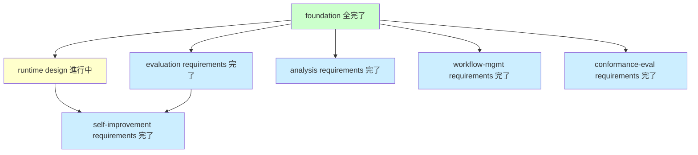

# ReviewCompass 再構築計画（戦略転換）

_作成日: 2026-05-21（セッション 14 末）_
_位置付け: ReviewCompass（外部リポジトリ <https://github.com/kenoogl/ReviewCompass>）として再構築するための計画書。素材リポジトリ（旧 dual-reviewer-rebuild、git 管理は外部の Rwiki-dev）の知見を抽出して移管する戦略転換を記録し、抽出計画・再構築方針・段階的スケジュールを示す_
_移管状態（2026-05-22、セッション 18 末）：本ファイルが ReviewCompass 側の活動版。今後の更新は本ファイルで行う。素材リポジトリ側の同名ファイルは移管時点のスナップショットとして凍結された_
_新リポジトリ URL: <https://github.com/kenoogl/ReviewCompass>（セッション 18 で空コミット 1 件のみ先行作成、本格的な配置はフェーズ 2 で実施）_

---

## 1. 戦略転換の経緯

セッション 14（2026-05-21）末で利用者が次の判断を下した：

- 現リポジトリ（`dual-reviewer-rebuild/` を含む）は何度も改変を重ねた結果、複雑になりすぎている
- 仕様とコードに自己適用前提が染み込んでおり、他のアプリへのデプロイには向かない構造
- 得られた仕様とノウハウを抽出して新リポジトリ（ReviewCompass）として再構築するほうが筋がよい

転換の根拠：

- 自己適用前提のシステムは他プロジェクトで再利用できない。デプロイ可能な形に作り直す必要がある
- 再構築でデプロイ可能なシステムを作れば、事例として参照可能・再現可能な成果物になる
- 複雑なリポジトリを抱えたまま機能を増やすより、白紙から設計し直すほうが結果的に早い

## 2. 再構築の基本方針

### 2.1 抽出と再構築の分離

- **現リポジトリ＝素材**として保全。変更は加えない（または最小限）
- **新リポジトリ ReviewCompass＝再構築物**として独立
- 両者を混ぜない

### 2.2 クリーンスレート（白紙）から始める

- 新リポジトリは空から作る
- コードや構造を機械的に移植するのではなく、抽出した知見を踏まえて設計し直す
- 自己適用前提の歪みを引き継がない

### 2.3 デプロイの強制設計

- ReviewCompass の最初の関門は **「自分自身をデプロイ可能な状態で動かす」** こと
- アプリ側に置く部分（仕様・レビュー記録）と、ツール側に置く部分（スキーマ・テンプレート・実行コード）の分離を最初から明示する
- 自己適用は可能だが、デプロイ前提の枠組みの上で行う

### 2.4 スタブ先行・段階的な機能載せ

- まずデプロイの枠組みをスタブ（最小限の実装）で作る
- スタブがエンドツーエンドで動くようになったら、それを土台に実機能を順次載せる
- いきなり全機能を作らない

### 2.5 相対リンクの徹底（設計時の注意）

- ReviewCompass の文書・コード・設定・スキーマで参照を書くときは **必ず相対リンク** を使う
- 絶対パス（`/Users/...`）、特定の作業ディレクトリ前提のパス、特定リポジトリ名を含むパスは禁止
- 理由：ReviewCompass は対象アプリの任意の場所にデプロイされる前提のため、配置先に依存しない参照が必要
- フェーズ 1〜4 の各段階で新規ファイルや既存ファイルへの参照を追加するときは、相対リンクであることを確認する
- 外部リポジトリへの参照が必要な場合は、明示的に「外部リポジトリ」と注記する（パス参照ではなくコミットハッシュや URL で記録）

## 3. 抽出計画

抽出対象を 5 カテゴリに分け、それぞれの抽出方針を定める。

### 3.1 対象機能の仕様（7 機能体制、self-improvement は workflow 層のみ）

対象：`dual-reviewer-rebuild/.kiro/specs/dual-reviewer-{foundation, runtime, evaluation, paper-interface, implementation-governance}/` ＋ self-improvement の workflow 層 ＋ conformance-evaluation（新規 7 番目機能）

ReviewCompass は 7 機能体制で構築する：

1. foundation
2. runtime
3. evaluation
4. analysis（旧 paper-interface）
5. workflow-management（旧 implementation-governance）
6. self-improvement（workflow 層のみ第 1 期、他 4 層スコープ外）
7. **conformance-evaluation**（新規、§5.10 で確定）：v3-plan.md の future feature を第 1 期から導入。実装コードから上流文書を推定生成し、既存上流文書との照合を行う逆方向機能

self-improvement の扱い：仕様 Requirement 2 で 5 層（prompt ／ policy ／ schema ／ runtime ／ workflow）の改善を扱うが、再構築では **workflow 層改善のみ第 1 期に含め、他 4 層はスコープ外** とする（§5.9.5 で確定）。

- **第 1 期に含める**：workflow 層改善（規律と実体の双方向同期、規律 archive 機構、遵守検査、効果測定 3 指標）
- **スコープ外**：prompt ／ policy ／ schema ／ runtime の 4 層改善（フェーズ 4 完了後の宿題）

理由：他 4 層改善は効果測定機構が未設計で重いが、workflow 層改善は本セッションで論点 7 として議論し効果測定を 3 指標で設計済み（規律遵守率／昇格件数／退避件数）。レビュー方法の規律と実体の乖離（本セッションで実体検証で発見）を放置すると、また手動 self-improvement を繰り返すことになるため、workflow 層は第 1 期に組み込む。

抽出する要素：

- `intent.md`（意図）
- `brief.md`（簡潔な概要）
- `requirements.md`（要件）
- `design.md`（設計）
- `tasks.md`（タスク）
- `spec.json`（承認状態）の構造のみ

抽出時のクリーニング規律：

- 自己適用前提の記述（「本対象システム」「dual-reviewer 自身」など）を取り除き、「対象アプリは外部にある」前提に書き換える
- ツール側に残すものとアプリ側に置くものを明示的に分ける
- implementation-governance は **workflow-management** という名称に統一する（本セッションで「ワークフロー管理」に改名）
- workflow-management の抽出時は §5.4 の軽量化方針に従い、現仕様の Requirement 9（実行台帳・節ハッシュ・独立再導出パーサ・supersedes・grandfathering）の大部分を削り、思想だけを継承する
- paper-interface は **analysis** に変更

### 3.2 正本文書（複数の場所に分散）

対象（実際の配置に従う）：

- **`dual-reviewer-rebuild/operations/`**：DATA_INVALIDATION_POLICY、DEPLOYMENT_MODEL、HUMAN_WORKFLOW、REVIEW_PROTOCOL、TRUST_BOUNDARY、WORKFLOW_OVERVIEW
- **`dual-reviewer-rebuild/docs/coordination/`**：workflow-repair-procedure（他の調整記録は実例として参考、必須抽出対象ではない）
- **`dual-reviewer-rebuild/` 直下**：CONVENTIONS、DOCUMENT_INDEX、EVIDENCE_PROTOCOL、MIGRATION_MANIFEST、SELF_IMPROVEMENT_LOOP、SYSTEM_BOUNDARY、REPRODUCIBILITY_CONTRACT、README

抽出方針：

- 規律と用語の定義はそのまま継承
- パス例などの自己適用前提を一般化（`dual-reviewer-rebuild/...` のような具体例を抽象化）
- リポジトリ直下に分散している正本文書は、ReviewCompass では `docs/operations/` に集約する。文書ごとの仕分け（運用文書か基盤文書かの判別など）はフェーズ 1 で作成する `docs/extraction-mapping.md` に記録する

### 3.3 規律ファイル（プロジェクトメモリ）

対象：`dual-reviewer-rebuild/.kiro/memory/`

- discipline_*.md（10 件程度）

抽出方針：

- 適用範囲を「アプリ開発支援ツールとしての規律」に書き換える
- 「3 役レビュー」「規律間の優先順位」など、本質的な規律はそのまま継承

### 3.4 本セッションで発見した課題（5 つ）

すべて再構築の初期設計に反映する：

- **3 軸統一**（重大度・対応優先度・深さ）：レビュー記録テンプレートで 3 軸を必須項目とする。詳細は `rework-classification-unification-plan-2026-05-21.md`
- **I-1 記号**：実装段からタスク段への差し戻し記号を最初から完全に導入する
- **名称変更（ReviewCompass）**：新リポジトリ名・ディレクトリ名・コード内の名称を一貫させる
- **アプリとツールの分離**：パス解決・スキーマ版整合・テンプレート配布・ワークフロー管理機能の対象範囲を明示的に設計する
- **アプリ側のディレクトリ規約**：アプリ側構造を `.reviewcompass/specs/` に確定済み（§4 参照）

### 3.5 テンプレートとプロンプト

対象：`dual-reviewer-rebuild/` 内の主役・敵対役・判定役のプロンプト雛形、レビュー記録テンプレート

抽出方針：

- 観点（criteria）構造に対応した雛形：要件 5・設計 10・タスク 7・実装適合 5（§5.9.2）。conformance-evaluation 用に 6 criteria 雛形（requirements 3・design 3、§5.10.2、2026-05-24 セッション 23 改訂で 2 軸 6 criteria に絞り込み、intent は参考情報、feature-partitioning と tasks は対象外）も別途準備
- 3 軸対応の新テンプレートとして書き直す（severity ／ judgment ／ depth、§5.9.3）
- レビュー記録テンプレートに front-matter スキーマを必須化（§5.9.3）：type／target／target_commit／target_content_hash／3 役のメタデータ／findings_by_method
- アプリ側に配置するもの（記入用）とツール側に配置するもの（プロンプト本体）を分ける

## 4. ReviewCompass リポジトリの初期構造案

新リポジトリ URL：<https://github.com/kenoogl/ReviewCompass>（セッション 18 で空コミットのみ先行作成。下記の構造に従った中身の配置はフェーズ 2 で実施）

対象 7 機能：`foundation` / `runtime` / `evaluation` / `analysis` / `workflow-management` / `self-improvement`（workflow 層のみ） / `conformance-evaluation`（新規、§5.10）。旧 `paper-interface` を `analysis` に、旧 `implementation-governance` を `workflow-management` に改名済み。

```
ReviewCompass/
├── README.md                          （プロジェクトの説明と使い方）
├── docs/
│   ├── design/                        （設計方針）
│   ├── operations/                    （正本文書、抽出元 operations/）
│   │   ├── REVIEW_PROTOCOL.md         （レビュー方法正本、§6 実装適合レビューを統合、§5.9）
│   │   └── metric-registers/          （メトリクス台帳、新表記対応、§5.9.5）
│   ├── disciplines/                   （規律ファイル、抽出元 memory/、status メタデータ付き）
│   ├── archive/
│   │   └── disciplines/<日付>/        （撤廃規律の退避先、撤廃 README 含む、§5.9.4）
│   └── discipline-compliance-reports/ （遵守検査結果の時系列保管、§5.9.5）
├── stub/                              （デプロイスタブ、Python 実装）
│   ├── path_resolver/                 （アプリパスの解決）
│   ├── spec_discovery/                （アプリ側仕様の発見）
│   └── reviewer_stub/                 （レビューのモック実装）
├── schemas/                           （foundation 由来の契約・スキーマ、§5.18）
│   ├── foundation/                    （4 段論理契約・メタデータ契約、§5.18.3／§5.18.7）
│   │   ├── layer1_framework.yaml      （4 段正式名称と 3 役抽象名の正本）
│   │   └── metadata_contract.yaml     （20 必須メタデータ項目と 4 状態軸の値リスト）
│   ├── domain/                        （5 共有スキーマ、§5.18.5）
│   │   ├── review_case.schema.json
│   │   ├── finding.schema.json
│   │   ├── impact_score.schema.json
│   │   ├── failure_observation.schema.json
│   │   └── necessity_judgment.schema.json
│   ├── validators/                    （2 検証スキーマ、§5.18.9）
│   │   ├── validator_result.schema.json
│   │   └── invalidation_marker.schema.json
│   └── review-criteria/               （レビュー種別ごとの検査仕様、§5.9.3）
│       ├── requirements_triad_review.yaml
│       ├── design_triad_review.yaml
│       ├── tasks_triad_review.yaml
│       └── implementation_conformance_review.yaml
├── templates/                         （レビューテンプレート、3 軸対応）
│   ├── prompts/                       （3 役プロンプト雛形、foundation 由来、§5.18）
│   │   ├── primary_detection/primary_reviewer.prompt.md
│   │   ├── adversarial_review/adversarial_reviewer.prompt.md
│   │   └── judgment/judgment_reviewer.prompt.md
│   └── config/                        （アプリ側設定雛形、foundation 由来、§5.18.15。アプリ展開後はツール既定 reviewcompass.yaml を上書きする位置付け）
│       ├── config.yaml.template
│       └── terminology.yaml.template
├── stages/                            （所定手続きごとの段集合 YAML、詳細は §5.5）
│   ├── intent.yaml                    （drafting／review／approval）
│   ├── feature-partitioning.yaml      （candidate-proposal／approval）
│   ├── feature-dependency.yaml        （機能一覧と依存関係、全フェーズが参照）
│   ├── requirements.yaml              （drafting／triad-review／review-wave／alignment／approval、詳細は §5.5）
│   ├── design.yaml                    （同上）
│   ├── tasks.yaml                     （同上）
│   ├── implementation.yaml            （同上）
│   ├── reopen-procedure.yaml          （第 1〜10 ステップ）
│   ├── cross-spec-alignment.yaml
│   ├── in-progress/                   （session 跨ぎ用、実行時ディレクトリ）
│   └── completed/                     （完了済み手続きの記録、実行時ディレクトリ）
└── reviewcompass.yaml                 （ツール本体の設定）
```

注：Python の慣習に合わせ、スタブ配下のディレクトリ名はハイフン区切りからアンダースコア区切りに改めた（パッケージとして読み込み可能にするため）。

対象アプリ側のディレクトリ規約（暫定）：

```
<app-repo>/
├── .reviewcompass/
│   ├── config.yaml                    （ReviewCompass 版数の指定）
│   └── specs/
│       └── <feature>/
│           ├── intent.md
│           ├── requirements.md
│           ├── design.md
│           ├── tasks.md
│           ├── spec.json
│           └── reviews/
└── src/
```

対象アプリ側のディレクトリ規約は **`.reviewcompass/specs/`** に確定（2026-05-21）。理由：ツール名と保管先を一致させることで、対象アプリのリポジトリで ReviewCompass が管理する範囲を視覚的に明確にする。既存の `.kiro/specs/` を併用するアプリは、フェーズ 3 で移行コマンドを提供する余地を残す（必須機能ではない）。

## 5. デプロイスタブの設計と完成条件

### 5.1 実装言語と実行形態

- **言語**：Python（理由：仕様文書の解析と大規模言語モデル呼び出しのライブラリが揃っており、後段の実機能まで言語を変えずに伸ばせる）
- **実行形態**：独立したコマンドライン道具（`reviewcompass <subcommand>` の形で対象アプリのリポジトリから呼び出す）
- **理由**：§2.3 の「デプロイ可能な独立成果物」を最も素直に満たし、Claude Code との統合は将来このコマンドライン道具を呼ぶ薄い層（Skill または MCP サーバー：Model Context Protocol サーバー＝外部ツール接続規格）を後から重ねれば済む

### 5.2 スタブが満たすべき条件（設計レベル）

次に実機能開発へ進めるための完成基準を設計レベルで示す。コマンドレベルの検証手順は §7 フェーズ 3 の完了条件を参照。

- **パス認識**：ReviewCompass が「対象アプリのルート」をコマンドライン引数または設定ファイルで受け取り、そのアプリの仕様ディレクトリを発見できる
- **仕様読み込み**：アプリ側の requirements.md を読み込み、内容を構造化できる（簡単な解析でよい）
- **スタブレビュー**：実際のレビューは行わない（モック）が、アプリ側 reviews/ ディレクトリに「スタブレビュー記録」を書き出す
- **エンドツーエンド動作**：上記が連続で動き、アプリ開発者が「ReviewCompass を呼んだら何かが起きた」と確認できる
- **承認関門のモック**：人間承認をシミュレートする入力を受け付け、spec.json の状態を更新する

### 5.3 スタブの上に載せる実機能の順序

スタブが動くようになったら、次の順で実機能を載せる。実機能は「レビュー機能」と「ワークフロー管理機能」の 2 群に分ける。

**レビュー機能**（3 役レビューの中身、各フェーズの「レビュー波」段で動く。詳細は §5.9）：

1. 主役レビューの実装（プロンプト＋大規模言語モデル呼び出し）
2. 敵対役レビューの実装
3. 判定役レビューの実装

**ワークフロー管理機能**（§5.4〜§5.8、レビュー機能の上位構造）：

4. 段集合 YAML と検査スクリプト（§5.4・§5.5）。各フェーズの整合ゲート段や実装フェーズの適合レビュー段は、この段集合 YAML に含まれる
5. reopen の trigger_map による機械強制（§5.6）
6. session 跨ぎ用の in-progress 機構（§5.7）
7. workflow 層 self-improvement の最小実装（§5.9.5）

**conformance-evaluation 機能**（§5.10、7 番目の独立機能）：

8. conformance-evaluation の本格実装（実装コードから上流文書を推定生成、既存上流文書との照合チェック）。3 役レビュー機構を流用、6 criteria 構造

レビュー方法の再設計（3 役・観点・所見メタデータ・3 方式比較・API 障害対応など）の詳細は §5.9 を参照。

self-improvement の他 4 層（prompt ／ policy ／ schema ／ runtime）は **当初は外す**。基本機能が動いた後、別フェーズで効果測定機構を含めて新規設計する。

### 5.4 ワークフロー管理の軽量化方針（2026-05-21 確定）

現リポジトリのワークフロー管理（旧 `implementation-governance`、§3.1 で `workflow-management` に改名済み）は、節ハッシュ・独立再導出パーサ・通過マーカーの後続確認・supersedes リンク・移行戦略などを含む大規模な機構として組み上がっている。再構築では **思想は継承、実装は 1／10** を目標とする。

継承する思想：

- 不可逆操作の直前にしか機械ゲートを置かない（fail-closed の最小集合）
- 証跡 artifact の存在＋構造適合で完了を判定する（主張ではなく証拠）
- 起草者と判定者を分ける（自己承認の禁止）
- 検査が結論不能なら遮断（fail-closed の既定）

削る実装：

- 節ハッシュ（`section_content_hash`）と陳腐化／改竄検知
- supersedes リンクによる旧台帳保全
- grandfathering と format-migration の機構
- 権威マップ（独立文書）と独立再導出パーサ
- 通過マーカーの後続確認（二次防御）

採用する実装：

- 各所定手続きの段集合を YAML（構造化テキスト形式）に静的列挙する（例：`stages/<process_id>.yaml`）。Markdown 節からの動的パースはしない
- 各段に「期待する証跡ファイルのパスと、含むべき節名のリスト」を書く
- 検査スクリプト（Python 実装）は「YAML に列挙された証跡ファイルがすべて存在し、必須節名がすべて含まれるか」だけを判定する
- 検査が落ちたら fail（pass にしない）
- 起草者と判定者の分離は、レビュー記録の冒頭メタデータ（front-matter）に `author` と `reviewer` の異名を必須化することで担保

受け入れるリスク（明文化）：

- 段集合の正本が YAML に固定されるため、Markdown 文書側で段集合が変わった場合に YAML との整合は人手で取る必要がある
- 検査スクリプト自体が呼ばれない経路を機械検知しない（人間がフェーズの境目で確認する前提）
- 多人数開発に拡張する段階で、上記「削る実装」のいずれかを再導入する余地を残す

**dogfooding 期間中の追加緩和**（2026-05-27 セッション 34 確定）：

本節の軽量化方針に加え、ReviewCompass 自身の dogfooding 期間中はさらに軽量な手続き（軽量再オープン等）を許容する。詳細と限界は §5.23.13 を参照。

### 5.5 所定手続きの階層構造（2026-05-21 確定、2026-05-24 改定：requirements 以降を 5 段化＋triad-review 採用）

現リポジトリの `workflow-process-authority-map.md` は 17 件の所定手続きを 2 階層に分けるが、17 件中 16 件が「未適合」または「未確立」の状態。加えて、intent と requirements の間にあるべき「機能分離（アプリ全体を機能に分割する判断と承認）」段が現状の正本に存在しないという穴も発見された（2026-05-21 のセッション 16 で確認）。再構築では次を行う。

- intent フェーズの縮退（機能横断は概念として成立しないため）
- 機能分離手続きの新設（intent と requirements の間）
- 機能依存マップの YAML 化（台帳機構の対象に含める）
- 実装フェーズの波と整合ゲートの整備（現状「未確立」を解消）
- フェーズ単位 1 ファイル方式での形式統一

階層構造（段名は YAML キー＝英語、和訳は対応関係を併記）：

- **intent 層手続き（intent と requirements の間に位置）**
  - intent.yaml
    - `drafting`（起草、actor=human）
    - `review`（レビュー、actor=llm、単発・波なし）
    - `approval`（承認 gate、actor=human）
  - feature-partitioning.yaml
    - `candidate-proposal`（LLM 候補提示、actor=llm、新設）
    - `approval`（人間承認、actor=human、新設）
- **フェーズ別手続き（requirements 以降の 4 フェーズ）**
  - requirements.yaml／design.yaml／tasks.yaml／implementation.yaml の各フェーズ：5 段ずつ（責務分離による 5 段化、2026-05-23 利用者明示承認、2026-05-24 改名により triad-review として確定）
    - `drafting`（草案、最初の文書または成果物の生成、actor=llm または human）
    - `triad-review`（機能内 3 役レビュー＝主役・敵対役・判定役、actor=llm。手動 dogfooding またはサブエージェント方式で実施）
    - `review-wave`（レビュー波、複数機能を横断する複数ラウンドレビュー、actor=llm）

      **本段の作業内容（2026-05-27 セッション 34 追記、(ニ) 同根問題集約の構造化）**：
      - 全機能の triad-review 段が完了した時点で本段を開始する
      - 7 モデル比較実験（§5.9.6 ／ §5.9.7.1）は **2 回方式** で実施する（2026-05-28 セッション 35 改訂、初版の「機能横断段で一括実施、機能ごとに実施しない」記述を訂正）：
        - **1 回目（機能ごとの triad-review 段）**：当該機能の機能内 must-fix／should-fix を 7 モデル評価し、機能内対処を triad-review 段で完了させる。他機能の triad-review が前機能の機能内対処未完了に依存しない構造を保つため、機能内対処は機能ごとに確定する
        - **2 回目（本機能横断段 review-wave）**：全機能の triad-review 完了後、機能横断波及所見と同根問題を 7 モデル評価
      - 7 モデル評価データを全機能横並びで分析し、**同根所見**（異なる機能で同じ性格の所見が独立に発見された組）を grep ／ 集約で識別
      - 同根所見ごとに一貫した対処方針を立案、全該当機能の仕様文書（requirements.md ／ design.md ／ tasks.md）に同じ対処を反映
      - 個別機能の triad-review で「機能横断段に持ち越し」と判定された所見も本段で一括対処
      - 本作業内容は、セッション 33 利用者発言「あるフィーチャーだけをみてもダメで、全フィーチャーの triad-review を行い、それを 7 つのモデルで評価させたところで、同根の問題をまとめて考える」を受けた構造的対処。利用者明示承認「(ニ)」「提案通り」（2026-05-27 セッション 34）／「2 回に分けて 7 モデルの must-fix+should-fix の対応が必要であることがわかるだろう」「案 イ」「案 ア」（2 回方式への改訂、2026-05-28 セッション 35）

    - `alignment`（整合判定、フェーズ終端の機能横断整合確認、actor=llm、自動判定）
    - `approval`（承認、actor=human または proxy_model、§5.12 人間代役機構を参照）
- **ワークフロー全体レベル手続き**
  - reopen-procedure.yaml（reopen 手続き、第 1〜10 ステップ）
  - cross-spec-alignment.yaml（機能横断整合、段集合は別途確定）

intent 層の設計補足：

- intent 文書の起草は人間担当（LLM は起草しない）。intent.yaml には actor=human の段として記載し、ファイル存在のみを検査対象とする
- intent レビューは LLM 担当で、actor=llm。証跡＋必須節充足を検査
- intent 文書の承認 gate は人間担当・別段。LLM レビューが承認 gate を兼ねない（自走防止）
- 機能横断レビュー波および機能横断整合ゲートは intent には設けない（機能に分かれていないため）

機能分離手続きの設計：

- 入力：承認済み intent 文書
- 作業：機能候補の抽出、責務境界の整理、機能依存関係の初版作成
- 成果物：機能一覧と機能依存マップ（`stages/feature-dependency.yaml`）
- LLM 担当：候補提示と整理（依存関係や責務重なりの検出）
- 人間担当：最終決定と承認
- 完了条件：feature-dependency.yaml が存在し、必須節（features 一覧／depends_on／phase_order）を含むこと

機能間処理順の取り込み（選択肢 X：独立 YAML 参照方式）：

- `stages/feature-dependency.yaml` に機能間処理順を一元化する。各フェーズの YAML はこのファイルを参照する（重複させない）
- feature-dependency.yaml の構造例：

  ```yaml
  features:
    foundation:
      depends_on: []
    runtime:
      depends_on: [foundation]
    evaluation:
      depends_on: [foundation, runtime]
    analysis:
      depends_on: [foundation, evaluation]
    workflow-management:
      depends_on: [foundation, runtime, evaluation, analysis]
    conformance-evaluation:
      depends_on:
        foundation: hard
        runtime: review
        evaluation: review
        workflow-management: review
  phase_order:
    - foundation
    - runtime
    - evaluation
    - analysis
    - workflow-management
    - conformance-evaluation
  ```

- requirements.yaml／design.yaml／tasks.yaml／implementation.yaml の草案段とレビュー波段は `feature_order: <feature-dependency.yaml#phase_order>` のような参照を持つ
- 機能の追加・削除や依存関係の変更は feature-dependency.yaml 1 か所のみ修正

実装フェーズの再構築：

- 現リポジトリでは `implementation-review-wave` と `implementation-alignment-gate` が「未確立」のまま。再構築で他フェーズと同形の 5 種類（drafting／triad-review／review-wave／alignment／approval）を整備する
- 整合ゲートは複数機能を実装した段階で発火する。スタブ段階（1 機能のみ）では空段として定義のみ

ファイル配置（フェーズ単位 1 ファイル方式）：

```
stages/
├── intent.yaml                  （drafting／review／approval の 3 段）
├── feature-partitioning.yaml    （candidate-proposal／approval の 2 段、新設）
├── feature-dependency.yaml      （機能一覧と依存関係、機能分離の成果物・全フェーズが参照）
├── requirements.yaml            （drafting／triad-review／review-wave／alignment／approval の 5 段、feature-dependency を参照）
├── design.yaml                  （同上）
├── tasks.yaml                   （同上）
├── implementation.yaml          （同上）
├── reopen-procedure.yaml        （第 1〜10 ステップ）
├── cross-spec-alignment.yaml    （段集合は別途確定）
├── in-progress/                 （session 跨ぎ用、現在進行中の手続き状態ファイルを置く）
└── completed/                   （完了済み手続きの記録、選択肢 P）
```

合計 9 ファイル（in-progress／completed は実行時ディレクトリ）。

各段のフィールド：

- 段名
- `actor`（`human` ／ `llm` ／ `proxy_model`。`proxy_model` は §5.12 人間代役機構の代行モデルを指す）
- 期待する証跡ファイルのパスパターン
- 必須節名のリスト
- 完了判定（actor=llm は「証跡＋必須節充足」、actor=human は「ファイル存在」）
- 機能横断段の場合は `feature_order: <feature-dependency.yaml#phase_order>` を参照

機能単位 spec.json との対応（2026-05-24 追加）：

- 機能単位 spec.json の `workflow_state` は本節で定めた段集合と同じ構造を保持する
- requirements 以降の 4 フェーズは 5 段（drafting／triad-review／review-wave／alignment／approval）
- intent は 3 段（drafting／review／approval）、feature-partitioning は 2 段（candidate-proposal／approval）。これらは機能横断段のため全機能で同じ値を持ち、`reference` フィールドで artifact へのリンクを併記する
- 正本スキーマは §5.24 を参照

### 5.6 reopen 手続きの機械強制（2026-05-21 確定、2026-05-24 改定：trigger_map の alignment-gate を alignment ＋ approval に分割）

reopen 手続きの第 7 ステップ「該当ゲートの再実施」を機械強制対象に含める。手戻り種別から再実施対象を機械的に決定するため、`stages/reopen-procedure.yaml` の第 7 段に `trigger_map` を持たせる。

手戻り種別の表記：

- セッション 14 で確定した新表記「起点フェーズの記号 N／R／D／A／I ＋ 深さの数字 0〜4」を使用
  - N = intent、R = requirements、D = design、A = tasks、I = implementation
  - 旧表記 A／B／C／D は I-0／I-2／I-3／I-4 に対応、旧表記で欠落していた I-1 を含めた完全二次元表記

機能分離の表記上の扱い（案 Y）：

- 機能分離は intent 層の一部とみなし、フェーズ記号は N／R／D／A／I の 5 種のまま維持
- N まで戻る場合は、intent 文書と機能分離（feature-partitioning）の両方を再実施対象に含める

連鎖再実施の対象範囲（起点を含める方針）：

- 連鎖は「根本原因フェーズの整合ゲート」から「起点フェーズの整合ゲート」まで、上流から下流へ順に並べる
- 起点フェーズの整合ゲートまで再実施することで、上流変更が下流に正しく伝播したか機械判定できる
- 連鎖の長さ 1 の特殊例（X-0）は「起点フェーズのゲートのみ再実施」として統一的に表現

actor=human の段の扱い（方針 α）：

- trigger_map には actor=llm の段だけでなく actor=human の段（intent.yaml#approval、feature-partitioning.yaml#approval など）も含める
- LLM が trigger_map に沿って連鎖を進めるとき、actor=human の段に来たら作業を止め、in-progress ファイルに「人間承認待ち」を記録して待機
- 人間が承認するまで次の段に進めない（fail-closed）。これにより「LLM が intent を勝手に書き換えて承認なしで進む」リスクを構造的に止める

trigger_map の構造例：

```yaml
- name: 該当ゲートの再実施
  actor: llm／human／proxy_model（段により異なる。alignment は llm、approval は human または proxy_model）
  trigger_map:
    # I 起点（実装段で検出）
    I-0:
      - stages/implementation.yaml#alignment
      - stages/implementation.yaml#approval
    I-1:
      - stages/tasks.yaml#alignment
      - stages/tasks.yaml#approval
      - stages/implementation.yaml#alignment
      - stages/implementation.yaml#approval
    I-2:
      - stages/design.yaml#alignment
      - stages/design.yaml#approval
      - stages/tasks.yaml#alignment
      - stages/tasks.yaml#approval
      - stages/implementation.yaml#alignment
      - stages/implementation.yaml#approval
    I-3:
      - stages/requirements.yaml#alignment
      - stages/requirements.yaml#approval
      - stages/design.yaml#alignment
      - stages/design.yaml#approval
      - stages/tasks.yaml#alignment
      - stages/tasks.yaml#approval
      - stages/implementation.yaml#alignment
      - stages/implementation.yaml#approval
    I-4:
      - stages/intent.yaml#review
      - stages/intent.yaml#approval
      - stages/feature-partitioning.yaml#candidate-proposal
      - stages/feature-partitioning.yaml#approval
      - stages/requirements.yaml#alignment
      - stages/requirements.yaml#approval
      - stages/design.yaml#alignment
      - stages/design.yaml#approval
      - stages/tasks.yaml#alignment
      - stages/tasks.yaml#approval
      - stages/implementation.yaml#alignment
      - stages/implementation.yaml#approval

    # A 起点（タスク段で検出）
    A-0:
      - stages/tasks.yaml#alignment
      - stages/tasks.yaml#approval
    A-1:
      - stages/design.yaml#alignment
      - stages/design.yaml#approval
      - stages/tasks.yaml#alignment
      - stages/tasks.yaml#approval
    A-2:
      - stages/requirements.yaml#alignment
      - stages/requirements.yaml#approval
      - stages/design.yaml#alignment
      - stages/design.yaml#approval
      - stages/tasks.yaml#alignment
      - stages/tasks.yaml#approval
    A-3:
      - stages/intent.yaml#review
      - stages/intent.yaml#approval
      - stages/feature-partitioning.yaml#candidate-proposal
      - stages/feature-partitioning.yaml#approval
      - stages/requirements.yaml#alignment
      - stages/requirements.yaml#approval
      - stages/design.yaml#alignment
      - stages/design.yaml#approval
      - stages/tasks.yaml#alignment
      - stages/tasks.yaml#approval

    # D 起点（設計段で検出）
    D-0:
      - stages/design.yaml#alignment
      - stages/design.yaml#approval
    D-1:
      - stages/requirements.yaml#alignment
      - stages/requirements.yaml#approval
      - stages/design.yaml#alignment
      - stages/design.yaml#approval
    D-2:
      - stages/intent.yaml#review
      - stages/intent.yaml#approval
      - stages/feature-partitioning.yaml#candidate-proposal
      - stages/feature-partitioning.yaml#approval
      - stages/requirements.yaml#alignment
      - stages/requirements.yaml#approval
      - stages/design.yaml#alignment
      - stages/design.yaml#approval

    # R 起点（要件段で検出）
    R-0:
      - stages/requirements.yaml#alignment
      - stages/requirements.yaml#approval
    R-1:
      - stages/intent.yaml#review
      - stages/intent.yaml#approval
      - stages/feature-partitioning.yaml#candidate-proposal
      - stages/feature-partitioning.yaml#approval
      - stages/requirements.yaml#alignment
      - stages/requirements.yaml#approval

    # N 起点（intent 段で検出）
    N-0:
      - stages/intent.yaml#review
      - stages/intent.yaml#approval
      - stages/feature-partitioning.yaml#candidate-proposal
      - stages/feature-partitioning.yaml#approval
```

種別判定の証跡：

- reopen の第 6 ステップ「証跡を残す」の中で、種別判定の根拠を `docs/reviews/reopen-classification-<日付>.md` として残す
- 第 7 ステップで、その判定ファイルを読み込んで trigger_map から再実施対象を決定
- 種別判定が後で誤りと分かったら、reopen 自体をやり直す（in-progress ファイルを新しいものに置き換え、旧ファイルは削除せず証跡として保全）

**トライアル期間中の軽量再オープン**（2026-05-27 セッション 34 確定）：

ReviewCompass 自身の dogfooding 期間中は、本節の正規 10 ステップ手続きの一部を軽く省略する「軽量再オープン」の運用を §5.23.13 で許容している。本節と §5.23.13 の関係は、§5.23.13 が dogfooding 期間中の一時的緩和を扱い、本節は正規実装の正本であるという棲み分けである。

### 5.7 session 跨ぎ時の状態管理（選択肢 P：2026-05-21 確定、2026-05-24 改定：例示 YAML の pending_gates を alignment ＋ approval に分割）

長期にわたる実行では session-cont（セッション継続）で session を跨ぐ。軽量版 YAML 検査は状態ベース（証跡ファイルの存在＋必須節充足のみ）なので、各 session で同じ検査を走らせれば結論は変わらず、session 跨ぎ自体に専用機構は不要。

ただし「複数段にまたがる手続きの途中状態」（典型例は reopen で第 6 ステップまで完了し第 7 ステップが未着手の場合）は状態ベース検査の盲点。これを次の方法で扱う。

途中状態の明示ファイル：

- 現在進行中の手続きは `stages/in-progress/<process_id>-<日付>.yaml` を置く
- 構造例：

  ```yaml
  process_id: reopen-procedure
  started_at: 2026-05-21T10:00:00Z
  trigger: 設計矛盾の発見（C 手戻り）
  completed_steps: [1, 2, 3, 4, 5, 6]
  next_step: 7
  pending_gates:
    - stages/requirements.yaml#alignment
    - stages/requirements.yaml#approval
    - stages/design.yaml#alignment
    - stages/design.yaml#approval
    - stages/tasks.yaml#alignment
    - stages/tasks.yaml#approval
  ```

- 手続きが完了したら、ファイルを `stages/completed/` に移動するか削除する

検査スクリプトの拡張：

- `stages/in-progress/` に何かファイルがあれば「未完了の手続きあり、優先処理せよ」と警告を出す
- 警告がある状態で不可逆操作を実行しようとしたら遮断（fail-closed）

session 開始時の標準フロー：

1. TODO_NEXT_SESSION.md と git log で全体の到達点を把握
2. 検査スクリプトを `stages/*.yaml` 全件に走らせる
3. `stages/in-progress/` の有無を確認
4. 進行中手続きがあれば、それを優先的に完了させる
5. 完了済み・未着手の状態に基づき、次の作業を決定

対象となる手続き：

- reopen（10 ステップに分かれる）
- 機能分離（LLM 候補提示と人間承認の間で session が切れる可能性）
- 各フェーズのレビュー波（複数ラウンドの途中で session が切れる可能性）
- 機能横断整合（複数機能を順に確認する途中で session が切れる可能性）

### 5.8 多層防御の必要性と段階的導入（2026-05-21 確定）

§5.4〜§5.7 で確定した軽量版 YAML 検査機構は、LLM がワークフローを正しく実行しないという根本問題に対する **第 1 層の防御** に位置づける。この機構は必要だが十分ではない。100% の規律遵守は原理的に不可能であり、複数の層を重ねることで実効的な遵守率を引き上げる。

#### 第 1 層の限界（明文化）

軽量版 YAML 検査機構が解決しない失敗モード：

- **中身の空疎**：必須節（Findings、Disposition 等）の存在は検査するが、内容の妥当性は検査しない。「特に問題なし」とだけ書いて通すことが可能
- **検査スクリプトの呼び出し依存**：LLM が検査を呼ばない、結果を読まない、独断で進めるという経路は機構の上にある
- **in-progress ファイルの自己申告性**：「いま reopen 中」「次は第 7 ステップ」を書くのは LLM 自身。嘘・古い・欠落の余地が残る
- **事前コンテキストへの引きずられ**：LLM が文脈圧力下で規律ファイルの優先度を下げる現象は、規律ファイルを増やすほど悪化しうる

#### 第 2〜5 層（フェーズ 4 以降の宿題）

スタブが動き、基本機能（7 機能のうち 1〜2 機能）が動くようになった後、次の層を順次導入する。

- **第 2 層：git フックによる外部強制**
  - 検査スクリプトを git の commit／push フックに組み込み、LLM が「呼ばない」選択をできなくする
  - 検査が落ちたら commit 自体が成立しない
  - 適用範囲は git 経由の不可逆操作に限定（spec.json 更新等の非 git 経路には別途配慮）

- **第 3 層：フェーズ境目の利用者監査**
  - フェーズの境目（要件 → 設計、設計 → タスク等）で、利用者が検査結果を必ず確認する手続きを必須化
  - LLM が承認に進む前に、利用者が「検査結果は本当に正しいか」「中身が空疎でないか」を毎回確認
  - 利用者の負担と自走性のトレードオフを明示

- **第 4 層：定期事後監査**
  - 一定 session 数または一定期間ごとに、過去の証跡全件を独立した LLM で監査
  - 第 1〜3 層が見逃した中身の空疎・累積した drift（積み重なったずれ）を検出
  - 監査自体も LLM が行うため絶対ではないが、独立視点が入ることで検知率が上がる

- **第 5 層：処理表面積の抑制方針**
  - 手続き・規律・記号体系を増やさない方針を運用ルールとして明示
  - 「新規規律を追加するときは既存規律 1 つ以上を統廃合する」等の縮減義務を併設
  - 複雑性の累積を構造的に防ぐ

#### 補助層（本セッション後半で追加、§5.12・§5.13、2026-05-25 セッション 24 で補助層 C 追加）

第 1 層と第 2 層の間に、人間関与の頻度・即時性を調整し、処理開始時の逸脱予防を担う補助層を追加：

- **補助層 A：人間代役機構（§5.12）**
  - 軽い判断を外部モデルが代行、本人関与の頻度を下げる
  - マルチターン対話で文脈を踏まえた判断
  - 不可逆操作・承認系・CRITICAL／ERROR は代行不可、本人エスカレーション
- **補助層 B：人間への通知機構（§5.13）**
  - 本人判断が必要な場面（代役からのエスカレーション、ゲート承認待ち、致命的エラー、タイムアウト）で外部チャネル（メール・LINE 等）に即時通知
  - 利用者が気づかず処理が止まる事態を防ぐ
- **補助層 C：処理開始時のワークフロー事前検査（共存モデル、2026-05-25 セッション 24 採用承認）**
  - 処理が呼ばれる時点で、その処理が現在のワークフロー手順に適合するかを事前検査し、適合しなければ遮断または警告する
  - 3 段階の役割分担として共存させる最終形態（時間軸の段階的導入計画ではない）：
    - **段階 1（LLM 規律、恒久層）**：これから何をするかを応答内で明示、段階 2 を呼び、出力を解釈して次の行動を決める。段階 3 が効かない領域（応答テキストのみの判断）を恒久的に担う
    - **段階 2（外部スクリプト）**：spec.json／git／規律ファイル／持ち越し所見を読み、引数の処理が現状で適切かを判定して返す
    - **段階 3（Claude Code フック機構）**：ツール呼び出し（Edit／Write／Bash 等）の前に段階 2 を自動で走らせ、逸脱なら遮断（fail-closed）
  - 段階間のインターフェース：段階 1 と段階 3 の両方が段階 2 を呼び得る。段階 1 は能動的・宣言的、段階 3 は受動的・自動的。段階 2 は副作用なしの判定のみ
  - 段階 2／3 の実装はフェーズ 2 以降の宿題、段階 1 の規律化は段階 2 の仕様確定後
  - 詳細・議論経緯・コスト見積もり：`docs/notes/2026-05-25-workflow-pre-check-and-discipline-consolidation.md`
  - 採用承認の出典：「共存モデルの採用」「A から順に進める」（2026-05-25 セッション 24）

補助層 A／B／C は第 1 層と第 2 層の中間に位置し、本人関与の調整と逸脱予防の層として動く。補助層 A・B は相補的（代役で頻度を下げ、通知で即時性を確保）、補助層 C は処理開始時の事前検査で規律遵守を構造的に強化する。

#### 受け入れる残余リスク

第 1〜5 層を重ねても、次の残余リスクは残る。これは明示的に受け入れる。

- 中身の空疎を最終的に検知するのは利用者と独立 LLM の判断であり、両方が見落とす可能性は 0 にならない
- 第 2 層の git フックは git 経由の経路にしか効かない。git を介さない操作は別系で守る必要がある
- 第 4 層の事後監査は「事後」であり、検出されたときには既に何 session か進行している
- 長期実行（数十 session 以上）では累積失敗確率が上昇し続けるため、定期的なリセット（state の作り直し）も選択肢に入る

#### 計画書上の位置付け

本節は再構築計画の **限界の正直な記録** として残す。第 2〜5 層の具体設計はフェーズ 4 以降の宿題とし、本計画書では設計を確定しない。フェーズ 4 開始時に本節を読み返し、当時の知見でアップデートする。

### 5.9 レビュー方法の再設計（2026-05-21 確定）

本節は本セッションで議論したレビュー方法（3 役レビュー、観点構造、所見メタデータ、機械検査、形骸化規律の取り下げ、workflow 層 self-improvement、3 方式比較データ、API 障害対応、コスト最適化、段階的導入順序）の確定事項を一括記載する。論点 1〜9 と派生する追加事項を 9 つの小節に整理。

#### 5.9.1 基本構造（3 役 ＋ モデル能力配分 ＋ ファイル遮断）

- **3 役レビュー（TriadReview）の維持**：主役（primary）・敵対役（adversarial）・判定役（judgment）の役割分担を継承。β 逐次方式（主役 → 敵対役 → 判定役の直列）、各役は独立 session、メイン LLM は 3 役のいずれにもならない
- **3 役の抽象名の正本所有者は foundation**：人間可読の和訳「主役／敵対役／判定役」と機械可読の正本「primary_reviewer／adversarial_reviewer／judgment_reviewer」を区別。抽象名の正本は foundation の `schemas/foundation/layer1_framework.yaml` が所有し、他機能は再定義せず参照のみ（詳細は §5.18.4）
- **モデル能力配分を規律として明文化**：敵対役と判定役には反証生成と責務境界判断を担う十分な能力のモデルを割り当てる。**主役と敵対役は必ず異なるモデルを使う**（敵対役の独立性確保のため）。判定役は主役または敵対役と同じモデルを使うことを許容する。本規律は 2026-05-25 セッション 25 の foundation／design triad-review 実験により制定（モデル多様化単独ではバイアス低減効果が限定的で、能力配分の方が重要と判明したため。旧規律「同モデル使用は禁止」は撤回、実験記録 [docs/notes/2026-05-25-triad-review-model-allocation-experiment.md](../notes/2026-05-25-triad-review-model-allocation-experiment.md) 由来）。「十分な能力」の具体基準は、今後の triad-review 実施を通じて経過観察し、必要に応じて改訂する
- **ファイルアクセス遮断を規律として明文化**：各役はファイルアクセスを技術的に遮断
- **呼び出し経路の完全並列**：
  - Claude CLI 経路（既存方式）：`claude --print --disallowedTools "Read,Write,Edit"` で遮断
  - API 経路（新規）：プロバイダー抽象層として設計、初期実装は Anthropic API のみ、後から他プロバイダー追加可能
- **役ごとに経路とモデルを独立指定**：`reviewcompass.yaml` で各役の provider と model を指定
- **推奨既定**：v2-acquisition-design.md §2.1 の決定（主役 Opus ／ 敵対役 Sonnet ／ 判定役 Opus）を既定。利用者が yaml で変更可能
- **API 経路でのファイル遮断**：ツール権限を与えず、対象文書はプロンプトに埋め込む
- **API キー管理**：環境変数のみ（reviewcompass.yaml には書かない）
- **レスポンス形式の統一**：所見フォーマットを YAML schema で統一、パース失敗は fail-closed

設定例：

```yaml
# reviewcompass.yaml
review:
  default_assignment:
    primary:
      provider: claude-cli
      model: claude-opus-4-7
      temperature: 0
    adversarial:
      provider: claude-cli
      model: claude-sonnet-4-6
      temperature: 0
    judgment:
      provider: claude-cli
      model: claude-opus-4-7
      temperature: 0
```

#### 5.9.2 観点（criteria）と重大度の統一

- **観点の語**：「criterion（単数）／criteria（複数）」に統一。「ラウンド」は廃止
- **全フェーズで「Criterion N」見出し方式**：要件 5 ／ 設計 10 ／ タスク 7 ／ 実装適合 5、合計 27 criteria
- **各 criterion のサブ構造**：要点／詳細抽出／深掘り／該当なし
- **実装適合レビューを REVIEW_PROTOCOL.md §6 に統合**：これまで implementation-governance 側に切り出されていたものを体系統合
- **1 criterion ＝ 1 応答単位**：規律 `discipline_no_criteria_batching.md` を維持
- **重大度語彙の統一**：CRITICAL ／ ERROR ／ WARN ／ INFO の 4 段に全フェーズ統一
  - タスク「致命」→ CRITICAL、「重要」→ ERROR、「軽微」→ WARN
  - 実装適合 P1 → CRITICAL、P2 → ERROR、P3 → WARN
  - INFO はタスクと実装適合でも使えるよう拡張
- **重み**：CRITICAL=4 ／ ERROR=3 ／ WARN=2 ／ INFO=1（全フェーズ共通）

#### 5.9.3 所見メタデータの必須化と機械検査

各所見が次の 3 軸を必須項目として持つ。

- severity（重大度軸）：CRITICAL ／ ERROR ／ WARN ／ INFO
- judgment（対応優先度軸）：must-fix ／ should-fix ／ leave-as-is（判定役のみ）
- depth（深さ軸）：N／R／D／A／I × 0〜4（reopen 時のみ）

所見項目名は実体に合わせる：severity ／ target_location ／ description ／ rationale。「修正後」項目は必須から外す。

レビュー記録に front-matter を必須化：

```yaml
---
type: requirements_triad_review
target: foundation/requirements.md
target_commit: ab0d4006
target_content_hash: <sha256>
date: 2026-05-13
primary:
  provider: claude-cli
  model: claude-opus-4-7
  model_full_id: claude-opus-4-7-20260201   # 完全版識別子（日付付き）
  temperature: 0
  attempts: 1
  total_tokens: 12450
  cost_usd: 0.15
  duration_seconds: 42
  prompt_artifact_path: runtime/prompts/primary/primary_reviewer.prompt.md
  prompt_artifact_hash: sha256:abc123       # プロンプト本体のハッシュ
adversarial:
  provider: claude-cli
  model: claude-sonnet-4-6
  model_full_id: claude-sonnet-4-6-20260115
  temperature: 0
  prompt_artifact_path: runtime/prompts/adversarial/adversarial_reviewer.prompt.md
  prompt_artifact_hash: sha256:def456
judgment:
  provider: claude-cli
  model: claude-opus-4-7
  model_full_id: claude-opus-4-7-20260201
  temperature: 0
  prompt_artifact_path: runtime/prompts/judgment/judgment_reviewer.prompt.md
  prompt_artifact_hash: sha256:abc123
findings_by_method:
  primary:
    by_severity: { CRITICAL: 2, ERROR: 6, WARN: 3, INFO: 0 }
    count: 11
  adversarial:
    by_severity: { CRITICAL: 4, ERROR: 8, WARN: 5, INFO: 2 }
    count: 19
  judgment:
    by_severity: { CRITICAL: 3, ERROR: 6, WARN: 4, INFO: 1 }
    count: 14
    judgment_distribution: { must-fix: 6, should-fix: 8, leave-as-is: 5 }
---
```

3 層の機械検査：

- **第 1 層：front-matter 構造検査**：必須フィールド存在、3 役モデル能力配分（主役と敵対役が異なるモデルであること、判定役の能力配分要件、§5.9.1 改訂後規律）、集計整合、モデル特定情報の必須化（model_full_id・prompt_artifact_hash）
- **第 2 層：必須節存在検査**：レビュー種別ごとの schema を `schemas/review-criteria/<種別>.yaml` に保管
- **第 3 層：軽量中身検査**：説明 30 文字以上、根拠 100 文字以上、判断根拠 50 文字以上、対象箇所の具体性（ファイル名＋節番号／行番号／AC 番号）、コピペ防止、「該当なし」明示、evidence_type 検査（後述）

#### モデル特定情報（再現性確保）

レビューの再現性を担保するため、各役のメタデータに次の 2 項目を最低限必須化する：

- **model_full_id**：完全版識別子（日付スタンプ付き）。エイリアス（`claude-opus-4-7`）と実体（`claude-opus-4-7-20260201`）を区別。モデル更新による振る舞いの変化を追跡可能にする
- **prompt_artifact_hash**：プロンプト本体のコンテンツハッシュ（sha256）。同じプロンプトパスでも内容が変わると結果が変わるため、ハッシュで内容固定を保証

将来的に追加検討の項目（フェーズ 4 進行中に運用データを見て判断）：

- provider_endpoint（API URL ／ CLI コマンドパス）
- provider_sdk_version（SDK ／ CLI バージョン）
- model_fingerprint（API レスポンスから取得可能）
- request_id ／ response_id（API 呼び出しの一意識別子）

これらは API 経路で取得可能だが、CLI 経路では取得不可なものもあるため、必須化はフェーズ 4 進行中に判断。

#### evidence_type ラベルと verifying_commands

所見の根拠が「検証可能な事実」か「未検証の解釈」かを明示するため、各所見に次のフィールドを追加する。中身の空疎を抑え、判定役の判定根拠を強化する。

- **evidence_type**：所見の根拠の性質を分類するラベル
  - `fact`：検証可能な事実に基づく（コード行・grep 結果・コマンド出力など）
  - `inference`：解釈・推論ベース（「〜と思われる」「〜の可能性がある」）
  - `mixed`：事実と推論が混在
- **verifying_commands**：fact または mixed の場合、根拠を検証可能にするコマンドを併記（grep / find / awk / git log など）

所見メタデータの拡張例：

```yaml
- finding_id: F-001
  severity: ERROR
  target_location: foundation/requirements.md §3.1
  description: 用語「P1」が複数箇所で別の意味で使われている
  rationale: foundation/requirements.md §3.1 では重大度 P1、design.md §2.3 では優先度 P1 として使用、定義の統一なし
  evidence_type: fact
  verifying_commands:
    - "grep -n 'P1' foundation/requirements.md"
    - "grep -n 'P1' design.md"
```

重大度別の必須度ルール：

- **CRITICAL ／ ERROR**：`evidence_type` 必須、かつ `fact` または `mixed` に分類されること。`verifying_commands` 必須（最低 1 つ）
- **WARN**：`evidence_type` 必須。`fact` または `mixed` の場合は `verifying_commands` 必須、`inference` の場合は不要
- **INFO**：`evidence_type` 任意、`verifying_commands` 任意

機械検査の第 3 層に次を追加：

- evidence_type フィールドの存在検査（重大度に応じて必須／任意を判定）
- verifying_commands の存在検査（fact 系所見には必須）
- コマンド形式の文字列パターン検出（`grep` ／ `awk` ／ `sed` ／ `ls` ／ `find` ／ `wc` ／ `git log` などのコマンド名と引数を検出）

効果測定への組み込み（phase-review-metric-register.md に追加）：

- `phase_fact_based_finding_ratio`：所見全体のうち `evidence_type: fact` の割合
- `phase_inference_based_finding_ratio`：`evidence_type: inference` の割合
- `phase_verifying_command_coverage`：fact 系所見のうち `verifying_commands` を持つ割合

受け入れる残余リスク：

- evidence_type の妥当性は LLM の自己申告に依存。誤分類のリスクは残る
- 多層防御の他層（フェーズ境目の利用者監査、定期事後監査）で補完する前提

YAML キーは英語、本文の見出しは日本語可。

#### 5.9.4 形骸化規律の取り下げ

- **23 パターン**（discipline_review_judgment_patterns.md）
  - ヒューリスティック撤廃方針（DR-rebuild-log-7 で確定）の一環で実体撤廃済み
  - `docs/archive/disciplines/2026-05-21/` へ退避、撤廃理由を README に記録
  - ReviewCompass 再構築には持ち込まない
- **必要性 5 観点の明示要求**（discipline_review_necessity_judgment.md）
  - 実体で参照ゼロ
  - 判定役の判断根拠の中で扱える任意項目に格下げ
- **「判定役」用語統一規律**（CONVENTIONS.md 節 8.5）
  - 規律を維持、実体側を「判定役」に揃える
- **所見「修正後」項目**（discipline_finding_4elements.md）
  - 実体に合わせ、必須要素は「severity ／ target_location ／ description ／ rationale」の 4 要素
  - 「修正後」は判定役の判断根拠に必要時のみ含める任意項目
- **ヒューリスティック撤廃方針の取り込み**
  - ReviewCompass の運用方針に明記

#### 5.9.5 workflow 層 self-improvement の組み込み

§3.1 で確定したとおり、self-improvement の **workflow 層改善（規律と実体の双方向同期）のみ第 1 期（フェーズ 1〜4）に含める**。他 4 層（prompt ／ policy ／ schema ／ runtime）はスコープ外。本節は workflow 層改善の具体内容を定義する。

- **規律ステータスメタデータの導入**：`status: enforced / aspirational / archived` を全規律ファイルに必須化
- **規律ファイルへの追加メタデータ**：last_verified、evidence_check_method、abolish_reason、created_by_consolidating、consolidation_reason
- **遵守検査のタイミング**：フェーズ境目（要件 → 設計、設計 → タスク等の遷移時）に実行、利用者監査とセット
- **規律 → 実体の自動検査**：evidence_check_method を機械実行、違反率閾値超過で aspirational 降格を提案
- **実体 → 規律の昇格機構**：フェーズ境目の利用者監査で運用パターン候補を提示、利用者承認で規律化
  - 本セッションで発見した昇格候補：モデル能力配分（2026-05-25 改訂前は「モデル多様化」）、ファイル遮断、所見項目名
- **archive ディレクトリの構造化**：`docs/archive/disciplines/<日付>/` ＋撤廃 README
- **遵守検査結果の時系列保管**：`docs/discipline-compliance-reports/<日付>.yaml`
- **効果測定の 3 指標**：規律遵守率／昇格件数／退避件数。phase-review-metric-register.md に追加
- **縮減義務**：利用者意識依存、規律ファイルに統廃合元を記録

本節は workflow 層 self-improvement の組み込み概要。完全な仕様（入力・提案単位・提案構造・検証・承認・履歴ロールバック・効果測定 7 指標・命名と配置・旧実装モジュールとの関係・段階的導入）は **§5.16 で全面書き直したものを正本** とする。

#### 5.9.6 3 方式比較データの取得（v2-acquisition-design.md §1.4.2 の実装）

3 方式（primary ／ adversarial ／ judgment）の比較データを取得する。方式名は役名と一致：

- **primary 方式**：主役のみで止める方式
- **adversarial 方式**：主役 ＋ 敵対役で止める方式
- **judgment 方式**：3 役すべて実施する方式

§1.4.2 の決定（1 ケース × 3 回呼び出しで 3 方式すべてのデータを取得）を実装。レビュー記録の front-matter の `findings_by_method` セクションに 3 方式集計を分離記録（§5.9.3 の例参照）。

機械検査の整合チェック：

- `findings_by_method.primary.count` ＝ 主役発見セクションの所見数
- `findings_by_method.adversarial.count` ＝ primary 方式 ＋ 敵対役独立発見 − 反論で撤回された主役所見
- `findings_by_method.judgment.count` ＝ adversarial 方式のうち判定役が must-fix または should-fix と判定した数

過去データは方式別データを持たないため、過去データから方式別比較メトリクスを再構築できない。過去データを使う場合は「judgment 方式の所見集合」として解釈。

文書内では「primary 役」「adversarial 役」「judgment 役」（役を指す）と「primary 方式」「adversarial 方式」「judgment 方式」（方式を指す）を区別する。

**N モデル比較実験への発展（2026-05-27 セッション 34 追記）**：

本 §5.9.6 の 3 方式比較（primary ／ adversarial ／ judgment）は当初「3 方式 1 ケース × 3 回呼び出し」の枠組みだが、API 経路先取り実装（§5.9.7.1）と連動してセッション 31〜33 で「N モデル比較実験」へ発展した。実態：判定役を 7 モデル＋人本人＝ 8 者で並列実施し、各モデルの判定の一致度から人間代役機構（§5.12）の権限範囲チューニングに使う実証データを取得する枠組み。foundation ／ runtime ／ evaluation の合計 51 件で実施済み。詳細な共通フレームワーク（§1〜§3）と個別ケース（§4〜§6）は実験ノート [docs/experiments/n-model-comparison.md](../experiments/n-model-comparison.md) を参照。本実験プロトコルの計画書本体への正本化（§5.9.6 ／ §5.9.7 ／ §5.12 への組み込み）は、§5.12.11 アサイン権限の具体設計（要確認 5、進行順序：全機能 tasks 段完了後）と同タイミングで実施予定。利用者明示承認の出典：「ｂ。以降推奨案で自律的に進める」（要確認 8 の処理方針として案 a ＝ §5.9.6 末尾に実験ノート §6 への相互参照 1 段落を追記、正本化は §5.12 改訂時に統合、2026-05-27 セッション 34）。

**N モデル比較実験の実施タイミング（2026-05-27 セッション 34 改訂、2026-05-28 セッション 35 再改訂で 2 回方式に訂正）**：

セッション 31〜33 では機能ごとに 7 モデル比較実験を実施していた（foundation ／ runtime ／ evaluation の合計 51 件）。本セッション 34 で利用者発言「あるフィーチャーだけをみてもダメで、全フィーチャーの triad-review を行い、それを 7 つのモデルで評価させたところで、同根の問題をまとめて考える」を受け、(Q2) 採用を反映した。ただしセッション 34 反映時には「機能ごとから全機能完了後の一括実施に変更」と書かれており、機能内対処の triad-review 段での 7 モデル評価が省略される解釈になっていた。

セッション 35（2026-05-28）で利用者から訂正：機能内対処は triad-review 段で完了しないと他フィーチャーの処理に影響する（前機能の機能内対処未完了に次機能の triad-review が依存する構造的問題）。同根問題は全機能の所見が出揃わないと判断できないため機能横断段で実施する。**この 2 つの要請から、7 モデル評価は 2 回方式が必要**（2026-05-28 セッション 35 確定）。

**2 回方式の具体（2026-05-28 セッション 35 改訂版）**：

- **1 回目（機能ごとの triad-review 段）**：当該機能の機能内 must-fix／should-fix を 7 モデル評価し、機能内対処を triad-review 段で完了させる。前機能の機能内対処が未完了のまま次機能の triad-review に進まないことを保証
- **2 回目（機能横断段 review-wave、§5.5）**：全機能 triad-review 完了後、機能横断波及所見と同根所見（異なる機能で同じ性格の所見が独立に発見された組）を 7 モデル評価し、一貫した対処方針で全該当機能の仕様文書に反映

本 2 回方式により、機能内対処の構造的問題（依存連鎖）と同根問題の集約（全機能横並び分析）の両方を充足する。

過去実施分（foundation ／ runtime ／ evaluation の合計 51 件）は機能ごと実施で完了しており、1 回目相当として再実施は不要。残り 4 機能（analysis ／ workflow-management ／ self-improvement ／ conformance-evaluation）の triad-review 段で 1 回目を機能ごとに実施、全機能完了後の機能横断段で 4 機能分の同根問題と機能横断波及所見について 2 回目を一括実施する。

利用者明示承認の出典：「提案通り」（2026-05-27 セッション 34、第 1 段反映方針承認、(Q2) 採用）／「機能内対処は triad-review 段で実施しないと、他のフィーチャーの処理に影響する可能性がある。一方、同根問題は機能横断段で処理するべきである。つまり、2 回に分けて 7 モデルの must-fix+should-fix の対応が必要であることがわかるだろう」「案 イ」「案 ア」（2 回方式への訂正、2026-05-28 セッション 35）。

#### 5.9.7 API 経路と障害対応

API 経路で起きうる障害（タイムアウト、レート制限、一時的エラー、過負荷、コンテキスト長超過、不正レスポンス、コスト超過）への対応。

- **タイムアウト**：既定 5 分、明示設定
- **リトライ**：指数バックオフ、最大 3 回、初回 5 秒 → 10 秒 → 20 秒 ...
- **レート制限**：プロバイダーのヘッダ尊重（Retry-After など）
- **コンテキスト長超過**：超過時は既定で停止、利用者判断（自動要約はしない）
- **不正レスポンス**：最大 2 回リトライ、ダメなら fail-closed
- **コスト管理**：警告のみ、自動継続（自動停止はしない）
- **失敗時の状態管理**：in-progress ファイルに記録、利用者が手動再実行可

プロバイダー抽象層に Claude CLI 経路と API 経路を統一インターフェースで実装。

設定例：

```yaml
review:
  api_settings:
    timeout_seconds: 300
    max_retries: 3
    retry_backoff: exponential
    initial_retry_delay_seconds: 5
    max_retry_delay_seconds: 60
    respect_rate_limit_header: true
    cost_warning_threshold_usd: 10
    cost_high_warning_threshold_usd: 50
    context_length_check: strict
```

#### 5.9.7.1 フェーズ 3 での API 経路先取り実施（2026-05-26 セッション 28 追記、軽量手続き）

本来計画ではフェーズ 4 第 2 サイクルで API 経路を実装する予定だったが、tasks 段着手前に API 経路を先取りで実装し、3 者評価比較実験（Claude／API 経由他モデル／人間）を行う計画変更を行った（軽量手続き、利用者明示承認「API 実装を先取りで実装し、人間の評価とどの程度異なるかを実験する計画変更を行う。この計画変更は軽量の処理で対応」2026-05-26 セッション 28）。

**先取り範囲（最小構成、論点 3：案 b 採用）**：

- プロバイダー抽象層の最小実装（Anthropic と OpenAI の 2 プロバイダー）
- API キー管理（環境変数 ANTHROPIC_API_KEY ／ OPENAI_API_KEY）
- レスポンスの YAML パースと schema 検証の最小実装
- 障害対応の最小実装（タイムアウト・リトライ）

**評価実験の構造（論点 1：解釈 1／解釈 2 の両方）**：

- 比較対象 1：Claude（CLI 経路、本セッションで実施中の 3 役レビューを代行）
- 比較対象 2：API 経由他モデル（Anthropic API ／ OpenAI API）
- 比較対象 3：人間（利用者本人）
- 段階的実施（論点 5：案 Z 採用）：パイロット（1 機能 1 サンプル）→ 結果を見て拡張判断

**先取り対象外（フェーズ 4 第 2 サイクルで本格実装、論点 4：軽量手続きの範囲外）**：

- マルチターン対話（§5.12 人間代役機構）
- 通知機構（§5.13）
- キャッシュとリプレイ（§5.9.8）
- コスト管理の本格運用
- マルチプロバイダー対応の拡張（Google／その他）

**先取りのタイミング（論点 2：案 B 採用）**：tasks 段着手前。tasks 段の triad-review と並行で評価実験を回す。

**設計済み 7 機能への影響**：実装方針の前倒しのみで、設計内容は変えないため、design 段以前への遡及は不要。

**yaml 構造（2026-05-26 セッション 29 再オープン確定）**：

`config/api-settings.yaml` を新設し、`reviewcompass.yaml` から参照する。本ファイルは恒久の API 設定（役単位の経路、プロバイダー、モデル）を担い、パイロット段階のみ `variants` 節で複数バリエーションを併設して比較切替する。デプロイ時は `variants` 節を削るだけで運用設定に移行できる。

- 起動時に `--variant <名前>` で variants から選択（既定は default 設定）
- 旧確定「複数 experiments 方式（3 パターン）」は撤回（`experiments` の恒久名称が運用後に意味と合わなくなるため）
- 維持部分：オーケストレーター方式、役単位の経路選択（path: cli / api）、Python スクリプト `tools/api_providers/run_role.py`、プロバイダー抽象層（モデル名は文字列指定）、モデル能力配分規律
- 利用者明示承認「(I) 再オープン可、別ファイル」「(は) ＋ config/api-settings.yaml」「いずれも OK」（2026-05-26 セッション 29）

**Python スクリプト `tools/api_providers/run_role.py` の入出力契約（2026-05-26 セッション 29 確定）**：

1 役を 1 回実行し、結果を標準出力に YAML で返す。私（オーケストレーター）が標準出力を受け取りレビュー記録に組み立てる。スクリプト自身は書き込み権限を持たない（ファイル遮断規律 §5.9.1）。

引数（すべて長オプション）：

```
python3 tools/api_providers/run_role.py \
  --role <primary|adversarial|judgment> \
  --variant <名前> \
  --target <対象ファイルパス> \
  --phase <段名、例：requirements_triad_review> \
  --criteria <観点識別子、例：観点-1> \
  [--prior-finding <前段役の所見ファイル>] \
  [--prior-finding ...]
```

- `--prior-finding` は複数指定可（β 逐次方式：adversarial は primary の所見を、judgment は primary と adversarial の所見を読む）
- API キーは環境変数 `ANTHROPIC_API_KEY` ／ `OPENAI_API_KEY`

出力形式（標準出力、§5.9.3 規律準拠、キー名・enum 値は英語、自由記述は対象文書の言語に従う）：

```yaml
role: adversarial
provider: openai-api
model: gpt-5.5
attempts: 1
duration_seconds: 12.3
findings:
  - severity: WARN
    target_location: ...
    description: ...
    rationale: ...
    evidence_type: fact
    verifying_commands: [...]
```

タイムアウトとリトライ回数は `config/api-settings.yaml` の `connection` で既定値を持ち、役レベルでフラット直書きすることで上書き可能：

```yaml
connection:
  timeout_seconds: 60
  max_retries: 1
```

エラー時：標準エラー出力に理由を出して非ゼロで終了。私が結果を判断（自律続行しない）。

利用者明示承認「基本提案でよいが、タイムアウトとリトライ数は設定可能なように、出力はコメント以外は英語」「はい」（2026-05-26 セッション 29）。

**yaml の階層命名規約と本体ファイル（2026-05-26 セッション 29 確定）**：

トップ階層キーは 3 つ：

- `connection`：共通既定値（接続パラメータ：`timeout_seconds`、`max_retries`）
- `default`：本番運用想定の単一設定セット（`--variant` 未指定時の既定）
- `variants`：パイロット時のみ、名前付き複数設定の集合

役レベルのキーは `primary` ／ `adversarial` ／ `judgment` の 3 つ。各役に `path`（`cli` または `api`）、`provider`（`claude-code-cli` ／ `anthropic-api` ／ `openai-api` の 3 値）、`model`（文字列指定）を持つ。役レベルで `timeout_seconds` ／ `max_retries` をフラット直書きすることで `connection` の既定を上書きできる。

本体ファイル：[config/api-settings.yaml](../../config/api-settings.yaml)（本セッションで新規作成）。4 variant（`baseline_claude_cli` ／ `claude_with_openai_adversarial` ／ `all_openai_api` ／ `all_anthropic_api`）を含む。OpenAI モデル名は `gpt-PLACEHOLDER` で仮置き、実装後に利用者が yaml で書き換え（コミット 2380879 承認方針と整合）。

利用者明示承認「connection, default, variants はどうか」「δ-1 OK／δ-2 指定する／δ-3 OK」「b（フラット直書き）」「Y（yaml 本体作成）」（2026-05-26 セッション 29）。

**ディレクトリ命名の整合修正（2026-05-26 セッション 29）**：

旧確定「`tools/api-providers/`」（コミット 064b161 ／ 2380879）を「`tools/api_providers/`」に整合修正。根拠は §4 行 209 の既定規則「Python の慣習に合わせ、ディレクトリ名はハイフン区切りからアンダースコア区切りに改めた（パッケージとして読み込み可能にするため）」。本ディレクトリは Python サブパッケージとして import される（テスト側からの読み込みが必要）ため、規則対象に該当。利用者明示承認「全体の整合性を考えると P-2、ディレクトリ命名規則はなかったか？」（2026-05-26 セッション 29）。

**実施実績（2026-05-27 セッション 34 追記）**：

セッション 28〜33 を通じてフェーズ 3 内に API 経路先取り実装を完了。実態：

- `tools/api_providers/` 配下に 5 モジュール（`config_loader.py` ／ `providers.py` ／ `response_formatter.py` ／ `run_role.py` ／ `__init__.py`）と 8 テストファイル（累積 100 件 pass）
- `config/api-settings.yaml` に 4 variant（`baseline_claude_cli` ／ `claude_with_openai_adversarial` ／ `all_openai_api` ／ `all_anthropic_api`）を配置済み
- セッション 31 で Gemini プロバイダー追加（当初 2 プロバイダー → 3 プロバイダーへ拡張、5 モデル → 7 モデル比較体制へ拡大）
- セッション 31〜33 で foundation／runtime／evaluation の合計 51 件で 7 モデル比較実験を実施（実験ノート `tools/experiments/n-model-comparison.md`）

Gemini プロバイダー追加と 7 モデル比較実験の正本化（プロトコル、評価観点、統計データ集計）は **セッション 34 の要確認 8「7 モデル比較実験プロトコル正本化」** で別途扱う。本サブ節は実態の存在記録のみで、プロトコル詳細と評価観点は別論点。

利用者明示承認の出典：「ｂ。以降推奨案で自律的に進める」（要確認 2 の処理方針として案 b ＝ §7 と §5.9.7.1 のフェーズ位置関連のみ反映、Gemini ／ 7 モデル比較は要確認 8 で扱う、2026-05-27 セッション 34）。

**7 モデル評価の実施タイミング（2026-05-27 セッション 34 改訂、2026-05-28 セッション 35 で 2 回方式に再改訂）**：**2 回方式** で実施する。1 回目は機能ごとの triad-review 段で機能内 must-fix／should-fix を 7 モデル評価して機能内対処を完了、2 回目は機能横断段（review-wave）で機能横断波及所見と同根問題を 7 モデル評価。詳細は §5.9.6 末尾「N モデル比較実験の実施タイミング」と §5.5 機能横断段（review-wave）の作業内容を参照。残り 4 機能（analysis 以降）は本 2 回方式で進める。

#### 5.9.8 コスト最適化と運用

採用する最適化策：

- **キャッシュとリプレイ**：content hash を front-matter に記録、reopen 時の「自動継承候補」を利用者に提示
- **機能間並列化**：フィーチャー間で 3 役レビューを並列実行、同一フィーチャー内の β 逐次は維持

採用しない最適化策：

- **観点束ね**：規律「1 criterion ＝ 1 応答」維持のため採用せず
- **fast pass モード**：規律維持のため採用せず
- **API バッチ呼び出し**：即時応答性を優先するため採用せず

判断保留：

- **軽微フィルタ**（INFO の 3 役通過省略）：フェーズ 4 進行中に運用データを見て判断

#### 5.9.9 段階的導入順序

論点 1〜8 と派生事項、加えて §5.10〜§5.13 の追加機構を、本計画書のフェーズ 1〜4 に振り分け。

**フェーズ 1（抽出作業）：**

- 規律ファイル抽出と分類（ステータス付与、archive 退避）
- 実体運用パターンの規律化（モデル能力配分、ファイル遮断、所見項目名）
- 重大度語彙統一マッピング表作成
- criteria 構造の整理（27 criteria、実装適合を REVIEW_PROTOCOL.md §6 に統合）
- メトリクス台帳の新表記対応と効果測定 3 指標の追加
- ヒューリスティック撤廃方針の取り込み
- reviewcompass.yaml の各種設定項目を schema として定義：api_settings（§5.9.7）、default_assignment（§5.9.1）、human_proxy（§5.12）、human_notification（§5.13）
- conformance-evaluation の準備（§5.10.7）：v3-plan.md からの抽出、6 criteria 構造の定義、`docs/operations/CONFORMANCE_EVALUATION.md` の骨子作成
- 現在位置可視化（§5.11.7）：機能 × フェーズマトリックスの schema 定義
- 人間代役機構（§5.12.10）：代行可能／本人必須の線引きルールを設計
- 人間への通知（§5.13.10）：通知内容の必須フィールドを設計
- extraction-mapping.md への記録

**フェーズ 2（リポジトリ新設）：**

- 規律ファイル群を `docs/disciplines/` に配置（ステータス付き）
- archive 構造を `docs/archive/disciplines/<日付>/` に配置、撤廃 README を含む
- レビュー方法正本を `docs/operations/REVIEW_PROTOCOL.md` に配置（§6 実装適合レビュー含む）
- メトリクス台帳を `docs/operations/metric-registers/` に配置
- conformance-evaluation 正本を `docs/operations/CONFORMANCE_EVALUATION.md` に配置、検査仕様を `schemas/review-criteria/conformance_evaluation.yaml` に準備

**フェーズ 3（デプロイスタブ）：**

- レビュー記録 schema を `schemas/review-criteria/` に準備
- レビュー記録の front-matter スキーマ定義
- 検査スクリプトのスタブ（front-matter 読み込み、必須節検査のみ）
- スタブでタイムアウト・リトライの最低限の骨子を準備
- conformance-evaluation のスタブコマンド（`reviewcompass conformance generate` ／ `reviewcompass conformance check`（2026-05-26 セッション 27 改訂、本機能 design.md §5.3 ／ アーキテクチャ §3 で確定した階層型命名に統一、利用者明示承認「候補 2」））の骨子（§5.10.7）
- `reviewcompass status` コマンドの骨子（最小版：in-progress ファイルの一覧表示のみ、§5.11.7）
- **API 経路の先取り実装（軽量、§5.9.7.1 由来、2026-05-26 セッション 28 計画変更）**：
  - プロバイダー抽象層の最小実装（Anthropic ＋ OpenAI の 2 プロバイダー）
  - API キー管理（環境変数経由）の最小実装
  - 3 者評価比較実験（Claude／他モデル API／人間）のパイロット実施
  - tasks 段の triad-review と並行で評価実験
- 代役機構と通知機構は実装しない（API 経路の本格実装はフェーズ 4 第 2 サイクル、本フェーズの先取りは最小構成のみ）

**フェーズ 4（実機能開発、3 サイクル）：**

- **第 1 サイクル：3 役完成（Claude CLI 経路）**
  - reviewcompass.yaml でのモデル指定
  - 主役・敵対役・判定役の β 逐次方式実装、独立 session とファイル遮断
  - レビュー記録の front-matter 完全実装、機械検査の本格実装（3 層）
  - モデル能力配分規律の機械確認
  - 現在位置可視化のマトリックス表示と次ステップ推奨（§5.11.7）

- **第 2 サイクル：API 経路の本格実装と 3 方式比較、補助層 A・B の基本実装**（フェーズ 3 の先取り §5.9.7.1 を本格化、補助層 C は本セッション 24 で前倒し実施済み、§5.8 補助層 C 節を参照）
  - プロバイダー抽象層の実装（初期は Anthropic API のみ）
  - API 経路でのファイル遮断、レスポンス YAML パース、schema 検証
  - メタデータ拡張（provider／model／version／temperature／attempts／cost）
  - API キー管理（環境変数経由）
  - 3 方式比較データ（§1.4.2）の取得実装、集計の整合検査
  - 障害対応の本格実装（指数バックオフ、レート制限尊重、不正レスポンス対応、コスト警告）
  - 人間代役機構（§5.12）の基本実装：マルチターン対話、エスカレーション条件、対話履歴保存
  - 人間への通知機構（§5.13）の基本実装：メール ＋ LINE Notify、proxy_escalation と approval_gate に対応

- **第 3 サイクル：workflow 層 self-improvement と最適化、機構の拡張**
  - workflow 層 self-improvement の最小実装（規律遵守検査、利用者監査ステップ、効果測定 3 指標集計）
  - キャッシュとリプレイ（content hash ベース）
  - 機能間並列化（同一機能内の直列は維持）
  - 軽微フィルタの導入判断（運用データを見て）
  - conformance-evaluation の本格実装（§5.10.7、文書生成モードと照合チェックモード、3 役レビュー機構）
  - 現在位置可視化の拡張：Mermaid 図出力（`reviewcompass map`）、不可逆操作直前レポート（§5.11.7）
  - 代役機構の効果測定指標集計（代役判断件数、エスカレーション率、一致率、§5.12.10）
  - 通知機構の拡張（Zulip、Slack、Webhook 等を抽象層に追加、severity_routing 本格実装、fatal_error と timeout_warning への対応、§5.13.10）

**フェーズ 4 完了後の宿題：**

- self-improvement の他 4 層改善（prompt ／ policy ／ schema ／ runtime）
- 多層防御の第 2 層（git フック）・第 4 層（定期事後監査）の本格実装
- API バッチ呼び出しの再検討
- マルチプロバイダー対応の拡張（OpenAI、Google API、Discord、Telegram など）
- UK スペル統一の判断（judgement vs judgment）
- 代役モデルのプロンプト改善（prompt 層 self-improvement と組み合わせ、§5.12.10）
- 通知履歴の自動分析・dashboard 化（§5.13.10）

### 5.10 conformance-evaluation 機能の組み込み（7 番目の機能、2026-05-21 確定）

`.kiro/methodology/dual-reviewer-spec-driven-paper/v3-plan.md` で future feature として記録されていた「artifact-to-spec conformance evaluation」を、ReviewCompass の 7 番目の独立機能として **第 1 期（フェーズ 1〜4）から含める** ことを確定した。

#### 5.10.1 機能の性格

conformance-evaluation は、本機能の議論の中で「実装適合レビューを吸収する」案から「実装適合レビューとは分離する」案に再判断した。性格は次のとおり。

- **方向**：下流 → 上流（逆方向）。実装コードから上流文書を推定する
- **前提**：上流文書がなくてもよい（既存コードベースへの導入を想定）
- **主要用途 1（本筋）：照合チェック**：仕様駆動開発で構築したコードの要件充足判断。既存上流文書と推定上流文書を比較し、実装中の意図ずれ・文書連携不足を検出。バイアス防止のため二段階方式（推定 → 比較）を採用、詳細は §5.10.9 で定義（2026-05-24 セッション 23 利用者整理）
- **主要用途 2（傍流）：文書生成（オンボーディング、リバースエンジニアリング）**：既存上流文書のないコードベースに ReviewCompass を導入するため、実装コードから上流文書の骨子を生成。完全自動推定は目指さず、**人協働を前提とした推定支援機能** として位置付ける。機能境界の決定など本質的に解釈余地の大きい判断は人間が担う（2026-05-24 セッション 23 利用者整理）
- **実装適合レビューとの関係**：実装適合レビューは §5.9 に残す（吸収しない）。実装適合レビューは上流文書がある前提でフェーズ終端で実施する順方向のレビュー、conformance-evaluation は下流から上流を推定・照合する逆方向の機能、と性格が違うため分離する

#### 5.10.2 評価軸と criteria 構造（2026-05-24 セッション 23 改訂：本筋を 2 軸に絞る）

本筋（照合チェック）では、評価軸を **requirements ／ design の 2 軸** に絞る（2026-05-24 セッション 23 利用者整理、案 Y）。理由：

- **feature-partitioning**：本筋では既存を所与として入力するため、照合対象外（§5.10.9 参照）
- **intent**：構造的側面からの推定が困難。本筋では参考情報として比較するに留め、独立の評価軸からは外す
- **tasks**：タスク分解過程は実装コードから推定困難（完成コードしか見えず分解過程は残らない）。照合対象外

```
requirements conformance（3 criteria）
  - Criterion 1: 受け入れ基準と実装の対応
  - Criterion 2: API ・データ契約と実装の対応
  - Criterion 3: 例外系・境界条件と実装の対応
design conformance（3 criteria）
  - Criterion 1: モジュール構成・データモデルと実装の対応
  - Criterion 2: 接合面（API シグネチャ・エラーモデル）と実装の対応
  - Criterion 3: アルゴリズム・性能達成手段と実装の対応
```

合計 **6 criteria**（2 軸 × 3 criteria）。各 criterion のサブ構造（要点／詳細抽出／深掘り／該当なし）は §5.9.2 の規律をそのまま継承。

intent は参考情報として、推定段階の最終ステップで構造から推察し、既存 intent と参考比較する（独立の照合対象ではない）。

傍流（文書生成モード、オンボーディング）では本機能の自動推定対象は **requirements ／ design** のみとし、機能分割（feature-partitioning）と intent は人協働で決定する（§5.10.1 由来）。

#### 5.10.3 3 役レビュー機構の流用（2026-05-24 セッション 23 改訂：推定段階にも適用）

conformance-evaluation も 3 役レビュー機構を流用する。本機能では推定段階と照合段階の両方に適用する：

- **推定段階の各ステップ**（2026-05-24 セッション 23 追加）：主役（実装コードから推定）→ 敵対役（別解釈を提示）→ 判定役（実装との整合で判定）
- **文書生成タスク（傍流）**：主役（コードから生成）→ 敵対役（生成文書の誤推定を独立指摘）→ 判定役（採否判断）
- **照合チェック（本筋）**：主役（食い違いを列挙）→ 敵対役（妥当性検証）→ 判定役（must-fix ／ should-fix ／ leave-as-is）

推定段階の triad-review 適用方針は §5.10.10 で詳述。

§5.9 のレビュー方法規律全般を適用する：

- モデル能力配分規律、ファイル遮断規律、β 逐次方式（§5.9.1）
- 重大度語彙 4 段（CRITICAL ／ ERROR ／ WARN ／ INFO、§5.9.2）
- 所見メタデータの必須化（severity ／ judgment ／ depth ＋ evidence_type ＋ verifying_commands、§5.9.3）
- 機械検査の 3 層（§5.9.3）
- 3 方式比較データの取得（§5.9.6）
- API 経路と障害対応（§5.9.7）

#### 5.10.4 評価記録の type 値と正本文書

- **type 値**：`conformance_evaluation` に統合（生成モード／照合モードの区別は内部フィールドで識別）
- **正本文書**：`docs/operations/CONFORMANCE_EVALUATION.md` として独立。REVIEW_PROTOCOL.md §6 は実装適合レビューのまま維持
- **評価記録の配置**：対象アプリ側 `.reviewcompass/specs/<feature>/conformance/` に保管（reviews/ とは別ディレクトリ）

#### 5.10.5 依存関係（workflow-management パターン）

`stages/feature-dependency.yaml` への追記：

```yaml
features:
  foundation:
    depends_on: []
  runtime:
    depends_on: [foundation]
  evaluation:
    depends_on: [foundation, runtime]
  analysis:
    depends_on: [foundation, evaluation]
  workflow-management:
    depends_on: [foundation, runtime, evaluation, analysis]
  conformance-evaluation:
    depends_on:
      foundation: hard
      runtime: review
      evaluation: review
      workflow-management: review
phase_order:
  - foundation
  - runtime
  - evaluation
  - analysis
  - workflow-management
  - conformance-evaluation
```

phase_order の最後に位置付ける。workflow-management と同じく review dependency 中心の後段機能。

#### 5.10.6 v3-plan §3.3 の扱い（2026-05-24 セッション 23 改訂：本筋／傍流で整理）

v3-plan §3.3「実装で得た知見の文書への戻し」は次のように分割：

- **本筋（照合チェック）**：requirements ／ design レベルの戻し（§5.10.2 の 2 軸 6 criteria）が conformance-evaluation の主機能。intent は参考情報として比較、feature-partitioning と tasks は照合対象外
- **傍流（文書生成、オンボーディング）**：requirements ／ design の骨子生成は自動、intent と feature-partitioning は人協働で決定、tasks は対象外
- **規律レベルの戻し**：workflow 層 self-improvement（§5.9.5）が扱う
- **schema / prompt / code レベルの戻し**：self-improvement の他 4 層改善、スコープ外

#### 5.10.7 段階的導入（§5.9.9 への追加）

- **フェーズ 1（抽出作業）**：v3-plan.md を抽出して conformance-evaluation の仕様骨子を準備、依存関係マップに追加、criteria 構造の定義
- **フェーズ 2（リポジトリ新設）**：`docs/operations/CONFORMANCE_EVALUATION.md` を配置、**6 criteria** の検査仕様を `schemas/review-criteria/conformance_evaluation.yaml` に準備（§5.10.2、2026-05-24 セッション 23 改訂）
- **フェーズ 3（デプロイスタブ）**：conformance-evaluation のスタブコマンド（`reviewcompass conformance generate` ／ `reviewcompass conformance check`（2026-05-26 セッション 27 改訂、本機能 design.md §5.3 ／ アーキテクチャ §3 で確定した階層型命名に統一、利用者明示承認「候補 2」））の骨子を準備
- **フェーズ 4 第 3 サイクル**：conformance-evaluation の本格実装。文書生成モードと照合チェックモードの両方を 3 役レビュー機構で動かす

#### 5.10.9 モード別の既存文書扱いルール（2026-05-24 セッション 23 新設）

照合チェックモード（本筋）と文書生成モード（傍流）で、推定時の既存文書の扱いを分ける。

##### (a) 照合チェックモード（本筋）

照合の成立性のため、**既存 feature-partitioning は推定時の入力として与える**：

- **feature-partitioning**：推定時に既存を入力。これがないと「同じ機能名・境界でないと比較できない」問題により、各機能の design ／ requirements の照合が成立しない（2026-05-24 セッション 23 利用者指摘）
- **intent**：推定時は遮断、参考情報として推定段階の最終ステップで集約推察、その後に既存と参考比較
- **requirements**：推定時は遮断、design からの逆算で推定、その後に既存と比較
- **design**：推定時は遮断、実装コードから直接推定、その後に既存と比較

二段階方式：
- **第 1 段階：推定**：上記の遮断ルールに従って、実装コードから design ／ requirements を推定（feature-partitioning は既存入力）
- **第 2 段階：比較**：第 1 段階完了後、既存 design ／ requirements を読み込んで推定結果と比較

遮断は技術的手段（ファイル読み取り権限の制限、推定役プロセスの隔離）で実装する（§5.9.1 の 3 役レビュー機構のファイル遮断規律と同じ精神）。具体的な遮断手法は本機能の design 段で確定する。

##### (b) 文書生成モード（傍流、オンボーディング）

既存文書なしの前提なので、遮断問題は発生しない。ただし、人協働を前提として：

- **機能分割（feature-partitioning）**：実装コードからの自動推定は困難（組み合わせ最適化的、関数・クラス・モジュールをどう束ねるか一意でない）。人間が機能境界を決定、ツールは候補提示と整合性検査を支援
- **intent**：構造的側面から推察された参考情報を提示、人間が意図を補完
- **requirements ／ design**：実装コードから自動推定、人間が修正・補完
- **tasks**：分解過程は実装コードから推定困難、対象外

##### (c) 機能分割自体の食い違い検出（オプション、本筋の拡張）

照合チェックモード（本筋）で、機能分割自体の妥当性も検査したい場合の拡張：

- 既存 feature-partitioning を **遮断した状態で独立に推定**（実装コードから別経路で）
- 既存 feature-partitioning と独立推定結果を比較
- 食い違いを所見として記録

これはオプション機能で、本機能の標準動作には含まない。利用者が明示的に要求した場合のみ実施。

##### (d) 既存文書バイアスの代替案

「既存文書を参考にしつつバイアスを意識して推定」も理論上ありうるが、本機能では採用しない。理由：人手介在型の運用では機能するが、LLM 主体の運用では推定結果と既存文書の重み付けを機械的に分離できないため。

#### 5.10.10 推定段階の triad-review 適用方針（2026-05-24 セッション 23 新設）

推定の各段階に 3 役レビュー機構（§5.10.3）を適用する。解釈余地に応じて軽量／本格を使い分ける：

| 段階 | 解釈余地 | triad-review 適用 | 役割分担 |
|---|---|---|---|
| 第 1 段階（傍流のみ）：feature-partitioning 推定 | 大 | 本格適用 | 主役：候補を出す／敵対役：別の境界案を提示／判定役：粒度の妥当性で判定 |
| 第 1 段階（本筋）：既存 feature-partitioning 入力 | なし | 不要 | 推定なし |
| 第 2 段階：各機能の design 推定 | 中 | 軽量適用 | 主役：構造を抽出／敵対役：別解釈を提示／判定役：実装との整合で判定 |
| 第 3 段階：各機能の requirements 推定 | 大 | 本格適用 | 主役：要件を逆算／敵対役：別の解釈や境界条件を指摘／判定役：構造的整合で判定 |
| 第 4 段階：intent 推察（参考情報） | 大 | 軽量適用 | 主役：意図を推察／敵対役：別の意図解釈を提示／判定役：参考情報として記録（採否でなく多角的に保持） |
| 照合段階（推定 vs 既存の比較） | 大 | 本格適用 | 主役：食い違い列挙／敵対役：妥当性検証／判定役：must-fix ／ should-fix ／ leave-as-is |

##### 軽量／本格の使い分け

- **本格適用**：3 役それぞれが独立して推定・判定し、§5.9.1 のモデル能力配分規律とファイル遮断規律を厳格適用
- **軽量適用**：主役の推定結果に対して敵対役が別解釈を 1 つ提示し、判定役が比較判定。3 役全員が独立推定するのではなく、主役推定の検証として運用

##### モデル能力配分規律との関連

各 triad-review において、3 役は異なるモデルファミリーまたはバージョンを使う（§5.9.1）。本機能の推定段階でも同じ規律を適用する。

具体的な軽量化アルゴリズムと頻度調整は本機能の design 段で確定する。

#### 5.10.11 関連参照（2026-05-24 セッション 23 改名：旧 §5.10.8、§5.10.9 ／ §5.10.10 新設に伴い末尾に移動）

- 元計画：`.kiro/methodology/dual-reviewer-spec-driven-paper/v3-plan.md`
- 過去議論：`dual-reviewer-rebuild/docs/coordination/implementation-coordination-log.md` の項 6.80 付近

### 5.11 現在位置の可視化（2026-05-21 確定）

長期にわたる実行で利用者と LLM が「いま全体のどこにいるか」を見失う課題に対し、4 層の可視化機構を導入する。

#### 5.11.1 解決する迷子のパターン

次の場面での迷子を解消する：

- 複数機能を並列に進めている時、どこまで進んだか不明
- reopen 中、第何ステップにいるか忘れる
- session を跨いだ後、続きから再開する場所が不明
- レビュー波の途中で session が切れて何ラウンド目まで完了したか不明
- フェーズ境目で次に進むべき条件が満たされているか不明
- 多層防御のどの層を通過済みか把握できない

#### 5.11.2 第 1 層：機械可読な状態台帳

既存機構を統合し、機械的に「現在位置」を構築できる状態にする：

- `stages/in-progress/`（§5.7）：進行中の手続き
- `stages/completed/`（§5.7）：完了済み手続きの記録
- `workflow-gate-status.md`（旧名、ReviewCompass で継承）：状態台帳
- `feature-dependency.yaml`（§5.5）：機能間依存マップ
- 各種レビュー記録の front-matter（§5.9.3）

これらから「機能 × フェーズ × 段」のマトリックスを内部表現として構築。

#### 5.11.3 第 2 層：`reviewcompass status` コマンド

現在位置を一目で把握する CLI コマンド。表示内容：

- **進行中の手続き**：in-progress 配下のファイルから、何が走っているか、どのステップまで完了したか
- **機能 × フェーズ 進捗マトリックス**：7 機能 × 5 フェーズの状態（承認済／進行中／未着手）
- **次にやるべきステップ**：機能依存マップと現在状態から導出
- **不可逆操作の遮断状況**：spec.json 書き込み、フェーズ移行、承認依頼生成の許可／遮断状態

表示例：

```
ReviewCompass Status (2026-05-21 14:30)

== 進行中の手続き ==
- reopen-procedure (foundation, D-2 手戻り中)
  完了: ステップ 1〜6
  次: ステップ 7 該当ゲートの再実施
  in-progress: stages/in-progress/reopen-2026-05-21.yaml

== 機能 × フェーズ 進捗マトリックス ==
                  intent  feature-part  req    design  tasks  impl
foundation        承認済  承認済        承認済  承認済  承認済  進行中
runtime           承認済  承認済        承認済  進行中  未着手  未着手
（他機能省略）

== 次にやるべきステップ ==
1. reopen 手続き 第 7 ステップを完了（最優先）
2. 完了後、foundation の implementation conformance review を再実施
3. その後、runtime の design レビュー波を継続

== 不可逆操作の遮断状況 ==
- spec.json 書き込み: 遮断中（reopen 進行中のため）
- フェーズ移行: 遮断中
```

#### 5.11.4 第 3 層：`reviewcompass map` コマンド

機能依存マップに進捗を重ねた図を出力する CLI コマンド。形式の選択肢：

- **Mermaid 図**：Markdown 内で表示可能、GitHub で render される
- **テキストツリー**：ターミナル表示用
- **PNG / SVG ファイル**：外部出力、報告書に貼り付け可

Mermaid 形式の例：



#### 5.11.5 第 4 層：session 開始時のオリエンテーション

§5.7 で確定した session 跨ぎ時の標準フローを拡張：

1. TODO_NEXT_SESSION.md を読む
2. **`reviewcompass status` を実行（自動）** ← 追加
3. `reviewcompass map` を実行（任意）
4. 進行中手続きがあれば、それを優先処理
5. 完了済み・未着手の状態に基づき次の作業を決定

これにより、session 開始の数分で「いま全体のどこにいて、次に何をすべきか」が把握できる。

#### 5.11.6 第 5 層（オプション）：不可逆操作直前のレポート

不可逆操作（spec.json 書き込み、フェーズ移行、承認依頼生成）の直前に、現在位置レポートを自動生成して利用者に提示。

- 「これから何を実行しようとしているか」
- 「過去にどこまで完了しているか」
- 「進行中の他手続きはあるか」

判断ミスする余地を減らす。

#### 5.11.7 段階的導入

論点 9（§5.9.9）のフェーズ振り分けに追加：

- **フェーズ 1**：機能 × フェーズマトリックスの schema 定義
- **フェーズ 3（スタブ実装）**：`reviewcompass status` コマンドの骨子（最小版：in-progress ファイルの一覧表示のみ）
- **フェーズ 4 第 1 サイクル**：マトリックス表示と次ステップ推奨
- **フェーズ 4 第 3 サイクル**：Mermaid 図出力（`reviewcompass map`）、不可逆操作直前レポート

### 5.12 人間代役機構（2026-05-21 確定、2026-05-24 改定：§5.5 の approval 段との連動を明記、proxy_model による代行の条件を追加）

長時間自動実行で、ゲート以外の場面で利用者問い合わせが頻発して処理が止まる課題に対し、外部モデルを「人間代役」として位置付け、マルチターン対話（複数回の会話）で軽い判断を代行する機構を導入する。

#### 5.12.1 解決する課題

- ゲート（不可逆操作直前）以外でも、LLM が利用者問い合わせで止まる場面が頻発
- 軽微な判断（命名・配置・軽微な構造選択など）でも本人関与が必要となり、長時間自動実行の継続性が落ちる
- 夜間バッチや無人運用が困難

#### 5.12.2 設計の核心

外部モデルを「人間代役」役として位置付ける。主役・敵対役・判定役とは別の独立した役。**マルチターン対話**（1 件の問い合わせを複数回の会話で詰める）が肝。

`reviewcompass.yaml` で代役モデルを指定：

```yaml
review:
  human_proxy:
    provider: anthropic-api
    model: claude-opus-4-7
    temperature: 0
    max_turns: 5                    # 1 件の問い合わせの上限ターン数
    escalation_threshold: 0.7       # 信頼度閾値、未満は本人エスカレーション
```

#### 5.12.3 マルチターン対話プロトコル

1. LLM が利用者問い合わせを発するとき、まず代役に投げる
2. 代役は単純な質問なら 1 ターンで答える
3. 複雑な質問なら、代役が「条件を聞き返す」「文脈を確認する」など複数ターン
4. 上限 5 ターンで結論が出れば採用、対話履歴と判断を記録
5. 出なければ本人エスカレーション

API 呼び出しの形：`messages` 配列を対話のたびに伸ばしていく。

#### 5.12.4 代役の権限範囲

代行可能な判断と本人必須の判断を明示的に線引き：

**代役が代行可能（軽い判断）：**

- 軽微所見の採否（INFO ／ WARN レベル）
- 既知パターンの選択肢提示への回答（命名・配置・軽微な構造選択）
- ファイルパスの確認
- 細かい仕様判断（YAML キー名など）
- 過去同様事例があるパターン

**本人必須（代役は代行不可、必ずエスカレーション）：**

- 不可逆操作（spec.json 書き込み、フェーズ移行、commit / push）
- 承認系：§5.5 の各フェーズの approval 段（intent.yaml#approval、feature-partitioning.yaml#approval、requirements／design／tasks／implementation.yaml#approval）、フェーズ移行承認。本人必須が原則
  - **proxy_model による代行**：`reviewcompass.yaml` の `human_proxy.proxy_allowed` で明示的に許可された approval 段に限り、proxy_model が承認を代行可能（§5.5 の actor=proxy_model に対応）。許可設定そのものは人間の事前承認による（メタ承認）
- 戦略転換
- ヒューリスティック撤廃のような大方針変更
- 新機能採用
- 規律変更
- CRITICAL ／ ERROR レベルの所見への対応

設定ファイルで線引きを定義可能：

```yaml
human_proxy:
  proxy_allowed:
    - finding_severity: [WARN, INFO]
    - decision_type: [naming, placement, formatting]
    - escalate_keywords_excluded: [approve, commit, push, intent, 戦略, 撤廃]
  human_only:
    - irreversible_operations
    - approval_gates
    - severity: [CRITICAL, ERROR]
```

#### 5.12.5 記録上の区別

代役の判断と本人の判断を明示的に区別。決定記録の front-matter に：

```yaml
- decision_id: D-001
  question: "観点 9 テスト戦略のサブ構造をどう書くか"
  actor: human_proxy              # human / human_proxy / llm
  proxy_provider: anthropic-api
  proxy_model: claude-opus-4-7
  turns: 3
  confidence: 0.85
  conversation_log: docs/proxy-conversations/2026-05-21-D-001.md
  decision: "テスト戦略は単体・統合の境界明示のみ"
  rationale: ...
```

後の監査で「代役判断」と「本人判断」を機械的に区別可能。

#### 5.12.6 対話履歴の保存

代役との対話履歴を `docs/proxy-conversations/<日付>-<id>.md` に保存。

- 推論過程の追跡可能性
- 代役判断が後で誤りと判明した場合、対話履歴から原因分析
- 効果測定の素材

#### 5.12.7 エスカレーション条件

代役で結論が出ない場合に本人へエスカレーション：

- 対話が `max_turns`（既定 5）に到達
- 代役の信頼度が `escalation_threshold` 未満
- 不可逆操作・本人必須カテゴリに該当
- 利用者の規律と齟齬する判断を求められる
- 代役自身が「これは本人判断が必要」と明示宣言

エスカレーション時は in-progress ファイル（§5.7）に「人間承認待ち」を記録、session 跨ぎ対応と統合。

#### 5.12.8 多層防御との関係

§5.8 の多層防御に **補助層 A** として位置付ける（2026-05-25 セッション 24 で命名整理）：

- 第 1 層：軽量版 YAML 検査機構（既存）
- **補助層 A：人間代役機構**（軽い判断を代行、本人関与を減らす、本節 §5.12）
- 補助層 B：人間への通知機構（§5.13）
- 補助層 C：処理開始時のワークフロー事前検査（共存モデル、§5.8 補助層 C 節、2026-05-25 セッション 24 採用）
- 第 2 層：git フック（スコープ外）
- 第 3 層：フェーズ境目の利用者監査（既存）
- 第 4 層：定期事後監査（スコープ外）
- 第 5 層：処理表面積の抑制方針（既存）

代役機構は **「人間関与の頻度を下げる緩衝層」**。本人関与の重さを軽い判断から重い判断に絞る。

#### 5.12.9 効果と限界

**効果：**

- 長時間自動実行の継続性向上
- 利用者の負担軽減（夜間バッチや無人運用が可能に）
- ゲート以外の軽微な判断による中断が減る

**残るリスク（明文化）：**

- 代役の判断が利用者の真の意図と外れる可能性（代役は意図を推定するだけ）
- 誤判断の累積（複数の代役判断が連鎖した結果、大きく外れる）
- 代役の権限範囲設定ミスで本来本人判断すべきものが代行される
- API コスト増（マルチターン対話は単発より高コスト）

**対応策：**

- 効果測定指標を追加：代役判断件数、エスカレーション率、本人によるサンプル監査の一致率
- 定期事後監査（多層防御第 4 層、スコープ外）で代役判断の妥当性を検証
- 代行可能の線引きを設定で調整可能、運用データで見直し

#### 5.12.10 段階的導入

論点 9（§5.9.9）のフェーズ振り分けに追加：

- **フェーズ 1**：`reviewcompass.yaml` の `human_proxy` 設定項目を schema として定義、代行可能／本人必須の線引きルールを設計
- **フェーズ 3（スタブ実装）**：代役機構は実装しない（API 経路の本格実装はフェーズ 4 から）
- **フェーズ 4 第 2 サイクル（API 対応）**：代役機構の基本実装。マルチターン対話、エスカレーション条件、対話履歴保存
- **フェーズ 4 第 3 サイクル**：効果測定指標の集計（代役判断件数、エスカレーション率、一致率）
- **フェーズ 4 完了後**：他層 self-improvement と組み合わせて代役モデルのプロンプト改善（prompt 層 self-improvement、スコープ外）

**次節予定（§5.12.11 アサイン権限の具体設計、2026-05-27 セッション 34 追記）**：

セッション 31 の 7 モデル比較実験で利用者発言「人は詳細にわかりやすく説明してもらわないと正しいと思われる判定に行き着かない。…別案が提示された。こういうケースの場合には、最終判断役は他のレビュアに判定をアサインし、その結果も含めて判断するというプロセスが有効だと思う。論文の査読システムと同様。そうすると proxy 役にその権限が必要」（A-005 判定後）を受けて、§5.12.4 権限範囲に「アサイン可能カテゴリ」を追加する論点が浮上。詳細な論点と運用パターン（論文査読システム類似）は実験ノート [docs/experiments/n-model-comparison.md](../experiments/n-model-comparison.md) §6.9 に集約。進行順序の確定（2026-05-27 セッション 32）：全機能 tasks 段完了後に §5.12.11 新節を起草、案 B 路線で 1 か所完結記述（§5.12.4 ／ §5.12.5 ／ §5.12.7 は参照のみの軽微更新）、ReviewCompass の implementation 段で dogfooding テスト。利用者明示判断「現時点では、レビューを優先。この議論はtask段終了後に検討・機能実装。ReviewCompassの実装段でテスト」（2026-05-27 セッション 32）。本セッション 34 では §5.12.11 自体の起草はせず、計画書 §5.12 だけ読む読者が §5.12.11 起草予定を知れるよう相互参照のみ追記（要確認 5 の処理方針として案 c）。

**§5.12.11 起草時の必須参照（2026-05-27 セッション 34 追記、2026-05-28 セッション 35 で総数更新）**：§5.12.11 起草時には、§5.23.13.3 末尾「セッション 34 整合性確保レビューの結果」に記載の **残り 27 件（セッション 34 のアドホック変更レビュー由来 23 件 ＋ セッション 35 縦整合チェック追加発見 4 件、影響度低の未反映 ／ 部分反映項目 ／ 軽量再オープン下流波及漏れ）もあわせて統合的に取り込む**。本リマインダは多重化（§5.23.13.3 末尾、本段落、[TODO_NEXT_SESSION.md](../../TODO_NEXT_SESSION.md) §3 の §5.12 改訂検討項目）の一部として、§5.12.11 起草作業中の参照漏れを防ぐ目的。利用者明示承認の出典：「案 W」（残り 23 件の多重リマインダ採用、2026-05-27 セッション 34）／「案 ア、ただし、コミットまで。その後、案イへ」「多重リマインダ 3 箇所すべて同期更新」（追加 4 件と総数 27 件への更新、2026-05-28 セッション 35）。

### 5.13 人間への通知（外部チャネル経由、2026-05-21 確定）

人間判断が必要な場面（代役からのエスカレーション、ゲート承認待ち、致命的エラー、タイムアウト）で、利用者が気づかずに処理が止まることを防ぐため、外部チャネル（メール・LINE 等）への通知機構を導入する。

#### 5.13.1 解決する課題

- 代役機構（§5.12）からエスカレーションされても、利用者が気づかなければ処理は止まったまま
- 不可逆操作直前のゲートで本人承認待ちが続いても、利用者が画面を見ていなければ気づかない
- 致命的エラー（fail-closed 遮断、検査スクリプト失敗など）の発生が即時に伝わらない
- 夜間バッチや無人運用時、利用者の介入タイミングが遅れる

#### 5.13.2 通知タイミング（4 種類）

- **proxy_escalation**：代役機構（§5.12）から本人へエスカレーションされたとき
- **approval_gate**：不可逆操作（spec.json 書き込み、フェーズ移行、commit / push）の直前で本人承認待ち
- **fatal_error**：致命的エラー（fail-closed 遮断、検査スクリプト失敗、API 障害の連続）
- **timeout_warning**：一定時間（既定 60 分）進捗がない場合の警告（任意）

#### 5.13.3 通知チャネル

プロバイダー抽象層として設計、複数チャネル並列対応。

- **メール（SMTP）**：最も汎用、すべての利用者が持つ
- **LINE Notify**：日本でよく使われる、即時性が高い
- **Zulip**：グループ通知、開発チーム向け、過去ログ追跡可
- **Slack**：同上
- **Webhook（汎用）**：任意ツールへの転送可
- **Discord ／ Telegram**：個人利用向け

初期実装はメール ＋ LINE Notify の 2 チャネル（フェーズ 4 第 2 サイクル）。他チャネルはフェーズ 4 第 3 サイクル以降にプロバイダー抽象層に追加。

#### 5.13.4 通知の内容と構造

各通知に含める情報：

- session ID、コミットハッシュ
- どの手続きで止まっているか（process_id、フェーズ、機能名）
- なぜ人間判断が必要か（理由、エスカレーション根拠）
- どこを確認すれば良いか（ファイルパス、対象箇所）
- 何を判断すべきか（選択肢があれば提示）
- 再開方法（コマンド例）

セキュリティ上、通知に含めるべきでない情報：

- API キー、秘密情報
- ソースコード本文（パス参照のみに留める）

#### 5.13.5 設定例

`reviewcompass.yaml` の追加項目：

```yaml
review:
  human_notification:
    enabled: true
    trigger_on:
      - proxy_escalation
      - approval_gate
      - fatal_error
      - timeout_warning
    timeout_warning_minutes: 60
    channels:
      - type: email
        to: user@example.com
        smtp_env: ENV_SMTP_CONFIG
      - type: line
        token_env: ENV_LINE_NOTIFY_TOKEN
    severity_routing:
      proxy_escalation: [line]
      approval_gate: [email, line]
      fatal_error: [email, line]
      timeout_warning: [line]
```

#### 5.13.6 API キー・トークン管理

§5.9.1 と同じ方針：環境変数のみで管理、`reviewcompass.yaml` には書かない。チャネル接続情報は `*_env` フィールドで参照先の環境変数名を指定。

#### 5.13.7 通知履歴の保存

送信した通知の履歴を `docs/notifications/<日付>.yaml` に保存。

- いつ何を送信したかの追跡可能性
- 利用者の応答時間の集計
- 効果測定の素材（応答時間・エスカレーション件数）

#### 5.13.8 多層防御との関係

§5.8 の多層防御に **補助層 B** として追加（2026-05-25 セッション 24 で命名整理）：

- 第 1 層：軽量版 YAML 検査機構（既存）
- 補助層 A：人間代役機構（§5.12）
- **補助層 B：人間への通知機構（本節 §5.13）**
- 補助層 C：処理開始時のワークフロー事前検査（§5.8 補助層 C 節、2026-05-25 セッション 24 採用）
- 第 2 層：git フック（スコープ外）
- 第 3 層：フェーズ境目の利用者監査（既存）
- 第 4 層：定期事後監査（スコープ外）
- 第 5 層：処理表面積の抑制方針（既存）

代役機構が「人間関与の頻度を下げる」のに対し、通知機構は「必要な人間関与を即時に届ける」。両者は相補的。

#### 5.13.9 効果と限界

**効果：**

- 夜間バッチや無人運用が現実的になる
- 利用者の介入タイミングが早まる
- 長時間放置による機会損失が減る

**残るリスク（明文化）：**

- 通知チャネル自体の障害（メールサーバー停止、LINE API 障害など）で通知が届かない
- 利用者が通知を見落とす
- 通知過剰でアラート疲れ
- セキュリティ上、通知内容に機密情報が混入するリスク

**対応策：**

- 複数チャネル並列送信で単一障害点を回避
- severity_routing で重要度に応じたチャネル選択
- 通知頻度の上限を設定（例：同一カテゴリ 1 時間に 1 通まで）
- 通知内容のフィルタリング規則を schema 検査

#### 5.13.10 段階的導入

論点 9（§5.9.9）のフェーズ振り分けに追加：

- **フェーズ 1**：`reviewcompass.yaml` の `human_notification` 設定項目を schema として定義、通知内容の必須フィールドを設計
- **フェーズ 3（スタブ実装）**：通知機構は実装しない
- **フェーズ 4 第 2 サイクル（API 対応）**：メール ＋ LINE Notify の基本実装、proxy_escalation と approval_gate に対応
- **フェーズ 4 第 3 サイクル**：複数チャネル対応の拡張（Zulip、Slack、Webhook、Discord、Telegram）、fatal_error と timeout_warning への対応、severity_routing の本格実装、通知履歴の集計
- **フェーズ 4 完了後**：通知履歴の自動分析・dashboard 化はスコープ外

### 5.14 analysis 機能の役割と料理方法（2026-05-21 確定）

analysis（旧 paper-interface、旧 report-interface）は、evaluation が一次抽出した個別 run のメトリクスを横断的に料理し、claim・可視化・報告に変換する機能。本セッションで議論した内容を踏まえ、論文化に限らず運用ダッシュボード・週次レポート・監査レポート・収束過程の可視化まで含めて担当する。

#### 5.14.1 evaluation との境界

役割を明示的に分離する：

- **evaluation**：個別 run の評価。1 run 単位で valid/invalid 判定、3 方式比較、メトリクスの一次抽出
- **analysis**：複数 run／フェーズ／機能をまたぐ二次分析、可視化、報告

データの流れ：

```
runtime（実行時ログ出力）
   ↓ raw evidence（experiments/runs/run-<id>/）
evaluation（個別 run 評価、一次メトリクス抽出）
   ↓ derived metrics（experiments/analysis/）
analysis（横断分析、可視化、報告）
   ↓ 出力 4 種
論文／ダッシュボード／週次／監査
```

#### 5.14.2 5 つの料理パイプライン

- **処理 A：階層集約**
  - 所見単位（finding-level）
  - レビュー単位（review-level）
  - フェーズ単位（phase-level）
  - 機能単位（feature-level）
  - プロジェクト単位（project-level）
- **処理 B：時系列化**
  - 各メトリクスの長期推移
  - 月次・週次・session 単位の集計
- **処理 C：claim と evidence の対応付け**
  - 論文の主張（claim）に裏付けメトリクスを紐付け
  - claim_map.json と evidence_register.json の構築（旧 paper-interface から継承）
- **処理 D：成熟度ラベルと注意事項の付与**
  - pilot 段階：preliminary、安定運用：mature、探索的：exploratory
  - データ取得偏り、統計的有意性の限界、バイアスを caveat として明示
- **処理 E：報告形式への変換**
  - 4 つの出力先に変換（後述）

#### 5.14.3 10 メトリクスカテゴリへの対応

§5.9〜§5.13 で確定したメトリクスを、analysis が次の 10 カテゴリで集約・分析する：

- カテゴリ 1：レビュー所見の基本集計（重大度別件数、judgment 分布、手戻り種別、役別所見数）
- カテゴリ 2：3 方式比較メトリクス（findings_by_method）
- カテゴリ 3：evidence_type メトリクス（fact 比率、inference 比率、コマンド併記率）
- カテゴリ 4：workflow 層 self-improvement 効果測定 3 指標（規律遵守率／昇格件数／退避件数）
- カテゴリ 5：conformance-evaluation メトリクス（6 criteria の検査結果）
- カテゴリ 6：API 呼び出しメトリクス（attempts／tokens／cost／duration／失敗系）
- カテゴリ 7：代役機構メトリクス（判断件数／エスカレーション率／一致率）
- カテゴリ 8：通知機構メトリクス（通知回数／応答時間）
- カテゴリ 9：既存からの継承（phase-review-metric-register.md の旧メトリクス、新表記対応）
- カテゴリ 10：旧 evaluation 設計の継承（3 階層 ＋ core/overlay 層）

#### 5.14.4 4 つの出力先

analysis 機能は次の 4 つの形式で出力する：

- **論文用**：claim_map.json／evidence_register.json／reporting_fragments.json／figure_source_bundle.json／table_source_bundle.json／paper_caveat_register.json（旧 paper-interface から継承）
- **運用ダッシュボード用**：進捗マトリックス（§5.11 と統合）、時系列グラフ、収束カーブ
- **週次レポート用**：要約 fragment、変化のあった項目のハイライト
- **監査レポート用**：規律違反件数集計、archive 退避履歴、評価対象の偏り

#### 5.14.5 レビュー収束過程の可視化（新規）

ReviewCompass の重要な分析対象として、レビューがどう収束していくかの過程を可視化する。

§5.11 現在位置可視化（「いま、どこにいるか」のスナップショット）とは性格が違い、analysis は「どう辿ってきたか、どう収束していくか」の **時系列・過程** を扱う。両者は補完的。

可視化対象：

- **所見の減少カーブ**：レビューラウンドごとの重大度別件数の推移（CRITICAL/ERROR が減り、WARN/INFO に推移する様子）
- **judgment 分布の遷移**：must-fix → should-fix → leave-as-is へのラベル分布の変化
- **手戻り（reopen）の累積**：何回 reopen したか、どの深さの手戻りか
- **規律遵守率の改善曲線**：時間とともに遵守率が上がる（または下がる）パターン
- **機能間整合性の収束**：機能間の依存衝突が解消されていく様子
- **conformance-evaluation の差分減少**：意図適合・文書適合の改善傾向

可視化形式：

- 折れ線グラフ（時系列推移）
- 積み上げ棒グラフ（レビューラウンドごとの所見分布）
- バーンダウン（所見の減少カーブ、must-fix 件数の零への漸近）
- Sankey 図（所見の流れ：主役発見 → 敵対役で増減 → 判定役での採否）
- ヒートマップ（機能 × フェーズ × ラウンドの所見密度）
- ガントチャート（手続きの進行と reopen 履歴）

#### 5.14.6 主要な発見（insight）

analysis 機能から見いだせる主要発見を統合的に整理：

- **統合 1：LLM レビュー機構の効果実証**：3 役レビュー効果、モデル能力配分、evidence_type 比率、代役有効性
- **統合 2：規律と実体の双方向同期**：規律 drift の発見と抑制機構の効果
- **統合 3：spec-driven 開発の品質指標**：手戻りパターンと意図実装乖離
- **統合 4：運用効率**：コスト最適化と応答時間

これらは論文化候補としてセッション 16 で議論済み（候補 D・E・F、§5.8 多層防御の B、3 役レビュー機構の A など）。

#### 5.14.7 段階的導入

論点 9（§5.9.9）への組み込み：

- **フェーズ 1**：analysis 機能の役割を `docs/operations/ANALYSIS.md` に整理、10 メトリクスカテゴリと処理 A〜E のスキーマ定義
- **フェーズ 2**：`docs/operations/ANALYSIS.md` を新リポジトリに配置、出力先 4 種のディレクトリ構造（`paper/`、`dashboard/`、`weekly-reports/`、`audit-reports/`）を準備
- **フェーズ 3（スタブ実装）**：analysis のスタブコマンド（`reviewcompass analyze`、`reviewcompass visualize`）の骨子。出力は空の構造のみ
- **フェーズ 4 第 1 サイクル**：処理 A（階層集約）と処理 E（論文用出力）の基本実装。旧 paper-interface のロジックを継承
- **フェーズ 4 第 2 サイクル**：処理 B（時系列化）、収束過程の可視化（折れ線・バーンダウン）、運用ダッシュボード基本実装
- **フェーズ 4 第 3 サイクル**：処理 C（claim 紐付け）、処理 D（成熟度・注意事項）、週次レポートと監査レポートの実装、ヒートマップ／Sankey 図
- **フェーズ 4 完了後**：複雑な可視化（インタラクティブ dashboard、Web 表示）、外部ツール連携はスコープ外

#### 5.14.8 依存関係（workflow-management パターン）

analysis は workflow-management や conformance-evaluation と同じく後段機能：

```yaml
analysis:
  depends_on:
    foundation: hard
    runtime: review
    evaluation: hard
    workflow-management: review
    conformance-evaluation: review
```

evaluation は hard（一次メトリクスを必ず使う）、他は review（成果物を読むだけ）。`stages/feature-dependency.yaml` の phase_order でも analysis を含めた配置に更新する。

### 5.15 runtime 仕様の整理（2026-05-21 確定）

本セッションで dual-reviewer-rebuild の runtime（仕様と実装）を 7 階層で分析した結果を、ReviewCompass 再構築の runtime 仕様として集約する。

#### 5.15.1 役割とデータの流れ

runtime はレビューを実行して構造化ログを書き出す機能。下流の evaluation／self-improvement／analysis に証跡を供給。

```
[入力] 仕様文書 ＋ 設定（実行方式・モデル指定）
   ↓
[runtime] ケース束ね → 4 段実行 → 判定 → 書き出し
   ↓
[出力] experiments/runs/<run_id>/ に 8 グループのファイル群
```

#### 5.15.2 4 段構造と 3 つの実行方式（命名統一）

4 段：

- **primary 段**：主役検出（所見を網羅的に挙げる）
- **adversarial 段**：敵対役レビュー（独立発見と反論）
- **judgment 段**：判定（must-fix／should-fix／leave-as-is）
- **integration 段**：統合（最終レビュー記録の作成）

4 段の正式名称（primary_detection／adversarial_review／judgment／integration）の正本は foundation の `schemas/foundation/layer1_framework.yaml` が所有し、runtime は再定義せず参照のみ（詳細は §5.18.3）。

3 つの実行方式（§5.9.6 と統一）：

| 実行方式 | primary 段 | adversarial 段 | judgment 段 | integration 段 |
|---|---|---|---|---|
| primary 方式 | 実行 | 省略 | 省略 | 実行 |
| adversarial 方式 | 実行 | 実行 | 省略 | 実行 |
| judgment 方式 | 実行 | 実行 | 実行 | 実行 |

integration 段はどの方式でも必ず実行（省略の有無を含めた記録のため）。

#### 5.15.3 出力ファイル群（新命名）

```
experiments/runs/<run_id>/
├── run_manifest.yaml             ← グループ 1：メタデータ
├── review_case.json              ← グループ 2：横断正本
├── steps/                        ← グループ 3：段別の生記録
│   ├── primary.json
│   ├── adversarial.json
│   ├── judgment.json
│   └── integration.json
├── decisions/                    ← グループ 4：判断
│   ├── decision_units.json
│   └── human_signoff.json
├── failures/                     ← グループ 5：失敗観測
│   └── failure_observation.json
├── internal/                     ← グループ 6：内部正本（旧 v2/）
│   ├── review_taxonomy.json      （旧 review_artifact.json）
│   ├── metric_snapshot.json
│   ├── trace_note.json
│   └── signal_linkage_note.json
├── validation/                   ← グループ 7：検証結果
│   ├── validator_result.json
│   └── invalidation_markers.json
└── derived/                      ← グループ 8：補助
    ├── runtime_summary.json
    ├── comparison_eligibility_note.json
    └── invalid_run_triage_note.json
```

下流の読み手（コード内で明示）：

| グループ | evaluation | self-improvement | analysis |
|---|---|---|---|
| 1 メタデータ | ○ | ○ | × |
| 2 横断正本 | ○ | × | × |
| 3 段別生記録 | × | ○ | × |
| 4 判断 | ○ | ○ | × |
| 5 失敗観測 | × | ○ | × |
| 6 内部正本 | × | ○ | × |
| 7 検証結果 | ○ | ○ | × |
| 8 補助 | ○（一部） | ○（一部） | × |

analysis は直接読まず、evaluation を介して受け取る。

#### 5.15.4 状態管理（4 軸の独立性）

1 回の実行は 4 軸の状態を同時に持つ：

- **実行ライフサイクル**：created → in_progress → closed → orchestration_failed
- **検証状態**：not_run → passed / failed / blocked
- **人間承認状態**：pending → approved / rejected / deferred
- **証跡区分**：candidate → valid / invalid / exploratory

混同しがちな点：

- closed != valid（実行終了は妥当性ではない）
- passed != approved（検証通過は人間承認ではない）
- approved != valid（人間承認は証跡区分ではない）

終了の順序保証：人間承認 → 検証 → 終了 の順序を実装で強制（fail-closed）。

状態語彙は foundation の `metadata_contract.yaml` が所有、runtime は再定義しない。4 軸の値リストの所有関係は次のとおり（詳細は §5.18.7）：

| 状態軸 | 値リスト | 所有者 |
|---|---|---|
| 実行ライフサイクル（run_status） | created／in_progress／closed／orchestration_failed | foundation |
| 検証状態（validator_status） | not_run／passed／failed／blocked | foundation |
| 人間承認状態（human_signoff_status） | pending／approved／rejected／deferred | foundation |
| 証跡区分（evidence_class） | candidate／valid／invalid／exploratory | foundation |

evaluation／runtime／analysis／self-improvement／conformance-evaluation はこれらの値を再定義せず参照のみ。

#### 5.15.5 4 つの設計の工夫

- **工夫 1：LLM 接続点の差し替え可能化**
  - 依存性注入で LLM 接続を差し替え可能
  - テスト時はモック、本番は v2-acquisition で確定する実 LLM 接続
- **工夫 2：強制的差異化（forced-divergence）**
  - adversarial 段の各所見に 3 値（counter_evidence_raised / no_counter_evidence_after_challenge / not_assessed）の付与必須
  - 「未試行」と「試行結果なし」を機械的に区別
- **工夫 3：生の証跡の不変性**
  - 段別ファイル（steps/）は 1 度だけ書き、書き換え禁止
  - 検証結果や無効化マーカーは別ファイルとして重ねる
- **工夫 4：下流の読み手の明示**
  - どの機能がどのファイルを読むかをコード内で宣言
  - 機能間の境界を機械的に把握可能

共通する発想：「LLM の善意や人間の善意に依存せず、機構として正しさを担保する」（§5.8 の多層防御第 1 層の中核思想と一致）。

#### 5.15.6 ReviewCompass で確定する命名変更

- 機能名：paper-interface → analysis（§5.14）
- 機能名：implementation-governance → workflow-management
- ディレクトリ名：v2/ → internal/
- 内部正本ファイル名：review_artifact.json → review_taxonomy.json
- 段別ファイル名：step_a_primary_detection.json → primary.json
  - 他 3 段も同様（adversarial.json、judgment.json、integration.json）
- 実行方式の名称：single → primary、dual → adversarial、dual+judgment → judgment

#### 5.15.7 ReviewCompass で拡張する 5 点

本セッションで議論した新規機構を runtime のログ出力に組み込む：

- **拡張 1：レビュー記録の front-matter（§5.9.3）**
  - 各役のモデル特定情報（provider、model、model_full_id、temperature、prompt_artifact_path、prompt_artifact_hash）
  - 各役の呼び出しメタデータ（attempts、total_tokens、cost_usd、duration_seconds）
  - findings_by_method（3 方式比較集計）
  - 所見ごとの evidence_type と verifying_commands
- **拡張 2：API 障害ログ（§5.9.7）**
  - リトライ履歴（attempts、retry_intervals）
  - レート制限ヒット数、タイムアウト発生履歴
  - 失敗時の in-progress 記録（§5.7 と統合）
- **拡張 3：代役対話履歴（§5.12）**
  - 新規ディレクトリ proxy-conversations/<日付>-<id>.md
  - actor: human_proxy の判断記録（turns、confidence、決定内容）
- **拡張 4：通知履歴（§5.13）**
  - 新規ディレクトリ notifications/<日付>.yaml
  - チャネル別の応答時間追跡
- **拡張 5：conformance-evaluation ログ（§5.10）**
  - 推定された上流文書（intent / requirements / design / tasks の推定版）
  - 既存文書との差分集計
  - 12 観点（4 評価軸 × 3 観点）の検査結果

#### 5.15.8 段階的導入

論点 9（§5.9.9）への組み込み：

- **フェーズ 1（抽出作業）**：runtime 仕様の新命名版を `docs/operations/RUNTIME.md` の骨子として整理、8 グループのファイル配置と 4 状態軸を明示
- **フェーズ 2（リポジトリ新設）**：`docs/operations/RUNTIME.md` を配置、5 つの JSON スキーマ（review_case／finding／impact_score／necessity_judgment／failure_observation）を `schemas/runtime/` に配置
- **フェーズ 3（デプロイスタブ）**：runtime のスタブ実装。MockSeam（既定 LLM 接続点）を含む基本骨格、ファイル配置のみ
- **フェーズ 4 第 1 サイクル**：4 段実行の本格実装、3 つの実行方式の対応、Claude CLI 経路の LLM 接続点、front-matter の拡張 1 を組み込む
- **フェーズ 4 第 2 サイクル**：API 経路の追加（拡張 2 API 障害ログ）、3 方式比較データの取得（§5.9.6）、代役機構（拡張 3）と通知機構（拡張 4）の基本実装
- **フェーズ 4 第 3 サイクル**：conformance-evaluation ログ（拡張 5）、現在位置可視化との統合（§5.11）

#### 5.15.9 仕様と実装の乖離点（移行中の状態）

抽出時に注意すべき点：

- 実 LLM 呼び出しは MockSeam（既定）で空出力。実体の `experiments/runs/` のデータは pilot 段階の空出力
- v2 取得方式への移行中、旧データは `_archived-analysis-2026-05-13/` に退避済み
- ヒューリスティック撤廃（log-7）に伴う旧 v1 コードの破棄が完了
- 拡張 1〜5 はすべて未実装（ReviewCompass で新規実装）

### 5.16 self-improvement の workflow 改善仕様（2026-05-21 確定、全面書き直し）

本セッションで「workflow 層改善のみ第 1 期に含める」と確定した（§3.1、§5.9.5）。従来の self-improvement 仕様（8 要件）は主に runtime 層改善（prompt／schema 改修など）を想定しており、workflow 改善の性格には合わない。ここでは workflow 改善に特化した仕様を再設計する。

旧 8 要件をそのまま継承せず、workflow 改善の性格（規律と実体の双方向同期）に必要な要素を 8 構成で再定義。

#### 5.16.1 役割と性格

workflow 改善は、規律と実体の乖離を観察し、規律を実体に追従させるか、実体を規律に追従させるかを判断する機能。

データの流れ：

```
[入力] 規律遵守検査の結果 ＋ 実体観察パターン ＋ 利用者監査での指摘
   ↓
[workflow 改善] signal 抽出 → 提案構築 → 検証 → 利用者承認 → 採用 or 却下 → ロールバック
   ↓
[出力] learning/workflow/ 配下の改善履歴 ＋ docs/disciplines/ の更新
```

#### 5.16.2 入力（何を見て改善するか）

workflow 改善の入力源は規律と実体の乖離：

- レビュー記録の規律違反検出結果（§5.9.3 の機械検査出力）
- 規律遵守検査の結果（各規律の evidence_check_method の実行結果）
- フェーズ境目の利用者監査での指摘
- 実体運用で新たに観察された運用パターン（本セッションで発見したモデル能力配分・ファイル遮断など）
- 規律違反の累積データ（時系列、discipline-compliance-reports）

旧 R1（入力定義）と性格が違う：「runtime 改善の入力」ではなく「規律と実体の乖離の観察」。

#### 5.16.3 提案単位（何を改善するか）

workflow 改善の対象は規律と運用ルール。提案種別は 5 つ：

- **新規規律の起案**：実体パターンから規律への昇格（例：本セッションで発見したモデル能力配分を `discipline_model_capability_allocation.md` として新設）
- **既存規律の更新**：実体と乖離した部分の修正（例：「箇所/現状/問題/修正後」→「severity/target_location/description/rationale」）
- **規律のステータス変更**：enforced ↔ aspirational の切り替え
- **規律の archive 退避**：撤廃（例：23 パターンの archive 退避）
- **規律間の統廃合**：縮減義務（新規規律追加と既存規律削減のセット）

旧 R2 の「対象層は 5 層」は workflow 層に固定。

#### 5.16.4 提案の構造

workflow 改善に特化した提案フォーマット：

```yaml
proposal_id: WP-001
proposal_type: new_discipline       # new_discipline / update / status_change / archive / consolidation
target_discipline_path: docs/disciplines/discipline_model_diversification.md
motivating_evidence:
  - source: review_record           # review_record / compliance_report / user_audit
    location: foundation/.../review-2026-05-13.md
    observation: 「主役 Sonnet・敵対役 Opus・判定役 Opus」が複数レビューで一貫して使われている
  - source: compliance_report
    location: docs/discipline-compliance-reports/2026-05-20.yaml
    observation: 文書化されていない運用パターンが定常化
proposed_change: |
  以下の新規規律を作成（2026-05-25 改訂後の §5.9.1 と整合）：
  - 主役と敵対役は必ず異なるモデルを使う（敵対役の独立性確保のため）
  - 判定役は主役または敵対役と同モデル許容
  - 敵対役と判定役には能力配分要件あり（反証生成と責務境界判断を担う十分な能力）
  - 機械検査で確認
expected_effect:
  - 3 役の独立性が機構として担保される
  - レビュー品質の向上
statistical_evidence:
  observed_runs: 17
  consistent_pattern_ratio: 100%
status: pending                     # pending / approved / rejected / superseded
```

#### 5.16.5 検証（採用前にどう試すか）

workflow 改善は replay/backtest（runtime 改善向け）が使いにくい。代わりに 3 つの検証方法：

- **過去データへの遡及シミュレーション**：過去レビュー記録に新規律を当てて違反検出率を見る。たとえばモデル能力配分規律を過去レビュー 17 件に当てると遵守率 100%
- **パイロット運用**：新規律を `status: aspirational` で一定期間運用、遵守率を観察してから `enforced` 昇格
- **影響範囲の事前分析**：既存規律との衝突、撤廃予定規律との関係を機械検査

旧 R3 の replay/backtest は workflow 改善では使わない。

#### 5.16.6 承認

フェーズ境目の利用者監査でまとめて判断。重要な点：

- 規律の正式化（aspirational → enforced）は明示承認必須
- 規律の archive 退避は撤廃 README を必須化（撤廃理由の記録）
- 規律間の統廃合は対応表を必須化（何と何が統合されたか）
- 提案レビュー／承認／却下／採用の 4 状態を明示

旧 R4 の承認フローを継承するが、対象は規律のみ。

#### 5.16.7 履歴とロールバック

workflow 改善の履歴保管：

- `learning/workflow/proposals/<日付>-<id>.yaml`：提案
- `learning/workflow/approved-updates/<日付>-<id>.yaml`：承認済み
- `learning/workflow/rejected-updates/<日付>-<id>.yaml`：却下済み
- `learning/workflow/rollback/<日付>-<id>.yaml`：ロールバック履歴
- `docs/discipline-compliance-reports/<日付>.yaml`：遵守検査の時系列（§5.9.5 既存）
- `docs/archive/disciplines/<日付>/README.md`：撤廃の経緯（§5.9.5 既存）

ロールバック方法（旧 R5 を継承）：

- archive から復活：撤廃された規律を `docs/disciplines/` に戻す
- ステータス変更を戻す：enforced → aspirational に格下げ
- 規律の更新を取り消す：過去版に戻す（git の履歴を活用）
- ロールバック理由を `learning/workflow/rollback/<日付>-<id>.yaml` に保存

#### 5.16.8 効果測定

§5.9.5 で確定済みの 3 指標を継承：

- 規律遵守率
- 昇格件数（aspirational → enforced）
- 退避件数（規律 → archive）

これに加えて workflow 改善の運用指標 4 件：

- 提案件数（種別ごと）
- 採用率（採用 / 提案合計）
- ロールバック率（ロールバック / 採用）
- 提案から採用までの平均日数

合計 7 指標を `phase-review-metric-register.md` の workflow 改善カテゴリとして追加。

#### 5.16.9 スコープと旧 8 要件との関係

ReviewCompass 第 1 期で含めるもの：

- 上記 §5.16.1〜§5.16.8 の構成（役割・入力・提案単位・提案構造・検証・承認・履歴ロールバック・効果測定）

スコープ外（明示）：

- 他 4 層改善（prompt / policy / schema / runtime）：別計画書、フェーズ 4 完了後
- 旧 R3 の replay/backtest：workflow 改善では使わない、別形式の検証（5.16.5 参照）
- 旧 R6 の論文化からの分離：方針は継承するが、個別の規律ファイルとしては立てない
- 旧 R7 の手動 vs runtime 証跡：規律の出所識別子（source）として motivating_evidence の source フィールドで吸収
- 旧 R8 の取り込み証跡：フェーズ 4 完了後、外部プロジェクトとの規律共有時に検討

#### 5.16.10 命名と配置

- 機能名：self-improvement（変更なし、ただし第 1 期は workflow 改善に特化）
- 仕様正本：`docs/operations/SELF_IMPROVEMENT.md`（新リポジトリ、workflow 改善仕様として記述）
- 出力先：`learning/workflow/` 配下に 4 サブディレクトリ（proposals／approved-updates／rejected-updates／rollback）
- 既存ディレクトリ `learning/findings/`、`learning/backtests/`、`learning/templates/` は他層改善で使うため第 1 期は空、フェーズ 4 完了後に活用

#### 5.16.11 旧実装モジュールとの関係

旧 dual-reviewer-rebuild の 8 モジュールは runtime 改善前提で書かれているため、そのまま流用せず、workflow 改善向けに再設計：

- 旧 `input_model.rb`（647 行）→ workflow 改善版を新規（規律違反検出と実体パターン抽出に特化）
- 旧 `proposal_model.rb`（542 行）→ workflow 改善版を新規（5 種類の提案種別に特化）
- 旧 `replay_backtest_model.rb`（465 行）→ workflow 改善版は別形式（過去遡及シミュレーション・パイロット運用・影響範囲分析）
- 旧 `signal_extraction.rb`（397 行）→ workflow 改善版を新規（規律遵守検査結果を入力にする）
- 旧 `decision_adoption_model.rb`（323 行）→ 継承可能（規律状態管理）
- 旧 `rollback_model.rb`（303 行）→ 継承可能（git 連携の枠組み）
- 旧 `pipeline_driver.rb`（169 行）→ 継承可能（パイプライン制御）
- 旧 `learning_layout.rb`（156 行）→ 継承可能（成果物配置、ディレクトリ構造のみ調整）

つまり 8 モジュールの半分（後者 4 件）は継承、前者 4 件は workflow 改善向けに新規実装。

#### 5.16.12 段階的導入

論点 9（§5.9.9）への組み込み：

- **フェーズ 1（抽出作業）**：本節の workflow 改善仕様を `docs/operations/SELF_IMPROVEMENT.md` の骨子として整理。旧 8 モジュールから継承可能なもの・新規実装が必要なものを区別
- **フェーズ 2（リポジトリ新設）**：`docs/operations/SELF_IMPROVEMENT.md` を配置、`learning/workflow/` の 4 サブディレクトリを準備
- **フェーズ 3（デプロイスタブ）**：workflow 改善のスタブコマンド（`reviewcompass workflow-extract-signals`、`reviewcompass workflow-propose` 等）の骨格。出力は空の構造のみ
- **フェーズ 4 第 1 サイクル**：入力（§5.16.2）と提案構造（§5.16.4）の実装。signal_extraction と proposal_model の workflow 改善版を新規実装
- **フェーズ 4 第 2 サイクル**：検証（§5.16.5）と承認（§5.16.6）の実装。過去遡及シミュレーションと利用者監査の組み込み
- **フェーズ 4 第 3 サイクル**：履歴とロールバック（§5.16.7）の実装、効果測定 7 指標の集計、§5.9.5 の本格運用
- **フェーズ 4 完了後**：他 4 層改善（prompt / policy / schema / runtime）の本格設計。旧 8 要件の枠組みを他 4 層で再評価、本節の枠組みとの統合判断

### 5.17 evaluation 機能の継承方針（2026-05-21 確定）

本節は本セッションで実施した evaluation 機能（個別 run の評価）の現仕様調査と実装調査の結果を整理し、ReviewCompass 再構築での継承方針を明示する。現仕様（dual-reviewer-rebuild/.kiro/specs/dual-reviewer-evaluation/）は要件 10 件・設計 7 節・タスク 9 件で承認済みで、Ruby 実装が 2410 行・テストが 2697 行存在しテストは通過しているが、§2.2 クリーンスレートと §3.1 抽出時のクリーニング規律に従い、表現はそのまま採り入れず思想と構造を抽象化して継承する。

#### 5.17.1 そのまま採り入れない方針

現仕様の表現はそのまま採り入れない。理由：

- §2.2 クリーンスレート：「コードや構造を機械的に移植するのではなく、抽出した知見を踏まえて設計し直す」
- §3.1 抽出時のクリーニング規律：「自己適用前提の記述を取り除き、対象アプリは外部にある前提に書き換える」
- §7 フェーズ 1 完了条件：「自己適用前提の表現が grep で 0 件であることを確認できる」

採り入れるのは思想と構造のみ。表現・命名・パスは抽出時に書き換える。

#### 5.17.2 5 段パイプライン構造の継承

現仕様の 5 段アーキテクチャ（受け取り → 区分け → 指標抽出 → 比較 → 報告）を継承する。各段の責務境界：

- 受け取り：runtime の実行時ログ artifact を読む
- 区分け：4 状態への分類（§5.17.3）
- 指標抽出：3 階層と 2 層の指標生成（§5.17.4）
- 比較：実行方式比較と phase 横断比較
- 報告：除外・注意事項の明示出力

各段はファイル境界で分け、生の証跡を編集しない原則を維持。

#### 5.17.3 4 状態区分の継承

run の分類状態として 4 種を継承する：

- 妥当（valid）：検証通過・人間承認終端・証跡区分が妥当
- 無効（invalid）：無効化印あり、または検証失敗
- 探索的（exploratory）：証跡区分が探索的
- 分析不能（analysis_blocked）：必要入力の不足、または実行未終了、または検証が前提不足で結論不能

「無効」と「分析不能」を区別する設計判断は維持する。レビューモード（手動と runtime 経由）との直交独立軸の扱いは §5.17.10 に分離。

#### 5.17.4 3 階層・2 層の指標構造

指標の構造として 3 階層 ＋ 2 層を継承する。

階層：

- 1 回の実行単位（run-level）
- 所見ごと（finding-level）
- 実行方式ごと（treatment-level、§5.17.8 で命名変更）

層：

- phase 共通の中核層（core layer）
- phase（意図・要件・設計・タスク）別の上乗せ層（overlay layer）

§5.14.3 カテゴリ 10 で言及されている「旧 evaluation 設計の継承（3 階層 ＋ core/overlay 層）」を、evaluation 側の継承宣言として本節で正本化する。

#### 5.17.5 他環境からの取り込み機構の扱い

現仕様の要件 10「外部 bundle の取り込みと受入」は、別環境で集めた成果物の束を中央側で取り込み、受入規則に従って判定する仕組み。3 状態（標準受理・探索的受理・拒否）の判定ルールは思想として継承候補。

ただし ReviewCompass は対象アプリの任意の場所に配置する前提（§2.3）。中央側集約モードを残すか縮退するかについて、**セッション 18（2026-05-22）で「存続」を確定**（§5.19.1）。evaluation 仕様の要件 10「外部 bundle の取り込みと受入」を継承する。

foundation との連動（§5.18.14）：foundation 仕様の要件 6 受入 7 は来歴項目（source_repository_id ＝ 採取元リポジトリ識別子／source_revision ＝ 採取時の改訂版識別子）の必須化を求めている。中央側集約モードを残す場合は来歴項目を必須として継承、アプリ側完結に縮退する場合は来歴項目を任意に格下げまたは要件 6 受入 7 を修正、と直接連動するため、判断は foundation 側の修正と同時に行う。

#### 5.17.6 バージョン管理 4 軸と古さ伝播の継承

派生成果物のバージョン管理 4 軸を継承する：

- 分析ロジック版
- 指標集合版
- phase 別指標プロファイル版
- 比較契約版

古さ伝播：参照していた run が事後に無効化された場合、それを入力にしていた派生成果物に「古い」印を付けるか、再生成する。foundation の無効化伝播義務を入力起点とする。foundation 機能の継承方針が未確定の段階では宙吊りだが、思想としては継承する。

#### 5.17.7 設計判断 4 項目の継承

現仕様の設計判断 4 項目を継承する：

- 生の証跡は不変（evaluation は run の artifact を編集しない）
- 「分析不能」は evaluation 固有の状態（実行時の無効と評価側の入力不足を区別）
- 標準比較は妥当集団のみで計算（探索的・無効を黙って混ぜない）
- 注意事項（caveat）は一等市民として明示出力（後段の analysis や報告で再利用可能）

#### 5.17.8 命名整合（§5.15.6 への参照）

§5.15.6 で確定した命名変更を、evaluation 仕様の抽出時に全件適用する：

- 実行方式名：single → primary、dual → adversarial、dual+judgment → judgment
- 機能名参照：paper-interface → analysis
- ディレクトリ名：v2/ → internal/
- 内部正本ファイル名：review_artifact.json → review_taxonomy.json
- 段別ファイル名：step_a_primary_detection.json → primary.json（adversarial.json／judgment.json／integration.json も同様）

抽出時のクリーニング規律として §3.1 にも併記する。

#### 5.17.9 自己適用前提の除去項目

evaluation の現仕様には次の自己適用前提が残っており、抽出時にすべて抽象化する：

- 機能名参照：dual-reviewer-runtime／dual-reviewer-foundation／dual-reviewer-self-improvement／dual-reviewer-paper-interface → ReviewCompass の機能名（runtime／foundation／self-improvement／analysis）に置換
- 固定パス：experiments/analysis/／experiments/runs/<run_id>/ → 対象アプリ側パス規約（.reviewcompass/specs/<feature>/）に対応する形に抽象化
- リポジトリ前提：dual-reviewer-rebuild の構造に依存する記述 → 外部アプリへの配置前提に書き換え

フェーズ 1 完了条件「自己適用前提の表現が grep で 0 件」を本機能でも適用する。

#### 5.17.10 手動 dogfooding の存廃判断（残課題）

現仕様の要件 9 は「手動 dogfooding（人手で運用しながらの自己適用検証）と runtime 経由」を直交独立軸として保つことを必須化している。

**2026-05-21 確定（本セッション 17、§5.23）**：手動 dogfooding は **存続する**。ReviewCompass 開発のテストケースとして恒久運用する（先行プロジェクトの「Phase 1 限定」とは性格が違う、§5.23.1）。よって evaluation 仕様の要件 9（直交独立軸）はそのまま継承する。

foundation との連動（§5.18.13）：foundation 仕様の要件 6 受入 6 はレビューモード語彙に `manual_dogfooding` と `runtime_mediated` の区別を最低限必須化している。手動 dogfooding を ReviewCompass で存続させる方針が確定したため、foundation の `metadata_contract.yaml` のレビューモード語彙に `manual_dogfooding` を残す（§5.18.13 で確定済み）。

実施計画の詳細：§5.23 ReviewCompass 開発における手動 dogfooding 計画を参照。

#### 5.17.11 比較適格性ノートのスキーマ所有者の継承

derived/comparison_eligibility_note.json のスキーマは runtime 所有（2026-05-18 の評価 A-7 決定）で、evaluation は最小項目に依存し再定義しない。この所有境界を ReviewCompass でも継承する。

§5.15.4 の「状態語彙は foundation 所有」と並べると、所有境界は次のとおり：

- 状態語彙：foundation 所有
- 比較適格性ノートのスキーマ：runtime 所有
- 4 状態区分・3 階層 2 層指標・取り込み判定状態：evaluation 所有

これを `docs/operations/EVALUATION.md` に明記する。

#### 5.17.12 探索的区分の扱い

探索的（exploratory）区分は標準集約から外す独立区分として保つ。これは思想として継承する。

§5.9 の所見メタデータ（severity／judgment／depth／evidence_type／verifying_commands）では現在「探索的」フラグが明示されていないため、抽出時に整合確認：

- 個別所見の「探索的かどうか」を扱うフィールドが必要か
- それとも run 全体の区分として保てば十分か

フェーズ 1 の抽出作業で確定。

#### 5.17.13 機能依存マップの整合確認

§5.10.5 と §5.14.8 の feature-dependency.yaml の二か所記述を内容で点検した結果：

- **方向 A（analysis → conformance-evaluation を read）**：§5.14.3 のメトリクスカテゴリ 5 で「conformance-evaluation メトリクス（6 criteria の検査結果）」を analysis が取り込む明示あり。内容上の根拠あり
- **方向 B（conformance-evaluation → analysis を read）**：§5.10.5 の依存記述に `analysis: review` とあるが、§5.10 本文には analysis を入力源として扱う具体的記述がない。conformance-evaluation の 6 criteria は対象アプリの実装コードと上流文書の照合が中心で、analysis の二次分析結果を必要とする説明が存在しない。phase_order でも conformance-evaluation は最後（analysis の後段）。**内容上の根拠が見当たらない**

結論：これは内容上の循環依存ではなく、§5.10.5 の依存記述の冗長（または誤記）と判断するのが妥当。

**確定**（セッション 18、2026-05-22、§5.19.1）：精査の上、削除提案を承認。§5.10.5 と §3 内例示の 2 箇所から `analysis: review` を削除済み。依存は一方向（analysis が conformance-evaluation を読むのみ）に整理された。

#### 5.17.14 段階的導入（§5.9.9 への組み込み）

- **フェーズ 1（抽出作業）**：本節の継承方針に基づき、evaluation 仕様を `docs/operations/EVALUATION.md` の骨子として整理。自己適用前提の除去（§5.17.9）、命名整合（§5.17.8）、手動 dogfooding の存廃判断（§5.17.10）、機能依存マップの整合（§5.17.13）、所有境界の整理（§5.17.11）を実施。探索的区分のフィールド整合（§5.17.12）も確定
- **フェーズ 2（リポジトリ新設）**：継承された evaluation 仕様を `docs/operations/EVALUATION.md` として配置。検査仕様を `schemas/review-criteria/evaluation.yaml` に準備
- **フェーズ 3（デプロイスタブ）**：evaluation のスタブコマンド（`reviewcompass classify`／`reviewcompass evaluate`）の骨子を準備。実機能は載せない
- **フェーズ 4 第 1 サイクル**：5 段パイプライン（§5.17.2）の基本実装と 4 状態区分（§5.17.3）。設計判断 4 項目（§5.17.7）を反映
- **フェーズ 4 第 2 サイクル**：3 階層・2 層の指標構造（§5.17.4）と古さ伝播（§5.17.6）の実装。バージョン管理 4 軸を導入
- **フェーズ 4 第 3 サイクル**：取り込み機構（§5.17.5）と探索的区分の本格対応（§5.17.12）、所有境界の機械検査

#### 5.17.15 関連参照

- 現仕様の抽出元：`dual-reviewer-rebuild/.kiro/specs/dual-reviewer-evaluation/`（要件・設計・タスク・spec.json）
- 隣接機能の継承方針：§5.14（analysis）、§5.15（runtime）、§5.16（self-improvement）
- 命名変更の正本：§5.15.6
- 抽出時のクリーニング規律：§3.1
- 受入規律：§2.2 クリーンスレート

### 5.18 foundation 機能の継承方針（2026-05-21 確定）

本節は本セッションで実施した foundation 機能（基盤機能）の現仕様調査と実装調査の結果を整理し、ReviewCompass 再構築での継承方針を明示する。foundation は他の 6 機能とは性格が大きく異なり、実行コードを持たず、契約・規約・配置のみを成果物として固定する特殊な機能。本節は他節（§5.9.1／§5.15.2／§5.15.4／§5.17.5／§5.17.10／§4）への波及を併せて整理する。

#### 5.18.1 foundation の性格の特殊性

foundation は他機能と決定的に違う 2 つの特殊性を持つ：

- **実行コードを持たない**：foundation の中身は YAML／JSON Schema／Markdown 雛形のみ。Ruby スクリプトや実行パイプラインを持たない
- **全機能の最上流**：他 6 機能すべてが foundation に硬く依存（feature-dependency.yaml で `foundation: hard`）。foundation の契約が他機能の前提

したがって §5.18 の継承方針は「実装をどう書くか」ではなく「成果物（契約と規約と配置）をどう一般化して継承するか」に集中する。テストも「成果物の機械検査」のみで、振る舞いのテストはない。

#### 5.18.2 そのまま採り入れない方針

§2.2 クリーンスレートと §3.1 抽出時のクリーニング規律に従い、現仕様の表現はそのまま採り入れない。foundation 仕様には次の自己適用前提が残るため、抽出時に書き換える：

- 機能名参照：dual-reviewer-runtime／dual-reviewer-evaluation／dual-reviewer-self-improvement／dual-reviewer-paper-interface → ReviewCompass の機能名（runtime／evaluation／self-improvement／analysis）に置換
- リポジトリ前提：dual-reviewer-rebuild に依存する記述 → 外部アプリへの配置前提に書き換え
- v1 撤廃の経緯（Requirement 5 削除・§7 削除）：抽出時に「削除済み」表記は持ち込まず、現行のみを記述

#### 5.18.3 4 段論理契約と所有者の明示

§5.15.2 で確定した 4 段命名（主役検出／敵対役レビュー／判定／統合）の正式名称の **正本所有者は foundation** とする。

- 所有者：foundation の `layer1_framework.yaml`
- 値リスト：primary_detection／adversarial_review／judgment／integration
- runtime は値を再定義しない（参照のみ）

§5.15.2 にこの所有関係を併記する（§5.18 から §5.15.2 への波及）。

#### 5.18.4 3 役の抽象名と所有者の明示

§5.9.1 で運用が決まった 3 役（主役／敵対役／判定役）の抽象名の **正本所有者は foundation** とする。

- 所有者：foundation の `layer1_framework.yaml`
- 値リスト：primary_reviewer／adversarial_reviewer／judgment_reviewer
- §5.9.1 の運用名（主役／敵対役／判定役）は人間可読の和訳、抽象名（primary_reviewer 等）は機械可読の正本

§5.9.1 にこの所有関係を併記する（§5.18 から §5.9.1 への波及）。

#### 5.18.5 5 スキーマ集合の継承

現仕様の 5 スキーマを継承する。再構築でも同じ責務境界を保つ：

- `review_case`：1 回分の包み紙（メタデータ・段の境界・所見群・検証への参照）
- `finding`：最小レビュー証跡（所見 1 件分）
- `impact_score`：所見の影響度を 3 軸で構造化
- `failure_observation`：見落とし・役間不一致を表現
- `necessity_judgment`：判定段の出力（必要性 5 項目・最終ラベル）

`finding` の必須項目（finding_id／step_id／source_role／severity／summary／source_refs／counter_evidence_refs／judgment_ref／decision_unit_id／human_decision_ref／adversarial_outcome）と、`adversarial_outcome` の最小語彙（反証提示／反証なし／未評価）は思想として継承する。

#### 5.18.6 20 必須メタデータ項目の継承

run-level metadata（実行 1 回分の付帯情報）の 20 必須項目を継承する。継承時の整理：

- 機能間境界に関わる項目（run_id／target_id／target_artifact_hash／source_repository_id／source_revision）：そのまま継承
- 値リストを持つ項目：所有者明示（phase_profile・treatment は runtime 所有、review_mode・evidence_class・validator_status は foundation 所有）
- バージョン管理項目（protocol_version／runtime_version／schema_set_version／prompt_set_version／config_version／config_hash）：そのまま継承
- 時刻項目（started_at／closed_at）：そのまま継承

#### 5.18.7 4 状態軸の責務分離と所有者の明示

§5.15.4 で「4 状態軸の独立性」が言及されているが、各軸の値リストの正本所有者を本節で明示する：

| 状態軸 | 値リスト | 所有者 |
|---|---|---|
| run_status（実行ライフサイクル） | created／in_progress／closed／orchestration_failed | foundation |
| validator_status（検証状態） | not_run／passed／failed／blocked | foundation |
| human_signoff_status（人間承認状態） | pending／approved／rejected／deferred | foundation |
| evidence_class（証跡区分） | candidate／valid／invalid／exploratory | foundation |

※ 上記は実行メタデータ用の状態軸。推定タスク用の信頼度語彙（`confidence_label`：high／medium／low の 3 値）は foundation 要件 6 受入 11 ＋ 設計 §3.5 で別途定義（A-013 対処、2026-05-26 セッション 28 確定）。

evaluation／runtime／analysis／self-improvement／conformance-evaluation はこれらの値を再定義せず参照のみ。§5.15.4 にこの所有関係の一覧を併記する（§5.18 から §5.15.4 への波及）。

#### 5.18.8 必須／先送り の符号化規約の継承

JSON Schema 上で「フェーズ 3 完了時の最小動作可能状態で必須」と「意図的先送り」を区別する符号化規約（§4「mandatory／deferred の JSON Schema 符号化規約」）を継承する：

- 必須：`required` 配列に列挙
- 先送り：`required` に列挙せず、`description` で先送りである旨を明記し、トップレベルに `x-deferred` 注記
- 値域 enum を先送りする場合：field 自体は `required` に置き、enum を書かず `x-deferred` に委譲先を明記
- 初版語彙を固定し将来拡張のみ先送り：enum を記載し、`description` と `x-deferred` で拡張の委譲先を併記

5 スキーマ＋ 2 検証スキーマに一律適用する規約として継承する。

#### 5.18.9 2 検証スキーマの継承

検証結果と無効化標識の 2 スキーマを継承する：

- `validator_result.schema.json`：検証実行結果（run_id／validator_status／checked_contract／error_list／validated_by／validated_at）
- `invalidation_marker.schema.json`：無効化の理由と範囲（run_id／reason_code／reason_detail／scope／issued_by／issued_at）

`scope` の初版語彙（run／step／finding）は思想として継承。「無効化は注釈であり、生の証跡を書き換えない」という設計判断 4 も継承（§5.18.10）。

#### 5.18.10 設計判断 5 つの継承

現仕様の設計判断 5 つを継承する：

- 設計判断 1：プロンプトは成果物として扱う（skill の中身に埋め込まない、リポジトリ内成果物として版数管理）
- 設計判断 2：ライフサイクルと品質分類は分離（run_status と evidence_class を混同しない）
- 設計判断 3：人間との連携は所見レベル（finding に decision_unit_id と human_decision_ref を持たせる）
- 設計判断 4：無効化は注釈、書き換えない（生の証跡は不変、別成果物として重ねる）
- 設計判断 5：再演は段単位から（再演の最小単位は段、1 回分全体ではない）

#### 5.18.11 自己適用前提の除去項目

抽出時に除去・抽象化する自己適用前提：

- 機能名参照：§5.18.2 で一括整理
- 配置先：foundation 現仕様は `runtime/` 配下に集約（`runtime/foundation/`／`runtime/schemas/`／`runtime/prompts/`／`runtime/config/`／`runtime/validators/contracts/`）。ReviewCompass のディレクトリ構造（§4）に合わせて再編が必要（詳細は §5.18.12）
- リポジトリ前提：dual-reviewer-rebuild 内の固定パスを抽象化

フェーズ 1 完了条件「自己適用前提の表現が grep で 0 件」を本機能でも適用する。

#### 5.18.12 ディレクトリ構造の整合（§4 への提案）

foundation 現仕様のディレクトリ構造と計画書 §4 の構造案の照合：

- **現仕様**：`runtime/foundation/`（layer1_framework・metadata_contract）／`runtime/schemas/`（5 スキーマ）／`runtime/prompts/<段の用途>/<役>.prompt.md`／`runtime/config/`（雛形）／`runtime/validators/contracts/`（2 検証スキーマ）。すべて `runtime/` 配下に集約
- **計画書 §4**：`schemas/` を独立ディレクトリにし、`schemas/review-criteria/` のみ言及。foundation 由来の他成果物（4 段論理契約・メタデータ契約・プロンプト雛形・設定雛形・検証スキーマ）の配置先が未明示

**提案**：§4 のリポジトリ構造案を次のように補強する：

```
ReviewCompass/
├── schemas/
│   ├── foundation/                  （foundation 由来：4 段論理契約・メタデータ契約）
│   │   ├── layer1_framework.yaml
│   │   └── metadata_contract.yaml
│   ├── domain/                      （foundation 由来：5 スキーマ）
│   │   ├── review_case.schema.json
│   │   ├── finding.schema.json
│   │   ├── impact_score.schema.json
│   │   ├── failure_observation.schema.json
│   │   └── necessity_judgment.schema.json
│   ├── validators/                  （foundation 由来：2 検証スキーマ）
│   │   ├── validator_result.schema.json
│   │   └── invalidation_marker.schema.json
│   └── review-criteria/             （§5.9.3 由来：レビュー種別ごとの検査仕様）
├── templates/
│   ├── prompts/                     （foundation 由来：3 役プロンプト雛形）
│   │   ├── primary_detection/primary_reviewer.prompt.md
│   │   ├── adversarial_review/adversarial_reviewer.prompt.md
│   │   └── judgment/judgment_reviewer.prompt.md
│   └── config/                      （foundation 由来：アプリ側設定雛形）
│       ├── config.yaml.template
│       └── terminology.yaml.template
```

§4 に上記の補強を反映する（§5.18 から §4 への波及）。本セッション（2026-05-21）で §4 への反映を実施済み。

#### 5.18.13 レビューモード語彙と §5.17.10 の連動

foundation 仕様の要件 6 受入 6 は「レビューモード語彙が最低限 `manual_dogfooding`（手動 dogfooding）と `runtime_mediated`（runtime 経由）を区別できる」ことを必須化している。

**2026-05-21 確定（本セッション 17、§5.23）**：手動 dogfooding は **存続する**。よって foundation の `metadata_contract.yaml` のレビューモード語彙に `manual_dogfooding` を残す。要件 6 受入 6 はそのまま継承。

確定の根拠：

- §5.23 で ReviewCompass 開発における手動 dogfooding 計画を確定。手動 dogfooding は「配置前のシミュレーション ＋ 有効性評価のテストケース」として恒久運用する（先行プロジェクトの Phase 1 限定とは性格が違う）
- evaluation 仕様の要件 9（手動 dogfooding と runtime 経由の直交独立軸）も同時に継承（§5.17.10 で確定）

§5.17.10 にこの連動関係を併記する（§5.18 から §5.17.10 への波及、両節とも 2026-05-21 に存続方針確定）。

**2026-05-22 追加確定（セッション 19、§5.23.12）**：サブエージェント方式（Claude Code 内部のサブエージェント機構を用いた 3 役レビュー）を正式採用する。よって foundation の `metadata_contract.yaml` のレビューモード語彙に `subagent_mediated` を正式値として追加する。3 値体制（`manual_dogfooding`／`runtime_mediated`／`subagent_mediated`）に拡張。詳細は §5.23.12 を参照。要件 6 受入 6 の最低限要求は引き続き `manual_dogfooding` と `runtime_mediated` の区別を満たし、`subagent_mediated` は追加値として位置付け（最低限要求の拡張ではなく語彙の拡張）。

#### 5.18.14 来歴項目と §5.17.5 の連動

foundation 仕様の要件 6 受入 7 は「来歴項目が最低限 `source_repository_id`（採取元リポジトリ識別子）と `source_revision`（採取時の改訂版識別子）を区別できる」ことを必須化している。これは他環境からの取り込みのための起点。

§5.17.5（他環境からの取り込み機構の扱い）について、**セッション 18（2026-05-22）で「中央側集約モードを存続」と確定**（§5.19.1）。これに伴い foundation 仕様の要件 6 受入 7 はそのまま継承し、来歴項目（`source_repository_id`／`source_revision`）を必須として扱う。

#### 5.18.15 設定成果物と reviewcompass.yaml の関係

foundation 仕様の `config.yaml.template` はアプリ側の設定雛形、計画書の `reviewcompass.yaml` はツール側の設定。両者の関係について、**セッション 18（2026-05-22）で「ツール既定＋アプリ上書きの二層モデル」を確定**（§5.19.1）：

- ツール本体の `reviewcompass.yaml`：既定値（既定モデル割り当て・API 既定接続情報・既定パス・通知既定・代役機構の既定方針など）を保持
- アプリ側 `<対象アプリ>/.reviewcompass/config.yaml`：`config.yaml.template` から実体化し、必要な項目だけツール既定を上書きする
- 上書き可能な項目と上書き優先順位（マージ規則）はフェーズ 1 で具体化する。原則として「アプリ側で明示された項目がツール既定より優先」「明示されていない項目はツール既定を使う」の単純規則とする
- 個人利用者が複数アプリ（自分の研究プロジェクト A・B・C）で共通して使う設定は `reviewcompass.yaml` 側に置き、各アプリ固有設定はアプリ側で書く

#### 5.18.16 段階的導入（§5.9.9 への組み込み）

- **フェーズ 1（抽出作業）**：本節の継承方針に基づき foundation 仕様を `docs/operations/FOUNDATION.md` の骨子として整理。自己適用前提の除去（§5.18.11）、ディレクトリ構造の再編（§5.18.12）、レビューモード語彙の存廃判断（§5.18.13）、来歴項目の存廃判断（§5.18.14）、設定成果物の境界整理（§5.18.15）を実施
- **フェーズ 2（リポジトリ新設）**：継承された foundation 成果物を §5.18.12 の構造で配置。5 スキーマ＋ 2 検証スキーマを JSON Schema として整備、`layer1_framework.yaml` と `metadata_contract.yaml` を配置、3 役プロンプト雛形と 2 設定雛形を配置
- **フェーズ 3（デプロイスタブ）**：foundation は実行コードを持たないため、新規実装は不要。スタブとして foundation 成果物の機械検査スクリプト（JSON Schema 妥当性／YAML 解析／必須節存在）の骨子を準備
- **フェーズ 4 全サイクル**：foundation は基盤として常に参照される。サイクルごとに foundation の値リスト所有が機械検査され、他機能の再定義が検出されたら遮断する仕組みを順次組み込む

#### 5.18.17 関連参照

- 現仕様の抽出元：`dual-reviewer-rebuild/.kiro/specs/dual-reviewer-foundation/`（要件・設計・タスク・spec.json）
- 隣接機能の継承方針：§5.14（analysis）、§5.15（runtime）、§5.16（self-improvement）、§5.17（evaluation）
- 命名変更の正本：§5.15.6
- 抽出時のクリーニング規律：§3.1
- 受入規律：§2.2 クリーンスレート
- 連動する他節：§4（ディレクトリ構造）、§5.9.1（3 役抽象名）、§5.15.2（4 段名称）、§5.15.4（4 状態軸）、§5.17.5（来歴項目）、§5.17.10（レビューモード語彙）

### 5.19 利用者判断事項の一覧（2026-05-21 確定）

本計画書には、各節に分散して利用者判断を仰ぐべき事項が記録されている。フェーズ 1 抽出作業に入る前に、これらを横断的に確認できるよう本節で集約する。原則として判断は本セッション内で行わず、次セッション 18 以降のフェーズ 1 着手時に利用者判断を仰ぐ。

§5.19.1 のうち 5 件すべて確定済み（フェーズ 1 着手準備完了）：

- 手動 dogfooding 存廃：セッション 17 で §5.23 として実施計画を確定したため「存続」で確定済み（2026-05-21）
- 対象利用者の特定：セッション 18 で利用者判断「個人利用者」を確定（2026-05-22）
- 中央側集約モードの存廃：セッション 18 で利用者判断「存続」を確定（2026-05-22、§5.17.5／§5.18.14 連動。来歴項目は必須として継承）
- 設定成果物の境界：セッション 18 で利用者判断「ツール既定＋アプリ上書きの二層モデル」を確定（2026-05-22、§5.18.15 連動。`reviewcompass.yaml` に既定値、`<アプリ>/.reviewcompass/config.yaml` で項目別上書き）
- §5.10.5 の `analysis: review` 削除提案：セッション 18 で精査の上「提案どおり削除」を確定（2026-05-22、§5.17.13 連動。conformance-evaluation の依存記述から削除済み）

#### 5.19.1 フェーズ 1 着手前に必須の判断（5 件すべて確定済み、フェーズ 1 着手可）

これらの判断が確定しないと、フェーズ 1 抽出作業の入り口が決まらない：

| 判断事項 | 影響範囲 | 連動節 | 状態 |
|---|---|---|---|
| 手動 dogfooding（人手で運用しながらの自己適用検証）を ReviewCompass で存続させるか廃止するか | foundation 仕様の要件 6 受入 6（レビューモード語彙必須化）の修正可否、evaluation 仕様の要件 9 の継承可否 | §5.17.10／§5.18.13／§5.23 | **2026-05-21 確定：存続**（§5.23 で実施計画確定） |
| 他環境からの取り込み機構（中央側集約モード）を残すかアプリ側完結に縮退するか | foundation 仕様の要件 6 受入 7（来歴項目必須化）の修正可否、evaluation 仕様の要件 10（外部 bundle 取り込み）の継承可否 | §5.17.5／§5.18.14 | **2026-05-22 確定：存続**（来歴項目は必須として継承、要件 10 は継承） |
| 設定成果物の境界：foundation 由来 `config.yaml.template`（アプリ側雛形）と計画書 `reviewcompass.yaml`（ツール側設定）の関係 | フェーズ 1〜2 の配置先、フェーズ 3 のスタブ設計 | §5.18.15 | **2026-05-22 確定：ツール既定＋アプリ上書きの二層モデル** |
| 対象利用者の特定：個人利用者／開発チーム／企業のどこを想定するか | README.md の方針、デプロイモデルの設計 | §4／§7 フェーズ 2 | **2026-05-22 確定：個人利用者** |
| §5.10.5 の `analysis: review` 削除提案（循環依存解消） | conformance-evaluation の依存マップ | §5.17.13 | **2026-05-22 確定：削除実施済み**（精査の上、根拠なきと判定） |

#### 5.19.2 フェーズ 1 抽出作業中に確定する判断（5 件、1 件確定済み）

フェーズ 1 抽出作業を進めながら確定する：

| 判断事項 | 影響範囲 | 連動節 | 状態 |
|---|---|---|---|
| 機能依存マップの一元化（§5.5・§5.10.5・§5.14.8 の 3 箇所統合） | feature-dependency.yaml の正本確定 | §5.5／§5.10.5／§5.14.8 | 未確定 |
| §5.3 実装順序と §5.9.9 の 3 サイクル方式の整合（並行関係の整理） | フェーズ 4 実機能開発の作業順序 | §5.3／§5.9.9 | 未確定 |
| 探索的（exploratory）区分のフィールド整合：§5.9 の所見メタデータに探索的フラグが必要か | レビュー記録のスキーマ | §5.17.12 | 未確定 |
| 必須／先送り（mandatory／deferred）の符号化規約の継承可否 | foundation 5 スキーマ＋ 2 検証スキーマの形式 | §5.18.8 | 未確定 |
| 抽出物の配置構造：解釈 α（運用文書のみ）／解釈 う（運用文書 ＋ 仕様文書）／混在のいずれか | フェーズ 1 抽出物の出力先パス、フェーズ 4 自己適用との接続 | §3.1（機能分離済み 7 機能体制）／§4（アプリ側ディレクトリ規約）／§5.20.2／§5.23.7／§7 フェーズ 1 | **2026-05-22 確定：解釈 う**（運用文書 `docs/operations/<機能>.md` ＋ 仕様文書 `.reviewcompass/specs/<機能>/requirements.md`・`design.md` を並行作成。機能分離は §3.1 で確定済みの 7 機能体制を継承するため requirements 段から並行作成可能。`.reviewcompass/specs/<機能>/` は §4 で対象アプリ側のディレクトリ規約として確定済みのパスであり、ReviewCompass 自身を最初の対象アプリと見なす §5.23.7 の方針と整合する） |

#### 5.19.3 フェーズ 2〜3 着手時に判断（3 件）

フェーズ 2 リポジトリ新設・フェーズ 3 スタブ実装の段階で判断：

| 判断事項 | 影響範囲 | 連動節 |
|---|---|---|
| README.md の中身（目的・対象利用者・スタブ完成までの段取り） | フェーズ 2 完了条件 | §7 フェーズ 2 |
| コマンドラインの詳細設計（サブコマンド名と引数仕様） | フェーズ 3 スタブ実装 | §5.1／§5.2 |
| テスト戦略の全体方針（機能ごとに散在しているテスト方針の統合） | フェーズ 4 各サイクル | §5.9.9／§5.14.7／§5.15.8／§5.17.14／§5.18.16 |

#### 5.19.4 フェーズ 4 進行中に判断（2 件）

フェーズ 4 実機能開発を進めながら判断：

| 判断事項 | 影響範囲 | 連動節 |
|---|---|---|
| 軽微フィルタ（INFO の 3 役通過省略）の導入可否 | コスト最適化 | §5.9.8 |
| モデル特定情報の追加項目（provider_endpoint／SDK バージョン／fingerprint／request_id） | レビュー記録の front-matter 拡張 | §5.9.3 |

#### 5.19.5 移管時に判断（1 件）

ReviewCompass リポジトリへの移管時に判断：

| 判断事項 | 影響範囲 | 連動節 |
|---|---|---|
| 計画書本体のどの部分を移管し、どの部分を旧リポジトリに残すか | 移管後の正本と歴史的記録の分離 | §9 |

#### 5.19.6 利用者判断の運用ルール

- LLM は本一覧の判断を単独で確定しない（feedback_no_unilateral_approach_change 規律）
- 各判断は利用者明示承認が必須（feedback_approval_required 規律）
- 判断結果は本計画書の該当節に記録し、決定日付を付す
- 一度確定した判断は、新たな根拠が出るまで維持する

### 5.20 抽出対応表の雛形（2026-05-21 確定）

フェーズ 1 抽出作業で作成する `docs/extraction-mapping.md` の雛形を本節に置く。抽出元（dual-reviewer-rebuild）と抽出先（ReviewCompass）の対応を、機能ごと・成果物ごとに一覧化する。フェーズ 1 抽出作業の入り口として使う。

#### 5.20.1 雛形の構造

各機能について、次の 3 項目を記録する：

- **抽出元パス**：dual-reviewer-rebuild の具体パス
- **抽出先パス**：ReviewCompass の具体パス（§4 ディレクトリ構造に従う）
- **抽出時のクリーニング作業**：自己適用前提の除去、命名変更、自己適用前提の抽象化など

#### 5.20.2 機能別対応表（初版骨子）

**解釈 う による抽出先の二重出力（2026-05-22 確定、§5.19.2 第 5 項目）**：requirements.md／design.md は運用文書（`docs/operations/<機能>.md`）と仕様文書（`.reviewcompass/specs/<機能>/requirements.md`・`design.md`）の両方に出力する。schema／prompt／config 等の実成果物は仕様文書側には複製せず、`schemas/`／`templates/` 配下にのみ配置する。`.reviewcompass/specs/<機能>/` は §4 で対象アプリ側のディレクトリ規約として確定済みのパスであり、§5.23.7 に従い ReviewCompass 自身を最初の対象アプリと見なして本リポジトリ内にも作成する。

##### foundation（基盤機能）

| 抽出元 | 抽出先 | クリーニング |
|---|---|---|
| `.kiro/specs/dual-reviewer-foundation/requirements.md` | `docs/operations/FOUNDATION.md`（§5.18.16）＋ `.reviewcompass/specs/foundation/requirements.md`（解釈 う） | 機能名 dual-reviewer-* → ReviewCompass の機能名、自己適用表現の除去 |
| `.kiro/specs/dual-reviewer-foundation/design.md` | `docs/operations/FOUNDATION.md`（§5.18 の継承方針に従い再編）＋ `.reviewcompass/specs/foundation/design.md`（解釈 う） | 同上 |
| `runtime/foundation/layer1_framework.yaml` | `schemas/foundation/layer1_framework.yaml` | パス相対化 |
| `runtime/foundation/metadata_contract.yaml` | `schemas/foundation/metadata_contract.yaml` | パス相対化 |
| `runtime/schemas/review_case.schema.json` | `schemas/domain/review_case.schema.json` | パス相対化 |
| `runtime/schemas/finding.schema.json` | `schemas/domain/finding.schema.json` | パス相対化 |
| `runtime/schemas/impact_score.schema.json` | `schemas/domain/impact_score.schema.json` | パス相対化 |
| `runtime/schemas/failure_observation.schema.json` | `schemas/domain/failure_observation.schema.json` | パス相対化 |
| `runtime/schemas/necessity_judgment.schema.json` | `schemas/domain/necessity_judgment.schema.json` | パス相対化 |
| `runtime/validators/contracts/validator_result.schema.json` | `schemas/validators/validator_result.schema.json` | パス相対化 |
| `runtime/validators/contracts/invalidation_marker.schema.json` | `schemas/validators/invalidation_marker.schema.json` | パス相対化 |
| `runtime/prompts/primary_detection/primary_reviewer.prompt.md` | `templates/prompts/primary_detection/primary_reviewer.prompt.md` | パス相対化、prompt 内容のレビューと一般化 |
| `runtime/prompts/adversarial_review/adversarial_reviewer.prompt.md` | `templates/prompts/adversarial_review/adversarial_reviewer.prompt.md` | 同上 |
| `runtime/prompts/judgment/judgment_reviewer.prompt.md` | `templates/prompts/judgment/judgment_reviewer.prompt.md` | 同上 |
| `runtime/config/config.yaml.template` | `templates/config/config.yaml.template` | §5.18.15 残課題（reviewcompass.yaml との境界）の確定後に整備 |
| `runtime/config/terminology.yaml.template` | `templates/config/terminology.yaml.template` | パス相対化 |

##### runtime（実行時機能）

| 抽出元 | 抽出先 | クリーニング |
|---|---|---|
| `.kiro/specs/dual-reviewer-runtime/requirements.md` | `docs/operations/RUNTIME.md`（§5.15.8）＋ `.reviewcompass/specs/runtime/requirements.md`（解釈 う） | 自己適用表現の除去、実行方式名の置換（§5.15.6） |
| `.kiro/specs/dual-reviewer-runtime/design.md` | `docs/operations/RUNTIME.md` ＋ `.reviewcompass/specs/runtime/design.md`（解釈 う） | 同上、ファイル名置換（v2/ → internal/、review_artifact.json → review_taxonomy.json 等） |
| `scripts/run_review_session.rb` 等の実行スクリプト | （実装は移植しない、§2.2 クリーンスレート） | 思想のみ継承 |

##### evaluation（評価機能）

| 抽出元 | 抽出先 | クリーニング |
|---|---|---|
| `.kiro/specs/dual-reviewer-evaluation/requirements.md` | `docs/operations/EVALUATION.md`（§5.17.14）＋ `.reviewcompass/specs/evaluation/requirements.md`（解釈 う） | 機能名置換、実行方式名置換（single/dual/dual+judgment → primary/adversarial/judgment、§5.17.8）、自己適用表現の除去 |
| `.kiro/specs/dual-reviewer-evaluation/design.md` | `docs/operations/EVALUATION.md` ＋ `.reviewcompass/specs/evaluation/design.md`（解釈 う） | 同上、固定パス（experiments/analysis/／experiments/runs/）の抽象化 |
| `scripts/evaluation/*.rb`（実装 18 ファイル） | （実装は移植しない、§2.2 クリーンスレート） | 思想・構造のみ継承（5 段パイプライン、4 状態区分、3 階層 2 層指標等） |

##### analysis（分析機能、旧 paper-interface）

| 抽出元 | 抽出先 | クリーニング |
|---|---|---|
| `.kiro/specs/dual-reviewer-paper-interface/requirements.md` | `docs/operations/ANALYSIS.md`（§5.14.7）＋ `.reviewcompass/specs/analysis/requirements.md`（解釈 う） | 機能名 paper-interface → analysis（§5.15.6）、自己適用表現の除去 |
| `.kiro/specs/dual-reviewer-paper-interface/design.md` | `docs/operations/ANALYSIS.md` ＋ `.reviewcompass/specs/analysis/design.md`（解釈 う） | 同上、§5.14 の役割拡張（論文用以外に運用ダッシュボード・週次・監査）を反映 |
| `scripts/paper_interface/*.rb` | （実装は移植しない） | 思想のみ継承 |

##### workflow-management（旧 implementation-governance）

| 抽出元 | 抽出先 | クリーニング |
|---|---|---|
| `.kiro/specs/dual-reviewer-implementation-governance/requirements.md` | `docs/operations/WORKFLOW_MANAGEMENT.md` ＋ `.reviewcompass/specs/workflow-management/requirements.md`（解釈 う） | 機能名 implementation-governance → workflow-management（§5.15.6）、§5.4 軽量化方針に従い大部分を削減 |
| `.kiro/specs/dual-reviewer-implementation-governance/design.md` | `docs/operations/WORKFLOW_MANAGEMENT.md` ＋ `.reviewcompass/specs/workflow-management/design.md`（解釈 う） | 同上 |
| `scripts/governance/*.rb` | （実装は移植しない、軽量版を新規実装） | §5.4 の軽量化方針に従い静的 YAML 検査に置換 |

##### self-improvement（改善機能、workflow 層のみ）

| 抽出元 | 抽出先 | クリーニング |
|---|---|---|
| `.kiro/specs/dual-reviewer-self-improvement/requirements.md` | `docs/operations/SELF_IMPROVEMENT.md`（§5.16.12）＋ `.reviewcompass/specs/self-improvement/requirements.md`（解釈 う） | 旧 8 要件のうち workflow 層改善向け部分のみ継承、§5.16 の 8 構成で再設計 |
| `.kiro/specs/dual-reviewer-self-improvement/design.md` | `docs/operations/SELF_IMPROVEMENT.md` ＋ `.reviewcompass/specs/self-improvement/design.md`（解釈 う） | 同上 |
| `scripts/self_improvement/*.rb`（旧 8 モジュール） | （継承 4 モジュール、新規実装 4 モジュール、§5.16.11） | 継承可能：decision_adoption_model／rollback_model／pipeline_driver／learning_layout。新規：input_model／proposal_model／replay_backtest_model 相当／signal_extraction |

##### conformance-evaluation（新規 7 番目機能）

| 抽出元 | 抽出先 | クリーニング |
|---|---|---|
| `.kiro/methodology/dual-reviewer-spec-driven-paper/v3-plan.md` | `docs/operations/CONFORMANCE_EVALUATION.md`（§5.10.7）＋ `.reviewcompass/specs/conformance-evaluation/requirements.md`（解釈 う、design.md は v3-plan に明示なきため後続セッションで起こす） | future feature 記述を実機能仕様として書き起こし、6 criteria 構造（§5.10.2）を明示 |

#### 5.20.3 正本文書の対応表

| 抽出元 | 抽出先 |
|---|---|
| `operations/REVIEW_PROTOCOL.md` | `docs/operations/REVIEW_PROTOCOL.md`（§6 実装適合レビューを統合、§5.9） |
| `operations/HUMAN_WORKFLOW.md` | `docs/operations/HUMAN_WORKFLOW.md` |
| `operations/DATA_INVALIDATION_POLICY.md` | `docs/operations/DATA_INVALIDATION_POLICY.md` |
| `operations/DEPLOYMENT_MODEL.md` | `docs/operations/DEPLOYMENT_MODEL.md` |
| `operations/TRUST_BOUNDARY.md` | `docs/operations/TRUST_BOUNDARY.md` |
| `operations/WORKFLOW_OVERVIEW.md` | `docs/operations/WORKFLOW_OVERVIEW.md`（§5.4 軽量化方針を反映） |
| `docs/coordination/workflow-repair-procedure.md` | `docs/operations/REOPEN_PROCEDURE.md`（§5.6 機械強制を反映） |
| リポジトリ直下 CONVENTIONS.md／DOCUMENT_INDEX.md／EVIDENCE_PROTOCOL.md／MIGRATION_MANIFEST.md／SELF_IMPROVEMENT_LOOP.md／SYSTEM_BOUNDARY.md／REPRODUCIBILITY_CONTRACT.md／README.md | `docs/operations/` に集約（§3.2） |

#### 5.20.4 規律ファイルの対応表

| 抽出元 | 抽出先 |
|---|---|
| `.kiro/memory/discipline_*.md`（活用される規律 8 件程度） | `docs/disciplines/discipline_*.md`（status: enforced、§5.9.4） |
| `.kiro/memory/discipline_review_judgment_patterns.md`（23 パターン） | `docs/archive/disciplines/<日付>/discipline_review_judgment_patterns.md`（§5.9.4） |
| `.kiro/memory/discipline_review_necessity_judgment.md`（必要性 5 観点、参照ゼロ） | `docs/archive/disciplines/<日付>/`（§5.9.4） |
| `operations/disciplines/discipline_*.md`（7 件） | `docs/disciplines/discipline_*.md` |

#### 5.20.5 雛形の運用方法

- フェーズ 1 抽出作業の入り口として、本節を出発点に `docs/extraction-mapping.md` を作成する
- 抽出を進めながら、各成果物の抽出完了日と備考を `docs/extraction-mapping.md` に追記する
- 雛形は不完全な初版であり、フェーズ 1 着手時に網羅性と粒度を見直す
- 本節は計画書の正本、`docs/extraction-mapping.md` はフェーズ 1 進行中の作業記録（性格が違う）

### 5.21 規律ファイルの ReviewCompass 方針への取り入れ手順（2026-05-21 確定）

本節はサブツリー `dual-reviewer-rebuild/.kiro/memory/` の規律ファイル群を、ReviewCompass の方針（§5.4〜§5.18）に合わせて取り入れる手順を定義する。§3.3 の抽出方針を §5 系の確定方針と照合する具体的な作業手順として整理する。個別判定はフェーズ 1 抽出作業に委ね、本節は手順と判定基準のみを明示する。

#### 5.21.1 取り入れの基本方針

- 規律ファイルはそのまま採り入れず、§5 系の確定方針との照合を経て取り入れる（§2.2 クリーンスレートと整合）
- 適用範囲を「アプリ開発支援ツールとしての規律」に書き換える（§3.3 既存方針）
- 規律間の優先順位、3 役レビュー、観点構造などの本質的な規律は内容を継承
- ReviewCompass 方針との照合で衝突が見つかった場合は、規律側を ReviewCompass 方針に合わせる

#### 5.21.2 各規律ファイルの判定（4 通り）

各規律について、次の 4 通りのいずれかに分類する：

- **継承（enforced）**：そのまま規律として ReviewCompass に取り入れる。`docs/disciplines/` へ配置
- **継承＋調整**：内容を ReviewCompass の用語・方針に合わせて書き換えて継承。例：「ラウンド」→「criterion／criteria」（§5.9.2 で確定）、機能名 paper-interface → analysis（§5.15.6 で確定）など
- **退避（archived）**：撤廃して `docs/archive/disciplines/<日付>/` へ。撤廃 README に経緯を記録（§5.9.4 で確定済みの 23 パターン規律と必要性 5 観点規律はこの分類）
- **昇格候補との統合**：§5.9.5 の実体運用パターン規律化（モデル能力配分／ファイル遮断／所見項目名）と関連する場合は、新規規律として統合する（縮減義務として既存規律 1 つ以上を統廃合する、§5.9.5）

#### 5.21.3 判定の照合先

各規律ファイルの判定にあたり、次の節と照合する：

- §5.4〜§5.8：ワークフロー管理（軽量化方針、所定手続きの階層、reopen 機械強制、session 跨ぎ、多層防御）
- §5.9：レビュー方法の再設計（3 役、観点、所見メタデータ、機械検査、形骸化規律の取り下げ）
- §5.9.4：形骸化規律の取り下げ（既に確定した撤廃事項）
- §5.9.5：workflow 層 self-improvement（規律ステータス、遵守検査、昇格機構、archive 構造、効果測定 3 指標）
- §5.10：conformance-evaluation
- §5.11〜§5.13：現在位置可視化／人間代役機構／人間への通知
- §5.14〜§5.18：各機能の継承方針

#### 5.21.4 既存規律ファイル一覧（個別判定はフェーズ 1）

抽出対象の規律ファイルは次の 3 群に分かれて配置されている。本節では個別判定は行わず、フェーズ 1 抽出作業の中で §5.21.2 の 4 通り判定を適用する。

**A 群：サブツリー `dual-reviewer-rebuild/.kiro/memory/` 配下（応答品質に関する行動規律、9 件＋索引＋一般化計画）**

- `MEMORY.md`（索引）
- `_generalization-plan.md`（一般化計画、既存）
- `discipline_approval_required.md`
- `discipline_choice_presentation.md`
- `discipline_finding_4elements.md`
- `discipline_inconsistency_response_discipline.md`
- `discipline_no_round_batching.md`
- `discipline_review_save_immediately.md`
- `discipline_ssot_structural_decision_check.md`
- `discipline_table_scope_screen_only.md`
- `discipline_wave_procedure_compliance.md`

**B 群：サブツリー `dual-reviewer-rebuild/operations/disciplines/` 配下（ワークフロー実行の手順・方針に関する規律、7 件）**

- `dual-reviewer-rebuild/operations/WORKFLOW_OVERVIEW.md` の節 8 文書構造マップで「手順 5 件 ＋ 方針 2 件」と記載。具体ファイル名はフェーズ 1 着手時に確認する

**C 群：撤廃済み規律（§5.9.4 で確定、退避先確定済み）**

- `discipline_review_judgment_patterns.md`（23 パターン）：退避済み（DR-rebuild-log-7 でヒューリスティック撤廃方針として実体撤廃）
- `discipline_review_necessity_judgment.md`（必要性 5 観点、参照ゼロ）：退避方針確定
- 上記 2 件は `docs/archive/disciplines/<日付>/` へ。撤廃 README を必須化

#### 5.21.5 ステータスメタデータの必須付与

§5.9.5 で確定済み。すべての規律ファイル（継承・継承＋調整・退避・新規追加）に次のメタデータを必須付与する：

- `status`：`enforced`（運用中）／`aspirational`（運用目標、機械検査なし）／`archived`（撤廃済み）
- `last_verified`：直近の遵守検査日
- `evidence_check_method`：規律 → 実体の自動検査手段（grep パターン、機械検査ルール等）
- `abolish_reason`：archived のときの撤廃理由（archive README と対応）
- `created_by_consolidating`：他規律の統廃合で新設された場合の元規律一覧
- `consolidation_reason`：統廃合の理由

#### 5.21.6 §5.9.5 昇格候補との統合方針

§5.9.5 で挙げられた実体運用パターン（モデル能力配分、ファイル遮断、所見項目名）は、新規規律として規律化する候補。新規追加時には縮減義務（既存規律 1 つ以上を統廃合）を併せて適用する。

具体的な統廃合の候補：

- **モデル能力配分規律（新規）**：主役と敵対役が異なるモデルであること、および判定役の能力配分要件（敵対役と判定役には十分な能力のモデルを割り当てる）を機械検査の対象とする。既存規律のうち統廃合可能なものをフェーズ 1 で見極める
- **ファイル遮断規律（新規）**：各役のファイルアクセス遮断を技術的に保証
- **所見項目名規律（新規）**：severity／target_location／description／rationale の 4 要素を必須化（§5.9.3 で確定）。`discipline_finding_4elements.md`（既存）を更新して統合候補

#### 5.21.7 段階的導入

- **フェーズ 1（抽出作業）**：
  - A 群・B 群の各規律ファイルを §5.21.2 の 4 通り判定で分類
  - C 群（撤廃済み 2 件）を `docs/archive/disciplines/<日付>/` に退避、撤廃 README を作成
  - §5.21.5 のステータスメタデータを全規律に付与
  - §5.21.6 の昇格候補規律を新規起案、縮減義務を満たす形で統廃合
  - 判定結果と統廃合履歴を `docs/extraction-mapping.md` に記録
- **フェーズ 2（リポジトリ新設）**：
  - 継承・継承＋調整の規律を `docs/disciplines/` に配置
  - 退避の規律を `docs/archive/disciplines/<日付>/` に配置（撤廃 README 含む）
  - 規律ファイル索引（MEMORY.md 相当）を `docs/disciplines/INDEX.md` として配置
- **フェーズ 4 第 3 サイクル**：
  - workflow 層 self-improvement で遵守検査を実装（§5.9.5、§5.16）
  - 効果測定 3 指標（規律遵守率／昇格件数／退避件数）の集計開始
  - 利用者監査ステップとセットで運用

#### 5.21.8 関連参照

- §3.3 規律ファイル抽出方針（基本方針）
- §5.9.4 形骸化規律の取り下げ（既確定の撤廃事項）
- §5.9.5 workflow 層 self-improvement（ステータス管理と昇格機構）
- §5.16 self-improvement の workflow 改善仕様（運用機構）
- §5.20.4 規律ファイルの対応表（抽出元 → 抽出先のパス対応）
- **実施履歴**：2026-05-25 セッション 26 で軽量手続き（明示承認＋ archive 退避）により規律ファイルを `docs/disciplines/` に配置。シンボリックリンク経由で起動時に規律本体まで自動で読み込ませる方法はセッション 27 で検証失敗、毎セッション §1 起動手順で Read する fallback 案を採用。配置内訳・件数の最新値は [docs/disciplines/README.md](../disciplines/README.md)、運用経緯は [TODO_NEXT_SESSION.md](../../TODO_NEXT_SESSION.md) §1.5 を参照
- **実施履歴（追加）**：2026-05-26 セッション 27 で軽量手続きにより旧 dominant-dominated-options ／ choice-presentation を統合し `discipline_options_presentation.md` を新設（active 必読昇格＋事前検査宣言義務新設）、旧 2 件は `docs/disciplines/archive/2026-05-26-consolidation/` へ退避。効果測定ログ [docs/discipline-compliance-reports/options-precheck-log.md](../discipline-compliance-reports/options-precheck-log.md) を併設（計画書 §5.9.5 効果測定 3 指標と同型）
- **軽量移送の手続き（2026-05-25〜26 の実施事例から抽出、2026-05-27 セッション 34 追記）**：今後、規律ファイルを memory 側から `docs/disciplines/` 側に移送、または `docs/disciplines/` 内で統廃合・撤廃・新設する際の手順は次のとおり：
  1. 利用者明示承認を取得（対象規律・移送元と移送先・統廃合の場合は統合先と退避先・変更理由を平易な日本語で提示）
  2. 統廃合元のファイルを `docs/disciplines/archive/<日付>-<種別>/` に退避（削除せず証跡保全、新設の場合は当該手順スキップ）
  3. memory 側索引（`feedback_*.md`）と `docs/disciplines/README.md` の active 必読 ／ 参照層 ／ archive 一覧表を同期更新
  4. active 必読は §1 起動手順（[TODO_NEXT_SESSION.md](../../TODO_NEXT_SESSION.md) §1）で毎セッション Read 対象に追加、参照層は必要時 grep ／ Read 参照
  5. 統廃合事例ごとに効果測定ログ（[docs/discipline-compliance-reports/](../discipline-compliance-reports/)）を必要に応じて併設（§5.9.5 効果測定 3 指標と同型）
  - 本手続きは正規実装が未整備のため §5.4 軽量化方針／§5.23.13 軽量手続き許容に基づく軽量運用。self-improvement 機能（§5.16）の正規実装後は本機能の所定手続き経由（drafting → review → approval）に移行予定（§5.16 と workflow-management 機能の責務分担、pending A-007 で確定）
  - 利用者明示承認の出典：「ｂ。以降推奨案で自律的に進める」（要確認 6 の処理方針として案 c ＝ §5.21.8 末尾に軽量移送の手続きを 1 段落で追記、2026-05-27 セッション 34）

### 5.22 正本文書の ReviewCompass 方針への取り入れ手順（2026-05-21 確定）

本節はサブツリー `dual-reviewer-rebuild/operations/` および関連文書群（`dual-reviewer-rebuild/docs/coordination/`、リポジトリ直下の正本文書）を、ReviewCompass の方針（§5.4〜§5.18）に合わせて取り入れる手順を定義する。§3.2 の抽出方針を §5 系の確定方針と照合する具体的な作業手順として整理する。個別判定はフェーズ 1 抽出作業に委ね、本節は手順と判定基準のみを明示する。§5.21（規律ファイルの取り入れ手順）と並列の位置付け。

#### 5.22.1 取り入れの基本方針

- 正本文書はそのまま採り入れず、§5 系の確定方針との照合を経て取り入れる（§2.2 クリーンスレートと整合）
- 規律と用語の定義はそのまま継承（§3.2 既存方針）
- パス例などの自己適用前提を一般化：`dual-reviewer-rebuild/...` のような具体例を抽象化し、対象アプリは外部にある前提に書き換える
- リポジトリ直下に分散している正本文書は ReviewCompass では `docs/operations/` に集約（§3.2 既存方針）
- ReviewCompass 方針との照合で衝突が見つかった場合は、正本文書側を ReviewCompass 方針に合わせる

#### 5.22.2 各正本文書の判定（4 通り）

各正本文書について、次の 4 通りのいずれかに分類する：

- **継承**：そのまま `docs/operations/` に配置（パス例の抽象化と機能名置換のみ）
- **継承＋調整**：内容を ReviewCompass の用語・方針に合わせて書き換えて継承。例：軽量化方針（§5.4）の反映、命名変更（§5.15.6）の全件適用、4 段名称・3 役名・4 状態軸の所有関係（§5.18）の反映
- **撤廃**：実体撤廃や統合により不要になった文書（撤廃 README に経緯を記録、`docs/archive/operations/<日付>/` へ退避）
- **統合**：複数文書を 1 つに統合、または新規文書として再構成（例：実装適合レビューを REVIEW_PROTOCOL.md §6 として統合、workflow-repair-procedure.md を REOPEN_PROCEDURE.md として再構成）

#### 5.22.3 判定の照合先

各正本文書の判定にあたり、次の節と照合する：

- §5.4〜§5.8：ワークフロー管理（軽量化方針、所定手続きの階層、reopen 機械強制、session 跨ぎ、多層防御）
- §5.9：レビュー方法の再設計
- §5.10〜§5.13：conformance-evaluation／現在位置可視化／人間代役機構／人間への通知
- §5.14〜§5.18：各機能の継承方針（特に §5.15.4 状態軸の所有者、§5.18 foundation の契約所有）
- §5.15.6：命名変更の確定事項（paper-interface → analysis、single → primary 等）

#### 5.22.4 既存正本文書一覧（個別判定はフェーズ 1）

抽出対象の正本文書は次の 3 群に分かれて配置されている。本節では個別判定は行わず、フェーズ 1 抽出作業の中で §5.22.2 の 4 通り判定を適用する。

**A 群：サブツリー `dual-reviewer-rebuild/operations/` 配下（6 件）**

- `DATA_INVALIDATION_POLICY.md`：無効化方針
- `DEPLOYMENT_MODEL.md`：配置モデル
- `HUMAN_WORKFLOW.md`：人間の関わり方
- `REVIEW_PROTOCOL.md`：レビュー方法の正本（§5.9 と §5.22.5 で「§6 として実装適合レビューを統合」が確定）
- `TRUST_BOUNDARY.md`：信頼境界
- `WORKFLOW_OVERVIEW.md`：ワークフロー全体像（§5.4 軽量化方針の反映が必要）

**B 群：サブツリー `dual-reviewer-rebuild/docs/coordination/` 配下（必須抽出 1 件、他は参考）**

- `workflow-repair-procedure.md`：修復手続き（必須抽出、§5.22.5 で「REOPEN_PROCEDURE.md として再構成」が確定）
- 他の調整記録は実例として参考、必須抽出対象ではない（§3.2 既存方針）

**C 群：サブツリー `dual-reviewer-rebuild/` 直下（7 件）**

- `CONVENTIONS.md`：共通規約
- `DOCUMENT_INDEX.md`：文書索引
- `EVIDENCE_PROTOCOL.md`：証跡プロトコル
- `MIGRATION_MANIFEST.md`：移行明細
- `SELF_IMPROVEMENT_LOOP.md`：自己改善ループ
- `SYSTEM_BOUNDARY.md`：システム境界
- `REPRODUCIBILITY_CONTRACT.md`：再現性契約
- `README.md`：プロジェクト説明（ReviewCompass 用に全面書き直し、§7 フェーズ 2 完了条件と整合）

#### 5.22.5 §5 系で確定済みの統合・更新事項

§5.20.3 で対応先が確定している事項のうち、内容変更を伴うものを「すべきこと」として明示する。フェーズ 1 抽出作業で次を実施：

| 対象文書 | 統合・更新内容 | 根拠節 |
|---|---|---|
| REVIEW_PROTOCOL.md | §6 として実装適合レビューを統合（旧 implementation-governance から移管） | §5.9 |
| REVIEW_PROTOCOL.md | 27 criteria 構造（要件 5 ＋ 設計 10 ＋ タスク 7 ＋ 実装適合 5）に整理 | §5.9.2 |
| REVIEW_PROTOCOL.md | 重大度語彙（CRITICAL／ERROR／WARN／INFO）と所見メタデータ 3 軸（severity／judgment／depth）に統一 | §5.9.2／§5.9.3 |
| WORKFLOW_OVERVIEW.md | §5.4 軽量化方針を反映（節ハッシュ・独立再導出パーサ等を削減した記述に書き換え） | §5.4 |
| WORKFLOW_OVERVIEW.md | §5.5 の階層構造（intent／feature-partitioning／フェーズ別 4 ＋ reopen ＋ cross-spec-alignment の 9 ファイル構成）を反映 | §5.5 |
| REOPEN_PROCEDURE.md（新規） | workflow-repair-procedure.md を再構成、§5.6 機械強制（trigger_map・新表記 N／R／D／A／I × 0〜4）を反映 | §5.6 |
| HUMAN_WORKFLOW.md | 人間代役機構（§5.12）と人間への通知（§5.13）の節を追加 | §5.12／§5.13 |
| DEPLOYMENT_MODEL.md | アプリ側 `.reviewcompass/specs/` 規約、ツール側の Python 実装方針、コマンドライン道具としての配置を反映 | §2.3／§4／§5.1 |
| 全文書 | 命名変更（paper-interface → analysis、implementation-governance → workflow-management、single → primary、dual → adversarial、dual+judgment → judgment 等）を全件適用 | §5.15.6 |
| 全文書 | 自己適用前提の表現（「dual-reviewer 自身」「本対象システム」等）を grep で 0 件にする | §7 フェーズ 1 完了条件 |
| 全文書 | パス例の抽象化（`dual-reviewer-rebuild/...` を一般化） | §3.2 |
| 全文書 | 相対リンクで参照を書き、絶対パスと特定リポジトリ名を含むパスを排除 | §2.5 |

新規作成する文書：

| 新規文書 | 内容 | 根拠節 |
|---|---|---|
| `docs/operations/CONFORMANCE_EVALUATION.md` | conformance-evaluation 機能の正本 | §5.10 |
| `docs/operations/ANALYSIS.md` | analysis 機能の正本 | §5.14 |
| `docs/operations/RUNTIME.md` | runtime 機能の正本 | §5.15 |
| `docs/operations/SELF_IMPROVEMENT.md` | self-improvement の workflow 改善仕様 | §5.16 |
| `docs/operations/EVALUATION.md` | evaluation 機能の正本 | §5.17 |
| `docs/operations/FOUNDATION.md` | foundation 機能の正本 | §5.18 |
| `docs/operations/WORKFLOW_MANAGEMENT.md` | workflow-management 機能の正本 | §5.4〜§5.8 |

#### 5.22.6 段階的導入

- **フェーズ 1（抽出作業）**：
  - A 群・B 群・C 群の各正本文書を §5.22.2 の 4 通り判定で分類
  - §5.22.5 の統合・更新事項を実施
  - 自己適用前提の除去（grep で 0 件）
  - 命名変更の全件適用
  - パス例の抽象化と相対リンク化
  - 判定結果と統合・更新履歴を `docs/extraction-mapping.md` に記録
- **フェーズ 2（リポジトリ新設）**：
  - 継承・継承＋調整・統合の正本文書を `docs/operations/` に配置
  - 撤廃の文書を `docs/archive/operations/<日付>/` に配置（撤廃 README 含む）
  - 新規 7 文書（§5.22.5 末尾の表）を §5.14〜§5.18 と §5.10／§5.4〜§5.8 を骨子に作成
- **フェーズ 3〜4**：
  - スタブ実装と実機能開発の進行に合わせて、正本文書の中身を随時更新（運用しながらの整合確認）

#### 5.22.7 関連参照

- §3.2 正本文書の抽出方針（基本方針）
- §5.20.3 正本文書の対応表（抽出元 → 抽出先のパス対応）
- §5.21 規律ファイルの取り入れ手順（並列の節）
- §5.4〜§5.18 各節の確定方針（照合先）

### 5.23 ReviewCompass 開発における手動 dogfooding 計画（2026-05-21 確定）

本節は ReviewCompass 自身の開発に ReviewCompass の方針（§5.4〜§5.22）を手動で適用する計画を定義する。手動 dogfooding（自己適用検証）を「配置前のシミュレーション ＋ 有効性評価のテストケース」として位置付け、§5.19.1 の判断 1（手動 dogfooding 存廃）に「存続」の方向で答えを与える。

#### 5.23.1 位置付けと先行プロジェクトとの違い

先行プロジェクト `dual-reviewer-rebuild` の手動 dogfooding（INTENT.md §12.5「本 repo への手動適用」）と次の点で性格が違う：

| 項目 | 先行プロジェクト | ReviewCompass |
|---|---|---|
| 自己適用の対象 | dual-reviewer-rebuild 自身 | ReviewCompass 自身 |
| 主目的 | 方法論の初期検証 | 配置前のシミュレーション ＋ 有効性評価のテストケース |
| 廃止予定 | runtime-mediated に切り替えて廃止 | 配置先候補として継続価値あり、恒久運用 |

ReviewCompass の手動 dogfooding は「ReviewCompass を最初の対象アプリとみなす」位置付け。これにより、配置時の挙動を実機能完成前から先行体験し、3 役レビュー仕様の自己整合性を実地で検証する。

#### 5.23.2 目的（4 点）

1. **配置時の挙動の先行体験**：ReviewCompass が対象アプリに配置されたときの動きを、実機能完成前から手動で再現
2. **3 役レビュー仕様の実地検証**：§5.9.1〜§5.9.3 の規律（モデル能力配分、ファイル遮断、所見メタデータ、機械検査）を手動で運用し、仕様の妥当性を確認
3. **メトリクス初期データの取得**：§5.9.5 の効果測定 3 指標と §5.14 の 10 メトリクスカテゴリの一部を、フェーズ 4 完成前から手動集計
4. **スタブ・実機能の設計の実地検証**：手動で運用しながら、スタブ（§5.2）と実機能（§5.3）の設計に必要な改善点を発見

#### 5.23.3 実施可能な範囲と不可能な範囲

**手動で実施可能（フェーズ 1 から着手可能）：**

- 意図フェーズ：本セッション 17 で作成済みの 4 件（INTENT.md／NON_GOALS.md／DESIGN_PRINCIPLES.md／TRACEABILITY.md）を 3 役模倣でレビュー
- 要件フェーズ：7 機能の要件文書を作成しながら手動レビュー
- 設計フェーズ：7 機能の設計文書の手動レビュー
- タスクフェーズ：実装タスクの手動レビュー
- 実装適合レビュー：実装コードの手動レビュー
- レビュー記録の front-matter（§5.9.3）：手動で必須項目を埋める
- 所見メタデータ（severity／judgment／depth／evidence_type／verifying_commands）：手動で記録
- 3 方式比較データ（§5.9.6 の primary／adversarial／judgment）：1 案件を 3 回手動で実行することで取得可能
- メトリクスの手動集計

**自動化が必要（手動では困難、実機能完成後）：**

- 機械検査の自動化（規律遵守率、所見数の集計の機械実行）：フェーズ 4 第 1 サイクル以降
- API 経路の障害対応：フェーズ 4 第 2 サイクル以降
- 機能間並列化：フェーズ 4 第 3 サイクル以降
- 大規模言語モデル呼び出しを伴う実 LLM レビュー：フェーズ 4 第 1 サイクル以降

#### 5.23.4 実施手順（手動 3 役模倣）

§5.9.1 の β 逐次方式（主役 → 敵対役 → 判定役の直列）を手動で模倣する：

1. **主役（primary）レビューの手動模倣**：
   - 対象文書を読む
   - 所見を網羅的に挙げる（§5.9.2 の観点：要件 5／設計 10／タスク 7／実装適合 5）
   - 所見メタデータ（severity／target_location／description／rationale／evidence_type／verifying_commands）を記録
   - 1 観点 ＝ 1 応答単位の規律（§5.9.2）を守る

2. **敵対役（adversarial）レビューの手動模倣**：
   - 主役のレビュー記録を読む
   - 独立発見と反論を生成（強制的差異化、§5.15.5 工夫 2）
   - 各所見に 3 値（counter_evidence_raised／no_counter_evidence_after_challenge／not_assessed）の付与
   - 同じ人間が主役と敵対役を兼ねる場合は、時間を空ける・別観点を強制する等の工夫

3. **判定役（judgment）レビューの手動模倣**：
   - 主役と敵対役のレビュー記録を読む
   - must-fix／should-fix／leave-as-is を判定
   - 採否の根拠を記録

4. **統合段（integration）**：
   - 3 役のレビュー記録を統合した最終レビュー記録を作成
   - 追加の LLM 呼び出しは不要（§5.15.2 で確定）

手動模倣の限界（明文化）：

- 同じ人間が複数の役を兼ねると、独立性が損なわれる
- モデル能力配分規律（§5.9.1）は手動模倣では適用できない
- ファイル遮断規律（§5.9.1）も手動模倣では完全には保証できない
- これらの限界は手動 dogfooding 記録の `mode: manual_dogfooding` で明示し、実 LLM 経路（runtime-mediated）の記録とは別集団として扱う（§5.17.10 で確定）

#### 5.23.5 記録フォーマット

レビュー記録の front-matter は §5.9.3 のスキーマに準拠する。手動 dogfooding 用に追加するフィールド：

```yaml
---
type: requirements_triad_review  # § 5.9.3 の type 値
target: reviewcompass/intent/INTENT.md
target_commit: <commit_hash>
target_content_hash: <sha256>
date: 2026-05-21
mode: manual_dogfooding         # 手動 dogfooding を明示（runtime_mediated との直交軸）
primary:
  provider: human_manual         # 手動模倣
  model: <reviewer_name>         # 人間レビュー者の名前
  attempts: 1
  duration_minutes: <分>
  prompt_artifact_path: templates/prompts/primary_detection/primary_reviewer.prompt.md  # 模倣の根拠
  prompt_artifact_hash: <sha256>
adversarial:
  provider: human_manual
  model: <reviewer_name>         # 主役と異なる人間が望ましい、同じ場合は明示
  prompt_artifact_path: templates/prompts/adversarial_review/adversarial_reviewer.prompt.md
  prompt_artifact_hash: <sha256>
judgment:
  provider: human_manual
  model: <reviewer_name>
  prompt_artifact_path: templates/prompts/judgment/judgment_reviewer.prompt.md
  prompt_artifact_hash: <sha256>
findings_by_method:
  primary:
    by_severity: { CRITICAL: 0, ERROR: 0, WARN: 0, INFO: 0 }
    count: 0
  adversarial:
    by_severity: { CRITICAL: 0, ERROR: 0, WARN: 0, INFO: 0 }
    count: 0
  judgment:
    by_severity: { CRITICAL: 0, ERROR: 0, WARN: 0, INFO: 0 }
    count: 0
    judgment_distribution: { must-fix: 0, should-fix: 0, leave-as-is: 0 }
manual_dogfooding_caveats:       # 手動模倣の限界を明示
  - <例：主役と敵対役が同じレビュー者で独立性が損なわれる可能性>
  - <例：モデル能力配分規律は適用不可>
---
```

所見メタデータも §5.9.3 に準拠：severity／target_location／description／rationale ＋ evidence_type ＋ verifying_commands。

#### 5.23.6 メトリクス集計

フェーズ 1〜3 では手動集計、フェーズ 4 第 1 サイクル以降で自動化を進める。

**フェーズ 1 から手動集計可能なメトリクス：**

- §5.9.5 効果測定 3 指標：規律遵守率（手動カウント）／昇格件数／退避件数
- §5.14.3 カテゴリ 1：レビュー所見の基本集計（重大度別件数、judgment 分布、手戻り種別、役別所見数）
- §5.14.3 カテゴリ 2：3 方式比較メトリクス（findings_by_method）
- §5.14.3 カテゴリ 3：evidence_type メトリクス（fact 比率、inference 比率、コマンド併記率）

**フェーズ 4 第 1 サイクル以降で自動化：**

- §5.14.3 カテゴリ 6：API 呼び出しメトリクス
- §5.14.3 カテゴリ 7：代役機構メトリクス
- §5.14.3 カテゴリ 8：通知機構メトリクス

#### 5.23.7 配置（ReviewCompass を最初の対象アプリとみなす）

ReviewCompass リポジトリ自身を最初の対象アプリとみなし、§4 で確定したアプリ側ディレクトリ規約 `.reviewcompass/specs/<feature>/` を ReviewCompass リポジトリ内に作る。

```
ReviewCompass/                           # フェーズ 2 で新設
├── .reviewcompass/                      # ReviewCompass 自身を対象アプリとして扱う
│   ├── config.yaml                      # ReviewCompass 版数の指定
│   └── specs/
│       ├── foundation/
│       │   ├── intent.md
│       │   ├── requirements.md
│       │   ├── design.md
│       │   ├── tasks.md
│       │   ├── spec.json
│       │   └── reviews/                 # 手動 dogfooding のレビュー記録
│       │       └── <日付>-<種別>.md
│       ├── runtime/
│       │   └── （同上）
│       └── …
├── docs/
├── schemas/
├── templates/
├── stages/
└── src/
```

これにより：

- ReviewCompass が「自分自身を対象アプリとして配置する」という配置パターンを実地で検証できる
- アプリ側のディレクトリ規約（§4）と実際の使い勝手を確認できる
- 配置先依存性（外部リポジトリへの絶対パス参照禁止、§2.5）を実地で検証できる

#### 5.23.8 自動化との関係（段階的移行）

手動 dogfooding は実機能完成後も継続価値があるが、段階的に自動化へ移行する：

- **フェーズ 1〜2**：手動 dogfooding のみ（実機能なし）
- **フェーズ 3（スタブ実装）**：スタブが動くようになったら、`reviewcompass review` コマンドのスタブを手動 dogfooding と並行運用。スタブが「人間が記録する形式と同じレビュー記録」を出力できるかを検証
- **フェーズ 4 第 1 サイクル**：実 LLM レビューが動くようになったら、手動と実 LLM の結果を比較。3 方式比較データ（§5.9.6）の母集団に手動 dogfooding と実 LLM を別軸として記録
- **フェーズ 4 完了後**：手動 dogfooding は「配置先候補のテストケース」として恒久運用。実 LLM の振る舞いの監視（手動と実 LLM の乖離検出）に使う

つまり、手動 dogfooding は「Phase 1 限定」ではなく、**ReviewCompass の配置形態のテストケースとして恒久的な役割を持つ**。

#### 5.23.9 関連する利用者判断事項の更新

本節の確定により、関連する利用者判断事項が更新される：

| 判断事項 | 旧状態 | 新状態 |
|---|---|---|
| §5.19.1 判断 1：手動 dogfooding の存廃 | 未決定 | **存続確定**（本節 §5.23 で実施計画を確定） |
| §5.17.10 手動 dogfooding の存廃判断 | 未決定 | **存続確定**（evaluation 要件 9 の直交独立軸を継承） |
| §5.18.13 レビューモード語彙との連動 | 連動関係のみ | **存続確定**（foundation 仕様の要件 6 受入 6 のレビューモード語彙に `manual_dogfooding` を残す） |

§5.17.10／§5.18.13／§5.19.1 の該当節を「存続方針確定」に更新する（同セッションで実施）。

#### 5.23.10 段階的導入

- **フェーズ 1（抽出作業）**：本セッション 17 で作成済みの意図文書 4 件を手動 dogfooding の最初の対象とする。3 役レビューの手動模倣を 1 件実施し、レビュー記録のフォーマットと手順を実地で検証
- **フェーズ 1 進行中**：7 機能の要件文書を作成しながら、各機能の要件に対して手動 dogfooding を実施。`docs/extraction-mapping.md` に手動 dogfooding の実施履歴を記録
- **フェーズ 2（リポジトリ新設）**：ReviewCompass リポジトリに `.reviewcompass/specs/<feature>/reviews/` を作る。意図フェーズと要件フェーズの手動 dogfooding 記録を新リポジトリに移す
- **フェーズ 3（デプロイスタブ）**：スタブが出力するレビュー記録形式が、手動 dogfooding 記録と互換であることを確認
- **フェーズ 4 全サイクル**：実 LLM レビューと手動 dogfooding を並行運用。手動と実 LLM の乖離を §5.14.3 カテゴリ 9 として記録

#### 5.23.11 関連参照

- §5.17.10 手動 dogfooding の存廃判断（連動）
- §5.18.13 レビューモード語彙との連動
- §5.19.1 フェーズ 1 着手前必須判断（連動）
- §5.9.1〜§5.9.3 レビュー方法の規律（手動模倣の根拠）
- §5.9.5 効果測定 3 指標
- §5.9.6 3 方式比較データ
- §5.14.3 10 メトリクスカテゴリ
- §5.15.5 強制的差異化（forced-divergence）
- §4 アプリ側ディレクトリ規約

#### 5.23.12 サブエージェント方式（中間経路、2026-05-22 確定）

本節はセッション 19 で実証採用が確定したサブエージェント方式（Claude Code 内部のサブエージェント機構を用いた 3 役レビュー）の運用条件を定義する。手動 dogfooding と実 LLM 経路（runtime-mediated）の中間に位置する経路として恒久運用する。

##### 5.23.12.1 位置付け

- **手動 dogfooding**：人間が 3 役を兼ねるか別の人間が役を担う。フェーズ 1 から実施可能。独立性確保が課題（§5.23.4）
- **サブエージェント方式**：メインセッション LLM がオーケストレーター（主役を兼ねる、または別サブエージェントに委ねる）となり、敵対役と判定役を Claude Code 内部のサブエージェント機構で別 session として実行。**フェーズ 1 から実施可能**
- **runtime-mediated**：フェーズ 4 で実装する API／CLI 経路の本実装による 3 役レビュー

##### 5.23.12.2 採用根拠（セッション 19 実証）

セッション 19 の foundation requirements.md 抽出の dogfeeding で実証採用し、効果を確認：

- 3 役を異なるモデルファミリーに割り当て可能（Opus 4.7／Sonnet 4.6／Haiku 4.5、モデル能力配分規律 §5.9.1 を達成）
- 各役が独立 session で動作し、メインセッションの作業文脈を直接共有しない（独立性確保）
- 敵対役が独立な所見を発見（手動模倣では困難な「同一人間による独立発見」を回避）
- 1 セッション内で 3 役完結（手動模倣のように複数回のセッションを跨ぐ必要なし）

##### 5.23.12.3 実施条件

- 主役：メインセッションが担うか、別サブエージェントを呼び出すかを選択可能。前者の場合は「メイン LLM は 3 役のいずれにもならない」規律（§5.9.1）から逸脱するが、本方式の暫定許容として明示
- 敵対役・判定役：別サブエージェントとして呼び出す（Claude Code の Agent ツール経由）
- モデル能力配分：主役と敵対役は必ず異なるモデル、判定役は主役または敵対役と同モデル許容（§5.9.1 規律と同じ、2026-05-25 改訂）
- プロンプト雛形：フェーズ 4 で `templates/prompts/<段の用途>/<役>.prompt.md` を整備するまでは、Agent 呼び出し時のメッセージで暫定指示する
- ファイル遮断：サブエージェントには読み取り権限のみ与え、書き込み権限を遮断する（または最小権限の `general-purpose` 等を使う）
- 計画書引用や事実主張は、メインセッションで事後検証する（サブエージェントの引用精度は完全ではない）

##### 5.23.12.4 記録フォーマット

§5.23.5 のスキーマに準拠し、`mode` 値を `subagent_mediated` とする。各役の `provider` フィールドは次の値を使う：

- メインセッションが主役を担う場合：`claude_code_main_session`
- サブエージェントが担う場合：`claude_code_subagent`

`model_full_id` には実際に使用したモデルの完全版識別子を記録する。

##### 5.23.12.5 mode 値の foundation 語彙への追加

foundation の `metadata_contract.yaml` のレビューモード語彙に `subagent_mediated` を正式値として追加する（§5.18.13 で 3 値体制への拡張を反映）。要件 6 受入 6 の最低限要求（`manual_dogfooding` と `runtime_mediated` の区別）は維持し、`subagent_mediated` は追加値として位置付ける。

##### 5.23.12.6 自動化と段階的移行

- **フェーズ 1〜2**：サブエージェント方式と手動 dogfooding を並行運用可能
- **フェーズ 3（スタブ実装）**：サブエージェント方式のレビュー記録形式とスタブの出力形式の互換性を検証
- **フェーズ 4（実 LLM 実装）**：runtime-mediated 経路が動くようになったら、3 方式比較データの母集団に `manual_dogfooding`／`subagent_mediated`／`runtime_mediated` を別軸として記録（§5.9.6 への組み込み、§5.14.3 カテゴリ 2 への追加軸）
- **フェーズ 4 完了後**：3 経路を恒久運用。経路ごとの特性差を `analysis` 機能で観察し、`self-improvement` の提案根拠とする

##### 5.23.12.7 限界

- メインセッションが主役を担う場合、§5.9.1 の「メイン LLM は 3 役のいずれにもならない」規律から逸脱する。完全分離のためには別サブエージェントを主役として呼び出す必要があるが、コスト・複雑性とのトレードオフ
- サブエージェントの計画書引用は完全ではない（セッション 19 実証：§番号の誤りが発生）。事実主張はメインセッションで事後検証する運用が必要
- プロンプト雛形が整備されるまでは、各役のプロンプト設計の品質がレビュー結果に強く影響する

##### 5.23.12.8 関連参照

- §5.18.13 レビューモード語彙の 3 値体制
- §5.9.1 3 役レビューの基本構造（モデル能力配分規律）
- §5.9.6 3 方式比較データ
- §5.14.3 メトリクスカテゴリ 2

#### 5.23.13 トライアル的性格と軽量手続きの許容（2026-05-27 セッション 34 確定）

ReviewCompass 自身を対象とする本自己適用検証（dogfooding）は、配置先候補のテストケースであると同時に、本計画書で確定したワークフロー機構そのものを実地で試す **トライアル運用**でもある。トライアル期間中は、§5.4 軽量化方針および §5.6 再オープン手続きの正規 10 ステップを軽く省略する「軽量再オープン」「軽量手続き」を許容する。最終目標は、プロダクト（仕様 JSON、tasks.md、規律ファイル等の実体）と文書（計画書・運営ガイド・仕様文書）の整合性確保である。

##### 5.23.13.1 軽量手続きの許容条件

次のすべてを満たす場合、§5.6 の 10 ステップ完全実施に代えて軽量手続きを採用してよい：

- 当該機能の approval（承認）段がまだ通過していない、または approval 前の最終調整に相当する局面である
- `stages/reopen-procedure.yaml` 等の正規実装が未整備で、形式手順の起動が実務上困難である
- 修正の影響範囲が機能内対処または機能横断の波及所見に限定され、上流フェーズの再実施は不要と判定できる
- 軽量手続きを採った旨と根拠が、当該機能の `.reviewcompass/specs/<機能>/reviews/<日付>-<種別>.md` または `.reviewcompass/pending-cross-feature-findings.md` に明示記載される

##### 5.23.13.2 許容範囲の限界（依然として明示承認必須）

トライアル運用であっても、次は依然として利用者の明示承認を要する。軽量手続きは「正規ステップを軽く省略する」のであって、不可逆操作の承認規律（運営ガイド §3.3、TODO §0.2、規律ファイル `discipline_approval_operation.md`）を緩めるものではない。

- spec.json の `workflow_state.<フェーズ>.approval` の true 化
- フェーズ移行（design → tasks 等）
- git commit ／ git push
- 計画書の方針変更
- 複数機能にまたがる大規模な再設計

##### 5.23.13.3 整合性確保の義務

軽量手続きで実施した変更は、最終的に **計画書・意図文書・要件文書・設計文書・タスク文書のいずれか適切な場所に反映されている** ことを確認する。確認の手順：

1. 軽量手続きで実施した変更を `.reviewcompass/pending-cross-feature-findings.md` または当該機能のレビュー記録に集約
2. 各変更がしかるべき文書に反映済みかを `grep` で機械的に照合
3. 未反映または部分反映の項目を洗い出し、利用者と相談のうえ計画書または仕様文書に反映
4. プロダクト（仕様 JSON 等の実体）と文書の整合性が取れていることを最終確認

本義務は dogfooding 期間中、定期的（少なくともフェーズ移行の前）に実施する。

**セッション 34 整合性確保レビューの結果（2026-05-27 追記）**：

セッション 34 で本義務に基づく最初の整合性確保レビューを実施し、アドホック変更 47 項目の時系列調査を行った。重要度の高い 8 件（要確認 1〜8）はコミット 7 件（`24e9fb8` ／ `cfc43e8` ／ `429ddb8` ／ `2b2a484` ／ `5388d89` ／ `3935259` ／ `2509db7`）で計画書 ／ 仕様文書側に判断・手続き・相互参照を明示記録し、整合性確保を完了。残り 23 件（影響度低の未反映 ／ 部分反映）は **全機能 tasks 段完了後の §5.12 改訂時に統合的に対処** する判断とした（§5.12.11 アサイン権限の具体設計 ／ §5.9.6 N モデル比較プロトコル正本化等と統合）。理由：個別項目の影響度が低く、§5.12 改訂時に他の論点とあわせて統合する方が改訂規模と論点の連動性から効率的。本判断は本節 §5.23.13 軽量手続き許容の枠組み内で行われる。残り 23 件の具体的内容は、セッション 34 のアドホック変更調査結果として git log のコミット履歴（`2509db7` 以前）で追跡可能。利用者明示承認の出典：「ｂ」（要確認 8 件処理完了後の残り 23 件処理方針として案 b ＋ 案 b2 ＝ §5.12 改訂時に統合的に対処、2026-05-27 セッション 34）。

**セッション 35 縦整合チェックの追加発見（2026-05-28 追記）**：

セッション 35（2026-05-28）で、利用者の懸念「軽量再オープンの下流影響、上流から下流への整合確認」に基づき、全 7 機能（foundation ／ runtime ／ evaluation ／ analysis ／ workflow-management ／ self-improvement ／ conformance-evaluation）の要件 → 設計（→ タスク）の縦整合チェックを依存マップ順で実施。重大な不整合 4 件を追加発見：

- **workflow-management**（1 件）：Requirement 1 受入 6（セッション 34 で追加された機能横断段 review-wave の作業内容に関する受入基準）が design.md §要件と設計の対応表に欠落。本文の §段集合の静的列挙モデル §3（行 214〜224）には反映済みだが、対応表（行 743〜747）の Req 1 行群に受入 6 の対応行が追加されていない（対応表更新漏れ）
- **analysis**（3 件、軽量再オープンの下流波及漏れ）：A-010 ／ G5（4 軸 12 criteria → 2 軸 6 criteria への絞り込み確定、2026-05-24 セッション 23 ／ 2026-05-26 セッション 27）の後始末では requirements.md ／ CONFORMANCE_EVALUATION.md ／ 計画書を修正したが、analysis 機能の文書に旧表現が残存：
  - `requirements.md` 行 136：`conformance-evaluation メトリクス（**12 criteria** の検査結果`
  - `design.md` 行 474：`conformance-evaluation（規律遵守検査機能）の **12 基準** の検査結果`
  - `design.md` 行 491：`assessment_summary：基準別（**12 基準**）の合否集計`

これら 4 件もセッション 34 の残り 23 件と同じく、**全機能 tasks 段完了後の §5.12 改訂時に統合的に対処** する判断とした。**§5.12 改訂時に統合対処すべき総数は 23 件 ＋ 4 件 ＝ 27 件** に更新。多重リマインダの 3 箇所（本節末尾 ／ §5.12.10 末尾 ／ TODO §3）はいずれも本更新で同期。利用者明示承認の出典：「案 ア、ただし、コミットまで。その後、案イへ」「多重リマインダ 3 箇所すべて同期更新」（2026-05-28 セッション 35）。

##### 5.23.13.4 本方針の根拠

- セッション 23〜33 を通じて、A-010（conformance-evaluation 論点 A・B）／ A-011（3 役差分集約ファイル）／ A-013（信頼度ラベル）／ API 経路先取り実装等で、`stages/reopen-procedure.yaml` 未整備のまま軽量再オープンを 4 件以上適用してきた事実
- セッション 34（2026-05-27）でアドホック変更 47 項目の調査により、計画書未反映または部分反映が 31 件（66%）存在することが判明
- 同セッションで利用者から次の明示承認：「本 dogfooding がトライアル的意味合いを認識し、軽量 reopen ／軽量手続きを許容する。ただし、計画書、意図・仕様・設計･タスクに反映されていることを確認すること。最終的に、プロダクトと文書が整合性を保つことを目標に修正を行う」

##### 5.23.13.5 トライアル終了の条件

次のいずれかが達成された段階で、本節の「軽量手続き許容」は §5.6 正規手続きへ自然移行する：

- `stages/reopen-procedure.yaml` の 10 ステップ正規実装が完成し、ReviewCompass の中で機械実行可能になる
- ReviewCompass が他プロジェクトに配置され、対象アプリの実装が始まる（dogfooding 専属位置からの卒業）

##### 5.23.13.6 関連参照

- §5.4 ワークフロー管理の軽量化方針（本節と思想接合）
- §5.6 reopen 手続きの機械強制（本節が一時的に省略を許容する対象）
- §5.23.1〜§5.23.12 手動 dogfooding 計画とサブエージェント方式（本節の前提）
- 運営ガイド §3.3、TODO §0.2、規律ファイル `discipline_approval_operation.md`（許容範囲の限界）

### 5.24 spec.json の正本スキーマ（2026-05-24 新設）

本節は機能単位 spec.json の正本スキーマを定める。設計議論の経緯は `docs/archive/design/2026-05-24-spec-json-schema-design.md` を参照（2026-05-24 セッション 22 で archive 退避済み）。

#### 5.24.1 spec.json の役割と単一責任

`spec.json` は **機能単位のワークフロー管理を担う**。それ以外の情報は別の場所に書く。

| 管理対象 | 管理場所 |
|---|---|
| 機能単位のワークフロー状態（段の通過、reopen、recheck） | spec.json（機能単位） |
| 機能横断段の機能横断側状態（波全体の進行、対象機能集合） | stages/\*.yaml（§5.5） |
| レビュープロセス（所見、3 役、mode、観点） | レビュー記録（reviews/\*.md、§5.9） |
| 機能分離証跡 | stages/feature-partitioning/<日付>-proposal.md（§5.5） |
| reopen 種別判定の根拠 | docs/reviews/reopen-classification-<日付>.md（§5.6） |

`spec.json` に **含めない**：レビュー所見、レビュー経路（dogfooding_mode 等）、機能分離証跡（traceability 等）、機能横断段の機能横断側状態。

#### 5.24.2 設計原則：最小単純優先

`spec.json` に書く情報は **最小** にし、構造は **単純** にする：

1. 各段の値は true（通過済み）／false（未通過）のみ。多値型（completed／pending／failed 等）は採用しない
2. `in_progress` フィールドは持たない。「フェーズが進行中か」は各段の値から計算で求める
3. `current_phase` フィールドは持たない。要約値は `workflow_state` から計算で求める（§5.24.5）
4. `reopened` は最小構造。詳細（日付、種別、根拠）は別ファイル
5. 詳細記述は別ファイル（既存方針 §5.6 と整合）

理由：LLM が文脈圧力下で規律違反を起こす失敗モードが実証されている（§5.8 第 1 層の限界）。仕様検査の段階で複雑な構造を持たせても書き忘れの余地が増えるだけで根本的な脆さは解消されない。検出と人手は他の層（§5.8 第 3 層 利用者監査等）に任せる。

#### 5.24.3 フィールド一覧

| フィールド | 内容 |
|---|---|
| `feature_name` | §3.1 feature-dependency.yaml の features キーと一致、機能識別 |
| `language` | 仕様文書の言語、既定 `ja` |
| `created_at`／`updated_at` | 履歴管理 |
| `workflow_state` | 6 フェーズの段別状態（§5.24.4） |
| `reopened` | reopen 履歴の真偽値（詳細は別ファイル） |
| `recheck` | 上流変更による下流再検査要否 |

`current_phase` フィールドは持たない（§5.24.2 設計原則）。

#### 5.24.4 段の構造と状態値

機能単位 spec.json の `workflow_state` は §5.5 で定めた段集合と同じ構造を保持する：

- **intent**（機能横断段、全機能で同じ値）：drafting／review／approval の 3 段
- **feature-partitioning**（機能横断段、全機能で同じ値）：candidate-proposal／approval の 2 段
- **requirements／design／tasks／implementation**（機能単位段、各機能で個別）：drafting／triad-review／review-wave／alignment／approval の 5 段

各段の値は **true** または **false** のみ。

intent と feature-partitioning は機能横断段のため、`reference` フィールドで artifact へのリンクを併記する。review-wave／alignment／approval は機能横断段だが、各機能に「自機能の所見が当該段で解消されたか」という機能単位の状態が存在するため、機能単位 spec.json でも保持する（§5.24.8 で詳述）。

#### 5.24.5 current_phase の計算式

`current_phase` は spec.json に書かない（§5.24.2）。「今どこか」を知りたいときは `workflow_state` から計算で求める：

1. `workflow_state` の各フェーズを依存順に走査（intent → feature-partitioning → requirements → design → tasks → implementation）
2. 各フェーズの段を順に走査
3. **最初に `false` が現れた段** を見つける
4. その段の名前が「現在地」を表す要約値
5. 全段が `true` のフェーズしかない場合 → 「completed」

計算は誰が行うか：
- フェーズ 1〜2：人間または LLM が `workflow_state` を読んで頭の中で計算
- フェーズ 3 以降：`reviewcompass status` コマンドが計算で出力（§5.11.7）

要約値をフィールドとして書かない理由：要約を書くと LLM が要約だけ見て進行する「嘘の近道」が生まれ、古い要約を信じて誤った進行をする失敗モードに弱くなる。フィールドを持たないことで、状態を知る主体は `workflow_state` を読むしか選択肢がなくなる。

#### 5.24.6 構造例

```yaml
feature_name: foundation
language: ja
created_at: 2026-05-23T00:00:00+09:00
updated_at: 2026-05-24T00:00:00+09:00
# current_phase は持たない。今どこかは workflow_state から計算で求める（§5.24.5）
workflow_state:                        # 各段は true（通過済み）／ false（未通過）
  intent:                              # 機能横断段、全機能で同じ値
    drafting: true                     # actor=human（人が起草）
    review: true                       # actor=llm（LLM がレビュー）
    approval: true                     # actor=human（人が承認）
    reference: stages/intent.yaml
  feature-partitioning:                # 機能横断段、全機能で同じ値
    candidate-proposal: true           # actor=llm（LLM が提案）
    approval: true                     # actor=human（人が承認）
    reference: stages/feature-partitioning/2026-05-22-proposal.md
  requirements:                        # 機能単位段、各機能で個別
    drafting: true
    triad-review: true
    review-wave: true
    alignment: true
    approval: false
  design:
    drafting: false
    triad-review: false
    review-wave: false
    alignment: false
    approval: false
  tasks:
    drafting: false
    triad-review: false
    review-wave: false
    alignment: false
    approval: false
  implementation:
    drafting: false
    triad-review: false
    review-wave: false
    alignment: false
    approval: false
reopened:
  requirements: false
  design: false
  tasks: false
  implementation: false
recheck:
  upstream_change_pending: false
  impacted_downstream_phases: []
```

#### 5.24.7 同期問題が起きない設計

要約値（旧 `current_phase`）を **書かないことで、不整合の余地そのものを消す**：

- spec.json に書く真実源は `workflow_state` の 1 ヶ所のみ
- 「今どこか」の要約は計算で求める（§5.24.5）
- 補助規律として、読む側（状態判定時は `workflow_state` を必ず読む）と書く側（要約値を勝手に作らない、状態表現には根拠を併記）を一体で運用する

#### 5.24.8 機能横断段と機能単位 spec.json の対応

review-wave／alignment／approval は機能横断段だが、機能単位と機能横断の両面の状態が存在する：

- **機能単位側**：各機能の「自機能の所見が当該段で解消されたか」「未消化所見があるか」 → 機能単位 spec.json の `workflow_state.<フェーズ>.<段>` で保持
- **機能横断側**：波全体の進行、対象機能集合の到達状況 → `stages/<フェーズ>.yaml` で保持

両者は同じ波の異なる側面を別場所で保持する。整合は人手または将来の `reviewcompass status` コマンドで取る。

#### 5.24.9 drafting 段と triad-review 段の責務分離

§5.4 起草者と判定者の分離規律との連動：

- **drafting**：actor=llm または human、草案作成のみ
- **triad-review**：actor=llm、機能内 3 役レビュー（主役・敵対役・判定役）と機能内対処の実施

両段を分離する理由は「誰が何をしたか」を段単位で明確に記録するため。起草者と判定者を分ける規律（§5.4）が段の構造上で機械検査可能になる。

#### 5.24.10 他の管理場所との責任分担

機能単位 spec.json は機能単位のワークフロー状態のみを保持する（§5.24.1 単一責任）。他の管理場所と次のように分担する：

- **レビュー記録**（`.reviewcompass/specs/<機能>/reviews/<日付>-<種別>.md`）：所見メタデータ、3 役メタデータ、mode（manual_dogfooding／subagent_mediated／runtime_mediated）、観点別所見（§5.9）
- **機能横断 yaml**（`stages/<フェーズ>.yaml`）：機能横断段の機能横断側状態、波全体の進行
- **機能分離証跡**（`stages/feature-partitioning/<日付>-proposal.md`）：機能分割の判断根拠（artifacts として残す）
- **reopen 詳細**（`docs/reviews/reopen-classification-<日付>.md`）：手戻り種別判定の根拠（§5.6）

#### 5.24.11 関連参照

- §5.4 軽量化方針（起草者と判定者の分離）
- §5.5 所定手続きの階層構造（段集合の正本）
- §5.6 reopen 手続きの機械強制（trigger_map）
- §5.8 多層防御（最小単純優先の理由）
- §5.9 レビュー方法（レビュー記録の責務）
- §5.11 現在位置の可視化（`reviewcompass status` コマンド）
- §5.12 人間代役機構（approval 段の actor=proxy_model 連動）
- §5.20 抽出対応表（spec.json 配置）
- 設計議論の経緯：`docs/archive/design/2026-05-24-spec-json-schema-design.md`（2026-05-24 セッション 22 に archive 退避済み、本節が正本）

## 6. 統合する課題と機能採用判断（本セッション発見の 5 つ ＋ 機能採用 1 件）

それぞれを再構築の初期設計に反映する：

| 課題 | 再構築での扱い |
|---|---|
| 3 軸統一 | レビュー記録テンプレートで重大度・対応優先度・深さの 3 軸を必須項目とする |
| I-1 記号 | 深さの記号体系（N／R／D／A／I × 0／1／2／3／4）を完全に導入する |
| 名称変更（ReviewCompass） | 新リポジトリ名・ディレクトリ名・コード内の名称を一貫させる。加えて機能名の改名（`implementation-governance` → `workflow-management`、`paper-interface` → `analysis`）も同時に適用する |
| アプリとツールの分離 | パス解決・スキーマ版整合・テンプレート配布・ワークフロー管理機能の対象範囲を明示的に設計 |
| アプリ側ディレクトリ規約 | アプリ側構造を `.reviewcompass/specs/` に確定済み（§4 参照） |
| 7 番目機能 conformance-evaluation の採用 | v3-plan.md の future feature を第 1 期から含める。実装コードから上流文書を推定生成・照合する逆方向機能（§5.10） |

## 7. 段階的スケジュール

具体的な日付は付さない。各フェーズの完了条件で次へ進む。

### フェーズ 1：抽出作業（次セッション以降）

作業内容：

- 7 機能の仕様の抽出と一般化（5 機能 ＋ self-improvement の workflow 層 ＋ conformance-evaluation の新規追加）
- 正本文書の整理
- 規律ファイルの一般化
- レビュー方法の抽出整理（§5.9）：規律ステータス付与、形骸化規律 archive、重大度語彙統一マッピング、criteria 構造整理、メトリクス台帳新表記対応
- conformance-evaluation の準備（§5.10）：v3-plan.md からの抽出、6 criteria 構造の定義、`docs/operations/CONFORMANCE_EVALUATION.md` の骨子作成
- evaluation 機能の継承準備（§5.17）：現仕様の抽出、自己適用前提の除去、命名整合、手動 dogfooding の存廃判断、機能依存マップの整合、所有境界の整理、探索的区分のフィールド整合、`docs/operations/EVALUATION.md` の骨子作成
- foundation 機能の継承準備（§5.18）：現仕様の抽出、自己適用前提の除去、ディレクトリ構造の再編、レビューモード語彙の存廃判断、来歴項目の存廃判断、設定成果物の境界整理、`docs/operations/FOUNDATION.md` の骨子作成

完了条件（すべて満たす）：

- 7 機能分の仕様一式（5 機能 ＋ self-improvement workflow 層 ＋ conformance-evaluation）が ReviewCompass 用に書き換えられ、自己適用前提の表現（「dual-reviewer 自身」「本対象システム」等）が grep で 0 件であることを確認できる
- 正本文書（operations 配下 6 件、docs/coordination 1 件、リポジトリ直下 7 件、計 14 件）が `docs/operations/` に配置済みで、抽出元と抽出先の対応表が `docs/extraction-mapping.md` に記録されている
- 規律ファイル（`dual-reviewer-rebuild/.kiro/memory/discipline_*.md` 10 件程度）が `docs/disciplines/` に配置済みで、内容が「アプリ開発支援ツールとしての規律」に書き換えられている。全規律ファイルに status メタデータ（enforced ／ aspirational ／ archived）が付与されている
- 23 パターン規律と必要性 5 観点規律が `docs/archive/disciplines/<日付>/` に退避済み、撤廃 README に経緯（ヒューリスティック撤廃方針との整合）が記録されている
- レビュー方法の正本（REVIEW_PROTOCOL.md）が §6 として実装適合レビューを統合した形に書き換え済み
- メトリクス台帳が新表記（N/R/D/A/I × 0〜4）と効果測定 3 指標（規律遵守率／昇格件数／退避件数）に対応済み
- `reviewcompass.yaml` の schema 定義（review.default_assignment、review.api_settings 含む）が完成

### フェーズ 2：ReviewCompass リポジトリ新設

作業内容：

- GitHub 上に新リポジトリ作成
- 抽出物の配置
- README と初期設計方針の執筆

完了条件（すべて満たす）：

- GitHub 上に新リポジトリが存在し、URL が本計画書に追記されている（**セッション 18 で先行達成**：<https://github.com/kenoogl/ReviewCompass>、空コミット `6aa73d9` 1 件、Public、main ブランチ。本書冒頭・§4 にも URL を記載）
- フェーズ 1 の抽出物が新リポジトリの該当パスに配置済み（`docs/operations/EVALUATION.md`／`docs/operations/FOUNDATION.md`／`docs/operations/CONFORMANCE_EVALUATION.md`／`docs/operations/ANALYSIS.md`／`docs/operations/RUNTIME.md`／`docs/operations/SELF_IMPROVEMENT.md` を含む 7 機能分の正本、§5.14〜§5.18 の段階的導入で定義した配置先）
- foundation 由来の成果物が §4 ディレクトリ構造に従って配置済み（`schemas/foundation/`、`schemas/domain/`、`schemas/validators/`、`templates/prompts/`、`templates/config/`）
- README.md に「目的」「対象利用者」「スタブ完成までの段取り」の 3 つの見出しが存在する（各 1 ページ以内）

### フェーズ 3：デプロイスタブの実装

作業内容：

- パス解決
- 仕様読み込み
- スタブレビュー
- 承認関門のモック

完了条件（§5.2 の各条件に検証手順を付ける）：

- パス認識：`reviewcompass --app <パス>` を実行し、標準出力に発見した仕様ディレクトリの一覧が出力される
- 仕様読み込み：`reviewcompass parse-spec <feature>` で、requirements.md を構造化した JSON（または同等の構造化出力）が標準出力に出力される
- スタブレビュー：`reviewcompass review <feature>` で、対象アプリ側 `<feature>/reviews/` にタイムスタンプ付きのスタブレビュー記録が新規作成される
- 承認関門のモック：`reviewcompass approve <feature> <phase>` で、対象アプリ側 spec.json の該当フェーズ承認フラグが更新される
- エンドツーエンド動作：上記 4 コマンドを順に実行する統合テスト（integration test）が 1 本通る
- API 経路先取り実装の最小構成完了確認（§5.9.7.1 由来、2026-05-26 セッション 28〜29 追加、2026-05-27 セッション 34 で §7 に明示）：`tools/api_providers/` 配下にプロバイダー抽象層と Python スクリプト `run_role.py`、`config/api-settings.yaml` の `connection` ／ `default` ／ `variants` 構造が配置済みで、最低限のテストが pass している

### フェーズ 4：スタブの上で実機能開発

作業内容（§5.9.9 の 3 サイクル方式）：

- ReviewCompass 自身を ReviewCompass で開発する（デプロイ前提の自己適用）
- 第 1 サイクル：3 役完成（Claude CLI 経路、§5.9.1）
- 第 2 サイクル：API 経路の本格実装（§5.9.7.1 のフェーズ 3 先取り実装を本格化、§5.9.9 行 1142 と整合）と 3 方式比較データ取得、API 障害対応（§5.9.6・§5.9.7）
- 第 3 サイクル：workflow 層 self-improvement と最適化、conformance-evaluation の本格実装（§5.9.5・§5.9.8・§5.10）

完了条件（すべて満たす）：

- 7 機能のうち少なくとも 1 機能（主役レビューを推奨）が、実 LLM（大規模言語モデル）呼び出しを伴って動き、スタブ版でなく実 LLM 版のレビュー記録を出力する
- その 1 機能について、自己適用の最初の 1 サイクルが完走している（仕様 → 主役レビュー → 利用者承認）
- 主役と敵対役が異なるモデルで動作し、判定役の能力配分要件が満たされ、レビュー記録の front-matter にモデル能力配分（§5.9.1 改訂後規律）が検査済みであることが記録されている
- 3 方式比較データ（findings_by_method）が機械抽出可能な形でレビュー記録に含まれている
- workflow 層 self-improvement の最小実装が動き、効果測定 3 指標が `docs/discipline-compliance-reports/` に時系列保管されている

### スコープ外：self-improvement の他 4 層改善

self-improvement は仕様 Requirement 2 で 5 層（prompt ／ policy ／ schema ／ runtime ／ workflow）の改善を扱う。本計画書では **workflow 層改善のみ第 1 期（フェーズ 1〜4）に含める**（§5.9.5）。他 4 層（prompt ／ policy ／ schema ／ runtime）はスコープ外、フェーズ 4 完了後に効果測定機構を含む再設計を別計画書として起こす。

### スコープ外：多層防御の第 2〜5 層

§5.8 で位置付けた多層防御のうち、本計画書のフェーズ 1〜4 で実装するのは第 1 層（軽量版 YAML 検査機構）のみ。第 2 層（git フック）・第 3 層（フェーズ境目の利用者監査）・第 4 層（定期事後監査）・第 5 層（処理表面積の抑制方針）はフェーズ 4 完了後の宿題とする。

具体的な導入順序と設計はフェーズ 4 完了時の知見でアップデートする（先に決め打ちしない）。ただし第 5 層（処理表面積の抑制方針）はフェーズ 1〜4 を通じて運用ルールとして意識する：「新規規律を追加するときは既存規律 1 つ以上を統廃合する」の縮減義務を本計画書の運用方針とし、フェーズ 4 までは利用者の意識に依拠して維持する（機械強制は第 5 層導入時に検討）。

## 8. 関連文書

- `v3-plan.md`：artifact-to-spec conformance evaluation の元計画。conformance-evaluation 機能（§5.10）の元になった文書
- `rework-classification-unification-plan-2026-05-21.md`：3 軸統一計画。フェーズ 1〜3 の設計に組み込む
- 個人記憶 `feedback_completion_verification_protocol.md`：規律として継承
- 個人記憶 `feedback_no_unilateral_approach_change.md`（射程外を含む）：規律として継承
- 個人記憶 `feedback_intent_conformance_is_the_acceptance_gate.md`：規律として継承
- 個人記憶 `feedback_standing_directives_are_hard_constraints.md`：規律として継承

## 9. 本ドキュメントの位置付け

本ドキュメントは戦略転換の記録と再構築方針の整理であり、本セッションで実装は行わない。次セッション以降、本計画に沿ってフェーズ 1（抽出作業）から着手する。

本ドキュメント自体のリンクと、ReviewCompass 移管時の対応：

- 本ドキュメント内の同ディレクトリ参照（v3-plan.md 等）：相対リンクとして機能
- 本ドキュメント内の外部リポジトリ参照（`dual-reviewer-rebuild/`）：抽出元として記述、注記なし
- **ReviewCompass への移管時**：外部リポジトリへの参照は切り離す（フェーズ 2 の作業に含める）

ReviewCompass 全体の相対リンク方針は §2.5 を参照。
